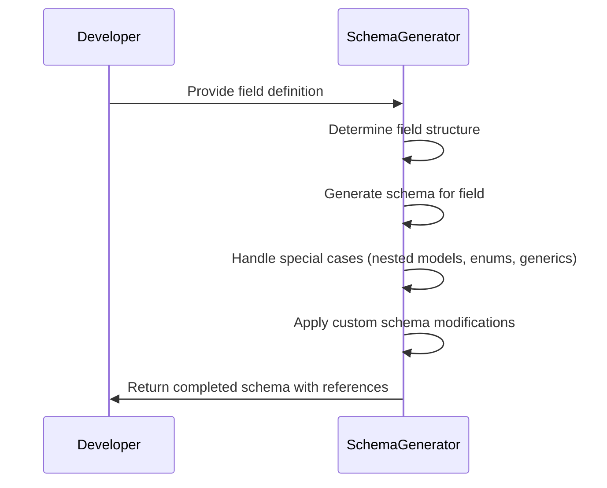
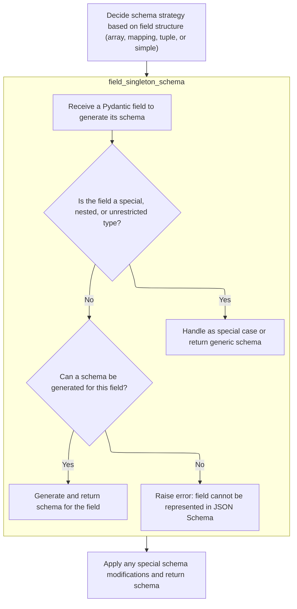
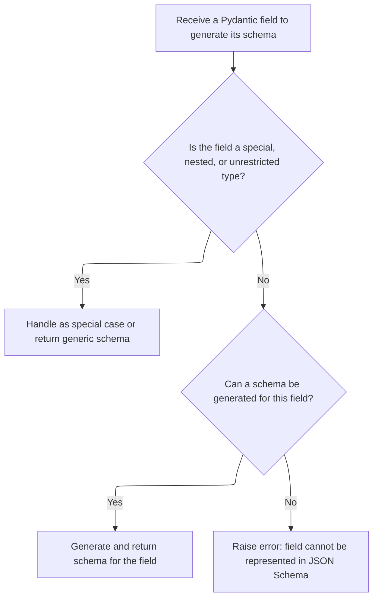
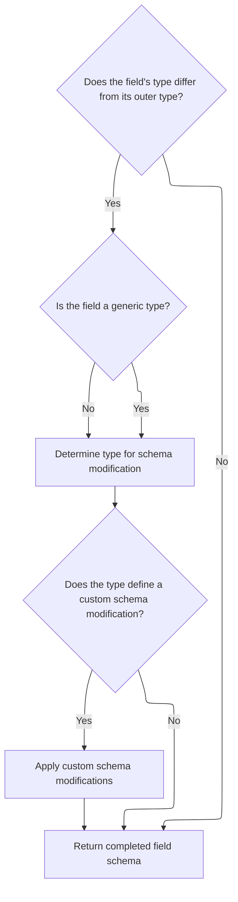

This document outlines how a JSON schema is generated for a Pydantic field. The process involves determining the field's structure, generating the appropriate schema, handling special cases like nested models and enums, applying any custom modifications, and returning the completed schema with references to nested models and additional definitions.

The main steps are:

- Identify the field's structure
- Generate the schema
- Handle special cases
- Apply custom modifications
- Return the schema and references



# Spec

## Detailed View of the Program's Functionality

a. Deciding Schema Strategy Based on Field Structure

The process begins by determining the structure of the field whose schema is to be generated. The code checks if the field is a collection (such as a list, set, tuple, etc.), a mapping (like a dictionary), a tuple or generic type, or a simple (singleton) type. This decision is crucial because each structure requires a different approach to schema generation:

- If the field is a collection (list, set, etc.), the code prepares an array schema and recursively generates the schema for the items within the collection.
- If the field is a mapping (dictionary-like), the code prepares an object schema, possibly with constraints on the keys (such as regex patterns) and recursively generates the schema for the values.
- If the field is a tuple or a generic type that is not a model, the code recursively generates schemas for each element in the tuple or generic and combines them appropriately.
- If none of the above, the field is treated as a singleton or a model, and a specialized function is called to handle its schema generation.

b. Generating Schema for the Field (<SwmToken path="pydantic/v1/schema.py" pos="462:11:11" line-data="        items_schema, f_definitions, f_nested_models = field_singleton_schema(">`field_singleton_schema`</SwmToken>)

When the field is not a collection, mapping, or tuple, the code delegates schema generation to a function designed for single types or models. This function performs several checks and actions:

- If the field contains sub-fields and is not a model (or is a constant model), it recursively generates schemas for those sub-fields.
- If the field type is extremely generic (like Any, object, or a <SwmToken path="pydantic/v1/schema.py" pos="861:25:25" line-data="    if field_type is Any or field_type is object or field_type.__class__ == TypeVar or get_origin(field_type) is type:">`TypeVar`</SwmToken>), it returns an empty schema, indicating no restrictions.
- If the field type is None, it returns a schema indicating a null type.
- If the field is a callable, it raises an error because callables cannot be represented in JSON Schema.
- If the field is a Literal type (with fixed values), it checks if all values are of the same type. If not, it splits them and delegates to a higher-level schema generator to merge the results.
- If the field is an Enum, it generates an enum schema and adds it to the definitions.
- If the field is a namedtuple, it generates an array schema with fixed items corresponding to the tuple fields.
- If the field is a basic type (like int, str, etc.), it updates the schema with <SwmToken path="pydantic/v1/schema.py" pos="806:15:17" line-data="    Update the given `schema` with the type-specific metadata for the given `field_type`.">`type-specific`</SwmToken> metadata.
- If the field is a model (<SwmToken path="pydantic/v1/schema.py" pos="448:11:11" line-data="    from pydantic.v1.main import BaseModel  # noqa: F811">`BaseModel`</SwmToken> or dataclass), it generates a reference schema and ensures the model's schema is included in the definitions, handling nested models and avoiding duplication.

c. Handling Special Cases and Errors

If the field cannot be represented in JSON Schema (for example, if it is a generic type with no arguments or an unsupported type), the code raises an error, indicating that the field cannot be declared in the schema.

d. Finalizing and Modifying the Schema Output

After the schema for the field is generated, the code performs a final check to see if the field's type differs from its outer type (which can happen with generics or type wrappers). If so, it checks if the type defines a custom schema modification method. If such a method exists, it is called to allow the user to tweak the schema before it is returned. This ensures that any user-defined or <SwmToken path="pydantic/v1/schema.py" pos="806:15:17" line-data="    Update the given `schema` with the type-specific metadata for the given `field_type`.">`type-specific`</SwmToken> schema adjustments are applied as the last step.

e. Returning the Completed Schema

Finally, the function returns the completed schema for the field, along with any additional definitions (for <SwmToken path="pydantic/v1/schema.py" pos="446:24:26" line-data="    information as title, etc. Also return additional schema definitions, from sub-models.">`sub-models`</SwmToken> or enums) and a set of nested model names. This output is ready to be included in the overall model or application schema, ensuring that all necessary components are present and correctly referenced.

# Rule Definition

| Paragraph Name                                                                                                                                                                                                                                                                                                                                                                                                                                                                                                                                                                                                                                                                 | Rule ID | Category          | Description                                                                                                                                                                                                                                                                                                                                                                                                                                                                                                                                                                                                                                                                                                                                              | Conditions                                                                                                                                                                                                                                                                                                                                                                                                                                                                                                                                                                                                                                                                                                                                                                                                                                                                                                                                                                                                                                                                                                                                                                                                                                                                                                                                                                                                                                                                                                                                                                                                                                                           | Remarks                                                                                                                                                                                                                                                                                                                                                                                                                                                                                                                                                                                                                                                                                                                                                                                                                                                                                                                                                                                                                                                                                                                                                                                                                                                                                                                                                                                                                                                                                                                                                                                                                                                                                                                                                                                                                                                                      |
| ------------------------------------------------------------------------------------------------------------------------------------------------------------------------------------------------------------------------------------------------------------------------------------------------------------------------------------------------------------------------------------------------------------------------------------------------------------------------------------------------------------------------------------------------------------------------------------------------------------------------------------------------------------------------------ | ------- | ----------------- | -------------------------------------------------------------------------------------------------------------------------------------------------------------------------------------------------------------------------------------------------------------------------------------------------------------------------------------------------------------------------------------------------------------------------------------------------------------------------------------------------------------------------------------------------------------------------------------------------------------------------------------------------------------------------------------------------------------------------------------------------------- | -------------------------------------------------------------------------------------------------------------------------------------------------------------------------------------------------------------------------------------------------------------------------------------------------------------------------------------------------------------------------------------------------------------------------------------------------------------------------------------------------------------------------------------------------------------------------------------------------------------------------------------------------------------------------------------------------------------------------------------------------------------------------------------------------------------------------------------------------------------------------------------------------------------------------------------------------------------------------------------------------------------------------------------------------------------------------------------------------------------------------------------------------------------------------------------------------------------------------------------------------------------------------------------------------------------------------------------------------------------------------------------------------------------------------------------------------------------------------------------------------------------------------------------------------------------------------------------------------------------------------------------------------------------------- | ---------------------------------------------------------------------------------------------------------------------------------------------------------------------------------------------------------------------------------------------------------------------------------------------------------------------------------------------------------------------------------------------------------------------------------------------------------------------------------------------------------------------------------------------------------------------------------------------------------------------------------------------------------------------------------------------------------------------------------------------------------------------------------------------------------------------------------------------------------------------------------------------------------------------------------------------------------------------------------------------------------------------------------------------------------------------------------------------------------------------------------------------------------------------------------------------------------------------------------------------------------------------------------------------------------------------------------------------------------------------------------------------------------------------------------------------------------------------------------------------------------------------------------------------------------------------------------------------------------------------------------------------------------------------------------------------------------------------------------------------------------------------------------------------------------------------------------------------------------------------------- |
| <SwmToken path="pydantic/v1/schema.py" pos="432:2:2" line-data="def field_type_schema(">`field_type_schema`</SwmToken>, <SwmToken path="pydantic/v1/schema.py" pos="462:11:11" line-data="        items_schema, f_definitions, f_nested_models = field_singleton_schema(">`field_singleton_schema`</SwmToken>                                                                                                                                                                                                                                                                                                                                                                  | RL-001  | Conditional Logic | The schema generation strategy for a field is determined by its shape. If the shape indicates an array-like structure, the schema must represent an array. If mapping-like, the schema must represent an object. If tuple or tuple-ellipsis, the schema must represent a tuple. Otherwise, singleton schema logic is used.                                                                                                                                                                                                                                                                                                                                                                                                                               | The field's shape attribute is checked against constants: <SwmToken path="pydantic/v1/schema.py" pos="454:1:1" line-data="        SHAPE_LIST,">`SHAPE_LIST`</SwmToken>, <SwmToken path="pydantic/v1/schema.py" pos="457:1:1" line-data="        SHAPE_SET,">`SHAPE_SET`</SwmToken>, <SwmToken path="pydantic/v1/schema.py" pos="458:1:1" line-data="        SHAPE_FROZENSET,">`SHAPE_FROZENSET`</SwmToken>, <SwmToken path="pydantic/v1/schema.py" pos="456:1:1" line-data="        SHAPE_SEQUENCE,">`SHAPE_SEQUENCE`</SwmToken>, <SwmToken path="pydantic/v1/schema.py" pos="460:1:1" line-data="        SHAPE_DEQUE,">`SHAPE_DEQUE`</SwmToken>, <SwmToken path="pydantic/v1/schema.py" pos="459:1:1" line-data="        SHAPE_ITERABLE,">`SHAPE_ITERABLE`</SwmToken>, <SwmToken path="pydantic/v1/schema.py" pos="476:9:9" line-data="    elif field.shape in MAPPING_LIKE_SHAPES:">`MAPPING_LIKE_SHAPES`</SwmToken>, <SwmToken path="pydantic/v1/schema.py" pos="497:9:9" line-data="    elif field.shape == SHAPE_TUPLE or (field.shape == SHAPE_GENERIC and not issubclass(field.type_, BaseModel)):">`SHAPE_TUPLE`</SwmToken>, <SwmToken path="pydantic/v1/schema.py" pos="455:1:1" line-data="        SHAPE_TUPLE_ELLIPSIS,">`SHAPE_TUPLE_ELLIPSIS`</SwmToken>, <SwmToken path="pydantic/v1/schema.py" pos="526:10:10" line-data="        assert field.shape in {SHAPE_SINGLETON, SHAPE_GENERIC}, field.shape">`SHAPE_SINGLETON`</SwmToken>, <SwmToken path="pydantic/v1/schema.py" pos="497:20:20" line-data="    elif field.shape == SHAPE_TUPLE or (field.shape == SHAPE_GENERIC and not issubclass(field.type_, BaseModel)):">`SHAPE_GENERIC`</SwmToken>. | Constants: <SwmToken path="pydantic/v1/schema.py" pos="454:1:1" line-data="        SHAPE_LIST,">`SHAPE_LIST`</SwmToken>, <SwmToken path="pydantic/v1/schema.py" pos="457:1:1" line-data="        SHAPE_SET,">`SHAPE_SET`</SwmToken>, <SwmToken path="pydantic/v1/schema.py" pos="458:1:1" line-data="        SHAPE_FROZENSET,">`SHAPE_FROZENSET`</SwmToken>, <SwmToken path="pydantic/v1/schema.py" pos="456:1:1" line-data="        SHAPE_SEQUENCE,">`SHAPE_SEQUENCE`</SwmToken>, <SwmToken path="pydantic/v1/schema.py" pos="460:1:1" line-data="        SHAPE_DEQUE,">`SHAPE_DEQUE`</SwmToken>, <SwmToken path="pydantic/v1/schema.py" pos="459:1:1" line-data="        SHAPE_ITERABLE,">`SHAPE_ITERABLE`</SwmToken>, <SwmToken path="pydantic/v1/schema.py" pos="476:9:9" line-data="    elif field.shape in MAPPING_LIKE_SHAPES:">`MAPPING_LIKE_SHAPES`</SwmToken>, <SwmToken path="pydantic/v1/schema.py" pos="497:9:9" line-data="    elif field.shape == SHAPE_TUPLE or (field.shape == SHAPE_GENERIC and not issubclass(field.type_, BaseModel)):">`SHAPE_TUPLE`</SwmToken>, <SwmToken path="pydantic/v1/schema.py" pos="455:1:1" line-data="        SHAPE_TUPLE_ELLIPSIS,">`SHAPE_TUPLE_ELLIPSIS`</SwmToken>, <SwmToken path="pydantic/v1/schema.py" pos="526:10:10" line-data="        assert field.shape in {SHAPE_SINGLETON, SHAPE_GENERIC}, field.shape">`SHAPE_SINGLETON`</SwmToken>, <SwmToken path="pydantic/v1/schema.py" pos="497:20:20" line-data="    elif field.shape == SHAPE_TUPLE or (field.shape == SHAPE_GENERIC and not issubclass(field.type_, BaseModel)):">`SHAPE_GENERIC`</SwmToken>. Output format: JSON Schema dictionary with 'type', 'items', 'properties', <SwmToken path="pydantic/v1/schema.py" pos="496:4:4" line-data="            f_schema[&#39;additionalProperties&#39;] = items_schema">`additionalProperties`</SwmToken>, etc. |
| <SwmToken path="pydantic/v1/schema.py" pos="462:11:11" line-data="        items_schema, f_definitions, f_nested_models = field_singleton_schema(">`field_singleton_schema`</SwmToken>                                                                                                                                                                                                                                                                                                                                                                                                                                                                                          | RL-002  | Conditional Logic | When generating a schema for a singleton field, special handling is required for certain types: Any/object/TypeVar/type, NoneType, Callable, Literal, Enum, NamedTuple, non-Pydantic types, Pydantic models, generics with no args, and unrepresentable types.                                                                                                                                                                                                                                                                                                                                                                                                                                                                                           | The field's type\_ is checked for being Any, object, <SwmToken path="pydantic/v1/schema.py" pos="861:25:25" line-data="    if field_type is Any or field_type is object or field_type.__class__ == TypeVar or get_origin(field_type) is type:">`TypeVar`</SwmToken>, type, NoneType, Callable, Literal, Enum, NamedTuple, Pydantic model, or generic with no args.                                                                                                                                                                                                                                                                                                                                                                                                                                                                                                                                                                                                                                                                                                                                                                                                                                                                                                                                                                                                                                                                                                                                                                                                                                                                                                   | Output format: JSON Schema dictionary, possibly empty or with 'type': 'null', 'enum', '$ref', etc. Detection uses utility functions: <SwmToken path="pydantic/v1/schema.py" pos="850:19:19" line-data="        (field.field_info and field.field_info.const) or not lenient_issubclass(field_type, BaseModel)">`lenient_issubclass`</SwmToken>, <SwmToken path="pydantic/v1/schema.py" pos="871:3:3" line-data="    if is_literal_type(field_type):">`is_literal_type`</SwmToken>, <SwmToken path="pydantic/v1/schema.py" pos="863:3:3" line-data="    if is_none_type(field_type):">`is_none_type`</SwmToken>, <SwmToken path="pydantic/v1/schema.py" pos="865:3:3" line-data="    if is_callable_type(field_type):">`is_callable_type`</SwmToken>, <SwmToken path="pydantic/v1/schema.py" pos="893:3:3" line-data="    elif is_namedtuple(field_type):">`is_namedtuple`</SwmToken>, <SwmToken path="pydantic/v1/schema.py" pos="947:5:5" line-data="    args = get_args(field_type)">`get_args`</SwmToken>, etc.                                                                                                                                                                                                                                                                                                                                                                                                                                                                                                                                                                                                                                                                                                                                                                                                                                                           |
| <SwmToken path="pydantic/v1/schema.py" pos="462:11:11" line-data="        items_schema, f_definitions, f_nested_models = field_singleton_schema(">`field_singleton_schema`</SwmToken>, <SwmToken path="pydantic/v1/schema.py" pos="894:9:9" line-data="        sub_schema, *_ = model_process_schema(">`model_process_schema`</SwmToken>, <SwmToken path="pydantic/v1/schema.py" pos="432:2:2" line-data="def field_type_schema(">`field_type_schema`</SwmToken>                                                                                                                                                                                                               | RL-003  | Conditional Logic | When a nested model or enum is encountered during schema generation, its schema must be generated recursively and added to definitions if not already present. Its name must be added to <SwmToken path="pydantic/v1/schema.py" pos="451:1:1" line-data="    nested_models: Set[str] = set()">`nested_models`</SwmToken>. If already present, only a reference is added and its name is added to <SwmToken path="pydantic/v1/schema.py" pos="451:1:1" line-data="    nested_models: Set[str] = set()">`nested_models`</SwmToken>. Circular references are handled by using references instead of recursion.                                                                                                                                              | A nested model or enum is encountered during schema generation, and its schema is not already present in definitions or <SwmToken path="pydantic/v1/schema.py" pos="440:1:1" line-data="    known_models: TypeModelSet,">`known_models`</SwmToken>.                                                                                                                                                                                                                                                                                                                                                                                                                                                                                                                                                                                                                                                                                                                                                                                                                                                                                                                                                                                                                                                                                                                                                                                                                                                                                                                                                                                                                  | Definitions: dictionary mapping model/enum names to their schema definitions. Nested_models: set of referenced model names. Output format: JSON Schema references using '$ref' or <SwmToken path="pydantic/v1/schema.py" pos="516:7:7" line-data="            f_schema = {&#39;allOf&#39;: [all_of_schemas]}">`allOf`</SwmToken>.                                                                                                                                                                                                                                                                                                                                                                                                                                                                                                                                                                                                                                                                                                                                                                                                                                                                                                                                                                                                                                                                                                                                                                                                                                                                                                                                                                                                                                                                                                                                            |
| <SwmToken path="pydantic/v1/schema.py" pos="890:8:8" line-data="        f_schema, schema_overrides = get_field_info_schema(field, schema_overrides)">`get_field_info_schema`</SwmToken>, <SwmToken path="pydantic/v1/schema.py" pos="250:5:5" line-data="    validation_schema = get_field_schema_validations(field)">`get_field_schema_validations`</SwmToken>, <SwmToken path="pydantic/v1/schema.py" pos="432:2:2" line-data="def field_type_schema(">`field_type_schema`</SwmToken>, <SwmToken path="pydantic/v1/schema.py" pos="462:11:11" line-data="        items_schema, f_definitions, f_nested_models = field_singleton_schema(">`field_singleton_schema`</SwmToken> | RL-004  | Data Assignment   | After the base schema is generated for a field, field metadata (title, description, default, etc.) and any <SwmToken path="pydantic/v1/schema.py" pos="545:1:1" line-data="        modify_schema = getattr(field_type, &#39;__modify_schema__&#39;, None)">`modify_schema`</SwmToken> hooks defined on the field's type or <SwmToken path="pydantic/v1/schema.py" pos="540:11:11" line-data="    if field.type_ != field.outer_type_:">`outer_type_`</SwmToken> must be applied. The <SwmToken path="pydantic/v1/schema.py" pos="545:1:1" line-data="        modify_schema = getattr(field_type, &#39;__modify_schema__&#39;, None)">`modify_schema`</SwmToken> method may mutate the schema in place; its return value is ignored.                      | After generating the base schema for a field, check for field metadata and presence of <SwmToken path="pydantic/v1/schema.py" pos="545:1:1" line-data="        modify_schema = getattr(field_type, &#39;__modify_schema__&#39;, None)">`modify_schema`</SwmToken> on type or <SwmToken path="pydantic/v1/schema.py" pos="540:11:11" line-data="    if field.type_ != field.outer_type_:">`outer_type_`</SwmToken>.                                                                                                                                                                                                                                                                                                                                                                                                                                                                                                                                                                                                                                                                                                                                                                                                                                                                                                                                                                                                                                                                                                                                                                                                                                                   | Field metadata: title, description, default, etc. <SwmToken path="pydantic/v1/schema.py" pos="545:1:1" line-data="        modify_schema = getattr(field_type, &#39;__modify_schema__&#39;, None)">`modify_schema`</SwmToken> is a method that may accept the schema and field as arguments. The schema dictionary is mutated in place.                                                                                                                                                                                                                                                                                                                                                                                                                                                                                                                                                                                                                                                                                                                                                                                                                                                                                                                                                                                                                                                                                                                                                                                                                                                                                                                                                                                                                                                                                                                                       |
| <SwmToken path="pydantic/v1/schema.py" pos="443:6:6" line-data="    Used by ``field_schema()``, you probably should be using that function.">`field_schema`</SwmToken>, <SwmToken path="pydantic/v1/schema.py" pos="432:2:2" line-data="def field_type_schema(">`field_type_schema`</SwmToken>, <SwmToken path="pydantic/v1/schema.py" pos="462:11:11" line-data="        items_schema, f_definitions, f_nested_models = field_singleton_schema(">`field_singleton_schema`</SwmToken>, <SwmToken path="pydantic/v1/schema.py" pos="894:9:9" line-data="        sub_schema, *_ = model_process_schema(">`model_process_schema`</SwmToken>                                       | RL-005  | Data Assignment   | The final output of schema generation for a field is a tuple (schema, definitions, <SwmToken path="pydantic/v1/schema.py" pos="451:1:1" line-data="    nested_models: Set[str] = set()">`nested_models`</SwmToken>), where schema is the JSON Schema dictionary for the field, definitions is the dictionary of referenced model/enum schemas, and <SwmToken path="pydantic/v1/schema.py" pos="451:1:1" line-data="    nested_models: Set[str] = set()">`nested_models`</SwmToken> is the set of referenced model names. At each recursive step, definitions and <SwmToken path="pydantic/v1/schema.py" pos="451:1:1" line-data="    nested_models: Set[str] = set()">`nested_models`</SwmToken> from sub-calls must be merged into the current context. | After generating schema for a field and any nested models/enums.                                                                                                                                                                                                                                                                                                                                                                                                                                                                                                                                                                                                                                                                                                                                                                                                                                                                                                                                                                                                                                                                                                                                                                                                                                                                                                                                                                                                                                                                                                                                                                                                     | Output format: (schema: dict, definitions: dict, <SwmToken path="pydantic/v1/schema.py" pos="451:1:1" line-data="    nested_models: Set[str] = set()">`nested_models`</SwmToken>: set of strings). Merging is done by updating dictionaries and sets.                                                                                                                                                                                                                                                                                                                                                                                                                                                                                                                                                                                                                                                                                                                                                                                                                                                                                                                                                                                                                                                                                                                                                                                                                                                                                                                                                                                                                                                                                                                                                                                                                        |

# User Stories

## User Story 1: Generate schema based on field shape and type

---

### Story Description:

As a system, I want to generate a JSON Schema for a field based on its shape and type so that the schema accurately represents arrays, objects, tuples, or singleton types according to the field's structure and Python type.

---

### Business Rule Mapping:

| Rule ID | Paragraph Name                                                                                                                                                                                                                                                                                                | Rule Description                                                                                                                                                                                                                                                                                                           |
| ------- | ------------------------------------------------------------------------------------------------------------------------------------------------------------------------------------------------------------------------------------------------------------------------------------------------------------- | -------------------------------------------------------------------------------------------------------------------------------------------------------------------------------------------------------------------------------------------------------------------------------------------------------------------------- |
| RL-001  | <SwmToken path="pydantic/v1/schema.py" pos="432:2:2" line-data="def field_type_schema(">`field_type_schema`</SwmToken>, <SwmToken path="pydantic/v1/schema.py" pos="462:11:11" line-data="        items_schema, f_definitions, f_nested_models = field_singleton_schema(">`field_singleton_schema`</SwmToken> | The schema generation strategy for a field is determined by its shape. If the shape indicates an array-like structure, the schema must represent an array. If mapping-like, the schema must represent an object. If tuple or tuple-ellipsis, the schema must represent a tuple. Otherwise, singleton schema logic is used. |
| RL-002  | <SwmToken path="pydantic/v1/schema.py" pos="462:11:11" line-data="        items_schema, f_definitions, f_nested_models = field_singleton_schema(">`field_singleton_schema`</SwmToken>                                                                                                                         | When generating a schema for a singleton field, special handling is required for certain types: Any/object/TypeVar/type, NoneType, Callable, Literal, Enum, NamedTuple, non-Pydantic types, Pydantic models, generics with no args, and unrepresentable types.                                                             |

---

### Relevant Functionality:

- <SwmToken path="pydantic/v1/schema.py" pos="432:2:2" line-data="def field_type_schema(">`field_type_schema`</SwmToken>
  1. **RL-001:**
     - If <SwmToken path="pydantic/v1/schema.py" pos="453:3:5" line-data="    if field.shape in {">`field.shape`</SwmToken> is in array-like constants:
       - Generate schema with 'type': 'array' and 'items' from <SwmToken path="pydantic/v1/schema.py" pos="499:1:1" line-data="        sub_fields = cast(List[ModelField], field.sub_fields)">`sub_fields`</SwmToken>.
     - If <SwmToken path="pydantic/v1/schema.py" pos="453:3:5" line-data="    if field.shape in {">`field.shape`</SwmToken> is in <SwmToken path="pydantic/v1/schema.py" pos="476:9:9" line-data="    elif field.shape in MAPPING_LIKE_SHAPES:">`MAPPING_LIKE_SHAPES`</SwmToken>:
       - Generate schema with 'type': 'object', <SwmToken path="pydantic/v1/schema.py" pos="496:4:4" line-data="            f_schema[&#39;additionalProperties&#39;] = items_schema">`additionalProperties`</SwmToken> from value <SwmToken path="pydantic/v1/schema.py" pos="719:6:6" line-data="            for discriminator_value, sub_field in field.sub_fields_mapping.items():">`sub_field`</SwmToken>, and 'propertyNames' or 'properties' as needed.
     - If <SwmToken path="pydantic/v1/schema.py" pos="453:3:5" line-data="    if field.shape in {">`field.shape`</SwmToken> is <SwmToken path="pydantic/v1/schema.py" pos="497:9:9" line-data="    elif field.shape == SHAPE_TUPLE or (field.shape == SHAPE_GENERIC and not issubclass(field.type_, BaseModel)):">`SHAPE_TUPLE`</SwmToken> or <SwmToken path="pydantic/v1/schema.py" pos="455:1:1" line-data="        SHAPE_TUPLE_ELLIPSIS,">`SHAPE_TUPLE_ELLIPSIS`</SwmToken>:
       - Generate schema with 'type': 'array', 'items' as list of <SwmToken path="pydantic/v1/schema.py" pos="719:6:6" line-data="            for discriminator_value, sub_field in field.sub_fields_mapping.items():">`sub_field`</SwmToken> schemas (fixed-length) or single schema and 'additionalItems' (variable-length).
     - If <SwmToken path="pydantic/v1/schema.py" pos="453:3:5" line-data="    if field.shape in {">`field.shape`</SwmToken> is <SwmToken path="pydantic/v1/schema.py" pos="526:10:10" line-data="        assert field.shape in {SHAPE_SINGLETON, SHAPE_GENERIC}, field.shape">`SHAPE_SINGLETON`</SwmToken> or <SwmToken path="pydantic/v1/schema.py" pos="497:20:20" line-data="    elif field.shape == SHAPE_TUPLE or (field.shape == SHAPE_GENERIC and not issubclass(field.type_, BaseModel)):">`SHAPE_GENERIC`</SwmToken>:
       - Delegate to singleton schema logic.
- <SwmToken path="pydantic/v1/schema.py" pos="462:11:11" line-data="        items_schema, f_definitions, f_nested_models = field_singleton_schema(">`field_singleton_schema`</SwmToken>
  1. **RL-002:**
     - If field has <SwmToken path="pydantic/v1/schema.py" pos="499:1:1" line-data="        sub_fields = cast(List[ModelField], field.sub_fields)">`sub_fields`</SwmToken> and is const or not a Pydantic model:
       - Recursively handle <SwmToken path="pydantic/v1/schema.py" pos="499:1:1" line-data="        sub_fields = cast(List[ModelField], field.sub_fields)">`sub_fields`</SwmToken> (<SwmToken path="pydantic/v1/schema.py" pos="128:4:6" line-data="      else, e.g. for OpenAPI use ``#/components/schemas/``. The resulting generated schemas will still be at the">`e.g`</SwmToken>., for Union, Literal, generics).
     - If type is Any, object, <SwmToken path="pydantic/v1/schema.py" pos="861:25:25" line-data="    if field_type is Any or field_type is object or field_type.__class__ == TypeVar or get_origin(field_type) is type:">`TypeVar`</SwmToken>, or type:
       - Return empty schema (no restrictions).
     - If type is NoneType:
       - Return {'type': 'null'}.
     - If type is Callable:
       - Raise error (cannot represent in JSON Schema).
     - If type is Literal:
       - Generate enum schema of literal values; if mixed types, merge type info.
     - If type is Enum:
       - Reference enum definition and add to definitions.
     - If type is NamedTuple:
       - Generate array schema with items for each field.
     - If not a Pydantic model:
       - Use mapping of standard types to JSON Schema types; apply custom schema modifications if present.
     - If Pydantic model:
       - Reference model definition and add to definitions if not present.
     - If generic with no args:
       - Return schema as-is.
     - If none apply:
       - Raise error (cannot represent in JSON Schema).

## User Story 2: Assemble complete schema output with recursive processing, metadata, and merging

---

### Story Description:

As a system, I want to recursively generate and reference schemas for nested models and enums, apply field metadata and custom schema modifications, and return the final schema output with merged definitions and nested models so that the output is complete, non-duplicative, and reflects all customizations and references.

---

### Business Rule Mapping:

| Rule ID | Paragraph Name                                                                                                                                                                                                                                                                                                                                                                                                                                                                                                                                                                                                                                                                 | Rule Description                                                                                                                                                                                                                                                                                                                                                                                                                                                                                                                                                                                                                                                                                                                                         |
| ------- | ------------------------------------------------------------------------------------------------------------------------------------------------------------------------------------------------------------------------------------------------------------------------------------------------------------------------------------------------------------------------------------------------------------------------------------------------------------------------------------------------------------------------------------------------------------------------------------------------------------------------------------------------------------------------------ | -------------------------------------------------------------------------------------------------------------------------------------------------------------------------------------------------------------------------------------------------------------------------------------------------------------------------------------------------------------------------------------------------------------------------------------------------------------------------------------------------------------------------------------------------------------------------------------------------------------------------------------------------------------------------------------------------------------------------------------------------------- |
| RL-003  | <SwmToken path="pydantic/v1/schema.py" pos="462:11:11" line-data="        items_schema, f_definitions, f_nested_models = field_singleton_schema(">`field_singleton_schema`</SwmToken>, <SwmToken path="pydantic/v1/schema.py" pos="894:9:9" line-data="        sub_schema, *_ = model_process_schema(">`model_process_schema`</SwmToken>, <SwmToken path="pydantic/v1/schema.py" pos="432:2:2" line-data="def field_type_schema(">`field_type_schema`</SwmToken>                                                                                                                                                                                                               | When a nested model or enum is encountered during schema generation, its schema must be generated recursively and added to definitions if not already present. Its name must be added to <SwmToken path="pydantic/v1/schema.py" pos="451:1:1" line-data="    nested_models: Set[str] = set()">`nested_models`</SwmToken>. If already present, only a reference is added and its name is added to <SwmToken path="pydantic/v1/schema.py" pos="451:1:1" line-data="    nested_models: Set[str] = set()">`nested_models`</SwmToken>. Circular references are handled by using references instead of recursion.                                                                                                                                              |
| RL-004  | <SwmToken path="pydantic/v1/schema.py" pos="890:8:8" line-data="        f_schema, schema_overrides = get_field_info_schema(field, schema_overrides)">`get_field_info_schema`</SwmToken>, <SwmToken path="pydantic/v1/schema.py" pos="250:5:5" line-data="    validation_schema = get_field_schema_validations(field)">`get_field_schema_validations`</SwmToken>, <SwmToken path="pydantic/v1/schema.py" pos="432:2:2" line-data="def field_type_schema(">`field_type_schema`</SwmToken>, <SwmToken path="pydantic/v1/schema.py" pos="462:11:11" line-data="        items_schema, f_definitions, f_nested_models = field_singleton_schema(">`field_singleton_schema`</SwmToken> | After the base schema is generated for a field, field metadata (title, description, default, etc.) and any <SwmToken path="pydantic/v1/schema.py" pos="545:1:1" line-data="        modify_schema = getattr(field_type, &#39;__modify_schema__&#39;, None)">`modify_schema`</SwmToken> hooks defined on the field's type or <SwmToken path="pydantic/v1/schema.py" pos="540:11:11" line-data="    if field.type_ != field.outer_type_:">`outer_type_`</SwmToken> must be applied. The <SwmToken path="pydantic/v1/schema.py" pos="545:1:1" line-data="        modify_schema = getattr(field_type, &#39;__modify_schema__&#39;, None)">`modify_schema`</SwmToken> method may mutate the schema in place; its return value is ignored.                      |
| RL-005  | <SwmToken path="pydantic/v1/schema.py" pos="443:6:6" line-data="    Used by ``field_schema()``, you probably should be using that function.">`field_schema`</SwmToken>, <SwmToken path="pydantic/v1/schema.py" pos="432:2:2" line-data="def field_type_schema(">`field_type_schema`</SwmToken>, <SwmToken path="pydantic/v1/schema.py" pos="462:11:11" line-data="        items_schema, f_definitions, f_nested_models = field_singleton_schema(">`field_singleton_schema`</SwmToken>, <SwmToken path="pydantic/v1/schema.py" pos="894:9:9" line-data="        sub_schema, *_ = model_process_schema(">`model_process_schema`</SwmToken>                                       | The final output of schema generation for a field is a tuple (schema, definitions, <SwmToken path="pydantic/v1/schema.py" pos="451:1:1" line-data="    nested_models: Set[str] = set()">`nested_models`</SwmToken>), where schema is the JSON Schema dictionary for the field, definitions is the dictionary of referenced model/enum schemas, and <SwmToken path="pydantic/v1/schema.py" pos="451:1:1" line-data="    nested_models: Set[str] = set()">`nested_models`</SwmToken> is the set of referenced model names. At each recursive step, definitions and <SwmToken path="pydantic/v1/schema.py" pos="451:1:1" line-data="    nested_models: Set[str] = set()">`nested_models`</SwmToken> from sub-calls must be merged into the current context. |

---

### Relevant Functionality:

- <SwmToken path="pydantic/v1/schema.py" pos="462:11:11" line-data="        items_schema, f_definitions, f_nested_models = field_singleton_schema(">`field_singleton_schema`</SwmToken>
  1. **RL-003:**
     - If nested model/enum schema not in definitions:
       - Generate schema recursively and add to definitions under unique name.
       - Add name to <SwmToken path="pydantic/v1/schema.py" pos="451:1:1" line-data="    nested_models: Set[str] = set()">`nested_models`</SwmToken>.
     - If schema already present (in <SwmToken path="pydantic/v1/schema.py" pos="440:1:1" line-data="    known_models: TypeModelSet,">`known_models`</SwmToken>):
       - Add only reference and add name to <SwmToken path="pydantic/v1/schema.py" pos="451:1:1" line-data="    nested_models: Set[str] = set()">`nested_models`</SwmToken>.
     - Merge definitions and <SwmToken path="pydantic/v1/schema.py" pos="451:1:1" line-data="    nested_models: Set[str] = set()">`nested_models`</SwmToken> from recursive calls into current context.
     - Use references ('$ref') to avoid circular recursion.
- <SwmToken path="pydantic/v1/schema.py" pos="890:8:8" line-data="        f_schema, schema_overrides = get_field_info_schema(field, schema_overrides)">`get_field_info_schema`</SwmToken>
  1. **RL-004:**
     - Generate base schema for field.
     - If <SwmToken path="pydantic/v1/schema.py" pos="850:2:4" line-data="        (field.field_info and field.field_info.const) or not lenient_issubclass(field_type, BaseModel)">`field.field_info`</SwmToken> has title, description, default, etc., add to schema.
     - If <SwmToken path="pydantic/v1/schema.py" pos="497:28:30" line-data="    elif field.shape == SHAPE_TUPLE or (field.shape == SHAPE_GENERIC and not issubclass(field.type_, BaseModel)):">`field.type_`</SwmToken> or <SwmToken path="pydantic/v1/schema.py" pos="540:9:11" line-data="    if field.type_ != field.outer_type_:">`field.outer_type_`</SwmToken> has <SwmToken path="pydantic/v1/schema.py" pos="545:1:1" line-data="        modify_schema = getattr(field_type, &#39;__modify_schema__&#39;, None)">`modify_schema`</SwmToken>:
       - Call <SwmToken path="pydantic/v1/schema.py" pos="545:1:1" line-data="        modify_schema = getattr(field_type, &#39;__modify_schema__&#39;, None)">`modify_schema`</SwmToken>(schema, field=field) if signature accepts field, else <SwmToken path="pydantic/v1/schema.py" pos="545:1:1" line-data="        modify_schema = getattr(field_type, &#39;__modify_schema__&#39;, None)">`modify_schema`</SwmToken>(schema).
     - Ignore return value; use mutated schema.
- <SwmToken path="pydantic/v1/schema.py" pos="443:6:6" line-data="    Used by ``field_schema()``, you probably should be using that function.">`field_schema`</SwmToken>
  1. **RL-005:**
     - For each recursive schema generation call:
       - Merge returned definitions into current definitions.
       - Merge returned <SwmToken path="pydantic/v1/schema.py" pos="451:1:1" line-data="    nested_models: Set[str] = set()">`nested_models`</SwmToken> into current <SwmToken path="pydantic/v1/schema.py" pos="451:1:1" line-data="    nested_models: Set[str] = set()">`nested_models`</SwmToken>.
     - Return tuple (schema, definitions, <SwmToken path="pydantic/v1/schema.py" pos="451:1:1" line-data="    nested_models: Set[str] = set()">`nested_models`</SwmToken>) as final output.

# Code Walkthrough

## Branching on Field Shape to Build Schemas



<SwmSnippet path="/pydantic/v1/schema.py" line="432">

---

In <SwmToken path="pydantic/v1/schema.py" pos="432:2:2" line-data="def field_type_schema(">`field_type_schema`</SwmToken>, we start by branching on the field's shape to decide how to build the schema: collections get array schemas, mappings get object schemas, tuples and generics are handled recursively, and singletons or models fall through to <SwmToken path="pydantic/v1/schema.py" pos="462:11:11" line-data="        items_schema, f_definitions, f_nested_models = field_singleton_schema(">`field_singleton_schema`</SwmToken>. This setup is what lets Pydantic generate the right JSON schema for any field, and it keeps track of extra definitions and nested models as it goes.

```python
def field_type_schema(
    field: ModelField,
    *,
    by_alias: bool,
    model_name_map: Dict[TypeModelOrEnum, str],
    ref_template: str,
    schema_overrides: bool = False,
    ref_prefix: Optional[str] = None,
    known_models: TypeModelSet,
) -> Tuple[Dict[str, Any], Dict[str, Any], Set[str]]:
    """
    Used by ``field_schema()``, you probably should be using that function.

    Take a single ``field`` and generate the schema for its type only, not including additional
    information as title, etc. Also return additional schema definitions, from sub-models.
    """
    from pydantic.v1.main import BaseModel  # noqa: F811

    definitions = {}
    nested_models: Set[str] = set()
    f_schema: Dict[str, Any]
    if field.shape in {
        SHAPE_LIST,
        SHAPE_TUPLE_ELLIPSIS,
        SHAPE_SEQUENCE,
        SHAPE_SET,
        SHAPE_FROZENSET,
        SHAPE_ITERABLE,
        SHAPE_DEQUE,
    }:
        items_schema, f_definitions, f_nested_models = field_singleton_schema(
            field,
            by_alias=by_alias,
            model_name_map=model_name_map,
            ref_prefix=ref_prefix,
            ref_template=ref_template,
            known_models=known_models,
        )
        definitions.update(f_definitions)
        nested_models.update(f_nested_models)
        f_schema = {'type': 'array', 'items': items_schema}
        if field.shape in {SHAPE_SET, SHAPE_FROZENSET}:
            f_schema['uniqueItems'] = True

    elif field.shape in MAPPING_LIKE_SHAPES:
        f_schema = {'type': 'object'}
        key_field = cast(ModelField, field.key_field)
        regex = getattr(key_field.type_, 'regex', None)
        items_schema, f_definitions, f_nested_models = field_singleton_schema(
            field,
            by_alias=by_alias,
            model_name_map=model_name_map,
            ref_prefix=ref_prefix,
            ref_template=ref_template,
            known_models=known_models,
        )
        definitions.update(f_definitions)
        nested_models.update(f_nested_models)
        if regex:
            # Dict keys have a regex pattern
            # items_schema might be a schema or empty dict, add it either way
            f_schema['patternProperties'] = {ConstrainedStr._get_pattern(regex): items_schema}
        if items_schema:
            # The dict values are not simply Any, so they need a schema
            f_schema['additionalProperties'] = items_schema
    elif field.shape == SHAPE_TUPLE or (field.shape == SHAPE_GENERIC and not issubclass(field.type_, BaseModel)):
        sub_schema = []
        sub_fields = cast(List[ModelField], field.sub_fields)
        for sf in sub_fields:
            sf_schema, sf_definitions, sf_nested_models = field_type_schema(
                sf,
                by_alias=by_alias,
                model_name_map=model_name_map,
                ref_prefix=ref_prefix,
                ref_template=ref_template,
                known_models=known_models,
            )
            definitions.update(sf_definitions)
            nested_models.update(sf_nested_models)
            sub_schema.append(sf_schema)
```

---

</SwmSnippet>

<SwmSnippet path="/pydantic/v1/schema.py" line="511">

---

After handling collections, mappings, and tuples, we hit the case for singletons and generic models. Here, we call <SwmToken path="pydantic/v1/schema.py" pos="527:11:11" line-data="        f_schema, f_definitions, f_nested_models = field_singleton_schema(">`field_singleton_schema`</SwmToken> to generate the schema for these types, since it knows how to handle references, enums, and other special cases that don't fit the earlier branches.

```python
            sub_schema.append(sf_schema)

        sub_fields_len = len(sub_fields)
        if field.shape == SHAPE_GENERIC:
            all_of_schemas = sub_schema[0] if sub_fields_len == 1 else {'type': 'array', 'items': sub_schema}
            f_schema = {'allOf': [all_of_schemas]}
        else:
            f_schema = {
                'type': 'array',
                'minItems': sub_fields_len,
                'maxItems': sub_fields_len,
            }
            if sub_fields_len >= 1:
                f_schema['items'] = sub_schema
    else:
        assert field.shape in {SHAPE_SINGLETON, SHAPE_GENERIC}, field.shape
        f_schema, f_definitions, f_nested_models = field_singleton_schema(
            field,
            by_alias=by_alias,
            model_name_map=model_name_map,
            schema_overrides=schema_overrides,
            ref_prefix=ref_prefix,
            ref_template=ref_template,
            known_models=known_models,
        )
```

---

</SwmSnippet>

### Schema Generation for Single Types



<SwmSnippet path="/pydantic/v1/schema.py" line="826">

---

In <SwmToken path="pydantic/v1/schema.py" pos="826:2:2" line-data="def field_singleton_schema(  # noqa: C901 (ignore complexity)">`field_singleton_schema`</SwmToken>, we call <SwmToken path="pydantic/v1/schema.py" pos="837:14:14" line-data="    This function is indirectly used by ``field_schema()``, you should probably be using that function.">`field_schema`</SwmToken> for Literals with mixed types to let it handle the schema merging.

```python
def field_singleton_schema(  # noqa: C901 (ignore complexity)
    field: ModelField,
    *,
    by_alias: bool,
    model_name_map: Dict[TypeModelOrEnum, str],
    ref_template: str,
    schema_overrides: bool = False,
    ref_prefix: Optional[str] = None,
    known_models: TypeModelSet,
) -> Tuple[Dict[str, Any], Dict[str, Any], Set[str]]:
    """
    This function is indirectly used by ``field_schema()``, you should probably be using that function.

    Take a single Pydantic ``ModelField``, and return its schema and any additional definitions from sub-models.
    """
    from pydantic.v1.main import BaseModel

    definitions: Dict[str, Any] = {}
    nested_models: Set[str] = set()
    field_type = field.type_

    # Recurse into this field if it contains sub_fields and is NOT a
    # BaseModel OR that BaseModel is a const
    if field.sub_fields and (
        (field.field_info and field.field_info.const) or not lenient_issubclass(field_type, BaseModel)
    ):
        return field_singleton_sub_fields_schema(
            field,
            by_alias=by_alias,
            model_name_map=model_name_map,
            schema_overrides=schema_overrides,
            ref_prefix=ref_prefix,
            ref_template=ref_template,
            known_models=known_models,
        )
    if field_type is Any or field_type is object or field_type.__class__ == TypeVar or get_origin(field_type) is type:
        return {}, definitions, nested_models  # no restrictions
    if is_none_type(field_type):
        return {'type': 'null'}, definitions, nested_models
    if is_callable_type(field_type):
        raise SkipField(f'Callable {field.name} was excluded from schema since JSON schema has no equivalent type.')
    f_schema: Dict[str, Any] = {}
    if field.field_info is not None and field.field_info.const:
        f_schema['const'] = field.default

    if is_literal_type(field_type):
        values = tuple(x.value if isinstance(x, Enum) else x for x in all_literal_values(field_type))

        if len({v.__class__ for v in values}) > 1:
            return field_schema(
                multitypes_literal_field_for_schema(values, field),
                by_alias=by_alias,
                model_name_map=model_name_map,
                ref_prefix=ref_prefix,
                ref_template=ref_template,
                known_models=known_models,
            )

```

---

</SwmSnippet>

<SwmSnippet path="/pydantic/v1/schema.py" line="884">

---

After handling enums, namedtuples, and basic types in <SwmToken path="pydantic/v1/schema.py" pos="462:11:11" line-data="        items_schema, f_definitions, f_nested_models = field_singleton_schema(">`field_singleton_schema`</SwmToken>, we check if the field is a <SwmToken path="pydantic/v1/schema.py" pos="923:19:19" line-data="    if lenient_issubclass(getattr(field_type, &#39;__pydantic_model__&#39;, None), BaseModel):">`BaseModel`</SwmToken>. If so, we call <SwmToken path="pydantic/v1/schema.py" pos="894:9:9" line-data="        sub_schema, *_ = model_process_schema(">`model_process_schema`</SwmToken> to generate the schema for the whole model, including any nested models or references. This is how we get the full structure for model fields.

```python
        # All values have the same type
        field_type = values[0].__class__
        f_schema['enum'] = list(values)
        add_field_type_to_schema(field_type, f_schema)
    elif lenient_issubclass(field_type, Enum):
        enum_name = model_name_map[field_type]
        f_schema, schema_overrides = get_field_info_schema(field, schema_overrides)
        f_schema.update(get_schema_ref(enum_name, ref_prefix, ref_template, schema_overrides))
        definitions[enum_name] = enum_process_schema(field_type, field=field)
    elif is_namedtuple(field_type):
        sub_schema, *_ = model_process_schema(
            field_type.__pydantic_model__,
            by_alias=by_alias,
            model_name_map=model_name_map,
            ref_prefix=ref_prefix,
            ref_template=ref_template,
            known_models=known_models,
            field=field,
        )
        items_schemas = list(sub_schema['properties'].values())
        f_schema.update(
            {
                'type': 'array',
                'items': items_schemas,
                'minItems': len(items_schemas),
                'maxItems': len(items_schemas),
            }
        )
    elif not hasattr(field_type, '__pydantic_model__'):
        add_field_type_to_schema(field_type, f_schema)

        modify_schema = getattr(field_type, '__modify_schema__', None)
        if modify_schema:
            _apply_modify_schema(modify_schema, field, f_schema)

    if f_schema:
        return f_schema, definitions, nested_models

    # Handle dataclass-based models
    if lenient_issubclass(getattr(field_type, '__pydantic_model__', None), BaseModel):
        field_type = field_type.__pydantic_model__

    if issubclass(field_type, BaseModel):
        model_name = model_name_map[field_type]
        if field_type not in known_models:
            sub_schema, sub_definitions, sub_nested_models = model_process_schema(
                field_type,
                by_alias=by_alias,
                model_name_map=model_name_map,
                ref_prefix=ref_prefix,
                ref_template=ref_template,
                known_models=known_models,
                field=field,
            )
```

---

</SwmSnippet>

<SwmSnippet path="/pydantic/v1/schema.py" line="938">

---

After <SwmToken path="pydantic/v1/schema.py" pos="894:9:9" line-data="        sub_schema, *_ = model_process_schema(">`model_process_schema`</SwmToken> returns in <SwmToken path="pydantic/v1/schema.py" pos="462:11:11" line-data="        items_schema, f_definitions, f_nested_models = field_singleton_schema(">`field_singleton_schema`</SwmToken>, we update the definitions and <SwmToken path="pydantic/v1/schema.py" pos="940:1:1" line-data="            nested_models.update(sub_nested_models)">`nested_models`</SwmToken>, then return a schema reference for the model. This keeps the schema output clean and avoids duplicating model definitions.

```python
            definitions.update(sub_definitions)
            definitions[model_name] = sub_schema
            nested_models.update(sub_nested_models)
        else:
            nested_models.add(model_name)
        schema_ref = get_schema_ref(model_name, ref_prefix, ref_template, schema_overrides)
        return schema_ref, definitions, nested_models

    # For generics with no args
    args = get_args(field_type)
    if args is not None and not args and Generic in field_type.__bases__:
        return f_schema, definitions, nested_models

    raise ValueError(f'Value not declarable with JSON Schema, field: {field}')
```

---

</SwmSnippet>

### Finalizing and Modifying the Schema Output



<SwmSnippet path="/pydantic/v1/schema.py" line="536">

---

After returning from <SwmToken path="pydantic/v1/schema.py" pos="462:11:11" line-data="        items_schema, f_definitions, f_nested_models = field_singleton_schema(">`field_singleton_schema`</SwmToken> in <SwmToken path="pydantic/v1/schema.py" pos="432:2:2" line-data="def field_type_schema(">`field_type_schema`</SwmToken>, we check if the field's type or outer type has a <SwmToken path="pydantic/v1/schema.py" pos="545:1:1" line-data="        modify_schema = getattr(field_type, &#39;__modify_schema__&#39;, None)">`modify_schema`</SwmToken> method. If so, we call it to let users tweak the schema before returning everything. This is the last step before outputting the schema, definitions, and nested models.

```python
        definitions.update(f_definitions)
        nested_models.update(f_nested_models)

    # check field type to avoid repeated calls to the same __modify_schema__ method
    if field.type_ != field.outer_type_:
        if field.shape == SHAPE_GENERIC:
            field_type = field.type_
        else:
            field_type = field.outer_type_
        modify_schema = getattr(field_type, '__modify_schema__', None)
        if modify_schema:
            _apply_modify_schema(modify_schema, field, f_schema)
    return f_schema, definitions, nested_models
```

---

</SwmSnippet>

&nbsp;

*This is an auto-generated document by Swimm 🌊 and has not yet been verified by a human*

<SwmMeta version="3.0.0" repo-id="Z2l0aHViJTNBJTNBcHlkYW50aWMlM0ElM0FTd2ltbS1EZW1v" repo-name="pydantic"><sup>Powered by [Swimm](/)</sup></SwmMeta>
