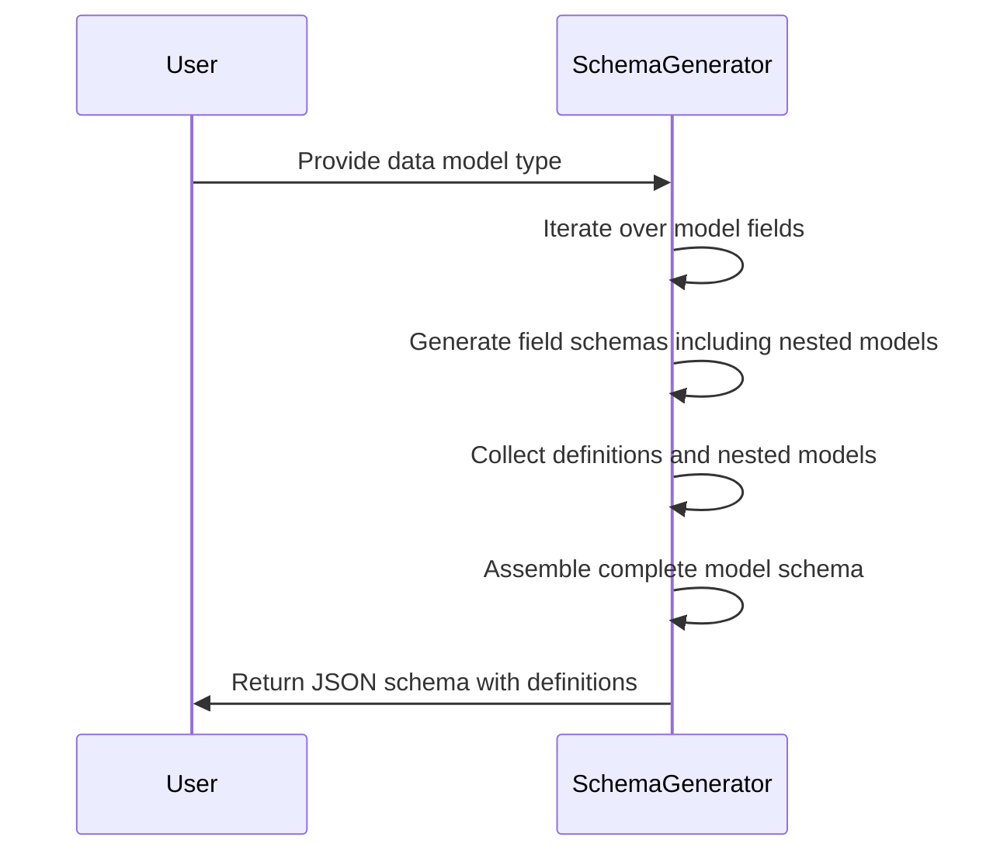
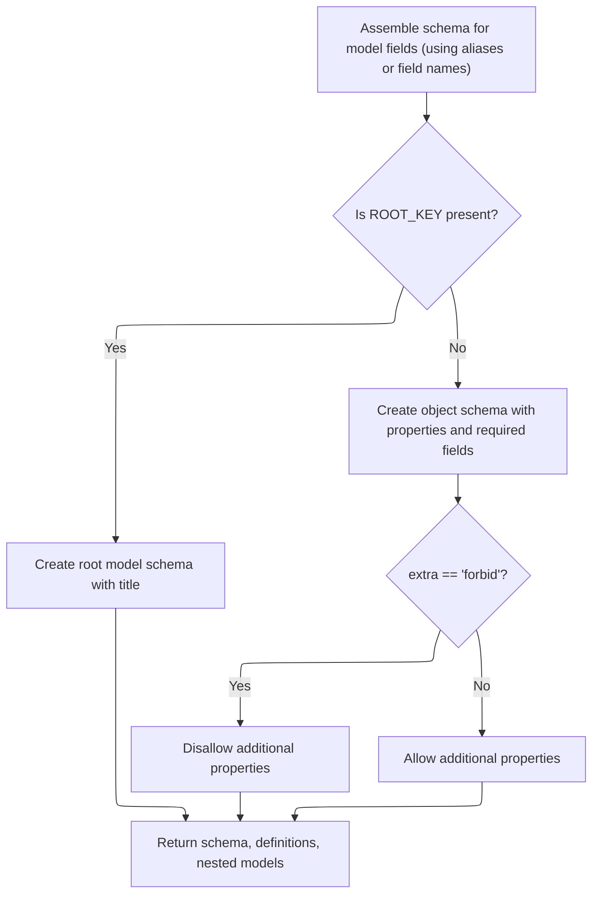

This flow generates a JSON schema for a data model by processing each field and its nested models, assembling these into a complete schema that reflects the model's structure and validation rules.

The main steps are:

- Iterate over model fields
- Generate schemas for fields and nested models
- Collect all definitions
- Assemble the final schema considering aliases and required fields
- Return the schema with definitions and nested models



# Spec

## Detailed View of the Program's Functionality

a. Starting Schema Generation for the Model

The process begins by initiating the schema generation for a given data model. The main function responsible for this is designed to create a JSON Schema representation for the model's type, without including extra metadata like the title or description at this stage. It prepares empty collections to hold the schema properties, required fields, additional schema definitions (for nested or referenced models), and a set to track nested models.

b. Iterating Over Each Field in the Model

The next step is to loop through every field defined in the model. For each field, the schema generation process is as follows:

- The code attempts to generate the schema for the field by calling a dedicated function that handles field schema creation.
- If the field should be skipped (for example, if it is a callable, which cannot be represented in JSON Schema), a warning is issued and the field is ignored.
- Otherwise, the generated field schema, any additional definitions (for nested models or referenced types), and any nested models are collected.
- The schema for each field is added to the properties collection, using either the field's alias or its name, depending on the configuration.
- If the field is required, its alias or name is added to the list of required fields.

c. Generating Schema for a Model Field

For each field, the schema generation involves several steps:

- The code first gathers any schema information and validation constraints defined for the field, such as title, description, default value, or validation rules (like min/max length, regex, etc.).
- It then calls a function to generate the schema for the field's type. This function is responsible for handling complex types, such as nested models, lists, dictionaries, tuples, enums, and more.
- The type schema generation may also collect additional schema definitions for nested or referenced models, and track any models that are referenced to handle circular dependencies.

d. Resolving Field Type Schema and References

When generating the schema for a field's type, the code considers several scenarios:

- If the field is a collection (like a list, set, or tuple), it generates an array schema and recursively generates the schema for the items.
- If the field is a mapping (like a dictionary), it generates an object schema and handles the schema for the keys and values, including any regex patterns for keys.
- If the field is a tuple with fixed types, it generates an array schema with a fixed number of items, each with its own schema.
- If the field is a singleton (a simple type or a model), it generates the schema accordingly, possibly referencing other models or enums.
- If the field is a nested model, it may generate a reference to that model's schema, and add the model to the set of nested models.
- If the field is an enum, it generates an enum schema and adds the enum definition.
- If the field is a literal or a union of literals, it generates the appropriate schema using enum or <SwmToken path="pydantic/v1/schema.py" pos="759:24:26" line-data="                # object. Otherwise we will end up with several allOf inside anyOf/oneOf.">`anyOf/oneOf`</SwmToken> constructs.
- If the field is a special type (like a path, datetime, UUID, etc.), it uses predefined schema formats.

e. Merging Type Schema Back into Field Schema

After generating the type schema for the field, the code checks if the result is a reference (using <SwmToken path="pydantic/v1/schema.py" pos="265:3:4" line-data="    # $ref will only be returned when there are no schema_overrides">`$ref`</SwmToken>). If so, it returns the reference schema as-is, along with any collected definitions and nested models. If not, it merges the type schema into the field's schema information (which may include title, description, default, and validation constraints), and returns the combined schema, definitions, and nested models.

f. Finalizing the Model Schema Structure

Once all fields have been processed, the code assembles the final schema for the model:

- If the model uses a custom root field (a special case where the model wraps a single value), the schema for the root field is used as the model's schema, and the model's title is added.
- Otherwise, the schema is constructed as an object with the collected properties and required fields.
- If the model's configuration specifies that extra fields are forbidden, the schema is updated to disallow additional properties.
- The function then returns the complete schema for the model, along with any additional definitions for nested or referenced models, and the set of nested models.

This process ensures that the generated JSON Schema accurately represents the structure, constraints, and nested relationships of the Pydantic model, making it suitable for use in validation, documentation, and interoperability scenarios.

# Rule Definition

| Paragraph Name                                                                                                                                                                                                                                                                                                                                                                                                                                                                                                                                                                                                                                                                                                                                                                                                                                                                  | Rule ID | Category          | Description                                                                                                                                                                                                                                                                                                                                                                                                                                                                                                                                      | Conditions                                                                                                                                       | Remarks                                                                                                                                                                                                                                                                                                                                                                                                                                                                                                                                                                            |
| ------------------------------------------------------------------------------------------------------------------------------------------------------------------------------------------------------------------------------------------------------------------------------------------------------------------------------------------------------------------------------------------------------------------------------------------------------------------------------------------------------------------------------------------------------------------------------------------------------------------------------------------------------------------------------------------------------------------------------------------------------------------------------------------------------------------------------------------------------------------------------- | ------- | ----------------- | ------------------------------------------------------------------------------------------------------------------------------------------------------------------------------------------------------------------------------------------------------------------------------------------------------------------------------------------------------------------------------------------------------------------------------------------------------------------------------------------------------------------------------------------------ | ------------------------------------------------------------------------------------------------------------------------------------------------ | ---------------------------------------------------------------------------------------------------------------------------------------------------------------------------------------------------------------------------------------------------------------------------------------------------------------------------------------------------------------------------------------------------------------------------------------------------------------------------------------------------------------------------------------------------------------------------------- |
| schema, <SwmToken path="pydantic/v1/schema.py" pos="611:12:12" line-data="    You probably should be using ``model_schema()``, this function is indirectly used by that function.">`model_schema`</SwmToken>, <SwmToken path="pydantic/v1/schema.py" pos="147:11:11" line-data="        m_schema, m_definitions, m_nested_models = model_process_schema(">`model_process_schema`</SwmToken>, <SwmToken path="pydantic/v1/schema.py" pos="601:2:2" line-data="def model_type_schema(">`model_type_schema`</SwmToken>                                                                                                                                                                                                                                                                                                                                                             | RL-001  | Computation       | Each Pydantic model must be converted into a JSON Schema object. The schema must include the model's title, type, properties, required fields, and definitions for any nested models.                                                                                                                                                                                                                                                                                                                                                            | A model definition is provided as input.                                                                                                         | The output schema is a JSON object with keys: 'title' (string), 'type' (always 'object' unless custom root), 'properties' (object), 'required' (array of strings), and 'definitions' (object mapping model names to schemas).                                                                                                                                                                                                                                                                                                                                                      |
| <SwmToken path="pydantic/v1/schema.py" pos="222:2:2" line-data="def field_schema(">`field_schema`</SwmToken>, <SwmToken path="pydantic/v1/schema.py" pos="248:8:8" line-data="    s, schema_overrides = get_field_info_schema(field)">`get_field_info_schema`</SwmToken>, <SwmToken path="pydantic/v1/schema.py" pos="250:5:5" line-data="    validation_schema = get_field_schema_validations(field)">`get_field_schema_validations`</SwmToken>, <SwmToken path="pydantic/v1/schema.py" pos="255:11:11" line-data="    f_schema, f_definitions, f_nested_models = field_type_schema(">`field_type_schema`</SwmToken>                                                                                                                                                                                                                                                           | RL-002  | Computation       | Each field in a model must be represented in the schema with its type, title, description, default value, and all applicable validation constraints (<SwmToken path="pydantic/v1/schema.py" pos="128:4:6" line-data="      else, e.g. for OpenAPI use ``#/components/schemas/``. The resulting generated schemas will still be at the">`e.g`</SwmToken>., <SwmToken path="pydantic/v1/schema.py" pos="275:11:11" line-data="    (&#39;max_length&#39;, numeric_types, &#39;maxLength&#39;),">`maxLength`</SwmToken>, pattern, minimum, maximum). | A field is present in the model definition.                                                                                                      | Field schema is an object with keys: 'title' (string), 'type' (string), 'description' (string, optional), 'default' (any, optional), and validation keywords as per JSON Schema (<SwmToken path="pydantic/v1/schema.py" pos="128:4:6" line-data="      else, e.g. for OpenAPI use ``#/components/schemas/``. The resulting generated schemas will still be at the">`e.g`</SwmToken>., <SwmToken path="pydantic/v1/schema.py" pos="275:11:11" line-data="    (&#39;max_length&#39;, numeric_types, &#39;maxLength&#39;),">`maxLength`</SwmToken>, 'pattern', 'minimum', 'maximum'). |
| schema, <SwmToken path="pydantic/v1/schema.py" pos="611:12:12" line-data="    You probably should be using ``model_schema()``, this function is indirectly used by that function.">`model_schema`</SwmToken>, <SwmToken path="pydantic/v1/schema.py" pos="601:2:2" line-data="def model_type_schema(">`model_type_schema`</SwmToken>                                                                                                                                                                                                                                                                                                                                                                                                                                                                                                                                            | RL-003  | Conditional Logic | If the <SwmToken path="pydantic/v1/schema.py" pos="225:1:1" line-data="    by_alias: bool = True,">`by_alias`</SwmToken> flag is set to true, field aliases must be used as property names in the schema; otherwise, the original field names are used.                                                                                                                                                                                                                                                                                          | The <SwmToken path="pydantic/v1/schema.py" pos="225:1:1" line-data="    by_alias: bool = True,">`by_alias`</SwmToken> flag is provided as input. | Property names in the 'properties' and 'required' arrays are determined by the <SwmToken path="pydantic/v1/schema.py" pos="225:1:1" line-data="    by_alias: bool = True,">`by_alias`</SwmToken> flag.                                                                                                                                                                                                                                                                                                                                                                             |
| <SwmToken path="pydantic/v1/schema.py" pos="601:2:2" line-data="def model_type_schema(">`model_type_schema`</SwmToken>                                                                                                                                                                                                                                                                                                                                                                                                                                                                                                                                                                                                                                                                                                                                                          | RL-004  | Data Assignment   | All fields marked as required in the model must have their property names (or aliases) included in the 'required' array of the schema.                                                                                                                                                                                                                                                                                                                                                                                                           | A field is marked as required in the model definition.                                                                                           | 'required' is an array of strings, each being a property name or alias as determined by the <SwmToken path="pydantic/v1/schema.py" pos="225:1:1" line-data="    by_alias: bool = True,">`by_alias`</SwmToken> flag.                                                                                                                                                                                                                                                                                                                                                                |
| schema, <SwmToken path="pydantic/v1/schema.py" pos="611:12:12" line-data="    You probably should be using ``model_schema()``, this function is indirectly used by that function.">`model_schema`</SwmToken>, <SwmToken path="pydantic/v1/schema.py" pos="147:11:11" line-data="        m_schema, m_definitions, m_nested_models = model_process_schema(">`model_process_schema`</SwmToken>, <SwmToken path="pydantic/v1/schema.py" pos="601:2:2" line-data="def model_type_schema(">`model_type_schema`</SwmToken>, <SwmToken path="pydantic/v1/schema.py" pos="255:11:11" line-data="    f_schema, f_definitions, f_nested_models = field_type_schema(">`field_type_schema`</SwmToken>, <SwmToken path="pydantic/v1/schema.py" pos="462:11:11" line-data="        items_schema, f_definitions, f_nested_models = field_singleton_schema(">`field_singleton_schema`</SwmToken> | RL-005  | Computation       | If a field is a nested model, its schema must be included in the 'definitions' section, and the field schema must reference it using $ref.                                                                                                                                                                                                                                                                                                                                                                                                       | A field's type is another model.                                                                                                                 | 'definitions' is an object mapping model names to their schema objects. Field schema uses $ref or <SwmToken path="pydantic/v1/schema.py" pos="516:7:7" line-data="            f_schema = {&#39;allOf&#39;: [all_of_schemas]}">`allOf`</SwmToken> with $ref if schema overrides are present.                                                                                                                                                                                                                                                                                        |
| <SwmToken path="pydantic/v1/schema.py" pos="255:11:11" line-data="    f_schema, f_definitions, f_nested_models = field_type_schema(">`field_type_schema`</SwmToken>, <SwmToken path="pydantic/v1/schema.py" pos="462:11:11" line-data="        items_schema, f_definitions, f_nested_models = field_singleton_schema(">`field_singleton_schema`</SwmToken>                                                                                                                                                                                                                                                                                                                                                                                                                                                                                                                      | RL-006  | Computation       | For container types (lists, sets, tuples, dicts), the schema must use the appropriate JSON Schema constructs ('type': 'array', 'items', <SwmToken path="pydantic/v1/schema.py" pos="474:4:4" line-data="            f_schema[&#39;uniqueItems&#39;] = True">`uniqueItems`</SwmToken>, etc.), and describe the contained element types.                                                                                                                                                                                                           | A field's type is a container (list, set, tuple, dict, etc.).                                                                                    | For lists/arrays: 'type': 'array', 'items': schema for element type. For sets: add <SwmToken path="pydantic/v1/schema.py" pos="474:4:4" line-data="            f_schema[&#39;uniqueItems&#39;] = True">`uniqueItems`</SwmToken>: true. For dicts: 'type': 'object', <SwmToken path="pydantic/v1/schema.py" pos="651:4:4" line-data="        out_schema[&#39;additionalProperties&#39;] = False">`additionalProperties`</SwmToken>: schema for value type.                                                                                                                          |
| <SwmToken path="pydantic/v1/schema.py" pos="601:2:2" line-data="def model_type_schema(">`model_type_schema`</SwmToken>                                                                                                                                                                                                                                                                                                                                                                                                                                                                                                                                                                                                                                                                                                                                                          | RL-007  | Conditional Logic | If a model has a single field named '**root**', the schema must represent the root type directly, with the model's title, instead of an object with properties.                                                                                                                                                                                                                                                                                                                                                                                  | The model has a single field named '**root**'.                                                                                                   | The schema is not an object with 'properties', but directly the schema for the root field, with 'title' set.                                                                                                                                                                                                                                                                                                                                                                                                                                                                       |
| <SwmToken path="pydantic/v1/schema.py" pos="601:2:2" line-data="def model_type_schema(">`model_type_schema`</SwmToken>                                                                                                                                                                                                                                                                                                                                                                                                                                                                                                                                                                                                                                                                                                                                                          | RL-008  | Conditional Logic | If the model's 'extra' property is set to 'forbid', the schema must set <SwmToken path="pydantic/v1/schema.py" pos="651:4:4" line-data="        out_schema[&#39;additionalProperties&#39;] = False">`additionalProperties`</SwmToken> to false; otherwise, it must be true.                                                                                                                                                                                                                                                                      | The model's config has an 'extra' property.                                                                                                      | <SwmToken path="pydantic/v1/schema.py" pos="651:4:4" line-data="        out_schema[&#39;additionalProperties&#39;] = False">`additionalProperties`</SwmToken> is a boolean in the schema object.                                                                                                                                                                                                                                                                                                                                                                                   |
| <SwmToken path="pydantic/v1/schema.py" pos="194:5:5" line-data="        m_schema = get_schema_ref(model_name, ref_prefix, ref_template, False)">`get_schema_ref`</SwmToken>, schema, <SwmToken path="pydantic/v1/schema.py" pos="611:12:12" line-data="    You probably should be using ``model_schema()``, this function is indirectly used by that function.">`model_schema`</SwmToken>                                                                                                                                                                                                                                                                                                                                                                                                                                                                                       | RL-009  | Computation       | References to model definitions in the schema must use the <SwmToken path="pydantic/v1/schema.py" pos="227:1:1" line-data="    ref_prefix: Optional[str] = None,">`ref_prefix`</SwmToken> or <SwmToken path="pydantic/v1/schema.py" pos="228:1:1" line-data="    ref_template: str = default_ref_template,">`ref_template`</SwmToken> to construct the $ref value.                                                                                                                                                                               | A field or schema needs to reference another model's schema.                                                                                     | Default <SwmToken path="pydantic/v1/schema.py" pos="227:1:1" line-data="    ref_prefix: Optional[str] = None,">`ref_prefix`</SwmToken> is '#/definitions/'. Default <SwmToken path="pydantic/v1/schema.py" pos="228:1:1" line-data="    ref_template: str = default_ref_template,">`ref_template`</SwmToken> is '#/definitions/{model}'. $ref is a string constructed accordingly.                                                                                                                                                                                                 |

# User Stories

## User Story 1: Generate JSON Schema for Pydantic Model

---

### Story Description:

As a system, I want to generate a JSON Schema representation for a given data model so that consumers can validate and understand the structure, types, and constraints of the data, including handling custom root fields and the model's 'extra' property.

---

### Business Rule Mapping:

| Rule ID | Paragraph Name                                                                                                                                                                                                                                                                                                                                                                                                                                                                                                                                                                                                                                                                                                                                                                                                                                                                  | Rule Description                                                                                                                                                                                                                                                                                                                                                                                                                                                                                                                                 |
| ------- | ------------------------------------------------------------------------------------------------------------------------------------------------------------------------------------------------------------------------------------------------------------------------------------------------------------------------------------------------------------------------------------------------------------------------------------------------------------------------------------------------------------------------------------------------------------------------------------------------------------------------------------------------------------------------------------------------------------------------------------------------------------------------------------------------------------------------------------------------------------------------------- | ------------------------------------------------------------------------------------------------------------------------------------------------------------------------------------------------------------------------------------------------------------------------------------------------------------------------------------------------------------------------------------------------------------------------------------------------------------------------------------------------------------------------------------------------ |
| RL-007  | <SwmToken path="pydantic/v1/schema.py" pos="601:2:2" line-data="def model_type_schema(">`model_type_schema`</SwmToken>                                                                                                                                                                                                                                                                                                                                                                                                                                                                                                                                                                                                                                                                                                                                                          | If a model has a single field named '**root**', the schema must represent the root type directly, with the model's title, instead of an object with properties.                                                                                                                                                                                                                                                                                                                                                                                  |
| RL-008  | <SwmToken path="pydantic/v1/schema.py" pos="601:2:2" line-data="def model_type_schema(">`model_type_schema`</SwmToken>                                                                                                                                                                                                                                                                                                                                                                                                                                                                                                                                                                                                                                                                                                                                                          | If the model's 'extra' property is set to 'forbid', the schema must set <SwmToken path="pydantic/v1/schema.py" pos="651:4:4" line-data="        out_schema[&#39;additionalProperties&#39;] = False">`additionalProperties`</SwmToken> to false; otherwise, it must be true.                                                                                                                                                                                                                                                                      |
| RL-002  | <SwmToken path="pydantic/v1/schema.py" pos="222:2:2" line-data="def field_schema(">`field_schema`</SwmToken>, <SwmToken path="pydantic/v1/schema.py" pos="248:8:8" line-data="    s, schema_overrides = get_field_info_schema(field)">`get_field_info_schema`</SwmToken>, <SwmToken path="pydantic/v1/schema.py" pos="250:5:5" line-data="    validation_schema = get_field_schema_validations(field)">`get_field_schema_validations`</SwmToken>, <SwmToken path="pydantic/v1/schema.py" pos="255:11:11" line-data="    f_schema, f_definitions, f_nested_models = field_type_schema(">`field_type_schema`</SwmToken>                                                                                                                                                                                                                                                           | Each field in a model must be represented in the schema with its type, title, description, default value, and all applicable validation constraints (<SwmToken path="pydantic/v1/schema.py" pos="128:4:6" line-data="      else, e.g. for OpenAPI use ``#/components/schemas/``. The resulting generated schemas will still be at the">`e.g`</SwmToken>., <SwmToken path="pydantic/v1/schema.py" pos="275:11:11" line-data="    (&#39;max_length&#39;, numeric_types, &#39;maxLength&#39;),">`maxLength`</SwmToken>, pattern, minimum, maximum). |
| RL-001  | schema, <SwmToken path="pydantic/v1/schema.py" pos="611:12:12" line-data="    You probably should be using ``model_schema()``, this function is indirectly used by that function.">`model_schema`</SwmToken>, <SwmToken path="pydantic/v1/schema.py" pos="147:11:11" line-data="        m_schema, m_definitions, m_nested_models = model_process_schema(">`model_process_schema`</SwmToken>, <SwmToken path="pydantic/v1/schema.py" pos="601:2:2" line-data="def model_type_schema(">`model_type_schema`</SwmToken>                                                                                                                                                                                                                                                                                                                                                             | Each Pydantic model must be converted into a JSON Schema object. The schema must include the model's title, type, properties, required fields, and definitions for any nested models.                                                                                                                                                                                                                                                                                                                                                            |
| RL-005  | schema, <SwmToken path="pydantic/v1/schema.py" pos="611:12:12" line-data="    You probably should be using ``model_schema()``, this function is indirectly used by that function.">`model_schema`</SwmToken>, <SwmToken path="pydantic/v1/schema.py" pos="147:11:11" line-data="        m_schema, m_definitions, m_nested_models = model_process_schema(">`model_process_schema`</SwmToken>, <SwmToken path="pydantic/v1/schema.py" pos="601:2:2" line-data="def model_type_schema(">`model_type_schema`</SwmToken>, <SwmToken path="pydantic/v1/schema.py" pos="255:11:11" line-data="    f_schema, f_definitions, f_nested_models = field_type_schema(">`field_type_schema`</SwmToken>, <SwmToken path="pydantic/v1/schema.py" pos="462:11:11" line-data="        items_schema, f_definitions, f_nested_models = field_singleton_schema(">`field_singleton_schema`</SwmToken> | If a field is a nested model, its schema must be included in the 'definitions' section, and the field schema must reference it using $ref.                                                                                                                                                                                                                                                                                                                                                                                                       |
| RL-006  | <SwmToken path="pydantic/v1/schema.py" pos="255:11:11" line-data="    f_schema, f_definitions, f_nested_models = field_type_schema(">`field_type_schema`</SwmToken>, <SwmToken path="pydantic/v1/schema.py" pos="462:11:11" line-data="        items_schema, f_definitions, f_nested_models = field_singleton_schema(">`field_singleton_schema`</SwmToken>                                                                                                                                                                                                                                                                                                                                                                                                                                                                                                                      | For container types (lists, sets, tuples, dicts), the schema must use the appropriate JSON Schema constructs ('type': 'array', 'items', <SwmToken path="pydantic/v1/schema.py" pos="474:4:4" line-data="            f_schema[&#39;uniqueItems&#39;] = True">`uniqueItems`</SwmToken>, etc.), and describe the contained element types.                                                                                                                                                                                                           |
| RL-009  | <SwmToken path="pydantic/v1/schema.py" pos="194:5:5" line-data="        m_schema = get_schema_ref(model_name, ref_prefix, ref_template, False)">`get_schema_ref`</SwmToken>, schema, <SwmToken path="pydantic/v1/schema.py" pos="611:12:12" line-data="    You probably should be using ``model_schema()``, this function is indirectly used by that function.">`model_schema`</SwmToken>                                                                                                                                                                                                                                                                                                                                                                                                                                                                                       | References to model definitions in the schema must use the <SwmToken path="pydantic/v1/schema.py" pos="227:1:1" line-data="    ref_prefix: Optional[str] = None,">`ref_prefix`</SwmToken> or <SwmToken path="pydantic/v1/schema.py" pos="228:1:1" line-data="    ref_template: str = default_ref_template,">`ref_template`</SwmToken> to construct the $ref value.                                                                                                                                                                               |

---

### Relevant Functionality:

- <SwmToken path="pydantic/v1/schema.py" pos="601:2:2" line-data="def model_type_schema(">`model_type_schema`</SwmToken>
  1. **RL-007:**
     - If model has a field named '**root**':
       - Use the schema for that field as the model's schema.
       - Set 'title' appropriately.
  2. **RL-008:**
     - If model.extra == 'forbid':
       - Set <SwmToken path="pydantic/v1/schema.py" pos="651:4:4" line-data="        out_schema[&#39;additionalProperties&#39;] = False">`additionalProperties`</SwmToken> to false in the schema.
     - Else:
       - Set <SwmToken path="pydantic/v1/schema.py" pos="651:4:4" line-data="        out_schema[&#39;additionalProperties&#39;] = False">`additionalProperties`</SwmToken> to true.
- <SwmToken path="pydantic/v1/schema.py" pos="222:2:2" line-data="def field_schema(">`field_schema`</SwmToken>
  1. **RL-002:**
     - For each field:
       - Set 'title' from field metadata if present.
       - Set 'type' based on field type mapping.
       - Add 'description' if provided.
       - Add 'default' if specified and field is not required.
       - Add validation constraints (<SwmToken path="pydantic/v1/schema.py" pos="128:4:6" line-data="      else, e.g. for OpenAPI use ``#/components/schemas/``. The resulting generated schemas will still be at the">`e.g`</SwmToken>., <SwmToken path="pydantic/v1/schema.py" pos="275:11:11" line-data="    (&#39;max_length&#39;, numeric_types, &#39;maxLength&#39;),">`maxLength`</SwmToken>, <SwmToken path="pydantic/v1/schema.py" pos="276:11:11" line-data="    (&#39;min_length&#39;, numeric_types, &#39;minLength&#39;),">`minLength`</SwmToken>, pattern, minimum, maximum) from field metadata.
       - For nested models, use a $ref to the model's definition.
- **schema**
  1. **RL-001:**
     - For each model:
       - Set 'title' to the model's name or configured title.
       - Set 'type' to 'object'.
       - Populate 'properties' with field schemas (see field rules).
       - Populate 'required' with names/aliases of required fields.
       - Add nested model schemas to 'definitions'.
  2. **RL-005:**
     - For each field that is a nested model:
       - Add the nested model's schema to 'definitions' keyed by its name.
       - In the field's schema, use $ref (or <SwmToken path="pydantic/v1/schema.py" pos="516:7:7" line-data="            f_schema = {&#39;allOf&#39;: [all_of_schemas]}">`allOf`</SwmToken> with $ref if schema overrides).
- <SwmToken path="pydantic/v1/schema.py" pos="255:11:11" line-data="    f_schema, f_definitions, f_nested_models = field_type_schema(">`field_type_schema`</SwmToken>
  1. **RL-006:**
     - If field is a list/array:
       - Set 'type' to 'array', 'items' to schema for element type.
     - If field is a set/frozenset:
       - Set 'type' to 'array', 'items' to schema for element type, <SwmToken path="pydantic/v1/schema.py" pos="474:4:4" line-data="            f_schema[&#39;uniqueItems&#39;] = True">`uniqueItems`</SwmToken> to true.
     - If field is a dict:
       - Set 'type' to 'object', <SwmToken path="pydantic/v1/schema.py" pos="651:4:4" line-data="        out_schema[&#39;additionalProperties&#39;] = False">`additionalProperties`</SwmToken> to schema for value type.
- <SwmToken path="pydantic/v1/schema.py" pos="194:5:5" line-data="        m_schema = get_schema_ref(model_name, ref_prefix, ref_template, False)">`get_schema_ref`</SwmToken>
  1. **RL-009:**
     - When referencing another model's schema:
       - If <SwmToken path="pydantic/v1/schema.py" pos="227:1:1" line-data="    ref_prefix: Optional[str] = None,">`ref_prefix`</SwmToken> is set, $ref = <SwmToken path="pydantic/v1/schema.py" pos="227:1:1" line-data="    ref_prefix: Optional[str] = None,">`ref_prefix`</SwmToken> + model name.
       - Else, $ref = <SwmToken path="pydantic/v1/schema.py" pos="822:12:14" line-data="        schema_ref = {&#39;$ref&#39;: ref_template.format(model=name)}">`ref_template.format`</SwmToken>(model=model name).

## User Story 2: Use Field Aliases and Required Fields in Schema

---

### Story Description:

As a system, I want to use field aliases as property names and include all required fields in the 'required' array when generating the schema so that the schema accurately reflects the model's intended API and validation requirements.

---

### Business Rule Mapping:

| Rule ID | Paragraph Name                                                                                                                                                                                                                                                                                                                       | Rule Description                                                                                                                                                                                                                                        |
| ------- | ------------------------------------------------------------------------------------------------------------------------------------------------------------------------------------------------------------------------------------------------------------------------------------------------------------------------------------ | ------------------------------------------------------------------------------------------------------------------------------------------------------------------------------------------------------------------------------------------------------- |
| RL-004  | <SwmToken path="pydantic/v1/schema.py" pos="601:2:2" line-data="def model_type_schema(">`model_type_schema`</SwmToken>                                                                                                                                                                                                               | All fields marked as required in the model must have their property names (or aliases) included in the 'required' array of the schema.                                                                                                                  |
| RL-003  | schema, <SwmToken path="pydantic/v1/schema.py" pos="611:12:12" line-data="    You probably should be using ``model_schema()``, this function is indirectly used by that function.">`model_schema`</SwmToken>, <SwmToken path="pydantic/v1/schema.py" pos="601:2:2" line-data="def model_type_schema(">`model_type_schema`</SwmToken> | If the <SwmToken path="pydantic/v1/schema.py" pos="225:1:1" line-data="    by_alias: bool = True,">`by_alias`</SwmToken> flag is set to true, field aliases must be used as property names in the schema; otherwise, the original field names are used. |

---

### Relevant Functionality:

- <SwmToken path="pydantic/v1/schema.py" pos="601:2:2" line-data="def model_type_schema(">`model_type_schema`</SwmToken>
  1. **RL-004:**
     - For each field:
       - If field is required, add its property name (alias or original) to the 'required' array.
- **schema**
  1. **RL-003:**
     - If <SwmToken path="pydantic/v1/schema.py" pos="225:1:1" line-data="    by_alias: bool = True,">`by_alias`</SwmToken> is true:
       - Use field aliases as property names in 'properties' and 'required'.
     - Else:
       - Use field names.

# Code Walkthrough

## Building the Model's Type Schema

```mermaid
%%{init: {"flowchart": {"defaultRenderer": "elk"}} }%%
flowchart TD
  node1["Start schema generation for the model"] --> subgraph loop1["For each field in the model"]
    node2["Generate field schema, collect definitions and nested models (use alias if by_alias is True)"]
    click node2 openCode "pydantic/v1/schema.py:222:229"
  end
  loop1 --> node3["Assemble and return the complete model schema, including nested models"]
  click node1 openCode "pydantic/v1/schema.py:601:629"
  click node3 openCode "pydantic/v1/schema.py:630:652"


subgraph node2 [field_schema]
  sgmain_1_node1["Analyze field and validation constraints"] --> sgmain_1_node2["Generate type schema, considering references"]
  click sgmain_1_node1 openCode "pydantic/v1/schema.py:222:263"
  sgmain_1_node2 --> sgmain_1_node3{"Return: Use $ref if no schema overrides, else inline schema"}
  click sgmain_1_node2 openCode "pydantic/v1/schema.py:432:432"
  click sgmain_1_node3 openCode "pydantic/v1/schema.py:265:270"
end

%% Swimm:
%% %%{init: {"flowchart": {"defaultRenderer": "elk"}} }%%
%% flowchart TD
%%   node1["Start schema generation for the model"] --> subgraph loop1["For each field in the model"]
%%     node2["Generate field schema, collect definitions and nested models (use alias if <SwmToken path="pydantic/v1/schema.py" pos="225:1:1" line-data="    by_alias: bool = True,">`by_alias`</SwmToken> is True)"]
%%     click node2 openCode "<SwmPath>[pydantic/v1/schema.py](pydantic/v1/schema.py)</SwmPath>:222:229"
%%   end
%%   loop1 --> node3["Assemble and return the complete model schema, including nested models"]
%%   click node1 openCode "<SwmPath>[pydantic/v1/schema.py](pydantic/v1/schema.py)</SwmPath>:601:629"
%%   click node3 openCode "<SwmPath>[pydantic/v1/schema.py](pydantic/v1/schema.py)</SwmPath>:630:652"
%% 
%% 
%% subgraph node2 [<SwmToken path="pydantic/v1/schema.py" pos="222:2:2" line-data="def field_schema(">`field_schema`</SwmToken>]
%%   sgmain_1_node1["Analyze field and validation constraints"] --> sgmain_1_node2["Generate type schema, considering references"]
%%   click sgmain_1_node1 openCode "<SwmPath>[pydantic/v1/schema.py](pydantic/v1/schema.py)</SwmPath>:222:263"
%%   sgmain_1_node2 --> sgmain_1_node3{"Return: Use $ref if no schema overrides, else inline schema"}
%%   click sgmain_1_node2 openCode "<SwmPath>[pydantic/v1/schema.py](pydantic/v1/schema.py)</SwmPath>:432:432"
%%   click sgmain_1_node3 openCode "<SwmPath>[pydantic/v1/schema.py](pydantic/v1/schema.py)</SwmPath>:265:270"
%% end
```

<SwmSnippet path="/pydantic/v1/schema.py" line="601">

---

In <SwmToken path="pydantic/v1/schema.py" pos="601:2:2" line-data="def model_type_schema(">`model_type_schema`</SwmToken>, we're starting by iterating over each field in the model to build up the schema for each property. We call <SwmToken path="pydantic/v1/schema.py" pos="622:11:11" line-data="            f_schema, f_definitions, f_nested_models = field_schema(">`field_schema`</SwmToken> for each field because that's what actually generates the schema for that field, plus any related definitions or nested models. This sets up the main structure for the model's schema, making sure we don't miss any nested or referenced types.

```python
def model_type_schema(
    model: Type['BaseModel'],
    *,
    by_alias: bool,
    model_name_map: Dict[TypeModelOrEnum, str],
    ref_template: str,
    ref_prefix: Optional[str] = None,
    known_models: TypeModelSet,
) -> Tuple[Dict[str, Any], Dict[str, Any], Set[str]]:
    """
    You probably should be using ``model_schema()``, this function is indirectly used by that function.

    Take a single ``model`` and generate the schema for its type only, not including additional
    information as title, etc. Also return additional schema definitions, from sub-models.
    """
    properties = {}
    required = []
    definitions: Dict[str, Any] = {}
    nested_models: Set[str] = set()
    for k, f in model.__fields__.items():
        try:
            f_schema, f_definitions, f_nested_models = field_schema(
                f,
                by_alias=by_alias,
                model_name_map=model_name_map,
                ref_prefix=ref_prefix,
                ref_template=ref_template,
                known_models=known_models,
            )
```

---

</SwmSnippet>

### Generating Schema for a Model Field

<SwmSnippet path="/pydantic/v1/schema.py" line="222">

---

In <SwmToken path="pydantic/v1/schema.py" pos="222:2:2" line-data="def field_schema(">`field_schema`</SwmToken>, we first grab the schema info and validations for the field, then call <SwmToken path="pydantic/v1/schema.py" pos="255:11:11" line-data="    f_schema, f_definitions, f_nested_models = field_type_schema(">`field_type_schema`</SwmToken> to generate the schema for the field's type and handle any nested or referenced models. This lets us combine the field's metadata and validation with its type structure.

```python
def field_schema(
    field: ModelField,
    *,
    by_alias: bool = True,
    model_name_map: Dict[TypeModelOrEnum, str],
    ref_prefix: Optional[str] = None,
    ref_template: str = default_ref_template,
    known_models: Optional[TypeModelSet] = None,
) -> Tuple[Dict[str, Any], Dict[str, Any], Set[str]]:
    """
    Process a Pydantic field and return a tuple with a JSON Schema for it as the first item.
    Also return a dictionary of definitions with models as keys and their schemas as values. If the passed field
    is a model and has sub-models, and those sub-models don't have overrides (as ``title``, ``default``, etc), they
    will be included in the definitions and referenced in the schema instead of included recursively.

    :param field: a Pydantic ``ModelField``
    :param by_alias: use the defined alias (if any) in the returned schema
    :param model_name_map: used to generate the JSON Schema references to other models included in the definitions
    :param ref_prefix: the JSON Pointer prefix to use for references to other schemas, if None, the default of
      #/definitions/ will be used
    :param ref_template: Use a ``string.format()`` template for ``$ref`` instead of a prefix. This can be useful for
      references that cannot be represented by ``ref_prefix`` such as a definition stored in another file. For a
      sibling json file in a ``/schemas`` directory use ``"/schemas/${model}.json#"``.
    :param known_models: used to solve circular references
    :return: tuple of the schema for this field and additional definitions
    """
    s, schema_overrides = get_field_info_schema(field)

    validation_schema = get_field_schema_validations(field)
    if validation_schema:
        s.update(validation_schema)
        schema_overrides = True

    f_schema, f_definitions, f_nested_models = field_type_schema(
        field,
        by_alias=by_alias,
        model_name_map=model_name_map,
        schema_overrides=schema_overrides,
        ref_prefix=ref_prefix,
        ref_template=ref_template,
        known_models=known_models or set(),
    )

```

---

</SwmSnippet>

#### Resolving Field Type Schema and References

See <SwmLink doc-title="Generating JSON Schema for a Field">[Generating JSON Schema for a Field](/.swm/generating-json-schema-for-a-field.z78p260h.sw.md)</SwmLink>

#### Merging Type Schema Back into Field Schema

<SwmSnippet path="/pydantic/v1/schema.py" line="265">

---

Back in <SwmToken path="pydantic/v1/schema.py" pos="222:2:2" line-data="def field_schema(">`field_schema`</SwmToken>, after getting the type schema from <SwmToken path="pydantic/v1/schema.py" pos="255:11:11" line-data="    f_schema, f_definitions, f_nested_models = field_type_schema(">`field_type_schema`</SwmToken>, we check if it's just a reference ('$ref'). If so, we return it as-is. Otherwise, we merge the type schema into the field's schema info and return the combined result, along with any definitions and nested models.

```python
    # $ref will only be returned when there are no schema_overrides
    if '$ref' in f_schema:
        return f_schema, f_definitions, f_nested_models
    else:
        s.update(f_schema)
        return s, f_definitions, f_nested_models
```

---

</SwmSnippet>

### Finalizing the Model Schema Structure



<SwmSnippet path="/pydantic/v1/schema.py" line="630">

---

Back in <SwmToken path="pydantic/v1/schema.py" pos="601:2:2" line-data="def model_type_schema(">`model_type_schema`</SwmToken>, after getting the schema, definitions, and nested models from <SwmToken path="pydantic/v1/schema.py" pos="222:2:2" line-data="def field_schema(">`field_schema`</SwmToken>, we update our collections and build the final schema structure. If the model uses a custom root, we handle that; otherwise, we assemble the object schema, set required fields, and handle extra properties as needed.

```python
        except SkipField as skip:
            warnings.warn(skip.message, UserWarning)
            continue
        definitions.update(f_definitions)
        nested_models.update(f_nested_models)
        if by_alias:
            properties[f.alias] = f_schema
            if f.required:
                required.append(f.alias)
        else:
            properties[k] = f_schema
            if f.required:
                required.append(k)
    if ROOT_KEY in properties:
        out_schema = properties[ROOT_KEY]
        out_schema['title'] = model.__config__.title or model.__name__
    else:
        out_schema = {'type': 'object', 'properties': properties}
        if required:
            out_schema['required'] = required
    if model.__config__.extra == 'forbid':
        out_schema['additionalProperties'] = False
    return out_schema, definitions, nested_models
```

---

</SwmSnippet>

&nbsp;

*This is an auto-generated document by Swimm 🌊 and has not yet been verified by a human*

<SwmMeta version="3.0.0" repo-id="Z2l0aHViJTNBJTNBcHlkYW50aWMlM0ElM0FTd2ltbS1EZW1v" repo-name="pydantic"><sup>Powered by [Swimm](/)</sup></SwmMeta>
