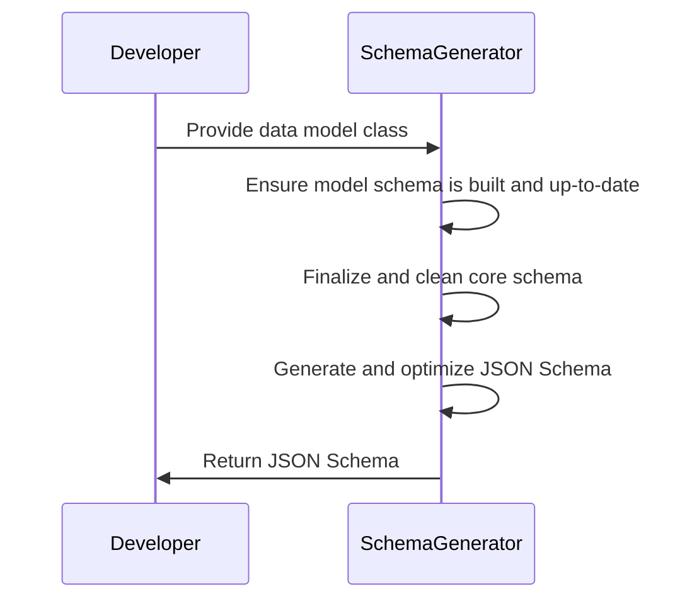
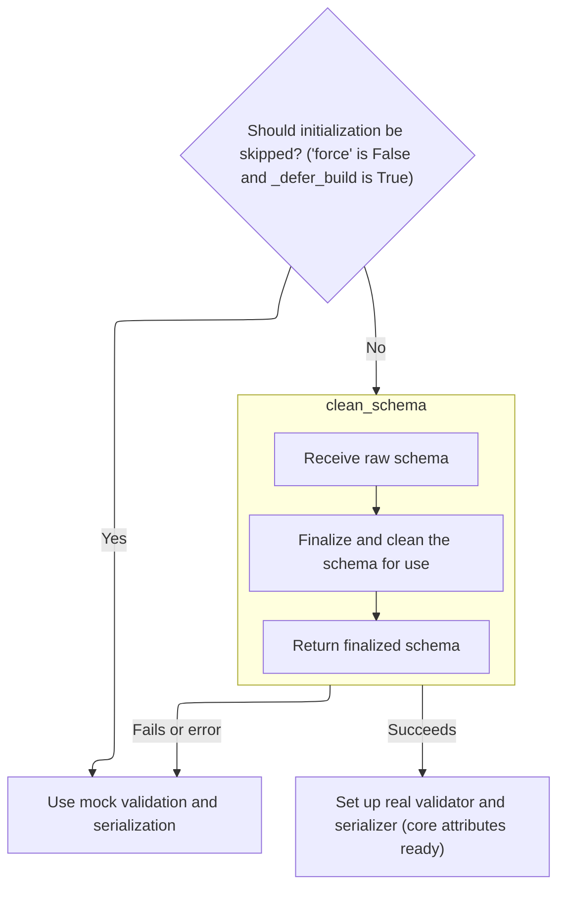
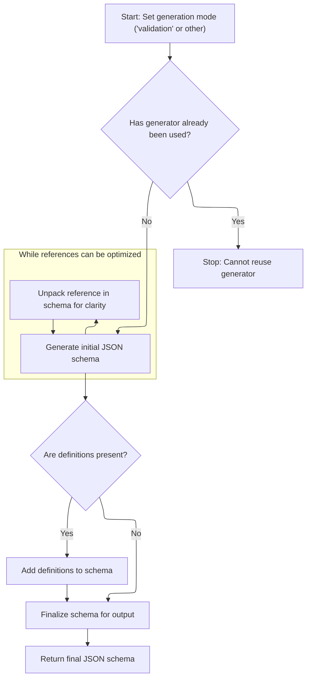

Generating a JSON Schema from a Python data model provides a standardized representation of the model's structure and validation rules. This process ensures the model's schema is fully built, resolves any references, and outputs a JSON Schema dictionary suitable for validation, documentation, or integration.

The main steps are:

- Prepare the schema generator.
- Ensure and finalize the model's schema.
- Generate and optimize the JSON Schema.
- Return the resulting schema.



# Spec

## Detailed View of the Program's Functionality

a. Preparing the Schema Generator and Checking Model Schema Status

The process begins by preparing an instance of the schema generator, which is responsible for converting the internal representation of a model into a JSON Schema. This generator is configured with options such as whether to use field aliases and how to format references. Before proceeding, the code checks if the model's internal schema is a placeholder (a "mock" schema), which would indicate that the schema is incomplete or unresolved.

If the schema is a mock, the code triggers a rebuild process to ensure that all type information, including forward references, is fully resolved and the schema is accurate. This step is crucial to avoid generating an incomplete or incorrect JSON Schema.

b. Rebuilding the Model Schema if Needed

If rebuilding is required, the process determines the appropriate namespace for resolving type hints and forward references. This can be an explicitly provided namespace, the namespace from the parent stack frame, or an empty namespace if neither is available.

Once the namespace is determined, the code attempts to rebuild the schema by initializing the core schema, validator, and serializer for the model. If the schema is already complete and rebuilding is not forced, the process exits early. Otherwise, it proceeds to generate a new schema, handling any errors that may arise from unresolved annotations.

c. Building or Mocking Core Schema, Validator, and Serializer

During the rebuilding process, the code first checks if schema initialization should be skipped (for example, if deferred building is enabled and not forced). If so, it sets up mock objects for validation and serialization, marking the schema as incomplete.

If initialization is not skipped, the code attempts to retrieve the core schema, validator, and serializer from the model. If any of these are still mocks or missing, it generates a new schema using a schema generator. This involves producing a raw schema and then finalizing it using a cleaning step to ensure it is ready for use.

d. Finalizing the Core Schema Structure

The cleaning step involves passing the raw schema to a finalization function, which resolves references and ensures the schema is fully prepared for further processing. This step is essential for handling recursive or referenced types correctly.

e. Creating Validator and Serializer After Schema Finalization

After the schema is finalized, the code creates the validator and serializer objects based on the finalized schema. These objects enable runtime validation and serialization of data according to the model's rules. The adapter is then marked as complete to prevent unnecessary rebuilding in the future.

f. Generating the JSON Schema from the Model's Core Schema

With a complete and finalized core schema, the process proceeds to generate the JSON Schema. The finalized core schema is passed to the schema generator's main method, which converts the internal representation into a standard JSON Schema format. This step ensures that the output is suitable for use in documentation, validation, or interoperability with other systems.

g. Transforming the Core Schema into JSON Schema Format

The schema generator starts by setting the generation mode (validation or serialization) and checks if it has already been used (to prevent accidental reuse). It then generates the initial JSON Schema and counts the number of references within the schema.

If the schema consists solely of a single reference that is only used once, the generator "unpacks" the reference by replacing it with the actual referenced schema. This process is repeated as long as there are single-use references, flattening the schema and reducing unnecessary nesting.

After flattening references, the generator performs garbage collection to remove any unused definitions, remaps references for clarity and consistency, and adds any remaining definitions under a special key. The schema is then sorted for readability and returned as the final output.

h. Summary

The entire flow ensures that a model's schema is accurate, complete, and fully resolved before generating a JSON Schema. It handles forward references, recursive types, and custom serialization logic, producing a clean and minimal JSON Schema suitable for a wide range of applications. The process is robust, with multiple checks and fallback mechanisms to handle incomplete or complex type information gracefully.

# Rule Definition

| Paragraph Name                                                                                                                                                                                                                                                                                                                                                                                                                                                                                                                                                                                                                                                                                                   | Rule ID | Category          | Description                                                                                                                                                                                                                                                                                                                                                                                                                                                                                                                                                                                                                                                                                                                                                                                                                                                                                                                                                                                                                                                                                    | Conditions                                                                     | Remarks                                                                                                                                                                                                                                                                                                                                                                                                                                                                                                                                                                                                                                                                                                               |
| ---------------------------------------------------------------------------------------------------------------------------------------------------------------------------------------------------------------------------------------------------------------------------------------------------------------------------------------------------------------------------------------------------------------------------------------------------------------------------------------------------------------------------------------------------------------------------------------------------------------------------------------------------------------------------------------------------------------- | ------- | ----------------- | ---------------------------------------------------------------------------------------------------------------------------------------------------------------------------------------------------------------------------------------------------------------------------------------------------------------------------------------------------------------------------------------------------------------------------------------------------------------------------------------------------------------------------------------------------------------------------------------------------------------------------------------------------------------------------------------------------------------------------------------------------------------------------------------------------------------------------------------------------------------------------------------------------------------------------------------------------------------------------------------------------------------------------------------------------------------------------------------------- | ------------------------------------------------------------------------------ | --------------------------------------------------------------------------------------------------------------------------------------------------------------------------------------------------------------------------------------------------------------------------------------------------------------------------------------------------------------------------------------------------------------------------------------------------------------------------------------------------------------------------------------------------------------------------------------------------------------------------------------------------------------------------------------------------------------------- |
| <SwmPath>[pydantic/json_schema.py](pydantic/json_schema.py)</SwmPath>: <SwmToken path="pydantic/json_schema.py" pos="2432:2:2" line-data="def model_json_schema(">`model_json_schema`</SwmToken>, <SwmToken path="pydantic/json_schema.py" pos="2469:2:2" line-data="def models_json_schema(">`models_json_schema`</SwmToken>, <SwmToken path="pydantic/json_schema.py" pos="9:2:4" line-data="[`TypeAdapter.json_schema`][pydantic.TypeAdapter.json_schema].">`TypeAdapter.json_schema`</SwmToken>, TypeAdapter.json_schemas                                                                                                                                                                                    | RL-001  | Data Assignment   | A function must be provided to generate a JSON Schema dictionary for a given model class. It must accept the model class (a subclass of the base model type), a boolean flag for field aliases (<SwmToken path="pydantic/json_schema.py" pos="2434:1:1" line-data="    by_alias: bool = True,">`by_alias`</SwmToken>), a string template for $ref formatting (<SwmToken path="pydantic/json_schema.py" pos="2435:1:1" line-data="    ref_template: str = DEFAULT_REF_TEMPLATE,">`ref_template`</SwmToken>), the schema generator class (<SwmToken path="pydantic/json_schema.py" pos="2436:1:1" line-data="    schema_generator: type[GenerateJsonSchema] = GenerateJsonSchema,">`schema_generator`</SwmToken>), and a mode string ('validation' or 'serialization').                                                                                                                                                                                                                                                                                                                          | When a user requests a JSON Schema for a model or type.                        | The output is a dictionary representing the JSON Schema. The function signature must include all specified parameters. The mode must be either 'validation' or 'serialization'.                                                                                                                                                                                                                                                                                                                                                                                                                                                                                                                                       |
| <SwmPath>[pydantic/json_schema.py](pydantic/json_schema.py)</SwmPath>: <SwmToken path="pydantic/json_schema.py" pos="2432:2:2" line-data="def model_json_schema(">`model_json_schema`</SwmToken>, <SwmToken path="pydantic/json_schema.py" pos="2469:2:2" line-data="def models_json_schema(">`models_json_schema`</SwmToken>, <SwmToken path="pydantic/json_schema.py" pos="9:2:4" line-data="[`TypeAdapter.json_schema`][pydantic.TypeAdapter.json_schema].">`TypeAdapter.json_schema`</SwmToken>, TypeAdapter.json_schemas                                                                                                                                                                                    | RL-002  | Conditional Logic | Before generating the JSON Schema, the system must check if the model's internal schema is complete and not a mock. If it is incomplete or a mock, the schema must be rebuilt.                                                                                                                                                                                                                                                                                                                                                                                                                                                                                                                                                                                                                                                                                                                                                                                                                                                                                                                 | When generating a JSON Schema and the internal schema is a mock or incomplete. | A mock schema is used as a placeholder when the schema is incomplete. The rebuild method must be called if a mock is detected.                                                                                                                                                                                                                                                                                                                                                                                                                                                                                                                                                                                        |
| <SwmPath>[pydantic/type_adapter.py](pydantic/type_adapter.py)</SwmPath>: <SwmToken path="pydantic/type_adapter.py" pos="131:4:6" line-data="        and `TypeAdapter.rebuild` for various ways to construct this namespace.">`TypeAdapter.rebuild`</SwmToken>, <SwmPath>[pydantic/json_schema.py](pydantic/json_schema.py)</SwmPath>: <SwmToken path="pydantic/json_schema.py" pos="2432:2:2" line-data="def model_json_schema(">`model_json_schema`</SwmToken>, <SwmToken path="pydantic/json_schema.py" pos="2469:2:2" line-data="def models_json_schema(">`models_json_schema`</SwmToken>                                                                                                                     | RL-003  | Computation       | The rebuild process for the internal schema must accept <SwmToken path="pydantic/json_schema.py" pos="1785:26:28" line-data="            &#39;Unable to generate JSON schema for arguments validator with positional-only and keyword-only arguments&#39;">`keyword-only`</SwmToken> parameters: force (bool), <SwmToken path="pydantic/type_adapter.py" pos="247:18:18" line-data="        self, ns_resolver: _namespace_utils.NsResolver, force: bool, raise_errors: bool = False">`raise_errors`</SwmToken> (bool), <SwmToken path="pydantic/type_adapter.py" pos="340:1:1" line-data="        _parent_namespace_depth: int = 2,">`_parent_namespace_depth`</SwmToken> (int), and <SwmToken path="pydantic/type_adapter.py" pos="341:1:1" line-data="        _types_namespace: _namespace_utils.MappingNamespace \| None = None,">`_types_namespace`</SwmToken> (mapping or null). It returns None if no rebuild is needed, True if successful, or False if not. Namespace resolution uses the provided namespace if available, else the parent frame's namespace, else an empty namespace. | When rebuilding is triggered due to an incomplete or mock schema.              | Parameters: force, <SwmToken path="pydantic/type_adapter.py" pos="247:18:18" line-data="        self, ns_resolver: _namespace_utils.NsResolver, force: bool, raise_errors: bool = False">`raise_errors`</SwmToken>, <SwmToken path="pydantic/type_adapter.py" pos="340:1:1" line-data="        _parent_namespace_depth: int = 2,">`_parent_namespace_depth`</SwmToken>, <SwmToken path="pydantic/type_adapter.py" pos="341:1:1" line-data="        _types_namespace: _namespace_utils.MappingNamespace \| None = None,">`_types_namespace`</SwmToken>. Return values: None (no rebuild needed), True (success), False (failure).                                                                                      |
| <SwmPath>[pydantic/json_schema.py](pydantic/json_schema.py)</SwmPath>: <SwmToken path="pydantic/json_schema.py" pos="2436:6:6" line-data="    schema_generator: type[GenerateJsonSchema] = GenerateJsonSchema,">`GenerateJsonSchema`</SwmToken>, <SwmPath>[pydantic/\_internal/\_generate_schema.py](pydantic/_internal/_generate_schema.py)</SwmPath>: \_Definitions, core schema generation                                                                                                                                                                                                                                                                                                                    | RL-004  | Data Assignment   | The internal schema must be a nested dictionary supporting keys such as 'type', 'schema', 'fields', and 'ref'. Mock schemas are used as placeholders when the schema is incomplete or cannot be built, and must support a method to attempt rebuilding.                                                                                                                                                                                                                                                                                                                                                                                                                                                                                                                                                                                                                                                                                                                                                                                                                                        | Whenever a schema is stored or manipulated internally.                         | Schema is a nested dict with keys: 'type', 'schema', 'fields', 'ref'. Mock schemas must implement a rebuild method.                                                                                                                                                                                                                                                                                                                                                                                                                                                                                                                                                                                                   |
| <SwmPath>[pydantic/json_schema.py](pydantic/json_schema.py)</SwmPath>: GenerateJsonSchema.generate, <SwmToken path="pydantic/json_schema.py" pos="329:3:3" line-data="    def generate_definitions(">`generate_definitions`</SwmToken>, and related methods                                                                                                                                                                                                                                                                                                                                                                                                                                                      | RL-005  | Computation       | The schema generator must accept the internal core schema and mode string as input, track if it has been used, and raise an error if reused. It generates the initial JSON Schema, flattens single-use $ref references, adds definitions under $defs, removes unused definitions, remaps references, and sorts/finalizes the schema before returning it.                                                                                                                                                                                                                                                                                                                                                                                                                                                                                                                                                                                                                                                                                                                                       | When generating a JSON Schema using the schema generator.                      | Error code <SwmToken path="pydantic/json_schema.py" pos="396:4:10" line-data="                code=&#39;json-schema-already-used&#39;,">`json-schema-already-used`</SwmToken> must be raised if the generator is reused. Output is a sorted dictionary with $defs and valid $ref values.                                                                                                                                                                                                                                                                                                                                                                                                                              |
| <SwmPath>[pydantic/\_internal/\_generate_schema.py](pydantic/_internal/_generate_schema.py)</SwmPath>: \_Definitions.finalize_schema                                                                                                                                                                                                                                                                                                                                                                                                                                                                                                                                                                             | RL-006  | Computation       | The process of finalizing the core schema must resolve all references within the schema and ensure it is ready for use in validation or serialization.                                                                                                                                                                                                                                                                                                                                                                                                                                                                                                                                                                                                                                                                                                                                                                                                                                                                                                                                         | After schema generation and before validator/serializer creation.              | All $ref and internal references must be resolved. The schema must be in a state suitable for runtime use.                                                                                                                                                                                                                                                                                                                                                                                                                                                                                                                                                                                                            |
| <SwmPath>[pydantic/type_adapter.py](pydantic/type_adapter.py)</SwmPath>: TypeAdapter.\_init_core_attrs, <SwmPath>[pydantic/\_internal/\_generate_schema.py](pydantic/_internal/_generate_schema.py)</SwmPath>: GenerateSchema.\_model_schema, <SwmToken path="pydantic/_internal/_generate_schema.py" pos="1135:5:5" line-data="            return self._dataclass_schema(obj, None)  # pyright: ignore[reportArgumentType]">`_dataclass_schema`</SwmToken>                                                                                                                                                                                                                                                      | RL-007  | Data Assignment   | After the core schema is finalized, the system must create a validator and serializer based on the finalized schema, enabling runtime validation and serialization.                                                                                                                                                                                                                                                                                                                                                                                                                                                                                                                                                                                                                                                                                                                                                                                                                                                                                                                            | After schema is finalized and ready.                                           | Validator and serializer objects are created from the finalized schema and stored for runtime use.                                                                                                                                                                                                                                                                                                                                                                                                                                                                                                                                                                                                                    |
| <SwmPath>[pydantic/json_schema.py](pydantic/json_schema.py)</SwmPath>: <SwmToken path="pydantic/json_schema.py" pos="2432:2:2" line-data="def model_json_schema(">`model_json_schema`</SwmToken>, <SwmToken path="pydantic/json_schema.py" pos="2469:2:2" line-data="def models_json_schema(">`models_json_schema`</SwmToken>, <SwmToken path="pydantic/json_schema.py" pos="9:2:4" line-data="[`TypeAdapter.json_schema`][pydantic.TypeAdapter.json_schema].">`TypeAdapter.json_schema`</SwmToken>, TypeAdapter.json_schemas, <SwmToken path="pydantic/json_schema.py" pos="2436:6:6" line-data="    schema_generator: type[GenerateJsonSchema] = GenerateJsonSchema,">`GenerateJsonSchema`</SwmToken>.**init** | RL-008  | Data Assignment   | The system must support configuration options that affect schema generation, including <SwmToken path="pydantic/json_schema.py" pos="2434:1:1" line-data="    by_alias: bool = True,">`by_alias`</SwmToken>, <SwmToken path="pydantic/json_schema.py" pos="2435:1:1" line-data="    ref_template: str = DEFAULT_REF_TEMPLATE,">`ref_template`</SwmToken>, mode, <SwmToken path="pydantic/json_schema.py" pos="2436:1:1" line-data="    schema_generator: type[GenerateJsonSchema] = GenerateJsonSchema,">`schema_generator`</SwmToken>, and <SwmToken path="pydantic/type_adapter.py" pos="322:8:8" line-data="            return config.get(&#39;defer_build&#39;) is True">`defer_build`</SwmToken>.                                                                                                                                                                                                                                                                                                                                                                                         | Whenever schema generation is invoked.                                         | Options: <SwmToken path="pydantic/json_schema.py" pos="2434:1:1" line-data="    by_alias: bool = True,">`by_alias`</SwmToken> (bool), <SwmToken path="pydantic/json_schema.py" pos="2435:1:1" line-data="    ref_template: str = DEFAULT_REF_TEMPLATE,">`ref_template`</SwmToken> (str), mode ('validation'                                                                                                                                                                                                                                                                                                                                                                                                           |
| <SwmPath>[pydantic/json_schema.py](pydantic/json_schema.py)</SwmPath>: <SwmToken path="pydantic/json_schema.py" pos="2432:2:2" line-data="def model_json_schema(">`model_json_schema`</SwmToken>, GenerateJsonSchema.generate, <SwmToken path="pydantic/type_adapter.py" pos="131:4:6" line-data="        and `TypeAdapter.rebuild` for various ways to construct this namespace.">`TypeAdapter.rebuild`</SwmToken>                                                                                                                                                                                                                                                                                              | RL-009  | Conditional Logic | The system must raise errors in the following cases: generator reuse (specific error code), schema generation on base model (attribute error), incomplete schema after rebuild (assertion error), unresolved forward references or invalid types (specific error).                                                                                                                                                                                                                                                                                                                                                                                                                                                                                                                                                                                                                                                                                                                                                                                                                             | When any of the specified error conditions occur.                              | Error codes: <SwmToken path="pydantic/json_schema.py" pos="396:4:10" line-data="                code=&#39;json-schema-already-used&#39;,">`json-schema-already-used`</SwmToken>, attribute error for base model, assertion error for incomplete schema, specific errors for unresolved references/invalid types.                                                                                                                                                                                                                                                                                                                                                                                                      |
| <SwmPath>[pydantic/json_schema.py](pydantic/json_schema.py)</SwmPath>: <SwmToken path="pydantic/json_schema.py" pos="2436:6:6" line-data="    schema_generator: type[GenerateJsonSchema] = GenerateJsonSchema,">`GenerateJsonSchema`</SwmToken>, <SwmToken path="pydantic/json_schema.py" pos="136:2:2" line-data="class _DefinitionsRemapping:">`_DefinitionsRemapping`</SwmToken>, reference mapping logic                                                                                                                                                                                                                                                                                                     | RL-010  | Data Assignment   | The system must support mapping and tracking of references at three levels: internal reference strings for types/schemas, keys for the $defs section in the JSON Schema, and actual $ref strings used in the JSON Schema.                                                                                                                                                                                                                                                                                                                                                                                                                                                                                                                                                                                                                                                                                                                                                                                                                                                                      | Whenever references are created or resolved during schema generation.          | Three levels: internal refs (<SwmToken path="pydantic/json_schema.py" pos="283:4:6" line-data="        # (e.g. because the CoreSchema that references short circuits is JSON schema generation without needing">`e.g`</SwmToken>., type paths), $defs keys (<SwmToken path="pydantic/json_schema.py" pos="283:4:6" line-data="        # (e.g. because the CoreSchema that references short circuits is JSON schema generation without needing">`e.g`</SwmToken>., model names), $ref strings (<SwmToken path="pydantic/json_schema.py" pos="283:4:6" line-data="        # (e.g. because the CoreSchema that references short circuits is JSON schema generation without needing">`e.g`</SwmToken>., '#/$defs/Model'). |
| <SwmPath>[pydantic/json_schema.py](pydantic/json_schema.py)</SwmPath>: <SwmToken path="pydantic/json_schema.py" pos="2432:2:2" line-data="def model_json_schema(">`model_json_schema`</SwmToken>, <SwmToken path="pydantic/json_schema.py" pos="2469:2:2" line-data="def models_json_schema(">`models_json_schema`</SwmToken>, GenerateJsonSchema.generate, <SwmToken path="pydantic/json_schema.py" pos="329:3:3" line-data="    def generate_definitions(">`generate_definitions`</SwmToken>                                                                                                                                                                                                                   | RL-011  | Data Assignment   | The output of the schema generation process must be a dictionary representing the JSON Schema, with all necessary definitions included and only the required pieces present.                                                                                                                                                                                                                                                                                                                                                                                                                                                                                                                                                                                                                                                                                                                                                                                                                                                                                                                   | After schema generation completes.                                             | Output is a dictionary with $defs containing all required definitions, and only necessary schema pieces included. No extraneous definitions.                                                                                                                                                                                                                                                                                                                                                                                                                                                                                                                                                                          |

# User Stories

## User Story 1: Requesting a JSON Schema for a model with configuration options

---

### Story Description:

As a user of the system, I want to request a JSON Schema for a model class with various configuration options so that I can obtain a schema tailored to my needs for validation or serialization.

---

### Business Rule Mapping:

| Rule ID | Paragraph Name                                                                                                                                                                                                                                                                                                                                                                                                                                                                                                                                                                                                                                                                                                   | Rule Description                                                                                                                                                                                                                                                                                                                                                                                                                                                                                                                                                                                                                                                                                                                                                      |
| ------- | ---------------------------------------------------------------------------------------------------------------------------------------------------------------------------------------------------------------------------------------------------------------------------------------------------------------------------------------------------------------------------------------------------------------------------------------------------------------------------------------------------------------------------------------------------------------------------------------------------------------------------------------------------------------------------------------------------------------- | --------------------------------------------------------------------------------------------------------------------------------------------------------------------------------------------------------------------------------------------------------------------------------------------------------------------------------------------------------------------------------------------------------------------------------------------------------------------------------------------------------------------------------------------------------------------------------------------------------------------------------------------------------------------------------------------------------------------------------------------------------------------- |
| RL-001  | <SwmPath>[pydantic/json_schema.py](pydantic/json_schema.py)</SwmPath>: <SwmToken path="pydantic/json_schema.py" pos="2432:2:2" line-data="def model_json_schema(">`model_json_schema`</SwmToken>, <SwmToken path="pydantic/json_schema.py" pos="2469:2:2" line-data="def models_json_schema(">`models_json_schema`</SwmToken>, <SwmToken path="pydantic/json_schema.py" pos="9:2:4" line-data="[`TypeAdapter.json_schema`][pydantic.TypeAdapter.json_schema].">`TypeAdapter.json_schema`</SwmToken>, TypeAdapter.json_schemas                                                                                                                                                                                    | A function must be provided to generate a JSON Schema dictionary for a given model class. It must accept the model class (a subclass of the base model type), a boolean flag for field aliases (<SwmToken path="pydantic/json_schema.py" pos="2434:1:1" line-data="    by_alias: bool = True,">`by_alias`</SwmToken>), a string template for $ref formatting (<SwmToken path="pydantic/json_schema.py" pos="2435:1:1" line-data="    ref_template: str = DEFAULT_REF_TEMPLATE,">`ref_template`</SwmToken>), the schema generator class (<SwmToken path="pydantic/json_schema.py" pos="2436:1:1" line-data="    schema_generator: type[GenerateJsonSchema] = GenerateJsonSchema,">`schema_generator`</SwmToken>), and a mode string ('validation' or 'serialization'). |
| RL-008  | <SwmPath>[pydantic/json_schema.py](pydantic/json_schema.py)</SwmPath>: <SwmToken path="pydantic/json_schema.py" pos="2432:2:2" line-data="def model_json_schema(">`model_json_schema`</SwmToken>, <SwmToken path="pydantic/json_schema.py" pos="2469:2:2" line-data="def models_json_schema(">`models_json_schema`</SwmToken>, <SwmToken path="pydantic/json_schema.py" pos="9:2:4" line-data="[`TypeAdapter.json_schema`][pydantic.TypeAdapter.json_schema].">`TypeAdapter.json_schema`</SwmToken>, TypeAdapter.json_schemas, <SwmToken path="pydantic/json_schema.py" pos="2436:6:6" line-data="    schema_generator: type[GenerateJsonSchema] = GenerateJsonSchema,">`GenerateJsonSchema`</SwmToken>.**init** | The system must support configuration options that affect schema generation, including <SwmToken path="pydantic/json_schema.py" pos="2434:1:1" line-data="    by_alias: bool = True,">`by_alias`</SwmToken>, <SwmToken path="pydantic/json_schema.py" pos="2435:1:1" line-data="    ref_template: str = DEFAULT_REF_TEMPLATE,">`ref_template`</SwmToken>, mode, <SwmToken path="pydantic/json_schema.py" pos="2436:1:1" line-data="    schema_generator: type[GenerateJsonSchema] = GenerateJsonSchema,">`schema_generator`</SwmToken>, and <SwmToken path="pydantic/type_adapter.py" pos="322:8:8" line-data="            return config.get(&#39;defer_build&#39;) is True">`defer_build`</SwmToken>.                                                                |
| RL-011  | <SwmPath>[pydantic/json_schema.py](pydantic/json_schema.py)</SwmPath>: <SwmToken path="pydantic/json_schema.py" pos="2432:2:2" line-data="def model_json_schema(">`model_json_schema`</SwmToken>, <SwmToken path="pydantic/json_schema.py" pos="2469:2:2" line-data="def models_json_schema(">`models_json_schema`</SwmToken>, GenerateJsonSchema.generate, <SwmToken path="pydantic/json_schema.py" pos="329:3:3" line-data="    def generate_definitions(">`generate_definitions`</SwmToken>                                                                                                                                                                                                                   | The output of the schema generation process must be a dictionary representing the JSON Schema, with all necessary definitions included and only the required pieces present.                                                                                                                                                                                                                                                                                                                                                                                                                                                                                                                                                                                          |

---

### Relevant Functionality:

- <SwmPath>[pydantic/json_schema.py](pydantic/json_schema.py)</SwmPath>**:** <SwmToken path="pydantic/json_schema.py" pos="2432:2:2" line-data="def model_json_schema(">`model_json_schema`</SwmToken>
  1. **RL-001:**
     - Accept parameters: model class, <SwmToken path="pydantic/json_schema.py" pos="2434:1:1" line-data="    by_alias: bool = True,">`by_alias`</SwmToken>, <SwmToken path="pydantic/json_schema.py" pos="2435:1:1" line-data="    ref_template: str = DEFAULT_REF_TEMPLATE,">`ref_template`</SwmToken>, <SwmToken path="pydantic/json_schema.py" pos="2436:1:1" line-data="    schema_generator: type[GenerateJsonSchema] = GenerateJsonSchema,">`schema_generator`</SwmToken>, mode
     - Validate that model class is a subclass of the base model
     - Use <SwmToken path="pydantic/json_schema.py" pos="2436:1:1" line-data="    schema_generator: type[GenerateJsonSchema] = GenerateJsonSchema,">`schema_generator`</SwmToken> to generate the schema with the given parameters
     - Return the resulting JSON Schema dictionary
  2. **RL-008:**
     - Accept configuration options as parameters
     - Pass options to schema generator and related processes
     - Use options to control schema generation behavior
  3. **RL-011:**
     - Collect all required definitions
     - Remove unused definitions
     - Return dictionary with $defs and main schema

## User Story 2: Ensuring schema completeness and creating runtime tools

---

### Story Description:

As a system, I want to ensure that a model's internal schema is complete (not a mock), rebuild it if necessary, and create validator and serializer objects after finalization so that runtime validation and serialization are always possible and reliable.

---

### Business Rule Mapping:

| Rule ID | Paragraph Name                                                                                                                                                                                                                                                                                                                                                                                                                                                                                                                                                                               | Rule Description                                                                                                                                                                                                                                                                                                                                                                                                                                                                                                                                                                                                                                                                                                                                                                                                                                                                                                                                                                                                                                                                               |
| ------- | -------------------------------------------------------------------------------------------------------------------------------------------------------------------------------------------------------------------------------------------------------------------------------------------------------------------------------------------------------------------------------------------------------------------------------------------------------------------------------------------------------------------------------------------------------------------------------------------- | ---------------------------------------------------------------------------------------------------------------------------------------------------------------------------------------------------------------------------------------------------------------------------------------------------------------------------------------------------------------------------------------------------------------------------------------------------------------------------------------------------------------------------------------------------------------------------------------------------------------------------------------------------------------------------------------------------------------------------------------------------------------------------------------------------------------------------------------------------------------------------------------------------------------------------------------------------------------------------------------------------------------------------------------------------------------------------------------------- |
| RL-002  | <SwmPath>[pydantic/json_schema.py](pydantic/json_schema.py)</SwmPath>: <SwmToken path="pydantic/json_schema.py" pos="2432:2:2" line-data="def model_json_schema(">`model_json_schema`</SwmToken>, <SwmToken path="pydantic/json_schema.py" pos="2469:2:2" line-data="def models_json_schema(">`models_json_schema`</SwmToken>, <SwmToken path="pydantic/json_schema.py" pos="9:2:4" line-data="[`TypeAdapter.json_schema`][pydantic.TypeAdapter.json_schema].">`TypeAdapter.json_schema`</SwmToken>, TypeAdapter.json_schemas                                                                | Before generating the JSON Schema, the system must check if the model's internal schema is complete and not a mock. If it is incomplete or a mock, the schema must be rebuilt.                                                                                                                                                                                                                                                                                                                                                                                                                                                                                                                                                                                                                                                                                                                                                                                                                                                                                                                 |
| RL-003  | <SwmPath>[pydantic/type_adapter.py](pydantic/type_adapter.py)</SwmPath>: <SwmToken path="pydantic/type_adapter.py" pos="131:4:6" line-data="        and `TypeAdapter.rebuild` for various ways to construct this namespace.">`TypeAdapter.rebuild`</SwmToken>, <SwmPath>[pydantic/json_schema.py](pydantic/json_schema.py)</SwmPath>: <SwmToken path="pydantic/json_schema.py" pos="2432:2:2" line-data="def model_json_schema(">`model_json_schema`</SwmToken>, <SwmToken path="pydantic/json_schema.py" pos="2469:2:2" line-data="def models_json_schema(">`models_json_schema`</SwmToken> | The rebuild process for the internal schema must accept <SwmToken path="pydantic/json_schema.py" pos="1785:26:28" line-data="            &#39;Unable to generate JSON schema for arguments validator with positional-only and keyword-only arguments&#39;">`keyword-only`</SwmToken> parameters: force (bool), <SwmToken path="pydantic/type_adapter.py" pos="247:18:18" line-data="        self, ns_resolver: _namespace_utils.NsResolver, force: bool, raise_errors: bool = False">`raise_errors`</SwmToken> (bool), <SwmToken path="pydantic/type_adapter.py" pos="340:1:1" line-data="        _parent_namespace_depth: int = 2,">`_parent_namespace_depth`</SwmToken> (int), and <SwmToken path="pydantic/type_adapter.py" pos="341:1:1" line-data="        _types_namespace: _namespace_utils.MappingNamespace \| None = None,">`_types_namespace`</SwmToken> (mapping or null). It returns None if no rebuild is needed, True if successful, or False if not. Namespace resolution uses the provided namespace if available, else the parent frame's namespace, else an empty namespace. |
| RL-004  | <SwmPath>[pydantic/json_schema.py](pydantic/json_schema.py)</SwmPath>: <SwmToken path="pydantic/json_schema.py" pos="2436:6:6" line-data="    schema_generator: type[GenerateJsonSchema] = GenerateJsonSchema,">`GenerateJsonSchema`</SwmToken>, <SwmPath>[pydantic/\_internal/\_generate_schema.py](pydantic/_internal/_generate_schema.py)</SwmPath>: \_Definitions, core schema generation                                                                                                                                                                                                | The internal schema must be a nested dictionary supporting keys such as 'type', 'schema', 'fields', and 'ref'. Mock schemas are used as placeholders when the schema is incomplete or cannot be built, and must support a method to attempt rebuilding.                                                                                                                                                                                                                                                                                                                                                                                                                                                                                                                                                                                                                                                                                                                                                                                                                                        |
| RL-007  | <SwmPath>[pydantic/type_adapter.py](pydantic/type_adapter.py)</SwmPath>: TypeAdapter.\_init_core_attrs, <SwmPath>[pydantic/\_internal/\_generate_schema.py](pydantic/_internal/_generate_schema.py)</SwmPath>: GenerateSchema.\_model_schema, <SwmToken path="pydantic/_internal/_generate_schema.py" pos="1135:5:5" line-data="            return self._dataclass_schema(obj, None)  # pyright: ignore[reportArgumentType]">`_dataclass_schema`</SwmToken>                                                                                                                                  | After the core schema is finalized, the system must create a validator and serializer based on the finalized schema, enabling runtime validation and serialization.                                                                                                                                                                                                                                                                                                                                                                                                                                                                                                                                                                                                                                                                                                                                                                                                                                                                                                                            |

---

### Relevant Functionality:

- <SwmPath>[pydantic/json_schema.py](pydantic/json_schema.py)</SwmPath>**:** <SwmToken path="pydantic/json_schema.py" pos="2432:2:2" line-data="def model_json_schema(">`model_json_schema`</SwmToken>
  1. **RL-002:**
     - If model's internal schema is a mock:
       - Call the rebuild method on the schema
     - Assert that the schema is no longer a mock after rebuilding
- <SwmPath>[pydantic/type_adapter.py](pydantic/type_adapter.py)</SwmPath>**:** <SwmToken path="pydantic/type_adapter.py" pos="131:4:6" line-data="        and `TypeAdapter.rebuild` for various ways to construct this namespace.">`TypeAdapter.rebuild`</SwmToken>
  1. **RL-003:**
     - If not force and schema is complete:
       - Return None
     - Determine namespace: use <SwmToken path="pydantic/type_adapter.py" pos="341:1:1" line-data="        _types_namespace: _namespace_utils.MappingNamespace | None = None,">`_types_namespace`</SwmToken> if provided, else parent frame's namespace, else {}
     - Attempt to rebuild schema
     - Return True if successful, False if not
- <SwmPath>[pydantic/json_schema.py](pydantic/json_schema.py)</SwmPath>**:** <SwmToken path="pydantic/json_schema.py" pos="2436:6:6" line-data="    schema_generator: type[GenerateJsonSchema] = GenerateJsonSchema,">`GenerateJsonSchema`</SwmToken>
  1. **RL-004:**
     - Store schema as nested dict with required keys
     - If schema cannot be built, use a mock schema
     - Mock schema must have a rebuild method
- <SwmPath>[pydantic/type_adapter.py](pydantic/type_adapter.py)</SwmPath>**: TypeAdapter.\_init_core_attrs**
  1. **RL-007:**
     - After finalizing schema:
       - Create validator from schema
       - Create serializer from schema
       - Store validator and serializer

## User Story 3: Generating, finalizing, and managing references in JSON Schema

---

### Story Description:

As a system, I want to generate, finalize, and manage references and definitions in the JSON Schema, track generator usage, and handle errors appropriately so that the resulting schema is correct, all references are valid, and errors are surfaced clearly.

---

### Business Rule Mapping:

| Rule ID | Paragraph Name                                                                                                                                                                                                                                                                                                                                                                                                      | Rule Description                                                                                                                                                                                                                                                                                                                                         |
| ------- | ------------------------------------------------------------------------------------------------------------------------------------------------------------------------------------------------------------------------------------------------------------------------------------------------------------------------------------------------------------------------------------------------------------------- | -------------------------------------------------------------------------------------------------------------------------------------------------------------------------------------------------------------------------------------------------------------------------------------------------------------------------------------------------------- |
| RL-005  | <SwmPath>[pydantic/json_schema.py](pydantic/json_schema.py)</SwmPath>: GenerateJsonSchema.generate, <SwmToken path="pydantic/json_schema.py" pos="329:3:3" line-data="    def generate_definitions(">`generate_definitions`</SwmToken>, and related methods                                                                                                                                                         | The schema generator must accept the internal core schema and mode string as input, track if it has been used, and raise an error if reused. It generates the initial JSON Schema, flattens single-use $ref references, adds definitions under $defs, removes unused definitions, remaps references, and sorts/finalizes the schema before returning it. |
| RL-006  | <SwmPath>[pydantic/\_internal/\_generate_schema.py](pydantic/_internal/_generate_schema.py)</SwmPath>: \_Definitions.finalize_schema                                                                                                                                                                                                                                                                                | The process of finalizing the core schema must resolve all references within the schema and ensure it is ready for use in validation or serialization.                                                                                                                                                                                                   |
| RL-009  | <SwmPath>[pydantic/json_schema.py](pydantic/json_schema.py)</SwmPath>: <SwmToken path="pydantic/json_schema.py" pos="2432:2:2" line-data="def model_json_schema(">`model_json_schema`</SwmToken>, GenerateJsonSchema.generate, <SwmToken path="pydantic/type_adapter.py" pos="131:4:6" line-data="        and `TypeAdapter.rebuild` for various ways to construct this namespace.">`TypeAdapter.rebuild`</SwmToken> | The system must raise errors in the following cases: generator reuse (specific error code), schema generation on base model (attribute error), incomplete schema after rebuild (assertion error), unresolved forward references or invalid types (specific error).                                                                                       |
| RL-010  | <SwmPath>[pydantic/json_schema.py](pydantic/json_schema.py)</SwmPath>: <SwmToken path="pydantic/json_schema.py" pos="2436:6:6" line-data="    schema_generator: type[GenerateJsonSchema] = GenerateJsonSchema,">`GenerateJsonSchema`</SwmToken>, <SwmToken path="pydantic/json_schema.py" pos="136:2:2" line-data="class _DefinitionsRemapping:">`_DefinitionsRemapping`</SwmToken>, reference mapping logic        | The system must support mapping and tracking of references at three levels: internal reference strings for types/schemas, keys for the $defs section in the JSON Schema, and actual $ref strings used in the JSON Schema.                                                                                                                                |

---

### Relevant Functionality:

- <SwmPath>[pydantic/json_schema.py](pydantic/json_schema.py)</SwmPath>**: GenerateJsonSchema.generate**
  1. **RL-005:**
     - If generator has been used:
       - Raise error with code <SwmToken path="pydantic/json_schema.py" pos="396:4:10" line-data="                code=&#39;json-schema-already-used&#39;,">`json-schema-already-used`</SwmToken>
     - Generate initial JSON Schema from core schema
     - While single-use $ref exists:
       - Replace with referenced schema
     - Add definitions under $defs
     - Remove unused definitions
     - Remap $ref values to included definitions
     - Sort and finalize schema
     - Mark generator as used
     - Return schema
- <SwmPath>[pydantic/\_internal/\_generate_schema.py](pydantic/_internal/_generate_schema.py)</SwmPath>**: \_Definitions.finalize_schema**
  1. **RL-006:**
     - Traverse schema and definitions
     - Replace <SwmToken path="pydantic/json_schema.py" pos="2112:13:15" line-data="            if schema[&#39;type&#39;] == &#39;definition-ref&#39;:">`definition-ref`</SwmToken> schemas with referenced definitions if possible
     - Apply deferred discriminators
     - Return finalized schema
- <SwmPath>[pydantic/json_schema.py](pydantic/json_schema.py)</SwmPath>**:** <SwmToken path="pydantic/json_schema.py" pos="2432:2:2" line-data="def model_json_schema(">`model_json_schema`</SwmToken>
  1. **RL-009:**
     - If generator is reused:
       - Raise error with code
     - If called on base model:
       - Raise attribute error
     - If schema is still mock after rebuild:
       - Raise assertion error
     - If unresolved references or invalid types:
       - Raise error indicating the issue
- <SwmPath>[pydantic/json_schema.py](pydantic/json_schema.py)</SwmPath>**:** <SwmToken path="pydantic/json_schema.py" pos="2436:6:6" line-data="    schema_generator: type[GenerateJsonSchema] = GenerateJsonSchema,">`GenerateJsonSchema`</SwmToken>
  1. **RL-010:**
     - Map internal refs to $defs keys
     - Map $defs keys to $ref strings
     - Track and remap references as needed during schema generation

# Code Walkthrough

## Starting JSON Schema Generation for a Model

```mermaid
%%{init: {"flowchart": {"defaultRenderer": "elk"}} }%%
flowchart TD
    node1["Prepare schema generator (by_alias, ref_template)"] --> node2{"Is model schema current?"}
    click node1 openCode "pydantic/json_schema.py:2432:2457"
    node2 -->|"No"| node3["Update model schema for accuracy"]
    click node2 openCode "pydantic/json_schema.py:2459:2461"
    node2 -->|"Yes"| node4["Generate JSON Schema (mode: validation/serialization)"]
    click node3 openCode "pydantic/type_adapter.py:335:335"
    node3 --> node4
    click node4 openCode "pydantic/json_schema.py:2465:2466"


subgraph node3 [rebuild]
  sgmain_1_node1{"Is rebuilding needed?"}
  click sgmain_1_node1 openCode "pydantic/type_adapter.py:362:363"
  sgmain_1_node1 --|"No (force=False and schema complete)"| sgmain_1_node4["Return None (no rebuild needed)"]
  click sgmain_1_node4 openCode "pydantic/type_adapter.py:363:363"
  sgmain_1_node1 --|"Yes"| sgmain_1_node2{"Which namespace to use for type resolution?"}
  click sgmain_1_node2 openCode "pydantic/type_adapter.py:365:370"
  sgmain_1_node2 --|"Explicit namespace provided"| sgmain_1_node5["Use provided namespace"]
  click sgmain_1_node5 openCode "pydantic/type_adapter.py:366:366"
  sgmain_1_node2 --|"Parent frame available"| sgmain_1_node6["Use parent frame namespace"]
  click sgmain_1_node6 openCode "pydantic/type_adapter.py:368:368"
  sgmain_1_node2 --|"Neither"| sgmain_1_node7["Use empty namespace"]
  click sgmain_1_node7 openCode "pydantic/type_adapter.py:370:370"
  sgmain_1_node5 --> sgmain_1_node3["Attempt to rebuild schema and return True/False"]
  sgmain_1_node6 --> sgmain_1_node3
  sgmain_1_node7 --> sgmain_1_node3
  click sgmain_1_node3 openCode "pydantic/type_adapter.py:374:379"
end

%% Swimm:
%% %%{init: {"flowchart": {"defaultRenderer": "elk"}} }%%
%% flowchart TD
%%     node1["Prepare schema generator (<SwmToken path="pydantic/json_schema.py" pos="2434:1:1" line-data="    by_alias: bool = True,">`by_alias`</SwmToken>, <SwmToken path="pydantic/json_schema.py" pos="2435:1:1" line-data="    ref_template: str = DEFAULT_REF_TEMPLATE,">`ref_template`</SwmToken>)"] --> node2{"Is model schema current?"}
%%     click node1 openCode "<SwmPath>[pydantic/json_schema.py](pydantic/json_schema.py)</SwmPath>:2432:2457"
%%     node2 -->|"No"| node3["Update model schema for accuracy"]
%%     click node2 openCode "<SwmPath>[pydantic/json_schema.py](pydantic/json_schema.py)</SwmPath>:2459:2461"
%%     node2 -->|"Yes"| node4["Generate JSON Schema (mode: validation/serialization)"]
%%     click node3 openCode "<SwmPath>[pydantic/type_adapter.py](pydantic/type_adapter.py)</SwmPath>:335:335"
%%     node3 --> node4
%%     click node4 openCode "<SwmPath>[pydantic/json_schema.py](pydantic/json_schema.py)</SwmPath>:2465:2466"
%% 
%% 
%% subgraph node3 [rebuild]
%%   sgmain_1_node1{"Is rebuilding needed?"}
%%   click sgmain_1_node1 openCode "<SwmPath>[pydantic/type_adapter.py](pydantic/type_adapter.py)</SwmPath>:362:363"
%%   sgmain_1_node1 --|"No (force=False and schema complete)"| sgmain_1_node4["Return None (no rebuild needed)"]
%%   click sgmain_1_node4 openCode "<SwmPath>[pydantic/type_adapter.py](pydantic/type_adapter.py)</SwmPath>:363:363"
%%   sgmain_1_node1 --|"Yes"| sgmain_1_node2{"Which namespace to use for type resolution?"}
%%   click sgmain_1_node2 openCode "<SwmPath>[pydantic/type_adapter.py](pydantic/type_adapter.py)</SwmPath>:365:370"
%%   sgmain_1_node2 --|"Explicit namespace provided"| sgmain_1_node5["Use provided namespace"]
%%   click sgmain_1_node5 openCode "<SwmPath>[pydantic/type_adapter.py](pydantic/type_adapter.py)</SwmPath>:366:366"
%%   sgmain_1_node2 --|"Parent frame available"| sgmain_1_node6["Use parent frame namespace"]
%%   click sgmain_1_node6 openCode "<SwmPath>[pydantic/type_adapter.py](pydantic/type_adapter.py)</SwmPath>:368:368"
%%   sgmain_1_node2 --|"Neither"| sgmain_1_node7["Use empty namespace"]
%%   click sgmain_1_node7 openCode "<SwmPath>[pydantic/type_adapter.py](pydantic/type_adapter.py)</SwmPath>:370:370"
%%   sgmain_1_node5 --> sgmain_1_node3["Attempt to rebuild schema and return True/False"]
%%   sgmain_1_node6 --> sgmain_1_node3
%%   sgmain_1_node7 --> sgmain_1_node3
%%   click sgmain_1_node3 openCode "<SwmPath>[pydantic/type_adapter.py](pydantic/type_adapter.py)</SwmPath>:374:379"
%% end
```

<SwmSnippet path="/pydantic/json_schema.py" line="2432">

---

In <SwmToken path="pydantic/json_schema.py" pos="2432:2:2" line-data="def model_json_schema(">`model_json_schema`</SwmToken>, we make sure the model's schema isn't a mock by calling rebuild if needed, so we don't generate a JSON Schema from incomplete data.

```python
def model_json_schema(
    cls: type[BaseModel] | type[PydanticDataclass],
    by_alias: bool = True,
    ref_template: str = DEFAULT_REF_TEMPLATE,
    schema_generator: type[GenerateJsonSchema] = GenerateJsonSchema,
    mode: JsonSchemaMode = 'validation',
) -> dict[str, Any]:
    """Utility function to generate a JSON Schema for a model.

    Args:
        cls: The model class to generate a JSON Schema for.
        by_alias: If `True` (the default), fields will be serialized according to their alias.
            If `False`, fields will be serialized according to their attribute name.
        ref_template: The template to use for generating JSON Schema references.
        schema_generator: The class to use for generating the JSON Schema.
        mode: The mode to use for generating the JSON Schema. It can be one of the following:

            - 'validation': Generate a JSON Schema for validating data.
            - 'serialization': Generate a JSON Schema for serializing data.

    Returns:
        The generated JSON Schema.
    """
    from .main import BaseModel

    schema_generator_instance = schema_generator(by_alias=by_alias, ref_template=ref_template)

    if isinstance(cls.__pydantic_core_schema__, _mock_val_ser.MockCoreSchema):
        cls.__pydantic_core_schema__.rebuild()

    if cls is BaseModel:
        raise AttributeError('model_json_schema() must be called on a subclass of BaseModel, not BaseModel itself.')

```

---

</SwmSnippet>

### Resolving Forward References and Completing the Schema

```mermaid
%%{init: {"flowchart": {"defaultRenderer": "elk"}} }%%
flowchart TD
    node1{"Is rebuilding needed?"}
    click node1 openCode "pydantic/type_adapter.py:362:363"
    node1 --|"No (force=False and schema complete)"| node4["Return None (no rebuild needed)"]
    click node4 openCode "pydantic/type_adapter.py:363:363"
    node1 --|"Yes"| node2{"Which namespace to use for type resolution?"}
    click node2 openCode "pydantic/type_adapter.py:365:370"
    node2 --|"Explicit namespace provided"| node5["Use provided namespace"]
    click node5 openCode "pydantic/type_adapter.py:366:366"
    node2 --|"Parent frame available"| node6["Use parent frame namespace"]
    click node6 openCode "pydantic/type_adapter.py:368:368"
    node2 --|"Neither"| node7["Use empty namespace"]
    click node7 openCode "pydantic/type_adapter.py:370:370"
    node5 --> node3["Attempt to rebuild schema and return True/False"]
    node6 --> node3
    node7 --> node3
    click node3 openCode "pydantic/type_adapter.py:374:379"

%% Swimm:
%% %%{init: {"flowchart": {"defaultRenderer": "elk"}} }%%
%% flowchart TD
%%     node1{"Is rebuilding needed?"}
%%     click node1 openCode "<SwmPath>[pydantic/type_adapter.py](pydantic/type_adapter.py)</SwmPath>:362:363"
%%     node1 --|"No (force=False and schema complete)"| node4["Return None (no rebuild needed)"]
%%     click node4 openCode "<SwmPath>[pydantic/type_adapter.py](pydantic/type_adapter.py)</SwmPath>:363:363"
%%     node1 --|"Yes"| node2{"Which namespace to use for type resolution?"}
%%     click node2 openCode "<SwmPath>[pydantic/type_adapter.py](pydantic/type_adapter.py)</SwmPath>:365:370"
%%     node2 --|"Explicit namespace provided"| node5["Use provided namespace"]
%%     click node5 openCode "<SwmPath>[pydantic/type_adapter.py](pydantic/type_adapter.py)</SwmPath>:366:366"
%%     node2 --|"Parent frame available"| node6["Use parent frame namespace"]
%%     click node6 openCode "<SwmPath>[pydantic/type_adapter.py](pydantic/type_adapter.py)</SwmPath>:368:368"
%%     node2 --|"Neither"| node7["Use empty namespace"]
%%     click node7 openCode "<SwmPath>[pydantic/type_adapter.py](pydantic/type_adapter.py)</SwmPath>:370:370"
%%     node5 --> node3["Attempt to rebuild schema and return True/False"]
%%     node6 --> node3
%%     node7 --> node3
%%     click node3 openCode "<SwmPath>[pydantic/type_adapter.py](pydantic/type_adapter.py)</SwmPath>:374:379"
```

<SwmSnippet path="/pydantic/type_adapter.py" line="335">

---

<SwmToken path="pydantic/type_adapter.py" pos="335:3:3" line-data="    def rebuild(">`rebuild`</SwmToken> checks if the schema is already complete. If not, it figures out the right namespace for resolving type hints and then calls <SwmToken path="pydantic/type_adapter.py" pos="379:5:5" line-data="        return self._init_core_attrs(ns_resolver=ns_resolver, force=True, raise_errors=raise_errors)">`_init_core_attrs`</SwmToken> to actually build the core schema, validator, and serializer. This step is what turns any unresolved or incomplete schema into something usable.

```python
    def rebuild(
        self,
        *,
        force: bool = False,
        raise_errors: bool = True,
        _parent_namespace_depth: int = 2,
        _types_namespace: _namespace_utils.MappingNamespace | None = None,
    ) -> bool | None:
        """Try to rebuild the pydantic-core schema for the adapter's type.

        This may be necessary when one of the annotations is a ForwardRef which could not be resolved during
        the initial attempt to build the schema, and automatic rebuilding fails.

        Args:
            force: Whether to force the rebuilding of the type adapter's schema, defaults to `False`.
            raise_errors: Whether to raise errors, defaults to `True`.
            _parent_namespace_depth: Depth at which to search for the [parent frame][frame-objects]. This
                frame is used when resolving forward annotations during schema rebuilding, by looking for
                the locals of this frame. Defaults to 2, which will result in the frame where the method
                was called.
            _types_namespace: An explicit types namespace to use, instead of using the local namespace
                from the parent frame. Defaults to `None`.

        Returns:
            Returns `None` if the schema is already "complete" and rebuilding was not required.
            If rebuilding _was_ required, returns `True` if rebuilding was successful, otherwise `False`.
        """
        if not force and self.pydantic_complete:
            return None

        if _types_namespace is not None:
            rebuild_ns = _types_namespace
        elif _parent_namespace_depth > 0:
            rebuild_ns = _typing_extra.parent_frame_namespace(parent_depth=_parent_namespace_depth, force=True) or {}
        else:
            rebuild_ns = {}

        # we have to manually fetch globals here because there's no type on the stack of the NsResolver
        # and so we skip the globalns = get_module_ns_of(typ) call that would normally happen
        globalns = sys._getframe(max(_parent_namespace_depth - 1, 1)).f_globals
        ns_resolver = _namespace_utils.NsResolver(
            namespaces_tuple=_namespace_utils.NamespacesTuple(locals=rebuild_ns, globals=globalns),
            parent_namespace=rebuild_ns,
        )
        return self._init_core_attrs(ns_resolver=ns_resolver, force=True, raise_errors=raise_errors)
```

---

</SwmSnippet>

### Building or Mocking Core Schema, Validator, and Serializer



<SwmSnippet path="/pydantic/type_adapter.py" line="246">

---

In <SwmToken path="pydantic/type_adapter.py" pos="246:3:3" line-data="    def _init_core_attrs(">`_init_core_attrs`</SwmToken>, after trying to grab the core schema, validator, and serializer, if any of them are still mocks or missing, we generate a new schema. Once that's done, we call <SwmToken path="pydantic/type_adapter.py" pos="297:9:9" line-data="                self.core_schema = schema_generator.clean_schema(core_schema)">`clean_schema`</SwmToken> to finalize and sanitize the schema before using it further.

```python
    def _init_core_attrs(
        self, ns_resolver: _namespace_utils.NsResolver, force: bool, raise_errors: bool = False
    ) -> bool:
        """Initialize the core schema, validator, and serializer for the type.

        Args:
            ns_resolver: The namespace resolver to use when building the core schema for the adapted type.
            force: Whether to force the construction of the core schema, validator, and serializer.
                If `force` is set to `False` and `_defer_build` is `True`, the core schema, validator, and serializer will be set to mocks.
            raise_errors: Whether to raise errors if initializing any of the core attrs fails.

        Returns:
            `True` if the core schema, validator, and serializer were successfully initialized, otherwise `False`.

        Raises:
            PydanticUndefinedAnnotation: If `PydanticUndefinedAnnotation` occurs in`__get_pydantic_core_schema__`
                and `raise_errors=True`.
        """
        if not force and self._defer_build:
            _mock_val_ser.set_type_adapter_mocks(self)
            self.pydantic_complete = False
            return False

        try:
            self.core_schema = _getattr_no_parents(self._type, '__pydantic_core_schema__')
            self.validator = _getattr_no_parents(self._type, '__pydantic_validator__')
            self.serializer = _getattr_no_parents(self._type, '__pydantic_serializer__')

            # TODO: we don't go through the rebuild logic here directly because we don't want
            # to repeat all of the namespace fetching logic that we've already done
            # so we simply skip to the block below that does the actual schema generation
            if (
                isinstance(self.core_schema, _mock_val_ser.MockCoreSchema)
                or isinstance(self.validator, _mock_val_ser.MockValSer)
                or isinstance(self.serializer, _mock_val_ser.MockValSer)
            ):
                raise AttributeError()
        except AttributeError:
            config_wrapper = _config.ConfigWrapper(self._config)

            schema_generator = _generate_schema.GenerateSchema(config_wrapper, ns_resolver=ns_resolver)

            try:
                core_schema = schema_generator.generate_schema(self._type)
            except PydanticUndefinedAnnotation:
                if raise_errors:
                    raise
                _mock_val_ser.set_type_adapter_mocks(self)
                return False

            try:
                self.core_schema = schema_generator.clean_schema(core_schema)
            except _generate_schema.InvalidSchemaError:
                _mock_val_ser.set_type_adapter_mocks(self)
                return False

```

---

</SwmSnippet>

#### Finalizing the Core Schema Structure

<SwmSnippet path="/pydantic/_internal/_generate_schema.py" line="683">

---

<SwmToken path="pydantic/_internal/_generate_schema.py" pos="683:3:3" line-data="    def clean_schema(self, schema: CoreSchema) -&gt; CoreSchema:">`clean_schema`</SwmToken> just hands off the schema to <SwmToken path="pydantic/_internal/_generate_schema.py" pos="684:7:7" line-data="        return self.defs.finalize_schema(schema)">`finalize_schema`</SwmToken>, which does the actual work of resolving references and making sure the schema is ready for whatever comes next.

```python
    def clean_schema(self, schema: CoreSchema) -> CoreSchema:
        return self.defs.finalize_schema(schema)
```

---

</SwmSnippet>

#### Resolving References and Adjusting the Schema

See <SwmLink doc-title="Finalizing a Data Schema for Validation and Serialization">[Finalizing a Data Schema for Validation and Serialization](/.swm/finalizing-a-data-schema-for-validation-and-serialization.aolvq5k6.sw.md)</SwmLink>

#### Creating Validator and Serializer After Schema Finalization

<SwmSnippet path="/pydantic/type_adapter.py" line="302">

---

Back in <SwmToken path="pydantic/type_adapter.py" pos="246:3:3" line-data="    def _init_core_attrs(">`_init_core_attrs`</SwmToken>, once <SwmToken path="pydantic/type_adapter.py" pos="297:9:9" line-data="                self.core_schema = schema_generator.clean_schema(core_schema)">`clean_schema`</SwmToken> gives us a finalized schema, we use it to create the validator and serializer. This is what actually enables the adapter to validate and serialize data at runtime. We also mark the adapter as complete so we don't rebuild again unnecessarily.

```python
            core_config = config_wrapper.core_config(None)

            self.validator = create_schema_validator(
                schema=self.core_schema,
                schema_type=self._type,
                schema_type_module=self._module_name,
                schema_type_name=str(self._type),
                schema_kind='TypeAdapter',
                config=core_config,
                plugin_settings=config_wrapper.plugin_settings,
            )
            self.serializer = SchemaSerializer(self.core_schema, core_config)

        self.pydantic_complete = True
        return True
```

---

</SwmSnippet>

### Generating the JSON Schema from the Model's Core Schema

<SwmSnippet path="/pydantic/json_schema.py" line="2465">

---

Back in <SwmToken path="pydantic/json_schema.py" pos="2432:2:2" line-data="def model_json_schema(">`model_json_schema`</SwmToken>, after rebuild, we make sure the model's core schema is real (not a mock). Then we hand it off to the schema generator's generate method, which will turn this internal schema into a JSON Schema. This step is where the actual conversion happens, using the finalized internal representation.

```python
    assert not isinstance(cls.__pydantic_core_schema__, _mock_val_ser.MockCoreSchema), 'this is a bug! please report it'
    return schema_generator_instance.generate(cls.__pydantic_core_schema__, mode=mode)
```

---

</SwmSnippet>

## Transforming the Core Schema into JSON Schema Format



<SwmSnippet path="/pydantic/json_schema.py" line="378">

---

In <SwmToken path="pydantic/json_schema.py" pos="378:3:3" line-data="    def generate(self, schema: CoreSchema, mode: JsonSchemaMode = &#39;validation&#39;) -&gt; JsonSchemaValue:">`generate`</SwmToken>, we start by generating the initial JSON schema and counting references. If the schema is just a single $ref and that reference is only used once, we replace it with the actual referenced schema to keep things flat and avoid pointless nesting. This loop keeps going if there are multiple levels of single-use $refs. The rest of the function uses a bunch of internal helpers to clean up, remap, and sort the schema before returning it.

```python
    def generate(self, schema: CoreSchema, mode: JsonSchemaMode = 'validation') -> JsonSchemaValue:
        """Generates a JSON schema for a specified schema in a specified mode.

        Args:
            schema: A Pydantic model.
            mode: The mode in which to generate the schema. Defaults to 'validation'.

        Returns:
            A JSON schema representing the specified schema.

        Raises:
            PydanticUserError: If the JSON schema generator has already been used to generate a JSON schema.
        """
        self._mode = mode
        if self._used:
            raise PydanticUserError(
                'This JSON schema generator has already been used to generate a JSON schema. '
                f'You must create a new instance of {type(self).__name__} to generate a new JSON schema.',
                code='json-schema-already-used',
            )

        json_schema: JsonSchemaValue = self.generate_inner(schema)
        json_ref_counts = self.get_json_ref_counts(json_schema)

        ref = cast(JsonRef, json_schema.get('$ref'))
        while ref is not None:  # may need to unpack multiple levels
            ref_json_schema = self.get_schema_from_definitions(ref)
            if json_ref_counts[ref] == 1 and ref_json_schema is not None and len(json_schema) == 1:
                # "Unpack" the ref since this is the only reference and there are no sibling keys
                json_schema = ref_json_schema.copy()  # copy to prevent recursive dict reference
                json_ref_counts[ref] -= 1
                ref = cast(JsonRef, json_schema.get('$ref'))
            ref = None
```

---

</SwmSnippet>

<SwmSnippet path="/pydantic/json_schema.py" line="410">

---

After flattening $refs and cleaning up, generate garbage collects any unused definitions, remaps references, and adds remaining definitions under $defs. The schema is then sorted and returned, so you get a clean, minimal JSON Schema with only the necessary pieces included.

```python
            ref = None

        self._garbage_collect_definitions(json_schema)
        definitions_remapping = self._build_definitions_remapping()

        if self.definitions:
            json_schema['$defs'] = self.definitions

        json_schema = definitions_remapping.remap_json_schema(json_schema)

        # For now, we will not set the $schema key. However, if desired, this can be easily added by overriding
        # this method and adding the following line after a call to super().generate(schema):
        # json_schema['$schema'] = self.schema_dialect

        self._used = True
        return self.sort(json_schema)
```

---

</SwmSnippet>

&nbsp;

*This is an auto-generated document by Swimm 🌊 and has not yet been verified by a human*

<SwmMeta version="3.0.0" repo-id="Z2l0aHViJTNBJTNBcHlkYW50aWMlM0ElM0FTd2ltbS1EZW1v" repo-name="pydantic"><sup>Powered by [Swimm](/)</sup></SwmMeta>
