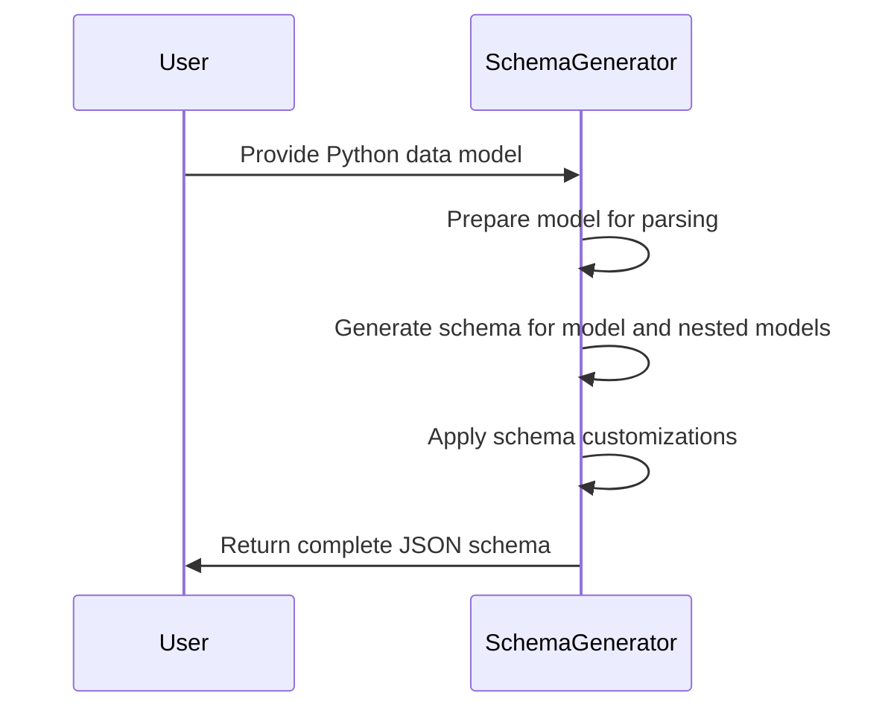
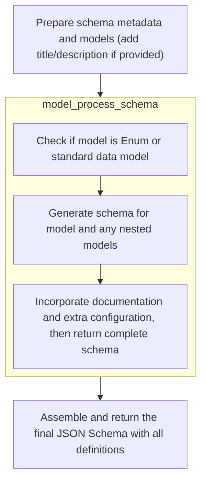

This flow generates a JSON schema from a Python data model by preparing the model, recursively processing nested models, applying customizations, and assembling the complete schema with all definitions.

The main steps are:

- Prepare the input model for schema generation
- Generate schemas for the model and nested models
- Apply user-defined schema customizations
- Collect and assemble all schema definitions into the final output



# Spec

## Detailed View of the Program's Functionality

a. Entry Point: Creating a Schema from a Type

The process begins when a user wants to generate a JSON schema for a given Python type (such as a Pydantic model or a type hint). The entry point for this is a function that takes the type and optional parameters (like a title for the schema). This function prepares the type for parsing by wrapping it in a dynamically generated Pydantic model if necessary. It does this by calling a helper that either uses a provided name or generates one, then creates a model with a single root field of the given type. Once the parsing type is ready, it immediately calls the model's schema method, passing along any additional keyword arguments. This hands off the actual schema generation to the next layer, ensuring that all options and customizations are handled in one place.

b. Collecting Models and Preparing Schema Generation

The schema generation function is responsible for producing a complete JSON schema for one or more models, including all nested and referenced <SwmToken path="pydantic/v1/schema.py" pos="120:14:16" line-data="    top-level JSON key, including their sub-models.">`sub-models`</SwmToken>. It first normalizes the input models, ensuring they are all proper Pydantic models. It then collects all unique models and <SwmToken path="pydantic/v1/schema.py" pos="120:14:16" line-data="    top-level JSON key, including their sub-models.">`sub-models`</SwmToken> that might be referenced, building a mapping from each model to a unique name (to avoid naming collisions). It prepares an empty dictionary to hold schema definitions and an output dictionary for the final schema. If a title or description is provided, these are added to the output. The function then loops through each model, calling a function to process each model and generate its schema, along with any additional definitions from nested models. All collected definitions are merged, and each model's schema is added to the definitions under its unique name.

c. Processing Each Model and Handling Customization

For each model, a dedicated function is called to generate its schema. This function first checks if the model is an enumeration (Enum). If so, it delegates to a specialized function for enums and returns immediately, as enums have a different schema structure. If the model is a standard data model, it prepares a schema dictionary with a title (from the model's config or class name) and, if available, a description (from the model's docstring). The model is added to a set of known models to avoid recursion issues. The function then calls another helper to build out the main schema for the model, which includes its fields and any nested models. The resulting schema and definitions are merged into the schema dictionary.

d. Building the Core Schema for Each Model

The core schema for a model is constructed by iterating over all its fields. For each field, a function is called to generate the field's schema, which may itself reference other models or types. The field's schema, any additional definitions, and any nested models are collected. If the schema should use field aliases, the alias is used as the property name; otherwise, the original field name is used. Required fields are tracked. If the model uses a special root field, the schema is set to that field's schema, with the appropriate title. Otherwise, the schema is set as an object with properties and required fields. If the model is configured to forbid extra properties, this is reflected in the schema. The function returns the schema, all collected definitions, and the set of nested models.

e. Applying Schema Customizations and Returning Results

After the core schema is built, the function checks if the model has any extra schema customizations defined in its configuration. If such customizations exist and are callable, it determines whether the function expects one or two arguments and calls it accordingly, allowing the user to modify the schema in place. If the customization is a dictionary, it is merged into the schema. This mechanism allows users to tweak the generated schema as needed. Finally, the function returns the finalized schema, all collected definitions, and the set of nested models.

f. Finalizing and Returning the Complete Schema

Back in the main schema generation function, after all models have been processed and their definitions collected, the function checks if there are any definitions to include. If so, these are attached to the output schema under the "definitions" key. The final schema dictionary, now containing the schema for the requested models and all referenced <SwmToken path="pydantic/v1/schema.py" pos="120:14:16" line-data="    top-level JSON key, including their sub-models.">`sub-models`</SwmToken>, is returned to the caller. This completes the schema generation process, providing a comprehensive JSON schema representation of the input type(s).

# Rule Definition

| Paragraph Name                                                                                                                                                                                                                                                                                                                                                                                                                                                                                                                                                                                                                                                                                                                                                                                                                                                                                            | Rule ID | Category          | Description                                                                                                                                                                                                                                                                                                                                                | Conditions                                                                                                                                                                                                                                       | Remarks                                                                                                                                                                                                                                                                                                                                                                                                                                                                                                                           |
| --------------------------------------------------------------------------------------------------------------------------------------------------------------------------------------------------------------------------------------------------------------------------------------------------------------------------------------------------------------------------------------------------------------------------------------------------------------------------------------------------------------------------------------------------------------------------------------------------------------------------------------------------------------------------------------------------------------------------------------------------------------------------------------------------------------------------------------------------------------------------------------------------------- | ------- | ----------------- | ---------------------------------------------------------------------------------------------------------------------------------------------------------------------------------------------------------------------------------------------------------------------------------------------------------------------------------------------------------- | ------------------------------------------------------------------------------------------------------------------------------------------------------------------------------------------------------------------------------------------------ | --------------------------------------------------------------------------------------------------------------------------------------------------------------------------------------------------------------------------------------------------------------------------------------------------------------------------------------------------------------------------------------------------------------------------------------------------------------------------------------------------------------------------------- |
| <SwmToken path="pydantic/v1/tools.py" pos="85:2:2" line-data="def schema_of(type_: Any, *, title: Optional[NameFactory] = None, **schema_kwargs: Any) -&gt; &#39;DictStrAny&#39;:">`schema_of`</SwmToken>, <SwmToken path="pydantic/v1/schema.py" pos="562:6:6" line-data="    Used by ``model_schema()``, you probably should be using that function.">`model_schema`</SwmToken>, <SwmToken path="pydantic/v1/schema.py" pos="147:11:11" line-data="        m_schema, m_definitions, m_nested_models = model_process_schema(">`model_process_schema`</SwmToken>, <SwmToken path="pydantic/v1/schema.py" pos="581:11:11" line-data="    m_schema, m_definitions, nested_models = model_type_schema(">`model_type_schema`</SwmToken>, <SwmToken path="pydantic/v1/schema.py" pos="573:5:5" line-data="        s = enum_process_schema(model, field=field)">`enum_process_schema`</SwmToken>                | RL-001  | Computation       | The system must generate a JSON Schema dictionary for a given Python type (<SwmToken path="pydantic/v1/schema.py" pos="110:11:11" line-data="    models: Sequence[Union[Type[&#39;BaseModel&#39;], Type[&#39;Dataclass&#39;]]],">`BaseModel`</SwmToken> subclass or Enum), including all nested models and their definitions in the 'definitions' section. | A Python type (<SwmToken path="pydantic/v1/schema.py" pos="110:11:11" line-data="    models: Sequence[Union[Type[&#39;BaseModel&#39;], Type[&#39;Dataclass&#39;]]],">`BaseModel`</SwmToken> subclass or Enum) is provided as input.              | The output is a dictionary following the JSON Schema specification. Top-level keys include 'title', 'type', 'properties', 'required', and 'definitions' as applicable. Nested models are included in 'definitions'.                                                                                                                                                                                                                                                                                                               |
| <SwmToken path="pydantic/v1/schema.py" pos="147:11:11" line-data="        m_schema, m_definitions, m_nested_models = model_process_schema(">`model_process_schema`</SwmToken>                                                                                                                                                                                                                                                                                                                                                                                                                                                                                                                                                                                                                                                                                                                             | RL-002  | Conditional Logic | The system must support schema customization via a <SwmToken path="pydantic/v1/schema.py" pos="590:1:1" line-data="    schema_extra = model.__config__.schema_extra">`schema_extra`</SwmToken> configuration, which may be a dictionary or a function, and apply it after generating the base schema for a model.                                          | The model's config includes a <SwmToken path="pydantic/v1/schema.py" pos="590:1:1" line-data="    schema_extra = model.__config__.schema_extra">`schema_extra`</SwmToken> attribute (either a dict or a callable).                               | <SwmToken path="pydantic/v1/schema.py" pos="590:1:1" line-data="    schema_extra = model.__config__.schema_extra">`schema_extra`</SwmToken> can be a dict (merged into the schema) or a function (called with the schema and optionally the model). Customization is applied after the base schema is generated.                                                                                                                                                                                                                  |
| <SwmToken path="pydantic/v1/schema.py" pos="581:11:11" line-data="    m_schema, m_definitions, nested_models = model_type_schema(">`model_type_schema`</SwmToken>, <SwmToken path="pydantic/v1/schema.py" pos="97:21:21" line-data="    modify_schema: Callable[..., None], field: Optional[ModelField], field_schema: Dict[str, Any]">`field_schema`</SwmToken>, <SwmToken path="pydantic/v1/schema.py" pos="255:11:11" line-data="    f_schema, f_definitions, f_nested_models = field_type_schema(">`field_type_schema`</SwmToken>, <SwmToken path="pydantic/v1/schema.py" pos="462:11:11" line-data="        items_schema, f_definitions, f_nested_models = field_singleton_schema(">`field_singleton_schema`</SwmToken>, <SwmToken path="pydantic/v1/schema.py" pos="194:5:5" line-data="        m_schema = get_schema_ref(model_name, ref_prefix, ref_template, False)">`get_schema_ref`</SwmToken> | RL-003  | Conditional Logic | For fields that are themselves models, the schema must reference the nested model using a '$ref' key pointing to the corresponding entry in 'definitions', and ensure each nested model appears only once.                                                                                                                                                 | A field's type is a <SwmToken path="pydantic/v1/schema.py" pos="110:11:11" line-data="    models: Sequence[Union[Type[&#39;BaseModel&#39;], Type[&#39;Dataclass&#39;]]],">`BaseModel`</SwmToken> subclass or Enum and is used as a nested model. | References use the '$ref' key, with customizable prefixes/templates. Each nested model appears only once in 'definitions'.                                                                                                                                                                                                                                                                                                                                                                                                        |
| <SwmToken path="pydantic/v1/schema.py" pos="581:11:11" line-data="    m_schema, m_definitions, nested_models = model_type_schema(">`model_type_schema`</SwmToken>, <SwmToken path="pydantic/v1/schema.py" pos="97:21:21" line-data="    modify_schema: Callable[..., None], field: Optional[ModelField], field_schema: Dict[str, Any]">`field_schema`</SwmToken>, <SwmToken path="pydantic/v1/schema.py" pos="139:5:5" line-data="    model_name_map = get_model_name_map(flat_models)">`get_model_name_map`</SwmToken>, <SwmToken path="pydantic/v1/schema.py" pos="194:5:5" line-data="        m_schema = get_schema_ref(model_name, ref_prefix, ref_template, False)">`get_schema_ref`</SwmToken>                                                                                                                                                                                                      | RL-004  | Data Assignment   | The system must support the use of field aliases in the schema, include optional metadata such as 'title' and 'description', and allow reference formatting via customizable prefixes and templates.                                                                                                                                                       | Field aliases are specified, or optional metadata (title, description) is provided, or custom reference formatting is requested.                                                                                                                 | Field aliases are used as property names if <SwmToken path="pydantic/v1/schema.py" pos="112:1:1" line-data="    by_alias: bool = True,">`by_alias`</SwmToken> is True. Metadata fields are included if provided. Reference formatting uses <SwmToken path="pydantic/v1/schema.py" pos="115:1:1" line-data="    ref_prefix: Optional[str] = None,">`ref_prefix`</SwmToken> and <SwmToken path="pydantic/v1/schema.py" pos="116:1:1" line-data="    ref_template: str = default_ref_template,">`ref_template`</SwmToken> constants. |
| <SwmToken path="pydantic/v1/schema.py" pos="581:11:11" line-data="    m_schema, m_definitions, nested_models = model_type_schema(">`model_type_schema`</SwmToken>, <SwmToken path="pydantic/v1/schema.py" pos="97:21:21" line-data="    modify_schema: Callable[..., None], field: Optional[ModelField], field_schema: Dict[str, Any]">`field_schema`</SwmToken>, <SwmToken path="pydantic/v1/schema.py" pos="200:2:2" line-data="def get_field_info_schema(field: ModelField, schema_overrides: bool = False) -&gt; Tuple[Dict[str, Any], bool]:">`get_field_info_schema`</SwmToken>                                                                                                                                                                                                                                                                                                                     | RL-005  | Data Assignment   | The system must ensure that all required fields for each model are listed in the 'required' array, and each property in the 'properties' dictionary includes its type, title, and any other relevant metadata.                                                                                                                                             | A model has required fields or fields with metadata.                                                                                                                                                                                             | 'required' is a list of field names. Each property includes keys such as 'type', 'title', and other metadata as applicable.                                                                                                                                                                                                                                                                                                                                                                                                       |
| <SwmToken path="pydantic/v1/tools.py" pos="85:2:2" line-data="def schema_of(type_: Any, *, title: Optional[NameFactory] = None, **schema_kwargs: Any) -&gt; &#39;DictStrAny&#39;:">`schema_of`</SwmToken>, <SwmToken path="pydantic/v1/schema.py" pos="562:6:6" line-data="    Used by ``model_schema()``, you probably should be using that function.">`model_schema`</SwmToken>, <SwmToken path="pydantic/v1/schema.py" pos="147:11:11" line-data="        m_schema, m_definitions, m_nested_models = model_process_schema(">`model_process_schema`</SwmToken>                                                                                                                                                                                                                                                                                                                                          | RL-006  | Data Assignment   | The system must allow for the inclusion of additional schema options via keyword arguments, which are passed through to the schema generation process.                                                                                                                                                                                                     | Additional keyword arguments are provided to the schema generation function.                                                                                                                                                                     | Keyword arguments are passed to the schema generation functions and may affect the output schema.                                                                                                                                                                                                                                                                                                                                                                                                                                 |

# User Stories

## User Story 1: Comprehensive and Extensible JSON Schema Generation

---

### Story Description:

As a user, I want to generate a JSON Schema dictionary for a given Python type, including all nested models, references, required fields, property metadata, and support for additional schema options via keyword arguments, so that I can validate and document my data models according to the JSON Schema specification and customize the schema generation process as needed.

---

### Business Rule Mapping:

| Rule ID | Paragraph Name                                                                                                                                                                                                                                                                                                                                                                                                                                                                                                                                                                                                                                                                                                                                                                                                                                                                                            | Rule Description                                                                                                                                                                                                                                                                                                                                           |
| ------- | --------------------------------------------------------------------------------------------------------------------------------------------------------------------------------------------------------------------------------------------------------------------------------------------------------------------------------------------------------------------------------------------------------------------------------------------------------------------------------------------------------------------------------------------------------------------------------------------------------------------------------------------------------------------------------------------------------------------------------------------------------------------------------------------------------------------------------------------------------------------------------------------------------- | ---------------------------------------------------------------------------------------------------------------------------------------------------------------------------------------------------------------------------------------------------------------------------------------------------------------------------------------------------------- |
| RL-001  | <SwmToken path="pydantic/v1/tools.py" pos="85:2:2" line-data="def schema_of(type_: Any, *, title: Optional[NameFactory] = None, **schema_kwargs: Any) -&gt; &#39;DictStrAny&#39;:">`schema_of`</SwmToken>, <SwmToken path="pydantic/v1/schema.py" pos="562:6:6" line-data="    Used by ``model_schema()``, you probably should be using that function.">`model_schema`</SwmToken>, <SwmToken path="pydantic/v1/schema.py" pos="147:11:11" line-data="        m_schema, m_definitions, m_nested_models = model_process_schema(">`model_process_schema`</SwmToken>, <SwmToken path="pydantic/v1/schema.py" pos="581:11:11" line-data="    m_schema, m_definitions, nested_models = model_type_schema(">`model_type_schema`</SwmToken>, <SwmToken path="pydantic/v1/schema.py" pos="573:5:5" line-data="        s = enum_process_schema(model, field=field)">`enum_process_schema`</SwmToken>                | The system must generate a JSON Schema dictionary for a given Python type (<SwmToken path="pydantic/v1/schema.py" pos="110:11:11" line-data="    models: Sequence[Union[Type[&#39;BaseModel&#39;], Type[&#39;Dataclass&#39;]]],">`BaseModel`</SwmToken> subclass or Enum), including all nested models and their definitions in the 'definitions' section. |
| RL-006  | <SwmToken path="pydantic/v1/tools.py" pos="85:2:2" line-data="def schema_of(type_: Any, *, title: Optional[NameFactory] = None, **schema_kwargs: Any) -&gt; &#39;DictStrAny&#39;:">`schema_of`</SwmToken>, <SwmToken path="pydantic/v1/schema.py" pos="562:6:6" line-data="    Used by ``model_schema()``, you probably should be using that function.">`model_schema`</SwmToken>, <SwmToken path="pydantic/v1/schema.py" pos="147:11:11" line-data="        m_schema, m_definitions, m_nested_models = model_process_schema(">`model_process_schema`</SwmToken>                                                                                                                                                                                                                                                                                                                                          | The system must allow for the inclusion of additional schema options via keyword arguments, which are passed through to the schema generation process.                                                                                                                                                                                                     |
| RL-003  | <SwmToken path="pydantic/v1/schema.py" pos="581:11:11" line-data="    m_schema, m_definitions, nested_models = model_type_schema(">`model_type_schema`</SwmToken>, <SwmToken path="pydantic/v1/schema.py" pos="97:21:21" line-data="    modify_schema: Callable[..., None], field: Optional[ModelField], field_schema: Dict[str, Any]">`field_schema`</SwmToken>, <SwmToken path="pydantic/v1/schema.py" pos="255:11:11" line-data="    f_schema, f_definitions, f_nested_models = field_type_schema(">`field_type_schema`</SwmToken>, <SwmToken path="pydantic/v1/schema.py" pos="462:11:11" line-data="        items_schema, f_definitions, f_nested_models = field_singleton_schema(">`field_singleton_schema`</SwmToken>, <SwmToken path="pydantic/v1/schema.py" pos="194:5:5" line-data="        m_schema = get_schema_ref(model_name, ref_prefix, ref_template, False)">`get_schema_ref`</SwmToken> | For fields that are themselves models, the schema must reference the nested model using a '$ref' key pointing to the corresponding entry in 'definitions', and ensure each nested model appears only once.                                                                                                                                                 |
| RL-005  | <SwmToken path="pydantic/v1/schema.py" pos="581:11:11" line-data="    m_schema, m_definitions, nested_models = model_type_schema(">`model_type_schema`</SwmToken>, <SwmToken path="pydantic/v1/schema.py" pos="97:21:21" line-data="    modify_schema: Callable[..., None], field: Optional[ModelField], field_schema: Dict[str, Any]">`field_schema`</SwmToken>, <SwmToken path="pydantic/v1/schema.py" pos="200:2:2" line-data="def get_field_info_schema(field: ModelField, schema_overrides: bool = False) -&gt; Tuple[Dict[str, Any], bool]:">`get_field_info_schema`</SwmToken>                                                                                                                                                                                                                                                                                                                     | The system must ensure that all required fields for each model are listed in the 'required' array, and each property in the 'properties' dictionary includes its type, title, and any other relevant metadata.                                                                                                                                             |

---

### Relevant Functionality:

- <SwmToken path="pydantic/v1/tools.py" pos="85:2:2" line-data="def schema_of(type_: Any, *, title: Optional[NameFactory] = None, **schema_kwargs: Any) -&gt; &#39;DictStrAny&#39;:">`schema_of`</SwmToken>
  1. **RL-001:**
     - Receive a Python type as input
     - If the type is an Enum, generate an enum schema with all possible values
     - If the type is a <SwmToken path="pydantic/v1/schema.py" pos="110:11:11" line-data="    models: Sequence[Union[Type[&#39;BaseModel&#39;], Type[&#39;Dataclass&#39;]]],">`BaseModel`</SwmToken>, generate a schema with 'type', 'properties', 'required', and recursively process nested models
     - Collect all nested models and include their schemas in the 'definitions' section
     - Return the complete schema dictionary
  2. **RL-006:**
     - Accept additional keyword arguments in the schema generation function
     - Pass these arguments to the underlying schema generation logic
- <SwmToken path="pydantic/v1/schema.py" pos="581:11:11" line-data="    m_schema, m_definitions, nested_models = model_type_schema(">`model_type_schema`</SwmToken>
  1. **RL-003:**
     - For each field in a model:
       - If the field is a nested model:
         - Add a '$ref' to the nested model's schema in 'definitions'
         - Ensure the nested model is only added once to 'definitions'
  2. **RL-005:**
     - For each field in the model:
       - If the field is required, add its name to the 'required' array
       - For each property, include its type, title, and metadata in the schema

## User Story 2: Schema Output Customization and Formatting

---

### Story Description:

As a user, I want to customize the generated schema using <SwmToken path="pydantic/v1/schema.py" pos="590:1:1" line-data="    schema_extra = model.__config__.schema_extra">`schema_extra`</SwmToken>, use field aliases, include optional metadata such as 'title' and 'description', and customize reference formatting, so that the schema output matches my specific requirements and documentation standards.

---

### Business Rule Mapping:

| Rule ID | Paragraph Name                                                                                                                                                                                                                                                                                                                                                                                                                                                                                                                                                                                                                                                                                       | Rule Description                                                                                                                                                                                                                                                                                                  |
| ------- | ---------------------------------------------------------------------------------------------------------------------------------------------------------------------------------------------------------------------------------------------------------------------------------------------------------------------------------------------------------------------------------------------------------------------------------------------------------------------------------------------------------------------------------------------------------------------------------------------------------------------------------------------------------------------------------------------------- | ----------------------------------------------------------------------------------------------------------------------------------------------------------------------------------------------------------------------------------------------------------------------------------------------------------------- |
| RL-002  | <SwmToken path="pydantic/v1/schema.py" pos="147:11:11" line-data="        m_schema, m_definitions, m_nested_models = model_process_schema(">`model_process_schema`</SwmToken>                                                                                                                                                                                                                                                                                                                                                                                                                                                                                                                        | The system must support schema customization via a <SwmToken path="pydantic/v1/schema.py" pos="590:1:1" line-data="    schema_extra = model.__config__.schema_extra">`schema_extra`</SwmToken> configuration, which may be a dictionary or a function, and apply it after generating the base schema for a model. |
| RL-004  | <SwmToken path="pydantic/v1/schema.py" pos="581:11:11" line-data="    m_schema, m_definitions, nested_models = model_type_schema(">`model_type_schema`</SwmToken>, <SwmToken path="pydantic/v1/schema.py" pos="97:21:21" line-data="    modify_schema: Callable[..., None], field: Optional[ModelField], field_schema: Dict[str, Any]">`field_schema`</SwmToken>, <SwmToken path="pydantic/v1/schema.py" pos="139:5:5" line-data="    model_name_map = get_model_name_map(flat_models)">`get_model_name_map`</SwmToken>, <SwmToken path="pydantic/v1/schema.py" pos="194:5:5" line-data="        m_schema = get_schema_ref(model_name, ref_prefix, ref_template, False)">`get_schema_ref`</SwmToken> | The system must support the use of field aliases in the schema, include optional metadata such as 'title' and 'description', and allow reference formatting via customizable prefixes and templates.                                                                                                              |

---

### Relevant Functionality:

- <SwmToken path="pydantic/v1/schema.py" pos="147:11:11" line-data="        m_schema, m_definitions, m_nested_models = model_process_schema(">`model_process_schema`</SwmToken>
  1. **RL-002:**
     - After generating the base schema for a model:
       - If <SwmToken path="pydantic/v1/schema.py" pos="590:1:1" line-data="    schema_extra = model.__config__.schema_extra">`schema_extra`</SwmToken> is a function:
         - Call it with the schema (and model if the function accepts two arguments)
       - If <SwmToken path="pydantic/v1/schema.py" pos="590:1:1" line-data="    schema_extra = model.__config__.schema_extra">`schema_extra`</SwmToken> is a dict:
         - Merge it into the schema
- <SwmToken path="pydantic/v1/schema.py" pos="581:11:11" line-data="    m_schema, m_definitions, nested_models = model_type_schema(">`model_type_schema`</SwmToken>
  1. **RL-004:**
     - When generating properties:
       - Use field aliases if <SwmToken path="pydantic/v1/schema.py" pos="112:1:1" line-data="    by_alias: bool = True,">`by_alias`</SwmToken> is True
       - Include 'title' and 'description' if provided
       - Format references using the specified prefix/template

# Code Walkthrough

## Entry Point: Creating a Schema from a Type

<SwmSnippet path="/pydantic/v1/tools.py" line="85">

---

<SwmToken path="pydantic/v1/tools.py" pos="85:2:2" line-data="def schema_of(type_: Any, *, title: Optional[NameFactory] = None, **schema_kwargs: Any) -&gt; &#39;DictStrAny&#39;:">`schema_of`</SwmToken> kicks off the flow by preparing the type (using <SwmToken path="pydantic/v1/tools.py" pos="87:3:3" line-data="    return _get_parsing_type(type_, type_name=title).schema(**schema_kwargs)">`_get_parsing_type`</SwmToken>) and then immediately calls its schema method. This hands off the actual schema generation to the next layer, so we don't duplicate logic and can leverage all the options and customizations handled there.

```python
def schema_of(type_: Any, *, title: Optional[NameFactory] = None, **schema_kwargs: Any) -> 'DictStrAny':
    """Generate a JSON schema (as dict) for the passed model or dynamically generated one"""
    return _get_parsing_type(type_, type_name=title).schema(**schema_kwargs)
```

---

</SwmSnippet>

## Collecting Models and Preparing Schema Generation



<SwmSnippet path="/pydantic/v1/schema.py" line="109">

---

In <SwmToken path="pydantic/v1/schema.py" pos="109:2:2" line-data="def schema(">`schema`</SwmToken>, we prep the models and loop through each one, calling <SwmToken path="pydantic/v1/schema.py" pos="147:11:11" line-data="        m_schema, m_definitions, m_nested_models = model_process_schema(">`model_process_schema`</SwmToken> to generate their individual schemas and collect all nested definitions. This way, every model and its <SwmToken path="pydantic/v1/schema.py" pos="120:14:16" line-data="    top-level JSON key, including their sub-models.">`sub-models`</SwmToken> are included in the output.

```python
def schema(
    models: Sequence[Union[Type['BaseModel'], Type['Dataclass']]],
    *,
    by_alias: bool = True,
    title: Optional[str] = None,
    description: Optional[str] = None,
    ref_prefix: Optional[str] = None,
    ref_template: str = default_ref_template,
) -> Dict[str, Any]:
    """
    Process a list of models and generate a single JSON Schema with all of them defined in the ``definitions``
    top-level JSON key, including their sub-models.

    :param models: a list of models to include in the generated JSON Schema
    :param by_alias: generate the schemas using the aliases defined, if any
    :param title: title for the generated schema that includes the definitions
    :param description: description for the generated schema
    :param ref_prefix: the JSON Pointer prefix for schema references with ``$ref``, if None, will be set to the
      default of ``#/definitions/``. Update it if you want the schemas to reference the definitions somewhere
      else, e.g. for OpenAPI use ``#/components/schemas/``. The resulting generated schemas will still be at the
      top-level key ``definitions``, so you can extract them from there. But all the references will have the set
      prefix.
    :param ref_template: Use a ``string.format()`` template for ``$ref`` instead of a prefix. This can be useful
      for references that cannot be represented by ``ref_prefix`` such as a definition stored in another file. For
      a sibling json file in a ``/schemas`` directory use ``"/schemas/${model}.json#"``.
    :return: dict with the JSON Schema with a ``definitions`` top-level key including the schema definitions for
      the models and sub-models passed in ``models``.
    """
    clean_models = [get_model(model) for model in models]
    flat_models = get_flat_models_from_models(clean_models)
    model_name_map = get_model_name_map(flat_models)
    definitions = {}
    output_schema: Dict[str, Any] = {}
    if title:
        output_schema['title'] = title
    if description:
        output_schema['description'] = description
    for model in clean_models:
        m_schema, m_definitions, m_nested_models = model_process_schema(
            model,
            by_alias=by_alias,
            model_name_map=model_name_map,
            ref_prefix=ref_prefix,
            ref_template=ref_template,
        )
        definitions.update(m_definitions)
        model_name = model_name_map[model]
        definitions[model_name] = m_schema
```

---

</SwmSnippet>

### Processing Each Model and Handling Customization

<SwmSnippet path="/pydantic/v1/schema.py" line="551">

---

In <SwmToken path="pydantic/v1/schema.py" pos="551:2:2" line-data="def model_process_schema(">`model_process_schema`</SwmToken>, we branch early if the model is an Enum (using <SwmToken path="pydantic/v1/schema.py" pos="573:5:5" line-data="        s = enum_process_schema(model, field=field)">`enum_process_schema`</SwmToken>), otherwise we prep the schema dict, track processed models, and then call <SwmToken path="pydantic/v1/schema.py" pos="581:11:11" line-data="    m_schema, m_definitions, nested_models = model_type_schema(">`model_type_schema`</SwmToken> to build out the main schema and collect nested definitions. This keeps Enum and <SwmToken path="pydantic/v1/schema.py" pos="575:10:10" line-data="    model = cast(Type[&#39;BaseModel&#39;], model)">`BaseModel`</SwmToken> logic separate and avoids recursion issues.

```python
def model_process_schema(
    model: TypeModelOrEnum,
    *,
    by_alias: bool = True,
    model_name_map: Dict[TypeModelOrEnum, str],
    ref_prefix: Optional[str] = None,
    ref_template: str = default_ref_template,
    known_models: Optional[TypeModelSet] = None,
    field: Optional[ModelField] = None,
) -> Tuple[Dict[str, Any], Dict[str, Any], Set[str]]:
    """
    Used by ``model_schema()``, you probably should be using that function.

    Take a single ``model`` and generate its schema. Also return additional schema definitions, from sub-models. The
    sub-models of the returned schema will be referenced, but their definitions will not be included in the schema. All
    the definitions are returned as the second value.
    """
    from inspect import getdoc, signature

    known_models = known_models or set()
    if lenient_issubclass(model, Enum):
        model = cast(Type[Enum], model)
        s = enum_process_schema(model, field=field)
        return s, {}, set()
    model = cast(Type['BaseModel'], model)
    s = {'title': model.__config__.title or model.__name__}
    doc = getdoc(model)
    if doc:
        s['description'] = doc
    known_models.add(model)
    m_schema, m_definitions, nested_models = model_type_schema(
        model,
        by_alias=by_alias,
        model_name_map=model_name_map,
        ref_prefix=ref_prefix,
        ref_template=ref_template,
        known_models=known_models,
    )
```

---

</SwmSnippet>

#### Building the Core Schema for Each Model

See <SwmLink doc-title="Generating JSON Schema for Data Models">[Generating JSON Schema for Data Models](/.swm/generating-json-schema-for-data-models.zf05fljl.sw.md)</SwmLink>

#### Applying Schema Customizations and Returning Results

```mermaid
%%{init: {"flowchart": {"defaultRenderer": "elk"}} }%%
flowchart TD
    node1["Update schema with base model schema"] --> node2{"Is schema_extra (customization) a function?"}
    click node1 openCode "pydantic/v1/schema.py:589:590"
    node2 -->|"Yes"| node3{"Does schema_extra expect 1 or 2 arguments?"}
    click node2 openCode "pydantic/v1/schema.py:591:591"
    node3 -->|"1"| node4["Apply customization: schema_extra("schema")"]
    click node3 openCode "pydantic/v1/schema.py:592:593"
    node3 -->|"2"| node5["Apply customization: schema_extra("schema, model")"]
    click node5 openCode "pydantic/v1/schema.py:594:595"
    node2 -->|"No"| node6["Update schema with schema_extra dictionary"]
    click node6 openCode "pydantic/v1/schema.py:597:597"
    node4 --> node7["Return finalized schema, definitions, and nested models"]
    click node7 openCode "pydantic/v1/schema.py:598:598"
    node5 --> node7
    node6 --> node7

%% Swimm:
%% %%{init: {"flowchart": {"defaultRenderer": "elk"}} }%%
%% flowchart TD
%%     node1["Update schema with base model schema"] --> node2{"Is <SwmToken path="pydantic/v1/schema.py" pos="590:1:1" line-data="    schema_extra = model.__config__.schema_extra">`schema_extra`</SwmToken> (customization) a function?"}
%%     click node1 openCode "<SwmPath>[pydantic/v1/schema.py](pydantic/v1/schema.py)</SwmPath>:589:590"
%%     node2 -->|"Yes"| node3{"Does <SwmToken path="pydantic/v1/schema.py" pos="590:1:1" line-data="    schema_extra = model.__config__.schema_extra">`schema_extra`</SwmToken> expect 1 or 2 arguments?"}
%%     click node2 openCode "<SwmPath>[pydantic/v1/schema.py](pydantic/v1/schema.py)</SwmPath>:591:591"
%%     node3 -->|"1"| node4["Apply customization: <SwmToken path="pydantic/v1/schema.py" pos="590:1:1" line-data="    schema_extra = model.__config__.schema_extra">`schema_extra`</SwmToken>("schema")"]
%%     click node3 openCode "<SwmPath>[pydantic/v1/schema.py](pydantic/v1/schema.py)</SwmPath>:592:593"
%%     node3 -->|"2"| node5["Apply customization: <SwmToken path="pydantic/v1/schema.py" pos="590:1:1" line-data="    schema_extra = model.__config__.schema_extra">`schema_extra`</SwmToken>("schema, model")"]
%%     click node5 openCode "<SwmPath>[pydantic/v1/schema.py](pydantic/v1/schema.py)</SwmPath>:594:595"
%%     node2 -->|"No"| node6["Update schema with <SwmToken path="pydantic/v1/schema.py" pos="590:1:1" line-data="    schema_extra = model.__config__.schema_extra">`schema_extra`</SwmToken> dictionary"]
%%     click node6 openCode "<SwmPath>[pydantic/v1/schema.py](pydantic/v1/schema.py)</SwmPath>:597:597"
%%     node4 --> node7["Return finalized schema, definitions, and nested models"]
%%     click node7 openCode "<SwmPath>[pydantic/v1/schema.py](pydantic/v1/schema.py)</SwmPath>:598:598"
%%     node5 --> node7
%%     node6 --> node7
```

<SwmSnippet path="/pydantic/v1/schema.py" line="589">

---

Back in <SwmToken path="pydantic/v1/schema.py" pos="147:11:11" line-data="        m_schema, m_definitions, m_nested_models = model_process_schema(">`model_process_schema`</SwmToken>, after getting <SwmToken path="pydantic/v1/schema.py" pos="589:5:5" line-data="    s.update(m_schema)">`m_schema`</SwmToken> and definitions from <SwmToken path="pydantic/v1/schema.py" pos="581:11:11" line-data="    m_schema, m_definitions, nested_models = model_type_schema(">`model_type_schema`</SwmToken>, we merge those into our schema dict. Then, if <SwmToken path="pydantic/v1/schema.py" pos="590:1:1" line-data="    schema_extra = model.__config__.schema_extra">`schema_extra`</SwmToken> is set, we apply it (either as a dict or by calling it), so users can tweak the schema before we return everything.

```python
    s.update(m_schema)
    schema_extra = model.__config__.schema_extra
    if callable(schema_extra):
        if len(signature(schema_extra).parameters) == 1:
            schema_extra(s)
        else:
            schema_extra(s, model)
    else:
        s.update(schema_extra)
    return s, m_definitions, nested_models
```

---

</SwmSnippet>

### Finalizing and Returning the Complete Schema

<SwmSnippet path="/pydantic/v1/schema.py" line="157">

---

Back in <SwmToken path="pydantic/v1/tools.py" pos="86:10:10" line-data="    &quot;&quot;&quot;Generate a JSON schema (as dict) for the passed model or dynamically generated one&quot;&quot;&quot;">`schema`</SwmToken>, after collecting all the definitions from <SwmToken path="pydantic/v1/schema.py" pos="147:11:11" line-data="        m_schema, m_definitions, m_nested_models = model_process_schema(">`model_process_schema`</SwmToken>, we attach them to the <SwmToken path="pydantic/v1/schema.py" pos="158:1:1" line-data="        output_schema[&#39;definitions&#39;] = definitions">`output_schema`</SwmToken> if there are any, and then return the final schema dict. This wraps up the whole schema generation process.

```python
    if definitions:
        output_schema['definitions'] = definitions
    return output_schema
```

---

</SwmSnippet>

&nbsp;

*This is an auto-generated document by Swimm 🌊 and has not yet been verified by a human*

<SwmMeta version="3.0.0" repo-id="Z2l0aHViJTNBJTNBcHlkYW50aWMlM0ElM0FTd2ltbS1EZW1v" repo-name="pydantic"><sup>Powered by [Swimm](/)</sup></SwmMeta>
