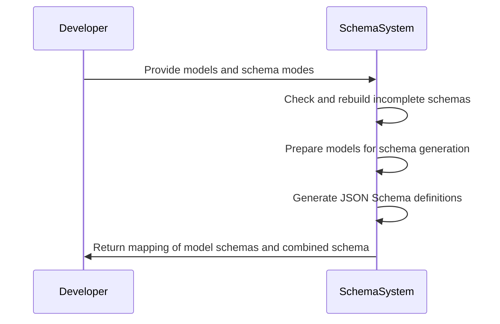
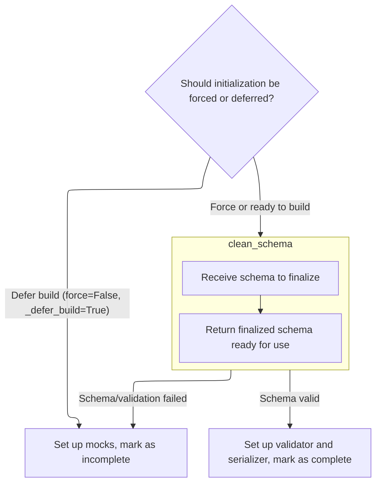

This document explains how JSON Schemas are generated for multiple models, ensuring each schema is complete and ready for use. The process involves rebuilding incomplete schemas, generating JSON Schema definitions, and assembling a comprehensive output that includes all definitions and optional metadata.

The main steps are:

- Check and rebuild incomplete model schemas.
- Prepare models for schema generation.
- Generate JSON Schema definitions.
- Assemble the final output with definitions and metadata.



# Spec

## Detailed View of the Program's Functionality

a. Preparing Models for JSON Schema Generation

The process begins by iterating over a collection of models, where each model is paired with a mode (such as 'validation' or 'serialization'). For each model, the system checks whether its internal schema representation is a mock (<SwmToken path="pydantic/json_schema.py" pos="165:14:16" line-data="            # if it introduces no ambiguity, i.e., there is only one distinct schema for that DefsRef.">`i.e`</SwmToken>., a placeholder that cannot be used for real JSON schema generation). If a mock is detected, the system triggers a rebuild process to ensure the schema is fully constructed and usable. This step is crucial because only complete schemas can be accurately converted into JSON Schema representations.

b. Resolving Forward References and Completing Schemas

When a schema needs to be rebuilt (either because it is a mock or because a forced rebuild is requested), the system determines the appropriate namespace context for resolving type hints and forward references. This involves checking if an explicit namespace is provided, if a parent frame should be used, or if an empty namespace should be used as a fallback. Once the namespace is determined, the system proceeds to initialize the core schema attributes, which includes building or updating the schema, validator, and serializer. If the schema is already complete and no force is requested, the rebuild operation is skipped.

c. Building or Mocking Core Schema Attributes

During the initialization of core schema attributes, the system decides whether to defer the build (using mocks) or to proceed with finalizing the schema. If a deferred build is requested and not forced, mocks are set up and the schema is marked as incomplete. Otherwise, the system attempts to retrieve the schema, validator, and serializer directly from the type. If any of these are missing or are still mocks, a new schema is generated using a schema generator. This newly generated schema is then passed through a cleaning process to ensure it is finalized and ready for use. If any errors occur during schema generation or cleaning, mocks are set up instead.

d. Finalizing the Core Schema Structure

The cleaning process for the schema involves passing it to a finalization function, which resolves references and ensures the schema is fully processed. This step guarantees that all internal references are correctly handled and that the schema is in a consistent state for further use.

e. Completing Validator and Serializer Setup

Once a finalized schema is available, the system creates a validator and serializer based on this schema. These components are essential for validating and serializing data according to the schema's rules. After successful setup, the schema is marked as complete, preventing unnecessary future rebuilds.

f. Generating and Assembling JSON Schema Output

After all models have complete schemas, the system creates an instance of a schema generator. It prepares a list of inputs, each consisting of a model, its mode, and its core schema. The schema generator then produces JSON Schema definitions for each input and assembles the final output. This output includes a mapping from each (model, mode) pair to its corresponding JSON Schema, as well as a combined schema dictionary that contains all referenced definitions. Optional metadata such as a title and description can also be included in the final schema output. This comprehensive output is suitable for downstream consumers who require a complete and accurate JSON Schema representation of the models.

# Rule Definition

| Paragraph Name                                                                                                                                                                                                                                                                                                                   | Rule ID | Category          | Description                                                                                                                                                                                                                                                                                                                                                                                                                                                                                                                                                                                                                                                                                                                                                                                                          | Conditions                                                                                                                                | Remarks                                                                                                                                                                                                                                                                                                                                                                                                                                                                                                                                                                                                                                                                                                                                                                                                                            |
| -------------------------------------------------------------------------------------------------------------------------------------------------------------------------------------------------------------------------------------------------------------------------------------------------------------------------------- | ------- | ----------------- | -------------------------------------------------------------------------------------------------------------------------------------------------------------------------------------------------------------------------------------------------------------------------------------------------------------------------------------------------------------------------------------------------------------------------------------------------------------------------------------------------------------------------------------------------------------------------------------------------------------------------------------------------------------------------------------------------------------------------------------------------------------------------------------------------------------------- | ----------------------------------------------------------------------------------------------------------------------------------------- | ---------------------------------------------------------------------------------------------------------------------------------------------------------------------------------------------------------------------------------------------------------------------------------------------------------------------------------------------------------------------------------------------------------------------------------------------------------------------------------------------------------------------------------------------------------------------------------------------------------------------------------------------------------------------------------------------------------------------------------------------------------------------------------------------------------------------------------- |
| <SwmToken path="pydantic/json_schema.py" pos="2469:2:2" line-data="def models_json_schema(">`models_json_schema`</SwmToken> function, input validation and processing                                                                                                                                                            | RL-001  | Conditional Logic | The feature must accept as input a sequence (list or similar) of tuples, where each tuple contains a model class (subclass of <SwmToken path="pydantic/json_schema.py" pos="2470:10:10" line-data="    models: Sequence[tuple[type[BaseModel] \| type[PydanticDataclass], JsonSchemaMode]],">`BaseModel`</SwmToken> or a Pydantic dataclass type) and a mode string, which must be either 'validation' or 'serialization'.                                                                                                                                                                                                                                                                                                                                                                                           | Input must be a sequence of tuples; each tuple must contain a model class and a mode string ('validation' or 'serialization').            | The mode string must be exactly 'validation' or 'serialization'. The model must be a subclass of <SwmToken path="pydantic/json_schema.py" pos="2470:10:10" line-data="    models: Sequence[tuple[type[BaseModel] \| type[PydanticDataclass], JsonSchemaMode]],">`BaseModel`</SwmToken> or a Pydantic dataclass.                                                                                                                                                                                                                                                                                                                                                                                                                                                                                                                    |
| <SwmToken path="pydantic/json_schema.py" pos="2469:2:2" line-data="def models_json_schema(">`models_json_schema`</SwmToken> function, return statement                                                                                                                                                                           | RL-002  | Data Assignment   | The feature must return a tuple with two elements: (1) a mapping (dictionary) where each key is a tuple of (model class, mode string) and each value is a dictionary representing the JSON schema for that model in that mode; (2) a combined schema dictionary that contains a $defs key mapping unique model names to their full JSON schema definitions, and may include a title and description if provided.                                                                                                                                                                                                                                                                                                                                                                                                     | After processing all input models and modes.                                                                                              | The mapping is a dictionary: key=(model, mode), value=JSON schema (may contain $ref). The combined schema is a dictionary with at least a $defs key (mapping unique model names to schema definitions), and optionally 'title' and 'description' keys if provided.                                                                                                                                                                                                                                                                                                                                                                                                                                                                                                                                                                 |
| <SwmToken path="pydantic/json_schema.py" pos="2564:17:19" line-data="            # This exception is handled in pydantic.json_schema.GenerateJsonSchema._named_required_fields_schema">`GenerateJsonSchema._named_required_fields_schema`</SwmToken>, GenerateJsonSchema.\_update_class_schema                                   | RL-003  | Data Assignment   | Each model's schema definition in $defs must include the model's title (as the 'title' property), the type of the model (typically 'object'), the model's properties (with each property including its own title and type), and a 'required' list of property names that are mandatory.                                                                                                                                                                                                                                                                                                                                                                                                                                                                                                                              | When generating the schema for a model to be placed in $defs.                                                                             | Schema format: dictionary with keys 'title' (string), 'type' ('object'), 'properties' (dict of property schemas), 'required' (list of strings). Each property schema includes at least 'title' and 'type'.                                                                                                                                                                                                                                                                                                                                                                                                                                                                                                                                                                                                                         |
| <SwmToken path="pydantic/json_schema.py" pos="2469:2:2" line-data="def models_json_schema(">`models_json_schema`</SwmToken> function, <SwmToken path="pydantic/json_schema.py" pos="2504:1:1" line-data="    json_schemas_map, definitions = instance.generate_definitions(inputs)">`json_schemas_map`</SwmToken> construction   | RL-004  | Data Assignment   | The mapping (first output) must allow lookup of the schema for any (model, mode) pair provided in the input.                                                                                                                                                                                                                                                                                                                                                                                                                                                                                                                                                                                                                                                                                                         | After generating all schemas for the input pairs.                                                                                         | Mapping is a dictionary: key=(model, mode), value=JSON schema (may contain $ref).                                                                                                                                                                                                                                                                                                                                                                                                                                                                                                                                                                                                                                                                                                                                                  |
| <SwmToken path="pydantic/json_schema.py" pos="2469:2:2" line-data="def models_json_schema(">`models_json_schema`</SwmToken> function, definitions and $defs construction                                                                                                                                                         | RL-005  | Data Assignment   | The combined schema (second output) must aggregate all model definitions under the $defs key, using unique names for each model.                                                                                                                                                                                                                                                                                                                                                                                                                                                                                                                                                                                                                                                                                     | After generating all model schemas.                                                                                                       | $defs is a dictionary: key=unique model name, value=full schema definition.                                                                                                                                                                                                                                                                                                                                                                                                                                                                                                                                                                                                                                                                                                                                                        |
| <SwmToken path="pydantic/json_schema.py" pos="2469:2:2" line-data="def models_json_schema(">`models_json_schema`</SwmToken> function, GenerateJsonSchema.generate_definitions                                                                                                                                                    | RL-006  | Conditional Logic | If multiple models are provided, each must have its own entry in $defs, and the mapping must point to the correct $ref for each (model, mode) pair.                                                                                                                                                                                                                                                                                                                                                                                                                                                                                                                                                                                                                                                                  | When more than one model is in the input.                                                                                                 | Each model gets a unique $defs entry. Mapping values may be {$ref: ...} pointing to the correct $defs entry.                                                                                                                                                                                                                                                                                                                                                                                                                                                                                                                                                                                                                                                                                                                       |
| <SwmToken path="pydantic/json_schema.py" pos="2469:2:2" line-data="def models_json_schema(">`models_json_schema`</SwmToken> function, argument handling                                                                                                                                                                          | RL-007  | Conditional Logic | The feature must support optional arguments for <SwmToken path="pydantic/json_schema.py" pos="2472:1:1" line-data="    by_alias: bool = True,">`by_alias`</SwmToken> (boolean, default true), title (optional string), description (optional string), <SwmToken path="pydantic/json_schema.py" pos="2475:1:1" line-data="    ref_template: str = DEFAULT_REF_TEMPLATE,">`ref_template`</SwmToken> (string template, default standard), and <SwmToken path="pydantic/json_schema.py" pos="2476:1:1" line-data="    schema_generator: type[GenerateJsonSchema] = GenerateJsonSchema,">`schema_generator`</SwmToken> (class/factory, default <SwmToken path="pydantic/json_schema.py" pos="2476:6:6" line-data="    schema_generator: type[GenerateJsonSchema] = GenerateJsonSchema,">`GenerateJsonSchema`</SwmToken>). | When calling <SwmToken path="pydantic/json_schema.py" pos="2469:2:2" line-data="def models_json_schema(">`models_json_schema`</SwmToken>. | Defaults: <SwmToken path="pydantic/json_schema.py" pos="2472:1:1" line-data="    by_alias: bool = True,">`by_alias`</SwmToken>=True, <SwmToken path="pydantic/json_schema.py" pos="2475:1:1" line-data="    ref_template: str = DEFAULT_REF_TEMPLATE,">`ref_template`</SwmToken>=<SwmToken path="pydantic/json_schema.py" pos="2475:8:8" line-data="    ref_template: str = DEFAULT_REF_TEMPLATE,">`DEFAULT_REF_TEMPLATE`</SwmToken>, <SwmToken path="pydantic/json_schema.py" pos="2476:1:1" line-data="    schema_generator: type[GenerateJsonSchema] = GenerateJsonSchema,">`schema_generator`</SwmToken>=<SwmToken path="pydantic/json_schema.py" pos="2476:6:6" line-data="    schema_generator: type[GenerateJsonSchema] = GenerateJsonSchema,">`GenerateJsonSchema`</SwmToken>. title and description are optional strings. |
| <SwmToken path="pydantic/json_schema.py" pos="2476:6:6" line-data="    schema_generator: type[GenerateJsonSchema] = GenerateJsonSchema,">`GenerateJsonSchema`</SwmToken>, <SwmToken path="pydantic/json_schema.py" pos="2469:2:2" line-data="def models_json_schema(">`models_json_schema`</SwmToken>, schema generation methods | RL-008  | Computation       | The generated JSON schemas must be valid according to the JSON Schema specification, including proper use of $ref and $defs.                                                                                                                                                                                                                                                                                                                                                                                                                                                                                                                                                                                                                                                                                         | Whenever a schema is generated.                                                                                                           | Schemas must conform to JSON Schema spec. $ref values must point to $defs entries. $defs must contain all referenced definitions.                                                                                                                                                                                                                                                                                                                                                                                                                                                                                                                                                                                                                                                                                                  |
| GenerateJsonSchema.\_garbage_collect_definitions, <SwmToken path="pydantic/json_schema.py" pos="2469:2:2" line-data="def models_json_schema(">`models_json_schema`</SwmToken>                                                                                                                                                    | RL-009  | Conditional Logic | The feature must ensure that all referenced definitions in the mapping schemas are present in the $defs section of the combined schema.                                                                                                                                                                                                                                                                                                                                                                                                                                                                                                                                                                                                                                                                              | After generating all schemas and before returning.                                                                                        | No $ref in mapping schemas may point to a missing $defs entry.                                                                                                                                                                                                                                                                                                                                                                                                                                                                                                                                                                                                                                                                                                                                                                     |
| <SwmToken path="pydantic/json_schema.py" pos="2476:6:6" line-data="    schema_generator: type[GenerateJsonSchema] = GenerateJsonSchema,">`GenerateJsonSchema`</SwmToken>, <SwmToken path="pydantic/json_schema.py" pos="2469:2:2" line-data="def models_json_schema(">`models_json_schema`</SwmToken>, schema generation methods | RL-010  | Conditional Logic | The feature must support both 'validation' and 'serialization' modes, with the schema reflecting the appropriate shape for each mode (<SwmToken path="pydantic/json_schema.py" pos="283:4:6" line-data="        # (e.g. because the CoreSchema that references short circuits is JSON schema generation without needing">`e.g`</SwmToken>., required fields for validation, computed fields for serialization).                                                                                                                                                                                                                                                                                                                                                                                                      | When generating schema for a given mode.                                                                                                  | Mode is either 'validation' or 'serialization'. For 'validation', required fields are included. For 'serialization', computed fields may be included.                                                                                                                                                                                                                                                                                                                                                                                                                                                                                                                                                                                                                                                                              |
| GenerateJsonSchema.\_update_class_schema, schema generation methods                                                                                                                                                                                                                                                              | RL-011  | Data Assignment   | The feature must allow for customizations and metadata (such as field descriptions, examples, or custom schema modifications) to be included in the generated schemas if present in the model definitions.                                                                                                                                                                                                                                                                                                                                                                                                                                                                                                                                                                                                           | When model or field definitions include extra metadata.                                                                                   | Customizations may include 'description', 'examples', or other user-provided schema modifications.                                                                                                                                                                                                                                                                                                                                                                                                                                                                                                                                                                                                                                                                                                                                 |
| GenerateJsonSchema.\_garbage_collect_definitions                                                                                                                                                                                                                                                                                 | RL-012  | Computation       | The feature must ensure that unused definitions are not included in the $defs section of the combined schema.                                                                                                                                                                                                                                                                                                                                                                                                                                                                                                                                                                                                                                                                                                        | After all schemas are generated and before returning.                                                                                     | Only definitions referenced by mapping schemas or other $defs entries are included.                                                                                                                                                                                                                                                                                                                                                                                                                                                                                                                                                                                                                                                                                                                                                |
| <SwmToken path="pydantic/json_schema.py" pos="2469:2:2" line-data="def models_json_schema(">`models_json_schema`</SwmToken> function, input processing                                                                                                                                                                           | RL-013  | Conditional Logic | The feature must not require any specific order of models in the input sequence.                                                                                                                                                                                                                                                                                                                                                                                                                                                                                                                                                                                                                                                                                                                                     | Input sequence may be in any order.                                                                                                       | Order of input tuples does not affect output.                                                                                                                                                                                                                                                                                                                                                                                                                                                                                                                                                                                                                                                                                                                                                                                      |
| <SwmToken path="pydantic/json_schema.py" pos="2469:2:2" line-data="def models_json_schema(">`models_json_schema`</SwmToken> function, output construction                                                                                                                                                                        | RL-014  | Conditional Logic | The feature must not include any implementation-specific details about how models or schemas are constructed internally, only the required input/output structure and schema content as described.                                                                                                                                                                                                                                                                                                                                                                                                                                                                                                                                                                                                                   | When constructing output mapping and combined schema.                                                                                     | Output must only include the mapping and combined schema as described, with no internal or technical details.                                                                                                                                                                                                                                                                                                                                                                                                                                                                                                                                                                                                                                                                                                                      |

# User Stories

## User Story 1: Input acceptance and flexibility

---

### Story Description:

As a user of the schema generation feature, I want to provide a sequence of model and mode pairs in any order so that I can generate schemas for multiple models and modes without worrying about input format or order.

---

### Business Rule Mapping:

| Rule ID | Paragraph Name                                                                                                                                                        | Rule Description                                                                                                                                                                                                                                                                                                                                                                                                           |
| ------- | --------------------------------------------------------------------------------------------------------------------------------------------------------------------- | -------------------------------------------------------------------------------------------------------------------------------------------------------------------------------------------------------------------------------------------------------------------------------------------------------------------------------------------------------------------------------------------------------------------------- |
| RL-001  | <SwmToken path="pydantic/json_schema.py" pos="2469:2:2" line-data="def models_json_schema(">`models_json_schema`</SwmToken> function, input validation and processing | The feature must accept as input a sequence (list or similar) of tuples, where each tuple contains a model class (subclass of <SwmToken path="pydantic/json_schema.py" pos="2470:10:10" line-data="    models: Sequence[tuple[type[BaseModel] \| type[PydanticDataclass], JsonSchemaMode]],">`BaseModel`</SwmToken> or a Pydantic dataclass type) and a mode string, which must be either 'validation' or 'serialization'. |
| RL-013  | <SwmToken path="pydantic/json_schema.py" pos="2469:2:2" line-data="def models_json_schema(">`models_json_schema`</SwmToken> function, input processing                | The feature must not require any specific order of models in the input sequence.                                                                                                                                                                                                                                                                                                                                           |

---

### Relevant Functionality:

- <SwmToken path="pydantic/json_schema.py" pos="2469:2:2" line-data="def models_json_schema(">`models_json_schema`</SwmToken> **function**
  1. **RL-001:**
     - For each tuple in the input sequence:
       - Check that the first element is a model class (<SwmToken path="pydantic/json_schema.py" pos="2470:10:10" line-data="    models: Sequence[tuple[type[BaseModel] | type[PydanticDataclass], JsonSchemaMode]],">`BaseModel`</SwmToken> or Pydantic dataclass)
       - Check that the second element is a string and is either 'validation' or 'serialization'
       - Raise an error if any tuple does not conform
  2. **RL-013:**
     - Accept input sequence <SwmToken path="pydantic/type_adapter.py" pos="616:24:26" line-data="                If `False` (the default), these characters will be output as-is.">`as-is`</SwmToken>
     - Process each (model, mode) tuple independently of order

## User Story 2: Output mapping and combined schema correctness

---

### Story Description:

As a user of the schema generation feature, I want to receive a mapping for each (model, mode) pair and a combined schema with all required definitions, so that I can reliably access each schema and ensure all references are valid and no unused definitions are included.

---

### Business Rule Mapping:

| Rule ID | Paragraph Name                                                                                                                                                                                                                                                                                                                   | Rule Description                                                                                                                                                                                                                                                                                                                                                                                                 |
| ------- | -------------------------------------------------------------------------------------------------------------------------------------------------------------------------------------------------------------------------------------------------------------------------------------------------------------------------------- | ---------------------------------------------------------------------------------------------------------------------------------------------------------------------------------------------------------------------------------------------------------------------------------------------------------------------------------------------------------------------------------------------------------------- |
| RL-002  | <SwmToken path="pydantic/json_schema.py" pos="2469:2:2" line-data="def models_json_schema(">`models_json_schema`</SwmToken> function, return statement                                                                                                                                                                           | The feature must return a tuple with two elements: (1) a mapping (dictionary) where each key is a tuple of (model class, mode string) and each value is a dictionary representing the JSON schema for that model in that mode; (2) a combined schema dictionary that contains a $defs key mapping unique model names to their full JSON schema definitions, and may include a title and description if provided. |
| RL-004  | <SwmToken path="pydantic/json_schema.py" pos="2469:2:2" line-data="def models_json_schema(">`models_json_schema`</SwmToken> function, <SwmToken path="pydantic/json_schema.py" pos="2504:1:1" line-data="    json_schemas_map, definitions = instance.generate_definitions(inputs)">`json_schemas_map`</SwmToken> construction   | The mapping (first output) must allow lookup of the schema for any (model, mode) pair provided in the input.                                                                                                                                                                                                                                                                                                     |
| RL-005  | <SwmToken path="pydantic/json_schema.py" pos="2469:2:2" line-data="def models_json_schema(">`models_json_schema`</SwmToken> function, definitions and $defs construction                                                                                                                                                         | The combined schema (second output) must aggregate all model definitions under the $defs key, using unique names for each model.                                                                                                                                                                                                                                                                                 |
| RL-006  | <SwmToken path="pydantic/json_schema.py" pos="2469:2:2" line-data="def models_json_schema(">`models_json_schema`</SwmToken> function, GenerateJsonSchema.generate_definitions                                                                                                                                                    | If multiple models are provided, each must have its own entry in $defs, and the mapping must point to the correct $ref for each (model, mode) pair.                                                                                                                                                                                                                                                              |
| RL-014  | <SwmToken path="pydantic/json_schema.py" pos="2469:2:2" line-data="def models_json_schema(">`models_json_schema`</SwmToken> function, output construction                                                                                                                                                                        | The feature must not include any implementation-specific details about how models or schemas are constructed internally, only the required input/output structure and schema content as described.                                                                                                                                                                                                               |
| RL-008  | <SwmToken path="pydantic/json_schema.py" pos="2476:6:6" line-data="    schema_generator: type[GenerateJsonSchema] = GenerateJsonSchema,">`GenerateJsonSchema`</SwmToken>, <SwmToken path="pydantic/json_schema.py" pos="2469:2:2" line-data="def models_json_schema(">`models_json_schema`</SwmToken>, schema generation methods | The generated JSON schemas must be valid according to the JSON Schema specification, including proper use of $ref and $defs.                                                                                                                                                                                                                                                                                     |
| RL-009  | GenerateJsonSchema.\_garbage_collect_definitions, <SwmToken path="pydantic/json_schema.py" pos="2469:2:2" line-data="def models_json_schema(">`models_json_schema`</SwmToken>                                                                                                                                                    | The feature must ensure that all referenced definitions in the mapping schemas are present in the $defs section of the combined schema.                                                                                                                                                                                                                                                                          |
| RL-012  | GenerateJsonSchema.\_garbage_collect_definitions                                                                                                                                                                                                                                                                                 | The feature must ensure that unused definitions are not included in the $defs section of the combined schema.                                                                                                                                                                                                                                                                                                    |

---

### Relevant Functionality:

- <SwmToken path="pydantic/json_schema.py" pos="2469:2:2" line-data="def models_json_schema(">`models_json_schema`</SwmToken> **function**
  1. **RL-002:**
     - Generate JSON schemas for all (model, mode) pairs
     - Build a mapping: (model, mode) -> schema (may contain $ref)
     - Build a combined schema dict:
       - Add $defs: {unique model name: schema definition}
       - If title is provided, add 'title' key
       - If description is provided, add 'description' key
     - Return (mapping, combined schema)
  2. **RL-004:**
     - For each (model, mode) in input:
       - Add entry to mapping: (model, mode) -> generated schema
  3. **RL-005:**
     - For each model:
       - Generate a unique name for $defs
       - Add the model's schema under that name in $defs
  4. **RL-006:**
     - For each (model, mode):
       - Ensure $defs contains a unique entry for the model
       - Ensure mapping\[(model, mode)\] is a schema (possibly {$ref: ...}) pointing to the correct $defs entry
  5. **RL-014:**
     - When building output:
       - Only include mapping and combined schema as specified
       - Do not include any internal or technical details
- <SwmToken path="pydantic/json_schema.py" pos="2476:6:6" line-data="    schema_generator: type[GenerateJsonSchema] = GenerateJsonSchema,">`GenerateJsonSchema`</SwmToken>
  1. **RL-008:**
     - When generating schemas:
       - Use $ref to reference definitions in $defs
       - Ensure all $ref values are valid and resolvable
       - Ensure $defs contains all referenced definitions
- **GenerateJsonSchema.\_garbage_collect_definitions**
  1. **RL-009:**
     - Collect all $ref values in mapping schemas
     - Ensure each referenced $defs entry exists in combined schema
  2. **RL-012:**
     - After generating all schemas:
       - Identify all referenced $defs entries
       - Remove any unreferenced definitions from $defs

## User Story 3: Schema content, customization, mode support, and argument flexibility

---

### Story Description:

As a user of the schema generation feature, I want each model's schema to include all required fields, support both validation and serialization modes, allow for customizations and metadata, and provide optional arguments for schema generation, so that the generated schemas are accurate, standards-compliant, flexible, and reflect my models' intended structure and documentation.

---

### Business Rule Mapping:

| Rule ID | Paragraph Name                                                                                                                                                                                                                                                                                                                   | Rule Description                                                                                                                                                                                                                                                                                                                                                                                                                                                                                                                                                                                                                                                                                                                                                                                                     |
| ------- | -------------------------------------------------------------------------------------------------------------------------------------------------------------------------------------------------------------------------------------------------------------------------------------------------------------------------------- | -------------------------------------------------------------------------------------------------------------------------------------------------------------------------------------------------------------------------------------------------------------------------------------------------------------------------------------------------------------------------------------------------------------------------------------------------------------------------------------------------------------------------------------------------------------------------------------------------------------------------------------------------------------------------------------------------------------------------------------------------------------------------------------------------------------------- |
| RL-003  | <SwmToken path="pydantic/json_schema.py" pos="2564:17:19" line-data="            # This exception is handled in pydantic.json_schema.GenerateJsonSchema._named_required_fields_schema">`GenerateJsonSchema._named_required_fields_schema`</SwmToken>, GenerateJsonSchema.\_update_class_schema                                   | Each model's schema definition in $defs must include the model's title (as the 'title' property), the type of the model (typically 'object'), the model's properties (with each property including its own title and type), and a 'required' list of property names that are mandatory.                                                                                                                                                                                                                                                                                                                                                                                                                                                                                                                              |
| RL-007  | <SwmToken path="pydantic/json_schema.py" pos="2469:2:2" line-data="def models_json_schema(">`models_json_schema`</SwmToken> function, argument handling                                                                                                                                                                          | The feature must support optional arguments for <SwmToken path="pydantic/json_schema.py" pos="2472:1:1" line-data="    by_alias: bool = True,">`by_alias`</SwmToken> (boolean, default true), title (optional string), description (optional string), <SwmToken path="pydantic/json_schema.py" pos="2475:1:1" line-data="    ref_template: str = DEFAULT_REF_TEMPLATE,">`ref_template`</SwmToken> (string template, default standard), and <SwmToken path="pydantic/json_schema.py" pos="2476:1:1" line-data="    schema_generator: type[GenerateJsonSchema] = GenerateJsonSchema,">`schema_generator`</SwmToken> (class/factory, default <SwmToken path="pydantic/json_schema.py" pos="2476:6:6" line-data="    schema_generator: type[GenerateJsonSchema] = GenerateJsonSchema,">`GenerateJsonSchema`</SwmToken>). |
| RL-010  | <SwmToken path="pydantic/json_schema.py" pos="2476:6:6" line-data="    schema_generator: type[GenerateJsonSchema] = GenerateJsonSchema,">`GenerateJsonSchema`</SwmToken>, <SwmToken path="pydantic/json_schema.py" pos="2469:2:2" line-data="def models_json_schema(">`models_json_schema`</SwmToken>, schema generation methods | The feature must support both 'validation' and 'serialization' modes, with the schema reflecting the appropriate shape for each mode (<SwmToken path="pydantic/json_schema.py" pos="283:4:6" line-data="        # (e.g. because the CoreSchema that references short circuits is JSON schema generation without needing">`e.g`</SwmToken>., required fields for validation, computed fields for serialization).                                                                                                                                                                                                                                                                                                                                                                                                      |
| RL-011  | GenerateJsonSchema.\_update_class_schema, schema generation methods                                                                                                                                                                                                                                                              | The feature must allow for customizations and metadata (such as field descriptions, examples, or custom schema modifications) to be included in the generated schemas if present in the model definitions.                                                                                                                                                                                                                                                                                                                                                                                                                                                                                                                                                                                                           |

---

### Relevant Functionality:

- <SwmToken path="pydantic/json_schema.py" pos="2564:17:19" line-data="            # This exception is handled in pydantic.json_schema.GenerateJsonSchema._named_required_fields_schema">`GenerateJsonSchema._named_required_fields_schema`</SwmToken>
  1. **RL-003:**
     - For each model:
       - Set 'title' to the model's name or configured title
       - Set 'type' to 'object'
       - For each property:
         - Add to 'properties' with its own schema (including 'title' and 'type')
         - If property is required, add its name to 'required' list
       - Add the schema to $defs under a unique name
- <SwmToken path="pydantic/json_schema.py" pos="2469:2:2" line-data="def models_json_schema(">`models_json_schema`</SwmToken> **function**
  1. **RL-007:**
     - Accept optional arguments
     - Use defaults if not provided
     - Pass arguments to schema generator and include title/description in combined schema if provided
- <SwmToken path="pydantic/json_schema.py" pos="2476:6:6" line-data="    schema_generator: type[GenerateJsonSchema] = GenerateJsonSchema,">`GenerateJsonSchema`</SwmToken>
  1. **RL-010:**
     - For each (model, mode):
       - If mode is 'validation', include required fields
       - If mode is 'serialization', include computed fields as appropriate
- **GenerateJsonSchema.\_update_class_schema**
  1. **RL-011:**
     - When generating schema for a model or field:
       - If extra metadata is present, include it in the schema output

# Code Walkthrough

## Preparing Models for JSON Schema Generation

```mermaid
%%{init: {"flowchart": {"defaultRenderer": "elk"}} }%%
flowchart TD
    subgraph loop1["For each model in models"]
        node1["Check if schema needs rebuilding"]
        click node1 openCode "pydantic/json_schema.py:2496:2498"
        node1 --> node2["Rebuild schema if needed"]
        click node2 openCode "pydantic/type_adapter.py:335:336"
    end
    loop1 --> node3["Generate JSON Schemas and assemble output with definitions, title, and description (if provided)"]
    click node3 openCode "pydantic/json_schema.py:2500:2513"
    node3 --> node4["Return mapping of model schemas and combined schema"]
    click node4 openCode "pydantic/json_schema.py:2514:2514"


subgraph node2 [rebuild]
  sgmain_1_node1{"Is 'force' True or schema incomplete?"}
  click sgmain_1_node1 openCode "pydantic/type_adapter.py:362:363"
  sgmain_1_node1 --|"No"|--> sgmain_1_node4["Return None (no rebuild needed)"]
  click sgmain_1_node4 openCode "pydantic/type_adapter.py:363:363"
  sgmain_1_node1 --|"Yes"|--> sgmain_1_node2{"How to resolve type references?"}
  click sgmain_1_node2 openCode "pydantic/type_adapter.py:365:370"
  sgmain_1_node2 --|"Explicit namespace provided"|--> sgmain_1_node5["Use explicit namespace"]
  click sgmain_1_node5 openCode "pydantic/type_adapter.py:366:366"
  sgmain_1_node2 --|"Parent frame depth > 0"|--> sgmain_1_node6["Use parent frame namespace"]
  click sgmain_1_node6 openCode "pydantic/type_adapter.py:368:368"
  sgmain_1_node2 --|"Neither"|--> sgmain_1_node7["Use empty namespace"]
  click sgmain_1_node7 openCode "pydantic/type_adapter.py:370:370"
  sgmain_1_node5 --> sgmain_1_node3["Attempt to rebuild schema and return True/False"]
  sgmain_1_node6 --> sgmain_1_node3
  sgmain_1_node7 --> sgmain_1_node3
  click sgmain_1_node3 openCode "pydantic/type_adapter.py:374:379"
end

%% Swimm:
%% %%{init: {"flowchart": {"defaultRenderer": "elk"}} }%%
%% flowchart TD
%%     subgraph loop1["For each model in models"]
%%         node1["Check if schema needs rebuilding"]
%%         click node1 openCode "<SwmPath>[pydantic/json_schema.py](pydantic/json_schema.py)</SwmPath>:2496:2498"
%%         node1 --> node2["Rebuild schema if needed"]
%%         click node2 openCode "<SwmPath>[pydantic/type_adapter.py](pydantic/type_adapter.py)</SwmPath>:335:336"
%%     end
%%     loop1 --> node3["Generate JSON Schemas and assemble output with definitions, title, and description (if provided)"]
%%     click node3 openCode "<SwmPath>[pydantic/json_schema.py](pydantic/json_schema.py)</SwmPath>:2500:2513"
%%     node3 --> node4["Return mapping of model schemas and combined schema"]
%%     click node4 openCode "<SwmPath>[pydantic/json_schema.py](pydantic/json_schema.py)</SwmPath>:2514:2514"
%% 
%% 
%% subgraph node2 [rebuild]
%%   sgmain_1_node1{"Is 'force' True or schema incomplete?"}
%%   click sgmain_1_node1 openCode "<SwmPath>[pydantic/type_adapter.py](pydantic/type_adapter.py)</SwmPath>:362:363"
%%   sgmain_1_node1 --|"No"|--> sgmain_1_node4["Return None (no rebuild needed)"]
%%   click sgmain_1_node4 openCode "<SwmPath>[pydantic/type_adapter.py](pydantic/type_adapter.py)</SwmPath>:363:363"
%%   sgmain_1_node1 --|"Yes"|--> sgmain_1_node2{"How to resolve type references?"}
%%   click sgmain_1_node2 openCode "<SwmPath>[pydantic/type_adapter.py](pydantic/type_adapter.py)</SwmPath>:365:370"
%%   sgmain_1_node2 --|"Explicit namespace provided"|--> sgmain_1_node5["Use explicit namespace"]
%%   click sgmain_1_node5 openCode "<SwmPath>[pydantic/type_adapter.py](pydantic/type_adapter.py)</SwmPath>:366:366"
%%   sgmain_1_node2 --|"Parent frame depth > 0"|--> sgmain_1_node6["Use parent frame namespace"]
%%   click sgmain_1_node6 openCode "<SwmPath>[pydantic/type_adapter.py](pydantic/type_adapter.py)</SwmPath>:368:368"
%%   sgmain_1_node2 --|"Neither"|--> sgmain_1_node7["Use empty namespace"]
%%   click sgmain_1_node7 openCode "<SwmPath>[pydantic/type_adapter.py](pydantic/type_adapter.py)</SwmPath>:370:370"
%%   sgmain_1_node5 --> sgmain_1_node3["Attempt to rebuild schema and return True/False"]
%%   sgmain_1_node6 --> sgmain_1_node3
%%   sgmain_1_node7 --> sgmain_1_node3
%%   click sgmain_1_node3 openCode "<SwmPath>[pydantic/type_adapter.py](pydantic/type_adapter.py)</SwmPath>:374:379"
%% end
```

<SwmSnippet path="/pydantic/json_schema.py" line="2469">

---

In <SwmToken path="pydantic/json_schema.py" pos="2469:2:2" line-data="def models_json_schema(">`models_json_schema`</SwmToken>, we start by looping through each model and checking if its <SwmToken path="pydantic/json_schema.py" pos="2497:7:7" line-data="        if isinstance(cls.__pydantic_core_schema__, _mock_val_ser.MockCoreSchema):">`__pydantic_core_schema__`</SwmToken> is a mock. If it is, we call <SwmToken path="pydantic/json_schema.py" pos="2498:5:5" line-data="            cls.__pydantic_core_schema__.rebuild()">`rebuild`</SwmToken> to make sure the schema is real and usable. This is needed because mocked schemas can't be used to generate correct JSON schemas, so we have to fix them up front. The function expects each item in <SwmToken path="pydantic/json_schema.py" pos="2470:1:1" line-data="    models: Sequence[tuple[type[BaseModel] | type[PydanticDataclass], JsonSchemaMode]],">`models`</SwmToken> to be a tuple of (model, mode), so it can grab the schema and mode for each model.

```python
def models_json_schema(
    models: Sequence[tuple[type[BaseModel] | type[PydanticDataclass], JsonSchemaMode]],
    *,
    by_alias: bool = True,
    title: str | None = None,
    description: str | None = None,
    ref_template: str = DEFAULT_REF_TEMPLATE,
    schema_generator: type[GenerateJsonSchema] = GenerateJsonSchema,
) -> tuple[dict[tuple[type[BaseModel] | type[PydanticDataclass], JsonSchemaMode], JsonSchemaValue], JsonSchemaValue]:
    """Utility function to generate a JSON Schema for multiple models.

    Args:
        models: A sequence of tuples of the form (model, mode).
        by_alias: Whether field aliases should be used as keys in the generated JSON Schema.
        title: The title of the generated JSON Schema.
        description: The description of the generated JSON Schema.
        ref_template: The reference template to use for generating JSON Schema references.
        schema_generator: The schema generator to use for generating the JSON Schema.

    Returns:
        A tuple where:
            - The first element is a dictionary whose keys are tuples of JSON schema key type and JSON mode, and
                whose values are the JSON schema corresponding to that pair of inputs. (These schemas may have
                JsonRef references to definitions that are defined in the second returned element.)
            - The second element is a JSON schema containing all definitions referenced in the first returned
                    element, along with the optional title and description keys.
    """
    for cls, _ in models:
        if isinstance(cls.__pydantic_core_schema__, _mock_val_ser.MockCoreSchema):
            cls.__pydantic_core_schema__.rebuild()

```

---

</SwmSnippet>

### Resolving Forward References and Completing Schemas

```mermaid
%%{init: {"flowchart": {"defaultRenderer": "elk"}} }%%
flowchart TD
    node1{"Is 'force' True or schema incomplete?"}
    click node1 openCode "pydantic/type_adapter.py:362:363"
    node1 --|"No"|--> node4["Return None (no rebuild needed)"]
    click node4 openCode "pydantic/type_adapter.py:363:363"
    node1 --|"Yes"|--> node2{"How to resolve type references?"}
    click node2 openCode "pydantic/type_adapter.py:365:370"
    node2 --|"Explicit namespace provided"|--> node5["Use explicit namespace"]
    click node5 openCode "pydantic/type_adapter.py:366:366"
    node2 --|"Parent frame depth > 0"|--> node6["Use parent frame namespace"]
    click node6 openCode "pydantic/type_adapter.py:368:368"
    node2 --|"Neither"|--> node7["Use empty namespace"]
    click node7 openCode "pydantic/type_adapter.py:370:370"
    node5 --> node3["Attempt to rebuild schema and return True/False"]
    node6 --> node3
    node7 --> node3
    click node3 openCode "pydantic/type_adapter.py:374:379"

%% Swimm:
%% %%{init: {"flowchart": {"defaultRenderer": "elk"}} }%%
%% flowchart TD
%%     node1{"Is 'force' True or schema incomplete?"}
%%     click node1 openCode "<SwmPath>[pydantic/type_adapter.py](pydantic/type_adapter.py)</SwmPath>:362:363"
%%     node1 --|"No"|--> node4["Return None (no rebuild needed)"]
%%     click node4 openCode "<SwmPath>[pydantic/type_adapter.py](pydantic/type_adapter.py)</SwmPath>:363:363"
%%     node1 --|"Yes"|--> node2{"How to resolve type references?"}
%%     click node2 openCode "<SwmPath>[pydantic/type_adapter.py](pydantic/type_adapter.py)</SwmPath>:365:370"
%%     node2 --|"Explicit namespace provided"|--> node5["Use explicit namespace"]
%%     click node5 openCode "<SwmPath>[pydantic/type_adapter.py](pydantic/type_adapter.py)</SwmPath>:366:366"
%%     node2 --|"Parent frame depth > 0"|--> node6["Use parent frame namespace"]
%%     click node6 openCode "<SwmPath>[pydantic/type_adapter.py](pydantic/type_adapter.py)</SwmPath>:368:368"
%%     node2 --|"Neither"|--> node7["Use empty namespace"]
%%     click node7 openCode "<SwmPath>[pydantic/type_adapter.py](pydantic/type_adapter.py)</SwmPath>:370:370"
%%     node5 --> node3["Attempt to rebuild schema and return True/False"]
%%     node6 --> node3
%%     node7 --> node3
%%     click node3 openCode "<SwmPath>[pydantic/type_adapter.py](pydantic/type_adapter.py)</SwmPath>:374:379"
```

<SwmSnippet path="/pydantic/type_adapter.py" line="335">

---

<SwmToken path="pydantic/type_adapter.py" pos="335:3:3" line-data="    def rebuild(">`rebuild`</SwmToken> checks if the schema is already complete. If not, it figures out the right namespace context (locals/globals) for resolving type hints, then calls <SwmToken path="pydantic/type_adapter.py" pos="379:5:5" line-data="        return self._init_core_attrs(ns_resolver=ns_resolver, force=True, raise_errors=raise_errors)">`_init_core_attrs`</SwmToken> to actually build or update the schema, validator, and serializer. This step is needed to turn an incomplete or mocked schema into something usable.

```python
    def rebuild(
        self,
        *,
        force: bool = False,
        raise_errors: bool = True,
        _parent_namespace_depth: int = 2,
        _types_namespace: _namespace_utils.MappingNamespace | None = None,
    ) -> bool | None:
        """Try to rebuild the pydantic-core schema for the adapter's type.

        This may be necessary when one of the annotations is a ForwardRef which could not be resolved during
        the initial attempt to build the schema, and automatic rebuilding fails.

        Args:
            force: Whether to force the rebuilding of the type adapter's schema, defaults to `False`.
            raise_errors: Whether to raise errors, defaults to `True`.
            _parent_namespace_depth: Depth at which to search for the [parent frame][frame-objects]. This
                frame is used when resolving forward annotations during schema rebuilding, by looking for
                the locals of this frame. Defaults to 2, which will result in the frame where the method
                was called.
            _types_namespace: An explicit types namespace to use, instead of using the local namespace
                from the parent frame. Defaults to `None`.

        Returns:
            Returns `None` if the schema is already "complete" and rebuilding was not required.
            If rebuilding _was_ required, returns `True` if rebuilding was successful, otherwise `False`.
        """
        if not force and self.pydantic_complete:
            return None

        if _types_namespace is not None:
            rebuild_ns = _types_namespace
        elif _parent_namespace_depth > 0:
            rebuild_ns = _typing_extra.parent_frame_namespace(parent_depth=_parent_namespace_depth, force=True) or {}
        else:
            rebuild_ns = {}

        # we have to manually fetch globals here because there's no type on the stack of the NsResolver
        # and so we skip the globalns = get_module_ns_of(typ) call that would normally happen
        globalns = sys._getframe(max(_parent_namespace_depth - 1, 1)).f_globals
        ns_resolver = _namespace_utils.NsResolver(
            namespaces_tuple=_namespace_utils.NamespacesTuple(locals=rebuild_ns, globals=globalns),
            parent_namespace=rebuild_ns,
        )
        return self._init_core_attrs(ns_resolver=ns_resolver, force=True, raise_errors=raise_errors)
```

---

</SwmSnippet>

### Building or Mocking Core Schema Attributes



<SwmSnippet path="/pydantic/type_adapter.py" line="246">

---

In <SwmToken path="pydantic/type_adapter.py" pos="246:3:3" line-data="    def _init_core_attrs(">`_init_core_attrs`</SwmToken>, if we're not forcing and deferred build is enabled, we just set mocks and bail. Otherwise, we try to grab the schema, validator, and serializer directly. If any are missing or mocked, we generate a new schema and then call <SwmToken path="pydantic/type_adapter.py" pos="297:9:9" line-data="                self.core_schema = schema_generator.clean_schema(core_schema)">`clean_schema`</SwmToken> to finalize it. This makes sure we always end up with a usable schema, even if the type didn't provide one up front.

```python
    def _init_core_attrs(
        self, ns_resolver: _namespace_utils.NsResolver, force: bool, raise_errors: bool = False
    ) -> bool:
        """Initialize the core schema, validator, and serializer for the type.

        Args:
            ns_resolver: The namespace resolver to use when building the core schema for the adapted type.
            force: Whether to force the construction of the core schema, validator, and serializer.
                If `force` is set to `False` and `_defer_build` is `True`, the core schema, validator, and serializer will be set to mocks.
            raise_errors: Whether to raise errors if initializing any of the core attrs fails.

        Returns:
            `True` if the core schema, validator, and serializer were successfully initialized, otherwise `False`.

        Raises:
            PydanticUndefinedAnnotation: If `PydanticUndefinedAnnotation` occurs in`__get_pydantic_core_schema__`
                and `raise_errors=True`.
        """
        if not force and self._defer_build:
            _mock_val_ser.set_type_adapter_mocks(self)
            self.pydantic_complete = False
            return False

        try:
            self.core_schema = _getattr_no_parents(self._type, '__pydantic_core_schema__')
            self.validator = _getattr_no_parents(self._type, '__pydantic_validator__')
            self.serializer = _getattr_no_parents(self._type, '__pydantic_serializer__')

            # TODO: we don't go through the rebuild logic here directly because we don't want
            # to repeat all of the namespace fetching logic that we've already done
            # so we simply skip to the block below that does the actual schema generation
            if (
                isinstance(self.core_schema, _mock_val_ser.MockCoreSchema)
                or isinstance(self.validator, _mock_val_ser.MockValSer)
                or isinstance(self.serializer, _mock_val_ser.MockValSer)
            ):
                raise AttributeError()
        except AttributeError:
            config_wrapper = _config.ConfigWrapper(self._config)

            schema_generator = _generate_schema.GenerateSchema(config_wrapper, ns_resolver=ns_resolver)

            try:
                core_schema = schema_generator.generate_schema(self._type)
            except PydanticUndefinedAnnotation:
                if raise_errors:
                    raise
                _mock_val_ser.set_type_adapter_mocks(self)
                return False

            try:
                self.core_schema = schema_generator.clean_schema(core_schema)
            except _generate_schema.InvalidSchemaError:
                _mock_val_ser.set_type_adapter_mocks(self)
                return False

```

---

</SwmSnippet>

#### Finalizing the Core Schema Structure

<SwmSnippet path="/pydantic/_internal/_generate_schema.py" line="683">

---

<SwmToken path="pydantic/_internal/_generate_schema.py" pos="683:3:3" line-data="    def clean_schema(self, schema: CoreSchema) -&gt; CoreSchema:">`clean_schema`</SwmToken> just hands off the schema to <SwmToken path="pydantic/_internal/_generate_schema.py" pos="684:7:7" line-data="        return self.defs.finalize_schema(schema)">`finalize_schema`</SwmToken>, which does the actual work of resolving references and making the schema ready for use. This step is needed to make sure the schema is fully processed before it's used elsewhere.

```python
    def clean_schema(self, schema: CoreSchema) -> CoreSchema:
        return self.defs.finalize_schema(schema)
```

---

</SwmSnippet>

#### Resolving References and Completing Schema Definitions

See <SwmLink doc-title="Schema Finalization Flow">[Schema Finalization Flow](/.swm/schema-finalization-flow.17ky1rzg.sw.md)</SwmLink>

#### Completing Validator and Serializer Setup

<SwmSnippet path="/pydantic/type_adapter.py" line="302">

---

Back in <SwmToken path="pydantic/type_adapter.py" pos="246:3:3" line-data="    def _init_core_attrs(">`_init_core_attrs`</SwmToken>, once we get the finalized schema from <SwmToken path="pydantic/type_adapter.py" pos="297:9:9" line-data="                self.core_schema = schema_generator.clean_schema(core_schema)">`clean_schema`</SwmToken>, we use it to create the validator and serializer. This step is needed so the type adapter can actually validate and serialize data. We also mark the adapter as complete so we don't try to rebuild again.

```python
            core_config = config_wrapper.core_config(None)

            self.validator = create_schema_validator(
                schema=self.core_schema,
                schema_type=self._type,
                schema_type_module=self._module_name,
                schema_type_name=str(self._type),
                schema_kind='TypeAdapter',
                config=core_config,
                plugin_settings=config_wrapper.plugin_settings,
            )
            self.serializer = SchemaSerializer(self.core_schema, core_config)

        self.pydantic_complete = True
        return True
```

---

</SwmSnippet>

### Generating and Assembling JSON Schema Output

<SwmSnippet path="/pydantic/json_schema.py" line="2500">

---

Back in <SwmToken path="pydantic/json_schema.py" pos="2469:2:2" line-data="def models_json_schema(">`models_json_schema`</SwmToken>, after making sure all schemas are rebuilt, we create a schema generator instance and prep the inputs (model, mode, schema) for each model. We then generate the JSON schema definitions and build the final schema dict, adding definitions, title, and description if needed. This gives us everything needed for downstream consumers.

```python
    instance = schema_generator(by_alias=by_alias, ref_template=ref_template)
    inputs: list[tuple[type[BaseModel] | type[PydanticDataclass], JsonSchemaMode, CoreSchema]] = [
        (m, mode, m.__pydantic_core_schema__) for m, mode in models
    ]
    json_schemas_map, definitions = instance.generate_definitions(inputs)

    json_schema: dict[str, Any] = {}
    if definitions:
        json_schema['$defs'] = definitions
    if title:
        json_schema['title'] = title
    if description:
        json_schema['description'] = description

    return json_schemas_map, json_schema
```

---

</SwmSnippet>

&nbsp;

*This is an auto-generated document by Swimm 🌊 and has not yet been verified by a human*

<SwmMeta version="3.0.0" repo-id="Z2l0aHViJTNBJTNBcHlkYW50aWMlM0ElM0FTd2ltbS1EZW1v" repo-name="pydantic"><sup>Powered by [Swimm](/)</sup></SwmMeta>
