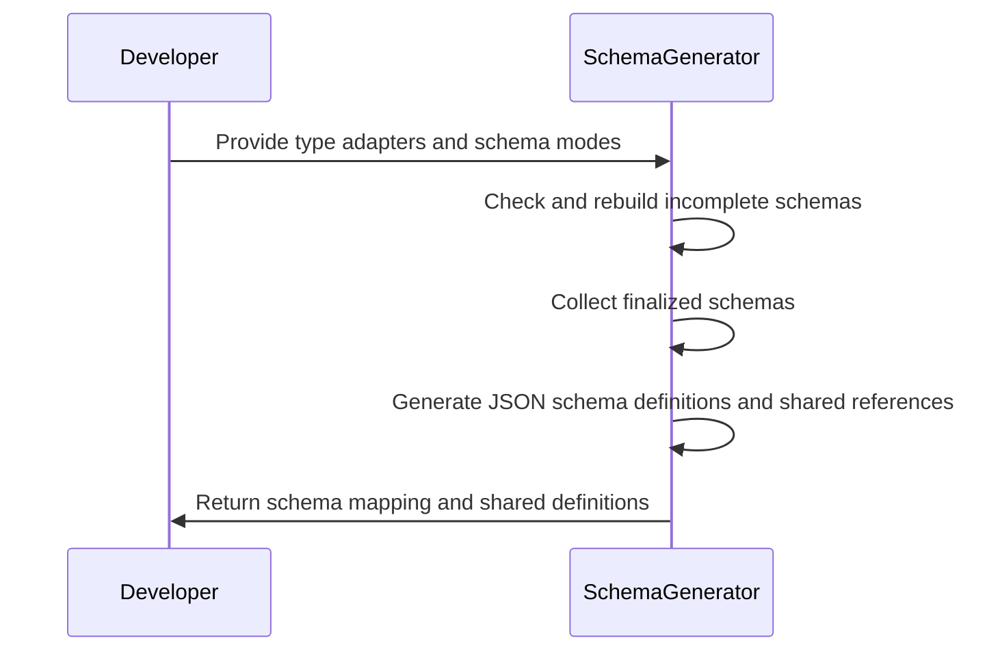
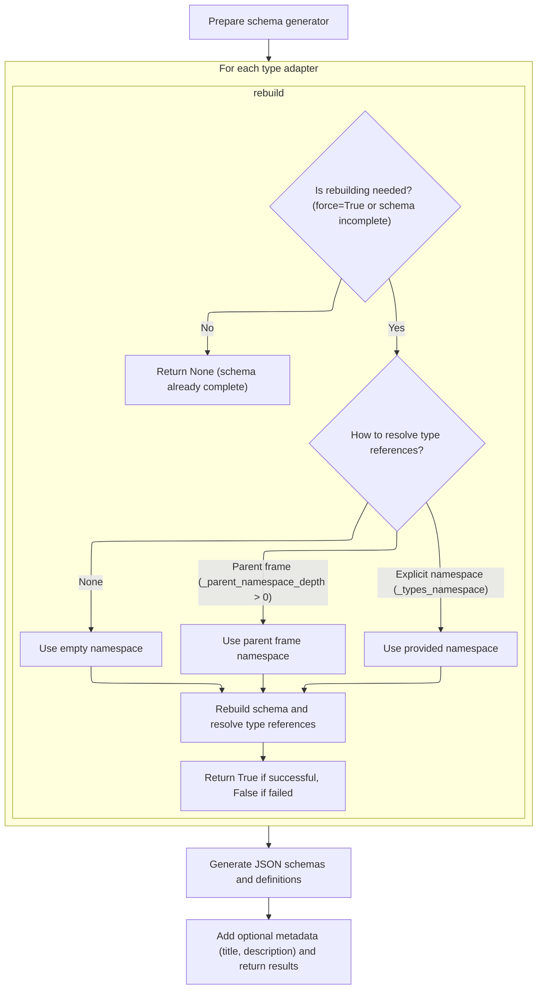
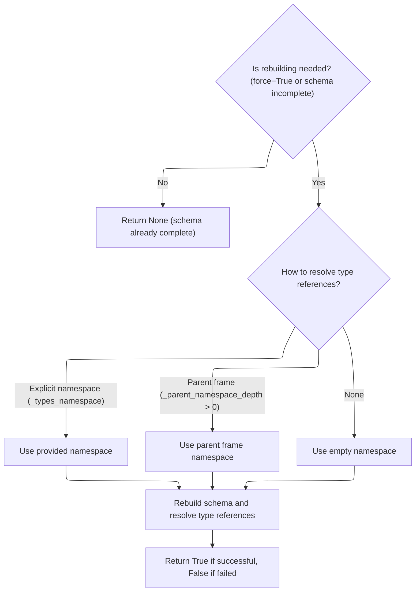
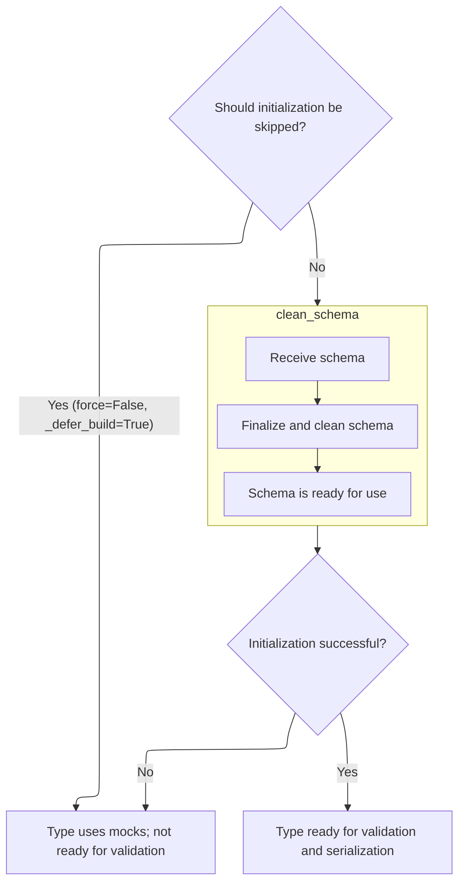

This flow generates JSON schema definitions for a set of Python types by processing type adapters, ensuring each schema is complete and ready for use. After rebuilding any incomplete schemas, it produces both individual and shared JSON schema definitions, returning them along with optional metadata for documentation.

Main steps:

- Prepare the schema generator
- Rebuild incomplete schemas as needed
- Collect finalized schemas
- Generate and assemble JSON schema definitions
- Return the mapping and shared definitions



# Spec

## Detailed View of the Program's Functionality

a. Preparing the Schema Generator

The process begins by setting up an instance of a schema generator. This generator is responsible for converting Python types and their associated metadata into a structured schema representation. The generator is configured with options such as whether to use field aliases and how to format references within the schema. This setup ensures that subsequent schema generation steps have the necessary context and configuration.

b. Ensuring Core Schemas Are Up-to-Date

For each type adapter provided as input, the process checks whether the core schema associated with the adapter is a placeholder (a "mock") or is otherwise incomplete. If the schema is incomplete or if a rebuild is explicitly requested, the system initiates a rebuild process. This involves:

- Determining the appropriate namespace for resolving type references, which may come from an explicitly provided namespace, the parent stack frame, or an empty namespace if neither is available.
- Using this namespace context to resolve any forward references or type aliases that could not be resolved previously.
- Delegating to a core attribute initialization routine, which attempts to construct a complete schema, validator, and serializer for the type. If successful, the adapter is marked as complete; otherwise, it remains incomplete and uses mock objects.

This step ensures that all type adapters have valid, fully-resolved core schemas before proceeding.

c. Building Core Schema and Validators

When rebuilding is necessary, the core attribute initialization routine is invoked. This routine:

- Checks if schema construction should be deferred (for example, if a configuration flag indicates so). If so, it assigns mock objects and marks the adapter as incomplete.
- Otherwise, it attempts to retrieve the core schema, validator, and serializer directly from the type. If any of these are still mocks, it generates a new schema using the schema generator.
- The generated schema is then "cleaned"—finalized and made ready for use—by passing it through a cleaning function that resolves references and applies any necessary final adjustments.
- Once a valid schema is available, the routine sets up the validator and serializer objects, making the adapter ready for validation and serialization tasks, and marks it as complete.

d. Finalizing the Schema Structure

The cleaning step involves passing the generated schema to a finalization function. This function traverses the schema and any referenced definitions, inlining or preserving references as appropriate, and applies any deferred discriminators or metadata. The result is a schema that is fully prepared for use in validation and serialization.

e. Generating and Returning JSON Schemas

After ensuring that all core schemas are real and up-to-date, the schema generator is used to produce JSON schema representations for each input type. This involves:

- Generating individual JSON schemas for each type, potentially including references to shared definitions.
- Collecting all shared definitions into a single definitions object.
- Optionally adding metadata such as a title or description to the output.
- Returning both a mapping of input keys to their corresponding JSON schemas and the shared definitions object. This allows clients to use the schemas and definitions as needed for documentation, validation, or other purposes.

This entire flow ensures that the system can robustly handle complex type references, forward declarations, and recursive types, producing accurate and complete JSON schema outputs for a wide variety of Python types.

# Rule Definition

| Paragraph Name                                                                                                                                                                                                                                                                                      | Rule ID | Category          | Description                                                                                                                                                                                                                                                                                                                                                   | Conditions                                                                                   | Remarks                                                                                                                                                                                                                                                                                                                                                                                                                                                                                                                                                                                                                                                                                                                                                                                               |
| --------------------------------------------------------------------------------------------------------------------------------------------------------------------------------------------------------------------------------------------------------------------------------------------------- | ------- | ----------------- | ------------------------------------------------------------------------------------------------------------------------------------------------------------------------------------------------------------------------------------------------------------------------------------------------------------------------------------------------------------- | -------------------------------------------------------------------------------------------- | ----------------------------------------------------------------------------------------------------------------------------------------------------------------------------------------------------------------------------------------------------------------------------------------------------------------------------------------------------------------------------------------------------------------------------------------------------------------------------------------------------------------------------------------------------------------------------------------------------------------------------------------------------------------------------------------------------------------------------------------------------------------------------------------------------- |
| TypeAdapter.json_schemas                                                                                                                                                                                                                                                                            | RL-001  | Data Assignment   | The feature must accept as input an iterable of tuples, each containing a key, a mode, and a type adapter. It must also accept optional keyword arguments for using field aliases, schema title, schema description, reference template string, and schema generator class.                                                                                   | When the feature is invoked to generate JSON schemas from type adapters.                     | The <SwmToken path="pydantic/type_adapter.py" pos="683:1:1" line-data="        ref_template: str = DEFAULT_REF_TEMPLATE,">`ref_template`</SwmToken> defaults to <SwmToken path="pydantic/type_adapter.py" pos="683:8:8" line-data="        ref_template: str = DEFAULT_REF_TEMPLATE,">`DEFAULT_REF_TEMPLATE`</SwmToken>. The <SwmToken path="pydantic/type_adapter.py" pos="286:1:1" line-data="            schema_generator = _generate_schema.GenerateSchema(config_wrapper, ns_resolver=ns_resolver)">`schema_generator`</SwmToken> defaults to <SwmToken path="pydantic/type_adapter.py" pos="684:6:6" line-data="        schema_generator: type[GenerateJsonSchema] = GenerateJsonSchema,">`GenerateJsonSchema`</SwmToken>. The input iterable must contain tuples of (key, mode, type adapter). |
| TypeAdapter.json_schemas, <SwmToken path="pydantic/type_adapter.py" pos="131:4:6" line-data="        and `TypeAdapter.rebuild` for various ways to construct this namespace.">`TypeAdapter.rebuild`</SwmToken>, TypeAdapter.\_init_core_attrs                                                       | RL-002  | Conditional Logic | For each type adapter, if its core schema is incomplete or a rebuild is forced, the schema must be rebuilt. Namespace resolution must use an explicit namespace if provided, otherwise the parent frame's namespace, or an empty namespace as fallback. After rebuilding, the core schema, validator, and serializer must be fully initialized and not mocks. | For each type adapter in the input; if the core schema is incomplete or a rebuild is forced. | Namespace resolution order: explicit namespace > parent frame's namespace > empty namespace. All schemas must be fully built and not mocks.                                                                                                                                                                                                                                                                                                                                                                                                                                                                                                                                                                                                                                                           |
| TypeAdapter.\_init_core_attrs, \_generate_schema.GenerateSchema.clean_schema                                                                                                                                                                                                                        | RL-003  | Computation       | After rebuilding or generating a schema, the feature must finalize and clean the schema to ensure it is ready for use, resolving references and applying any necessary final adjustments.                                                                                                                                                                     | After a core schema is generated or rebuilt for a type adapter.                              | Finalization includes resolving references and applying adjustments so the schema is ready for validation/serialization.                                                                                                                                                                                                                                                                                                                                                                                                                                                                                                                                                                                                                                                                              |
| TypeAdapter.json_schemas                                                                                                                                                                                                                                                                            | RL-004  | Data Assignment   | The output must be a tuple: (1) a dictionary mapping each (key, mode) pair to its JSON schema (as a JSON-serializable dictionary, possibly with $ref references), and (2) a dictionary with a $defs key for shared definitions, and optional title and description keys if provided.                                                                          | After all schemas are generated and finalized.                                               | Output tuple: (dict\[(key, mode), schema\], dict with $defs, optional title, optional description). Each schema is a JSON-serializable dictionary. $defs contains all shared definitions.                                                                                                                                                                                                                                                                                                                                                                                                                                                                                                                                                                                                             |
| TypeAdapter.json_schemas, <SwmToken path="pydantic/type_adapter.py" pos="286:5:7" line-data="            schema_generator = _generate_schema.GenerateSchema(config_wrapper, ns_resolver=ns_resolver)">`_generate_schema.GenerateSchema`</SwmToken>, \_generate_schema.\_Definitions.finalize_schema | RL-005  | Computation       | All schemas and definitions in the output must be suitable for use in JSON Schema documents, including OpenAPI specifications. The feature must support recursive and shared types by using $ref references in the generated schemas and definitions.                                                                                                         | When generating and outputting schemas and definitions.                                      | Schemas must be JSON-serializable and use $ref for recursion/sharing. Output is compatible with JSON Schema and OpenAPI.                                                                                                                                                                                                                                                                                                                                                                                                                                                                                                                                                                                                                                                                              |
| TypeAdapter.json_schemas, TypeAdapter.\_init_core_attrs                                                                                                                                                                                                                                             | RL-006  | Conditional Logic | The feature must not return any incomplete or mock schemas in the output. All schemas must be fully built and ready for validation and serialization tasks.                                                                                                                                                                                                   | Before returning the output tuple.                                                           | No output schema may be a mock or incomplete; all must be finalized and ready for use.                                                                                                                                                                                                                                                                                                                                                                                                                                                                                                                                                                                                                                                                                                                |
| TypeAdapter.\_init_core_attrs, \_generate_schema.GenerateSchema.generate_schema                                                                                                                                                                                                                     | RL-007  | Data Assignment   | The structure of a core schema must be a nested dictionary with at least a 'type' key (such as 'model', 'list', 'union', etc.), and may include keys for fields, sub-schemas, constraints, metadata, and references to other schemas.                                                                                                                         | Whenever a core schema is generated or rebuilt.                                              | Each core schema is a dictionary with at least a 'type' key. Other keys may include fields, sub-schemas, constraints, metadata, and references.                                                                                                                                                                                                                                                                                                                                                                                                                                                                                                                                                                                                                                                       |

# User Stories

## User Story 1: Schema rebuilding and initialization

---

### Story Description:

As a system generating schemas, I want to ensure that each type adapter's schema is rebuilt if incomplete or forced, with proper namespace resolution, and that all core schemas, validators, and serializers are fully initialized and not mocks so that the generated schemas are complete and reliable.

---

### Business Rule Mapping:

| Rule ID | Paragraph Name                                                                                                                                                                                                                                | Rule Description                                                                                                                                                                                                                                                                                                                                              |
| ------- | --------------------------------------------------------------------------------------------------------------------------------------------------------------------------------------------------------------------------------------------- | ------------------------------------------------------------------------------------------------------------------------------------------------------------------------------------------------------------------------------------------------------------------------------------------------------------------------------------------------------------- |
| RL-002  | TypeAdapter.json_schemas, <SwmToken path="pydantic/type_adapter.py" pos="131:4:6" line-data="        and `TypeAdapter.rebuild` for various ways to construct this namespace.">`TypeAdapter.rebuild`</SwmToken>, TypeAdapter.\_init_core_attrs | For each type adapter, if its core schema is incomplete or a rebuild is forced, the schema must be rebuilt. Namespace resolution must use an explicit namespace if provided, otherwise the parent frame's namespace, or an empty namespace as fallback. After rebuilding, the core schema, validator, and serializer must be fully initialized and not mocks. |
| RL-006  | TypeAdapter.json_schemas, TypeAdapter.\_init_core_attrs                                                                                                                                                                                       | The feature must not return any incomplete or mock schemas in the output. All schemas must be fully built and ready for validation and serialization tasks.                                                                                                                                                                                                   |

---

### Relevant Functionality:

- **TypeAdapter.json_schemas**
  1. **RL-002:**
     - For each type adapter:
       - If core schema is incomplete or rebuild is forced:
         - Rebuild schema, resolving references using:
           - Explicit namespace if provided
           - Else parent frame's namespace if available
           - Else empty namespace
         - Ensure core schema, validator, and serializer are fully initialized and not mocks.
  2. **RL-006:**
     - Before output:
       - Check that all schemas are complete and not mocks.
       - If any schema is incomplete, rebuild or raise error.
       - Only return finalized, complete schemas.

## User Story 2: Schema finalization and output generation

---

### Story Description:

As a user or integrator, I want the feature to finalize, clean, and output fully built JSON schemas and shared definitions, ensuring compatibility with JSON Schema and OpenAPI, support for recursive/shared types, and the correct structure for core schemas so that I can use the output in standards-compliant tools and workflows.

---

### Business Rule Mapping:

| Rule ID | Paragraph Name                                                                                                                                                                                                                                                                                      | Rule Description                                                                                                                                                                                                                                                                     |
| ------- | --------------------------------------------------------------------------------------------------------------------------------------------------------------------------------------------------------------------------------------------------------------------------------------------------- | ------------------------------------------------------------------------------------------------------------------------------------------------------------------------------------------------------------------------------------------------------------------------------------ |
| RL-003  | TypeAdapter.\_init_core_attrs, \_generate_schema.GenerateSchema.clean_schema                                                                                                                                                                                                                        | After rebuilding or generating a schema, the feature must finalize and clean the schema to ensure it is ready for use, resolving references and applying any necessary final adjustments.                                                                                            |
| RL-007  | TypeAdapter.\_init_core_attrs, \_generate_schema.GenerateSchema.generate_schema                                                                                                                                                                                                                     | The structure of a core schema must be a nested dictionary with at least a 'type' key (such as 'model', 'list', 'union', etc.), and may include keys for fields, sub-schemas, constraints, metadata, and references to other schemas.                                                |
| RL-004  | TypeAdapter.json_schemas                                                                                                                                                                                                                                                                            | The output must be a tuple: (1) a dictionary mapping each (key, mode) pair to its JSON schema (as a JSON-serializable dictionary, possibly with $ref references), and (2) a dictionary with a $defs key for shared definitions, and optional title and description keys if provided. |
| RL-005  | TypeAdapter.json_schemas, <SwmToken path="pydantic/type_adapter.py" pos="286:5:7" line-data="            schema_generator = _generate_schema.GenerateSchema(config_wrapper, ns_resolver=ns_resolver)">`_generate_schema.GenerateSchema`</SwmToken>, \_generate_schema.\_Definitions.finalize_schema | All schemas and definitions in the output must be suitable for use in JSON Schema documents, including OpenAPI specifications. The feature must support recursive and shared types by using $ref references in the generated schemas and definitions.                                |

---

### Relevant Functionality:

- **TypeAdapter.\_init_core_attrs**
  1. **RL-003:**
     - After schema generation/rebuild:
       - Call schema finalization/cleaning logic to resolve references and finalize schema structure.
  2. **RL-007:**
     - When generating a core schema:
       - Ensure the schema is a dictionary with a 'type' key.
       - Add other keys as needed for fields, sub-schemas, constraints, metadata, references.
- **TypeAdapter.json_schemas**
  1. **RL-004:**
     - Collect all finalized schemas and definitions.
     - Build a dictionary mapping (key, mode) to each schema.
     - Build a definitions dictionary with $defs, and add title/description if provided.
     - Return (schemas_map, definitions_dict) as a tuple.
  2. **RL-005:**
     - Ensure all schemas/definitions are JSON-serializable.
     - Use $ref references for recursive/shared types.
     - Ensure output is valid for JSON Schema and OpenAPI.

## User Story 3: Input acceptance, output formatting, and standards compliance

---

### Story Description:

As a user of the schema generation feature, I want to provide an iterable of (key, mode, type adapter) tuples and optional configuration arguments, and receive a tuple of JSON-serializable schemas and shared definitions that are suitable for use in JSON Schema and OpenAPI, so that I can easily integrate the output into standards-compliant tools and workflows.

---

### Business Rule Mapping:

| Rule ID | Paragraph Name                                                                                                                                                                                                                                                                                      | Rule Description                                                                                                                                                                                                                                                                     |
| ------- | --------------------------------------------------------------------------------------------------------------------------------------------------------------------------------------------------------------------------------------------------------------------------------------------------- | ------------------------------------------------------------------------------------------------------------------------------------------------------------------------------------------------------------------------------------------------------------------------------------ |
| RL-001  | TypeAdapter.json_schemas                                                                                                                                                                                                                                                                            | The feature must accept as input an iterable of tuples, each containing a key, a mode, and a type adapter. It must also accept optional keyword arguments for using field aliases, schema title, schema description, reference template string, and schema generator class.          |
| RL-004  | TypeAdapter.json_schemas                                                                                                                                                                                                                                                                            | The output must be a tuple: (1) a dictionary mapping each (key, mode) pair to its JSON schema (as a JSON-serializable dictionary, possibly with $ref references), and (2) a dictionary with a $defs key for shared definitions, and optional title and description keys if provided. |
| RL-005  | TypeAdapter.json_schemas, <SwmToken path="pydantic/type_adapter.py" pos="286:5:7" line-data="            schema_generator = _generate_schema.GenerateSchema(config_wrapper, ns_resolver=ns_resolver)">`_generate_schema.GenerateSchema`</SwmToken>, \_generate_schema.\_Definitions.finalize_schema | All schemas and definitions in the output must be suitable for use in JSON Schema documents, including OpenAPI specifications. The feature must support recursive and shared types by using $ref references in the generated schemas and definitions.                                |

---

### Relevant Functionality:

- **TypeAdapter.json_schemas**
  1. **RL-001:**
     - Accept an iterable of (key, mode, <SwmToken path="pydantic/type_adapter.py" pos="71:10:10" line-data="        [`TypeAdapter`](../concepts/type_adapter.md)">`type_adapter`</SwmToken>) tuples as input.
     - Accept optional keyword arguments: <SwmToken path="pydantic/type_adapter.py" pos="680:1:1" line-data="        by_alias: bool = True,">`by_alias`</SwmToken> (bool), title (str), description (str), <SwmToken path="pydantic/type_adapter.py" pos="683:1:1" line-data="        ref_template: str = DEFAULT_REF_TEMPLATE,">`ref_template`</SwmToken> (str), <SwmToken path="pydantic/type_adapter.py" pos="286:1:1" line-data="            schema_generator = _generate_schema.GenerateSchema(config_wrapper, ns_resolver=ns_resolver)">`schema_generator`</SwmToken> (type).
     - Use defaults for <SwmToken path="pydantic/type_adapter.py" pos="683:1:1" line-data="        ref_template: str = DEFAULT_REF_TEMPLATE,">`ref_template`</SwmToken> and <SwmToken path="pydantic/type_adapter.py" pos="286:1:1" line-data="            schema_generator = _generate_schema.GenerateSchema(config_wrapper, ns_resolver=ns_resolver)">`schema_generator`</SwmToken> if not provided.
  2. **RL-004:**
     - Collect all finalized schemas and definitions.
     - Build a dictionary mapping (key, mode) to each schema.
     - Build a definitions dictionary with $defs, and add title/description if provided.
     - Return (schemas_map, definitions_dict) as a tuple.
  3. **RL-005:**
     - Ensure all schemas/definitions are JSON-serializable.
     - Use $ref references for recursive/shared types.
     - Ensure output is valid for JSON Schema and OpenAPI.

# Code Walkthrough

## Preparing JSON Schema Inputs



<SwmSnippet path="/pydantic/type_adapter.py" line="676">

---

In <SwmToken path="pydantic/type_adapter.py" pos="676:3:3" line-data="    def json_schemas(">`json_schemas`</SwmToken>, we prep the schema generator and make sure all core schemas are real (not mocks) by rebuilding if needed, so the next step can generate valid JSON schema definitions.

```python
    def json_schemas(
        inputs: Iterable[tuple[JsonSchemaKeyT, JsonSchemaMode, TypeAdapter[Any]]],
        /,
        *,
        by_alias: bool = True,
        title: str | None = None,
        description: str | None = None,
        ref_template: str = DEFAULT_REF_TEMPLATE,
        schema_generator: type[GenerateJsonSchema] = GenerateJsonSchema,
    ) -> tuple[dict[tuple[JsonSchemaKeyT, JsonSchemaMode], JsonSchemaValue], JsonSchemaValue]:
        """Generate a JSON schema including definitions from multiple type adapters.

        Args:
            inputs: Inputs to schema generation. The first two items will form the keys of the (first)
                output mapping; the type adapters will provide the core schemas that get converted into
                definitions in the output JSON schema.
            by_alias: Whether to use alias names.
            title: The title for the schema.
            description: The description for the schema.
            ref_template: The format string used for generating $ref strings.
            schema_generator: The generator class used for creating the schema.

        Returns:
            A tuple where:

                - The first element is a dictionary whose keys are tuples of JSON schema key type and JSON mode, and
                    whose values are the JSON schema corresponding to that pair of inputs. (These schemas may have
                    JsonRef references to definitions that are defined in the second returned element.)
                - The second element is a JSON schema containing all definitions referenced in the first returned
                    element, along with the optional title and description keys.

        """
        schema_generator_instance = schema_generator(by_alias=by_alias, ref_template=ref_template)

        inputs_ = []
        for key, mode, adapter in inputs:
            # This is the same pattern we follow for model json schemas - we attempt a core schema rebuild if we detect a mock
            if isinstance(adapter.core_schema, _mock_val_ser.MockCoreSchema):
                adapter.core_schema.rebuild()
                assert not isinstance(adapter.core_schema, _mock_val_ser.MockCoreSchema), (
                    'this is a bug! please report it'
                )
            inputs_.append((key, mode, adapter.core_schema))

```

---

</SwmSnippet>

### Resolving Incomplete Type Schemas



<SwmSnippet path="/pydantic/type_adapter.py" line="335">

---

<SwmToken path="pydantic/type_adapter.py" pos="335:3:3" line-data="    def rebuild(">`rebuild`</SwmToken> checks if the schema is incomplete or if we're forcing a rebuild. It sets up the right namespace context (locals and globals) for resolving type references, then hands off to <SwmToken path="pydantic/type_adapter.py" pos="379:5:5" line-data="        return self._init_core_attrs(ns_resolver=ns_resolver, force=True, raise_errors=raise_errors)">`_init_core_attrs`</SwmToken> to actually build or update the core schema, validator, and serializer. This handoff is needed because <SwmToken path="pydantic/type_adapter.py" pos="379:5:5" line-data="        return self._init_core_attrs(ns_resolver=ns_resolver, force=True, raise_errors=raise_errors)">`_init_core_attrs`</SwmToken> does the heavy lifting of constructing the schema objects using the resolved namespaces.

```python
    def rebuild(
        self,
        *,
        force: bool = False,
        raise_errors: bool = True,
        _parent_namespace_depth: int = 2,
        _types_namespace: _namespace_utils.MappingNamespace | None = None,
    ) -> bool | None:
        """Try to rebuild the pydantic-core schema for the adapter's type.

        This may be necessary when one of the annotations is a ForwardRef which could not be resolved during
        the initial attempt to build the schema, and automatic rebuilding fails.

        Args:
            force: Whether to force the rebuilding of the type adapter's schema, defaults to `False`.
            raise_errors: Whether to raise errors, defaults to `True`.
            _parent_namespace_depth: Depth at which to search for the [parent frame][frame-objects]. This
                frame is used when resolving forward annotations during schema rebuilding, by looking for
                the locals of this frame. Defaults to 2, which will result in the frame where the method
                was called.
            _types_namespace: An explicit types namespace to use, instead of using the local namespace
                from the parent frame. Defaults to `None`.

        Returns:
            Returns `None` if the schema is already "complete" and rebuilding was not required.
            If rebuilding _was_ required, returns `True` if rebuilding was successful, otherwise `False`.
        """
        if not force and self.pydantic_complete:
            return None

        if _types_namespace is not None:
            rebuild_ns = _types_namespace
        elif _parent_namespace_depth > 0:
            rebuild_ns = _typing_extra.parent_frame_namespace(parent_depth=_parent_namespace_depth, force=True) or {}
        else:
            rebuild_ns = {}

        # we have to manually fetch globals here because there's no type on the stack of the NsResolver
        # and so we skip the globalns = get_module_ns_of(typ) call that would normally happen
        globalns = sys._getframe(max(_parent_namespace_depth - 1, 1)).f_globals
        ns_resolver = _namespace_utils.NsResolver(
            namespaces_tuple=_namespace_utils.NamespacesTuple(locals=rebuild_ns, globals=globalns),
            parent_namespace=rebuild_ns,
        )
        return self._init_core_attrs(ns_resolver=ns_resolver, force=True, raise_errors=raise_errors)
```

---

</SwmSnippet>

### Building Core Schema and Validators



<SwmSnippet path="/pydantic/type_adapter.py" line="246">

---

In <SwmToken path="pydantic/type_adapter.py" pos="246:3:3" line-data="    def _init_core_attrs(">`_init_core_attrs`</SwmToken>, we either set mocks if we're deferring build, or we try to grab the core schema, validator, and serializer from the type. If any of those are still mocks, we generate a new schema and then call <SwmToken path="pydantic/type_adapter.py" pos="297:9:9" line-data="                self.core_schema = schema_generator.clean_schema(core_schema)">`clean_schema`</SwmToken> to finalize it. This step is needed to make sure the schema is in a usable state before assigning it to the adapter.

```python
    def _init_core_attrs(
        self, ns_resolver: _namespace_utils.NsResolver, force: bool, raise_errors: bool = False
    ) -> bool:
        """Initialize the core schema, validator, and serializer for the type.

        Args:
            ns_resolver: The namespace resolver to use when building the core schema for the adapted type.
            force: Whether to force the construction of the core schema, validator, and serializer.
                If `force` is set to `False` and `_defer_build` is `True`, the core schema, validator, and serializer will be set to mocks.
            raise_errors: Whether to raise errors if initializing any of the core attrs fails.

        Returns:
            `True` if the core schema, validator, and serializer were successfully initialized, otherwise `False`.

        Raises:
            PydanticUndefinedAnnotation: If `PydanticUndefinedAnnotation` occurs in`__get_pydantic_core_schema__`
                and `raise_errors=True`.
        """
        if not force and self._defer_build:
            _mock_val_ser.set_type_adapter_mocks(self)
            self.pydantic_complete = False
            return False

        try:
            self.core_schema = _getattr_no_parents(self._type, '__pydantic_core_schema__')
            self.validator = _getattr_no_parents(self._type, '__pydantic_validator__')
            self.serializer = _getattr_no_parents(self._type, '__pydantic_serializer__')

            # TODO: we don't go through the rebuild logic here directly because we don't want
            # to repeat all of the namespace fetching logic that we've already done
            # so we simply skip to the block below that does the actual schema generation
            if (
                isinstance(self.core_schema, _mock_val_ser.MockCoreSchema)
                or isinstance(self.validator, _mock_val_ser.MockValSer)
                or isinstance(self.serializer, _mock_val_ser.MockValSer)
            ):
                raise AttributeError()
        except AttributeError:
            config_wrapper = _config.ConfigWrapper(self._config)

            schema_generator = _generate_schema.GenerateSchema(config_wrapper, ns_resolver=ns_resolver)

            try:
                core_schema = schema_generator.generate_schema(self._type)
            except PydanticUndefinedAnnotation:
                if raise_errors:
                    raise
                _mock_val_ser.set_type_adapter_mocks(self)
                return False

            try:
                self.core_schema = schema_generator.clean_schema(core_schema)
            except _generate_schema.InvalidSchemaError:
                _mock_val_ser.set_type_adapter_mocks(self)
                return False

```

---

</SwmSnippet>

#### Finalizing the Schema Structure

<SwmSnippet path="/pydantic/_internal/_generate_schema.py" line="683">

---

<SwmToken path="pydantic/_internal/_generate_schema.py" pos="683:3:3" line-data="    def clean_schema(self, schema: CoreSchema) -&gt; CoreSchema:">`clean_schema`</SwmToken> just hands off the schema to <SwmToken path="pydantic/_internal/_generate_schema.py" pos="684:7:7" line-data="        return self.defs.finalize_schema(schema)">`finalize_schema`</SwmToken>, which does the actual work of making sure the schema is fully ready for use (like resolving references and applying final tweaks).

```python
    def clean_schema(self, schema: CoreSchema) -> CoreSchema:
        return self.defs.finalize_schema(schema)
```

---

</SwmSnippet>

#### Completing Schema Preparation

See <SwmLink doc-title="Finalizing a Schema for Validation and Serialization">[Finalizing a Schema for Validation and Serialization](/.swm/finalizing-a-schema-for-validation-and-serialization.9lypyzmq.sw.md)</SwmLink>

#### Setting Up Validators and Serializers

<SwmSnippet path="/pydantic/type_adapter.py" line="302">

---

Back in <SwmToken path="pydantic/type_adapter.py" pos="246:3:3" line-data="    def _init_core_attrs(">`_init_core_attrs`</SwmToken>, now that we've got a cleaned schema, we use it to set up the validator and serializer. This means the adapter is now ready for validation and serialization tasks, and we flag it as complete.

```python
            core_config = config_wrapper.core_config(None)

            self.validator = create_schema_validator(
                schema=self.core_schema,
                schema_type=self._type,
                schema_type_module=self._module_name,
                schema_type_name=str(self._type),
                schema_kind='TypeAdapter',
                config=core_config,
                plugin_settings=config_wrapper.plugin_settings,
            )
            self.serializer = SchemaSerializer(self.core_schema, core_config)

        self.pydantic_complete = True
        return True
```

---

</SwmSnippet>

### Generating and Returning JSON Schemas

<SwmSnippet path="/pydantic/type_adapter.py" line="720">

---

Back in <SwmToken path="pydantic/type_adapter.py" pos="676:3:3" line-data="    def json_schemas(">`json_schemas`</SwmToken>, after making sure all core schemas are real (not mocks), we use the schema generator to produce both the individual JSON schemas and the shared definitions. We then assemble the final output, including optional title and description, and return both the mapping and the definitions so clients can use them as needed.

```python
        json_schemas_map, definitions = schema_generator_instance.generate_definitions(inputs_)

        json_schema: dict[str, Any] = {}
        if definitions:
            json_schema['$defs'] = definitions
        if title:
            json_schema['title'] = title
        if description:
            json_schema['description'] = description

        return json_schemas_map, json_schema
```

---

</SwmSnippet>

&nbsp;

*This is an auto-generated document by Swimm 🌊 and has not yet been verified by a human*

<SwmMeta version="3.0.0" repo-id="Z2l0aHViJTNBJTNBcHlkYW50aWMlM0ElM0FTd2ltbS1EZW1v" repo-name="pydantic"><sup>Powered by [Swimm](/)</sup></SwmMeta>
