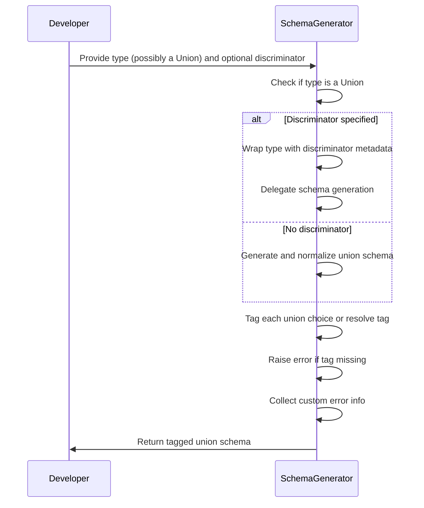
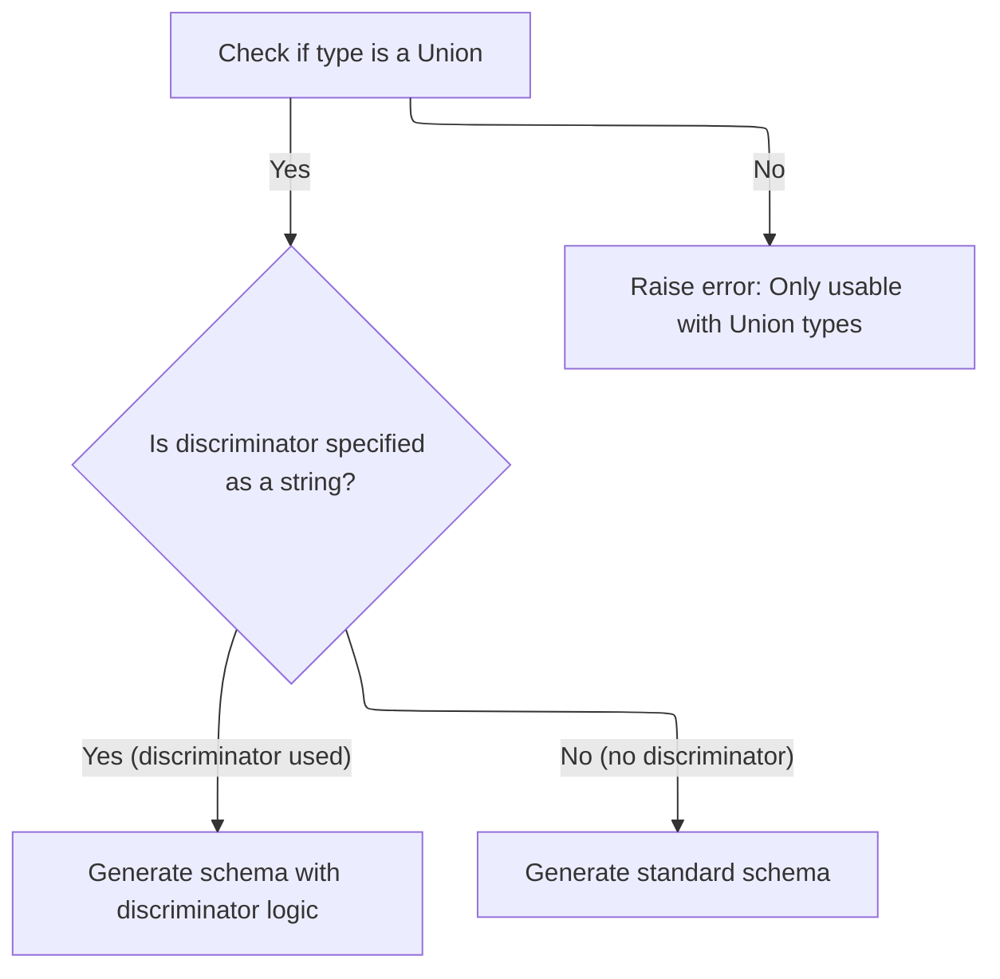
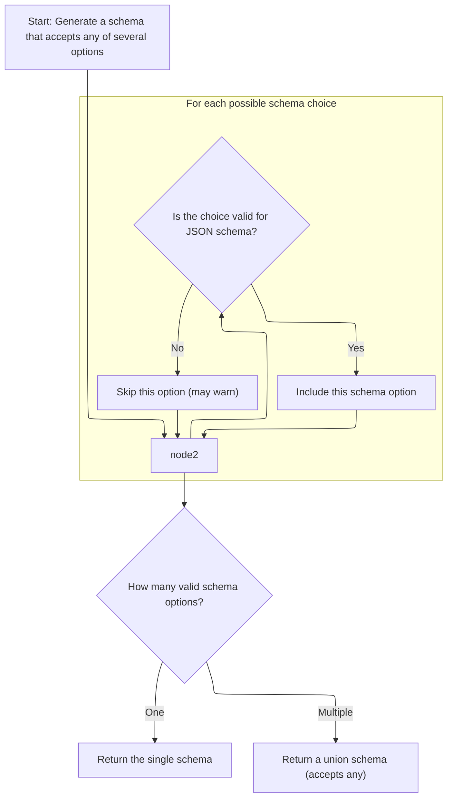
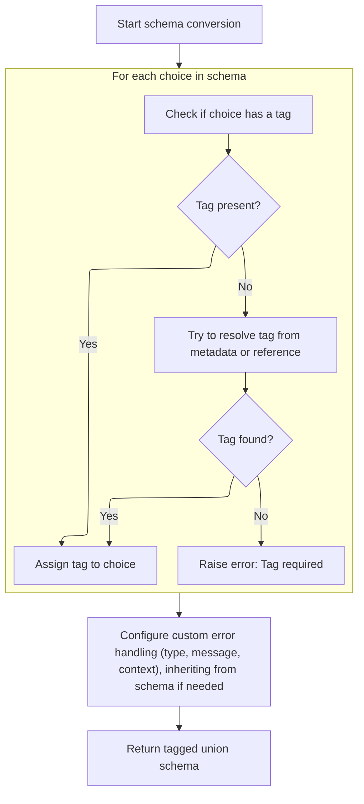

This document explains how tagged union schemas are created for Union types, supporting both standard and discriminated unions. The process checks the type, applies discriminator logic if needed, ensures each union choice is uniquely tagged, and incorporates custom error handling before producing the final schema for validation and JSON schema generation.

Main steps:

- Verify the type is a Union
- Apply discriminator logic or generate a standard union schema
- Tag each union choice, resolving or raising errors as needed
- Collect custom error information and build the final tagged union schema



# Spec

## Detailed View of the Program's Functionality

a. Validating and Preparing the Union Schema

The process begins by checking if the type being processed is a union type. If it is not, an error is raised, indicating that the feature is only usable with union types. If the union uses a discriminator specified as a string (meaning a field name is used to distinguish between union options), the code wraps the source type in an annotation that includes a field discriminator and passes it to the handler for further processing. If there is no discriminator string (<SwmToken path="pydantic/json_schema.py" pos="165:14:16" line-data="            # if it introduces no ambiguity, i.e., there is only one distinct schema for that DefsRef.">`i.e`</SwmToken>., a callable discriminator or none at all), the handler is called to generate the schema for the union type, and then this schema is passed to a conversion function for further processing and tagging. This split ensures that unions with field-based discrimination are handled differently from those requiring custom or callable discrimination logic.

b. Normalizing the Union Schema Structure

Once the union schema is obtained, the code checks if the schema is already a union. If it is not (which can happen if the union only has a single item and was simplified), the schema is wrapped as a union schema to ensure consistent downstream handling. This normalization step guarantees that all subsequent logic can treat the schema as a union, regardless of how many choices it contains.

c. Generating JSON Schemas for Union Choices

When generating the JSON schema for a union, the code iterates through each possible choice in the union. For each choice, it extracts the relevant schema (ignoring any label if present) and attempts to generate the inner JSON schema for that choice. If a choice is not valid for JSON schema generation, it is skipped, and a warning may be emitted. After processing all choices, if only one valid schema remains, that schema is returned directly; otherwise, a union schema is returned that accepts any of the valid choices. This ensures that the JSON schema accurately represents all valid options in the union.

d. Building JSON Schema for a Core Schema

The core function for generating JSON schemas first checks if the schema is a reference to an existing definition. If so, it returns a reference to the existing JSON schema. If not, it proceeds to generate the base JSON schema for the type. The function then checks for any metadata that specifies updates or extra information to be applied to the schema. If such metadata is present, it wraps the handler with additional logic to apply these updates or extras. The function also applies any user-provided modification or annotation functions from the metadata, wrapping the handler further for each function. After all customizations are applied, the handler is called to produce the final JSON schema. If the schema is a core schema, any necessary definitions are populated before returning the result.

e. Tagging and Resolving Union Choices

When converting a union schema for use with a callable discriminator, the code loops through each choice in the union. For each choice, it attempts to extract a unique tag, either from the tuple (if the choice is a tuple of (schema, tag)), from the metadata, or by resolving references if the choice is a reference. If a tag cannot be found for a choice, an error is raised, as every choice in a callable-discriminated union must have a tag. Once all choices are tagged, the code collects any custom error information (type, message, context) from the current object or the original schema. It then constructs a tagged union schema, including all tagged choices, the discriminator, and any custom error information, as well as other relevant metadata.

f. Generating the Tagged Union JSON Schema

To generate the JSON schema for a tagged union, the code iterates over each tagged choice, generating the JSON schema for each and converting enum keys to strings if necessary. After all schemas are generated, they are deduplicated and assembled into a <SwmToken path="pydantic/json_schema.py" pos="1291:10:10" line-data="        json_schema: JsonSchemaValue = {&#39;oneOf&#39;: one_of_choices}">`oneOf`</SwmToken> schema, which allows any of the tagged choices. If a discriminator field is present, a discriminator mapping is added to the schema, mapping each tag to its corresponding schema (using references if available). The final JSON schema is then returned, representing the tagged union in a way that is compatible with <SwmToken path="pydantic/json_schema.py" pos="1293:31:31" line-data="        # This reflects the v1 behavior; TODO: we should make it possible to exclude OpenAPI stuff from the JSON schema">`OpenAPI`</SwmToken> and other consumers of JSON schema.

# Rule Definition

| Paragraph Name                                                                                                                                                                                                                                                                                                                                                                                                                                                                                                                                                                                                                                                                                                                                                                                                                                               | Rule ID | Category          | Description                                                                                                                                                                                                                                                                                                                                                                                         | Conditions                                                         | Remarks                                                                                                                                                                                                                                                                                                                                                                                                                                                                                                                                                                                                                                                                                                                                                                                                                                                                                                                                                                                                                                                                                          |
| ------------------------------------------------------------------------------------------------------------------------------------------------------------------------------------------------------------------------------------------------------------------------------------------------------------------------------------------------------------------------------------------------------------------------------------------------------------------------------------------------------------------------------------------------------------------------------------------------------------------------------------------------------------------------------------------------------------------------------------------------------------------------------------------------------------------------------------------------------------ | ------- | ----------------- | --------------------------------------------------------------------------------------------------------------------------------------------------------------------------------------------------------------------------------------------------------------------------------------------------------------------------------------------------------------------------------------------------- | ------------------------------------------------------------------ | ------------------------------------------------------------------------------------------------------------------------------------------------------------------------------------------------------------------------------------------------------------------------------------------------------------------------------------------------------------------------------------------------------------------------------------------------------------------------------------------------------------------------------------------------------------------------------------------------------------------------------------------------------------------------------------------------------------------------------------------------------------------------------------------------------------------------------------------------------------------------------------------------------------------------------------------------------------------------------------------------------------------------------------------------------------------------------------------------ |
| The main entry point for union schema handling is a function that receives: ... If the provided type is not a union, the system must raise an error indicating that only union types are supported.                                                                                                                                                                                                                                                                                                                                                                                                                                                                                                                                                                                                                                                          | RL-001  | Conditional Logic | When processing a type for union schema handling, the system must check if the provided type is a union. If it is not, an error must be raised indicating that only union types are supported.                                                                                                                                                                                                      | The input type to the union schema handler is not a union type.    | The error message should clearly indicate that only union types are supported. No specific constants are mentioned for the error message.                                                                                                                                                                                                                                                                                                                                                                                                                                                                                                                                                                                                                                                                                                                                                                                                                                                                                                                                                        |
| If a discriminator is specified as a string (field name), the system must: ... Wrap the source type in an annotated structure with a field discriminator. Pass this annotated type to the handler to obtain a core schema dictionary.                                                                                                                                                                                                                                                                                                                                                                                                                                                                                                                                                                                                                        | RL-002  | Conditional Logic | If a discriminator is specified as a string (field name), the system must wrap the source type in an annotated structure with a field discriminator and pass this annotated type to the handler to obtain a core schema dictionary.                                                                                                                                                                 | A discriminator is specified and is a string.                      | The annotated structure must include the field discriminator. The handler returns a core schema dictionary describing validation logic.                                                                                                                                                                                                                                                                                                                                                                                                                                                                                                                                                                                                                                                                                                                                                                                                                                                                                                                                                          |
| If no discriminator is specified, the system must: ... Obtain the core schema for the union type from the handler. Pass this core schema to a normalization function for further processing. The normalization function must: ... For union schemas, iterate through each choice and ensure each is tagged: ... If the tag is not found and the schema is a reference (type <SwmToken path="pydantic/types.py" pos="3095:23:25" line-data="                if handler is not None and choice[&#39;type&#39;] == &#39;definition-ref&#39;:">`definition-ref`</SwmToken>), resolve the reference using the handler and check the resolved schema's metadata for the tag. If no tag is found after these steps, raise an error indicating that every choice must have a tag.                                                                                    | RL-003  | Computation       | When no discriminator is specified, the system must normalize the union schema by ensuring each choice is tagged. If a tag is missing, and the choice is a reference, the reference must be resolved and checked for a tag. If still missing, an error must be raised.                                                                                                                              | No discriminator is specified; processing a union schema.          | Tags may be found in tuples or in schema metadata under <SwmToken path="pydantic/types.py" pos="3092:10:10" line-data="                tag = metadata.get(&#39;pydantic_internal_union_tag_key&#39;) or tag">`pydantic_internal_union_tag_key`</SwmToken>. If a choice is a reference, the handler must resolve it. The error message must indicate that every choice must have a tag.                                                                                                                                                                                                                                                                                                                                                                                                                                                                                                                                                                                                                                                                                                           |
| The normalization function must: ... Assemble a mapping of tags to schemas for all choices. Collect any custom error information (type, message, context) from the schema or its metadata. Return a tagged union core schema dictionary containing: ...                                                                                                                                                                                                                                                                                                                                                                                                                                                                                                                                                                                                      | RL-004  | Data Assignment   | After ensuring all union choices are tagged, the system must assemble a mapping from tags to schemas and collect any custom error information from the schema or its metadata. The result is a tagged union core schema dictionary.                                                                                                                                                                 | All union choices have unique tags.                                | The output is a dictionary with keys: 'type' (value: 'tagged-union'), 'choices' (mapping of tags to schemas), 'discriminator' (string or callable), and any custom error information. Custom error info includes type, message, and context.                                                                                                                                                                                                                                                                                                                                                                                                                                                                                                                                                                                                                                                                                                                                                                                                                                                     |
| The system must provide a function to generate a JSON schema from a core schema dictionary: ... If the schema is a reference (type <SwmToken path="pydantic/types.py" pos="3095:23:25" line-data="                if handler is not None and choice[&#39;type&#39;] == &#39;definition-ref&#39;:">`definition-ref`</SwmToken>), return a JSON schema with a $ref to the referenced definition. Otherwise, generate a base JSON schema according to the schema type. If the schema's metadata specifies updates or extras, apply these to the JSON schema. Apply any user-provided modification or annotation functions to the JSON schema, as specified in the metadata. If the schema is a core schema (not a reference), populate the definitions section of the JSON schema as needed. Return the final JSON schema dictionary.                           | RL-005  | Computation       | When generating a JSON schema from a core schema dictionary, the system must handle references, apply metadata updates/extras, apply user modification/annotation functions, populate definitions as needed, and return the final JSON schema dictionary.                                                                                                                                           | A core schema dictionary is provided for JSON schema generation.   | If the schema is a reference (type <SwmToken path="pydantic/types.py" pos="3095:23:25" line-data="                if handler is not None and choice[&#39;type&#39;] == &#39;definition-ref&#39;:">`definition-ref`</SwmToken>), output is {'$ref': ...}. Metadata keys include <SwmToken path="pydantic/json_schema.py" pos="507:12:12" line-data="        if js_updates := metadata.get(&#39;pydantic_js_updates&#39;):">`pydantic_js_updates`</SwmToken>, <SwmToken path="pydantic/json_schema.py" pos="518:12:12" line-data="        if js_extra := metadata.get(&#39;pydantic_js_extra&#39;):">`pydantic_js_extra`</SwmToken>, <SwmToken path="pydantic/json_schema.py" pos="534:12:12" line-data="        for js_modify_function in metadata.get(&#39;pydantic_js_functions&#39;, ()):">`pydantic_js_functions`</SwmToken>, and <SwmToken path="pydantic/json_schema.py" pos="552:12:12" line-data="        for js_modify_function in metadata.get(&#39;pydantic_js_annotation_functions&#39;, ()):">`pydantic_js_annotation_functions`</SwmToken>. The output is a JSON schema dictionary. |
| For standard union schemas (type 'union'): ... Iterate through each choice, extracting the schema (ignoring any label if present). For each choice, generate its JSON schema using the inner generation function. Skip or warn on choices that cannot be represented as JSON schema. If only one valid schema remains, return it directly. If multiple valid schemas remain, return a JSON schema with an <SwmToken path="pydantic/types.py" pos="1164:6:6" line-data="        field_schema.pop(&#39;anyOf&#39;, None)  # remove the bytes/str union">`anyOf`</SwmToken> key containing the list of valid schemas.                                                                                                                                                                                                                                           | RL-006  | Computation       | When generating a JSON schema for a standard union, iterate through each choice, generate its JSON schema, skip or warn on invalid choices, and return either a single schema or an <SwmToken path="pydantic/types.py" pos="1164:6:6" line-data="        field_schema.pop(&#39;anyOf&#39;, None)  # remove the bytes/str union">`anyOf`</SwmToken> schema depending on the number of valid choices. | Generating JSON schema for a core schema with type 'union'.        | The output is either a single JSON schema or a dictionary with <SwmToken path="pydantic/types.py" pos="1164:6:6" line-data="        field_schema.pop(&#39;anyOf&#39;, None)  # remove the bytes/str union">`anyOf`</SwmToken>: \[list of schemas\]. Choices that cannot be represented as JSON schema are skipped or warned about.                                                                                                                                                                                                                                                                                                                                                                                                                                                                                                                                                                                                                                                                                                                                                               |
| For tagged union schemas (type 'tagged-union'): ... For each tagged choice, generate its JSON schema using the inner generation function. Deduplicate schemas as needed. Assemble a JSON schema with a <SwmToken path="pydantic/json_schema.py" pos="1291:10:10" line-data="        json_schema: JsonSchemaValue = {&#39;oneOf&#39;: one_of_choices}">`oneOf`</SwmToken> key containing the list of choice schemas. If a discriminator field is present, add a 'discriminator' object to the JSON schema with: <SwmToken path="pydantic/json_schema.py" pos="1297:2:2" line-data="                &#39;propertyName&#39;: openapi_discriminator,">`propertyName`</SwmToken>: the discriminator field name (if available), 'mapping': a mapping from tag values to the corresponding schema references or schemas. Return the final tagged union JSON schema. | RL-007  | Computation       | When generating a JSON schema for a tagged union, generate schemas for each tagged choice, deduplicate as needed, assemble a <SwmToken path="pydantic/json_schema.py" pos="1291:10:10" line-data="        json_schema: JsonSchemaValue = {&#39;oneOf&#39;: one_of_choices}">`oneOf`</SwmToken> schema, and add a 'discriminator' object if a discriminator field is present.                        | Generating JSON schema for a core schema with type 'tagged-union'. | The output is a dictionary with <SwmToken path="pydantic/json_schema.py" pos="1291:10:10" line-data="        json_schema: JsonSchemaValue = {&#39;oneOf&#39;: one_of_choices}">`oneOf`</SwmToken>: \[list of schemas\]. If a discriminator is present, add 'discriminator': {<SwmToken path="pydantic/json_schema.py" pos="1297:2:2" line-data="                &#39;propertyName&#39;: openapi_discriminator,">`propertyName`</SwmToken>: ..., 'mapping': ...}. Mapping keys are tag values (strings), values are schema references or schemas.                                                                                                                                                                                                                                                                                                                                                                                                                                                                                                                                                 |
| The handler callable must: ... Accept a type (or, in rare cases, a core schema dictionary) as input. Return a core schema dictionary describing the validation and serialization logic for the input type. Never return a JSON schema dictionary.                                                                                                                                                                                                                                                                                                                                                                                                                                                                                                                                                                                                            | RL-008  | Conditional Logic | The handler callable used in union/tagged union processing must always return a core schema dictionary (not a JSON schema dictionary) describing validation and serialization logic.                                                                                                                                                                                                                | Handler callable is invoked for a type or core schema dictionary.  | The handler's output must be a core schema dictionary, not a JSON schema dictionary.                                                                                                                                                                                                                                                                                                                                                                                                                                                                                                                                                                                                                                                                                                                                                                                                                                                                                                                                                                                                             |
| The core schema dictionary for a standard union must have: ... The core schema dictionary for a tagged union must have: ... The JSON schema for a standard union must have: ... The JSON schema for a tagged union must have: ...                                                                                                                                                                                                                                                                                                                                                                                                                                                                                                                                                                                                                            | RL-009  | Data Assignment   | The structure of core schema and JSON schema outputs for unions must follow the specified formats for standard and tagged unions.                                                                                                                                                                                                                                                                   | Generating core schema or JSON schema for a union or tagged union. | Standard union core schema: {'type': 'union', 'choices': \[core schemas\]}. Tagged union core schema: {'type': 'tagged-union', 'choices': {tag: core schema}, 'discriminator': string/callable, ...}. Standard union JSON schema: {<SwmToken path="pydantic/types.py" pos="1164:6:6" line-data="        field_schema.pop(&#39;anyOf&#39;, None)  # remove the bytes/str union">`anyOf`</SwmToken>: \[schemas\]}. Tagged union JSON schema: {<SwmToken path="pydantic/json_schema.py" pos="1291:10:10" line-data="        json_schema: JsonSchemaValue = {&#39;oneOf&#39;: one_of_choices}">`oneOf`</SwmToken>: \[schemas\], 'discriminator': {<SwmToken path="pydantic/json_schema.py" pos="1297:2:2" line-data="                &#39;propertyName&#39;: openapi_discriminator,">`propertyName`</SwmToken>: ..., 'mapping': ...}}.                                                                                                                                                                                                                                                               |
| Every tagged union choice must have a unique tag, either from a tuple or from the schema's metadata under the key <SwmToken path="pydantic/types.py" pos="3092:10:10" line-data="                tag = metadata.get(&#39;pydantic_internal_union_tag_key&#39;) or tag">`pydantic_internal_union_tag_key`</SwmToken>. If not found, and the schema is a reference, the tag must be resolved from the referenced schema's metadata. If still not found, an error must be raised.                                                                                                                                                                                                                                                                                                                                                                               | RL-010  | Conditional Logic | Each choice in a tagged union must have a unique tag, found either in a tuple, in the schema's metadata, or by resolving a reference. If a tag cannot be found, an error must be raised.                                                                                                                                                                                                            | Processing tagged union choices.                                   | Tags are strings, found in tuples or in metadata under <SwmToken path="pydantic/types.py" pos="3092:10:10" line-data="                tag = metadata.get(&#39;pydantic_internal_union_tag_key&#39;) or tag">`pydantic_internal_union_tag_key`</SwmToken>. If a choice is a reference, resolve and check metadata. Raise error if tag is missing.                                                                                                                                                                                                                                                                                                                                                                                                                                                                                                                                                                                                                                                                                                                                                 |

# User Stories

## User Story 1: Union schema processing and handler invocation

---

### Story Description:

As a system processing type hints, I want to handle union and tagged union types correctly, invoking the handler callable for each type, and raising clear errors for unsupported types or missing tags so that only valid union schemas are processed and users are informed of misconfigurations.

---

### Business Rule Mapping:

| Rule ID | Paragraph Name                                                                                                                                                                                                                                                                                                                                                                                                                                                                 | Rule Description                                                                                                                                                                                                                    |
| ------- | ------------------------------------------------------------------------------------------------------------------------------------------------------------------------------------------------------------------------------------------------------------------------------------------------------------------------------------------------------------------------------------------------------------------------------------------------------------------------------ | ----------------------------------------------------------------------------------------------------------------------------------------------------------------------------------------------------------------------------------- |
| RL-001  | The main entry point for union schema handling is a function that receives: ... If the provided type is not a union, the system must raise an error indicating that only union types are supported.                                                                                                                                                                                                                                                                            | When processing a type for union schema handling, the system must check if the provided type is a union. If it is not, an error must be raised indicating that only union types are supported.                                      |
| RL-002  | If a discriminator is specified as a string (field name), the system must: ... Wrap the source type in an annotated structure with a field discriminator. Pass this annotated type to the handler to obtain a core schema dictionary.                                                                                                                                                                                                                                          | If a discriminator is specified as a string (field name), the system must wrap the source type in an annotated structure with a field discriminator and pass this annotated type to the handler to obtain a core schema dictionary. |
| RL-008  | The handler callable must: ... Accept a type (or, in rare cases, a core schema dictionary) as input. Return a core schema dictionary describing the validation and serialization logic for the input type. Never return a JSON schema dictionary.                                                                                                                                                                                                                              | The handler callable used in union/tagged union processing must always return a core schema dictionary (not a JSON schema dictionary) describing validation and serialization logic.                                                |
| RL-010  | Every tagged union choice must have a unique tag, either from a tuple or from the schema's metadata under the key <SwmToken path="pydantic/types.py" pos="3092:10:10" line-data="                tag = metadata.get(&#39;pydantic_internal_union_tag_key&#39;) or tag">`pydantic_internal_union_tag_key`</SwmToken>. If not found, and the schema is a reference, the tag must be resolved from the referenced schema's metadata. If still not found, an error must be raised. | Each choice in a tagged union must have a unique tag, found either in a tuple, in the schema's metadata, or by resolving a reference. If a tag cannot be found, an error must be raised.                                            |

---

### Relevant Functionality:

- **The main entry point for union schema handling is a function that receives: ... If the provided type is not a union**
  1. **RL-001:**
     - Receive the input type for union schema handling
     - Check if the type is a union (using type inspection)
     - If not a union:
       - Raise an error: 'Only union types are supported'
- **If a discriminator is specified as a string (field name)**
  1. **RL-002:**
     - If discriminator is a string:
       - Wrap the source type in an annotated type with the discriminator field
       - Pass the annotated type to the handler
       - Receive the core schema dictionary from the handler
- **The handler callable must: ... Accept a type (or**
  1. **RL-008:**
     - When handler is called with a type or core schema dict:
       - Return a core schema dictionary
       - Never return a JSON schema dictionary
- **Every tagged union choice must have a unique tag**
  1. **RL-010:**
     - For each choice in tagged union:
       - If tuple, extract tag
       - If schema dict, check metadata for <SwmToken path="pydantic/types.py" pos="3092:10:10" line-data="                tag = metadata.get(&#39;pydantic_internal_union_tag_key&#39;) or tag">`pydantic_internal_union_tag_key`</SwmToken>
       - If reference, resolve and check metadata
       - If tag not found, raise error: 'Every choice must have a unique tag'

## User Story 2: Normalization and tagging of union schemas

---

### Story Description:

As a system normalizing union schemas, I want to ensure that each union choice is uniquely tagged, assemble a mapping of tags to schemas, and collect any custom error information so that tagged union core schemas are correctly structured and informative.

---

### Business Rule Mapping:

| Rule ID | Paragraph Name                                                                                                                                                                                                                                                                                                                                                                                                                                                                                                                                                                                                                                                                                                                                                            | Rule Description                                                                                                                                                                                                                                                       |
| ------- | ------------------------------------------------------------------------------------------------------------------------------------------------------------------------------------------------------------------------------------------------------------------------------------------------------------------------------------------------------------------------------------------------------------------------------------------------------------------------------------------------------------------------------------------------------------------------------------------------------------------------------------------------------------------------------------------------------------------------------------------------------------------------- | ---------------------------------------------------------------------------------------------------------------------------------------------------------------------------------------------------------------------------------------------------------------------- |
| RL-003  | If no discriminator is specified, the system must: ... Obtain the core schema for the union type from the handler. Pass this core schema to a normalization function for further processing. The normalization function must: ... For union schemas, iterate through each choice and ensure each is tagged: ... If the tag is not found and the schema is a reference (type <SwmToken path="pydantic/types.py" pos="3095:23:25" line-data="                if handler is not None and choice[&#39;type&#39;] == &#39;definition-ref&#39;:">`definition-ref`</SwmToken>), resolve the reference using the handler and check the resolved schema's metadata for the tag. If no tag is found after these steps, raise an error indicating that every choice must have a tag. | When no discriminator is specified, the system must normalize the union schema by ensuring each choice is tagged. If a tag is missing, and the choice is a reference, the reference must be resolved and checked for a tag. If still missing, an error must be raised. |
| RL-004  | The normalization function must: ... Assemble a mapping of tags to schemas for all choices. Collect any custom error information (type, message, context) from the schema or its metadata. Return a tagged union core schema dictionary containing: ...                                                                                                                                                                                                                                                                                                                                                                                                                                                                                                                   | After ensuring all union choices are tagged, the system must assemble a mapping from tags to schemas and collect any custom error information from the schema or its metadata. The result is a tagged union core schema dictionary.                                    |

---

### Relevant Functionality:

- **If no discriminator is specified**
  1. **RL-003:**
     - If no discriminator is specified:
       - Obtain core schema for the union type from the handler
       - Pass core schema to normalization function
       - For each choice in the union schema:
         - If choice is a tuple, extract tag from second element
         - If choice is a schema dict, check metadata for <SwmToken path="pydantic/types.py" pos="3092:10:10" line-data="                tag = metadata.get(&#39;pydantic_internal_union_tag_key&#39;) or tag">`pydantic_internal_union_tag_key`</SwmToken>
         - If choice is a reference (type <SwmToken path="pydantic/types.py" pos="3095:23:25" line-data="                if handler is not None and choice[&#39;type&#39;] == &#39;definition-ref&#39;:">`definition-ref`</SwmToken>), resolve reference using handler and check metadata for tag
         - If no tag found after all steps, raise error: 'Every choice must have a tag'
- **The normalization function must: ... Assemble a mapping of tags to schemas for all choices. Collect any custom error information (type**
  1. **RL-004:**
     - For each tagged choice:
       - Add entry to mapping: tag -> schema
     - Collect custom error info (type, message, context) from schema or metadata
     - Return dictionary:
       - 'type': 'tagged-union'
       - 'choices': tag-to-schema mapping
       - 'discriminator': discriminator used
       - Include custom error info if present

## User Story 3: JSON schema generation for unions

---

### Story Description:

As a user generating JSON schemas, I want the system to produce correct JSON schema representations for both standard and tagged unions, handling references, metadata, and discriminator mappings so that the resulting JSON schemas are accurate and usable for validation and documentation.

---

### Business Rule Mapping:

| Rule ID | Paragraph Name                                                                                                                                                                                                                                                                                                                                                                                                                                                                                                                                                                                                                                                                                                                                                                                                                                               | Rule Description                                                                                                                                                                                                                                                                                                                                                                                    |
| ------- | ------------------------------------------------------------------------------------------------------------------------------------------------------------------------------------------------------------------------------------------------------------------------------------------------------------------------------------------------------------------------------------------------------------------------------------------------------------------------------------------------------------------------------------------------------------------------------------------------------------------------------------------------------------------------------------------------------------------------------------------------------------------------------------------------------------------------------------------------------------ | --------------------------------------------------------------------------------------------------------------------------------------------------------------------------------------------------------------------------------------------------------------------------------------------------------------------------------------------------------------------------------------------------- |
| RL-005  | The system must provide a function to generate a JSON schema from a core schema dictionary: ... If the schema is a reference (type <SwmToken path="pydantic/types.py" pos="3095:23:25" line-data="                if handler is not None and choice[&#39;type&#39;] == &#39;definition-ref&#39;:">`definition-ref`</SwmToken>), return a JSON schema with a $ref to the referenced definition. Otherwise, generate a base JSON schema according to the schema type. If the schema's metadata specifies updates or extras, apply these to the JSON schema. Apply any user-provided modification or annotation functions to the JSON schema, as specified in the metadata. If the schema is a core schema (not a reference), populate the definitions section of the JSON schema as needed. Return the final JSON schema dictionary.                           | When generating a JSON schema from a core schema dictionary, the system must handle references, apply metadata updates/extras, apply user modification/annotation functions, populate definitions as needed, and return the final JSON schema dictionary.                                                                                                                                           |
| RL-006  | For standard union schemas (type 'union'): ... Iterate through each choice, extracting the schema (ignoring any label if present). For each choice, generate its JSON schema using the inner generation function. Skip or warn on choices that cannot be represented as JSON schema. If only one valid schema remains, return it directly. If multiple valid schemas remain, return a JSON schema with an <SwmToken path="pydantic/types.py" pos="1164:6:6" line-data="        field_schema.pop(&#39;anyOf&#39;, None)  # remove the bytes/str union">`anyOf`</SwmToken> key containing the list of valid schemas.                                                                                                                                                                                                                                           | When generating a JSON schema for a standard union, iterate through each choice, generate its JSON schema, skip or warn on invalid choices, and return either a single schema or an <SwmToken path="pydantic/types.py" pos="1164:6:6" line-data="        field_schema.pop(&#39;anyOf&#39;, None)  # remove the bytes/str union">`anyOf`</SwmToken> schema depending on the number of valid choices. |
| RL-007  | For tagged union schemas (type 'tagged-union'): ... For each tagged choice, generate its JSON schema using the inner generation function. Deduplicate schemas as needed. Assemble a JSON schema with a <SwmToken path="pydantic/json_schema.py" pos="1291:10:10" line-data="        json_schema: JsonSchemaValue = {&#39;oneOf&#39;: one_of_choices}">`oneOf`</SwmToken> key containing the list of choice schemas. If a discriminator field is present, add a 'discriminator' object to the JSON schema with: <SwmToken path="pydantic/json_schema.py" pos="1297:2:2" line-data="                &#39;propertyName&#39;: openapi_discriminator,">`propertyName`</SwmToken>: the discriminator field name (if available), 'mapping': a mapping from tag values to the corresponding schema references or schemas. Return the final tagged union JSON schema. | When generating a JSON schema for a tagged union, generate schemas for each tagged choice, deduplicate as needed, assemble a <SwmToken path="pydantic/json_schema.py" pos="1291:10:10" line-data="        json_schema: JsonSchemaValue = {&#39;oneOf&#39;: one_of_choices}">`oneOf`</SwmToken> schema, and add a 'discriminator' object if a discriminator field is present.                        |
| RL-009  | The core schema dictionary for a standard union must have: ... The core schema dictionary for a tagged union must have: ... The JSON schema for a standard union must have: ... The JSON schema for a tagged union must have: ...                                                                                                                                                                                                                                                                                                                                                                                                                                                                                                                                                                                                                            | The structure of core schema and JSON schema outputs for unions must follow the specified formats for standard and tagged unions.                                                                                                                                                                                                                                                                   |

---

### Relevant Functionality:

- **The system must provide a function to generate a JSON schema from a core schema dictionary: ... If the schema is a reference (type** <SwmToken path="pydantic/types.py" pos="3095:23:25" line-data="                if handler is not None and choice[&#39;type&#39;] == &#39;definition-ref&#39;:">`definition-ref`</SwmToken>**)**
  1. **RL-005:**
     - If schema is a reference (type <SwmToken path="pydantic/types.py" pos="3095:23:25" line-data="                if handler is not None and choice[&#39;type&#39;] == &#39;definition-ref&#39;:">`definition-ref`</SwmToken>):
       - Return JSON schema with '$ref' to referenced definition
     - Else:
       - Generate base JSON schema according to schema type
       - If metadata specifies updates/extras, apply them
       - Apply user-provided modification/annotation functions from metadata
       - If schema is not a reference, populate definitions section as needed
       - Return final JSON schema dictionary
- **For standard union schemas (type 'union'): ... Iterate through each choice**
  1. **RL-006:**
     - For each choice in union:
       - If choice is a tuple, extract schema (ignore label)
       - Generate JSON schema for choice
       - If cannot be represented, skip or warn
     - If only one valid schema remains:
       - Return it directly
     - Else:
       - Return {<SwmToken path="pydantic/types.py" pos="1164:6:6" line-data="        field_schema.pop(&#39;anyOf&#39;, None)  # remove the bytes/str union">`anyOf`</SwmToken>: \[valid schemas\]}
- **For tagged union schemas (type 'tagged-union'): ... For each tagged choice**
  1. **RL-007:**
     - For each tagged choice:
       - Generate JSON schema
     - Deduplicate schemas as needed
     - Assemble {<SwmToken path="pydantic/json_schema.py" pos="1291:10:10" line-data="        json_schema: JsonSchemaValue = {&#39;oneOf&#39;: one_of_choices}">`oneOf`</SwmToken>: \[schemas\]}
     - If discriminator field present:
       - Add 'discriminator': {<SwmToken path="pydantic/json_schema.py" pos="1297:2:2" line-data="                &#39;propertyName&#39;: openapi_discriminator,">`propertyName`</SwmToken>: ..., 'mapping': {tag: schema ref or schema}}
     - Return final JSON schema
- **The core schema dictionary for a standard union must have: ... The core schema dictionary for a tagged union must have: ... The JSON schema for a standard union must have: ... The JSON schema for a tagged union must have: ...**
  1. **RL-009:**
     - For standard union core schema:
       - Output: {'type': 'union', 'choices': \[core schemas\]}
     - For tagged union core schema:
       - Output: {'type': 'tagged-union', 'choices': {tag: core schema}, 'discriminator': ..., ...}
     - For standard union JSON schema:
       - Output: {<SwmToken path="pydantic/types.py" pos="1164:6:6" line-data="        field_schema.pop(&#39;anyOf&#39;, None)  # remove the bytes/str union">`anyOf`</SwmToken>: \[schemas\]}
     - For tagged union JSON schema:
       - Output: {<SwmToken path="pydantic/json_schema.py" pos="1291:10:10" line-data="        json_schema: JsonSchemaValue = {&#39;oneOf&#39;: one_of_choices}">`oneOf`</SwmToken>: \[schemas\], 'discriminator': {<SwmToken path="pydantic/json_schema.py" pos="1297:2:2" line-data="                &#39;propertyName&#39;: openapi_discriminator,">`propertyName`</SwmToken>: ..., 'mapping': ...}}

# Code Walkthrough

## Validating and Preparing the Union Schema



<SwmSnippet path="/pydantic/types.py" line="3063">

---

<SwmToken path="pydantic/types.py" pos="2869:1:1" line-data="    get_pydantic_core_schema: Callable[[Any, GetCoreSchemaHandler], CoreSchema] | None = None">`get_pydantic_core_schema`</SwmToken> kicks things off by making sure we're dealing with a Union type—if not, it bails with a <SwmToken path="pydantic/types.py" pos="3065:3:3" line-data="            raise TypeError(f&#39;{type(self).__name__} must be used with a Union type, not {source_type}&#39;)">`TypeError`</SwmToken>. If there's a discriminator string, it wraps the <SwmToken path="pydantic/types.py" pos="3063:8:8" line-data="    def __get_pydantic_core_schema__(self, source_type: Any, handler: GetCoreSchemaHandler) -&gt; CoreSchema:">`source_type`</SwmToken> in an Annotated with a Field discriminator and hands it off to the handler. Otherwise, it gets the schema from the handler and passes it to <SwmToken path="pydantic/types.py" pos="3073:5:5" line-data="            return self._convert_schema(original_schema, handler)">`_convert_schema`</SwmToken>, which is needed to further process and tag the union schema. This split is all about whether we need to inject a discriminator or just process the union as-is.

```python
    def __get_pydantic_core_schema__(self, source_type: Any, handler: GetCoreSchemaHandler) -> CoreSchema:
        if not is_union_origin(get_origin(source_type)):
            raise TypeError(f'{type(self).__name__} must be used with a Union type, not {source_type}')

        if isinstance(self.discriminator, str):
            from pydantic import Field

            return handler(Annotated[source_type, Field(discriminator=self.discriminator)])
        else:
            original_schema = handler(source_type)
            return self._convert_schema(original_schema, handler)
```

---

</SwmSnippet>

## Normalizing the Union Schema Structure

```mermaid
%%{init: {"flowchart": {"defaultRenderer": "elk"}} }%%
flowchart TD
    node1{"Is input schema a union?"}
    click node1 openCode "pydantic/types.py:3078:3083"
    node1 -- No --> node2["Wrap input as a union schema"]
    click node2 openCode "pydantic/json_schema.py:1241:1241"
    node1 -- Yes --> node3["Build mapping: tag each union choice"]
    click node3 openCode "pydantic/types.py:3085:3111"
    node2 --> node3
    node3 --> node4["Return tagged union schema with custom error handling"]
    click node4 openCode "pydantic/types.py:3112:3137"

subgraph node2 [union_schema]
  sgmain_1_node1["Start: Generate a schema that accepts any of several options"] --> sgmain_1_node2
  click sgmain_1_node1 openCode "pydantic/json_schema.py:1241:1264"
  subgraph sgmain_1_loop1["For each possible schema choice"]
  sgmain_1_node2 --> sgmain_1_node3{"Is the choice valid for JSON schema?"}
  click sgmain_1_node3 openCode "pydantic/json_schema.py:1253:1262"
  sgmain_1_node3 -->|"Yes"| sgmain_1_node4["Include this schema option"]
  click sgmain_1_node4 openCode "pydantic/json_schema.py:1257:1257"
  sgmain_1_node3 -->|"No"| sgmain_1_node5["Skip this option (may warn)"]
  click sgmain_1_node5 openCode "pydantic/json_schema.py:1258:1261"
  sgmain_1_node4 --> sgmain_1_node2
  sgmain_1_node5 --> sgmain_1_node2
  end
  sgmain_1_node2 --> sgmain_1_node6{"How many valid schema options?"}
  click sgmain_1_node6 openCode "pydantic/json_schema.py:1262:1264"
  sgmain_1_node6 -->|"One"| sgmain_1_node7["Return the single schema"]
  click sgmain_1_node7 openCode "pydantic/json_schema.py:1263:1263"
  sgmain_1_node6 -->|"Multiple"| sgmain_1_node8["Return a union schema (accepts any)"]
  click sgmain_1_node8 openCode "pydantic/json_schema.py:1264:1264"
end

%% Swimm:
%% %%{init: {"flowchart": {"defaultRenderer": "elk"}} }%%
%% flowchart TD
%%     node1{"Is input schema a union?"}
%%     click node1 openCode "<SwmPath>[pydantic/types.py](pydantic/types.py)</SwmPath>:3078:3083"
%%     node1 -- No --> node2["Wrap input as a union schema"]
%%     click node2 openCode "<SwmPath>[pydantic/json_schema.py](pydantic/json_schema.py)</SwmPath>:1241:1241"
%%     node1 -- Yes --> node3["Build mapping: tag each union choice"]
%%     click node3 openCode "<SwmPath>[pydantic/types.py](pydantic/types.py)</SwmPath>:3085:3111"
%%     node2 --> node3
%%     node3 --> node4["Return tagged union schema with custom error handling"]
%%     click node4 openCode "<SwmPath>[pydantic/types.py](pydantic/types.py)</SwmPath>:3112:3137"
%% 
%% subgraph node2 [<SwmToken path="pydantic/types.py" pos="3083:7:7" line-data="            original_schema = core_schema.union_schema([original_schema])">`union_schema`</SwmToken>]
%%   sgmain_1_node1["Start: Generate a schema that accepts any of several options"] --> sgmain_1_node2
%%   click sgmain_1_node1 openCode "<SwmPath>[pydantic/json_schema.py](pydantic/json_schema.py)</SwmPath>:1241:1264"
%%   subgraph sgmain_1_loop1["For each possible schema choice"]
%%   sgmain_1_node2 --> sgmain_1_node3{"Is the choice valid for JSON schema?"}
%%   click sgmain_1_node3 openCode "<SwmPath>[pydantic/json_schema.py](pydantic/json_schema.py)</SwmPath>:1253:1262"
%%   sgmain_1_node3 -->|"Yes"| sgmain_1_node4["Include this schema option"]
%%   click sgmain_1_node4 openCode "<SwmPath>[pydantic/json_schema.py](pydantic/json_schema.py)</SwmPath>:1257:1257"
%%   sgmain_1_node3 -->|"No"| sgmain_1_node5["Skip this option (may warn)"]
%%   click sgmain_1_node5 openCode "<SwmPath>[pydantic/json_schema.py](pydantic/json_schema.py)</SwmPath>:1258:1261"
%%   sgmain_1_node4 --> sgmain_1_node2
%%   sgmain_1_node5 --> sgmain_1_node2
%%   end
%%   sgmain_1_node2 --> sgmain_1_node6{"How many valid schema options?"}
%%   click sgmain_1_node6 openCode "<SwmPath>[pydantic/json_schema.py](pydantic/json_schema.py)</SwmPath>:1262:1264"
%%   sgmain_1_node6 -->|"One"| sgmain_1_node7["Return the single schema"]
%%   click sgmain_1_node7 openCode "<SwmPath>[pydantic/json_schema.py](pydantic/json_schema.py)</SwmPath>:1263:1263"
%%   sgmain_1_node6 -->|"Multiple"| sgmain_1_node8["Return a union schema (accepts any)"]
%%   click sgmain_1_node8 openCode "<SwmPath>[pydantic/json_schema.py](pydantic/json_schema.py)</SwmPath>:1264:1264"
%% end
```



<SwmSnippet path="/pydantic/types.py" line="3075">

---

In <SwmToken path="pydantic/types.py" pos="3075:3:3" line-data="    def _convert_schema(">`_convert_schema`</SwmToken>, <SwmToken path="pydantic/types.py" pos="3079:19:21" line-data="            # This likely indicates that the schema was a single-item union that was simplified.">`single-item`</SwmToken> schemas get wrapped as unions so the rest of the logic can treat everything as a union.

```python
    def _convert_schema(
        self, original_schema: core_schema.CoreSchema, handler: GetCoreSchemaHandler | None = None
    ) -> core_schema.TaggedUnionSchema:
        if original_schema['type'] != 'union':
            # This likely indicates that the schema was a single-item union that was simplified.
            # In this case, we do the same thing we do in
            # `pydantic._internal._discriminated_union._ApplyInferredDiscriminator._apply_to_root`, namely,
            # package the generated schema back into a single-item union.
            original_schema = core_schema.union_schema([original_schema])

```

---

</SwmSnippet>

### Generating JSON Schemas for Union Choices



<SwmSnippet path="/pydantic/json_schema.py" line="1241">

---

Union_schema loops through each choice in the union, extracts the schema (ignoring any label if present), and calls <SwmToken path="pydantic/json_schema.py" pos="1257:7:7" line-data="                generated.append(self.generate_inner(choice_schema))">`generate_inner`</SwmToken> to build the JSON schema for each. This step is needed to recursively generate schemas for all union options, regardless of how they're represented.

```python
    def union_schema(self, schema: core_schema.UnionSchema) -> JsonSchemaValue:
        """Generates a JSON schema that matches a schema that allows values matching any of the given schemas.

        Args:
            schema: The core schema.

        Returns:
            The generated JSON schema.
        """
        generated: list[JsonSchemaValue] = []

        choices = schema['choices']
        for choice in choices:
            # choice will be a tuple if an explicit label was provided
            choice_schema = choice[0] if isinstance(choice, tuple) else choice
            try:
                generated.append(self.generate_inner(choice_schema))
            except PydanticOmit:
                continue
            except PydanticInvalidForJsonSchema as exc:
                self.emit_warning('skipped-choice', exc.message)
        if len(generated) == 1:
            return generated[0]
        return self.get_flattened_anyof(generated)
```

---

</SwmSnippet>

### Building JSON Schema for a Core Schema

```mermaid
%%{init: {"flowchart": {"defaultRenderer": "elk"}} }%%
flowchart TD
    node1{"Is schema a reference?"}
    node1 -->|"Yes"| node2["Return reference to existing JSON schema"]
    click node1 openCode "pydantic/json_schema.py:443:448"
    click node2 openCode "pydantic/json_schema.py:447:447"
    node1 -->|"No"| node3["Generate base JSON schema"]
    click node3 openCode "pydantic/json_schema.py:463:500"
    node3 --> node4{"Does metadata specify updates or extras?"}
    node4 -->|"Yes"| node5["Apply updates/extras from metadata"]
    click node4 openCode "pydantic/json_schema.py:507:533"
    click node5 openCode "pydantic/json_schema.py:507:533"
    node4 -->|"No"| node6["Continue"]
    node5 --> node6
    subgraph loop1["For each function in pydantic_js_functions"]
        node6 --> node7["Apply user modification function"]
        click node7 openCode "pydantic/json_schema.py:534:550"
        node7 --> node6
    end
    subgraph loop2["For each function in pydantic_js_annotation_functions"]
        node6 --> node8["Apply user annotation function"]
        click node8 openCode "pydantic/json_schema.py:552:561"
        node8 --> node6
    end
    loop2 --> node9["Produce final JSON schema"]
    click node9 openCode "pydantic/json_schema.py:563:566"
    node9 --> node10{"Is this a core schema?"}
    node10 -->|"Yes"| node11["Populate definitions"]
    click node11 openCode "pydantic/json_schema.py:565:565"
    node10 -->|"No"| node12["Return JSON schema"]
    node11 --> node12
    click node12 openCode "pydantic/json_schema.py:566:566"

%% Swimm:
%% %%{init: {"flowchart": {"defaultRenderer": "elk"}} }%%
%% flowchart TD
%%     node1{"Is schema a reference?"}
%%     node1 -->|"Yes"| node2["Return reference to existing JSON schema"]
%%     click node1 openCode "<SwmPath>[pydantic/json_schema.py](pydantic/json_schema.py)</SwmPath>:443:448"
%%     click node2 openCode "<SwmPath>[pydantic/json_schema.py](pydantic/json_schema.py)</SwmPath>:447:447"
%%     node1 -->|"No"| node3["Generate base JSON schema"]
%%     click node3 openCode "<SwmPath>[pydantic/json_schema.py](pydantic/json_schema.py)</SwmPath>:463:500"
%%     node3 --> node4{"Does metadata specify updates or extras?"}
%%     node4 -->|"Yes"| node5["Apply updates/extras from metadata"]
%%     click node4 openCode "<SwmPath>[pydantic/json_schema.py](pydantic/json_schema.py)</SwmPath>:507:533"
%%     click node5 openCode "<SwmPath>[pydantic/json_schema.py](pydantic/json_schema.py)</SwmPath>:507:533"
%%     node4 -->|"No"| node6["Continue"]
%%     node5 --> node6
%%     subgraph loop1["For each function in <SwmToken path="pydantic/json_schema.py" pos="534:12:12" line-data="        for js_modify_function in metadata.get(&#39;pydantic_js_functions&#39;, ()):">`pydantic_js_functions`</SwmToken>"]
%%         node6 --> node7["Apply user modification function"]
%%         click node7 openCode "<SwmPath>[pydantic/json_schema.py](pydantic/json_schema.py)</SwmPath>:534:550"
%%         node7 --> node6
%%     end
%%     subgraph loop2["For each function in <SwmToken path="pydantic/json_schema.py" pos="552:12:12" line-data="        for js_modify_function in metadata.get(&#39;pydantic_js_annotation_functions&#39;, ()):">`pydantic_js_annotation_functions`</SwmToken>"]
%%         node6 --> node8["Apply user annotation function"]
%%         click node8 openCode "<SwmPath>[pydantic/json_schema.py](pydantic/json_schema.py)</SwmPath>:552:561"
%%         node8 --> node6
%%     end
%%     loop2 --> node9["Produce final JSON schema"]
%%     click node9 openCode "<SwmPath>[pydantic/json_schema.py](pydantic/json_schema.py)</SwmPath>:563:566"
%%     node9 --> node10{"Is this a core schema?"}
%%     node10 -->|"Yes"| node11["Populate definitions"]
%%     click node11 openCode "<SwmPath>[pydantic/json_schema.py](pydantic/json_schema.py)</SwmPath>:565:565"
%%     node10 -->|"No"| node12["Return JSON schema"]
%%     node11 --> node12
%%     click node12 openCode "<SwmPath>[pydantic/json_schema.py](pydantic/json_schema.py)</SwmPath>:566:566"
```



<SwmSnippet path="/pydantic/json_schema.py" line="427">

---

In <SwmToken path="pydantic/json_schema.py" pos="427:3:3" line-data="    def generate_inner(self, schema: CoreSchemaOrField) -&gt; JsonSchemaValue:  # noqa: C901">`generate_inner`</SwmToken>, the function first checks for cached references, then sets up a bunch of nested functions for things like populating definitions, handling serialization, and applying metadata-driven updates. It wraps the main handler with extra logic if certain metadata keys are present, so the schema generation can be customized at multiple points.

```python
    def generate_inner(self, schema: CoreSchemaOrField) -> JsonSchemaValue:  # noqa: C901
        """Generates a JSON schema for a given core schema.

        Args:
            schema: The given core schema.

        Returns:
            The generated JSON schema.

        TODO: the nested function definitions here seem like bad practice, I'd like to unpack these
        in a future PR. It'd be great if we could shorten the call stack a bit for JSON schema generation,
        and I think there's potential for that here.
        """
        # If a schema with the same CoreRef has been handled, just return a reference to it
        # Note that this assumes that it will _never_ be the case that the same CoreRef is used
        # on types that should have different JSON schemas
        if 'ref' in schema:
            core_ref = CoreRef(schema['ref'])  # type: ignore[typeddict-item]
            core_mode_ref = (core_ref, self.mode)
            if core_mode_ref in self.core_to_defs_refs and self.core_to_defs_refs[core_mode_ref] in self.definitions:
                return {'$ref': self.core_to_json_refs[core_mode_ref]}

        def populate_defs(core_schema: CoreSchema, json_schema: JsonSchemaValue) -> JsonSchemaValue:
            if 'ref' in core_schema:
                core_ref = CoreRef(core_schema['ref'])  # type: ignore[typeddict-item]
                defs_ref, ref_json_schema = self.get_cache_defs_ref_schema(core_ref)
                json_ref = JsonRef(ref_json_schema['$ref'])
                # Replace the schema if it's not a reference to itself
                # What we want to avoid is having the def be just a ref to itself
                # which is what would happen if we blindly assigned any
                if json_schema.get('$ref', None) != json_ref:
                    self.definitions[defs_ref] = json_schema
                    self._core_defs_invalid_for_json_schema.pop(defs_ref, None)
                json_schema = ref_json_schema
            return json_schema

        def handler_func(schema_or_field: CoreSchemaOrField) -> JsonSchemaValue:
            """Generate a JSON schema based on the input schema.

            Args:
                schema_or_field: The core schema to generate a JSON schema from.

            Returns:
                The generated JSON schema.

            Raises:
                TypeError: If an unexpected schema type is encountered.
            """
            # Generate the core-schema-type-specific bits of the schema generation:
            json_schema: JsonSchemaValue | None = None
            if self.mode == 'serialization' and 'serialization' in schema_or_field:
                # In this case, we skip the JSON Schema generation of the schema
                # and use the `'serialization'` schema instead (canonical example:
                # `Annotated[int, PlainSerializer(str)]`).
                ser_schema = schema_or_field['serialization']  # type: ignore
                json_schema = self.ser_schema(ser_schema)

                # It might be that the 'serialization'` is skipped depending on `when_used`.
                # This is only relevant for `nullable` schemas though, so we special case here.
                if (
                    json_schema is not None
                    and ser_schema.get('when_used') in ('unless-none', 'json-unless-none')
                    and schema_or_field['type'] == 'nullable'
                ):
                    json_schema = self.get_flattened_anyof([{'type': 'null'}, json_schema])
            if json_schema is None:
                if _core_utils.is_core_schema(schema_or_field) or _core_utils.is_core_schema_field(schema_or_field):
                    generate_for_schema_type = self._schema_type_to_method[schema_or_field['type']]
                    json_schema = generate_for_schema_type(schema_or_field)
                else:
                    raise TypeError(f'Unexpected schema type: schema={schema_or_field}')

            return json_schema

        current_handler = _schema_generation_shared.GenerateJsonSchemaHandler(self, handler_func)

        metadata = cast(_core_metadata.CoreMetadata, schema.get('metadata', {}))

        # TODO: I dislike that we have to wrap these basic dict updates in callables, is there any way around this?

        if js_updates := metadata.get('pydantic_js_updates'):

            def js_updates_handler_func(
                schema_or_field: CoreSchemaOrField,
                current_handler: GetJsonSchemaHandler = current_handler,
            ) -> JsonSchemaValue:
                json_schema = {**current_handler(schema_or_field), **js_updates}
                return json_schema

            current_handler = _schema_generation_shared.GenerateJsonSchemaHandler(self, js_updates_handler_func)

        if js_extra := metadata.get('pydantic_js_extra'):

            def js_extra_handler_func(
                schema_or_field: CoreSchemaOrField,
                current_handler: GetJsonSchemaHandler = current_handler,
            ) -> JsonSchemaValue:
                json_schema = current_handler(schema_or_field)
                if isinstance(js_extra, dict):
                    json_schema.update(to_jsonable_python(js_extra))
                elif callable(js_extra):
                    # similar to typing issue in _update_class_schema when we're working with callable js extra
                    js_extra(json_schema)  # type: ignore
                return json_schema

            current_handler = _schema_generation_shared.GenerateJsonSchemaHandler(self, js_extra_handler_func)

        for js_modify_function in metadata.get('pydantic_js_functions', ()):

            def new_handler_func(
                schema_or_field: CoreSchemaOrField,
                current_handler: GetJsonSchemaHandler = current_handler,
                js_modify_function: GetJsonSchemaFunction = js_modify_function,
            ) -> JsonSchemaValue:
                json_schema = js_modify_function(schema_or_field, current_handler)
                if _core_utils.is_core_schema(schema_or_field):
                    json_schema = populate_defs(schema_or_field, json_schema)
                original_schema = current_handler.resolve_ref_schema(json_schema)
                ref = json_schema.pop('$ref', None)
                if ref and json_schema:
                    original_schema.update(json_schema)
                return original_schema

            current_handler = _schema_generation_shared.GenerateJsonSchemaHandler(self, new_handler_func)
```

---

</SwmSnippet>

<SwmSnippet path="/pydantic/json_schema.py" line="550">

---

After setting up the initial handler, <SwmToken path="pydantic/json_schema.py" pos="427:3:3" line-data="    def generate_inner(self, schema: CoreSchemaOrField) -&gt; JsonSchemaValue:  # noqa: C901">`generate_inner`</SwmToken> keeps wrapping it with more handlers if there are extra metadata-driven functions to apply. Each wrapper adds another layer of customization, so all the tweaks from metadata get applied before the schema is generated.

```python
            current_handler = _schema_generation_shared.GenerateJsonSchemaHandler(self, new_handler_func)

        for js_modify_function in metadata.get('pydantic_js_annotation_functions', ()):

            def new_handler_func(
                schema_or_field: CoreSchemaOrField,
                current_handler: GetJsonSchemaHandler = current_handler,
                js_modify_function: GetJsonSchemaFunction = js_modify_function,
            ) -> JsonSchemaValue:
                return js_modify_function(schema_or_field, current_handler)

            current_handler = _schema_generation_shared.GenerateJsonSchemaHandler(self, new_handler_func)
```

---

</SwmSnippet>

<SwmSnippet path="/pydantic/json_schema.py" line="561">

---

After all the handler wrapping and customization, <SwmToken path="pydantic/json_schema.py" pos="427:3:3" line-data="    def generate_inner(self, schema: CoreSchemaOrField) -&gt; JsonSchemaValue:  # noqa: C901">`generate_inner`</SwmToken> finally runs the schema through the handler stack, applies any last definition population if needed, and returns the finished JSON schema.

```python
            current_handler = _schema_generation_shared.GenerateJsonSchemaHandler(self, new_handler_func)

        json_schema = current_handler(schema)
        if _core_utils.is_core_schema(schema):
            json_schema = populate_defs(schema, json_schema)
        return json_schema
```

---

</SwmSnippet>

### Tagging and Resolving Union Choices



<SwmSnippet path="/pydantic/types.py" line="3085">

---

Back in <SwmToken path="pydantic/types.py" pos="3073:5:5" line-data="            return self._convert_schema(original_schema, handler)">`_convert_schema`</SwmToken>, after getting the union schema, we loop through each choice to extract a unique tag from its metadata or tuple. If a tag isn't found, and the choice is a reference, we try to resolve it and look again. If there's still no tag, we throw an error—every choice needs a tag for discrimination.

```python
        tagged_union_choices = {}
        for choice in original_schema['choices']:
            tag = None
            if isinstance(choice, tuple):
                choice, tag = choice
            metadata = cast('CoreMetadata | None', choice.get('metadata'))
            if metadata is not None:
                tag = metadata.get('pydantic_internal_union_tag_key') or tag
            if tag is None:
                # `handler` is None when this method is called from `apply_discriminator()` (deferred discriminators)
                if handler is not None and choice['type'] == 'definition-ref':
                    # If choice was built from a PEP 695 type alias, try to resolve the def:
                    try:
                        choice = handler.resolve_ref_schema(choice)
                    except LookupError:
                        pass
                    else:
                        metadata = cast('CoreMetadata | None', choice.get('metadata'))
                        if metadata is not None:
                            tag = metadata.get('pydantic_internal_union_tag_key')

                if tag is None:
                    raise PydanticUserError(
                        f'`Tag` not provided for choice {choice} used with `Discriminator`',
                        code='callable-discriminator-no-tag',
                    )
            tagged_union_choices[tag] = choice
```

---

</SwmSnippet>

<SwmSnippet path="/pydantic/types.py" line="3111">

---

After tagging all the union choices, <SwmToken path="pydantic/types.py" pos="3073:5:5" line-data="            return self._convert_schema(original_schema, handler)">`_convert_schema`</SwmToken> gathers any custom error info (type, message, context) from self or the original schema, then calls <SwmToken path="pydantic/types.py" pos="3127:5:5" line-data="        return core_schema.tagged_union_schema(">`tagged_union_schema`</SwmToken> to build the final tagged union schema with all the collected data and metadata.

```python
            tagged_union_choices[tag] = choice

        # Have to do these verbose checks to ensure falsy values ('' and {}) don't get ignored
        custom_error_type = self.custom_error_type
        if custom_error_type is None:
            custom_error_type = original_schema.get('custom_error_type')

        custom_error_message = self.custom_error_message
        if custom_error_message is None:
            custom_error_message = original_schema.get('custom_error_message')

        custom_error_context = self.custom_error_context
        if custom_error_context is None:
            custom_error_context = original_schema.get('custom_error_context')

        custom_error_type = original_schema.get('custom_error_type') if custom_error_type is None else custom_error_type
        return core_schema.tagged_union_schema(
            tagged_union_choices,
            self.discriminator,
            custom_error_type=custom_error_type,
            custom_error_message=custom_error_message,
            custom_error_context=custom_error_context,
            strict=original_schema.get('strict'),
            ref=original_schema.get('ref'),
            metadata=original_schema.get('metadata'),
            serialization=original_schema.get('serialization'),
        )
```

---

</SwmSnippet>

## Generating the Tagged Union JSON Schema

```mermaid
%%{init: {"flowchart": {"defaultRenderer": "elk"}} }%%
flowchart TD
    subgraph loop1["For each possible type in 'choices'"]
        node2["Generate JSON schema for the type"]
        click node2 openCode "pydantic/json_schema.py:1278:1289"
    end
    loop1 --> node3["Deduplicate schemas and assemble oneOf"]
    click node3 openCode "pydantic/json_schema.py:1290:1291"
    node3 --> node4{"Is a discriminator field present?"}
    click node4 openCode "pydantic/json_schema.py:1294:1295"
    node4 -- Yes --> node5["Add discriminator mapping to schema"]
    click node5 openCode "pydantic/json_schema.py:1296:1299"
    node4 -- No --> node6["Return tagged union JSON schema"]
    node5 --> node6
    click node6 openCode "pydantic/json_schema.py:1301:1301"

%% Swimm:
%% %%{init: {"flowchart": {"defaultRenderer": "elk"}} }%%
%% flowchart TD
%%     subgraph loop1["For each possible type in 'choices'"]
%%         node2["Generate JSON schema for the type"]
%%         click node2 openCode "<SwmPath>[pydantic/json_schema.py](pydantic/json_schema.py)</SwmPath>:1278:1289"
%%     end
%%     loop1 --> node3["Deduplicate schemas and assemble <SwmToken path="pydantic/json_schema.py" pos="1291:10:10" line-data="        json_schema: JsonSchemaValue = {&#39;oneOf&#39;: one_of_choices}">`oneOf`</SwmToken>"]
%%     click node3 openCode "<SwmPath>[pydantic/json_schema.py](pydantic/json_schema.py)</SwmPath>:1290:1291"
%%     node3 --> node4{"Is a discriminator field present?"}
%%     click node4 openCode "<SwmPath>[pydantic/json_schema.py](pydantic/json_schema.py)</SwmPath>:1294:1295"
%%     node4 -- Yes --> node5["Add discriminator mapping to schema"]
%%     click node5 openCode "<SwmPath>[pydantic/json_schema.py](pydantic/json_schema.py)</SwmPath>:1296:1299"
%%     node4 -- No --> node6["Return tagged union JSON schema"]
%%     node5 --> node6
%%     click node6 openCode "<SwmPath>[pydantic/json_schema.py](pydantic/json_schema.py)</SwmPath>:1301:1301"
```



<SwmSnippet path="/pydantic/json_schema.py" line="1266">

---

Tagged_union_schema builds JSON schemas for each tagged choice, converting enum keys to strings as needed.

```python
    def tagged_union_schema(self, schema: core_schema.TaggedUnionSchema) -> JsonSchemaValue:
        """Generates a JSON schema that matches a schema that allows values matching any of the given schemas, where
        the schemas are tagged with a discriminator field that indicates which schema should be used to validate
        the value.

        Args:
            schema: The core schema.

        Returns:
            The generated JSON schema.
        """
        generated: dict[str, JsonSchemaValue] = {}
        for k, v in schema['choices'].items():
            if isinstance(k, Enum):
                k = k.value
            try:
                # Use str(k) since keys must be strings for json; while not technically correct,
                # it's the closest that can be represented in valid JSON
                generated[str(k)] = self.generate_inner(v).copy()
            except PydanticOmit:
                continue
            except PydanticInvalidForJsonSchema as exc:
                self.emit_warning('skipped-choice', exc.message)

```

---

</SwmSnippet>

<SwmSnippet path="/pydantic/json_schema.py" line="1290">

---

After <SwmToken path="pydantic/json_schema.py" pos="427:3:3" line-data="    def generate_inner(self, schema: CoreSchemaOrField) -&gt; JsonSchemaValue:  # noqa: C901">`generate_inner`</SwmToken> returns the schemas for each choice, <SwmToken path="pydantic/types.py" pos="3127:5:5" line-data="        return core_schema.tagged_union_schema(">`tagged_union_schema`</SwmToken> deduplicates them, builds the final <SwmToken path="pydantic/json_schema.py" pos="1291:10:10" line-data="        json_schema: JsonSchemaValue = {&#39;oneOf&#39;: one_of_choices}">`oneOf`</SwmToken> schema, and adds a discriminator mapping if available. This makes the output clean and OpenAPI-friendly.

```python
        one_of_choices = _deduplicate_schemas(generated.values())
        json_schema: JsonSchemaValue = {'oneOf': one_of_choices}

        # This reflects the v1 behavior; TODO: we should make it possible to exclude OpenAPI stuff from the JSON schema
        openapi_discriminator = self._extract_discriminator(schema, one_of_choices)
        if openapi_discriminator is not None:
            json_schema['discriminator'] = {
                'propertyName': openapi_discriminator,
                'mapping': {k: v.get('$ref', v) for k, v in generated.items()},
            }

        return json_schema
```

---

</SwmSnippet>

&nbsp;

*This is an auto-generated document by Swimm 🌊 and has not yet been verified by a human*

<SwmMeta version="3.0.0" repo-id="Z2l0aHViJTNBJTNBcHlkYW50aWMlM0ElM0FTd2ltbS1EZW1v" repo-name="pydantic"><sup>Powered by [Swimm](/)</sup></SwmMeta>
