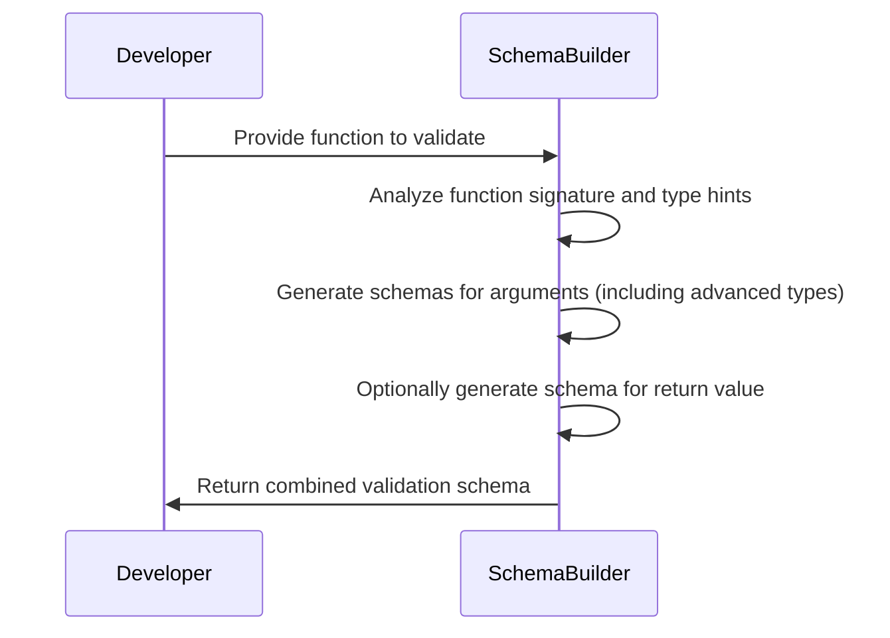
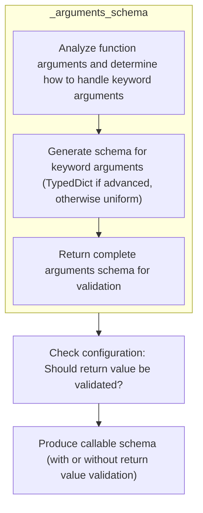
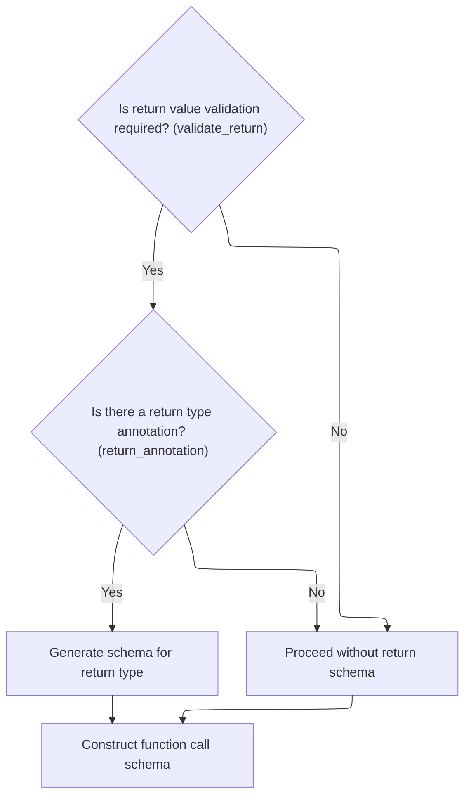

```mermaid
%%{init: {"flowchart": {"defaultRenderer": "elk"}} }%%
flowchart TD
    node1["Start: Generate schema for TypedDict class"] --> node2{"Schema already exists for this TypedDict?"}
    click node1 openCode "pydantic/_internal/_generate_schema.py:1380:1399"
    node2 -- Yes --> node3["Return existing schema"]
    click node2 openCode "pydantic/_internal/_generate_schema.py:1399:1401"
    click node3 openCode "pydantic/_internal/_generate_schema.py:1400:1401"
    node2 -- No --> node4{"Is TypedDict usage compatible?"}
    click node4 openCode "pydantic/_internal/_generate_schema.py:1406:1410"
    node4 -- No --> node5["Raise error: Use typing_extensions.TypedDict or Python 3.12+"]
    click node5 openCode "pydantic/_internal/_generate_schema.py:1407:1410"
    node4 -- Yes --> node6["Extract config, decorators, required/read-only fields"]
    click node6 openCode "pydantic/_internal/_generate_schema.py:1412:1432"
    node6 --> loop1
    
    subgraph loop1["For each field in TypedDict"]
      node7["Analyze field: required/read-only, config, docstring, generate field schema"]
      click node7 openCode "pydantic/_internal/_generate_schema.py:1434:1461"
    end
    loop1 --> node8["Warn if any fields are read-only"]
    click node8 openCode "pydantic/_internal/_generate_schema.py:1463:1471"
    node8 --> node9["Build TypedDict schema with computed fields, apply serializers/validators"]
    click node9 openCode "pydantic/_internal/_generate_schema.py:1473:1485"
    node9 --> node10["Return schema reference"]
    click node10 openCode "pydantic/_internal/_generate_schema.py:1486:1486"

%% Swimm:
%% %%{init: {"flowchart": {"defaultRenderer": "elk"}} }%%
%% flowchart TD
%%     node1["Start: Generate schema for <SwmToken path="pydantic/_internal/_generate_schema.py" pos="1381:17:17" line-data="        &quot;&quot;&quot;Generate a core schema for a `TypedDict` class.">`TypedDict`</SwmToken> class"] --> node2{"Schema already exists for this <SwmToken path="pydantic/_internal/_generate_schema.py" pos="1381:17:17" line-data="        &quot;&quot;&quot;Generate a core schema for a `TypedDict` class.">`TypedDict`</SwmToken>?"}
%%     click node1 openCode "<SwmPath>[pydantic/\_internal/\_generate_schema.py](pydantic/_internal/_generate_schema.py)</SwmPath>:1380:1399"
%%     node2 -- Yes --> node3["Return existing schema"]
%%     click node2 openCode "<SwmPath>[pydantic/\_internal/\_generate_schema.py](pydantic/_internal/_generate_schema.py)</SwmPath>:1399:1401"
%%     click node3 openCode "<SwmPath>[pydantic/\_internal/\_generate_schema.py](pydantic/_internal/_generate_schema.py)</SwmPath>:1400:1401"
%%     node2 -- No --> node4{"Is <SwmToken path="pydantic/_internal/_generate_schema.py" pos="1381:17:17" line-data="        &quot;&quot;&quot;Generate a core schema for a `TypedDict` class.">`TypedDict`</SwmToken> usage compatible?"}
%%     click node4 openCode "<SwmPath>[pydantic/\_internal/\_generate_schema.py](pydantic/_internal/_generate_schema.py)</SwmPath>:1406:1410"
%%     node4 -- No --> node5["Raise error: Use <SwmToken path="pydantic/_internal/_generate_schema.py" pos="1408:7:9" line-data="                    &#39;Please use `typing_extensions.TypedDict` instead of `typing.TypedDict` on Python &lt; 3.12.&#39;,">`typing_extensions.TypedDict`</SwmToken> or Python <SwmToken path="pydantic/_internal/_generate_schema.py" pos="1386:20:22" line-data="        However, the `__orig_bases__` attribute was only added in 3.12 (https://github.com/python/cpython/pull/103698).">`3.12`</SwmToken>+"]
%%     click node5 openCode "<SwmPath>[pydantic/\_internal/\_generate_schema.py](pydantic/_internal/_generate_schema.py)</SwmPath>:1407:1410"
%%     node4 -- Yes --> node6["Extract config, decorators, required/read-only fields"]
%%     click node6 openCode "<SwmPath>[pydantic/\_internal/\_generate_schema.py](pydantic/_internal/_generate_schema.py)</SwmPath>:1412:1432"
%%     node6 --> loop1
%%     
%%     subgraph loop1["For each field in <SwmToken path="pydantic/_internal/_generate_schema.py" pos="1381:17:17" line-data="        &quot;&quot;&quot;Generate a core schema for a `TypedDict` class.">`TypedDict`</SwmToken>"]
%%       node7["Analyze field: required/read-only, config, docstring, generate field schema"]
%%       click node7 openCode "<SwmPath>[pydantic/\_internal/\_generate_schema.py](pydantic/_internal/_generate_schema.py)</SwmPath>:1434:1461"
%%     end
%%     loop1 --> node8["Warn if any fields are read-only"]
%%     click node8 openCode "<SwmPath>[pydantic/\_internal/\_generate_schema.py](pydantic/_internal/_generate_schema.py)</SwmPath>:1463:1471"
%%     node8 --> node9["Build <SwmToken path="pydantic/_internal/_generate_schema.py" pos="1381:17:17" line-data="        &quot;&quot;&quot;Generate a core schema for a `TypedDict` class.">`TypedDict`</SwmToken> schema with computed fields, apply serializers/validators"]
%%     click node9 openCode "<SwmPath>[pydantic/\_internal/\_generate_schema.py](pydantic/_internal/_generate_schema.py)</SwmPath>:1473:1485"
%%     node9 --> node10["Return schema reference"]
%%     click node10 openCode "<SwmPath>[pydantic/\_internal/\_generate_schema.py](pydantic/_internal/_generate_schema.py)</SwmPath>:1486:1486"
```

This flow describes how a validation schema is built for callable objects to ensure their arguments and, if configured, return values match the expected types. The process involves analyzing the function's signature, generating schemas for each argument (including advanced types), optionally creating a schema for the return value, and combining these into a single validation schema.

Main steps:

- Analyze the function's signature and type hints
- Generate schemas for arguments, handling advanced cases
- Optionally generate a schema for the return value
- Combine argument and return schemas for validation



# Spec

## Detailed View of the Program's Functionality

a. Starting the Callable Schema Generation

The process begins by generating a schema for a callable (such as a function or method). The main entry point for this is a method that takes a callable object and aims to produce a schema describing how to validate calls to it. The first step is to generate a schema for the callable's arguments. This is done by analyzing the callable's signature and type hints, and then constructing a schema that describes how each argument should be validated.

b. Building the Arguments Schema

To build the arguments schema, the code inspects the callable's signature, extracting information about each parameter, including its name, kind (positional, keyword, etc.), default value, and type annotation. For each parameter:

- If the parameter is a standard positional or keyword argument, a parameter schema is generated that describes how to validate its value.
- If the parameter is a variable positional argument (<SwmToken path="pydantic/_internal/_generate_schema.py" pos="184:38:40" line-data="&quot;&quot;&quot;`FieldInfo` attributes (and their default value) that can&#39;t be used outside of a model (e.g. in a type adapter or a PEP 695 type alias).&quot;&quot;&quot;">`e.g`</SwmToken>., \*args), a schema is generated for the type of items expected in the sequence.
- If the parameter is a variable keyword argument (<SwmToken path="pydantic/_internal/_generate_schema.py" pos="184:38:40" line-data="&quot;&quot;&quot;`FieldInfo` attributes (and their default value) that can&#39;t be used outside of a model (e.g. in a type adapter or a PEP 695 type alias).&quot;&quot;&quot;">`e.g`</SwmToken>., \*\*kwargs), the code checks if the annotation uses Unpack with a <SwmToken path="pydantic/_internal/_generate_schema.py" pos="1381:17:17" line-data="        &quot;&quot;&quot;Generate a core schema for a `TypedDict` class.">`TypedDict`</SwmToken>. If so, it ensures that the <SwmToken path="pydantic/_internal/_generate_schema.py" pos="1381:17:17" line-data="        &quot;&quot;&quot;Generate a core schema for a `TypedDict` class.">`TypedDict`</SwmToken> does not overlap with other parameter names and then generates a schema for the <SwmToken path="pydantic/_internal/_generate_schema.py" pos="1381:17:17" line-data="        &quot;&quot;&quot;Generate a core schema for a `TypedDict` class.">`TypedDict`</SwmToken> structure. If not, it generates a generic schema for \*\*kwargs.

The result is a complete arguments schema that describes how to validate all inputs to the callable.

c. Generating Schema for <SwmToken path="pydantic/_internal/_generate_schema.py" pos="1381:17:17" line-data="        &quot;&quot;&quot;Generate a core schema for a `TypedDict` class.">`TypedDict`</SwmToken> Unpacking

When \*\*kwargs is annotated with Unpack and a <SwmToken path="pydantic/_internal/_generate_schema.py" pos="1381:17:17" line-data="        &quot;&quot;&quot;Generate a core schema for a `TypedDict` class.">`TypedDict`</SwmToken>, the code generates a schema that precisely matches the structure of the <SwmToken path="pydantic/_internal/_generate_schema.py" pos="1381:17:17" line-data="        &quot;&quot;&quot;Generate a core schema for a `TypedDict` class.">`TypedDict`</SwmToken>. This involves:

- Checking if a schema for this <SwmToken path="pydantic/_internal/_generate_schema.py" pos="1381:17:17" line-data="        &quot;&quot;&quot;Generate a core schema for a `TypedDict` class.">`TypedDict`</SwmToken> has already been generated (to avoid duplication and handle recursion).
- Ensuring that the <SwmToken path="pydantic/_internal/_generate_schema.py" pos="1381:17:17" line-data="        &quot;&quot;&quot;Generate a core schema for a `TypedDict` class.">`TypedDict`</SwmToken> is supported (requiring Python <SwmToken path="pydantic/_internal/_generate_schema.py" pos="1386:20:22" line-data="        However, the `__orig_bases__` attribute was only added in 3.12 (https://github.com/python/cpython/pull/103698).">`3.12`</SwmToken> or <SwmToken path="pydantic/_internal/_generate_schema.py" pos="1388:26:26" line-data="        For this reason, we require Python 3.12 (or using the `typing_extensions` backport).">`typing_extensions`</SwmToken>).
- Extracting configuration, decorators, and information about required and read-only fields.
- For each field in the <SwmToken path="pydantic/_internal/_generate_schema.py" pos="1381:17:17" line-data="        &quot;&quot;&quot;Generate a core schema for a `TypedDict` class.">`TypedDict`</SwmToken>, analyzing its type, whether it is required or read-only, and generating a field schema.
- Warning the user if any fields are marked as read-only (since immutability is not enforced).
- Building the final <SwmToken path="pydantic/_internal/_generate_schema.py" pos="1381:17:17" line-data="        &quot;&quot;&quot;Generate a core schema for a `TypedDict` class.">`TypedDict`</SwmToken> schema, applying any serializers or validators, and returning a reference to this schema.

d. Finalizing the Arguments Schema

After handling all parameters, including \*args and \*\*kwargs (with special handling for TypedDicts), the code constructs the final arguments schema object. This schema includes all parameter schemas, as well as configuration options such as whether to validate arguments by name.

e. Completing the Callable Schema

Once the arguments schema is ready, the code checks if return value validation is enabled in the configuration. If so, it extracts the return type annotation from the callable's signature and generates a schema for the return value. Finally, it constructs and returns the complete callable schema, which includes both the arguments schema and, if applicable, the return value schema. This schema can then be used to validate calls to the function, ensuring that both inputs and outputs conform to the specified types and constraints.

# Rule Definition

| Paragraph Name                                                                                                                                                                                                                                                                                                                                                                                                                                                                                                                                                                                                                                                                                                                                                                                                                                                                                                                                                                          | Rule ID | Category          | Description                                                                                                                                                                                                                                                                                                                                                                                                                                                                                                                                                                                                                                                                                                                                                                                                                                                                                                                                                                                                                                                                                                                                                                                                                                                         | Conditions                                                                                                                                                                                                                                                                                                                                                                                                                                                                                                                                                                                                                                                                                   | Remarks                                                                                                                                                                                                                                                                                                                                                                                                                                                                                                                                                                                                                                                                                                                                                                                                                                              |
| --------------------------------------------------------------------------------------------------------------------------------------------------------------------------------------------------------------------------------------------------------------------------------------------------------------------------------------------------------------------------------------------------------------------------------------------------------------------------------------------------------------------------------------------------------------------------------------------------------------------------------------------------------------------------------------------------------------------------------------------------------------------------------------------------------------------------------------------------------------------------------------------------------------------------------------------------------------------------------------- | ------- | ----------------- | ------------------------------------------------------------------------------------------------------------------------------------------------------------------------------------------------------------------------------------------------------------------------------------------------------------------------------------------------------------------------------------------------------------------------------------------------------------------------------------------------------------------------------------------------------------------------------------------------------------------------------------------------------------------------------------------------------------------------------------------------------------------------------------------------------------------------------------------------------------------------------------------------------------------------------------------------------------------------------------------------------------------------------------------------------------------------------------------------------------------------------------------------------------------------------------------------------------------------------------------------------------------- | -------------------------------------------------------------------------------------------------------------------------------------------------------------------------------------------------------------------------------------------------------------------------------------------------------------------------------------------------------------------------------------------------------------------------------------------------------------------------------------------------------------------------------------------------------------------------------------------------------------------------------------------------------------------------------------------- | ---------------------------------------------------------------------------------------------------------------------------------------------------------------------------------------------------------------------------------------------------------------------------------------------------------------------------------------------------------------------------------------------------------------------------------------------------------------------------------------------------------------------------------------------------------------------------------------------------------------------------------------------------------------------------------------------------------------------------------------------------------------------------------------------------------------------------------------------------- |
| def <SwmToken path="pydantic/_internal/_generate_schema.py" pos="1910:3:3" line-data="    def _call_schema(self, function: ValidateCallSupportedTypes) -&gt; core_schema.CallSchema:">`_call_schema`</SwmToken>, def <SwmToken path="pydantic/_internal/_generate_schema.py" pos="1927:7:7" line-data="                return_schema = self.generate_schema(type_hints[&#39;return&#39;])">`generate_schema`</SwmToken>, def <SwmToken path="pydantic/_internal/_generate_schema.py" pos="1915:7:7" line-data="        arguments_schema = self._arguments_schema(function)">`_arguments_schema`</SwmToken>                                                                                                                                                                                                                                                                                                                                                                              | RL-001  | Conditional Logic | When generating a schema for a callable, the system must create a dictionary-like object with 'type' set to 'call', include the callable itself, an <SwmToken path="pydantic/_internal/_generate_schema.py" pos="1915:1:1" line-data="        arguments_schema = self._arguments_schema(function)">`arguments_schema`</SwmToken> describing its arguments, and, if return value validation is enabled, a <SwmToken path="pydantic/_internal/_generate_schema.py" pos="1917:1:1" line-data="        return_schema: core_schema.CoreSchema \| None = None">`return_schema`</SwmToken> for the return value.                                                                                                                                                                                                                                                                                                                                                                                                                                                                                                                                                                                                                                                           | The input is a callable (function, method, lambda, or <SwmToken path="pydantic/_internal/_generate_schema.py" pos="691:28:30" line-data="        # this check may fail to catch duplicates if the function is a `functools.partial`">`functools.partial`</SwmToken>). If configuration <SwmToken path="pydantic/_internal/_generate_schema.py" pos="1919:5:5" line-data="        if config_wrapper.validate_return:">`validate_return`</SwmToken> is true and the callable has a return type annotation, include <SwmToken path="pydantic/_internal/_generate_schema.py" pos="1917:1:1" line-data="        return_schema: core_schema.CoreSchema \| None = None">`return_schema`</SwmToken>. | The schema must be a dictionary-like object with at least the keys: 'type' (value: 'call'), <SwmToken path="pydantic/_internal/_generate_schema.py" pos="1915:1:1" line-data="        arguments_schema = self._arguments_schema(function)">`arguments_schema`</SwmToken>, and optionally <SwmToken path="pydantic/_internal/_generate_schema.py" pos="1917:1:1" line-data="        return_schema: core_schema.CoreSchema \| None = None">`return_schema`</SwmToken>. The callable itself must be included. The arguments schema must be generated according to the callable's signature and type hints. The return schema is only included if <SwmToken path="pydantic/_internal/_generate_schema.py" pos="1919:5:5" line-data="        if config_wrapper.validate_return:">`validate_return`</SwmToken> is true and a return annotation is present. |
| def <SwmToken path="pydantic/_internal/_generate_schema.py" pos="1915:7:7" line-data="        arguments_schema = self._arguments_schema(function)">`_arguments_schema`</SwmToken>, def <SwmToken path="pydantic/_internal/_generate_schema.py" pos="1967:7:7" line-data="                arg_schema = self._generate_parameter_schema(">`_generate_parameter_schema`</SwmToken>                                                                                                                                                                                                                                                                                                                                                                                                                                                                                                                                                                                                         | RL-002  | Computation       | The system must analyze the callable's signature and type hints to generate an arguments schema. Each parameter is represented with its type, default value, and required status. Special handling is required for \*args and \*\*kwargs, including <SwmToken path="pydantic/_internal/_generate_schema.py" pos="1381:17:17" line-data="        &quot;&quot;&quot;Generate a core schema for a `TypedDict` class.">`TypedDict`</SwmToken> unpacking.                                                                                                                                                                                                                                                                                                                                                                                                                                                                                                                                                                                                                                                                                                                                                                                                                | The input is a callable and its signature is available. Type hints are present or default to Any.                                                                                                                                                                                                                                                                                                                                                                                                                                                                                                                                                                                            | The arguments schema is a dictionary-like object with 'type' set to 'arguments', containing a list of parameter schemas. Each parameter schema includes the parameter name, type, default value (if any), and required status. For \*args, the schema is generated from the type hint if present. For \*\*kwargs, if Unpack\[<SwmToken path="pydantic/_internal/_generate_schema.py" pos="1381:17:17" line-data="        &quot;&quot;&quot;Generate a core schema for a `TypedDict` class.">`TypedDict`</SwmToken>\] is used, generate a <SwmToken path="pydantic/_internal/_generate_schema.py" pos="1381:17:17" line-data="        &quot;&quot;&quot;Generate a core schema for a `TypedDict` class.">`TypedDict`</SwmToken> schema; otherwise, use a generic schema from the type hint.                                                           |
| def <SwmToken path="pydantic/_internal/_generate_schema.py" pos="1380:3:3" line-data="    def _typed_dict_schema(self, typed_dict_cls: Any, origin: Any) -&gt; core_schema.CoreSchema:">`_typed_dict_schema`</SwmToken>                                                                                                                                                                                                                                                                                                                                                                                                                                                                                                                                                                                                                                                                                                                                                                 | RL-003  | Conditional Logic | When generating a schema for a <SwmToken path="pydantic/_internal/_generate_schema.py" pos="1381:17:17" line-data="        &quot;&quot;&quot;Generate a core schema for a `TypedDict` class.">`TypedDict`</SwmToken>, reuse an existing schema if available. If not, verify compatibility, extract configuration, decorators, required/read-only fields, and docstrings. Generate field schemas for each field, issue warnings for read-only fields, and build a dictionary-like schema with 'type' set to <SwmToken path="pydantic/_internal/_generate_schema.py" pos="1409:4:6" line-data="                    code=&#39;typed-dict-version&#39;,">`typed-dict`</SwmToken>.                                                                                                                                                                                                                                                                                                                                                                                                                                                                                                                                                                                       | The input is a <SwmToken path="pydantic/_internal/_generate_schema.py" pos="1381:17:17" line-data="        &quot;&quot;&quot;Generate a core schema for a `TypedDict` class.">`TypedDict`</SwmToken> class or Unpack\[<SwmToken path="pydantic/_internal/_generate_schema.py" pos="1381:17:17" line-data="        &quot;&quot;&quot;Generate a core schema for a `TypedDict` class.">`TypedDict`</SwmToken>\] is used in \*\*kwargs. If a schema for the <SwmToken path="pydantic/_internal/_generate_schema.py" pos="1381:17:17" line-data="        &quot;&quot;&quot;Generate a core schema for a `TypedDict` class.">`TypedDict`</SwmToken> already exists, reuse it.                     | The schema must be a dictionary-like object with 'type': <SwmToken path="pydantic/_internal/_generate_schema.py" pos="1409:4:6" line-data="                    code=&#39;typed-dict-version&#39;,">`typed-dict`</SwmToken>, including field schemas, required/read-only flags, and any attached validators or serializers. If fields are read-only, issue a warning but do not enforce immutability. Return a reference to the schema if reused.                                                                                                                                                                                                                                                                                                                                                                                                     |
| def <SwmToken path="pydantic/_internal/_generate_schema.py" pos="1927:7:7" line-data="                return_schema = self.generate_schema(type_hints[&#39;return&#39;])">`generate_schema`</SwmToken>, def <SwmToken path="pydantic/_internal/_generate_schema.py" pos="721:7:7" line-data="        schema = self._generate_schema_from_get_schema_method(obj, obj)">`_generate_schema_from_get_schema_method`</SwmToken>, def <SwmToken path="pydantic/_internal/_generate_schema.py" pos="1023:5:5" line-data="        return self.match_type(obj)">`match_type`</SwmToken>                                                                                                                                                                                                                                                                                                                                                                                                          | RL-004  | Conditional Logic | When generating a schema for any type or object, use a custom schema method if present. Otherwise, dispatch to internal logic based on the type (model, dataclass, enum, <SwmToken path="pydantic/_internal/_generate_schema.py" pos="1381:17:17" line-data="        &quot;&quot;&quot;Generate a core schema for a `TypedDict` class.">`TypedDict`</SwmToken>, etc.). Handle recursion and references as needed. Attach custom JSON schema functions or serialization logic if present.                                                                                                                                                                                                                                                                                                                                                                                                                                                                                                                                                                                                                                                                                                                                                                            | The input is any type or object. If the object has a custom schema method, use it. Otherwise, use internal logic.                                                                                                                                                                                                                                                                                                                                                                                                                                                                                                                                                                            | The resulting schema must be a dictionary-like object with a 'type' key indicating the schema type. If recursion or references are involved, handle them appropriately. Attach custom JSON schema or serialization logic if available.                                                                                                                                                                                                                                                                                                                                                                                                                                                                                                                                                                                                               |
| def **init** (<SwmToken path="pydantic/_internal/_generate_schema.py" pos="330:2:2" line-data="class GenerateSchema:">`GenerateSchema`</SwmToken>), def <SwmToken path="pydantic/_internal/_generate_schema.py" pos="1910:3:3" line-data="    def _call_schema(self, function: ValidateCallSupportedTypes) -&gt; core_schema.CallSchema:">`_call_schema`</SwmToken>, def <SwmToken path="pydantic/_internal/_generate_schema.py" pos="1915:7:7" line-data="        arguments_schema = self._arguments_schema(function)">`_arguments_schema`</SwmToken>, def <SwmToken path="pydantic/_internal/_generate_schema.py" pos="1380:3:3" line-data="    def _typed_dict_schema(self, typed_dict_cls: Any, origin: Any) -&gt; core_schema.CoreSchema:">`_typed_dict_schema`</SwmToken>, def <SwmToken path="pydantic/_internal/_generate_schema.py" pos="1927:7:7" line-data="                return_schema = self.generate_schema(type_hints[&#39;return&#39;])">`generate_schema`</SwmToken> | RL-005  | Conditional Logic | The configuration object must support fields that affect schema generation, including <SwmToken path="pydantic/_internal/_generate_schema.py" pos="1919:5:5" line-data="        if config_wrapper.validate_return:">`validate_return`</SwmToken>, <SwmToken path="pydantic/_internal/_generate_schema.py" pos="2007:1:1" line-data="            validate_by_name=self._config_wrapper.validate_by_name,">`validate_by_name`</SwmToken>, <SwmToken path="pydantic/_internal/_generate_schema.py" pos="293:1:1" line-data="    json_encoders: JsonEncoders \| None, tp: Any, schema: CoreSchema">`json_encoders`</SwmToken>, <SwmToken path="pydantic/_internal/_generate_schema.py" pos="1429:7:7" line-data="                if self._config_wrapper.use_attribute_docstrings:">`use_attribute_docstrings`</SwmToken>, <SwmToken path="pydantic/_internal/_generate_schema.py" pos="374:7:7" line-data="        return self._config_wrapper.arbitrary_types_allowed">`arbitrary_types_allowed`</SwmToken>, 'extra', and <SwmToken path="pydantic/_internal/_generate_schema.py" pos="436:7:7" line-data="            if self._config_wrapper.use_enum_values:">`use_enum_values`</SwmToken>. These fields influence how schemas are generated and what is included. | A configuration object is provided to the schema generator. The relevant fields are set in the configuration.                                                                                                                                                                                                                                                                                                                                                                                                                                                                                                                                                                                | Configuration fields:                                                                                                                                                                                                                                                                                                                                                                                                                                                                                                                                                                                                                                                                                                                                                                                                                                |

- <SwmToken path="pydantic/_internal/_generate_schema.py" pos="1919:5:5" line-data="        if config_wrapper.validate_return:">`validate_return`</SwmToken>: Boolean, enables return value validation.
- <SwmToken path="pydantic/_internal/_generate_schema.py" pos="2007:1:1" line-data="            validate_by_name=self._config_wrapper.validate_by_name,">`validate_by_name`</SwmToken>: Boolean, enables argument validation by name.
- <SwmToken path="pydantic/_internal/_generate_schema.py" pos="293:1:1" line-data="    json_encoders: JsonEncoders | None, tp: Any, schema: CoreSchema">`json_encoders`</SwmToken>: Optional mapping for custom JSON encoders.
- <SwmToken path="pydantic/_internal/_generate_schema.py" pos="1429:7:7" line-data="                if self._config_wrapper.use_attribute_docstrings:">`use_attribute_docstrings`</SwmToken>: Boolean, uses attribute docstrings for field descriptions.
- <SwmToken path="pydantic/_internal/_generate_schema.py" pos="374:7:7" line-data="        return self._config_wrapper.arbitrary_types_allowed">`arbitrary_types_allowed`</SwmToken>: Boolean, allows arbitrary types.
- 'extra': String, controls extra fields ('allow', 'forbid').
- <SwmToken path="pydantic/_internal/_generate_schema.py" pos="436:7:7" line-data="            if self._config_wrapper.use_enum_values:">`use_enum_values`</SwmToken>: Boolean, uses enum values instead of objects. These fields must be respected during schema generation. | | def <SwmToken path="pydantic/_internal/_generate_schema.py" pos="1910:3:3" line-data="    def _call_schema(self, function: ValidateCallSupportedTypes) -&gt; core_schema.CallSchema:">`_call_schema`</SwmToken>, def <SwmToken path="pydantic/_internal/_generate_schema.py" pos="1915:7:7" line-data="        arguments_schema = self._arguments_schema(function)">`_arguments_schema`</SwmToken>, def <SwmToken path="pydantic/_internal/_generate_schema.py" pos="1380:3:3" line-data="    def _typed_dict_schema(self, typed_dict_cls: Any, origin: Any) -&gt; core_schema.CoreSchema:">`_typed_dict_schema`</SwmToken>, def <SwmToken path="pydantic/_internal/_generate_schema.py" pos="1927:7:7" line-data="                return_schema = self.generate_schema(type_hints[&#39;return&#39;])">`generate_schema`</SwmToken>, def <SwmToken path="pydantic/_internal/_generate_schema.py" pos="1023:5:5" line-data="        return self.match_type(obj)">`match_type`</SwmToken> | RL-006 | Data Assignment | All schemas must be constructed as nested dictionary-like objects with a 'type' key and additional keys as required for the schema type (<SwmToken path="pydantic/_internal/_generate_schema.py" pos="184:38:40" line-data="&quot;&quot;&quot;`FieldInfo` attributes (and their default value) that can&#39;t be used outside of a model (e.g. in a type adapter or a PEP 695 type alias).&quot;&quot;&quot;">`e.g`</SwmToken>., 'fields' for <SwmToken path="pydantic/_internal/_generate_schema.py" pos="1381:17:17" line-data="        &quot;&quot;&quot;Generate a core schema for a `TypedDict` class.">`TypedDict`</SwmToken>, 'parameters' for arguments, etc.). | Any schema is generated for a callable, arguments, <SwmToken path="pydantic/_internal/_generate_schema.py" pos="1381:17:17" line-data="        &quot;&quot;&quot;Generate a core schema for a `TypedDict` class.">`TypedDict`</SwmToken>, or arbitrary type. | Each schema must be a dictionary-like object. The 'type' key must be present and set to the schema type ('call', 'arguments', <SwmToken path="pydantic/_internal/_generate_schema.py" pos="1409:4:6" line-data="                    code=&#39;typed-dict-version&#39;,">`typed-dict`</SwmToken>, etc.). Additional keys are required depending on the schema type (<SwmToken path="pydantic/_internal/_generate_schema.py" pos="184:38:40" line-data="&quot;&quot;&quot;`FieldInfo` attributes (and their default value) that can&#39;t be used outside of a model (e.g. in a type adapter or a PEP 695 type alias).&quot;&quot;&quot;">`e.g`</SwmToken>., 'fields', 'parameters', <SwmToken path="pydantic/_internal/_generate_schema.py" pos="1915:1:1" line-data="        arguments_schema = self._arguments_schema(function)">`arguments_schema`</SwmToken>, <SwmToken path="pydantic/_internal/_generate_schema.py" pos="1917:1:1" line-data="        return_schema: core_schema.CoreSchema | None = None">`return_schema`</SwmToken>). Nested schemas must also follow this format. |

# User Stories

## User Story 1: Generate callable schema with arguments and optional return value

---

### Story Description:

As a user, I want to generate a schema for a callable that describes how to validate its arguments and, if enabled, its return value, so that I can ensure correct data validation for function calls, with configuration options such as <SwmToken path="pydantic/_internal/_generate_schema.py" pos="1919:5:5" line-data="        if config_wrapper.validate_return:">`validate_return`</SwmToken> respected.

---

### Business Rule Mapping:

| Rule ID | Paragraph Name                                                                                                                                                                                                                                                                                                                                                                                                                                                                                                                                                                                                                                                                                                                                                                                                                                                                                                                                                                          | Rule Description                                                                                                                                                                                                                                                                                                                                                                                                                                                                                                                                                                                                                                                                                                                                                                                                                                                                                                                                                                                                                                                                                                                                                                                                                                                    |
| ------- | --------------------------------------------------------------------------------------------------------------------------------------------------------------------------------------------------------------------------------------------------------------------------------------------------------------------------------------------------------------------------------------------------------------------------------------------------------------------------------------------------------------------------------------------------------------------------------------------------------------------------------------------------------------------------------------------------------------------------------------------------------------------------------------------------------------------------------------------------------------------------------------------------------------------------------------------------------------------------------------- | ------------------------------------------------------------------------------------------------------------------------------------------------------------------------------------------------------------------------------------------------------------------------------------------------------------------------------------------------------------------------------------------------------------------------------------------------------------------------------------------------------------------------------------------------------------------------------------------------------------------------------------------------------------------------------------------------------------------------------------------------------------------------------------------------------------------------------------------------------------------------------------------------------------------------------------------------------------------------------------------------------------------------------------------------------------------------------------------------------------------------------------------------------------------------------------------------------------------------------------------------------------------- |
| RL-001  | def <SwmToken path="pydantic/_internal/_generate_schema.py" pos="1910:3:3" line-data="    def _call_schema(self, function: ValidateCallSupportedTypes) -&gt; core_schema.CallSchema:">`_call_schema`</SwmToken>, def <SwmToken path="pydantic/_internal/_generate_schema.py" pos="1927:7:7" line-data="                return_schema = self.generate_schema(type_hints[&#39;return&#39;])">`generate_schema`</SwmToken>, def <SwmToken path="pydantic/_internal/_generate_schema.py" pos="1915:7:7" line-data="        arguments_schema = self._arguments_schema(function)">`_arguments_schema`</SwmToken>                                                                                                                                                                                                                                                                                                                                                                              | When generating a schema for a callable, the system must create a dictionary-like object with 'type' set to 'call', include the callable itself, an <SwmToken path="pydantic/_internal/_generate_schema.py" pos="1915:1:1" line-data="        arguments_schema = self._arguments_schema(function)">`arguments_schema`</SwmToken> describing its arguments, and, if return value validation is enabled, a <SwmToken path="pydantic/_internal/_generate_schema.py" pos="1917:1:1" line-data="        return_schema: core_schema.CoreSchema \| None = None">`return_schema`</SwmToken> for the return value.                                                                                                                                                                                                                                                                                                                                                                                                                                                                                                                                                                                                                                                           |
| RL-006  | def <SwmToken path="pydantic/_internal/_generate_schema.py" pos="1910:3:3" line-data="    def _call_schema(self, function: ValidateCallSupportedTypes) -&gt; core_schema.CallSchema:">`_call_schema`</SwmToken>, def <SwmToken path="pydantic/_internal/_generate_schema.py" pos="1915:7:7" line-data="        arguments_schema = self._arguments_schema(function)">`_arguments_schema`</SwmToken>, def <SwmToken path="pydantic/_internal/_generate_schema.py" pos="1380:3:3" line-data="    def _typed_dict_schema(self, typed_dict_cls: Any, origin: Any) -&gt; core_schema.CoreSchema:">`_typed_dict_schema`</SwmToken>, def <SwmToken path="pydantic/_internal/_generate_schema.py" pos="1927:7:7" line-data="                return_schema = self.generate_schema(type_hints[&#39;return&#39;])">`generate_schema`</SwmToken>, def <SwmToken path="pydantic/_internal/_generate_schema.py" pos="1023:5:5" line-data="        return self.match_type(obj)">`match_type`</SwmToken> | All schemas must be constructed as nested dictionary-like objects with a 'type' key and additional keys as required for the schema type (<SwmToken path="pydantic/_internal/_generate_schema.py" pos="184:38:40" line-data="&quot;&quot;&quot;`FieldInfo` attributes (and their default value) that can&#39;t be used outside of a model (e.g. in a type adapter or a PEP 695 type alias).&quot;&quot;&quot;">`e.g`</SwmToken>., 'fields' for <SwmToken path="pydantic/_internal/_generate_schema.py" pos="1381:17:17" line-data="        &quot;&quot;&quot;Generate a core schema for a `TypedDict` class.">`TypedDict`</SwmToken>, 'parameters' for arguments, etc.).                                                                                                                                                                                                                                                                                                                                                                                                                                                                                                                                                                                             |
| RL-005  | def **init** (<SwmToken path="pydantic/_internal/_generate_schema.py" pos="330:2:2" line-data="class GenerateSchema:">`GenerateSchema`</SwmToken>), def <SwmToken path="pydantic/_internal/_generate_schema.py" pos="1910:3:3" line-data="    def _call_schema(self, function: ValidateCallSupportedTypes) -&gt; core_schema.CallSchema:">`_call_schema`</SwmToken>, def <SwmToken path="pydantic/_internal/_generate_schema.py" pos="1915:7:7" line-data="        arguments_schema = self._arguments_schema(function)">`_arguments_schema`</SwmToken>, def <SwmToken path="pydantic/_internal/_generate_schema.py" pos="1380:3:3" line-data="    def _typed_dict_schema(self, typed_dict_cls: Any, origin: Any) -&gt; core_schema.CoreSchema:">`_typed_dict_schema`</SwmToken>, def <SwmToken path="pydantic/_internal/_generate_schema.py" pos="1927:7:7" line-data="                return_schema = self.generate_schema(type_hints[&#39;return&#39;])">`generate_schema`</SwmToken> | The configuration object must support fields that affect schema generation, including <SwmToken path="pydantic/_internal/_generate_schema.py" pos="1919:5:5" line-data="        if config_wrapper.validate_return:">`validate_return`</SwmToken>, <SwmToken path="pydantic/_internal/_generate_schema.py" pos="2007:1:1" line-data="            validate_by_name=self._config_wrapper.validate_by_name,">`validate_by_name`</SwmToken>, <SwmToken path="pydantic/_internal/_generate_schema.py" pos="293:1:1" line-data="    json_encoders: JsonEncoders \| None, tp: Any, schema: CoreSchema">`json_encoders`</SwmToken>, <SwmToken path="pydantic/_internal/_generate_schema.py" pos="1429:7:7" line-data="                if self._config_wrapper.use_attribute_docstrings:">`use_attribute_docstrings`</SwmToken>, <SwmToken path="pydantic/_internal/_generate_schema.py" pos="374:7:7" line-data="        return self._config_wrapper.arbitrary_types_allowed">`arbitrary_types_allowed`</SwmToken>, 'extra', and <SwmToken path="pydantic/_internal/_generate_schema.py" pos="436:7:7" line-data="            if self._config_wrapper.use_enum_values:">`use_enum_values`</SwmToken>. These fields influence how schemas are generated and what is included. |

---

### Relevant Functionality:

- **def** <SwmToken path="pydantic/_internal/_generate_schema.py" pos="1910:3:3" line-data="    def _call_schema(self, function: ValidateCallSupportedTypes) -&gt; core_schema.CallSchema:">`_call_schema`</SwmToken>
  1. **RL-001:**
     - If the input is a supported callable:
       - Generate the arguments schema by analyzing the signature and type hints.
       - If <SwmToken path="pydantic/_internal/_generate_schema.py" pos="1919:5:5" line-data="        if config_wrapper.validate_return:">`validate_return`</SwmToken> is enabled and a return annotation exists:
         - Generate the return schema from the return type annotation.
       - Build a dictionary-like schema object:
         - Set 'type' to 'call'.
         - Include the callable.
         - Add <SwmToken path="pydantic/_internal/_generate_schema.py" pos="1915:1:1" line-data="        arguments_schema = self._arguments_schema(function)">`arguments_schema`</SwmToken>.
         - If applicable, add <SwmToken path="pydantic/_internal/_generate_schema.py" pos="1917:1:1" line-data="        return_schema: core_schema.CoreSchema | None = None">`return_schema`</SwmToken>.
  2. **RL-006:**
     - When constructing any schema:
       - Ensure the object is dictionary-like.
       - Set the 'type' key to the schema type.
       - Add additional keys as required for the schema type.
       - For nested schemas, repeat the process recursively.
- **def init** (<SwmToken path="pydantic/_internal/_generate_schema.py" pos="330:2:2" line-data="class GenerateSchema:">`GenerateSchema`</SwmToken>)
  1. **RL-005:**
     - On schema generator initialization, store configuration.
     - When generating schemas, check configuration fields:
       - If <SwmToken path="pydantic/_internal/_generate_schema.py" pos="1919:5:5" line-data="        if config_wrapper.validate_return:">`validate_return`</SwmToken>, include return schema.
       - If <SwmToken path="pydantic/_internal/_generate_schema.py" pos="2007:1:1" line-data="            validate_by_name=self._config_wrapper.validate_by_name,">`validate_by_name`</SwmToken>, set in arguments schema.
       - If <SwmToken path="pydantic/_internal/_generate_schema.py" pos="293:1:1" line-data="    json_encoders: JsonEncoders | None, tp: Any, schema: CoreSchema">`json_encoders`</SwmToken>, attach custom encoders.
       - If <SwmToken path="pydantic/_internal/_generate_schema.py" pos="1429:7:7" line-data="                if self._config_wrapper.use_attribute_docstrings:">`use_attribute_docstrings`</SwmToken>, extract docstrings for fields.
       - If <SwmToken path="pydantic/_internal/_generate_schema.py" pos="374:7:7" line-data="        return self._config_wrapper.arbitrary_types_allowed">`arbitrary_types_allowed`</SwmToken>, allow arbitrary types.
       - If 'extra', control handling of extra fields.
       - If <SwmToken path="pydantic/_internal/_generate_schema.py" pos="436:7:7" line-data="            if self._config_wrapper.use_enum_values:">`use_enum_values`</SwmToken>, use enum values in schemas.

## User Story 2: Generate detailed argument schemas for callables

---

### Story Description:

As a user, I want the system to analyze a callable's signature and type hints to generate a detailed arguments schema, including handling of standard parameters, \*args, \*\*kwargs, and <SwmToken path="pydantic/_internal/_generate_schema.py" pos="1381:17:17" line-data="        &quot;&quot;&quot;Generate a core schema for a `TypedDict` class.">`TypedDict`</SwmToken> unpacking, so that all possible argument types are validated correctly, with configuration options such as <SwmToken path="pydantic/_internal/_generate_schema.py" pos="2007:1:1" line-data="            validate_by_name=self._config_wrapper.validate_by_name,">`validate_by_name`</SwmToken>, <SwmToken path="pydantic/_internal/_generate_schema.py" pos="374:7:7" line-data="        return self._config_wrapper.arbitrary_types_allowed">`arbitrary_types_allowed`</SwmToken>, and 'extra' respected.

---

### Business Rule Mapping:

| Rule ID | Paragraph Name                                                                                                                                                                                                                                                                                                                                                                                                                                                                                                                                                                                                                                                                                                                                                                                                                                                                                                                                                                          | Rule Description                                                                                                                                                                                                                                                                                                                                                                                                                                                                                                                                                                                                                                                                                                                                                                                                                                                                                                                                                                                                                                                                                                                                                                                                                                                    |
| ------- | --------------------------------------------------------------------------------------------------------------------------------------------------------------------------------------------------------------------------------------------------------------------------------------------------------------------------------------------------------------------------------------------------------------------------------------------------------------------------------------------------------------------------------------------------------------------------------------------------------------------------------------------------------------------------------------------------------------------------------------------------------------------------------------------------------------------------------------------------------------------------------------------------------------------------------------------------------------------------------------- | ------------------------------------------------------------------------------------------------------------------------------------------------------------------------------------------------------------------------------------------------------------------------------------------------------------------------------------------------------------------------------------------------------------------------------------------------------------------------------------------------------------------------------------------------------------------------------------------------------------------------------------------------------------------------------------------------------------------------------------------------------------------------------------------------------------------------------------------------------------------------------------------------------------------------------------------------------------------------------------------------------------------------------------------------------------------------------------------------------------------------------------------------------------------------------------------------------------------------------------------------------------------- |
| RL-002  | def <SwmToken path="pydantic/_internal/_generate_schema.py" pos="1915:7:7" line-data="        arguments_schema = self._arguments_schema(function)">`_arguments_schema`</SwmToken>, def <SwmToken path="pydantic/_internal/_generate_schema.py" pos="1967:7:7" line-data="                arg_schema = self._generate_parameter_schema(">`_generate_parameter_schema`</SwmToken>                                                                                                                                                                                                                                                                                                                                                                                                                                                                                                                                                                                                         | The system must analyze the callable's signature and type hints to generate an arguments schema. Each parameter is represented with its type, default value, and required status. Special handling is required for \*args and \*\*kwargs, including <SwmToken path="pydantic/_internal/_generate_schema.py" pos="1381:17:17" line-data="        &quot;&quot;&quot;Generate a core schema for a `TypedDict` class.">`TypedDict`</SwmToken> unpacking.                                                                                                                                                                                                                                                                                                                                                                                                                                                                                                                                                                                                                                                                                                                                                                                                                |
| RL-006  | def <SwmToken path="pydantic/_internal/_generate_schema.py" pos="1910:3:3" line-data="    def _call_schema(self, function: ValidateCallSupportedTypes) -&gt; core_schema.CallSchema:">`_call_schema`</SwmToken>, def <SwmToken path="pydantic/_internal/_generate_schema.py" pos="1915:7:7" line-data="        arguments_schema = self._arguments_schema(function)">`_arguments_schema`</SwmToken>, def <SwmToken path="pydantic/_internal/_generate_schema.py" pos="1380:3:3" line-data="    def _typed_dict_schema(self, typed_dict_cls: Any, origin: Any) -&gt; core_schema.CoreSchema:">`_typed_dict_schema`</SwmToken>, def <SwmToken path="pydantic/_internal/_generate_schema.py" pos="1927:7:7" line-data="                return_schema = self.generate_schema(type_hints[&#39;return&#39;])">`generate_schema`</SwmToken>, def <SwmToken path="pydantic/_internal/_generate_schema.py" pos="1023:5:5" line-data="        return self.match_type(obj)">`match_type`</SwmToken> | All schemas must be constructed as nested dictionary-like objects with a 'type' key and additional keys as required for the schema type (<SwmToken path="pydantic/_internal/_generate_schema.py" pos="184:38:40" line-data="&quot;&quot;&quot;`FieldInfo` attributes (and their default value) that can&#39;t be used outside of a model (e.g. in a type adapter or a PEP 695 type alias).&quot;&quot;&quot;">`e.g`</SwmToken>., 'fields' for <SwmToken path="pydantic/_internal/_generate_schema.py" pos="1381:17:17" line-data="        &quot;&quot;&quot;Generate a core schema for a `TypedDict` class.">`TypedDict`</SwmToken>, 'parameters' for arguments, etc.).                                                                                                                                                                                                                                                                                                                                                                                                                                                                                                                                                                                             |
| RL-005  | def **init** (<SwmToken path="pydantic/_internal/_generate_schema.py" pos="330:2:2" line-data="class GenerateSchema:">`GenerateSchema`</SwmToken>), def <SwmToken path="pydantic/_internal/_generate_schema.py" pos="1910:3:3" line-data="    def _call_schema(self, function: ValidateCallSupportedTypes) -&gt; core_schema.CallSchema:">`_call_schema`</SwmToken>, def <SwmToken path="pydantic/_internal/_generate_schema.py" pos="1915:7:7" line-data="        arguments_schema = self._arguments_schema(function)">`_arguments_schema`</SwmToken>, def <SwmToken path="pydantic/_internal/_generate_schema.py" pos="1380:3:3" line-data="    def _typed_dict_schema(self, typed_dict_cls: Any, origin: Any) -&gt; core_schema.CoreSchema:">`_typed_dict_schema`</SwmToken>, def <SwmToken path="pydantic/_internal/_generate_schema.py" pos="1927:7:7" line-data="                return_schema = self.generate_schema(type_hints[&#39;return&#39;])">`generate_schema`</SwmToken> | The configuration object must support fields that affect schema generation, including <SwmToken path="pydantic/_internal/_generate_schema.py" pos="1919:5:5" line-data="        if config_wrapper.validate_return:">`validate_return`</SwmToken>, <SwmToken path="pydantic/_internal/_generate_schema.py" pos="2007:1:1" line-data="            validate_by_name=self._config_wrapper.validate_by_name,">`validate_by_name`</SwmToken>, <SwmToken path="pydantic/_internal/_generate_schema.py" pos="293:1:1" line-data="    json_encoders: JsonEncoders \| None, tp: Any, schema: CoreSchema">`json_encoders`</SwmToken>, <SwmToken path="pydantic/_internal/_generate_schema.py" pos="1429:7:7" line-data="                if self._config_wrapper.use_attribute_docstrings:">`use_attribute_docstrings`</SwmToken>, <SwmToken path="pydantic/_internal/_generate_schema.py" pos="374:7:7" line-data="        return self._config_wrapper.arbitrary_types_allowed">`arbitrary_types_allowed`</SwmToken>, 'extra', and <SwmToken path="pydantic/_internal/_generate_schema.py" pos="436:7:7" line-data="            if self._config_wrapper.use_enum_values:">`use_enum_values`</SwmToken>. These fields influence how schemas are generated and what is included. |

---

### Relevant Functionality:

- **def** <SwmToken path="pydantic/_internal/_generate_schema.py" pos="1915:7:7" line-data="        arguments_schema = self._arguments_schema(function)">`_arguments_schema`</SwmToken>
  1. **RL-002:**
     - For each parameter in the callable's signature:
       - If positional or keyword parameter:
         - Generate schema with type, default, required.
       - If \*args:
         - Generate schema from type hint if present.
       - If \*\*kwargs:
         - If Unpack\[<SwmToken path="pydantic/_internal/_generate_schema.py" pos="1381:17:17" line-data="        &quot;&quot;&quot;Generate a core schema for a `TypedDict` class.">`TypedDict`</SwmToken>\]:
           - Generate <SwmToken path="pydantic/_internal/_generate_schema.py" pos="1381:17:17" line-data="        &quot;&quot;&quot;Generate a core schema for a `TypedDict` class.">`TypedDict`</SwmToken> schema.
         - Else:
           - Generate generic schema from type hint.
     - Build arguments schema object with 'type': 'arguments', parameter schemas, and configuration (<SwmToken path="pydantic/_internal/_generate_schema.py" pos="184:38:40" line-data="&quot;&quot;&quot;`FieldInfo` attributes (and their default value) that can&#39;t be used outside of a model (e.g. in a type adapter or a PEP 695 type alias).&quot;&quot;&quot;">`e.g`</SwmToken>., <SwmToken path="pydantic/_internal/_generate_schema.py" pos="2007:1:1" line-data="            validate_by_name=self._config_wrapper.validate_by_name,">`validate_by_name`</SwmToken>).
- **def** <SwmToken path="pydantic/_internal/_generate_schema.py" pos="1910:3:3" line-data="    def _call_schema(self, function: ValidateCallSupportedTypes) -&gt; core_schema.CallSchema:">`_call_schema`</SwmToken>
  1. **RL-006:**
     - When constructing any schema:
       - Ensure the object is dictionary-like.
       - Set the 'type' key to the schema type.
       - Add additional keys as required for the schema type.
       - For nested schemas, repeat the process recursively.
- **def init** (<SwmToken path="pydantic/_internal/_generate_schema.py" pos="330:2:2" line-data="class GenerateSchema:">`GenerateSchema`</SwmToken>)
  1. **RL-005:**
     - On schema generator initialization, store configuration.
     - When generating schemas, check configuration fields:
       - If <SwmToken path="pydantic/_internal/_generate_schema.py" pos="1919:5:5" line-data="        if config_wrapper.validate_return:">`validate_return`</SwmToken>, include return schema.
       - If <SwmToken path="pydantic/_internal/_generate_schema.py" pos="2007:1:1" line-data="            validate_by_name=self._config_wrapper.validate_by_name,">`validate_by_name`</SwmToken>, set in arguments schema.
       - If <SwmToken path="pydantic/_internal/_generate_schema.py" pos="293:1:1" line-data="    json_encoders: JsonEncoders | None, tp: Any, schema: CoreSchema">`json_encoders`</SwmToken>, attach custom encoders.
       - If <SwmToken path="pydantic/_internal/_generate_schema.py" pos="1429:7:7" line-data="                if self._config_wrapper.use_attribute_docstrings:">`use_attribute_docstrings`</SwmToken>, extract docstrings for fields.
       - If <SwmToken path="pydantic/_internal/_generate_schema.py" pos="374:7:7" line-data="        return self._config_wrapper.arbitrary_types_allowed">`arbitrary_types_allowed`</SwmToken>, allow arbitrary types.
       - If 'extra', control handling of extra fields.
       - If <SwmToken path="pydantic/_internal/_generate_schema.py" pos="436:7:7" line-data="            if self._config_wrapper.use_enum_values:">`use_enum_values`</SwmToken>, use enum values in schemas.

## User Story 3: Generate and reuse <SwmToken path="pydantic/_internal/_generate_schema.py" pos="1381:17:17" line-data="        &quot;&quot;&quot;Generate a core schema for a `TypedDict` class.">`TypedDict`</SwmToken> schemas

---

### Story Description:

As a user, I want the system to generate schemas for TypedDicts, reusing existing schemas when possible, extracting all relevant field information, and issuing warnings for read-only fields, so that complex dictionary-like structures are validated accurately and efficiently, with configuration options such as <SwmToken path="pydantic/_internal/_generate_schema.py" pos="1429:7:7" line-data="                if self._config_wrapper.use_attribute_docstrings:">`use_attribute_docstrings`</SwmToken> respected.

---

### Business Rule Mapping:

| Rule ID | Paragraph Name                                                                                                                                                                                                                                                                                                                                                                                                                                                                                                                                                                                                                                                                                                                                                                                                                                                                                                                                                                          | Rule Description                                                                                                                                                                                                                                                                                                                                                                                                                                                                                                                                                                                                                                                                                                                                                                                                                                                                                                                                                                                                                                                                                                                                                                                                                                                    |
| ------- | --------------------------------------------------------------------------------------------------------------------------------------------------------------------------------------------------------------------------------------------------------------------------------------------------------------------------------------------------------------------------------------------------------------------------------------------------------------------------------------------------------------------------------------------------------------------------------------------------------------------------------------------------------------------------------------------------------------------------------------------------------------------------------------------------------------------------------------------------------------------------------------------------------------------------------------------------------------------------------------- | ------------------------------------------------------------------------------------------------------------------------------------------------------------------------------------------------------------------------------------------------------------------------------------------------------------------------------------------------------------------------------------------------------------------------------------------------------------------------------------------------------------------------------------------------------------------------------------------------------------------------------------------------------------------------------------------------------------------------------------------------------------------------------------------------------------------------------------------------------------------------------------------------------------------------------------------------------------------------------------------------------------------------------------------------------------------------------------------------------------------------------------------------------------------------------------------------------------------------------------------------------------------- |
| RL-003  | def <SwmToken path="pydantic/_internal/_generate_schema.py" pos="1380:3:3" line-data="    def _typed_dict_schema(self, typed_dict_cls: Any, origin: Any) -&gt; core_schema.CoreSchema:">`_typed_dict_schema`</SwmToken>                                                                                                                                                                                                                                                                                                                                                                                                                                                                                                                                                                                                                                                                                                                                                                 | When generating a schema for a <SwmToken path="pydantic/_internal/_generate_schema.py" pos="1381:17:17" line-data="        &quot;&quot;&quot;Generate a core schema for a `TypedDict` class.">`TypedDict`</SwmToken>, reuse an existing schema if available. If not, verify compatibility, extract configuration, decorators, required/read-only fields, and docstrings. Generate field schemas for each field, issue warnings for read-only fields, and build a dictionary-like schema with 'type' set to <SwmToken path="pydantic/_internal/_generate_schema.py" pos="1409:4:6" line-data="                    code=&#39;typed-dict-version&#39;,">`typed-dict`</SwmToken>.                                                                                                                                                                                                                                                                                                                                                                                                                                                                                                                                                                                       |
| RL-006  | def <SwmToken path="pydantic/_internal/_generate_schema.py" pos="1910:3:3" line-data="    def _call_schema(self, function: ValidateCallSupportedTypes) -&gt; core_schema.CallSchema:">`_call_schema`</SwmToken>, def <SwmToken path="pydantic/_internal/_generate_schema.py" pos="1915:7:7" line-data="        arguments_schema = self._arguments_schema(function)">`_arguments_schema`</SwmToken>, def <SwmToken path="pydantic/_internal/_generate_schema.py" pos="1380:3:3" line-data="    def _typed_dict_schema(self, typed_dict_cls: Any, origin: Any) -&gt; core_schema.CoreSchema:">`_typed_dict_schema`</SwmToken>, def <SwmToken path="pydantic/_internal/_generate_schema.py" pos="1927:7:7" line-data="                return_schema = self.generate_schema(type_hints[&#39;return&#39;])">`generate_schema`</SwmToken>, def <SwmToken path="pydantic/_internal/_generate_schema.py" pos="1023:5:5" line-data="        return self.match_type(obj)">`match_type`</SwmToken> | All schemas must be constructed as nested dictionary-like objects with a 'type' key and additional keys as required for the schema type (<SwmToken path="pydantic/_internal/_generate_schema.py" pos="184:38:40" line-data="&quot;&quot;&quot;`FieldInfo` attributes (and their default value) that can&#39;t be used outside of a model (e.g. in a type adapter or a PEP 695 type alias).&quot;&quot;&quot;">`e.g`</SwmToken>., 'fields' for <SwmToken path="pydantic/_internal/_generate_schema.py" pos="1381:17:17" line-data="        &quot;&quot;&quot;Generate a core schema for a `TypedDict` class.">`TypedDict`</SwmToken>, 'parameters' for arguments, etc.).                                                                                                                                                                                                                                                                                                                                                                                                                                                                                                                                                                                             |
| RL-005  | def **init** (<SwmToken path="pydantic/_internal/_generate_schema.py" pos="330:2:2" line-data="class GenerateSchema:">`GenerateSchema`</SwmToken>), def <SwmToken path="pydantic/_internal/_generate_schema.py" pos="1910:3:3" line-data="    def _call_schema(self, function: ValidateCallSupportedTypes) -&gt; core_schema.CallSchema:">`_call_schema`</SwmToken>, def <SwmToken path="pydantic/_internal/_generate_schema.py" pos="1915:7:7" line-data="        arguments_schema = self._arguments_schema(function)">`_arguments_schema`</SwmToken>, def <SwmToken path="pydantic/_internal/_generate_schema.py" pos="1380:3:3" line-data="    def _typed_dict_schema(self, typed_dict_cls: Any, origin: Any) -&gt; core_schema.CoreSchema:">`_typed_dict_schema`</SwmToken>, def <SwmToken path="pydantic/_internal/_generate_schema.py" pos="1927:7:7" line-data="                return_schema = self.generate_schema(type_hints[&#39;return&#39;])">`generate_schema`</SwmToken> | The configuration object must support fields that affect schema generation, including <SwmToken path="pydantic/_internal/_generate_schema.py" pos="1919:5:5" line-data="        if config_wrapper.validate_return:">`validate_return`</SwmToken>, <SwmToken path="pydantic/_internal/_generate_schema.py" pos="2007:1:1" line-data="            validate_by_name=self._config_wrapper.validate_by_name,">`validate_by_name`</SwmToken>, <SwmToken path="pydantic/_internal/_generate_schema.py" pos="293:1:1" line-data="    json_encoders: JsonEncoders \| None, tp: Any, schema: CoreSchema">`json_encoders`</SwmToken>, <SwmToken path="pydantic/_internal/_generate_schema.py" pos="1429:7:7" line-data="                if self._config_wrapper.use_attribute_docstrings:">`use_attribute_docstrings`</SwmToken>, <SwmToken path="pydantic/_internal/_generate_schema.py" pos="374:7:7" line-data="        return self._config_wrapper.arbitrary_types_allowed">`arbitrary_types_allowed`</SwmToken>, 'extra', and <SwmToken path="pydantic/_internal/_generate_schema.py" pos="436:7:7" line-data="            if self._config_wrapper.use_enum_values:">`use_enum_values`</SwmToken>. These fields influence how schemas are generated and what is included. |

---

### Relevant Functionality:

- **def** <SwmToken path="pydantic/_internal/_generate_schema.py" pos="1380:3:3" line-data="    def _typed_dict_schema(self, typed_dict_cls: Any, origin: Any) -&gt; core_schema.CoreSchema:">`_typed_dict_schema`</SwmToken>
  1. **RL-003:**
     - If a schema for the <SwmToken path="pydantic/_internal/_generate_schema.py" pos="1381:17:17" line-data="        &quot;&quot;&quot;Generate a core schema for a `TypedDict` class.">`TypedDict`</SwmToken> class exists:
       - Return the existing schema.
     - Else:
       - Verify <SwmToken path="pydantic/_internal/_generate_schema.py" pos="1381:17:17" line-data="        &quot;&quot;&quot;Generate a core schema for a `TypedDict` class.">`TypedDict`</SwmToken> compatibility (<SwmToken path="pydantic/_internal/_generate_schema.py" pos="1408:7:9" line-data="                    &#39;Please use `typing_extensions.TypedDict` instead of `typing.TypedDict` on Python &lt; 3.12.&#39;,">`typing_extensions.TypedDict`</SwmToken> or Python <SwmToken path="pydantic/_internal/_generate_schema.py" pos="1386:20:22" line-data="        However, the `__orig_bases__` attribute was only added in 3.12 (https://github.com/python/cpython/pull/103698).">`3.12`</SwmToken>+).
       - Extract config, decorators, required/read-only fields, docstrings.
       - For each field:
         - Determine required/read-only status.
         - Extract type annotation and docstring.
         - Generate field type schema.
       - If any fields are read-only:
         - Issue a warning.
       - Build schema with 'type': <SwmToken path="pydantic/_internal/_generate_schema.py" pos="1409:4:6" line-data="                    code=&#39;typed-dict-version&#39;,">`typed-dict`</SwmToken>, field schemas, flags, validators/serializers.
       - Return a reference to the schema.
- **def** <SwmToken path="pydantic/_internal/_generate_schema.py" pos="1910:3:3" line-data="    def _call_schema(self, function: ValidateCallSupportedTypes) -&gt; core_schema.CallSchema:">`_call_schema`</SwmToken>
  1. **RL-006:**
     - When constructing any schema:
       - Ensure the object is dictionary-like.
       - Set the 'type' key to the schema type.
       - Add additional keys as required for the schema type.
       - For nested schemas, repeat the process recursively.
- **def init** (<SwmToken path="pydantic/_internal/_generate_schema.py" pos="330:2:2" line-data="class GenerateSchema:">`GenerateSchema`</SwmToken>)
  1. **RL-005:**
     - On schema generator initialization, store configuration.
     - When generating schemas, check configuration fields:
       - If <SwmToken path="pydantic/_internal/_generate_schema.py" pos="1919:5:5" line-data="        if config_wrapper.validate_return:">`validate_return`</SwmToken>, include return schema.
       - If <SwmToken path="pydantic/_internal/_generate_schema.py" pos="2007:1:1" line-data="            validate_by_name=self._config_wrapper.validate_by_name,">`validate_by_name`</SwmToken>, set in arguments schema.
       - If <SwmToken path="pydantic/_internal/_generate_schema.py" pos="293:1:1" line-data="    json_encoders: JsonEncoders | None, tp: Any, schema: CoreSchema">`json_encoders`</SwmToken>, attach custom encoders.
       - If <SwmToken path="pydantic/_internal/_generate_schema.py" pos="1429:7:7" line-data="                if self._config_wrapper.use_attribute_docstrings:">`use_attribute_docstrings`</SwmToken>, extract docstrings for fields.
       - If <SwmToken path="pydantic/_internal/_generate_schema.py" pos="374:7:7" line-data="        return self._config_wrapper.arbitrary_types_allowed">`arbitrary_types_allowed`</SwmToken>, allow arbitrary types.
       - If 'extra', control handling of extra fields.
       - If <SwmToken path="pydantic/_internal/_generate_schema.py" pos="436:7:7" line-data="            if self._config_wrapper.use_enum_values:">`use_enum_values`</SwmToken>, use enum values in schemas.

## User Story 4: Support custom schema logic and type dispatch

---

### Story Description:

As a user, I want the system to use custom schema methods when available or dispatch to internal logic based on the type, handling recursion and references, so that all types and objects can be validated according to their specific requirements, with configuration options such as <SwmToken path="pydantic/_internal/_generate_schema.py" pos="293:1:1" line-data="    json_encoders: JsonEncoders | None, tp: Any, schema: CoreSchema">`json_encoders`</SwmToken> and <SwmToken path="pydantic/_internal/_generate_schema.py" pos="436:7:7" line-data="            if self._config_wrapper.use_enum_values:">`use_enum_values`</SwmToken> respected.

---

### Business Rule Mapping:

| Rule ID | Paragraph Name                                                                                                                                                                                                                                                                                                                                                                                                                                                                                                                                                                                                                                                                                                                                                                                                                                                                                                                                                                          | Rule Description                                                                                                                                                                                                                                                                                                                                                                                                                                                                                                                                                                                                                                                                                                                                                                                                                                                                                                                                                                                                                                                                                                                                                                                                                                                    |
| ------- | --------------------------------------------------------------------------------------------------------------------------------------------------------------------------------------------------------------------------------------------------------------------------------------------------------------------------------------------------------------------------------------------------------------------------------------------------------------------------------------------------------------------------------------------------------------------------------------------------------------------------------------------------------------------------------------------------------------------------------------------------------------------------------------------------------------------------------------------------------------------------------------------------------------------------------------------------------------------------------------- | ------------------------------------------------------------------------------------------------------------------------------------------------------------------------------------------------------------------------------------------------------------------------------------------------------------------------------------------------------------------------------------------------------------------------------------------------------------------------------------------------------------------------------------------------------------------------------------------------------------------------------------------------------------------------------------------------------------------------------------------------------------------------------------------------------------------------------------------------------------------------------------------------------------------------------------------------------------------------------------------------------------------------------------------------------------------------------------------------------------------------------------------------------------------------------------------------------------------------------------------------------------------- |
| RL-004  | def <SwmToken path="pydantic/_internal/_generate_schema.py" pos="1927:7:7" line-data="                return_schema = self.generate_schema(type_hints[&#39;return&#39;])">`generate_schema`</SwmToken>, def <SwmToken path="pydantic/_internal/_generate_schema.py" pos="721:7:7" line-data="        schema = self._generate_schema_from_get_schema_method(obj, obj)">`_generate_schema_from_get_schema_method`</SwmToken>, def <SwmToken path="pydantic/_internal/_generate_schema.py" pos="1023:5:5" line-data="        return self.match_type(obj)">`match_type`</SwmToken>                                                                                                                                                                                                                                                                                                                                                                                                          | When generating a schema for any type or object, use a custom schema method if present. Otherwise, dispatch to internal logic based on the type (model, dataclass, enum, <SwmToken path="pydantic/_internal/_generate_schema.py" pos="1381:17:17" line-data="        &quot;&quot;&quot;Generate a core schema for a `TypedDict` class.">`TypedDict`</SwmToken>, etc.). Handle recursion and references as needed. Attach custom JSON schema functions or serialization logic if present.                                                                                                                                                                                                                                                                                                                                                                                                                                                                                                                                                                                                                                                                                                                                                                            |
| RL-006  | def <SwmToken path="pydantic/_internal/_generate_schema.py" pos="1910:3:3" line-data="    def _call_schema(self, function: ValidateCallSupportedTypes) -&gt; core_schema.CallSchema:">`_call_schema`</SwmToken>, def <SwmToken path="pydantic/_internal/_generate_schema.py" pos="1915:7:7" line-data="        arguments_schema = self._arguments_schema(function)">`_arguments_schema`</SwmToken>, def <SwmToken path="pydantic/_internal/_generate_schema.py" pos="1380:3:3" line-data="    def _typed_dict_schema(self, typed_dict_cls: Any, origin: Any) -&gt; core_schema.CoreSchema:">`_typed_dict_schema`</SwmToken>, def <SwmToken path="pydantic/_internal/_generate_schema.py" pos="1927:7:7" line-data="                return_schema = self.generate_schema(type_hints[&#39;return&#39;])">`generate_schema`</SwmToken>, def <SwmToken path="pydantic/_internal/_generate_schema.py" pos="1023:5:5" line-data="        return self.match_type(obj)">`match_type`</SwmToken> | All schemas must be constructed as nested dictionary-like objects with a 'type' key and additional keys as required for the schema type (<SwmToken path="pydantic/_internal/_generate_schema.py" pos="184:38:40" line-data="&quot;&quot;&quot;`FieldInfo` attributes (and their default value) that can&#39;t be used outside of a model (e.g. in a type adapter or a PEP 695 type alias).&quot;&quot;&quot;">`e.g`</SwmToken>., 'fields' for <SwmToken path="pydantic/_internal/_generate_schema.py" pos="1381:17:17" line-data="        &quot;&quot;&quot;Generate a core schema for a `TypedDict` class.">`TypedDict`</SwmToken>, 'parameters' for arguments, etc.).                                                                                                                                                                                                                                                                                                                                                                                                                                                                                                                                                                                             |
| RL-005  | def **init** (<SwmToken path="pydantic/_internal/_generate_schema.py" pos="330:2:2" line-data="class GenerateSchema:">`GenerateSchema`</SwmToken>), def <SwmToken path="pydantic/_internal/_generate_schema.py" pos="1910:3:3" line-data="    def _call_schema(self, function: ValidateCallSupportedTypes) -&gt; core_schema.CallSchema:">`_call_schema`</SwmToken>, def <SwmToken path="pydantic/_internal/_generate_schema.py" pos="1915:7:7" line-data="        arguments_schema = self._arguments_schema(function)">`_arguments_schema`</SwmToken>, def <SwmToken path="pydantic/_internal/_generate_schema.py" pos="1380:3:3" line-data="    def _typed_dict_schema(self, typed_dict_cls: Any, origin: Any) -&gt; core_schema.CoreSchema:">`_typed_dict_schema`</SwmToken>, def <SwmToken path="pydantic/_internal/_generate_schema.py" pos="1927:7:7" line-data="                return_schema = self.generate_schema(type_hints[&#39;return&#39;])">`generate_schema`</SwmToken> | The configuration object must support fields that affect schema generation, including <SwmToken path="pydantic/_internal/_generate_schema.py" pos="1919:5:5" line-data="        if config_wrapper.validate_return:">`validate_return`</SwmToken>, <SwmToken path="pydantic/_internal/_generate_schema.py" pos="2007:1:1" line-data="            validate_by_name=self._config_wrapper.validate_by_name,">`validate_by_name`</SwmToken>, <SwmToken path="pydantic/_internal/_generate_schema.py" pos="293:1:1" line-data="    json_encoders: JsonEncoders \| None, tp: Any, schema: CoreSchema">`json_encoders`</SwmToken>, <SwmToken path="pydantic/_internal/_generate_schema.py" pos="1429:7:7" line-data="                if self._config_wrapper.use_attribute_docstrings:">`use_attribute_docstrings`</SwmToken>, <SwmToken path="pydantic/_internal/_generate_schema.py" pos="374:7:7" line-data="        return self._config_wrapper.arbitrary_types_allowed">`arbitrary_types_allowed`</SwmToken>, 'extra', and <SwmToken path="pydantic/_internal/_generate_schema.py" pos="436:7:7" line-data="            if self._config_wrapper.use_enum_values:">`use_enum_values`</SwmToken>. These fields influence how schemas are generated and what is included. |

---

### Relevant Functionality:

- **def** <SwmToken path="pydantic/_internal/_generate_schema.py" pos="1927:7:7" line-data="                return_schema = self.generate_schema(type_hints[&#39;return&#39;])">`generate_schema`</SwmToken>
  1. **RL-004:**
     - If the object has a custom schema method:
       - Use it to obtain the schema.
     - Else:
       - Dispatch to internal logic based on type (model, dataclass, enum, <SwmToken path="pydantic/_internal/_generate_schema.py" pos="1381:17:17" line-data="        &quot;&quot;&quot;Generate a core schema for a `TypedDict` class.">`TypedDict`</SwmToken>, etc.).
     - Handle recursion and references.
     - Attach custom JSON schema or serialization logic if present.
     - Return the schema with 'type' key.
- **def** <SwmToken path="pydantic/_internal/_generate_schema.py" pos="1910:3:3" line-data="    def _call_schema(self, function: ValidateCallSupportedTypes) -&gt; core_schema.CallSchema:">`_call_schema`</SwmToken>
  1. **RL-006:**
     - When constructing any schema:
       - Ensure the object is dictionary-like.
       - Set the 'type' key to the schema type.
       - Add additional keys as required for the schema type.
       - For nested schemas, repeat the process recursively.
- **def init** (<SwmToken path="pydantic/_internal/_generate_schema.py" pos="330:2:2" line-data="class GenerateSchema:">`GenerateSchema`</SwmToken>)
  1. **RL-005:**
     - On schema generator initialization, store configuration.
     - When generating schemas, check configuration fields:
       - If <SwmToken path="pydantic/_internal/_generate_schema.py" pos="1919:5:5" line-data="        if config_wrapper.validate_return:">`validate_return`</SwmToken>, include return schema.
       - If <SwmToken path="pydantic/_internal/_generate_schema.py" pos="2007:1:1" line-data="            validate_by_name=self._config_wrapper.validate_by_name,">`validate_by_name`</SwmToken>, set in arguments schema.
       - If <SwmToken path="pydantic/_internal/_generate_schema.py" pos="293:1:1" line-data="    json_encoders: JsonEncoders | None, tp: Any, schema: CoreSchema">`json_encoders`</SwmToken>, attach custom encoders.
       - If <SwmToken path="pydantic/_internal/_generate_schema.py" pos="1429:7:7" line-data="                if self._config_wrapper.use_attribute_docstrings:">`use_attribute_docstrings`</SwmToken>, extract docstrings for fields.
       - If <SwmToken path="pydantic/_internal/_generate_schema.py" pos="374:7:7" line-data="        return self._config_wrapper.arbitrary_types_allowed">`arbitrary_types_allowed`</SwmToken>, allow arbitrary types.
       - If 'extra', control handling of extra fields.
       - If <SwmToken path="pydantic/_internal/_generate_schema.py" pos="436:7:7" line-data="            if self._config_wrapper.use_enum_values:">`use_enum_values`</SwmToken>, use enum values in schemas.

# Code Walkthrough

## Starting the callable schema generation



<SwmSnippet path="/pydantic/_internal/_generate_schema.py" line="1910">

---

In <SwmToken path="pydantic/_internal/_generate_schema.py" pos="1910:3:3" line-data="    def _call_schema(self, function: ValidateCallSupportedTypes) -&gt; core_schema.CallSchema:">`_call_schema`</SwmToken>, we kick things off by generating the schema for the callable's arguments using <SwmToken path="pydantic/_internal/_generate_schema.py" pos="1915:7:7" line-data="        arguments_schema = self._arguments_schema(function)">`_arguments_schema`</SwmToken>. This step is needed because we have to know how to validate and parse the function's inputs before doing anything else. The result is used as the foundation for the rest of the callable schema logic.

```python
    def _call_schema(self, function: ValidateCallSupportedTypes) -> core_schema.CallSchema:
        """Generate schema for a Callable.

        TODO support functional validators once we support them in Config
        """
        arguments_schema = self._arguments_schema(function)

```

---

</SwmSnippet>

### Building the arguments schema

```mermaid
%%{init: {"flowchart": {"defaultRenderer": "elk"}} }%%
flowchart TD
  node1["Analyze function arguments and determine how to handle keyword arguments"] --> node2["Generate schema for keyword arguments (TypedDict if advanced, otherwise uniform)"]
  click node1 openCode "pydantic/_internal/_generate_schema.py:1935:1998"
  node2 --> node3["Return complete arguments schema for validation"]
  click node2 openCode "pydantic/_internal/_generate_schema.py:1996:1998"
  click node3 openCode "pydantic/_internal/_generate_schema.py:2002:2008"

subgraph node2 [_typed_dict_schema]
  sgmain_1_node1["Start: Generate schema for TypedDict class"] --> sgmain_1_node2{"Schema already exists for this TypedDict?"}
  click sgmain_1_node1 openCode "pydantic/_internal/_generate_schema.py:1380:1399"
  sgmain_1_node2 -- Yes --> sgmain_1_node3["Return existing schema"]
  click sgmain_1_node2 openCode "pydantic/_internal/_generate_schema.py:1399:1401"
  click sgmain_1_node3 openCode "pydantic/_internal/_generate_schema.py:1400:1401"
  sgmain_1_node2 -- No --> sgmain_1_node4{"Is TypedDict usage compatible?"}
  click sgmain_1_node4 openCode "pydantic/_internal/_generate_schema.py:1406:1410"
  sgmain_1_node4 -- No --> sgmain_1_node5["Raise error: Use typing_extensions.TypedDict or Python 3.12+"]
  click sgmain_1_node5 openCode "pydantic/_internal/_generate_schema.py:1407:1410"
  sgmain_1_node4 -- Yes --> sgmain_1_node6["Extract config, decorators, required/read-only fields"]
  click sgmain_1_node6 openCode "pydantic/_internal/_generate_schema.py:1412:1432"
  sgmain_1_node6 --> sgmain_1_loop1
  subgraph sgmain_1_loop1["For each field in TypedDict"]
  sgmain_1_node7["Analyze field: required/read-only, config, docstring, generate field schema"]
  click sgmain_1_node7 openCode "pydantic/_internal/_generate_schema.py:1434:1461"
  end
  sgmain_1_loop1 --> sgmain_1_node8["Warn if any fields are read-only"]
  click sgmain_1_node8 openCode "pydantic/_internal/_generate_schema.py:1463:1471"
  sgmain_1_node8 --> sgmain_1_node9["Build TypedDict schema with computed fields, apply serializers/validators"]
  click sgmain_1_node9 openCode "pydantic/_internal/_generate_schema.py:1473:1485"
  sgmain_1_node9 --> sgmain_1_node10["Return schema reference"]
  click sgmain_1_node10 openCode "pydantic/_internal/_generate_schema.py:1486:1486"
end

%% Swimm:
%% %%{init: {"flowchart": {"defaultRenderer": "elk"}} }%%
%% flowchart TD
%%   node1["Analyze function arguments and determine how to handle keyword arguments"] --> node2["Generate schema for keyword arguments (<SwmToken path="pydantic/_internal/_generate_schema.py" pos="1381:17:17" line-data="        &quot;&quot;&quot;Generate a core schema for a `TypedDict` class.">`TypedDict`</SwmToken> if advanced, otherwise uniform)"]
%%   click node1 openCode "<SwmPath>[pydantic/\_internal/\_generate_schema.py](pydantic/_internal/_generate_schema.py)</SwmPath>:1935:1998"
%%   node2 --> node3["Return complete arguments schema for validation"]
%%   click node2 openCode "<SwmPath>[pydantic/\_internal/\_generate_schema.py](pydantic/_internal/_generate_schema.py)</SwmPath>:1996:1998"
%%   click node3 openCode "<SwmPath>[pydantic/\_internal/\_generate_schema.py](pydantic/_internal/_generate_schema.py)</SwmPath>:2002:2008"
%% 
%% subgraph node2 [<SwmToken path="pydantic/_internal/_generate_schema.py" pos="1380:3:3" line-data="    def _typed_dict_schema(self, typed_dict_cls: Any, origin: Any) -&gt; core_schema.CoreSchema:">`_typed_dict_schema`</SwmToken>]
%%   sgmain_1_node1["Start: Generate schema for <SwmToken path="pydantic/_internal/_generate_schema.py" pos="1381:17:17" line-data="        &quot;&quot;&quot;Generate a core schema for a `TypedDict` class.">`TypedDict`</SwmToken> class"] --> sgmain_1_node2{"Schema already exists for this <SwmToken path="pydantic/_internal/_generate_schema.py" pos="1381:17:17" line-data="        &quot;&quot;&quot;Generate a core schema for a `TypedDict` class.">`TypedDict`</SwmToken>?"}
%%   click sgmain_1_node1 openCode "<SwmPath>[pydantic/\_internal/\_generate_schema.py](pydantic/_internal/_generate_schema.py)</SwmPath>:1380:1399"
%%   sgmain_1_node2 -- Yes --> sgmain_1_node3["Return existing schema"]
%%   click sgmain_1_node2 openCode "<SwmPath>[pydantic/\_internal/\_generate_schema.py](pydantic/_internal/_generate_schema.py)</SwmPath>:1399:1401"
%%   click sgmain_1_node3 openCode "<SwmPath>[pydantic/\_internal/\_generate_schema.py](pydantic/_internal/_generate_schema.py)</SwmPath>:1400:1401"
%%   sgmain_1_node2 -- No --> sgmain_1_node4{"Is <SwmToken path="pydantic/_internal/_generate_schema.py" pos="1381:17:17" line-data="        &quot;&quot;&quot;Generate a core schema for a `TypedDict` class.">`TypedDict`</SwmToken> usage compatible?"}
%%   click sgmain_1_node4 openCode "<SwmPath>[pydantic/\_internal/\_generate_schema.py](pydantic/_internal/_generate_schema.py)</SwmPath>:1406:1410"
%%   sgmain_1_node4 -- No --> sgmain_1_node5["Raise error: Use <SwmToken path="pydantic/_internal/_generate_schema.py" pos="1408:7:9" line-data="                    &#39;Please use `typing_extensions.TypedDict` instead of `typing.TypedDict` on Python &lt; 3.12.&#39;,">`typing_extensions.TypedDict`</SwmToken> or Python <SwmToken path="pydantic/_internal/_generate_schema.py" pos="1386:20:22" line-data="        However, the `__orig_bases__` attribute was only added in 3.12 (https://github.com/python/cpython/pull/103698).">`3.12`</SwmToken>+"]
%%   click sgmain_1_node5 openCode "<SwmPath>[pydantic/\_internal/\_generate_schema.py](pydantic/_internal/_generate_schema.py)</SwmPath>:1407:1410"
%%   sgmain_1_node4 -- Yes --> sgmain_1_node6["Extract config, decorators, required/read-only fields"]
%%   click sgmain_1_node6 openCode "<SwmPath>[pydantic/\_internal/\_generate_schema.py](pydantic/_internal/_generate_schema.py)</SwmPath>:1412:1432"
%%   sgmain_1_node6 --> sgmain_1_loop1
%%   subgraph sgmain_1_loop1["For each field in <SwmToken path="pydantic/_internal/_generate_schema.py" pos="1381:17:17" line-data="        &quot;&quot;&quot;Generate a core schema for a `TypedDict` class.">`TypedDict`</SwmToken>"]
%%   sgmain_1_node7["Analyze field: required/read-only, config, docstring, generate field schema"]
%%   click sgmain_1_node7 openCode "<SwmPath>[pydantic/\_internal/\_generate_schema.py](pydantic/_internal/_generate_schema.py)</SwmPath>:1434:1461"
%%   end
%%   sgmain_1_loop1 --> sgmain_1_node8["Warn if any fields are read-only"]
%%   click sgmain_1_node8 openCode "<SwmPath>[pydantic/\_internal/\_generate_schema.py](pydantic/_internal/_generate_schema.py)</SwmPath>:1463:1471"
%%   sgmain_1_node8 --> sgmain_1_node9["Build <SwmToken path="pydantic/_internal/_generate_schema.py" pos="1381:17:17" line-data="        &quot;&quot;&quot;Generate a core schema for a `TypedDict` class.">`TypedDict`</SwmToken> schema with computed fields, apply serializers/validators"]
%%   click sgmain_1_node9 openCode "<SwmPath>[pydantic/\_internal/\_generate_schema.py](pydantic/_internal/_generate_schema.py)</SwmPath>:1473:1485"
%%   sgmain_1_node9 --> sgmain_1_node10["Return schema reference"]
%%   click sgmain_1_node10 openCode "<SwmPath>[pydantic/\_internal/\_generate_schema.py](pydantic/_internal/_generate_schema.py)</SwmPath>:1486:1486"
%% end
```



<SwmSnippet path="/pydantic/_internal/_generate_schema.py" line="1935">

---

In <SwmToken path="pydantic/_internal/_generate_schema.py" pos="1935:3:3" line-data="    def _arguments_schema(">`_arguments_schema`</SwmToken>, we analyze the function's signature and type hints, map parameter kinds to schema modes, and optionally skip parameters using a callback. For each parameter, we either generate a parameter schema or, for \*args/\*\*kwargs, handle them differently. We call <SwmToken path="pydantic/_internal/_generate_schema.py" pos="1972:7:7" line-data="                var_args_schema = self.generate_schema(annotation)">`generate_schema`</SwmToken> when we need to build a schema for \*args or \*\*kwargs, since their structure isn't covered by the standard parameter logic.

```python
    def _arguments_schema(
        self, function: ValidateCallSupportedTypes, parameters_callback: ParametersCallback | None = None
    ) -> core_schema.ArgumentsSchema:
        """Generate schema for a Signature."""
        mode_lookup: dict[_ParameterKind, Literal['positional_only', 'positional_or_keyword', 'keyword_only']] = {
            Parameter.POSITIONAL_ONLY: 'positional_only',
            Parameter.POSITIONAL_OR_KEYWORD: 'positional_or_keyword',
            Parameter.KEYWORD_ONLY: 'keyword_only',
        }

        sig = signature(function)
        globalns, localns = self._types_namespace
        type_hints = _typing_extra.get_function_type_hints(function, globalns=globalns, localns=localns)

        arguments_list: list[core_schema.ArgumentsParameter] = []
        var_args_schema: core_schema.CoreSchema | None = None
        var_kwargs_schema: core_schema.CoreSchema | None = None
        var_kwargs_mode: core_schema.VarKwargsMode | None = None

        for i, (name, p) in enumerate(sig.parameters.items()):
            if p.annotation is sig.empty:
                annotation = typing.cast(Any, Any)
            else:
                annotation = type_hints[name]

            if parameters_callback is not None:
                result = parameters_callback(i, name, annotation)
                if result == 'skip':
                    continue

            parameter_mode = mode_lookup.get(p.kind)
            if parameter_mode is not None:
                arg_schema = self._generate_parameter_schema(
                    name, annotation, AnnotationSource.FUNCTION, p.default, parameter_mode
                )
                arguments_list.append(arg_schema)
            elif p.kind == Parameter.VAR_POSITIONAL:
                var_args_schema = self.generate_schema(annotation)
            else:
```

---

</SwmSnippet>

<SwmSnippet path="/pydantic/_internal/_generate_schema.py" line="1974">

---

Back in <SwmToken path="pydantic/_internal/_generate_schema.py" pos="1915:7:7" line-data="        arguments_schema = self._arguments_schema(function)">`_arguments_schema`</SwmToken>, after handling \*args/\*\*kwargs with <SwmToken path="pydantic/_internal/_generate_schema.py" pos="1927:7:7" line-data="                return_schema = self.generate_schema(type_hints[&#39;return&#39;])">`generate_schema`</SwmToken>, we check if \*\*kwargs uses Unpack with a <SwmToken path="pydantic/_internal/_generate_schema.py" pos="1981:8:8" line-data="                            f&#39;Expected a `TypedDict` class inside `Unpack[...]`, got {unpack_type!r}&#39;,">`TypedDict`</SwmToken>. If so, we validate the <SwmToken path="pydantic/_internal/_generate_schema.py" pos="1981:8:8" line-data="                            f&#39;Expected a `TypedDict` class inside `Unpack[...]`, got {unpack_type!r}&#39;,">`TypedDict`</SwmToken> and make sure its keys don't overlap with other parameter names. Then we call <SwmToken path="pydantic/_internal/_generate_schema.py" pos="1997:7:7" line-data="                    var_kwargs_schema = self._typed_dict_schema(unpack_type, get_origin(unpack_type))">`_typed_dict_schema`</SwmToken> to generate a schema that matches the <SwmToken path="pydantic/_internal/_generate_schema.py" pos="1981:8:8" line-data="                            f&#39;Expected a `TypedDict` class inside `Unpack[...]`, got {unpack_type!r}&#39;,">`TypedDict`</SwmToken> structure, since that's more precise than a generic \*\*kwargs schema.

```python
                assert p.kind == Parameter.VAR_KEYWORD, p.kind

                unpack_type = _typing_extra.unpack_type(annotation)
                if unpack_type is not None:
                    origin = get_origin(unpack_type) or unpack_type
                    if not is_typeddict(origin):
                        raise PydanticUserError(
                            f'Expected a `TypedDict` class inside `Unpack[...]`, got {unpack_type!r}',
                            code='unpack-typed-dict',
                        )
                    non_pos_only_param_names = {
                        name for name, p in sig.parameters.items() if p.kind != Parameter.POSITIONAL_ONLY
                    }
                    overlapping_params = non_pos_only_param_names.intersection(origin.__annotations__)
                    if overlapping_params:
                        raise PydanticUserError(
                            f'Typed dictionary {origin.__name__!r} overlaps with parameter'
                            f'{"s" if len(overlapping_params) >= 2 else ""} '
                            f'{", ".join(repr(p) for p in sorted(overlapping_params))}',
                            code='overlapping-unpack-typed-dict',
                        )

                    var_kwargs_mode = 'unpacked-typed-dict'
                    var_kwargs_schema = self._typed_dict_schema(unpack_type, get_origin(unpack_type))
                else:
```

---

</SwmSnippet>

#### Generating schema for <SwmToken path="pydantic/_internal/_generate_schema.py" pos="1381:17:17" line-data="        &quot;&quot;&quot;Generate a core schema for a `TypedDict` class.">`TypedDict`</SwmToken> unpacking



<SwmSnippet path="/pydantic/_internal/_generate_schema.py" line="1380">

---

In <SwmToken path="pydantic/_internal/_generate_schema.py" pos="1380:3:3" line-data="    def _typed_dict_schema(self, typed_dict_cls: Any, origin: Any) -&gt; core_schema.CoreSchema:">`_typed_dict_schema`</SwmToken>, we enforce Python <SwmToken path="pydantic/_internal/_generate_schema.py" pos="1386:20:22" line-data="        However, the `__orig_bases__` attribute was only added in 3.12 (https://github.com/python/cpython/pull/103698).">`3.12`</SwmToken> or <SwmToken path="pydantic/_internal/_generate_schema.py" pos="1388:26:26" line-data="        For this reason, we require Python 3.12 (or using the `typing_extensions` backport).">`typing_extensions`</SwmToken> for <SwmToken path="pydantic/_internal/_generate_schema.py" pos="1381:17:17" line-data="        &quot;&quot;&quot;Generate a core schema for a `TypedDict` class.">`TypedDict`</SwmToken> support, handle config inheritance, extract field annotations and docstrings, and process qualifiers like 'required' and <SwmToken path="pydantic/_internal/_generate_schema.py" pos="1448:4:4" line-data="                    if &#39;read_only&#39; in field_info._qualifiers:">`read_only`</SwmToken>. This sets up the field schemas and config needed for the <SwmToken path="pydantic/_internal/_generate_schema.py" pos="1381:17:17" line-data="        &quot;&quot;&quot;Generate a core schema for a `TypedDict` class.">`TypedDict`</SwmToken> schema.

```python
    def _typed_dict_schema(self, typed_dict_cls: Any, origin: Any) -> core_schema.CoreSchema:
        """Generate a core schema for a `TypedDict` class.

        To be able to build a `DecoratorInfos` instance for the `TypedDict` class (which will include
        validators, serializers, etc.), we need to have access to the original bases of the class
        (see https://docs.python.org/3/library/types.html#types.get_original_bases).
        However, the `__orig_bases__` attribute was only added in 3.12 (https://github.com/python/cpython/pull/103698).

        For this reason, we require Python 3.12 (or using the `typing_extensions` backport).
        """
        FieldInfo = import_cached_field_info()

        with (
            self.model_type_stack.push(typed_dict_cls),
            self.defs.get_schema_or_ref(typed_dict_cls) as (
                typed_dict_ref,
                maybe_schema,
            ),
        ):
            if maybe_schema is not None:
                return maybe_schema

            typevars_map = get_standard_typevars_map(typed_dict_cls)
            if origin is not None:
                typed_dict_cls = origin

            if not _SUPPORTS_TYPEDDICT and type(typed_dict_cls).__module__ == 'typing':
                raise PydanticUserError(
                    'Please use `typing_extensions.TypedDict` instead of `typing.TypedDict` on Python < 3.12.',
                    code='typed-dict-version',
                )

            try:
                # if a typed dictionary class doesn't have config, we use the parent's config, hence a default of `None`
                # see https://github.com/pydantic/pydantic/issues/10917
                config: ConfigDict | None = get_attribute_from_bases(typed_dict_cls, '__pydantic_config__')
            except AttributeError:
                config = None

            with self._config_wrapper_stack.push(config):
                core_config = self._config_wrapper.core_config(title=typed_dict_cls.__name__)

                required_keys: frozenset[str] = typed_dict_cls.__required_keys__

                fields: dict[str, core_schema.TypedDictField] = {}

                decorators = DecoratorInfos.build(typed_dict_cls)
                decorators.update_from_config(self._config_wrapper)

                if self._config_wrapper.use_attribute_docstrings:
                    field_docstrings = extract_docstrings_from_cls(typed_dict_cls, use_inspect=True)
                else:
                    field_docstrings = None

                try:
                    annotations = _typing_extra.get_cls_type_hints(typed_dict_cls, ns_resolver=self._ns_resolver)
                except NameError as e:
                    raise PydanticUndefinedAnnotation.from_name_error(e) from e

                readonly_fields: list[str] = []

                for field_name, annotation in annotations.items():
                    field_info = FieldInfo.from_annotation(annotation, _source=AnnotationSource.TYPED_DICT)
                    field_info.annotation = replace_types(field_info.annotation, typevars_map)

                    required = (
                        field_name in required_keys or 'required' in field_info._qualifiers
                    ) and 'not_required' not in field_info._qualifiers
                    if 'read_only' in field_info._qualifiers:
                        readonly_fields.append(field_name)

                    if (
                        field_docstrings is not None
                        and field_info.description is None
                        and field_name in field_docstrings
                    ):
                        field_info.description = field_docstrings[field_name]
                    update_field_from_config(self._config_wrapper, field_name, field_info)

                    fields[field_name] = self._generate_td_field_schema(
                        field_name, field_info, decorators, required=required
                    )
```

---

</SwmSnippet>

<SwmSnippet path="/pydantic/_internal/_generate_schema.py" line="1463">

---

After setting up the field schemas, if any fields are marked <SwmToken path="pydantic/_internal/_generate_schema.py" pos="1448:4:4" line-data="                    if &#39;read_only&#39; in field_info._qualifiers:">`read_only`</SwmToken>, we warn the user but don't enforce immutability. Then we build the <SwmToken path="pydantic/_internal/_generate_schema.py" pos="1467:25:25" line-data="                        f&#39;Item{&quot;s&quot; if plural else &quot;&quot;} {fields_repr} on TypedDict class {typed_dict_cls.__name__!r} &#39;">`TypedDict`</SwmToken> schema, apply any model serializers and validators, and return a reference schema that includes all validation and serialization logic.

```python
                if readonly_fields:
                    fields_repr = ', '.join(repr(f) for f in readonly_fields)
                    plural = len(readonly_fields) >= 2
                    warnings.warn(
                        f'Item{"s" if plural else ""} {fields_repr} on TypedDict class {typed_dict_cls.__name__!r} '
                        f'{"are" if plural else "is"} using the `ReadOnly` qualifier. Pydantic will not protect items '
                        'from any mutation on dictionary instances.',
                        UserWarning,
                    )

                td_schema = core_schema.typed_dict_schema(
                    fields,
                    cls=typed_dict_cls,
                    computed_fields=[
                        self._computed_field_schema(d, decorators.field_serializers)
                        for d in decorators.computed_fields.values()
                    ],
                    ref=typed_dict_ref,
                    config=core_config,
                )

                schema = self._apply_model_serializers(td_schema, decorators.model_serializers.values())
                schema = apply_model_validators(schema, decorators.model_validators.values(), 'all')
                return self.defs.create_definition_reference_schema(schema)
```

---

</SwmSnippet>

#### Finalizing the arguments schema

<SwmSnippet path="/pydantic/_internal/_generate_schema.py" line="1999">

---

After returning from <SwmToken path="pydantic/_internal/_generate_schema.py" pos="1380:3:3" line-data="    def _typed_dict_schema(self, typed_dict_cls: Any, origin: Any) -&gt; core_schema.CoreSchema:">`_typed_dict_schema`</SwmToken>, if \*\*kwargs wasn't a <SwmToken path="pydantic/_internal/_generate_schema.py" pos="1381:17:17" line-data="        &quot;&quot;&quot;Generate a core schema for a `TypedDict` class.">`TypedDict`</SwmToken>, we use <SwmToken path="pydantic/_internal/_generate_schema.py" pos="2000:7:7" line-data="                    var_kwargs_schema = self.generate_schema(annotation)">`generate_schema`</SwmToken> to handle generic \*\*kwargs. Finally, we build and return the <SwmToken path="pydantic/_internal/_generate_schema.py" pos="1937:7:7" line-data="    ) -&gt; core_schema.ArgumentsSchema:">`ArgumentsSchema`</SwmToken> with all collected parameter schemas and config.

```python
                    var_kwargs_mode = 'uniform'
                    var_kwargs_schema = self.generate_schema(annotation)

        return core_schema.arguments_schema(
            arguments_list,
            var_args_schema=var_args_schema,
            var_kwargs_mode=var_kwargs_mode,
            var_kwargs_schema=var_kwargs_schema,
            validate_by_name=self._config_wrapper.validate_by_name,
        )
```

---

</SwmSnippet>

### Completing the callable schema



<SwmSnippet path="/pydantic/_internal/_generate_schema.py" line="1917">

---

After returning from <SwmToken path="pydantic/_internal/_generate_schema.py" pos="1915:7:7" line-data="        arguments_schema = self._arguments_schema(function)">`_arguments_schema`</SwmToken>, we check if return value validation is enabled. If so, we extract the return annotation and use <SwmToken path="pydantic/_internal/_generate_schema.py" pos="1927:7:7" line-data="                return_schema = self.generate_schema(type_hints[&#39;return&#39;])">`generate_schema`</SwmToken> to build its schema. Finally, we return the complete <SwmToken path="pydantic/_internal/_generate_schema.py" pos="1929:5:5" line-data="        return core_schema.call_schema(">`call_schema`</SwmToken> that includes both argument and return schemas.

```python
        return_schema: core_schema.CoreSchema | None = None
        config_wrapper = self._config_wrapper
        if config_wrapper.validate_return:
            sig = signature(function)
            return_hint = sig.return_annotation
            if return_hint is not sig.empty:
                globalns, localns = self._types_namespace
                type_hints = _typing_extra.get_function_type_hints(
                    function, globalns=globalns, localns=localns, include_keys={'return'}
                )
                return_schema = self.generate_schema(type_hints['return'])

        return core_schema.call_schema(
            arguments_schema,
            function,
            return_schema=return_schema,
        )
```

---

</SwmSnippet>

&nbsp;

*This is an auto-generated document by Swimm 🌊 and has not yet been verified by a human*

<SwmMeta version="3.0.0" repo-id="Z2l0aHViJTNBJTNBcHlkYW50aWMlM0ElM0FTd2ltbS1EZW1v" repo-name="pydantic"><sup>Powered by [Swimm](/)</sup></SwmMeta>
