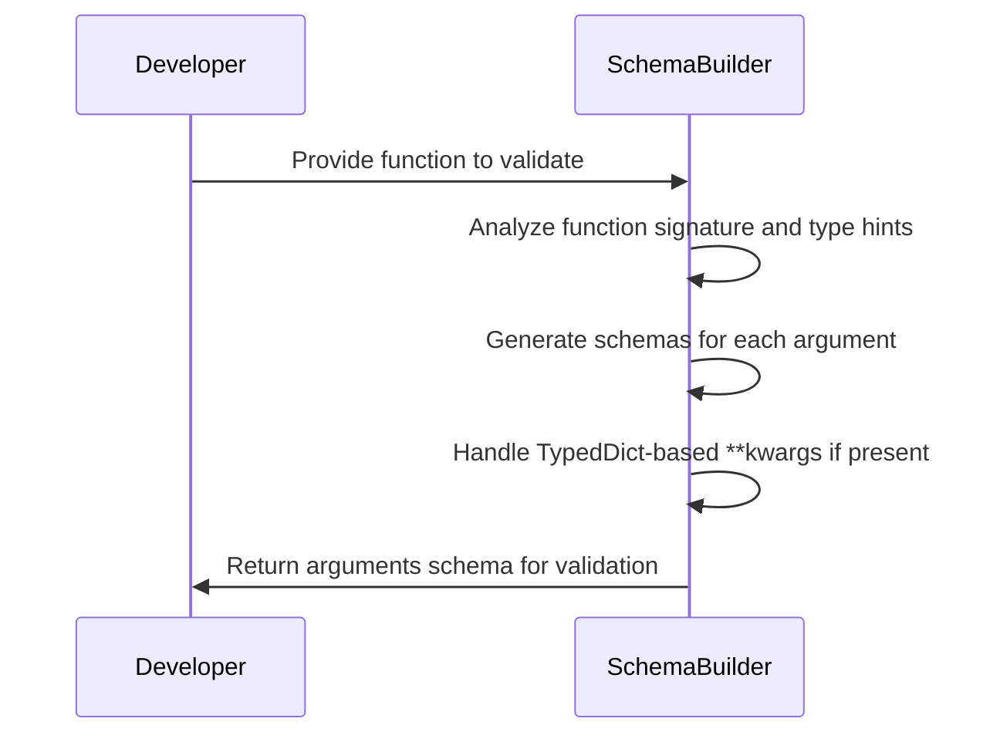

This document explains how validation schemas are generated for Python function arguments to ensure that input data matches the function's expected types and structure. The process involves analyzing the function's signature, generating schemas for each parameter—including support for TypedDict-based \*\*kwargs—and assembling these into a single schema object for runtime validation.

Main steps:

- Analyze the function's signature and type hints
- Generate schemas for each parameter, including \*args and TypedDict-based \*\*kwargs
- Assemble the final arguments schema for validation



# Spec

## Detailed View of the Program's Functionality

a. Analyzing the Function Signature and Argument Types

The process begins by examining the signature of the function whose arguments schema needs to be generated. This involves:

- Retrieving the function's signature, which provides information about its parameters (names, kinds, defaults, etc.).
- Extracting type hints for each parameter, resolving any forward references or type aliases using the appropriate namespaces.
- Preparing to iterate over each parameter in the function's signature.

b. Iterating Over Parameters and Building Argument Schemas

For each parameter in the function:

- The code determines the parameter's annotation (type hint). If no annotation is provided, it defaults to a generic type.
- If a callback is provided for parameter processing, it is invoked to decide whether to skip the parameter or not.
- The kind of parameter is checked (positional-only, positional-or-keyword, keyword-only, \*args, or \*\*kwargs).
  - For positional-only, positional-or-keyword, and keyword-only parameters, a schema is generated for the parameter using a helper method. This schema includes details such as the parameter's name, type, default value, and mode (how it can be passed).
  - For \*args (variable positional arguments), a schema is generated for the type annotation of the \*args parameter, as it requires a different schema than regular arguments.
  - For \*\*kwargs (variable keyword arguments), special handling is performed (see next section).

c. Handling \*\*kwargs with <SwmToken path="pydantic/_internal/_generate_schema.py" pos="1381:17:17" line-data="        &quot;&quot;&quot;Generate a core schema for a `TypedDict` class.">`TypedDict`</SwmToken> Unpacking

When the code encounters a \*\*kwargs parameter:

- It checks if the annotation is an Unpack of a <SwmToken path="pydantic/_internal/_generate_schema.py" pos="1381:17:17" line-data="        &quot;&quot;&quot;Generate a core schema for a `TypedDict` class.">`TypedDict`</SwmToken> (<SwmToken path="pydantic/_internal/_generate_schema.py" pos="925:22:24" line-data="            # safety measure (because these are inlined in place -- i.e. mutated directly)">`i.e`</SwmToken>., if the function expects keyword arguments matching a specific <SwmToken path="pydantic/_internal/_generate_schema.py" pos="1381:17:17" line-data="        &quot;&quot;&quot;Generate a core schema for a `TypedDict` class.">`TypedDict`</SwmToken> structure).
- If so, it verifies that the keys defined in the <SwmToken path="pydantic/_internal/_generate_schema.py" pos="1381:17:17" line-data="        &quot;&quot;&quot;Generate a core schema for a `TypedDict` class.">`TypedDict`</SwmToken> do not overlap with any other non-positional-only parameters in the function. If there is an overlap, an error is raised.
- If the annotation is a valid <SwmToken path="pydantic/_internal/_generate_schema.py" pos="1381:17:17" line-data="        &quot;&quot;&quot;Generate a core schema for a `TypedDict` class.">`TypedDict`</SwmToken>, the code proceeds to generate a schema for the <SwmToken path="pydantic/_internal/_generate_schema.py" pos="1381:17:17" line-data="        &quot;&quot;&quot;Generate a core schema for a `TypedDict` class.">`TypedDict`</SwmToken> using a dedicated method. This schema will enforce that the \*\*kwargs match the structure and rules of the <SwmToken path="pydantic/_internal/_generate_schema.py" pos="1381:17:17" line-data="        &quot;&quot;&quot;Generate a core schema for a `TypedDict` class.">`TypedDict`</SwmToken>.
- If the annotation is not a <SwmToken path="pydantic/_internal/_generate_schema.py" pos="1381:17:17" line-data="        &quot;&quot;&quot;Generate a core schema for a `TypedDict` class.">`TypedDict`</SwmToken>, a generic schema is generated for \*\*kwargs.

d. Generating Schemas for TypedDict-based \*\*kwargs

When generating a schema for a <SwmToken path="pydantic/_internal/_generate_schema.py" pos="1381:17:17" line-data="        &quot;&quot;&quot;Generate a core schema for a `TypedDict` class.">`TypedDict`</SwmToken> (used for \*\*kwargs or elsewhere), the process is as follows:

- The code checks if a schema for this <SwmToken path="pydantic/_internal/_generate_schema.py" pos="1381:17:17" line-data="        &quot;&quot;&quot;Generate a core schema for a `TypedDict` class.">`TypedDict`</SwmToken> has already been generated and cached. If so, it returns the cached schema.
- It verifies that the <SwmToken path="pydantic/_internal/_generate_schema.py" pos="1381:17:17" line-data="        &quot;&quot;&quot;Generate a core schema for a `TypedDict` class.">`TypedDict`</SwmToken> is compatible with the current Python version or that the appropriate backport is used.
- Configuration, validators, and documentation are extracted from the <SwmToken path="pydantic/_internal/_generate_schema.py" pos="1381:17:17" line-data="        &quot;&quot;&quot;Generate a core schema for a `TypedDict` class.">`TypedDict`</SwmToken> class or its bases.
- The code gathers all field annotations from the <SwmToken path="pydantic/_internal/_generate_schema.py" pos="1381:17:17" line-data="        &quot;&quot;&quot;Generate a core schema for a `TypedDict` class.">`TypedDict`</SwmToken>, and for each field:
  - It determines if the field is required, read-only, or has associated documentation.
  - It generates a schema for the field, including any validation or serialization rules.
- If any fields are marked as read-only, a warning is issued to inform the user that Pydantic does not enforce immutability on dictionary instances.
- The final schema for the <SwmToken path="pydantic/_internal/_generate_schema.py" pos="1381:17:17" line-data="        &quot;&quot;&quot;Generate a core schema for a `TypedDict` class.">`TypedDict`</SwmToken> is assembled, including all fields, computed fields, validators, and serializers. This schema is wrapped with a reference for reuse and returned.

e. Finalizing the Arguments Schema

After all parameters have been processed and the appropriate schemas for \*args and \*\*kwargs (including TypedDicts) have been generated:

- The code constructs the final <SwmToken path="pydantic/_internal/_generate_schema.py" pos="1937:7:7" line-data="    ) -&gt; core_schema.ArgumentsSchema:">`ArgumentsSchema`</SwmToken> object. This object includes:
  - The list of argument schemas for each parameter.
  - The schema for \*args, if present.
  - The schema and mode for \*\*kwargs, if present.
  - Configuration options such as whether to validate arguments by name.
- This <SwmToken path="pydantic/_internal/_generate_schema.py" pos="1937:7:7" line-data="    ) -&gt; core_schema.ArgumentsSchema:">`ArgumentsSchema`</SwmToken> object is returned and can be used to validate function calls against the function's signature and type hints, ensuring that all arguments conform to the expected types and structure.

# Rule Definition

| Paragraph Name                                                                                                                                                                                                                                                                                                                                                         | Rule ID | Category          | Description                                                                                                                                                                                                                                                                                                                                                                                                                                                                                                                                                                                                                                                                                                                                                                                                                                                                                                                                                                            | Conditions                                                                                                                                                                                                                                             | Remarks                                                                                                                                                                                                                                                                                                                                                                                                                                                                                                                                                                                                                                                                                                                                                                                                                                                                                                                                                                                                                                                                                                                                                                                                                                                                                                     |
| ---------------------------------------------------------------------------------------------------------------------------------------------------------------------------------------------------------------------------------------------------------------------------------------------------------------------------------------------------------------------- | ------- | ----------------- | -------------------------------------------------------------------------------------------------------------------------------------------------------------------------------------------------------------------------------------------------------------------------------------------------------------------------------------------------------------------------------------------------------------------------------------------------------------------------------------------------------------------------------------------------------------------------------------------------------------------------------------------------------------------------------------------------------------------------------------------------------------------------------------------------------------------------------------------------------------------------------------------------------------------------------------------------------------------------------------- | ------------------------------------------------------------------------------------------------------------------------------------------------------------------------------------------------------------------------------------------------------ | ----------------------------------------------------------------------------------------------------------------------------------------------------------------------------------------------------------------------------------------------------------------------------------------------------------------------------------------------------------------------------------------------------------------------------------------------------------------------------------------------------------------------------------------------------------------------------------------------------------------------------------------------------------------------------------------------------------------------------------------------------------------------------------------------------------------------------------------------------------------------------------------------------------------------------------------------------------------------------------------------------------------------------------------------------------------------------------------------------------------------------------------------------------------------------------------------------------------------------------------------------------------------------------------------------------- |
| def <SwmToken path="pydantic/_internal/_generate_schema.py" pos="1935:3:3" line-data="    def _arguments_schema(">`_arguments_schema`</SwmToken>, def <SwmToken path="pydantic/_internal/_generate_schema.py" pos="2010:3:3" line-data="    def _arguments_v3_schema(">`_arguments_v3_schema`</SwmToken>                                                               | RL-001  | Data Assignment   | The system must analyze a given Python function object and extract its signature, including all parameters and their type hints.                                                                                                                                                                                                                                                                                                                                                                                                                                                                                                                                                                                                                                                                                                                                                                                                                                                       | A Python function object is provided for schema generation.                                                                                                                                                                                            | Uses Python's inspect.signature and type hint extraction. Each parameter is processed for its name, type, and kind.                                                                                                                                                                                                                                                                                                                                                                                                                                                                                                                                                                                                                                                                                                                                                                                                                                                                                                                                                                                                                                                                                                                                                                                         |
| def <SwmToken path="pydantic/_internal/_generate_schema.py" pos="1935:3:3" line-data="    def _arguments_schema(">`_arguments_schema`</SwmToken>, def <SwmToken path="pydantic/_internal/_generate_schema.py" pos="2010:3:3" line-data="    def _arguments_v3_schema(">`_arguments_v3_schema`</SwmToken>                                                               | RL-002  | Conditional Logic | For each parameter in the function signature, determine the parameter's kind (positional, keyword, \*args, \*\*kwargs) and assign the appropriate mode string.                                                                                                                                                                                                                                                                                                                                                                                                                                                                                                                                                                                                                                                                                                                                                                                                                         | Iterating over each parameter in the function signature.                                                                                                                                                                                               | Parameter modes: <SwmToken path="pydantic/_internal/_generate_schema.py" pos="1939:12:12" line-data="        mode_lookup: dict[_ParameterKind, Literal[&#39;positional_only&#39;, &#39;positional_or_keyword&#39;, &#39;keyword_only&#39;]] = {">`positional_only`</SwmToken>, <SwmToken path="pydantic/_internal/_generate_schema.py" pos="1939:17:17" line-data="        mode_lookup: dict[_ParameterKind, Literal[&#39;positional_only&#39;, &#39;positional_or_keyword&#39;, &#39;keyword_only&#39;]] = {">`positional_or_keyword`</SwmToken>, <SwmToken path="pydantic/_internal/_generate_schema.py" pos="1939:22:22" line-data="        mode_lookup: dict[_ParameterKind, Literal[&#39;positional_only&#39;, &#39;positional_or_keyword&#39;, &#39;keyword_only&#39;]] = {">`keyword_only`</SwmToken>, <SwmToken path="pydantic/_internal/_generate_schema.py" pos="1585:2:2" line-data="            &#39;var_args&#39;,">`var_args`</SwmToken>, <SwmToken path="pydantic/_internal/_generate_schema.py" pos="1586:2:2" line-data="            &#39;var_kwargs_uniform&#39;,">`var_kwargs_uniform`</SwmToken>, <SwmToken path="pydantic/_internal/_generate_schema.py" pos="1587:2:2" line-data="            &#39;var_kwargs_unpacked_typed_dict&#39;,">`var_kwargs_unpacked_typed_dict`</SwmToken>. |
| def <SwmToken path="pydantic/_internal/_generate_schema.py" pos="1967:7:7" line-data="                arg_schema = self._generate_parameter_schema(">`_generate_parameter_schema`</SwmToken>, def <SwmToken path="pydantic/_internal/_generate_schema.py" pos="1576:3:3" line-data="    def _generate_parameter_v3_schema(">`_generate_parameter_v3_schema`</SwmToken> | RL-003  | Data Assignment   | For each regular parameter (excluding \*args and \*\*kwargs), generate a schema entry as a dictionary containing the parameter's name, schema (with at least a 'type' key), mode, and default value if present.                                                                                                                                                                                                                                                                                                                                                                                                                                                                                                                                                                                                                                                                                                                                                                        | Parameter is not \*args or \*\*kwargs.                                                                                                                                                                                                                 | Schema entry format: {'name': str, 'schema': dict (with at least 'type'), 'mode': str, 'default': value (optional)}.                                                                                                                                                                                                                                                                                                                                                                                                                                                                                                                                                                                                                                                                                                                                                                                                                                                                                                                                                                                                                                                                                                                                                                                        |
| def <SwmToken path="pydantic/_internal/_generate_schema.py" pos="1935:3:3" line-data="    def _arguments_schema(">`_arguments_schema`</SwmToken>, def <SwmToken path="pydantic/_internal/_generate_schema.py" pos="2010:3:3" line-data="    def _arguments_v3_schema(">`_arguments_v3_schema`</SwmToken>                                                               | RL-004  | Data Assignment   | If the function includes a variable positional parameter (\*args), generate a schema for it and include it as <SwmToken path="pydantic/_internal/_generate_schema.py" pos="1950:1:1" line-data="        var_args_schema: core_schema.CoreSchema \| None = None">`var_args_schema`</SwmToken> in the arguments schema.                                                                                                                                                                                                                                                                                                                                                                                                                                                                                                                                                                                                                                                                  | Function signature includes a \*args parameter.                                                                                                                                                                                                        | <SwmToken path="pydantic/_internal/_generate_schema.py" pos="1950:1:1" line-data="        var_args_schema: core_schema.CoreSchema \| None = None">`var_args_schema`</SwmToken> is a dictionary representing the type of \*args values (<SwmToken path="pydantic/_internal/_generate_schema.py" pos="184:38:40" line-data="&quot;&quot;&quot;`FieldInfo` attributes (and their default value) that can&#39;t be used outside of a model (e.g. in a type adapter or a PEP 695 type alias).&quot;&quot;&quot;">`e.g`</SwmToken>., {'type': 'float'}).                                                                                                                                                                                                                                                                                                                                                                                                                                                                                                                                                                                                                                                                                                                                                          |
| def <SwmToken path="pydantic/_internal/_generate_schema.py" pos="1935:3:3" line-data="    def _arguments_schema(">`_arguments_schema`</SwmToken>, def <SwmToken path="pydantic/_internal/_generate_schema.py" pos="2010:3:3" line-data="    def _arguments_v3_schema(">`_arguments_v3_schema`</SwmToken>                                                               | RL-005  | Conditional Logic | If the function includes a variable keyword parameter (\*\*kwargs) annotated as Unpack of a <SwmToken path="pydantic/_internal/_generate_schema.py" pos="1381:17:17" line-data="        &quot;&quot;&quot;Generate a core schema for a `TypedDict` class.">`TypedDict`</SwmToken>, ensure no overlap between <SwmToken path="pydantic/_internal/_generate_schema.py" pos="1381:17:17" line-data="        &quot;&quot;&quot;Generate a core schema for a `TypedDict` class.">`TypedDict`</SwmToken> keys and other parameter names, and generate a detailed schema for the <SwmToken path="pydantic/_internal/_generate_schema.py" pos="1381:17:17" line-data="        &quot;&quot;&quot;Generate a core schema for a `TypedDict` class.">`TypedDict`</SwmToken>.                                                                                                                                                                                                                       | \*\*kwargs parameter is present and its annotation is Unpack\[<SwmToken path="pydantic/_internal/_generate_schema.py" pos="1381:17:17" line-data="        &quot;&quot;&quot;Generate a core schema for a `TypedDict` class.">`TypedDict`</SwmToken>\]. | <SwmToken path="pydantic/_internal/_generate_schema.py" pos="1381:17:17" line-data="        &quot;&quot;&quot;Generate a core schema for a `TypedDict` class.">`TypedDict`</SwmToken> schema format: {'type': <SwmToken path="pydantic/_internal/_generate_schema.py" pos="1409:4:6" line-data="                    code=&#39;typed-dict-version&#39;,">`typed-dict`</SwmToken>, 'fields': <SwmToken path="pydantic/_internal/_generate_schema.py" pos="1858:5:6" line-data="                                f&#39;Field {field_name} has `init=False` and dataclass has config setting `extra=&quot;allow&quot;`. &#39;">`{field_name`</SwmToken>: {'schema': ..., 'required': bool}}, 'cls': <SwmToken path="pydantic/_internal/_generate_schema.py" pos="1381:17:17" line-data="        &quot;&quot;&quot;Generate a core schema for a `TypedDict` class.">`TypedDict`</SwmToken> class, <SwmToken path="pydantic/_internal/_generate_schema.py" pos="1476:1:1" line-data="                    computed_fields=[">`computed_fields`</SwmToken>: list, 'ref': str, 'config': dict}. Must check for overlapping keys and raise error if found.                                                                                                                                                             |
| def <SwmToken path="pydantic/_internal/_generate_schema.py" pos="1935:3:3" line-data="    def _arguments_schema(">`_arguments_schema`</SwmToken>, def <SwmToken path="pydantic/_internal/_generate_schema.py" pos="2010:3:3" line-data="    def _arguments_v3_schema(">`_arguments_v3_schema`</SwmToken>                                                               | RL-006  | Conditional Logic | If the function includes a variable keyword parameter (\*\*kwargs) not annotated as Unpack\[<SwmToken path="pydantic/_internal/_generate_schema.py" pos="1381:17:17" line-data="        &quot;&quot;&quot;Generate a core schema for a `TypedDict` class.">`TypedDict`</SwmToken>\], generate a generic schema for \*\*kwargs and set <SwmToken path="pydantic/_internal/_generate_schema.py" pos="1952:1:1" line-data="        var_kwargs_mode: core_schema.VarKwargsMode \| None = None">`var_kwargs_mode`</SwmToken> to 'uniform'.                                                                                                                                                                                                                                                                                                                                                                                                                                                  | \*\*kwargs parameter is present and annotation is not Unpack\[<SwmToken path="pydantic/_internal/_generate_schema.py" pos="1381:17:17" line-data="        &quot;&quot;&quot;Generate a core schema for a `TypedDict` class.">`TypedDict`</SwmToken>\]. | <SwmToken path="pydantic/_internal/_generate_schema.py" pos="1952:1:1" line-data="        var_kwargs_mode: core_schema.VarKwargsMode \| None = None">`var_kwargs_mode`</SwmToken> is set to 'uniform'. <SwmToken path="pydantic/_internal/_generate_schema.py" pos="1951:1:1" line-data="        var_kwargs_schema: core_schema.CoreSchema \| None = None">`var_kwargs_schema`</SwmToken> is a schema for the annotation type.                                                                                                                                                                                                                                                                                                                                                                                                                                                                                                                                                                                                                                                                                                                                                                                                                                                                              |
| def <SwmToken path="pydantic/_internal/_generate_schema.py" pos="1935:3:3" line-data="    def _arguments_schema(">`_arguments_schema`</SwmToken>, def <SwmToken path="pydantic/_internal/_generate_schema.py" pos="2010:3:3" line-data="    def _arguments_v3_schema(">`_arguments_v3_schema`</SwmToken>                                                               | RL-007  | Data Assignment   | Assemble the final arguments schema as a dictionary with keys: 'type', <SwmToken path="pydantic/_internal/_generate_schema.py" pos="2002:5:5" line-data="        return core_schema.arguments_schema(">`arguments_schema`</SwmToken>, <SwmToken path="pydantic/_internal/_generate_schema.py" pos="1950:1:1" line-data="        var_args_schema: core_schema.CoreSchema \| None = None">`var_args_schema`</SwmToken>, <SwmToken path="pydantic/_internal/_generate_schema.py" pos="1952:1:1" line-data="        var_kwargs_mode: core_schema.VarKwargsMode \| None = None">`var_kwargs_mode`</SwmToken>, <SwmToken path="pydantic/_internal/_generate_schema.py" pos="1951:1:1" line-data="        var_kwargs_schema: core_schema.CoreSchema \| None = None">`var_kwargs_schema`</SwmToken>, and <SwmToken path="pydantic/_internal/_generate_schema.py" pos="2007:1:1" line-data="            validate_by_name=self._config_wrapper.validate_by_name,">`validate_by_name`</SwmToken>. | After all parameters have been processed and their schemas generated.                                                                                                                                                                                  | Final schema format: {'type': 'arguments', <SwmToken path="pydantic/_internal/_generate_schema.py" pos="2002:5:5" line-data="        return core_schema.arguments_schema(">`arguments_schema`</SwmToken>: list, <SwmToken path="pydantic/_internal/_generate_schema.py" pos="1950:1:1" line-data="        var_args_schema: core_schema.CoreSchema \| None = None">`var_args_schema`</SwmToken>: dict or None, <SwmToken path="pydantic/_internal/_generate_schema.py" pos="1952:1:1" line-data="        var_kwargs_mode: core_schema.VarKwargsMode \| None = None">`var_kwargs_mode`</SwmToken>: str or None, <SwmToken path="pydantic/_internal/_generate_schema.py" pos="1951:1:1" line-data="        var_kwargs_schema: core_schema.CoreSchema \| None = None">`var_kwargs_schema`</SwmToken>: dict or None, <SwmToken path="pydantic/_internal/_generate_schema.py" pos="2007:1:1" line-data="            validate_by_name=self._config_wrapper.validate_by_name,">`validate_by_name`</SwmToken>: bool}. All schemas must be plain dictionaries with a 'type' key.                                                                                                                                                                                                                                      |
| def <SwmToken path="pydantic/_internal/_generate_schema.py" pos="1935:3:3" line-data="    def _arguments_schema(">`_arguments_schema`</SwmToken>, def <SwmToken path="pydantic/_internal/_generate_schema.py" pos="2010:3:3" line-data="    def _arguments_v3_schema(">`_arguments_v3_schema`</SwmToken>, schema generation functions                                  | RL-008  | Conditional Logic | The output schema must be a plain dictionary structure, with all schemas represented as nested dictionaries containing a 'type' key and any relevant metadata.                                                                                                                                                                                                                                                                                                                                                                                                                                                                                                                                                                                                                                                                                                                                                                                                                         | When returning or assembling the final schema.                                                                                                                                                                                                         | All schemas must be plain dicts, not custom objects. Each schema must have a 'type' key. Nested schemas must also be dicts.                                                                                                                                                                                                                                                                                                                                                                                                                                                                                                                                                                                                                                                                                                                                                                                                                                                                                                                                                                                                                                                                                                                                                                                 |

# User Stories

## User Story 1: Extract and analyze function signature and parameter kinds

---

### Story Description:

As a system, I want to analyze a given Python function object and extract its signature, including all parameters and their type hints, so that I can understand the structure and requirements of the function's arguments.

---

### Business Rule Mapping:

| Rule ID | Paragraph Name                                                                                                                                                                                                                                                                                           | Rule Description                                                                                                                                               |
| ------- | -------------------------------------------------------------------------------------------------------------------------------------------------------------------------------------------------------------------------------------------------------------------------------------------------------- | -------------------------------------------------------------------------------------------------------------------------------------------------------------- |
| RL-001  | def <SwmToken path="pydantic/_internal/_generate_schema.py" pos="1935:3:3" line-data="    def _arguments_schema(">`_arguments_schema`</SwmToken>, def <SwmToken path="pydantic/_internal/_generate_schema.py" pos="2010:3:3" line-data="    def _arguments_v3_schema(">`_arguments_v3_schema`</SwmToken> | The system must analyze a given Python function object and extract its signature, including all parameters and their type hints.                               |
| RL-002  | def <SwmToken path="pydantic/_internal/_generate_schema.py" pos="1935:3:3" line-data="    def _arguments_schema(">`_arguments_schema`</SwmToken>, def <SwmToken path="pydantic/_internal/_generate_schema.py" pos="2010:3:3" line-data="    def _arguments_v3_schema(">`_arguments_v3_schema`</SwmToken> | For each parameter in the function signature, determine the parameter's kind (positional, keyword, \*args, \*\*kwargs) and assign the appropriate mode string. |

---

### Relevant Functionality:

- **def** <SwmToken path="pydantic/_internal/_generate_schema.py" pos="1935:3:3" line-data="    def _arguments_schema(">`_arguments_schema`</SwmToken>
  1. **RL-001:**
     - Use inspect.signature to get the function's parameters
     - For each parameter, extract its name, kind, and type hint (from <SwmToken path="pydantic/_internal/_generate_schema.py" pos="1947:1:1" line-data="        type_hints = _typing_extra.get_function_type_hints(function, globalns=globalns, localns=localns)">`type_hints`</SwmToken>)
     - Store this information for further schema generation
  2. **RL-002:**
     - For each parameter, check its kind (using Parameter.kind)
     - Map kind to mode string using a lookup dictionary
     - Use this mode in the schema entry for the parameter

## User Story 2: Generate schemas for all parameter types

---

### Story Description:

As a system, I want to generate schemas for each parameter in the function signature—including regular parameters, variable positional parameters (\*args), and variable keyword parameters (\*\*kwargs), with special handling for <SwmToken path="pydantic/_internal/_generate_schema.py" pos="1381:17:17" line-data="        &quot;&quot;&quot;Generate a core schema for a `TypedDict` class.">`TypedDict`</SwmToken> unpacking—so that I can accurately represent the expected types and structure of all arguments.

---

### Business Rule Mapping:

| Rule ID | Paragraph Name                                                                                                                                                                                                                                                                                                                                                         | Rule Description                                                                                                                                                                                                                                                                                                                                                                                                                                                                                                                                                                                                                                                                                                                                                 |
| ------- | ---------------------------------------------------------------------------------------------------------------------------------------------------------------------------------------------------------------------------------------------------------------------------------------------------------------------------------------------------------------------- | ---------------------------------------------------------------------------------------------------------------------------------------------------------------------------------------------------------------------------------------------------------------------------------------------------------------------------------------------------------------------------------------------------------------------------------------------------------------------------------------------------------------------------------------------------------------------------------------------------------------------------------------------------------------------------------------------------------------------------------------------------------------- |
| RL-003  | def <SwmToken path="pydantic/_internal/_generate_schema.py" pos="1967:7:7" line-data="                arg_schema = self._generate_parameter_schema(">`_generate_parameter_schema`</SwmToken>, def <SwmToken path="pydantic/_internal/_generate_schema.py" pos="1576:3:3" line-data="    def _generate_parameter_v3_schema(">`_generate_parameter_v3_schema`</SwmToken> | For each regular parameter (excluding \*args and \*\*kwargs), generate a schema entry as a dictionary containing the parameter's name, schema (with at least a 'type' key), mode, and default value if present.                                                                                                                                                                                                                                                                                                                                                                                                                                                                                                                                                  |
| RL-004  | def <SwmToken path="pydantic/_internal/_generate_schema.py" pos="1935:3:3" line-data="    def _arguments_schema(">`_arguments_schema`</SwmToken>, def <SwmToken path="pydantic/_internal/_generate_schema.py" pos="2010:3:3" line-data="    def _arguments_v3_schema(">`_arguments_v3_schema`</SwmToken>                                                               | If the function includes a variable positional parameter (\*args), generate a schema for it and include it as <SwmToken path="pydantic/_internal/_generate_schema.py" pos="1950:1:1" line-data="        var_args_schema: core_schema.CoreSchema \| None = None">`var_args_schema`</SwmToken> in the arguments schema.                                                                                                                                                                                                                                                                                                                                                                                                                                            |
| RL-005  | def <SwmToken path="pydantic/_internal/_generate_schema.py" pos="1935:3:3" line-data="    def _arguments_schema(">`_arguments_schema`</SwmToken>, def <SwmToken path="pydantic/_internal/_generate_schema.py" pos="2010:3:3" line-data="    def _arguments_v3_schema(">`_arguments_v3_schema`</SwmToken>                                                               | If the function includes a variable keyword parameter (\*\*kwargs) annotated as Unpack of a <SwmToken path="pydantic/_internal/_generate_schema.py" pos="1381:17:17" line-data="        &quot;&quot;&quot;Generate a core schema for a `TypedDict` class.">`TypedDict`</SwmToken>, ensure no overlap between <SwmToken path="pydantic/_internal/_generate_schema.py" pos="1381:17:17" line-data="        &quot;&quot;&quot;Generate a core schema for a `TypedDict` class.">`TypedDict`</SwmToken> keys and other parameter names, and generate a detailed schema for the <SwmToken path="pydantic/_internal/_generate_schema.py" pos="1381:17:17" line-data="        &quot;&quot;&quot;Generate a core schema for a `TypedDict` class.">`TypedDict`</SwmToken>. |
| RL-006  | def <SwmToken path="pydantic/_internal/_generate_schema.py" pos="1935:3:3" line-data="    def _arguments_schema(">`_arguments_schema`</SwmToken>, def <SwmToken path="pydantic/_internal/_generate_schema.py" pos="2010:3:3" line-data="    def _arguments_v3_schema(">`_arguments_v3_schema`</SwmToken>                                                               | If the function includes a variable keyword parameter (\*\*kwargs) not annotated as Unpack\[<SwmToken path="pydantic/_internal/_generate_schema.py" pos="1381:17:17" line-data="        &quot;&quot;&quot;Generate a core schema for a `TypedDict` class.">`TypedDict`</SwmToken>\], generate a generic schema for \*\*kwargs and set <SwmToken path="pydantic/_internal/_generate_schema.py" pos="1952:1:1" line-data="        var_kwargs_mode: core_schema.VarKwargsMode \| None = None">`var_kwargs_mode`</SwmToken> to 'uniform'.                                                                                                                                                                                                                            |

---

### Relevant Functionality:

- **def** <SwmToken path="pydantic/_internal/_generate_schema.py" pos="1967:7:7" line-data="                arg_schema = self._generate_parameter_schema(">`_generate_parameter_schema`</SwmToken>
  1. **RL-003:**
     - For each regular parameter:
       - Create a dictionary with 'name', 'schema', and 'mode'
       - If the parameter has a default value, add 'default' to the dictionary
       - Add the entry to the <SwmToken path="pydantic/_internal/_generate_schema.py" pos="2002:5:5" line-data="        return core_schema.arguments_schema(">`arguments_schema`</SwmToken> list
- **def** <SwmToken path="pydantic/_internal/_generate_schema.py" pos="1935:3:3" line-data="    def _arguments_schema(">`_arguments_schema`</SwmToken>
  1. **RL-004:**
     - If a parameter is of kind <SwmToken path="pydantic/_internal/_generate_schema.py" pos="1971:11:11" line-data="            elif p.kind == Parameter.VAR_POSITIONAL:">`VAR_POSITIONAL`</SwmToken>:
       - Generate a schema for its annotation
       - Assign this schema to <SwmToken path="pydantic/_internal/_generate_schema.py" pos="1950:1:1" line-data="        var_args_schema: core_schema.CoreSchema | None = None">`var_args_schema`</SwmToken> in the final arguments schema
  2. **RL-005:**
     - If \*\*kwargs is annotated as Unpack\[<SwmToken path="pydantic/_internal/_generate_schema.py" pos="1381:17:17" line-data="        &quot;&quot;&quot;Generate a core schema for a `TypedDict` class.">`TypedDict`</SwmToken>\]:
       - Extract the <SwmToken path="pydantic/_internal/_generate_schema.py" pos="1381:17:17" line-data="        &quot;&quot;&quot;Generate a core schema for a `TypedDict` class.">`TypedDict`</SwmToken> class
       - Check that <SwmToken path="pydantic/_internal/_generate_schema.py" pos="1381:17:17" line-data="        &quot;&quot;&quot;Generate a core schema for a `TypedDict` class.">`TypedDict`</SwmToken> keys do not overlap with other parameter names
       - Generate a schema for the <SwmToken path="pydantic/_internal/_generate_schema.py" pos="1381:17:17" line-data="        &quot;&quot;&quot;Generate a core schema for a `TypedDict` class.">`TypedDict`</SwmToken>, including all required fields and metadata
       - Set <SwmToken path="pydantic/_internal/_generate_schema.py" pos="1952:1:1" line-data="        var_kwargs_mode: core_schema.VarKwargsMode | None = None">`var_kwargs_mode`</SwmToken> to <SwmToken path="pydantic/_internal/_generate_schema.py" pos="1996:6:10" line-data="                    var_kwargs_mode = &#39;unpacked-typed-dict&#39;">`unpacked-typed-dict`</SwmToken> and <SwmToken path="pydantic/_internal/_generate_schema.py" pos="1951:1:1" line-data="        var_kwargs_schema: core_schema.CoreSchema | None = None">`var_kwargs_schema`</SwmToken> to the generated schema
  3. **RL-006:**
     - If \*\*kwargs is present and not Unpack\[<SwmToken path="pydantic/_internal/_generate_schema.py" pos="1381:17:17" line-data="        &quot;&quot;&quot;Generate a core schema for a `TypedDict` class.">`TypedDict`</SwmToken>\]:
       - Generate a schema for the annotation
       - Set <SwmToken path="pydantic/_internal/_generate_schema.py" pos="1952:1:1" line-data="        var_kwargs_mode: core_schema.VarKwargsMode | None = None">`var_kwargs_mode`</SwmToken> to 'uniform'
       - Set <SwmToken path="pydantic/_internal/_generate_schema.py" pos="1951:1:1" line-data="        var_kwargs_schema: core_schema.CoreSchema | None = None">`var_kwargs_schema`</SwmToken> to the generated schema

## User Story 3: Assemble and output the final arguments schema

---

### Story Description:

As a system, I want to assemble the final arguments schema as a plain dictionary structure, ensuring all schemas are nested dictionaries with a 'type' key and any relevant metadata, so that the schema can be used for validating function calls and is compatible with downstream consumers.

---

### Business Rule Mapping:

| Rule ID | Paragraph Name                                                                                                                                                                                                                                                                                                                        | Rule Description                                                                                                                                                                                                                                                                                                                                                                                                                                                                                                                                                                                                                                                                                                                                                                                                                                                                                                                                                                       |
| ------- | ------------------------------------------------------------------------------------------------------------------------------------------------------------------------------------------------------------------------------------------------------------------------------------------------------------------------------------- | -------------------------------------------------------------------------------------------------------------------------------------------------------------------------------------------------------------------------------------------------------------------------------------------------------------------------------------------------------------------------------------------------------------------------------------------------------------------------------------------------------------------------------------------------------------------------------------------------------------------------------------------------------------------------------------------------------------------------------------------------------------------------------------------------------------------------------------------------------------------------------------------------------------------------------------------------------------------------------------- |
| RL-007  | def <SwmToken path="pydantic/_internal/_generate_schema.py" pos="1935:3:3" line-data="    def _arguments_schema(">`_arguments_schema`</SwmToken>, def <SwmToken path="pydantic/_internal/_generate_schema.py" pos="2010:3:3" line-data="    def _arguments_v3_schema(">`_arguments_v3_schema`</SwmToken>                              | Assemble the final arguments schema as a dictionary with keys: 'type', <SwmToken path="pydantic/_internal/_generate_schema.py" pos="2002:5:5" line-data="        return core_schema.arguments_schema(">`arguments_schema`</SwmToken>, <SwmToken path="pydantic/_internal/_generate_schema.py" pos="1950:1:1" line-data="        var_args_schema: core_schema.CoreSchema \| None = None">`var_args_schema`</SwmToken>, <SwmToken path="pydantic/_internal/_generate_schema.py" pos="1952:1:1" line-data="        var_kwargs_mode: core_schema.VarKwargsMode \| None = None">`var_kwargs_mode`</SwmToken>, <SwmToken path="pydantic/_internal/_generate_schema.py" pos="1951:1:1" line-data="        var_kwargs_schema: core_schema.CoreSchema \| None = None">`var_kwargs_schema`</SwmToken>, and <SwmToken path="pydantic/_internal/_generate_schema.py" pos="2007:1:1" line-data="            validate_by_name=self._config_wrapper.validate_by_name,">`validate_by_name`</SwmToken>. |
| RL-008  | def <SwmToken path="pydantic/_internal/_generate_schema.py" pos="1935:3:3" line-data="    def _arguments_schema(">`_arguments_schema`</SwmToken>, def <SwmToken path="pydantic/_internal/_generate_schema.py" pos="2010:3:3" line-data="    def _arguments_v3_schema(">`_arguments_v3_schema`</SwmToken>, schema generation functions | The output schema must be a plain dictionary structure, with all schemas represented as nested dictionaries containing a 'type' key and any relevant metadata.                                                                                                                                                                                                                                                                                                                                                                                                                                                                                                                                                                                                                                                                                                                                                                                                                         |

---

### Relevant Functionality:

- **def** <SwmToken path="pydantic/_internal/_generate_schema.py" pos="1935:3:3" line-data="    def _arguments_schema(">`_arguments_schema`</SwmToken>
  1. **RL-007:**
     - Create a dictionary with:
       - 'type': 'arguments'
       - <SwmToken path="pydantic/_internal/_generate_schema.py" pos="2002:5:5" line-data="        return core_schema.arguments_schema(">`arguments_schema`</SwmToken>: list of parameter schemas
       - <SwmToken path="pydantic/_internal/_generate_schema.py" pos="1950:1:1" line-data="        var_args_schema: core_schema.CoreSchema | None = None">`var_args_schema`</SwmToken>: schema for \*args (if present)
       - <SwmToken path="pydantic/_internal/_generate_schema.py" pos="1952:1:1" line-data="        var_kwargs_mode: core_schema.VarKwargsMode | None = None">`var_kwargs_mode`</SwmToken>: mode string for \*\*kwargs (if present)
       - <SwmToken path="pydantic/_internal/_generate_schema.py" pos="1951:1:1" line-data="        var_kwargs_schema: core_schema.CoreSchema | None = None">`var_kwargs_schema`</SwmToken>: schema for \*\*kwargs (if present)
       - <SwmToken path="pydantic/_internal/_generate_schema.py" pos="2007:1:1" line-data="            validate_by_name=self._config_wrapper.validate_by_name,">`validate_by_name`</SwmToken>: boolean from config
  2. **RL-008:**
     - Ensure all schema generation functions return dicts
     - When assembling the final schema, check that all nested schemas are dicts with a 'type' key
     - Return the final schema as a plain dictionary

# Code Walkthrough

## Building Argument Schemas from Function Signatures

```mermaid
%%{init: {"flowchart": {"defaultRenderer": "elk"}} }%%
flowchart TD
  node1["Analyze function signature and argument types"] --> node2["Generate schema for keyword arguments (may use TypedDict unpacking)"]
  click node1 openCode "pydantic/_internal/_generate_schema.py:1935:1998"
  node2 --> node3["Return final arguments schema"]
  click node2 openCode "pydantic/_internal/_generate_schema.py:1996:1998"
  click node3 openCode "pydantic/_internal/_generate_schema.py:1999:2008"


subgraph node2 [_typed_dict_schema]
  sgmain_1_node1["Begin schema generation for TypedDict class"] --> sgmain_1_node2{"Is schema already defined?"}
  click sgmain_1_node1 openCode "pydantic/_internal/_generate_schema.py:1380:1399"
  sgmain_1_node2 -->|"Yes"| sgmain_1_node3["Return existing schema"]
  click sgmain_1_node2 openCode "pydantic/_internal/_generate_schema.py:1399:1401"
  click sgmain_1_node3 openCode "pydantic/_internal/_generate_schema.py:1400:1401"
  sgmain_1_node2 -->|"No"| sgmain_1_node4{"Is TypedDict compatible with Python version?"}
  click sgmain_1_node4 openCode "pydantic/_internal/_generate_schema.py:1406:1410"
  sgmain_1_node4 -->|"No"| sgmain_1_node5["Show error: Use typing_extensions.TypedDict"]
  click sgmain_1_node5 openCode "pydantic/_internal/_generate_schema.py:1407:1410"
  sgmain_1_node4 -->|"Yes"| sgmain_1_node6["Extract configuration, validators, and documentation"]
  click sgmain_1_node6 openCode "pydantic/_internal/_generate_schema.py:1412:1433"
  sgmain_1_node6 --> sgmain_1_node7
  subgraph sgmain_1_loop1["For each field in TypedDict"]
  sgmain_1_node7["Process field rules (required, read-only, docs)"]
  click sgmain_1_node7 openCode "pydantic/_internal/_generate_schema.py:1434:1459"
  sgmain_1_node7 --> sgmain_1_node8["Generate schema for field"]
  click sgmain_1_node8 openCode "pydantic/_internal/_generate_schema.py:1459:1461"
  end
  sgmain_1_node8 --> sgmain_1_node9["Warn user if any fields are read-only"]
  click sgmain_1_node9 openCode "pydantic/_internal/_generate_schema.py:1463:1471"
  sgmain_1_node9 --> sgmain_1_node10["Assemble final schema with computed fields, validators, and serializers"]
  click sgmain_1_node10 openCode "pydantic/_internal/_generate_schema.py:1473:1486"
  sgmain_1_node10 --> sgmain_1_node11["Return schema definition for TypedDict"]
  click sgmain_1_node11 openCode "pydantic/_internal/_generate_schema.py:1486:1486"
end

%% Swimm:
%% %%{init: {"flowchart": {"defaultRenderer": "elk"}} }%%
%% flowchart TD
%%   node1["Analyze function signature and argument types"] --> node2["Generate schema for keyword arguments (may use <SwmToken path="pydantic/_internal/_generate_schema.py" pos="1381:17:17" line-data="        &quot;&quot;&quot;Generate a core schema for a `TypedDict` class.">`TypedDict`</SwmToken> unpacking)"]
%%   click node1 openCode "<SwmPath>[pydantic/\_internal/\_generate_schema.py](pydantic/_internal/_generate_schema.py)</SwmPath>:1935:1998"
%%   node2 --> node3["Return final arguments schema"]
%%   click node2 openCode "<SwmPath>[pydantic/\_internal/\_generate_schema.py](pydantic/_internal/_generate_schema.py)</SwmPath>:1996:1998"
%%   click node3 openCode "<SwmPath>[pydantic/\_internal/\_generate_schema.py](pydantic/_internal/_generate_schema.py)</SwmPath>:1999:2008"
%% 
%% 
%% subgraph node2 [<SwmToken path="pydantic/_internal/_generate_schema.py" pos="1380:3:3" line-data="    def _typed_dict_schema(self, typed_dict_cls: Any, origin: Any) -&gt; core_schema.CoreSchema:">`_typed_dict_schema`</SwmToken>]
%%   sgmain_1_node1["Begin schema generation for <SwmToken path="pydantic/_internal/_generate_schema.py" pos="1381:17:17" line-data="        &quot;&quot;&quot;Generate a core schema for a `TypedDict` class.">`TypedDict`</SwmToken> class"] --> sgmain_1_node2{"Is schema already defined?"}
%%   click sgmain_1_node1 openCode "<SwmPath>[pydantic/\_internal/\_generate_schema.py](pydantic/_internal/_generate_schema.py)</SwmPath>:1380:1399"
%%   sgmain_1_node2 -->|"Yes"| sgmain_1_node3["Return existing schema"]
%%   click sgmain_1_node2 openCode "<SwmPath>[pydantic/\_internal/\_generate_schema.py](pydantic/_internal/_generate_schema.py)</SwmPath>:1399:1401"
%%   click sgmain_1_node3 openCode "<SwmPath>[pydantic/\_internal/\_generate_schema.py](pydantic/_internal/_generate_schema.py)</SwmPath>:1400:1401"
%%   sgmain_1_node2 -->|"No"| sgmain_1_node4{"Is <SwmToken path="pydantic/_internal/_generate_schema.py" pos="1381:17:17" line-data="        &quot;&quot;&quot;Generate a core schema for a `TypedDict` class.">`TypedDict`</SwmToken> compatible with Python version?"}
%%   click sgmain_1_node4 openCode "<SwmPath>[pydantic/\_internal/\_generate_schema.py](pydantic/_internal/_generate_schema.py)</SwmPath>:1406:1410"
%%   sgmain_1_node4 -->|"No"| sgmain_1_node5["Show error: Use <SwmToken path="pydantic/_internal/_generate_schema.py" pos="1408:7:9" line-data="                    &#39;Please use `typing_extensions.TypedDict` instead of `typing.TypedDict` on Python &lt; 3.12.&#39;,">`typing_extensions.TypedDict`</SwmToken>"]
%%   click sgmain_1_node5 openCode "<SwmPath>[pydantic/\_internal/\_generate_schema.py](pydantic/_internal/_generate_schema.py)</SwmPath>:1407:1410"
%%   sgmain_1_node4 -->|"Yes"| sgmain_1_node6["Extract configuration, validators, and documentation"]
%%   click sgmain_1_node6 openCode "<SwmPath>[pydantic/\_internal/\_generate_schema.py](pydantic/_internal/_generate_schema.py)</SwmPath>:1412:1433"
%%   sgmain_1_node6 --> sgmain_1_node7
%%   subgraph sgmain_1_loop1["For each field in <SwmToken path="pydantic/_internal/_generate_schema.py" pos="1381:17:17" line-data="        &quot;&quot;&quot;Generate a core schema for a `TypedDict` class.">`TypedDict`</SwmToken>"]
%%   sgmain_1_node7["Process field rules (required, read-only, docs)"]
%%   click sgmain_1_node7 openCode "<SwmPath>[pydantic/\_internal/\_generate_schema.py](pydantic/_internal/_generate_schema.py)</SwmPath>:1434:1459"
%%   sgmain_1_node7 --> sgmain_1_node8["Generate schema for field"]
%%   click sgmain_1_node8 openCode "<SwmPath>[pydantic/\_internal/\_generate_schema.py](pydantic/_internal/_generate_schema.py)</SwmPath>:1459:1461"
%%   end
%%   sgmain_1_node8 --> sgmain_1_node9["Warn user if any fields are read-only"]
%%   click sgmain_1_node9 openCode "<SwmPath>[pydantic/\_internal/\_generate_schema.py](pydantic/_internal/_generate_schema.py)</SwmPath>:1463:1471"
%%   sgmain_1_node9 --> sgmain_1_node10["Assemble final schema with computed fields, validators, and serializers"]
%%   click sgmain_1_node10 openCode "<SwmPath>[pydantic/\_internal/\_generate_schema.py](pydantic/_internal/_generate_schema.py)</SwmPath>:1473:1486"
%%   sgmain_1_node10 --> sgmain_1_node11["Return schema definition for <SwmToken path="pydantic/_internal/_generate_schema.py" pos="1381:17:17" line-data="        &quot;&quot;&quot;Generate a core schema for a `TypedDict` class.">`TypedDict`</SwmToken>"]
%%   click sgmain_1_node11 openCode "<SwmPath>[pydantic/\_internal/\_generate_schema.py](pydantic/_internal/_generate_schema.py)</SwmPath>:1486:1486"
%% end
```



<SwmSnippet path="/pydantic/_internal/_generate_schema.py" line="1935">

---

In <SwmToken path="pydantic/_internal/_generate_schema.py" pos="1935:3:3" line-data="    def _arguments_schema(">`_arguments_schema`</SwmToken>, we start by grabbing the function signature and type hints, then loop through each parameter. For each one, we figure out its kind (positional, keyword, \*args, \*\*kwargs), optionally skip it if a callback says so, and generate the right schema for it. If we hit a var-positional parameter, we call <SwmToken path="pydantic/_internal/_generate_schema.py" pos="1972:7:7" line-data="                var_args_schema = self.generate_schema(annotation)">`generate_schema`</SwmToken> to handle its annotation, since \*args need a different schema than regular arguments. This sets up the groundwork for building a full <SwmToken path="pydantic/_internal/_generate_schema.py" pos="1937:7:7" line-data="    ) -&gt; core_schema.ArgumentsSchema:">`ArgumentsSchema`</SwmToken> that matches the function's signature.

```python
    def _arguments_schema(
        self, function: ValidateCallSupportedTypes, parameters_callback: ParametersCallback | None = None
    ) -> core_schema.ArgumentsSchema:
        """Generate schema for a Signature."""
        mode_lookup: dict[_ParameterKind, Literal['positional_only', 'positional_or_keyword', 'keyword_only']] = {
            Parameter.POSITIONAL_ONLY: 'positional_only',
            Parameter.POSITIONAL_OR_KEYWORD: 'positional_or_keyword',
            Parameter.KEYWORD_ONLY: 'keyword_only',
        }

        sig = signature(function)
        globalns, localns = self._types_namespace
        type_hints = _typing_extra.get_function_type_hints(function, globalns=globalns, localns=localns)

        arguments_list: list[core_schema.ArgumentsParameter] = []
        var_args_schema: core_schema.CoreSchema | None = None
        var_kwargs_schema: core_schema.CoreSchema | None = None
        var_kwargs_mode: core_schema.VarKwargsMode | None = None

        for i, (name, p) in enumerate(sig.parameters.items()):
            if p.annotation is sig.empty:
                annotation = typing.cast(Any, Any)
            else:
                annotation = type_hints[name]

            if parameters_callback is not None:
                result = parameters_callback(i, name, annotation)
                if result == 'skip':
                    continue

            parameter_mode = mode_lookup.get(p.kind)
            if parameter_mode is not None:
                arg_schema = self._generate_parameter_schema(
                    name, annotation, AnnotationSource.FUNCTION, p.default, parameter_mode
                )
                arguments_list.append(arg_schema)
            elif p.kind == Parameter.VAR_POSITIONAL:
                var_args_schema = self.generate_schema(annotation)
            else:
```

---

</SwmSnippet>

<SwmSnippet path="/pydantic/_internal/_generate_schema.py" line="1974">

---

Back in <SwmToken path="pydantic/_internal/_generate_schema.py" pos="1935:3:3" line-data="    def _arguments_schema(">`_arguments_schema`</SwmToken>, after handling \*args, we check if \*\*kwargs is annotated as an Unpack of a <SwmToken path="pydantic/_internal/_generate_schema.py" pos="1981:8:8" line-data="                            f&#39;Expected a `TypedDict` class inside `Unpack[...]`, got {unpack_type!r}&#39;,">`TypedDict`</SwmToken>. If so, we make sure its keys don't overlap with other parameters, then call <SwmToken path="pydantic/_internal/_generate_schema.py" pos="1997:7:7" line-data="                    var_kwargs_schema = self._typed_dict_schema(unpack_type, get_origin(unpack_type))">`_typed_dict_schema`</SwmToken> to generate a schema that enforces the <SwmToken path="pydantic/_internal/_generate_schema.py" pos="1981:8:8" line-data="                            f&#39;Expected a `TypedDict` class inside `Unpack[...]`, got {unpack_type!r}&#39;,">`TypedDict`</SwmToken> structure for \*\*kwargs. If it's not a <SwmToken path="pydantic/_internal/_generate_schema.py" pos="1981:8:8" line-data="                            f&#39;Expected a `TypedDict` class inside `Unpack[...]`, got {unpack_type!r}&#39;,">`TypedDict`</SwmToken>, we fall back to a generic schema for \*\*kwargs.

```python
                assert p.kind == Parameter.VAR_KEYWORD, p.kind

                unpack_type = _typing_extra.unpack_type(annotation)
                if unpack_type is not None:
                    origin = get_origin(unpack_type) or unpack_type
                    if not is_typeddict(origin):
                        raise PydanticUserError(
                            f'Expected a `TypedDict` class inside `Unpack[...]`, got {unpack_type!r}',
                            code='unpack-typed-dict',
                        )
                    non_pos_only_param_names = {
                        name for name, p in sig.parameters.items() if p.kind != Parameter.POSITIONAL_ONLY
                    }
                    overlapping_params = non_pos_only_param_names.intersection(origin.__annotations__)
                    if overlapping_params:
                        raise PydanticUserError(
                            f'Typed dictionary {origin.__name__!r} overlaps with parameter'
                            f'{"s" if len(overlapping_params) >= 2 else ""} '
                            f'{", ".join(repr(p) for p in sorted(overlapping_params))}',
                            code='overlapping-unpack-typed-dict',
                        )

                    var_kwargs_mode = 'unpacked-typed-dict'
                    var_kwargs_schema = self._typed_dict_schema(unpack_type, get_origin(unpack_type))
                else:
```

---

</SwmSnippet>

### Generating Schemas for TypedDict-based \*\*kwargs

```mermaid
%%{init: {"flowchart": {"defaultRenderer": "elk"}} }%%
flowchart TD
    node1["Begin schema generation for TypedDict class"] --> node2{"Is schema already defined?"}
    click node1 openCode "pydantic/_internal/_generate_schema.py:1380:1399"
    node2 -->|"Yes"| node3["Return existing schema"]
    click node2 openCode "pydantic/_internal/_generate_schema.py:1399:1401"
    click node3 openCode "pydantic/_internal/_generate_schema.py:1400:1401"
    node2 -->|"No"| node4{"Is TypedDict compatible with Python version?"}
    click node4 openCode "pydantic/_internal/_generate_schema.py:1406:1410"
    node4 -->|"No"| node5["Show error: Use typing_extensions.TypedDict"]
    click node5 openCode "pydantic/_internal/_generate_schema.py:1407:1410"
    node4 -->|"Yes"| node6["Extract configuration, validators, and documentation"]
    click node6 openCode "pydantic/_internal/_generate_schema.py:1412:1433"
    node6 --> node7
    
    subgraph loop1["For each field in TypedDict"]
      node7["Process field rules (required, read-only, docs)"]
      click node7 openCode "pydantic/_internal/_generate_schema.py:1434:1459"
      node7 --> node8["Generate schema for field"]
      click node8 openCode "pydantic/_internal/_generate_schema.py:1459:1461"
    end
    node8 --> node9["Warn user if any fields are read-only"]
    click node9 openCode "pydantic/_internal/_generate_schema.py:1463:1471"
    node9 --> node10["Assemble final schema with computed fields, validators, and serializers"]
    click node10 openCode "pydantic/_internal/_generate_schema.py:1473:1486"
    node10 --> node11["Return schema definition for TypedDict"]
    click node11 openCode "pydantic/_internal/_generate_schema.py:1486:1486"

%% Swimm:
%% %%{init: {"flowchart": {"defaultRenderer": "elk"}} }%%
%% flowchart TD
%%     node1["Begin schema generation for <SwmToken path="pydantic/_internal/_generate_schema.py" pos="1381:17:17" line-data="        &quot;&quot;&quot;Generate a core schema for a `TypedDict` class.">`TypedDict`</SwmToken> class"] --> node2{"Is schema already defined?"}
%%     click node1 openCode "<SwmPath>[pydantic/\_internal/\_generate_schema.py](pydantic/_internal/_generate_schema.py)</SwmPath>:1380:1399"
%%     node2 -->|"Yes"| node3["Return existing schema"]
%%     click node2 openCode "<SwmPath>[pydantic/\_internal/\_generate_schema.py](pydantic/_internal/_generate_schema.py)</SwmPath>:1399:1401"
%%     click node3 openCode "<SwmPath>[pydantic/\_internal/\_generate_schema.py](pydantic/_internal/_generate_schema.py)</SwmPath>:1400:1401"
%%     node2 -->|"No"| node4{"Is <SwmToken path="pydantic/_internal/_generate_schema.py" pos="1381:17:17" line-data="        &quot;&quot;&quot;Generate a core schema for a `TypedDict` class.">`TypedDict`</SwmToken> compatible with Python version?"}
%%     click node4 openCode "<SwmPath>[pydantic/\_internal/\_generate_schema.py](pydantic/_internal/_generate_schema.py)</SwmPath>:1406:1410"
%%     node4 -->|"No"| node5["Show error: Use <SwmToken path="pydantic/_internal/_generate_schema.py" pos="1408:7:9" line-data="                    &#39;Please use `typing_extensions.TypedDict` instead of `typing.TypedDict` on Python &lt; 3.12.&#39;,">`typing_extensions.TypedDict`</SwmToken>"]
%%     click node5 openCode "<SwmPath>[pydantic/\_internal/\_generate_schema.py](pydantic/_internal/_generate_schema.py)</SwmPath>:1407:1410"
%%     node4 -->|"Yes"| node6["Extract configuration, validators, and documentation"]
%%     click node6 openCode "<SwmPath>[pydantic/\_internal/\_generate_schema.py](pydantic/_internal/_generate_schema.py)</SwmPath>:1412:1433"
%%     node6 --> node7
%%     
%%     subgraph loop1["For each field in <SwmToken path="pydantic/_internal/_generate_schema.py" pos="1381:17:17" line-data="        &quot;&quot;&quot;Generate a core schema for a `TypedDict` class.">`TypedDict`</SwmToken>"]
%%       node7["Process field rules (required, read-only, docs)"]
%%       click node7 openCode "<SwmPath>[pydantic/\_internal/\_generate_schema.py](pydantic/_internal/_generate_schema.py)</SwmPath>:1434:1459"
%%       node7 --> node8["Generate schema for field"]
%%       click node8 openCode "<SwmPath>[pydantic/\_internal/\_generate_schema.py](pydantic/_internal/_generate_schema.py)</SwmPath>:1459:1461"
%%     end
%%     node8 --> node9["Warn user if any fields are read-only"]
%%     click node9 openCode "<SwmPath>[pydantic/\_internal/\_generate_schema.py](pydantic/_internal/_generate_schema.py)</SwmPath>:1463:1471"
%%     node9 --> node10["Assemble final schema with computed fields, validators, and serializers"]
%%     click node10 openCode "<SwmPath>[pydantic/\_internal/\_generate_schema.py](pydantic/_internal/_generate_schema.py)</SwmPath>:1473:1486"
%%     node10 --> node11["Return schema definition for <SwmToken path="pydantic/_internal/_generate_schema.py" pos="1381:17:17" line-data="        &quot;&quot;&quot;Generate a core schema for a `TypedDict` class.">`TypedDict`</SwmToken>"]
%%     click node11 openCode "<SwmPath>[pydantic/\_internal/\_generate_schema.py](pydantic/_internal/_generate_schema.py)</SwmPath>:1486:1486"
```



<SwmSnippet path="/pydantic/_internal/_generate_schema.py" line="1380">

---

In <SwmToken path="pydantic/_internal/_generate_schema.py" pos="1380:3:3" line-data="    def _typed_dict_schema(self, typed_dict_cls: Any, origin: Any) -&gt; core_schema.CoreSchema:">`_typed_dict_schema`</SwmToken>, we start by checking if we've already built a schema for this <SwmToken path="pydantic/_internal/_generate_schema.py" pos="1381:17:17" line-data="        &quot;&quot;&quot;Generate a core schema for a `TypedDict` class.">`TypedDict`</SwmToken> (using a cache). If not, we check Python version compatibility, grab config from the class or its bases, and set up the context for schema generation. We then gather field annotations, process each field (handling required, read-only, and docstrings), and collect decorators for validation and serialization. This sets up everything needed to build a schema that matches the <SwmToken path="pydantic/_internal/_generate_schema.py" pos="1381:17:17" line-data="        &quot;&quot;&quot;Generate a core schema for a `TypedDict` class.">`TypedDict`</SwmToken>'s structure and config.

```python
    def _typed_dict_schema(self, typed_dict_cls: Any, origin: Any) -> core_schema.CoreSchema:
        """Generate a core schema for a `TypedDict` class.

        To be able to build a `DecoratorInfos` instance for the `TypedDict` class (which will include
        validators, serializers, etc.), we need to have access to the original bases of the class
        (see https://docs.python.org/3/library/types.html#types.get_original_bases).
        However, the `__orig_bases__` attribute was only added in 3.12 (https://github.com/python/cpython/pull/103698).

        For this reason, we require Python 3.12 (or using the `typing_extensions` backport).
        """
        FieldInfo = import_cached_field_info()

        with (
            self.model_type_stack.push(typed_dict_cls),
            self.defs.get_schema_or_ref(typed_dict_cls) as (
                typed_dict_ref,
                maybe_schema,
            ),
        ):
            if maybe_schema is not None:
                return maybe_schema

            typevars_map = get_standard_typevars_map(typed_dict_cls)
            if origin is not None:
                typed_dict_cls = origin

            if not _SUPPORTS_TYPEDDICT and type(typed_dict_cls).__module__ == 'typing':
                raise PydanticUserError(
                    'Please use `typing_extensions.TypedDict` instead of `typing.TypedDict` on Python < 3.12.',
                    code='typed-dict-version',
                )

            try:
                # if a typed dictionary class doesn't have config, we use the parent's config, hence a default of `None`
                # see https://github.com/pydantic/pydantic/issues/10917
                config: ConfigDict | None = get_attribute_from_bases(typed_dict_cls, '__pydantic_config__')
            except AttributeError:
                config = None

            with self._config_wrapper_stack.push(config):
                core_config = self._config_wrapper.core_config(title=typed_dict_cls.__name__)

                required_keys: frozenset[str] = typed_dict_cls.__required_keys__

                fields: dict[str, core_schema.TypedDictField] = {}

                decorators = DecoratorInfos.build(typed_dict_cls)
                decorators.update_from_config(self._config_wrapper)

                if self._config_wrapper.use_attribute_docstrings:
                    field_docstrings = extract_docstrings_from_cls(typed_dict_cls, use_inspect=True)
                else:
                    field_docstrings = None

                try:
                    annotations = _typing_extra.get_cls_type_hints(typed_dict_cls, ns_resolver=self._ns_resolver)
                except NameError as e:
                    raise PydanticUndefinedAnnotation.from_name_error(e) from e

                readonly_fields: list[str] = []

                for field_name, annotation in annotations.items():
                    field_info = FieldInfo.from_annotation(annotation, _source=AnnotationSource.TYPED_DICT)
                    field_info.annotation = replace_types(field_info.annotation, typevars_map)

                    required = (
                        field_name in required_keys or 'required' in field_info._qualifiers
                    ) and 'not_required' not in field_info._qualifiers
                    if 'read_only' in field_info._qualifiers:
                        readonly_fields.append(field_name)

                    if (
                        field_docstrings is not None
                        and field_info.description is None
                        and field_name in field_docstrings
                    ):
                        field_info.description = field_docstrings[field_name]
                    update_field_from_config(self._config_wrapper, field_name, field_info)

                    fields[field_name] = self._generate_td_field_schema(
                        field_name, field_info, decorators, required=required
                    )
```

---

</SwmSnippet>

<SwmSnippet path="/pydantic/_internal/_generate_schema.py" line="1463">

---

Finally in <SwmToken path="pydantic/_internal/_generate_schema.py" pos="1380:3:3" line-data="    def _typed_dict_schema(self, typed_dict_cls: Any, origin: Any) -&gt; core_schema.CoreSchema:">`_typed_dict_schema`</SwmToken>, we build and return a schema that includes all the <SwmToken path="pydantic/_internal/_generate_schema.py" pos="1467:25:25" line-data="                        f&#39;Item{&quot;s&quot; if plural else &quot;&quot;} {fields_repr} on TypedDict class {typed_dict_cls.__name__!r} &#39;">`TypedDict`</SwmToken>'s fields, computed fields, and any attached validators or serializers. The schema is wrapped with a reference for reuse, and config options are applied so it matches the expected structure and behavior everywhere it's used.

```python
                if readonly_fields:
                    fields_repr = ', '.join(repr(f) for f in readonly_fields)
                    plural = len(readonly_fields) >= 2
                    warnings.warn(
                        f'Item{"s" if plural else ""} {fields_repr} on TypedDict class {typed_dict_cls.__name__!r} '
                        f'{"are" if plural else "is"} using the `ReadOnly` qualifier. Pydantic will not protect items '
                        'from any mutation on dictionary instances.',
                        UserWarning,
                    )

                td_schema = core_schema.typed_dict_schema(
                    fields,
                    cls=typed_dict_cls,
                    computed_fields=[
                        self._computed_field_schema(d, decorators.field_serializers)
                        for d in decorators.computed_fields.values()
                    ],
                    ref=typed_dict_ref,
                    config=core_config,
                )

                schema = self._apply_model_serializers(td_schema, decorators.model_serializers.values())
                schema = apply_model_validators(schema, decorators.model_validators.values(), 'all')
                return self.defs.create_definition_reference_schema(schema)
```

---

</SwmSnippet>

### Finalizing the Arguments Schema

<SwmSnippet path="/pydantic/_internal/_generate_schema.py" line="1999">

---

Back in <SwmToken path="pydantic/_internal/_generate_schema.py" pos="1935:3:3" line-data="    def _arguments_schema(">`_arguments_schema`</SwmToken>, after returning from <SwmToken path="pydantic/_internal/_generate_schema.py" pos="1380:3:3" line-data="    def _typed_dict_schema(self, typed_dict_cls: Any, origin: Any) -&gt; core_schema.CoreSchema:">`_typed_dict_schema`</SwmToken>, we wrap up by building the final <SwmToken path="pydantic/_internal/_generate_schema.py" pos="1937:7:7" line-data="    ) -&gt; core_schema.ArgumentsSchema:">`ArgumentsSchema`</SwmToken> object. This pulls together all the argument schemas, plus any \*args and \*\*kwargs schemas, and includes config like <SwmToken path="pydantic/_internal/_generate_schema.py" pos="2007:1:1" line-data="            validate_by_name=self._config_wrapper.validate_by_name,">`validate_by_name`</SwmToken>. This object is what actually gets used to validate function calls against the signature and type hints.

```python
                    var_kwargs_mode = 'uniform'
                    var_kwargs_schema = self.generate_schema(annotation)

        return core_schema.arguments_schema(
            arguments_list,
            var_args_schema=var_args_schema,
            var_kwargs_mode=var_kwargs_mode,
            var_kwargs_schema=var_kwargs_schema,
            validate_by_name=self._config_wrapper.validate_by_name,
        )
```

---

</SwmSnippet>

&nbsp;

*This is an auto-generated document by Swimm 🌊 and has not yet been verified by a human*

<SwmMeta version="3.0.0" repo-id="Z2l0aHViJTNBJTNBcHlkYW50aWMlM0ElM0FTd2ltbS1EZW1v" repo-name="pydantic"><sup>Powered by [Swimm](/)</sup></SwmMeta>
