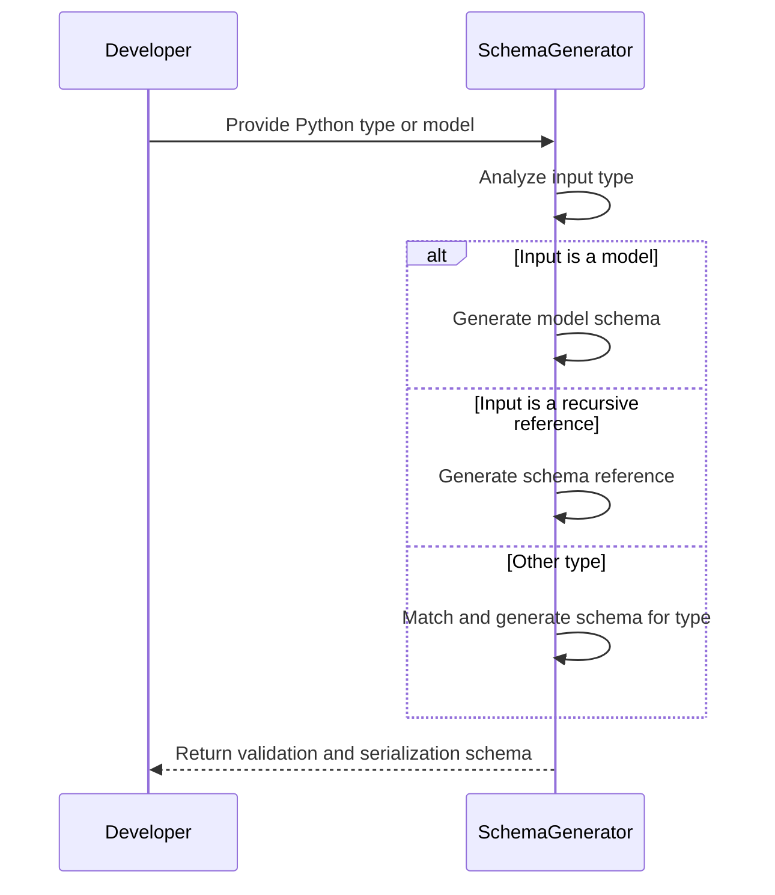
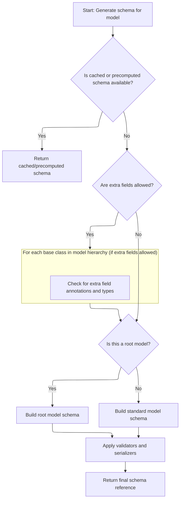
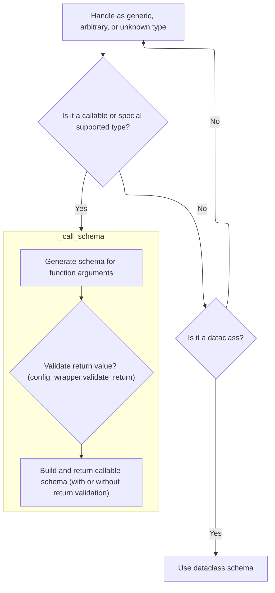
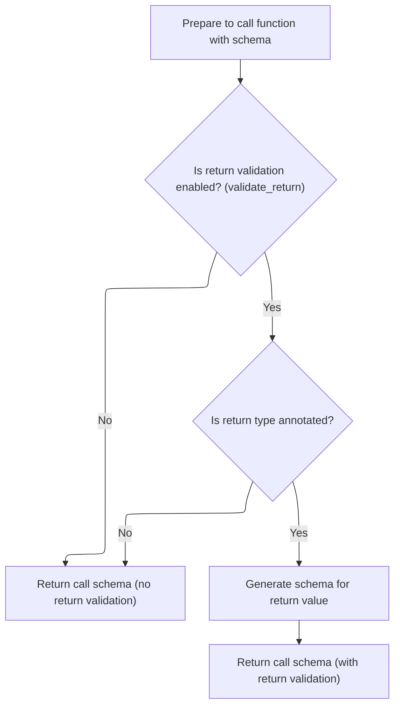
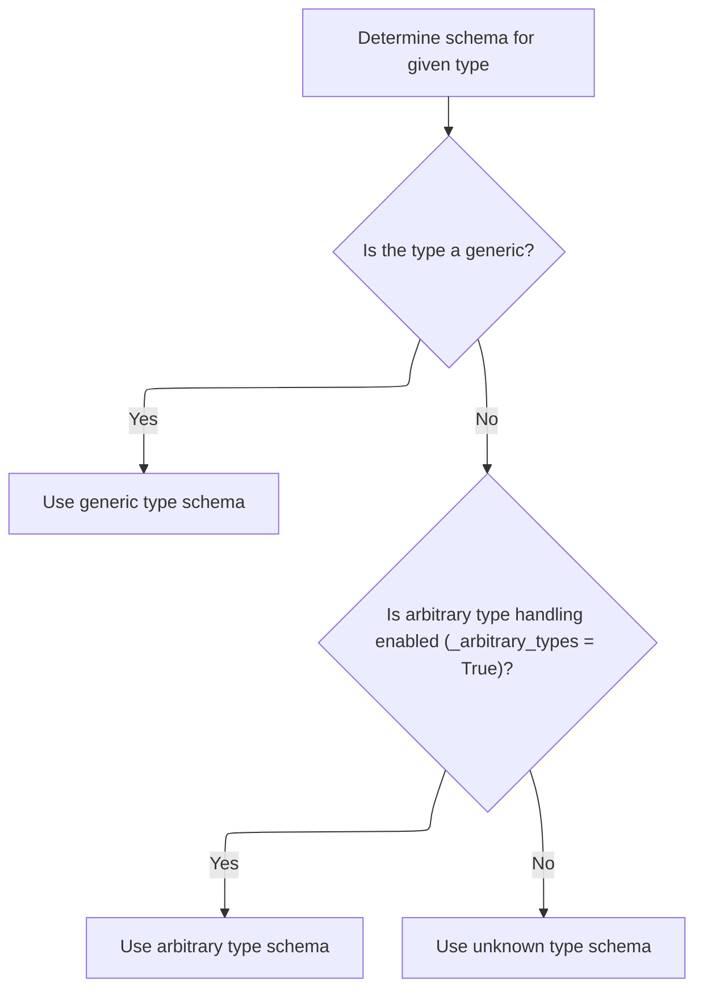

This document outlines how a schema is generated for any Python type or model to enable validation and serialization. The process starts by determining the kind of input provided, such as an annotation, dictionary, reference, or model. Depending on the input, the system either constructs a model schema, resolves recursive references, or delegates to a type-matching process that covers all supported types.

Main steps:

- Analyze the input type
- Generate a model schema if applicable
- Handle recursive references
- Delegate to type-matching for other cases



# Spec

## Detailed View of the Program's Functionality

a. Entry and Preprocessing for Schema Generation

The schema generation process begins by analyzing the input object to determine its nature. The code checks if the object is a special type such as a self-reference, an annotated type, a dictionary (which is assumed to already be a schema), a string (which is converted to a forward reference), or a forward reference (which is resolved and schema generation is retried). If the object is a subclass of a Pydantic model, it is pushed onto a stack to track recursion, and the model schema generation routine is invoked. If the object is a recursive reference, a schema reference is returned. If none of these cases match, the process falls back to a generic type-to-schema mapping function.

b. Model Schema Construction and Field Handling

When generating a schema for a Pydantic model, the process first checks for a cached or precomputed schema. If one exists, it is returned immediately. If not, the code checks if the model has a custom schema defined in its class dictionary. If so, and it is not a mock, it is unpacked and returned, possibly as a reference if it contains one.

If no schema is found, a configuration wrapper is created for the model, and the namespace resolver is updated. The code then determines if the model's fields are complete. If they are, it retrieves them; otherwise, it attempts to rebuild them, handling possible loops and forward references. If fields are missing due to a loop, an error is raised.

Decorators for validators and serializers are collected, and the code checks that all decorator-referenced fields exist. Model-level validators are also gathered. If the model allows extra fields, the code inspects the class hierarchy for extra field annotations and types, resolving any forward references and generating schemas for extra keys and values as needed.

Depending on whether the model is a root model or a standard model, the schema is built accordingly. For root models, the root field's schema is generated and wrapped with model validators. For standard models, a schema is built for all fields, including computed fields and extras, and root validators are applied. In both cases, model serializers and outer model validators are applied, and the final schema is returned as a reference.

c. Fallback Type Matching in Schema Generation

If the object does not match any of the special cases, the code falls back to a type-matching function. This function contains a series of checks for primitive types, special types, and collections, mapping each to the appropriate schema. For types like <SwmToken path="pydantic/_internal/_generate_schema.py" pos="1111:3:3" line-data="            # NewType, can&#39;t use isinstance because it fails &lt;3.10">`NewType`</SwmToken> or Final, the underlying type is handled recursively. If the type is a callable, dataclass, or generic, specialized routines are invoked. If arbitrary type handling is enabled, an arbitrary type schema is used; otherwise, an unknown type schema is returned, raising an error.

d. Type-to-Schema Mapping and Delegation

The type-matching function systematically checks the object's type against a wide range of known types, including primitives, collections, and special constructs. For each recognized type, the corresponding schema is generated, often by delegating to helper methods. For callables, a callable schema is created; for dataclasses, a dataclass schema is generated; for generics, the process is delegated to a generic type handler. If the type is not recognized and arbitrary types are not allowed, an error is raised.

e. Callable Schema Construction

When handling callable types, the process generates a schema for the function's arguments by analyzing its signature and type hints. If return value validation is enabled and the function has a return annotation, a schema for the return type is generated. The final callable schema includes the argument schema, the function itself, and the return schema if applicable.

f. Dataclass and Generic Type Handling

For dataclasses, the process checks for a cached or custom schema. If none is found, it sets up the context for recursion and configuration, handles type variable mappings for generics, and distinguishes between Pydantic and standard dataclasses. Fields and decorators are collected, and the code checks for configuration conflicts (such as disallowed combinations of field and config settings). Field schemas are generated and sorted, and the argument schema is built. Validators and serializers are applied in two stages (inner and outer), and the final schema is returned as a reference.

g. Generic and Arbitrary Type Fallbacks

If the input type has a generic origin, the process is delegated to a generic type handler. This handler checks if the origin is a dataclass, namedtuple, or provides its own schema. If so, the appropriate schema is generated. For recognized generic types (such as unions, lists, dicts, etc.), the corresponding schema helper is called. If arbitrary types are allowed, an arbitrary type schema is used; otherwise, an unknown type schema is returned.

h. Generic Type Specialization

When handling generic types, the process first checks if the origin is a dataclass or namedtuple and generates the appropriate schema. If the type provides its own schema, it is used. For recognized generic types (such as <SwmToken path="pydantic/_internal/_generate_schema.py" pos="54:12:12" line-data="from typing_extensions import TypeAlias, TypeAliasType, TypedDict, get_args, get_origin, is_typeddict">`TypedDict`</SwmToken>, List, Dict, etc.), the corresponding schema helper is called. If arbitrary types are allowed, an arbitrary type schema is used; otherwise, an unknown type schema is returned.

i. Summary

The schema generation process in Pydantic is a layered system that first checks for special cases and shortcuts (such as cached schemas, forward references, and model subclasses), then falls back to a comprehensive type-matching routine that covers primitives, collections, callables, dataclasses, generics, and arbitrary types. Each specialized handler is responsible for constructing the appropriate schema, applying validators and serializers, and managing references and recursion as needed. The system is designed to be extensible and robust, handling a wide variety of Python types and constructs.

# Rule Definition

| Paragraph Name                                                                                                                                                                                                                                                                                                                                                                                                                                                                                                                                                                                                                                                                                                                                                                                                                                                                                                                                                                                                                               | Rule ID | Category          | Description                                                                                                                                                                                                                                                                                                                                                                                                                                                                                                                                                                                                                                                                                                                                                                                                                                                                                                                                                                                                                                                                                        | Conditions                                                                                                                                                                                                                                                                                    | Remarks                                                                                                                                                                                                                                                                                                                                                                                                                                                                                                                                                                                                                                                                                                                                                                                                                                               |
| -------------------------------------------------------------------------------------------------------------------------------------------------------------------------------------------------------------------------------------------------------------------------------------------------------------------------------------------------------------------------------------------------------------------------------------------------------------------------------------------------------------------------------------------------------------------------------------------------------------------------------------------------------------------------------------------------------------------------------------------------------------------------------------------------------------------------------------------------------------------------------------------------------------------------------------------------------------------------------------------------------------------------------------------- | ------- | ----------------- | -------------------------------------------------------------------------------------------------------------------------------------------------------------------------------------------------------------------------------------------------------------------------------------------------------------------------------------------------------------------------------------------------------------------------------------------------------------------------------------------------------------------------------------------------------------------------------------------------------------------------------------------------------------------------------------------------------------------------------------------------------------------------------------------------------------------------------------------------------------------------------------------------------------------------------------------------------------------------------------------------------------------------------------------------------------------------------------------------- | --------------------------------------------------------------------------------------------------------------------------------------------------------------------------------------------------------------------------------------------------------------------------------------------- | ----------------------------------------------------------------------------------------------------------------------------------------------------------------------------------------------------------------------------------------------------------------------------------------------------------------------------------------------------------------------------------------------------------------------------------------------------------------------------------------------------------------------------------------------------------------------------------------------------------------------------------------------------------------------------------------------------------------------------------------------------------------------------------------------------------------------------------------------------- |
| def <SwmToken path="pydantic/_internal/_generate_schema.py" pos="827:7:7" line-data="                                extras_keys_schema = self.generate_schema(extra_keys_type)">`generate_schema`</SwmToken>, def <SwmToken path="pydantic/_internal/_generate_schema.py" pos="997:3:3" line-data="    def _generate_schema_inner(self, obj: Any) -&gt; core_schema.CoreSchema:">`_generate_schema_inner`</SwmToken>, def <SwmToken path="pydantic/_internal/_generate_schema.py" pos="1023:5:5" line-data="        return self.match_type(obj)">`match_type`</SwmToken>                                                                                                                                                                                                                                                                                                                                                                                                                                                                    | RL-001  | Conditional Logic | The <SwmToken path="pydantic/_internal/_generate_schema.py" pos="827:7:7" line-data="                                extras_keys_schema = self.generate_schema(extra_keys_type)">`generate_schema`</SwmToken> method must accept as input: Python types (<SwmToken path="pydantic/_internal/_generate_schema.py" pos="1033:18:20" line-data="        boilerplate before calling into the user-facing method (e.g. `GenerateSchema._tuple_schema`).">`e.g`</SwmToken>., int, str, list\[int\], user-defined classes, dataclasses, Pydantic models), instances of types (for special cases), strings representing forward references, dictionaries (assumed to be schemas and returned as-is), <SwmToken path="pydantic/_internal/_generate_schema.py" pos="1009:5:5" line-data="            obj = ForwardRef(obj)">`ForwardRef`</SwmToken> objects (resolved and processed recursively), and special internal types such as <SwmToken path="pydantic/_internal/_generate_schema.py" pos="1020:8:8" line-data="        if isinstance(obj, PydanticRecursiveRef):">`PydanticRecursiveRef`</SwmToken>. | When <SwmToken path="pydantic/_internal/_generate_schema.py" pos="827:7:7" line-data="                                extras_keys_schema = self.generate_schema(extra_keys_type)">`generate_schema`</SwmToken> is called, the input obj may be any of the supported types or representations. | Supported input types include: Python built-in types, user-defined classes, dataclasses, Pydantic models, <SwmToken path="pydantic/_internal/_generate_schema.py" pos="1009:5:5" line-data="            obj = ForwardRef(obj)">`ForwardRef`</SwmToken>, <SwmToken path="pydantic/_internal/_generate_schema.py" pos="1020:8:8" line-data="        if isinstance(obj, PydanticRecursiveRef):">`PydanticRecursiveRef`</SwmToken>, dict (schema), and string (forward reference).                                                                                                                                                                                                                                                                                                                                                                        |
| def <SwmToken path="pydantic/_internal/_generate_schema.py" pos="827:7:7" line-data="                                extras_keys_schema = self.generate_schema(extra_keys_type)">`generate_schema`</SwmToken>, def <SwmToken path="pydantic/_internal/_generate_schema.py" pos="997:3:3" line-data="    def _generate_schema_inner(self, obj: Any) -&gt; core_schema.CoreSchema:">`_generate_schema_inner`</SwmToken>, def <SwmToken path="pydantic/_internal/_generate_schema.py" pos="1023:5:5" line-data="        return self.match_type(obj)">`match_type`</SwmToken>, all \_\*schema methods                                                                                                                                                                                                                                                                                                                                                                                                                                            | RL-002  | Data Assignment   | The output of <SwmToken path="pydantic/_internal/_generate_schema.py" pos="827:7:7" line-data="                                extras_keys_schema = self.generate_schema(extra_keys_type)">`generate_schema`</SwmToken> must be a Python dictionary (or dict-like object) representing a core schema, and every schema dictionary must include a 'type' key that specifies the schema kind (<SwmToken path="pydantic/_internal/_generate_schema.py" pos="1033:18:20" line-data="        boilerplate before calling into the user-facing method (e.g. `GenerateSchema._tuple_schema`).">`e.g`</SwmToken>., 'model', 'list', 'dict', 'call', 'int', 'str', 'dataclass', etc.).                                                                                                                                                                                                                                                                                                                                                                                                                       | After schema generation, the returned schema must be a dict with a 'type' key.                                                                                                                                                                                                                | Schema dicts must follow <SwmToken path="pydantic/_internal/_generate_schema.py" pos="43:2:2" line-data="from pydantic_core import (">`pydantic_core`</SwmToken> conventions. Example formats: {'type': 'int'}, {'type': 'list', <SwmToken path="pydantic/_internal/_generate_schema.py" pos="259:4:4" line-data="            schema[&#39;items_schema&#39;][variadic_item_index] = apply_validators(">`items_schema`</SwmToken>: ...}, {'type': 'model', ...}, etc.                                                                                                                                                                                                                                                                                                                                                                                  |
| class \_Definitions, def <SwmToken path="pydantic/_internal/_generate_schema.py" pos="827:7:7" line-data="                                extras_keys_schema = self.generate_schema(extra_keys_type)">`generate_schema`</SwmToken>, def <SwmToken path="pydantic/_internal/_generate_schema.py" pos="736:3:3" line-data="    def _model_schema(self, cls: type[BaseModel]) -&gt; core_schema.CoreSchema:">`_model_schema`</SwmToken>, def <SwmToken path="pydantic/_internal/_generate_schema.py" pos="1135:5:5" line-data="            return self._dataclass_schema(obj, None)  # pyright: ignore[reportArgumentType]">`_dataclass_schema`</SwmToken>, def <SwmToken path="pydantic/_internal/_generate_schema.py" pos="1107:5:5" line-data="            return self._typed_dict_schema(obj, None)">`_typed_dict_schema`</SwmToken>, def <SwmToken path="pydantic/_internal/_generate_schema.py" pos="1109:5:5" line-data="            return self._namedtuple_schema(obj, None)">`_namedtuple_schema`</SwmToken>                          | RL-003  | Conditional Logic | The schema generation process must maintain internal state to support recursion, reference tracking, and type variable mapping. For each model or dataclass, the schema must include references (<SwmToken path="pydantic/_internal/_generate_schema.py" pos="1033:18:20" line-data="        boilerplate before calling into the user-facing method (e.g. `GenerateSchema._tuple_schema`).">`e.g`</SwmToken>., 'ref' keys) to support recursive and reusable schema definitions. Cached or precomputed schemas must be used when available.                                                                                                                                                                                                                                                                                                                                                                                                                                                                                                                                                        | When generating a schema for a referenceable type (model, dataclass, etc.), or when recursion is detected.                                                                                                                                                                                    | References are tracked using a definitions map and a set of recursively seen references. Schemas for recursive types include a 'ref' key and may use <SwmToken path="pydantic/_internal/_generate_schema.py" pos="924:18:20" line-data="            # Note: if schema is of type `&#39;definition-ref&#39;`, we might want to copy it as a">`definition-ref`</SwmToken> schemas.                                                                                                                                                                                                                                                                                                                                                                                                                                                                      |
| def <SwmToken path="pydantic/_internal/_generate_schema.py" pos="1023:5:5" line-data="        return self.match_type(obj)">`match_type`</SwmToken>, def <SwmToken path="pydantic/_internal/_generate_schema.py" pos="1139:5:5" line-data="            return self._match_generic_type(obj, origin)">`_match_generic_type`</SwmToken>, all \_\*schema methods                                                                                                                                                                                                                                                                                                                                                                                                                                                                                                                                                                                                                                                                                 | RL-004  | Conditional Logic | The schema structure must follow the conventions of <SwmToken path="pydantic/_internal/_generate_schema.py" pos="43:2:2" line-data="from pydantic_core import (">`pydantic_core`</SwmToken> for each supported type. This includes specific keys and nested schemas for primitives, lists, models, dataclasses, callables, TypedDicts, namedtuples, enums, generics, and unions.                                                                                                                                                                                                                                                                                                                                                                                                                                                                                                                                                                                                                                                                                                                   | When generating a schema for a supported type.                                                                                                                                                                                                                                                | Examples: {'type': 'int'}, {'type': 'list', <SwmToken path="pydantic/_internal/_generate_schema.py" pos="259:4:4" line-data="            schema[&#39;items_schema&#39;][variadic_item_index] = apply_validators(">`items_schema`</SwmToken>: ...}, {'type': 'model', 'cls': <model class>, 'schema': {...}, 'ref': <reference string>, ...}, {'type': 'dataclass', ...}, etc.                                                                                                                                                                                                                                                                                                                                                                                                                                                                         |
| def <SwmToken path="pydantic/_internal/_generate_schema.py" pos="1023:5:5" line-data="        return self.match_type(obj)">`match_type`</SwmToken>, def <SwmToken path="pydantic/_internal/_generate_schema.py" pos="1139:5:5" line-data="            return self._match_generic_type(obj, origin)">`_match_generic_type`</SwmToken>, all \_\*schema methods                                                                                                                                                                                                                                                                                                                                                                                                                                                                                                                                                                                                                                                                                 | RL-005  | Conditional Logic | The system must support extensibility for new types and schema kinds by delegating type-specific logic to helper methods within the class.                                                                                                                                                                                                                                                                                                                                                                                                                                                                                                                                                                                                                                                                                                                                                                                                                                                                                                                                                         | When a new or custom type is encountered, or when extending the system.                                                                                                                                                                                                                       | Helper methods are named according to the type they handle (<SwmToken path="pydantic/_internal/_generate_schema.py" pos="1033:18:20" line-data="        boilerplate before calling into the user-facing method (e.g. `GenerateSchema._tuple_schema`).">`e.g`</SwmToken>., <SwmToken path="pydantic/_internal/_generate_schema.py" pos="736:3:3" line-data="    def _model_schema(self, cls: type[BaseModel]) -&gt; core_schema.CoreSchema:">`_model_schema`</SwmToken>, <SwmToken path="pydantic/_internal/_generate_schema.py" pos="1135:5:5" line-data="            return self._dataclass_schema(obj, None)  # pyright: ignore[reportArgumentType]">`_dataclass_schema`</SwmToken>, <SwmToken path="pydantic/_internal/_generate_schema.py" pos="1128:5:5" line-data="            return self._enum_schema(obj)">`_enum_schema`</SwmToken>, etc.). |
| all \_\*schema methods, def <SwmToken path="pydantic/_internal/_generate_schema.py" pos="1023:5:5" line-data="        return self.match_type(obj)">`match_type`</SwmToken>, def <SwmToken path="pydantic/_internal/_generate_schema.py" pos="997:3:3" line-data="    def _generate_schema_inner(self, obj: Any) -&gt; core_schema.CoreSchema:">`_generate_schema_inner`</SwmToken>                                                                                                                                                                                                                                                                                                                                                                                                                                                                                                                                                                                                                                                           | RL-006  | Computation       | The <SwmToken path="pydantic/_internal/_generate_schema.py" pos="1032:5:5" line-data="        (like `GenerateSchema.tuple_variable_schema`) or calls into a private method that handles some">`GenerateSchema`</SwmToken> class must use schema helper functions (analogous to <SwmToken path="pydantic/_internal/_generate_schema.py" pos="736:19:19" line-data="    def _model_schema(self, cls: type[BaseModel]) -&gt; core_schema.CoreSchema:">`core_schema`</SwmToken>.\*) to construct schema dictionaries, rather than building dicts directly, to ensure consistency and correctness of schema structure.                                                                                                                                                                                                                                                                                                                                                                                                                                                                                  | Whenever a schema dict is constructed.                                                                                                                                                                                                                                                        | Helper functions include <SwmToken path="pydantic/_internal/_generate_schema.py" pos="1043:3:7" line-data="            return core_schema.int_schema()">`core_schema.int_schema()`</SwmToken>, core_schema.list_schema(), core_schema.model_schema(), etc.                                                                                                                                                                                                                                                                                                                                                                                                                                                                                                                                                                                            |
| def <SwmToken path="pydantic/_internal/_generate_schema.py" pos="1143:5:5" line-data="        return self._unknown_type_schema(obj)">`_unknown_type_schema`</SwmToken>, def <SwmToken path="pydantic/_internal/_generate_schema.py" pos="1023:5:5" line-data="        return self.match_type(obj)">`match_type`</SwmToken>, def <SwmToken path="pydantic/_internal/_generate_schema.py" pos="1139:5:5" line-data="            return self._match_generic_type(obj, origin)">`_match_generic_type`</SwmToken>, def <SwmToken path="pydantic/_internal/_generate_schema.py" pos="827:7:7" line-data="                                extras_keys_schema = self.generate_schema(extra_keys_type)">`generate_schema`</SwmToken>                                                                                                                                                                                                                                                                                                                  | RL-007  | Conditional Logic | The schema generation process must include error handling for unsupported types or invalid configurations, raising appropriate exceptions for major cases.                                                                                                                                                                                                                                                                                                                                                                                                                                                                                                                                                                                                                                                                                                                                                                                                                                                                                                                                         | When an unsupported type or invalid configuration is encountered.                                                                                                                                                                                                                             | Raises <SwmToken path="pydantic/_internal/_generate_schema.py" pos="819:3:3" line-data="                                raise PydanticSchemaGenerationError(">`PydanticSchemaGenerationError`</SwmToken>, <SwmToken path="pydantic/_internal/_generate_schema.py" pos="1857:3:3" line-data="                            raise PydanticUserError(">`PydanticUserError`</SwmToken>, or <SwmToken path="pydantic/_internal/_generate_schema.py" pos="270:3:3" line-data="        raise TypeError(">`TypeError`</SwmToken> as appropriate.                                                                                                                                                                                                                                                                                                                |
| def <SwmToken path="pydantic/_internal/_generate_schema.py" pos="736:3:3" line-data="    def _model_schema(self, cls: type[BaseModel]) -&gt; core_schema.CoreSchema:">`_model_schema`</SwmToken>, def <SwmToken path="pydantic/_internal/_generate_schema.py" pos="1135:5:5" line-data="            return self._dataclass_schema(obj, None)  # pyright: ignore[reportArgumentType]">`_dataclass_schema`</SwmToken>, def <SwmToken path="pydantic/_internal/_generate_schema.py" pos="1297:7:7" line-data="        schema = self._apply_field_serializers(">`_apply_field_serializers`</SwmToken>, def <SwmToken path="pydantic/_internal/_generate_schema.py" pos="874:7:7" line-data="                schema = self._apply_model_serializers(model_schema, decorators.model_serializers.values())">`_apply_model_serializers`</SwmToken>, def <SwmToken path="pydantic/_internal/_generate_schema.py" pos="1012:9:9" line-data="            return self.generate_schema(self._resolve_forward_ref(obj))">`_resolve_forward_ref`</SwmToken> | RL-008  | Computation       | Complex internal logic for validators, serializers, and forward reference resolution may be represented as stubs or placeholders, but must be invoked at the correct points in the schema generation flow.                                                                                                                                                                                                                                                                                                                                                                                                                                                                                                                                                                                                                                                                                                                                                                                                                                                                                         | When generating schemas for models, dataclasses, or types with validators/serializers/forward references.                                                                                                                                                                                     | Stub or placeholder logic is allowed for complex behaviors, but must be called in the correct sequence.                                                                                                                                                                                                                                                                                                                                                                                                                                                                                                                                                                                                                                                                                                                                               |
| def <SwmToken path="pydantic/_internal/_generate_schema.py" pos="827:7:7" line-data="                                extras_keys_schema = self.generate_schema(extra_keys_type)">`generate_schema`</SwmToken>, def <SwmToken path="pydantic/_internal/_generate_schema.py" pos="997:3:3" line-data="    def _generate_schema_inner(self, obj: Any) -&gt; core_schema.CoreSchema:">`_generate_schema_inner`</SwmToken>, def <SwmToken path="pydantic/_internal/_generate_schema.py" pos="1023:5:5" line-data="        return self.match_type(obj)">`match_type`</SwmToken>, all \_\*schema methods                                                                                                                                                                                                                                                                                                                                                                                                                                            | RL-009  | Data Assignment   | The external API and schema output must match the structure and conventions of the original Pydantic schema generation system and be compatible with <SwmToken path="pydantic/_internal/_generate_schema.py" pos="43:2:2" line-data="from pydantic_core import (">`pydantic_core`</SwmToken>.                                                                                                                                                                                                                                                                                                                                                                                                                                                                                                                                                                                                                                                                                                                                                                                                      | On every schema output.                                                                                                                                                                                                                                                                       | Schema dicts must be compatible with <SwmToken path="pydantic/_internal/_generate_schema.py" pos="43:2:2" line-data="from pydantic_core import (">`pydantic_core`</SwmToken> and follow its conventions for all supported types.                                                                                                                                                                                                                                                                                                                                                                                                                                                                                                                                                                                                                      |

# User Stories

## User Story 1: Schema generation for supported input types with correct output and internal state management

---

### Story Description:

As a user of the schema generation system, I want to generate a core schema dictionary from various supported Python types, objects, and representations, with correct internal state management for recursion, reference tracking, and caching, so that I can validate and serialize data according to Pydantic and <SwmToken path="pydantic/_internal/_generate_schema.py" pos="43:2:2" line-data="from pydantic_core import (">`pydantic_core`</SwmToken> conventions, including support for recursive and reusable types.

---

### Business Rule Mapping:

| Rule ID | Paragraph Name                                                                                                                                                                                                                                                                                                                                                                                                                                                                                                                                                                                                                                                                                                                                                                                                                                                                                                                                                                                                      | Rule Description                                                                                                                                                                                                                                                                                                                                                                                                                                                                                                                                                                                                                                                                                                                                                                                                                                                                                                                                                                                                                                                                                   |
| ------- | ------------------------------------------------------------------------------------------------------------------------------------------------------------------------------------------------------------------------------------------------------------------------------------------------------------------------------------------------------------------------------------------------------------------------------------------------------------------------------------------------------------------------------------------------------------------------------------------------------------------------------------------------------------------------------------------------------------------------------------------------------------------------------------------------------------------------------------------------------------------------------------------------------------------------------------------------------------------------------------------------------------------- | -------------------------------------------------------------------------------------------------------------------------------------------------------------------------------------------------------------------------------------------------------------------------------------------------------------------------------------------------------------------------------------------------------------------------------------------------------------------------------------------------------------------------------------------------------------------------------------------------------------------------------------------------------------------------------------------------------------------------------------------------------------------------------------------------------------------------------------------------------------------------------------------------------------------------------------------------------------------------------------------------------------------------------------------------------------------------------------------------- |
| RL-001  | def <SwmToken path="pydantic/_internal/_generate_schema.py" pos="827:7:7" line-data="                                extras_keys_schema = self.generate_schema(extra_keys_type)">`generate_schema`</SwmToken>, def <SwmToken path="pydantic/_internal/_generate_schema.py" pos="997:3:3" line-data="    def _generate_schema_inner(self, obj: Any) -&gt; core_schema.CoreSchema:">`_generate_schema_inner`</SwmToken>, def <SwmToken path="pydantic/_internal/_generate_schema.py" pos="1023:5:5" line-data="        return self.match_type(obj)">`match_type`</SwmToken>                                                                                                                                                                                                                                                                                                                                                                                                                                           | The <SwmToken path="pydantic/_internal/_generate_schema.py" pos="827:7:7" line-data="                                extras_keys_schema = self.generate_schema(extra_keys_type)">`generate_schema`</SwmToken> method must accept as input: Python types (<SwmToken path="pydantic/_internal/_generate_schema.py" pos="1033:18:20" line-data="        boilerplate before calling into the user-facing method (e.g. `GenerateSchema._tuple_schema`).">`e.g`</SwmToken>., int, str, list\[int\], user-defined classes, dataclasses, Pydantic models), instances of types (for special cases), strings representing forward references, dictionaries (assumed to be schemas and returned as-is), <SwmToken path="pydantic/_internal/_generate_schema.py" pos="1009:5:5" line-data="            obj = ForwardRef(obj)">`ForwardRef`</SwmToken> objects (resolved and processed recursively), and special internal types such as <SwmToken path="pydantic/_internal/_generate_schema.py" pos="1020:8:8" line-data="        if isinstance(obj, PydanticRecursiveRef):">`PydanticRecursiveRef`</SwmToken>. |
| RL-002  | def <SwmToken path="pydantic/_internal/_generate_schema.py" pos="827:7:7" line-data="                                extras_keys_schema = self.generate_schema(extra_keys_type)">`generate_schema`</SwmToken>, def <SwmToken path="pydantic/_internal/_generate_schema.py" pos="997:3:3" line-data="    def _generate_schema_inner(self, obj: Any) -&gt; core_schema.CoreSchema:">`_generate_schema_inner`</SwmToken>, def <SwmToken path="pydantic/_internal/_generate_schema.py" pos="1023:5:5" line-data="        return self.match_type(obj)">`match_type`</SwmToken>, all \_\*schema methods                                                                                                                                                                                                                                                                                                                                                                                                                   | The output of <SwmToken path="pydantic/_internal/_generate_schema.py" pos="827:7:7" line-data="                                extras_keys_schema = self.generate_schema(extra_keys_type)">`generate_schema`</SwmToken> must be a Python dictionary (or dict-like object) representing a core schema, and every schema dictionary must include a 'type' key that specifies the schema kind (<SwmToken path="pydantic/_internal/_generate_schema.py" pos="1033:18:20" line-data="        boilerplate before calling into the user-facing method (e.g. `GenerateSchema._tuple_schema`).">`e.g`</SwmToken>., 'model', 'list', 'dict', 'call', 'int', 'str', 'dataclass', etc.).                                                                                                                                                                                                                                                                                                                                                                                                                       |
| RL-009  | def <SwmToken path="pydantic/_internal/_generate_schema.py" pos="827:7:7" line-data="                                extras_keys_schema = self.generate_schema(extra_keys_type)">`generate_schema`</SwmToken>, def <SwmToken path="pydantic/_internal/_generate_schema.py" pos="997:3:3" line-data="    def _generate_schema_inner(self, obj: Any) -&gt; core_schema.CoreSchema:">`_generate_schema_inner`</SwmToken>, def <SwmToken path="pydantic/_internal/_generate_schema.py" pos="1023:5:5" line-data="        return self.match_type(obj)">`match_type`</SwmToken>, all \_\*schema methods                                                                                                                                                                                                                                                                                                                                                                                                                   | The external API and schema output must match the structure and conventions of the original Pydantic schema generation system and be compatible with <SwmToken path="pydantic/_internal/_generate_schema.py" pos="43:2:2" line-data="from pydantic_core import (">`pydantic_core`</SwmToken>.                                                                                                                                                                                                                                                                                                                                                                                                                                                                                                                                                                                                                                                                                                                                                                                                      |
| RL-003  | class \_Definitions, def <SwmToken path="pydantic/_internal/_generate_schema.py" pos="827:7:7" line-data="                                extras_keys_schema = self.generate_schema(extra_keys_type)">`generate_schema`</SwmToken>, def <SwmToken path="pydantic/_internal/_generate_schema.py" pos="736:3:3" line-data="    def _model_schema(self, cls: type[BaseModel]) -&gt; core_schema.CoreSchema:">`_model_schema`</SwmToken>, def <SwmToken path="pydantic/_internal/_generate_schema.py" pos="1135:5:5" line-data="            return self._dataclass_schema(obj, None)  # pyright: ignore[reportArgumentType]">`_dataclass_schema`</SwmToken>, def <SwmToken path="pydantic/_internal/_generate_schema.py" pos="1107:5:5" line-data="            return self._typed_dict_schema(obj, None)">`_typed_dict_schema`</SwmToken>, def <SwmToken path="pydantic/_internal/_generate_schema.py" pos="1109:5:5" line-data="            return self._namedtuple_schema(obj, None)">`_namedtuple_schema`</SwmToken> | The schema generation process must maintain internal state to support recursion, reference tracking, and type variable mapping. For each model or dataclass, the schema must include references (<SwmToken path="pydantic/_internal/_generate_schema.py" pos="1033:18:20" line-data="        boilerplate before calling into the user-facing method (e.g. `GenerateSchema._tuple_schema`).">`e.g`</SwmToken>., 'ref' keys) to support recursive and reusable schema definitions. Cached or precomputed schemas must be used when available.                                                                                                                                                                                                                                                                                                                                                                                                                                                                                                                                                        |
| RL-004  | def <SwmToken path="pydantic/_internal/_generate_schema.py" pos="1023:5:5" line-data="        return self.match_type(obj)">`match_type`</SwmToken>, def <SwmToken path="pydantic/_internal/_generate_schema.py" pos="1139:5:5" line-data="            return self._match_generic_type(obj, origin)">`_match_generic_type`</SwmToken>, all \_\*schema methods                                                                                                                                                                                                                                                                                                                                                                                                                                                                                                                                                                                                                                                        | The schema structure must follow the conventions of <SwmToken path="pydantic/_internal/_generate_schema.py" pos="43:2:2" line-data="from pydantic_core import (">`pydantic_core`</SwmToken> for each supported type. This includes specific keys and nested schemas for primitives, lists, models, dataclasses, callables, TypedDicts, namedtuples, enums, generics, and unions.                                                                                                                                                                                                                                                                                                                                                                                                                                                                                                                                                                                                                                                                                                                   |

---

### Relevant Functionality:

- **def** <SwmToken path="pydantic/_internal/_generate_schema.py" pos="827:7:7" line-data="                                extras_keys_schema = self.generate_schema(extra_keys_type)">`generate_schema`</SwmToken>
  1. **RL-001:**
     - If obj is a dict, return obj as the schema.
     - If obj is a string, convert to <SwmToken path="pydantic/_internal/_generate_schema.py" pos="1009:5:5" line-data="            obj = ForwardRef(obj)">`ForwardRef`</SwmToken> and resolve.
     - If obj is a <SwmToken path="pydantic/_internal/_generate_schema.py" pos="1009:5:5" line-data="            obj = ForwardRef(obj)">`ForwardRef`</SwmToken>, resolve and process recursively.
     - If obj is a <SwmToken path="pydantic/_internal/_generate_schema.py" pos="1020:8:8" line-data="        if isinstance(obj, PydanticRecursiveRef):">`PydanticRecursiveRef`</SwmToken>, return a definition reference schema.
     - If obj is a supported type (primitive, model, dataclass, etc.), dispatch to the appropriate schema generation method.
     - Otherwise, handle as arbitrary or unknown type.
  2. **RL-002:**
     - For each supported type, call the corresponding schema helper function (<SwmToken path="pydantic/_internal/_generate_schema.py" pos="1033:18:20" line-data="        boilerplate before calling into the user-facing method (e.g. `GenerateSchema._tuple_schema`).">`e.g`</SwmToken>., <SwmToken path="pydantic/_internal/_generate_schema.py" pos="1043:3:7" line-data="            return core_schema.int_schema()">`core_schema.int_schema()`</SwmToken>, <SwmToken path="pydantic/_internal/_generate_schema.py" pos="379:3:5" line-data="        return core_schema.list_schema(self.generate_schema(items_type))">`core_schema.list_schema`</SwmToken>(...)).
     - Ensure the returned schema dict includes a 'type' key matching the schema kind.
     - For custom or complex types, build the schema using helper functions, not by direct dict construction.
  3. **RL-009:**
     - Ensure that all generated schema dicts are valid according to <SwmToken path="pydantic/_internal/_generate_schema.py" pos="43:2:2" line-data="from pydantic_core import (">`pydantic_core`</SwmToken> expectations.
     - Test schema output against <SwmToken path="pydantic/_internal/_generate_schema.py" pos="43:2:2" line-data="from pydantic_core import (">`pydantic_core`</SwmToken> to verify compatibility.
- **class \_Definitions**
  1. **RL-003:**
     - Before generating a schema for a referenceable type, check if a schema or reference already exists in the definitions map.
     - If recursion is detected, return a definition reference schema.
     - When a schema is generated for a referenceable type, store it in the definitions map with its reference key.
     - Use the stored schema or reference for subsequent occurrences of the same type.
- **def** <SwmToken path="pydantic/_internal/_generate_schema.py" pos="1023:5:5" line-data="        return self.match_type(obj)">`match_type`</SwmToken>
  1. **RL-004:**
     - For each type, dispatch to the corresponding \_\*schema method.
     - Each \_\*schema method constructs the schema using <SwmToken path="pydantic/_internal/_generate_schema.py" pos="736:19:19" line-data="    def _model_schema(self, cls: type[BaseModel]) -&gt; core_schema.CoreSchema:">`core_schema`</SwmToken> helper functions, ensuring the correct structure and required keys.
     - For generics and parametrized types, resolve type variables and apply them to the schema.

## User Story 2: Extensibility and error handling for new and unsupported types

---

### Story Description:

As a user or system integrator, I want the schema generation process to be extensible for new types and to provide clear error handling for unsupported or invalid types so that the system can be adapted and remains robust.

---

### Business Rule Mapping:

| Rule ID | Paragraph Name                                                                                                                                                                                                                                                                                                                                                                                                                                                                                                                                                                                                                                                                                                              | Rule Description                                                                                                                                           |
| ------- | --------------------------------------------------------------------------------------------------------------------------------------------------------------------------------------------------------------------------------------------------------------------------------------------------------------------------------------------------------------------------------------------------------------------------------------------------------------------------------------------------------------------------------------------------------------------------------------------------------------------------------------------------------------------------------------------------------------------------- | ---------------------------------------------------------------------------------------------------------------------------------------------------------- |
| RL-005  | def <SwmToken path="pydantic/_internal/_generate_schema.py" pos="1023:5:5" line-data="        return self.match_type(obj)">`match_type`</SwmToken>, def <SwmToken path="pydantic/_internal/_generate_schema.py" pos="1139:5:5" line-data="            return self._match_generic_type(obj, origin)">`_match_generic_type`</SwmToken>, all \_\*schema methods                                                                                                                                                                                                                                                                                                                                                                | The system must support extensibility for new types and schema kinds by delegating type-specific logic to helper methods within the class.                 |
| RL-007  | def <SwmToken path="pydantic/_internal/_generate_schema.py" pos="1143:5:5" line-data="        return self._unknown_type_schema(obj)">`_unknown_type_schema`</SwmToken>, def <SwmToken path="pydantic/_internal/_generate_schema.py" pos="1023:5:5" line-data="        return self.match_type(obj)">`match_type`</SwmToken>, def <SwmToken path="pydantic/_internal/_generate_schema.py" pos="1139:5:5" line-data="            return self._match_generic_type(obj, origin)">`_match_generic_type`</SwmToken>, def <SwmToken path="pydantic/_internal/_generate_schema.py" pos="827:7:7" line-data="                                extras_keys_schema = self.generate_schema(extra_keys_type)">`generate_schema`</SwmToken> | The schema generation process must include error handling for unsupported types or invalid configurations, raising appropriate exceptions for major cases. |

---

### Relevant Functionality:

- **def** <SwmToken path="pydantic/_internal/_generate_schema.py" pos="1023:5:5" line-data="        return self.match_type(obj)">`match_type`</SwmToken>
  1. **RL-005:**
     - In <SwmToken path="pydantic/_internal/_generate_schema.py" pos="1023:5:5" line-data="        return self.match_type(obj)">`match_type`</SwmToken> and <SwmToken path="pydantic/_internal/_generate_schema.py" pos="1139:5:5" line-data="            return self._match_generic_type(obj, origin)">`_match_generic_type`</SwmToken>, use if/elif chains to dispatch to the appropriate helper method for each type.
     - To add support for a new type, implement a new \_\*schema method and add a dispatch case.
- **def** <SwmToken path="pydantic/_internal/_generate_schema.py" pos="1143:5:5" line-data="        return self._unknown_type_schema(obj)">`_unknown_type_schema`</SwmToken>
  1. **RL-007:**
     - If an unsupported type is encountered, raise <SwmToken path="pydantic/_internal/_generate_schema.py" pos="819:3:3" line-data="                                raise PydanticSchemaGenerationError(">`PydanticSchemaGenerationError`</SwmToken> or <SwmToken path="pydantic/_internal/_generate_schema.py" pos="1857:3:3" line-data="                            raise PydanticUserError(">`PydanticUserError`</SwmToken> with a descriptive message.
     - For invalid configurations (<SwmToken path="pydantic/_internal/_generate_schema.py" pos="1033:18:20" line-data="        boilerplate before calling into the user-facing method (e.g. `GenerateSchema._tuple_schema`).">`e.g`</SwmToken>., <SwmToken path="pydantic/_internal/_generate_schema.py" pos="54:12:12" line-data="from typing_extensions import TypeAlias, TypeAliasType, TypedDict, get_args, get_origin, is_typeddict">`TypedDict`</SwmToken> version, invalid type parameters), raise the appropriate error.

## User Story 3: Consistent schema construction and invocation of stubs/placeholders

---

### Story Description:

As a system generating schemas, I want to use helper functions for schema construction and invoke stubs or placeholders for validators, serializers, and forward reference resolution at the correct points so that the schema structure is consistent and extensible, even if some logic is not fully implemented.

---

### Business Rule Mapping:

| Rule ID | Paragraph Name                                                                                                                                                                                                                                                                                                                                                                                                                                                                                                                                                                                                                                                                                                                                                                                                                                                                                                                                                                                                                               | Rule Description                                                                                                                                                                                                                                                                                                                                                                                                                                                                                                                                                                                                  |
| ------- | -------------------------------------------------------------------------------------------------------------------------------------------------------------------------------------------------------------------------------------------------------------------------------------------------------------------------------------------------------------------------------------------------------------------------------------------------------------------------------------------------------------------------------------------------------------------------------------------------------------------------------------------------------------------------------------------------------------------------------------------------------------------------------------------------------------------------------------------------------------------------------------------------------------------------------------------------------------------------------------------------------------------------------------------- | ----------------------------------------------------------------------------------------------------------------------------------------------------------------------------------------------------------------------------------------------------------------------------------------------------------------------------------------------------------------------------------------------------------------------------------------------------------------------------------------------------------------------------------------------------------------------------------------------------------------- |
| RL-006  | all \_\*schema methods, def <SwmToken path="pydantic/_internal/_generate_schema.py" pos="1023:5:5" line-data="        return self.match_type(obj)">`match_type`</SwmToken>, def <SwmToken path="pydantic/_internal/_generate_schema.py" pos="997:3:3" line-data="    def _generate_schema_inner(self, obj: Any) -&gt; core_schema.CoreSchema:">`_generate_schema_inner`</SwmToken>                                                                                                                                                                                                                                                                                                                                                                                                                                                                                                                                                                                                                                                           | The <SwmToken path="pydantic/_internal/_generate_schema.py" pos="1032:5:5" line-data="        (like `GenerateSchema.tuple_variable_schema`) or calls into a private method that handles some">`GenerateSchema`</SwmToken> class must use schema helper functions (analogous to <SwmToken path="pydantic/_internal/_generate_schema.py" pos="736:19:19" line-data="    def _model_schema(self, cls: type[BaseModel]) -&gt; core_schema.CoreSchema:">`core_schema`</SwmToken>.\*) to construct schema dictionaries, rather than building dicts directly, to ensure consistency and correctness of schema structure. |
| RL-008  | def <SwmToken path="pydantic/_internal/_generate_schema.py" pos="736:3:3" line-data="    def _model_schema(self, cls: type[BaseModel]) -&gt; core_schema.CoreSchema:">`_model_schema`</SwmToken>, def <SwmToken path="pydantic/_internal/_generate_schema.py" pos="1135:5:5" line-data="            return self._dataclass_schema(obj, None)  # pyright: ignore[reportArgumentType]">`_dataclass_schema`</SwmToken>, def <SwmToken path="pydantic/_internal/_generate_schema.py" pos="1297:7:7" line-data="        schema = self._apply_field_serializers(">`_apply_field_serializers`</SwmToken>, def <SwmToken path="pydantic/_internal/_generate_schema.py" pos="874:7:7" line-data="                schema = self._apply_model_serializers(model_schema, decorators.model_serializers.values())">`_apply_model_serializers`</SwmToken>, def <SwmToken path="pydantic/_internal/_generate_schema.py" pos="1012:9:9" line-data="            return self.generate_schema(self._resolve_forward_ref(obj))">`_resolve_forward_ref`</SwmToken> | Complex internal logic for validators, serializers, and forward reference resolution may be represented as stubs or placeholders, but must be invoked at the correct points in the schema generation flow.                                                                                                                                                                                                                                                                                                                                                                                                        |

---

### Relevant Functionality:

- \**all \_schema methods*
  1. **RL-006:**
     - In each \_\*schema method, call the appropriate <SwmToken path="pydantic/_internal/_generate_schema.py" pos="736:19:19" line-data="    def _model_schema(self, cls: type[BaseModel]) -&gt; core_schema.CoreSchema:">`core_schema`</SwmToken> helper function to build the schema dict.
     - Do not construct schema dicts directly except for returning already-constructed schemas.
- **def** <SwmToken path="pydantic/_internal/_generate_schema.py" pos="736:3:3" line-data="    def _model_schema(self, cls: type[BaseModel]) -&gt; core_schema.CoreSchema:">`_model_schema`</SwmToken>
  1. **RL-008:**
     - When generating a model or dataclass schema, invoke validator and serializer logic (even if as a stub).
     - When resolving a <SwmToken path="pydantic/_internal/_generate_schema.py" pos="1009:5:5" line-data="            obj = ForwardRef(obj)">`ForwardRef`</SwmToken>, call the resolution logic (even if as a stub).

# Code Walkthrough

## Entry and Preprocessing for Schema Generation

```mermaid
%%{init: {"flowchart": {"defaultRenderer": "elk"}} }%%
flowchart TD
    node1["Analyze object: Is it annotated, dict, reference, or model?"]
    click node1 openCode "pydantic/_internal/_generate_schema.py:997:1023"
    node1 -->|"Pydantic model"| node2["Generate schema for Pydantic model"]
    click node2 openCode "pydantic/_internal/_generate_schema.py:736:1022"
    node1 -->|"Other type or special case"| node3["Generate schema based on object type"]
    click node3 openCode "pydantic/_internal/_generate_schema.py:1023:1023"

subgraph node2 [_model_schema]
  sgmain_1_node1["Start: Generate schema for model"] --> sgmain_1_node2{"Is cached or precomputed schema available?"}
  click sgmain_1_node1 openCode "pydantic/_internal/_generate_schema.py:736:737"
  click sgmain_1_node2 openCode "pydantic/_internal/_generate_schema.py:740:742"
  sgmain_1_node2 -- Yes --> sgmain_1_node3["Return cached/precomputed schema"]
  click sgmain_1_node3 openCode "pydantic/_internal/_generate_schema.py:742:743"
  sgmain_1_node2 -- No --> sgmain_1_node4{"Are extra fields allowed?"}
  click sgmain_1_node4 openCode "pydantic/_internal/_generate_schema.py:802:803"
  sgmain_1_node4 -- Yes --> sgmain_1_loop1
  sgmain_1_node4 -- No --> sgmain_1_node5{"Is this a root model?"}
  subgraph sgmain_1_loop1["For each base class in model hierarchy (if extra fields allowed)"]
  sgmain_1_node9["Check for extra field annotations and types"]
  click sgmain_1_node9 openCode "pydantic/_internal/_generate_schema.py:805:831"
  end
  sgmain_1_loop1 --> sgmain_1_node5
  sgmain_1_node5 -- Yes --> sgmain_1_node6["Build root model schema"]
  click sgmain_1_node6 openCode "pydantic/_internal/_generate_schema.py:835:848"
  sgmain_1_node5 -- No --> sgmain_1_node7["Build standard model schema"]
  click sgmain_1_node7 openCode "pydantic/_internal/_generate_schema.py:850:872"
  sgmain_1_node6 --> sgmain_1_node8["Apply validators and serializers"]
  sgmain_1_node7 --> sgmain_1_node8
  click sgmain_1_node8 openCode "pydantic/_internal/_generate_schema.py:874:875"
  sgmain_1_node8 --> sgmain_1_node10["Return final schema reference"]
  click sgmain_1_node10 openCode "pydantic/_internal/_generate_schema.py:876:876"
end

%% Swimm:
%% %%{init: {"flowchart": {"defaultRenderer": "elk"}} }%%
%% flowchart TD
%%     node1["Analyze object: Is it annotated, dict, reference, or model?"]
%%     click node1 openCode "<SwmPath>[pydantic/\_internal/\_generate_schema.py](pydantic/_internal/_generate_schema.py)</SwmPath>:997:1023"
%%     node1 -->|"Pydantic model"| node2["Generate schema for Pydantic model"]
%%     click node2 openCode "<SwmPath>[pydantic/\_internal/\_generate_schema.py](pydantic/_internal/_generate_schema.py)</SwmPath>:736:1022"
%%     node1 -->|"Other type or special case"| node3["Generate schema based on object type"]
%%     click node3 openCode "<SwmPath>[pydantic/\_internal/\_generate_schema.py](pydantic/_internal/_generate_schema.py)</SwmPath>:1023:1023"
%% 
%% subgraph node2 [<SwmToken path="pydantic/_internal/_generate_schema.py" pos="736:3:3" line-data="    def _model_schema(self, cls: type[BaseModel]) -&gt; core_schema.CoreSchema:">`_model_schema`</SwmToken>]
%%   sgmain_1_node1["Start: Generate schema for model"] --> sgmain_1_node2{"Is cached or precomputed schema available?"}
%%   click sgmain_1_node1 openCode "<SwmPath>[pydantic/\_internal/\_generate_schema.py](pydantic/_internal/_generate_schema.py)</SwmPath>:736:737"
%%   click sgmain_1_node2 openCode "<SwmPath>[pydantic/\_internal/\_generate_schema.py](pydantic/_internal/_generate_schema.py)</SwmPath>:740:742"
%%   sgmain_1_node2 -- Yes --> sgmain_1_node3["Return cached/precomputed schema"]
%%   click sgmain_1_node3 openCode "<SwmPath>[pydantic/\_internal/\_generate_schema.py](pydantic/_internal/_generate_schema.py)</SwmPath>:742:743"
%%   sgmain_1_node2 -- No --> sgmain_1_node4{"Are extra fields allowed?"}
%%   click sgmain_1_node4 openCode "<SwmPath>[pydantic/\_internal/\_generate_schema.py](pydantic/_internal/_generate_schema.py)</SwmPath>:802:803"
%%   sgmain_1_node4 -- Yes --> sgmain_1_loop1
%%   sgmain_1_node4 -- No --> sgmain_1_node5{"Is this a root model?"}
%%   subgraph sgmain_1_loop1["For each base class in model hierarchy (if extra fields allowed)"]
%%   sgmain_1_node9["Check for extra field annotations and types"]
%%   click sgmain_1_node9 openCode "<SwmPath>[pydantic/\_internal/\_generate_schema.py](pydantic/_internal/_generate_schema.py)</SwmPath>:805:831"
%%   end
%%   sgmain_1_loop1 --> sgmain_1_node5
%%   sgmain_1_node5 -- Yes --> sgmain_1_node6["Build root model schema"]
%%   click sgmain_1_node6 openCode "<SwmPath>[pydantic/\_internal/\_generate_schema.py](pydantic/_internal/_generate_schema.py)</SwmPath>:835:848"
%%   sgmain_1_node5 -- No --> sgmain_1_node7["Build standard model schema"]
%%   click sgmain_1_node7 openCode "<SwmPath>[pydantic/\_internal/\_generate_schema.py](pydantic/_internal/_generate_schema.py)</SwmPath>:850:872"
%%   sgmain_1_node6 --> sgmain_1_node8["Apply validators and serializers"]
%%   sgmain_1_node7 --> sgmain_1_node8
%%   click sgmain_1_node8 openCode "<SwmPath>[pydantic/\_internal/\_generate_schema.py](pydantic/_internal/_generate_schema.py)</SwmPath>:874:875"
%%   sgmain_1_node8 --> sgmain_1_node10["Return final schema reference"]
%%   click sgmain_1_node10 openCode "<SwmPath>[pydantic/\_internal/\_generate_schema.py](pydantic/_internal/_generate_schema.py)</SwmPath>:876:876"
%% end
```



<SwmSnippet path="/pydantic/_internal/_generate_schema.py" line="997">

---

<SwmToken path="pydantic/_internal/_generate_schema.py" pos="997:3:3" line-data="    def _generate_schema_inner(self, obj: Any) -&gt; core_schema.CoreSchema:">`_generate_schema_inner`</SwmToken> kicks off by resolving recursion, metadata, and forward references, and skips work if the input is already a schema dict. If we get a <SwmToken path="pydantic/_internal/_generate_schema.py" pos="1009:5:5" line-data="            obj = ForwardRef(obj)">`ForwardRef`</SwmToken>, we resolve it and call <SwmToken path="pydantic/_internal/_generate_schema.py" pos="1012:5:5" line-data="            return self.generate_schema(self._resolve_forward_ref(obj))">`generate_schema`</SwmToken> to keep the process moving.

```python
    def _generate_schema_inner(self, obj: Any) -> core_schema.CoreSchema:
        if typing_objects.is_self(obj):
            obj = self._resolve_self_type(obj)

        if typing_objects.is_annotated(get_origin(obj)):
            return self._annotated_schema(obj)

        if isinstance(obj, dict):
            # we assume this is already a valid schema
            return obj  # type: ignore[return-value]

        if isinstance(obj, str):
            obj = ForwardRef(obj)

        if isinstance(obj, ForwardRef):
            return self.generate_schema(self._resolve_forward_ref(obj))

```

---

</SwmSnippet>

<SwmSnippet path="/pydantic/_internal/_generate_schema.py" line="1014">

---

After returning from <SwmToken path="pydantic/_internal/_generate_schema.py" pos="827:7:7" line-data="                                extras_keys_schema = self.generate_schema(extra_keys_type)">`generate_schema`</SwmToken> in <SwmToken path="pydantic/_internal/_generate_schema.py" pos="997:3:3" line-data="    def _generate_schema_inner(self, obj: Any) -&gt; core_schema.CoreSchema:">`_generate_schema_inner`</SwmToken>, we check if the input is a Pydantic model subclass. If it is, we push it onto a stack to track recursion and call <SwmToken path="pydantic/_internal/_generate_schema.py" pos="1018:5:5" line-data="                return self._model_schema(obj)">`_model_schema`</SwmToken> to build its schema. If it's a <SwmToken path="pydantic/_internal/_generate_schema.py" pos="1020:8:8" line-data="        if isinstance(obj, PydanticRecursiveRef):">`PydanticRecursiveRef`</SwmToken>, we return a reference schema for recursive definitions. This keeps recursive and model-specific logic separate from the rest of the type handling.

```python
        BaseModel = import_cached_base_model()

        if lenient_issubclass(obj, BaseModel):
            with self.model_type_stack.push(obj):
                return self._model_schema(obj)

        if isinstance(obj, PydanticRecursiveRef):
            return core_schema.definition_reference_schema(schema_ref=obj.type_ref)

```

---

</SwmSnippet>

### Model Schema Construction and Field Handling



<SwmSnippet path="/pydantic/_internal/_generate_schema.py" line="736">

---

In <SwmToken path="pydantic/_internal/_generate_schema.py" pos="736:3:3" line-data="    def _model_schema(self, cls: type[BaseModel]) -&gt; core_schema.CoreSchema:">`_model_schema`</SwmToken>, we first check for a cached schema or a pre-defined schema on the model. If found, we use it right away. Otherwise, we set up config and namespace context, then gather or rebuild fields, handling forward references and loops. We also validate that all decorator-referenced fields exist and handle extra fields if allowed by config. This sets up everything needed before building the actual schema for the model.

```python
    def _model_schema(self, cls: type[BaseModel]) -> core_schema.CoreSchema:
        """Generate schema for a Pydantic model."""
        BaseModel_ = import_cached_base_model()

        with self.defs.get_schema_or_ref(cls) as (model_ref, maybe_schema):
            if maybe_schema is not None:
                return maybe_schema

            schema = cls.__dict__.get('__pydantic_core_schema__')
            if schema is not None and not isinstance(schema, MockCoreSchema):
                if schema['type'] == 'definitions':
                    schema = self.defs.unpack_definitions(schema)
                ref = get_ref(schema)
                if ref:
                    return self.defs.create_definition_reference_schema(schema)
                else:
                    return schema

            config_wrapper = ConfigWrapper(cls.model_config, check=False)

            with self._config_wrapper_stack.push(config_wrapper), self._ns_resolver.push(cls):
                core_config = self._config_wrapper.core_config(title=cls.__name__)

                if cls.__pydantic_fields_complete__ or cls is BaseModel_:
                    fields = getattr(cls, '__pydantic_fields__', {})
                else:
                    if not hasattr(cls, '__pydantic_fields__'):
                        # This happens when we have a loop in the schema generation:
                        # class Base[T](BaseModel):
                        #     t: T
                        #
                        # class Other(BaseModel):
                        #     b: 'Base[Other]'
                        # When we build fields for `Other`, we evaluate the forward annotation.
                        # At this point, `Other` doesn't have the model fields set. We create
                        # `Base[Other]`; model fields are successfully built, and we try to generate
                        # a schema for `t: Other`. As `Other.__pydantic_fields__` aren't set, we abort.
                        raise PydanticUndefinedAnnotation(
                            name=cls.__name__,
                            message=f'Class {cls.__name__!r} is not defined',
                        )
                    try:
                        fields = rebuild_model_fields(
                            cls,
                            config_wrapper=self._config_wrapper,
                            ns_resolver=self._ns_resolver,
                            typevars_map=self._typevars_map or {},
                        )
                    except NameError as e:
                        raise PydanticUndefinedAnnotation.from_name_error(e) from e

                decorators = cls.__pydantic_decorators__
                computed_fields = decorators.computed_fields
                check_decorator_fields_exist(
                    chain(
                        decorators.field_validators.values(),
                        decorators.field_serializers.values(),
                        decorators.validators.values(),
                    ),
                    {*fields.keys(), *computed_fields.keys()},
                )

                model_validators = decorators.model_validators.values()

                extras_schema = None
                extras_keys_schema = None
                if core_config.get('extra_fields_behavior') == 'allow':
                    assert cls.__mro__[0] is cls
                    assert cls.__mro__[-1] is object
                    for candidate_cls in cls.__mro__[:-1]:
                        extras_annotation = getattr(candidate_cls, '__annotations__', {}).get(
                            '__pydantic_extra__', None
                        )
                        if extras_annotation is not None:
                            if isinstance(extras_annotation, str):
                                extras_annotation = _typing_extra.eval_type_backport(
                                    _typing_extra._make_forward_ref(
                                        extras_annotation, is_argument=False, is_class=True
                                    ),
                                    *self._types_namespace,
                                )
                            tp = get_origin(extras_annotation)
                            if tp not in DICT_TYPES:
                                raise PydanticSchemaGenerationError(
                                    'The type annotation for `__pydantic_extra__` must be `dict[str, ...]`'
                                )
                            extra_keys_type, extra_items_type = self._get_args_resolving_forward_refs(
                                extras_annotation,
                                required=True,
                            )
                            if extra_keys_type is not str:
                                extras_keys_schema = self.generate_schema(extra_keys_type)
                            if not typing_objects.is_any(extra_items_type):
                                extras_schema = self.generate_schema(extra_items_type)
                            if extras_keys_schema is not None or extras_schema is not None:
                                break

```

---

</SwmSnippet>

<SwmSnippet path="/pydantic/_internal/_generate_schema.py" line="833">

---

<SwmToken path="pydantic/_internal/_generate_schema.py" pos="736:3:3" line-data="    def _model_schema(self, cls: type[BaseModel]) -&gt; core_schema.CoreSchema:">`_model_schema`</SwmToken> builds the schema for root or regular models, applies validators and serializers, and returns a reference schema with all the model logic baked in.

```python
                generic_origin: type[BaseModel] | None = getattr(cls, '__pydantic_generic_metadata__', {}).get('origin')

                if cls.__pydantic_root_model__:
                    root_field = self._common_field_schema('root', fields['root'], decorators)
                    inner_schema = root_field['schema']
                    inner_schema = apply_model_validators(inner_schema, model_validators, 'inner')
                    model_schema = core_schema.model_schema(
                        cls,
                        inner_schema,
                        generic_origin=generic_origin,
                        custom_init=getattr(cls, '__pydantic_custom_init__', None),
                        root_model=True,
                        post_init=getattr(cls, '__pydantic_post_init__', None),
                        config=core_config,
                        ref=model_ref,
                    )
                else:
                    fields_schema: core_schema.CoreSchema = core_schema.model_fields_schema(
                        {k: self._generate_md_field_schema(k, v, decorators) for k, v in fields.items()},
                        computed_fields=[
                            self._computed_field_schema(d, decorators.field_serializers)
                            for d in computed_fields.values()
                        ],
                        extras_schema=extras_schema,
                        extras_keys_schema=extras_keys_schema,
                        model_name=cls.__name__,
                    )
                    inner_schema = apply_validators(fields_schema, decorators.root_validators.values())
                    inner_schema = apply_model_validators(inner_schema, model_validators, 'inner')

                    model_schema = core_schema.model_schema(
                        cls,
                        inner_schema,
                        generic_origin=generic_origin,
                        custom_init=getattr(cls, '__pydantic_custom_init__', None),
                        root_model=False,
                        post_init=getattr(cls, '__pydantic_post_init__', None),
                        config=core_config,
                        ref=model_ref,
                    )

                schema = self._apply_model_serializers(model_schema, decorators.model_serializers.values())
                schema = apply_model_validators(schema, model_validators, 'outer')
                return self.defs.create_definition_reference_schema(schema)
```

---

</SwmSnippet>

### Fallback Type Matching in Schema Generation

<SwmSnippet path="/pydantic/_internal/_generate_schema.py" line="1023">

---

After all the special cases in <SwmToken path="pydantic/_internal/_generate_schema.py" pos="997:3:3" line-data="    def _generate_schema_inner(self, obj: Any) -&gt; core_schema.CoreSchema:">`_generate_schema_inner`</SwmToken>, if nothing matches, we fall back to <SwmToken path="pydantic/_internal/_generate_schema.py" pos="1023:5:5" line-data="        return self.match_type(obj)">`match_type`</SwmToken> to handle whatever type is left. This catch-all makes sure we don't miss anything, even for types we didn't explicitly handle earlier.

```python
        return self.match_type(obj)
```

---

</SwmSnippet>

## Type-to-Schema Mapping and Delegation



<SwmSnippet path="/pydantic/_internal/_generate_schema.py" line="1025">

---

In <SwmToken path="pydantic/_internal/_generate_schema.py" pos="1025:3:3" line-data="    def match_type(self, obj: Any) -&gt; core_schema.CoreSchema:  # noqa: C901">`match_type`</SwmToken>, we run through a big set of type checks, mapping primitives and special types to their schemas, and delegating to helpers for generics and collections. If we hit something like <SwmToken path="pydantic/_internal/_generate_schema.py" pos="1111:3:3" line-data="            # NewType, can&#39;t use isinstance because it fails &lt;3.10">`NewType`</SwmToken> or Final, we call <SwmToken path="pydantic/_internal/_generate_schema.py" pos="1112:5:5" line-data="            return self.generate_schema(obj.__supertype__)">`generate_schema`</SwmToken> recursively to handle the underlying type. This setup covers a wide range of Python types and lets us extend handling as needed.

```python
    def match_type(self, obj: Any) -> core_schema.CoreSchema:  # noqa: C901
        """Main mapping of types to schemas.

        The general structure is a series of if statements starting with the simple cases
        (non-generic primitive types) and then handling generics and other more complex cases.

        Each case either generates a schema directly, calls into a public user-overridable method
        (like `GenerateSchema.tuple_variable_schema`) or calls into a private method that handles some
        boilerplate before calling into the user-facing method (e.g. `GenerateSchema._tuple_schema`).

        The idea is that we'll evolve this into adding more and more user facing methods over time
        as they get requested and we figure out what the right API for them is.
        """
        if obj is str:
            return core_schema.str_schema()
        elif obj is bytes:
            return core_schema.bytes_schema()
        elif obj is int:
            return core_schema.int_schema()
        elif obj is float:
            return core_schema.float_schema()
        elif obj is bool:
            return core_schema.bool_schema()
        elif obj is complex:
            return core_schema.complex_schema()
        elif typing_objects.is_any(obj) or obj is object:
            return core_schema.any_schema()
        elif obj is datetime.date:
            return core_schema.date_schema()
        elif obj is datetime.datetime:
            return core_schema.datetime_schema()
        elif obj is datetime.time:
            return core_schema.time_schema()
        elif obj is datetime.timedelta:
            return core_schema.timedelta_schema()
        elif obj is Decimal:
            return core_schema.decimal_schema()
        elif obj is UUID:
            return core_schema.uuid_schema()
        elif obj is Url:
            return core_schema.url_schema()
        elif obj is Fraction:
            return self._fraction_schema()
        elif obj is MultiHostUrl:
            return core_schema.multi_host_url_schema()
        elif obj is None or obj is _typing_extra.NoneType:
            return core_schema.none_schema()
        if obj is MISSING:
            return core_schema.missing_sentinel_schema()
        elif obj in IP_TYPES:
            return self._ip_schema(obj)
        elif obj in TUPLE_TYPES:
            return self._tuple_schema(obj)
        elif obj in LIST_TYPES:
            return self._list_schema(Any)
        elif obj in SET_TYPES:
            return self._set_schema(Any)
        elif obj in FROZEN_SET_TYPES:
            return self._frozenset_schema(Any)
        elif obj in SEQUENCE_TYPES:
            return self._sequence_schema(Any)
        elif obj in ITERABLE_TYPES:
            return self._iterable_schema(obj)
        elif obj in DICT_TYPES:
            return self._dict_schema(Any, Any)
        elif obj in PATH_TYPES:
            return self._path_schema(obj, Any)
        elif obj in DEQUE_TYPES:
            return self._deque_schema(Any)
        elif obj in MAPPING_TYPES:
            return self._mapping_schema(obj, Any, Any)
        elif obj in COUNTER_TYPES:
            return self._mapping_schema(obj, Any, int)
        elif typing_objects.is_typealiastype(obj):
            return self._type_alias_type_schema(obj)
        elif obj is type:
            return self._type_schema()
        elif _typing_extra.is_callable(obj):
            return core_schema.callable_schema()
        elif typing_objects.is_literal(get_origin(obj)):
            return self._literal_schema(obj)
        elif is_typeddict(obj):
            return self._typed_dict_schema(obj, None)
        elif _typing_extra.is_namedtuple(obj):
            return self._namedtuple_schema(obj, None)
        elif typing_objects.is_newtype(obj):
            # NewType, can't use isinstance because it fails <3.10
            return self.generate_schema(obj.__supertype__)
        elif obj in PATTERN_TYPES:
            return self._pattern_schema(obj)
        elif _typing_extra.is_hashable(obj):
            return self._hashable_schema()
        elif isinstance(obj, typing.TypeVar):
            return self._unsubstituted_typevar_schema(obj)
        elif _typing_extra.is_finalvar(obj):
            if obj is Final:
                return core_schema.any_schema()
            return self.generate_schema(
                self._get_first_arg_or_any(obj),
            )
        elif isinstance(obj, VALIDATE_CALL_SUPPORTED_TYPES):
```

---

</SwmSnippet>

<SwmSnippet path="/pydantic/_internal/_generate_schema.py" line="1126">

---

After handling types like <SwmToken path="pydantic/_internal/_generate_schema.py" pos="1111:3:3" line-data="            # NewType, can&#39;t use isinstance because it fails &lt;3.10">`NewType`</SwmToken> and Final in <SwmToken path="pydantic/_internal/_generate_schema.py" pos="1023:5:5" line-data="        return self.match_type(obj)">`match_type`</SwmToken>, if the input is a supported callable type, we delegate to <SwmToken path="pydantic/_internal/_generate_schema.py" pos="1126:5:5" line-data="            return self._call_schema(obj)">`_call_schema`</SwmToken> to build a schema that covers argument and return validation. This keeps callable logic separate from regular type handling.

```python
            return self._call_schema(obj)
        elif inspect.isclass(obj) and issubclass(obj, Enum):
            return self._enum_schema(obj)
        elif obj is ZoneInfo:
            return self._zoneinfo_schema()

```

---

</SwmSnippet>

### Callable Schema Construction

<SwmSnippet path="/pydantic/_internal/_generate_schema.py" line="1910">

---

In <SwmToken path="pydantic/_internal/_generate_schema.py" pos="1910:3:3" line-data="    def _call_schema(self, function: ValidateCallSupportedTypes) -&gt; core_schema.CallSchema:">`_call_schema`</SwmToken>, we start by generating a schema for the function's arguments using <SwmToken path="pydantic/_internal/_generate_schema.py" pos="1915:7:7" line-data="        arguments_schema = self._arguments_schema(function)">`_arguments_schema`</SwmToken>. This sets up validation for what can be passed to the function before we look at the return type.

```python
    def _call_schema(self, function: ValidateCallSupportedTypes) -> core_schema.CallSchema:
        """Generate schema for a Callable.

        TODO support functional validators once we support them in Config
        """
        arguments_schema = self._arguments_schema(function)

```

---

</SwmSnippet>

#### Function Argument Schema Generation

See <SwmLink doc-title="Generating argument validation schemas">[Generating argument validation schemas](/.swm/generating-argument-validation-schemas.5ys3luem.sw.md)</SwmLink>

#### Return Type Schema and Call Schema Assembly



<SwmSnippet path="/pydantic/_internal/_generate_schema.py" line="1917">

---

After building the argument schema in <SwmToken path="pydantic/_internal/_generate_schema.py" pos="1126:5:5" line-data="            return self._call_schema(obj)">`_call_schema`</SwmToken>, we check if return validation is enabled and if the function has a return annotation. If so, we generate a schema for the return type using <SwmToken path="pydantic/_internal/_generate_schema.py" pos="1927:7:7" line-data="                return_schema = self.generate_schema(type_hints[&#39;return&#39;])">`generate_schema`</SwmToken>. Finally, we build the full call schema with arguments, the function, and the return schema if present.

```python
        return_schema: core_schema.CoreSchema | None = None
        config_wrapper = self._config_wrapper
        if config_wrapper.validate_return:
            sig = signature(function)
            return_hint = sig.return_annotation
            if return_hint is not sig.empty:
                globalns, localns = self._types_namespace
                type_hints = _typing_extra.get_function_type_hints(
                    function, globalns=globalns, localns=localns, include_keys={'return'}
                )
                return_schema = self.generate_schema(type_hints['return'])

        return core_schema.call_schema(
            arguments_schema,
            function,
            return_schema=return_schema,
        )
```

---

</SwmSnippet>

### Dataclass and Generic Type Handling

<SwmSnippet path="/pydantic/_internal/_generate_schema.py" line="1132">

---

After handling callables in <SwmToken path="pydantic/_internal/_generate_schema.py" pos="1023:5:5" line-data="        return self.match_type(obj)">`match_type`</SwmToken>, if the input is a dataclass type, we delegate to <SwmToken path="pydantic/_internal/_generate_schema.py" pos="1135:5:5" line-data="            return self._dataclass_schema(obj, None)  # pyright: ignore[reportArgumentType]">`_dataclass_schema`</SwmToken> to build a schema that matches the dataclass's fields and structure. This keeps dataclass logic separate from other types.

```python
        # dataclasses.is_dataclass coerces dc instances to types, but we only handle
        # the case of a dc type here
        if dataclasses.is_dataclass(obj):
            return self._dataclass_schema(obj, None)  # pyright: ignore[reportArgumentType]

```

---

</SwmSnippet>

### Dataclass Schema Construction and Validation

```mermaid
%%{init: {"flowchart": {"defaultRenderer": "elk"}} }%%
flowchart TD
    node1["Start: Generate schema for dataclass"] --> node2{"Is there an existing schema or reference?"}
    click node1 openCode "pydantic/_internal/_generate_schema.py:1788:1798"
    node2 -->|"Yes"| node3["Return existing schema"]
    click node2 openCode "pydantic/_internal/_generate_schema.py:1799:1800"
    click node3 openCode "pydantic/_internal/_generate_schema.py:1800:1800"
    node2 -->|"No"| node4{"Does the dataclass define a custom schema?"}
    click node4 openCode "pydantic/_internal/_generate_schema.py:1802:1810"
    node4 -->|"Yes"| node5{"Is the schema a set of definitions?"}
    click node5 openCode "pydantic/_internal/_generate_schema.py:1804:1808"
    node5 -->|"Yes"| node6["Resolve schema references and return"]
    click node6 openCode "pydantic/_internal/_generate_schema.py:1805:1808"
    node5 -->|"No"| node7["Return custom schema"]
    click node7 openCode "pydantic/_internal/_generate_schema.py:1810:1810"
    node4 -->|"No"| node8{"Is this a Pydantic dataclass?"}
    click node8 openCode "pydantic/_internal/_generate_schema.py:1824:1824"
    node8 -->|"Yes"| node9{"Are all fields complete?"}
    click node9 openCode "pydantic/_internal/_generate_schema.py:1825:1836"
    node9 -->|"Yes"| node10["Copy and process fields"]
    click node10 openCode "pydantic/_internal/_generate_schema.py:1830:1835"
    node9 -->|"No"| node11["Rebuild dataclass fields"]
    click node11 openCode "pydantic/_internal/_generate_schema.py:1837:1845"
    node8 -->|"No"| node12["Collect dataclass fields"]
    click node12 openCode "pydantic/_internal/_generate_schema.py:1847:1851"
    
    subgraph loop1["For each field in dataclass"]
        node13["Apply type variables and check for invalid .hyperlint/styles/config combinations"]
        click node13 openCode "pydantic/_internal/_generate_schema.py:1834:1857"
    end
    node10 --> loop1
    node11 --> loop1
    node12 --> loop1
    loop1 --> node14["Apply customizations and validation rules"]
    click node14 openCode "pydantic/_internal/_generate_schema.py:1863:1907"
    node14 --> node15["Create and return schema for the dataclass"]
    click node15 openCode "pydantic/_internal/_generate_schema.py:1908:1908"

%% Swimm:
%% %%{init: {"flowchart": {"defaultRenderer": "elk"}} }%%
%% flowchart TD
%%     node1["Start: Generate schema for dataclass"] --> node2{"Is there an existing schema or reference?"}
%%     click node1 openCode "<SwmPath>[pydantic/\_internal/\_generate_schema.py](pydantic/_internal/_generate_schema.py)</SwmPath>:1788:1798"
%%     node2 -->|"Yes"| node3["Return existing schema"]
%%     click node2 openCode "<SwmPath>[pydantic/\_internal/\_generate_schema.py](pydantic/_internal/_generate_schema.py)</SwmPath>:1799:1800"
%%     click node3 openCode "<SwmPath>[pydantic/\_internal/\_generate_schema.py](pydantic/_internal/_generate_schema.py)</SwmPath>:1800:1800"
%%     node2 -->|"No"| node4{"Does the dataclass define a custom schema?"}
%%     click node4 openCode "<SwmPath>[pydantic/\_internal/\_generate_schema.py](pydantic/_internal/_generate_schema.py)</SwmPath>:1802:1810"
%%     node4 -->|"Yes"| node5{"Is the schema a set of definitions?"}
%%     click node5 openCode "<SwmPath>[pydantic/\_internal/\_generate_schema.py](pydantic/_internal/_generate_schema.py)</SwmPath>:1804:1808"
%%     node5 -->|"Yes"| node6["Resolve schema references and return"]
%%     click node6 openCode "<SwmPath>[pydantic/\_internal/\_generate_schema.py](pydantic/_internal/_generate_schema.py)</SwmPath>:1805:1808"
%%     node5 -->|"No"| node7["Return custom schema"]
%%     click node7 openCode "<SwmPath>[pydantic/\_internal/\_generate_schema.py](pydantic/_internal/_generate_schema.py)</SwmPath>:1810:1810"
%%     node4 -->|"No"| node8{"Is this a Pydantic dataclass?"}
%%     click node8 openCode "<SwmPath>[pydantic/\_internal/\_generate_schema.py](pydantic/_internal/_generate_schema.py)</SwmPath>:1824:1824"
%%     node8 -->|"Yes"| node9{"Are all fields complete?"}
%%     click node9 openCode "<SwmPath>[pydantic/\_internal/\_generate_schema.py](pydantic/_internal/_generate_schema.py)</SwmPath>:1825:1836"
%%     node9 -->|"Yes"| node10["Copy and process fields"]
%%     click node10 openCode "<SwmPath>[pydantic/\_internal/\_generate_schema.py](pydantic/_internal/_generate_schema.py)</SwmPath>:1830:1835"
%%     node9 -->|"No"| node11["Rebuild dataclass fields"]
%%     click node11 openCode "<SwmPath>[pydantic/\_internal/\_generate_schema.py](pydantic/_internal/_generate_schema.py)</SwmPath>:1837:1845"
%%     node8 -->|"No"| node12["Collect dataclass fields"]
%%     click node12 openCode "<SwmPath>[pydantic/\_internal/\_generate_schema.py](pydantic/_internal/_generate_schema.py)</SwmPath>:1847:1851"
%%     
%%     subgraph loop1["For each field in dataclass"]
%%         node13["Apply type variables and check for invalid <SwmPath>[.hyperlint/styles/config/](.hyperlint/styles/config/)</SwmPath> combinations"]
%%         click node13 openCode "<SwmPath>[pydantic/\_internal/\_generate_schema.py](pydantic/_internal/_generate_schema.py)</SwmPath>:1834:1857"
%%     end
%%     node10 --> loop1
%%     node11 --> loop1
%%     node12 --> loop1
%%     loop1 --> node14["Apply customizations and validation rules"]
%%     click node14 openCode "<SwmPath>[pydantic/\_internal/\_generate_schema.py](pydantic/_internal/_generate_schema.py)</SwmPath>:1863:1907"
%%     node14 --> node15["Create and return schema for the dataclass"]
%%     click node15 openCode "<SwmPath>[pydantic/\_internal/\_generate_schema.py](pydantic/_internal/_generate_schema.py)</SwmPath>:1908:1908"
```



<SwmSnippet path="/pydantic/_internal/_generate_schema.py" line="1788">

---

In <SwmToken path="pydantic/_internal/_generate_schema.py" pos="1788:3:3" line-data="    def _dataclass_schema(">`_dataclass_schema`</SwmToken>, we first check for a cached or pre-defined schema. If not found, we set up context for recursion and config, handle type variable mappings for generics, and distinguish between Pydantic and standard dataclasses. We then collect fields and decorators, prepping everything for schema construction.

```python
    def _dataclass_schema(
        self, dataclass: type[StandardDataclass], origin: type[StandardDataclass] | None
    ) -> core_schema.CoreSchema:
        """Generate schema for a dataclass."""
        with (
            self.model_type_stack.push(dataclass),
            self.defs.get_schema_or_ref(dataclass) as (
                dataclass_ref,
                maybe_schema,
            ),
        ):
            if maybe_schema is not None:
                return maybe_schema

            schema = dataclass.__dict__.get('__pydantic_core_schema__')
            if schema is not None and not isinstance(schema, MockCoreSchema):
                if schema['type'] == 'definitions':
                    schema = self.defs.unpack_definitions(schema)
                ref = get_ref(schema)
                if ref:
                    return self.defs.create_definition_reference_schema(schema)
                else:
                    return schema

            typevars_map = get_standard_typevars_map(dataclass)
            if origin is not None:
                dataclass = origin

            # if (plain) dataclass doesn't have config, we use the parent's config, hence a default of `None`
            # (Pydantic dataclasses have an empty dict config by default).
            # see https://github.com/pydantic/pydantic/issues/10917
            config = getattr(dataclass, '__pydantic_config__', None)

            from ..dataclasses import is_pydantic_dataclass

            with self._ns_resolver.push(dataclass), self._config_wrapper_stack.push(config):
                if is_pydantic_dataclass(dataclass):
                    if dataclass.__pydantic_fields_complete__():
                        # Copy the field info instances to avoid mutating the `FieldInfo` instances
                        # of the generic dataclass generic origin (e.g. `apply_typevars_map` below).
                        # Note that we don't apply `deepcopy` on `__pydantic_fields__` because we
                        # don't want to copy the `FieldInfo` attributes:
                        fields = {
                            f_name: copy(field_info) for f_name, field_info in dataclass.__pydantic_fields__.items()
                        }
                        if typevars_map:
                            for field in fields.values():
                                field.apply_typevars_map(typevars_map, *self._types_namespace)
```

---

</SwmSnippet>

<SwmSnippet path="/pydantic/_internal/_generate_schema.py" line="1835">

---

After gathering fields and decorators in <SwmToken path="pydantic/_internal/_generate_schema.py" pos="1135:5:5" line-data="            return self._dataclass_schema(obj, None)  # pyright: ignore[reportArgumentType]">`_dataclass_schema`</SwmToken>, we check for config conflicts (like init=False with extra='allow'), build field schemas, and sort them by <SwmToken path="pydantic/_internal/_generate_schema.py" pos="1867:5:5" line-data="                # Move kw_only=False args to the start of the list, as this is how vanilla dataclasses work.">`kw_only`</SwmToken>. We then generate the argument schema, apply validators and serializers in two stages (inner and outer), and return a reference schema for the dataclass. This covers all validation and serialization logic for the dataclass.

```python
                                field.apply_typevars_map(typevars_map, *self._types_namespace)
                    else:
                        try:
                            fields = rebuild_dataclass_fields(
                                dataclass,
                                config_wrapper=self._config_wrapper,
                                ns_resolver=self._ns_resolver,
                                typevars_map=typevars_map or {},
                            )
                        except NameError as e:
                            raise PydanticUndefinedAnnotation.from_name_error(e) from e
                else:
                    fields = collect_dataclass_fields(
                        dataclass,
                        typevars_map=typevars_map,
                        config_wrapper=self._config_wrapper,
                    )

                if self._config_wrapper.extra == 'allow':
                    # disallow combination of init=False on a dataclass field and extra='allow' on a dataclass
                    for field_name, field in fields.items():
                        if field.init is False:
                            raise PydanticUserError(
                                f'Field {field_name} has `init=False` and dataclass has config setting `extra="allow"`. '
                                f'This combination is not allowed.',
                                code='dataclass-init-false-extra-allow',
                            )

                decorators = dataclass.__dict__.get('__pydantic_decorators__')
                if decorators is None:
                    decorators = DecoratorInfos.build(dataclass)
                    decorators.update_from_config(self._config_wrapper)
                # Move kw_only=False args to the start of the list, as this is how vanilla dataclasses work.
                # Note that when kw_only is missing or None, it is treated as equivalent to kw_only=True
                args = sorted(
                    (self._generate_dc_field_schema(k, v, decorators) for k, v in fields.items()),
                    key=lambda a: a.get('kw_only') is not False,
                )
                has_post_init = hasattr(dataclass, '__post_init__')
                has_slots = hasattr(dataclass, '__slots__')

                args_schema = core_schema.dataclass_args_schema(
                    dataclass.__name__,
                    args,
                    computed_fields=[
                        self._computed_field_schema(d, decorators.field_serializers)
                        for d in decorators.computed_fields.values()
                    ],
                    collect_init_only=has_post_init,
                )

                inner_schema = apply_validators(args_schema, decorators.root_validators.values())

                model_validators = decorators.model_validators.values()
                inner_schema = apply_model_validators(inner_schema, model_validators, 'inner')

                core_config = self._config_wrapper.core_config(title=dataclass.__name__)

                dc_schema = core_schema.dataclass_schema(
                    dataclass,
                    inner_schema,
                    generic_origin=origin,
                    post_init=has_post_init,
                    ref=dataclass_ref,
                    fields=[field.name for field in dataclasses.fields(dataclass)],
                    slots=has_slots,
                    config=core_config,
                    # we don't use a custom __setattr__ for dataclasses, so we must
                    # pass along the frozen config setting to the pydantic-core schema
                    frozen=self._config_wrapper_stack.tail.frozen,
                )
                schema = self._apply_model_serializers(dc_schema, decorators.model_serializers.values())
                schema = apply_model_validators(schema, model_validators, 'outer')
                return self.defs.create_definition_reference_schema(schema)
```

---

</SwmSnippet>

### Generic and Arbitrary Type Fallbacks



<SwmSnippet path="/pydantic/_internal/_generate_schema.py" line="1137">

---

After dataclasses in <SwmToken path="pydantic/_internal/_generate_schema.py" pos="1023:5:5" line-data="        return self.match_type(obj)">`match_type`</SwmToken>, if the input has a generic origin, we delegate to <SwmToken path="pydantic/_internal/_generate_schema.py" pos="1139:5:5" line-data="            return self._match_generic_type(obj, origin)">`_match_generic_type`</SwmToken> to handle the specifics of generics. If not, we fall back to arbitrary or unknown type schemas as a last resort.

```python
        origin = get_origin(obj)
        if origin is not None:
            return self._match_generic_type(obj, origin)

        if self._arbitrary_types:
            return self._arbitrary_type_schema(obj)
        return self._unknown_type_schema(obj)
```

---

</SwmSnippet>

## Generic Type Specialization

```mermaid
%%{init: {"flowchart": {"defaultRenderer": "elk"}} }%%
flowchart TD
    node1["Analyze the type of object (origin)"] --> node2{"Is it a dataclass?"}
    click node1 openCode "pydantic/_internal/_generate_schema.py:1145:1151"
    node2 -->|"Yes"| node3["Create schema for dataclass"]
    click node2 openCode "pydantic/_internal/_generate_schema.py:1150:1151"
    click node3 openCode "pydantic/_internal/_generate_schema.py:1151:1151"
    node2 -->|"No"| node4{"Is it a namedtuple?"}
    click node4 openCode "pydantic/_internal/_generate_schema.py:1152:1153"
    node4 -->|"Yes"| node5["Create schema for namedtuple"]
    click node5 openCode "pydantic/_internal/_generate_schema.py:1153:1153"
    node4 -->|"No"| node6{"Does the type provide its own schema?"}
    click node6 openCode "pydantic/_internal/_generate_schema.py:1155:1157"
    node6 -->|"Yes"| node7["Use provided schema"]
    click node7 openCode "pydantic/_internal/_generate_schema.py:1157:1157"
    node6 -->|"No"| node8{"Is it a recognized generic type? (union, list, dict, etc.)"}
    click node8 openCode "pydantic/_internal/_generate_schema.py:1159:1190"
    node8 -->|"Yes"| node9["Create schema for the specific generic type"]
    click node9 openCode "pydantic/_internal/_generate_schema.py:1160:1190"
    node8 -->|"No"| node10{"Are arbitrary types allowed?"}
    click node10 openCode "pydantic/_internal/_generate_schema.py:1192:1193"
    node10 -->|"Yes"| node11["Create schema for arbitrary type"]
    click node11 openCode "pydantic/_internal/_generate_schema.py:1193:1193"
    node10 -->|"No"| node12["Create schema for unknown type"]
    click node12 openCode "pydantic/_internal/_generate_schema.py:1194:1194"

%% Swimm:
%% %%{init: {"flowchart": {"defaultRenderer": "elk"}} }%%
%% flowchart TD
%%     node1["Analyze the type of object (origin)"] --> node2{"Is it a dataclass?"}
%%     click node1 openCode "<SwmPath>[pydantic/\_internal/\_generate_schema.py](pydantic/_internal/_generate_schema.py)</SwmPath>:1145:1151"
%%     node2 -->|"Yes"| node3["Create schema for dataclass"]
%%     click node2 openCode "<SwmPath>[pydantic/\_internal/\_generate_schema.py](pydantic/_internal/_generate_schema.py)</SwmPath>:1150:1151"
%%     click node3 openCode "<SwmPath>[pydantic/\_internal/\_generate_schema.py](pydantic/_internal/_generate_schema.py)</SwmPath>:1151:1151"
%%     node2 -->|"No"| node4{"Is it a namedtuple?"}
%%     click node4 openCode "<SwmPath>[pydantic/\_internal/\_generate_schema.py](pydantic/_internal/_generate_schema.py)</SwmPath>:1152:1153"
%%     node4 -->|"Yes"| node5["Create schema for namedtuple"]
%%     click node5 openCode "<SwmPath>[pydantic/\_internal/\_generate_schema.py](pydantic/_internal/_generate_schema.py)</SwmPath>:1153:1153"
%%     node4 -->|"No"| node6{"Does the type provide its own schema?"}
%%     click node6 openCode "<SwmPath>[pydantic/\_internal/\_generate_schema.py](pydantic/_internal/_generate_schema.py)</SwmPath>:1155:1157"
%%     node6 -->|"Yes"| node7["Use provided schema"]
%%     click node7 openCode "<SwmPath>[pydantic/\_internal/\_generate_schema.py](pydantic/_internal/_generate_schema.py)</SwmPath>:1157:1157"
%%     node6 -->|"No"| node8{"Is it a recognized generic type? (union, list, dict, etc.)"}
%%     click node8 openCode "<SwmPath>[pydantic/\_internal/\_generate_schema.py](pydantic/_internal/_generate_schema.py)</SwmPath>:1159:1190"
%%     node8 -->|"Yes"| node9["Create schema for the specific generic type"]
%%     click node9 openCode "<SwmPath>[pydantic/\_internal/\_generate_schema.py](pydantic/_internal/_generate_schema.py)</SwmPath>:1160:1190"
%%     node8 -->|"No"| node10{"Are arbitrary types allowed?"}
%%     click node10 openCode "<SwmPath>[pydantic/\_internal/\_generate_schema.py](pydantic/_internal/_generate_schema.py)</SwmPath>:1192:1193"
%%     node10 -->|"Yes"| node11["Create schema for arbitrary type"]
%%     click node11 openCode "<SwmPath>[pydantic/\_internal/\_generate_schema.py](pydantic/_internal/_generate_schema.py)</SwmPath>:1193:1193"
%%     node10 -->|"No"| node12["Create schema for unknown type"]
%%     click node12 openCode "<SwmPath>[pydantic/\_internal/\_generate_schema.py](pydantic/_internal/_generate_schema.py)</SwmPath>:1194:1194"
```



<SwmSnippet path="/pydantic/_internal/_generate_schema.py" line="1145">

---

<SwmToken path="pydantic/_internal/_generate_schema.py" pos="1145:3:3" line-data="    def _match_generic_type(self, obj: Any, origin: Any) -&gt; CoreSchema:  # noqa: C901">`_match_generic_type`</SwmToken> calls <SwmToken path="pydantic/_internal/_generate_schema.py" pos="1151:5:5" line-data="            return self._dataclass_schema(obj, origin)  # pyright: ignore[reportArgumentType]">`_dataclass_schema`</SwmToken> for generic dataclasses to get the right schema for the parametrization.

```python
    def _match_generic_type(self, obj: Any, origin: Any) -> CoreSchema:  # noqa: C901
        # Need to handle generic dataclasses before looking for the schema properties because attribute accesses
        # on _GenericAlias delegate to the origin type, so lose the information about the concrete parametrization
        # As a result, currently, there is no way to cache the schema for generic dataclasses. This may be possible
        # to resolve by modifying the value returned by `Generic.__class_getitem__`, but that is a dangerous game.
        if dataclasses.is_dataclass(origin):
            return self._dataclass_schema(obj, origin)  # pyright: ignore[reportArgumentType]
        if _typing_extra.is_namedtuple(origin):
            return self._namedtuple_schema(obj, origin)

```

---

</SwmSnippet>

<SwmSnippet path="/pydantic/_internal/_generate_schema.py" line="1155">

---

After handling generic dataclasses in <SwmToken path="pydantic/_internal/_generate_schema.py" pos="1139:5:5" line-data="            return self._match_generic_type(obj, origin)">`_match_generic_type`</SwmToken>, we check for other generic types like <SwmToken path="pydantic/_internal/_generate_schema.py" pos="54:12:12" line-data="from typing_extensions import TypeAlias, TypeAliasType, TypedDict, get_args, get_origin, is_typeddict">`TypedDict`</SwmToken>, List, Dict, etc., and call the corresponding schema helpers. This way, each generic type gets the right schema logic applied.

```python
        schema = self._generate_schema_from_get_schema_method(origin, obj)
        if schema is not None:
            return schema

        if typing_objects.is_typealiastype(origin):
            return self._type_alias_type_schema(obj)
        elif is_union_origin(origin):
            return self._union_schema(obj)
        elif origin in TUPLE_TYPES:
            return self._tuple_schema(obj)
        elif origin in LIST_TYPES:
            return self._list_schema(self._get_first_arg_or_any(obj))
        elif origin in SET_TYPES:
            return self._set_schema(self._get_first_arg_or_any(obj))
        elif origin in FROZEN_SET_TYPES:
            return self._frozenset_schema(self._get_first_arg_or_any(obj))
        elif origin in DICT_TYPES:
            return self._dict_schema(*self._get_first_two_args_or_any(obj))
        elif origin in PATH_TYPES:
            return self._path_schema(origin, self._get_first_arg_or_any(obj))
        elif origin in DEQUE_TYPES:
            return self._deque_schema(self._get_first_arg_or_any(obj))
        elif origin in MAPPING_TYPES:
            return self._mapping_schema(origin, *self._get_first_two_args_or_any(obj))
        elif origin in COUNTER_TYPES:
            return self._mapping_schema(origin, self._get_first_arg_or_any(obj), int)
        elif is_typeddict(origin):
            return self._typed_dict_schema(obj, origin)
        elif origin in TYPE_TYPES:
            return self._subclass_schema(obj)
        elif origin in SEQUENCE_TYPES:
            return self._sequence_schema(self._get_first_arg_or_any(obj))
        elif origin in ITERABLE_TYPES:
            return self._iterable_schema(obj)
        elif origin in PATTERN_TYPES:
            return self._pattern_schema(obj)

        if self._arbitrary_types:
            return self._arbitrary_type_schema(origin)
        return self._unknown_type_schema(obj)
```

---

</SwmSnippet>

&nbsp;

*This is an auto-generated document by Swimm 🌊 and has not yet been verified by a human*

<SwmMeta version="3.0.0" repo-id="Z2l0aHViJTNBJTNBcHlkYW50aWMlM0ElM0FTd2ltbS1EZW1v" repo-name="pydantic"><sup>Powered by [Swimm](/)</sup></SwmMeta>
