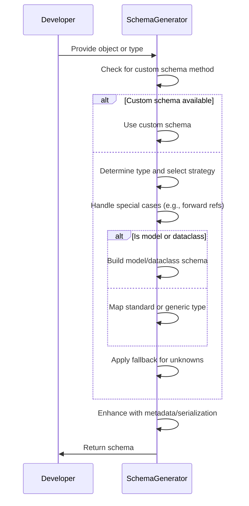
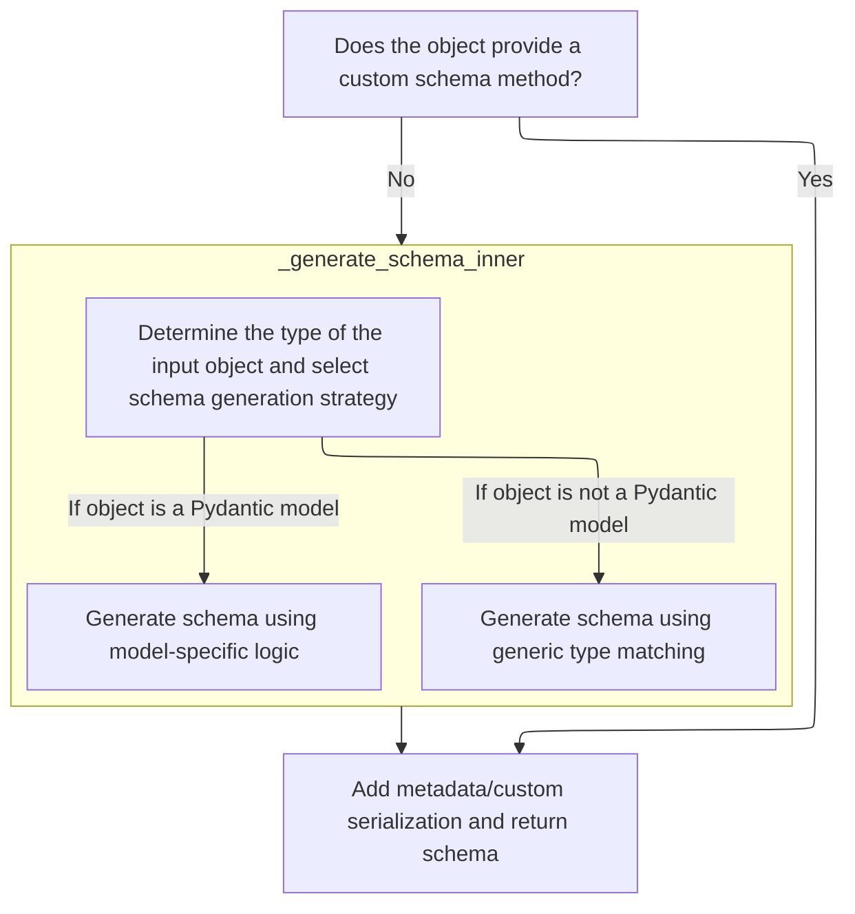
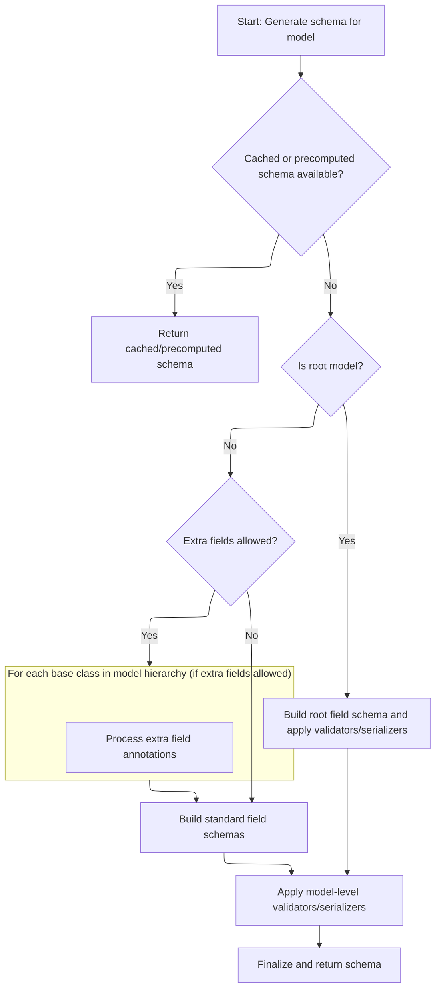
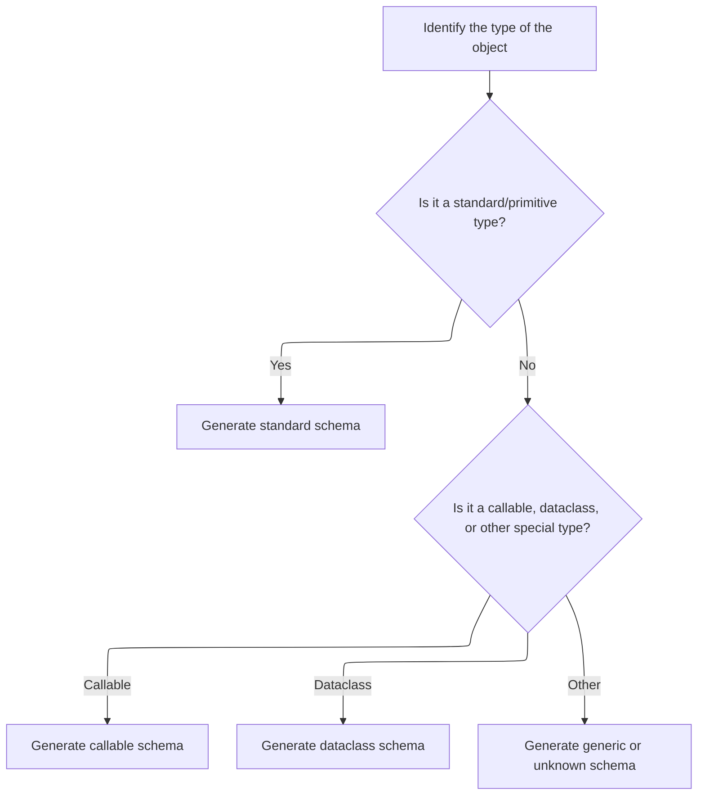
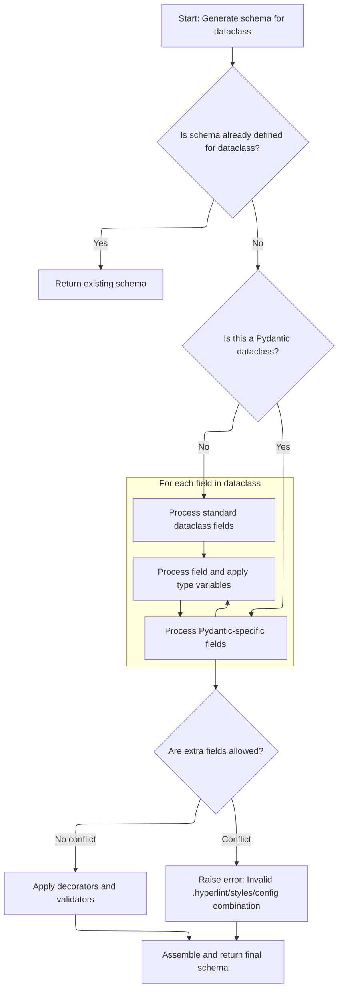
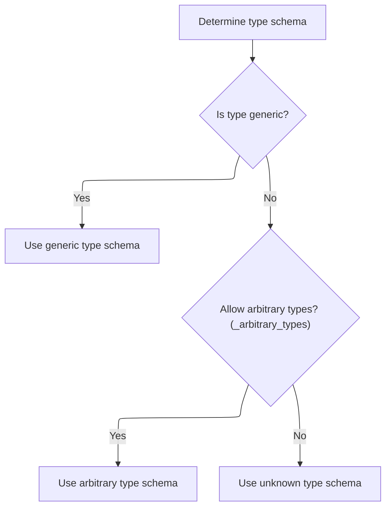
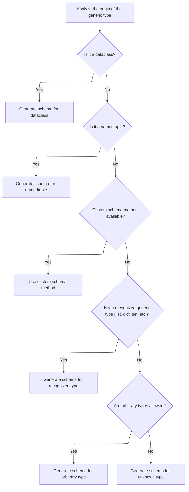
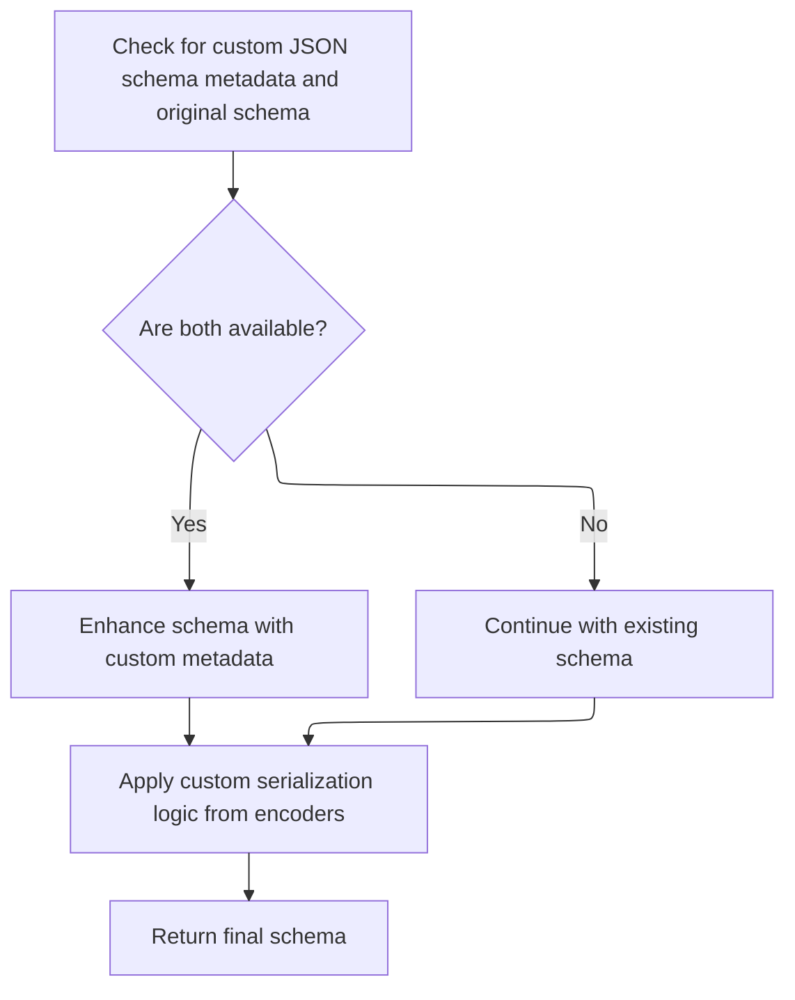

Schema generation creates a validation and serialization schema for any supported Python object or type, allowing Pydantic to validate and serialize data based on type hints and model definitions. The process checks for custom schema methods, handles special cases, builds schemas for models and dataclasses, maps standard types, and applies fallback strategies for generics and unknowns. The final schema is enhanced with custom metadata and serialization logic before being returned.



# Spec

## Detailed View of the Program's Functionality

a. Starting Schema Generation

The schema generation process begins by checking if the object to be processed provides a custom schema method. This is done by looking for a special method on the object that allows it to define its own schema. If such a method exists and is not the default one from the base model, it is called to obtain the schema. If the schema is not provided by the object, the process continues with internal logic to generate the schema.

b. Handling Special and Recursive Types

If the object does not provide a custom schema, the internal schema generation logic is invoked. This logic first checks for special cases:

- If the object represents a self-referential type, it resolves it to the appropriate type.
- If the object is an annotated type, it processes the annotations and applies them to the schema.
- If the object is already a dictionary, it is assumed to be a valid schema and returned as-is.
- If the object is a string, it is treated as a forward reference and resolved accordingly.
- If the object is a forward reference, it is resolved and schema generation is restarted for the resolved type.

After handling these cases, the logic checks if the object is a Pydantic model or a recursive reference:

- If it is a Pydantic model, it is pushed onto a stack to track recursion, and model-specific schema generation logic is invoked.
- If it is a recursive reference, a reference schema is returned.

If none of these cases match, the process falls back to type-based schema mapping.

c. Building Model Schemas

When generating a schema for a Pydantic model, the process first checks if a cached or precomputed schema is available. If so, it is returned immediately. If not, the following steps are performed:

- Custom schemas are checked and used if present.
- A configuration context is set up for the model.
- Model fields are gathered, and if necessary, rebuilt (especially in cases involving generics or forward references).
- Decorators (validators, serializers, etc.) are collected and checked to ensure they reference valid fields.
- If extra fields are allowed by the model's configuration, the process iterates through the model's base classes to find and process extra field annotations, generating schemas for their types as needed.
- For root models, a root field schema is built and model-level validators/serializers are applied.
- For standard models, schemas for each field are built, and any computed fields or extra fields are included as needed.
- Model-level validators and serializers are applied to the schema.
- The final schema is wrapped in a reference schema to support reuse and recursion.

d. Fallback for Unmatched Types

If the object is not a model or recursive reference, and none of the special cases apply, the process falls back to matching the object's type against known types. This is handled by a series of conditional checks that map standard Python types and collections to their corresponding schemas. For types like <SwmToken path="pydantic/_internal/_generate_schema.py" pos="1111:3:3" line-data="            # NewType, can&#39;t use isinstance because it fails &lt;3.10">`NewType`</SwmToken> and Final, the underlying type is processed recursively.

e. Type-Based Schema Mapping

The type-matching logic covers a wide range of standard and special types:

- Primitive types (str, int, float, bool, etc.) are mapped to their respective schemas.
- Standard library types (datetime, Decimal, UUID, etc.) are mapped accordingly.
- Collection types (list, set, dict, tuple, etc.) are handled by generating schemas for their item types.
- Special types like Any, object, None, and pattern types are handled.
- If the type is a callable, enum, or zone info, specialized schema builders are invoked.
- If the type is a dataclass, the dataclass schema builder is called.

f. Generating Dataclass Schemas

When generating a schema for a dataclass, the process checks for an existing schema or reference. If not found, it:

- Handles type variable mappings for generics.
- Sets up the configuration context.
- Collects or rebuilds fields as needed, ensuring the schema matches the dataclass structure.
- Validates configuration, especially regarding extra fields and field initialization.
- Collects decorators and applies them.
- Builds argument schemas for the dataclass fields.
- Applies validators and serializers.
- Returns a reference schema representing the dataclass, including all validation logic.

g. Handling Generics and Unknowns

If the object is a generic type (<SwmToken path="pydantic/_internal/_generate_schema.py" pos="1033:18:20" line-data="        boilerplate before calling into the user-facing method (e.g. `GenerateSchema._tuple_schema`).">`e.g`</SwmToken>., List\[int\], Dict\[str, float\]), the process analyzes the origin of the generic:

- If the origin is a dataclass or namedtuple, their respective schema builders are called.
- If a custom schema method is available on the origin, it is used.
- If the origin is a recognized generic type (list, dict, set, etc.), the appropriate schema builder is called with the correct type arguments.
- If arbitrary types are allowed, an arbitrary type schema is generated.
- If none of these cases match, an unknown type schema is generated, which raises an error.

h. Handling Generic Type Schemas

For generic types, the process checks for dataclass or namedtuple origins first, then for custom schema methods. If none are found, it checks for unions, collections, and other generics, delegating to their specific schema builders. If nothing matches, it falls back to arbitrary or unknown type handling.

i. Finalizing and Customizing the Schema

After the schema is generated, the process checks for custom JSON schema metadata and original schema information. If both are available, the schema is enhanced with custom metadata. Custom serialization logic from JSON encoders is also applied if configured. Finally, the fully constructed schema, including all metadata and serialization hooks, is returned as the result of the schema generation process.

# Rule Definition

| Paragraph Name                                                                                         | Rule ID | Category          | Description                                                                                                                                                                                                                                                                                                                                                                                                                                                        | Conditions                                                                                        | Remarks                                                                                                                                                                                                                                                                                                                                                                                           |
| ------------------------------------------------------------------------------------------------------ | ------- | ----------------- | ------------------------------------------------------------------------------------------------------------------------------------------------------------------------------------------------------------------------------------------------------------------------------------------------------------------------------------------------------------------------------------------------------------------------------------------------------------------ | ------------------------------------------------------------------------------------------------- | ------------------------------------------------------------------------------------------------------------------------------------------------------------------------------------------------------------------------------------------------------------------------------------------------------------------------------------------------------------------------------------------------- |
| GenerateSchema.generate_schema                                                                         | RL-001  | Conditional Logic | When generating a schema for an input object, the system must first check if the object provides a custom schema method (such as **get_pydantic_core_schema**). If present, this method must be used to generate the schema, incorporating any custom metadata and serialization logic provided by the object. If not present, the system falls back to internal schema generation logic.                                                                          | Input object is provided to schema generation; object may or may not have a custom schema method. | Custom schema method is typically **get_pydantic_core_schema**. If present, its output is used as the schema, and any custom JSON schema metadata or serialization logic is incorporated. If not present, fallback logic is used.                                                                                                                                                                 |
| GenerateSchema.\_generate_schema_inner, GenerateSchema.match_type, GenerateSchema.\_match_generic_type | RL-002  | Conditional Logic | If no custom schema method is present, the system must generate the schema using internal logic. This logic must support Pydantic models, standard Python types (int, str, etc.), collections (list, dict, set, etc.), dataclasses, callable types, generic types, namedtuples, and arbitrary/unknown types (with configuration to allow/disallow).                                                                                                                | Input object does not have a custom schema method.                                                | Supported types include: Pydantic models, standard types, collections, dataclasses, callables, generics, namedtuples, arbitrary/unknown types. Configuration option <SwmToken path="pydantic/_internal/_generate_schema.py" pos="374:7:7" line-data="        return self._config_wrapper.arbitrary_types_allowed">`arbitrary_types_allowed`</SwmToken> governs whether unknown types are allowed. |
| GenerateSchema.\_model_schema                                                                          | RL-003  | Data Assignment   | For Pydantic-style models, the generated schema must be a nested map/object with a specific structure: a top-level schema of type <SwmToken path="pydantic/_internal/_generate_schema.py" pos="924:18:20" line-data="            # Note: if schema is of type `&#39;definition-ref&#39;`, we might want to copy it as a">`definition-ref`</SwmToken> referencing the model name, and a corresponding model definition with required keys and nested field schemas. | Input object is a Pydantic model.                                                                 | Schema structure:                                                                                                                                                                                                                                                                                                                                                                                 |

- Top-level: {'type': <SwmToken path="pydantic/_internal/_generate_schema.py" pos="924:18:20" line-data="            # Note: if schema is of type `&#39;definition-ref&#39;`, we might want to copy it as a">`definition-ref`</SwmToken>, <SwmToken path="pydantic/_internal/_generate_schema.py" pos="1021:7:7" line-data="            return core_schema.definition_reference_schema(schema_ref=obj.type_ref)">`schema_ref`</SwmToken>: <SwmToken path="pydantic/_internal/_generate_schema.py" pos="858:1:1" line-data="                        model_name=cls.__name__,">`model_name`</SwmToken>}
- Model definition: {'type': 'model', 'cls': model class or name, 'schema': {...}, <SwmToken path="pydantic/_internal/_generate_schema.py" pos="833:1:1" line-data="                generic_origin: type[BaseModel] | None = getattr(cls, &#39;__pydantic_generic_metadata__&#39;, {}).get(&#39;origin&#39;)">`generic_origin`</SwmToken>: null or type, <SwmToken path="pydantic/_internal/_generate_schema.py" pos="843:1:1" line-data="                        custom_init=getattr(cls, &#39;__pydantic_custom_init__&#39;, None),">`custom_init`</SwmToken>: null or callable, <SwmToken path="pydantic/_internal/_generate_schema.py" pos="844:1:1" line-data="                        root_model=True,">`root_model`</SwmToken>: bool, <SwmToken path="pydantic/_internal/_generate_schema.py" pos="845:1:1" line-data="                        post_init=getattr(cls, &#39;__pydantic_post_init__&#39;, None),">`post_init`</SwmToken>: null or callable, 'config': {'title': <SwmToken path="pydantic/_internal/_generate_schema.py" pos="858:1:1" line-data="                        model_name=cls.__name__,">`model_name`</SwmToken>}, 'ref': <SwmToken path="pydantic/_internal/_generate_schema.py" pos="858:1:1" line-data="                        model_name=cls.__name__,">`model_name`</SwmToken>}
- Model fields: {'type': 'model-fields', 'fields': <SwmToken path="pydantic/_internal/_generate_schema.py" pos="1858:5:6" line-data="                                f&#39;Field {field_name} has `init=False` and dataclass has config setting `extra=&quot;allow&quot;`. &#39;">`{field_name`</SwmToken>: field_schema, ...}, <SwmToken path="pydantic/_internal/_generate_schema.py" pos="788:1:1" line-data="                computed_fields = decorators.computed_fields">`computed_fields`</SwmToken>: \[\], <SwmToken path="pydantic/_internal/_generate_schema.py" pos="800:1:1" line-data="                extras_schema = None">`extras_schema`</SwmToken>: null, <SwmToken path="pydantic/_internal/_generate_schema.py" pos="801:1:1" line-data="                extras_keys_schema = None">`extras_keys_schema`</SwmToken>: null, <SwmToken path="pydantic/_internal/_generate_schema.py" pos="858:1:1" line-data="                        model_name=cls.__name__,">`model_name`</SwmToken>: <SwmToken path="pydantic/_internal/_generate_schema.py" pos="858:1:1" line-data="                        model_name=cls.__name__,">`model_name`</SwmToken>}
- Each field: {'type': <SwmToken path="pydantic/_internal/_generate_schema.py" pos="2120:4:6" line-data="                code=&#39;model-field-missing-annotation&#39;,">`model-field`</SwmToken>, 'schema': type_schema, ...}
- All fields and keys must be present as described. | | GenerateSchema.\_generate_md_field_schema, GenerateSchema.\_common_field_schema | RL-004 | Data Assignment | For each field in a model, the field schema must include the field name, its type schema (<SwmToken path="pydantic/_internal/_generate_schema.py" pos="1033:18:20" line-data="        boilerplate before calling into the user-facing method (e.g. `GenerateSchema._tuple_schema`).">`e.g`</SwmToken>., {'type': 'int'}), and any additional metadata if present. Metadata may include title, description, examples, deprecation status, and custom JSON schema extensions. | Generating schema for a model field. | Field schema format: {'type': <SwmToken path="pydantic/_internal/_generate_schema.py" pos="2120:4:6" line-data="                code=&#39;model-field-missing-annotation&#39;,">`model-field`</SwmToken>, 'schema': type_schema, ...}. Metadata fields are included if present and not None. Examples are serialized to JSON-compatible format. | | GenerateSchema.\_model_schema, \_Definitions.get_schema_or_ref, \_Definitions.create_definition_reference_schema, \_Definitions.finalize_schema | RL-005 | Conditional Logic | The schema generation system must support references and definitions for recursive and reusable types. This is achieved using <SwmToken path="pydantic/_internal/_generate_schema.py" pos="924:18:20" line-data="            # Note: if schema is of type `&#39;definition-ref&#39;`, we might want to copy it as a">`definition-ref`</SwmToken> schemas and a definitions map, ensuring that recursive types are referenced and not duplicated. | Type is recursive or reusable (<SwmToken path="pydantic/_internal/_generate_schema.py" pos="1033:18:20" line-data="        boilerplate before calling into the user-facing method (e.g. `GenerateSchema._tuple_schema`).">`e.g`</SwmToken>., appears multiple times or references itself). | References use {'type': <SwmToken path="pydantic/_internal/_generate_schema.py" pos="924:18:20" line-data="            # Note: if schema is of type `&#39;definition-ref&#39;`, we might want to copy it as a">`definition-ref`</SwmToken>, <SwmToken path="pydantic/_internal/_generate_schema.py" pos="1021:7:7" line-data="            return core_schema.definition_reference_schema(schema_ref=obj.type_ref)">`schema_ref`</SwmToken>: ref_name}. Definitions map stores schemas by reference name. When finalizing, inlining or keeping references is determined by schema content and usage. | | GenerateSchema.generate_schema, GenerateSchema.\_model_schema, GenerateSchema.\_common_field_schema, \_Definitions.finalize_schema | RL-006 | Computation | The schema must be deterministic (same input and configuration always yields the same output) and extensible (able to support additional field metadata, validators, serializers, computed fields, and configuration options). | Schema is generated for any supported type. | Determinism: output schema structure must not vary for same input and config. Extensibility: schema structure allows for additional metadata, validators, serializers, computed fields, and config options. | | GenerateSchema.generate_schema, GenerateSchema.\_model_schema, GenerateSchema.\_common_field_schema | RL-007 | Conditional Logic | The generated schema must not include any runtime or implementation-specific details. Only structural and validation information required to describe the model and its fields should be present in the output. | Schema is being generated for any supported type. | Schema output must be a nested map/object suitable for JSON serialization. No Python-specific constructs (<SwmToken path="pydantic/_internal/_generate_schema.py" pos="1033:18:20" line-data="        boilerplate before calling into the user-facing method (e.g. `GenerateSchema._tuple_schema`).">`e.g`</SwmToken>., class objects, function references) should be present in the output. |

# User Stories

## User Story 1: Schema generation for all supported types with custom method handling

---

### Story Description:

As a user of the schema generation system, I want the system to generate a schema for any supported input object, using a custom schema method if present, or falling back to internal logic for all supported types, so that I can obtain accurate schemas for a wide variety of Python objects and models.

---

### Business Rule Mapping:

| Rule ID | Paragraph Name                                                                                         | Rule Description                                                                                                                                                                                                                                                                                                                                                                          |
| ------- | ------------------------------------------------------------------------------------------------------ | ----------------------------------------------------------------------------------------------------------------------------------------------------------------------------------------------------------------------------------------------------------------------------------------------------------------------------------------------------------------------------------------- |
| RL-001  | GenerateSchema.generate_schema                                                                         | When generating a schema for an input object, the system must first check if the object provides a custom schema method (such as **get_pydantic_core_schema**). If present, this method must be used to generate the schema, incorporating any custom metadata and serialization logic provided by the object. If not present, the system falls back to internal schema generation logic. |
| RL-002  | GenerateSchema.\_generate_schema_inner, GenerateSchema.match_type, GenerateSchema.\_match_generic_type | If no custom schema method is present, the system must generate the schema using internal logic. This logic must support Pydantic models, standard Python types (int, str, etc.), collections (list, dict, set, etc.), dataclasses, callable types, generic types, namedtuples, and arbitrary/unknown types (with configuration to allow/disallow).                                       |

---

### Relevant Functionality:

- **GenerateSchema.generate_schema**
  1. **RL-001:**
     - If input object has a custom schema method:
       - Call the custom schema method to obtain the schema.
       - Incorporate any custom metadata and serialization logic.
     - Else:
       - Use internal logic to generate the schema based on the object's type.
- **GenerateSchema.\_generate_schema_inner**
  1. **RL-002:**
     - If object is a Pydantic model:
       - Generate model schema.
     - Else if object is a standard type (int, str, etc.):
       - Generate corresponding type schema.
     - Else if object is a collection:
       - Generate schema for collection and its item types.
     - Else if object is a dataclass:
       - Generate schema reflecting dataclass structure.
     - Else if object is a callable:
       - Generate schema for function signature and argument types.
     - Else if object is a generic type:
       - Generate schema representing parameterized type and arguments.
     - Else if object is a namedtuple:
       - Generate schema for namedtuple fields and types.
     - Else if object is arbitrary/unknown type:
       - If configuration allows, generate permissive schema; else, raise error.

## User Story 2: Structured and metadata-rich schema for Pydantic models and recursive types

---

### Story Description:

As a user defining data models, I want the generated schema for Pydantic-style models to have a well-defined nested structure, including references for recursive and reusable types, and for each field to include its type schema and any additional metadata, so that my models are accurately and richly described for validation and documentation purposes.

---

### Business Rule Mapping:

| Rule ID | Paragraph Name                                                                                                                                  | Rule Description                                                                                                                                                                                                                                                                                                                                                                                                                                                            |
| ------- | ----------------------------------------------------------------------------------------------------------------------------------------------- | --------------------------------------------------------------------------------------------------------------------------------------------------------------------------------------------------------------------------------------------------------------------------------------------------------------------------------------------------------------------------------------------------------------------------------------------------------------------------- |
| RL-003  | GenerateSchema.\_model_schema                                                                                                                   | For Pydantic-style models, the generated schema must be a nested map/object with a specific structure: a top-level schema of type <SwmToken path="pydantic/_internal/_generate_schema.py" pos="924:18:20" line-data="            # Note: if schema is of type `&#39;definition-ref&#39;`, we might want to copy it as a">`definition-ref`</SwmToken> referencing the model name, and a corresponding model definition with required keys and nested field schemas.          |
| RL-005  | GenerateSchema.\_model_schema, \_Definitions.get_schema_or_ref, \_Definitions.create_definition_reference_schema, \_Definitions.finalize_schema | The schema generation system must support references and definitions for recursive and reusable types. This is achieved using <SwmToken path="pydantic/_internal/_generate_schema.py" pos="924:18:20" line-data="            # Note: if schema is of type `&#39;definition-ref&#39;`, we might want to copy it as a">`definition-ref`</SwmToken> schemas and a definitions map, ensuring that recursive types are referenced and not duplicated.                            |
| RL-004  | GenerateSchema.\_generate_md_field_schema, GenerateSchema.\_common_field_schema                                                                 | For each field in a model, the field schema must include the field name, its type schema (<SwmToken path="pydantic/_internal/_generate_schema.py" pos="1033:18:20" line-data="        boilerplate before calling into the user-facing method (e.g. `GenerateSchema._tuple_schema`).">`e.g`</SwmToken>., {'type': 'int'}), and any additional metadata if present. Metadata may include title, description, examples, deprecation status, and custom JSON schema extensions. |

---

### Relevant Functionality:

- **GenerateSchema.\_model_schema**
  1. **RL-003:**
     - Create a schema reference for the model name.
     - Define the model schema with required keys and nested structure.
     - For each field, generate a field schema including type and metadata.
     - Include <SwmToken path="pydantic/_internal/_generate_schema.py" pos="788:1:1" line-data="                computed_fields = decorators.computed_fields">`computed_fields`</SwmToken>, <SwmToken path="pydantic/_internal/_generate_schema.py" pos="800:1:1" line-data="                extras_schema = None">`extras_schema`</SwmToken>, <SwmToken path="pydantic/_internal/_generate_schema.py" pos="801:1:1" line-data="                extras_keys_schema = None">`extras_keys_schema`</SwmToken> as required.
     - Attach config with at least 'title' set to model name.
     - Return the schema as a nested map/object.
  2. **RL-005:**
     - When encountering a referenceable type:
       - If already seen, yield a <SwmToken path="pydantic/_internal/_generate_schema.py" pos="924:18:20" line-data="            # Note: if schema is of type `&#39;definition-ref&#39;`, we might want to copy it as a">`definition-ref`</SwmToken> schema.
       - Else, generate and store the schema in the definitions map.
     - When finalizing schema:
       - Inline or keep references based on usage and metadata.
       - Ensure recursive types are referenced, not duplicated.
- **GenerateSchema.\_generate_md_field_schema**
  1. **RL-004:**
     - For each field:
       - Generate type schema for the field's type.
       - Collect metadata (title, description, examples, deprecated, etc.).
       - Include metadata in the field schema if present.
       - Attach any custom JSON schema extensions or serialization logic.

## User Story 3: Deterministic, extensible, and implementation-agnostic schema output

---

### Story Description:

As a consumer of the generated schema, I want the schema output to be deterministic, extensible for future needs, and free from runtime or implementation-specific details, so that I can reliably use the schema for validation, documentation, and interoperability across different systems.

---

### Business Rule Mapping:

| Rule ID | Paragraph Name                                                                                                                     | Rule Description                                                                                                                                                                                                               |
| ------- | ---------------------------------------------------------------------------------------------------------------------------------- | ------------------------------------------------------------------------------------------------------------------------------------------------------------------------------------------------------------------------------ |
| RL-006  | GenerateSchema.generate_schema, GenerateSchema.\_model_schema, GenerateSchema.\_common_field_schema, \_Definitions.finalize_schema | The schema must be deterministic (same input and configuration always yields the same output) and extensible (able to support additional field metadata, validators, serializers, computed fields, and configuration options). |
| RL-007  | GenerateSchema.generate_schema, GenerateSchema.\_model_schema, GenerateSchema.\_common_field_schema                                | The generated schema must not include any runtime or implementation-specific details. Only structural and validation information required to describe the model and its fields should be present in the output.                |

---

### Relevant Functionality:

- **GenerateSchema.generate_schema**
  1. **RL-006:**
     - Ensure schema generation logic is order-independent and consistent.
     - Allow for additional metadata and extensions in schema objects.
     - Support validators, serializers, computed fields, and config options as needed.
  2. **RL-007:**
     - When building schema objects:
       - Exclude runtime-only or implementation-specific data.
       - Ensure all schema content is serializable and structural.
       - Only include information necessary for describing structure and validation.

# Code Walkthrough

## Starting schema generation



<SwmSnippet path="/pydantic/_internal/_generate_schema.py" line="697">

---

In <SwmToken path="pydantic/_internal/_generate_schema.py" pos="697:3:3" line-data="    def generate_schema(">`generate_schema`</SwmToken>, we check for a custom schema first, and if it's not there, we call <SwmToken path="pydantic/_internal/_generate_schema.py" pos="724:7:7" line-data="            schema = self._generate_schema_inner(obj)">`_generate_schema_inner`</SwmToken> to handle the rest.

```python
    def generate_schema(
        self,
        obj: Any,
    ) -> core_schema.CoreSchema:
        """Generate core schema.

        Args:
            obj: The object to generate core schema for.

        Returns:
            The generated core schema.

        Raises:
            PydanticUndefinedAnnotation:
                If it is not possible to evaluate forward reference.
            PydanticSchemaGenerationError:
                If it is not possible to generate pydantic-core schema.
            TypeError:
                - If `alias_generator` returns a disallowed type (must be str, AliasPath or AliasChoices).
                - If V1 style validator with `each_item=True` applied on a wrong field.
            PydanticUserError:
                - If `typing.TypedDict` is used instead of `typing_extensions.TypedDict` on Python < 3.12.
                - If `__modify_schema__` method is used instead of `__get_pydantic_json_schema__`.
        """
        schema = self._generate_schema_from_get_schema_method(obj, obj)

        if schema is None:
            schema = self._generate_schema_inner(obj)

```

---

</SwmSnippet>

### Handling special and recursive types

```mermaid
%%{init: {"flowchart": {"defaultRenderer": "elk"}} }%%
flowchart TD
  node1["Determine the type of the input object and select schema generation strategy"]
  click node1 openCode "pydantic/_internal/_generate_schema.py:997:1023"
  node1 -->|"If object is a Pydantic model"| node2["Generate schema using model-specific logic"]
  click node2 openCode "pydantic/_internal/_generate_schema.py:736:1023"
  node1 -->|"If object is not a Pydantic model"| node3["Generate schema using generic type matching"]
  click node3 openCode "pydantic/_internal/_generate_schema.py:1023:1023"


subgraph node2 [_model_schema]
  sgmain_1_node1["Start: Generate schema for model"] --> sgmain_1_node2{"Cached or precomputed schema available?"}
  click sgmain_1_node1 openCode "pydantic/_internal/_generate_schema.py:736:737"
  click sgmain_1_node2 openCode "pydantic/_internal/_generate_schema.py:740:742"
  sgmain_1_node2 -->|"Yes"| sgmain_1_node3["Return cached/precomputed schema"]
  click sgmain_1_node3 openCode "pydantic/_internal/_generate_schema.py:742:743"
  sgmain_1_node2 -->|"No"| sgmain_1_node4{"Is root model?"}
  click sgmain_1_node4 openCode "pydantic/_internal/_generate_schema.py:835:849"
  sgmain_1_node4 -->|"Yes"| sgmain_1_node5["Build root field schema and apply validators/serializers"]
  click sgmain_1_node5 openCode "pydantic/_internal/_generate_schema.py:836:848"
  sgmain_1_node4 -->|"No"| sgmain_1_node6{"Extra fields allowed?"}
  click sgmain_1_node6 openCode "pydantic/_internal/_generate_schema.py:802:831"
  sgmain_1_node6 -->|"Yes"| sgmain_1_loop1
  sgmain_1_node6 -->|"No"| sgmain_1_node8["Build standard field schemas"]
  subgraph sgmain_1_loop1["For each base class in model hierarchy (if extra fields allowed)"]
  sgmain_1_node7["Process extra field annotations"]
  click sgmain_1_node7 openCode "pydantic/_internal/_generate_schema.py:805:831"
  end
  sgmain_1_loop1 --> sgmain_1_node8
  sgmain_1_node8["Build standard field schemas"]
  click sgmain_1_node8 openCode "pydantic/_internal/_generate_schema.py:850:862"
  sgmain_1_node5 --> sgmain_1_node9["Apply model-level validators/serializers"]
  click sgmain_1_node9 openCode "pydantic/_internal/_generate_schema.py:874:875"
  sgmain_1_node8 --> sgmain_1_node9
  sgmain_1_node9 --> sgmain_1_node10["Finalize and return schema"]
  click sgmain_1_node10 openCode "pydantic/_internal/_generate_schema.py:876:876"
end

%% Swimm:
%% %%{init: {"flowchart": {"defaultRenderer": "elk"}} }%%
%% flowchart TD
%%   node1["Determine the type of the input object and select schema generation strategy"]
%%   click node1 openCode "<SwmPath>[pydantic/\_internal/\_generate_schema.py](pydantic/_internal/_generate_schema.py)</SwmPath>:997:1023"
%%   node1 -->|"If object is a Pydantic model"| node2["Generate schema using model-specific logic"]
%%   click node2 openCode "<SwmPath>[pydantic/\_internal/\_generate_schema.py](pydantic/_internal/_generate_schema.py)</SwmPath>:736:1023"
%%   node1 -->|"If object is not a Pydantic model"| node3["Generate schema using generic type matching"]
%%   click node3 openCode "<SwmPath>[pydantic/\_internal/\_generate_schema.py](pydantic/_internal/_generate_schema.py)</SwmPath>:1023:1023"
%% 
%% 
%% subgraph node2 [<SwmToken path="pydantic/_internal/_generate_schema.py" pos="736:3:3" line-data="    def _model_schema(self, cls: type[BaseModel]) -&gt; core_schema.CoreSchema:">`_model_schema`</SwmToken>]
%%   sgmain_1_node1["Start: Generate schema for model"] --> sgmain_1_node2{"Cached or precomputed schema available?"}
%%   click sgmain_1_node1 openCode "<SwmPath>[pydantic/\_internal/\_generate_schema.py](pydantic/_internal/_generate_schema.py)</SwmPath>:736:737"
%%   click sgmain_1_node2 openCode "<SwmPath>[pydantic/\_internal/\_generate_schema.py](pydantic/_internal/_generate_schema.py)</SwmPath>:740:742"
%%   sgmain_1_node2 -->|"Yes"| sgmain_1_node3["Return cached/precomputed schema"]
%%   click sgmain_1_node3 openCode "<SwmPath>[pydantic/\_internal/\_generate_schema.py](pydantic/_internal/_generate_schema.py)</SwmPath>:742:743"
%%   sgmain_1_node2 -->|"No"| sgmain_1_node4{"Is root model?"}
%%   click sgmain_1_node4 openCode "<SwmPath>[pydantic/\_internal/\_generate_schema.py](pydantic/_internal/_generate_schema.py)</SwmPath>:835:849"
%%   sgmain_1_node4 -->|"Yes"| sgmain_1_node5["Build root field schema and apply validators/serializers"]
%%   click sgmain_1_node5 openCode "<SwmPath>[pydantic/\_internal/\_generate_schema.py](pydantic/_internal/_generate_schema.py)</SwmPath>:836:848"
%%   sgmain_1_node4 -->|"No"| sgmain_1_node6{"Extra fields allowed?"}
%%   click sgmain_1_node6 openCode "<SwmPath>[pydantic/\_internal/\_generate_schema.py](pydantic/_internal/_generate_schema.py)</SwmPath>:802:831"
%%   sgmain_1_node6 -->|"Yes"| sgmain_1_loop1
%%   sgmain_1_node6 -->|"No"| sgmain_1_node8["Build standard field schemas"]
%%   subgraph sgmain_1_loop1["For each base class in model hierarchy (if extra fields allowed)"]
%%   sgmain_1_node7["Process extra field annotations"]
%%   click sgmain_1_node7 openCode "<SwmPath>[pydantic/\_internal/\_generate_schema.py](pydantic/_internal/_generate_schema.py)</SwmPath>:805:831"
%%   end
%%   sgmain_1_loop1 --> sgmain_1_node8
%%   sgmain_1_node8["Build standard field schemas"]
%%   click sgmain_1_node8 openCode "<SwmPath>[pydantic/\_internal/\_generate_schema.py](pydantic/_internal/_generate_schema.py)</SwmPath>:850:862"
%%   sgmain_1_node5 --> sgmain_1_node9["Apply model-level validators/serializers"]
%%   click sgmain_1_node9 openCode "<SwmPath>[pydantic/\_internal/\_generate_schema.py](pydantic/_internal/_generate_schema.py)</SwmPath>:874:875"
%%   sgmain_1_node8 --> sgmain_1_node9
%%   sgmain_1_node9 --> sgmain_1_node10["Finalize and return schema"]
%%   click sgmain_1_node10 openCode "<SwmPath>[pydantic/\_internal/\_generate_schema.py](pydantic/_internal/_generate_schema.py)</SwmPath>:876:876"
%% end
```



<SwmSnippet path="/pydantic/_internal/_generate_schema.py" line="997">

---

In <SwmToken path="pydantic/_internal/_generate_schema.py" pos="997:3:3" line-data="    def _generate_schema_inner(self, obj: Any) -&gt; core_schema.CoreSchema:">`_generate_schema_inner`</SwmToken>, we handle special cases first: self-referential types get resolved, annotated types are processed, dicts are treated as ready-made schemas, and strings are prepped as forward references. If we hit a <SwmToken path="pydantic/_internal/_generate_schema.py" pos="1009:5:5" line-data="            obj = ForwardRef(obj)">`ForwardRef`</SwmToken>, we resolve it and call <SwmToken path="pydantic/_internal/_generate_schema.py" pos="1012:5:5" line-data="            return self.generate_schema(self._resolve_forward_ref(obj))">`generate_schema`</SwmToken> again to handle the actual type. This setup covers a lot of Pydantic's advanced type handling up front.

```python
    def _generate_schema_inner(self, obj: Any) -> core_schema.CoreSchema:
        if typing_objects.is_self(obj):
            obj = self._resolve_self_type(obj)

        if typing_objects.is_annotated(get_origin(obj)):
            return self._annotated_schema(obj)

        if isinstance(obj, dict):
            # we assume this is already a valid schema
            return obj  # type: ignore[return-value]

        if isinstance(obj, str):
            obj = ForwardRef(obj)

        if isinstance(obj, ForwardRef):
            return self.generate_schema(self._resolve_forward_ref(obj))

```

---

</SwmSnippet>

<SwmSnippet path="/pydantic/_internal/_generate_schema.py" line="1014">

---

Back in <SwmToken path="pydantic/_internal/_generate_schema.py" pos="724:7:7" line-data="            schema = self._generate_schema_inner(obj)">`_generate_schema_inner`</SwmToken>, after handling forward refs, we check if the object is a Pydantic model or a recursive reference. If it's a model, we push it to the stack and generate its schema with <SwmToken path="pydantic/_internal/_generate_schema.py" pos="1018:5:5" line-data="                return self._model_schema(obj)">`_model_schema`</SwmToken>. If it's a recursive ref, we return a reference schema. This covers Pydantic's model-specific and recursive cases.

```python
        BaseModel = import_cached_base_model()

        if lenient_issubclass(obj, BaseModel):
            with self.model_type_stack.push(obj):
                return self._model_schema(obj)

        if isinstance(obj, PydanticRecursiveRef):
            return core_schema.definition_reference_schema(schema_ref=obj.type_ref)

```

---

</SwmSnippet>

#### Building model schemas



<SwmSnippet path="/pydantic/_internal/_generate_schema.py" line="736">

---

In <SwmToken path="pydantic/_internal/_generate_schema.py" pos="736:3:3" line-data="    def _model_schema(self, cls: type[BaseModel]) -&gt; core_schema.CoreSchema:">`_model_schema`</SwmToken>, we first check for a cached schema or reference to avoid duplicate work. If not found, we handle custom schemas, set up config context, and gather model fields—rebuilding them if needed. We also validate decorators and handle extra fields if allowed, generating schemas for those as well. Calls to <SwmToken path="pydantic/_internal/_generate_schema.py" pos="827:7:7" line-data="                                extras_keys_schema = self.generate_schema(extra_keys_type)">`generate_schema`</SwmToken> happen when we need to build schemas for extra field types.

```python
    def _model_schema(self, cls: type[BaseModel]) -> core_schema.CoreSchema:
        """Generate schema for a Pydantic model."""
        BaseModel_ = import_cached_base_model()

        with self.defs.get_schema_or_ref(cls) as (model_ref, maybe_schema):
            if maybe_schema is not None:
                return maybe_schema

            schema = cls.__dict__.get('__pydantic_core_schema__')
            if schema is not None and not isinstance(schema, MockCoreSchema):
                if schema['type'] == 'definitions':
                    schema = self.defs.unpack_definitions(schema)
                ref = get_ref(schema)
                if ref:
                    return self.defs.create_definition_reference_schema(schema)
                else:
                    return schema

            config_wrapper = ConfigWrapper(cls.model_config, check=False)

            with self._config_wrapper_stack.push(config_wrapper), self._ns_resolver.push(cls):
                core_config = self._config_wrapper.core_config(title=cls.__name__)

                if cls.__pydantic_fields_complete__ or cls is BaseModel_:
                    fields = getattr(cls, '__pydantic_fields__', {})
                else:
                    if not hasattr(cls, '__pydantic_fields__'):
                        # This happens when we have a loop in the schema generation:
                        # class Base[T](BaseModel):
                        #     t: T
                        #
                        # class Other(BaseModel):
                        #     b: 'Base[Other]'
                        # When we build fields for `Other`, we evaluate the forward annotation.
                        # At this point, `Other` doesn't have the model fields set. We create
                        # `Base[Other]`; model fields are successfully built, and we try to generate
                        # a schema for `t: Other`. As `Other.__pydantic_fields__` aren't set, we abort.
                        raise PydanticUndefinedAnnotation(
                            name=cls.__name__,
                            message=f'Class {cls.__name__!r} is not defined',
                        )
                    try:
                        fields = rebuild_model_fields(
                            cls,
                            config_wrapper=self._config_wrapper,
                            ns_resolver=self._ns_resolver,
                            typevars_map=self._typevars_map or {},
                        )
                    except NameError as e:
                        raise PydanticUndefinedAnnotation.from_name_error(e) from e

                decorators = cls.__pydantic_decorators__
                computed_fields = decorators.computed_fields
                check_decorator_fields_exist(
                    chain(
                        decorators.field_validators.values(),
                        decorators.field_serializers.values(),
                        decorators.validators.values(),
                    ),
                    {*fields.keys(), *computed_fields.keys()},
                )

                model_validators = decorators.model_validators.values()

                extras_schema = None
                extras_keys_schema = None
                if core_config.get('extra_fields_behavior') == 'allow':
                    assert cls.__mro__[0] is cls
                    assert cls.__mro__[-1] is object
                    for candidate_cls in cls.__mro__[:-1]:
                        extras_annotation = getattr(candidate_cls, '__annotations__', {}).get(
                            '__pydantic_extra__', None
                        )
                        if extras_annotation is not None:
                            if isinstance(extras_annotation, str):
                                extras_annotation = _typing_extra.eval_type_backport(
                                    _typing_extra._make_forward_ref(
                                        extras_annotation, is_argument=False, is_class=True
                                    ),
                                    *self._types_namespace,
                                )
                            tp = get_origin(extras_annotation)
                            if tp not in DICT_TYPES:
                                raise PydanticSchemaGenerationError(
                                    'The type annotation for `__pydantic_extra__` must be `dict[str, ...]`'
                                )
                            extra_keys_type, extra_items_type = self._get_args_resolving_forward_refs(
                                extras_annotation,
                                required=True,
                            )
                            if extra_keys_type is not str:
                                extras_keys_schema = self.generate_schema(extra_keys_type)
                            if not typing_objects.is_any(extra_items_type):
                                extras_schema = self.generate_schema(extra_items_type)
                            if extras_keys_schema is not None or extras_schema is not None:
                                break

```

---

</SwmSnippet>

<SwmSnippet path="/pydantic/_internal/_generate_schema.py" line="833">

---

After generating any needed field or extra field schemas in <SwmToken path="pydantic/_internal/_generate_schema.py" pos="736:3:3" line-data="    def _model_schema(self, cls: type[BaseModel]) -&gt; core_schema.CoreSchema:">`_model_schema`</SwmToken>, we handle generic and root models, build the inner schema, apply validators and serializers, and finally wrap everything in a definition reference schema for reuse and recursion support.

```python
                generic_origin: type[BaseModel] | None = getattr(cls, '__pydantic_generic_metadata__', {}).get('origin')

                if cls.__pydantic_root_model__:
                    root_field = self._common_field_schema('root', fields['root'], decorators)
                    inner_schema = root_field['schema']
                    inner_schema = apply_model_validators(inner_schema, model_validators, 'inner')
                    model_schema = core_schema.model_schema(
                        cls,
                        inner_schema,
                        generic_origin=generic_origin,
                        custom_init=getattr(cls, '__pydantic_custom_init__', None),
                        root_model=True,
                        post_init=getattr(cls, '__pydantic_post_init__', None),
                        config=core_config,
                        ref=model_ref,
                    )
                else:
                    fields_schema: core_schema.CoreSchema = core_schema.model_fields_schema(
                        {k: self._generate_md_field_schema(k, v, decorators) for k, v in fields.items()},
                        computed_fields=[
                            self._computed_field_schema(d, decorators.field_serializers)
                            for d in computed_fields.values()
                        ],
                        extras_schema=extras_schema,
                        extras_keys_schema=extras_keys_schema,
                        model_name=cls.__name__,
                    )
                    inner_schema = apply_validators(fields_schema, decorators.root_validators.values())
                    inner_schema = apply_model_validators(inner_schema, model_validators, 'inner')

                    model_schema = core_schema.model_schema(
                        cls,
                        inner_schema,
                        generic_origin=generic_origin,
                        custom_init=getattr(cls, '__pydantic_custom_init__', None),
                        root_model=False,
                        post_init=getattr(cls, '__pydantic_post_init__', None),
                        config=core_config,
                        ref=model_ref,
                    )

                schema = self._apply_model_serializers(model_schema, decorators.model_serializers.values())
                schema = apply_model_validators(schema, model_validators, 'outer')
                return self.defs.create_definition_reference_schema(schema)
```

---

</SwmSnippet>

#### Fallback for unmatched types

<SwmSnippet path="/pydantic/_internal/_generate_schema.py" line="1023">

---

After handling models and recursive refs in <SwmToken path="pydantic/_internal/_generate_schema.py" pos="724:7:7" line-data="            schema = self._generate_schema_inner(obj)">`_generate_schema_inner`</SwmToken>, anything not matched so far gets passed to <SwmToken path="pydantic/_internal/_generate_schema.py" pos="1023:5:5" line-data="        return self.match_type(obj)">`match_type`</SwmToken>, which handles the rest of the type cases.

```python
        return self.match_type(obj)
```

---

</SwmSnippet>

### Type-based schema mapping



<SwmSnippet path="/pydantic/_internal/_generate_schema.py" line="1025">

---

In <SwmToken path="pydantic/_internal/_generate_schema.py" pos="1025:3:3" line-data="    def match_type(self, obj: Any) -&gt; core_schema.CoreSchema:  # noqa: C901">`match_type`</SwmToken>, we map standard Python types and collections to their schemas. For <SwmToken path="pydantic/_internal/_generate_schema.py" pos="1111:3:3" line-data="            # NewType, can&#39;t use isinstance because it fails &lt;3.10">`NewType`</SwmToken> and Final, we call <SwmToken path="pydantic/_internal/_generate_schema.py" pos="1112:5:5" line-data="            return self.generate_schema(obj.__supertype__)">`generate_schema`</SwmToken> again to handle their underlying types, making sure we cover all the type details.

```python
    def match_type(self, obj: Any) -> core_schema.CoreSchema:  # noqa: C901
        """Main mapping of types to schemas.

        The general structure is a series of if statements starting with the simple cases
        (non-generic primitive types) and then handling generics and other more complex cases.

        Each case either generates a schema directly, calls into a public user-overridable method
        (like `GenerateSchema.tuple_variable_schema`) or calls into a private method that handles some
        boilerplate before calling into the user-facing method (e.g. `GenerateSchema._tuple_schema`).

        The idea is that we'll evolve this into adding more and more user facing methods over time
        as they get requested and we figure out what the right API for them is.
        """
        if obj is str:
            return core_schema.str_schema()
        elif obj is bytes:
            return core_schema.bytes_schema()
        elif obj is int:
            return core_schema.int_schema()
        elif obj is float:
            return core_schema.float_schema()
        elif obj is bool:
            return core_schema.bool_schema()
        elif obj is complex:
            return core_schema.complex_schema()
        elif typing_objects.is_any(obj) or obj is object:
            return core_schema.any_schema()
        elif obj is datetime.date:
            return core_schema.date_schema()
        elif obj is datetime.datetime:
            return core_schema.datetime_schema()
        elif obj is datetime.time:
            return core_schema.time_schema()
        elif obj is datetime.timedelta:
            return core_schema.timedelta_schema()
        elif obj is Decimal:
            return core_schema.decimal_schema()
        elif obj is UUID:
            return core_schema.uuid_schema()
        elif obj is Url:
            return core_schema.url_schema()
        elif obj is Fraction:
            return self._fraction_schema()
        elif obj is MultiHostUrl:
            return core_schema.multi_host_url_schema()
        elif obj is None or obj is _typing_extra.NoneType:
            return core_schema.none_schema()
        if obj is MISSING:
            return core_schema.missing_sentinel_schema()
        elif obj in IP_TYPES:
            return self._ip_schema(obj)
        elif obj in TUPLE_TYPES:
            return self._tuple_schema(obj)
        elif obj in LIST_TYPES:
            return self._list_schema(Any)
        elif obj in SET_TYPES:
            return self._set_schema(Any)
        elif obj in FROZEN_SET_TYPES:
            return self._frozenset_schema(Any)
        elif obj in SEQUENCE_TYPES:
            return self._sequence_schema(Any)
        elif obj in ITERABLE_TYPES:
            return self._iterable_schema(obj)
        elif obj in DICT_TYPES:
            return self._dict_schema(Any, Any)
        elif obj in PATH_TYPES:
            return self._path_schema(obj, Any)
        elif obj in DEQUE_TYPES:
            return self._deque_schema(Any)
        elif obj in MAPPING_TYPES:
            return self._mapping_schema(obj, Any, Any)
        elif obj in COUNTER_TYPES:
            return self._mapping_schema(obj, Any, int)
        elif typing_objects.is_typealiastype(obj):
            return self._type_alias_type_schema(obj)
        elif obj is type:
            return self._type_schema()
        elif _typing_extra.is_callable(obj):
            return core_schema.callable_schema()
        elif typing_objects.is_literal(get_origin(obj)):
            return self._literal_schema(obj)
        elif is_typeddict(obj):
            return self._typed_dict_schema(obj, None)
        elif _typing_extra.is_namedtuple(obj):
            return self._namedtuple_schema(obj, None)
        elif typing_objects.is_newtype(obj):
            # NewType, can't use isinstance because it fails <3.10
            return self.generate_schema(obj.__supertype__)
        elif obj in PATTERN_TYPES:
            return self._pattern_schema(obj)
        elif _typing_extra.is_hashable(obj):
            return self._hashable_schema()
        elif isinstance(obj, typing.TypeVar):
            return self._unsubstituted_typevar_schema(obj)
        elif _typing_extra.is_finalvar(obj):
            if obj is Final:
                return core_schema.any_schema()
            return self.generate_schema(
                self._get_first_arg_or_any(obj),
            )
        elif isinstance(obj, VALIDATE_CALL_SUPPORTED_TYPES):
```

---

</SwmSnippet>

<SwmSnippet path="/pydantic/_internal/_generate_schema.py" line="1126">

---

Back in <SwmToken path="pydantic/_internal/_generate_schema.py" pos="1023:5:5" line-data="        return self.match_type(obj)">`match_type`</SwmToken>, after handling type wrappers, if we hit a callable type, we delegate to <SwmToken path="pydantic/_internal/_generate_schema.py" pos="1126:5:5" line-data="            return self._call_schema(obj)">`_call_schema`</SwmToken> to build the right validation schema for function calls.

```python
            return self._call_schema(obj)
        elif inspect.isclass(obj) and issubclass(obj, Enum):
            return self._enum_schema(obj)
        elif obj is ZoneInfo:
            return self._zoneinfo_schema()

```

---

</SwmSnippet>

#### Building function call schemas

See <SwmLink doc-title="Building a validation schema for function calls">[Building a validation schema for function calls](/.swm/building-a-validation-schema-for-function-calls.ob3r65jx.sw.md)</SwmLink>

#### Handling dataclasses

<SwmSnippet path="/pydantic/_internal/_generate_schema.py" line="1132">

---

After handling callables in <SwmToken path="pydantic/_internal/_generate_schema.py" pos="1023:5:5" line-data="        return self.match_type(obj)">`match_type`</SwmToken>, if the object is a dataclass type, we call <SwmToken path="pydantic/_internal/_generate_schema.py" pos="1135:5:5" line-data="            return self._dataclass_schema(obj, None)  # pyright: ignore[reportArgumentType]">`_dataclass_schema`</SwmToken> to build its schema, making sure we handle all the dataclass-specific details.

```python
        # dataclasses.is_dataclass coerces dc instances to types, but we only handle
        # the case of a dc type here
        if dataclasses.is_dataclass(obj):
            return self._dataclass_schema(obj, None)  # pyright: ignore[reportArgumentType]

```

---

</SwmSnippet>

#### Generating dataclass schemas



<SwmSnippet path="/pydantic/_internal/_generate_schema.py" line="1788">

---

In <SwmToken path="pydantic/_internal/_generate_schema.py" pos="1788:3:3" line-data="    def _dataclass_schema(">`_dataclass_schema`</SwmToken>, we first check for a pre-existing schema or reference. If not found, we handle type variable mappings for generics, set up config context, and collect or rebuild fields as needed, making sure the schema matches the actual dataclass structure.

```python
    def _dataclass_schema(
        self, dataclass: type[StandardDataclass], origin: type[StandardDataclass] | None
    ) -> core_schema.CoreSchema:
        """Generate schema for a dataclass."""
        with (
            self.model_type_stack.push(dataclass),
            self.defs.get_schema_or_ref(dataclass) as (
                dataclass_ref,
                maybe_schema,
            ),
        ):
            if maybe_schema is not None:
                return maybe_schema

            schema = dataclass.__dict__.get('__pydantic_core_schema__')
            if schema is not None and not isinstance(schema, MockCoreSchema):
                if schema['type'] == 'definitions':
                    schema = self.defs.unpack_definitions(schema)
                ref = get_ref(schema)
                if ref:
                    return self.defs.create_definition_reference_schema(schema)
                else:
                    return schema

            typevars_map = get_standard_typevars_map(dataclass)
            if origin is not None:
                dataclass = origin

            # if (plain) dataclass doesn't have config, we use the parent's config, hence a default of `None`
            # (Pydantic dataclasses have an empty dict config by default).
            # see https://github.com/pydantic/pydantic/issues/10917
            config = getattr(dataclass, '__pydantic_config__', None)

            from ..dataclasses import is_pydantic_dataclass

            with self._ns_resolver.push(dataclass), self._config_wrapper_stack.push(config):
                if is_pydantic_dataclass(dataclass):
                    if dataclass.__pydantic_fields_complete__():
                        # Copy the field info instances to avoid mutating the `FieldInfo` instances
                        # of the generic dataclass generic origin (e.g. `apply_typevars_map` below).
                        # Note that we don't apply `deepcopy` on `__pydantic_fields__` because we
                        # don't want to copy the `FieldInfo` attributes:
                        fields = {
                            f_name: copy(field_info) for f_name, field_info in dataclass.__pydantic_fields__.items()
                        }
                        if typevars_map:
                            for field in fields.values():
                                field.apply_typevars_map(typevars_map, *self._types_namespace)
```

---

</SwmSnippet>

<SwmSnippet path="/pydantic/_internal/_generate_schema.py" line="1835">

---

After gathering fields and decorators in <SwmToken path="pydantic/_internal/_generate_schema.py" pos="1135:5:5" line-data="            return self._dataclass_schema(obj, None)  # pyright: ignore[reportArgumentType]">`_dataclass_schema`</SwmToken>, we validate config, build argument schemas, apply validators and serializers, and return a reference schema that fully represents the dataclass, including all validation logic.

```python
                                field.apply_typevars_map(typevars_map, *self._types_namespace)
                    else:
                        try:
                            fields = rebuild_dataclass_fields(
                                dataclass,
                                config_wrapper=self._config_wrapper,
                                ns_resolver=self._ns_resolver,
                                typevars_map=typevars_map or {},
                            )
                        except NameError as e:
                            raise PydanticUndefinedAnnotation.from_name_error(e) from e
                else:
                    fields = collect_dataclass_fields(
                        dataclass,
                        typevars_map=typevars_map,
                        config_wrapper=self._config_wrapper,
                    )

                if self._config_wrapper.extra == 'allow':
                    # disallow combination of init=False on a dataclass field and extra='allow' on a dataclass
                    for field_name, field in fields.items():
                        if field.init is False:
                            raise PydanticUserError(
                                f'Field {field_name} has `init=False` and dataclass has config setting `extra="allow"`. '
                                f'This combination is not allowed.',
                                code='dataclass-init-false-extra-allow',
                            )

                decorators = dataclass.__dict__.get('__pydantic_decorators__')
                if decorators is None:
                    decorators = DecoratorInfos.build(dataclass)
                    decorators.update_from_config(self._config_wrapper)
                # Move kw_only=False args to the start of the list, as this is how vanilla dataclasses work.
                # Note that when kw_only is missing or None, it is treated as equivalent to kw_only=True
                args = sorted(
                    (self._generate_dc_field_schema(k, v, decorators) for k, v in fields.items()),
                    key=lambda a: a.get('kw_only') is not False,
                )
                has_post_init = hasattr(dataclass, '__post_init__')
                has_slots = hasattr(dataclass, '__slots__')

                args_schema = core_schema.dataclass_args_schema(
                    dataclass.__name__,
                    args,
                    computed_fields=[
                        self._computed_field_schema(d, decorators.field_serializers)
                        for d in decorators.computed_fields.values()
                    ],
                    collect_init_only=has_post_init,
                )

                inner_schema = apply_validators(args_schema, decorators.root_validators.values())

                model_validators = decorators.model_validators.values()
                inner_schema = apply_model_validators(inner_schema, model_validators, 'inner')

                core_config = self._config_wrapper.core_config(title=dataclass.__name__)

                dc_schema = core_schema.dataclass_schema(
                    dataclass,
                    inner_schema,
                    generic_origin=origin,
                    post_init=has_post_init,
                    ref=dataclass_ref,
                    fields=[field.name for field in dataclasses.fields(dataclass)],
                    slots=has_slots,
                    config=core_config,
                    # we don't use a custom __setattr__ for dataclasses, so we must
                    # pass along the frozen config setting to the pydantic-core schema
                    frozen=self._config_wrapper_stack.tail.frozen,
                )
                schema = self._apply_model_serializers(dc_schema, decorators.model_serializers.values())
                schema = apply_model_validators(schema, model_validators, 'outer')
                return self.defs.create_definition_reference_schema(schema)
```

---

</SwmSnippet>

#### Handling generics and unknowns



<SwmSnippet path="/pydantic/_internal/_generate_schema.py" line="1137">

---

After dataclasses in <SwmToken path="pydantic/_internal/_generate_schema.py" pos="1023:5:5" line-data="        return self.match_type(obj)">`match_type`</SwmToken>, if the object has a generic origin, we call <SwmToken path="pydantic/_internal/_generate_schema.py" pos="1139:5:5" line-data="            return self._match_generic_type(obj, origin)">`_match_generic_type`</SwmToken> to handle parameterized types. If not, we fall back to arbitrary or unknown type handling.

```python
        origin = get_origin(obj)
        if origin is not None:
            return self._match_generic_type(obj, origin)

        if self._arbitrary_types:
            return self._arbitrary_type_schema(obj)
        return self._unknown_type_schema(obj)
```

---

</SwmSnippet>

### Handling generic type schemas



<SwmSnippet path="/pydantic/_internal/_generate_schema.py" line="1145">

---

In <SwmToken path="pydantic/_internal/_generate_schema.py" pos="1145:3:3" line-data="    def _match_generic_type(self, obj: Any, origin: Any) -&gt; CoreSchema:  # noqa: C901">`_match_generic_type`</SwmToken>, we check if the origin is a dataclass or namedtuple and delegate to their schema builders first, since generic aliases can lose parameter info if we don't handle them up front.

```python
    def _match_generic_type(self, obj: Any, origin: Any) -> CoreSchema:  # noqa: C901
        # Need to handle generic dataclasses before looking for the schema properties because attribute accesses
        # on _GenericAlias delegate to the origin type, so lose the information about the concrete parametrization
        # As a result, currently, there is no way to cache the schema for generic dataclasses. This may be possible
        # to resolve by modifying the value returned by `Generic.__class_getitem__`, but that is a dangerous game.
        if dataclasses.is_dataclass(origin):
            return self._dataclass_schema(obj, origin)  # pyright: ignore[reportArgumentType]
        if _typing_extra.is_namedtuple(origin):
            return self._namedtuple_schema(obj, origin)

```

---

</SwmSnippet>

<SwmSnippet path="/pydantic/_internal/_generate_schema.py" line="1155">

---

After handling dataclasses and namedtuples in <SwmToken path="pydantic/_internal/_generate_schema.py" pos="1139:5:5" line-data="            return self._match_generic_type(obj, origin)">`_match_generic_type`</SwmToken>, we check for custom schemas, then handle unions, collections, and other generics by delegating to their specific schema builders. If nothing matches, we fall back to arbitrary or unknown type handling.

```python
        schema = self._generate_schema_from_get_schema_method(origin, obj)
        if schema is not None:
            return schema

        if typing_objects.is_typealiastype(origin):
            return self._type_alias_type_schema(obj)
        elif is_union_origin(origin):
            return self._union_schema(obj)
        elif origin in TUPLE_TYPES:
            return self._tuple_schema(obj)
        elif origin in LIST_TYPES:
            return self._list_schema(self._get_first_arg_or_any(obj))
        elif origin in SET_TYPES:
            return self._set_schema(self._get_first_arg_or_any(obj))
        elif origin in FROZEN_SET_TYPES:
            return self._frozenset_schema(self._get_first_arg_or_any(obj))
        elif origin in DICT_TYPES:
            return self._dict_schema(*self._get_first_two_args_or_any(obj))
        elif origin in PATH_TYPES:
            return self._path_schema(origin, self._get_first_arg_or_any(obj))
        elif origin in DEQUE_TYPES:
            return self._deque_schema(self._get_first_arg_or_any(obj))
        elif origin in MAPPING_TYPES:
            return self._mapping_schema(origin, *self._get_first_two_args_or_any(obj))
        elif origin in COUNTER_TYPES:
            return self._mapping_schema(origin, self._get_first_arg_or_any(obj), int)
        elif is_typeddict(origin):
            return self._typed_dict_schema(obj, origin)
        elif origin in TYPE_TYPES:
            return self._subclass_schema(obj)
        elif origin in SEQUENCE_TYPES:
            return self._sequence_schema(self._get_first_arg_or_any(obj))
        elif origin in ITERABLE_TYPES:
            return self._iterable_schema(obj)
        elif origin in PATTERN_TYPES:
            return self._pattern_schema(obj)

        if self._arbitrary_types:
            return self._arbitrary_type_schema(origin)
        return self._unknown_type_schema(obj)
```

---

</SwmSnippet>

### Finalizing and customizing the schema



<SwmSnippet path="/pydantic/_internal/_generate_schema.py" line="726">

---

After returning from <SwmToken path="pydantic/_internal/_generate_schema.py" pos="724:7:7" line-data="            schema = self._generate_schema_inner(obj)">`_generate_schema_inner`</SwmToken> in <SwmToken path="pydantic/_internal/_generate_schema.py" pos="697:3:3" line-data="    def generate_schema(">`generate_schema`</SwmToken>, we attach any JS functions and custom JSON encoders to the schema, making sure the final schema includes all serialization hooks before returning it.

```python
        metadata_js_function = _extract_get_pydantic_json_schema(obj)
        if metadata_js_function is not None:
            metadata_schema = resolve_original_schema(schema, self.defs)
            if metadata_schema:
                self._add_js_function(metadata_schema, metadata_js_function)

        schema = _add_custom_serialization_from_json_encoders(self._config_wrapper.json_encoders, obj, schema)

        return schema
```

---

</SwmSnippet>

&nbsp;

*This is an auto-generated document by Swimm 🌊 and has not yet been verified by a human*

<SwmMeta version="3.0.0" repo-id="Z2l0aHViJTNBJTNBcHlkYW50aWMlM0ElM0FTd2ltbS1EZW1v" repo-name="pydantic"><sup>Powered by [Swimm](/)</sup></SwmMeta>
