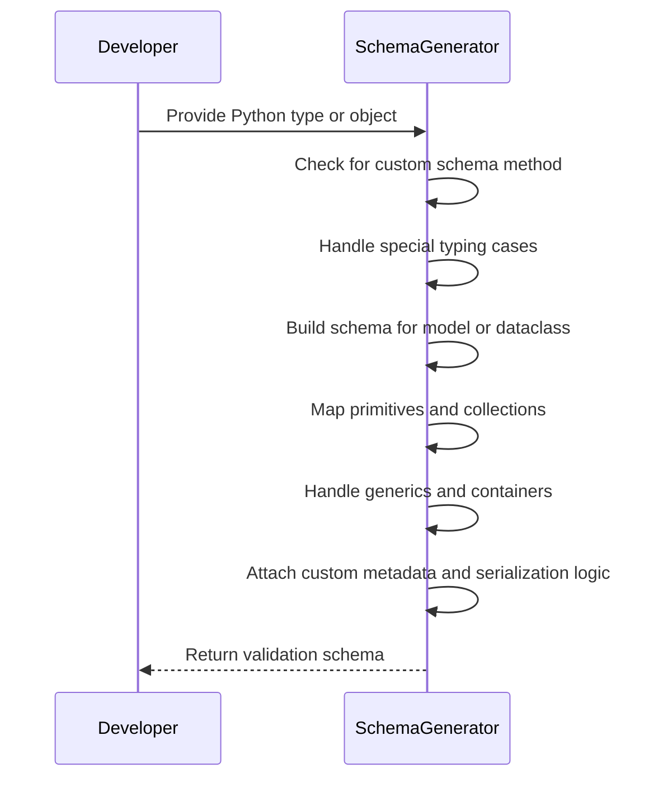
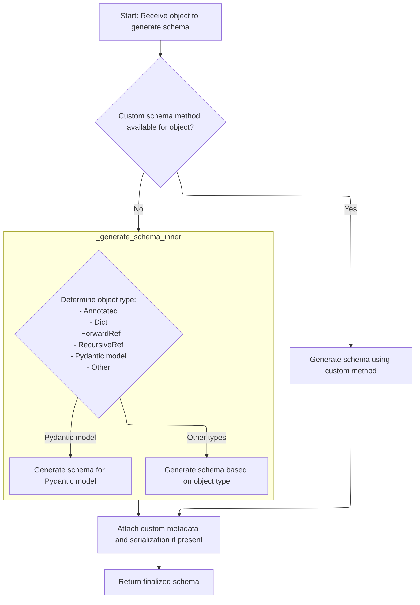
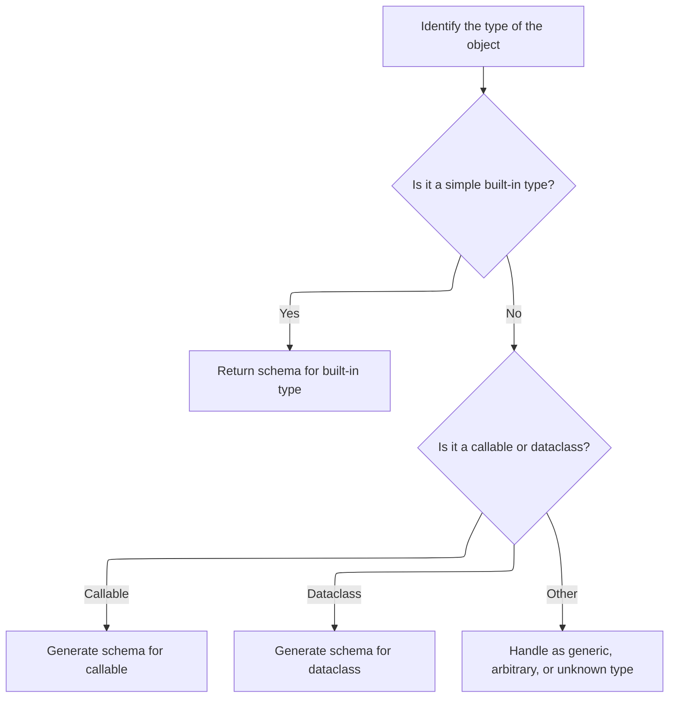
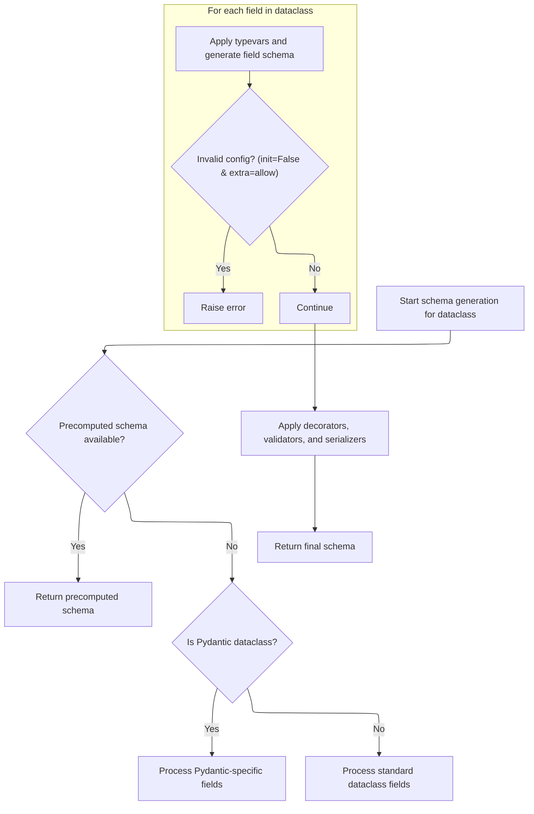
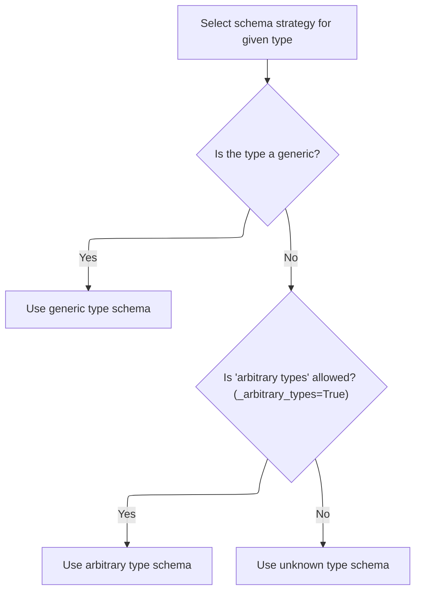
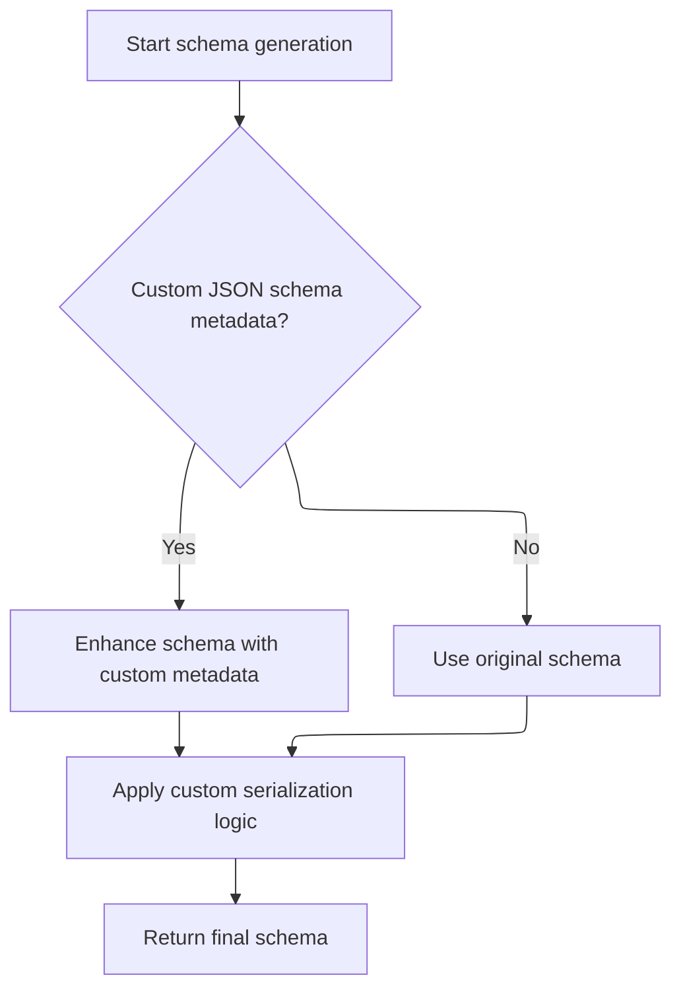

Schema generation creates a validation and serialization schema for any Python type, class, or object, supporting Pydantic's data validation capabilities. The process checks for custom schema methods, handles special typing cases, builds schemas for models and dataclasses, maps primitives and collections, manages generics and containers, and finally attaches any custom metadata or serialization logic.

The main steps are:

- Use custom schema methods if present
- Resolve special typing cases
- Build schemas for models and dataclasses
- Map primitives and collections
- Handle generics and containers
- Attach custom metadata and serialization logic



# Spec

## Detailed View of the Program's Functionality

a. Entry Point: Schema Generation Dispatcher

The schema generation process begins when a request is made to generate a schema for a given object. The dispatcher first checks if the object has a custom schema method or a legacy schema method. This is done by invoking a helper that looks for a special method on the object. If such a method exists and returns a schema, that schema is used directly. If not, the dispatcher proceeds to the internal logic for schema generation, which involves type matching and handling of generics. Regardless of the path taken, after the schema is generated, the dispatcher attaches any custom metadata and serialization logic if present, and finally returns the completed schema.

b. Type Resolution and Special Case Handling

When the internal schema generation logic is invoked, the system first checks for several special cases:

- If the object represents a recursive 'self' type, it resolves it to the correct type.
- If the object is an Annotated type, it delegates to a handler for annotated types.
- If the object is a dictionary, it is assumed to already be a valid schema and is returned as-is.
- If the object is a string, it is converted into a forward reference.
- If the object is a forward reference, it is resolved to its actual type, and schema generation is restarted for the resolved type.

After handling these cases, the system checks if the object is a subclass of the core model type. If so, it pushes the model onto a stack (to handle recursion and context) and generates a schema specifically for models. If the object is a recursive reference, a reference schema is returned. If none of these cases apply, the system falls back to type matching.

c. Model Schema Construction and Field Handling

When generating a schema for a model:

- The system first checks if a cached or precomputed schema exists for the model. If so, it is returned immediately.
- If the model has a pre-defined core schema, it is used, possibly unpacking definitions or creating a reference schema if needed.
- If the model's fields are not fully set up (for example, due to forward references), the fields are rebuilt.
- The system checks if extra fields are allowed by the model's configuration. If so, it processes extra field annotations for each base class in the model's hierarchy, resolving types and generating schemas for extra keys and values as needed.
- The system sets up configuration and namespace context to ensure correct type resolution.
- For root models (models with a single root field), a root model schema is built. For standard models, a schema is built for all fields, including computed fields and extras.
- Validators and serializers are applied to the schema, both at the field and model level.
- Finally, the schema is wrapped as a reference schema and returned.

d. Fallback Type Matching

If the object is not a model or a recursive reference, the system attempts to match the object's type to a known schema. This involves a series of checks for primitive types (like strings, integers, floats, etc.), collection types (like lists, sets, tuples, dictionaries), and special types (like enums, dataclasses, callables, etc.). For wrappers like <SwmToken path="pydantic/_internal/_generate_schema.py" pos="1111:3:3" line-data="            # NewType, can&#39;t use isinstance because it fails &lt;3.10">`NewType`</SwmToken> or Final, the system recursively generates a schema for the underlying type. If the object is a callable or a dataclass, specialized handlers are invoked.

e. Primitive and Collection Type Mapping

For primitive types and standard collections, the system directly maps the type to the corresponding schema. For example, strings map to a string schema, lists to a list schema, and so on. For more complex types like IP addresses, paths, or custom containers, helper methods are used to generate the appropriate schema, including any necessary validation and serialization logic.

f. Dataclass Type Detection and Handling

If the object is a dataclass, the system checks if a precomputed schema exists. If so, it is returned. If not, the system determines whether the dataclass is a Pydantic dataclass or a standard one. For Pydantic dataclasses, fields are copied or rebuilt as needed, and type variables are applied for generics. For standard dataclasses, fields are simply collected. The system ensures that invalid configurations (such as fields with <SwmToken path="pydantic/_internal/_generate_schema.py" pos="1854:9:11" line-data="                    # disallow combination of init=False on a dataclass field and extra=&#39;allow&#39; on a dataclass">`init=False`</SwmToken> and extra fields allowed) raise errors. Decorators, validators, and serializers are then applied, and the final schema is returned as a reference.

g. Generic Type Handling and Fallbacks

If the object is a generic type (<SwmToken path="pydantic/_internal/_generate_schema.py" pos="925:22:24" line-data="            # safety measure (because these are inlined in place -- i.e. mutated directly)">`i.e`</SwmToken>., it has an origin), the system dispatches to a handler that matches the origin to known generic types. This includes dataclasses, namedtuples, TypedDicts, and standard generics like lists, sets, and dictionaries. If the origin is not recognized and arbitrary types are allowed, an arbitrary type schema is generated. Otherwise, an unknown type schema is produced, which typically results in an error.

h. Generic Alias and Container Type Schema Generation

For generic aliases and container types, the system identifies the kind of type provided and dispatches to the appropriate schema generator. This includes handling dataclasses, namedtuples, custom schema methods, and known generic types. If the type is not recognized and arbitrary types are allowed, an arbitrary type schema is generated; otherwise, an unknown type schema is returned.

i. Schema Post-Processing and Finalization

After the schema is generated (regardless of the path taken), the system checks if there is any custom JSON schema metadata attached to the object. If so, it enhances the schema with this metadata. It also applies any custom serialization logic defined via JSON encoders. The finalized schema, now including all user customizations and enhancements, is then returned as the output of the schema generation process.

# Rule Definition

| Paragraph Name                                                                                                                                                                                                                                                                                                                                                                                                                                                                                                                                                                                                                                                                                                                                                                                                                                                                                                                                                                                                                                                                                                                                                                                                                                                                                                                                                                                                                                                                                                                                                                    | Rule ID | Category          | Description                                                                                                                                                                                                                                                                                                                                                                                                                                                                                                                                                                                                                                                                                                                                                                                                                                                                                                                                                                                                                                                                                                                                                                                                                                                                                                                                                                                                                                                                                                                                                                                                                        | Conditions                                                                                                                                                                                                                                                                                                                                                          | Remarks                                                                                                                                                                                                                                                                                                                                                                                |
| --------------------------------------------------------------------------------------------------------------------------------------------------------------------------------------------------------------------------------------------------------------------------------------------------------------------------------------------------------------------------------------------------------------------------------------------------------------------------------------------------------------------------------------------------------------------------------------------------------------------------------------------------------------------------------------------------------------------------------------------------------------------------------------------------------------------------------------------------------------------------------------------------------------------------------------------------------------------------------------------------------------------------------------------------------------------------------------------------------------------------------------------------------------------------------------------------------------------------------------------------------------------------------------------------------------------------------------------------------------------------------------------------------------------------------------------------------------------------------------------------------------------------------------------------------------------------------- | ------- | ----------------- | ---------------------------------------------------------------------------------------------------------------------------------------------------------------------------------------------------------------------------------------------------------------------------------------------------------------------------------------------------------------------------------------------------------------------------------------------------------------------------------------------------------------------------------------------------------------------------------------------------------------------------------------------------------------------------------------------------------------------------------------------------------------------------------------------------------------------------------------------------------------------------------------------------------------------------------------------------------------------------------------------------------------------------------------------------------------------------------------------------------------------------------------------------------------------------------------------------------------------------------------------------------------------------------------------------------------------------------------------------------------------------------------------------------------------------------------------------------------------------------------------------------------------------------------------------------------------------------------------------------------------------------- | ------------------------------------------------------------------------------------------------------------------------------------------------------------------------------------------------------------------------------------------------------------------------------------------------------------------------------------------------------------------- | -------------------------------------------------------------------------------------------------------------------------------------------------------------------------------------------------------------------------------------------------------------------------------------------------------------------------------------------------------------------------------------- |
| def <SwmToken path="pydantic/_internal/_generate_schema.py" pos="697:3:3" line-data="    def generate_schema(">`generate_schema`</SwmToken>, class <SwmToken path="pydantic/_internal/_generate_schema.py" pos="1032:5:5" line-data="        (like `GenerateSchema.tuple_variable_schema`) or calls into a private method that handles some">`GenerateSchema`</SwmToken>, docstring and method body                                                                                                                                                                                                                                                                                                                                                                                                                                                                                                                                                                                                                                                                                                                                                                                                                                                                                                                                                                                                                                                                                                                                                                               | RL-001  | Conditional Logic | The system must provide a main entry point method named <SwmToken path="pydantic/_internal/_generate_schema.py" pos="697:3:3" line-data="    def generate_schema(">`generate_schema`</SwmToken>, which accepts a single parameter (obj) representing the type, model, dataclass, or annotation to generate a schema for. The output must be a dictionary-like structure (<SwmToken path="pydantic/_internal/_generate_schema.py" pos="700:5:7" line-data="    ) -&gt; core_schema.CoreSchema:">`core_schema.CoreSchema`</SwmToken>) describing the validation and serialization logic for the given type.                                                                                                                                                                                                                                                                                                                                                                                                                                                                                                                                                                                                                                                                                                                                                                                                                                                                                                                                                                                                                          | When <SwmToken path="pydantic/_internal/_generate_schema.py" pos="697:3:3" line-data="    def generate_schema(">`generate_schema`</SwmToken> is called with a supported object (type, model, dataclass, annotation).                                                                                                                                                | The output must always be a dictionary-like object conforming to <SwmToken path="pydantic/_internal/_generate_schema.py" pos="700:5:7" line-data="    ) -&gt; core_schema.CoreSchema:">`core_schema.CoreSchema`</SwmToken>. The input is a single object (obj).                                                                                                                        |
| def <SwmToken path="pydantic/_internal/_generate_schema.py" pos="736:3:3" line-data="    def _model_schema(self, cls: type[BaseModel]) -&gt; core_schema.CoreSchema:">`_model_schema`</SwmToken>, def <SwmToken path="pydantic/_internal/_generate_schema.py" pos="1079:5:5" line-data="            return self._list_schema(Any)">`_list_schema`</SwmToken>, def <SwmToken path="pydantic/_internal/_generate_schema.py" pos="1089:5:5" line-data="            return self._dict_schema(Any, Any)">`_dict_schema`</SwmToken>, def <SwmToken path="pydantic/_internal/_generate_schema.py" pos="1081:5:5" line-data="            return self._set_schema(Any)">`_set_schema`</SwmToken>, def <SwmToken path="pydantic/_internal/_generate_schema.py" pos="1083:5:5" line-data="            return self._frozenset_schema(Any)">`_frozenset_schema`</SwmToken>, def <SwmToken path="pydantic/_internal/_generate_schema.py" pos="1128:5:5" line-data="            return self._enum_schema(obj)">`_enum_schema`</SwmToken>, def <SwmToken path="pydantic/_internal/_generate_schema.py" pos="1135:5:5" line-data="            return self._dataclass_schema(obj, None)  # pyright: ignore[reportArgumentType]">`_dataclass_schema`</SwmToken>, def <SwmToken path="pydantic/_internal/_generate_schema.py" pos="1023:5:5" line-data="        return self.match_type(obj)">`match_type`</SwmToken>, def <SwmToken path="pydantic/_internal/_generate_schema.py" pos="724:7:7" line-data="            schema = self._generate_schema_inner(obj)">`_generate_schema_inner`</SwmToken> | RL-002  | Data Assignment   | The generated schema must always include a 'type' key indicating the schema kind (<SwmToken path="pydantic/_internal/_generate_schema.py" pos="1033:18:20" line-data="        boilerplate before calling into the user-facing method (e.g. `GenerateSchema._tuple_schema`).">`e.g`</SwmToken>., 'model', 'list', 'int', 'dataclass', <SwmToken path="pydantic/_internal/_generate_schema.py" pos="924:18:20" line-data="            # Note: if schema is of type `&#39;definition-ref&#39;`, we might want to copy it as a">`definition-ref`</SwmToken>, etc.). For Pydantic models, the schema must include at least 'type' (with value 'model'), 'cls' (the model class), 'schema' (a nested schema for the model’s fields), and 'ref' (a unique string reference). For lists, include 'type' (with value 'list') and <SwmToken path="pydantic/_internal/_generate_schema.py" pos="259:4:4" line-data="            schema[&#39;items_schema&#39;][variadic_item_index] = apply_validators(">`items_schema`</SwmToken>. For integers, include 'type' (with value 'int'). For dataclasses, include 'type' (with value 'dataclass'), 'cls', 'schema', and 'ref'. For references, include 'type' (with value <SwmToken path="pydantic/_internal/_generate_schema.py" pos="924:18:20" line-data="            # Note: if schema is of type `&#39;definition-ref&#39;`, we might want to copy it as a">`definition-ref`</SwmToken>) and <SwmToken path="pydantic/_internal/_generate_schema.py" pos="1021:7:7" line-data="            return core_schema.definition_reference_schema(schema_ref=obj.type_ref)">`schema_ref`</SwmToken>. | When generating a schema for a supported type (model, list, int, dataclass, reference).                                                                                                                                                                                                                                                                             | The 'type' key is always present and is a string. Other required keys depend on the type. Example for model: {'type': 'model', 'cls': <class>, 'schema': {...}, 'ref': <str>}.                                                                                                                                                                                                         |
| def <SwmToken path="pydantic/_internal/_generate_schema.py" pos="697:3:3" line-data="    def generate_schema(">`generate_schema`</SwmToken>, def <SwmToken path="pydantic/_internal/_generate_schema.py" pos="721:7:7" line-data="        schema = self._generate_schema_from_get_schema_method(obj, obj)">`_generate_schema_from_get_schema_method`</SwmToken>, def <SwmToken path="pydantic/_internal/_generate_schema.py" pos="1269:7:7" line-data="                schema = self._apply_annotations(">`_apply_annotations`</SwmToken>, def <SwmToken path="pydantic/_internal/_generate_schema.py" pos="2208:3:3" line-data="    def _apply_single_annotation(">`_apply_single_annotation`</SwmToken>, def <SwmToken path="pydantic/_internal/_generate_schema.py" pos="730:3:3" line-data="                self._add_js_function(metadata_schema, metadata_js_function)">`_add_js_function`</SwmToken>, def <SwmToken path="pydantic/_internal/_generate_schema.py" pos="1297:7:7" line-data="        schema = self._apply_field_serializers(">`_apply_field_serializers`</SwmToken>, def <SwmToken path="pydantic/_internal/_generate_schema.py" pos="874:7:7" line-data="                schema = self._apply_model_serializers(model_schema, decorators.model_serializers.values())">`_apply_model_serializers`</SwmToken>                                                                                                                                                                                                                                                | RL-003  | Conditional Logic | The schema generation feature must support attaching custom metadata and serialization logic to the generated schemas if present. It must also support custom schema hooks, allowing user-defined methods on types to override the default schema generation logic.                                                                                                                                                                                                                                                                                                                                                                                                                                                                                                                                                                                                                                                                                                                                                                                                                                                                                                                                                                                                                                                                                                                                                                                                                                                                                                                                                                | When the input type or annotation provides custom hooks or metadata (<SwmToken path="pydantic/_internal/_generate_schema.py" pos="1033:18:20" line-data="        boilerplate before calling into the user-facing method (e.g. `GenerateSchema._tuple_schema`).">`e.g`</SwmToken>., **get_pydantic_core_schema**, **get_pydantic_json_schema**, custom serializers). | Custom metadata and serialization logic are attached to the schema under specific keys (<SwmToken path="pydantic/_internal/_generate_schema.py" pos="1033:18:20" line-data="        boilerplate before calling into the user-facing method (e.g. `GenerateSchema._tuple_schema`).">`e.g`</SwmToken>., 'metadata', 'serialization'). User-defined hooks can override schema generation. |
| class \_Definitions, def <SwmToken path="pydantic/_internal/_generate_schema.py" pos="740:7:7" line-data="        with self.defs.get_schema_or_ref(cls) as (model_ref, maybe_schema):">`get_schema_or_ref`</SwmToken>, def <SwmToken path="pydantic/_internal/_generate_schema.py" pos="750:7:7" line-data="                    return self.defs.create_definition_reference_schema(schema)">`create_definition_reference_schema`</SwmToken>, def <SwmToken path="pydantic/_internal/_generate_schema.py" pos="684:7:7" line-data="        return self.defs.finalize_schema(schema)">`finalize_schema`</SwmToken>, def <SwmToken path="pydantic/_internal/_generate_schema.py" pos="697:3:3" line-data="    def generate_schema(">`generate_schema`</SwmToken>, def <SwmToken path="pydantic/_internal/_generate_schema.py" pos="736:3:3" line-data="    def _model_schema(self, cls: type[BaseModel]) -&gt; core_schema.CoreSchema:">`_model_schema`</SwmToken>, def <SwmToken path="pydantic/_internal/_generate_schema.py" pos="1135:5:5" line-data="            return self._dataclass_schema(obj, None)  # pyright: ignore[reportArgumentType]">`_dataclass_schema`</SwmToken>, def <SwmToken path="pydantic/_internal/_generate_schema.py" pos="1107:5:5" line-data="            return self._typed_dict_schema(obj, None)">`_typed_dict_schema`</SwmToken>, def <SwmToken path="pydantic/_internal/_generate_schema.py" pos="1109:5:5" line-data="            return self._namedtuple_schema(obj, None)">`_namedtuple_schema`</SwmToken>                                   | RL-004  | Conditional Logic | The system must maintain internal state to support schema generation, including a stack of configuration wrappers, a namespace resolver, a mapping of type variables, a stack of field names, a stack of models being processed, and a definitions cache. It must avoid redundant schema generation by caching and using references for recursive or repeated types.                                                                                                                                                                                                                                                                                                                                                                                                                                                                                                                                                                                                                                                                                                                                                                                                                                                                                                                                                                                                                                                                                                                                                                                                                                                               | When generating schemas for types that may be recursive or referenced multiple times.                                                                                                                                                                                                                                                                               | References are managed using unique strings ('ref'). Schemas for recursive or repeated types are cached and referenced using <SwmToken path="pydantic/_internal/_generate_schema.py" pos="924:18:20" line-data="            # Note: if schema is of type `&#39;definition-ref&#39;`, we might want to copy it as a">`definition-ref`</SwmToken> schemas.                               |
| def <SwmToken path="pydantic/_internal/_generate_schema.py" pos="1143:5:5" line-data="        return self._unknown_type_schema(obj)">`_unknown_type_schema`</SwmToken>, def <SwmToken path="pydantic/_internal/_generate_schema.py" pos="1023:5:5" line-data="        return self.match_type(obj)">`match_type`</SwmToken>, def <SwmToken path="pydantic/_internal/_generate_schema.py" pos="1139:5:5" line-data="            return self._match_generic_type(obj, origin)">`_match_generic_type`</SwmToken>, def <SwmToken path="pydantic/_internal/_generate_schema.py" pos="697:3:3" line-data="    def generate_schema(">`generate_schema`</SwmToken>                                                                                                                                                                                                                                                                                                                                                                                                                                                                                                                                                                                                                                                                                                                                                                                                                                                                                                                         | RL-005  | Conditional Logic | The system must raise a clear, descriptive error (such as <SwmToken path="pydantic/_internal/_generate_schema.py" pos="712:1:1" line-data="            PydanticSchemaGenerationError:">`PydanticSchemaGenerationError`</SwmToken>, <SwmToken path="pydantic/_internal/_generate_schema.py" pos="717:1:1" line-data="            PydanticUserError:">`PydanticUserError`</SwmToken>, or NotImplementedError) for unsupported or unhandled types, rather than silently ignoring them.                                                                                                                                                                                                                                                                                                                                                                                                                                                                                                                                                                                                                                                                                                                                                                                                                                                                                                                                                                                                                                                                                                                                                | When an unsupported or unhandled type is encountered during schema generation.                                                                                                                                                                                                                                                                                      | Errors must be descriptive and use the appropriate exception class. No silent failures are allowed.                                                                                                                                                                                                                                                                                    |
| def <SwmToken path="pydantic/_internal/_generate_schema.py" pos="683:3:3" line-data="    def clean_schema(self, schema: CoreSchema) -&gt; CoreSchema:">`clean_schema`</SwmToken>, def <SwmToken path="pydantic/_internal/_generate_schema.py" pos="684:7:7" line-data="        return self.defs.finalize_schema(schema)">`finalize_schema`</SwmToken> in \_Definitions                                                                                                                                                                                                                                                                                                                                                                                                                                                                                                                                                                                                                                                                                                                                                                                                                                                                                                                                                                                                                                                                                                                                                                                                            | RL-006  | Computation       | The system must allow for post-processing of generated schemas, including the attachment of custom metadata and serialization logic, and provide a method to finalize and clean up a generated schema, resolving references and applying deferred discriminators.                                                                                                                                                                                                                                                                                                                                                                                                                                                                                                                                                                                                                                                                                                                                                                                                                                                                                                                                                                                                                                                                                                                                                                                                                                                                                                                                                                  | After a schema has been generated and before it is returned or used.                                                                                                                                                                                                                                                                                                | Finalization may inline or preserve references, and must apply any deferred discriminators or metadata.                                                                                                                                                                                                                                                                                |
| def <SwmToken path="pydantic/_internal/_generate_schema.py" pos="1023:5:5" line-data="        return self.match_type(obj)">`match_type`</SwmToken>, def <SwmToken path="pydantic/_internal/_generate_schema.py" pos="1139:5:5" line-data="            return self._match_generic_type(obj, origin)">`_match_generic_type`</SwmToken>, def <SwmToken path="pydantic/_internal/_generate_schema.py" pos="724:7:7" line-data="            schema = self._generate_schema_inner(obj)">`_generate_schema_inner`</SwmToken>, def <SwmToken path="pydantic/_internal/_generate_schema.py" pos="1107:5:5" line-data="            return self._typed_dict_schema(obj, None)">`_typed_dict_schema`</SwmToken>, def <SwmToken path="pydantic/_internal/_generate_schema.py" pos="1109:5:5" line-data="            return self._namedtuple_schema(obj, None)">`_namedtuple_schema`</SwmToken>, def <SwmToken path="pydantic/_internal/_generate_schema.py" pos="1135:5:5" line-data="            return self._dataclass_schema(obj, None)  # pyright: ignore[reportArgumentType]">`_dataclass_schema`</SwmToken>, def <SwmToken path="pydantic/_internal/_generate_schema.py" pos="1128:5:5" line-data="            return self._enum_schema(obj)">`_enum_schema`</SwmToken>                                                                                                                                                                                                                                                                                                                  | RL-007  | Conditional Logic | The system must be compatible with standard Python types, Pydantic models, dataclasses, enums, collections, and advanced typing constructs (<SwmToken path="pydantic/_internal/_generate_schema.py" pos="1033:18:20" line-data="        boilerplate before calling into the user-facing method (e.g. `GenerateSchema._tuple_schema`).">`e.g`</SwmToken>., generics, unions, annotated types).                                                                                                                                                                                                                                                                                                                                                                                                                                                                                                                                                                                                                                                                                                                                                                                                                                                                                                                                                                                                                                                                                                                                                                                                                                      | When <SwmToken path="pydantic/_internal/_generate_schema.py" pos="697:3:3" line-data="    def generate_schema(">`generate_schema`</SwmToken> is called with any supported Python type or construct.                                                                                                                                                                 | Supported constructs include: standard types (int, str, etc.), Pydantic models, dataclasses, enums, collections, generics, unions, annotated types, and more.                                                                                                                                                                                                                          |

# User Stories

## User Story 1: Schema generation, compatibility, internal state, and error handling

---

### Story Description:

As a user, I want to generate structured schemas from Python types, Pydantic models, dataclasses, and type annotations, with correct structure, compatibility, internal state management, reference handling, and clear error reporting, so that I can validate and serialize data reliably and efficiently.

---

### Business Rule Mapping:

| Rule ID | Paragraph Name                                                                                                                                                                                                                                                                                                                                                                                                                                                                                                                                                                                                                                                                                                                                                                                                                                                                                                                                                                                                                                                                                                                                                                                                                                                                                                                                                                                                                                                                                                                                                                    | Rule Description                                                                                                                                                                                                                                                                                                                                                                                                                                                                                                                                                                                                                                                                                                                                                                                                                                                                                                                                                                                                                                                                                                                                                                                                                                                                                                                                                                                                                                                                                                                                                                                                                   |
| ------- | --------------------------------------------------------------------------------------------------------------------------------------------------------------------------------------------------------------------------------------------------------------------------------------------------------------------------------------------------------------------------------------------------------------------------------------------------------------------------------------------------------------------------------------------------------------------------------------------------------------------------------------------------------------------------------------------------------------------------------------------------------------------------------------------------------------------------------------------------------------------------------------------------------------------------------------------------------------------------------------------------------------------------------------------------------------------------------------------------------------------------------------------------------------------------------------------------------------------------------------------------------------------------------------------------------------------------------------------------------------------------------------------------------------------------------------------------------------------------------------------------------------------------------------------------------------------------------- | ---------------------------------------------------------------------------------------------------------------------------------------------------------------------------------------------------------------------------------------------------------------------------------------------------------------------------------------------------------------------------------------------------------------------------------------------------------------------------------------------------------------------------------------------------------------------------------------------------------------------------------------------------------------------------------------------------------------------------------------------------------------------------------------------------------------------------------------------------------------------------------------------------------------------------------------------------------------------------------------------------------------------------------------------------------------------------------------------------------------------------------------------------------------------------------------------------------------------------------------------------------------------------------------------------------------------------------------------------------------------------------------------------------------------------------------------------------------------------------------------------------------------------------------------------------------------------------------------------------------------------------- |
| RL-001  | def <SwmToken path="pydantic/_internal/_generate_schema.py" pos="697:3:3" line-data="    def generate_schema(">`generate_schema`</SwmToken>, class <SwmToken path="pydantic/_internal/_generate_schema.py" pos="1032:5:5" line-data="        (like `GenerateSchema.tuple_variable_schema`) or calls into a private method that handles some">`GenerateSchema`</SwmToken>, docstring and method body                                                                                                                                                                                                                                                                                                                                                                                                                                                                                                                                                                                                                                                                                                                                                                                                                                                                                                                                                                                                                                                                                                                                                                               | The system must provide a main entry point method named <SwmToken path="pydantic/_internal/_generate_schema.py" pos="697:3:3" line-data="    def generate_schema(">`generate_schema`</SwmToken>, which accepts a single parameter (obj) representing the type, model, dataclass, or annotation to generate a schema for. The output must be a dictionary-like structure (<SwmToken path="pydantic/_internal/_generate_schema.py" pos="700:5:7" line-data="    ) -&gt; core_schema.CoreSchema:">`core_schema.CoreSchema`</SwmToken>) describing the validation and serialization logic for the given type.                                                                                                                                                                                                                                                                                                                                                                                                                                                                                                                                                                                                                                                                                                                                                                                                                                                                                                                                                                                                                          |
| RL-002  | def <SwmToken path="pydantic/_internal/_generate_schema.py" pos="736:3:3" line-data="    def _model_schema(self, cls: type[BaseModel]) -&gt; core_schema.CoreSchema:">`_model_schema`</SwmToken>, def <SwmToken path="pydantic/_internal/_generate_schema.py" pos="1079:5:5" line-data="            return self._list_schema(Any)">`_list_schema`</SwmToken>, def <SwmToken path="pydantic/_internal/_generate_schema.py" pos="1089:5:5" line-data="            return self._dict_schema(Any, Any)">`_dict_schema`</SwmToken>, def <SwmToken path="pydantic/_internal/_generate_schema.py" pos="1081:5:5" line-data="            return self._set_schema(Any)">`_set_schema`</SwmToken>, def <SwmToken path="pydantic/_internal/_generate_schema.py" pos="1083:5:5" line-data="            return self._frozenset_schema(Any)">`_frozenset_schema`</SwmToken>, def <SwmToken path="pydantic/_internal/_generate_schema.py" pos="1128:5:5" line-data="            return self._enum_schema(obj)">`_enum_schema`</SwmToken>, def <SwmToken path="pydantic/_internal/_generate_schema.py" pos="1135:5:5" line-data="            return self._dataclass_schema(obj, None)  # pyright: ignore[reportArgumentType]">`_dataclass_schema`</SwmToken>, def <SwmToken path="pydantic/_internal/_generate_schema.py" pos="1023:5:5" line-data="        return self.match_type(obj)">`match_type`</SwmToken>, def <SwmToken path="pydantic/_internal/_generate_schema.py" pos="724:7:7" line-data="            schema = self._generate_schema_inner(obj)">`_generate_schema_inner`</SwmToken> | The generated schema must always include a 'type' key indicating the schema kind (<SwmToken path="pydantic/_internal/_generate_schema.py" pos="1033:18:20" line-data="        boilerplate before calling into the user-facing method (e.g. `GenerateSchema._tuple_schema`).">`e.g`</SwmToken>., 'model', 'list', 'int', 'dataclass', <SwmToken path="pydantic/_internal/_generate_schema.py" pos="924:18:20" line-data="            # Note: if schema is of type `&#39;definition-ref&#39;`, we might want to copy it as a">`definition-ref`</SwmToken>, etc.). For Pydantic models, the schema must include at least 'type' (with value 'model'), 'cls' (the model class), 'schema' (a nested schema for the model’s fields), and 'ref' (a unique string reference). For lists, include 'type' (with value 'list') and <SwmToken path="pydantic/_internal/_generate_schema.py" pos="259:4:4" line-data="            schema[&#39;items_schema&#39;][variadic_item_index] = apply_validators(">`items_schema`</SwmToken>. For integers, include 'type' (with value 'int'). For dataclasses, include 'type' (with value 'dataclass'), 'cls', 'schema', and 'ref'. For references, include 'type' (with value <SwmToken path="pydantic/_internal/_generate_schema.py" pos="924:18:20" line-data="            # Note: if schema is of type `&#39;definition-ref&#39;`, we might want to copy it as a">`definition-ref`</SwmToken>) and <SwmToken path="pydantic/_internal/_generate_schema.py" pos="1021:7:7" line-data="            return core_schema.definition_reference_schema(schema_ref=obj.type_ref)">`schema_ref`</SwmToken>. |
| RL-004  | class \_Definitions, def <SwmToken path="pydantic/_internal/_generate_schema.py" pos="740:7:7" line-data="        with self.defs.get_schema_or_ref(cls) as (model_ref, maybe_schema):">`get_schema_or_ref`</SwmToken>, def <SwmToken path="pydantic/_internal/_generate_schema.py" pos="750:7:7" line-data="                    return self.defs.create_definition_reference_schema(schema)">`create_definition_reference_schema`</SwmToken>, def <SwmToken path="pydantic/_internal/_generate_schema.py" pos="684:7:7" line-data="        return self.defs.finalize_schema(schema)">`finalize_schema`</SwmToken>, def <SwmToken path="pydantic/_internal/_generate_schema.py" pos="697:3:3" line-data="    def generate_schema(">`generate_schema`</SwmToken>, def <SwmToken path="pydantic/_internal/_generate_schema.py" pos="736:3:3" line-data="    def _model_schema(self, cls: type[BaseModel]) -&gt; core_schema.CoreSchema:">`_model_schema`</SwmToken>, def <SwmToken path="pydantic/_internal/_generate_schema.py" pos="1135:5:5" line-data="            return self._dataclass_schema(obj, None)  # pyright: ignore[reportArgumentType]">`_dataclass_schema`</SwmToken>, def <SwmToken path="pydantic/_internal/_generate_schema.py" pos="1107:5:5" line-data="            return self._typed_dict_schema(obj, None)">`_typed_dict_schema`</SwmToken>, def <SwmToken path="pydantic/_internal/_generate_schema.py" pos="1109:5:5" line-data="            return self._namedtuple_schema(obj, None)">`_namedtuple_schema`</SwmToken>                                   | The system must maintain internal state to support schema generation, including a stack of configuration wrappers, a namespace resolver, a mapping of type variables, a stack of field names, a stack of models being processed, and a definitions cache. It must avoid redundant schema generation by caching and using references for recursive or repeated types.                                                                                                                                                                                                                                                                                                                                                                                                                                                                                                                                                                                                                                                                                                                                                                                                                                                                                                                                                                                                                                                                                                                                                                                                                                                               |
| RL-005  | def <SwmToken path="pydantic/_internal/_generate_schema.py" pos="1143:5:5" line-data="        return self._unknown_type_schema(obj)">`_unknown_type_schema`</SwmToken>, def <SwmToken path="pydantic/_internal/_generate_schema.py" pos="1023:5:5" line-data="        return self.match_type(obj)">`match_type`</SwmToken>, def <SwmToken path="pydantic/_internal/_generate_schema.py" pos="1139:5:5" line-data="            return self._match_generic_type(obj, origin)">`_match_generic_type`</SwmToken>, def <SwmToken path="pydantic/_internal/_generate_schema.py" pos="697:3:3" line-data="    def generate_schema(">`generate_schema`</SwmToken>                                                                                                                                                                                                                                                                                                                                                                                                                                                                                                                                                                                                                                                                                                                                                                                                                                                                                                                         | The system must raise a clear, descriptive error (such as <SwmToken path="pydantic/_internal/_generate_schema.py" pos="712:1:1" line-data="            PydanticSchemaGenerationError:">`PydanticSchemaGenerationError`</SwmToken>, <SwmToken path="pydantic/_internal/_generate_schema.py" pos="717:1:1" line-data="            PydanticUserError:">`PydanticUserError`</SwmToken>, or NotImplementedError) for unsupported or unhandled types, rather than silently ignoring them.                                                                                                                                                                                                                                                                                                                                                                                                                                                                                                                                                                                                                                                                                                                                                                                                                                                                                                                                                                                                                                                                                                                                                |
| RL-007  | def <SwmToken path="pydantic/_internal/_generate_schema.py" pos="1023:5:5" line-data="        return self.match_type(obj)">`match_type`</SwmToken>, def <SwmToken path="pydantic/_internal/_generate_schema.py" pos="1139:5:5" line-data="            return self._match_generic_type(obj, origin)">`_match_generic_type`</SwmToken>, def <SwmToken path="pydantic/_internal/_generate_schema.py" pos="724:7:7" line-data="            schema = self._generate_schema_inner(obj)">`_generate_schema_inner`</SwmToken>, def <SwmToken path="pydantic/_internal/_generate_schema.py" pos="1107:5:5" line-data="            return self._typed_dict_schema(obj, None)">`_typed_dict_schema`</SwmToken>, def <SwmToken path="pydantic/_internal/_generate_schema.py" pos="1109:5:5" line-data="            return self._namedtuple_schema(obj, None)">`_namedtuple_schema`</SwmToken>, def <SwmToken path="pydantic/_internal/_generate_schema.py" pos="1135:5:5" line-data="            return self._dataclass_schema(obj, None)  # pyright: ignore[reportArgumentType]">`_dataclass_schema`</SwmToken>, def <SwmToken path="pydantic/_internal/_generate_schema.py" pos="1128:5:5" line-data="            return self._enum_schema(obj)">`_enum_schema`</SwmToken>                                                                                                                                                                                                                                                                                                                  | The system must be compatible with standard Python types, Pydantic models, dataclasses, enums, collections, and advanced typing constructs (<SwmToken path="pydantic/_internal/_generate_schema.py" pos="1033:18:20" line-data="        boilerplate before calling into the user-facing method (e.g. `GenerateSchema._tuple_schema`).">`e.g`</SwmToken>., generics, unions, annotated types).                                                                                                                                                                                                                                                                                                                                                                                                                                                                                                                                                                                                                                                                                                                                                                                                                                                                                                                                                                                                                                                                                                                                                                                                                                      |

---

### Relevant Functionality:

- **def** <SwmToken path="pydantic/_internal/_generate_schema.py" pos="697:3:3" line-data="    def generate_schema(">`generate_schema`</SwmToken>
  1. **RL-001:**
     - Accept an object (type, model, dataclass, or annotation) as input
     - Generate a schema describing validation and serialization logic
     - Return the schema as a dictionary-like structure
- **def** <SwmToken path="pydantic/_internal/_generate_schema.py" pos="736:3:3" line-data="    def _model_schema(self, cls: type[BaseModel]) -&gt; core_schema.CoreSchema:">`_model_schema`</SwmToken>
  1. **RL-002:**
     - For each supported type:
       - Add 'type' key with appropriate value
       - Add required keys for that type (<SwmToken path="pydantic/_internal/_generate_schema.py" pos="1033:18:20" line-data="        boilerplate before calling into the user-facing method (e.g. `GenerateSchema._tuple_schema`).">`e.g`</SwmToken>., 'cls', 'schema', 'ref' for models)
       - For references, use 'type': <SwmToken path="pydantic/_internal/_generate_schema.py" pos="924:18:20" line-data="            # Note: if schema is of type `&#39;definition-ref&#39;`, we might want to copy it as a">`definition-ref`</SwmToken> and <SwmToken path="pydantic/_internal/_generate_schema.py" pos="1021:7:7" line-data="            return core_schema.definition_reference_schema(schema_ref=obj.type_ref)">`schema_ref`</SwmToken>
- **class \_Definitions**
  1. **RL-004:**
     - Before generating a schema for a type, check if it is already being processed or cached
     - If so, return a reference schema (<SwmToken path="pydantic/_internal/_generate_schema.py" pos="924:18:20" line-data="            # Note: if schema is of type `&#39;definition-ref&#39;`, we might want to copy it as a">`definition-ref`</SwmToken>)
     - Otherwise, generate the schema and cache it with a unique reference
- **def** <SwmToken path="pydantic/_internal/_generate_schema.py" pos="1143:5:5" line-data="        return self._unknown_type_schema(obj)">`_unknown_type_schema`</SwmToken>
  1. **RL-005:**
     - If a type is not supported, raise a descriptive error with the appropriate exception class
- **def** <SwmToken path="pydantic/_internal/_generate_schema.py" pos="1023:5:5" line-data="        return self.match_type(obj)">`match_type`</SwmToken>
  1. **RL-007:**
     - Detect the type or construct of the input
     - Generate the appropriate schema structure for that type or construct
     - Ensure all required keys and formats are present in the output

## User Story 2: Extensibility, custom hooks, metadata, and schema finalization

---

### Story Description:

As a user, I want to attach custom metadata and serialization logic, use custom hooks to override schema generation, and finalize schemas with post-processing so that I can customize and prepare schemas for my specific needs.

---

### Business Rule Mapping:

| Rule ID | Paragraph Name                                                                                                                                                                                                                                                                                                                                                                                                                                                                                                                                                                                                                                                                                                                                                                                                                                                                                                                                                                                                                                                                                                                                                                                                                                                                                                                     | Rule Description                                                                                                                                                                                                                                                    |
| ------- | ---------------------------------------------------------------------------------------------------------------------------------------------------------------------------------------------------------------------------------------------------------------------------------------------------------------------------------------------------------------------------------------------------------------------------------------------------------------------------------------------------------------------------------------------------------------------------------------------------------------------------------------------------------------------------------------------------------------------------------------------------------------------------------------------------------------------------------------------------------------------------------------------------------------------------------------------------------------------------------------------------------------------------------------------------------------------------------------------------------------------------------------------------------------------------------------------------------------------------------------------------------------------------------------------------------------------------------- | ------------------------------------------------------------------------------------------------------------------------------------------------------------------------------------------------------------------------------------------------------------------- |
| RL-003  | def <SwmToken path="pydantic/_internal/_generate_schema.py" pos="697:3:3" line-data="    def generate_schema(">`generate_schema`</SwmToken>, def <SwmToken path="pydantic/_internal/_generate_schema.py" pos="721:7:7" line-data="        schema = self._generate_schema_from_get_schema_method(obj, obj)">`_generate_schema_from_get_schema_method`</SwmToken>, def <SwmToken path="pydantic/_internal/_generate_schema.py" pos="1269:7:7" line-data="                schema = self._apply_annotations(">`_apply_annotations`</SwmToken>, def <SwmToken path="pydantic/_internal/_generate_schema.py" pos="2208:3:3" line-data="    def _apply_single_annotation(">`_apply_single_annotation`</SwmToken>, def <SwmToken path="pydantic/_internal/_generate_schema.py" pos="730:3:3" line-data="                self._add_js_function(metadata_schema, metadata_js_function)">`_add_js_function`</SwmToken>, def <SwmToken path="pydantic/_internal/_generate_schema.py" pos="1297:7:7" line-data="        schema = self._apply_field_serializers(">`_apply_field_serializers`</SwmToken>, def <SwmToken path="pydantic/_internal/_generate_schema.py" pos="874:7:7" line-data="                schema = self._apply_model_serializers(model_schema, decorators.model_serializers.values())">`_apply_model_serializers`</SwmToken> | The schema generation feature must support attaching custom metadata and serialization logic to the generated schemas if present. It must also support custom schema hooks, allowing user-defined methods on types to override the default schema generation logic. |
| RL-006  | def <SwmToken path="pydantic/_internal/_generate_schema.py" pos="683:3:3" line-data="    def clean_schema(self, schema: CoreSchema) -&gt; CoreSchema:">`clean_schema`</SwmToken>, def <SwmToken path="pydantic/_internal/_generate_schema.py" pos="684:7:7" line-data="        return self.defs.finalize_schema(schema)">`finalize_schema`</SwmToken> in \_Definitions                                                                                                                                                                                                                                                                                                                                                                                                                                                                                                                                                                                                                                                                                                                                                                                                                                                                                                                                                             | The system must allow for post-processing of generated schemas, including the attachment of custom metadata and serialization logic, and provide a method to finalize and clean up a generated schema, resolving references and applying deferred discriminators.   |

---

### Relevant Functionality:

- **def** <SwmToken path="pydantic/_internal/_generate_schema.py" pos="697:3:3" line-data="    def generate_schema(">`generate_schema`</SwmToken>
  1. **RL-003:**
     - Check for presence of custom schema hooks on the input type
     - If present, use the hook to generate or modify the schema
     - Attach any custom metadata or serialization logic to the schema
- **def** <SwmToken path="pydantic/_internal/_generate_schema.py" pos="683:3:3" line-data="    def clean_schema(self, schema: CoreSchema) -&gt; CoreSchema:">`clean_schema`</SwmToken>
  1. **RL-006:**
     - After schema generation, traverse the schema and referenced definitions
     - Replace references with definitions where appropriate
     - Apply any deferred discriminators or metadata
     - Return the finalized schema

# Code Walkthrough

## Entry Point: Schema Generation Dispatcher



<SwmSnippet path="/pydantic/_internal/_generate_schema.py" line="697">

---

In <SwmToken path="pydantic/_internal/_generate_schema.py" pos="697:3:3" line-data="    def generate_schema(">`generate_schema`</SwmToken>, we kick things off by checking if the object has a custom or legacy schema via <SwmToken path="pydantic/_internal/_generate_schema.py" pos="721:7:7" line-data="        schema = self._generate_schema_from_get_schema_method(obj, obj)">`_generate_schema_from_get_schema_method`</SwmToken>. If that doesn't return anything, we move on to <SwmToken path="pydantic/_internal/_generate_schema.py" pos="724:7:7" line-data="            schema = self._generate_schema_inner(obj)">`_generate_schema_inner`</SwmToken> to handle the standard schema generation logic. This setup lets custom schema hooks override the default behavior when needed.

```python
    def generate_schema(
        self,
        obj: Any,
    ) -> core_schema.CoreSchema:
        """Generate core schema.

        Args:
            obj: The object to generate core schema for.

        Returns:
            The generated core schema.

        Raises:
            PydanticUndefinedAnnotation:
                If it is not possible to evaluate forward reference.
            PydanticSchemaGenerationError:
                If it is not possible to generate pydantic-core schema.
            TypeError:
                - If `alias_generator` returns a disallowed type (must be str, AliasPath or AliasChoices).
                - If V1 style validator with `each_item=True` applied on a wrong field.
            PydanticUserError:
                - If `typing.TypedDict` is used instead of `typing_extensions.TypedDict` on Python < 3.12.
                - If `__modify_schema__` method is used instead of `__get_pydantic_json_schema__`.
        """
        schema = self._generate_schema_from_get_schema_method(obj, obj)

        if schema is None:
            schema = self._generate_schema_inner(obj)

```

---

</SwmSnippet>

### Type Resolution and Special Case Handling

```mermaid
%%{init: {"flowchart": {"defaultRenderer": "elk"}} }%%
flowchart TD
    node1{"Determine object type:
- Annotated
- Dict
- ForwardRef
- RecursiveRef
- Pydantic model
- Other"}
    click node1 openCode "pydantic/_internal/_generate_schema.py:997:1023"
    node1 -->|"Pydantic model"| node2["Generate schema for Pydantic model"]
    click node2 openCode "pydantic/_internal/_generate_schema.py:736:1021"
    node1 -->|"Other types"| node3["Generate schema based on object type"]
    click node3 openCode "pydantic/_internal/_generate_schema.py:1023:1023"


subgraph node2 [_model_schema]
  sgmain_1_node1["Start: Generate schema for model"] --> sgmain_1_node2{"Cached or precomputed schema exists?"}
  click sgmain_1_node1 openCode "pydantic/_internal/_generate_schema.py:736:737"
  click sgmain_1_node2 openCode "pydantic/_internal/_generate_schema.py:740:742"
  sgmain_1_node2 -->|"Yes"| sgmain_1_node3["Return cached/precomputed schema"]
  click sgmain_1_node3 openCode "pydantic/_internal/_generate_schema.py:742:752"
  sgmain_1_node2 -->|"No"| sgmain_1_node4{"Root model?"}
  click sgmain_1_node4 openCode "pydantic/_internal/_generate_schema.py:835:849"
  sgmain_1_node4 -->|"Yes"| sgmain_1_node5["Build root model schema"]
  click sgmain_1_node5 openCode "pydantic/_internal/_generate_schema.py:836:848"
  sgmain_1_node4 -->|"No"| sgmain_1_node6["Build standard model schema"]
  click sgmain_1_node6 openCode "pydantic/_internal/_generate_schema.py:850:872"
  sgmain_1_node6 --> sgmain_1_node7{"Extra fields allowed?"}
  click sgmain_1_node7 openCode "pydantic/_internal/_generate_schema.py:802:831"
  sgmain_1_node7 -->|"Yes"| sgmain_1_loop1
  sgmain_1_node7 -->|"No"| sgmain_1_node8["Continue"]
  subgraph sgmain_1_loop1["For each base class in model hierarchy (if extra fields allowed)"]
  sgmain_1_node12["Process extra field annotation"]
  click sgmain_1_node12 openCode "pydantic/_internal/_generate_schema.py:805:831"
  end
  sgmain_1_loop1 --> sgmain_1_node8
  sgmain_1_node5 --> sgmain_1_node9["Apply validators and serializers"]
  click sgmain_1_node9 openCode "pydantic/_internal/_generate_schema.py:874:875"
  sgmain_1_node8 --> sgmain_1_node9
  sgmain_1_node9 --> sgmain_1_node10["Return final schema"]
  click sgmain_1_node10 openCode "pydantic/_internal/_generate_schema.py:876:876"
end

%% Swimm:
%% %%{init: {"flowchart": {"defaultRenderer": "elk"}} }%%
%% flowchart TD
%%     node1{"Determine object type:
%% - Annotated
%% - Dict
%% - <SwmToken path="pydantic/_internal/_generate_schema.py" pos="1009:5:5" line-data="            obj = ForwardRef(obj)">`ForwardRef`</SwmToken>
%% - RecursiveRef
%% - Pydantic model
%% - Other"}
%%     click node1 openCode "<SwmPath>[pydantic/\_internal/\_generate_schema.py](pydantic/_internal/_generate_schema.py)</SwmPath>:997:1023"
%%     node1 -->|"Pydantic model"| node2["Generate schema for Pydantic model"]
%%     click node2 openCode "<SwmPath>[pydantic/\_internal/\_generate_schema.py](pydantic/_internal/_generate_schema.py)</SwmPath>:736:1021"
%%     node1 -->|"Other types"| node3["Generate schema based on object type"]
%%     click node3 openCode "<SwmPath>[pydantic/\_internal/\_generate_schema.py](pydantic/_internal/_generate_schema.py)</SwmPath>:1023:1023"
%% 
%% 
%% subgraph node2 [<SwmToken path="pydantic/_internal/_generate_schema.py" pos="736:3:3" line-data="    def _model_schema(self, cls: type[BaseModel]) -&gt; core_schema.CoreSchema:">`_model_schema`</SwmToken>]
%%   sgmain_1_node1["Start: Generate schema for model"] --> sgmain_1_node2{"Cached or precomputed schema exists?"}
%%   click sgmain_1_node1 openCode "<SwmPath>[pydantic/\_internal/\_generate_schema.py](pydantic/_internal/_generate_schema.py)</SwmPath>:736:737"
%%   click sgmain_1_node2 openCode "<SwmPath>[pydantic/\_internal/\_generate_schema.py](pydantic/_internal/_generate_schema.py)</SwmPath>:740:742"
%%   sgmain_1_node2 -->|"Yes"| sgmain_1_node3["Return cached/precomputed schema"]
%%   click sgmain_1_node3 openCode "<SwmPath>[pydantic/\_internal/\_generate_schema.py](pydantic/_internal/_generate_schema.py)</SwmPath>:742:752"
%%   sgmain_1_node2 -->|"No"| sgmain_1_node4{"Root model?"}
%%   click sgmain_1_node4 openCode "<SwmPath>[pydantic/\_internal/\_generate_schema.py](pydantic/_internal/_generate_schema.py)</SwmPath>:835:849"
%%   sgmain_1_node4 -->|"Yes"| sgmain_1_node5["Build root model schema"]
%%   click sgmain_1_node5 openCode "<SwmPath>[pydantic/\_internal/\_generate_schema.py](pydantic/_internal/_generate_schema.py)</SwmPath>:836:848"
%%   sgmain_1_node4 -->|"No"| sgmain_1_node6["Build standard model schema"]
%%   click sgmain_1_node6 openCode "<SwmPath>[pydantic/\_internal/\_generate_schema.py](pydantic/_internal/_generate_schema.py)</SwmPath>:850:872"
%%   sgmain_1_node6 --> sgmain_1_node7{"Extra fields allowed?"}
%%   click sgmain_1_node7 openCode "<SwmPath>[pydantic/\_internal/\_generate_schema.py](pydantic/_internal/_generate_schema.py)</SwmPath>:802:831"
%%   sgmain_1_node7 -->|"Yes"| sgmain_1_loop1
%%   sgmain_1_node7 -->|"No"| sgmain_1_node8["Continue"]
%%   subgraph sgmain_1_loop1["For each base class in model hierarchy (if extra fields allowed)"]
%%   sgmain_1_node12["Process extra field annotation"]
%%   click sgmain_1_node12 openCode "<SwmPath>[pydantic/\_internal/\_generate_schema.py](pydantic/_internal/_generate_schema.py)</SwmPath>:805:831"
%%   end
%%   sgmain_1_loop1 --> sgmain_1_node8
%%   sgmain_1_node5 --> sgmain_1_node9["Apply validators and serializers"]
%%   click sgmain_1_node9 openCode "<SwmPath>[pydantic/\_internal/\_generate_schema.py](pydantic/_internal/_generate_schema.py)</SwmPath>:874:875"
%%   sgmain_1_node8 --> sgmain_1_node9
%%   sgmain_1_node9 --> sgmain_1_node10["Return final schema"]
%%   click sgmain_1_node10 openCode "<SwmPath>[pydantic/\_internal/\_generate_schema.py](pydantic/_internal/_generate_schema.py)</SwmPath>:876:876"
%% end
```



<SwmSnippet path="/pydantic/_internal/_generate_schema.py" line="997">

---

In <SwmToken path="pydantic/_internal/_generate_schema.py" pos="997:3:3" line-data="    def _generate_schema_inner(self, obj: Any) -&gt; core_schema.CoreSchema:">`_generate_schema_inner`</SwmToken>, we deal with special cases first: resolving 'self' types for recursion, handling Annotated types, passing through dicts as pre-built schemas, and converting strings to <SwmToken path="pydantic/_internal/_generate_schema.py" pos="975:21:21" line-data="                # PEP 585 generic aliases don&#39;t convert args to ForwardRefs, unlike `typing.List/Dict` etc.">`ForwardRefs`</SwmToken>. If we hit a <SwmToken path="pydantic/_internal/_generate_schema.py" pos="1009:5:5" line-data="            obj = ForwardRef(obj)">`ForwardRef`</SwmToken>, we resolve it and call <SwmToken path="pydantic/_internal/_generate_schema.py" pos="1012:5:5" line-data="            return self.generate_schema(self._resolve_forward_ref(obj))">`generate_schema`</SwmToken> again to get the actual schema for the referenced type. This keeps the flow robust for all the weird Python typing edge cases.

```python
    def _generate_schema_inner(self, obj: Any) -> core_schema.CoreSchema:
        if typing_objects.is_self(obj):
            obj = self._resolve_self_type(obj)

        if typing_objects.is_annotated(get_origin(obj)):
            return self._annotated_schema(obj)

        if isinstance(obj, dict):
            # we assume this is already a valid schema
            return obj  # type: ignore[return-value]

        if isinstance(obj, str):
            obj = ForwardRef(obj)

        if isinstance(obj, ForwardRef):
            return self.generate_schema(self._resolve_forward_ref(obj))

```

---

</SwmSnippet>

<SwmSnippet path="/pydantic/_internal/_generate_schema.py" line="1014">

---

Back in <SwmToken path="pydantic/_internal/_generate_schema.py" pos="724:7:7" line-data="            schema = self._generate_schema_inner(obj)">`_generate_schema_inner`</SwmToken>, after resolving forward refs, we check if the object is a Pydantic model subclass. If it is, we push it onto the model stack and generate its schema with <SwmToken path="pydantic/_internal/_generate_schema.py" pos="1018:5:5" line-data="                return self._model_schema(obj)">`_model_schema`</SwmToken>. If it's a <SwmToken path="pydantic/_internal/_generate_schema.py" pos="1020:8:8" line-data="        if isinstance(obj, PydanticRecursiveRef):">`PydanticRecursiveRef`</SwmToken>, we return a reference schema to handle recursion cleanly.

```python
        BaseModel = import_cached_base_model()

        if lenient_issubclass(obj, BaseModel):
            with self.model_type_stack.push(obj):
                return self._model_schema(obj)

        if isinstance(obj, PydanticRecursiveRef):
            return core_schema.definition_reference_schema(schema_ref=obj.type_ref)

```

---

</SwmSnippet>

#### Model Schema Construction and Field Handling

```mermaid
%%{init: {"flowchart": {"defaultRenderer": "elk"}} }%%
flowchart TD
    node1["Start: Generate schema for model"] --> node2{"Cached or precomputed schema exists?"}
    click node1 openCode "pydantic/_internal/_generate_schema.py:736:737"
    click node2 openCode "pydantic/_internal/_generate_schema.py:740:742"
    node2 -->|"Yes"| node3["Return cached/precomputed schema"]
    click node3 openCode "pydantic/_internal/_generate_schema.py:742:752"
    node2 -->|"No"| node4{"Root model?"}
    click node4 openCode "pydantic/_internal/_generate_schema.py:835:849"
    node4 -->|"Yes"| node5["Build root model schema"]
    click node5 openCode "pydantic/_internal/_generate_schema.py:836:848"
    node4 -->|"No"| node6["Build standard model schema"]
    click node6 openCode "pydantic/_internal/_generate_schema.py:850:872"
    node6 --> node7{"Extra fields allowed?"}
    click node7 openCode "pydantic/_internal/_generate_schema.py:802:831"
    node7 -->|"Yes"| loop1
    node7 -->|"No"| node8["Continue"]
    
    subgraph loop1["For each base class in model hierarchy (if extra fields allowed)"]
        node12["Process extra field annotation"]
        click node12 openCode "pydantic/_internal/_generate_schema.py:805:831"
    end
    loop1 --> node8
    node5 --> node9["Apply validators and serializers"]
    click node9 openCode "pydantic/_internal/_generate_schema.py:874:875"
    node8 --> node9
    node9 --> node10["Return final schema"]
    click node10 openCode "pydantic/_internal/_generate_schema.py:876:876"

%% Swimm:
%% %%{init: {"flowchart": {"defaultRenderer": "elk"}} }%%
%% flowchart TD
%%     node1["Start: Generate schema for model"] --> node2{"Cached or precomputed schema exists?"}
%%     click node1 openCode "<SwmPath>[pydantic/\_internal/\_generate_schema.py](pydantic/_internal/_generate_schema.py)</SwmPath>:736:737"
%%     click node2 openCode "<SwmPath>[pydantic/\_internal/\_generate_schema.py](pydantic/_internal/_generate_schema.py)</SwmPath>:740:742"
%%     node2 -->|"Yes"| node3["Return cached/precomputed schema"]
%%     click node3 openCode "<SwmPath>[pydantic/\_internal/\_generate_schema.py](pydantic/_internal/_generate_schema.py)</SwmPath>:742:752"
%%     node2 -->|"No"| node4{"Root model?"}
%%     click node4 openCode "<SwmPath>[pydantic/\_internal/\_generate_schema.py](pydantic/_internal/_generate_schema.py)</SwmPath>:835:849"
%%     node4 -->|"Yes"| node5["Build root model schema"]
%%     click node5 openCode "<SwmPath>[pydantic/\_internal/\_generate_schema.py](pydantic/_internal/_generate_schema.py)</SwmPath>:836:848"
%%     node4 -->|"No"| node6["Build standard model schema"]
%%     click node6 openCode "<SwmPath>[pydantic/\_internal/\_generate_schema.py](pydantic/_internal/_generate_schema.py)</SwmPath>:850:872"
%%     node6 --> node7{"Extra fields allowed?"}
%%     click node7 openCode "<SwmPath>[pydantic/\_internal/\_generate_schema.py](pydantic/_internal/_generate_schema.py)</SwmPath>:802:831"
%%     node7 -->|"Yes"| loop1
%%     node7 -->|"No"| node8["Continue"]
%%     
%%     subgraph loop1["For each base class in model hierarchy (if extra fields allowed)"]
%%         node12["Process extra field annotation"]
%%         click node12 openCode "<SwmPath>[pydantic/\_internal/\_generate_schema.py](pydantic/_internal/_generate_schema.py)</SwmPath>:805:831"
%%     end
%%     loop1 --> node8
%%     node5 --> node9["Apply validators and serializers"]
%%     click node9 openCode "<SwmPath>[pydantic/\_internal/\_generate_schema.py](pydantic/_internal/_generate_schema.py)</SwmPath>:874:875"
%%     node8 --> node9
%%     node9 --> node10["Return final schema"]
%%     click node10 openCode "<SwmPath>[pydantic/\_internal/\_generate_schema.py](pydantic/_internal/_generate_schema.py)</SwmPath>:876:876"
```



<SwmSnippet path="/pydantic/_internal/_generate_schema.py" line="736">

---

In <SwmToken path="pydantic/_internal/_generate_schema.py" pos="736:3:3" line-data="    def _model_schema(self, cls: type[BaseModel]) -&gt; core_schema.CoreSchema:">`_model_schema`</SwmToken>, we first check for a cached schema or reference to avoid redundant work. If the model has a pre-defined core schema, we use that. If fields aren't fully set up (like with forward refs), we rebuild them. We also handle extra fields if allowed, and set up config and namespace context for correct type resolution. When generating schemas for extra keys/values, we call <SwmToken path="pydantic/_internal/_generate_schema.py" pos="827:7:7" line-data="                                extras_keys_schema = self.generate_schema(extra_keys_type)">`generate_schema`</SwmToken> to handle their types.

```python
    def _model_schema(self, cls: type[BaseModel]) -> core_schema.CoreSchema:
        """Generate schema for a Pydantic model."""
        BaseModel_ = import_cached_base_model()

        with self.defs.get_schema_or_ref(cls) as (model_ref, maybe_schema):
            if maybe_schema is not None:
                return maybe_schema

            schema = cls.__dict__.get('__pydantic_core_schema__')
            if schema is not None and not isinstance(schema, MockCoreSchema):
                if schema['type'] == 'definitions':
                    schema = self.defs.unpack_definitions(schema)
                ref = get_ref(schema)
                if ref:
                    return self.defs.create_definition_reference_schema(schema)
                else:
                    return schema

            config_wrapper = ConfigWrapper(cls.model_config, check=False)

            with self._config_wrapper_stack.push(config_wrapper), self._ns_resolver.push(cls):
                core_config = self._config_wrapper.core_config(title=cls.__name__)

                if cls.__pydantic_fields_complete__ or cls is BaseModel_:
                    fields = getattr(cls, '__pydantic_fields__', {})
                else:
                    if not hasattr(cls, '__pydantic_fields__'):
                        # This happens when we have a loop in the schema generation:
                        # class Base[T](BaseModel):
                        #     t: T
                        #
                        # class Other(BaseModel):
                        #     b: 'Base[Other]'
                        # When we build fields for `Other`, we evaluate the forward annotation.
                        # At this point, `Other` doesn't have the model fields set. We create
                        # `Base[Other]`; model fields are successfully built, and we try to generate
                        # a schema for `t: Other`. As `Other.__pydantic_fields__` aren't set, we abort.
                        raise PydanticUndefinedAnnotation(
                            name=cls.__name__,
                            message=f'Class {cls.__name__!r} is not defined',
                        )
                    try:
                        fields = rebuild_model_fields(
                            cls,
                            config_wrapper=self._config_wrapper,
                            ns_resolver=self._ns_resolver,
                            typevars_map=self._typevars_map or {},
                        )
                    except NameError as e:
                        raise PydanticUndefinedAnnotation.from_name_error(e) from e

                decorators = cls.__pydantic_decorators__
                computed_fields = decorators.computed_fields
                check_decorator_fields_exist(
                    chain(
                        decorators.field_validators.values(),
                        decorators.field_serializers.values(),
                        decorators.validators.values(),
                    ),
                    {*fields.keys(), *computed_fields.keys()},
                )

                model_validators = decorators.model_validators.values()

                extras_schema = None
                extras_keys_schema = None
                if core_config.get('extra_fields_behavior') == 'allow':
                    assert cls.__mro__[0] is cls
                    assert cls.__mro__[-1] is object
                    for candidate_cls in cls.__mro__[:-1]:
                        extras_annotation = getattr(candidate_cls, '__annotations__', {}).get(
                            '__pydantic_extra__', None
                        )
                        if extras_annotation is not None:
                            if isinstance(extras_annotation, str):
                                extras_annotation = _typing_extra.eval_type_backport(
                                    _typing_extra._make_forward_ref(
                                        extras_annotation, is_argument=False, is_class=True
                                    ),
                                    *self._types_namespace,
                                )
                            tp = get_origin(extras_annotation)
                            if tp not in DICT_TYPES:
                                raise PydanticSchemaGenerationError(
                                    'The type annotation for `__pydantic_extra__` must be `dict[str, ...]`'
                                )
                            extra_keys_type, extra_items_type = self._get_args_resolving_forward_refs(
                                extras_annotation,
                                required=True,
                            )
                            if extra_keys_type is not str:
                                extras_keys_schema = self.generate_schema(extra_keys_type)
                            if not typing_objects.is_any(extra_items_type):
                                extras_schema = self.generate_schema(extra_items_type)
                            if extras_keys_schema is not None or extras_schema is not None:
                                break

```

---

</SwmSnippet>

<SwmSnippet path="/pydantic/_internal/_generate_schema.py" line="833">

---

After returning from <SwmToken path="pydantic/_internal/_generate_schema.py" pos="697:3:3" line-data="    def generate_schema(">`generate_schema`</SwmToken> for field types, <SwmToken path="pydantic/_internal/_generate_schema.py" pos="736:3:3" line-data="    def _model_schema(self, cls: type[BaseModel]) -&gt; core_schema.CoreSchema:">`_model_schema`</SwmToken> builds the schema for either a root model (single root field) or a standard model (multiple fields, computed fields, extras). It then applies validators and serializers to wrap up the schema before returning a reference schema.

```python
                generic_origin: type[BaseModel] | None = getattr(cls, '__pydantic_generic_metadata__', {}).get('origin')

                if cls.__pydantic_root_model__:
                    root_field = self._common_field_schema('root', fields['root'], decorators)
                    inner_schema = root_field['schema']
                    inner_schema = apply_model_validators(inner_schema, model_validators, 'inner')
                    model_schema = core_schema.model_schema(
                        cls,
                        inner_schema,
                        generic_origin=generic_origin,
                        custom_init=getattr(cls, '__pydantic_custom_init__', None),
                        root_model=True,
                        post_init=getattr(cls, '__pydantic_post_init__', None),
                        config=core_config,
                        ref=model_ref,
                    )
                else:
                    fields_schema: core_schema.CoreSchema = core_schema.model_fields_schema(
                        {k: self._generate_md_field_schema(k, v, decorators) for k, v in fields.items()},
                        computed_fields=[
                            self._computed_field_schema(d, decorators.field_serializers)
                            for d in computed_fields.values()
                        ],
                        extras_schema=extras_schema,
                        extras_keys_schema=extras_keys_schema,
                        model_name=cls.__name__,
                    )
                    inner_schema = apply_validators(fields_schema, decorators.root_validators.values())
                    inner_schema = apply_model_validators(inner_schema, model_validators, 'inner')

                    model_schema = core_schema.model_schema(
                        cls,
                        inner_schema,
                        generic_origin=generic_origin,
                        custom_init=getattr(cls, '__pydantic_custom_init__', None),
                        root_model=False,
                        post_init=getattr(cls, '__pydantic_post_init__', None),
                        config=core_config,
                        ref=model_ref,
                    )

                schema = self._apply_model_serializers(model_schema, decorators.model_serializers.values())
                schema = apply_model_validators(schema, model_validators, 'outer')
                return self.defs.create_definition_reference_schema(schema)
```

---

</SwmSnippet>

#### Fallback Type Matching

<SwmSnippet path="/pydantic/_internal/_generate_schema.py" line="1023">

---

After handling models and recursive refs, <SwmToken path="pydantic/_internal/_generate_schema.py" pos="724:7:7" line-data="            schema = self._generate_schema_inner(obj)">`_generate_schema_inner`</SwmToken> falls back to <SwmToken path="pydantic/_internal/_generate_schema.py" pos="1023:5:5" line-data="        return self.match_type(obj)">`match_type`</SwmToken> for anything else. This covers all the built-in and generic types that don't need special handling.

```python
        return self.match_type(obj)
```

---

</SwmSnippet>

### Primitive and Collection Type Mapping



<SwmSnippet path="/pydantic/_internal/_generate_schema.py" line="1025">

---

In <SwmToken path="pydantic/_internal/_generate_schema.py" pos="1025:3:3" line-data="    def match_type(self, obj: Any) -&gt; core_schema.CoreSchema:  # noqa: C901">`match_type`</SwmToken>, we map primitive and collection types to their schemas directly. For wrappers like <SwmToken path="pydantic/_internal/_generate_schema.py" pos="1111:3:3" line-data="            # NewType, can&#39;t use isinstance because it fails &lt;3.10">`NewType`</SwmToken> or Final, we call <SwmToken path="pydantic/_internal/_generate_schema.py" pos="1112:5:5" line-data="            return self.generate_schema(obj.__supertype__)">`generate_schema`</SwmToken> again to resolve and process the underlying type.

```python
    def match_type(self, obj: Any) -> core_schema.CoreSchema:  # noqa: C901
        """Main mapping of types to schemas.

        The general structure is a series of if statements starting with the simple cases
        (non-generic primitive types) and then handling generics and other more complex cases.

        Each case either generates a schema directly, calls into a public user-overridable method
        (like `GenerateSchema.tuple_variable_schema`) or calls into a private method that handles some
        boilerplate before calling into the user-facing method (e.g. `GenerateSchema._tuple_schema`).

        The idea is that we'll evolve this into adding more and more user facing methods over time
        as they get requested and we figure out what the right API for them is.
        """
        if obj is str:
            return core_schema.str_schema()
        elif obj is bytes:
            return core_schema.bytes_schema()
        elif obj is int:
            return core_schema.int_schema()
        elif obj is float:
            return core_schema.float_schema()
        elif obj is bool:
            return core_schema.bool_schema()
        elif obj is complex:
            return core_schema.complex_schema()
        elif typing_objects.is_any(obj) or obj is object:
            return core_schema.any_schema()
        elif obj is datetime.date:
            return core_schema.date_schema()
        elif obj is datetime.datetime:
            return core_schema.datetime_schema()
        elif obj is datetime.time:
            return core_schema.time_schema()
        elif obj is datetime.timedelta:
            return core_schema.timedelta_schema()
        elif obj is Decimal:
            return core_schema.decimal_schema()
        elif obj is UUID:
            return core_schema.uuid_schema()
        elif obj is Url:
            return core_schema.url_schema()
        elif obj is Fraction:
            return self._fraction_schema()
        elif obj is MultiHostUrl:
            return core_schema.multi_host_url_schema()
        elif obj is None or obj is _typing_extra.NoneType:
            return core_schema.none_schema()
        if obj is MISSING:
            return core_schema.missing_sentinel_schema()
        elif obj in IP_TYPES:
            return self._ip_schema(obj)
        elif obj in TUPLE_TYPES:
            return self._tuple_schema(obj)
        elif obj in LIST_TYPES:
            return self._list_schema(Any)
        elif obj in SET_TYPES:
            return self._set_schema(Any)
        elif obj in FROZEN_SET_TYPES:
            return self._frozenset_schema(Any)
        elif obj in SEQUENCE_TYPES:
            return self._sequence_schema(Any)
        elif obj in ITERABLE_TYPES:
            return self._iterable_schema(obj)
        elif obj in DICT_TYPES:
            return self._dict_schema(Any, Any)
        elif obj in PATH_TYPES:
            return self._path_schema(obj, Any)
        elif obj in DEQUE_TYPES:
            return self._deque_schema(Any)
        elif obj in MAPPING_TYPES:
            return self._mapping_schema(obj, Any, Any)
        elif obj in COUNTER_TYPES:
            return self._mapping_schema(obj, Any, int)
        elif typing_objects.is_typealiastype(obj):
            return self._type_alias_type_schema(obj)
        elif obj is type:
            return self._type_schema()
        elif _typing_extra.is_callable(obj):
            return core_schema.callable_schema()
        elif typing_objects.is_literal(get_origin(obj)):
            return self._literal_schema(obj)
        elif is_typeddict(obj):
            return self._typed_dict_schema(obj, None)
        elif _typing_extra.is_namedtuple(obj):
            return self._namedtuple_schema(obj, None)
        elif typing_objects.is_newtype(obj):
            # NewType, can't use isinstance because it fails <3.10
            return self.generate_schema(obj.__supertype__)
        elif obj in PATTERN_TYPES:
            return self._pattern_schema(obj)
        elif _typing_extra.is_hashable(obj):
            return self._hashable_schema()
        elif isinstance(obj, typing.TypeVar):
            return self._unsubstituted_typevar_schema(obj)
        elif _typing_extra.is_finalvar(obj):
            if obj is Final:
                return core_schema.any_schema()
            return self.generate_schema(
                self._get_first_arg_or_any(obj),
            )
        elif isinstance(obj, VALIDATE_CALL_SUPPORTED_TYPES):
```

---

</SwmSnippet>

<SwmSnippet path="/pydantic/_internal/_generate_schema.py" line="1126">

---

After resolving types like <SwmToken path="pydantic/_internal/_generate_schema.py" pos="1111:3:3" line-data="            # NewType, can&#39;t use isinstance because it fails &lt;3.10">`NewType`</SwmToken>, <SwmToken path="pydantic/_internal/_generate_schema.py" pos="1023:5:5" line-data="        return self.match_type(obj)">`match_type`</SwmToken> checks if the object is a supported callable and, if so, calls <SwmToken path="pydantic/_internal/_generate_schema.py" pos="1126:5:5" line-data="            return self._call_schema(obj)">`_call_schema`</SwmToken> to generate the right schema for it.

```python
            return self._call_schema(obj)
        elif inspect.isclass(obj) and issubclass(obj, Enum):
            return self._enum_schema(obj)
        elif obj is ZoneInfo:
            return self._zoneinfo_schema()

```

---

</SwmSnippet>

#### Callable Type Schema Generation

See <SwmLink doc-title="Generating a validation schema for a callable">[Generating a validation schema for a callable](/.swm/generating-a-validation-schema-for-a-callable.t0f7zx3v.sw.md)</SwmLink>

#### Dataclass Type Detection and Handling

<SwmSnippet path="/pydantic/_internal/_generate_schema.py" line="1132">

---

After dataclasses, <SwmToken path="pydantic/_internal/_generate_schema.py" pos="1023:5:5" line-data="        return self.match_type(obj)">`match_type`</SwmToken> checks if the object is a generic type (has an origin). If so, it calls <SwmToken path="pydantic/_internal/_generate_schema.py" pos="1139:5:5" line-data="            return self._match_generic_type(obj, origin)">`_match_generic_type`</SwmToken> to handle it. If not, it falls back to arbitrary or unknown type handling.

```python
        # dataclasses.is_dataclass coerces dc instances to types, but we only handle
        # the case of a dc type here
        if dataclasses.is_dataclass(obj):
            return self._dataclass_schema(obj, None)  # pyright: ignore[reportArgumentType]

```

---

</SwmSnippet>

#### Dataclass Schema Construction



<SwmSnippet path="/pydantic/_internal/_generate_schema.py" line="1788">

---

In <SwmToken path="pydantic/_internal/_generate_schema.py" pos="1788:3:3" line-data="    def _dataclass_schema(">`_dataclass_schema`</SwmToken>, we first check for a cached schema or reference. For generic dataclasses, we map type variables to the right types. If it's a Pydantic dataclass, we either copy or rebuild fields as needed; for standard dataclasses, we just collect the fields. This keeps both Pydantic and standard dataclasses working as expected.

```python
    def _dataclass_schema(
        self, dataclass: type[StandardDataclass], origin: type[StandardDataclass] | None
    ) -> core_schema.CoreSchema:
        """Generate schema for a dataclass."""
        with (
            self.model_type_stack.push(dataclass),
            self.defs.get_schema_or_ref(dataclass) as (
                dataclass_ref,
                maybe_schema,
            ),
        ):
            if maybe_schema is not None:
                return maybe_schema

            schema = dataclass.__dict__.get('__pydantic_core_schema__')
            if schema is not None and not isinstance(schema, MockCoreSchema):
                if schema['type'] == 'definitions':
                    schema = self.defs.unpack_definitions(schema)
                ref = get_ref(schema)
                if ref:
                    return self.defs.create_definition_reference_schema(schema)
                else:
                    return schema

            typevars_map = get_standard_typevars_map(dataclass)
            if origin is not None:
                dataclass = origin

            # if (plain) dataclass doesn't have config, we use the parent's config, hence a default of `None`
            # (Pydantic dataclasses have an empty dict config by default).
            # see https://github.com/pydantic/pydantic/issues/10917
            config = getattr(dataclass, '__pydantic_config__', None)

            from ..dataclasses import is_pydantic_dataclass

            with self._ns_resolver.push(dataclass), self._config_wrapper_stack.push(config):
                if is_pydantic_dataclass(dataclass):
                    if dataclass.__pydantic_fields_complete__():
                        # Copy the field info instances to avoid mutating the `FieldInfo` instances
                        # of the generic dataclass generic origin (e.g. `apply_typevars_map` below).
                        # Note that we don't apply `deepcopy` on `__pydantic_fields__` because we
                        # don't want to copy the `FieldInfo` attributes:
                        fields = {
                            f_name: copy(field_info) for f_name, field_info in dataclass.__pydantic_fields__.items()
                        }
                        if typevars_map:
                            for field in fields.values():
                                field.apply_typevars_map(typevars_map, *self._types_namespace)
```

---

</SwmSnippet>

<SwmSnippet path="/pydantic/_internal/_generate_schema.py" line="1835">

---

After setting up fields and decorators, <SwmToken path="pydantic/_internal/_generate_schema.py" pos="1135:5:5" line-data="            return self._dataclass_schema(obj, None)  # pyright: ignore[reportArgumentType]">`_dataclass_schema`</SwmToken> builds the argument schema, applies validators and serializers, and returns a reference schema. This way, all validation and serialization logic is included, and the schema matches the dataclass structure.

```python
                                field.apply_typevars_map(typevars_map, *self._types_namespace)
                    else:
                        try:
                            fields = rebuild_dataclass_fields(
                                dataclass,
                                config_wrapper=self._config_wrapper,
                                ns_resolver=self._ns_resolver,
                                typevars_map=typevars_map or {},
                            )
                        except NameError as e:
                            raise PydanticUndefinedAnnotation.from_name_error(e) from e
                else:
                    fields = collect_dataclass_fields(
                        dataclass,
                        typevars_map=typevars_map,
                        config_wrapper=self._config_wrapper,
                    )

                if self._config_wrapper.extra == 'allow':
                    # disallow combination of init=False on a dataclass field and extra='allow' on a dataclass
                    for field_name, field in fields.items():
                        if field.init is False:
                            raise PydanticUserError(
                                f'Field {field_name} has `init=False` and dataclass has config setting `extra="allow"`. '
                                f'This combination is not allowed.',
                                code='dataclass-init-false-extra-allow',
                            )

                decorators = dataclass.__dict__.get('__pydantic_decorators__')
                if decorators is None:
                    decorators = DecoratorInfos.build(dataclass)
                    decorators.update_from_config(self._config_wrapper)
                # Move kw_only=False args to the start of the list, as this is how vanilla dataclasses work.
                # Note that when kw_only is missing or None, it is treated as equivalent to kw_only=True
                args = sorted(
                    (self._generate_dc_field_schema(k, v, decorators) for k, v in fields.items()),
                    key=lambda a: a.get('kw_only') is not False,
                )
                has_post_init = hasattr(dataclass, '__post_init__')
                has_slots = hasattr(dataclass, '__slots__')

                args_schema = core_schema.dataclass_args_schema(
                    dataclass.__name__,
                    args,
                    computed_fields=[
                        self._computed_field_schema(d, decorators.field_serializers)
                        for d in decorators.computed_fields.values()
                    ],
                    collect_init_only=has_post_init,
                )

                inner_schema = apply_validators(args_schema, decorators.root_validators.values())

                model_validators = decorators.model_validators.values()
                inner_schema = apply_model_validators(inner_schema, model_validators, 'inner')

                core_config = self._config_wrapper.core_config(title=dataclass.__name__)

                dc_schema = core_schema.dataclass_schema(
                    dataclass,
                    inner_schema,
                    generic_origin=origin,
                    post_init=has_post_init,
                    ref=dataclass_ref,
                    fields=[field.name for field in dataclasses.fields(dataclass)],
                    slots=has_slots,
                    config=core_config,
                    # we don't use a custom __setattr__ for dataclasses, so we must
                    # pass along the frozen config setting to the pydantic-core schema
                    frozen=self._config_wrapper_stack.tail.frozen,
                )
                schema = self._apply_model_serializers(dc_schema, decorators.model_serializers.values())
                schema = apply_model_validators(schema, model_validators, 'outer')
                return self.defs.create_definition_reference_schema(schema)
```

---

</SwmSnippet>

#### Generic Type Handling and Fallbacks



<SwmSnippet path="/pydantic/_internal/_generate_schema.py" line="1137">

---

After dataclasses, <SwmToken path="pydantic/_internal/_generate_schema.py" pos="1023:5:5" line-data="        return self.match_type(obj)">`match_type`</SwmToken> checks if the object is a generic type (has an origin). If so, it calls <SwmToken path="pydantic/_internal/_generate_schema.py" pos="1139:5:5" line-data="            return self._match_generic_type(obj, origin)">`_match_generic_type`</SwmToken> to handle it. If not, it falls back to arbitrary or unknown type handling.

```python
        origin = get_origin(obj)
        if origin is not None:
            return self._match_generic_type(obj, origin)

        if self._arbitrary_types:
            return self._arbitrary_type_schema(obj)
        return self._unknown_type_schema(obj)
```

---

</SwmSnippet>

### Generic Alias and Container Type Schema Generation

```mermaid
%%{init: {"flowchart": {"defaultRenderer": "elk"}} }%%
flowchart TD
    node1["Identify the kind of type provided"] --> node2{"Is it a dataclass?"}
    click node1 openCode "pydantic/_internal/_generate_schema.py:1145:1194"
    node2 -->|"Yes"| node3["Create schema for dataclass"]
    click node2 openCode "pydantic/_internal/_generate_schema.py:1150:1151"
    click node3 openCode "pydantic/_internal/_generate_schema.py:1151:1151"
    node2 -->|"No"| node4{"Is it a namedtuple?"}
    click node4 openCode "pydantic/_internal/_generate_schema.py:1152:1153"
    node4 -->|"Yes"| node5["Create schema for namedtuple"]
    click node5 openCode "pydantic/_internal/_generate_schema.py:1153:1153"
    node4 -->|"No"| node6{"Does it have a custom schema method?"}
    click node6 openCode "pydantic/_internal/_generate_schema.py:1155:1157"
    node6 -->|"Yes"| node7["Use custom schema"]
    click node7 openCode "pydantic/_internal/_generate_schema.py:1157:1157"
    node6 -->|"No"| node8{"Is it a known generic type? (e.g., list, dict, set, tuple, union, etc.)"}
    click node8 openCode "pydantic/_internal/_generate_schema.py:1159:1191"
    node8 -->|"Yes"| node9["Create schema for specific type"]
    click node9 openCode "pydantic/_internal/_generate_schema.py:1160:1190"
    node8 -->|"No"| node10{"Are arbitrary types allowed?"}
    click node10 openCode "pydantic/_internal/_generate_schema.py:1192:1193"
    node10 -->|"Yes"| node11["Create schema for arbitrary type"]
    click node11 openCode "pydantic/_internal/_generate_schema.py:1193:1193"
    node10 -->|"No"| node12["Create schema for unknown type"]
    click node12 openCode "pydantic/_internal/_generate_schema.py:1194:1194"

%% Swimm:
%% %%{init: {"flowchart": {"defaultRenderer": "elk"}} }%%
%% flowchart TD
%%     node1["Identify the kind of type provided"] --> node2{"Is it a dataclass?"}
%%     click node1 openCode "<SwmPath>[pydantic/\_internal/\_generate_schema.py](pydantic/_internal/_generate_schema.py)</SwmPath>:1145:1194"
%%     node2 -->|"Yes"| node3["Create schema for dataclass"]
%%     click node2 openCode "<SwmPath>[pydantic/\_internal/\_generate_schema.py](pydantic/_internal/_generate_schema.py)</SwmPath>:1150:1151"
%%     click node3 openCode "<SwmPath>[pydantic/\_internal/\_generate_schema.py](pydantic/_internal/_generate_schema.py)</SwmPath>:1151:1151"
%%     node2 -->|"No"| node4{"Is it a namedtuple?"}
%%     click node4 openCode "<SwmPath>[pydantic/\_internal/\_generate_schema.py](pydantic/_internal/_generate_schema.py)</SwmPath>:1152:1153"
%%     node4 -->|"Yes"| node5["Create schema for namedtuple"]
%%     click node5 openCode "<SwmPath>[pydantic/\_internal/\_generate_schema.py](pydantic/_internal/_generate_schema.py)</SwmPath>:1153:1153"
%%     node4 -->|"No"| node6{"Does it have a custom schema method?"}
%%     click node6 openCode "<SwmPath>[pydantic/\_internal/\_generate_schema.py](pydantic/_internal/_generate_schema.py)</SwmPath>:1155:1157"
%%     node6 -->|"Yes"| node7["Use custom schema"]
%%     click node7 openCode "<SwmPath>[pydantic/\_internal/\_generate_schema.py](pydantic/_internal/_generate_schema.py)</SwmPath>:1157:1157"
%%     node6 -->|"No"| node8{"Is it a known generic type? (<SwmToken path="pydantic/_internal/_generate_schema.py" pos="1033:18:20" line-data="        boilerplate before calling into the user-facing method (e.g. `GenerateSchema._tuple_schema`).">`e.g`</SwmToken>., list, dict, set, tuple, union, etc.)"}
%%     click node8 openCode "<SwmPath>[pydantic/\_internal/\_generate_schema.py](pydantic/_internal/_generate_schema.py)</SwmPath>:1159:1191"
%%     node8 -->|"Yes"| node9["Create schema for specific type"]
%%     click node9 openCode "<SwmPath>[pydantic/\_internal/\_generate_schema.py](pydantic/_internal/_generate_schema.py)</SwmPath>:1160:1190"
%%     node8 -->|"No"| node10{"Are arbitrary types allowed?"}
%%     click node10 openCode "<SwmPath>[pydantic/\_internal/\_generate_schema.py](pydantic/_internal/_generate_schema.py)</SwmPath>:1192:1193"
%%     node10 -->|"Yes"| node11["Create schema for arbitrary type"]
%%     click node11 openCode "<SwmPath>[pydantic/\_internal/\_generate_schema.py](pydantic/_internal/_generate_schema.py)</SwmPath>:1193:1193"
%%     node10 -->|"No"| node12["Create schema for unknown type"]
%%     click node12 openCode "<SwmPath>[pydantic/\_internal/\_generate_schema.py](pydantic/_internal/_generate_schema.py)</SwmPath>:1194:1194"
```



<SwmSnippet path="/pydantic/_internal/_generate_schema.py" line="1145">

---

In <SwmToken path="pydantic/_internal/_generate_schema.py" pos="1145:3:3" line-data="    def _match_generic_type(self, obj: Any, origin: Any) -&gt; CoreSchema:  # noqa: C901">`_match_generic_type`</SwmToken>, we first check if the origin is a dataclass and, if so, call <SwmToken path="pydantic/_internal/_generate_schema.py" pos="1151:5:5" line-data="            return self._dataclass_schema(obj, origin)  # pyright: ignore[reportArgumentType]">`_dataclass_schema`</SwmToken>. Caching isn't possible for generic dataclasses because type parameters get lost, so we have to generate the schema each time.

```python
    def _match_generic_type(self, obj: Any, origin: Any) -> CoreSchema:  # noqa: C901
        # Need to handle generic dataclasses before looking for the schema properties because attribute accesses
        # on _GenericAlias delegate to the origin type, so lose the information about the concrete parametrization
        # As a result, currently, there is no way to cache the schema for generic dataclasses. This may be possible
        # to resolve by modifying the value returned by `Generic.__class_getitem__`, but that is a dangerous game.
        if dataclasses.is_dataclass(origin):
            return self._dataclass_schema(obj, origin)  # pyright: ignore[reportArgumentType]
        if _typing_extra.is_namedtuple(origin):
            return self._namedtuple_schema(obj, origin)

```

---

</SwmSnippet>

<SwmSnippet path="/pydantic/_internal/_generate_schema.py" line="1155">

---

After handling dataclasses, <SwmToken path="pydantic/_internal/_generate_schema.py" pos="1139:5:5" line-data="            return self._match_generic_type(obj, origin)">`_match_generic_type`</SwmToken> checks the origin against known type sets and dispatches to the right helper for each (like <SwmToken path="pydantic/_internal/_generate_schema.py" pos="1182:5:5" line-data="            return self._typed_dict_schema(obj, origin)">`_typed_dict_schema`</SwmToken> for TypedDicts). If nothing matches, it falls back to arbitrary or unknown type handling.

```python
        schema = self._generate_schema_from_get_schema_method(origin, obj)
        if schema is not None:
            return schema

        if typing_objects.is_typealiastype(origin):
            return self._type_alias_type_schema(obj)
        elif is_union_origin(origin):
            return self._union_schema(obj)
        elif origin in TUPLE_TYPES:
            return self._tuple_schema(obj)
        elif origin in LIST_TYPES:
            return self._list_schema(self._get_first_arg_or_any(obj))
        elif origin in SET_TYPES:
            return self._set_schema(self._get_first_arg_or_any(obj))
        elif origin in FROZEN_SET_TYPES:
            return self._frozenset_schema(self._get_first_arg_or_any(obj))
        elif origin in DICT_TYPES:
            return self._dict_schema(*self._get_first_two_args_or_any(obj))
        elif origin in PATH_TYPES:
            return self._path_schema(origin, self._get_first_arg_or_any(obj))
        elif origin in DEQUE_TYPES:
            return self._deque_schema(self._get_first_arg_or_any(obj))
        elif origin in MAPPING_TYPES:
            return self._mapping_schema(origin, *self._get_first_two_args_or_any(obj))
        elif origin in COUNTER_TYPES:
            return self._mapping_schema(origin, self._get_first_arg_or_any(obj), int)
        elif is_typeddict(origin):
            return self._typed_dict_schema(obj, origin)
        elif origin in TYPE_TYPES:
            return self._subclass_schema(obj)
        elif origin in SEQUENCE_TYPES:
            return self._sequence_schema(self._get_first_arg_or_any(obj))
        elif origin in ITERABLE_TYPES:
            return self._iterable_schema(obj)
        elif origin in PATTERN_TYPES:
            return self._pattern_schema(obj)

        if self._arbitrary_types:
            return self._arbitrary_type_schema(origin)
        return self._unknown_type_schema(obj)
```

---

</SwmSnippet>

### Schema Post-Processing and Finalization



<SwmSnippet path="/pydantic/_internal/_generate_schema.py" line="726">

---

After returning from <SwmToken path="pydantic/_internal/_generate_schema.py" pos="724:7:7" line-data="            schema = self._generate_schema_inner(obj)">`_generate_schema_inner`</SwmToken>, <SwmToken path="pydantic/_internal/_generate_schema.py" pos="697:3:3" line-data="    def generate_schema(">`generate_schema`</SwmToken> attaches any extra metadata and custom serialization logic to the schema before returning it. This makes sure all user customizations are included in the final output.

```python
        metadata_js_function = _extract_get_pydantic_json_schema(obj)
        if metadata_js_function is not None:
            metadata_schema = resolve_original_schema(schema, self.defs)
            if metadata_schema:
                self._add_js_function(metadata_schema, metadata_js_function)

        schema = _add_custom_serialization_from_json_encoders(self._config_wrapper.json_encoders, obj, schema)

        return schema
```

---

</SwmSnippet>

&nbsp;

*This is an auto-generated document by Swimm 🌊 and has not yet been verified by a human*

<SwmMeta version="3.0.0" repo-id="Z2l0aHViJTNBJTNBcHlkYW50aWMlM0ElM0FTd2ltbS1EZW1v" repo-name="pydantic"><sup>Powered by [Swimm](/)</sup></SwmMeta>
