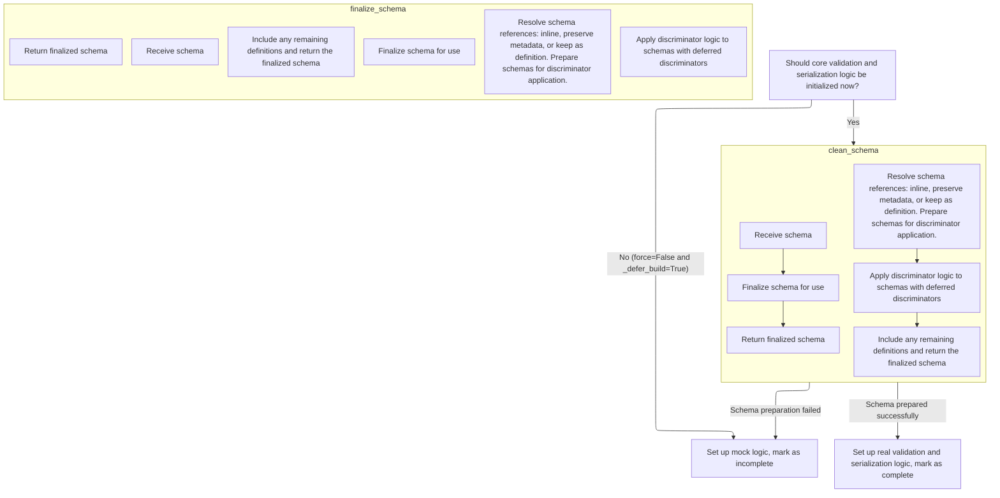

The **init** method initializes a type adapter by validating the input type and configuration, capturing namespaces for type resolution, and preparing core validation and serialization logic. It generates and finalizes a schema, applies necessary discriminator logic for unions, and completes the setup by building the validator and serializer.

```mermaid
sequenceDiagram
  participant User
  participant TypeAdapter
  User->>TypeAdapter: Provide type and optional config
  TypeAdapter->>TypeAdapter: Check for existing type config
  TypeAdapter->>TypeAdapter: Retrieve namespaces for type resolution
  TypeAdapter->>TypeAdapter: Initialize core attributes (mock or generate schema)
  TypeAdapter->>TypeAdapter: Clean and finalize schema
  TypeAdapter->>TypeAdapter: Apply discriminator logic for unions
  TypeAdapter->>TypeAdapter: Build validator and serializer
  TypeAdapter->>User: Return ready type adapter

%% Swimm:
%% sequenceDiagram
%%   participant User
%%   participant <SwmToken path="pydantic/type_adapter.py" pos="207:7:7" line-data="                &#39; parameter to TypeAdapter will not override it, thus the `config` you passed to&#39;">`TypeAdapter`</SwmToken>
%%   User->><SwmToken path="pydantic/type_adapter.py" pos="207:7:7" line-data="                &#39; parameter to TypeAdapter will not override it, thus the `config` you passed to&#39;">`TypeAdapter`</SwmToken>: Provide type and optional config
%%   <SwmToken path="pydantic/type_adapter.py" pos="207:7:7" line-data="                &#39; parameter to TypeAdapter will not override it, thus the `config` you passed to&#39;">`TypeAdapter`</SwmToken>->><SwmToken path="pydantic/type_adapter.py" pos="207:7:7" line-data="                &#39; parameter to TypeAdapter will not override it, thus the `config` you passed to&#39;">`TypeAdapter`</SwmToken>: Check for existing type config
%%   <SwmToken path="pydantic/type_adapter.py" pos="207:7:7" line-data="                &#39; parameter to TypeAdapter will not override it, thus the `config` you passed to&#39;">`TypeAdapter`</SwmToken>->><SwmToken path="pydantic/type_adapter.py" pos="207:7:7" line-data="                &#39; parameter to TypeAdapter will not override it, thus the `config` you passed to&#39;">`TypeAdapter`</SwmToken>: Retrieve namespaces for type resolution
%%   <SwmToken path="pydantic/type_adapter.py" pos="207:7:7" line-data="                &#39; parameter to TypeAdapter will not override it, thus the `config` you passed to&#39;">`TypeAdapter`</SwmToken>->><SwmToken path="pydantic/type_adapter.py" pos="207:7:7" line-data="                &#39; parameter to TypeAdapter will not override it, thus the `config` you passed to&#39;">`TypeAdapter`</SwmToken>: Initialize core attributes (mock or generate schema)
%%   <SwmToken path="pydantic/type_adapter.py" pos="207:7:7" line-data="                &#39; parameter to TypeAdapter will not override it, thus the `config` you passed to&#39;">`TypeAdapter`</SwmToken>->><SwmToken path="pydantic/type_adapter.py" pos="207:7:7" line-data="                &#39; parameter to TypeAdapter will not override it, thus the `config` you passed to&#39;">`TypeAdapter`</SwmToken>: Clean and finalize schema
%%   <SwmToken path="pydantic/type_adapter.py" pos="207:7:7" line-data="                &#39; parameter to TypeAdapter will not override it, thus the `config` you passed to&#39;">`TypeAdapter`</SwmToken>->><SwmToken path="pydantic/type_adapter.py" pos="207:7:7" line-data="                &#39; parameter to TypeAdapter will not override it, thus the `config` you passed to&#39;">`TypeAdapter`</SwmToken>: Apply discriminator logic for unions
%%   <SwmToken path="pydantic/type_adapter.py" pos="207:7:7" line-data="                &#39; parameter to TypeAdapter will not override it, thus the `config` you passed to&#39;">`TypeAdapter`</SwmToken>->><SwmToken path="pydantic/type_adapter.py" pos="207:7:7" line-data="                &#39; parameter to TypeAdapter will not override it, thus the `config` you passed to&#39;">`TypeAdapter`</SwmToken>: Build validator and serializer
%%   <SwmToken path="pydantic/type_adapter.py" pos="207:7:7" line-data="                &#39; parameter to TypeAdapter will not override it, thus the `config` you passed to&#39;">`TypeAdapter`</SwmToken>->>User: Return ready type adapter
```



# Spec

## Detailed View of the Program's Functionality

a. Setting Up <SwmToken path="pydantic/type_adapter.py" pos="207:7:7" line-data="                &#39; parameter to TypeAdapter will not override it, thus the `config` you passed to&#39;">`TypeAdapter`</SwmToken> State

The initialization process for the adapter begins by checking if the user has provided a configuration for a type that already manages its own configuration (such as a model, dataclass, or a dictionary with typed keys/values). If such a configuration is detected, an error is raised to prevent ambiguous or meaningless configuration overrides.

If no such conflict exists, the initialization proceeds to determine the appropriate namespaces for resolving type references. This involves inspecting the call stack to extract both global and local namespaces from the frame where the adapter was instantiated. This step is crucial for correctly resolving forward references and types that may be defined dynamically or at the module level.

With the namespaces determined, the adapter sets up its core attributes and environment. This includes storing the type, configuration, and module information, and then immediately invoking a method to initialize the core schema, validator, and serializer. This setup ensures that the adapter is ready to validate and serialize data according to the specified type and context.

b. Building or Mocking Schema and Validators

The core attribute initialization method decides whether to build the actual validation and serialization logic immediately or to defer it. If building is deferred (based on configuration), the adapter sets up mock logic for the schema, validator, and serializer, marking itself as incomplete.

If the logic should be built immediately, the method attempts to retrieve any pre-existing schema, validator, or serializer attached directly to the type. If these are not present or are only placeholders, the method proceeds to generate a new schema using a schema generator.

The schema generator constructs a schema for the type, handling any errors related to undefined annotations or invalid schemas by falling back to mock logic if necessary. If schema generation succeeds, the schema is then sanitized and finalized for use.

c. Sanitizing the Schema Structure

The schema cleaning step simply passes the generated schema to a finalization process. This process is responsible for resolving all references within the schema, ensuring that any indirect or recursive type references are properly handled and that the schema is in a consistent, ready-to-use state.

d. Resolving Schema References and Inlining

During schema finalization, the process traverses the schema and its referenced definitions. For each reference, it determines whether the referenced schema can be inlined (directly embedded), should be kept as a separate definition, or needs to preserve certain metadata (such as discriminator information for tagged unions).

If a reference is only used once and has no special metadata, it is inlined. If it has discriminator metadata, the metadata is preserved during inlining. Otherwise, the reference is kept as a separate definition, and the definition is included in a collection of remaining definitions.

After handling references, the process applies any deferred discriminator logic. This is particularly important for union types that use discriminators to distinguish between different variants at runtime. The discriminator is applied to the relevant schemas, updating them so they can correctly identify and validate the appropriate variant.

e. Wrapping Up Schema with Definitions

Once all references and discriminators have been processed, the finalization step checks if there are any remaining definitions that were not inlined. If so, it wraps the main schema with these definitions, ensuring that all necessary components are included. The finalized schema is then returned, fully prepared for validation and serialization tasks.

f. Finalizing Validator and Serializer Setup

Back in the core attribute initialization method, after obtaining the finalized schema, the adapter uses it to construct the actual validator and serializer objects. These objects are responsible for performing data validation and serialization according to the schema. Once these are set up, the adapter marks itself as complete and ready for use, signaling that it can now handle data according to the specified type and configuration.

# Rule Definition

| Paragraph Name                                                                                                                                                                                                                                                                                                                                                          | Rule ID | Category          | Description                                                                                                                                                                                                                                                                                                                                                                                                                                                                                                                                                                                                                                                                                                                                                                                                            | Conditions                                                                                                                                                                                                                                                                                                                                                                                                                                                        | Remarks                                                                                                                                                                                                                                                                                                                                                                                                                                                                                                                                                                                                                                                                                                                                                                                                                 |
| ----------------------------------------------------------------------------------------------------------------------------------------------------------------------------------------------------------------------------------------------------------------------------------------------------------------------------------------------------------------------- | ------- | ----------------- | ---------------------------------------------------------------------------------------------------------------------------------------------------------------------------------------------------------------------------------------------------------------------------------------------------------------------------------------------------------------------------------------------------------------------------------------------------------------------------------------------------------------------------------------------------------------------------------------------------------------------------------------------------------------------------------------------------------------------------------------------------------------------------------------------------------------------- | ----------------------------------------------------------------------------------------------------------------------------------------------------------------------------------------------------------------------------------------------------------------------------------------------------------------------------------------------------------------------------------------------------------------------------------------------------------------- | ----------------------------------------------------------------------------------------------------------------------------------------------------------------------------------------------------------------------------------------------------------------------------------------------------------------------------------------------------------------------------------------------------------------------------------------------------------------------------------------------------------------------------------------------------------------------------------------------------------------------------------------------------------------------------------------------------------------------------------------------------------------------------------------------------------------------- |
| <SwmToken path="pydantic/type_adapter.py" pos="207:7:7" line-data="                &#39; parameter to TypeAdapter will not override it, thus the `config` you passed to&#39;">`TypeAdapter`</SwmToken>.**init**                                                                                                                                                         | RL-001  | Conditional Logic | When constructing a <SwmToken path="pydantic/type_adapter.py" pos="207:7:7" line-data="                &#39; parameter to TypeAdapter will not override it, thus the `config` you passed to&#39;">`TypeAdapter`</SwmToken>, if a config is provided for a type that already manages its own config (such as a Pydantic <SwmToken path="pydantic/type_adapter.py" pos="205:20:20" line-data="                &#39;Cannot use `config` when the type is a BaseModel, dataclass or TypedDict.&#39;">`BaseModel`</SwmToken>, dataclass, or <SwmToken path="pydantic/type_adapter.py" pos="205:27:27" line-data="                &#39;Cannot use `config` when the type is a BaseModel, dataclass or TypedDict.&#39;">`TypedDict`</SwmToken>), an error must be raised indicating that config is not allowed for this type. | A config argument is provided AND the type is a <SwmToken path="pydantic/type_adapter.py" pos="205:20:20" line-data="                &#39;Cannot use `config` when the type is a BaseModel, dataclass or TypedDict.&#39;">`BaseModel`</SwmToken>, dataclass, or <SwmToken path="pydantic/type_adapter.py" pos="205:27:27" line-data="                &#39;Cannot use `config` when the type is a BaseModel, dataclass or TypedDict.&#39;">`TypedDict`</SwmToken>. | The error raised is <SwmToken path="pydantic/type_adapter.py" pos="204:3:3" line-data="            raise PydanticUserError(">`PydanticUserError`</SwmToken> with code <SwmToken path="pydantic/type_adapter.py" pos="209:4:10" line-data="                code=&#39;type-adapter-config-unused&#39;,">`type-adapter-config-unused`</SwmToken>.                                                                                                                                                                                                                                                                                                                                                                                                                                                                          |
| <SwmToken path="pydantic/type_adapter.py" pos="207:7:7" line-data="                &#39; parameter to TypeAdapter will not override it, thus the `config` you passed to&#39;">`TypeAdapter`</SwmToken>.**init**, <SwmToken path="pydantic/type_adapter.py" pos="217:7:7" line-data="        parent_frame = self._fetch_parent_frame()">`_fetch_parent_frame`</SwmToken> | RL-002  | Computation       | The <SwmToken path="pydantic/type_adapter.py" pos="207:7:7" line-data="                &#39; parameter to TypeAdapter will not override it, thus the `config` you passed to&#39;">`TypeAdapter`</SwmToken> must determine the appropriate global and local namespaces for type resolution, using the calling frame’s context, to resolve forward references and other type-related lookups.                                                                                                                                                                                                                                                                                                                                                                                                                            | <SwmToken path="pydantic/type_adapter.py" pos="207:7:7" line-data="                &#39; parameter to TypeAdapter will not override it, thus the `config` you passed to&#39;">`TypeAdapter`</SwmToken> is being initialized.                                                                                                                                                                                                                                      | The parent frame is determined by <SwmToken path="pydantic/type_adapter.py" pos="200:1:1" line-data="        _parent_depth: int = 2,">`_parent_depth`</SwmToken> (default 2). If the frame is from the 'typing' module, the previous frame is used. Global and local namespaces are extracted from the frame.                                                                                                                                                                                                                                                                                                                                                                                                                                                                                                           |
| TypeAdapter.\_init_core_attrs, TypeAdapter.\_defer_build                                                                                                                                                                                                                                                                                                                | RL-003  | Conditional Logic | If the config specifies that core validation and serialization logic should not be initialized immediately (when force is False and <SwmToken path="pydantic/type_adapter.py" pos="322:8:8" line-data="            return config.get(&#39;defer_build&#39;) is True">`defer_build`</SwmToken> is True), the <SwmToken path="pydantic/type_adapter.py" pos="207:7:7" line-data="                &#39; parameter to TypeAdapter will not override it, thus the `config` you passed to&#39;">`TypeAdapter`</SwmToken> must set up mock logic for the validator and serializer, and mark the adapter as incomplete.                                                                                                                                                                                                        | force is False AND config\[<SwmToken path="pydantic/type_adapter.py" pos="322:8:8" line-data="            return config.get(&#39;defer_build&#39;) is True">`defer_build`</SwmToken>\] is True                                                                                                                                                                                                                                                                    | The <SwmToken path="pydantic/type_adapter.py" pos="215:3:3" line-data="        self.pydantic_complete = False">`pydantic_complete`</SwmToken> attribute is set to False. Mock validator and serializer objects are used.                                                                                                                                                                                                                                                                                                                                                                                                                                                                                                                                                                                                |
| TypeAdapter.\_init_core_attrs, GenerateSchema.clean_schema                                                                                                                                                                                                                                                                                                              | RL-004  | Computation       | If core validation and serialization logic should be initialized, the system must generate a schema for the type, sanitize it (including resolving references and applying discriminators), and use the finalized schema to build validator and serializer objects. The adapter is then marked as complete.                                                                                                                                                                                                                                                                                                                                                                                                                                                                                                            | force is True OR <SwmToken path="pydantic/type_adapter.py" pos="322:8:8" line-data="            return config.get(&#39;defer_build&#39;) is True">`defer_build`</SwmToken> is False                                                                                                                                                                                                                                                                               | The schema is a dictionary (<SwmToken path="pydantic/_internal/_generate_schema.py" pos="683:11:11" line-data="    def clean_schema(self, schema: CoreSchema) -&gt; CoreSchema:">`CoreSchema`</SwmToken>) that may include keys like 'type', 'fields', 'validators', etc. Discriminators are applied for unions as needed. The <SwmToken path="pydantic/type_adapter.py" pos="215:3:3" line-data="        self.pydantic_complete = False">`pydantic_complete`</SwmToken> attribute is set to True.                                                                                                                                                                                                                                                                                                                      |
| TypeAdapter.\_init_core_attrs, TypeAdapter.validate_python, TypeAdapter.validate_json, TypeAdapter.dump_python, TypeAdapter.dump_json                                                                                                                                                                                                                                   | RL-005  | Data Assignment   | The validator and serializer attributes must be objects that support the required interfaces for validation and serialization, including methods for validating Python objects, validating JSON bytes, serializing to Python-native structures, and serializing to JSON bytes.                                                                                                                                                                                                                                                                                                                                                                                                                                                                                                                                         | <SwmToken path="pydantic/type_adapter.py" pos="207:7:7" line-data="                &#39; parameter to TypeAdapter will not override it, thus the `config` you passed to&#39;">`TypeAdapter`</SwmToken> is initialized and core logic is built (not deferred).                                                                                                                                                                                                     | Validator must have methods: <SwmToken path="pydantic/type_adapter.py" pos="381:3:3" line-data="    def validate_python(">`validate_python`</SwmToken>, <SwmToken path="pydantic/type_adapter.py" pos="431:3:3" line-data="    def validate_json(">`validate_json`</SwmToken>, <SwmToken path="pydantic/type_adapter.py" pos="520:3:3" line-data="    def get_default_value(self, *, strict: bool \| None = None, context: dict[str, Any] \| None = None) -&gt; Some[T] \| None:">`get_default_value`</SwmToken>. Serializer must have methods: <SwmToken path="pydantic/type_adapter.py" pos="572:7:7" line-data="        return self.serializer.to_python(">`to_python`</SwmToken>, <SwmToken path="pydantic/type_adapter.py" pos="634:7:7" line-data="        return self.serializer.to_json(">`to_json`</SwmToken>. |
| TypeAdapter.\_defer_build, TypeAdapter.\_model_config, GenerateSchema.\_arbitrary_types                                                                                                                                                                                                                                                                                 | RL-006  | Conditional Logic | The config dictionary may include options such as <SwmToken path="pydantic/_internal/_generate_schema.py" pos="374:7:7" line-data="        return self._config_wrapper.arbitrary_types_allowed">`arbitrary_types_allowed`</SwmToken> and <SwmToken path="pydantic/type_adapter.py" pos="322:8:8" line-data="            return config.get(&#39;defer_build&#39;) is True">`defer_build`</SwmToken>, which must be enforced during schema generation and adapter initialization.                                                                                                                                                                                                                                                                                                                                        | Config dictionary is provided or inferred from the type.                                                                                                                                                                                                                                                                                                                                                                                                          | <SwmToken path="pydantic/_internal/_generate_schema.py" pos="374:7:7" line-data="        return self._config_wrapper.arbitrary_types_allowed">`arbitrary_types_allowed`</SwmToken>: boolean, <SwmToken path="pydantic/type_adapter.py" pos="322:8:8" line-data="            return config.get(&#39;defer_build&#39;) is True">`defer_build`</SwmToken>: boolean. These affect schema generation and initialization timing.                                                                                                                                                                                                                                                                                                                                                                                              |
| TypeAdapter.\_init_core_attrs, TypeAdapter.pydantic_complete                                                                                                                                                                                                                                                                                                            | RL-007  | Conditional Logic | The output of the <SwmToken path="pydantic/type_adapter.py" pos="207:7:7" line-data="                &#39; parameter to TypeAdapter will not override it, thus the `config` you passed to&#39;">`TypeAdapter`</SwmToken> must be a fully initialized adapter object with the required attributes and behaviors, ready to validate and serialize data of the specified type according to the provided configuration and schema. If initialization is deferred, the adapter must be marked as incomplete.                                                                                                                                                                                                                                                                                                                | <SwmToken path="pydantic/type_adapter.py" pos="207:7:7" line-data="                &#39; parameter to TypeAdapter will not override it, thus the `config` you passed to&#39;">`TypeAdapter`</SwmToken> is constructed and initialization is performed (immediate or deferred).                                                                                                                                                                                    | <SwmToken path="pydantic/type_adapter.py" pos="215:3:3" line-data="        self.pydantic_complete = False">`pydantic_complete`</SwmToken>: boolean indicating completeness. Adapter exposes <SwmToken path="pydantic/type_adapter.py" pos="270:3:3" line-data="            self.core_schema = _getattr_no_parents(self._type, &#39;__pydantic_core_schema__&#39;)">`core_schema`</SwmToken>, validator, serializer, and completeness flag.                                                                                                                                                                                                                                                                                                                                                                              |

# User Stories

## User Story 1: Initialize and use <SwmToken path="pydantic/type_adapter.py" pos="207:7:7" line-data="                &#39; parameter to TypeAdapter will not override it, thus the `config` you passed to&#39;">`TypeAdapter`</SwmToken> with correct config, schema, and interfaces

---

### Story Description:

As a user of the <SwmToken path="pydantic/type_adapter.py" pos="207:7:7" line-data="                &#39; parameter to TypeAdapter will not override it, thus the `config` you passed to&#39;">`TypeAdapter`</SwmToken>, I want the adapter to initialize with the correct schema, configuration options, error handling for invalid configs, completeness status, and validator/serializer interfaces, including support for deferred initialization and proper namespace resolution, so that I can reliably validate and serialize data according to my needs and configuration, and be prevented from misusing configuration in unsupported scenarios.

---

### Business Rule Mapping:

| Rule ID | Paragraph Name                                                                                                                                                                                                                                                                                                                                                          | Rule Description                                                                                                                                                                                                                                                                                                                                                                                                                                                                                                                                                                                                                                                                                                                                                                                                       |
| ------- | ----------------------------------------------------------------------------------------------------------------------------------------------------------------------------------------------------------------------------------------------------------------------------------------------------------------------------------------------------------------------- | ---------------------------------------------------------------------------------------------------------------------------------------------------------------------------------------------------------------------------------------------------------------------------------------------------------------------------------------------------------------------------------------------------------------------------------------------------------------------------------------------------------------------------------------------------------------------------------------------------------------------------------------------------------------------------------------------------------------------------------------------------------------------------------------------------------------------- |
| RL-001  | <SwmToken path="pydantic/type_adapter.py" pos="207:7:7" line-data="                &#39; parameter to TypeAdapter will not override it, thus the `config` you passed to&#39;">`TypeAdapter`</SwmToken>.**init**                                                                                                                                                         | When constructing a <SwmToken path="pydantic/type_adapter.py" pos="207:7:7" line-data="                &#39; parameter to TypeAdapter will not override it, thus the `config` you passed to&#39;">`TypeAdapter`</SwmToken>, if a config is provided for a type that already manages its own config (such as a Pydantic <SwmToken path="pydantic/type_adapter.py" pos="205:20:20" line-data="                &#39;Cannot use `config` when the type is a BaseModel, dataclass or TypedDict.&#39;">`BaseModel`</SwmToken>, dataclass, or <SwmToken path="pydantic/type_adapter.py" pos="205:27:27" line-data="                &#39;Cannot use `config` when the type is a BaseModel, dataclass or TypedDict.&#39;">`TypedDict`</SwmToken>), an error must be raised indicating that config is not allowed for this type. |
| RL-002  | <SwmToken path="pydantic/type_adapter.py" pos="207:7:7" line-data="                &#39; parameter to TypeAdapter will not override it, thus the `config` you passed to&#39;">`TypeAdapter`</SwmToken>.**init**, <SwmToken path="pydantic/type_adapter.py" pos="217:7:7" line-data="        parent_frame = self._fetch_parent_frame()">`_fetch_parent_frame`</SwmToken> | The <SwmToken path="pydantic/type_adapter.py" pos="207:7:7" line-data="                &#39; parameter to TypeAdapter will not override it, thus the `config` you passed to&#39;">`TypeAdapter`</SwmToken> must determine the appropriate global and local namespaces for type resolution, using the calling frame’s context, to resolve forward references and other type-related lookups.                                                                                                                                                                                                                                                                                                                                                                                                                            |
| RL-003  | TypeAdapter.\_init_core_attrs, TypeAdapter.\_defer_build                                                                                                                                                                                                                                                                                                                | If the config specifies that core validation and serialization logic should not be initialized immediately (when force is False and <SwmToken path="pydantic/type_adapter.py" pos="322:8:8" line-data="            return config.get(&#39;defer_build&#39;) is True">`defer_build`</SwmToken> is True), the <SwmToken path="pydantic/type_adapter.py" pos="207:7:7" line-data="                &#39; parameter to TypeAdapter will not override it, thus the `config` you passed to&#39;">`TypeAdapter`</SwmToken> must set up mock logic for the validator and serializer, and mark the adapter as incomplete.                                                                                                                                                                                                        |
| RL-004  | TypeAdapter.\_init_core_attrs, GenerateSchema.clean_schema                                                                                                                                                                                                                                                                                                              | If core validation and serialization logic should be initialized, the system must generate a schema for the type, sanitize it (including resolving references and applying discriminators), and use the finalized schema to build validator and serializer objects. The adapter is then marked as complete.                                                                                                                                                                                                                                                                                                                                                                                                                                                                                                            |
| RL-005  | TypeAdapter.\_init_core_attrs, TypeAdapter.validate_python, TypeAdapter.validate_json, TypeAdapter.dump_python, TypeAdapter.dump_json                                                                                                                                                                                                                                   | The validator and serializer attributes must be objects that support the required interfaces for validation and serialization, including methods for validating Python objects, validating JSON bytes, serializing to Python-native structures, and serializing to JSON bytes.                                                                                                                                                                                                                                                                                                                                                                                                                                                                                                                                         |
| RL-007  | TypeAdapter.\_init_core_attrs, TypeAdapter.pydantic_complete                                                                                                                                                                                                                                                                                                            | The output of the <SwmToken path="pydantic/type_adapter.py" pos="207:7:7" line-data="                &#39; parameter to TypeAdapter will not override it, thus the `config` you passed to&#39;">`TypeAdapter`</SwmToken> must be a fully initialized adapter object with the required attributes and behaviors, ready to validate and serialize data of the specified type according to the provided configuration and schema. If initialization is deferred, the adapter must be marked as incomplete.                                                                                                                                                                                                                                                                                                                |
| RL-006  | TypeAdapter.\_defer_build, TypeAdapter.\_model_config, GenerateSchema.\_arbitrary_types                                                                                                                                                                                                                                                                                 | The config dictionary may include options such as <SwmToken path="pydantic/_internal/_generate_schema.py" pos="374:7:7" line-data="        return self._config_wrapper.arbitrary_types_allowed">`arbitrary_types_allowed`</SwmToken> and <SwmToken path="pydantic/type_adapter.py" pos="322:8:8" line-data="            return config.get(&#39;defer_build&#39;) is True">`defer_build`</SwmToken>, which must be enforced during schema generation and adapter initialization.                                                                                                                                                                                                                                                                                                                                        |

---

### Relevant Functionality:

- **TypeAdapter.init**
  1. **RL-001:**
     - On <SwmToken path="pydantic/type_adapter.py" pos="207:7:7" line-data="                &#39; parameter to TypeAdapter will not override it, thus the `config` you passed to&#39;">`TypeAdapter`</SwmToken> construction:
       - If type is a <SwmToken path="pydantic/type_adapter.py" pos="205:20:20" line-data="                &#39;Cannot use `config` when the type is a BaseModel, dataclass or TypedDict.&#39;">`BaseModel`</SwmToken>, dataclass, or <SwmToken path="pydantic/type_adapter.py" pos="205:27:27" line-data="                &#39;Cannot use `config` when the type is a BaseModel, dataclass or TypedDict.&#39;">`TypedDict`</SwmToken> AND config is not None:
         - Raise a user error indicating config cannot be used for this type.
  2. **RL-002:**
     - On <SwmToken path="pydantic/type_adapter.py" pos="207:7:7" line-data="                &#39; parameter to TypeAdapter will not override it, thus the `config` you passed to&#39;">`TypeAdapter`</SwmToken> initialization:
       - Fetch the parent frame using the specified depth.
       - If the frame's globals indicate the 'typing' module, use the previous frame.
       - Extract global and local namespaces from the frame for use in type resolution.
- **TypeAdapter.\_init_core_attrs**
  1. **RL-003:**
     - On core attribute initialization:
       - If not force AND <SwmToken path="pydantic/type_adapter.py" pos="322:8:8" line-data="            return config.get(&#39;defer_build&#39;) is True">`defer_build`</SwmToken> is True:
         - Set mock validator and serializer.
         - Set <SwmToken path="pydantic/type_adapter.py" pos="215:3:3" line-data="        self.pydantic_complete = False">`pydantic_complete`</SwmToken> to False.
  2. **RL-004:**
     - On core attribute initialization:
       - Generate schema for the type using config and namespace context.
       - Pass schema to <SwmToken path="pydantic/type_adapter.py" pos="297:9:9" line-data="                self.core_schema = schema_generator.clean_schema(core_schema)">`clean_schema`</SwmToken> for finalization (resolve references, apply discriminators, wrap with definitions if needed).
       - Build validator and serializer objects from the finalized schema.
       - Set <SwmToken path="pydantic/type_adapter.py" pos="215:3:3" line-data="        self.pydantic_complete = False">`pydantic_complete`</SwmToken> to True.
  3. **RL-005:**
     - After schema is finalized:
       - Assign validator object supporting <SwmToken path="pydantic/type_adapter.py" pos="381:3:3" line-data="    def validate_python(">`validate_python`</SwmToken>, <SwmToken path="pydantic/type_adapter.py" pos="431:3:3" line-data="    def validate_json(">`validate_json`</SwmToken>, <SwmToken path="pydantic/type_adapter.py" pos="520:3:3" line-data="    def get_default_value(self, *, strict: bool | None = None, context: dict[str, Any] | None = None) -&gt; Some[T] | None:">`get_default_value`</SwmToken>.
       - Assign serializer object supporting <SwmToken path="pydantic/type_adapter.py" pos="572:7:7" line-data="        return self.serializer.to_python(">`to_python`</SwmToken>, <SwmToken path="pydantic/type_adapter.py" pos="634:7:7" line-data="        return self.serializer.to_json(">`to_json`</SwmToken>.
  4. **RL-007:**
     - After initialization:
       - If core logic is built, set <SwmToken path="pydantic/type_adapter.py" pos="215:3:3" line-data="        self.pydantic_complete = False">`pydantic_complete`</SwmToken> to True and expose all required attributes.
       - If deferred, set <SwmToken path="pydantic/type_adapter.py" pos="215:3:3" line-data="        self.pydantic_complete = False">`pydantic_complete`</SwmToken> to False and expose mock validator/serializer.
- **TypeAdapter.\_defer_build**
  1. **RL-006:**
     - On initialization and schema generation:
       - Check config for <SwmToken path="pydantic/_internal/_generate_schema.py" pos="374:7:7" line-data="        return self._config_wrapper.arbitrary_types_allowed">`arbitrary_types_allowed`</SwmToken> and <SwmToken path="pydantic/type_adapter.py" pos="322:8:8" line-data="            return config.get(&#39;defer_build&#39;) is True">`defer_build`</SwmToken>.
       - Apply these options to schema generation and initialization logic.

# Code Walkthrough

```mermaid
%%{init: {"flowchart": {"defaultRenderer": "elk"}} }%%
flowchart TD
    node1["Start TypeAdapter initialization"] --> node2{"Is config provided for a type with its own config?"}
    click node1 openCode "pydantic/type_adapter.py:195:203"
    node2 -- Yes --> node3["Raise error: Config not allowed for this type"]
    click node2 openCode "pydantic/type_adapter.py:203:210"
    click node3 openCode "pydantic/type_adapter.py:204:210"
    node2 -- No --> node4["Determine namespaces (global & local)"]
    click node4 openCode "pydantic/type_adapter.py:217:224"
    node4 --> node5["Set up adapter attributes and environment (using config & module)"]
    click node5 openCode "pydantic/type_adapter.py:226:233"

%% Swimm:
%% %%{init: {"flowchart": {"defaultRenderer": "elk"}} }%%
%% flowchart TD
%%     node1["Start <SwmToken path="pydantic/type_adapter.py" pos="207:7:7" line-data="                &#39; parameter to TypeAdapter will not override it, thus the `config` you passed to&#39;">`TypeAdapter`</SwmToken> initialization"] --> node2{"Is config provided for a type with its own config?"}
%%     click node1 openCode "<SwmPath>[pydantic/type_adapter.py](pydantic/type_adapter.py)</SwmPath>:195:203"
%%     node2 -- Yes --> node3["Raise error: Config not allowed for this type"]
%%     click node2 openCode "<SwmPath>[pydantic/type_adapter.py](pydantic/type_adapter.py)</SwmPath>:203:210"
%%     click node3 openCode "<SwmPath>[pydantic/type_adapter.py](pydantic/type_adapter.py)</SwmPath>:204:210"
%%     node2 -- No --> node4["Determine namespaces (global & local)"]
%%     click node4 openCode "<SwmPath>[pydantic/type_adapter.py](pydantic/type_adapter.py)</SwmPath>:217:224"
%%     node4 --> node5["Set up adapter attributes and environment (using config & module)"]
%%     click node5 openCode "<SwmPath>[pydantic/type_adapter.py](pydantic/type_adapter.py)</SwmPath>:226:233"
```

## Setting Up <SwmToken path="pydantic/type_adapter.py" pos="207:7:7" line-data="                &#39; parameter to TypeAdapter will not override it, thus the `config` you passed to&#39;">`TypeAdapter`</SwmToken> State



<SwmSnippet path="/pydantic/type_adapter.py" line="195">

---

<SwmToken path="pydantic/type_adapter.py" pos="195:3:3" line-data="    def __init__(">`__init__`</SwmToken> kicks off the flow by checking if the provided type already manages its own config, raising an error if the user tries to override it. It then grabs the calling frame's namespaces to resolve types correctly, especially for dynamic or module-level usage. Finally, it sets up the core attributes using a namespace resolver, which is why it immediately calls <SwmToken path="pydantic/type_adapter.py" pos="227:3:3" line-data="        self._init_core_attrs(">`_init_core_attrs`</SwmToken>—that step wires up the schema, validator, and serializer for the type, using the right context.

```python
    def __init__(
        self,
        type: Any,
        *,
        config: ConfigDict | None = None,
        _parent_depth: int = 2,
        module: str | None = None,
    ) -> None:
        if _type_has_config(type) and config is not None:
            raise PydanticUserError(
                'Cannot use `config` when the type is a BaseModel, dataclass or TypedDict.'
                ' These types can have their own config and setting the config via the `config`'
                ' parameter to TypeAdapter will not override it, thus the `config` you passed to'
                ' TypeAdapter becomes meaningless, which is probably not what you want.',
                code='type-adapter-config-unused',
            )

        self._type = type
        self._config = config
        self._parent_depth = _parent_depth
        self.pydantic_complete = False

        parent_frame = self._fetch_parent_frame()
        if parent_frame is not None:
            globalns = parent_frame.f_globals
            # Do not provide a local ns if the type adapter happens to be instantiated at the module level:
            localns = parent_frame.f_locals if parent_frame.f_locals is not globalns else {}
        else:
            globalns = {}
            localns = {}

        self._module_name = module or cast(str, globalns.get('__name__', ''))
        self._init_core_attrs(
            ns_resolver=_namespace_utils.NsResolver(
                namespaces_tuple=_namespace_utils.NamespacesTuple(locals=localns, globals=globalns),
                parent_namespace=localns,
            ),
            force=False,
        )
```

---

</SwmSnippet>

## Building or Mocking Schema and Validators



<SwmSnippet path="/pydantic/type_adapter.py" line="246">

---

In <SwmToken path="pydantic/type_adapter.py" pos="246:3:3" line-data="    def _init_core_attrs(">`_init_core_attrs`</SwmToken>, we either use mocks or generate a schema, then call <SwmToken path="pydantic/type_adapter.py" pos="297:9:9" line-data="                self.core_schema = schema_generator.clean_schema(core_schema)">`clean_schema`</SwmToken> to make sure the schema is ready for the next steps.

```python
    def _init_core_attrs(
        self, ns_resolver: _namespace_utils.NsResolver, force: bool, raise_errors: bool = False
    ) -> bool:
        """Initialize the core schema, validator, and serializer for the type.

        Args:
            ns_resolver: The namespace resolver to use when building the core schema for the adapted type.
            force: Whether to force the construction of the core schema, validator, and serializer.
                If `force` is set to `False` and `_defer_build` is `True`, the core schema, validator, and serializer will be set to mocks.
            raise_errors: Whether to raise errors if initializing any of the core attrs fails.

        Returns:
            `True` if the core schema, validator, and serializer were successfully initialized, otherwise `False`.

        Raises:
            PydanticUndefinedAnnotation: If `PydanticUndefinedAnnotation` occurs in`__get_pydantic_core_schema__`
                and `raise_errors=True`.
        """
        if not force and self._defer_build:
            _mock_val_ser.set_type_adapter_mocks(self)
            self.pydantic_complete = False
            return False

        try:
            self.core_schema = _getattr_no_parents(self._type, '__pydantic_core_schema__')
            self.validator = _getattr_no_parents(self._type, '__pydantic_validator__')
            self.serializer = _getattr_no_parents(self._type, '__pydantic_serializer__')

            # TODO: we don't go through the rebuild logic here directly because we don't want
            # to repeat all of the namespace fetching logic that we've already done
            # so we simply skip to the block below that does the actual schema generation
            if (
                isinstance(self.core_schema, _mock_val_ser.MockCoreSchema)
                or isinstance(self.validator, _mock_val_ser.MockValSer)
                or isinstance(self.serializer, _mock_val_ser.MockValSer)
            ):
                raise AttributeError()
        except AttributeError:
            config_wrapper = _config.ConfigWrapper(self._config)

            schema_generator = _generate_schema.GenerateSchema(config_wrapper, ns_resolver=ns_resolver)

            try:
                core_schema = schema_generator.generate_schema(self._type)
            except PydanticUndefinedAnnotation:
                if raise_errors:
                    raise
                _mock_val_ser.set_type_adapter_mocks(self)
                return False

            try:
                self.core_schema = schema_generator.clean_schema(core_schema)
            except _generate_schema.InvalidSchemaError:
                _mock_val_ser.set_type_adapter_mocks(self)
                return False

```

---

</SwmSnippet>

### Sanitizing the Schema Structure

<SwmSnippet path="/pydantic/_internal/_generate_schema.py" line="683">

---

<SwmToken path="pydantic/_internal/_generate_schema.py" pos="683:3:3" line-data="    def clean_schema(self, schema: CoreSchema) -&gt; CoreSchema:">`clean_schema`</SwmToken> just passes the schema to <SwmToken path="pydantic/_internal/_generate_schema.py" pos="684:7:7" line-data="        return self.defs.finalize_schema(schema)">`finalize_schema`</SwmToken> to get it fully resolved.

```python
    def clean_schema(self, schema: CoreSchema) -> CoreSchema:
        return self.defs.finalize_schema(schema)
```

---

</SwmSnippet>

### Resolving Schema References and Inlining

<SwmSnippet path="/pydantic/_internal/_generate_schema.py" line="2736">

---

In <SwmToken path="pydantic/_internal/_generate_schema.py" pos="2736:3:3" line-data="    def finalize_schema(self, schema: CoreSchema) -&gt; CoreSchema:">`finalize_schema`</SwmToken>, we process references, inlining or keeping them as needed, and prep for discriminator handling.

```python
    def finalize_schema(self, schema: CoreSchema) -> CoreSchema:
        """Finalize the core schema.

        This traverses the core schema and referenced definitions, replaces `'definition-ref'` schemas
        by the referenced definition if possible, and applies deferred discriminators.
        """
        definitions = self._definitions
        try:
            gather_result = gather_schemas_for_cleaning(
                schema,
                definitions=definitions,
            )
        except MissingDefinitionError as e:
            raise InvalidSchemaError from e

        remaining_defs: dict[str, CoreSchema] = {}

        # Note: this logic doesn't play well when core schemas with deferred discriminator metadata
        # and references are encountered. See the `test_deferred_discriminated_union_and_references()` test.
        for ref, inlinable_def_ref in gather_result['collected_references'].items():
            if inlinable_def_ref is not None and (inlining_behavior := _inlining_behavior(inlinable_def_ref)) != 'keep':
                if inlining_behavior == 'inline':
                    # `ref` was encountered, and only once:
                    #  - `inlinable_def_ref` is a `'definition-ref'` schema and is guaranteed to be
                    #    the only one. Transform it into the definition it points to.
                    #  - Do not store the definition in the `remaining_defs`.
                    inlinable_def_ref.clear()  # pyright: ignore[reportAttributeAccessIssue]
                    inlinable_def_ref.update(self._resolve_definition(ref, definitions))  # pyright: ignore
                elif inlining_behavior == 'preserve_metadata':
                    # `ref` was encountered, and only once, but contains discriminator metadata.
                    # We will do the same thing as if `inlining_behavior` was `'inline'`, but make
                    # sure to keep the metadata for the deferred discriminator application logic below.
                    meta = inlinable_def_ref.pop('metadata')
                    inlinable_def_ref.clear()  # pyright: ignore[reportAttributeAccessIssue]
                    inlinable_def_ref.update(self._resolve_definition(ref, definitions))  # pyright: ignore
                    inlinable_def_ref['metadata'] = meta
            else:
                # `ref` was encountered, at least two times (or only once, but with metadata or a serialization schema):
                # - Do not inline the `'definition-ref'` schemas (they are not provided in the gather result anyway).
                # - Store the the definition in the `remaining_defs`
                remaining_defs[ref] = self._resolve_definition(ref, definitions)
```

---

</SwmSnippet>

<SwmSnippet path="/pydantic/_internal/_generate_schema.py" line="2776">

---

After handling references, we loop through schemas that need discriminators for union types. We pop the discriminator metadata and use <SwmToken path="pydantic/_internal/_generate_schema.py" pos="2785:7:7" line-data="            applied = _discriminated_union.apply_discriminator(cs.copy(), discriminator, remaining_defs)">`apply_discriminator`</SwmToken> to update the schema so it can differentiate between types at runtime. This is key for supporting tagged unions.

```python
                remaining_defs[ref] = self._resolve_definition(ref, definitions)

        for cs in gather_result['deferred_discriminator_schemas']:
            discriminator: str | None = cs['metadata'].pop('pydantic_internal_union_discriminator', None)  # pyright: ignore[reportTypedDictNotRequiredAccess]
            if discriminator is None:
                # This can happen in rare scenarios, when a deferred schema is present multiple times in the
                # gather result (e.g. when using the `Sequence` type -- see `test_sequence_discriminated_union()`).
                # In this case, a previous loop iteration applied the discriminator and so we can just skip it here.
                continue
            applied = _discriminated_union.apply_discriminator(cs.copy(), discriminator, remaining_defs)
            # Mutate the schema directly to have the discriminator applied
            cs.clear()  # pyright: ignore[reportAttributeAccessIssue]
            cs.update(applied)  # pyright: ignore

```

---

</SwmSnippet>

#### Applying Discriminator Logic to Unions

See <SwmLink doc-title="Applying Tagged Union Logic with a Discriminator">[Applying Tagged Union Logic with a Discriminator](/.swm/applying-tagged-union-logic-with-a-discriminator.x82ze5pg.sw.md)</SwmLink>

#### Wrapping Up Schema with Definitions

<SwmSnippet path="/pydantic/_internal/_generate_schema.py" line="2790">

---

Back in <SwmToken path="pydantic/_internal/_generate_schema.py" pos="684:7:7" line-data="        return self.defs.finalize_schema(schema)">`finalize_schema`</SwmToken>, after applying discriminators, we check if there are any definitions left that weren't inlined. If so, we wrap the schema with those definitions to make sure everything needed is included. Then we return the finalized schema, ready for use.

```python
        if remaining_defs:
            schema = core_schema.definitions_schema(schema=schema, definitions=[*remaining_defs.values()])
        return schema
```

---

</SwmSnippet>

### Finalizing Validator and Serializer Setup

<SwmSnippet path="/pydantic/type_adapter.py" line="302">

---

Back in <SwmToken path="pydantic/type_adapter.py" pos="227:3:3" line-data="        self._init_core_attrs(">`_init_core_attrs`</SwmToken>, after getting the finalized schema from <SwmToken path="pydantic/type_adapter.py" pos="297:9:9" line-data="                self.core_schema = schema_generator.clean_schema(core_schema)">`clean_schema`</SwmToken>, we use it to build the validator and serializer. This completes the setup, so we mark the adapter as ready for use.

```python
            core_config = config_wrapper.core_config(None)

            self.validator = create_schema_validator(
                schema=self.core_schema,
                schema_type=self._type,
                schema_type_module=self._module_name,
                schema_type_name=str(self._type),
                schema_kind='TypeAdapter',
                config=core_config,
                plugin_settings=config_wrapper.plugin_settings,
            )
            self.serializer = SchemaSerializer(self.core_schema, core_config)

        self.pydantic_complete = True
        return True
```

---

</SwmSnippet>

&nbsp;

*This is an auto-generated document by Swimm 🌊 and has not yet been verified by a human*

<SwmMeta version="3.0.0" repo-id="Z2l0aHViJTNBJTNBcHlkYW50aWMlM0ElM0FTd2ltbS1EZW1v" repo-name="pydantic"><sup>Powered by [Swimm](/)</sup></SwmMeta>
