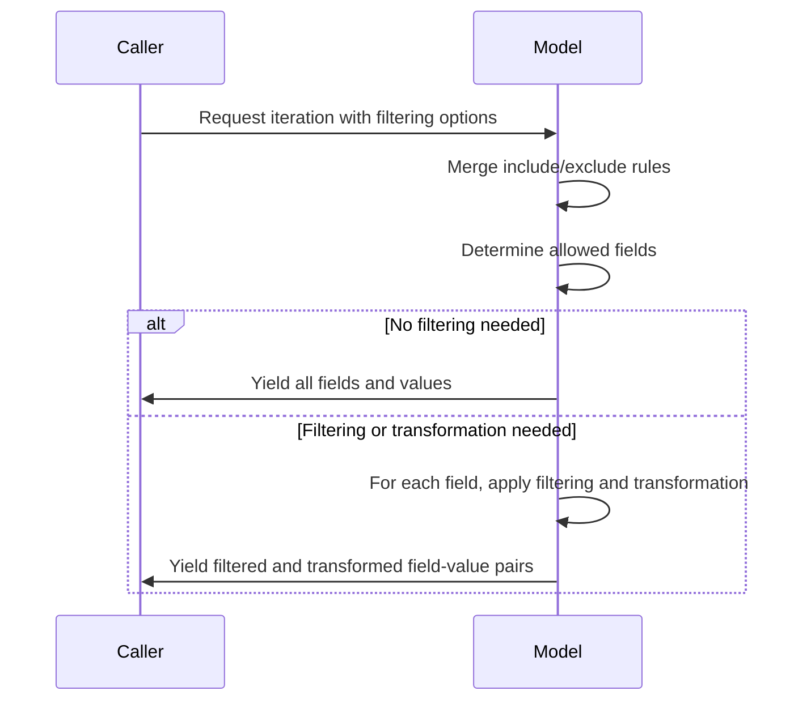
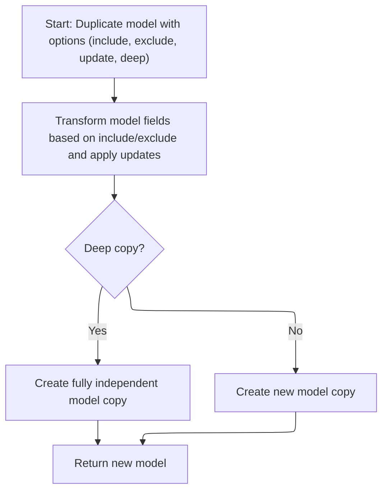
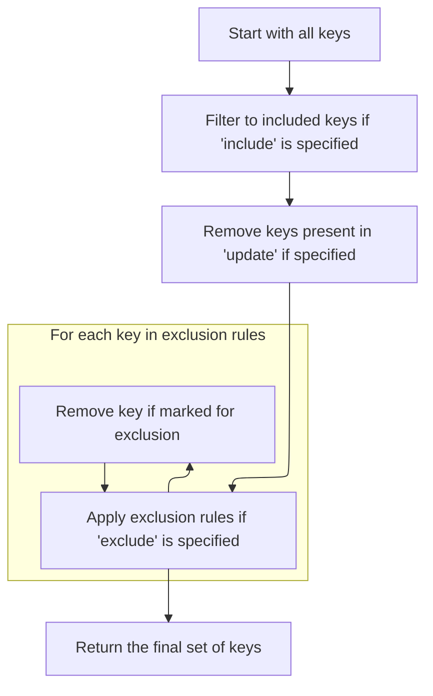
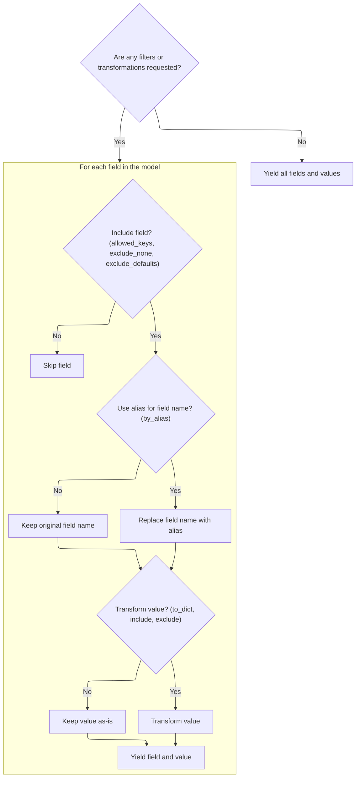

\_iter allows iteration over a model's fields with advanced filtering and transformation options. It merges filtering rules, determines which fields to include, and applies transformations like aliasing or recursive conversion for nested models. This is essential for tasks like serializing models or creating filtered copies, ensuring only the relevant data is processed.

Main steps:

- Merge filtering rules from the model and user input
- Determine allowed fields
- Yield all fields directly if no filtering is needed
- Otherwise, filter and transform each field as required
- Yield the final filtered and transformed field-value pairs



# Spec

## Detailed View of the Program's Functionality

a. Setting Up Filtering Rules for Iteration

When iterating over a model's fields (for example, when converting a model to a dictionary or copying it), the process begins by determining which fields should be included or excluded. This is handled in the method responsible for iteration. The method first checks if the caller or the model itself has specified any include or exclude rules. If so, it merges these rules using a utility that combines the sets, ensuring that explicit caller options take precedence. This merging is done for both include and exclude rules, and the result is a set of filtering instructions that will be used for the rest of the process.

b. Determining Allowed Fields

After merging the include and exclude rules, the method calls a helper to calculate the set of allowed field keys. This helper examines whether any filtering is actually needed. If no include, exclude, or "exclude unset" options are specified, it returns None, signaling that all fields are allowed. If "exclude unset" is specified, it starts with the set of fields that have been explicitly set on the model; otherwise, it starts with all fields present in the model's internal dictionary.

c. Finalizing Allowed Keys After Copy

Once the initial set of keys is determined, further filtering is applied:

- If an include rule is present, the set of keys is intersected with the include set.
- If an update dictionary is provided (for copying or updating models), any keys present in the update are removed from the allowed set.
- If an exclude rule is present, any keys marked for exclusion are removed from the set.
- The final set of allowed keys is then returned for use in iteration or copying.

d. Optimized Output Path

Back in the main iteration method, if there are no filtering or transformation options (i.e., no include/exclude, no aliasing, no exclusion of unset/default/None values), the method takes a fast path: it simply yields all items from the model's internal dictionary as-is, which is much faster than applying filters.

e. Iterating and Filtering Model Fields

If any filtering or transformation is needed, the method loops through each field in the model:

- It checks if the field is in the allowed set and, if "exclude None" is set, skips fields with a value of None.
- If "exclude defaults" is set, it checks if the field's value matches its default and skips it if so.
- If aliasing is requested, it replaces the field name with its alias for output.
- If value transformation is needed (for nested models, dicts, or sequences), it calls a recursive helper to handle this.

f. Recursively Transforming Field Values

The recursive helper for value transformation works as follows:

- If the value is itself a model and "to dict" is requested, it calls the model's dict method with the current filtering options. If the result is a root model, it returns just the root value; otherwise, it returns the full dict.
- If "to dict" is not requested, it calls the model's copy method with the current filtering options, producing a filtered duplicate.
- If the value is a dictionary, it recursively applies the same transformation to each key-value pair, respecting include/exclude rules for nested keys.
- If the value is a sequence (like a list or tuple), it recursively transforms each element, again applying include/exclude rules.
- If the value is an Enum and the configuration says to use Enum values, it returns the Enum's value.
- Otherwise, it returns the value as-is.

g. Duplicating a Model with Field Filtering

When duplicating a model (for example, via the copy method), the process uses the same iteration and filtering logic described above. It builds a dictionary of field values by calling the iteration method with the desired include/exclude options. If an update dictionary is provided, its values are merged in. The set of fields is updated to include any new keys from the update. Finally, a new model instance is created with these values and the updated field set, optionally performing a deep copy if requested.

h. Yielding the Final Filtered Items

After all filtering and transformation, the iteration method yields the final pairs of field names (or aliases) and their values. These pairs represent the model's data as filtered and transformed according to all the specified options, ready for use in dict conversion, copying, or other operations.

# Rule Definition

| Paragraph Name                                                                                                                                                                                                                                                                                            | Rule ID | Category          | Description                                                                                                                                                                                                                                                                                                                                                                                                                                                                                                                             | Conditions                                                                                                                                                                                                                                                                                                 | Remarks                                                                                                                                                                                                                                                                                                                                                                                                                                                                                                                             |
| --------------------------------------------------------------------------------------------------------------------------------------------------------------------------------------------------------------------------------------------------------------------------------------------------------- | ------- | ----------------- | --------------------------------------------------------------------------------------------------------------------------------------------------------------------------------------------------------------------------------------------------------------------------------------------------------------------------------------------------------------------------------------------------------------------------------------------------------------------------------------------------------------------------------------- | ---------------------------------------------------------------------------------------------------------------------------------------------------------------------------------------------------------------------------------------------------------------------------------------------------------- | ----------------------------------------------------------------------------------------------------------------------------------------------------------------------------------------------------------------------------------------------------------------------------------------------------------------------------------------------------------------------------------------------------------------------------------------------------------------------------------------------------------------------------------- |
| <SwmToken path="pydantic/v1/main.py" pos="383:26:28" line-data="                # - keep other values (e.g. submodels) untouched (using `BaseModel.dict()` will change them into dicts)">`BaseModel.dict`</SwmToken>, BaseModel.copy, BaseModel.\_iter, BaseModel.\_get_value                             | RL-001  | Conditional Logic | The system must allow filtering and transformation of model fields for iteration, copying, and serialization, supporting both flat and nested (recursive) models.                                                                                                                                                                                                                                                                                                                                                                       | Whenever a model is iterated, copied, or serialized (<SwmToken path="pydantic/v1/main.py" pos="295:16:18" line-data="        # for attributes not in `new_namespace` (e.g. private attributes)">`e.g`</SwmToken>., via dict(), copy(), or json()), the filtering and transformation logic must be applied. | Filtering options include include, exclude, <SwmToken path="pydantic/v1/main.py" pos="440:1:1" line-data="        exclude_unset: bool = False,">`exclude_unset`</SwmToken>, <SwmToken path="pydantic/v1/main.py" pos="441:1:1" line-data="        exclude_defaults: bool = False,">`exclude_defaults`</SwmToken>, and <SwmToken path="pydantic/v1/main.py" pos="442:1:1" line-data="        exclude_none: bool = False,">`exclude_none`</SwmToken>. Output is always standard Python types (dict, set, sequence, primitives, etc.). |
| <SwmToken path="pydantic/v1/main.py" pos="383:26:28" line-data="                # - keep other values (e.g. submodels) untouched (using `BaseModel.dict()` will change them into dicts)">`BaseModel.dict`</SwmToken>, BaseModel.copy, BaseModel.\_iter, BaseModel.\_calculate_keys, BaseModel.\_get_value | RL-002  | Conditional Logic | The system must support filtering options: include, exclude, <SwmToken path="pydantic/v1/main.py" pos="440:1:1" line-data="        exclude_unset: bool = False,">`exclude_unset`</SwmToken>, <SwmToken path="pydantic/v1/main.py" pos="441:1:1" line-data="        exclude_defaults: bool = False,">`exclude_defaults`</SwmToken>, <SwmToken path="pydantic/v1/main.py" pos="442:1:1" line-data="        exclude_none: bool = False,">`exclude_none`</SwmToken>. These can be provided by the user or defined at the model/field level. | When dict(), copy(), or iteration is called with filtering options, or when model/field-level include/exclude is set.                                                                                                                                                                                      | include/exclude can be sets or mappings (for nested filtering). <SwmToken path="pydantic/v1/main.py" pos="440:1:1" line-data="        exclude_unset: bool = False,">`exclude_unset`</SwmToken>, <SwmToken path="pydantic/v1/main.py" pos="441:1:1" line-data="        exclude_defaults: bool = False,">`exclude_defaults`</SwmToken>, <SwmToken path="pydantic/v1/main.py" pos="442:1:1" line-data="        exclude_none: bool = False,">`exclude_none`</SwmToken> are booleans.                                                    |
| BaseModel.\_iter, <SwmToken path="pydantic/v1/main.py" pos="841:5:7" line-data="            exclude = ValueItems.merge(self.__exclude_fields__, exclude)">`ValueItems.merge`</SwmToken>                                                                                                                   | RL-003  | Computation       | User-provided include/exclude rules are merged with model-level rules. User rules take precedence unless intersection is requested.                                                                                                                                                                                                                                                                                                                                                                                                     | When both user and model-level include/exclude rules are present.                                                                                                                                                                                                                                          | Intersection is used for include rules (intersect=True), union for exclude rules.                                                                                                                                                                                                                                                                                                                                                                                                                                                   |
| BaseModel.\_calculate_keys                                                                                                                                                                                                                                                                                | RL-004  | Computation       | The set of allowed fields is determined by starting with all fields (or <SwmToken path="pydantic/v1/main.py" pos="659:1:1" line-data="            fields_set = self.__fields_set__ \| update.keys()">`fields_set`</SwmToken> if <SwmToken path="pydantic/v1/main.py" pos="440:1:1" line-data="        exclude_unset: bool = False,">`exclude_unset`</SwmToken>), intersecting with include, removing update keys, and removing excluded fields.                                                                                         | When calculating which fields to output for dict(), copy(), or iteration.                                                                                                                                                                                                                                  | Allowed keys are computed as a set of field names.                                                                                                                                                                                                                                                                                                                                                                                                                                                                                  |
| BaseModel.\_iter, BaseModel.\_get_value                                                                                                                                                                                                                                                                   | RL-005  | Conditional Logic | Field-value pairs are yielded/returned according to filtering and transformation options, including recursive transformation for nested models, dicts, and sequences.                                                                                                                                                                                                                                                                                                                                                                   | When iterating or serializing a model, and filtering/transformation is requested.                                                                                                                                                                                                                          | If <SwmToken path="pydantic/v1/main.py" pos="438:1:1" line-data="        by_alias: bool = False,">`by_alias`</SwmToken> is true, use field aliases as keys. If no filtering, yield all fields as-is.                                                                                                                                                                                                                                                                                                                                |
| BaseModel.\_get_value                                                                                                                                                                                                                                                                                     | RL-006  | Computation       | Recursive transformation is applied to field values that are models, dicts, or sequences, passing down nested include/exclude rules.                                                                                                                                                                                                                                                                                                                                                                                                    | When a field value is a model, dict, or sequence during transformation/copy/serialization.                                                                                                                                                                                                                 | If <SwmToken path="pydantic/v1/main.py" pos="801:21:21" line-data="        elif isinstance(v, Enum) and getattr(cls.Config, &#39;use_enum_values&#39;, False):">`use_enum_values`</SwmToken> is set, Enum values are used. Otherwise, values are returned as-is.                                                                                                                                                                                                                                                                    |
| <SwmToken path="pydantic/v1/main.py" pos="383:26:28" line-data="                # - keep other values (e.g. submodels) untouched (using `BaseModel.dict()` will change them into dicts)">`BaseModel.dict`</SwmToken>, BaseModel.json, BaseModel.\_enforce_dict_if_root                                    | RL-007  | Conditional Logic | Root models (with a single <SwmToken path="pydantic/v1/main.py" pos="756:3:3" line-data="                if ROOT_KEY in v_dict:">`ROOT_KEY`</SwmToken> field) are serialized by returning the value directly if the result is a dict with only <SwmToken path="pydantic/v1/main.py" pos="756:3:3" line-data="                if ROOT_KEY in v_dict:">`ROOT_KEY`</SwmToken>. During transformation/copy, the wrapped value is processed with the same rules.                                                                             | When serializing or transforming a root model.                                                                                                                                                                                                                                                             | <SwmToken path="pydantic/v1/main.py" pos="756:3:3" line-data="                if ROOT_KEY in v_dict:">`ROOT_KEY`</SwmToken> is a constant (usually '**root**'). Output is the value for that key, not a dict.                                                                                                                                                                                                                                                                                                                       |
| BaseModel.\_iter, <SwmToken path="pydantic/v1/main.py" pos="746:8:8" line-data="        if isinstance(v, BaseModel):">`BaseModel`</SwmToken>.**setattr**, <SwmToken path="pydantic/v1/main.py" pos="746:8:8" line-data="        if isinstance(v, BaseModel):">`BaseModel`</SwmToken>.**getstate**         | RL-008  | Conditional Logic | Private attributes (names starting with underscore or defined as private) are not included in any output, copy, or serialization.                                                                                                                                                                                                                                                                                                                                                                                                       | Whenever model fields are iterated, copied, or serialized.                                                                                                                                                                                                                                                 | Private attributes are tracked in <SwmToken path="pydantic/v1/main.py" pos="129:1:1" line-data="        private_attributes: Dict[str, ModelPrivateAttr] = {}">`private_attributes`</SwmToken> and skipped in output.                                                                                                                                                                                                                                                                                                                |
| <SwmToken path="pydantic/v1/main.py" pos="762:5:5" line-data="        value_exclude = ValueItems(v, exclude) if exclude else None">`ValueItems`</SwmToken>, <SwmToken path="pydantic/v1/main.py" pos="36:1:1" line-data="    ModelField,">`ModelField`</SwmToken>                                         | RL-009  | Computation       | Utilities must provide merging of rulesets, extraction of nested rules, and determination of rule activity/inclusion/exclusion. Model fields must provide metadata and validation.                                                                                                                                                                                                                                                                                                                                                      | Whenever include/exclude rules or field metadata are needed.                                                                                                                                                                                                                                               | Utilities are used internally for rule merging and field info extraction.                                                                                                                                                                                                                                                                                                                                                                                                                                                           |
| BaseModel.\_get_value, BaseModel.\_iter                                                                                                                                                                                                                                                                   | RL-010  | Computation       | The system supports arbitrary depth of nested filtering and transformation, passing down relevant include/exclude rules at each level.                                                                                                                                                                                                                                                                                                                                                                                                  | When models, dicts, or sequences are nested within each other.                                                                                                                                                                                                                                             | Recursive calls pass down include/exclude rules for each nested element.                                                                                                                                                                                                                                                                                                                                                                                                                                                            |

# User Stories

## User Story 1: Filtering and transforming model fields for iteration, copying, and serialization

---

### Story Description:

As a user of data models, I want to filter and transform model fields during iteration, copying, and serialization, supporting both flat and nested (recursive) models, so that I can control which fields and values are included in the output according to my needs.

---

### Business Rule Mapping:

| Rule ID | Paragraph Name                                                                                                                                                                                                                                                                                            | Rule Description                                                                                                                                                                                                                                                                                                                                                                                                                                                                                                                        |
| ------- | --------------------------------------------------------------------------------------------------------------------------------------------------------------------------------------------------------------------------------------------------------------------------------------------------------- | --------------------------------------------------------------------------------------------------------------------------------------------------------------------------------------------------------------------------------------------------------------------------------------------------------------------------------------------------------------------------------------------------------------------------------------------------------------------------------------------------------------------------------------- |
| RL-001  | <SwmToken path="pydantic/v1/main.py" pos="383:26:28" line-data="                # - keep other values (e.g. submodels) untouched (using `BaseModel.dict()` will change them into dicts)">`BaseModel.dict`</SwmToken>, BaseModel.copy, BaseModel.\_iter, BaseModel.\_get_value                             | The system must allow filtering and transformation of model fields for iteration, copying, and serialization, supporting both flat and nested (recursive) models.                                                                                                                                                                                                                                                                                                                                                                       |
| RL-002  | <SwmToken path="pydantic/v1/main.py" pos="383:26:28" line-data="                # - keep other values (e.g. submodels) untouched (using `BaseModel.dict()` will change them into dicts)">`BaseModel.dict`</SwmToken>, BaseModel.copy, BaseModel.\_iter, BaseModel.\_calculate_keys, BaseModel.\_get_value | The system must support filtering options: include, exclude, <SwmToken path="pydantic/v1/main.py" pos="440:1:1" line-data="        exclude_unset: bool = False,">`exclude_unset`</SwmToken>, <SwmToken path="pydantic/v1/main.py" pos="441:1:1" line-data="        exclude_defaults: bool = False,">`exclude_defaults`</SwmToken>, <SwmToken path="pydantic/v1/main.py" pos="442:1:1" line-data="        exclude_none: bool = False,">`exclude_none`</SwmToken>. These can be provided by the user or defined at the model/field level. |
| RL-005  | BaseModel.\_iter, BaseModel.\_get_value                                                                                                                                                                                                                                                                   | Field-value pairs are yielded/returned according to filtering and transformation options, including recursive transformation for nested models, dicts, and sequences.                                                                                                                                                                                                                                                                                                                                                                   |
| RL-006  | BaseModel.\_get_value                                                                                                                                                                                                                                                                                     | Recursive transformation is applied to field values that are models, dicts, or sequences, passing down nested include/exclude rules.                                                                                                                                                                                                                                                                                                                                                                                                    |
| RL-010  | BaseModel.\_get_value, BaseModel.\_iter                                                                                                                                                                                                                                                                   | The system supports arbitrary depth of nested filtering and transformation, passing down relevant include/exclude rules at each level.                                                                                                                                                                                                                                                                                                                                                                                                  |

---

### Relevant Functionality:

- <SwmToken path="pydantic/v1/main.py" pos="383:26:28" line-data="                # - keep other values (e.g. submodels) untouched (using `BaseModel.dict()` will change them into dicts)">`BaseModel.dict`</SwmToken>
  1. **RL-001:**
     - When iterating, copying, or serializing a model:
       - Merge include/exclude rules from user and model.
       - Determine allowed fields based on rules and options.
       - For each allowed field:
         - If recursive transformation is needed (nested model, dict, or sequence), apply rules recursively.
         - Exclude fields as per <SwmToken path="pydantic/v1/main.py" pos="442:1:1" line-data="        exclude_none: bool = False,">`exclude_none`</SwmToken> and <SwmToken path="pydantic/v1/main.py" pos="441:1:1" line-data="        exclude_defaults: bool = False,">`exclude_defaults`</SwmToken>.
         - Use alias as key if <SwmToken path="pydantic/v1/main.py" pos="438:1:1" line-data="        by_alias: bool = False,">`by_alias`</SwmToken> is true.
       - Return/yield field-value pairs as per the above.
  2. **RL-002:**
     - Accept include/exclude as arguments or from model/field metadata.
     - If <SwmToken path="pydantic/v1/main.py" pos="440:1:1" line-data="        exclude_unset: bool = False,">`exclude_unset`</SwmToken> is true, only fields in <SwmToken path="pydantic/v1/main.py" pos="659:1:1" line-data="            fields_set = self.__fields_set__ | update.keys()">`fields_set`</SwmToken> are considered.
     - If <SwmToken path="pydantic/v1/main.py" pos="441:1:1" line-data="        exclude_defaults: bool = False,">`exclude_defaults`</SwmToken> is true, exclude fields whose value equals their default.
     - If <SwmToken path="pydantic/v1/main.py" pos="442:1:1" line-data="        exclude_none: bool = False,">`exclude_none`</SwmToken> is true, exclude fields whose value is None.
- **BaseModel.\_iter**
  1. **RL-005:**
     - For each allowed field:
       - If <SwmToken path="pydantic/v1/main.py" pos="442:1:1" line-data="        exclude_none: bool = False,">`exclude_none`</SwmToken> is true and value is None, skip.
       - If <SwmToken path="pydantic/v1/main.py" pos="441:1:1" line-data="        exclude_defaults: bool = False,">`exclude_defaults`</SwmToken> is true and value equals default, skip.
       - If <SwmToken path="pydantic/v1/main.py" pos="438:1:1" line-data="        by_alias: bool = False,">`by_alias`</SwmToken> is true, use alias as key.
       - If <SwmToken path="pydantic/v1/main.py" pos="457:1:1" line-data="                to_dict=True,">`to_dict`</SwmToken> or filtering is active, recursively transform value as needed.
- **BaseModel.\_get_value**
  1. **RL-006:**
     - If value is a model:
       - If <SwmToken path="pydantic/v1/main.py" pos="457:1:1" line-data="                to_dict=True,">`to_dict`</SwmToken>, call dict() recursively with options.
       - Else, call copy() recursively with options.
     - If value is a dict, apply rules recursively to keys/values.
     - If value is a sequence, apply rules recursively to elements.
     - If value is Enum and <SwmToken path="pydantic/v1/main.py" pos="801:21:21" line-data="        elif isinstance(v, Enum) and getattr(cls.Config, &#39;use_enum_values&#39;, False):">`use_enum_values`</SwmToken> is set, use Enum.value.
     - Else, return value as-is.
  2. **RL-010:**
     - For each nested model/dict/sequence, call transformation recursively with appropriate rules.

## User Story 2: Merging include/exclude rules and calculating allowed fields

---

### Story Description:

As a user of data models, I want the system to merge user-provided and model-level include/exclude rules and calculate the allowed set of fields for output, so that filtering is applied correctly and consistently according to both user and model specifications.

---

### Business Rule Mapping:

| Rule ID | Paragraph Name                                                                                                                                                                                                                                                    | Rule Description                                                                                                                                                                                                                                                                                                                                                                                                                                |
| ------- | ----------------------------------------------------------------------------------------------------------------------------------------------------------------------------------------------------------------------------------------------------------------- | ----------------------------------------------------------------------------------------------------------------------------------------------------------------------------------------------------------------------------------------------------------------------------------------------------------------------------------------------------------------------------------------------------------------------------------------------- |
| RL-003  | BaseModel.\_iter, <SwmToken path="pydantic/v1/main.py" pos="841:5:7" line-data="            exclude = ValueItems.merge(self.__exclude_fields__, exclude)">`ValueItems.merge`</SwmToken>                                                                           | User-provided include/exclude rules are merged with model-level rules. User rules take precedence unless intersection is requested.                                                                                                                                                                                                                                                                                                             |
| RL-004  | BaseModel.\_calculate_keys                                                                                                                                                                                                                                        | The set of allowed fields is determined by starting with all fields (or <SwmToken path="pydantic/v1/main.py" pos="659:1:1" line-data="            fields_set = self.__fields_set__ \| update.keys()">`fields_set`</SwmToken> if <SwmToken path="pydantic/v1/main.py" pos="440:1:1" line-data="        exclude_unset: bool = False,">`exclude_unset`</SwmToken>), intersecting with include, removing update keys, and removing excluded fields. |
| RL-009  | <SwmToken path="pydantic/v1/main.py" pos="762:5:5" line-data="        value_exclude = ValueItems(v, exclude) if exclude else None">`ValueItems`</SwmToken>, <SwmToken path="pydantic/v1/main.py" pos="36:1:1" line-data="    ModelField,">`ModelField`</SwmToken> | Utilities must provide merging of rulesets, extraction of nested rules, and determination of rule activity/inclusion/exclusion. Model fields must provide metadata and validation.                                                                                                                                                                                                                                                              |

---

### Relevant Functionality:

- **BaseModel.\_iter**
  1. **RL-003:**
     - If both user and model-level rules are present:
       - For include: merge with intersection.
       - For exclude: merge with user taking precedence.
     - If only one is present, use that.
     - If neither, no filtering.
- **BaseModel.\_calculate_keys**
  1. **RL-004:**
     - Start with all field names or <SwmToken path="pydantic/v1/main.py" pos="659:1:1" line-data="            fields_set = self.__fields_set__ | update.keys()">`fields_set`</SwmToken> if <SwmToken path="pydantic/v1/main.py" pos="440:1:1" line-data="        exclude_unset: bool = False,">`exclude_unset`</SwmToken>.
     - If include is specified, intersect with its keys.
     - If update mapping is present, remove those keys.
     - Remove any keys present in exclude.
- <SwmToken path="pydantic/v1/main.py" pos="762:5:5" line-data="        value_exclude = ValueItems(v, exclude) if exclude else None">`ValueItems`</SwmToken>
  1. **RL-009:**
     - Use <SwmToken path="pydantic/v1/main.py" pos="841:5:7" line-data="            exclude = ValueItems.merge(self.__exclude_fields__, exclude)">`ValueItems.merge`</SwmToken> for merging rules.
     - Use ValueItems.for_element for extracting nested rules.
     - Use ValueItems.is_true/is_included/is_excluded for rule checks.
     - <SwmToken path="pydantic/v1/main.py" pos="36:1:1" line-data="    ModelField,">`ModelField`</SwmToken> provides name, alias, required, default, type, final, metadata, and validate().

## User Story 3: Handling root models and private attributes in output

---

### Story Description:

As a user of data models, I want root models to be serialized by returning their wrapped value directly and private attributes to be excluded from all output, so that special cases are handled correctly and sensitive or internal data is not exposed.

---

### Business Rule Mapping:

| Rule ID | Paragraph Name                                                                                                                                                                                                                                                                                    | Rule Description                                                                                                                                                                                                                                                                                                                                                                                                                                            |
| ------- | ------------------------------------------------------------------------------------------------------------------------------------------------------------------------------------------------------------------------------------------------------------------------------------------------- | ----------------------------------------------------------------------------------------------------------------------------------------------------------------------------------------------------------------------------------------------------------------------------------------------------------------------------------------------------------------------------------------------------------------------------------------------------------- |
| RL-007  | <SwmToken path="pydantic/v1/main.py" pos="383:26:28" line-data="                # - keep other values (e.g. submodels) untouched (using `BaseModel.dict()` will change them into dicts)">`BaseModel.dict`</SwmToken>, BaseModel.json, BaseModel.\_enforce_dict_if_root                            | Root models (with a single <SwmToken path="pydantic/v1/main.py" pos="756:3:3" line-data="                if ROOT_KEY in v_dict:">`ROOT_KEY`</SwmToken> field) are serialized by returning the value directly if the result is a dict with only <SwmToken path="pydantic/v1/main.py" pos="756:3:3" line-data="                if ROOT_KEY in v_dict:">`ROOT_KEY`</SwmToken>. During transformation/copy, the wrapped value is processed with the same rules. |
| RL-008  | BaseModel.\_iter, <SwmToken path="pydantic/v1/main.py" pos="746:8:8" line-data="        if isinstance(v, BaseModel):">`BaseModel`</SwmToken>.**setattr**, <SwmToken path="pydantic/v1/main.py" pos="746:8:8" line-data="        if isinstance(v, BaseModel):">`BaseModel`</SwmToken>.**getstate** | Private attributes (names starting with underscore or defined as private) are not included in any output, copy, or serialization.                                                                                                                                                                                                                                                                                                                           |

---

### Relevant Functionality:

- <SwmToken path="pydantic/v1/main.py" pos="383:26:28" line-data="                # - keep other values (e.g. submodels) untouched (using `BaseModel.dict()` will change them into dicts)">`BaseModel.dict`</SwmToken>
  1. **RL-007:**
     - If model is a root model and result is a dict with only <SwmToken path="pydantic/v1/main.py" pos="756:3:3" line-data="                if ROOT_KEY in v_dict:">`ROOT_KEY`</SwmToken>:
       - Return the value for <SwmToken path="pydantic/v1/main.py" pos="756:3:3" line-data="                if ROOT_KEY in v_dict:">`ROOT_KEY`</SwmToken> directly.
     - When transforming/copying, process the wrapped value recursively.
- **BaseModel.\_iter**
  1. **RL-008:**
     - When yielding or returning fields, skip any that are private (in <SwmToken path="pydantic/v1/main.py" pos="129:1:1" line-data="        private_attributes: Dict[str, ModelPrivateAttr] = {}">`private_attributes`</SwmToken> or start with underscore).

# Code Walkthrough

## Filtering and Preparing Field Sets for Iteration

```mermaid
%%{init: {"flowchart": {"defaultRenderer": "elk"}} }%%
flowchart TD
    node1["Setup include/exclude rules"] --> node2["Determine allowed fields"]
    click node1 openCode "pydantic/v1/main.py:828:848"
    click node2 openCode "pydantic/v1/main.py:884:884"
    node2 --> node3{"Optimized output?"}
    click node3 openCode "pydantic/v1/main.py:849:853"
    node3 -->|"Yes"| node5["Yield all fields as-is"]
    click node5 openCode "pydantic/v1/main.py:851:852"
    node3 -->|"No"| loop1
    
    subgraph loop1["For each field in the model"]
        node4["Transform value if needed"] --> node5
        click node4 openCode "pydantic/v1/main.py:735:881"
    end


subgraph node2 [_calculate_keys]
  sgmain_1_node1{"Are any filtering rules specified? (include, exclude, exclude_unset)"} -->|"No"| sgmain_1_node4["Return all fields"]
  click sgmain_1_node1 openCode "pydantic/v1/main.py:891:892"
  click sgmain_1_node4 openCode "pydantic/v1/main.py:892:892"
  sgmain_1_node1 -->|"Yes"| sgmain_1_node2["Select fields based on exclude_unset"]
  click sgmain_1_node2 openCode "pydantic/v1/main.py:895:898"
  sgmain_1_node2 --> sgmain_1_node3["Apply include (keep), update (remove), exclude (remove) rules"]
  click sgmain_1_node3 openCode "pydantic/v1/main.py:900:909"
  sgmain_1_node3 --> sgmain_1_node4["Return final set of fields"]
  click sgmain_1_node4 openCode "pydantic/v1/main.py:909:909"
end

%% Swimm:
%% %%{init: {"flowchart": {"defaultRenderer": "elk"}} }%%
%% flowchart TD
%%     node1["Setup include/exclude rules"] --> node2["Determine allowed fields"]
%%     click node1 openCode "<SwmPath>[pydantic/v1/main.py](pydantic/v1/main.py)</SwmPath>:828:848"
%%     click node2 openCode "<SwmPath>[pydantic/v1/main.py](pydantic/v1/main.py)</SwmPath>:884:884"
%%     node2 --> node3{"Optimized output?"}
%%     click node3 openCode "<SwmPath>[pydantic/v1/main.py](pydantic/v1/main.py)</SwmPath>:849:853"
%%     node3 -->|"Yes"| node5["Yield all fields as-is"]
%%     click node5 openCode "<SwmPath>[pydantic/v1/main.py](pydantic/v1/main.py)</SwmPath>:851:852"
%%     node3 -->|"No"| loop1
%%     
%%     subgraph loop1["For each field in the model"]
%%         node4["Transform value if needed"] --> node5
%%         click node4 openCode "<SwmPath>[pydantic/v1/main.py](pydantic/v1/main.py)</SwmPath>:735:881"
%%     end
%% 
%% 
%% subgraph node2 [<SwmToken path="pydantic/v1/main.py" pos="846:7:7" line-data="        allowed_keys = self._calculate_keys(">`_calculate_keys`</SwmToken>]
%%   sgmain_1_node1{"Are any filtering rules specified? (include, exclude, <SwmToken path="pydantic/v1/main.py" pos="440:1:1" line-data="        exclude_unset: bool = False,">`exclude_unset`</SwmToken>)"} -->|"No"| sgmain_1_node4["Return all fields"]
%%   click sgmain_1_node1 openCode "<SwmPath>[pydantic/v1/main.py](pydantic/v1/main.py)</SwmPath>:891:892"
%%   click sgmain_1_node4 openCode "<SwmPath>[pydantic/v1/main.py](pydantic/v1/main.py)</SwmPath>:892:892"
%%   sgmain_1_node1 -->|"Yes"| sgmain_1_node2["Select fields based on <SwmToken path="pydantic/v1/main.py" pos="440:1:1" line-data="        exclude_unset: bool = False,">`exclude_unset`</SwmToken>"]
%%   click sgmain_1_node2 openCode "<SwmPath>[pydantic/v1/main.py](pydantic/v1/main.py)</SwmPath>:895:898"
%%   sgmain_1_node2 --> sgmain_1_node3["Apply include (keep), update (remove), exclude (remove) rules"]
%%   click sgmain_1_node3 openCode "<SwmPath>[pydantic/v1/main.py](pydantic/v1/main.py)</SwmPath>:900:909"
%%   sgmain_1_node3 --> sgmain_1_node4["Return final set of fields"]
%%   click sgmain_1_node4 openCode "<SwmPath>[pydantic/v1/main.py](pydantic/v1/main.py)</SwmPath>:909:909"
%% end
```



<SwmSnippet path="/pydantic/v1/main.py" line="828">

---

In <SwmToken path="pydantic/v1/main.py" pos="828:3:3" line-data="    def _iter(">`_iter`</SwmToken>, we start by merging the user-provided include/exclude sets with the model's internal field sets using <SwmToken path="pydantic/v1/main.py" pos="841:5:7" line-data="            exclude = ValueItems.merge(self.__exclude_fields__, exclude)">`ValueItems.merge`</SwmToken>. This way, any constraints set by the model or the caller are combined. Next, we call <SwmToken path="pydantic/v1/main.py" pos="846:7:7" line-data="        allowed_keys = self._calculate_keys(">`_calculate_keys`</SwmToken> with these merged sets and the <SwmToken path="pydantic/v1/main.py" pos="834:1:1" line-data="        exclude_unset: bool = False,">`exclude_unset`</SwmToken> flag to figure out which fields we should actually consider for output. This sets up the filtering for the rest of the iteration.

```python
    def _iter(
        self,
        to_dict: bool = False,
        by_alias: bool = False,
        include: Optional[Union['AbstractSetIntStr', 'MappingIntStrAny']] = None,
        exclude: Optional[Union['AbstractSetIntStr', 'MappingIntStrAny']] = None,
        exclude_unset: bool = False,
        exclude_defaults: bool = False,
        exclude_none: bool = False,
    ) -> 'TupleGenerator':
        # Merge field set excludes with explicit exclude parameter with explicit overriding field set options.
        # The extra "is not None" guards are not logically necessary but optimizes performance for the simple case.
        if exclude is not None or self.__exclude_fields__ is not None:
            exclude = ValueItems.merge(self.__exclude_fields__, exclude)

        if include is not None or self.__include_fields__ is not None:
            include = ValueItems.merge(self.__include_fields__, include, intersect=True)

        allowed_keys = self._calculate_keys(
            include=include, exclude=exclude, exclude_unset=exclude_unset  # type: ignore
        )
```

---

</SwmSnippet>

### Determining Which Fields to Include

<SwmSnippet path="/pydantic/v1/main.py" line="884">

---

<SwmToken path="pydantic/v1/main.py" pos="884:3:3" line-data="    def _calculate_keys(">`_calculate_keys`</SwmToken> picks either the set fields or all fields as a starting point, copying if needed to avoid side effects.

```python
    def _calculate_keys(
        self,
        include: Optional['MappingIntStrAny'],
        exclude: Optional['MappingIntStrAny'],
        exclude_unset: bool,
        update: Optional['DictStrAny'] = None,
    ) -> Optional[AbstractSet[str]]:
        if include is None and exclude is None and exclude_unset is False:
            return None

        keys: AbstractSet[str]
        if exclude_unset:
            keys = self.__fields_set__.copy()
        else:
            keys = self.__dict__.keys()

```

---

</SwmSnippet>

#### Duplicating a Model with Field Filtering



<SwmSnippet path="/pydantic/v1/main.py" line="633">

---

In <SwmToken path="pydantic/v1/main.py" pos="633:3:3" line-data="    def copy(">`copy`</SwmToken>, we build the new model's values by calling <SwmToken path="pydantic/v1/main.py" pos="653:3:3" line-data="            self._iter(to_dict=False, by_alias=False, include=include, exclude=exclude, exclude_unset=False),">`_iter`</SwmToken> with the relevant include/exclude options. This lets us filter which fields to copy over, instead of blindly copying everything. <SwmToken path="pydantic/v1/main.py" pos="653:3:3" line-data="            self._iter(to_dict=False, by_alias=False, include=include, exclude=exclude, exclude_unset=False),">`_iter`</SwmToken> handles all the filtering logic for us.

```python
    def copy(
        self: 'Model',
        *,
        include: Optional[Union['AbstractSetIntStr', 'MappingIntStrAny']] = None,
        exclude: Optional[Union['AbstractSetIntStr', 'MappingIntStrAny']] = None,
        update: Optional['DictStrAny'] = None,
        deep: bool = False,
    ) -> 'Model':
        """
        Duplicate a model, optionally choose which fields to include, exclude and change.

        :param include: fields to include in new model
        :param exclude: fields to exclude from new model, as with values this takes precedence over include
        :param update: values to change/add in the new model. Note: the data is not validated before creating
            the new model: you should trust this data
        :param deep: set to `True` to make a deep copy of the model
        :return: new model instance
        """

        values = dict(
            self._iter(to_dict=False, by_alias=False, include=include, exclude=exclude, exclude_unset=False),
```

---

</SwmSnippet>

<SwmSnippet path="/pydantic/v1/main.py" line="652">

---

Back in <SwmToken path="pydantic/v1/main.py" pos="633:3:3" line-data="    def copy(">`copy`</SwmToken>, after getting the filtered items from <SwmToken path="pydantic/v1/main.py" pos="653:3:3" line-data="            self._iter(to_dict=False, by_alias=False, include=include, exclude=exclude, exclude_unset=False),">`_iter`</SwmToken>, we turn them into a dict. This gives us the actual field-value mapping for the new model. If there's an update, we merge those values in too.

```python
        values = dict(
            self._iter(to_dict=False, by_alias=False, include=include, exclude=exclude, exclude_unset=False),
            **(update or {}),
        )

```

---

</SwmSnippet>

<SwmSnippet path="/pydantic/v1/main.py" line="433">

---

<SwmToken path="pydantic/v1/main.py" pos="433:3:3" line-data="    def dict(">`dict`</SwmToken> just wraps <SwmToken path="pydantic/v1/main.py" pos="456:3:3" line-data="            self._iter(">`_iter`</SwmToken> with all the filtering and transformation options, then builds a dict from the results. This way, all the logic for filtering fields, using aliases, and handling nested models is centralized in <SwmToken path="pydantic/v1/main.py" pos="456:3:3" line-data="            self._iter(">`_iter`</SwmToken>.

```python
    def dict(
        self,
        *,
        include: Optional[Union['AbstractSetIntStr', 'MappingIntStrAny']] = None,
        exclude: Optional[Union['AbstractSetIntStr', 'MappingIntStrAny']] = None,
        by_alias: bool = False,
        skip_defaults: Optional[bool] = None,
        exclude_unset: bool = False,
        exclude_defaults: bool = False,
        exclude_none: bool = False,
    ) -> 'DictStrAny':
        """
        Generate a dictionary representation of the model, optionally specifying which fields to include or exclude.

        """
        if skip_defaults is not None:
            warnings.warn(
                f'{self.__class__.__name__}.dict(): "skip_defaults" is deprecated and replaced by "exclude_unset"',
                DeprecationWarning,
            )
            exclude_unset = skip_defaults

        return dict(
            self._iter(
                to_dict=True,
                by_alias=by_alias,
                include=include,
                exclude=exclude,
                exclude_unset=exclude_unset,
                exclude_defaults=exclude_defaults,
                exclude_none=exclude_none,
            )
        )
```

---

</SwmSnippet>

<SwmSnippet path="/pydantic/v1/main.py" line="657">

---

After building the values dict in <SwmToken path="pydantic/v1/main.py" pos="633:3:3" line-data="    def copy(">`copy`</SwmToken>, we update the <SwmToken path="pydantic/v1/main.py" pos="659:1:1" line-data="            fields_set = self.__fields_set__ | update.keys()">`fields_set`</SwmToken> to include any new keys from update. Then we call <SwmToken path="pydantic/v1/main.py" pos="663:5:5" line-data="        return self._copy_and_set_values(values, fields_set, deep=deep)">`_copy_and_set_values`</SwmToken> to actually create the new model instance with these values and the correct <SwmToken path="pydantic/v1/main.py" pos="659:1:1" line-data="            fields_set = self.__fields_set__ | update.keys()">`fields_set`</SwmToken>.

```python
        # new `__fields_set__` can have unset optional fields with a set value in `update` kwarg
        if update:
            fields_set = self.__fields_set__ | update.keys()
        else:
            fields_set = set(self.__fields_set__)

        return self._copy_and_set_values(values, fields_set, deep=deep)
```

---

</SwmSnippet>

#### Constructing the New Model Instance

See <SwmLink doc-title="Duplicating a Model Instance with Optional Deep Copy">[Duplicating a Model Instance with Optional Deep Copy](/.swm/duplicating-a-model-instance-with-optional-deep-copy.yms9qkoj.sw.md)</SwmLink>

#### Finalizing Allowed Keys After Copy



<SwmSnippet path="/pydantic/v1/main.py" line="900">

---

After handling the initial key set in <SwmToken path="pydantic/v1/main.py" pos="846:7:7" line-data="        allowed_keys = self._calculate_keys(">`_calculate_keys`</SwmToken>, we further filter it: intersect with include, remove any keys from update, and exclude keys marked as true in exclude. This gives us the final set of allowed keys for iteration or copying.

```python
        if include is not None:
            keys &= include.keys()

        if update:
            keys -= update.keys()

        if exclude:
            keys -= {k for k, v in exclude.items() if ValueItems.is_true(v)}

        return keys
```

---

</SwmSnippet>

### Iterating and Filtering Model Fields



<SwmSnippet path="/pydantic/v1/main.py" line="849">

---

Back in <SwmToken path="pydantic/v1/main.py" pos="850:11:11" line-data="            # huge boost for plain _iter()">`_iter`</SwmToken>, if no filtering or transformation is needed, we just yield all items from <SwmToken path="pydantic/v1/main.py" pos="851:7:7" line-data="            yield from self.__dict__.items()">`__dict__`</SwmToken> for speed. Otherwise, we loop through each field, applying filters for allowed keys, None values, and defaults. If we need to transform values (like for nested models or filtering), we call <SwmToken path="pydantic/v1/main.py" pos="872:7:7" line-data="                v = self._get_value(">`_get_value`</SwmToken> to handle that recursively.

```python
        if allowed_keys is None and not (to_dict or by_alias or exclude_unset or exclude_defaults or exclude_none):
            # huge boost for plain _iter()
            yield from self.__dict__.items()
            return

        value_exclude = ValueItems(self, exclude) if exclude is not None else None
        value_include = ValueItems(self, include) if include is not None else None

        for field_key, v in self.__dict__.items():
            if (allowed_keys is not None and field_key not in allowed_keys) or (exclude_none and v is None):
                continue

            if exclude_defaults:
                model_field = self.__fields__.get(field_key)
                if not getattr(model_field, 'required', True) and getattr(model_field, 'default', _missing) == v:
                    continue

            if by_alias and field_key in self.__fields__:
                dict_key = self.__fields__[field_key].alias
            else:
                dict_key = field_key

            if to_dict or value_include or value_exclude:
                v = self._get_value(
                    v,
                    to_dict=to_dict,
                    by_alias=by_alias,
                    include=value_include and value_include.for_element(field_key),
                    exclude=value_exclude and value_exclude.for_element(field_key),
                    exclude_unset=exclude_unset,
                    exclude_defaults=exclude_defaults,
                    exclude_none=exclude_none,
                )
```

---

</SwmSnippet>

### Recursively Transforming Field Values

```mermaid
%%{init: {"flowchart": {"defaultRenderer": "elk"}} }%%
flowchart TD
    node1["Receive value to transform"] --> node2{"Is value a Pydantic model?"}
    click node1 openCode "pydantic/v1/main.py:735:805"
    node2 -->|"Yes"| node3{"Convert to dict? (to_dict)"}
    node3 -->|"Yes"| node4["Transform model to dict (with include/exclude rules)"]
    click node4 openCode "pydantic/v1/main.py:747:758"
    node3 -->|"No"| node5["Copy model (with include/exclude rules)"]
    click node5 openCode "pydantic/v1/main.py:759:760"
    node4 --> node6["Return transformed dict or root value"]
    click node6 openCode "pydantic/v1/main.py:756:758"
    node5 --> node6
    node2 -->|"No"| node7{"Is value a dict?"}
    node7 -->|"Yes"| loop1
    node7 -->|"No"| node10{"Is value a sequence?"}
    node10 -->|"Yes"| loop2
    node10 -->|"No"| node13{"Is value an Enum and use_enum_values?"}
    node13 -->|"Yes"| node14["Return Enum value"]
    click node14 openCode "pydantic/v1/main.py:801:802"
    node13 -->|"No"| node15["Return value as-is"]
    click node15 openCode "pydantic/v1/main.py:804:805"
    
    subgraph loop1["For each key/value in dict (apply include/exclude)"]
      node8["Recursively transform each value"]
      click node8 openCode "pydantic/v1/main.py:766:780"
      node8 --> node9["Build new dict"]
      click node9 openCode "pydantic/v1/main.py:766:780"
    end
    loop1 --> node6
    
    subgraph loop2["For each element in sequence (apply include/exclude)"]
      node11["Recursively transform each element"]
      click node11 openCode "pydantic/v1/main.py:783:797"
      node11 --> node12["Build new sequence"]
      click node12 openCode "pydantic/v1/main.py:799:799"
    end
    loop2 --> node6

%% Swimm:
%% %%{init: {"flowchart": {"defaultRenderer": "elk"}} }%%
%% flowchart TD
%%     node1["Receive value to transform"] --> node2{"Is value a Pydantic model?"}
%%     click node1 openCode "<SwmPath>[pydantic/v1/main.py](pydantic/v1/main.py)</SwmPath>:735:805"
%%     node2 -->|"Yes"| node3{"Convert to dict? (<SwmToken path="pydantic/v1/main.py" pos="457:1:1" line-data="                to_dict=True,">`to_dict`</SwmToken>)"}
%%     node3 -->|"Yes"| node4["Transform model to dict (with include/exclude rules)"]
%%     click node4 openCode "<SwmPath>[pydantic/v1/main.py](pydantic/v1/main.py)</SwmPath>:747:758"
%%     node3 -->|"No"| node5["Copy model (with include/exclude rules)"]
%%     click node5 openCode "<SwmPath>[pydantic/v1/main.py](pydantic/v1/main.py)</SwmPath>:759:760"
%%     node4 --> node6["Return transformed dict or root value"]
%%     click node6 openCode "<SwmPath>[pydantic/v1/main.py](pydantic/v1/main.py)</SwmPath>:756:758"
%%     node5 --> node6
%%     node2 -->|"No"| node7{"Is value a dict?"}
%%     node7 -->|"Yes"| loop1
%%     node7 -->|"No"| node10{"Is value a sequence?"}
%%     node10 -->|"Yes"| loop2
%%     node10 -->|"No"| node13{"Is value an Enum and <SwmToken path="pydantic/v1/main.py" pos="801:21:21" line-data="        elif isinstance(v, Enum) and getattr(cls.Config, &#39;use_enum_values&#39;, False):">`use_enum_values`</SwmToken>?"}
%%     node13 -->|"Yes"| node14["Return Enum value"]
%%     click node14 openCode "<SwmPath>[pydantic/v1/main.py](pydantic/v1/main.py)</SwmPath>:801:802"
%%     node13 -->|"No"| node15["Return value as-is"]
%%     click node15 openCode "<SwmPath>[pydantic/v1/main.py](pydantic/v1/main.py)</SwmPath>:804:805"
%%     
%%     subgraph loop1["For each key/value in dict (apply include/exclude)"]
%%       node8["Recursively transform each value"]
%%       click node8 openCode "<SwmPath>[pydantic/v1/main.py](pydantic/v1/main.py)</SwmPath>:766:780"
%%       node8 --> node9["Build new dict"]
%%       click node9 openCode "<SwmPath>[pydantic/v1/main.py](pydantic/v1/main.py)</SwmPath>:766:780"
%%     end
%%     loop1 --> node6
%%     
%%     subgraph loop2["For each element in sequence (apply include/exclude)"]
%%       node11["Recursively transform each element"]
%%       click node11 openCode "<SwmPath>[pydantic/v1/main.py](pydantic/v1/main.py)</SwmPath>:783:797"
%%       node11 --> node12["Build new sequence"]
%%       click node12 openCode "<SwmPath>[pydantic/v1/main.py](pydantic/v1/main.py)</SwmPath>:799:799"
%%     end
%%     loop2 --> node6
```



<SwmSnippet path="/pydantic/v1/main.py" line="735">

---

In <SwmToken path="pydantic/v1/main.py" pos="735:3:3" line-data="    def _get_value(">`_get_value`</SwmToken>, if the value is a <SwmToken path="pydantic/v1/main.py" pos="746:8:8" line-data="        if isinstance(v, BaseModel):">`BaseModel`</SwmToken> and <SwmToken path="pydantic/v1/main.py" pos="738:1:1" line-data="        to_dict: bool,">`to_dict`</SwmToken> is True, we call its <SwmToken path="pydantic/v1/main.py" pos="748:7:7" line-data="                v_dict = v.dict(">`dict`</SwmToken> method with all the filtering options. If the result has <SwmToken path="pydantic/v1/main.py" pos="756:3:3" line-data="                if ROOT_KEY in v_dict:">`ROOT_KEY`</SwmToken>, we return just that value; otherwise, we return the whole dict. This handles nested models and root models cleanly.

```python
    def _get_value(
        cls,
        v: Any,
        to_dict: bool,
        by_alias: bool,
        include: Optional[Union['AbstractSetIntStr', 'MappingIntStrAny']],
        exclude: Optional[Union['AbstractSetIntStr', 'MappingIntStrAny']],
        exclude_unset: bool,
        exclude_defaults: bool,
        exclude_none: bool,
    ) -> Any:
        if isinstance(v, BaseModel):
            if to_dict:
                v_dict = v.dict(
                    by_alias=by_alias,
                    exclude_unset=exclude_unset,
                    exclude_defaults=exclude_defaults,
                    include=include,
                    exclude=exclude,
                    exclude_none=exclude_none,
                )
                if ROOT_KEY in v_dict:
                    return v_dict[ROOT_KEY]
                return v_dict
            else:
```

---

</SwmSnippet>

<SwmSnippet path="/pydantic/v1/main.py" line="760">

---

If <SwmToken path="pydantic/v1/main.py" pos="457:1:1" line-data="                to_dict=True,">`to_dict`</SwmToken> is False in <SwmToken path="pydantic/v1/main.py" pos="735:3:3" line-data="    def _get_value(">`_get_value`</SwmToken>, we call <SwmToken path="pydantic/v1/main.py" pos="760:5:5" line-data="                return v.copy(include=include, exclude=exclude)">`copy`</SwmToken> on the nested model, passing along any include/exclude filters. This gives us a filtered duplicate of the nested model instead of a dict.

```python
                return v.copy(include=include, exclude=exclude)

```

---

</SwmSnippet>

<SwmSnippet path="/pydantic/v1/main.py" line="762">

---

After handling <SwmToken path="pydantic/v1/main.py" pos="746:8:8" line-data="        if isinstance(v, BaseModel):">`BaseModel`</SwmToken> instances in <SwmToken path="pydantic/v1/main.py" pos="767:6:6" line-data="                k_: cls._get_value(">`_get_value`</SwmToken>, we use <SwmToken path="pydantic/v1/main.py" pos="762:5:5" line-data="        value_exclude = ValueItems(v, exclude) if exclude else None">`ValueItems`</SwmToken> to wrap include/exclude for dicts and sequences. This lets us filter nested structures recursively. For dicts, we build a new dict with only the allowed keys; for sequences, we rebuild them with only the allowed elements. If the value is an Enum and <SwmToken path="pydantic/v1/main.py" pos="801:21:21" line-data="        elif isinstance(v, Enum) and getattr(cls.Config, &#39;use_enum_values&#39;, False):">`use_enum_values`</SwmToken> is set, we return its value. Otherwise, we just return the value as-is.

```python
        value_exclude = ValueItems(v, exclude) if exclude else None
        value_include = ValueItems(v, include) if include else None

        if isinstance(v, dict):
            return {
                k_: cls._get_value(
                    v_,
                    to_dict=to_dict,
                    by_alias=by_alias,
                    exclude_unset=exclude_unset,
                    exclude_defaults=exclude_defaults,
                    include=value_include and value_include.for_element(k_),
                    exclude=value_exclude and value_exclude.for_element(k_),
                    exclude_none=exclude_none,
                )
                for k_, v_ in v.items()
                if (not value_exclude or not value_exclude.is_excluded(k_))
                and (not value_include or value_include.is_included(k_))
            }

        elif sequence_like(v):
            seq_args = (
                cls._get_value(
                    v_,
                    to_dict=to_dict,
                    by_alias=by_alias,
                    exclude_unset=exclude_unset,
                    exclude_defaults=exclude_defaults,
                    include=value_include and value_include.for_element(i),
                    exclude=value_exclude and value_exclude.for_element(i),
                    exclude_none=exclude_none,
                )
                for i, v_ in enumerate(v)
                if (not value_exclude or not value_exclude.is_excluded(i))
                and (not value_include or value_include.is_included(i))
            )

            return v.__class__(*seq_args) if is_namedtuple(v.__class__) else v.__class__(seq_args)

        elif isinstance(v, Enum) and getattr(cls.Config, 'use_enum_values', False):
            return v.value

        else:
            return v
```

---

</SwmSnippet>

### Yielding the Final Filtered Items

<SwmSnippet path="/pydantic/v1/main.py" line="882">

---

After all the filtering and recursive value transformation in <SwmToken path="pydantic/v1/main.py" pos="456:3:3" line-data="            self._iter(">`_iter`</SwmToken>, we yield the final (<SwmToken path="pydantic/v1/main.py" pos="882:3:3" line-data="            yield dict_key, v">`dict_key`</SwmToken>, v) pairs. These are the items that match all the requested filters and transformations, ready for whatever the caller wants to do next.

```python
            yield dict_key, v
```

---

</SwmSnippet>

&nbsp;

*This is an auto-generated document by Swimm 🌊 and has not yet been verified by a human*

<SwmMeta version="3.0.0" repo-id="Z2l0aHViJTNBJTNBcHlkYW50aWMlM0ElM0FTd2ltbS1EZW1v" repo-name="pydantic"><sup>Powered by [Swimm](/)</sup></SwmMeta>
