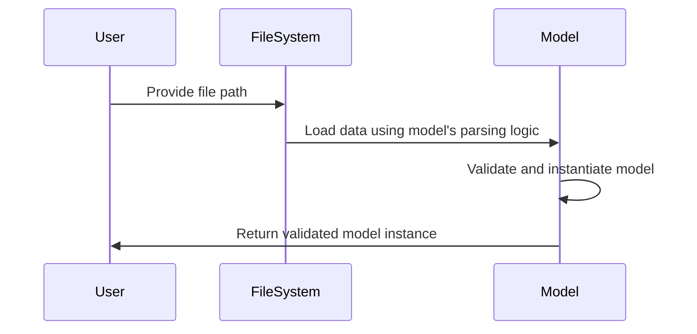
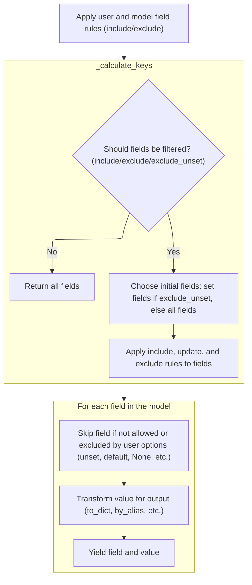
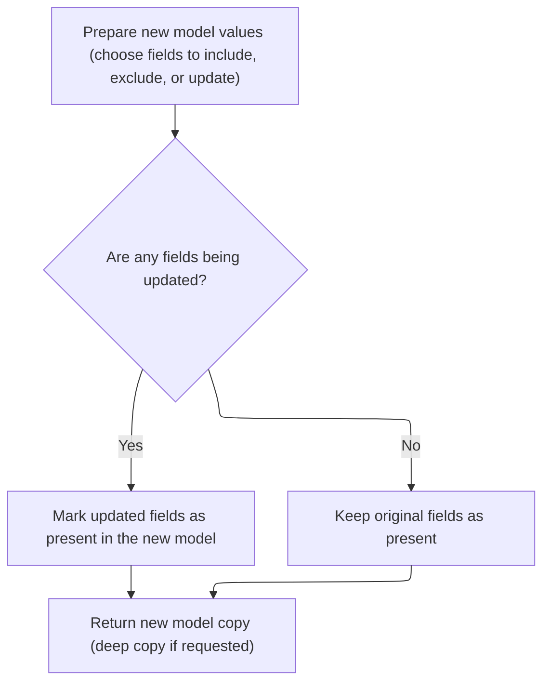
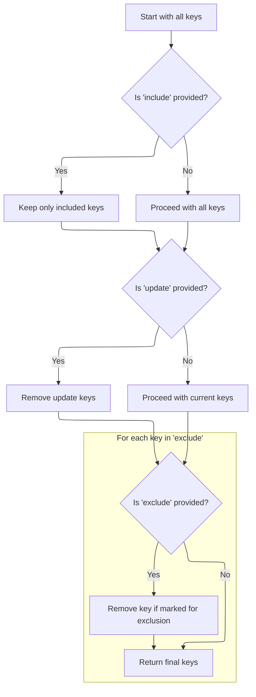
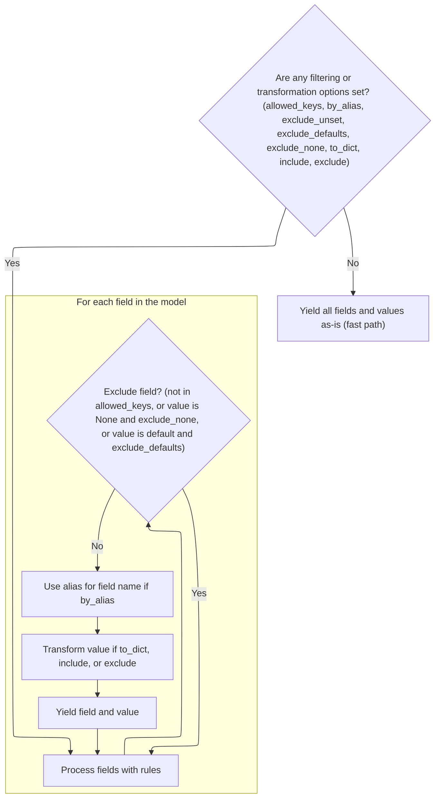

This document explains how to create a validated model instance from data stored in a file. The process involves loading the file's contents using the model's custom parsing logic, validating the data, and returning a fully instantiated model.

Main steps:

- Load data from the file using model-specific parsing
- Validate and instantiate the model
- Return the model instance



# Spec

## Detailed View of the Program's Functionality

a. Loading and Parsing Data from File

The process begins with a function designed to load and parse data from a file. This function takes a file path and several optional parameters (such as content type, encoding, protocol, and whether to allow pickled data). It uses a helper function to load the file's contents, passing along a custom JSON loading function defined in the model's configuration. This allows each model to control how JSON data is parsed. Once the data is loaded, it is handed off to another function responsible for turning the loaded data into a model instance. This second function is responsible for validation and instantiation of the model. The initial function assumes that the file path is valid and that the model class has the appropriate configuration.

b. Validating and Instantiating from Raw Data

The function responsible for turning raw data into a model instance first checks if the input is a dictionary. For models that expect a single root value, it enforces this by wrapping the input if necessary. If the input is not a dictionary, it attempts to convert it into one, since the model expects keyword arguments. If this conversion fails, a validation error is raised. Once a dictionary is obtained, the model is instantiated using these values, which triggers the model's validation logic.

c. Serializing Model to Dictionary

To serialize a model instance to a dictionary, a method is provided that wraps the output of an internal iterator. This iterator is responsible for filtering, aliasing, and serializing fields according to various options (such as which fields to include or exclude, whether to use aliases, and how to handle unset, default, or None values). The serialization method simply collects the output of this iterator into a dictionary, ensuring that all filtering and transformation logic is centralized and not duplicated.

d. Iterating and Filtering Model Fields

The internal iterator merges any internal and external sets of fields to include or exclude, giving precedence to explicit user options. It then calls a helper function to determine which fields should be kept, based on the include/exclude options and whether unset fields should be excluded. This sets up the filtering for the rest of the iteration. The iterator then loops through the model's data, skipping fields that are not allowed or that should be excluded (for example, because they are unset, have default values, or are None). For each field that is included, it transforms the value as needed (for example, serializing nested models or applying aliases) before yielding the field and its value.

e. Determining Allowed Field Keys

The helper function that determines which field keys are allowed starts by picking a base set of keys. If the option to exclude unset fields is enabled, it uses a copy of the set of fields that have been set on the model; otherwise, it uses all keys from the model's data. It then applies the include and exclude options, as well as any updates, to filter the set of keys. For each key in the exclude set, if the exclusion condition is true, the key is removed. The final set of allowed keys is returned for use by the iterator.

f. Cloning a Model Instance

To create a copy of a model instance, a method is provided that uses the internal iterator to collect the fields for the new model, applying any include or exclude filters. This ensures that the copy only contains the desired fields. After collecting the field-value pairs, it builds a dictionary and merges in any updates provided by the user. It then determines the new set of fields that should be considered "set" on the new model, including any updated fields. Finally, it calls a helper function to create the new model instance with these values and settings, optionally performing a deep copy if requested.

g. Filtering and Yielding Model Fields

Back in the internal iterator, after determining which fields to keep, the function loops through the model's data. If no filtering or transformation options are set, it yields all fields and values as-is for performance. Otherwise, for each field, it checks whether the field should be excluded (for example, if it is not in the allowed set, is None and should be excluded, or is a default value and defaults should be excluded). If the field is included, it determines whether to use an alias for the field name and transforms the value as needed (for example, serializing nested models or applying include/exclude filters recursively). The transformed field and value are then yielded.

h. Transforming Field Values for Output

When transforming a field value for output, the function first checks if the value is itself a model instance. If so, and if serialization to a dictionary is requested, it calls the model's serialization method with all relevant filtering options. If the result is a dictionary with a single root key, it returns just the value for that key; otherwise, it returns the whole dictionary. If serialization is not requested, it returns a copy of the nested model, applying any include/exclude filters. For dictionaries and sequences, it recursively calls itself on each element, applying filters at every level. For enumerations, it returns their value if configured to do so. Otherwise, it returns the value as-is.

i. Yielding Final Model Output

Finally, the internal iterator yields the filtered and transformed (key, value) pairs for the model, which are collected by the serialization method or used elsewhere as needed. This completes the process of loading, validating, serializing, and copying model data in a flexible and configurable way.

# Rule Definition

| Paragraph Name                                                                                                                                                                                                                                                                                                                                                                  | Rule ID | Category          | Description                                                                                                                                                                                                                                                                                                                                                                                                                                                                                                                                                                                                                                                                                                                                                                                                                                                                                                                                                                                                                                                                                                                                                                                                                                    | Conditions                                                                                                                                                                                                                                                                                                                                                                                                                                                                                                                                                                                                 | Remarks                                                                                                                                                                                                                                                                                                                                                                                                                                                                                                                                                                                                      |
| ------------------------------------------------------------------------------------------------------------------------------------------------------------------------------------------------------------------------------------------------------------------------------------------------------------------------------------------------------------------------------- | ------- | ----------------- | ---------------------------------------------------------------------------------------------------------------------------------------------------------------------------------------------------------------------------------------------------------------------------------------------------------------------------------------------------------------------------------------------------------------------------------------------------------------------------------------------------------------------------------------------------------------------------------------------------------------------------------------------------------------------------------------------------------------------------------------------------------------------------------------------------------------------------------------------------------------------------------------------------------------------------------------------------------------------------------------------------------------------------------------------------------------------------------------------------------------------------------------------------------------------------------------------------------------------------------------------- | ---------------------------------------------------------------------------------------------------------------------------------------------------------------------------------------------------------------------------------------------------------------------------------------------------------------------------------------------------------------------------------------------------------------------------------------------------------------------------------------------------------------------------------------------------------------------------------------------------------- | ------------------------------------------------------------------------------------------------------------------------------------------------------------------------------------------------------------------------------------------------------------------------------------------------------------------------------------------------------------------------------------------------------------------------------------------------------------------------------------------------------------------------------------------------------------------------------------------------------------ |
| BaseModel.parse_file, <SwmToken path="pydantic/v1/main.py" pos="567:5:5" line-data="        obj = load_file(">`load_file`</SwmToken>                                                                                                                                                                                                                                            | RL-001  | Conditional Logic | When loading data from a file, the system must use a JSON parsing function specified in the model's configuration (<SwmToken path="pydantic/v1/main.py" pos="573:1:1" line-data="            json_loads=cls.__config__.json_loads,">`json_loads`</SwmToken>). The input is a file path (string or Path), and the output is a validated instance of the model.                                                                                                                                                                                                                                                                                                                                                                                                                                                                                                                                                                                                                                                                                                                                                                                                                                                                                  | A file path is provided to <SwmToken path="pydantic/v1/main.py" pos="558:3:3" line-data="    def parse_file(">`parse_file`</SwmToken>; the model's config defines a <SwmToken path="pydantic/v1/main.py" pos="573:1:1" line-data="            json_loads=cls.__config__.json_loads,">`json_loads`</SwmToken> function.                                                                                                                                                                                                                                                                                     | The <SwmToken path="pydantic/v1/main.py" pos="573:1:1" line-data="            json_loads=cls.__config__.json_loads,">`json_loads`</SwmToken> function is customizable per model via the Config object. The output is a model instance.                                                                                                                                                                                                                                                                                                                                                                       |
| BaseModel.parse_obj, BaseModel.\_enforce_dict_if_root                                                                                                                                                                                                                                                                                                                           | RL-002  | Conditional Logic | When instantiating a model from raw data, the input must be a dictionary. If the model is a root model (wraps a single value), the input must be wrapped as <SwmToken path="pydantic/v1/main.py" pos="99:7:8" line-data="        raise ValueError(f&#39;{ROOT_KEY} cannot be mixed with other fields&#39;)">`{ROOT_KEY`</SwmToken>: value} if not already a dictionary. If the input cannot be converted to a dictionary, a validation error is raised.                                                                                                                                                                                                                                                                                                                                                                                                                                                                                                                                                                                                                                                                                                                                                                                        | <SwmToken path="pydantic/v1/main.py" pos="524:3:3" line-data="    def parse_obj(cls: Type[&#39;Model&#39;], obj: Any) -&gt; &#39;Model&#39;:">`parse_obj`</SwmToken> is called with any input; model may be a root model.                                                                                                                                                                                                                                                                                                                                                                                  | <SwmToken path="pydantic/v1/main.py" pos="531:13:13" line-data="                raise ValidationError([ErrorWrapper(exc, loc=ROOT_KEY)], cls) from e">`ROOT_KEY`</SwmToken> is a string constant (<SwmToken path="pydantic/v1/main.py" pos="295:16:18" line-data="        # for attributes not in `new_namespace` (e.g. private attributes)">`e.g`</SwmToken>., '**root**'). <SwmToken path="pydantic/v1/main.py" pos="531:3:3" line-data="                raise ValidationError([ErrorWrapper(exc, loc=ROOT_KEY)], cls) from e">`ValidationError`</SwmToken> is raised if input is not convertible to dict. |
| <SwmToken path="pydantic/v1/main.py" pos="746:8:8" line-data="        if isinstance(v, BaseModel):">`BaseModel`</SwmToken>.**init**, <SwmToken path="pydantic/v1/main.py" pos="92:15:15" line-data="__all__ = &#39;BaseModel&#39;, &#39;create_model&#39;, &#39;validate_model&#39;">`validate_model`</SwmToken>                                                                | RL-003  | Data Assignment   | The model instance must track which fields were explicitly set during initialization, storing them in a set of field names.                                                                                                                                                                                                                                                                                                                                                                                                                                                                                                                                                                                                                                                                                                                                                                                                                                                                                                                                                                                                                                                                                                                    | A model is instantiated with input data.                                                                                                                                                                                                                                                                                                                                                                                                                                                                                                                                                                   | The set of explicitly set fields is stored in <SwmToken path="pydantic/v1/main.py" pos="659:1:1" line-data="            fields_set = self.__fields_set__ \| update.keys()">`fields_set`</SwmToken>.                                                                                                                                                                                                                                                                                                                                                                                                          |
| <SwmToken path="pydantic/v1/main.py" pos="383:26:28" line-data="                # - keep other values (e.g. submodels) untouched (using `BaseModel.dict()` will change them into dicts)">`BaseModel.dict`</SwmToken>, BaseModel.\_iter, BaseModel.\_calculate_keys, BaseModel.\_get_value                                                                                       | RL-004  | Computation       | When serializing a model to a dictionary, the system must support options to include/exclude fields, use field aliases, exclude unset/default/None fields, and apply recursive/nested filtering. The output is a dictionary mapping field names (or aliases) to values after all filters and transformations.                                                                                                                                                                                                                                                                                                                                                                                                                                                                                                                                                                                                                                                                                                                                                                                                                                                                                                                                  | dict() is called on a model instance, possibly with include, exclude, <SwmToken path="pydantic/v1/main.py" pos="438:1:1" line-data="        by_alias: bool = False,">`by_alias`</SwmToken>, <SwmToken path="pydantic/v1/main.py" pos="440:1:1" line-data="        exclude_unset: bool = False,">`exclude_unset`</SwmToken>, <SwmToken path="pydantic/v1/main.py" pos="441:1:1" line-data="        exclude_defaults: bool = False,">`exclude_defaults`</SwmToken>, or <SwmToken path="pydantic/v1/main.py" pos="442:1:1" line-data="        exclude_none: bool = False,">`exclude_none`</SwmToken> options. | include/exclude can be sets or nested dicts. <SwmToken path="pydantic/v1/main.py" pos="438:1:1" line-data="        by_alias: bool = False,">`by_alias`</SwmToken> uses field aliases. Output is a dictionary.                                                                                                                                                                                                                                                                                                                                                                                                |
| BaseModel.\_calculate_keys, <SwmToken path="pydantic/v1/main.py" pos="762:5:5" line-data="        value_exclude = ValueItems(v, exclude) if exclude else None">`ValueItems`</SwmToken>, BaseModel.\_iter, BaseModel.\_get_value                                                                                                                                                 | RL-005  | Conditional Logic | The filtering logic for serialization and cloning must support nested include/exclude mappings, where mappings can specify subfields to include or exclude. Filtering is applied recursively.                                                                                                                                                                                                                                                                                                                                                                                                                                                                                                                                                                                                                                                                                                                                                                                                                                                                                                                                                                                                                                                  | include or exclude mappings are provided to dict() or copy().                                                                                                                                                                                                                                                                                                                                                                                                                                                                                                                                              | <SwmToken path="pydantic/v1/main.py" pos="762:5:5" line-data="        value_exclude = ValueItems(v, exclude) if exclude else None">`ValueItems`</SwmToken> helper is used for recursive filtering. <SwmToken path="pydantic/v1/main.py" pos="907:27:27" line-data="            keys -= {k for k, v in exclude.items() if ValueItems.is_true(v)}">`is_true`</SwmToken> returns true for True, non-empty dicts, or non-empty sets.                                                                                                                                                                             |
| BaseModel.copy, BaseModel.\_copy_and_set_values                                                                                                                                                                                                                                                                                                                                 | RL-006  | Computation       | The system must provide a mechanism to clone a model instance, supporting include/exclude filtering, updates to specific fields, and deep copy if requested. The new instance must track which fields are present, including updated fields.                                                                                                                                                                                                                                                                                                                                                                                                                                                                                                                                                                                                                                                                                                                                                                                                                                                                                                                                                                                                   | copy() is called on a model instance, possibly with include, exclude, update, or deep options.                                                                                                                                                                                                                                                                                                                                                                                                                                                                                                             | The output is a new model instance with updated <SwmToken path="pydantic/v1/main.py" pos="659:1:1" line-data="            fields_set = self.__fields_set__ \| update.keys()">`fields_set`</SwmToken>.                                                                                                                                                                                                                                                                                                                                                                                                        |
| BaseModel.\_get_value                                                                                                                                                                                                                                                                                                                                                           | RL-007  | Conditional Logic | When serializing or cloning, if a value is an Enum and the configuration option <SwmToken path="pydantic/v1/main.py" pos="801:21:21" line-data="        elif isinstance(v, Enum) and getattr(cls.Config, &#39;use_enum_values&#39;, False):">`use_enum_values`</SwmToken> is set, the Enum's value must be used instead of the Enum instance.                                                                                                                                                                                                                                                                                                                                                                                                                                                                                                                                                                                                                                                                                                                                                                                                                                                                                                  | A field value is an Enum and Config.use_enum_values is True.                                                                                                                                                                                                                                                                                                                                                                                                                                                                                                                                               | <SwmToken path="pydantic/v1/main.py" pos="801:21:21" line-data="        elif isinstance(v, Enum) and getattr(cls.Config, &#39;use_enum_values&#39;, False):">`use_enum_values`</SwmToken> is a boolean config option.                                                                                                                                                                                                                                                                                                                                                                                        |
| BaseModel.\_enforce_dict_if_root, <SwmToken path="pydantic/v1/main.py" pos="383:26:28" line-data="                # - keep other values (e.g. submodels) untouched (using `BaseModel.dict()` will change them into dicts)">`BaseModel.dict`</SwmToken>, BaseModel.json                                                                                                          | RL-008  | Data Assignment   | For root models (models that wrap a single value), the value must be stored and accessed using the constant <SwmToken path="pydantic/v1/main.py" pos="531:13:13" line-data="                raise ValidationError([ErrorWrapper(exc, loc=ROOT_KEY)], cls) from e">`ROOT_KEY`</SwmToken>.                                                                                                                                                                                                                                                                                                                                                                                                                                                                                                                                                                                                                                                                                                                                                                                                                                                                                                                                                       | Model is a root model (has only <SwmToken path="pydantic/v1/main.py" pos="531:13:13" line-data="                raise ValidationError([ErrorWrapper(exc, loc=ROOT_KEY)], cls) from e">`ROOT_KEY`</SwmToken> field).                                                                                                                                                                                                                                                                                                                                                                                        | <SwmToken path="pydantic/v1/main.py" pos="531:13:13" line-data="                raise ValidationError([ErrorWrapper(exc, loc=ROOT_KEY)], cls) from e">`ROOT_KEY`</SwmToken> is a string constant (<SwmToken path="pydantic/v1/main.py" pos="295:16:18" line-data="        # for attributes not in `new_namespace` (e.g. private attributes)">`e.g`</SwmToken>., '**root**').                                                                                                                                                                                                                                 |
| BaseModel.Config, <SwmToken path="pydantic/v1/main.py" pos="113:5:5" line-data="# Note `ModelMetaclass` refers to `BaseModel`, but is also used to *create* `BaseModel`, so we need to add this extra">`ModelMetaclass`</SwmToken>, usage throughout <SwmToken path="pydantic/v1/main.py" pos="746:8:8" line-data="        if isinstance(v, BaseModel):">`BaseModel`</SwmToken> | RL-009  | Data Assignment   | The configuration object for each model must support at least <SwmToken path="pydantic/v1/main.py" pos="573:1:1" line-data="            json_loads=cls.__config__.json_loads,">`json_loads`</SwmToken>, <SwmToken path="pydantic/v1/main.py" pos="801:21:21" line-data="        elif isinstance(v, Enum) and getattr(cls.Config, &#39;use_enum_values&#39;, False):">`use_enum_values`</SwmToken>, and other options such as <SwmToken path="pydantic/v1/main.py" pos="579:9:9" line-data="        if not cls.__config__.orm_mode:">`orm_mode`</SwmToken>, <SwmToken path="pydantic/v1/main.py" pos="1061:13:13" line-data="        if value is _missing and config.allow_population_by_field_name and field.alt_alias:">`allow_population_by_field_name`</SwmToken>, extra, <SwmToken path="pydantic/v1/main.py" pos="242:5:5" line-data="        if config.json_encoders:">`json_encoders`</SwmToken>, frozen, <SwmToken path="pydantic/v1/main.py" pos="364:9:9" line-data="        elif not self.__config__.allow_mutation or self.__config__.frozen:">`allow_mutation`</SwmToken>, and <SwmToken path="pydantic/v1/main.py" pos="370:7:7" line-data="        elif self.__config__.validate_assignment:">`validate_assignment`</SwmToken>. | A model is defined or used.                                                                                                                                                                                                                                                                                                                                                                                                                                                                                                                                                                                | Config options are available as attributes on the Config class.                                                                                                                                                                                                                                                                                                                                                                                                                                                                                                                                              |
| <SwmToken path="pydantic/v1/main.py" pos="762:5:5" line-data="        value_exclude = ValueItems(v, exclude) if exclude else None">`ValueItems`</SwmToken>, BaseModel.\_iter, BaseModel.\_get_value                                                                                                                                                                             | RL-010  | Computation       | The system must provide a helper mechanism (<SwmToken path="pydantic/v1/main.py" pos="295:16:18" line-data="        # for attributes not in `new_namespace` (e.g. private attributes)">`e.g`</SwmToken>., <SwmToken path="pydantic/v1/main.py" pos="762:5:5" line-data="        value_exclude = ValueItems(v, exclude) if exclude else None">`ValueItems`</SwmToken>) for recursive filtering of include/exclude mappings, supporting <SwmToken path="pydantic/v1/main.py" pos="907:27:27" line-data="            keys -= {k for k, v in exclude.items() if ValueItems.is_true(v)}">`is_true`</SwmToken> and <SwmToken path="pydantic/v1/main.py" pos="773:9:9" line-data="                    include=value_include and value_include.for_element(k_),">`for_element`</SwmToken> methods.                                                                                                                                                                                                                                                                                                                                                                                                                                                     | include or exclude mappings are used for serialization or cloning.                                                                                                                                                                                                                                                                                                                                                                                                                                                                                                                                         | <SwmToken path="pydantic/v1/main.py" pos="907:25:27" line-data="            keys -= {k for k, v in exclude.items() if ValueItems.is_true(v)}">`ValueItems.is_true`</SwmToken> returns true for True, non-empty dicts, or non-empty sets.                                                                                                                                                                                                                                                                                                                                                                     |

# User Stories

## User Story 1: Load, parse, validate, and instantiate models from files and raw data, including root models

---

### Story Description:

As a system, I want to load and parse data from a file using a configurable JSON parsing function, validate and instantiate models from raw data (including root models), and ensure proper error handling, so that model instances are always created from valid data sources and structures.

---

### Business Rule Mapping:

| Rule ID | Paragraph Name                                                                                                                                                                                                                                                         | Rule Description                                                                                                                                                                                                                                                                                                                                                                                                                                        |
| ------- | ---------------------------------------------------------------------------------------------------------------------------------------------------------------------------------------------------------------------------------------------------------------------- | ------------------------------------------------------------------------------------------------------------------------------------------------------------------------------------------------------------------------------------------------------------------------------------------------------------------------------------------------------------------------------------------------------------------------------------------------------- |
| RL-001  | BaseModel.parse_file, <SwmToken path="pydantic/v1/main.py" pos="567:5:5" line-data="        obj = load_file(">`load_file`</SwmToken>                                                                                                                                   | When loading data from a file, the system must use a JSON parsing function specified in the model's configuration (<SwmToken path="pydantic/v1/main.py" pos="573:1:1" line-data="            json_loads=cls.__config__.json_loads,">`json_loads`</SwmToken>). The input is a file path (string or Path), and the output is a validated instance of the model.                                                                                           |
| RL-002  | BaseModel.parse_obj, BaseModel.\_enforce_dict_if_root                                                                                                                                                                                                                  | When instantiating a model from raw data, the input must be a dictionary. If the model is a root model (wraps a single value), the input must be wrapped as <SwmToken path="pydantic/v1/main.py" pos="99:7:8" line-data="        raise ValueError(f&#39;{ROOT_KEY} cannot be mixed with other fields&#39;)">`{ROOT_KEY`</SwmToken>: value} if not already a dictionary. If the input cannot be converted to a dictionary, a validation error is raised. |
| RL-008  | BaseModel.\_enforce_dict_if_root, <SwmToken path="pydantic/v1/main.py" pos="383:26:28" line-data="                # - keep other values (e.g. submodels) untouched (using `BaseModel.dict()` will change them into dicts)">`BaseModel.dict`</SwmToken>, BaseModel.json | For root models (models that wrap a single value), the value must be stored and accessed using the constant <SwmToken path="pydantic/v1/main.py" pos="531:13:13" line-data="                raise ValidationError([ErrorWrapper(exc, loc=ROOT_KEY)], cls) from e">`ROOT_KEY`</SwmToken>.                                                                                                                                                                |

---

### Relevant Functionality:

- **BaseModel.parse_file**
  1. **RL-001:**
     - Call <SwmToken path="pydantic/v1/main.py" pos="567:5:5" line-data="        obj = load_file(">`load_file`</SwmToken> with the provided path and config.json_loads
     - Parse the file contents using the <SwmToken path="pydantic/v1/main.py" pos="573:1:1" line-data="            json_loads=cls.__config__.json_loads,">`json_loads`</SwmToken> function
     - Pass the parsed data to <SwmToken path="pydantic/v1/main.py" pos="524:3:3" line-data="    def parse_obj(cls: Type[&#39;Model&#39;], obj: Any) -&gt; &#39;Model&#39;:">`parse_obj`</SwmToken> for validation and instantiation
     - Return the resulting model instance
- **BaseModel.parse_obj**
  1. **RL-002:**
     - If model is a root model and input is not a dict with only <SwmToken path="pydantic/v1/main.py" pos="531:13:13" line-data="                raise ValidationError([ErrorWrapper(exc, loc=ROOT_KEY)], cls) from e">`ROOT_KEY`</SwmToken>, wrap input as <SwmToken path="pydantic/v1/main.py" pos="99:7:8" line-data="        raise ValueError(f&#39;{ROOT_KEY} cannot be mixed with other fields&#39;)">`{ROOT_KEY`</SwmToken>: value}
     - If input is not a dict, attempt to convert to dict
     - If conversion fails, raise <SwmToken path="pydantic/v1/main.py" pos="531:3:3" line-data="                raise ValidationError([ErrorWrapper(exc, loc=ROOT_KEY)], cls) from e">`ValidationError`</SwmToken>
     - Instantiate model with the resulting dict
- **BaseModel.\_enforce_dict_if_root**
  1. **RL-008:**
     - When instantiating or serializing a root model, wrap/unwrap value using <SwmToken path="pydantic/v1/main.py" pos="99:7:8" line-data="        raise ValueError(f&#39;{ROOT_KEY} cannot be mixed with other fields&#39;)">`{ROOT_KEY`</SwmToken>: value}
     - When serializing to JSON, output the value at <SwmToken path="pydantic/v1/main.py" pos="531:13:13" line-data="                raise ValidationError([ErrorWrapper(exc, loc=ROOT_KEY)], cls) from e">`ROOT_KEY`</SwmToken>

## User Story 2: Serialize and clone model instances with advanced filtering, transformation, and field tracking

---

### Story Description:

As a user, I want to serialize and clone model instances with options to include or exclude specific fields, use field aliases, exclude unset/default/None fields, apply recursive/nested filtering, handle Enums based on configuration, and track explicitly set fields, so that I can flexibly control model output and copies for various scenarios.

---

### Business Rule Mapping:

| Rule ID | Paragraph Name                                                                                                                                                                                                                                                                                                                                                                  | Rule Description                                                                                                                                                                                                                                                                                                                                                                                                                                                                                                                                                                                                                                                                                                                                                                                                                                                                                                                                                                                                                                                                                                                                                                                                                               |
| ------- | ------------------------------------------------------------------------------------------------------------------------------------------------------------------------------------------------------------------------------------------------------------------------------------------------------------------------------------------------------------------------------- | ---------------------------------------------------------------------------------------------------------------------------------------------------------------------------------------------------------------------------------------------------------------------------------------------------------------------------------------------------------------------------------------------------------------------------------------------------------------------------------------------------------------------------------------------------------------------------------------------------------------------------------------------------------------------------------------------------------------------------------------------------------------------------------------------------------------------------------------------------------------------------------------------------------------------------------------------------------------------------------------------------------------------------------------------------------------------------------------------------------------------------------------------------------------------------------------------------------------------------------------------- |
| RL-003  | <SwmToken path="pydantic/v1/main.py" pos="746:8:8" line-data="        if isinstance(v, BaseModel):">`BaseModel`</SwmToken>.**init**, <SwmToken path="pydantic/v1/main.py" pos="92:15:15" line-data="__all__ = &#39;BaseModel&#39;, &#39;create_model&#39;, &#39;validate_model&#39;">`validate_model`</SwmToken>                                                                | The model instance must track which fields were explicitly set during initialization, storing them in a set of field names.                                                                                                                                                                                                                                                                                                                                                                                                                                                                                                                                                                                                                                                                                                                                                                                                                                                                                                                                                                                                                                                                                                                    |
| RL-004  | <SwmToken path="pydantic/v1/main.py" pos="383:26:28" line-data="                # - keep other values (e.g. submodels) untouched (using `BaseModel.dict()` will change them into dicts)">`BaseModel.dict`</SwmToken>, BaseModel.\_iter, BaseModel.\_calculate_keys, BaseModel.\_get_value                                                                                       | When serializing a model to a dictionary, the system must support options to include/exclude fields, use field aliases, exclude unset/default/None fields, and apply recursive/nested filtering. The output is a dictionary mapping field names (or aliases) to values after all filters and transformations.                                                                                                                                                                                                                                                                                                                                                                                                                                                                                                                                                                                                                                                                                                                                                                                                                                                                                                                                  |
| RL-005  | BaseModel.\_calculate_keys, <SwmToken path="pydantic/v1/main.py" pos="762:5:5" line-data="        value_exclude = ValueItems(v, exclude) if exclude else None">`ValueItems`</SwmToken>, BaseModel.\_iter, BaseModel.\_get_value                                                                                                                                                 | The filtering logic for serialization and cloning must support nested include/exclude mappings, where mappings can specify subfields to include or exclude. Filtering is applied recursively.                                                                                                                                                                                                                                                                                                                                                                                                                                                                                                                                                                                                                                                                                                                                                                                                                                                                                                                                                                                                                                                  |
| RL-006  | BaseModel.copy, BaseModel.\_copy_and_set_values                                                                                                                                                                                                                                                                                                                                 | The system must provide a mechanism to clone a model instance, supporting include/exclude filtering, updates to specific fields, and deep copy if requested. The new instance must track which fields are present, including updated fields.                                                                                                                                                                                                                                                                                                                                                                                                                                                                                                                                                                                                                                                                                                                                                                                                                                                                                                                                                                                                   |
| RL-007  | BaseModel.\_get_value                                                                                                                                                                                                                                                                                                                                                           | When serializing or cloning, if a value is an Enum and the configuration option <SwmToken path="pydantic/v1/main.py" pos="801:21:21" line-data="        elif isinstance(v, Enum) and getattr(cls.Config, &#39;use_enum_values&#39;, False):">`use_enum_values`</SwmToken> is set, the Enum's value must be used instead of the Enum instance.                                                                                                                                                                                                                                                                                                                                                                                                                                                                                                                                                                                                                                                                                                                                                                                                                                                                                                  |
| RL-009  | BaseModel.Config, <SwmToken path="pydantic/v1/main.py" pos="113:5:5" line-data="# Note `ModelMetaclass` refers to `BaseModel`, but is also used to *create* `BaseModel`, so we need to add this extra">`ModelMetaclass`</SwmToken>, usage throughout <SwmToken path="pydantic/v1/main.py" pos="746:8:8" line-data="        if isinstance(v, BaseModel):">`BaseModel`</SwmToken> | The configuration object for each model must support at least <SwmToken path="pydantic/v1/main.py" pos="573:1:1" line-data="            json_loads=cls.__config__.json_loads,">`json_loads`</SwmToken>, <SwmToken path="pydantic/v1/main.py" pos="801:21:21" line-data="        elif isinstance(v, Enum) and getattr(cls.Config, &#39;use_enum_values&#39;, False):">`use_enum_values`</SwmToken>, and other options such as <SwmToken path="pydantic/v1/main.py" pos="579:9:9" line-data="        if not cls.__config__.orm_mode:">`orm_mode`</SwmToken>, <SwmToken path="pydantic/v1/main.py" pos="1061:13:13" line-data="        if value is _missing and config.allow_population_by_field_name and field.alt_alias:">`allow_population_by_field_name`</SwmToken>, extra, <SwmToken path="pydantic/v1/main.py" pos="242:5:5" line-data="        if config.json_encoders:">`json_encoders`</SwmToken>, frozen, <SwmToken path="pydantic/v1/main.py" pos="364:9:9" line-data="        elif not self.__config__.allow_mutation or self.__config__.frozen:">`allow_mutation`</SwmToken>, and <SwmToken path="pydantic/v1/main.py" pos="370:7:7" line-data="        elif self.__config__.validate_assignment:">`validate_assignment`</SwmToken>. |

---

### Relevant Functionality:

- **BaseModel.init**
  1. **RL-003:**
     - During validation, collect names of fields present in input data
     - Store this set in the model instance as <SwmToken path="pydantic/v1/main.py" pos="659:1:1" line-data="            fields_set = self.__fields_set__ | update.keys()">`fields_set`</SwmToken>
- <SwmToken path="pydantic/v1/main.py" pos="383:26:28" line-data="                # - keep other values (e.g. submodels) untouched (using `BaseModel.dict()` will change them into dicts)">`BaseModel.dict`</SwmToken>
  1. **RL-004:**
     - Determine allowed keys based on include, exclude, <SwmToken path="pydantic/v1/main.py" pos="440:1:1" line-data="        exclude_unset: bool = False,">`exclude_unset`</SwmToken>, and other options
     - For each field in the model:
       - Skip if not in allowed keys or if <SwmToken path="pydantic/v1/main.py" pos="442:1:1" line-data="        exclude_none: bool = False,">`exclude_none`</SwmToken> and value is None
       - If <SwmToken path="pydantic/v1/main.py" pos="441:1:1" line-data="        exclude_defaults: bool = False,">`exclude_defaults`</SwmToken> and value equals default, skip
       - Use alias as key if <SwmToken path="pydantic/v1/main.py" pos="438:1:1" line-data="        by_alias: bool = False,">`by_alias`</SwmToken> is set
       - For nested models, recursively call dict() with same options
       - For dicts/sequences, apply filtering recursively
     - Return the resulting dictionary
- **BaseModel.\_calculate_keys**
  1. **RL-005:**
     - Merge model-level and call-level include/exclude mappings
     - For each field or element, use <SwmToken path="pydantic/v1/main.py" pos="762:5:5" line-data="        value_exclude = ValueItems(v, exclude) if exclude else None">`ValueItems`</SwmToken> to determine if it should be included/excluded
     - For nested dicts/sequences, apply filtering recursively using <SwmToken path="pydantic/v1/main.py" pos="773:9:9" line-data="                    include=value_include and value_include.for_element(k_),">`for_element`</SwmToken> and <SwmToken path="pydantic/v1/main.py" pos="907:27:27" line-data="            keys -= {k for k, v in exclude.items() if ValueItems.is_true(v)}">`is_true`</SwmToken>
- **BaseModel.copy**
  1. **RL-006:**
     - Use \_iter to collect values with include/exclude filters
     - Apply updates from update mapping
     - If deep is set, deepcopy values and private attributes
     - Set <SwmToken path="pydantic/v1/main.py" pos="659:1:1" line-data="            fields_set = self.__fields_set__ | update.keys()">`fields_set`</SwmToken> to union of original and updated fields
     - Return new model instance
- **BaseModel.\_get_value**
  1. **RL-007:**
     - If value is Enum and <SwmToken path="pydantic/v1/main.py" pos="801:21:21" line-data="        elif isinstance(v, Enum) and getattr(cls.Config, &#39;use_enum_values&#39;, False):">`use_enum_values`</SwmToken> is True, return value.value
     - Otherwise, return value as is
- **BaseModel.Config**
  1. **RL-009:**
     - When creating a model, inherit or set Config with required options
     - Use config options in relevant methods (<SwmToken path="pydantic/v1/main.py" pos="295:16:18" line-data="        # for attributes not in `new_namespace` (e.g. private attributes)">`e.g`</SwmToken>., <SwmToken path="pydantic/v1/main.py" pos="573:1:1" line-data="            json_loads=cls.__config__.json_loads,">`json_loads`</SwmToken> in <SwmToken path="pydantic/v1/main.py" pos="558:3:3" line-data="    def parse_file(">`parse_file`</SwmToken>, <SwmToken path="pydantic/v1/main.py" pos="801:21:21" line-data="        elif isinstance(v, Enum) and getattr(cls.Config, &#39;use_enum_values&#39;, False):">`use_enum_values`</SwmToken> in serialization, etc.)

## User Story 3: Provide a helper mechanism for recursive filtering of include/exclude mappings

---

### Story Description:

As a system, I want to provide a helper mechanism for recursive filtering of include/exclude mappings, supporting methods to determine inclusion/exclusion and retrieve nested filtering rules, so that advanced filtering logic can be applied consistently during serialization and cloning.

---

### Business Rule Mapping:

| Rule ID | Paragraph Name                                                                                                                                                                                                                  | Rule Description                                                                                                                                                                                                                                                                                                                                                                                                                                                                                                                                                                                                                                                                                                                                                                           |
| ------- | ------------------------------------------------------------------------------------------------------------------------------------------------------------------------------------------------------------------------------- | ------------------------------------------------------------------------------------------------------------------------------------------------------------------------------------------------------------------------------------------------------------------------------------------------------------------------------------------------------------------------------------------------------------------------------------------------------------------------------------------------------------------------------------------------------------------------------------------------------------------------------------------------------------------------------------------------------------------------------------------------------------------------------------------ |
| RL-005  | BaseModel.\_calculate_keys, <SwmToken path="pydantic/v1/main.py" pos="762:5:5" line-data="        value_exclude = ValueItems(v, exclude) if exclude else None">`ValueItems`</SwmToken>, BaseModel.\_iter, BaseModel.\_get_value | The filtering logic for serialization and cloning must support nested include/exclude mappings, where mappings can specify subfields to include or exclude. Filtering is applied recursively.                                                                                                                                                                                                                                                                                                                                                                                                                                                                                                                                                                                              |
| RL-010  | <SwmToken path="pydantic/v1/main.py" pos="762:5:5" line-data="        value_exclude = ValueItems(v, exclude) if exclude else None">`ValueItems`</SwmToken>, BaseModel.\_iter, BaseModel.\_get_value                             | The system must provide a helper mechanism (<SwmToken path="pydantic/v1/main.py" pos="295:16:18" line-data="        # for attributes not in `new_namespace` (e.g. private attributes)">`e.g`</SwmToken>., <SwmToken path="pydantic/v1/main.py" pos="762:5:5" line-data="        value_exclude = ValueItems(v, exclude) if exclude else None">`ValueItems`</SwmToken>) for recursive filtering of include/exclude mappings, supporting <SwmToken path="pydantic/v1/main.py" pos="907:27:27" line-data="            keys -= {k for k, v in exclude.items() if ValueItems.is_true(v)}">`is_true`</SwmToken> and <SwmToken path="pydantic/v1/main.py" pos="773:9:9" line-data="                    include=value_include and value_include.for_element(k_),">`for_element`</SwmToken> methods. |

---

### Relevant Functionality:

- **BaseModel.\_calculate_keys**
  1. **RL-005:**
     - Merge model-level and call-level include/exclude mappings
     - For each field or element, use <SwmToken path="pydantic/v1/main.py" pos="762:5:5" line-data="        value_exclude = ValueItems(v, exclude) if exclude else None">`ValueItems`</SwmToken> to determine if it should be included/excluded
     - For nested dicts/sequences, apply filtering recursively using <SwmToken path="pydantic/v1/main.py" pos="773:9:9" line-data="                    include=value_include and value_include.for_element(k_),">`for_element`</SwmToken> and <SwmToken path="pydantic/v1/main.py" pos="907:27:27" line-data="            keys -= {k for k, v in exclude.items() if ValueItems.is_true(v)}">`is_true`</SwmToken>
- <SwmToken path="pydantic/v1/main.py" pos="762:5:5" line-data="        value_exclude = ValueItems(v, exclude) if exclude else None">`ValueItems`</SwmToken>
  1. **RL-010:**
     - Wrap include/exclude mappings in <SwmToken path="pydantic/v1/main.py" pos="762:5:5" line-data="        value_exclude = ValueItems(v, exclude) if exclude else None">`ValueItems`</SwmToken>
     - Use <SwmToken path="pydantic/v1/main.py" pos="907:27:27" line-data="            keys -= {k for k, v in exclude.items() if ValueItems.is_true(v)}">`is_true`</SwmToken> to determine if a key should be included/excluded
     - Use <SwmToken path="pydantic/v1/main.py" pos="773:9:9" line-data="                    include=value_include and value_include.for_element(k_),">`for_element`</SwmToken> to retrieve nested filtering rules

# Code Walkthrough

## Loading and Parsing Data from File

<SwmSnippet path="/pydantic/v1/main.py" line="558">

---

We start the flow in <SwmToken path="pydantic/v1/main.py" pos="558:3:3" line-data="    def parse_file(">`parse_file`</SwmToken>, which loads data from a file using <SwmToken path="pydantic/v1/main.py" pos="567:5:5" line-data="        obj = load_file(">`load_file`</SwmToken>, passing in the model's custom <SwmToken path="pydantic/v1/main.py" pos="573:1:1" line-data="            json_loads=cls.__config__.json_loads,">`json_loads`</SwmToken> function from its config. This lets each model control how JSON is parsed. After loading, it hands off to <SwmToken path="pydantic/v1/main.py" pos="575:5:5" line-data="        return cls.parse_obj(obj)">`parse_obj`</SwmToken> to actually turn the loaded data into a model instance, since <SwmToken path="pydantic/v1/main.py" pos="575:5:5" line-data="        return cls.parse_obj(obj)">`parse_obj`</SwmToken> handles validation and instantiation. The function assumes the path is valid and the model class has the right config.

```python
    def parse_file(
        cls: Type['Model'],
        path: Union[str, Path],
        *,
        content_type: str = None,
        encoding: str = 'utf8',
        proto: Protocol = None,
        allow_pickle: bool = False,
    ) -> 'Model':
        obj = load_file(
            path,
            proto=proto,
            content_type=content_type,
            encoding=encoding,
            allow_pickle=allow_pickle,
            json_loads=cls.__config__.json_loads,
        )
        return cls.parse_obj(obj)
```

---

</SwmSnippet>

## Validating and Instantiating from Raw Data

<SwmSnippet path="/pydantic/v1/main.py" line="524">

---

<SwmToken path="pydantic/v1/main.py" pos="524:3:3" line-data="    def parse_obj(cls: Type[&#39;Model&#39;], obj: Any) -&gt; &#39;Model&#39;:">`parse_obj`</SwmToken> checks if the input is a dict (and enforces it for root models). If not, it tries to convert the input to a dict, since the model expects keyword arguments. If conversion fails, it raises a validation error. Once we have a dict, it instantiates the model with those values.

```python
    def parse_obj(cls: Type['Model'], obj: Any) -> 'Model':
        obj = cls._enforce_dict_if_root(obj)
        if not isinstance(obj, dict):
            try:
                obj = dict(obj)
            except (TypeError, ValueError) as e:
                exc = TypeError(f'{cls.__name__} expected dict not {obj.__class__.__name__}')
                raise ValidationError([ErrorWrapper(exc, loc=ROOT_KEY)], cls) from e
        return cls(**obj)
```

---

</SwmSnippet>

## Serializing Model to Dictionary

<SwmSnippet path="/pydantic/v1/main.py" line="433">

---

<SwmToken path="pydantic/v1/main.py" pos="433:3:3" line-data="    def dict(">`dict`</SwmToken> just wraps the output of \_iter, which does all the work of filtering, aliasing, and serializing fields. This lets dict handle all the options for including/excluding fields, using aliases, and so on, without duplicating logic.

```python
    def dict(
        self,
        *,
        include: Optional[Union['AbstractSetIntStr', 'MappingIntStrAny']] = None,
        exclude: Optional[Union['AbstractSetIntStr', 'MappingIntStrAny']] = None,
        by_alias: bool = False,
        skip_defaults: Optional[bool] = None,
        exclude_unset: bool = False,
        exclude_defaults: bool = False,
        exclude_none: bool = False,
    ) -> 'DictStrAny':
        """
        Generate a dictionary representation of the model, optionally specifying which fields to include or exclude.

        """
        if skip_defaults is not None:
            warnings.warn(
                f'{self.__class__.__name__}.dict(): "skip_defaults" is deprecated and replaced by "exclude_unset"',
                DeprecationWarning,
            )
            exclude_unset = skip_defaults

        return dict(
            self._iter(
                to_dict=True,
                by_alias=by_alias,
                include=include,
                exclude=exclude,
                exclude_unset=exclude_unset,
                exclude_defaults=exclude_defaults,
                exclude_none=exclude_none,
            )
        )
```

---

</SwmSnippet>

## Iterating and Filtering Model Fields



<SwmSnippet path="/pydantic/v1/main.py" line="828">

---

In <SwmToken path="pydantic/v1/main.py" pos="828:3:3" line-data="    def _iter(">`_iter`</SwmToken>, we merge any internal and external include/exclude sets, then call <SwmToken path="pydantic/v1/main.py" pos="846:7:7" line-data="        allowed_keys = self._calculate_keys(">`_calculate_keys`</SwmToken> to figure out which fields to keep. This sets up the filtering for the rest of the iteration.

```python
    def _iter(
        self,
        to_dict: bool = False,
        by_alias: bool = False,
        include: Optional[Union['AbstractSetIntStr', 'MappingIntStrAny']] = None,
        exclude: Optional[Union['AbstractSetIntStr', 'MappingIntStrAny']] = None,
        exclude_unset: bool = False,
        exclude_defaults: bool = False,
        exclude_none: bool = False,
    ) -> 'TupleGenerator':
        # Merge field set excludes with explicit exclude parameter with explicit overriding field set options.
        # The extra "is not None" guards are not logically necessary but optimizes performance for the simple case.
        if exclude is not None or self.__exclude_fields__ is not None:
            exclude = ValueItems.merge(self.__exclude_fields__, exclude)

        if include is not None or self.__include_fields__ is not None:
            include = ValueItems.merge(self.__include_fields__, include, intersect=True)

        allowed_keys = self._calculate_keys(
            include=include, exclude=exclude, exclude_unset=exclude_unset  # type: ignore
        )
```

---

</SwmSnippet>

### Determining Allowed Field Keys

<SwmSnippet path="/pydantic/v1/main.py" line="884">

---

In <SwmToken path="pydantic/v1/main.py" pos="884:3:3" line-data="    def _calculate_keys(">`_calculate_keys`</SwmToken>, we pick the base set of keys: if <SwmToken path="pydantic/v1/main.py" pos="888:1:1" line-data="        exclude_unset: bool,">`exclude_unset`</SwmToken> is on, we use a copy of <SwmToken path="pydantic/v1/main.py" pos="659:1:1" line-data="            fields_set = self.__fields_set__ | update.keys()">`fields_set`</SwmToken> (so we don't mess with the original); otherwise, we use all keys from **dict**.keys(). This sets up the filtering for the rest of the function.

```python
    def _calculate_keys(
        self,
        include: Optional['MappingIntStrAny'],
        exclude: Optional['MappingIntStrAny'],
        exclude_unset: bool,
        update: Optional['DictStrAny'] = None,
    ) -> Optional[AbstractSet[str]]:
        if include is None and exclude is None and exclude_unset is False:
            return None

        keys: AbstractSet[str]
        if exclude_unset:
            keys = self.__fields_set__.copy()
        else:
            keys = self.__dict__.keys()

```

---

</SwmSnippet>

#### Cloning a Model Instance



<SwmSnippet path="/pydantic/v1/main.py" line="633">

---

In <SwmToken path="pydantic/v1/main.py" pos="633:3:3" line-data="    def copy(">`copy`</SwmToken>, we use \_iter to collect the fields for the new model, applying any include/exclude filters. This way, the copy only contains the fields we want.

```python
    def copy(
        self: 'Model',
        *,
        include: Optional[Union['AbstractSetIntStr', 'MappingIntStrAny']] = None,
        exclude: Optional[Union['AbstractSetIntStr', 'MappingIntStrAny']] = None,
        update: Optional['DictStrAny'] = None,
        deep: bool = False,
    ) -> 'Model':
        """
        Duplicate a model, optionally choose which fields to include, exclude and change.

        :param include: fields to include in new model
        :param exclude: fields to exclude from new model, as with values this takes precedence over include
        :param update: values to change/add in the new model. Note: the data is not validated before creating
            the new model: you should trust this data
        :param deep: set to `True` to make a deep copy of the model
        :return: new model instance
        """

        values = dict(
            self._iter(to_dict=False, by_alias=False, include=include, exclude=exclude, exclude_unset=False),
```

---

</SwmSnippet>

<SwmSnippet path="/pydantic/v1/main.py" line="652">

---

Back in <SwmToken path="pydantic/v1/main.py" pos="633:3:3" line-data="    def copy(">`copy`</SwmToken>, after getting the field pairs from \_iter, we build a dict from them and merge in any updates. This gives us the data for the new model instance.

```python
        values = dict(
            self._iter(to_dict=False, by_alias=False, include=include, exclude=exclude, exclude_unset=False),
            **(update or {}),
        )

```

---

</SwmSnippet>

<SwmSnippet path="/pydantic/v1/main.py" line="657">

---

Back in <SwmToken path="pydantic/v1/main.py" pos="633:3:3" line-data="    def copy(">`copy`</SwmToken>, after building the values dict and figuring out the new <SwmToken path="pydantic/v1/main.py" pos="659:1:1" line-data="            fields_set = self.__fields_set__ | update.keys()">`fields_set`</SwmToken> (including any updated fields), we call <SwmToken path="pydantic/v1/main.py" pos="663:5:5" line-data="        return self._copy_and_set_values(values, fields_set, deep=deep)">`_copy_and_set_values`</SwmToken> to create the new model instance with these settings.

```python
        # new `__fields_set__` can have unset optional fields with a set value in `update` kwarg
        if update:
            fields_set = self.__fields_set__ | update.keys()
        else:
            fields_set = set(self.__fields_set__)

        return self._copy_and_set_values(values, fields_set, deep=deep)
```

---

</SwmSnippet>

#### Setting Values on the New Model

See <SwmLink doc-title="Duplicating a Model Instance">[Duplicating a Model Instance](/.swm/duplicating-a-model-instance.yycbl2w0.sw.md)</SwmLink>

#### Finalizing Allowed Keys



<SwmSnippet path="/pydantic/v1/main.py" line="900">

---

Back in <SwmToken path="pydantic/v1/main.py" pos="846:7:7" line-data="        allowed_keys = self._calculate_keys(">`_calculate_keys`</SwmToken>, after handling updates and includes, we filter out any keys from the set where exclude's value is considered true by <SwmToken path="pydantic/v1/main.py" pos="907:25:27" line-data="            keys -= {k for k, v in exclude.items() if ValueItems.is_true(v)}">`ValueItems.is_true`</SwmToken>. This gives us the final set of allowed keys.

```python
        if include is not None:
            keys &= include.keys()

        if update:
            keys -= update.keys()

        if exclude:
            keys -= {k for k, v in exclude.items() if ValueItems.is_true(v)}

        return keys
```

---

</SwmSnippet>

### Filtering and Yielding Model Fields



<SwmSnippet path="/pydantic/v1/main.py" line="849">

---

Back in <SwmToken path="pydantic/v1/main.py" pos="850:11:11" line-data="            # huge boost for plain _iter()">`_iter`</SwmToken>, after figuring out which fields to keep, we loop through the model's data, skipping fields as needed. If we need to serialize or filter nested values, we call <SwmToken path="pydantic/v1/main.py" pos="872:7:7" line-data="                v = self._get_value(">`_get_value`</SwmToken> to handle that transformation before yielding the result.

```python
        if allowed_keys is None and not (to_dict or by_alias or exclude_unset or exclude_defaults or exclude_none):
            # huge boost for plain _iter()
            yield from self.__dict__.items()
            return

        value_exclude = ValueItems(self, exclude) if exclude is not None else None
        value_include = ValueItems(self, include) if include is not None else None

        for field_key, v in self.__dict__.items():
            if (allowed_keys is not None and field_key not in allowed_keys) or (exclude_none and v is None):
                continue

            if exclude_defaults:
                model_field = self.__fields__.get(field_key)
                if not getattr(model_field, 'required', True) and getattr(model_field, 'default', _missing) == v:
                    continue

            if by_alias and field_key in self.__fields__:
                dict_key = self.__fields__[field_key].alias
            else:
                dict_key = field_key

            if to_dict or value_include or value_exclude:
                v = self._get_value(
                    v,
                    to_dict=to_dict,
                    by_alias=by_alias,
                    include=value_include and value_include.for_element(field_key),
                    exclude=value_exclude and value_exclude.for_element(field_key),
                    exclude_unset=exclude_unset,
                    exclude_defaults=exclude_defaults,
                    exclude_none=exclude_none,
                )
```

---

</SwmSnippet>

### Transforming Field Values for Output

```mermaid
%%{init: {"flowchart": {"defaultRenderer": "elk"}} }%%
flowchart TD
    node1["Receive value to transform"] --> node2{"Is value a Pydantic model?"}
    click node1 openCode "pydantic/v1/main.py:735:805"
    node2 -->|"Yes"| node3{"Convert to dict (to_dict=True) or copy (to_dict=False)?"}
    click node2 openCode "pydantic/v1/main.py:746:759"
    node3 -->|"to_dict=True"| node4["Transform model to dict, apply filters (include/exclude, unset/defaults/none)"]
    click node3 openCode "pydantic/v1/main.py:747:758"
    node3 -->|"to_dict=False"| node5["Copy model, apply filters (include/exclude)"]
    click node5 openCode "pydantic/v1/main.py:759:760"
    node4 --> node16["Return transformed value"]
    node5 --> node16
    node2 -->|"No"| node7{"Is value a dict?"}
    click node7 openCode "pydantic/v1/main.py:765:781"
    node7 -->|"Yes"| loop1
    node7 -->|"No"| node10{"Is value a sequence?"}
    click node10 openCode "pydantic/v1/main.py:782:800"
    node10 -->|"Yes"| loop2
    node10 -->|"No"| node13{"Is value an Enum and use_enum_values?"}
    click node13 openCode "pydantic/v1/main.py:801:802"
    node13 -->|"Yes"| node14["Return enum value"]
    click node14 openCode "pydantic/v1/main.py:802:803"
    node13 -->|"No"| node15["Return value as-is"]
    click node15 openCode "pydantic/v1/main.py:804:805"

    subgraph loop1["For each key-value in dict"]
      node8["Recursively transform value, apply filters (include/exclude)"] --> node9["Include/exclude based on filters"]
      click node8 openCode "pydantic/v1/main.py:767:780"
      click node9 openCode "pydantic/v1/main.py:778:780"
    end
    loop1 --> node16["Return transformed value"]

    subgraph loop2["For each element in sequence"]
      node11["Recursively transform element, apply filters (include/exclude)"] --> node12["Include/exclude based on filters"]
      click node11 openCode "pydantic/v1/main.py:784:797"
      click node12 openCode "pydantic/v1/main.py:795:797"
    end
    loop2 --> node16["Return transformed value"]

    click node16 openCode "pydantic/v1/main.py:756:805"

%% Swimm:
%% %%{init: {"flowchart": {"defaultRenderer": "elk"}} }%%
%% flowchart TD
%%     node1["Receive value to transform"] --> node2{"Is value a Pydantic model?"}
%%     click node1 openCode "<SwmPath>[pydantic/v1/main.py](pydantic/v1/main.py)</SwmPath>:735:805"
%%     node2 -->|"Yes"| node3{"Convert to dict (<SwmToken path="pydantic/v1/main.py" pos="457:1:1" line-data="                to_dict=True,">`to_dict`</SwmToken>=True) or copy (<SwmToken path="pydantic/v1/main.py" pos="457:1:1" line-data="                to_dict=True,">`to_dict`</SwmToken>=False)?"}
%%     click node2 openCode "<SwmPath>[pydantic/v1/main.py](pydantic/v1/main.py)</SwmPath>:746:759"
%%     node3 -->|"<SwmToken path="pydantic/v1/main.py" pos="457:1:1" line-data="                to_dict=True,">`to_dict`</SwmToken>=True"| node4["Transform model to dict, apply filters (include/exclude, unset/defaults/none)"]
%%     click node3 openCode "<SwmPath>[pydantic/v1/main.py](pydantic/v1/main.py)</SwmPath>:747:758"
%%     node3 -->|"<SwmToken path="pydantic/v1/main.py" pos="457:1:1" line-data="                to_dict=True,">`to_dict`</SwmToken>=False"| node5["Copy model, apply filters (include/exclude)"]
%%     click node5 openCode "<SwmPath>[pydantic/v1/main.py](pydantic/v1/main.py)</SwmPath>:759:760"
%%     node4 --> node16["Return transformed value"]
%%     node5 --> node16
%%     node2 -->|"No"| node7{"Is value a dict?"}
%%     click node7 openCode "<SwmPath>[pydantic/v1/main.py](pydantic/v1/main.py)</SwmPath>:765:781"
%%     node7 -->|"Yes"| loop1
%%     node7 -->|"No"| node10{"Is value a sequence?"}
%%     click node10 openCode "<SwmPath>[pydantic/v1/main.py](pydantic/v1/main.py)</SwmPath>:782:800"
%%     node10 -->|"Yes"| loop2
%%     node10 -->|"No"| node13{"Is value an Enum and <SwmToken path="pydantic/v1/main.py" pos="801:21:21" line-data="        elif isinstance(v, Enum) and getattr(cls.Config, &#39;use_enum_values&#39;, False):">`use_enum_values`</SwmToken>?"}
%%     click node13 openCode "<SwmPath>[pydantic/v1/main.py](pydantic/v1/main.py)</SwmPath>:801:802"
%%     node13 -->|"Yes"| node14["Return enum value"]
%%     click node14 openCode "<SwmPath>[pydantic/v1/main.py](pydantic/v1/main.py)</SwmPath>:802:803"
%%     node13 -->|"No"| node15["Return value as-is"]
%%     click node15 openCode "<SwmPath>[pydantic/v1/main.py](pydantic/v1/main.py)</SwmPath>:804:805"
%% 
%%     subgraph loop1["For each key-value in dict"]
%%       node8["Recursively transform value, apply filters (include/exclude)"] --> node9["Include/exclude based on filters"]
%%       click node8 openCode "<SwmPath>[pydantic/v1/main.py](pydantic/v1/main.py)</SwmPath>:767:780"
%%       click node9 openCode "<SwmPath>[pydantic/v1/main.py](pydantic/v1/main.py)</SwmPath>:778:780"
%%     end
%%     loop1 --> node16["Return transformed value"]
%% 
%%     subgraph loop2["For each element in sequence"]
%%       node11["Recursively transform element, apply filters (include/exclude)"] --> node12["Include/exclude based on filters"]
%%       click node11 openCode "<SwmPath>[pydantic/v1/main.py](pydantic/v1/main.py)</SwmPath>:784:797"
%%       click node12 openCode "<SwmPath>[pydantic/v1/main.py](pydantic/v1/main.py)</SwmPath>:795:797"
%%     end
%%     loop2 --> node16["Return transformed value"]
%% 
%%     click node16 openCode "<SwmPath>[pydantic/v1/main.py](pydantic/v1/main.py)</SwmPath>:756:805"
```



<SwmSnippet path="/pydantic/v1/main.py" line="735">

---

In <SwmToken path="pydantic/v1/main.py" pos="735:3:3" line-data="    def _get_value(">`_get_value`</SwmToken>, if the value is a <SwmToken path="pydantic/v1/main.py" pos="746:8:8" line-data="        if isinstance(v, BaseModel):">`BaseModel`</SwmToken> and we're serializing, we call its dict method with all the filtering options. If the result has <SwmToken path="pydantic/v1/main.py" pos="756:3:3" line-data="                if ROOT_KEY in v_dict:">`ROOT_KEY`</SwmToken>, we return just that value; otherwise, we return the whole dict.

```python
    def _get_value(
        cls,
        v: Any,
        to_dict: bool,
        by_alias: bool,
        include: Optional[Union['AbstractSetIntStr', 'MappingIntStrAny']],
        exclude: Optional[Union['AbstractSetIntStr', 'MappingIntStrAny']],
        exclude_unset: bool,
        exclude_defaults: bool,
        exclude_none: bool,
    ) -> Any:
        if isinstance(v, BaseModel):
            if to_dict:
                v_dict = v.dict(
                    by_alias=by_alias,
                    exclude_unset=exclude_unset,
                    exclude_defaults=exclude_defaults,
                    include=include,
                    exclude=exclude,
                    exclude_none=exclude_none,
                )
                if ROOT_KEY in v_dict:
                    return v_dict[ROOT_KEY]
                return v_dict
            else:
```

---

</SwmSnippet>

<SwmSnippet path="/pydantic/v1/main.py" line="760">

---

Back in <SwmToken path="pydantic/v1/main.py" pos="735:3:3" line-data="    def _get_value(">`_get_value`</SwmToken>, if we're not serializing to a dict, we return a copy of the nested model, applying any include/exclude filters.

```python
                return v.copy(include=include, exclude=exclude)

```

---

</SwmSnippet>

<SwmSnippet path="/pydantic/v1/main.py" line="762">

---

Back in <SwmToken path="pydantic/v1/main.py" pos="767:6:6" line-data="                k_: cls._get_value(">`_get_value`</SwmToken>, after handling <SwmToken path="pydantic/v1/main.py" pos="746:8:8" line-data="        if isinstance(v, BaseModel):">`BaseModel`</SwmToken> instances, we use <SwmToken path="pydantic/v1/main.py" pos="762:5:5" line-data="        value_exclude = ValueItems(v, exclude) if exclude else None">`ValueItems`</SwmToken> to wrap include/exclude for recursive filtering. For dicts and sequences, we call <SwmToken path="pydantic/v1/main.py" pos="767:6:6" line-data="                k_: cls._get_value(">`_get_value`</SwmToken> on each element, applying filters at every level. For Enums, we return their value if configured. Otherwise, we just return the value as-is.

```python
        value_exclude = ValueItems(v, exclude) if exclude else None
        value_include = ValueItems(v, include) if include else None

        if isinstance(v, dict):
            return {
                k_: cls._get_value(
                    v_,
                    to_dict=to_dict,
                    by_alias=by_alias,
                    exclude_unset=exclude_unset,
                    exclude_defaults=exclude_defaults,
                    include=value_include and value_include.for_element(k_),
                    exclude=value_exclude and value_exclude.for_element(k_),
                    exclude_none=exclude_none,
                )
                for k_, v_ in v.items()
                if (not value_exclude or not value_exclude.is_excluded(k_))
                and (not value_include or value_include.is_included(k_))
            }

        elif sequence_like(v):
            seq_args = (
                cls._get_value(
                    v_,
                    to_dict=to_dict,
                    by_alias=by_alias,
                    exclude_unset=exclude_unset,
                    exclude_defaults=exclude_defaults,
                    include=value_include and value_include.for_element(i),
                    exclude=value_exclude and value_exclude.for_element(i),
                    exclude_none=exclude_none,
                )
                for i, v_ in enumerate(v)
                if (not value_exclude or not value_exclude.is_excluded(i))
                and (not value_include or value_include.is_included(i))
            )

            return v.__class__(*seq_args) if is_namedtuple(v.__class__) else v.__class__(seq_args)

        elif isinstance(v, Enum) and getattr(cls.Config, 'use_enum_values', False):
            return v.value

        else:
            return v
```

---

</SwmSnippet>

### Yielding Final Model Output

<SwmSnippet path="/pydantic/v1/main.py" line="882">

---

Back in <SwmToken path="pydantic/v1/main.py" pos="456:3:3" line-data="            self._iter(">`_iter`</SwmToken>, we yield the filtered and transformed (key, value) pairs for the model.

```python
            yield dict_key, v
```

---

</SwmSnippet>

&nbsp;

*This is an auto-generated document by Swimm 🌊 and has not yet been verified by a human*

<SwmMeta version="3.0.0" repo-id="Z2l0aHViJTNBJTNBcHlkYW50aWMlM0ElM0FTd2ltbS1EZW1v" repo-name="pydantic"><sup>Powered by [Swimm](/)</sup></SwmMeta>
