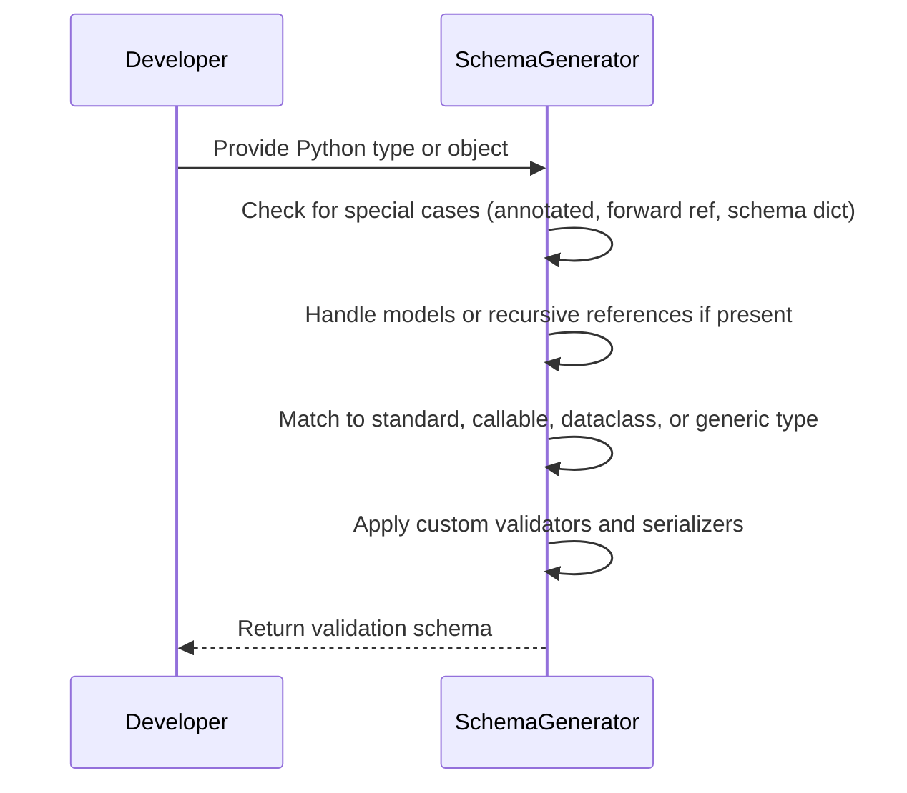
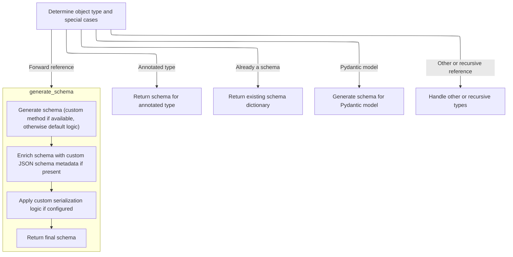
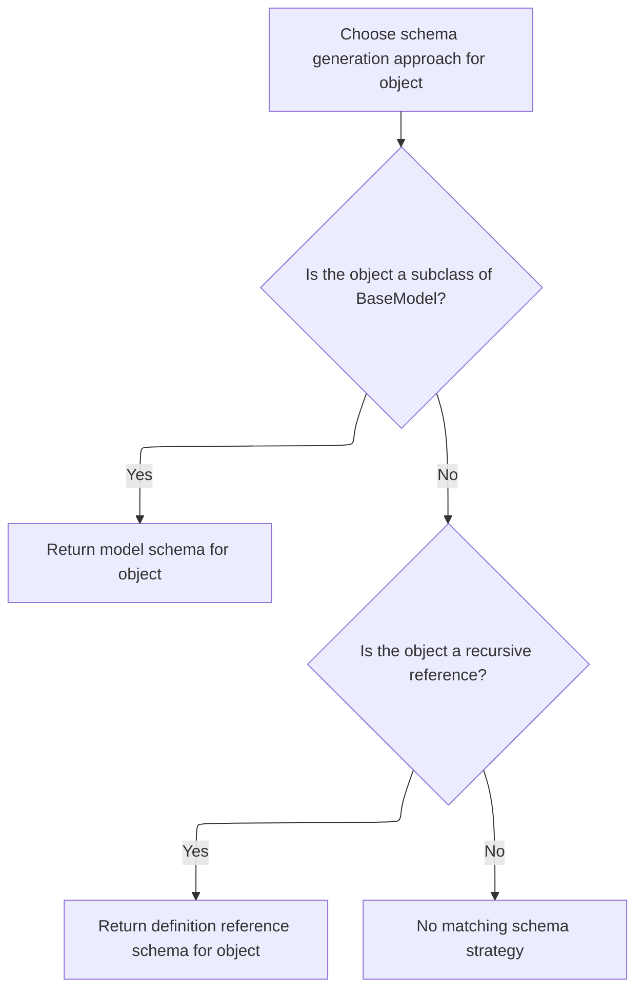
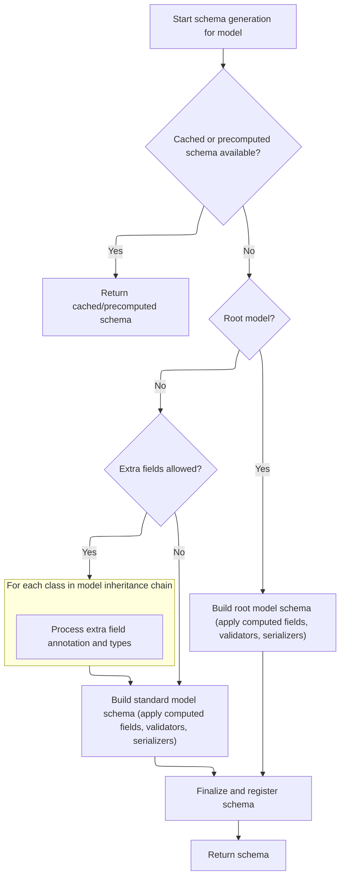
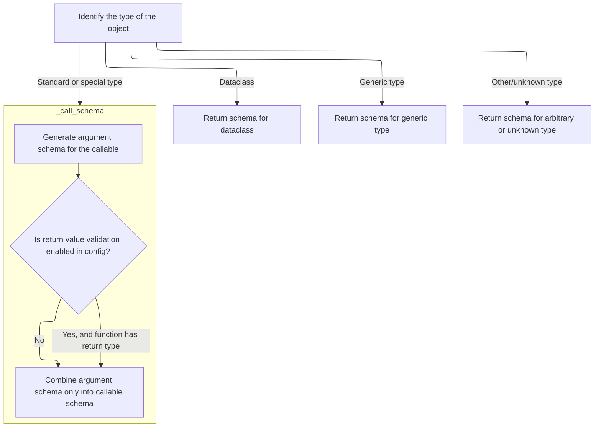
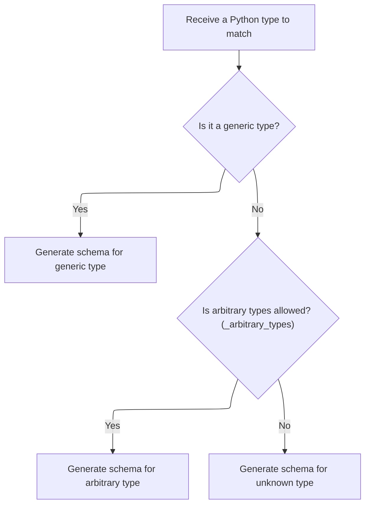
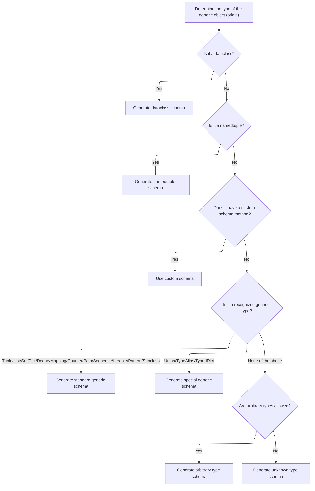

This document explains how a Python type or object is transformed into a validation schema for data validation and serialization. The process covers special cases, models, recursive references, and standard or generic types, ensuring each is mapped to the correct schema. Custom validators and serializers are applied as needed to produce the final schema.

Main steps:

- Identify and handle special cases (annotated types, forward references, schema dictionaries)
- Generate or reference schemas for models and recursive types
- Match standard, callable, dataclass, generic, or unknown types to their schemas
- Apply custom validators, serializers, and metadata before returning the schema



# Where is this flow used?

This flow is used multiple times in the codebase as represented in the following diagram:

(Note - these are only some of the entry points of this flow)

```mermaid
graph TD;
      0eebf8f2e9d7bbd27385e4fe6f159cce37c12c286e6370619f70a69a972a3144(pydantic/dataclasses.py::dataclass) --> 56b578e144c61cf1045d12573c86da3465a03844a77d3497f17a396520c82851(pydantic/_internal/_dataclasses.py::complete_dataclass)

0eebf8f2e9d7bbd27385e4fe6f159cce37c12c286e6370619f70a69a972a3144(pydantic/dataclasses.py::dataclass) --> b564b11d457ed88ea463f8ce971442dcf2169f39f2ced01758fb9142814a5cc2(pydantic/dataclasses.py::create_dataclass)

56b578e144c61cf1045d12573c86da3465a03844a77d3497f17a396520c82851(pydantic/_internal/_dataclasses.py::complete_dataclass) --> 821ac1c9f22e0ce452e164beea8710d439ce16fa997229e959c00e48d254c7db(pydantic/_internal/_schema_generation_shared.py::generate_schema)

821ac1c9f22e0ce452e164beea8710d439ce16fa997229e959c00e48d254c7db(pydantic/_internal/_schema_generation_shared.py::generate_schema) --> e374ce8459be5f7c51c6b09301cbf87c2cc3fa4ad4e9122e9fd158381e9e769f(pydantic/_internal/_generate_schema.py::generate_schema):::mainFlowStyle

e374ce8459be5f7c51c6b09301cbf87c2cc3fa4ad4e9122e9fd158381e9e769f(pydantic/_internal/_generate_schema.py::generate_schema):::mainFlowStyle --> b602d84b54cb2aba2cca4f5952a51a376a8aff59525d3534864295ca55a42112(pydantic/_internal/_generate_schema.py::_generate_schema_inner):::mainFlowStyle

b564b11d457ed88ea463f8ce971442dcf2169f39f2ced01758fb9142814a5cc2(pydantic/dataclasses.py::create_dataclass) --> 56b578e144c61cf1045d12573c86da3465a03844a77d3497f17a396520c82851(pydantic/_internal/_dataclasses.py::complete_dataclass)

51288aea0bc078db30730037d4a6f8d7dec4ad8a02c46c50ef8fb01087491a30(pydantic/_internal/_model_construction.py::__new__) --> 6cfaee3d4fde1d066f89ac588fdd8e3f5fae9df31454e1750b8a608267250827(pydantic/_internal/_model_construction.py::complete_model_class)

6cfaee3d4fde1d066f89ac588fdd8e3f5fae9df31454e1750b8a608267250827(pydantic/_internal/_model_construction.py::complete_model_class) --> 821ac1c9f22e0ce452e164beea8710d439ce16fa997229e959c00e48d254c7db(pydantic/_internal/_schema_generation_shared.py::generate_schema)

43a6baf44f877182cf37d9da8c2937d44be954f1be8aacbb4f6d4bf758d05203(docs/plugins/main.py::__class_getitem__) --> 2629968df57e5ee347551103b3d4611152a9bfc82adeffac7fb105bf188ddc0a(docs/plugins/main.py::model_rebuild)

2629968df57e5ee347551103b3d4611152a9bfc82adeffac7fb105bf188ddc0a(docs/plugins/main.py::model_rebuild) --> 6cfaee3d4fde1d066f89ac588fdd8e3f5fae9df31454e1750b8a608267250827(pydantic/_internal/_model_construction.py::complete_model_class)

177405f9b9d72012b7734db7285e10f7a642781583ae030d550f190b7a15c5f7(pydantic/dataclasses.py::rebuild_dataclass) --> 56b578e144c61cf1045d12573c86da3465a03844a77d3497f17a396520c82851(pydantic/_internal/_dataclasses.py::complete_dataclass)

b69d34d7c726a40aabc5a9d21ffd08fffd6a577cf2ca79e6332520c2157173c0(docs/plugins/main.py::update_forward_refs) --> 2629968df57e5ee347551103b3d4611152a9bfc82adeffac7fb105bf188ddc0a(docs/plugins/main.py::model_rebuild)


classDef mainFlowStyle color:#000000,fill:#7CB9F4
classDef rootsStyle color:#000000,fill:#00FFF4
classDef Style1 color:#000000,fill:#00FFAA
classDef Style2 color:#000000,fill:#FFFF00
classDef Style3 color:#000000,fill:#AA7CB9

%% Swimm:
%% graph TD;
%%       0eebf8f2e9d7bbd27385e4fe6f159cce37c12c286e6370619f70a69a972a3144(<SwmPath>[pydantic/dataclasses.py](pydantic/dataclasses.py)</SwmPath>::dataclass) --> 56b578e144c61cf1045d12573c86da3465a03844a77d3497f17a396520c82851(<SwmPath>[pydantic/\_internal/\_dataclasses.py](pydantic/_internal/_dataclasses.py)</SwmPath>::complete_dataclass)
%% 
%% 0eebf8f2e9d7bbd27385e4fe6f159cce37c12c286e6370619f70a69a972a3144(<SwmPath>[pydantic/dataclasses.py](pydantic/dataclasses.py)</SwmPath>::dataclass) --> b564b11d457ed88ea463f8ce971442dcf2169f39f2ced01758fb9142814a5cc2(<SwmPath>[pydantic/dataclasses.py](pydantic/dataclasses.py)</SwmPath>::create_dataclass)
%% 
%% 56b578e144c61cf1045d12573c86da3465a03844a77d3497f17a396520c82851(<SwmPath>[pydantic/\_internal/\_dataclasses.py](pydantic/_internal/_dataclasses.py)</SwmPath>::complete_dataclass) --> 821ac1c9f22e0ce452e164beea8710d439ce16fa997229e959c00e48d254c7db(<SwmPath>[pydantic/\_internal/\_schema_generation_shared.py](pydantic/_internal/_schema_generation_shared.py)</SwmPath>::<SwmToken path="pydantic/_internal/_generate_schema.py" pos="697:3:3" line-data="    def generate_schema(">`generate_schema`</SwmToken>)
%% 
%% 821ac1c9f22e0ce452e164beea8710d439ce16fa997229e959c00e48d254c7db(<SwmPath>[pydantic/\_internal/\_schema_generation_shared.py](pydantic/_internal/_schema_generation_shared.py)</SwmPath>::<SwmToken path="pydantic/_internal/_generate_schema.py" pos="697:3:3" line-data="    def generate_schema(">`generate_schema`</SwmToken>) --> e374ce8459be5f7c51c6b09301cbf87c2cc3fa4ad4e9122e9fd158381e9e769f(<SwmPath>[pydantic/\_internal/\_generate_schema.py](pydantic/_internal/_generate_schema.py)</SwmPath>::<SwmToken path="pydantic/_internal/_generate_schema.py" pos="697:3:3" line-data="    def generate_schema(">`generate_schema`</SwmToken>):::mainFlowStyle
%% 
%% e374ce8459be5f7c51c6b09301cbf87c2cc3fa4ad4e9122e9fd158381e9e769f(<SwmPath>[pydantic/\_internal/\_generate_schema.py](pydantic/_internal/_generate_schema.py)</SwmPath>::<SwmToken path="pydantic/_internal/_generate_schema.py" pos="697:3:3" line-data="    def generate_schema(">`generate_schema`</SwmToken>):::mainFlowStyle --> b602d84b54cb2aba2cca4f5952a51a376a8aff59525d3534864295ca55a42112(<SwmPath>[pydantic/\_internal/\_generate_schema.py](pydantic/_internal/_generate_schema.py)</SwmPath>::<SwmToken path="pydantic/_internal/_generate_schema.py" pos="724:7:7" line-data="            schema = self._generate_schema_inner(obj)">`_generate_schema_inner`</SwmToken>):::mainFlowStyle
%% 
%% b564b11d457ed88ea463f8ce971442dcf2169f39f2ced01758fb9142814a5cc2(<SwmPath>[pydantic/dataclasses.py](pydantic/dataclasses.py)</SwmPath>::create_dataclass) --> 56b578e144c61cf1045d12573c86da3465a03844a77d3497f17a396520c82851(<SwmPath>[pydantic/\_internal/\_dataclasses.py](pydantic/_internal/_dataclasses.py)</SwmPath>::complete_dataclass)
%% 
%% 51288aea0bc078db30730037d4a6f8d7dec4ad8a02c46c50ef8fb01087491a30(<SwmPath>[pydantic/\_internal/\_model_construction.py](pydantic/_internal/_model_construction.py)</SwmPath>::__new__) --> 6cfaee3d4fde1d066f89ac588fdd8e3f5fae9df31454e1750b8a608267250827(<SwmPath>[pydantic/\_internal/\_model_construction.py](pydantic/_internal/_model_construction.py)</SwmPath>::complete_model_class)
%% 
%% 6cfaee3d4fde1d066f89ac588fdd8e3f5fae9df31454e1750b8a608267250827(<SwmPath>[pydantic/\_internal/\_model_construction.py](pydantic/_internal/_model_construction.py)</SwmPath>::complete_model_class) --> 821ac1c9f22e0ce452e164beea8710d439ce16fa997229e959c00e48d254c7db(<SwmPath>[pydantic/\_internal/\_schema_generation_shared.py](pydantic/_internal/_schema_generation_shared.py)</SwmPath>::<SwmToken path="pydantic/_internal/_generate_schema.py" pos="697:3:3" line-data="    def generate_schema(">`generate_schema`</SwmToken>)
%% 
%% 43a6baf44f877182cf37d9da8c2937d44be954f1be8aacbb4f6d4bf758d05203(<SwmPath>[docs/plugins/main.py](docs/plugins/main.py)</SwmPath>::<SwmToken path="pydantic/_internal/_generate_schema.py" pos="1149:22:22" line-data="        # to resolve by modifying the value returned by `Generic.__class_getitem__`, but that is a dangerous game.">`__class_getitem__`</SwmToken>) --> 2629968df57e5ee347551103b3d4611152a9bfc82adeffac7fb105bf188ddc0a(<SwmPath>[docs/plugins/main.py](docs/plugins/main.py)</SwmPath>::model_rebuild)
%% 
%% 2629968df57e5ee347551103b3d4611152a9bfc82adeffac7fb105bf188ddc0a(<SwmPath>[docs/plugins/main.py](docs/plugins/main.py)</SwmPath>::model_rebuild) --> 6cfaee3d4fde1d066f89ac588fdd8e3f5fae9df31454e1750b8a608267250827(<SwmPath>[pydantic/\_internal/\_model_construction.py](pydantic/_internal/_model_construction.py)</SwmPath>::complete_model_class)
%% 
%% 177405f9b9d72012b7734db7285e10f7a642781583ae030d550f190b7a15c5f7(<SwmPath>[pydantic/dataclasses.py](pydantic/dataclasses.py)</SwmPath>::rebuild_dataclass) --> 56b578e144c61cf1045d12573c86da3465a03844a77d3497f17a396520c82851(<SwmPath>[pydantic/\_internal/\_dataclasses.py](pydantic/_internal/_dataclasses.py)</SwmPath>::complete_dataclass)
%% 
%% b69d34d7c726a40aabc5a9d21ffd08fffd6a577cf2ca79e6332520c2157173c0(<SwmPath>[docs/plugins/main.py](docs/plugins/main.py)</SwmPath>::update_forward_refs) --> 2629968df57e5ee347551103b3d4611152a9bfc82adeffac7fb105bf188ddc0a(<SwmPath>[docs/plugins/main.py](docs/plugins/main.py)</SwmPath>::model_rebuild)
%% 
%% 
%% classDef mainFlowStyle color:#000000,fill:#7CB9F4
%% classDef rootsStyle color:#000000,fill:#00FFF4
%% classDef Style1 color:#000000,fill:#00FFAA
%% classDef Style2 color:#000000,fill:#FFFF00
%% classDef Style3 color:#000000,fill:#AA7CB9
```



# Spec

## Detailed View of the Program's Functionality

## 1\. Determining the Type and Special Cases

The schema generation process begins by determining the type of the object for which a schema is to be generated. The process checks for several special cases in a specific order:

- If the object represents a "self" type (a reference to the current model), it is resolved to the actual model type.
- If the object is an "Annotated" type (a type with additional metadata or constraints), a dedicated method is called to generate the schema for the annotated type.
- If the object is already a dictionary, it is assumed to be a ready-to-use schema and is returned as-is.
- If the object is a string, it is converted into a forward reference.
- If the object is a forward reference, it is resolved to the actual type, and schema generation is restarted for the resolved type.

If none of these special cases match, the process continues to check if the object is a Pydantic model, a recursive reference, or falls into other categories.

## 2\. Handling Pydantic Models and Recursive References

If the object is a subclass of the Pydantic base model, the process pushes the model onto a stack (to track recursion and context) and generates a schema specifically for the model. This involves:

- Checking for cached or precomputed schemas.
- Handling model configuration and namespace context.
- Collecting or rebuilding model fields, especially in the presence of forward references or incomplete models.
- Validating that decorators reference real fields.
- Handling extra fields if allowed by the model configuration.
- Generating schemas for extra field types if present.

If the object is a recursive reference (used for self-referential or mutually referential types), a reference schema is returned to avoid infinite recursion.

If neither a model nor a recursive reference, the process falls through to type matching.

## 3\. Matching Python Types to Schemas

For objects that are not special cases or models, the process attempts to match the object to a known Python type or construct. This is done through a series of checks:

- Primitive types (str, int, float, bool, etc.) are mapped directly to their corresponding schemas.
- Standard library types (datetime, Decimal, UUID, etc.) are mapped to specialized schemas.
- Collection types (list, set, dict, tuple, etc.) are handled by generating schemas for their contained types, often recursively.
- Callable types (functions, methods, etc.) are handled by generating schemas for their arguments and, if configured, their return values.
- Enum types are mapped to enum schemas, including handling of empty enums.
- Dataclasses are detected and handled by generating schemas based on their fields and configuration.
- Generic types (<SwmToken path="pydantic/_internal/_generate_schema.py" pos="1033:18:20" line-data="        boilerplate before calling into the user-facing method (e.g. `GenerateSchema._tuple_schema`).">`e.g`</SwmToken>., List\[int\], Dict\[str, float\]) are detected and dispatched to a generic type handler.
- If the type is not recognized and arbitrary types are allowed, a generic instance schema is generated; otherwise, an error is raised.

## 4\. Handling Generic Types and Their Origins

When a generic type is detected (<SwmToken path="pydantic/_internal/_generate_schema.py" pos="925:22:24" line-data="            # safety measure (because these are inlined in place -- i.e. mutated directly)">`i.e`</SwmToken>., a type with parameters, such as List\[int\]), the process determines the origin of the generic (the base type before parameterization):

- If the origin is a dataclass, a schema is generated for the parametrized dataclass.
- If the origin is a namedtuple, a schema is generated for the parametrized namedtuple.
- If the origin has a custom schema method, that method is used.
- If the origin is a recognized generic type (tuple, list, set, dict, etc.), the appropriate schema is generated using the type parameters.
- If the origin is a special generic (Union, <SwmToken path="pydantic/_internal/_generate_schema.py" pos="54:6:6" line-data="from typing_extensions import TypeAlias, TypeAliasType, TypedDict, get_args, get_origin, is_typeddict">`TypeAlias`</SwmToken>, <SwmToken path="pydantic/_internal/_generate_schema.py" pos="718:8:8" line-data="                - If `typing.TypedDict` is used instead of `typing_extensions.TypedDict` on Python &lt; 3.12.">`TypedDict`</SwmToken>), a specialized schema is generated.
- If the origin is not recognized and arbitrary types are allowed, a generic instance schema is generated; otherwise, an error is raised.

## 5\. Building Model Schemas with Caching and Field Handling

When generating a schema for a Pydantic model:

- The process first checks for a cached or precomputed schema and returns it if available.
- If not cached, it sets up configuration and namespace context.
- It collects or rebuilds fields, handling forward references and incomplete models.
- Decorators and validators are checked to ensure they reference real fields.
- Extra fields are processed if allowed, including generating schemas for their types.
- For root models (models with a single root field), the schema is built around the root field.
- For standard models, schemas are generated for all fields and computed fields.
- Validators and serializers are applied as needed.
- The final schema is registered and returned as a reference schema.

## 6\. Building Schemas for Dataclasses

When generating a schema for a dataclass:

- The process checks for an existing schema and reuses or unpacks it if possible.
- Type variables are handled for generic dataclasses.
- Configuration is resolved, and fields are either copied or rebuilt depending on whether the dataclass is a Pydantic dataclass or a standard one.
- Fields are sorted and processed, with special handling for fields that are not allowed with certain configurations (<SwmToken path="pydantic/_internal/_generate_schema.py" pos="1033:18:20" line-data="        boilerplate before calling into the user-facing method (e.g. `GenerateSchema._tuple_schema`).">`e.g`</SwmToken>., init=False with extra='allow').
- Decorators and validators are applied.
- The schema is constructed, validators and serializers are layered, and the final schema is returned as a reference schema.

## 7\. Generating Schemas for Callable Types

For callable types (functions, methods, etc.):

- The process generates a schema for the callable's arguments by inspecting the function signature and type hints.
- If return value validation is enabled and the function has a return annotation, a schema is generated for the return value.
- The argument and return schemas are combined into a final callable schema.

## 8\. Fallback for Unknown Types

If the type does not match any known or handled case, and arbitrary types are not allowed, an error is raised indicating that a schema cannot be generated for the type. If arbitrary types are allowed, a generic instance schema is returned.

---

This flow ensures that Pydantic can generate schemas for a wide variety of Python types, including primitives, collections, models, dataclasses, generics, callables, and more, while handling special cases, recursion, and user customization through decorators and configuration.

# Rule Definition

| Paragraph Name                                                                                                                                                                                                                                                                                                                                                                                                                                                                                                                                                                                                                                                                                                                                                                                             | Rule ID | Category          | Description                                                                                                                                                                                                                                                                                                                                                                                                                                                                                                                                                                                                                                                                                                               | Conditions                                                                                                                                                                                                                                                                                                  | Remarks                                                                                                                                                                                                                                                                                                                                                                                                                                                                                                                                                                                                                                                                                                                                            |
| ---------------------------------------------------------------------------------------------------------------------------------------------------------------------------------------------------------------------------------------------------------------------------------------------------------------------------------------------------------------------------------------------------------------------------------------------------------------------------------------------------------------------------------------------------------------------------------------------------------------------------------------------------------------------------------------------------------------------------------------------------------------------------------------------------------- | ------- | ----------------- | ------------------------------------------------------------------------------------------------------------------------------------------------------------------------------------------------------------------------------------------------------------------------------------------------------------------------------------------------------------------------------------------------------------------------------------------------------------------------------------------------------------------------------------------------------------------------------------------------------------------------------------------------------------------------------------------------------------------------- | ----------------------------------------------------------------------------------------------------------------------------------------------------------------------------------------------------------------------------------------------------------------------------------------------------------- | -------------------------------------------------------------------------------------------------------------------------------------------------------------------------------------------------------------------------------------------------------------------------------------------------------------------------------------------------------------------------------------------------------------------------------------------------------------------------------------------------------------------------------------------------------------------------------------------------------------------------------------------------------------------------------------------------------------------------------------------------- |
| <SwmToken path="pydantic/_internal/_generate_schema.py" pos="697:3:3" line-data="    def generate_schema(">`generate_schema`</SwmToken>, <SwmToken path="pydantic/_internal/_generate_schema.py" pos="1023:5:5" line-data="        return self.match_type(obj)">`match_type`</SwmToken>, <SwmToken path="pydantic/_internal/_generate_schema.py" pos="724:7:7" line-data="            schema = self._generate_schema_inner(obj)">`_generate_schema_inner`</SwmToken>                                                                                                                                                                                                                                                                                                                                       | RL-001  | Conditional Logic | The system must accept as input any Python type, class, or object, but only generate schemas for built-in types (int, str, float, bool, <SwmToken path="pydantic/_internal/_generate_schema.py" pos="1070:17:17" line-data="        elif obj is None or obj is _typing_extra.NoneType:">`NoneType`</SwmToken>, list, dict) and Pydantic model types (subclasses of <SwmToken path="pydantic/_internal/_generate_schema.py" pos="736:13:13" line-data="    def _model_schema(self, cls: type[BaseModel]) -&gt; core_schema.CoreSchema:">`BaseModel`</SwmToken>). All other types must be rejected or ignored.                                                                                                              | Input is a Python type, class, or object. The type must be one of the supported built-in types or a subclass of <SwmToken path="pydantic/_internal/_generate_schema.py" pos="736:13:13" line-data="    def _model_schema(self, cls: type[BaseModel]) -&gt; core_schema.CoreSchema:">`BaseModel`</SwmToken>. | Supported built-in types: int, str, float, bool, <SwmToken path="pydantic/_internal/_generate_schema.py" pos="1070:17:17" line-data="        elif obj is None or obj is _typing_extra.NoneType:">`NoneType`</SwmToken>, list, dict. Supported model type: subclass of <SwmToken path="pydantic/_internal/_generate_schema.py" pos="736:13:13" line-data="    def _model_schema(self, cls: type[BaseModel]) -&gt; core_schema.CoreSchema:">`BaseModel`</SwmToken>. No dataclasses, callables, generics, TypedDicts, Enums, or other advanced types.                                                                                                                                                                                                 |
| <SwmToken path="pydantic/_internal/_generate_schema.py" pos="697:3:3" line-data="    def generate_schema(">`generate_schema`</SwmToken>, <SwmToken path="pydantic/_internal/_generate_schema.py" pos="1023:5:5" line-data="        return self.match_type(obj)">`match_type`</SwmToken>, <SwmToken path="pydantic/_internal/_generate_schema.py" pos="736:3:3" line-data="    def _model_schema(self, cls: type[BaseModel]) -&gt; core_schema.CoreSchema:">`_model_schema`</SwmToken>, <SwmToken path="pydantic/_internal/_generate_schema.py" pos="1079:5:5" line-data="            return self._list_schema(Any)">`_list_schema`</SwmToken>, <SwmToken path="pydantic/_internal/_generate_schema.py" pos="1089:5:5" line-data="            return self._dict_schema(Any, Any)">`_dict_schema`</SwmToken> | RL-002  | Data Assignment   | Every generated schema must be a dictionary (core schema) that includes a 'type' key indicating the kind of schema (<SwmToken path="pydantic/_internal/_generate_schema.py" pos="1033:18:20" line-data="        boilerplate before calling into the user-facing method (e.g. `GenerateSchema._tuple_schema`).">`e.g`</SwmToken>., 'int', 'str', 'model', etc.).                                                                                                                                                                                                                                                                                                                                                           | Schema is being generated for a supported type.                                                                                                                                                                                                                                                             | The 'type' key must be present in every schema dictionary. Allowed values: 'int', 'str', 'float', 'bool', 'none', 'list', 'dict', 'model'.                                                                                                                                                                                                                                                                                                                                                                                                                                                                                                                                                                                                         |
| <SwmToken path="pydantic/_internal/_generate_schema.py" pos="1023:5:5" line-data="        return self.match_type(obj)">`match_type`</SwmToken>, <SwmToken path="pydantic/_internal/_generate_schema.py" pos="1079:5:5" line-data="            return self._list_schema(Any)">`_list_schema`</SwmToken>, <SwmToken path="pydantic/_internal/_generate_schema.py" pos="1089:5:5" line-data="            return self._dict_schema(Any, Any)">`_dict_schema`</SwmToken>                                                                                                                                                                                                                                                                                                                                        | RL-003  | Data Assignment   | For built-in types, the schema must have the correct 'type' value and, for collections, include keys for element schemas (<SwmToken path="pydantic/_internal/_generate_schema.py" pos="259:4:4" line-data="            schema[&#39;items_schema&#39;][variadic_item_index] = apply_validators(">`items_schema`</SwmToken> for lists, <SwmToken path="pydantic/_internal/_generate_schema.py" pos="582:1:1" line-data="        keys_schema = self.generate_schema(keys_type)">`keys_schema`</SwmToken> and <SwmToken path="pydantic/_internal/_generate_schema.py" pos="267:10:10" line-data="        inner_schema = schema.get(&#39;values_schema&#39;, core_schema.any_schema())">`values_schema`</SwmToken> for dicts). | Input type is one of the supported built-in types.                                                                                                                                                                                                                                                          | For 'list': include <SwmToken path="pydantic/_internal/_generate_schema.py" pos="259:4:4" line-data="            schema[&#39;items_schema&#39;][variadic_item_index] = apply_validators(">`items_schema`</SwmToken> key with the schema for list elements. For 'dict': include <SwmToken path="pydantic/_internal/_generate_schema.py" pos="582:1:1" line-data="        keys_schema = self.generate_schema(keys_type)">`keys_schema`</SwmToken> and <SwmToken path="pydantic/_internal/_generate_schema.py" pos="267:10:10" line-data="        inner_schema = schema.get(&#39;values_schema&#39;, core_schema.any_schema())">`values_schema`</SwmToken> keys with schemas for keys and values. All schemas must be dictionaries with a 'type' key. |
| <SwmToken path="pydantic/_internal/_generate_schema.py" pos="736:3:3" line-data="    def _model_schema(self, cls: type[BaseModel]) -&gt; core_schema.CoreSchema:">`_model_schema`</SwmToken>                                                                                                                                                                                                                                                                                                                                                                                                                                                                                                                                                                                                               | RL-004  | Data Assignment   | For Pydantic model types, the schema must include 'type': 'model', the model class object as 'cls', a nested schema for fields under 'schema', a string reference 'ref', and a configuration dictionary 'config'.                                                                                                                                                                                                                                                                                                                                                                                                                                                                                                         | Input type is a subclass of <SwmToken path="pydantic/_internal/_generate_schema.py" pos="736:13:13" line-data="    def _model_schema(self, cls: type[BaseModel]) -&gt; core_schema.CoreSchema:">`BaseModel`</SwmToken>.                                                                                     | Schema format: {'type': 'model', 'cls': <model class>, 'schema': {'type': 'model-fields', 'fields': {<field name>: <field schema>, ...}}, 'ref': <string>, 'config': <dict>}.                                                                                                                                                                                                                                                                                                                                                                                                                                                                                                                                                                      |
| <SwmToken path="pydantic/_internal/_generate_schema.py" pos="724:7:7" line-data="            schema = self._generate_schema_inner(obj)">`_generate_schema_inner`</SwmToken>, <SwmToken path="pydantic/_internal/_generate_schema.py" pos="1012:9:9" line-data="            return self.generate_schema(self._resolve_forward_ref(obj))">`_resolve_forward_ref`</SwmToken>, <SwmToken path="pydantic/_internal/_generate_schema.py" pos="736:3:3" line-data="    def _model_schema(self, cls: type[BaseModel]) -&gt; core_schema.CoreSchema:">`_model_schema`</SwmToken>                                                                                                                                                                                                                                    | RL-005  | Conditional Logic | The system must not attempt to resolve or process recursive models or forward references. Only non-recursive, non-forward-ref types are supported.                                                                                                                                                                                                                                                                                                                                                                                                                                                                                                                                                                        | Input type is recursive or a forward reference.                                                                                                                                                                                                                                                             | If a recursive or forward reference is detected, the system must not process it and should raise an error or skip.                                                                                                                                                                                                                                                                                                                                                                                                                                                                                                                                                                                                                                 |
| <SwmToken path="pydantic/_internal/_generate_schema.py" pos="1023:5:5" line-data="        return self.match_type(obj)">`match_type`</SwmToken>, <SwmToken path="pydantic/_internal/_generate_schema.py" pos="724:7:7" line-data="            schema = self._generate_schema_inner(obj)">`_generate_schema_inner`</SwmToken>                                                                                                                                                                                                                                                                                                                                                                                                                                                                                | RL-006  | Conditional Logic | The system must not require or process dataclasses, callables, generics, TypedDicts, Enums, or any other advanced Python typing constructs beyond the explicitly supported types.                                                                                                                                                                                                                                                                                                                                                                                                                                                                                                                                         | Input type is not in the supported list.                                                                                                                                                                                                                                                                    | Unsupported types: dataclasses, callables, generics, TypedDicts, Enums, etc.                                                                                                                                                                                                                                                                                                                                                                                                                                                                                                                                                                                                                                                                       |
| <SwmToken path="pydantic/_internal/_generate_schema.py" pos="1032:5:5" line-data="        (like `GenerateSchema.tuple_variable_schema`) or calls into a private method that handles some">`GenerateSchema`</SwmToken>.**init**, <SwmToken path="pydantic/_internal/_generate_schema.py" pos="736:3:3" line-data="    def _model_schema(self, cls: type[BaseModel]) -&gt; core_schema.CoreSchema:">`_model_schema`</SwmToken>                                                                                                                                                                                                                                                                                                                                                                               | RL-007  | Data Assignment   | The system must use the configuration provided by a <SwmToken path="pydantic/_internal/_generate_schema.py" pos="754:1:1" line-data="            config_wrapper = ConfigWrapper(cls.model_config, check=False)">`config_wrapper`</SwmToken> object, which supplies at least a .core_config() method returning a configuration dictionary for the schema.                                                                                                                                                                                                                                                                                                                                                                  | Schema generation is being performed.                                                                                                                                                                                                                                                                       | <SwmToken path="pydantic/_internal/_generate_schema.py" pos="754:1:1" line-data="            config_wrapper = ConfigWrapper(cls.model_config, check=False)">`config_wrapper`</SwmToken> must provide .core_config(). The configuration dictionary is included in the model schema under the 'config' key.                                                                                                                                                                                                                                                                                                                                                                                                                                          |
| <SwmToken path="pydantic/_internal/_generate_schema.py" pos="697:3:3" line-data="    def generate_schema(">`generate_schema`</SwmToken>, <SwmToken path="pydantic/_internal/_generate_schema.py" pos="736:3:3" line-data="    def _model_schema(self, cls: type[BaseModel]) -&gt; core_schema.CoreSchema:">`_model_schema`</SwmToken>, <SwmToken path="pydantic/_internal/_generate_schema.py" pos="1079:5:5" line-data="            return self._list_schema(Any)">`_list_schema`</SwmToken>, <SwmToken path="pydantic/_internal/_generate_schema.py" pos="1089:5:5" line-data="            return self._dict_schema(Any, Any)">`_dict_schema`</SwmToken>                                                                                                                                                 | RL-008  | Conditional Logic | The system must not include logic for custom validators, serializers, or metadata beyond what is required to describe the structure of the supported types and models.                                                                                                                                                                                                                                                                                                                                                                                                                                                                                                                                                    | Schema generation for any supported type.                                                                                                                                                                                                                                                                   | Only include keys and structure as described in the spec. Do not add custom validation, serialization, or metadata logic.                                                                                                                                                                                                                                                                                                                                                                                                                                                                                                                                                                                                                          |
| <SwmToken path="pydantic/_internal/_generate_schema.py" pos="697:3:3" line-data="    def generate_schema(">`generate_schema`</SwmToken>                                                                                                                                                                                                                                                                                                                                                                                                                                                                                                                                                                                                                                                                    | RL-009  | Computation       | The system must provide a main entry point that accepts the input type/object and returns the corresponding schema dictionary as described.                                                                                                                                                                                                                                                                                                                                                                                                                                                                                                                                                                               | Input is a supported type.                                                                                                                                                                                                                                                                                  | The main entry point is a function (<SwmToken path="pydantic/_internal/_generate_schema.py" pos="1033:18:20" line-data="        boilerplate before calling into the user-facing method (e.g. `GenerateSchema._tuple_schema`).">`e.g`</SwmToken>., <SwmToken path="pydantic/_internal/_generate_schema.py" pos="697:3:3" line-data="    def generate_schema(">`generate_schema`</SwmToken>) that returns the schema dictionary for the input.                                                                                                                                                                                                                                                                                                       |

# User Stories

## User Story 1: Generate schema for supported types and models

---

### Story Description:

As a user of the schema generation system, I want to generate a schema dictionary for any supported built-in Python type or Pydantic model, using a main entry point function, so that I can validate and serialize data structures according to a consistent and predictable schema format.

---

### Business Rule Mapping:

| Rule ID | Paragraph Name                                                                                                                                                                                                                                                                                                                                                                                                                                                                                                                                                                                                                                                                                                                                                                                             | Rule Description                                                                                                                                                                                                                                                                                                                                                                                                                                                                                                                                                                                                                                                                                                          |
| ------- | ---------------------------------------------------------------------------------------------------------------------------------------------------------------------------------------------------------------------------------------------------------------------------------------------------------------------------------------------------------------------------------------------------------------------------------------------------------------------------------------------------------------------------------------------------------------------------------------------------------------------------------------------------------------------------------------------------------------------------------------------------------------------------------------------------------- | ------------------------------------------------------------------------------------------------------------------------------------------------------------------------------------------------------------------------------------------------------------------------------------------------------------------------------------------------------------------------------------------------------------------------------------------------------------------------------------------------------------------------------------------------------------------------------------------------------------------------------------------------------------------------------------------------------------------------- |
| RL-001  | <SwmToken path="pydantic/_internal/_generate_schema.py" pos="697:3:3" line-data="    def generate_schema(">`generate_schema`</SwmToken>, <SwmToken path="pydantic/_internal/_generate_schema.py" pos="1023:5:5" line-data="        return self.match_type(obj)">`match_type`</SwmToken>, <SwmToken path="pydantic/_internal/_generate_schema.py" pos="724:7:7" line-data="            schema = self._generate_schema_inner(obj)">`_generate_schema_inner`</SwmToken>                                                                                                                                                                                                                                                                                                                                       | The system must accept as input any Python type, class, or object, but only generate schemas for built-in types (int, str, float, bool, <SwmToken path="pydantic/_internal/_generate_schema.py" pos="1070:17:17" line-data="        elif obj is None or obj is _typing_extra.NoneType:">`NoneType`</SwmToken>, list, dict) and Pydantic model types (subclasses of <SwmToken path="pydantic/_internal/_generate_schema.py" pos="736:13:13" line-data="    def _model_schema(self, cls: type[BaseModel]) -&gt; core_schema.CoreSchema:">`BaseModel`</SwmToken>). All other types must be rejected or ignored.                                                                                                              |
| RL-002  | <SwmToken path="pydantic/_internal/_generate_schema.py" pos="697:3:3" line-data="    def generate_schema(">`generate_schema`</SwmToken>, <SwmToken path="pydantic/_internal/_generate_schema.py" pos="1023:5:5" line-data="        return self.match_type(obj)">`match_type`</SwmToken>, <SwmToken path="pydantic/_internal/_generate_schema.py" pos="736:3:3" line-data="    def _model_schema(self, cls: type[BaseModel]) -&gt; core_schema.CoreSchema:">`_model_schema`</SwmToken>, <SwmToken path="pydantic/_internal/_generate_schema.py" pos="1079:5:5" line-data="            return self._list_schema(Any)">`_list_schema`</SwmToken>, <SwmToken path="pydantic/_internal/_generate_schema.py" pos="1089:5:5" line-data="            return self._dict_schema(Any, Any)">`_dict_schema`</SwmToken> | Every generated schema must be a dictionary (core schema) that includes a 'type' key indicating the kind of schema (<SwmToken path="pydantic/_internal/_generate_schema.py" pos="1033:18:20" line-data="        boilerplate before calling into the user-facing method (e.g. `GenerateSchema._tuple_schema`).">`e.g`</SwmToken>., 'int', 'str', 'model', etc.).                                                                                                                                                                                                                                                                                                                                                           |
| RL-008  | <SwmToken path="pydantic/_internal/_generate_schema.py" pos="697:3:3" line-data="    def generate_schema(">`generate_schema`</SwmToken>, <SwmToken path="pydantic/_internal/_generate_schema.py" pos="736:3:3" line-data="    def _model_schema(self, cls: type[BaseModel]) -&gt; core_schema.CoreSchema:">`_model_schema`</SwmToken>, <SwmToken path="pydantic/_internal/_generate_schema.py" pos="1079:5:5" line-data="            return self._list_schema(Any)">`_list_schema`</SwmToken>, <SwmToken path="pydantic/_internal/_generate_schema.py" pos="1089:5:5" line-data="            return self._dict_schema(Any, Any)">`_dict_schema`</SwmToken>                                                                                                                                                 | The system must not include logic for custom validators, serializers, or metadata beyond what is required to describe the structure of the supported types and models.                                                                                                                                                                                                                                                                                                                                                                                                                                                                                                                                                    |
| RL-009  | <SwmToken path="pydantic/_internal/_generate_schema.py" pos="697:3:3" line-data="    def generate_schema(">`generate_schema`</SwmToken>                                                                                                                                                                                                                                                                                                                                                                                                                                                                                                                                                                                                                                                                    | The system must provide a main entry point that accepts the input type/object and returns the corresponding schema dictionary as described.                                                                                                                                                                                                                                                                                                                                                                                                                                                                                                                                                                               |
| RL-004  | <SwmToken path="pydantic/_internal/_generate_schema.py" pos="736:3:3" line-data="    def _model_schema(self, cls: type[BaseModel]) -&gt; core_schema.CoreSchema:">`_model_schema`</SwmToken>                                                                                                                                                                                                                                                                                                                                                                                                                                                                                                                                                                                                               | For Pydantic model types, the schema must include 'type': 'model', the model class object as 'cls', a nested schema for fields under 'schema', a string reference 'ref', and a configuration dictionary 'config'.                                                                                                                                                                                                                                                                                                                                                                                                                                                                                                         |
| RL-003  | <SwmToken path="pydantic/_internal/_generate_schema.py" pos="1023:5:5" line-data="        return self.match_type(obj)">`match_type`</SwmToken>, <SwmToken path="pydantic/_internal/_generate_schema.py" pos="1079:5:5" line-data="            return self._list_schema(Any)">`_list_schema`</SwmToken>, <SwmToken path="pydantic/_internal/_generate_schema.py" pos="1089:5:5" line-data="            return self._dict_schema(Any, Any)">`_dict_schema`</SwmToken>                                                                                                                                                                                                                                                                                                                                        | For built-in types, the schema must have the correct 'type' value and, for collections, include keys for element schemas (<SwmToken path="pydantic/_internal/_generate_schema.py" pos="259:4:4" line-data="            schema[&#39;items_schema&#39;][variadic_item_index] = apply_validators(">`items_schema`</SwmToken> for lists, <SwmToken path="pydantic/_internal/_generate_schema.py" pos="582:1:1" line-data="        keys_schema = self.generate_schema(keys_type)">`keys_schema`</SwmToken> and <SwmToken path="pydantic/_internal/_generate_schema.py" pos="267:10:10" line-data="        inner_schema = schema.get(&#39;values_schema&#39;, core_schema.any_schema())">`values_schema`</SwmToken> for dicts). |
| RL-007  | <SwmToken path="pydantic/_internal/_generate_schema.py" pos="1032:5:5" line-data="        (like `GenerateSchema.tuple_variable_schema`) or calls into a private method that handles some">`GenerateSchema`</SwmToken>.**init**, <SwmToken path="pydantic/_internal/_generate_schema.py" pos="736:3:3" line-data="    def _model_schema(self, cls: type[BaseModel]) -&gt; core_schema.CoreSchema:">`_model_schema`</SwmToken>                                                                                                                                                                                                                                                                                                                                                                               | The system must use the configuration provided by a <SwmToken path="pydantic/_internal/_generate_schema.py" pos="754:1:1" line-data="            config_wrapper = ConfigWrapper(cls.model_config, check=False)">`config_wrapper`</SwmToken> object, which supplies at least a .core_config() method returning a configuration dictionary for the schema.                                                                                                                                                                                                                                                                                                                                                                  |

---

### Relevant Functionality:

- <SwmToken path="pydantic/_internal/_generate_schema.py" pos="697:3:3" line-data="    def generate_schema(">`generate_schema`</SwmToken>
  1. **RL-001:**
     - When <SwmToken path="pydantic/_internal/_generate_schema.py" pos="697:3:3" line-data="    def generate_schema(">`generate_schema`</SwmToken> is called:
       - If input is a supported built-in type or <SwmToken path="pydantic/_internal/_generate_schema.py" pos="736:13:13" line-data="    def _model_schema(self, cls: type[BaseModel]) -&gt; core_schema.CoreSchema:">`BaseModel`</SwmToken> subclass, proceed to schema generation.
       - Else, raise an error or return an unsupported type indication.
  2. **RL-002:**
     - When generating a schema for any type:
       - Create a dictionary.
       - Set the 'type' key to the appropriate value for the type being described.
  3. **RL-008:**
     - When generating schemas, only include the required keys and structure.
     - Do not add or process custom validators, serializers, or extra metadata.
  4. **RL-009:**
     - Define a function that accepts a type/object.
     - If supported, generate and return the schema dictionary.
     - Otherwise, raise an error or return unsupported indication.
- <SwmToken path="pydantic/_internal/_generate_schema.py" pos="736:3:3" line-data="    def _model_schema(self, cls: type[BaseModel]) -&gt; core_schema.CoreSchema:">`_model_schema`</SwmToken>
  1. **RL-004:**
     - If type is a subclass of <SwmToken path="pydantic/_internal/_generate_schema.py" pos="736:13:13" line-data="    def _model_schema(self, cls: type[BaseModel]) -&gt; core_schema.CoreSchema:">`BaseModel`</SwmToken>:
       - Set 'type': 'model'.
       - Set 'cls' to the model class object.
       - For each field, generate its schema and add to 'fields' dict.
       - Set 'schema': {'type': 'model-fields', 'fields': ...}.
       - Set 'ref' to a string reference for the model.
       - Set 'config' to the model's configuration dictionary.
- <SwmToken path="pydantic/_internal/_generate_schema.py" pos="1023:5:5" line-data="        return self.match_type(obj)">`match_type`</SwmToken>
  1. **RL-003:**
     - If type is 'list':
       - Generate schema for element type.
       - Set 'type': 'list', <SwmToken path="pydantic/_internal/_generate_schema.py" pos="259:4:4" line-data="            schema[&#39;items_schema&#39;][variadic_item_index] = apply_validators(">`items_schema`</SwmToken>: <element schema>.
     - If type is 'dict':
       - Generate schemas for key and value types.
       - Set 'type': 'dict', <SwmToken path="pydantic/_internal/_generate_schema.py" pos="582:1:1" line-data="        keys_schema = self.generate_schema(keys_type)">`keys_schema`</SwmToken>: <key schema>, <SwmToken path="pydantic/_internal/_generate_schema.py" pos="267:10:10" line-data="        inner_schema = schema.get(&#39;values_schema&#39;, core_schema.any_schema())">`values_schema`</SwmToken>: <value schema>.
     - For other built-in types:
       - Set 'type' to the corresponding type string.
- **GenerateSchema.init**
  1. **RL-007:**
     - On initialization, store the <SwmToken path="pydantic/_internal/_generate_schema.py" pos="754:1:1" line-data="            config_wrapper = ConfigWrapper(cls.model_config, check=False)">`config_wrapper`</SwmToken>.
     - When generating a model schema, call config_wrapper.core_config() and include the result in the schema dictionary.

## User Story 2: Reject unsupported and recursive types

---

### Story Description:

As a user of the schema generation system, I want the system to reject or ignore unsupported types, recursive models, and forward references so that only valid, non-recursive, and explicitly supported types are processed and included in the schema.

---

### Business Rule Mapping:

| Rule ID | Paragraph Name                                                                                                                                                                                                                                                                                                                                                                                                                                                                                                                                                          | Rule Description                                                                                                                                                                                                                                                                                                                                                                                                                                                                                                                                                                                             |
| ------- | ----------------------------------------------------------------------------------------------------------------------------------------------------------------------------------------------------------------------------------------------------------------------------------------------------------------------------------------------------------------------------------------------------------------------------------------------------------------------------------------------------------------------------------------------------------------------- | ------------------------------------------------------------------------------------------------------------------------------------------------------------------------------------------------------------------------------------------------------------------------------------------------------------------------------------------------------------------------------------------------------------------------------------------------------------------------------------------------------------------------------------------------------------------------------------------------------------ |
| RL-005  | <SwmToken path="pydantic/_internal/_generate_schema.py" pos="724:7:7" line-data="            schema = self._generate_schema_inner(obj)">`_generate_schema_inner`</SwmToken>, <SwmToken path="pydantic/_internal/_generate_schema.py" pos="1012:9:9" line-data="            return self.generate_schema(self._resolve_forward_ref(obj))">`_resolve_forward_ref`</SwmToken>, <SwmToken path="pydantic/_internal/_generate_schema.py" pos="736:3:3" line-data="    def _model_schema(self, cls: type[BaseModel]) -&gt; core_schema.CoreSchema:">`_model_schema`</SwmToken> | The system must not attempt to resolve or process recursive models or forward references. Only non-recursive, non-forward-ref types are supported.                                                                                                                                                                                                                                                                                                                                                                                                                                                           |
| RL-001  | <SwmToken path="pydantic/_internal/_generate_schema.py" pos="697:3:3" line-data="    def generate_schema(">`generate_schema`</SwmToken>, <SwmToken path="pydantic/_internal/_generate_schema.py" pos="1023:5:5" line-data="        return self.match_type(obj)">`match_type`</SwmToken>, <SwmToken path="pydantic/_internal/_generate_schema.py" pos="724:7:7" line-data="            schema = self._generate_schema_inner(obj)">`_generate_schema_inner`</SwmToken>                                                                                                    | The system must accept as input any Python type, class, or object, but only generate schemas for built-in types (int, str, float, bool, <SwmToken path="pydantic/_internal/_generate_schema.py" pos="1070:17:17" line-data="        elif obj is None or obj is _typing_extra.NoneType:">`NoneType`</SwmToken>, list, dict) and Pydantic model types (subclasses of <SwmToken path="pydantic/_internal/_generate_schema.py" pos="736:13:13" line-data="    def _model_schema(self, cls: type[BaseModel]) -&gt; core_schema.CoreSchema:">`BaseModel`</SwmToken>). All other types must be rejected or ignored. |
| RL-006  | <SwmToken path="pydantic/_internal/_generate_schema.py" pos="1023:5:5" line-data="        return self.match_type(obj)">`match_type`</SwmToken>, <SwmToken path="pydantic/_internal/_generate_schema.py" pos="724:7:7" line-data="            schema = self._generate_schema_inner(obj)">`_generate_schema_inner`</SwmToken>                                                                                                                                                                                                                                             | The system must not require or process dataclasses, callables, generics, TypedDicts, Enums, or any other advanced Python typing constructs beyond the explicitly supported types.                                                                                                                                                                                                                                                                                                                                                                                                                            |

---

### Relevant Functionality:

- <SwmToken path="pydantic/_internal/_generate_schema.py" pos="724:7:7" line-data="            schema = self._generate_schema_inner(obj)">`_generate_schema_inner`</SwmToken>
  1. **RL-005:**
     - When encountering a forward reference or recursion:
       - Raise an error or return an unsupported type indication.
- <SwmToken path="pydantic/_internal/_generate_schema.py" pos="697:3:3" line-data="    def generate_schema(">`generate_schema`</SwmToken>
  1. **RL-001:**
     - When <SwmToken path="pydantic/_internal/_generate_schema.py" pos="697:3:3" line-data="    def generate_schema(">`generate_schema`</SwmToken> is called:
       - If input is a supported built-in type or <SwmToken path="pydantic/_internal/_generate_schema.py" pos="736:13:13" line-data="    def _model_schema(self, cls: type[BaseModel]) -&gt; core_schema.CoreSchema:">`BaseModel`</SwmToken> subclass, proceed to schema generation.
       - Else, raise an error or return an unsupported type indication.
- <SwmToken path="pydantic/_internal/_generate_schema.py" pos="1023:5:5" line-data="        return self.match_type(obj)">`match_type`</SwmToken>
  1. **RL-006:**
     - If input type is not a supported built-in type or <SwmToken path="pydantic/_internal/_generate_schema.py" pos="736:13:13" line-data="    def _model_schema(self, cls: type[BaseModel]) -&gt; core_schema.CoreSchema:">`BaseModel`</SwmToken> subclass:
       - Raise an error or return an unsupported type indication.

# Code Walkthrough

## Dispatching Schema Generation by Type



<SwmSnippet path="/pydantic/_internal/_generate_schema.py" line="997">

---

In <SwmToken path="pydantic/_internal/_generate_schema.py" pos="997:3:3" line-data="    def _generate_schema_inner(self, obj: Any) -&gt; core_schema.CoreSchema:">`_generate_schema_inner`</SwmToken>, we start by handling special cases: self types, annotated types, and dicts (which are assumed to be ready-to-use schemas and returned as-is). If the input is a string, it's converted to a <SwmToken path="pydantic/_internal/_generate_schema.py" pos="1009:5:5" line-data="            obj = ForwardRef(obj)">`ForwardRef`</SwmToken>. If it's a <SwmToken path="pydantic/_internal/_generate_schema.py" pos="1009:5:5" line-data="            obj = ForwardRef(obj)">`ForwardRef`</SwmToken>, we resolve it and then call <SwmToken path="pydantic/_internal/_generate_schema.py" pos="1012:5:5" line-data="            return self.generate_schema(self._resolve_forward_ref(obj))">`generate_schema`</SwmToken> to handle the resolved type, since the schema for the actual type still needs to be generated. This branching is needed to support all the Python and Pydantic-specific typing constructs that might come in.

```python
    def _generate_schema_inner(self, obj: Any) -> core_schema.CoreSchema:
        if typing_objects.is_self(obj):
            obj = self._resolve_self_type(obj)

        if typing_objects.is_annotated(get_origin(obj)):
            return self._annotated_schema(obj)

        if isinstance(obj, dict):
            # we assume this is already a valid schema
            return obj  # type: ignore[return-value]

        if isinstance(obj, str):
            obj = ForwardRef(obj)

        if isinstance(obj, ForwardRef):
            return self.generate_schema(self._resolve_forward_ref(obj))

```

---

</SwmSnippet>

### Schema Retrieval or Generation Entry Point

<SwmSnippet path="/pydantic/_internal/_generate_schema.py" line="697">

---

In <SwmToken path="pydantic/_internal/_generate_schema.py" pos="697:3:3" line-data="    def generate_schema(">`generate_schema`</SwmToken>, we check for a pre-existing schema, and if it's not there, we delegate to <SwmToken path="pydantic/_internal/_generate_schema.py" pos="724:7:7" line-data="            schema = self._generate_schema_inner(obj)">`_generate_schema_inner`</SwmToken> to do the heavy lifting.

```python
    def generate_schema(
        self,
        obj: Any,
    ) -> core_schema.CoreSchema:
        """Generate core schema.

        Args:
            obj: The object to generate core schema for.

        Returns:
            The generated core schema.

        Raises:
            PydanticUndefinedAnnotation:
                If it is not possible to evaluate forward reference.
            PydanticSchemaGenerationError:
                If it is not possible to generate pydantic-core schema.
            TypeError:
                - If `alias_generator` returns a disallowed type (must be str, AliasPath or AliasChoices).
                - If V1 style validator with `each_item=True` applied on a wrong field.
            PydanticUserError:
                - If `typing.TypedDict` is used instead of `typing_extensions.TypedDict` on Python < 3.12.
                - If `__modify_schema__` method is used instead of `__get_pydantic_json_schema__`.
        """
        schema = self._generate_schema_from_get_schema_method(obj, obj)

        if schema is None:
            schema = self._generate_schema_inner(obj)

```

---

</SwmSnippet>

<SwmSnippet path="/pydantic/_internal/_generate_schema.py" line="726">

---

After coming back from <SwmToken path="pydantic/_internal/_generate_schema.py" pos="724:7:7" line-data="            schema = self._generate_schema_inner(obj)">`_generate_schema_inner`</SwmToken> in <SwmToken path="pydantic/_internal/_generate_schema.py" pos="697:3:3" line-data="    def generate_schema(">`generate_schema`</SwmToken>, we check if there's a custom JSON schema function to attach, apply any custom serialization logic, and then return the finalized schema. This wraps up the schema generation process for the object.

```python
        metadata_js_function = _extract_get_pydantic_json_schema(obj)
        if metadata_js_function is not None:
            metadata_schema = resolve_original_schema(schema, self.defs)
            if metadata_schema:
                self._add_js_function(metadata_schema, metadata_js_function)

        schema = _add_custom_serialization_from_json_encoders(self._config_wrapper.json_encoders, obj, schema)

        return schema
```

---

</SwmSnippet>

### Model and Recursive Reference Handling



<SwmSnippet path="/pydantic/_internal/_generate_schema.py" line="1014">

---

After returning from <SwmToken path="pydantic/_internal/_generate_schema.py" pos="697:3:3" line-data="    def generate_schema(">`generate_schema`</SwmToken> in <SwmToken path="pydantic/_internal/_generate_schema.py" pos="724:7:7" line-data="            schema = self._generate_schema_inner(obj)">`_generate_schema_inner`</SwmToken>, if the object is a Pydantic model, we push it to the model stack and call <SwmToken path="pydantic/_internal/_generate_schema.py" pos="1018:5:5" line-data="                return self._model_schema(obj)">`_model_schema`</SwmToken> to generate its schema. If it's a recursive reference, we return a reference schema instead. This covers the cases where the object is a model or a recursive type.

```python
        BaseModel = import_cached_base_model()

        if lenient_issubclass(obj, BaseModel):
            with self.model_type_stack.push(obj):
                return self._model_schema(obj)

        if isinstance(obj, PydanticRecursiveRef):
            return core_schema.definition_reference_schema(schema_ref=obj.type_ref)

```

---

</SwmSnippet>

### Building Model Schemas with Caching and Field Handling



<SwmSnippet path="/pydantic/_internal/_generate_schema.py" line="736">

---

In <SwmToken path="pydantic/_internal/_generate_schema.py" pos="736:3:3" line-data="    def _model_schema(self, cls: type[BaseModel]) -&gt; core_schema.CoreSchema:">`_model_schema`</SwmToken>, we first check if there's a cached schema or reference for the model. If not, we set up config and namespace context, then handle field collection or rebuilding (for forward refs or incomplete models). We also validate that decorators reference real fields and handle extra fields if allowed. If any extra field types are present, we generate schemas for those too. This sets up everything needed before actually building the model schema.

```python
    def _model_schema(self, cls: type[BaseModel]) -> core_schema.CoreSchema:
        """Generate schema for a Pydantic model."""
        BaseModel_ = import_cached_base_model()

        with self.defs.get_schema_or_ref(cls) as (model_ref, maybe_schema):
            if maybe_schema is not None:
                return maybe_schema

            schema = cls.__dict__.get('__pydantic_core_schema__')
            if schema is not None and not isinstance(schema, MockCoreSchema):
                if schema['type'] == 'definitions':
                    schema = self.defs.unpack_definitions(schema)
                ref = get_ref(schema)
                if ref:
                    return self.defs.create_definition_reference_schema(schema)
                else:
                    return schema

            config_wrapper = ConfigWrapper(cls.model_config, check=False)

            with self._config_wrapper_stack.push(config_wrapper), self._ns_resolver.push(cls):
                core_config = self._config_wrapper.core_config(title=cls.__name__)

                if cls.__pydantic_fields_complete__ or cls is BaseModel_:
                    fields = getattr(cls, '__pydantic_fields__', {})
                else:
                    if not hasattr(cls, '__pydantic_fields__'):
                        # This happens when we have a loop in the schema generation:
                        # class Base[T](BaseModel):
                        #     t: T
                        #
                        # class Other(BaseModel):
                        #     b: 'Base[Other]'
                        # When we build fields for `Other`, we evaluate the forward annotation.
                        # At this point, `Other` doesn't have the model fields set. We create
                        # `Base[Other]`; model fields are successfully built, and we try to generate
                        # a schema for `t: Other`. As `Other.__pydantic_fields__` aren't set, we abort.
                        raise PydanticUndefinedAnnotation(
                            name=cls.__name__,
                            message=f'Class {cls.__name__!r} is not defined',
                        )
                    try:
                        fields = rebuild_model_fields(
                            cls,
                            config_wrapper=self._config_wrapper,
                            ns_resolver=self._ns_resolver,
                            typevars_map=self._typevars_map or {},
                        )
                    except NameError as e:
                        raise PydanticUndefinedAnnotation.from_name_error(e) from e

                decorators = cls.__pydantic_decorators__
                computed_fields = decorators.computed_fields
                check_decorator_fields_exist(
                    chain(
                        decorators.field_validators.values(),
                        decorators.field_serializers.values(),
                        decorators.validators.values(),
                    ),
                    {*fields.keys(), *computed_fields.keys()},
                )

                model_validators = decorators.model_validators.values()

                extras_schema = None
                extras_keys_schema = None
                if core_config.get('extra_fields_behavior') == 'allow':
                    assert cls.__mro__[0] is cls
                    assert cls.__mro__[-1] is object
                    for candidate_cls in cls.__mro__[:-1]:
                        extras_annotation = getattr(candidate_cls, '__annotations__', {}).get(
                            '__pydantic_extra__', None
                        )
                        if extras_annotation is not None:
                            if isinstance(extras_annotation, str):
                                extras_annotation = _typing_extra.eval_type_backport(
                                    _typing_extra._make_forward_ref(
                                        extras_annotation, is_argument=False, is_class=True
                                    ),
                                    *self._types_namespace,
                                )
                            tp = get_origin(extras_annotation)
                            if tp not in DICT_TYPES:
                                raise PydanticSchemaGenerationError(
                                    'The type annotation for `__pydantic_extra__` must be `dict[str, ...]`'
                                )
                            extra_keys_type, extra_items_type = self._get_args_resolving_forward_refs(
                                extras_annotation,
                                required=True,
                            )
                            if extra_keys_type is not str:
                                extras_keys_schema = self.generate_schema(extra_keys_type)
                            if not typing_objects.is_any(extra_items_type):
                                extras_schema = self.generate_schema(extra_items_type)
                            if extras_keys_schema is not None or extras_schema is not None:
                                break

```

---

</SwmSnippet>

<SwmSnippet path="/pydantic/_internal/_generate_schema.py" line="833">

---

After coming back from <SwmToken path="pydantic/_internal/_generate_schema.py" pos="697:3:3" line-data="    def generate_schema(">`generate_schema`</SwmToken> in <SwmToken path="pydantic/_internal/_generate_schema.py" pos="736:3:3" line-data="    def _model_schema(self, cls: type[BaseModel]) -&gt; core_schema.CoreSchema:">`_model_schema`</SwmToken>, we check if the model is a root model or generic. For root models, we build the schema around the root field; for regular models, we generate schemas for all fields and computed fields. We apply validators and serializers, then return a reference schema that ties everything together.

```python
                generic_origin: type[BaseModel] | None = getattr(cls, '__pydantic_generic_metadata__', {}).get('origin')

                if cls.__pydantic_root_model__:
                    root_field = self._common_field_schema('root', fields['root'], decorators)
                    inner_schema = root_field['schema']
                    inner_schema = apply_model_validators(inner_schema, model_validators, 'inner')
                    model_schema = core_schema.model_schema(
                        cls,
                        inner_schema,
                        generic_origin=generic_origin,
                        custom_init=getattr(cls, '__pydantic_custom_init__', None),
                        root_model=True,
                        post_init=getattr(cls, '__pydantic_post_init__', None),
                        config=core_config,
                        ref=model_ref,
                    )
                else:
                    fields_schema: core_schema.CoreSchema = core_schema.model_fields_schema(
                        {k: self._generate_md_field_schema(k, v, decorators) for k, v in fields.items()},
                        computed_fields=[
                            self._computed_field_schema(d, decorators.field_serializers)
                            for d in computed_fields.values()
                        ],
                        extras_schema=extras_schema,
                        extras_keys_schema=extras_keys_schema,
                        model_name=cls.__name__,
                    )
                    inner_schema = apply_validators(fields_schema, decorators.root_validators.values())
                    inner_schema = apply_model_validators(inner_schema, model_validators, 'inner')

                    model_schema = core_schema.model_schema(
                        cls,
                        inner_schema,
                        generic_origin=generic_origin,
                        custom_init=getattr(cls, '__pydantic_custom_init__', None),
                        root_model=False,
                        post_init=getattr(cls, '__pydantic_post_init__', None),
                        config=core_config,
                        ref=model_ref,
                    )

                schema = self._apply_model_serializers(model_schema, decorators.model_serializers.values())
                schema = apply_model_validators(schema, model_validators, 'outer')
                return self.defs.create_definition_reference_schema(schema)
```

---

</SwmSnippet>

### Fallback to Type Matching

<SwmSnippet path="/pydantic/_internal/_generate_schema.py" line="1023">

---

After <SwmToken path="pydantic/_internal/_generate_schema.py" pos="736:3:3" line-data="    def _model_schema(self, cls: type[BaseModel]) -&gt; core_schema.CoreSchema:">`_model_schema`</SwmToken> in <SwmToken path="pydantic/_internal/_generate_schema.py" pos="724:7:7" line-data="            schema = self._generate_schema_inner(obj)">`_generate_schema_inner`</SwmToken>, if none of the earlier branches matched, we call <SwmToken path="pydantic/_internal/_generate_schema.py" pos="1023:5:5" line-data="        return self.match_type(obj)">`match_type`</SwmToken> to handle all the other types. This is the catch-all for anything not already handled.

```python
        return self.match_type(obj)
```

---

</SwmSnippet>

## Mapping Python Types to Schemas



<SwmSnippet path="/pydantic/_internal/_generate_schema.py" line="1025">

---

In <SwmToken path="pydantic/_internal/_generate_schema.py" pos="1025:3:3" line-data="    def match_type(self, obj: Any) -&gt; core_schema.CoreSchema:  # noqa: C901">`match_type`</SwmToken>, we map built-in and standard library types to their schemas. For things like <SwmToken path="pydantic/_internal/_generate_schema.py" pos="1111:3:3" line-data="            # NewType, can&#39;t use isinstance because it fails &lt;3.10">`NewType`</SwmToken> or Final, we call <SwmToken path="pydantic/_internal/_generate_schema.py" pos="1112:5:5" line-data="            return self.generate_schema(obj.__supertype__)">`generate_schema`</SwmToken> on their underlying type to keep the flow going for those constructs.

```python
    def match_type(self, obj: Any) -> core_schema.CoreSchema:  # noqa: C901
        """Main mapping of types to schemas.

        The general structure is a series of if statements starting with the simple cases
        (non-generic primitive types) and then handling generics and other more complex cases.

        Each case either generates a schema directly, calls into a public user-overridable method
        (like `GenerateSchema.tuple_variable_schema`) or calls into a private method that handles some
        boilerplate before calling into the user-facing method (e.g. `GenerateSchema._tuple_schema`).

        The idea is that we'll evolve this into adding more and more user facing methods over time
        as they get requested and we figure out what the right API for them is.
        """
        if obj is str:
            return core_schema.str_schema()
        elif obj is bytes:
            return core_schema.bytes_schema()
        elif obj is int:
            return core_schema.int_schema()
        elif obj is float:
            return core_schema.float_schema()
        elif obj is bool:
            return core_schema.bool_schema()
        elif obj is complex:
            return core_schema.complex_schema()
        elif typing_objects.is_any(obj) or obj is object:
            return core_schema.any_schema()
        elif obj is datetime.date:
            return core_schema.date_schema()
        elif obj is datetime.datetime:
            return core_schema.datetime_schema()
        elif obj is datetime.time:
            return core_schema.time_schema()
        elif obj is datetime.timedelta:
            return core_schema.timedelta_schema()
        elif obj is Decimal:
            return core_schema.decimal_schema()
        elif obj is UUID:
            return core_schema.uuid_schema()
        elif obj is Url:
            return core_schema.url_schema()
        elif obj is Fraction:
            return self._fraction_schema()
        elif obj is MultiHostUrl:
            return core_schema.multi_host_url_schema()
        elif obj is None or obj is _typing_extra.NoneType:
            return core_schema.none_schema()
        if obj is MISSING:
            return core_schema.missing_sentinel_schema()
        elif obj in IP_TYPES:
            return self._ip_schema(obj)
        elif obj in TUPLE_TYPES:
            return self._tuple_schema(obj)
        elif obj in LIST_TYPES:
            return self._list_schema(Any)
        elif obj in SET_TYPES:
            return self._set_schema(Any)
        elif obj in FROZEN_SET_TYPES:
            return self._frozenset_schema(Any)
        elif obj in SEQUENCE_TYPES:
            return self._sequence_schema(Any)
        elif obj in ITERABLE_TYPES:
            return self._iterable_schema(obj)
        elif obj in DICT_TYPES:
            return self._dict_schema(Any, Any)
        elif obj in PATH_TYPES:
            return self._path_schema(obj, Any)
        elif obj in DEQUE_TYPES:
            return self._deque_schema(Any)
        elif obj in MAPPING_TYPES:
            return self._mapping_schema(obj, Any, Any)
        elif obj in COUNTER_TYPES:
            return self._mapping_schema(obj, Any, int)
        elif typing_objects.is_typealiastype(obj):
            return self._type_alias_type_schema(obj)
        elif obj is type:
            return self._type_schema()
        elif _typing_extra.is_callable(obj):
            return core_schema.callable_schema()
        elif typing_objects.is_literal(get_origin(obj)):
            return self._literal_schema(obj)
        elif is_typeddict(obj):
            return self._typed_dict_schema(obj, None)
        elif _typing_extra.is_namedtuple(obj):
            return self._namedtuple_schema(obj, None)
        elif typing_objects.is_newtype(obj):
            # NewType, can't use isinstance because it fails <3.10
            return self.generate_schema(obj.__supertype__)
        elif obj in PATTERN_TYPES:
            return self._pattern_schema(obj)
        elif _typing_extra.is_hashable(obj):
            return self._hashable_schema()
        elif isinstance(obj, typing.TypeVar):
            return self._unsubstituted_typevar_schema(obj)
        elif _typing_extra.is_finalvar(obj):
            if obj is Final:
                return core_schema.any_schema()
            return self.generate_schema(
                self._get_first_arg_or_any(obj),
            )
        elif isinstance(obj, VALIDATE_CALL_SUPPORTED_TYPES):
```

---

</SwmSnippet>

<SwmSnippet path="/pydantic/_internal/_generate_schema.py" line="1126">

---

After returning from <SwmToken path="pydantic/_internal/_generate_schema.py" pos="697:3:3" line-data="    def generate_schema(">`generate_schema`</SwmToken> in <SwmToken path="pydantic/_internal/_generate_schema.py" pos="1023:5:5" line-data="        return self.match_type(obj)">`match_type`</SwmToken>, if the object is a callable that supports validation, we call <SwmToken path="pydantic/_internal/_generate_schema.py" pos="1126:5:5" line-data="            return self._call_schema(obj)">`_call_schema`</SwmToken> to generate the schema for its arguments and return value.

```python
            return self._call_schema(obj)
        elif inspect.isclass(obj) and issubclass(obj, Enum):
            return self._enum_schema(obj)
        elif obj is ZoneInfo:
            return self._zoneinfo_schema()

```

---

</SwmSnippet>

### Generating Schemas for Callable Types

<SwmSnippet path="/pydantic/_internal/_generate_schema.py" line="1910">

---

In <SwmToken path="pydantic/_internal/_generate_schema.py" pos="1910:3:3" line-data="    def _call_schema(self, function: ValidateCallSupportedTypes) -&gt; core_schema.CallSchema:">`_call_schema`</SwmToken>, we generate a schema for the callable's arguments by calling <SwmToken path="pydantic/_internal/_generate_schema.py" pos="1915:7:7" line-data="        arguments_schema = self._arguments_schema(function)">`_arguments_schema`</SwmToken>. This sets up the validation for the function's input parameters.

```python
    def _call_schema(self, function: ValidateCallSupportedTypes) -> core_schema.CallSchema:
        """Generate schema for a Callable.

        TODO support functional validators once we support them in Config
        """
        arguments_schema = self._arguments_schema(function)

```

---

</SwmSnippet>

#### Generating Argument Schemas for Callables

See <SwmLink doc-title="Generating Validation Schemas for Function Arguments">[Generating Validation Schemas for Function Arguments](/.swm/generating-validation-schemas-for-function-arguments.gb6fdqp7.sw.md)</SwmLink>

#### Combining Argument and Return Schemas for Callables

<SwmSnippet path="/pydantic/_internal/_generate_schema.py" line="1917">

---

After <SwmToken path="pydantic/_internal/_generate_schema.py" pos="1915:7:7" line-data="        arguments_schema = self._arguments_schema(function)">`_arguments_schema`</SwmToken> in <SwmToken path="pydantic/_internal/_generate_schema.py" pos="1126:5:5" line-data="            return self._call_schema(obj)">`_call_schema`</SwmToken>, if return validation is enabled and the function has a return annotation, we generate a schema for the return value using <SwmToken path="pydantic/_internal/_generate_schema.py" pos="1927:7:7" line-data="                return_schema = self.generate_schema(type_hints[&#39;return&#39;])">`generate_schema`</SwmToken>. Then we build the final call schema combining arguments and return value.

```python
        return_schema: core_schema.CoreSchema | None = None
        config_wrapper = self._config_wrapper
        if config_wrapper.validate_return:
            sig = signature(function)
            return_hint = sig.return_annotation
            if return_hint is not sig.empty:
                globalns, localns = self._types_namespace
                type_hints = _typing_extra.get_function_type_hints(
                    function, globalns=globalns, localns=localns, include_keys={'return'}
                )
                return_schema = self.generate_schema(type_hints['return'])

        return core_schema.call_schema(
            arguments_schema,
            function,
            return_schema=return_schema,
        )
```

---

</SwmSnippet>

### Handling Dataclass Types in Type Matching

<SwmSnippet path="/pydantic/_internal/_generate_schema.py" line="1132">

---

After <SwmToken path="pydantic/_internal/_generate_schema.py" pos="1126:5:5" line-data="            return self._call_schema(obj)">`_call_schema`</SwmToken> in <SwmToken path="pydantic/_internal/_generate_schema.py" pos="1023:5:5" line-data="        return self.match_type(obj)">`match_type`</SwmToken>, if the object is a dataclass type, we call <SwmToken path="pydantic/_internal/_generate_schema.py" pos="1135:5:5" line-data="            return self._dataclass_schema(obj, None)  # pyright: ignore[reportArgumentType]">`_dataclass_schema`</SwmToken> to generate its schema based on its fields and config.

```python
        # dataclasses.is_dataclass coerces dc instances to types, but we only handle
        # the case of a dc type here
        if dataclasses.is_dataclass(obj):
            return self._dataclass_schema(obj, None)  # pyright: ignore[reportArgumentType]

```

---

</SwmSnippet>

### Building Schemas for Dataclasses

```mermaid
%%{init: {"flowchart": {"defaultRenderer": "elk"}} }%%
flowchart TD
    node1["Start schema generation for dataclass"] --> node2{"Is cached or custom schema available?"}
    click node1 openCode "pydantic/_internal/_generate_schema.py:1788:1798"
    node2 -- Yes --> node3["Return existing schema"]
    click node2 openCode "pydantic/_internal/_generate_schema.py:1799:1810"
    click node3 openCode "pydantic/_internal/_generate_schema.py:1800:1810"
    node2 -- No --> node4{"Is dataclass a Pydantic dataclass?"}
    click node4 openCode "pydantic/_internal/_generate_schema.py:1824:1825"
    node4 -- Yes --> node5{"Are fields complete?"}
    click node5 openCode "pydantic/_internal/_generate_schema.py:1825:1826"
    node5 -- Yes --> node6["Process fields with type variable mapping"]
    click node6 openCode "pydantic/_internal/_generate_schema.py:1830:1835"
    node5 -- No --> node7["Rebuild dataclass fields"]
    click node7 openCode "pydantic/_internal/_generate_schema.py:1837:1843"
    node4 -- No --> node8["Collect standard dataclass fields"]
    click node8 openCode "pydantic/_internal/_generate_schema.py:1847:1851"

    subgraph loop1["For each field in dataclass"]
      node6 --> node9["Apply type variable mapping"]
      click node9 openCode "pydantic/_internal/_generate_schema.py:1835:1835"
      node7 --> node9
      node8 --> node9
      node9 --> node10{"Is field init=False and extra='allow'?"}
      click node10 openCode "pydantic/_internal/_generate_schema.py:1853:1857"
      node10 -- Yes --> node11["Raise error: invalid .hyperlint/styles/config combination"]
      click node11 openCode "pydantic/_internal/_generate_schema.py:1857:1861"
      node10 -- No --> node12["Continue"]
      click node12 openCode "pydantic/_internal/_generate_schema.py:1857:1861"
    end
    node12 --> node13["Apply decorators and validators"]
    click node13 openCode "pydantic/_internal/_generate_schema.py:1863:1907"
    node13 --> node14["Return generated schema"]
    click node14 openCode "pydantic/_internal/_generate_schema.py:1908:1908"

%% Swimm:
%% %%{init: {"flowchart": {"defaultRenderer": "elk"}} }%%
%% flowchart TD
%%     node1["Start schema generation for dataclass"] --> node2{"Is cached or custom schema available?"}
%%     click node1 openCode "<SwmPath>[pydantic/\_internal/\_generate_schema.py](pydantic/_internal/_generate_schema.py)</SwmPath>:1788:1798"
%%     node2 -- Yes --> node3["Return existing schema"]
%%     click node2 openCode "<SwmPath>[pydantic/\_internal/\_generate_schema.py](pydantic/_internal/_generate_schema.py)</SwmPath>:1799:1810"
%%     click node3 openCode "<SwmPath>[pydantic/\_internal/\_generate_schema.py](pydantic/_internal/_generate_schema.py)</SwmPath>:1800:1810"
%%     node2 -- No --> node4{"Is dataclass a Pydantic dataclass?"}
%%     click node4 openCode "<SwmPath>[pydantic/\_internal/\_generate_schema.py](pydantic/_internal/_generate_schema.py)</SwmPath>:1824:1825"
%%     node4 -- Yes --> node5{"Are fields complete?"}
%%     click node5 openCode "<SwmPath>[pydantic/\_internal/\_generate_schema.py](pydantic/_internal/_generate_schema.py)</SwmPath>:1825:1826"
%%     node5 -- Yes --> node6["Process fields with type variable mapping"]
%%     click node6 openCode "<SwmPath>[pydantic/\_internal/\_generate_schema.py](pydantic/_internal/_generate_schema.py)</SwmPath>:1830:1835"
%%     node5 -- No --> node7["Rebuild dataclass fields"]
%%     click node7 openCode "<SwmPath>[pydantic/\_internal/\_generate_schema.py](pydantic/_internal/_generate_schema.py)</SwmPath>:1837:1843"
%%     node4 -- No --> node8["Collect standard dataclass fields"]
%%     click node8 openCode "<SwmPath>[pydantic/\_internal/\_generate_schema.py](pydantic/_internal/_generate_schema.py)</SwmPath>:1847:1851"
%% 
%%     subgraph loop1["For each field in dataclass"]
%%       node6 --> node9["Apply type variable mapping"]
%%       click node9 openCode "<SwmPath>[pydantic/\_internal/\_generate_schema.py](pydantic/_internal/_generate_schema.py)</SwmPath>:1835:1835"
%%       node7 --> node9
%%       node8 --> node9
%%       node9 --> node10{"Is field init=False and extra='allow'?"}
%%       click node10 openCode "<SwmPath>[pydantic/\_internal/\_generate_schema.py](pydantic/_internal/_generate_schema.py)</SwmPath>:1853:1857"
%%       node10 -- Yes --> node11["Raise error: invalid <SwmPath>[.hyperlint/styles/config/](.hyperlint/styles/config/)</SwmPath> combination"]
%%       click node11 openCode "<SwmPath>[pydantic/\_internal/\_generate_schema.py](pydantic/_internal/_generate_schema.py)</SwmPath>:1857:1861"
%%       node10 -- No --> node12["Continue"]
%%       click node12 openCode "<SwmPath>[pydantic/\_internal/\_generate_schema.py](pydantic/_internal/_generate_schema.py)</SwmPath>:1857:1861"
%%     end
%%     node12 --> node13["Apply decorators and validators"]
%%     click node13 openCode "<SwmPath>[pydantic/\_internal/\_generate_schema.py](pydantic/_internal/_generate_schema.py)</SwmPath>:1863:1907"
%%     node13 --> node14["Return generated schema"]
%%     click node14 openCode "<SwmPath>[pydantic/\_internal/\_generate_schema.py](pydantic/_internal/_generate_schema.py)</SwmPath>:1908:1908"
```



<SwmSnippet path="/pydantic/_internal/_generate_schema.py" line="1788">

---

In <SwmToken path="pydantic/_internal/_generate_schema.py" pos="1788:3:3" line-data="    def _dataclass_schema(">`_dataclass_schema`</SwmToken>, we first check if there's an existing schema on the dataclass and reuse or unpack it if possible. We handle type variables for generics, resolve config, and then either copy or rebuild fields depending on whether it's a Pydantic or standard dataclass. This sets up the field info needed for schema generation.

```python
    def _dataclass_schema(
        self, dataclass: type[StandardDataclass], origin: type[StandardDataclass] | None
    ) -> core_schema.CoreSchema:
        """Generate schema for a dataclass."""
        with (
            self.model_type_stack.push(dataclass),
            self.defs.get_schema_or_ref(dataclass) as (
                dataclass_ref,
                maybe_schema,
            ),
        ):
            if maybe_schema is not None:
                return maybe_schema

            schema = dataclass.__dict__.get('__pydantic_core_schema__')
            if schema is not None and not isinstance(schema, MockCoreSchema):
                if schema['type'] == 'definitions':
                    schema = self.defs.unpack_definitions(schema)
                ref = get_ref(schema)
                if ref:
                    return self.defs.create_definition_reference_schema(schema)
                else:
                    return schema

            typevars_map = get_standard_typevars_map(dataclass)
            if origin is not None:
                dataclass = origin

            # if (plain) dataclass doesn't have config, we use the parent's config, hence a default of `None`
            # (Pydantic dataclasses have an empty dict config by default).
            # see https://github.com/pydantic/pydantic/issues/10917
            config = getattr(dataclass, '__pydantic_config__', None)

            from ..dataclasses import is_pydantic_dataclass

            with self._ns_resolver.push(dataclass), self._config_wrapper_stack.push(config):
                if is_pydantic_dataclass(dataclass):
                    if dataclass.__pydantic_fields_complete__():
                        # Copy the field info instances to avoid mutating the `FieldInfo` instances
                        # of the generic dataclass generic origin (e.g. `apply_typevars_map` below).
                        # Note that we don't apply `deepcopy` on `__pydantic_fields__` because we
                        # don't want to copy the `FieldInfo` attributes:
                        fields = {
                            f_name: copy(field_info) for f_name, field_info in dataclass.__pydantic_fields__.items()
                        }
                        if typevars_map:
                            for field in fields.values():
                                field.apply_typevars_map(typevars_map, *self._types_namespace)
```

---

</SwmSnippet>

<SwmSnippet path="/pydantic/_internal/_generate_schema.py" line="1835">

---

After collecting fields and checking config in <SwmToken path="pydantic/_internal/_generate_schema.py" pos="1135:5:5" line-data="            return self._dataclass_schema(obj, None)  # pyright: ignore[reportArgumentType]">`_dataclass_schema`</SwmToken>, we sort fields, build field schemas, and construct the core dataclass schema. We then apply validators and serializers, layering them to produce the final schema, which is returned as a reference schema.

```python
                                field.apply_typevars_map(typevars_map, *self._types_namespace)
                    else:
                        try:
                            fields = rebuild_dataclass_fields(
                                dataclass,
                                config_wrapper=self._config_wrapper,
                                ns_resolver=self._ns_resolver,
                                typevars_map=typevars_map or {},
                            )
                        except NameError as e:
                            raise PydanticUndefinedAnnotation.from_name_error(e) from e
                else:
                    fields = collect_dataclass_fields(
                        dataclass,
                        typevars_map=typevars_map,
                        config_wrapper=self._config_wrapper,
                    )

                if self._config_wrapper.extra == 'allow':
                    # disallow combination of init=False on a dataclass field and extra='allow' on a dataclass
                    for field_name, field in fields.items():
                        if field.init is False:
                            raise PydanticUserError(
                                f'Field {field_name} has `init=False` and dataclass has config setting `extra="allow"`. '
                                f'This combination is not allowed.',
                                code='dataclass-init-false-extra-allow',
                            )

                decorators = dataclass.__dict__.get('__pydantic_decorators__')
                if decorators is None:
                    decorators = DecoratorInfos.build(dataclass)
                    decorators.update_from_config(self._config_wrapper)
                # Move kw_only=False args to the start of the list, as this is how vanilla dataclasses work.
                # Note that when kw_only is missing or None, it is treated as equivalent to kw_only=True
                args = sorted(
                    (self._generate_dc_field_schema(k, v, decorators) for k, v in fields.items()),
                    key=lambda a: a.get('kw_only') is not False,
                )
                has_post_init = hasattr(dataclass, '__post_init__')
                has_slots = hasattr(dataclass, '__slots__')

                args_schema = core_schema.dataclass_args_schema(
                    dataclass.__name__,
                    args,
                    computed_fields=[
                        self._computed_field_schema(d, decorators.field_serializers)
                        for d in decorators.computed_fields.values()
                    ],
                    collect_init_only=has_post_init,
                )

                inner_schema = apply_validators(args_schema, decorators.root_validators.values())

                model_validators = decorators.model_validators.values()
                inner_schema = apply_model_validators(inner_schema, model_validators, 'inner')

                core_config = self._config_wrapper.core_config(title=dataclass.__name__)

                dc_schema = core_schema.dataclass_schema(
                    dataclass,
                    inner_schema,
                    generic_origin=origin,
                    post_init=has_post_init,
                    ref=dataclass_ref,
                    fields=[field.name for field in dataclasses.fields(dataclass)],
                    slots=has_slots,
                    config=core_config,
                    # we don't use a custom __setattr__ for dataclasses, so we must
                    # pass along the frozen config setting to the pydantic-core schema
                    frozen=self._config_wrapper_stack.tail.frozen,
                )
                schema = self._apply_model_serializers(dc_schema, decorators.model_serializers.values())
                schema = apply_model_validators(schema, model_validators, 'outer')
                return self.defs.create_definition_reference_schema(schema)
```

---

</SwmSnippet>

### Handling Generic and Unknown Types in Type Matching



<SwmSnippet path="/pydantic/_internal/_generate_schema.py" line="1137">

---

After <SwmToken path="pydantic/_internal/_generate_schema.py" pos="1135:5:5" line-data="            return self._dataclass_schema(obj, None)  # pyright: ignore[reportArgumentType]">`_dataclass_schema`</SwmToken> in <SwmToken path="pydantic/_internal/_generate_schema.py" pos="1023:5:5" line-data="        return self.match_type(obj)">`match_type`</SwmToken>, if the object has an origin (<SwmToken path="pydantic/_internal/_generate_schema.py" pos="925:22:24" line-data="            # safety measure (because these are inlined in place -- i.e. mutated directly)">`i.e`</SwmToken>., it's a generic), we call <SwmToken path="pydantic/_internal/_generate_schema.py" pos="1139:5:5" line-data="            return self._match_generic_type(obj, origin)">`_match_generic_type`</SwmToken> to generate the schema for the parametrized type.

```python
        origin = get_origin(obj)
        if origin is not None:
            return self._match_generic_type(obj, origin)

        if self._arbitrary_types:
            return self._arbitrary_type_schema(obj)
        return self._unknown_type_schema(obj)
```

---

</SwmSnippet>

## Handling Generic Types and Their Origins



<SwmSnippet path="/pydantic/_internal/_generate_schema.py" line="1145">

---

In <SwmToken path="pydantic/_internal/_generate_schema.py" pos="1145:3:3" line-data="    def _match_generic_type(self, obj: Any, origin: Any) -&gt; CoreSchema:  # noqa: C901">`_match_generic_type`</SwmToken>, we check if the origin is a dataclass and, if so, call <SwmToken path="pydantic/_internal/_generate_schema.py" pos="1151:5:5" line-data="            return self._dataclass_schema(obj, origin)  # pyright: ignore[reportArgumentType]">`_dataclass_schema`</SwmToken> to generate the schema for the parametrized dataclass. This handles generic dataclasses before anything else.

```python
    def _match_generic_type(self, obj: Any, origin: Any) -> CoreSchema:  # noqa: C901
        # Need to handle generic dataclasses before looking for the schema properties because attribute accesses
        # on _GenericAlias delegate to the origin type, so lose the information about the concrete parametrization
        # As a result, currently, there is no way to cache the schema for generic dataclasses. This may be possible
        # to resolve by modifying the value returned by `Generic.__class_getitem__`, but that is a dangerous game.
        if dataclasses.is_dataclass(origin):
            return self._dataclass_schema(obj, origin)  # pyright: ignore[reportArgumentType]
        if _typing_extra.is_namedtuple(origin):
            return self._namedtuple_schema(obj, origin)

```

---

</SwmSnippet>

<SwmSnippet path="/pydantic/_internal/_generate_schema.py" line="1155">

---

After <SwmToken path="pydantic/_internal/_generate_schema.py" pos="1135:5:5" line-data="            return self._dataclass_schema(obj, None)  # pyright: ignore[reportArgumentType]">`_dataclass_schema`</SwmToken> in <SwmToken path="pydantic/_internal/_generate_schema.py" pos="1139:5:5" line-data="            return self._match_generic_type(obj, origin)">`_match_generic_type`</SwmToken>, if the origin is a <SwmToken path="pydantic/_internal/_generate_schema.py" pos="718:8:8" line-data="                - If `typing.TypedDict` is used instead of `typing_extensions.TypedDict` on Python &lt; 3.12.">`TypedDict`</SwmToken>, we call <SwmToken path="pydantic/_internal/_generate_schema.py" pos="1182:5:5" line-data="            return self._typed_dict_schema(obj, origin)">`_typed_dict_schema`</SwmToken> to generate the schema for its fields and structure. This covers TypedDicts in the generic type flow.

```python
        schema = self._generate_schema_from_get_schema_method(origin, obj)
        if schema is not None:
            return schema

        if typing_objects.is_typealiastype(origin):
            return self._type_alias_type_schema(obj)
        elif is_union_origin(origin):
            return self._union_schema(obj)
        elif origin in TUPLE_TYPES:
            return self._tuple_schema(obj)
        elif origin in LIST_TYPES:
            return self._list_schema(self._get_first_arg_or_any(obj))
        elif origin in SET_TYPES:
            return self._set_schema(self._get_first_arg_or_any(obj))
        elif origin in FROZEN_SET_TYPES:
            return self._frozenset_schema(self._get_first_arg_or_any(obj))
        elif origin in DICT_TYPES:
            return self._dict_schema(*self._get_first_two_args_or_any(obj))
        elif origin in PATH_TYPES:
            return self._path_schema(origin, self._get_first_arg_or_any(obj))
        elif origin in DEQUE_TYPES:
            return self._deque_schema(self._get_first_arg_or_any(obj))
        elif origin in MAPPING_TYPES:
            return self._mapping_schema(origin, *self._get_first_two_args_or_any(obj))
        elif origin in COUNTER_TYPES:
            return self._mapping_schema(origin, self._get_first_arg_or_any(obj), int)
        elif is_typeddict(origin):
            return self._typed_dict_schema(obj, origin)
        elif origin in TYPE_TYPES:
            return self._subclass_schema(obj)
        elif origin in SEQUENCE_TYPES:
            return self._sequence_schema(self._get_first_arg_or_any(obj))
        elif origin in ITERABLE_TYPES:
            return self._iterable_schema(obj)
        elif origin in PATTERN_TYPES:
            return self._pattern_schema(obj)

        if self._arbitrary_types:
            return self._arbitrary_type_schema(origin)
        return self._unknown_type_schema(obj)
```

---

</SwmSnippet>

&nbsp;

*This is an auto-generated document by Swimm 🌊 and has not yet been verified by a human*

<SwmMeta version="3.0.0" repo-id="Z2l0aHViJTNBJTNBcHlkYW50aWMlM0ElM0FTd2ltbS1EZW1v" repo-name="pydantic"><sup>Powered by [Swimm](/)</sup></SwmMeta>
