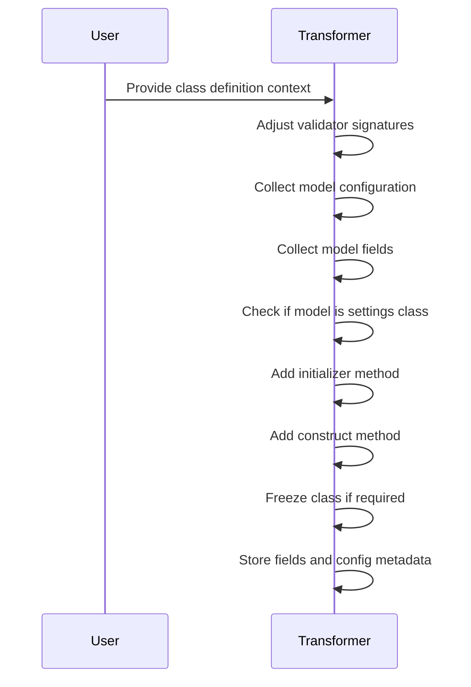
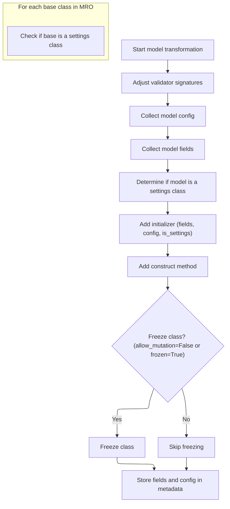

This document describes the process of converting a class definition into a Pydantic model. The main steps are:

- Trigger model transformation
- Adjust validator signatures
- Collect configuration and fields
- Determine if the model is a settings class
- Add initializer and construct methods
- Optionally freeze the class
- Store model metadata



# Spec

## Detailed View of the Program's Functionality

a. Triggering Model Transformation

The process begins when a specific callback function is invoked during the analysis of a class that inherits from Pydantic's base model. This callback is responsible for initiating the transformation of the model class. It does so by creating an instance of a transformer object, providing it with the current class context and the plugin's configuration. Immediately after instantiation, the transformer’s main transformation method is called. This design keeps the callback itself minimal and delegates all the transformation logic to a dedicated, reusable object.

b. Coordinating Model Setup

Once the transformation method is called, it orchestrates several steps to set up the model class according to Pydantic and plugin requirements:

1. **Adjust Validator Signatures**:\
   The transformer first scans the class for any methods decorated as validators. If such methods are found, it marks them as class methods, ensuring that the static analysis tool understands their correct calling convention.

2. **Collect Model Config**:\
   The transformer then gathers configuration settings defined within the model’s inner configuration class. It looks for specific attributes (such as those controlling field population, mutation, and aliasing) and accumulates these settings, also considering any inherited configurations from parent classes.

3. **Collect Model Fields**:\
   Next, the transformer collects all the fields defined in the model. It examines each assignment in the class body, determines if it represents a valid field, and extracts relevant information such as the field’s name, whether it is required, any alias it may have, and whether the alias is dynamically determined. It also checks for untyped fields if the plugin is configured to warn about them. Fields from parent classes are also incorporated, ensuring that the full set of fields (including inherited ones) is available.

4. **Determine if Model is a Settings Class**:\
   The transformer checks the model’s inheritance chain to see if it is a subclass of a special settings base class. This affects how the initializer is generated, particularly regarding the optionality of fields.

5. **Add Initializer**:\
   Using the collected fields and configuration, the transformer generates an <SwmToken path="pydantic/v1/mypy.py" pos="461:10:10" line-data="        Adds a fields-aware `__init__` method to the class.">`__init__`</SwmToken> method for the model. The method’s signature is constructed to match the model’s fields, taking into account typing, aliasing, and whether fields should be optional (especially for settings classes). If the configuration allows extra fields, the initializer will accept arbitrary keyword arguments. The initializer is only added if the class does not already define one.

6. **Add Construct Method**:\
   The transformer adds a class method named <SwmToken path="pydantic/v1/mypy.py" pos="307:21:21" line-data="        * adds a fields-aware signature for the initializer and construct methods">`construct`</SwmToken>, which allows for the creation of model instances without validation. This method is fully typed and uses field names directly, not aliases.

7. **Freeze Class if Required**:\
   If the configuration specifies that the model should be immutable (either by disallowing mutation or explicitly marking it as frozen), the transformer marks all fields as properties. This prevents assignment to those fields, enforcing immutability at the type-checking level.

8. **Store Fields and Config in Metadata**:\
   Finally, the transformer stores the collected fields and configuration in the class’s metadata. This metadata is used by subclasses and other plugins to access the model’s structure and settings during further analysis or transformation.

c. Details of Initializer Generation

When generating the initializer, the transformer decides on the argument types based on the plugin configuration. It determines whether to use type annotations or default to a generic type, whether to use field aliases as argument names, and whether all fields should be treated as optional (which is the case for settings classes or when certain config options are set). If extra fields are allowed, a catch-all keyword argument is added. The initializer is only added if it does not already exist in the class.

d. Finalization

After all modifications are made, the transformer ensures that the class is fully set up for static analysis and further subclassing. The fields and configuration are stored in a way that makes them accessible to subclasses and other plugins, enabling consistent behavior and extensibility.

This flow ensures that Pydantic models are correctly interpreted by the static analysis tool, with accurate method signatures, field definitions, and configuration handling, all while supporting inheritance and plugin customization.

# Rule Definition

| Paragraph Name                                                                                                                                                                                                                                                                                                 | Rule ID | Category          | Description                                                                                                                                                                                                                                                                                                                                                                                                                                                                                                                                                                                                                                                                                                                                                                                                                                                                                                                                                                                             | Conditions                                                                                                                                                                                                                                                                                                                                                                                                                                                                                     | Remarks                                                                                                                                                                                                                                                                                                                                                           |
| -------------------------------------------------------------------------------------------------------------------------------------------------------------------------------------------------------------------------------------------------------------------------------------------------------------- | ------- | ----------------- | ------------------------------------------------------------------------------------------------------------------------------------------------------------------------------------------------------------------------------------------------------------------------------------------------------------------------------------------------------------------------------------------------------------------------------------------------------------------------------------------------------------------------------------------------------------------------------------------------------------------------------------------------------------------------------------------------------------------------------------------------------------------------------------------------------------------------------------------------------------------------------------------------------------------------------------------------------------------------------------------------------- | ---------------------------------------------------------------------------------------------------------------------------------------------------------------------------------------------------------------------------------------------------------------------------------------------------------------------------------------------------------------------------------------------------------------------------------------------------------------------------------------------- | ----------------------------------------------------------------------------------------------------------------------------------------------------------------------------------------------------------------------------------------------------------------------------------------------------------------------------------------------------------------- |
| PydanticPlugin.\_pydantic_model_class_maker_callback, PydanticModelTransformer.transform                                                                                                                                                                                                                       | RL-001  | Conditional Logic | The transformation process for a model class must be initiated by a callback that creates a transformer object using the current class context and plugin configuration, and immediately invokes the transformation process.                                                                                                                                                                                                                                                                                                                                                                                                                                                                                                                                                                                                                                                                                                                                                                            | A model class is being processed by the plugin and matches the criteria for transformation (<SwmToken path="pydantic/v1/mypy.py" pos="576:40:42" line-data="        Warns if a tracked config attribute is set to a value the plugin doesn&#39;t know how to interpret (e.g., an int)">`e.g`</SwmToken>., is a subclass of <SwmToken path="pydantic/v1/mypy.py" pos="303:5:5" line-data="        Configures the BaseModel subclass according to the plugin settings.">`BaseModel`</SwmToken>). | The callback is registered via <SwmToken path="pydantic/v1/mypy.py" pos="114:3:3" line-data="    def get_base_class_hook(self, fullname: str) -&gt; &#39;Optional[Callable[[ClassDefContext], None]]&#39;:">`get_base_class_hook`</SwmToken> and is called for each relevant class.                                                                               |
| PydanticModelTransformer.adjust_validator_signatures                                                                                                                                                                                                                                                           | RL-002  | Computation       | Validator methods defined on the model class must have their signatures adjusted to match expected patterns, specifically marking them as classmethods if decorated with <SwmToken path="pydantic/v1/mypy.py" pos="327:21:23" line-data="        &quot;&quot;&quot;When we decorate a function `f` with `pydantic.validator(...), mypy sees">`pydantic.validator`</SwmToken>.                                                                                                                                                                                                                                                                                                                                                                                                                                                                                                                                                                                                                           | A method is decorated with <SwmToken path="pydantic/v1/mypy.py" pos="327:21:23" line-data="        &quot;&quot;&quot;When we decorate a function `f` with `pydantic.validator(...), mypy sees">`pydantic.validator`</SwmToken>.                                                                                                                                                                                                                                                                | The check is performed by inspecting the outermost decorator of each method.                                                                                                                                                                                                                                                                                      |
| PydanticModelTransformer.collect_config                                                                                                                                                                                                                                                                        | RL-003  | Data Assignment   | Collect the model's configuration settings, including at least the following flags: <SwmToken path="pydantic/v1/mypy.py" pos="583:1:1" line-data="                forbid_extra = substmt.rvalue.value == &#39;forbid&#39;">`forbid_extra`</SwmToken>, <SwmToken path="pydantic/v1/mypy.py" pos="308:11:11" line-data="        * freezes the class if allow_mutation = False or frozen = True">`allow_mutation`</SwmToken>, frozen, <SwmToken path="pydantic/v1/mypy.py" pos="264:9:9" line-data="    Raise an error if orm_mode is not enabled">`orm_mode`</SwmToken>, <SwmToken path="pydantic/v1/mypy.py" pos="467:7:7" line-data="        use_alias = config.allow_population_by_field_name is not True">`allow_population_by_field_name`</SwmToken>, and <SwmToken path="pydantic/v1/mypy.py" pos="469:3:3" line-data="            config.has_alias_generator and not config.allow_population_by_field_name">`has_alias_generator`</SwmToken>. Inherit configuration from parent classes as needed. | The model class or its ancestors define a Config class or have metadata with configuration.                                                                                                                                                                                                                                                                                                                                                                                                    | Configuration is stored as a dictionary with boolean or None values for each flag.                                                                                                                                                                                                                                                                                |
| PydanticModelTransformer.collect_fields                                                                                                                                                                                                                                                                        | RL-004  | Data Assignment   | Collect all fields of the model, ensuring each field has the following properties: name, <SwmToken path="pydantic/v1/mypy.py" pos="419:1:1" line-data="            is_required = self.get_is_required(cls, stmt, lhs)">`is_required`</SwmToken>, alias, <SwmToken path="pydantic/v1/mypy.py" pos="420:4:4" line-data="            alias, has_dynamic_alias = self.get_alias_info(stmt)">`has_dynamic_alias`</SwmToken>, and source location (line, column). Inherit fields from parent classes as needed.                                                                                                                                                                                                                                                                                                                                                                                                                                                                                               | The model class or its ancestors define fields.                                                                                                                                                                                                                                                                                                                                                                                                                                                | Each field is represented as a dictionary with the specified properties.                                                                                                                                                                                                                                                                                          |
| PydanticModelTransformer.transform                                                                                                                                                                                                                                                                             | RL-005  | Conditional Logic | Determine whether the model class is a 'settings' class by checking if any of its base classes is <SwmToken path="pydantic/v1/mypy.py" pos="81:12:12" line-data="BASESETTINGS_FULLNAME = f&#39;{_NAMESPACE}.env_settings.BaseSettings&#39;">`BaseSettings`</SwmToken>.                                                                                                                                                                                                                                                                                                                                                                                                                                                                                                                                                                                                                                                                                                                                  | Any base class of the model is <SwmToken path="pydantic/v1/mypy.py" pos="81:12:12" line-data="BASESETTINGS_FULLNAME = f&#39;{_NAMESPACE}.env_settings.BaseSettings&#39;">`BaseSettings`</SwmToken>.                                                                                                                                                                                                                                                                                            | <SwmToken path="pydantic/v1/mypy.py" pos="81:12:12" line-data="BASESETTINGS_FULLNAME = f&#39;{_NAMESPACE}.env_settings.BaseSettings&#39;">`BaseSettings`</SwmToken> is identified by its fully qualified name.                                                                                                                                                    |
| PydanticModelTransformer.add_initializer                                                                                                                                                                                                                                                                       | RL-006  | Computation       | Generate and add an **init** method to the model class, with arguments corresponding to the model's fields and configuration. Argument typing, aliasing, and optionality are determined by configuration flags. If extra fields are allowed, accept additional keyword arguments. Only add the initializer if not already present.                                                                                                                                                                                                                                                                                                                                                                                                                                                                                                                                                                                                                                                                      | The model class does not already have an **init** method.                                                                                                                                                                                                                                                                                                                                                                                                                                      | Arguments are named after fields (or aliases), typed if configured, and may be optional. If extra fields are allowed, a \*\*kwargs argument is added.                                                                                                                                                                                                             |
| PydanticModelTransformer.add_construct_method                                                                                                                                                                                                                                                                  | RL-007  | Computation       | Add a construct classmethod to the model class, accepting all model fields as named, required, and typed arguments, plus an optional <SwmToken path="pydantic/v1/mypy.py" pos="491:10:10" line-data="        fields_set_argument = Argument(Var(&#39;_fields_set&#39;, optional_set_str), optional_set_str, None, ARG_OPT)">`_fields_set`</SwmToken> argument. The method returns an instance of the model class.                                                                                                                                                                                                                                                                                                                                                                                                                                                                                                                                                                                       | Always applies during transformation.                                                                                                                                                                                                                                                                                                                                                                                                                                                          | Arguments are named after fields, are required and typed. <SwmToken path="pydantic/v1/mypy.py" pos="491:10:10" line-data="        fields_set_argument = Argument(Var(&#39;_fields_set&#39;, optional_set_str), optional_set_str, None, ARG_OPT)">`_fields_set`</SwmToken> is an optional argument of type set\[str\] or None. The return type is the model class. |
| PydanticModelTransformer.set_frozen                                                                                                                                                                                                                                                                            | RL-008  | Conditional Logic | If the configuration flags <SwmToken path="pydantic/v1/mypy.py" pos="308:11:11" line-data="        * freezes the class if allow_mutation = False or frozen = True">`allow_mutation`</SwmToken> is False or frozen is True, make all fields read-only so that assignments to them are not permitted.                                                                                                                                                                                                                                                                                                                                                                                                                                                                                                                                                                                                                                                                                                     | <SwmToken path="pydantic/v1/mypy.py" pos="308:11:11" line-data="        * freezes the class if allow_mutation = False or frozen = True">`allow_mutation`</SwmToken> is False or frozen is True in the configuration.                                                                                                                                                                                                                                                                           | Fields are marked as properties to enforce read-only behavior.                                                                                                                                                                                                                                                                                                    |
| PydanticModelTransformer.transform                                                                                                                                                                                                                                                                             | RL-009  | Data Assignment   | After transformation, store metadata on the class as a dictionary under a constant key. The metadata must contain a mapping of field names to their serialized field data and the serialized configuration data.                                                                                                                                                                                                                                                                                                                                                                                                                                                                                                                                                                                                                                                                                                                                                                                        | Transformation has completed.                                                                                                                                                                                                                                                                                                                                                                                                                                                                  | Metadata is stored as a dictionary with keys 'fields' (mapping field names to field data) and 'config' (serialized configuration).                                                                                                                                                                                                                                |
| PydanticModelTransformer.transform, <SwmToken path="pydantic/v1/mypy.py" pos="315:7:7" line-data="        config = self.collect_config()">`collect_config`</SwmToken>, <SwmToken path="pydantic/v1/mypy.py" pos="316:7:7" line-data="        fields = self.collect_fields(config)">`collect_fields`</SwmToken> | RL-010  | Conditional Logic | Ensure that all modifications (fields, configuration, metadata) are accessible to subclasses and plugins that may need to access the model's structure and configuration.                                                                                                                                                                                                                                                                                                                                                                                                                                                                                                                                                                                                                                                                                                                                                                                                                               | Transformation has completed and <SwmPath>[docs/plugins/](docs/plugins/)</SwmPath> may access the class.                                                                                                                                                                                                                                                                                                                                                                                       | Metadata is stored in a way that is inherited and accessible via class metadata.                                                                                                                                                                                                                                                                                  |

# User Stories

## User Story 1: Model class transformation and configuration enforcement

---

### Story Description:

As a system, I want to transform model classes based on the current class context and plugin configuration, enforcing all relevant configuration (including immutability), so that model classes are correctly structured, behave as configured, and are ready for use.

---

### Business Rule Mapping:

| Rule ID | Paragraph Name                                                                           | Rule Description                                                                                                                                                                                                                                                                                                                                                                                                                                                                                                                                                                                                                                                                                                                                                                                                                                                                                                                                                                                        |
| ------- | ---------------------------------------------------------------------------------------- | ------------------------------------------------------------------------------------------------------------------------------------------------------------------------------------------------------------------------------------------------------------------------------------------------------------------------------------------------------------------------------------------------------------------------------------------------------------------------------------------------------------------------------------------------------------------------------------------------------------------------------------------------------------------------------------------------------------------------------------------------------------------------------------------------------------------------------------------------------------------------------------------------------------------------------------------------------------------------------------------------------- |
| RL-001  | PydanticPlugin.\_pydantic_model_class_maker_callback, PydanticModelTransformer.transform | The transformation process for a model class must be initiated by a callback that creates a transformer object using the current class context and plugin configuration, and immediately invokes the transformation process.                                                                                                                                                                                                                                                                                                                                                                                                                                                                                                                                                                                                                                                                                                                                                                            |
| RL-002  | PydanticModelTransformer.adjust_validator_signatures                                     | Validator methods defined on the model class must have their signatures adjusted to match expected patterns, specifically marking them as classmethods if decorated with <SwmToken path="pydantic/v1/mypy.py" pos="327:21:23" line-data="        &quot;&quot;&quot;When we decorate a function `f` with `pydantic.validator(...), mypy sees">`pydantic.validator`</SwmToken>.                                                                                                                                                                                                                                                                                                                                                                                                                                                                                                                                                                                                                           |
| RL-003  | PydanticModelTransformer.collect_config                                                  | Collect the model's configuration settings, including at least the following flags: <SwmToken path="pydantic/v1/mypy.py" pos="583:1:1" line-data="                forbid_extra = substmt.rvalue.value == &#39;forbid&#39;">`forbid_extra`</SwmToken>, <SwmToken path="pydantic/v1/mypy.py" pos="308:11:11" line-data="        * freezes the class if allow_mutation = False or frozen = True">`allow_mutation`</SwmToken>, frozen, <SwmToken path="pydantic/v1/mypy.py" pos="264:9:9" line-data="    Raise an error if orm_mode is not enabled">`orm_mode`</SwmToken>, <SwmToken path="pydantic/v1/mypy.py" pos="467:7:7" line-data="        use_alias = config.allow_population_by_field_name is not True">`allow_population_by_field_name`</SwmToken>, and <SwmToken path="pydantic/v1/mypy.py" pos="469:3:3" line-data="            config.has_alias_generator and not config.allow_population_by_field_name">`has_alias_generator`</SwmToken>. Inherit configuration from parent classes as needed. |
| RL-004  | PydanticModelTransformer.collect_fields                                                  | Collect all fields of the model, ensuring each field has the following properties: name, <SwmToken path="pydantic/v1/mypy.py" pos="419:1:1" line-data="            is_required = self.get_is_required(cls, stmt, lhs)">`is_required`</SwmToken>, alias, <SwmToken path="pydantic/v1/mypy.py" pos="420:4:4" line-data="            alias, has_dynamic_alias = self.get_alias_info(stmt)">`has_dynamic_alias`</SwmToken>, and source location (line, column). Inherit fields from parent classes as needed.                                                                                                                                                                                                                                                                                                                                                                                                                                                                                               |
| RL-005  | PydanticModelTransformer.transform                                                       | Determine whether the model class is a 'settings' class by checking if any of its base classes is <SwmToken path="pydantic/v1/mypy.py" pos="81:12:12" line-data="BASESETTINGS_FULLNAME = f&#39;{_NAMESPACE}.env_settings.BaseSettings&#39;">`BaseSettings`</SwmToken>.                                                                                                                                                                                                                                                                                                                                                                                                                                                                                                                                                                                                                                                                                                                                  |
| RL-008  | PydanticModelTransformer.set_frozen                                                      | If the configuration flags <SwmToken path="pydantic/v1/mypy.py" pos="308:11:11" line-data="        * freezes the class if allow_mutation = False or frozen = True">`allow_mutation`</SwmToken> is False or frozen is True, make all fields read-only so that assignments to them are not permitted.                                                                                                                                                                                                                                                                                                                                                                                                                                                                                                                                                                                                                                                                                                     |

---

### Relevant Functionality:

- **PydanticPlugin.\_pydantic_model_class_maker_callback**
  1. **RL-001:**
     - When a model class is detected:
       - Create a transformer object with the current class context and plugin configuration.
       - Call the transform() method on the transformer object.
- **PydanticModelTransformer.adjust_validator_signatures**
  1. **RL-002:**
     - For each method in the class:
       - If the outermost decorator is a call to <SwmToken path="pydantic/v1/mypy.py" pos="327:21:23" line-data="        &quot;&quot;&quot;When we decorate a function `f` with `pydantic.validator(...), mypy sees">`pydantic.validator`</SwmToken>:
         - Mark the method as a classmethod.
- **PydanticModelTransformer.collect_config**
  1. **RL-003:**
     - Initialize an empty configuration object.
     - For each Config class in the model or its ancestors:
       - For each assignment in Config:
         - Update the configuration object with the value.
     - For each ancestor with metadata:
       - Merge configuration values if not already set.
- **PydanticModelTransformer.collect_fields**
  1. **RL-004:**
     - For each assignment in the class body:
       - If it is a valid field:
         - Determine <SwmToken path="pydantic/v1/mypy.py" pos="419:1:1" line-data="            is_required = self.get_is_required(cls, stmt, lhs)">`is_required`</SwmToken>, alias, <SwmToken path="pydantic/v1/mypy.py" pos="420:4:4" line-data="            alias, has_dynamic_alias = self.get_alias_info(stmt)">`has_dynamic_alias`</SwmToken>, line, and column.
         - Add to the field list.
     - For each ancestor with metadata:
       - Merge fields, preferring current class fields over ancestor fields.
- **PydanticModelTransformer.transform**
  1. **RL-005:**
     - For each base class in the model's MRO (excluding object):
       - If the base class is <SwmToken path="pydantic/v1/mypy.py" pos="81:12:12" line-data="BASESETTINGS_FULLNAME = f&#39;{_NAMESPACE}.env_settings.BaseSettings&#39;">`BaseSettings`</SwmToken>:
         - Mark the model as a settings class.
- **PydanticModelTransformer.set_frozen**
  1. **RL-008:**
     - For each field in the model:
       - Mark the field as a property if frozen is True.

## User Story 2: Generation of special methods for model classes

---

### Story Description:

As a system, I want to generate and add special methods (**init** and construct) to model classes so that they can be instantiated and constructed according to their fields and configuration.

---

### Business Rule Mapping:

| Rule ID | Paragraph Name                                | Rule Description                                                                                                                                                                                                                                                                                                                                                                                                  |
| ------- | --------------------------------------------- | ----------------------------------------------------------------------------------------------------------------------------------------------------------------------------------------------------------------------------------------------------------------------------------------------------------------------------------------------------------------------------------------------------------------- |
| RL-006  | PydanticModelTransformer.add_initializer      | Generate and add an **init** method to the model class, with arguments corresponding to the model's fields and configuration. Argument typing, aliasing, and optionality are determined by configuration flags. If extra fields are allowed, accept additional keyword arguments. Only add the initializer if not already present.                                                                                |
| RL-007  | PydanticModelTransformer.add_construct_method | Add a construct classmethod to the model class, accepting all model fields as named, required, and typed arguments, plus an optional <SwmToken path="pydantic/v1/mypy.py" pos="491:10:10" line-data="        fields_set_argument = Argument(Var(&#39;_fields_set&#39;, optional_set_str), optional_set_str, None, ARG_OPT)">`_fields_set`</SwmToken> argument. The method returns an instance of the model class. |

---

### Relevant Functionality:

- **PydanticModelTransformer.add_initializer**
  1. **RL-006:**
     - Build argument list from fields, considering typing, aliasing, and optionality.
     - If extra fields are allowed, add \*\*kwargs argument.
     - If **init** is not present:
       - Add the **init** method with the constructed arguments.
- **PydanticModelTransformer.add_construct_method**
  1. **RL-007:**
     - Build argument list from fields (all required, typed).
     - Add optional <SwmToken path="pydantic/v1/mypy.py" pos="491:10:10" line-data="        fields_set_argument = Argument(Var(&#39;_fields_set&#39;, optional_set_str), optional_set_str, None, ARG_OPT)">`_fields_set`</SwmToken> argument.
     - Add the construct classmethod with the constructed arguments and return type.

## User Story 3: Accessible and inheritable model metadata

---

### Story Description:

As a plugin or subclass, I want model metadata and configuration to be stored and accessible so that I can reliably access the model's structure and configuration for further processing or extension.

---

### Business Rule Mapping:

| Rule ID | Paragraph Name                                                                                                                                                                                                                                                                                                 | Rule Description                                                                                                                                                                                                 |
| ------- | -------------------------------------------------------------------------------------------------------------------------------------------------------------------------------------------------------------------------------------------------------------------------------------------------------------- | ---------------------------------------------------------------------------------------------------------------------------------------------------------------------------------------------------------------- |
| RL-009  | PydanticModelTransformer.transform                                                                                                                                                                                                                                                                             | After transformation, store metadata on the class as a dictionary under a constant key. The metadata must contain a mapping of field names to their serialized field data and the serialized configuration data. |
| RL-010  | PydanticModelTransformer.transform, <SwmToken path="pydantic/v1/mypy.py" pos="315:7:7" line-data="        config = self.collect_config()">`collect_config`</SwmToken>, <SwmToken path="pydantic/v1/mypy.py" pos="316:7:7" line-data="        fields = self.collect_fields(config)">`collect_fields`</SwmToken> | Ensure that all modifications (fields, configuration, metadata) are accessible to subclasses and plugins that may need to access the model's structure and configuration.                                        |

---

### Relevant Functionality:

- **PydanticModelTransformer.transform**
  1. **RL-009:**
     - Serialize all fields and configuration.
     - Store them in a dictionary under the constant metadata key on the class.
  2. **RL-010:**
     - Store metadata in the class's metadata dictionary.
     - Ensure that <SwmToken path="pydantic/v1/mypy.py" pos="315:7:7" line-data="        config = self.collect_config()">`collect_config`</SwmToken> and <SwmToken path="pydantic/v1/mypy.py" pos="316:7:7" line-data="        fields = self.collect_fields(config)">`collect_fields`</SwmToken> merge data from ancestors as needed.

# Code Walkthrough

## Triggering Model Transformation

<SwmSnippet path="/pydantic/v1/mypy.py" line="154">

---

<SwmToken path="pydantic/v1/mypy.py" pos="154:3:3" line-data="    def _pydantic_model_class_maker_callback(self, ctx: ClassDefContext) -&gt; None:">`_pydantic_model_class_maker_callback`</SwmToken> kicks off the flow by instantiating a transformer with the current class context and plugin config, then immediately calls <SwmToken path="pydantic/v1/mypy.py" pos="156:3:3" line-data="        transformer.transform()">`transform`</SwmToken> to handle all the model class modifications. This keeps the callback itself simple and hands off the actual work to a dedicated object, so the transformation logic is centralized and reusable.

```python
    def _pydantic_model_class_maker_callback(self, ctx: ClassDefContext) -> None:
        transformer = PydanticModelTransformer(ctx, self.plugin_config)
        transformer.transform()
```

---

</SwmSnippet>

## Coordinating Model Setup



<SwmSnippet path="/pydantic/v1/mypy.py" line="301">

---

In <SwmToken path="pydantic/v1/mypy.py" pos="301:3:3" line-data="    def transform(self) -&gt; None:">`transform`</SwmToken>, the function first aligns validator signatures, grabs the config and fields, and checks if the class is a settings class. It then calls <SwmToken path="pydantic/v1/mypy.py" pos="318:3:3" line-data="        self.add_initializer(fields, config, is_settings)">`add_initializer`</SwmToken> to generate an <SwmToken path="pydantic/v1/mypy.py" pos="461:10:10" line-data="        Adds a fields-aware `__init__` method to the class.">`__init__`</SwmToken> method that matches the model's fields and config, which is needed before adding other methods or storing metadata.

```python
    def transform(self) -> None:
        """
        Configures the BaseModel subclass according to the plugin settings.

        In particular:
        * determines the model config and fields,
        * adds a fields-aware signature for the initializer and construct methods
        * freezes the class if allow_mutation = False or frozen = True
        * stores the fields, config, and if the class is settings in the mypy metadata for access by subclasses
        """
        ctx = self._ctx
        info = ctx.cls.info

        self.adjust_validator_signatures()
        config = self.collect_config()
        fields = self.collect_fields(config)
        is_settings = any(get_fullname(base) == BASESETTINGS_FULLNAME for base in info.mro[:-1])
        self.add_initializer(fields, config, is_settings)
```

---

</SwmSnippet>

<SwmSnippet path="/pydantic/v1/mypy.py" line="459">

---

<SwmToken path="pydantic/v1/mypy.py" pos="459:3:3" line-data="    def add_initializer(self, fields: List[&#39;PydanticModelField&#39;], config: &#39;ModelConfigData&#39;, is_settings: bool) -&gt; None:">`add_initializer`</SwmToken> builds the <SwmToken path="pydantic/v1/mypy.py" pos="461:10:10" line-data="        Adds a fields-aware `__init__` method to the class.">`__init__`</SwmToken> method for the model class, using config flags to decide argument typing, aliasing, and optionality. It adds \*\*kwargs if extra fields are allowed, and only adds the method if it's not already present.

```python
    def add_initializer(self, fields: List['PydanticModelField'], config: 'ModelConfigData', is_settings: bool) -> None:
        """
        Adds a fields-aware `__init__` method to the class.

        The added `__init__` will be annotated with types vs. all `Any` depending on the plugin settings.
        """
        ctx = self._ctx
        typed = self.plugin_config.init_typed
        use_alias = config.allow_population_by_field_name is not True
        force_all_optional = is_settings or bool(
            config.has_alias_generator and not config.allow_population_by_field_name
        )
        init_arguments = self.get_field_arguments(
            fields, typed=typed, force_all_optional=force_all_optional, use_alias=use_alias
        )
        if not self.should_init_forbid_extra(fields, config):
            var = Var('kwargs')
            init_arguments.append(Argument(var, AnyType(TypeOfAny.explicit), None, ARG_STAR2))

        if '__init__' not in ctx.cls.info.names:
            add_method(ctx, '__init__', init_arguments, NoneType())
```

---

</SwmSnippet>

<SwmSnippet path="/pydantic/v1/mypy.py" line="319">

---

Back in <SwmToken path="pydantic/v1/mypy.py" pos="156:3:3" line-data="        transformer.transform()">`transform`</SwmToken>, after adding the initializer, the function adds a construct method, sets the class as frozen if needed, and stores the model's fields and config in metadata. This wraps up the setup so subclasses and plugins can access the model details later.

```python
        self.add_construct_method(fields)
        self.set_frozen(fields, frozen=config.allow_mutation is False or config.frozen is True)
        info.metadata[METADATA_KEY] = {
            'fields': {field.name: field.serialize() for field in fields},
            'config': config.set_values_dict(),
        }
```

---

</SwmSnippet>

&nbsp;

*This is an auto-generated document by Swimm 🌊 and has not yet been verified by a human*

<SwmMeta version="3.0.0" repo-id="Z2l0aHViJTNBJTNBcHlkYW50aWMlM0ElM0FTd2ltbS1EZW1v" repo-name="pydantic"><sup>Powered by [Swimm](/)</sup></SwmMeta>
