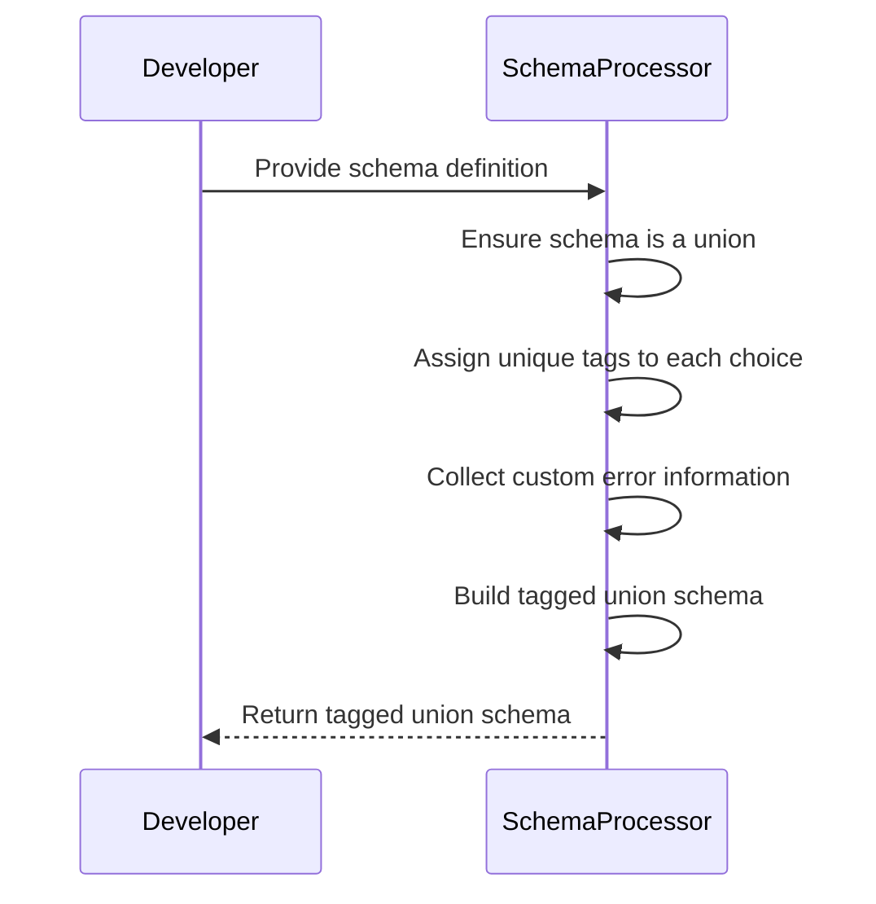
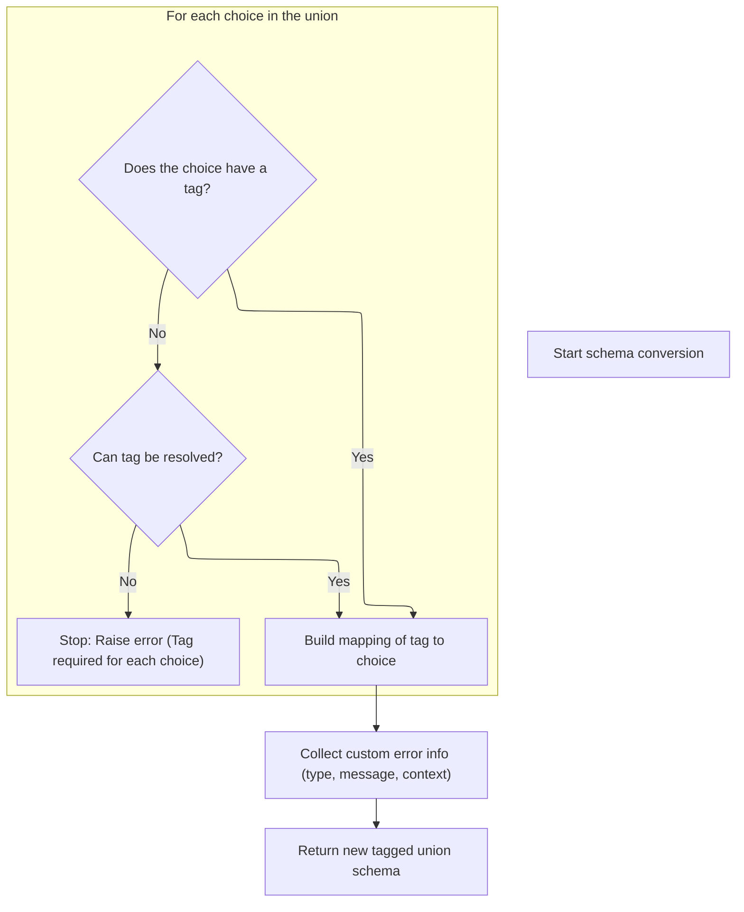

This flow transforms schema definitions into a standardized tagged union format, ensuring each union choice is uniquely tagged for consistent validation and schema generation. The process includes wrapping single types as unions if needed, assigning tags to each choice, collecting custom error information, and constructing the final tagged union schema with all relevant metadata.



# Spec

## Detailed View of the Program's Functionality

a. Normalizing and Preparing the Input Schema

The process begins by ensuring that the input schema is always treated as a union schema, regardless of whether the original input was a single schema or already a union. If the input is not a union, it is wrapped into a <SwmToken path="pydantic/types.py" pos="3079:19:21" line-data="            # This likely indicates that the schema was a single-item union that was simplified.">`single-item`</SwmToken> union schema. This normalization step guarantees that downstream logic can always assume it is working with a union structure, simplifying the handling of schemas and avoiding special cases later in the code.

b. Combining Multiple Schema Choices

Once the input is normalized to a union schema, the next step is to process each possible schema choice within the union. For each choice:

- The code checks if it can generate a JSON schema for that choice.
- If it can, the generated schema is added to a list of valid schemas.
- If it cannot (for example, if the schema is not suitable for JSON schema generation), the choice is skipped or a warning is emitted.
- This process continues for all choices in the union.

After processing all choices:

- If only one valid schema was generated, that schema is returned directly.
- If more than one valid schema was generated, a combined schema using the <SwmToken path="pydantic/types.py" pos="1164:6:6" line-data="        field_schema.pop(&#39;anyOf&#39;, None)  # remove the bytes/str union">`anyOf`</SwmToken> keyword is returned, representing a union of all valid choices.

c. Extracting and Tagging Union Choices

After generating the union schema, the code iterates through each choice in the union to ensure that every choice has an associated tag. The tag can be provided directly (for example, as part of a tuple), or it can be extracted from metadata attached to the schema. If a tag is missing and the choice is a reference, the code attempts to resolve the reference and extract the tag from the resolved schema. If a tag still cannot be found, an error is raised, as every choice in a callable-discriminated union must have a tag.

During this process, a mapping is built from each tag to its corresponding schema choice. Additionally, any custom error information (such as error type, message, or context) is collected from either the current context or the original schema.

Finally, a new tagged union schema is constructed using all the tagged choices, the discriminator (which determines how to select the correct schema at runtime), any custom error information, and any relevant metadata or serialization information.

d. Generating the Final Tagged Union JSON Schema

To produce the final JSON schema for the tagged union:

- The code iterates over each tagged choice, ensuring that the tag (which may be an Enum) is converted to a string, as JSON keys must be strings.
- For each tagged choice, a JSON schema is generated. If a choice cannot be represented as a JSON schema, it is skipped or a warning is emitted.
- All generated schemas are collected into a dictionary keyed by their stringified tags.

After all schemas are generated:

- The schemas are deduplicated to avoid redundant entries.
- A final JSON schema is constructed using the <SwmToken path="pydantic/json_schema.py" pos="1291:10:10" line-data="        json_schema: JsonSchemaValue = {&#39;oneOf&#39;: one_of_choices}">`oneOf`</SwmToken> keyword, listing all unique schemas as possible options.
- If a discriminator field is present (which is used by <SwmToken path="pydantic/json_schema.py" pos="1293:31:31" line-data="        # This reflects the v1 behavior; TODO: we should make it possible to exclude OpenAPI stuff from the JSON schema">`OpenAPI`</SwmToken> and similar tools to determine which schema to use based on a property value), a discriminator mapping is added to the schema, mapping each tag to its corresponding schema (or reference).
- The completed JSON schema is then returned, ready for use in validation, documentation, or other purposes.

# Rule Definition

| Paragraph Name                                                                                                                                                                                                                                                                                                                                                                                                                                                                                                                                                                                                                                                                                                                                                                                                                                                                                                                                                                                                                                                                                                                                                                                                                                                                            | Rule ID | Category          | Description                                                                                                                                                                                                                                                                                                                                                                                                                                                                                                                                                                                                                                                | Conditions                                                                                                                                                                                                                       | Remarks                                                                                                                                                                                                                                                                                                                                                                                                                                                                                                                          |
| ----------------------------------------------------------------------------------------------------------------------------------------------------------------------------------------------------------------------------------------------------------------------------------------------------------------------------------------------------------------------------------------------------------------------------------------------------------------------------------------------------------------------------------------------------------------------------------------------------------------------------------------------------------------------------------------------------------------------------------------------------------------------------------------------------------------------------------------------------------------------------------------------------------------------------------------------------------------------------------------------------------------------------------------------------------------------------------------------------------------------------------------------------------------------------------------------------------------------------------------------------------------------------------------- | ------- | ----------------- | ---------------------------------------------------------------------------------------------------------------------------------------------------------------------------------------------------------------------------------------------------------------------------------------------------------------------------------------------------------------------------------------------------------------------------------------------------------------------------------------------------------------------------------------------------------------------------------------------------------------------------------------------------------- | -------------------------------------------------------------------------------------------------------------------------------------------------------------------------------------------------------------------------------- | -------------------------------------------------------------------------------------------------------------------------------------------------------------------------------------------------------------------------------------------------------------------------------------------------------------------------------------------------------------------------------------------------------------------------------------------------------------------------------------------------------------------------------- |
| The system must accept an input schema, which is a dictionary with at least a 'type' key. If the schema is not already a union (<SwmToken path="pydantic/json_schema.py" pos="165:14:16" line-data="            # if it introduces no ambiguity, i.e., there is only one distinct schema for that DefsRef.">`i.e`</SwmToken>., 'type' is not 'union'), it must be wrapped into a union schema with a single choice containing the original schema.                                                                                                                                                                                                                                                                                                                                                                                                                                                                                                                                                                                                                                                                                                                                                                                                                                        | RL-001  | Conditional Logic | When an input schema is provided, if its 'type' is not 'union', the system wraps it into a union schema with a single choice (the original schema).                                                                                                                                                                                                                                                                                                                                                                                                                                                                                                        | Input schema is a dictionary with at least a 'type' key, and 'type' is not 'union'.                                                                                                                                              | The resulting schema will have 'type': 'union' and 'choices': \[<SwmToken path="pydantic/types.py" pos="3076:4:4" line-data="        self, original_schema: core_schema.CoreSchema, handler: GetCoreSchemaHandler \| None = None">`original_schema`</SwmToken>\].                                                                                                                                                                                                                                                                |
| The system must process union schemas, which are dictionaries with 'type': 'union' and a 'choices' key. The 'choices' value is a list where each element is either: a schema dictionary (with at least a 'type' key), or a tuple of (schema dictionary, tag), where tag is a string or value convertible to a string.                                                                                                                                                                                                                                                                                                                                                                                                                                                                                                                                                                                                                                                                                                                                                                                                                                                                                                                                                                     | RL-002  | Conditional Logic | For each choice in a union schema, determine if it is a tuple (schema, tag) or just a schema dictionary. Extract the tag accordingly.                                                                                                                                                                                                                                                                                                                                                                                                                                                                                                                      | Schema is a union schema with 'choices' as a list.                                                                                                                                                                               | Tags must be strings or convertible to strings. If a schema dict, tag is extracted from 'metadata' under <SwmToken path="pydantic/types.py" pos="3092:10:10" line-data="                tag = metadata.get(&#39;pydantic_internal_union_tag_key&#39;) or tag">`pydantic_internal_union_tag_key`</SwmToken>.                                                                                                                                                                                                                      |
| If the schema dictionary has 'type': <SwmToken path="pydantic/types.py" pos="3095:23:25" line-data="                if handler is not None and choice[&#39;type&#39;] == &#39;definition-ref&#39;:">`definition-ref`</SwmToken>, a handler may be used to resolve the reference and extract the tag from the resolved schema's metadata.                                                                                                                                                                                                                                                                                                                                                                                                                                                                                                                                                                                                                                                                                                                                                                                                                                                                                                                                                  | RL-003  | Conditional Logic | If a choice is a schema dict with 'type': <SwmToken path="pydantic/types.py" pos="3095:23:25" line-data="                if handler is not None and choice[&#39;type&#39;] == &#39;definition-ref&#39;:">`definition-ref`</SwmToken>, resolve the reference and extract the tag from the resolved schema's metadata.                                                                                                                                                                                                                                                                                                                                       | Choice is a schema dict with 'type': <SwmToken path="pydantic/types.py" pos="3095:23:25" line-data="                if handler is not None and choice[&#39;type&#39;] == &#39;definition-ref&#39;:">`definition-ref`</SwmToken>. | Handler is used to resolve the reference. Tag is extracted from resolved_schema\['metadata'\]\[<SwmToken path="pydantic/types.py" pos="3092:10:10" line-data="                tag = metadata.get(&#39;pydantic_internal_union_tag_key&#39;) or tag">`pydantic_internal_union_tag_key`</SwmToken>\].                                                                                                                                                                                                                              |
| If a tag cannot be found or resolved for a choice, the system must raise an error indicating that a tag is required for each choice.                                                                                                                                                                                                                                                                                                                                                                                                                                                                                                                                                                                                                                                                                                                                                                                                                                                                                                                                                                                                                                                                                                                                                      | RL-004  | Conditional Logic | If after all extraction attempts a tag cannot be found for a choice, raise an error indicating a tag is required.                                                                                                                                                                                                                                                                                                                                                                                                                                                                                                                                          | No tag can be found or resolved for a choice.                                                                                                                                                                                    | Error message must indicate that a tag is required for each choice.                                                                                                                                                                                                                                                                                                                                                                                                                                                              |
| The system must build a mapping from tags (converted to strings if necessary) to their corresponding schema dictionaries.                                                                                                                                                                                                                                                                                                                                                                                                                                                                                                                                                                                                                                                                                                                                                                                                                                                                                                                                                                                                                                                                                                                                                                 | RL-005  | Data Assignment   | Create a mapping where each tag (as a string) is mapped to its corresponding schema dictionary.                                                                                                                                                                                                                                                                                                                                                                                                                                                                                                                                                            | For each choice, a tag has been successfully extracted.                                                                                                                                                                          | All tags must be converted to strings. Mapping is {str(tag): schema_dict}.                                                                                                                                                                                                                                                                                                                                                                                                                                                       |
| The system must collect custom error information for the tagged union, using the following fields if present: <SwmToken path="pydantic/types.py" pos="3114:1:1" line-data="        custom_error_type = self.custom_error_type">`custom_error_type`</SwmToken>, <SwmToken path="pydantic/types.py" pos="3118:1:1" line-data="        custom_error_message = self.custom_error_message">`custom_error_message`</SwmToken>, <SwmToken path="pydantic/types.py" pos="3122:1:1" line-data="        custom_error_context = self.custom_error_context">`custom_error_context`</SwmToken>. These fields may be set on a Discriminator object or inherited from the original schema.                                                                                                                                                                                                                                                                                                                                                                                                                                                                                                                                                                                                               | RL-006  | Data Assignment   | Collect custom error fields from the Discriminator object or original schema for internal use during validation.                                                                                                                                                                                                                                                                                                                                                                                                                                                                                                                                           | Tagged union is being processed; custom error fields are present.                                                                                                                                                                | Fields: <SwmToken path="pydantic/types.py" pos="3114:1:1" line-data="        custom_error_type = self.custom_error_type">`custom_error_type`</SwmToken>, <SwmToken path="pydantic/types.py" pos="3118:1:1" line-data="        custom_error_message = self.custom_error_message">`custom_error_message`</SwmToken>, <SwmToken path="pydantic/types.py" pos="3122:1:1" line-data="        custom_error_context = self.custom_error_context">`custom_error_context`</SwmToken>. Used internally, not included in final JSON schema. |
| When generating a JSON schema for a union: For each choice, attempt to generate a JSON schema. If a <SwmToken path="pydantic/json_schema.py" pos="1258:3:3" line-data="            except PydanticOmit:">`PydanticOmit`</SwmToken> exception is encountered during schema generation, the choice must be skipped and not included in the output. If a <SwmToken path="pydantic/json_schema.py" pos="1260:3:3" line-data="            except PydanticInvalidForJsonSchema as exc:">`PydanticInvalidForJsonSchema`</SwmToken> exception is encountered, a warning must be emitted with kind <SwmToken path="pydantic/json_schema.py" pos="1261:6:8" line-data="                self.emit_warning(&#39;skipped-choice&#39;, exc.message)">`skipped-choice`</SwmToken> and the exception message, but processing must continue. All successfully generated schemas must be collected. If only one valid schema is generated from the union, the system must return that schema directly. If more than one valid schema is generated, the system must return a dictionary with <SwmToken path="pydantic/types.py" pos="1164:6:6" line-data="        field_schema.pop(&#39;anyOf&#39;, None)  # remove the bytes/str union">`anyOf`</SwmToken> as the key and the list of schemas as the value. | RL-007  | Conditional Logic | During JSON schema generation for a union, skip choices that raise <SwmToken path="pydantic/json_schema.py" pos="1258:3:3" line-data="            except PydanticOmit:">`PydanticOmit`</SwmToken>, emit warnings for <SwmToken path="pydantic/json_schema.py" pos="1260:3:3" line-data="            except PydanticInvalidForJsonSchema as exc:">`PydanticInvalidForJsonSchema`</SwmToken>, and collect valid schemas. Output is a single schema if only one is valid, otherwise an <SwmToken path="pydantic/types.py" pos="1164:6:6" line-data="        field_schema.pop(&#39;anyOf&#39;, None)  # remove the bytes/str union">`anyOf`</SwmToken> schema. | Generating JSON schema for a union.                                                                                                                                                                                              | Output: single schema or {<SwmToken path="pydantic/types.py" pos="1164:6:6" line-data="        field_schema.pop(&#39;anyOf&#39;, None)  # remove the bytes/str union">`anyOf`</SwmToken>: \[schemas\]}. Warnings for skipped choices.                                                                                                                                                                                                                                                                                            |
| When generating a JSON schema for a tagged union: For each tagged choice, generate a JSON schema, converting Enum tags to strings if necessary. Deduplicate the generated schemas. Aggregate all schemas into a list under the <SwmToken path="pydantic/json_schema.py" pos="1291:10:10" line-data="        json_schema: JsonSchemaValue = {&#39;oneOf&#39;: one_of_choices}">`oneOf`</SwmToken> key. If a discriminator field is present, add a 'discriminator' key to the output schema. The value must be a dictionary with: <SwmToken path="pydantic/json_schema.py" pos="1297:2:2" line-data="                &#39;propertyName&#39;: openapi_discriminator,">`propertyName`</SwmToken>: the discriminator field name, 'mapping': a dictionary mapping each tag to its corresponding schema reference or schema. The final output schema must be a dictionary containing at least the <SwmToken path="pydantic/json_schema.py" pos="1291:10:10" line-data="        json_schema: JsonSchemaValue = {&#39;oneOf&#39;: one_of_choices}">`oneOf`</SwmToken> key, and the 'discriminator' key if applicable.                                                                                                                                                                              | RL-008  | Computation       | For tagged unions, generate and deduplicate schemas for each tag, aggregate under <SwmToken path="pydantic/json_schema.py" pos="1291:10:10" line-data="        json_schema: JsonSchemaValue = {&#39;oneOf&#39;: one_of_choices}">`oneOf`</SwmToken>, and add a 'discriminator' field if present.                                                                                                                                                                                                                                                                                                                                                           | Generating JSON schema for a tagged union.                                                                                                                                                                                       | Output: {<SwmToken path="pydantic/json_schema.py" pos="1291:10:10" line-data="        json_schema: JsonSchemaValue = {&#39;oneOf&#39;: one_of_choices}">`oneOf`</SwmToken>: \[schemas\], 'discriminator': {<SwmToken path="pydantic/json_schema.py" pos="1297:2:2" line-data="                &#39;propertyName&#39;: openapi_discriminator,">`propertyName`</SwmToken>: ..., 'mapping': ...}}. All tags as strings.                                                                                                             |
| The system must ensure that all tags used as keys in the output schema are strings.                                                                                                                                                                                                                                                                                                                                                                                                                                                                                                                                                                                                                                                                                                                                                                                                                                                                                                                                                                                                                                                                                                                                                                                                       | RL-009  | Computation       | Before outputting the final schema, ensure all tags used as keys (<SwmToken path="pydantic/types.py" pos="917:27:29" line-data="        Attributes of modules may be separated from the module by `:` or `.`, e.g. if `&#39;math:cos&#39;` is provided,">`e.g`</SwmToken>., in 'mapping') are strings.                                                                                                                                                                                                                                                                                                                                                     | Output schema contains tags as keys.                                                                                                                                                                                             | Convert all tag keys to strings.                                                                                                                                                                                                                                                                                                                                                                                                                                                                                                 |
| The system must not include custom error fields in the final JSON schema output; these are used only internally for validation.                                                                                                                                                                                                                                                                                                                                                                                                                                                                                                                                                                                                                                                                                                                                                                                                                                                                                                                                                                                                                                                                                                                                                           | RL-010  | Conditional Logic | Custom error fields collected for tagged unions must not be included in the final JSON schema output.                                                                                                                                                                                                                                                                                                                                                                                                                                                                                                                                                      | Generating final JSON schema output.                                                                                                                                                                                             | Fields to omit: <SwmToken path="pydantic/types.py" pos="3114:1:1" line-data="        custom_error_type = self.custom_error_type">`custom_error_type`</SwmToken>, <SwmToken path="pydantic/types.py" pos="3118:1:1" line-data="        custom_error_message = self.custom_error_message">`custom_error_message`</SwmToken>, <SwmToken path="pydantic/types.py" pos="3122:1:1" line-data="        custom_error_context = self.custom_error_context">`custom_error_context`</SwmToken>.                                             |

# User Stories

## User Story 1: Schema normalization and tag extraction

---

### Story Description:

As a system user, I want the system to accept input schemas and correctly normalize them into union schemas with properly extracted tags so that all choices are consistently processed and mapped for further validation and schema generation.

---

### Business Rule Mapping:

| Rule ID | Paragraph Name                                                                                                                                                                                                                                                                                                                                                                                                                                     | Rule Description                                                                                                                                                                                                                                                                                                     |
| ------- | -------------------------------------------------------------------------------------------------------------------------------------------------------------------------------------------------------------------------------------------------------------------------------------------------------------------------------------------------------------------------------------------------------------------------------------------------- | -------------------------------------------------------------------------------------------------------------------------------------------------------------------------------------------------------------------------------------------------------------------------------------------------------------------- |
| RL-001  | The system must accept an input schema, which is a dictionary with at least a 'type' key. If the schema is not already a union (<SwmToken path="pydantic/json_schema.py" pos="165:14:16" line-data="            # if it introduces no ambiguity, i.e., there is only one distinct schema for that DefsRef.">`i.e`</SwmToken>., 'type' is not 'union'), it must be wrapped into a union schema with a single choice containing the original schema. | When an input schema is provided, if its 'type' is not 'union', the system wraps it into a union schema with a single choice (the original schema).                                                                                                                                                                  |
| RL-002  | The system must process union schemas, which are dictionaries with 'type': 'union' and a 'choices' key. The 'choices' value is a list where each element is either: a schema dictionary (with at least a 'type' key), or a tuple of (schema dictionary, tag), where tag is a string or value convertible to a string.                                                                                                                              | For each choice in a union schema, determine if it is a tuple (schema, tag) or just a schema dictionary. Extract the tag accordingly.                                                                                                                                                                                |
| RL-003  | If the schema dictionary has 'type': <SwmToken path="pydantic/types.py" pos="3095:23:25" line-data="                if handler is not None and choice[&#39;type&#39;] == &#39;definition-ref&#39;:">`definition-ref`</SwmToken>, a handler may be used to resolve the reference and extract the tag from the resolved schema's metadata.                                                                                                           | If a choice is a schema dict with 'type': <SwmToken path="pydantic/types.py" pos="3095:23:25" line-data="                if handler is not None and choice[&#39;type&#39;] == &#39;definition-ref&#39;:">`definition-ref`</SwmToken>, resolve the reference and extract the tag from the resolved schema's metadata. |
| RL-004  | If a tag cannot be found or resolved for a choice, the system must raise an error indicating that a tag is required for each choice.                                                                                                                                                                                                                                                                                                               | If after all extraction attempts a tag cannot be found for a choice, raise an error indicating a tag is required.                                                                                                                                                                                                    |
| RL-005  | The system must build a mapping from tags (converted to strings if necessary) to their corresponding schema dictionaries.                                                                                                                                                                                                                                                                                                                          | Create a mapping where each tag (as a string) is mapped to its corresponding schema dictionary.                                                                                                                                                                                                                      |

---

### Relevant Functionality:

- **The system must accept an input schema**
  1. **RL-001:**
     - If <SwmToken path="pydantic/json_schema.py" pos="1107:16:16" line-data="        if self.mode == &#39;validation&#39; and (input_schema := schema.get(&#39;json_schema_input_schema&#39;)):">`input_schema`</SwmToken>\['type'\] != 'union':
       - Wrap <SwmToken path="pydantic/json_schema.py" pos="1107:16:16" line-data="        if self.mode == &#39;validation&#39; and (input_schema := schema.get(&#39;json_schema_input_schema&#39;)):">`input_schema`</SwmToken> as {'type': 'union', 'choices': \[<SwmToken path="pydantic/json_schema.py" pos="1107:16:16" line-data="        if self.mode == &#39;validation&#39; and (input_schema := schema.get(&#39;json_schema_input_schema&#39;)):">`input_schema`</SwmToken>\]}
- **The system must process union schemas**
  1. **RL-002:**
     - For each choice in <SwmToken path="pydantic/types.py" pos="3083:7:7" line-data="            original_schema = core_schema.union_schema([original_schema])">`union_schema`</SwmToken>\['choices'\]:
       - If choice is a tuple: use choice\[1\] as tag
       - Else: extract tag from choice\['metadata'\]\[<SwmToken path="pydantic/types.py" pos="3092:10:10" line-data="                tag = metadata.get(&#39;pydantic_internal_union_tag_key&#39;) or tag">`pydantic_internal_union_tag_key`</SwmToken>\]
- **If the schema dictionary has 'type':** <SwmToken path="pydantic/types.py" pos="3095:23:25" line-data="                if handler is not None and choice[&#39;type&#39;] == &#39;definition-ref&#39;:">`definition-ref`</SwmToken>
  1. **RL-003:**
     - If choice\['type'\] == <SwmToken path="pydantic/types.py" pos="3095:23:25" line-data="                if handler is not None and choice[&#39;type&#39;] == &#39;definition-ref&#39;:">`definition-ref`</SwmToken>:
       - resolved_schema = <SwmToken path="pydantic/types.py" pos="3098:5:7" line-data="                        choice = handler.resolve_ref_schema(choice)">`handler.resolve_ref_schema`</SwmToken>(choice)
       - tag = resolved_schema\['metadata'\]\[<SwmToken path="pydantic/types.py" pos="3092:10:10" line-data="                tag = metadata.get(&#39;pydantic_internal_union_tag_key&#39;) or tag">`pydantic_internal_union_tag_key`</SwmToken>\]
- **If a tag cannot be found or resolved for a choice**
  1. **RL-004:**
     - If tag is None after extraction attempts:
       - Raise error: 'A tag is required for each choice.'
- **The system must build a mapping from tags (converted to strings if necessary) to their corresponding schema dictionaries.**
  1. **RL-005:**
     - For each (tag, schema_dict):
       - mapping\[str(tag)\] = schema_dict

## User Story 2: Internal handling of custom error information

---

### Story Description:

As a system user, I want the system to collect and use custom error information for tagged unions internally during validation, but ensure that these fields are not included in the final JSON schema output so that error handling is robust without leaking internal details.

---

### Business Rule Mapping:

| Rule ID | Paragraph Name                                                                                                                                                                                                                                                                                                                                                                                                                                                                                                                                                                                                                                                              | Rule Description                                                                                                 |
| ------- | --------------------------------------------------------------------------------------------------------------------------------------------------------------------------------------------------------------------------------------------------------------------------------------------------------------------------------------------------------------------------------------------------------------------------------------------------------------------------------------------------------------------------------------------------------------------------------------------------------------------------------------------------------------------------- | ---------------------------------------------------------------------------------------------------------------- |
| RL-006  | The system must collect custom error information for the tagged union, using the following fields if present: <SwmToken path="pydantic/types.py" pos="3114:1:1" line-data="        custom_error_type = self.custom_error_type">`custom_error_type`</SwmToken>, <SwmToken path="pydantic/types.py" pos="3118:1:1" line-data="        custom_error_message = self.custom_error_message">`custom_error_message`</SwmToken>, <SwmToken path="pydantic/types.py" pos="3122:1:1" line-data="        custom_error_context = self.custom_error_context">`custom_error_context`</SwmToken>. These fields may be set on a Discriminator object or inherited from the original schema. | Collect custom error fields from the Discriminator object or original schema for internal use during validation. |
| RL-010  | The system must not include custom error fields in the final JSON schema output; these are used only internally for validation.                                                                                                                                                                                                                                                                                                                                                                                                                                                                                                                                             | Custom error fields collected for tagged unions must not be included in the final JSON schema output.            |

---

### Relevant Functionality:

- **The system must collect custom error information for the tagged union**
  1. **RL-006:**
     - If Discriminator has custom error fields, use them
     - Else, inherit from original schema if present
- **The system must not include custom error fields in the final JSON schema output; these are used only internally for validation.**
  1. **RL-010:**
     - Before returning final JSON schema:
       - Remove any custom error fields from output

## User Story 3: JSON schema generation for unions and tagged unions

---

### Story Description:

As a system user, I want the system to generate JSON schemas for unions and tagged unions, handling exceptions, deduplicating schemas, aggregating them under the correct keys, and ensuring all tags are strings, so that the output schema is valid, clear, and standards-compliant.

---

### Business Rule Mapping:

| Rule ID | Paragraph Name                                                                                                                                                                                                                                                                                                                                                                                                                                                                                                                                                                                                                                                                                                                                                                                                                                                                                                                                                                                                                                                                                                                                                                                                                                                                            | Rule Description                                                                                                                                                                                                                                                                                                                                                                                                                                                                                                                                                                                                                                           |
| ------- | ----------------------------------------------------------------------------------------------------------------------------------------------------------------------------------------------------------------------------------------------------------------------------------------------------------------------------------------------------------------------------------------------------------------------------------------------------------------------------------------------------------------------------------------------------------------------------------------------------------------------------------------------------------------------------------------------------------------------------------------------------------------------------------------------------------------------------------------------------------------------------------------------------------------------------------------------------------------------------------------------------------------------------------------------------------------------------------------------------------------------------------------------------------------------------------------------------------------------------------------------------------------------------------------- | ---------------------------------------------------------------------------------------------------------------------------------------------------------------------------------------------------------------------------------------------------------------------------------------------------------------------------------------------------------------------------------------------------------------------------------------------------------------------------------------------------------------------------------------------------------------------------------------------------------------------------------------------------------- |
| RL-007  | When generating a JSON schema for a union: For each choice, attempt to generate a JSON schema. If a <SwmToken path="pydantic/json_schema.py" pos="1258:3:3" line-data="            except PydanticOmit:">`PydanticOmit`</SwmToken> exception is encountered during schema generation, the choice must be skipped and not included in the output. If a <SwmToken path="pydantic/json_schema.py" pos="1260:3:3" line-data="            except PydanticInvalidForJsonSchema as exc:">`PydanticInvalidForJsonSchema`</SwmToken> exception is encountered, a warning must be emitted with kind <SwmToken path="pydantic/json_schema.py" pos="1261:6:8" line-data="                self.emit_warning(&#39;skipped-choice&#39;, exc.message)">`skipped-choice`</SwmToken> and the exception message, but processing must continue. All successfully generated schemas must be collected. If only one valid schema is generated from the union, the system must return that schema directly. If more than one valid schema is generated, the system must return a dictionary with <SwmToken path="pydantic/types.py" pos="1164:6:6" line-data="        field_schema.pop(&#39;anyOf&#39;, None)  # remove the bytes/str union">`anyOf`</SwmToken> as the key and the list of schemas as the value. | During JSON schema generation for a union, skip choices that raise <SwmToken path="pydantic/json_schema.py" pos="1258:3:3" line-data="            except PydanticOmit:">`PydanticOmit`</SwmToken>, emit warnings for <SwmToken path="pydantic/json_schema.py" pos="1260:3:3" line-data="            except PydanticInvalidForJsonSchema as exc:">`PydanticInvalidForJsonSchema`</SwmToken>, and collect valid schemas. Output is a single schema if only one is valid, otherwise an <SwmToken path="pydantic/types.py" pos="1164:6:6" line-data="        field_schema.pop(&#39;anyOf&#39;, None)  # remove the bytes/str union">`anyOf`</SwmToken> schema. |
| RL-008  | When generating a JSON schema for a tagged union: For each tagged choice, generate a JSON schema, converting Enum tags to strings if necessary. Deduplicate the generated schemas. Aggregate all schemas into a list under the <SwmToken path="pydantic/json_schema.py" pos="1291:10:10" line-data="        json_schema: JsonSchemaValue = {&#39;oneOf&#39;: one_of_choices}">`oneOf`</SwmToken> key. If a discriminator field is present, add a 'discriminator' key to the output schema. The value must be a dictionary with: <SwmToken path="pydantic/json_schema.py" pos="1297:2:2" line-data="                &#39;propertyName&#39;: openapi_discriminator,">`propertyName`</SwmToken>: the discriminator field name, 'mapping': a dictionary mapping each tag to its corresponding schema reference or schema. The final output schema must be a dictionary containing at least the <SwmToken path="pydantic/json_schema.py" pos="1291:10:10" line-data="        json_schema: JsonSchemaValue = {&#39;oneOf&#39;: one_of_choices}">`oneOf`</SwmToken> key, and the 'discriminator' key if applicable.                                                                                                                                                                              | For tagged unions, generate and deduplicate schemas for each tag, aggregate under <SwmToken path="pydantic/json_schema.py" pos="1291:10:10" line-data="        json_schema: JsonSchemaValue = {&#39;oneOf&#39;: one_of_choices}">`oneOf`</SwmToken>, and add a 'discriminator' field if present.                                                                                                                                                                                                                                                                                                                                                           |
| RL-009  | The system must ensure that all tags used as keys in the output schema are strings.                                                                                                                                                                                                                                                                                                                                                                                                                                                                                                                                                                                                                                                                                                                                                                                                                                                                                                                                                                                                                                                                                                                                                                                                       | Before outputting the final schema, ensure all tags used as keys (<SwmToken path="pydantic/types.py" pos="917:27:29" line-data="        Attributes of modules may be separated from the module by `:` or `.`, e.g. if `&#39;math:cos&#39;` is provided,">`e.g`</SwmToken>., in 'mapping') are strings.                                                                                                                                                                                                                                                                                                                                                     |

---

### Relevant Functionality:

- **When generating a JSON schema for a union: For each choice**
  1. **RL-007:**
     - For each choice:
       - Try to generate JSON schema
       - If <SwmToken path="pydantic/json_schema.py" pos="1258:3:3" line-data="            except PydanticOmit:">`PydanticOmit`</SwmToken>: skip
       - If <SwmToken path="pydantic/json_schema.py" pos="1260:3:3" line-data="            except PydanticInvalidForJsonSchema as exc:">`PydanticInvalidForJsonSchema`</SwmToken>: emit warning, continue
       - Collect valid schemas
     - If len(valid_schemas) == 1: return valid_schemas\[0\]
     - Else: return {<SwmToken path="pydantic/types.py" pos="1164:6:6" line-data="        field_schema.pop(&#39;anyOf&#39;, None)  # remove the bytes/str union">`anyOf`</SwmToken>: valid_schemas}
- **When generating a JSON schema for a tagged union: For each tagged choice**
  1. **RL-008:**
     - For each (tag, schema):
       - Convert Enum tag to string if needed
       - Generate JSON schema
     - Deduplicate schemas
     - Aggregate under <SwmToken path="pydantic/json_schema.py" pos="1291:10:10" line-data="        json_schema: JsonSchemaValue = {&#39;oneOf&#39;: one_of_choices}">`oneOf`</SwmToken>
     - If discriminator present:
       - Add 'discriminator' key with <SwmToken path="pydantic/json_schema.py" pos="1297:2:2" line-data="                &#39;propertyName&#39;: openapi_discriminator,">`propertyName`</SwmToken> and 'mapping'
- **The system must ensure that all tags used as keys in the output schema are strings.**
  1. **RL-009:**
     - For each tag in output schema keys:
       - Convert to string if not already

# Code Walkthrough

## Normalizing and Preparing the Input Schema

```mermaid
%%{init: {"flowchart": {"defaultRenderer": "elk"}} }%%
flowchart TD
    node1["Ensure input is a union schema (wrap if needed)"] --> node2["Assign tags to each choice and set custom error handling"]
    click node1 openCode "pydantic/types.py:3078:3083"
    node2 --> node3["Produce a tagged union schema for validation"]
    click node2 openCode "pydantic/types.py:3085:3137"
    click node3 openCode "pydantic/types.py:3127:3137"


subgraph node2 [union_schema]
  sgmain_1_node1["Start: Receive union of possible schemas ('choices')"] --> sgmain_1_node2["Begin processing choices"]
  click sgmain_1_node1 openCode "pydantic/json_schema.py:1241:1264"
  click sgmain_1_node2 openCode "pydantic/json_schema.py:1241:1264"
  subgraph sgmain_1_loop1["For each possible schema in the union"]
  sgmain_1_node2 --> sgmain_1_node3{"Can generate JSON schema?"}
  click sgmain_1_node3 openCode "pydantic/json_schema.py:1253:1261"
  sgmain_1_node3 -->|"Yes"| sgmain_1_node4["Add to generated schemas"]
  click sgmain_1_node4 openCode "pydantic/json_schema.py:1257:1257"
  sgmain_1_node3 -->|"No"| sgmain_1_node5["Skip or emit warning"]
  click sgmain_1_node5 openCode "pydantic/json_schema.py:1258:1261"
  sgmain_1_node4 --> sgmain_1_node2
  sgmain_1_node5 --> sgmain_1_node2
  end
  sgmain_1_node2 --> sgmain_1_node6{"How many schemas in 'generated'?"}
  click sgmain_1_node6 openCode "pydantic/json_schema.py:1262:1264"
  sgmain_1_node6 -->|"1"| sgmain_1_node7["Return the single schema"]
  click sgmain_1_node7 openCode "pydantic/json_schema.py:1263:1263"
  sgmain_1_node6 -->|">1"| sgmain_1_node8["Return a union (anyOf) schema"]
  click sgmain_1_node8 openCode "pydantic/json_schema.py:1264:1264"
end

%% Swimm:
%% %%{init: {"flowchart": {"defaultRenderer": "elk"}} }%%
%% flowchart TD
%%     node1["Ensure input is a union schema (wrap if needed)"] --> node2["Assign tags to each choice and set custom error handling"]
%%     click node1 openCode "<SwmPath>[pydantic/types.py](pydantic/types.py)</SwmPath>:3078:3083"
%%     node2 --> node3["Produce a tagged union schema for validation"]
%%     click node2 openCode "<SwmPath>[pydantic/types.py](pydantic/types.py)</SwmPath>:3085:3137"
%%     click node3 openCode "<SwmPath>[pydantic/types.py](pydantic/types.py)</SwmPath>:3127:3137"
%% 
%% 
%% subgraph node2 [<SwmToken path="pydantic/types.py" pos="3083:7:7" line-data="            original_schema = core_schema.union_schema([original_schema])">`union_schema`</SwmToken>]
%%   sgmain_1_node1["Start: Receive union of possible schemas ('choices')"] --> sgmain_1_node2["Begin processing choices"]
%%   click sgmain_1_node1 openCode "<SwmPath>[pydantic/json_schema.py](pydantic/json_schema.py)</SwmPath>:1241:1264"
%%   click sgmain_1_node2 openCode "<SwmPath>[pydantic/json_schema.py](pydantic/json_schema.py)</SwmPath>:1241:1264"
%%   subgraph sgmain_1_loop1["For each possible schema in the union"]
%%   sgmain_1_node2 --> sgmain_1_node3{"Can generate JSON schema?"}
%%   click sgmain_1_node3 openCode "<SwmPath>[pydantic/json_schema.py](pydantic/json_schema.py)</SwmPath>:1253:1261"
%%   sgmain_1_node3 -->|"Yes"| sgmain_1_node4["Add to generated schemas"]
%%   click sgmain_1_node4 openCode "<SwmPath>[pydantic/json_schema.py](pydantic/json_schema.py)</SwmPath>:1257:1257"
%%   sgmain_1_node3 -->|"No"| sgmain_1_node5["Skip or emit warning"]
%%   click sgmain_1_node5 openCode "<SwmPath>[pydantic/json_schema.py](pydantic/json_schema.py)</SwmPath>:1258:1261"
%%   sgmain_1_node4 --> sgmain_1_node2
%%   sgmain_1_node5 --> sgmain_1_node2
%%   end
%%   sgmain_1_node2 --> sgmain_1_node6{"How many schemas in 'generated'?"}
%%   click sgmain_1_node6 openCode "<SwmPath>[pydantic/json_schema.py](pydantic/json_schema.py)</SwmPath>:1262:1264"
%%   sgmain_1_node6 -->|"1"| sgmain_1_node7["Return the single schema"]
%%   click sgmain_1_node7 openCode "<SwmPath>[pydantic/json_schema.py](pydantic/json_schema.py)</SwmPath>:1263:1263"
%%   sgmain_1_node6 -->|">1"| sgmain_1_node8["Return a union (<SwmToken path="pydantic/types.py" pos="1164:6:6" line-data="        field_schema.pop(&#39;anyOf&#39;, None)  # remove the bytes/str union">`anyOf`</SwmToken>) schema"]
%%   click sgmain_1_node8 openCode "<SwmPath>[pydantic/json_schema.py](pydantic/json_schema.py)</SwmPath>:1264:1264"
%% end
```



<SwmSnippet path="/pydantic/types.py" line="3075">

---

In <SwmToken path="pydantic/types.py" pos="3075:3:3" line-data="    def _convert_schema(">`_convert_schema`</SwmToken>, we check if the input schema isn't already a union. If not, we wrap it in a <SwmToken path="pydantic/types.py" pos="3079:19:21" line-data="            # This likely indicates that the schema was a single-item union that was simplified.">`single-item`</SwmToken> union to make sure the rest of the logic can always assume it's dealing with a union. This avoids special-casing later and lets us call <SwmToken path="pydantic/types.py" pos="3083:7:7" line-data="            original_schema = core_schema.union_schema([original_schema])">`union_schema`</SwmToken> next, which expects a union structure regardless of the original input.

```python
    def _convert_schema(
        self, original_schema: core_schema.CoreSchema, handler: GetCoreSchemaHandler | None = None
    ) -> core_schema.TaggedUnionSchema:
        if original_schema['type'] != 'union':
            # This likely indicates that the schema was a single-item union that was simplified.
            # In this case, we do the same thing we do in
            # `pydantic._internal._discriminated_union._ApplyInferredDiscriminator._apply_to_root`, namely,
            # package the generated schema back into a single-item union.
            original_schema = core_schema.union_schema([original_schema])

```

---

</SwmSnippet>

### Combining Multiple Schema Choices

```mermaid
%%{init: {"flowchart": {"defaultRenderer": "elk"}} }%%
flowchart TD
    node1["Start: Receive union of possible schemas ('choices')"] --> node2["Begin processing choices"]
    click node1 openCode "pydantic/json_schema.py:1241:1264"
    click node2 openCode "pydantic/json_schema.py:1241:1264"

    subgraph loop1["For each possible schema in the union"]
        node2 --> node3{"Can generate JSON schema?"}
        click node3 openCode "pydantic/json_schema.py:1253:1261"
        node3 -->|"Yes"| node4["Add to generated schemas"]
        click node4 openCode "pydantic/json_schema.py:1257:1257"
        node3 -->|"No"| node5["Skip or emit warning"]
        click node5 openCode "pydantic/json_schema.py:1258:1261"
        node4 --> node2
        node5 --> node2
    end
    node2 --> node6{"How many schemas in 'generated'?"}
    click node6 openCode "pydantic/json_schema.py:1262:1264"
    node6 -->|"1"| node7["Return the single schema"]
    click node7 openCode "pydantic/json_schema.py:1263:1263"
    node6 -->|">1"| node8["Return a union (anyOf) schema"]
    click node8 openCode "pydantic/json_schema.py:1264:1264"

%% Swimm:
%% %%{init: {"flowchart": {"defaultRenderer": "elk"}} }%%
%% flowchart TD
%%     node1["Start: Receive union of possible schemas ('choices')"] --> node2["Begin processing choices"]
%%     click node1 openCode "<SwmPath>[pydantic/json_schema.py](pydantic/json_schema.py)</SwmPath>:1241:1264"
%%     click node2 openCode "<SwmPath>[pydantic/json_schema.py](pydantic/json_schema.py)</SwmPath>:1241:1264"
%% 
%%     subgraph loop1["For each possible schema in the union"]
%%         node2 --> node3{"Can generate JSON schema?"}
%%         click node3 openCode "<SwmPath>[pydantic/json_schema.py](pydantic/json_schema.py)</SwmPath>:1253:1261"
%%         node3 -->|"Yes"| node4["Add to generated schemas"]
%%         click node4 openCode "<SwmPath>[pydantic/json_schema.py](pydantic/json_schema.py)</SwmPath>:1257:1257"
%%         node3 -->|"No"| node5["Skip or emit warning"]
%%         click node5 openCode "<SwmPath>[pydantic/json_schema.py](pydantic/json_schema.py)</SwmPath>:1258:1261"
%%         node4 --> node2
%%         node5 --> node2
%%     end
%%     node2 --> node6{"How many schemas in 'generated'?"}
%%     click node6 openCode "<SwmPath>[pydantic/json_schema.py](pydantic/json_schema.py)</SwmPath>:1262:1264"
%%     node6 -->|"1"| node7["Return the single schema"]
%%     click node7 openCode "<SwmPath>[pydantic/json_schema.py](pydantic/json_schema.py)</SwmPath>:1263:1263"
%%     node6 -->|">1"| node8["Return a union (<SwmToken path="pydantic/types.py" pos="1164:6:6" line-data="        field_schema.pop(&#39;anyOf&#39;, None)  # remove the bytes/str union">`anyOf`</SwmToken>) schema"]
%%     click node8 openCode "<SwmPath>[pydantic/json_schema.py](pydantic/json_schema.py)</SwmPath>:1264:1264"
```



<SwmSnippet path="/pydantic/json_schema.py" line="1241">

---

In <SwmToken path="pydantic/json_schema.py" pos="1241:3:3" line-data="    def union_schema(self, schema: core_schema.UnionSchema) -&gt; JsonSchemaValue:">`union_schema`</SwmToken>, we loop through each union choice, handling both plain schemas and (schema, label) tuples. We generate a JSON schema for each, skipping or warning on certain repository-specific exceptions. This builds up the list of valid schemas for the union.

```python
    def union_schema(self, schema: core_schema.UnionSchema) -> JsonSchemaValue:
        """Generates a JSON schema that matches a schema that allows values matching any of the given schemas.

        Args:
            schema: The core schema.

        Returns:
            The generated JSON schema.
        """
        generated: list[JsonSchemaValue] = []

        choices = schema['choices']
        for choice in choices:
            # choice will be a tuple if an explicit label was provided
            choice_schema = choice[0] if isinstance(choice, tuple) else choice
            try:
                generated.append(self.generate_inner(choice_schema))
            except PydanticOmit:
                continue
            except PydanticInvalidForJsonSchema as exc:
                self.emit_warning('skipped-choice', exc.message)
```

---

</SwmSnippet>

<SwmSnippet path="/pydantic/json_schema.py" line="1261">

---

We return either a single schema or a combined <SwmToken path="pydantic/types.py" pos="1164:6:6" line-data="        field_schema.pop(&#39;anyOf&#39;, None)  # remove the bytes/str union">`anyOf`</SwmToken> schema, depending on how many valid choices we found.

```python
                self.emit_warning('skipped-choice', exc.message)
        if len(generated) == 1:
            return generated[0]
        return self.get_flattened_anyof(generated)
```

---

</SwmSnippet>

### Extracting and Tagging Union Choices



<SwmSnippet path="/pydantic/types.py" line="3085">

---

Back in <SwmToken path="pydantic/types.py" pos="3075:3:3" line-data="    def _convert_schema(">`_convert_schema`</SwmToken> after calling <SwmToken path="pydantic/types.py" pos="3083:7:7" line-data="            original_schema = core_schema.union_schema([original_schema])">`union_schema`</SwmToken>, we go through each union choice and make sure it has a tag (either directly or from metadata). If a tag is missing, we try to resolve it using the handler if it's a reference. If we still can't find a tag, we raise an error. This guarantees every choice is tagged for the next step.

```python
        tagged_union_choices = {}
        for choice in original_schema['choices']:
            tag = None
            if isinstance(choice, tuple):
                choice, tag = choice
            metadata = cast('CoreMetadata | None', choice.get('metadata'))
            if metadata is not None:
                tag = metadata.get('pydantic_internal_union_tag_key') or tag
            if tag is None:
                # `handler` is None when this method is called from `apply_discriminator()` (deferred discriminators)
                if handler is not None and choice['type'] == 'definition-ref':
                    # If choice was built from a PEP 695 type alias, try to resolve the def:
                    try:
                        choice = handler.resolve_ref_schema(choice)
                    except LookupError:
                        pass
                    else:
                        metadata = cast('CoreMetadata | None', choice.get('metadata'))
                        if metadata is not None:
                            tag = metadata.get('pydantic_internal_union_tag_key')

                if tag is None:
                    raise PydanticUserError(
                        f'`Tag` not provided for choice {choice} used with `Discriminator`',
                        code='callable-discriminator-no-tag',
                    )
            tagged_union_choices[tag] = choice
```

---

</SwmSnippet>

<SwmSnippet path="/pydantic/types.py" line="3111">

---

Finally in <SwmToken path="pydantic/types.py" pos="3075:3:3" line-data="    def _convert_schema(">`_convert_schema`</SwmToken>, after making sure every choice is tagged and collecting any custom error info, we call <SwmToken path="pydantic/types.py" pos="3127:5:5" line-data="        return core_schema.tagged_union_schema(">`tagged_union_schema`</SwmToken> to build the final schema. This step puts together all the tagged choices, discriminator, error info, and metadata into the output schema.

```python
            tagged_union_choices[tag] = choice

        # Have to do these verbose checks to ensure falsy values ('' and {}) don't get ignored
        custom_error_type = self.custom_error_type
        if custom_error_type is None:
            custom_error_type = original_schema.get('custom_error_type')

        custom_error_message = self.custom_error_message
        if custom_error_message is None:
            custom_error_message = original_schema.get('custom_error_message')

        custom_error_context = self.custom_error_context
        if custom_error_context is None:
            custom_error_context = original_schema.get('custom_error_context')

        custom_error_type = original_schema.get('custom_error_type') if custom_error_type is None else custom_error_type
        return core_schema.tagged_union_schema(
            tagged_union_choices,
            self.discriminator,
            custom_error_type=custom_error_type,
            custom_error_message=custom_error_message,
            custom_error_context=custom_error_context,
            strict=original_schema.get('strict'),
            ref=original_schema.get('ref'),
            metadata=original_schema.get('metadata'),
            serialization=original_schema.get('serialization'),
        )
```

---

</SwmSnippet>

## Generating the Final Tagged Union JSON Schema

```mermaid
%%{init: {"flowchart": {"defaultRenderer": "elk"}} }%%
flowchart TD
    node1["Start: Prepare to generate tagged union schema"]
    click node1 openCode "pydantic/json_schema.py:1266:1277"
    subgraph loop1["For each choice in 'choices'"]
      node1 --> node2["Generate JSON schema for the choice"]
      click node2 openCode "pydantic/json_schema.py:1278:1288"
    end
    node2 --> node3["Aggregate all schemas into oneOf"]
    click node3 openCode "pydantic/json_schema.py:1290:1291"
    node3 --> node4{"Is a discriminator field present?"}
    click node4 openCode "pydantic/json_schema.py:1294:1295"
    node4 -- Yes --> node5["Add discriminator mapping to schema"]
    click node5 openCode "pydantic/json_schema.py:1296:1299"
    node4 -- No --> node6["Skip discriminator"]
    click node6 openCode "pydantic/json_schema.py:1294:1295"
    node5 --> node7["Return final JSON schema"]
    click node7 openCode "pydantic/json_schema.py:1301:1301"
    node6 --> node7

%% Swimm:
%% %%{init: {"flowchart": {"defaultRenderer": "elk"}} }%%
%% flowchart TD
%%     node1["Start: Prepare to generate tagged union schema"]
%%     click node1 openCode "<SwmPath>[pydantic/json_schema.py](pydantic/json_schema.py)</SwmPath>:1266:1277"
%%     subgraph loop1["For each choice in 'choices'"]
%%       node1 --> node2["Generate JSON schema for the choice"]
%%       click node2 openCode "<SwmPath>[pydantic/json_schema.py](pydantic/json_schema.py)</SwmPath>:1278:1288"
%%     end
%%     node2 --> node3["Aggregate all schemas into <SwmToken path="pydantic/json_schema.py" pos="1291:10:10" line-data="        json_schema: JsonSchemaValue = {&#39;oneOf&#39;: one_of_choices}">`oneOf`</SwmToken>"]
%%     click node3 openCode "<SwmPath>[pydantic/json_schema.py](pydantic/json_schema.py)</SwmPath>:1290:1291"
%%     node3 --> node4{"Is a discriminator field present?"}
%%     click node4 openCode "<SwmPath>[pydantic/json_schema.py](pydantic/json_schema.py)</SwmPath>:1294:1295"
%%     node4 -- Yes --> node5["Add discriminator mapping to schema"]
%%     click node5 openCode "<SwmPath>[pydantic/json_schema.py](pydantic/json_schema.py)</SwmPath>:1296:1299"
%%     node4 -- No --> node6["Skip discriminator"]
%%     click node6 openCode "<SwmPath>[pydantic/json_schema.py](pydantic/json_schema.py)</SwmPath>:1294:1295"
%%     node5 --> node7["Return final JSON schema"]
%%     click node7 openCode "<SwmPath>[pydantic/json_schema.py](pydantic/json_schema.py)</SwmPath>:1301:1301"
%%     node6 --> node7
```



<SwmSnippet path="/pydantic/json_schema.py" line="1266">

---

In <SwmToken path="pydantic/json_schema.py" pos="1266:3:3" line-data="    def tagged_union_schema(self, schema: core_schema.TaggedUnionSchema) -&gt; JsonSchemaValue:">`tagged_union_schema`</SwmToken>, we loop through each tagged choice, converting Enum keys to strings so they're valid JSON keys. We generate a JSON schema for each, skip or warn on special exceptions, and collect the results for deduplication and final schema construction.

```python
    def tagged_union_schema(self, schema: core_schema.TaggedUnionSchema) -> JsonSchemaValue:
        """Generates a JSON schema that matches a schema that allows values matching any of the given schemas, where
        the schemas are tagged with a discriminator field that indicates which schema should be used to validate
        the value.

        Args:
            schema: The core schema.

        Returns:
            The generated JSON schema.
        """
        generated: dict[str, JsonSchemaValue] = {}
        for k, v in schema['choices'].items():
            if isinstance(k, Enum):
                k = k.value
            try:
                # Use str(k) since keys must be strings for json; while not technically correct,
                # it's the closest that can be represented in valid JSON
                generated[str(k)] = self.generate_inner(v).copy()
            except PydanticOmit:
                continue
            except PydanticInvalidForJsonSchema as exc:
                self.emit_warning('skipped-choice', exc.message)
```

---

</SwmSnippet>

<SwmSnippet path="/pydantic/json_schema.py" line="1288">

---

After generating and deduplicating the schemas, we build the final JSON schema with a <SwmToken path="pydantic/json_schema.py" pos="1291:10:10" line-data="        json_schema: JsonSchemaValue = {&#39;oneOf&#39;: one_of_choices}">`oneOf`</SwmToken> for all unique choices. If there's an <SwmToken path="pydantic/json_schema.py" pos="1293:31:31" line-data="        # This reflects the v1 behavior; TODO: we should make it possible to exclude OpenAPI stuff from the JSON schema">`OpenAPI`</SwmToken> discriminator, we add it to the schema as well. This is the output used for validation and docs.

```python
                self.emit_warning('skipped-choice', exc.message)

        one_of_choices = _deduplicate_schemas(generated.values())
        json_schema: JsonSchemaValue = {'oneOf': one_of_choices}

        # This reflects the v1 behavior; TODO: we should make it possible to exclude OpenAPI stuff from the JSON schema
        openapi_discriminator = self._extract_discriminator(schema, one_of_choices)
        if openapi_discriminator is not None:
            json_schema['discriminator'] = {
                'propertyName': openapi_discriminator,
                'mapping': {k: v.get('$ref', v) for k, v in generated.items()},
            }

        return json_schema
```

---

</SwmSnippet>

&nbsp;

*This is an auto-generated document by Swimm 🌊 and has not yet been verified by a human*

<SwmMeta version="3.0.0" repo-id="Z2l0aHViJTNBJTNBcHlkYW50aWMlM0ElM0FTd2ltbS1EZW1v" repo-name="pydantic"><sup>Powered by [Swimm](/)</sup></SwmMeta>
