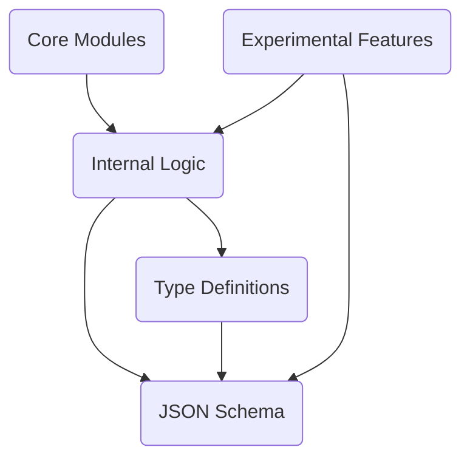

Pydantic is a Python library that helps you define data models and validate input data by leveraging Python's type hints. It's mainly used to ensure that data coming into your application matches the expected structure and types, making it easier to catch errors early and work with structured data reliably.

# Main Components

## Top Level Components

### Core Modules (<SwmPath>[docs/plugins/main.py](docs/plugins/main.py)</SwmPath>, <SwmPath>[pydantic/deprecated/json.py](pydantic/deprecated/json.py)</SwmPath>)

Core modules are the fundamental building blocks that implement the core validation logic, model construction, field management, serialization, and validation mechanisms enabling Pydantic's data validation and modeling capabilities.

- <SwmLink doc-title="Core modules overview">[Core modules overview](/.swm/core-modules-overview.bo1nzmzr.sw.md)</SwmLink>
- **Main**
  - **Classes**
    - <SwmLink doc-title="The basemodel class">[The basemodel class](/.swm/the-basemodel-class.h6d61.sw.md)</SwmLink>

### Experimental Features (<SwmPath>[pydantic/experimental/](pydantic/experimental/)</SwmPath>)

Experimental features are provisional additions to Pydantic that enable testing and feedback collection for new capabilities before they are finalized and officially integrated.

- **Arguments schema**
  - <SwmLink doc-title="Generating core schemas for callable arguments">[Generating core schemas for callable arguments](/.swm/generating-core-schemas-for-callable-arguments.jo7ozton.sw.md)</SwmLink>
- **Pipeline**
  - **Flows**
    - <SwmLink doc-title="Building a core schema from sequential steps">[Building a core schema from sequential steps](/.swm/building-a-core-schema-from-sequential-steps.65g819sy.sw.md)</SwmLink>

## Other Components

### Integration Utilities (<SwmPath>[pydantic/mypy.py](pydantic/mypy.py)</SwmPath>, <SwmPath>[pydantic/decorator.py](pydantic/decorator.py)</SwmPath>)

Integration utilities are components that enable smooth interoperability between the data validation models and external systems like mypy, enhancing type checking and validation capabilities.

- <SwmLink doc-title="Integration utilities overview">[Integration utilities overview](/.swm/integration-utilities-overview.n8nuoeqg.sw.md)</SwmLink>
- **Mypy**
  - **Classes**
    - <SwmLink doc-title="The pydanticmodeltransformer class">[The pydanticmodeltransformer class](/.swm/the-pydanticmodeltransformer-class.dshk0.sw.md)</SwmLink>

### JSON Schema (<SwmPath>[pydantic/json_schema.py](pydantic/json_schema.py)</SwmPath>)

JSON Schema provides a way to represent the structure and validation rules of data models, enabling automated validation and serialization of data.

- **Classes**
  - <SwmLink doc-title="The generatejsonschema class">[The generatejsonschema class](/.swm/the-generatejsonschema-class.81yha.sw.md)</SwmLink>

### Type Definitions (<SwmPath>[pydantic/types.py](pydantic/types.py)</SwmPath>)

Type definitions are used to define, constrain, and validate the structure of data models using Python type hints and custom types.

- **Classes**
  - <SwmLink doc-title="The discriminator class">[The discriminator class](/.swm/the-discriminator-class.tyy2s.sw.md)</SwmLink>

### Network Types (<SwmPath>[pydantic/networks.py](pydantic/networks.py)</SwmPath>)

Network types are specialized data models that validate and represent network-related information such as IP networks, interfaces, addresses, and URLs, enabling consistent and type-safe handling of network data.

- **Classes**
  - <SwmLink doc-title="The _baseurl class">[The \_baseurl class](/.swm/the-_baseurl-class.v00ar.sw.md)</SwmLink>

### Internal Logic (<SwmPath>[pydantic/\_internal/](pydantic/_internal/)</SwmPath>)

Internal logic refers to the foundational code that manages validators, configuration, and type annotations to facilitate data validation and model construction.

- **Internal Schema**
  - <SwmLink doc-title="Internal schema representation in validation and serialization">[Internal schema representation in validation and serialization](/.swm/internal-schema-representation-in-validation-and-serialization.98vzr7qb.sw.md)</SwmLink>
  - **Known annotated metadata**
    - <SwmLink doc-title="Known annotated metadata utilities and constraints">[Known annotated metadata utilities and constraints](/.swm/known-annotated-metadata-utilities-and-constraints.9n4injxj.sw.md)</SwmLink>
  - **Validators**
    - <SwmLink doc-title="Standard library type validators in pydantic">[Standard library type validators in pydantic](/.swm/standard-library-type-validators-in-pydantic.abvkyult.sw.md)</SwmLink>
  - **Dataclasses**
    - **Classes**
      - <SwmLink doc-title="The pydanticdataclass class">[The pydanticdataclass class](/.swm/the-pydanticdataclass-class.tf14c.sw.md)</SwmLink>
  - **Generate schema**
    - **Flows**
      - <SwmLink doc-title="Mapping python types to validation schemas">[Mapping python types to validation schemas](/.swm/mapping-python-types-to-validation-schemas.pnxxajxb.sw.md)</SwmLink>
      - <SwmLink doc-title="Generating a validation schema for an object">[Generating a validation schema for an object](/.swm/generating-a-validation-schema-for-an-object.d18qn5bl.sw.md)</SwmLink>
    - **Classes**
      - <SwmLink doc-title="The generateschema class">[The generateschema class](/.swm/the-generateschema-class.txxvt.sw.md)</SwmLink>
  - **Schema gather**
    - **Classes**
      - <SwmLink doc-title="The missingdefinitionerror class">[The missingdefinitionerror class](/.swm/the-missingdefinitionerror-class.szy30.sw.md)</SwmLink>
  - **Discriminated union**
    - **Flows**
      - <SwmLink doc-title="Applying a discriminator to union types">[Applying a discriminator to union types](/.swm/applying-a-discriminator-to-union-types.n236t7q7.sw.md)</SwmLink>
  - **Flows**
    - <SwmLink doc-title="Completing dataclass validation and serialization">[Completing dataclass validation and serialization](/.swm/completing-dataclass-validation-and-serialization.kxoh53vq.sw.md)</SwmLink>
    - <SwmLink doc-title="Generating a schema for function arguments">[Generating a schema for function arguments](/.swm/generating-a-schema-for-function-arguments.2vs4c8as.sw.md)</SwmLink>
    - <SwmLink doc-title="Exporting a json schema for a data model">[Exporting a json schema for a data model](/.swm/exporting-a-json-schema-for-a-data-model.rhn5a87j.sw.md)</SwmLink>
    - <SwmLink doc-title="Producing a core schema for a python type">[Producing a core schema for a python type](/.swm/producing-a-core-schema-for-a-python-type.do0w8119.sw.md)</SwmLink>
    - <SwmLink doc-title="Generating json schema from a data model">[Generating json schema from a data model](/.swm/generating-json-schema-from-a-data-model.vtfvzov8.sw.md)</SwmLink>
    - <SwmLink doc-title="Generating json schemas for python types">[Generating json schemas for python types](/.swm/generating-json-schemas-for-python-types.hn937pkr.sw.md)</SwmLink>
    - <SwmLink doc-title="Generating json schemas for multiple models">[Generating json schemas for multiple models](/.swm/generating-json-schemas-for-multiple-models.klszt0dn.sw.md)</SwmLink>
    - <SwmLink doc-title="Transforming type annotations into validation schemas">[Transforming type annotations into validation schemas](/.swm/transforming-type-annotations-into-validation-schemas.6n9ogkhy.sw.md)</SwmLink>
    - <SwmLink doc-title="Initializing a type adapter for validation and serialization">[Initializing a type adapter for validation and serialization](/.swm/initializing-a-type-adapter-for-validation-and-serialization.xcyz0ppy.sw.md)</SwmLink>
- **Decorators v1**
  - **Classes**
    - <SwmLink doc-title="The v1validatorwithvalues class">[The v1validatorwithvalues class](/.swm/the-v1validatorwithvalues-class.i97zb.sw.md)</SwmLink>
- **Config**
  - **Classes**
    - <SwmLink doc-title="The configwrapper class">[The configwrapper class](/.swm/the-configwrapper-class.khlxh.sw.md)</SwmLink>
- **Signature**
  - **Classes**
    - <SwmLink doc-title="The _has_default_factory_class class">[The \_has_default_factory_class class](/.swm/the-_has_default_factory_class-class.on2a0.sw.md)</SwmLink>
- **Decorators**
  - **Classes**
    - <SwmLink doc-title="The decoratorinfos class">[The decoratorinfos class](/.swm/the-decoratorinfos-class.v4ave.sw.md)</SwmLink>
- **Fields**
  - **Classes**
    - <SwmLink doc-title="The pydanticmetadata class">[The pydanticmetadata class](/.swm/the-pydanticmetadata-class.yqfrm.sw.md)</SwmLink>
- **Utils**
  - **Classes**
    - <SwmLink doc-title="The valueitems class">[The valueitems class](/.swm/the-valueitems-class.6hlac.sw.md)</SwmLink>
- **Model construction**
  - **Classes**
    - <SwmLink doc-title="The modelmetaclass class">[The modelmetaclass class](/.swm/the-modelmetaclass-class.izsep.sw.md)</SwmLink>
- **Generics**
  - **Classes**
    - <SwmLink doc-title="The pydanticgenericmetadata class">[The pydanticgenericmetadata class](/.swm/the-pydanticgenericmetadata-class.0b77s.sw.md)</SwmLink>
- **Typing extra**
  - <SwmLink doc-title="Advanced typing utilities and annotation handling">[Advanced typing utilities and annotation handling](/.swm/advanced-typing-utilities-and-annotation-handling.zkx07s7f.sw.md)</SwmLink>
- **Flows**
  - <SwmLink doc-title="Rebuilding a models schema and validation logic">[Rebuilding a models schema and validation logic](/.swm/rebuilding-a-models-schema-and-validation-logic.db4geedh.sw.md)</SwmLink>
  - <SwmLink doc-title="Building a complete field schema">[Building a complete field schema](/.swm/building-a-complete-field-schema.nrrg9qfl.sw.md)</SwmLink>
  - <SwmLink doc-title="Creating a new model class">[Creating a new model class](/.swm/creating-a-new-model-class.n56lcgp0.sw.md)</SwmLink>
  - <SwmLink doc-title="Creating a validated dataclass">[Creating a validated dataclass](/.swm/creating-a-validated-dataclass.xzj5usg3.sw.md)</SwmLink>
  - <SwmLink doc-title="Function validation setup flow">[Function validation setup flow](/.swm/function-validation-setup-flow.w3n0xo9u.sw.md)</SwmLink>
  - <SwmLink doc-title="Function call validation flow">[Function call validation flow](/.swm/function-call-validation-flow.kz3vz14d.sw.md)</SwmLink>
  - <SwmLink doc-title="Creating and reusing specialized generic models">[Creating and reusing specialized generic models](/.swm/creating-and-reusing-specialized-generic-models.h7w6k5kz.sw.md)</SwmLink>
  - <SwmLink doc-title="Generating core schemas with serialization">[Generating core schemas with serialization](/.swm/generating-core-schemas-with-serialization.be2n31kk.sw.md)</SwmLink>
  - <SwmLink doc-title="Generating core schemas for callables">[Generating core schemas for callables](/.swm/generating-core-schemas-for-callables.te8napzh.sw.md)</SwmLink>

### Field Handling (<SwmPath>[pydantic/fields.py](pydantic/fields.py)</SwmPath>)

Field handling enables precise customization and validation of model fields through the use of type hints, metadata, and the `Field` function.

- **Classes**
  - <SwmLink doc-title="The fieldinfo class">[The fieldinfo class](/.swm/the-fieldinfo-class.1cwfl.sw.md)</SwmLink>

### Legacy v1 (<SwmPath>[pydantic/v1/](pydantic/v1/)</SwmPath>)

Legacy v1 is the maintained version 1 codebase of the library, providing the original data validation and modeling features before any major version upgrades.

- **V1 Essentials**
  - <SwmLink doc-title="Basic concepts of v1 essentials in legacy v1">[Basic concepts of v1 essentials in legacy v1](/.swm/basic-concepts-of-v1-essentials-in-legacy-v1.75jnyw5a.sw.md)</SwmLink>
  - **Fields**
    - **Flows**
      - <SwmLink doc-title="Preparing a field for data models">[Preparing a field for data models](/.swm/preparing-a-field-for-data-models.ke7q70ia.sw.md)</SwmLink>
    - **Classes**
      - <SwmLink doc-title="The modelfield class">[The modelfield class](/.swm/the-modelfield-class.1xz8s.sw.md)</SwmLink>
  - **Env settings**
    - **Classes**
      - <SwmLink doc-title="The envsettingssource class">[The envsettingssource class](/.swm/the-envsettingssource-class.i7hjf.sw.md)</SwmLink>
- **Decorator**
  - **Classes**
    - <SwmLink doc-title="The validatedfunction class">[The validatedfunction class](/.swm/the-validatedfunction-class.hfjwf.sw.md)</SwmLink>
- **Mypy**
  - **Flows**
    - <SwmLink doc-title="Model transformation and setup flow">[Model transformation and setup flow](/.swm/model-transformation-and-setup-flow.0q745oap.sw.md)</SwmLink>
- **Validators**
  - **Classes**
    - <SwmLink doc-title="The ifconfig class">[The ifconfig class](/.swm/the-ifconfig-class.t1scl.sw.md)</SwmLink>
- **Typing**
  - <SwmLink doc-title="Pydantic v1 typing utilities and compatibility helpers">[Pydantic v1 typing utilities and compatibility helpers](/.swm/pydantic-v1-typing-utilities-and-compatibility-helpers.1cbdvban.sw.md)</SwmLink>
- **Class validators**
  - **Classes**
    - <SwmLink doc-title="The validatorgroup class">[The validatorgroup class](/.swm/the-validatorgroup-class.77mxu.sw.md)</SwmLink>
- **Color**
  - **Classes**
    - <SwmLink doc-title="The color class">[The color class](/.swm/the-color-class.lwe4z.sw.md)</SwmLink>
- **Main**
  - **Flows**
    - <SwmLink doc-title="Validating input data into model instances">[Validating input data into model instances](/.swm/validating-input-data-into-model-instances.lgx11d8o.sw.md)</SwmLink>
    - <SwmLink doc-title="Serializing data models to json">[Serializing data models to json](/.swm/serializing-data-models-to-json.g7gygth2.sw.md)</SwmLink>
  - **Classes**
    - <SwmLink doc-title="The basemodel class">[The basemodel class](/.swm/the-basemodel-class.g9r3x.sw.md)</SwmLink>
- **Datetime parse**
  - <SwmLink doc-title="Datetime parsing utilities in pydantic v1">[Datetime parsing utilities in pydantic v1](/.swm/datetime-parsing-utilities-in-pydantic-v1.ohjg4afb.sw.md)</SwmLink>
- **Utils**
  - **Classes**
    - <SwmLink doc-title="The valueitems class">[The valueitems class](/.swm/the-valueitems-class.3r5ht.sw.md)</SwmLink>
- **Networks**
  - **Classes**
    - <SwmLink doc-title="The anyurl class">[The anyurl class](/.swm/the-anyurl-class.mtwzq.sw.md)</SwmLink>
- **Generics**
  - **Classes**
    - <SwmLink doc-title="The genericmodel class">[The genericmodel class](/.swm/the-genericmodel-class.2scgg.sw.md)</SwmLink>
- **Schema**
  - **Flows**
    - <SwmLink doc-title="Generating a data model schema">[Generating a data model schema](/.swm/generating-a-data-model-schema.6n7soapr.sw.md)</SwmLink>
- **Types**
  - **Classes**
    - <SwmLink doc-title="The paymentcardnumber class">[The paymentcardnumber class](/.swm/the-paymentcardnumber-class.17kmi.sw.md)</SwmLink>
- **Dataclasses**
  - **Classes**
    - <SwmLink doc-title="The dataclass class">[The dataclass class](/.swm/the-dataclass-class.vuzqe.sw.md)</SwmLink>
- **Hypothesis plugin**
  - <SwmLink doc-title="Hypothesis strategy registration for pydantic types">[Hypothesis strategy registration for pydantic types](/.swm/hypothesis-strategy-registration-for-pydantic-types.3f8wms54.sw.md)</SwmLink>
- **Flows**
  - <SwmLink doc-title="Function argument validation flow">[Function argument validation flow](/.swm/function-argument-validation-flow.vy117kdd.sw.md)</SwmLink>
  - <SwmLink doc-title="Selecting the right validator for a python type">[Selecting the right validator for a python type](/.swm/selecting-the-right-validator-for-a-python-type.g7xzogh8.sw.md)</SwmLink>
  - <SwmLink doc-title="Validating and transforming decorated function calls">[Validating and transforming decorated function calls](/.swm/validating-and-transforming-decorated-function-calls.y8gp09lh.sw.md)</SwmLink>
  - <SwmLink doc-title="Parsing raw input data into validated models">[Parsing raw input data into validated models](/.swm/parsing-raw-input-data-into-validated-models.dl8ze91u.sw.md)</SwmLink>
  - <SwmLink doc-title="Loading and validating data from a file">[Loading and validating data from a file](/.swm/loading-and-validating-data-from-a-file.am20phtc.sw.md)</SwmLink>
  - <SwmLink doc-title="Validating and filtering typeddict input">[Validating and filtering typeddict input](/.swm/validating-and-filtering-typeddict-input.yrn8si2e.sw.md)</SwmLink>
  - <SwmLink doc-title="Comparing model instances for equality">[Comparing model instances for equality](/.swm/comparing-model-instances-for-equality.so64crz1.sw.md)</SwmLink>
  - <SwmLink doc-title="Validating attribute assignment in dataclasses">[Validating attribute assignment in dataclasses](/.swm/validating-attribute-assignment-in-dataclasses.6edaqezp.sw.md)</SwmLink>
  - <SwmLink doc-title="Generating json schema from data models">[Generating json schema from data models](/.swm/generating-json-schema-from-data-models.c8qgxlvq.sw.md)</SwmLink>
  - <SwmLink doc-title="Constructing a model instance from trusted data">[Constructing a model instance from trusted data](/.swm/constructing-a-model-instance-from-trusted-data.jj284k2q.sw.md)</SwmLink>
  - <SwmLink doc-title="Resolving forward references in data models">[Resolving forward references in data models](/.swm/resolving-forward-references-in-data-models.i2tb99bb.sw.md)</SwmLink>

### Deprecated API (<SwmPath>[pydantic/deprecated/](pydantic/deprecated/)</SwmPath>)

Deprecated API is a mechanism to mark fields and components as outdated, providing warnings to users and encouraging transition to newer, preferred alternatives.

- **Decorator**
  - **Classes**
    - <SwmLink doc-title="The validatedfunction class">[The validatedfunction class](/.swm/the-validatedfunction-class.4135k.sw.md)</SwmLink>
- **Tools**
  - <SwmLink doc-title="Deprecated utility functions for type validation and schema generation">[Deprecated utility functions for type validation and schema generation](/.swm/deprecated-utility-functions-for-type-validation-and-schema-generation.nod3prpz.sw.md)</SwmLink>
- **Config**
  - **Classes**
    - <SwmLink doc-title="The baseconfig class">[The baseconfig class](/.swm/the-baseconfig-class.dffnq.sw.md)</SwmLink>
- **Json**
  - <SwmLink doc-title="Deprecated json encoding utilities in pydantic">[Deprecated json encoding utilities in pydantic](/.swm/deprecated-json-encoding-utilities-in-pydantic.6mlmp2oh.sw.md)</SwmLink>
- **Parse**
  - **Classes**
    - <SwmLink doc-title="The protocol class">[The protocol class](/.swm/the-protocol-class.iyh5m.sw.md)</SwmLink>
- **Class validators**
  - **Classes**
    - <SwmLink doc-title="The _onlyvaluevalidatorclsmethod class">[The \_onlyvaluevalidatorclsmethod class](/.swm/the-_onlyvaluevalidatorclsmethod-class.ztcjp.sw.md)</SwmLink>

### Flows

- <SwmLink doc-title="Secure validation and serialization of secret fields">[Secure validation and serialization of secret fields](/.swm/secure-validation-and-serialization-of-secret-fields.ug9vx0b8.sw.md)</SwmLink>
- <SwmLink doc-title="Generating tagged union schemas for data validation">[Generating tagged union schemas for data validation](/.swm/generating-tagged-union-schemas-for-data-validation.5g98ifc6.sw.md)</SwmLink>
- <SwmLink doc-title="Flexible validation and schema generation for multiple input types">[Flexible validation and schema generation for multiple input types](/.swm/flexible-validation-and-schema-generation-for-multiple-input-types.nez5qusu.sw.md)</SwmLink>
- <SwmLink doc-title="Generating flexible validation and serialization schema">[Generating flexible validation and serialization schema](/.swm/generating-flexible-validation-and-serialization-schema.hubvhhyc.sw.md)</SwmLink>

### Classes

- <SwmLink doc-title="The configdict class">[The configdict class](/.swm/the-configdict-class.xojlc.sw.md)</SwmLink>
- <SwmLink doc-title="The typeadapter class">[The typeadapter class](/.swm/the-typeadapter-class.05krj.sw.md)</SwmLink>

&nbsp;

*This is an auto-generated document by Swimm 🌊 and has not yet been verified by a human*

<SwmMeta version="3.0.0" repo-id="Z2l0aHViJTNBJTNBcHlkYW50aWMlM0ElM0FTd2ltbS1EZW1v" repo-name="pydantic">Powered by [Swimm](/)</SwmMeta>
