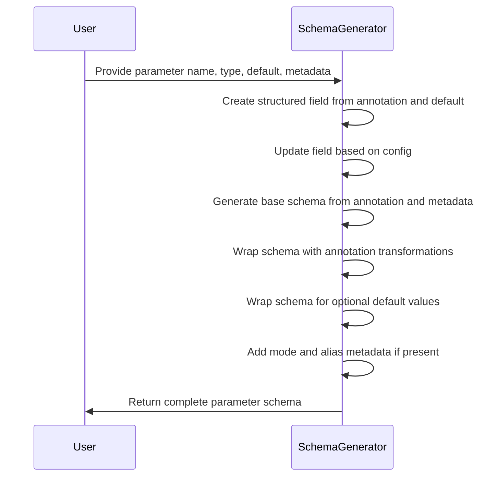
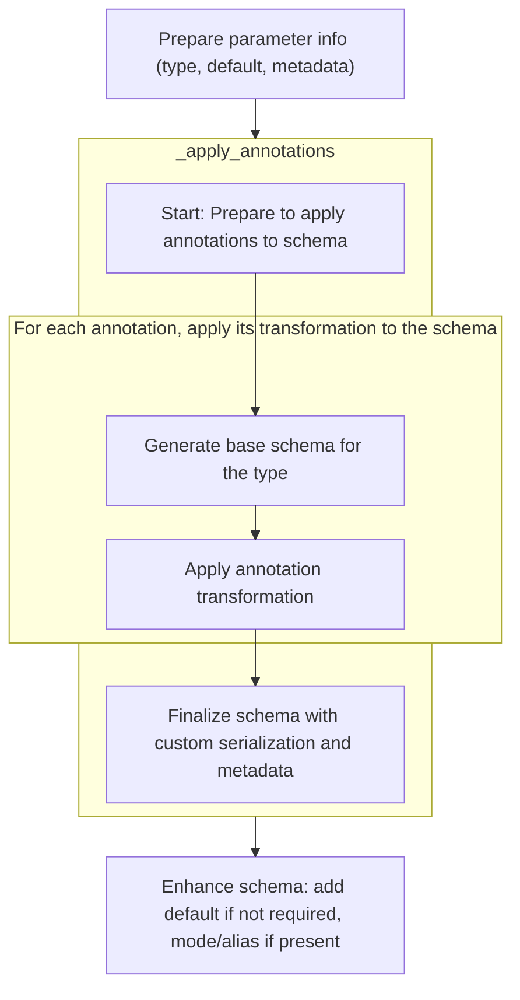
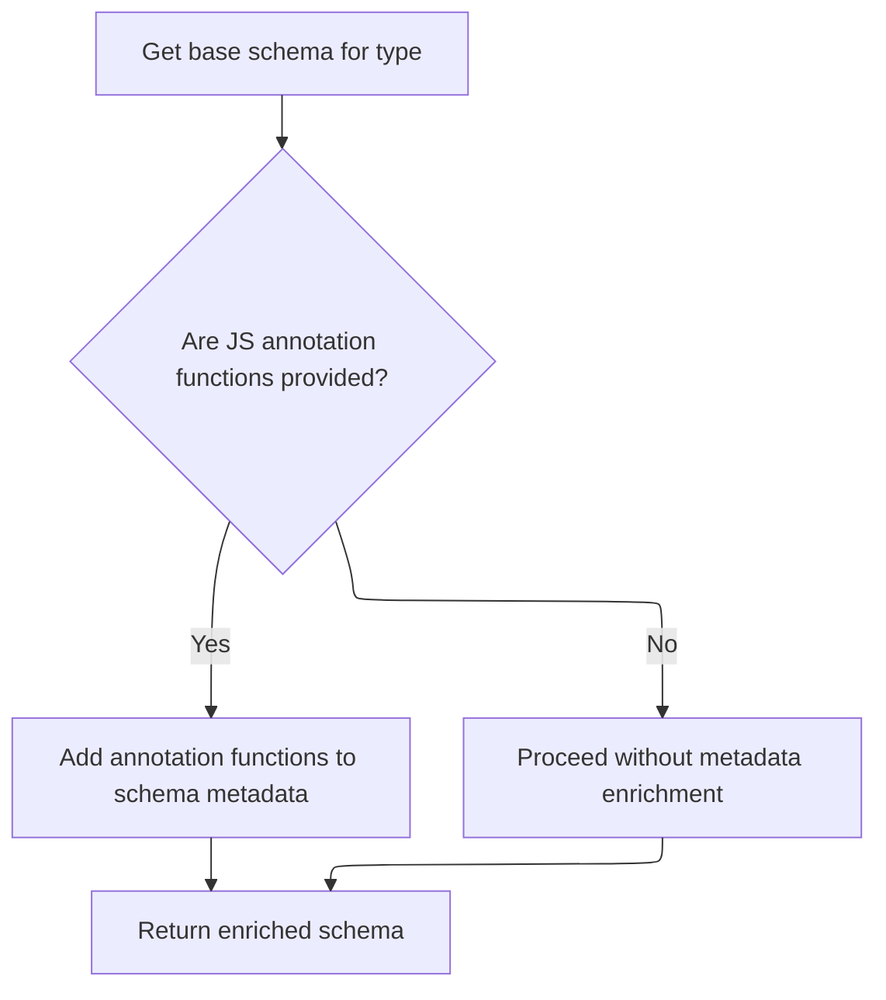
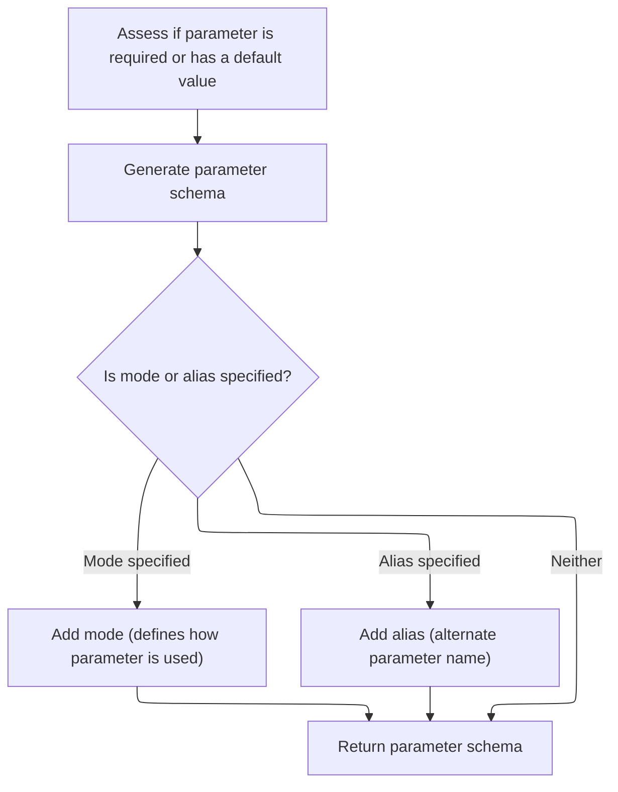

This document explains how parameter information including type, default, and metadata is transformed into a schema used for validation and serialization. The process involves creating a structured field, applying configuration and annotation transformations, handling optional defaults, and adding metadata such as mode and alias.

The main steps are:

- Convert annotation and default into a structured field
- Update field from configuration
- Generate and wrap base schema with annotations
- Wrap schema for optional parameters
- Add mode and alias metadata
- Return the final parameter schema



# Spec

## Detailed View of the Program's Functionality

a. Preparing Parameter Information

The process begins by preparing the information needed to define a parameter (such as a function argument or a namedtuple field). This involves determining the parameter's type, its default value (if any), and any additional metadata (like descriptions or constraints). If there is no default value, a helper is used to extract type and metadata from the annotation. If a default is provided, a different helper is used to extract both the annotation and the default value together. This results in a structured object that holds all relevant information about the parameter.

b. Applying Configuration Tweaks

Once the parameter information is structured, it is updated according to any configuration settings that might affect it. This could include things like global or model-specific configuration options that modify how the field should behave (for example, whether certain constraints are enforced).

c. Building the Schema from Annotations

With the parameter information ready, the next step is to build a schema that describes how this parameter should be validated and serialized. This is done by calling a method that processes the annotation and any associated metadata. The process involves:

- Expanding any grouped metadata in the annotations, so that all relevant pieces are considered individually.
- Setting up a handler that will generate the base schema for the type. If the type provides a custom schema method, that is used; otherwise, a default schema is generated.
- If the type or any annotation provides a custom method for generating JSON schema, this is attached to the schema's metadata for later use.
- The base schema is then wrapped with each annotation in turn. Each annotation can modify or enhance the schema, for example by adding constraints, validators, or additional metadata.
- After all annotations have been applied, any collected JSON schema functions are added to the schema's metadata.
- Finally, if there are any custom serialization rules defined in the configuration (such as custom JSON encoders), these are attached to the schema.

d. Enhancing the Schema with Defaults, Modes, and Aliases

After the schema is built, the code checks whether the parameter is required or has a default value. If it is not required (<SwmToken path="pydantic/_internal/_generate_schema.py" pos="925:22:24" line-data="            # safety measure (because these are inlined in place -- i.e. mutated directly)">`i.e`</SwmToken>., it has a default), the schema is wrapped so that the default value is handled correctly during validation.

A parameter schema object is then created, associating the parameter's name with its schema. If the parameter has a specific "mode" (such as positional-only, keyword-only, etc.), this is added to the schema. If the parameter has an alias (an alternate name used during serialization or deserialization), this is also added.

e. Returning the Final Parameter Schema

The fully constructed parameter schema, now containing all information about type, validation, serialization, defaults, mode, and alias, is returned. This schema can then be used by Pydantic for validating and serializing input data according to the parameter's definition.

---

This flow ensures that every parameter is described by a rich, fully-featured schema that incorporates type information, validation rules, serialization logic, and any customizations provided by the user or configuration. The process is modular, allowing each piece (type, default, metadata, annotations, config, etc.) to contribute to the final schema in a controlled way.

# Rule Definition

| Paragraph Name                                                                                                                                                                                                                                                                                                                                                                                                                                                                                                                                                                                                                                                                                                                                                                                         | Rule ID | Category          | Description                                                                                                                                                                                                                                                                                                                                                                                                                                                                                                                                                                                                                                                                                                                                                                                                                                                                                                                                                                                 | Conditions                                                                                                                                                                                                                          | Remarks                                                                                                                                                                                                                                                                                                                                                                                                                                                                                                                                                                                                                                                                                                                                                                                                                                                                                                                                                               |
| ------------------------------------------------------------------------------------------------------------------------------------------------------------------------------------------------------------------------------------------------------------------------------------------------------------------------------------------------------------------------------------------------------------------------------------------------------------------------------------------------------------------------------------------------------------------------------------------------------------------------------------------------------------------------------------------------------------------------------------------------------------------------------------------------------ | ------- | ----------------- | ------------------------------------------------------------------------------------------------------------------------------------------------------------------------------------------------------------------------------------------------------------------------------------------------------------------------------------------------------------------------------------------------------------------------------------------------------------------------------------------------------------------------------------------------------------------------------------------------------------------------------------------------------------------------------------------------------------------------------------------------------------------------------------------------------------------------------------------------------------------------------------------------------------------------------------------------------------------------------------------- | ----------------------------------------------------------------------------------------------------------------------------------------------------------------------------------------------------------------------------------- | --------------------------------------------------------------------------------------------------------------------------------------------------------------------------------------------------------------------------------------------------------------------------------------------------------------------------------------------------------------------------------------------------------------------------------------------------------------------------------------------------------------------------------------------------------------------------------------------------------------------------------------------------------------------------------------------------------------------------------------------------------------------------------------------------------------------------------------------------------------------------------------------------------------------------------------------------------------------- |
| <SwmToken path="pydantic/_internal/_generate_schema.py" pos="1532:3:3" line-data="    def _generate_parameter_schema(">`_generate_parameter_schema`</SwmToken>, <SwmToken path="pydantic/_internal/_generate_schema.py" pos="1915:7:7" line-data="        arguments_schema = self._arguments_schema(function)">`_arguments_schema`</SwmToken>, <SwmToken path="pydantic/_internal/_generate_schema.py" pos="2010:3:3" line-data="    def _arguments_v3_schema(">`_arguments_v3_schema`</SwmToken>                                                                                                                                                                                                                                                                                                      | RL-001  | Data Assignment   | The feature must accept as input the following parameters: name (string), annotation (type annotation with possible metadata), source (enumeration indicating annotation source), default (optional value or sentinel), and mode (optional string: <SwmToken path="pydantic/_internal/_generate_schema.py" pos="1538:7:7" line-data="        mode: Literal[&#39;positional_only&#39;, &#39;positional_or_keyword&#39;, &#39;keyword_only&#39;] \| None = None,">`positional_only`</SwmToken>, <SwmToken path="pydantic/_internal/_generate_schema.py" pos="1538:12:12" line-data="        mode: Literal[&#39;positional_only&#39;, &#39;positional_or_keyword&#39;, &#39;keyword_only&#39;] \| None = None,">`positional_or_keyword`</SwmToken>, <SwmToken path="pydantic/_internal/_generate_schema.py" pos="1538:17:17" line-data="        mode: Literal[&#39;positional_only&#39;, &#39;positional_or_keyword&#39;, &#39;keyword_only&#39;] \| None = None,">`keyword_only`</SwmToken>). | When generating a parameter schema for a function or namedtuple, these inputs must be provided.                                                                                                                                     | Valid mode values: <SwmToken path="pydantic/_internal/_generate_schema.py" pos="1538:7:7" line-data="        mode: Literal[&#39;positional_only&#39;, &#39;positional_or_keyword&#39;, &#39;keyword_only&#39;] \| None = None,">`positional_only`</SwmToken>, <SwmToken path="pydantic/_internal/_generate_schema.py" pos="1538:12:12" line-data="        mode: Literal[&#39;positional_only&#39;, &#39;positional_or_keyword&#39;, &#39;keyword_only&#39;] \| None = None,">`positional_or_keyword`</SwmToken>, <SwmToken path="pydantic/_internal/_generate_schema.py" pos="1538:17:17" line-data="        mode: Literal[&#39;positional_only&#39;, &#39;positional_or_keyword&#39;, &#39;keyword_only&#39;] \| None = None,">`keyword_only`</SwmToken>. Default sentinel is typically <SwmToken path="pydantic/_internal/_generate_schema.py" pos="1537:8:10" line-data="        default: Any = Parameter.empty,">`Parameter.empty`</SwmToken> or a similar value. |
| <SwmToken path="pydantic/_internal/_generate_schema.py" pos="1532:3:3" line-data="    def _generate_parameter_schema(">`_generate_parameter_schema`</SwmToken>, <SwmToken path="pydantic/_internal/_generate_schema.py" pos="1548:5:7" line-data="            field = FieldInfo.from_annotation(annotation, _source=source)">`FieldInfo.from_annotation`</SwmToken>, <SwmToken path="pydantic/_internal/_generate_schema.py" pos="1550:5:7" line-data="            field = FieldInfo.from_annotated_attribute(annotation, default, _source=source)">`FieldInfo.from_annotated_attribute`</SwmToken>                                                                                                                                                                                                    | RL-002  | Data Assignment   | Construct a <SwmToken path="pydantic/_internal/_generate_schema.py" pos="1545:1:1" line-data="        FieldInfo = import_cached_field_info()">`FieldInfo`</SwmToken> metadata object from the annotation and default value, capturing the type annotation, default value (or sentinel), additional metadata (validators, constraints, serialization hints), optional alias, and other field configuration flags.                                                                                                                                                                                                                                                                                                                                                                                                                                                                                                                                                                            | Whenever a parameter schema is being generated, and annotation/default are provided.                                                                                                                                                | <SwmToken path="pydantic/_internal/_generate_schema.py" pos="1545:1:1" line-data="        FieldInfo = import_cached_field_info()">`FieldInfo`</SwmToken> includes: annotation, default, metadata (list), alias (optional string), flags (discriminator, <SwmToken path="pydantic/_internal/_generate_schema.py" pos="178:3:3" line-data="    (&#39;validate_default&#39;, None),">`validate_default`</SwmToken>, exclude, frozen, init, <SwmToken path="pydantic/_internal/_generate_schema.py" pos="181:3:3" line-data="    (&#39;init_var&#39;, None),">`init_var`</SwmToken>, <SwmToken path="pydantic/_internal/_generate_schema.py" pos="182:3:3" line-data="    (&#39;kw_only&#39;, None),">`kw_only`</SwmToken>, etc).                                                                                                                                                                                                                                         |
| <SwmToken path="pydantic/_internal/_generate_schema.py" pos="1532:3:3" line-data="    def _generate_parameter_schema(">`_generate_parameter_schema`</SwmToken>, <SwmToken path="pydantic/_internal/_generate_schema.py" pos="1553:1:1" line-data="        update_field_from_config(self._config_wrapper, name, field)">`update_field_from_config`</SwmToken>                                                                                                                                                                                                                                                                                                                                                                                                                                           | RL-003  | Conditional Logic | Allow for configuration-driven modifications to the <SwmToken path="pydantic/_internal/_generate_schema.py" pos="1545:1:1" line-data="        FieldInfo = import_cached_field_info()">`FieldInfo`</SwmToken> metadata object before schema generation.                                                                                                                                                                                                                                                                                                                                                                                                                                                                                                                                                                                                                                                                                                                                      | If configuration is present for the field name, apply it to the <SwmToken path="pydantic/_internal/_generate_schema.py" pos="1545:1:1" line-data="        FieldInfo = import_cached_field_info()">`FieldInfo`</SwmToken> object.    | Configuration may affect flags like <SwmToken path="pydantic/_internal/_generate_schema.py" pos="178:3:3" line-data="    (&#39;validate_default&#39;, None),">`validate_default`</SwmToken>, frozen, etc.                                                                                                                                                                                                                                                                                                                                                                                                                                                                                                                                                                                                                                                                                                                                                             |
| <SwmToken path="pydantic/_internal/_generate_schema.py" pos="1532:3:3" line-data="    def _generate_parameter_schema(">`_generate_parameter_schema`</SwmToken>, <SwmToken path="pydantic/_internal/_generate_schema.py" pos="1556:7:7" line-data="            schema = self._apply_annotations(">`_apply_annotations`</SwmToken>, <SwmToken path="pydantic/_internal/_generate_schema.py" pos="2208:3:3" line-data="    def _apply_single_annotation(">`_apply_single_annotation`</SwmToken>                                                                                                                                                                                                                                                                                                           | RL-004  | Computation       | Process the annotation and metadata to produce a schema object that describes the parameter type, constraints, validation rules, default value, and any annotation effects (custom serialization/validation).                                                                                                                                                                                                                                                                                                                                                                                                                                                                                                                                                                                                                                                                                                                                                                               | When <SwmToken path="pydantic/_internal/_generate_schema.py" pos="1545:1:1" line-data="        FieldInfo = import_cached_field_info()">`FieldInfo`</SwmToken> and annotation are available for a parameter.                         | Schema object includes type, constraints, default, and effects from all annotations.                                                                                                                                                                                                                                                                                                                                                                                                                                                                                                                                                                                                                                                                                                                                                                                                                                                                                  |
| <SwmToken path="pydantic/_internal/_generate_schema.py" pos="1556:7:7" line-data="            schema = self._apply_annotations(">`_apply_annotations`</SwmToken>, <SwmToken path="pydantic/_internal/_generate_schema.py" pos="822:10:10" line-data="                            extra_keys_type, extra_items_type = self._get_args_resolving_forward_refs(">`_get_args_resolving_forward_refs`</SwmToken>, <SwmToken path="pydantic/_internal/_generate_schema.py" pos="2173:7:9" line-data="        annotations = list(_known_annotated_metadata.expand_grouped_metadata(annotations))">`_known_annotated_metadata.expand_grouped_metadata`</SwmToken>                                                                                                                                               | RL-005  | Computation       | Support the application of multiple annotations, with each able to modify or wrap the schema, and expand any grouped metadata before schema generation.                                                                                                                                                                                                                                                                                                                                                                                                                                                                                                                                                                                                                                                                                                                                                                                                                                     | If annotation includes multiple or grouped metadata.                                                                                                                                                                                | Annotations may be grouped (<SwmToken path="pydantic/_internal/_generate_schema.py" pos="184:38:40" line-data="&quot;&quot;&quot;`FieldInfo` attributes (and their default value) that can&#39;t be used outside of a model (e.g. in a type adapter or a PEP 695 type alias).&quot;&quot;&quot;">`e.g`</SwmToken>., via Annotated\[\]); must be expanded and applied in order.                                                                                                                                                                                                                                                                                                                                                                                                                                                                                                                                                                                        |
| <SwmToken path="pydantic/_internal/_generate_schema.py" pos="1556:7:7" line-data="            schema = self._apply_annotations(">`_apply_annotations`</SwmToken>, <SwmToken path="pydantic/_internal/_generate_schema.py" pos="2195:7:7" line-data="            get_inner_schema = self._get_wrapped_inner_schema(">`_get_wrapped_inner_schema`</SwmToken>                                                                                                                                                                                                                                                                                                                                                                                                                                             | RL-006  | Conditional Logic | If an annotation provides custom schema generation logic, use it; otherwise, generate a base schema for the type.                                                                                                                                                                                                                                                                                                                                                                                                                                                                                                                                                                                                                                                                                                                                                                                                                                                                           | If annotation has **get_pydantic_core_schema** method.                                                                                                                                                                              | Custom logic is invoked via **get_pydantic_core_schema** if present.                                                                                                                                                                                                                                                                                                                                                                                                                                                                                                                                                                                                                                                                                                                                                                                                                                                                                                  |
| <SwmToken path="pydantic/_internal/_generate_schema.py" pos="1556:7:7" line-data="            schema = self._apply_annotations(">`_apply_annotations`</SwmToken> (<SwmToken path="pydantic/_internal/_generate_schema.py" pos="2164:1:1" line-data="        transform_inner_schema: Callable[[CoreSchema], CoreSchema] = lambda x: x,">`transform_inner_schema`</SwmToken> argument)                                                                                                                                                                                                                                                                                                                                                                                                                   | RL-007  | Computation       | Allow for further transformation of the schema via an optional transformation function after annotation processing.                                                                                                                                                                                                                                                                                                                                                                                                                                                                                                                                                                                                                                                                                                                                                                                                                                                                         | If a <SwmToken path="pydantic/_internal/_generate_schema.py" pos="2164:1:1" line-data="        transform_inner_schema: Callable[[CoreSchema], CoreSchema] = lambda x: x,">`transform_inner_schema`</SwmToken> function is provided. | Transformation function is applied after all annotations.                                                                                                                                                                                                                                                                                                                                                                                                                                                                                                                                                                                                                                                                                                                                                                                                                                                                                                             |
| <SwmToken path="pydantic/_internal/_generate_schema.py" pos="1532:3:3" line-data="    def _generate_parameter_schema(">`_generate_parameter_schema`</SwmToken>, <SwmToken path="pydantic/_internal/_generate_schema.py" pos="1556:7:7" line-data="            schema = self._apply_annotations(">`_apply_annotations`</SwmToken>, <SwmToken path="pydantic/_internal/_generate_schema.py" pos="2187:3:3" line-data="                    self._add_js_function(metadata_schema, metadata_js_function)">`_add_js_function`</SwmToken>, <SwmToken path="pydantic/_internal/_generate_schema.py" pos="2206:3:3" line-data="        return _add_custom_serialization_from_json_encoders(self._config_wrapper.json_encoders, source_type, schema)">`_add_custom_serialization_from_json_encoders`</SwmToken> | RL-008  | Computation       | Finalize the schema by attaching any collected JSON schema functions to the schema metadata and adding custom serialization logic from configuration if specified.                                                                                                                                                                                                                                                                                                                                                                                                                                                                                                                                                                                                                                                                                                                                                                                                                          | If JSON schema functions or custom serialization are present.                                                                                                                                                                       | JSON schema functions are attached to metadata; serialization logic is added to the schema.                                                                                                                                                                                                                                                                                                                                                                                                                                                                                                                                                                                                                                                                                                                                                                                                                                                                           |
| <SwmToken path="pydantic/_internal/_generate_schema.py" pos="1532:3:3" line-data="    def _generate_parameter_schema(">`_generate_parameter_schema`</SwmToken>                                                                                                                                                                                                                                                                                                                                                                                                                                                                                                                                                                                                                                         | RL-009  | Data Assignment   | Return a parameter schema object with keys: 'name' (string), 'schema' (fully processed schema object), and optionally 'mode' and 'alias' if specified.                                                                                                                                                                                                                                                                                                                                                                                                                                                                                                                                                                                                                                                                                                                                                                                                                                      | After schema generation is complete.                                                                                                                                                                                                | Output format: { 'name': string, 'schema': object, 'mode': string (optional), 'alias': string (optional) }                                                                                                                                                                                                                                                                                                                                                                                                                                                                                                                                                                                                                                                                                                                                                                                                                                                            |
| <SwmToken path="pydantic/_internal/_generate_schema.py" pos="1532:3:3" line-data="    def _generate_parameter_schema(">`_generate_parameter_schema`</SwmToken>, <SwmToken path="pydantic/_internal/_generate_schema.py" pos="1566:5:5" line-data="            schema = wrap_default(field, schema)">`wrap_default`</SwmToken>                                                                                                                                                                                                                                                                                                                                                                                                                                                                          | RL-010  | Conditional Logic | If the parameter is not required (has a default value), ensure the schema reflects this by including the default value.                                                                                                                                                                                                                                                                                                                                                                                                                                                                                                                                                                                                                                                                                                                                                                                                                                                                     | If <SwmToken path="pydantic/_internal/_generate_schema.py" pos="1545:1:1" line-data="        FieldInfo = import_cached_field_info()">`FieldInfo`</SwmToken> indicates parameter is not required.                                    | Default value is included in the schema using <SwmToken path="pydantic/_internal/_generate_schema.py" pos="2556:5:5" line-data="        return core_schema.with_default_schema(">`with_default_schema`</SwmToken>.                                                                                                                                                                                                                                                                                                                                                                                                                                                                                                                                                                                                                                                                                                                                                    |
| <SwmToken path="pydantic/_internal/_generate_schema.py" pos="1532:3:3" line-data="    def _generate_parameter_schema(">`_generate_parameter_schema`</SwmToken>                                                                                                                                                                                                                                                                                                                                                                                                                                                                                                                                                                                                                                         | RL-011  | Conditional Logic | If a mode or alias is specified, include these in the returned parameter schema object.                                                                                                                                                                                                                                                                                                                                                                                                                                                                                                                                                                                                                                                                                                                                                                                                                                                                                                     | If mode or alias is present in input or metadata.                                                                                                                                                                                   | Mode: <SwmToken path="pydantic/_internal/_generate_schema.py" pos="1538:7:7" line-data="        mode: Literal[&#39;positional_only&#39;, &#39;positional_or_keyword&#39;, &#39;keyword_only&#39;] \| None = None,">`positional_only`</SwmToken>, <SwmToken path="pydantic/_internal/_generate_schema.py" pos="1538:12:12" line-data="        mode: Literal[&#39;positional_only&#39;, &#39;positional_or_keyword&#39;, &#39;keyword_only&#39;] \| None = None,">`positional_or_keyword`</SwmToken>, <SwmToken path="pydantic/_internal/_generate_schema.py" pos="1538:17:17" line-data="        mode: Literal[&#39;positional_only&#39;, &#39;positional_or_keyword&#39;, &#39;keyword_only&#39;] \| None = None,">`keyword_only`</SwmToken>. Alias: string.                                                                                                                                                                                                          |
| <SwmToken path="pydantic/_internal/_generate_schema.py" pos="1532:3:3" line-data="    def _generate_parameter_schema(">`_generate_parameter_schema`</SwmToken>, <SwmToken path="pydantic/_internal/_generate_schema.py" pos="1556:7:7" line-data="            schema = self._apply_annotations(">`_apply_annotations`</SwmToken>                                                                                                                                                                                                                                                                                                                                                                                                                                                                       | RL-012  | Conditional Logic | Support all combinations of annotation, default, mode, and alias as described in the spec.                                                                                                                                                                                                                                                                                                                                                                                                                                                                                                                                                                                                                                                                                                                                                                                                                                                                                                  | For any valid combination of these inputs.                                                                                                                                                                                          | No restrictions on combinations; logic must branch as needed.                                                                                                                                                                                                                                                                                                                                                                                                                                                                                                                                                                                                                                                                                                                                                                                                                                                                                                         |
| <SwmToken path="pydantic/_internal/_generate_schema.py" pos="1532:3:3" line-data="    def _generate_parameter_schema(">`_generate_parameter_schema`</SwmToken>                                                                                                                                                                                                                                                                                                                                                                                                                                                                                                                                                                                                                                         | RL-013  | Data Assignment   | Accept and process input data in the formats described (name, annotation, source, default, mode) and output data in the schema object format described.                                                                                                                                                                                                                                                                                                                                                                                                                                                                                                                                                                                                                                                                                                                                                                                                                                     | For all invocations of the feature.                                                                                                                                                                                                 | Input: name (string), annotation (type), source (enum), default (optional), mode (optional). Output: parameter schema object as above.                                                                                                                                                                                                                                                                                                                                                                                                                                                                                                                                                                                                                                                                                                                                                                                                                                |

# User Stories

## User Story 1: Accept and process parameter schema inputs

---

### Story Description:

As a system generating parameter schemas, I want to accept and process input data including name, annotation, source, default, and mode so that I can generate accurate schema objects for function or namedtuple parameters.

---

### Business Rule Mapping:

| Rule ID | Paragraph Name                                                                                                                                                                                                                                                                                                                                                                                                                                                                                    | Rule Description                                                                                                                                                                                                                                                                                                                                                                                                                                                                                                                                                                                                                                                                                                                                                                                                                                                                                                                                                                            |
| ------- | ------------------------------------------------------------------------------------------------------------------------------------------------------------------------------------------------------------------------------------------------------------------------------------------------------------------------------------------------------------------------------------------------------------------------------------------------------------------------------------------------- | ------------------------------------------------------------------------------------------------------------------------------------------------------------------------------------------------------------------------------------------------------------------------------------------------------------------------------------------------------------------------------------------------------------------------------------------------------------------------------------------------------------------------------------------------------------------------------------------------------------------------------------------------------------------------------------------------------------------------------------------------------------------------------------------------------------------------------------------------------------------------------------------------------------------------------------------------------------------------------------------- |
| RL-001  | <SwmToken path="pydantic/_internal/_generate_schema.py" pos="1532:3:3" line-data="    def _generate_parameter_schema(">`_generate_parameter_schema`</SwmToken>, <SwmToken path="pydantic/_internal/_generate_schema.py" pos="1915:7:7" line-data="        arguments_schema = self._arguments_schema(function)">`_arguments_schema`</SwmToken>, <SwmToken path="pydantic/_internal/_generate_schema.py" pos="2010:3:3" line-data="    def _arguments_v3_schema(">`_arguments_v3_schema`</SwmToken> | The feature must accept as input the following parameters: name (string), annotation (type annotation with possible metadata), source (enumeration indicating annotation source), default (optional value or sentinel), and mode (optional string: <SwmToken path="pydantic/_internal/_generate_schema.py" pos="1538:7:7" line-data="        mode: Literal[&#39;positional_only&#39;, &#39;positional_or_keyword&#39;, &#39;keyword_only&#39;] \| None = None,">`positional_only`</SwmToken>, <SwmToken path="pydantic/_internal/_generate_schema.py" pos="1538:12:12" line-data="        mode: Literal[&#39;positional_only&#39;, &#39;positional_or_keyword&#39;, &#39;keyword_only&#39;] \| None = None,">`positional_or_keyword`</SwmToken>, <SwmToken path="pydantic/_internal/_generate_schema.py" pos="1538:17:17" line-data="        mode: Literal[&#39;positional_only&#39;, &#39;positional_or_keyword&#39;, &#39;keyword_only&#39;] \| None = None,">`keyword_only`</SwmToken>). |
| RL-013  | <SwmToken path="pydantic/_internal/_generate_schema.py" pos="1532:3:3" line-data="    def _generate_parameter_schema(">`_generate_parameter_schema`</SwmToken>                                                                                                                                                                                                                                                                                                                                    | Accept and process input data in the formats described (name, annotation, source, default, mode) and output data in the schema object format described.                                                                                                                                                                                                                                                                                                                                                                                                                                                                                                                                                                                                                                                                                                                                                                                                                                     |

---

### Relevant Functionality:

- <SwmToken path="pydantic/_internal/_generate_schema.py" pos="1532:3:3" line-data="    def _generate_parameter_schema(">`_generate_parameter_schema`</SwmToken>
  1. **RL-001:**
     - Accept input parameters: name, annotation, source, default, mode
     - Validate that mode, if provided, is one of the allowed values
     - Use default sentinel if default is not provided
  2. **RL-013:**
     - Accept input in required format
     - Output parameter schema object in required format

## User Story 2: Construct and modify <SwmToken path="pydantic/_internal/_generate_schema.py" pos="1545:1:1" line-data="        FieldInfo = import_cached_field_info()">`FieldInfo`</SwmToken> metadata

---

### Story Description:

As a system generating parameter schemas, I want to construct a <SwmToken path="pydantic/_internal/_generate_schema.py" pos="1545:1:1" line-data="        FieldInfo = import_cached_field_info()">`FieldInfo`</SwmToken> metadata object from the annotation and default value, and allow configuration-driven modifications, so that all relevant field information and configuration flags are accurately captured before schema generation.

---

### Business Rule Mapping:

| Rule ID | Paragraph Name                                                                                                                                                                                                                                                                                                                                                                                                                                                                                                                                                                                      | Rule Description                                                                                                                                                                                                                                                                                                                                                                                                 |
| ------- | --------------------------------------------------------------------------------------------------------------------------------------------------------------------------------------------------------------------------------------------------------------------------------------------------------------------------------------------------------------------------------------------------------------------------------------------------------------------------------------------------------------------------------------------------------------------------------------------------- | ---------------------------------------------------------------------------------------------------------------------------------------------------------------------------------------------------------------------------------------------------------------------------------------------------------------------------------------------------------------------------------------------------------------- |
| RL-002  | <SwmToken path="pydantic/_internal/_generate_schema.py" pos="1532:3:3" line-data="    def _generate_parameter_schema(">`_generate_parameter_schema`</SwmToken>, <SwmToken path="pydantic/_internal/_generate_schema.py" pos="1548:5:7" line-data="            field = FieldInfo.from_annotation(annotation, _source=source)">`FieldInfo.from_annotation`</SwmToken>, <SwmToken path="pydantic/_internal/_generate_schema.py" pos="1550:5:7" line-data="            field = FieldInfo.from_annotated_attribute(annotation, default, _source=source)">`FieldInfo.from_annotated_attribute`</SwmToken> | Construct a <SwmToken path="pydantic/_internal/_generate_schema.py" pos="1545:1:1" line-data="        FieldInfo = import_cached_field_info()">`FieldInfo`</SwmToken> metadata object from the annotation and default value, capturing the type annotation, default value (or sentinel), additional metadata (validators, constraints, serialization hints), optional alias, and other field configuration flags. |
| RL-003  | <SwmToken path="pydantic/_internal/_generate_schema.py" pos="1532:3:3" line-data="    def _generate_parameter_schema(">`_generate_parameter_schema`</SwmToken>, <SwmToken path="pydantic/_internal/_generate_schema.py" pos="1553:1:1" line-data="        update_field_from_config(self._config_wrapper, name, field)">`update_field_from_config`</SwmToken>                                                                                                                                                                                                                                        | Allow for configuration-driven modifications to the <SwmToken path="pydantic/_internal/_generate_schema.py" pos="1545:1:1" line-data="        FieldInfo = import_cached_field_info()">`FieldInfo`</SwmToken> metadata object before schema generation.                                                                                                                                                           |

---

### Relevant Functionality:

- <SwmToken path="pydantic/_internal/_generate_schema.py" pos="1532:3:3" line-data="    def _generate_parameter_schema(">`_generate_parameter_schema`</SwmToken>
  1. **RL-002:**
     - If default is not provided, use <SwmToken path="pydantic/_internal/_generate_schema.py" pos="1548:5:7" line-data="            field = FieldInfo.from_annotation(annotation, _source=source)">`FieldInfo.from_annotation`</SwmToken>
     - If default is provided, use <SwmToken path="pydantic/_internal/_generate_schema.py" pos="1550:5:7" line-data="            field = FieldInfo.from_annotated_attribute(annotation, default, _source=source)">`FieldInfo.from_annotated_attribute`</SwmToken>
     - Populate <SwmToken path="pydantic/_internal/_generate_schema.py" pos="1545:1:1" line-data="        FieldInfo = import_cached_field_info()">`FieldInfo`</SwmToken> fields from annotation and default
     - Extract and store additional metadata and configuration flags
  2. **RL-003:**
     - Check for configuration for the field
     - Apply configuration overrides to <SwmToken path="pydantic/_internal/_generate_schema.py" pos="1545:1:1" line-data="        FieldInfo = import_cached_field_info()">`FieldInfo`</SwmToken>

## User Story 3: Process annotations and metadata to generate and finalize schema

---

### Story Description:

As a system generating parameter schemas, I want to process the annotation and metadata to produce a schema object that describes the parameter type, constraints, validation rules, default value, and any annotation effects, supporting multiple and grouped annotations, custom schema logic, schema transformation functions, and finalizing with JSON schema functions and custom serialization logic, so that the resulting schema is comprehensive, accurate, and supports advanced serialization and documentation features.

---

### Business Rule Mapping:

| Rule ID | Paragraph Name                                                                                                                                                                                                                                                                                                                                                                                                                                                                                                                                                                                                                                                                                                                                                                                         | Rule Description                                                                                                                                                                                              |
| ------- | ------------------------------------------------------------------------------------------------------------------------------------------------------------------------------------------------------------------------------------------------------------------------------------------------------------------------------------------------------------------------------------------------------------------------------------------------------------------------------------------------------------------------------------------------------------------------------------------------------------------------------------------------------------------------------------------------------------------------------------------------------------------------------------------------------ | ------------------------------------------------------------------------------------------------------------------------------------------------------------------------------------------------------------- |
| RL-004  | <SwmToken path="pydantic/_internal/_generate_schema.py" pos="1532:3:3" line-data="    def _generate_parameter_schema(">`_generate_parameter_schema`</SwmToken>, <SwmToken path="pydantic/_internal/_generate_schema.py" pos="1556:7:7" line-data="            schema = self._apply_annotations(">`_apply_annotations`</SwmToken>, <SwmToken path="pydantic/_internal/_generate_schema.py" pos="2208:3:3" line-data="    def _apply_single_annotation(">`_apply_single_annotation`</SwmToken>                                                                                                                                                                                                                                                                                                           | Process the annotation and metadata to produce a schema object that describes the parameter type, constraints, validation rules, default value, and any annotation effects (custom serialization/validation). |
| RL-008  | <SwmToken path="pydantic/_internal/_generate_schema.py" pos="1532:3:3" line-data="    def _generate_parameter_schema(">`_generate_parameter_schema`</SwmToken>, <SwmToken path="pydantic/_internal/_generate_schema.py" pos="1556:7:7" line-data="            schema = self._apply_annotations(">`_apply_annotations`</SwmToken>, <SwmToken path="pydantic/_internal/_generate_schema.py" pos="2187:3:3" line-data="                    self._add_js_function(metadata_schema, metadata_js_function)">`_add_js_function`</SwmToken>, <SwmToken path="pydantic/_internal/_generate_schema.py" pos="2206:3:3" line-data="        return _add_custom_serialization_from_json_encoders(self._config_wrapper.json_encoders, source_type, schema)">`_add_custom_serialization_from_json_encoders`</SwmToken> | Finalize the schema by attaching any collected JSON schema functions to the schema metadata and adding custom serialization logic from configuration if specified.                                            |
| RL-005  | <SwmToken path="pydantic/_internal/_generate_schema.py" pos="1556:7:7" line-data="            schema = self._apply_annotations(">`_apply_annotations`</SwmToken>, <SwmToken path="pydantic/_internal/_generate_schema.py" pos="822:10:10" line-data="                            extra_keys_type, extra_items_type = self._get_args_resolving_forward_refs(">`_get_args_resolving_forward_refs`</SwmToken>, <SwmToken path="pydantic/_internal/_generate_schema.py" pos="2173:7:9" line-data="        annotations = list(_known_annotated_metadata.expand_grouped_metadata(annotations))">`_known_annotated_metadata.expand_grouped_metadata`</SwmToken>                                                                                                                                               | Support the application of multiple annotations, with each able to modify or wrap the schema, and expand any grouped metadata before schema generation.                                                       |
| RL-006  | <SwmToken path="pydantic/_internal/_generate_schema.py" pos="1556:7:7" line-data="            schema = self._apply_annotations(">`_apply_annotations`</SwmToken>, <SwmToken path="pydantic/_internal/_generate_schema.py" pos="2195:7:7" line-data="            get_inner_schema = self._get_wrapped_inner_schema(">`_get_wrapped_inner_schema`</SwmToken>                                                                                                                                                                                                                                                                                                                                                                                                                                             | If an annotation provides custom schema generation logic, use it; otherwise, generate a base schema for the type.                                                                                             |
| RL-007  | <SwmToken path="pydantic/_internal/_generate_schema.py" pos="1556:7:7" line-data="            schema = self._apply_annotations(">`_apply_annotations`</SwmToken> (<SwmToken path="pydantic/_internal/_generate_schema.py" pos="2164:1:1" line-data="        transform_inner_schema: Callable[[CoreSchema], CoreSchema] = lambda x: x,">`transform_inner_schema`</SwmToken> argument)                                                                                                                                                                                                                                                                                                                                                                                                                   | Allow for further transformation of the schema via an optional transformation function after annotation processing.                                                                                           |

---

### Relevant Functionality:

- <SwmToken path="pydantic/_internal/_generate_schema.py" pos="1532:3:3" line-data="    def _generate_parameter_schema(">`_generate_parameter_schema`</SwmToken>
  1. **RL-004:**
     - Call <SwmToken path="pydantic/_internal/_generate_schema.py" pos="1556:7:7" line-data="            schema = self._apply_annotations(">`_apply_annotations`</SwmToken> with annotation and metadata
     - Apply each annotation in order, allowing each to modify or wrap the schema
     - If a default is present and parameter is not required, wrap schema with default
  2. **RL-008:**
     - Attach JSON schema functions to schema metadata if present
     - Add custom serialization logic from configuration if specified
- <SwmToken path="pydantic/_internal/_generate_schema.py" pos="1556:7:7" line-data="            schema = self._apply_annotations(">`_apply_annotations`</SwmToken>
  1. **RL-005:**
     - Expand grouped metadata using <SwmToken path="pydantic/_internal/_generate_schema.py" pos="2173:9:9" line-data="        annotations = list(_known_annotated_metadata.expand_grouped_metadata(annotations))">`expand_grouped_metadata`</SwmToken>
     - For each annotation, wrap or modify the schema as needed
  2. **RL-006:**
     - Check for **get_pydantic_core_schema** on annotation
     - If present, call it to generate schema
     - Otherwise, use default schema generation
- <SwmToken path="pydantic/_internal/_generate_schema.py" pos="1556:7:7" line-data="            schema = self._apply_annotations(">`_apply_annotations`</SwmToken> **(**<SwmToken path="pydantic/_internal/_generate_schema.py" pos="2164:1:1" line-data="        transform_inner_schema: Callable[[CoreSchema], CoreSchema] = lambda x: x,">`transform_inner_schema`</SwmToken> **argument)**
  1. **RL-007:**
     - After applying annotations, call <SwmToken path="pydantic/_internal/_generate_schema.py" pos="2164:1:1" line-data="        transform_inner_schema: Callable[[CoreSchema], CoreSchema] = lambda x: x,">`transform_inner_schema`</SwmToken> on the schema if provided

## User Story 4: Return complete parameter schema object with all relevant fields

---

### Story Description:

As a system generating parameter schemas, I want to return a parameter schema object with the name, fully processed schema, and optionally mode and alias, ensuring that the schema reflects whether the parameter is required or has a default value, and supports all valid combinations of annotation, default, mode, and alias, so that the output can be used reliably for argument validation or schema generation.

---

### Business Rule Mapping:

| Rule ID | Paragraph Name                                                                                                                                                                                                                                                                                                                   | Rule Description                                                                                                                                       |
| ------- | -------------------------------------------------------------------------------------------------------------------------------------------------------------------------------------------------------------------------------------------------------------------------------------------------------------------------------- | ------------------------------------------------------------------------------------------------------------------------------------------------------ |
| RL-009  | <SwmToken path="pydantic/_internal/_generate_schema.py" pos="1532:3:3" line-data="    def _generate_parameter_schema(">`_generate_parameter_schema`</SwmToken>                                                                                                                                                                   | Return a parameter schema object with keys: 'name' (string), 'schema' (fully processed schema object), and optionally 'mode' and 'alias' if specified. |
| RL-010  | <SwmToken path="pydantic/_internal/_generate_schema.py" pos="1532:3:3" line-data="    def _generate_parameter_schema(">`_generate_parameter_schema`</SwmToken>, <SwmToken path="pydantic/_internal/_generate_schema.py" pos="1566:5:5" line-data="            schema = wrap_default(field, schema)">`wrap_default`</SwmToken>    | If the parameter is not required (has a default value), ensure the schema reflects this by including the default value.                                |
| RL-011  | <SwmToken path="pydantic/_internal/_generate_schema.py" pos="1532:3:3" line-data="    def _generate_parameter_schema(">`_generate_parameter_schema`</SwmToken>                                                                                                                                                                   | If a mode or alias is specified, include these in the returned parameter schema object.                                                                |
| RL-012  | <SwmToken path="pydantic/_internal/_generate_schema.py" pos="1532:3:3" line-data="    def _generate_parameter_schema(">`_generate_parameter_schema`</SwmToken>, <SwmToken path="pydantic/_internal/_generate_schema.py" pos="1556:7:7" line-data="            schema = self._apply_annotations(">`_apply_annotations`</SwmToken> | Support all combinations of annotation, default, mode, and alias as described in the spec.                                                             |

---

### Relevant Functionality:

- <SwmToken path="pydantic/_internal/_generate_schema.py" pos="1532:3:3" line-data="    def _generate_parameter_schema(">`_generate_parameter_schema`</SwmToken>
  1. **RL-009:**
     - Create output object with 'name' and 'schema'
     - If mode is specified, include 'mode' key
     - If alias is specified in metadata, include 'alias' key
     - Return the output object
  2. **RL-010:**
     - If parameter is not required, wrap schema with default value using <SwmToken path="pydantic/_internal/_generate_schema.py" pos="1566:5:5" line-data="            schema = wrap_default(field, schema)">`wrap_default`</SwmToken>
  3. **RL-011:**
     - If mode is specified, add 'mode' to output
     - If alias is specified, add 'alias' to output
  4. **RL-012:**
     - Accept and process any combination of annotation, default, mode, and alias
     - Ensure output is correct for all combinations

# Code Walkthrough

## Building the parameter field definition



<SwmSnippet path="/pydantic/_internal/_generate_schema.py" line="1532">

---

In <SwmToken path="pydantic/_internal/_generate_schema.py" pos="1532:3:3" line-data="    def _generate_parameter_schema(">`_generate_parameter_schema`</SwmToken>, we start by turning the annotation and default into a <SwmToken path="pydantic/_internal/_generate_schema.py" pos="1545:1:1" line-data="        FieldInfo = import_cached_field_info()">`FieldInfo`</SwmToken> object, which gives us a structured way to handle type and metadata. We then update this field with any config-driven tweaks. After that, we call <SwmToken path="pydantic/_internal/_generate_schema.py" pos="1556:7:7" line-data="            schema = self._apply_annotations(">`_apply_annotations`</SwmToken> to actually process the annotation and metadata into a schema object that Pydantic can use for validation and serialization. This is where the raw info gets turned into something actionable.

```python
    def _generate_parameter_schema(
        self,
        name: str,
        annotation: type[Any],
        source: AnnotationSource,
        default: Any = Parameter.empty,
        mode: Literal['positional_only', 'positional_or_keyword', 'keyword_only'] | None = None,
    ) -> core_schema.ArgumentsParameter:
        """Generate the definition of a field in a namedtuple or a parameter in a function signature.

        This definition is meant to be used for the `'arguments'` core schema, which will be replaced
        in V3 by the `'arguments-v3`'.
        """
        FieldInfo = import_cached_field_info()

        if default is Parameter.empty:
            field = FieldInfo.from_annotation(annotation, _source=source)
        else:
            field = FieldInfo.from_annotated_attribute(annotation, default, _source=source)

        assert field.annotation is not None, 'field.annotation should not be None when generating a schema'
        update_field_from_config(self._config_wrapper, name, field)

        with self.field_name_stack.push(name):
            schema = self._apply_annotations(
                field.annotation,
                [field],
                # Because we pass `field` as metadata above (required for attributes relevant for
                # JSON Scheme generation), we need to ignore the potential warnings about `FieldInfo`
                # attributes that will not be used:
                check_unsupported_field_info_attributes=False,
            )

```

---

</SwmSnippet>

### Processing annotations and metadata

<SwmSnippet path="/pydantic/_internal/_generate_schema.py" line="2160">

---

In <SwmToken path="pydantic/_internal/_generate_schema.py" pos="2160:3:3" line-data="    def _apply_annotations(">`_apply_annotations`</SwmToken>, we start by expanding any grouped metadata in the annotations, then set up an inner handler that tries to use a custom <SwmToken path="pydantic/_internal/_generate_schema.py" pos="887:1:1" line-data="        get_schema = getattr(obj, &#39;__get_pydantic_core_schema__&#39;, None)">`get_schema`</SwmToken> method if available, or else falls back to the default schema logic. This sets up the core schema before we start wrapping it with annotation logic. We need to call <SwmToken path="pydantic/_internal/_generate_schema.py" pos="2181:7:7" line-data="                schema = self._generate_schema_inner(obj)">`_generate_schema_inner`</SwmToken> next if there's no custom schema, so we always end up with a usable schema object.

```python
    def _apply_annotations(
        self,
        source_type: Any,
        annotations: list[Any],
        transform_inner_schema: Callable[[CoreSchema], CoreSchema] = lambda x: x,
        check_unsupported_field_info_attributes: bool = True,
    ) -> CoreSchema:
        """Apply arguments from `Annotated` or from `FieldInfo` to a schema.

        This gets called by `GenerateSchema._annotated_schema` but differs from it in that it does
        not expect `source_type` to be an `Annotated` object, it expects it to be  the first argument of that
        (in other words, `GenerateSchema._annotated_schema` just unpacks `Annotated`, this process it).
        """
        annotations = list(_known_annotated_metadata.expand_grouped_metadata(annotations))

        pydantic_js_annotation_functions: list[GetJsonSchemaFunction] = []

        def inner_handler(obj: Any) -> CoreSchema:
            schema = self._generate_schema_from_get_schema_method(obj, source_type)

            if schema is None:
                schema = self._generate_schema_inner(obj)

            metadata_js_function = _extract_get_pydantic_json_schema(obj)
            if metadata_js_function is not None:
                metadata_schema = resolve_original_schema(schema, self.defs)
                if metadata_schema is not None:
                    self._add_js_function(metadata_schema, metadata_js_function)
            return transform_inner_schema(schema)

```

---

</SwmSnippet>

#### Generating the base schema

See <SwmLink doc-title="Schema Generation Flow">[Schema Generation Flow](/.swm/schema-generation-flow.5y9cd2de.sw.md)</SwmLink>

#### Wrapping schema with annotations

<SwmSnippet path="/pydantic/_internal/_generate_schema.py" line="2190">

---

After getting the base schema from <SwmToken path="pydantic/_internal/_generate_schema.py" pos="2181:7:7" line-data="                schema = self._generate_schema_inner(obj)">`_generate_schema_inner`</SwmToken>, <SwmToken path="pydantic/_internal/_generate_schema.py" pos="1556:7:7" line-data="            schema = self._apply_annotations(">`_apply_annotations`</SwmToken> wraps that schema with each annotation by repeatedly calling <SwmToken path="pydantic/_internal/_generate_schema.py" pos="2195:7:7" line-data="            get_inner_schema = self._get_wrapped_inner_schema(">`_get_wrapped_inner_schema`</SwmToken>. This lets each annotation add or change schema logic as needed, so all annotation effects are included.

```python
        get_inner_schema = CallbackGetCoreSchemaHandler(inner_handler, self)

        for annotation in annotations:
            if annotation is None:
                continue
            get_inner_schema = self._get_wrapped_inner_schema(
                get_inner_schema,
                annotation,
                pydantic_js_annotation_functions,
                check_unsupported_field_info_attributes=check_unsupported_field_info_attributes,
            )

```

---

</SwmSnippet>

#### Applying annotation wrappers

See <SwmLink doc-title="Generating annotated schemas flow">[Generating annotated schemas flow](/.swm/generating-annotated-schemas-flow.a7p778mb.sw.md)</SwmLink>

#### Finalizing and returning the schema



<SwmSnippet path="/pydantic/_internal/_generate_schema.py" line="2202">

---

After wrapping the schema with all annotations in <SwmToken path="pydantic/_internal/_generate_schema.py" pos="1556:7:7" line-data="            schema = self._apply_annotations(">`_apply_annotations`</SwmToken>, we generate the final schema by calling the handler, attach any collected JSON schema functions to the metadata, and add custom serialization logic from the config's JSON encoders. This is the last step before returning the schema object.

```python
        schema = get_inner_schema(source_type)
        if pydantic_js_annotation_functions:
            core_metadata = schema.setdefault('metadata', {})
            update_core_metadata(core_metadata, pydantic_js_annotation_functions=pydantic_js_annotation_functions)
        return _add_custom_serialization_from_json_encoders(self._config_wrapper.json_encoders, source_type, schema)
```

---

</SwmSnippet>

### Finalizing the parameter schema



<SwmSnippet path="/pydantic/_internal/_generate_schema.py" line="1565">

---

After getting the schema from <SwmToken path="pydantic/_internal/_generate_schema.py" pos="1556:7:7" line-data="            schema = self._apply_annotations(">`_apply_annotations`</SwmToken>, <SwmToken path="pydantic/_internal/_generate_schema.py" pos="1532:3:3" line-data="    def _generate_parameter_schema(">`_generate_parameter_schema`</SwmToken> checks if the field is optional and, if so, wraps the schema to handle the default value. Then it builds the final parameter schema object, adding mode and alias if needed, and returns it for use in argument validation or schema generation.

```python
        if not field.is_required():
            schema = wrap_default(field, schema)

        parameter_schema = core_schema.arguments_parameter(name, schema)
        if mode is not None:
            parameter_schema['mode'] = mode
        if field.alias is not None:
            parameter_schema['alias'] = field.alias

        return parameter_schema
```

---

</SwmSnippet>

&nbsp;

*This is an auto-generated document by Swimm 🌊 and has not yet been verified by a human*

<SwmMeta version="3.0.0" repo-id="Z2l0aHViJTNBJTNBcHlkYW50aWMlM0ElM0FTd2ltbS1EZW1v" repo-name="pydantic"><sup>Powered by [Swimm](/)</sup></SwmMeta>
