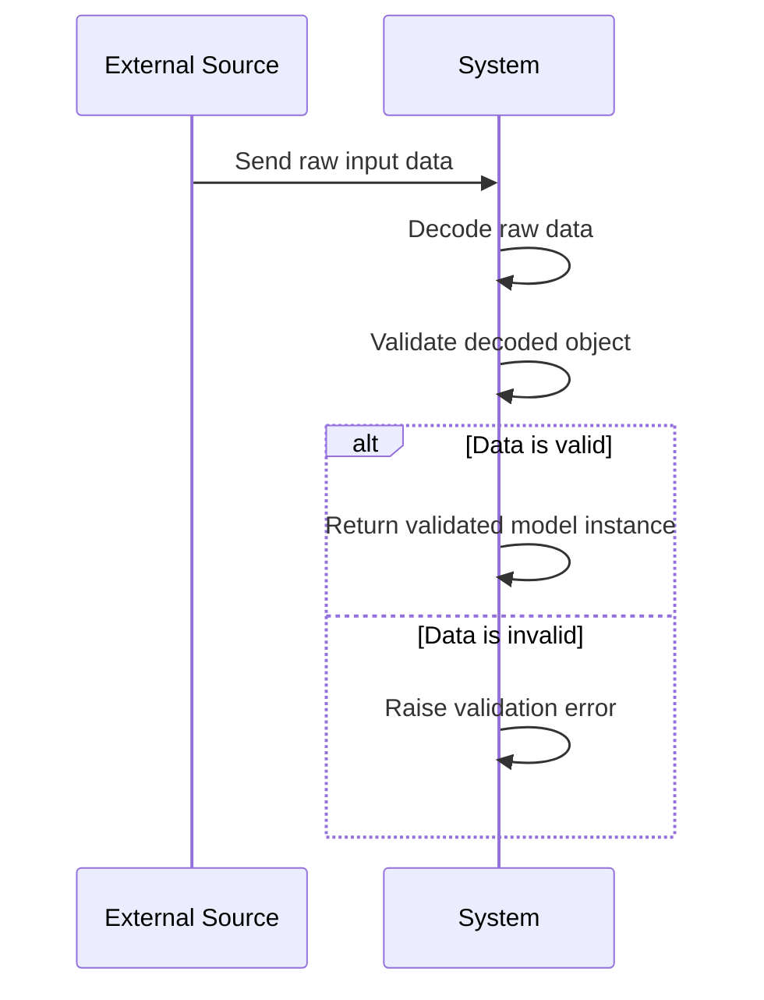
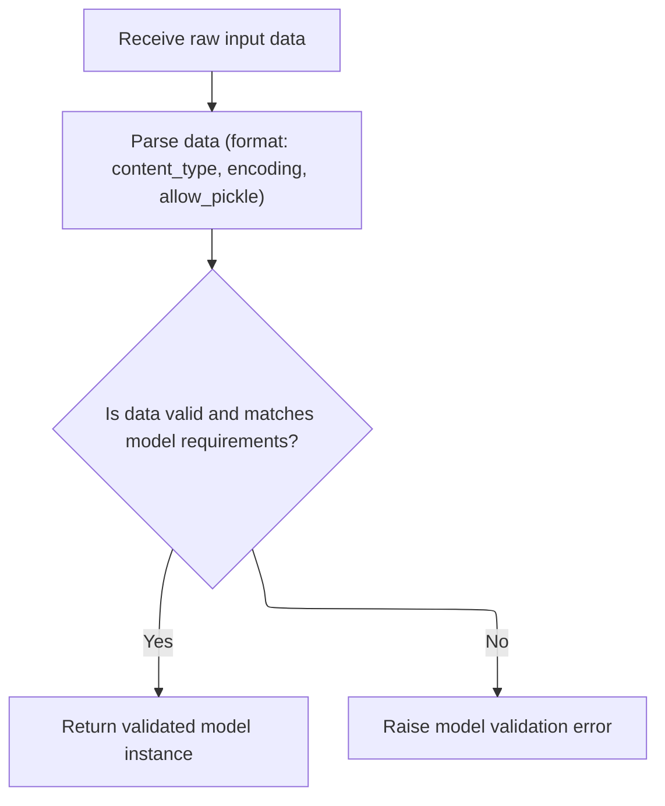
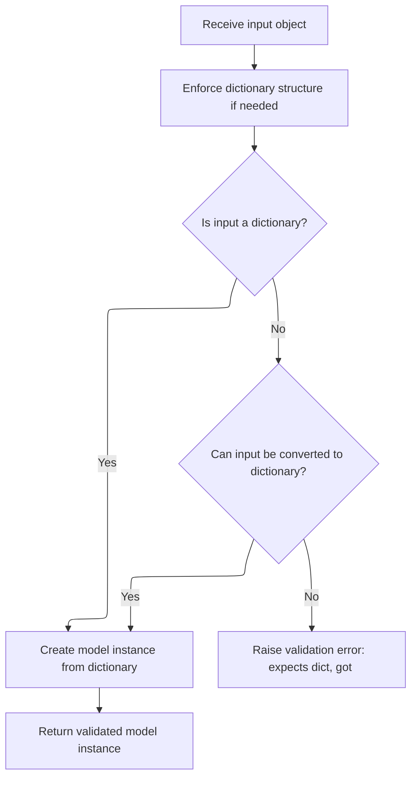
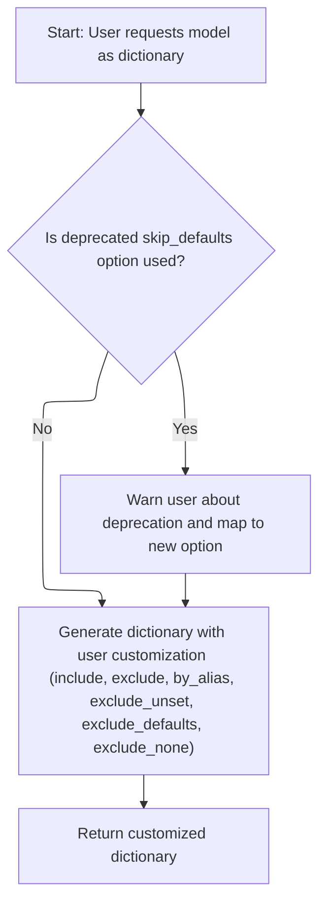
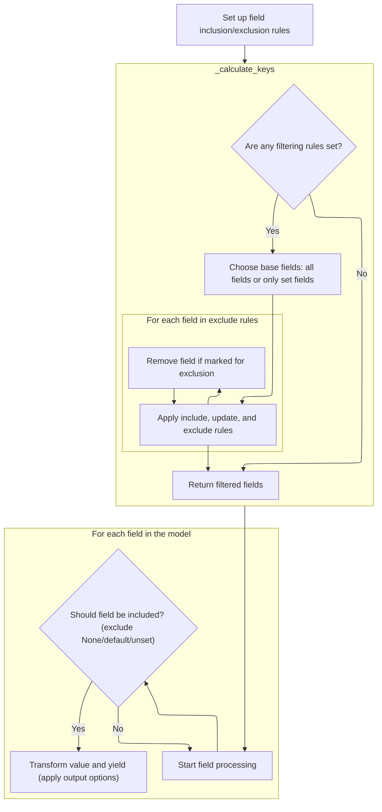
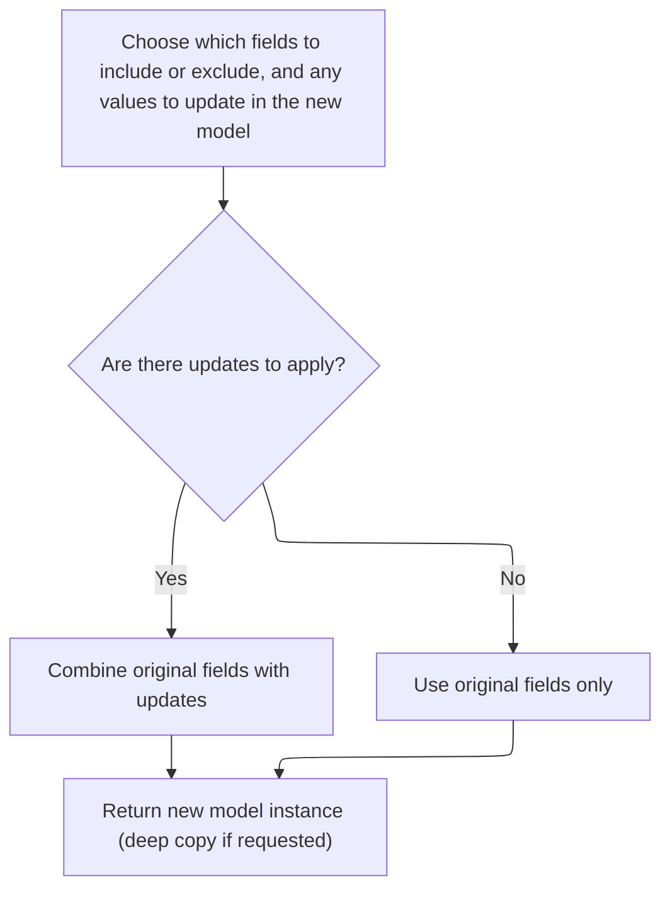
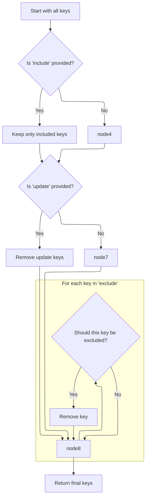
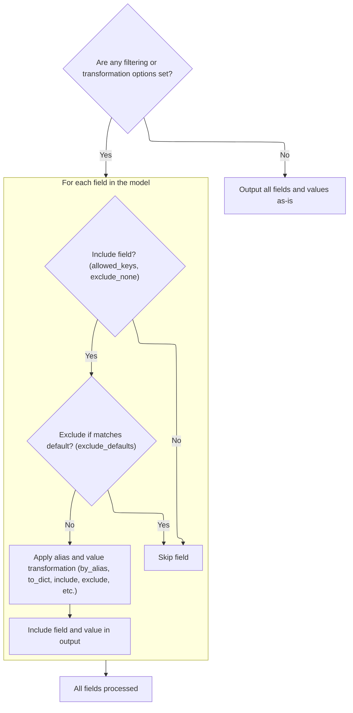

This document outlines the process of converting raw input data, such as JSON or bytes, into a validated data model instance. The flow ensures that incoming data is decoded and checked against model constraints, providing a reliable way to work with structured data.

The main steps are:

- Accept raw input data
- Decode the data into a Python object
- Validate the object against the model
- Return a validated model instance or raise a validation error



# Spec

## Detailed View of the Program's Functionality

# Parsing Input from Raw Data

This process begins when raw input data (such as a JSON string or bytes) is received. The code first attempts to decode this raw data into a Python object using a decoding function. The decoding function is chosen based on parameters like content type, encoding, and whether pickling is allowed. If decoding fails due to issues like invalid format or encoding errors, a validation error is raised, indicating the input could not be parsed.

If decoding is successful, the resulting Python object is passed to a function responsible for validating and instantiating the model. This function ensures that the data matches the model's requirements and structure. If the data is valid, a new model instance is returned; otherwise, a model validation error is raised.

# Parsing Decoded Objects into Models

Once a Python object (typically a dictionary) is available, the code checks if it is already a dictionary. If not, it attempts to convert it into one. If conversion fails, a validation error is raised, specifying that a dictionary was expected but another type was received.

If the object is a dictionary (or successfully converted), the model is instantiated using the dictionary's contents as field values. This step ensures that the input data is structured correctly for the model and that all required fields are present and valid.

# Serializing Models to Dictionaries

When a user requests a model's data as a dictionary, the code provides options to customize the output. These options include which fields to include or exclude, whether to use field aliases, and whether to omit unset, default, or None values.

If a deprecated option is used, a warning is issued and the option is mapped to its modern equivalent. The code then prepares the dictionary by iterating over the model's fields, applying all specified filters and formatting options. The result is a customized dictionary representation of the model, respecting all user-specified serialization rules.

# Iterating Over Model Fields with Filters

To generate the dictionary, the code first determines which fields should be included or excluded based on the provided options and the model's internal settings. It merges any explicit include/exclude options with the model's defaults.

A helper function is called to calculate the final set of allowed field keys, considering all filtering rules. This function decides whether to use all fields, only those that have been set, or a filtered subset based on the options.

The code then iterates over each field in the model. For each field, it checks if the field should be included (based on allowed keys and filters like <SwmToken path="pydantic/v1/main.py" pos="442:1:1" line-data="        exclude_none: bool = False,">`exclude_none`</SwmToken> or <SwmToken path="pydantic/v1/main.py" pos="441:1:1" line-data="        exclude_defaults: bool = False,">`exclude_defaults`</SwmToken>). If the field passes all checks, its value is transformed as needed (for example, converting nested models to dictionaries or applying aliases) and yielded as a key-value pair.

## Determining Which Fields to Include

The helper function for calculating allowed keys starts by picking the initial set of fields. If the option to exclude unset fields is active, it uses only the fields that have been explicitly set; otherwise, it uses all fields present in the model's data.

It then applies include and exclude rules: intersecting with the include set, subtracting any update keys (if copying/updating), and removing any keys marked for exclusion. The result is the final set of field keys to use for serialization or copying.

### Cloning and Updating Model Instances

When duplicating a model (for example, to create a modified copy), the code uses the same field iteration logic to gather the current model's data, applying any include/exclude filters. It then merges in any updates provided by the user.

After building the new set of values, the code updates the set of explicitly set fields if updates were provided. Finally, it creates a new model instance with the filtered and updated data, optionally performing a deep copy if requested.

### Filtering Keys After Copy

After collecting the initial set of keys for the new model, the code further filters them: it keeps only those in the include set (if provided), removes any keys present in the update set, and excludes any keys marked for exclusion. This ensures that the new model instance contains exactly the desired fields.

## Yielding Filtered Field-Value Pairs

During serialization or copying, the code loops through the model's fields. If no filtering or transformation options are set, it outputs all fields and values as-is for efficiency.

If any options are set, it checks each field against the allowed keys and filters (such as <SwmToken path="pydantic/v1/main.py" pos="442:1:1" line-data="        exclude_none: bool = False,">`exclude_none`</SwmToken> or <SwmToken path="pydantic/v1/main.py" pos="441:1:1" line-data="        exclude_defaults: bool = False,">`exclude_defaults`</SwmToken>). For fields that pass, it applies any necessary transformations (such as using aliases or converting nested models to dictionaries) and yields the final key-value pair.

## Serializing and Filtering Field Values

When serializing field values, the code handles several cases:

- If the value is itself a model, it either serializes it to a dictionary (applying all relevant options) or returns a filtered copy of the model.
- If the value is a dictionary, it recursively applies the same serialization and filtering logic to each key-value pair.
- If the value is a sequence (like a list or tuple), it recursively processes each element.
- If the value is an enumeration and the configuration specifies using enum values, it returns the enum's value.
- Otherwise, it returns the value as-is.

This recursive approach ensures that all nested structures are serialized and filtered according to the same rules as the top-level model.

## Yielding Final Field-Value Pairs

After processing and transforming each field's value, the code yields the final key-value pair. These pairs are collected into the output dictionary or used to construct new model instances, ensuring that all user-specified options and filters are respected throughout the process.

# Rule Definition

| Paragraph Name                                                                                                                                                                                                                                                                                                                                                                                                      | Rule ID | Category          | Description                                                                                                                                                                                                                                                                                                                                                                                                                                                                                                                                                                                                                                                                                                                                                                                                                                                                                                                                     | Conditions                                                                                                                                                                                                                                                                                                                                                                                                                                                                                                                                         | Remarks                                                                                                                                                                                                                                                                                                                                                                                                                                                                                                                                                                                                                  |
| ------------------------------------------------------------------------------------------------------------------------------------------------------------------------------------------------------------------------------------------------------------------------------------------------------------------------------------------------------------------------------------------------------------------- | ------- | ----------------- | ----------------------------------------------------------------------------------------------------------------------------------------------------------------------------------------------------------------------------------------------------------------------------------------------------------------------------------------------------------------------------------------------------------------------------------------------------------------------------------------------------------------------------------------------------------------------------------------------------------------------------------------------------------------------------------------------------------------------------------------------------------------------------------------------------------------------------------------------------------------------------------------------------------------------------------------------- | -------------------------------------------------------------------------------------------------------------------------------------------------------------------------------------------------------------------------------------------------------------------------------------------------------------------------------------------------------------------------------------------------------------------------------------------------------------------------------------------------------------------------------------------------- | ------------------------------------------------------------------------------------------------------------------------------------------------------------------------------------------------------------------------------------------------------------------------------------------------------------------------------------------------------------------------------------------------------------------------------------------------------------------------------------------------------------------------------------------------------------------------------------------------------------------------ |
| BaseModel.parse_raw, BaseModel.parse_file, <SwmToken path="pydantic/v1/main.py" pos="545:5:5" line-data="            obj = load_str_bytes(">`load_str_bytes`</SwmToken>                                                                                                                                                                                                                                             | RL-001  | Conditional Logic | The system must accept raw input data in string or bytes format, with optional parameters for <SwmToken path="pydantic/v1/main.py" pos="539:1:1" line-data="        content_type: str = None,">`content_type`</SwmToken>, encoding, proto, and <SwmToken path="pydantic/v1/main.py" pos="542:1:1" line-data="        allow_pickle: bool = False,">`allow_pickle`</SwmToken>. It must decode the input according to the <SwmToken path="pydantic/v1/main.py" pos="539:1:1" line-data="        content_type: str = None,">`content_type`</SwmToken> and other parameters.                                                                                                                                                                                                                                                                                                                                                                         | Raw input data is provided to <SwmToken path="pydantic/v1/main.py" pos="535:3:3" line-data="    def parse_raw(">`parse_raw`</SwmToken> or <SwmToken path="pydantic/v1/main.py" pos="558:3:3" line-data="    def parse_file(">`parse_file`</SwmToken>, with optional <SwmToken path="pydantic/v1/main.py" pos="539:1:1" line-data="        content_type: str = None,">`content_type`</SwmToken>, encoding, proto, and <SwmToken path="pydantic/v1/main.py" pos="542:1:1" line-data="        allow_pickle: bool = False,">`allow_pickle`</SwmToken>. | <SwmToken path="pydantic/v1/main.py" pos="539:1:1" line-data="        content_type: str = None,">`content_type`</SwmToken> can be 'application/json' (default) or 'application/pickle'. <SwmToken path="pydantic/v1/main.py" pos="542:1:1" line-data="        allow_pickle: bool = False,">`allow_pickle`</SwmToken> is a boolean. encoding is a string (default <SwmToken path="pydantic/v1/main.py" pos="540:9:9" line-data="        encoding: str = &#39;utf8&#39;,">`utf8`</SwmToken>). proto is a protocol handler object. Output is a Python object decoded from the input.                                        |
| BaseModel.parse_obj, BaseModel.\_enforce_dict_if_root                                                                                                                                                                                                                                                                                                                                                               | RL-002  | Conditional Logic | After decoding, the system must validate the resulting object against the model. If the object is a dictionary, use it directly. If it can be converted to a dictionary, convert it. Otherwise, raise a <SwmToken path="pydantic/v1/main.py" pos="531:3:3" line-data="                raise ValidationError([ErrorWrapper(exc, loc=ROOT_KEY)], cls) from e">`ValidationError`</SwmToken> indicating the expected and actual types.                                                                                                                                                                                                                                                                                                                                                                                                                                                                                                              | A decoded object is available for validation.                                                                                                                                                                                                                                                                                                                                                                                                                                                                                                      | If object is not a dict but convertible (<SwmToken path="pydantic/v1/main.py" pos="295:16:18" line-data="        # for attributes not in `new_namespace` (e.g. private attributes)">`e.g`</SwmToken>., has **iter**), convert using dict(). Otherwise, raise error. <SwmToken path="pydantic/v1/main.py" pos="531:3:3" line-data="                raise ValidationError([ErrorWrapper(exc, loc=ROOT_KEY)], cls) from e">`ValidationError`</SwmToken> includes location, message, and type.                                                                                                                               |
| <SwmToken path="pydantic/v1/main.py" pos="746:8:8" line-data="        if isinstance(v, BaseModel):">`BaseModel`</SwmToken>.**init**, <SwmToken path="pydantic/v1/main.py" pos="92:15:15" line-data="__all__ = &#39;BaseModel&#39;, &#39;create_model&#39;, &#39;validate_model&#39;">`validate_model`</SwmToken>                                                                                                    | RL-003  | Data Assignment   | The system must instantiate a model from the validated dictionary, accepting only fields defined in the model. Fields with defaults are set to their defaults if missing. Fields without defaults and not present are marked missing and trigger a validation error if required. The set of explicitly set fields is tracked.                                                                                                                                                                                                                                                                                                                                                                                                                                                                                                                                                                                                                   | Validated dictionary is available for model instantiation.                                                                                                                                                                                                                                                                                                                                                                                                                                                                                         | Fields not present but with defaults are set to default values. Fields not present and required trigger <SwmToken path="pydantic/v1/main.py" pos="531:3:3" line-data="                raise ValidationError([ErrorWrapper(exc, loc=ROOT_KEY)], cls) from e">`ValidationError`</SwmToken>. The set of explicitly set fields is tracked as <SwmToken path="pydantic/v1/main.py" pos="659:1:1" line-data="            fields_set = self.__fields_set__ \| update.keys()">`fields_set`</SwmToken>.                                                                                                                           |
| <SwmToken path="pydantic/v1/main.py" pos="383:26:28" line-data="                # - keep other values (e.g. submodels) untouched (using `BaseModel.dict()` will change them into dicts)">`BaseModel.dict`</SwmToken>, BaseModel.\_iter, BaseModel.\_calculate_keys                                                                                                                                                  | RL-004  | Computation       | The system must support serializing a model instance to a dictionary with options: include, exclude, <SwmToken path="pydantic/v1/main.py" pos="438:1:1" line-data="        by_alias: bool = False,">`by_alias`</SwmToken>, <SwmToken path="pydantic/v1/main.py" pos="440:1:1" line-data="        exclude_unset: bool = False,">`exclude_unset`</SwmToken>, <SwmToken path="pydantic/v1/main.py" pos="441:1:1" line-data="        exclude_defaults: bool = False,">`exclude_defaults`</SwmToken>, <SwmToken path="pydantic/v1/main.py" pos="442:1:1" line-data="        exclude_none: bool = False,">`exclude_none`</SwmToken>, and <SwmToken path="pydantic/v1/main.py" pos="439:1:1" line-data="        skip_defaults: Optional[bool] = None,">`skip_defaults`</SwmToken> (deprecated, mapped to <SwmToken path="pydantic/v1/main.py" pos="440:1:1" line-data="        exclude_unset: bool = False,">`exclude_unset`</SwmToken> with warning). | Model instance is being serialized to dict, with optional filtering parameters.                                                                                                                                                                                                                                                                                                                                                                                                                                                                    | include/exclude: set or mapping of field names. <SwmToken path="pydantic/v1/main.py" pos="438:1:1" line-data="        by_alias: bool = False,">`by_alias`</SwmToken>: boolean. exclude_unset/exclude_defaults/exclude_none: booleans. <SwmToken path="pydantic/v1/main.py" pos="439:1:1" line-data="        skip_defaults: Optional[bool] = None,">`skip_defaults`</SwmToken> triggers deprecation warning and is mapped to <SwmToken path="pydantic/v1/main.py" pos="440:1:1" line-data="        exclude_unset: bool = False,">`exclude_unset`</SwmToken>. Output is a dictionary with keys/values per filtering rules. |
| BaseModel.copy, BaseModel.\_copy_and_set_values                                                                                                                                                                                                                                                                                                                                                                     | RL-005  | Computation       | The system must support copying a model instance with options: include, exclude, update, deep. The copy must update the set of explicitly set fields to include any keys from update.                                                                                                                                                                                                                                                                                                                                                                                                                                                                                                                                                                                                                                                                                                                                                           | Model instance is being copied, with optional include/exclude/update/deep parameters.                                                                                                                                                                                                                                                                                                                                                                                                                                                              | include/exclude: set or mapping of field names. update: dict of field values to override. deep: boolean for deep copy. The set of explicitly set fields is updated to include update keys.                                                                                                                                                                                                                                                                                                                                                                                                                               |
| BaseModel.\_get_value, <SwmToken path="pydantic/v1/main.py" pos="383:26:28" line-data="                # - keep other values (e.g. submodels) untouched (using `BaseModel.dict()` will change them into dicts)">`BaseModel.dict`</SwmToken>, BaseModel.copy                                                                                                                                                         | RL-006  | Computation       | The system must support nested models, sequences, dictionaries, and enums during serialization and copying. Nested models are serialized recursively. For enums, if <SwmToken path="pydantic/v1/main.py" pos="801:21:21" line-data="        elif isinstance(v, Enum) and getattr(cls.Config, &#39;use_enum_values&#39;, False):">`use_enum_values`</SwmToken> is enabled, output the enum's value; otherwise, output the enum object.                                                                                                                                                                                                                                                                                                                                                                                                                                                                                                           | Model contains nested models, sequences, dictionaries, or enums.                                                                                                                                                                                                                                                                                                                                                                                                                                                                                   | For nested models, recursively apply serialization/copying rules. For enums, use value if <SwmToken path="pydantic/v1/main.py" pos="801:21:21" line-data="        elif isinstance(v, Enum) and getattr(cls.Config, &#39;use_enum_values&#39;, False):">`use_enum_values`</SwmToken> is True. For sequences/dicts, recursively apply rules to elements/items.                                                                                                                                                                                                                                                             |
| <SwmToken path="pydantic/v1/main.py" pos="383:26:28" line-data="                # - keep other values (e.g. submodels) untouched (using `BaseModel.dict()` will change them into dicts)">`BaseModel.dict`</SwmToken>, BaseModel.\_iter, <SwmToken path="pydantic/v1/main.py" pos="92:15:15" line-data="__all__ = &#39;BaseModel&#39;, &#39;create_model&#39;, &#39;validate_model&#39;">`validate_model`</SwmToken> | RL-007  | Conditional Logic | The system must support field aliases, default values, and required fields. If <SwmToken path="pydantic/v1/main.py" pos="438:1:1" line-data="        by_alias: bool = False,">`by_alias`</SwmToken> is True, output keys use field aliases. Fields with default values are included/excluded based on <SwmToken path="pydantic/v1/main.py" pos="441:1:1" line-data="        exclude_defaults: bool = False,">`exclude_defaults`</SwmToken>. Fields not explicitly set are included/excluded based on <SwmToken path="pydantic/v1/main.py" pos="440:1:1" line-data="        exclude_unset: bool = False,">`exclude_unset`</SwmToken>.                                                                                                                                                                                                                                                                                                            | Serialization is requested with <SwmToken path="pydantic/v1/main.py" pos="438:1:1" line-data="        by_alias: bool = False,">`by_alias`</SwmToken>, <SwmToken path="pydantic/v1/main.py" pos="441:1:1" line-data="        exclude_defaults: bool = False,">`exclude_defaults`</SwmToken>, or <SwmToken path="pydantic/v1/main.py" pos="440:1:1" line-data="        exclude_unset: bool = False,">`exclude_unset`</SwmToken> options.                                                                                                             | <SwmToken path="pydantic/v1/main.py" pos="438:1:1" line-data="        by_alias: bool = False,">`by_alias`</SwmToken>: boolean. exclude_defaults/exclude_unset: booleans. Output keys use aliases if <SwmToken path="pydantic/v1/main.py" pos="438:1:1" line-data="        by_alias: bool = False,">`by_alias`</SwmToken> is True. Fields with default values or not explicitly set are included/excluded per options.                                                                                                                                                                                                    |
| <SwmToken path="pydantic/v1/main.py" pos="531:3:3" line-data="                raise ValidationError([ErrorWrapper(exc, loc=ROOT_KEY)], cls) from e">`ValidationError`</SwmToken>, <SwmToken path="pydantic/v1/main.py" pos="92:15:15" line-data="__all__ = &#39;BaseModel&#39;, &#39;create_model&#39;, &#39;validate_model&#39;">`validate_model`</SwmToken>, BaseModel.parse_raw, BaseModel.parse_obj             | RL-008  | Conditional Logic | When validation fails, the system must raise a <SwmToken path="pydantic/v1/main.py" pos="531:3:3" line-data="                raise ValidationError([ErrorWrapper(exc, loc=ROOT_KEY)], cls) from e">`ValidationError`</SwmToken> containing a list of errors. Each error includes the location (field name or root), error message, and error type.                                                                                                                                                                                                                                                                                                                                                                                                                                                                                                                                                                                              | Validation fails during parsing or model instantiation.                                                                                                                                                                                                                                                                                                                                                                                                                                                                                            | <SwmToken path="pydantic/v1/main.py" pos="531:3:3" line-data="                raise ValidationError([ErrorWrapper(exc, loc=ROOT_KEY)], cls) from e">`ValidationError`</SwmToken> contains a list of errors, each with location, message, and type. Location is field name or root. Message is a string. Type is a string or class indicating error type.                                                                                                                                                                                                                                                                 |
| <SwmToken path="pydantic/v1/main.py" pos="383:26:28" line-data="                # - keep other values (e.g. submodels) untouched (using `BaseModel.dict()` will change them into dicts)">`BaseModel.dict`</SwmToken>, BaseModel.\_iter, <SwmToken path="pydantic/v1/main.py" pos="762:5:5" line-data="        value_exclude = ValueItems(v, exclude) if exclude else None">`ValueItems`</SwmToken>                  | RL-009  | Conditional Logic | The system must allow field inclusion and exclusion rules to be specified per field, including for nested fields, using mappings.                                                                                                                                                                                                                                                                                                                                                                                                                                                                                                                                                                                                                                                                                                                                                                                                               | Serialization or copying is requested with include/exclude mappings.                                                                                                                                                                                                                                                                                                                                                                                                                                                                               | include/exclude can be mappings for nested fields. Rules are applied recursively for nested structures.                                                                                                                                                                                                                                                                                                                                                                                                                                                                                                                  |
| <SwmToken path="pydantic/v1/main.py" pos="746:8:8" line-data="        if isinstance(v, BaseModel):">`BaseModel`</SwmToken>, <SwmToken path="pydantic/v1/main.py" pos="36:1:1" line-data="    ModelField,">`ModelField`</SwmToken>, <SwmToken path="pydantic/v1/main.py" pos="92:15:15" line-data="__all__ = &#39;BaseModel&#39;, &#39;create_model&#39;, &#39;validate_model&#39;">`validate_model`</SwmToken>      | RL-010  | Conditional Logic | The system must support only the following core field types: dictionaries, lists, enums, and basic types (int, str, float, bool).                                                                                                                                                                                                                                                                                                                                                                                                                                                                                                                                                                                                                                                                                                                                                                                                               | Field type is being processed for validation or serialization.                                                                                                                                                                                                                                                                                                                                                                                                                                                                                     | Supported types: dict, list, Enum, int, str, float, bool. Other types are not required to be supported.                                                                                                                                                                                                                                                                                                                                                                                                                                                                                                                  |
| <SwmToken path="pydantic/v1/main.py" pos="746:8:8" line-data="        if isinstance(v, BaseModel):">`BaseModel`</SwmToken>, <SwmToken path="pydantic/v1/main.py" pos="36:1:1" line-data="    ModelField,">`ModelField`</SwmToken>, <SwmToken path="pydantic/v1/main.py" pos="92:15:15" line-data="__all__ = &#39;BaseModel&#39;, &#39;create_model&#39;, &#39;validate_model&#39;">`validate_model`</SwmToken>      | RL-011  | Conditional Logic | The system must not require implementation of custom validators or field constraints beyond type and structure checking. No support is required for field types or behaviors not described in the spec.                                                                                                                                                                                                                                                                                                                                                                                                                                                                                                                                                                                                                                                                                                                                         | Custom validators or unsupported field types/behaviors are encountered.                                                                                                                                                                                                                                                                                                                                                                                                                                                                            | Only type and structure checking is required. No custom validators or extra field constraints are required.                                                                                                                                                                                                                                                                                                                                                                                                                                                                                                              |

# User Stories

## User Story 1: Parsing and decoding raw input data

---

### Story Description:

As a system, I want to accept and decode raw input data in various formats (string, bytes, JSON, pickle, custom proto) with flexible parameters so that users can easily provide data in their preferred format and have it validated and converted to Python objects.

---

### Business Rule Mapping:

| Rule ID | Paragraph Name                                                                                                                                                          | Rule Description                                                                                                                                                                                                                                                                                                                                                                                                                                                                                                                                                        |
| ------- | ----------------------------------------------------------------------------------------------------------------------------------------------------------------------- | ----------------------------------------------------------------------------------------------------------------------------------------------------------------------------------------------------------------------------------------------------------------------------------------------------------------------------------------------------------------------------------------------------------------------------------------------------------------------------------------------------------------------------------------------------------------------- |
| RL-001  | BaseModel.parse_raw, BaseModel.parse_file, <SwmToken path="pydantic/v1/main.py" pos="545:5:5" line-data="            obj = load_str_bytes(">`load_str_bytes`</SwmToken> | The system must accept raw input data in string or bytes format, with optional parameters for <SwmToken path="pydantic/v1/main.py" pos="539:1:1" line-data="        content_type: str = None,">`content_type`</SwmToken>, encoding, proto, and <SwmToken path="pydantic/v1/main.py" pos="542:1:1" line-data="        allow_pickle: bool = False,">`allow_pickle`</SwmToken>. It must decode the input according to the <SwmToken path="pydantic/v1/main.py" pos="539:1:1" line-data="        content_type: str = None,">`content_type`</SwmToken> and other parameters. |
| RL-002  | BaseModel.parse_obj, BaseModel.\_enforce_dict_if_root                                                                                                                   | After decoding, the system must validate the resulting object against the model. If the object is a dictionary, use it directly. If it can be converted to a dictionary, convert it. Otherwise, raise a <SwmToken path="pydantic/v1/main.py" pos="531:3:3" line-data="                raise ValidationError([ErrorWrapper(exc, loc=ROOT_KEY)], cls) from e">`ValidationError`</SwmToken> indicating the expected and actual types.                                                                                                                                      |

---

### Relevant Functionality:

- **BaseModel.parse_raw**
  1. **RL-001:**
     - Receive input data (string or bytes) and optional parameters.
     - If proto is provided, use proto to decode.
     - Else if <SwmToken path="pydantic/v1/main.py" pos="539:1:1" line-data="        content_type: str = None,">`content_type`</SwmToken> is 'application/pickle' and <SwmToken path="pydantic/v1/main.py" pos="542:1:1" line-data="        allow_pickle: bool = False,">`allow_pickle`</SwmToken> is True, decode as pickle.
     - Else if <SwmToken path="pydantic/v1/main.py" pos="539:1:1" line-data="        content_type: str = None,">`content_type`</SwmToken> is not specified or is 'application/json', decode as JSON using encoding.
     - If decoding fails, raise <SwmToken path="pydantic/v1/main.py" pos="531:3:3" line-data="                raise ValidationError([ErrorWrapper(exc, loc=ROOT_KEY)], cls) from e">`ValidationError`</SwmToken> with error details.
- **BaseModel.parse_obj**
  1. **RL-002:**
     - If object is a dict, use as-is.
     - Else, try to convert to dict.
     - If conversion fails, raise <SwmToken path="pydantic/v1/main.py" pos="531:3:3" line-data="                raise ValidationError([ErrorWrapper(exc, loc=ROOT_KEY)], cls) from e">`ValidationError`</SwmToken> with expected/actual type info.

## User Story 2: Model instantiation, validation, and error reporting with field defaults and tracking

---

### Story Description:

As a system, I want to instantiate models from validated data, applying field defaults, enforcing required fields, tracking which fields were explicitly set, and providing detailed error reporting (including location, message, and type) when validation fails, so that model instances are always valid, users can distinguish between provided and defaulted values, and issues in input data are easy to identify and fix.

---

### Business Rule Mapping:

| Rule ID | Paragraph Name                                                                                                                                                                                                                                                                                                                                                                                                      | Rule Description                                                                                                                                                                                                                                                                                                                                                                                                                                                                                                                                                                                                                     |
| ------- | ------------------------------------------------------------------------------------------------------------------------------------------------------------------------------------------------------------------------------------------------------------------------------------------------------------------------------------------------------------------------------------------------------------------- | ------------------------------------------------------------------------------------------------------------------------------------------------------------------------------------------------------------------------------------------------------------------------------------------------------------------------------------------------------------------------------------------------------------------------------------------------------------------------------------------------------------------------------------------------------------------------------------------------------------------------------------ |
| RL-003  | <SwmToken path="pydantic/v1/main.py" pos="746:8:8" line-data="        if isinstance(v, BaseModel):">`BaseModel`</SwmToken>.**init**, <SwmToken path="pydantic/v1/main.py" pos="92:15:15" line-data="__all__ = &#39;BaseModel&#39;, &#39;create_model&#39;, &#39;validate_model&#39;">`validate_model`</SwmToken>                                                                                                    | The system must instantiate a model from the validated dictionary, accepting only fields defined in the model. Fields with defaults are set to their defaults if missing. Fields without defaults and not present are marked missing and trigger a validation error if required. The set of explicitly set fields is tracked.                                                                                                                                                                                                                                                                                                        |
| RL-007  | <SwmToken path="pydantic/v1/main.py" pos="383:26:28" line-data="                # - keep other values (e.g. submodels) untouched (using `BaseModel.dict()` will change them into dicts)">`BaseModel.dict`</SwmToken>, BaseModel.\_iter, <SwmToken path="pydantic/v1/main.py" pos="92:15:15" line-data="__all__ = &#39;BaseModel&#39;, &#39;create_model&#39;, &#39;validate_model&#39;">`validate_model`</SwmToken> | The system must support field aliases, default values, and required fields. If <SwmToken path="pydantic/v1/main.py" pos="438:1:1" line-data="        by_alias: bool = False,">`by_alias`</SwmToken> is True, output keys use field aliases. Fields with default values are included/excluded based on <SwmToken path="pydantic/v1/main.py" pos="441:1:1" line-data="        exclude_defaults: bool = False,">`exclude_defaults`</SwmToken>. Fields not explicitly set are included/excluded based on <SwmToken path="pydantic/v1/main.py" pos="440:1:1" line-data="        exclude_unset: bool = False,">`exclude_unset`</SwmToken>. |
| RL-008  | <SwmToken path="pydantic/v1/main.py" pos="531:3:3" line-data="                raise ValidationError([ErrorWrapper(exc, loc=ROOT_KEY)], cls) from e">`ValidationError`</SwmToken>, <SwmToken path="pydantic/v1/main.py" pos="92:15:15" line-data="__all__ = &#39;BaseModel&#39;, &#39;create_model&#39;, &#39;validate_model&#39;">`validate_model`</SwmToken>, BaseModel.parse_raw, BaseModel.parse_obj             | When validation fails, the system must raise a <SwmToken path="pydantic/v1/main.py" pos="531:3:3" line-data="                raise ValidationError([ErrorWrapper(exc, loc=ROOT_KEY)], cls) from e">`ValidationError`</SwmToken> containing a list of errors. Each error includes the location (field name or root), error message, and error type.                                                                                                                                                                                                                                                                                   |

---

### Relevant Functionality:

- **BaseModel.init**
  1. **RL-003:**
     - For each model field:
       - If present in input, use value and add to <SwmToken path="pydantic/v1/main.py" pos="659:1:1" line-data="            fields_set = self.__fields_set__ | update.keys()">`fields_set`</SwmToken>.
       - If missing and has default, set to default.
       - If missing and required, add error.
     - Track explicitly set fields.
     - If errors, raise <SwmToken path="pydantic/v1/main.py" pos="531:3:3" line-data="                raise ValidationError([ErrorWrapper(exc, loc=ROOT_KEY)], cls) from e">`ValidationError`</SwmToken>.
- <SwmToken path="pydantic/v1/main.py" pos="383:26:28" line-data="                # - keep other values (e.g. submodels) untouched (using `BaseModel.dict()` will change them into dicts)">`BaseModel.dict`</SwmToken>
  1. **RL-007:**
     - If <SwmToken path="pydantic/v1/main.py" pos="438:1:1" line-data="        by_alias: bool = False,">`by_alias`</SwmToken> is True, use field aliases as keys.
     - If <SwmToken path="pydantic/v1/main.py" pos="441:1:1" line-data="        exclude_defaults: bool = False,">`exclude_defaults`</SwmToken> is True, exclude fields with value equal to default.
     - If <SwmToken path="pydantic/v1/main.py" pos="440:1:1" line-data="        exclude_unset: bool = False,">`exclude_unset`</SwmToken> is True, include only explicitly set fields.
- <SwmToken path="pydantic/v1/main.py" pos="531:3:3" line-data="                raise ValidationError([ErrorWrapper(exc, loc=ROOT_KEY)], cls) from e">`ValidationError`</SwmToken>
  1. **RL-008:**
     - On validation failure, collect errors with location, message, and type.
     - Raise <SwmToken path="pydantic/v1/main.py" pos="531:3:3" line-data="                raise ValidationError([ErrorWrapper(exc, loc=ROOT_KEY)], cls) from e">`ValidationError`</SwmToken> with error list.

## User Story 3: Flexible serialization and copying with filtering and recursion

---

### Story Description:

As a user, I want to serialize and copy model instances with flexible options for including/excluding fields, using aliases, handling unset/default/None values, and supporting nested models, sequences, dictionaries, and enums, so that I can control the output and duplication of my data structures for various use cases.

---

### Business Rule Mapping:

| Rule ID | Paragraph Name                                                                                                                                                                                                                                                                                                                                                                                     | Rule Description                                                                                                                                                                                                                                                                                                                                                                                                                                                                                                                                                                                                                                                                                                                                                                                                                                                                                                                                |
| ------- | -------------------------------------------------------------------------------------------------------------------------------------------------------------------------------------------------------------------------------------------------------------------------------------------------------------------------------------------------------------------------------------------------- | ----------------------------------------------------------------------------------------------------------------------------------------------------------------------------------------------------------------------------------------------------------------------------------------------------------------------------------------------------------------------------------------------------------------------------------------------------------------------------------------------------------------------------------------------------------------------------------------------------------------------------------------------------------------------------------------------------------------------------------------------------------------------------------------------------------------------------------------------------------------------------------------------------------------------------------------------- |
| RL-004  | <SwmToken path="pydantic/v1/main.py" pos="383:26:28" line-data="                # - keep other values (e.g. submodels) untouched (using `BaseModel.dict()` will change them into dicts)">`BaseModel.dict`</SwmToken>, BaseModel.\_iter, BaseModel.\_calculate_keys                                                                                                                                 | The system must support serializing a model instance to a dictionary with options: include, exclude, <SwmToken path="pydantic/v1/main.py" pos="438:1:1" line-data="        by_alias: bool = False,">`by_alias`</SwmToken>, <SwmToken path="pydantic/v1/main.py" pos="440:1:1" line-data="        exclude_unset: bool = False,">`exclude_unset`</SwmToken>, <SwmToken path="pydantic/v1/main.py" pos="441:1:1" line-data="        exclude_defaults: bool = False,">`exclude_defaults`</SwmToken>, <SwmToken path="pydantic/v1/main.py" pos="442:1:1" line-data="        exclude_none: bool = False,">`exclude_none`</SwmToken>, and <SwmToken path="pydantic/v1/main.py" pos="439:1:1" line-data="        skip_defaults: Optional[bool] = None,">`skip_defaults`</SwmToken> (deprecated, mapped to <SwmToken path="pydantic/v1/main.py" pos="440:1:1" line-data="        exclude_unset: bool = False,">`exclude_unset`</SwmToken> with warning). |
| RL-009  | <SwmToken path="pydantic/v1/main.py" pos="383:26:28" line-data="                # - keep other values (e.g. submodels) untouched (using `BaseModel.dict()` will change them into dicts)">`BaseModel.dict`</SwmToken>, BaseModel.\_iter, <SwmToken path="pydantic/v1/main.py" pos="762:5:5" line-data="        value_exclude = ValueItems(v, exclude) if exclude else None">`ValueItems`</SwmToken> | The system must allow field inclusion and exclusion rules to be specified per field, including for nested fields, using mappings.                                                                                                                                                                                                                                                                                                                                                                                                                                                                                                                                                                                                                                                                                                                                                                                                               |
| RL-005  | BaseModel.copy, BaseModel.\_copy_and_set_values                                                                                                                                                                                                                                                                                                                                                    | The system must support copying a model instance with options: include, exclude, update, deep. The copy must update the set of explicitly set fields to include any keys from update.                                                                                                                                                                                                                                                                                                                                                                                                                                                                                                                                                                                                                                                                                                                                                           |
| RL-006  | BaseModel.\_get_value, <SwmToken path="pydantic/v1/main.py" pos="383:26:28" line-data="                # - keep other values (e.g. submodels) untouched (using `BaseModel.dict()` will change them into dicts)">`BaseModel.dict`</SwmToken>, BaseModel.copy                                                                                                                                        | The system must support nested models, sequences, dictionaries, and enums during serialization and copying. Nested models are serialized recursively. For enums, if <SwmToken path="pydantic/v1/main.py" pos="801:21:21" line-data="        elif isinstance(v, Enum) and getattr(cls.Config, &#39;use_enum_values&#39;, False):">`use_enum_values`</SwmToken> is enabled, output the enum's value; otherwise, output the enum object.                                                                                                                                                                                                                                                                                                                                                                                                                                                                                                           |

---

### Relevant Functionality:

- <SwmToken path="pydantic/v1/main.py" pos="383:26:28" line-data="                # - keep other values (e.g. submodels) untouched (using `BaseModel.dict()` will change them into dicts)">`BaseModel.dict`</SwmToken>
  1. **RL-004:**
     - Start with all model fields.
     - If include is provided, intersect with include.
     - If exclude is provided, remove excluded fields.
     - If <SwmToken path="pydantic/v1/main.py" pos="442:1:1" line-data="        exclude_none: bool = False,">`exclude_none`</SwmToken> is True, remove fields with value None.
     - If <SwmToken path="pydantic/v1/main.py" pos="441:1:1" line-data="        exclude_defaults: bool = False,">`exclude_defaults`</SwmToken> is True, remove fields with value equal to default.
     - If <SwmToken path="pydantic/v1/main.py" pos="440:1:1" line-data="        exclude_unset: bool = False,">`exclude_unset`</SwmToken> is True, include only explicitly set fields.
     - If <SwmToken path="pydantic/v1/main.py" pos="438:1:1" line-data="        by_alias: bool = False,">`by_alias`</SwmToken> is True, use field aliases as keys.
     - Return resulting dictionary.
  2. **RL-009:**
     - If include/exclude is a mapping, apply rules per field.
     - For nested fields, apply mapping recursively during serialization/copying.
- **BaseModel.copy**
  1. **RL-005:**
     - Gather values from model, applying include/exclude.
     - Apply updates from update dict.
     - If deep is True, deepcopy values.
     - Update <SwmToken path="pydantic/v1/main.py" pos="659:1:1" line-data="            fields_set = self.__fields_set__ | update.keys()">`fields_set`</SwmToken> to include update keys.
     - Return new model instance with copied values and updated <SwmToken path="pydantic/v1/main.py" pos="659:1:1" line-data="            fields_set = self.__fields_set__ | update.keys()">`fields_set`</SwmToken>.
- **BaseModel.\_get_value**
  1. **RL-006:**
     - If value is <SwmToken path="pydantic/v1/main.py" pos="746:8:8" line-data="        if isinstance(v, BaseModel):">`BaseModel`</SwmToken>, serialize/copy recursively.
     - If value is dict, recursively apply rules to each key-value pair.
     - If value is sequence, recursively apply rules to each element.
     - If value is Enum and <SwmToken path="pydantic/v1/main.py" pos="801:21:21" line-data="        elif isinstance(v, Enum) and getattr(cls.Config, &#39;use_enum_values&#39;, False):">`use_enum_values`</SwmToken> is True, output value; else output Enum object.

## User Story 4: Support for core field types and exclusion of unsupported/custom behaviors

---

### Story Description:

As a user, I want the system to support only the documented core field types (dict, list, enum, int, str, float, bool) and not require custom validators or constraints, so that the system remains simple, predictable, and focused on type and structure checking.

---

### Business Rule Mapping:

| Rule ID | Paragraph Name                                                                                                                                                                                                                                                                                                                                                                                                 | Rule Description                                                                                                                                                                                        |
| ------- | -------------------------------------------------------------------------------------------------------------------------------------------------------------------------------------------------------------------------------------------------------------------------------------------------------------------------------------------------------------------------------------------------------------- | ------------------------------------------------------------------------------------------------------------------------------------------------------------------------------------------------------- |
| RL-010  | <SwmToken path="pydantic/v1/main.py" pos="746:8:8" line-data="        if isinstance(v, BaseModel):">`BaseModel`</SwmToken>, <SwmToken path="pydantic/v1/main.py" pos="36:1:1" line-data="    ModelField,">`ModelField`</SwmToken>, <SwmToken path="pydantic/v1/main.py" pos="92:15:15" line-data="__all__ = &#39;BaseModel&#39;, &#39;create_model&#39;, &#39;validate_model&#39;">`validate_model`</SwmToken> | The system must support only the following core field types: dictionaries, lists, enums, and basic types (int, str, float, bool).                                                                       |
| RL-011  | <SwmToken path="pydantic/v1/main.py" pos="746:8:8" line-data="        if isinstance(v, BaseModel):">`BaseModel`</SwmToken>, <SwmToken path="pydantic/v1/main.py" pos="36:1:1" line-data="    ModelField,">`ModelField`</SwmToken>, <SwmToken path="pydantic/v1/main.py" pos="92:15:15" line-data="__all__ = &#39;BaseModel&#39;, &#39;create_model&#39;, &#39;validate_model&#39;">`validate_model`</SwmToken> | The system must not require implementation of custom validators or field constraints beyond type and structure checking. No support is required for field types or behaviors not described in the spec. |

---

### Relevant Functionality:

- <SwmToken path="pydantic/v1/main.py" pos="746:8:8" line-data="        if isinstance(v, BaseModel):">`BaseModel`</SwmToken>
  1. **RL-010:**
     - When processing fields, accept only supported types.
     - For unsupported types, raise error or skip processing.
  2. **RL-011:**
     - Ignore or skip custom validators or unsupported field types/behaviors.
     - Only perform type and structure validation as described.

# Code Walkthrough

## Parsing Input from Raw Data



<SwmSnippet path="/pydantic/v1/main.py" line="535">

---

Parse_raw kicks off the flow by decoding raw input (like JSON or bytes) into a Python object using <SwmToken path="pydantic/v1/main.py" pos="545:5:5" line-data="            obj = load_str_bytes(">`load_str_bytes`</SwmToken>. If decoding fails, it raises a <SwmToken path="pydantic/v1/main.py" pos="554:3:3" line-data="            raise ValidationError([ErrorWrapper(e, loc=ROOT_KEY)], cls)">`ValidationError`</SwmToken>. Once it has a decoded object, it passes it to <SwmToken path="pydantic/v1/main.py" pos="555:5:5" line-data="        return cls.parse_obj(obj)">`parse_obj`</SwmToken>, which is responsible for validating and instantiating the model. <SwmToken path="pydantic/v1/main.py" pos="555:5:5" line-data="        return cls.parse_obj(obj)">`parse_obj`</SwmToken> is needed next because <SwmToken path="pydantic/v1/main.py" pos="535:3:3" line-data="    def parse_raw(">`parse_raw`</SwmToken> doesn't handle model instantiation or validation itself.

```python
    def parse_raw(
        cls: Type['Model'],
        b: StrBytes,
        *,
        content_type: str = None,
        encoding: str = 'utf8',
        proto: Protocol = None,
        allow_pickle: bool = False,
    ) -> 'Model':
        try:
            obj = load_str_bytes(
                b,
                proto=proto,
                content_type=content_type,
                encoding=encoding,
                allow_pickle=allow_pickle,
                json_loads=cls.__config__.json_loads,
            )
        except (ValueError, TypeError, UnicodeDecodeError) as e:
            raise ValidationError([ErrorWrapper(e, loc=ROOT_KEY)], cls)
        return cls.parse_obj(obj)
```

---

</SwmSnippet>

## Parsing Decoded Objects into Models



<SwmSnippet path="/pydantic/v1/main.py" line="524">

---

Parse_obj ensures the input is a dict (converting if needed), then creates the model instance from it.

```python
    def parse_obj(cls: Type['Model'], obj: Any) -> 'Model':
        obj = cls._enforce_dict_if_root(obj)
        if not isinstance(obj, dict):
            try:
                obj = dict(obj)
            except (TypeError, ValueError) as e:
                exc = TypeError(f'{cls.__name__} expected dict not {obj.__class__.__name__}')
                raise ValidationError([ErrorWrapper(exc, loc=ROOT_KEY)], cls) from e
        return cls(**obj)
```

---

</SwmSnippet>

## Serializing Models to Dictionaries



<SwmSnippet path="/pydantic/v1/main.py" line="433">

---

Dict prepares the model for serialization by calling \_iter with all the filtering and formatting options. \_iter handles the logic for which fields to include, exclude, and how to represent them. We need \_iter here because just dumping self.**dict** wouldn't respect all these options.

```python
    def dict(
        self,
        *,
        include: Optional[Union['AbstractSetIntStr', 'MappingIntStrAny']] = None,
        exclude: Optional[Union['AbstractSetIntStr', 'MappingIntStrAny']] = None,
        by_alias: bool = False,
        skip_defaults: Optional[bool] = None,
        exclude_unset: bool = False,
        exclude_defaults: bool = False,
        exclude_none: bool = False,
    ) -> 'DictStrAny':
        """
        Generate a dictionary representation of the model, optionally specifying which fields to include or exclude.

        """
        if skip_defaults is not None:
            warnings.warn(
                f'{self.__class__.__name__}.dict(): "skip_defaults" is deprecated and replaced by "exclude_unset"',
                DeprecationWarning,
            )
            exclude_unset = skip_defaults

        return dict(
            self._iter(
                to_dict=True,
                by_alias=by_alias,
                include=include,
                exclude=exclude,
                exclude_unset=exclude_unset,
                exclude_defaults=exclude_defaults,
                exclude_none=exclude_none,
            )
        )
```

---

</SwmSnippet>

## Iterating Over Model Fields with Filters



<SwmSnippet path="/pydantic/v1/main.py" line="828">

---

In \_iter, we merge any include/exclude options with the model's internal field sets, then call <SwmToken path="pydantic/v1/main.py" pos="846:7:7" line-data="        allowed_keys = self._calculate_keys(">`_calculate_keys`</SwmToken> to figure out which fields should actually be included. <SwmToken path="pydantic/v1/main.py" pos="846:7:7" line-data="        allowed_keys = self._calculate_keys(">`_calculate_keys`</SwmToken> is needed next to get the final set of allowed keys for iteration.

```python
    def _iter(
        self,
        to_dict: bool = False,
        by_alias: bool = False,
        include: Optional[Union['AbstractSetIntStr', 'MappingIntStrAny']] = None,
        exclude: Optional[Union['AbstractSetIntStr', 'MappingIntStrAny']] = None,
        exclude_unset: bool = False,
        exclude_defaults: bool = False,
        exclude_none: bool = False,
    ) -> 'TupleGenerator':
        # Merge field set excludes with explicit exclude parameter with explicit overriding field set options.
        # The extra "is not None" guards are not logically necessary but optimizes performance for the simple case.
        if exclude is not None or self.__exclude_fields__ is not None:
            exclude = ValueItems.merge(self.__exclude_fields__, exclude)

        if include is not None or self.__include_fields__ is not None:
            include = ValueItems.merge(self.__include_fields__, include, intersect=True)

        allowed_keys = self._calculate_keys(
            include=include, exclude=exclude, exclude_unset=exclude_unset  # type: ignore
        )
```

---

</SwmSnippet>

### Determining Which Fields to Include

<SwmSnippet path="/pydantic/v1/main.py" line="884">

---

<SwmToken path="pydantic/v1/main.py" pos="884:3:3" line-data="    def _calculate_keys(">`_calculate_keys`</SwmToken> picks the initial field set based on <SwmToken path="pydantic/v1/main.py" pos="888:1:1" line-data="        exclude_unset: bool,">`exclude_unset`</SwmToken>, copying <SwmToken path="pydantic/v1/main.py" pos="659:1:1" line-data="            fields_set = self.__fields_set__ | update.keys()">`fields_set`</SwmToken> if needed.

```python
    def _calculate_keys(
        self,
        include: Optional['MappingIntStrAny'],
        exclude: Optional['MappingIntStrAny'],
        exclude_unset: bool,
        update: Optional['DictStrAny'] = None,
    ) -> Optional[AbstractSet[str]]:
        if include is None and exclude is None and exclude_unset is False:
            return None

        keys: AbstractSet[str]
        if exclude_unset:
            keys = self.__fields_set__.copy()
        else:
            keys = self.__dict__.keys()

```

---

</SwmSnippet>

#### Cloning and Updating Model Instances



<SwmSnippet path="/pydantic/v1/main.py" line="633">

---

In copy, we use \_iter to get the current model's data, applying any include/exclude filters. This lets us control which fields are copied. We need \_iter here to support partial copies and filtering.

```python
    def copy(
        self: 'Model',
        *,
        include: Optional[Union['AbstractSetIntStr', 'MappingIntStrAny']] = None,
        exclude: Optional[Union['AbstractSetIntStr', 'MappingIntStrAny']] = None,
        update: Optional['DictStrAny'] = None,
        deep: bool = False,
    ) -> 'Model':
        """
        Duplicate a model, optionally choose which fields to include, exclude and change.

        :param include: fields to include in new model
        :param exclude: fields to exclude from new model, as with values this takes precedence over include
        :param update: values to change/add in the new model. Note: the data is not validated before creating
            the new model: you should trust this data
        :param deep: set to `True` to make a deep copy of the model
        :return: new model instance
        """

        values = dict(
            self._iter(to_dict=False, by_alias=False, include=include, exclude=exclude, exclude_unset=False),
```

---

</SwmSnippet>

<SwmSnippet path="/pydantic/v1/main.py" line="652">

---

Back in copy, after getting the filtered field-value pairs from \_iter, we convert them to a dict and merge in any updates. This gives us the full set of values for the new model instance.

```python
        values = dict(
            self._iter(to_dict=False, by_alias=False, include=include, exclude=exclude, exclude_unset=False),
            **(update or {}),
        )

```

---

</SwmSnippet>

<SwmSnippet path="/pydantic/v1/main.py" line="657">

---

After building the values dict, copy updates the set of explicitly set fields if update is provided, then calls <SwmToken path="pydantic/v1/main.py" pos="663:5:5" line-data="        return self._copy_and_set_values(values, fields_set, deep=deep)">`_copy_and_set_values`</SwmToken> to actually create the new model instance with the right data and field tracking.

```python
        # new `__fields_set__` can have unset optional fields with a set value in `update` kwarg
        if update:
            fields_set = self.__fields_set__ | update.keys()
        else:
            fields_set = set(self.__fields_set__)

        return self._copy_and_set_values(values, fields_set, deep=deep)
```

---

</SwmSnippet>

#### Building the New Model Instance

See <SwmLink doc-title="Duplicating a Model Instance">[Duplicating a Model Instance](/.swm/duplicating-a-model-instance.1lyflvgp.sw.md)</SwmLink>

#### Filtering Keys After Copy



<SwmSnippet path="/pydantic/v1/main.py" line="900">

---

After returning from copy, <SwmToken path="pydantic/v1/main.py" pos="846:7:7" line-data="        allowed_keys = self._calculate_keys(">`_calculate_keys`</SwmToken> filters the keys set: it intersects with <SwmToken path="pydantic/v1/main.py" pos="901:5:9" line-data="            keys &amp;= include.keys()">`include.keys()`</SwmToken>, subtracts <SwmToken path="pydantic/v1/main.py" pos="904:5:9" line-data="            keys -= update.keys()">`update.keys()`</SwmToken>, and removes any keys from exclude where <SwmToken path="pydantic/v1/main.py" pos="907:25:27" line-data="            keys -= {k for k, v in exclude.items() if ValueItems.is_true(v)}">`ValueItems.is_true`</SwmToken> says the value is true. This gives the final set of keys to use.

```python
        if include is not None:
            keys &= include.keys()

        if update:
            keys -= update.keys()

        if exclude:
            keys -= {k for k, v in exclude.items() if ValueItems.is_true(v)}

        return keys
```

---

</SwmSnippet>

### Yielding Filtered Field-Value Pairs



<SwmSnippet path="/pydantic/v1/main.py" line="849">

---

After getting the allowed keys from <SwmToken path="pydantic/v1/main.py" pos="846:7:7" line-data="        allowed_keys = self._calculate_keys(">`_calculate_keys`</SwmToken>, \_iter loops through the model's fields, skipping any that don't match the filters. For each field that passes, it calls <SwmToken path="pydantic/v1/main.py" pos="872:7:7" line-data="                v = self._get_value(">`_get_value`</SwmToken> to handle nested serialization and filtering before yielding the result.

```python
        if allowed_keys is None and not (to_dict or by_alias or exclude_unset or exclude_defaults or exclude_none):
            # huge boost for plain _iter()
            yield from self.__dict__.items()
            return

        value_exclude = ValueItems(self, exclude) if exclude is not None else None
        value_include = ValueItems(self, include) if include is not None else None

        for field_key, v in self.__dict__.items():
            if (allowed_keys is not None and field_key not in allowed_keys) or (exclude_none and v is None):
                continue

            if exclude_defaults:
                model_field = self.__fields__.get(field_key)
                if not getattr(model_field, 'required', True) and getattr(model_field, 'default', _missing) == v:
                    continue

            if by_alias and field_key in self.__fields__:
                dict_key = self.__fields__[field_key].alias
            else:
                dict_key = field_key

            if to_dict or value_include or value_exclude:
                v = self._get_value(
                    v,
                    to_dict=to_dict,
                    by_alias=by_alias,
                    include=value_include and value_include.for_element(field_key),
                    exclude=value_exclude and value_exclude.for_element(field_key),
                    exclude_unset=exclude_unset,
                    exclude_defaults=exclude_defaults,
                    exclude_none=exclude_none,
                )
```

---

</SwmSnippet>

### Serializing and Filtering Field Values

```mermaid
%%{init: {"flowchart": {"defaultRenderer": "elk"}} }%%
flowchart TD
    node1["Is value a Pydantic model?"] -->|"Yes"| node2{"Export as dict? (to_dict)"}
    click node1 openCode "pydantic/v1/main.py:746:759"
    node2 -->|"Yes"| node3["Transform model to dict, apply rules (by_alias, include, exclude, etc.)"]
    click node2 openCode "pydantic/v1/main.py:747:758"
    node2 -->|"No"| node4["Copy model, apply include/exclude"]
    click node4 openCode "pydantic/v1/main.py:760:760"
    node3 --> node5["Return transformed dict/root value"]
    click node3 openCode "pydantic/v1/main.py:747:758"
    node4 --> node5
    click node5 openCode "pydantic/v1/main.py:757:758"
    node1 -->|"No"| node6["Is value a dictionary?"]
    click node6 openCode "pydantic/v1/main.py:765:781"
    node6 -->|"Yes"| loop1
    node6 -->|"No"| node9["Is value a sequence?"]
    click node9 openCode "pydantic/v1/main.py:782:799"
    node9 -->|"Yes"| loop2
    node9 -->|"No"| node12["Is value an Enum and use_enum_values?"]
    click node12 openCode "pydantic/v1/main.py:801:802"
    node12 -->|"Yes"| node13["Return Enum value"]
    click node13 openCode "pydantic/v1/main.py:802:802"
    node12 -->|"No"| node14["Return value as-is"]
    click node14 openCode "pydantic/v1/main.py:804:805"
    
    subgraph loop1["For each key-value in dictionary"]
      node7["Recursively transform value, apply include/exclude"]
      click node7 openCode "pydantic/v1/main.py:767:780"
    end
    node7 --> node8["Return processed dictionary"]
    click node8 openCode "pydantic/v1/main.py:766:781"
    
    subgraph loop2["For each element in sequence"]
      node10["Recursively transform element, apply include/exclude"]
      click node10 openCode "pydantic/v1/main.py:784:797"
    end
    node10 --> node11["Return processed sequence"]
    click node11 openCode "pydantic/v1/main.py:799:799"

%% Swimm:
%% %%{init: {"flowchart": {"defaultRenderer": "elk"}} }%%
%% flowchart TD
%%     node1["Is value a Pydantic model?"] -->|"Yes"| node2{"Export as dict? (<SwmToken path="pydantic/v1/main.py" pos="457:1:1" line-data="                to_dict=True,">`to_dict`</SwmToken>)"}
%%     click node1 openCode "<SwmPath>[pydantic/v1/main.py](pydantic/v1/main.py)</SwmPath>:746:759"
%%     node2 -->|"Yes"| node3["Transform model to dict, apply rules (<SwmToken path="pydantic/v1/main.py" pos="438:1:1" line-data="        by_alias: bool = False,">`by_alias`</SwmToken>, include, exclude, etc.)"]
%%     click node2 openCode "<SwmPath>[pydantic/v1/main.py](pydantic/v1/main.py)</SwmPath>:747:758"
%%     node2 -->|"No"| node4["Copy model, apply include/exclude"]
%%     click node4 openCode "<SwmPath>[pydantic/v1/main.py](pydantic/v1/main.py)</SwmPath>:760:760"
%%     node3 --> node5["Return transformed dict/root value"]
%%     click node3 openCode "<SwmPath>[pydantic/v1/main.py](pydantic/v1/main.py)</SwmPath>:747:758"
%%     node4 --> node5
%%     click node5 openCode "<SwmPath>[pydantic/v1/main.py](pydantic/v1/main.py)</SwmPath>:757:758"
%%     node1 -->|"No"| node6["Is value a dictionary?"]
%%     click node6 openCode "<SwmPath>[pydantic/v1/main.py](pydantic/v1/main.py)</SwmPath>:765:781"
%%     node6 -->|"Yes"| loop1
%%     node6 -->|"No"| node9["Is value a sequence?"]
%%     click node9 openCode "<SwmPath>[pydantic/v1/main.py](pydantic/v1/main.py)</SwmPath>:782:799"
%%     node9 -->|"Yes"| loop2
%%     node9 -->|"No"| node12["Is value an Enum and <SwmToken path="pydantic/v1/main.py" pos="801:21:21" line-data="        elif isinstance(v, Enum) and getattr(cls.Config, &#39;use_enum_values&#39;, False):">`use_enum_values`</SwmToken>?"]
%%     click node12 openCode "<SwmPath>[pydantic/v1/main.py](pydantic/v1/main.py)</SwmPath>:801:802"
%%     node12 -->|"Yes"| node13["Return Enum value"]
%%     click node13 openCode "<SwmPath>[pydantic/v1/main.py](pydantic/v1/main.py)</SwmPath>:802:802"
%%     node12 -->|"No"| node14["Return value as-is"]
%%     click node14 openCode "<SwmPath>[pydantic/v1/main.py](pydantic/v1/main.py)</SwmPath>:804:805"
%%     
%%     subgraph loop1["For each key-value in dictionary"]
%%       node7["Recursively transform value, apply include/exclude"]
%%       click node7 openCode "<SwmPath>[pydantic/v1/main.py](pydantic/v1/main.py)</SwmPath>:767:780"
%%     end
%%     node7 --> node8["Return processed dictionary"]
%%     click node8 openCode "<SwmPath>[pydantic/v1/main.py](pydantic/v1/main.py)</SwmPath>:766:781"
%%     
%%     subgraph loop2["For each element in sequence"]
%%       node10["Recursively transform element, apply include/exclude"]
%%       click node10 openCode "<SwmPath>[pydantic/v1/main.py](pydantic/v1/main.py)</SwmPath>:784:797"
%%     end
%%     node10 --> node11["Return processed sequence"]
%%     click node11 openCode "<SwmPath>[pydantic/v1/main.py](pydantic/v1/main.py)</SwmPath>:799:799"
```



<SwmSnippet path="/pydantic/v1/main.py" line="735">

---

<SwmToken path="pydantic/v1/main.py" pos="735:3:3" line-data="    def _get_value(">`_get_value`</SwmToken> calls dict on nested models to get their serialized form.

```python
    def _get_value(
        cls,
        v: Any,
        to_dict: bool,
        by_alias: bool,
        include: Optional[Union['AbstractSetIntStr', 'MappingIntStrAny']],
        exclude: Optional[Union['AbstractSetIntStr', 'MappingIntStrAny']],
        exclude_unset: bool,
        exclude_defaults: bool,
        exclude_none: bool,
    ) -> Any:
        if isinstance(v, BaseModel):
            if to_dict:
                v_dict = v.dict(
                    by_alias=by_alias,
                    exclude_unset=exclude_unset,
                    exclude_defaults=exclude_defaults,
                    include=include,
                    exclude=exclude,
                    exclude_none=exclude_none,
                )
                if ROOT_KEY in v_dict:
                    return v_dict[ROOT_KEY]
                return v_dict
            else:
```

---

</SwmSnippet>

<SwmSnippet path="/pydantic/v1/main.py" line="760">

---

If we're not serializing to dict, <SwmToken path="pydantic/v1/main.py" pos="735:3:3" line-data="    def _get_value(">`_get_value`</SwmToken> returns a copy of the model, applying any include/exclude filters. This lets us work with a filtered version of the model instance.

```python
                return v.copy(include=include, exclude=exclude)

```

---

</SwmSnippet>

<SwmSnippet path="/pydantic/v1/main.py" line="762">

---

<SwmToken path="pydantic/v1/main.py" pos="767:6:6" line-data="                k_: cls._get_value(">`_get_value`</SwmToken> recursively serializes dicts and sequences, applying filters at every level.

```python
        value_exclude = ValueItems(v, exclude) if exclude else None
        value_include = ValueItems(v, include) if include else None

        if isinstance(v, dict):
            return {
                k_: cls._get_value(
                    v_,
                    to_dict=to_dict,
                    by_alias=by_alias,
                    exclude_unset=exclude_unset,
                    exclude_defaults=exclude_defaults,
                    include=value_include and value_include.for_element(k_),
                    exclude=value_exclude and value_exclude.for_element(k_),
                    exclude_none=exclude_none,
                )
                for k_, v_ in v.items()
                if (not value_exclude or not value_exclude.is_excluded(k_))
                and (not value_include or value_include.is_included(k_))
            }

        elif sequence_like(v):
            seq_args = (
                cls._get_value(
                    v_,
                    to_dict=to_dict,
                    by_alias=by_alias,
                    exclude_unset=exclude_unset,
                    exclude_defaults=exclude_defaults,
                    include=value_include and value_include.for_element(i),
                    exclude=value_exclude and value_exclude.for_element(i),
                    exclude_none=exclude_none,
                )
                for i, v_ in enumerate(v)
                if (not value_exclude or not value_exclude.is_excluded(i))
                and (not value_include or value_include.is_included(i))
            )

            return v.__class__(*seq_args) if is_namedtuple(v.__class__) else v.__class__(seq_args)

        elif isinstance(v, Enum) and getattr(cls.Config, 'use_enum_values', False):
            return v.value

        else:
            return v
```

---

</SwmSnippet>

### Yielding Final Field-Value Pairs

<SwmSnippet path="/pydantic/v1/main.py" line="882">

---

After getting the processed value from <SwmToken path="pydantic/v1/main.py" pos="735:3:3" line-data="    def _get_value(">`_get_value`</SwmToken>, \_iter yields the final key-value pair. This is what gets collected into the output dict or used by other consumers.

```python
            yield dict_key, v
```

---

</SwmSnippet>

&nbsp;

*This is an auto-generated document by Swimm 🌊 and has not yet been verified by a human*

<SwmMeta version="3.0.0" repo-id="Z2l0aHViJTNBJTNBcHlkYW50aWMlM0ElM0FTd2ltbS1EZW1v" repo-name="pydantic"><sup>Powered by [Swimm](/)</sup></SwmMeta>
