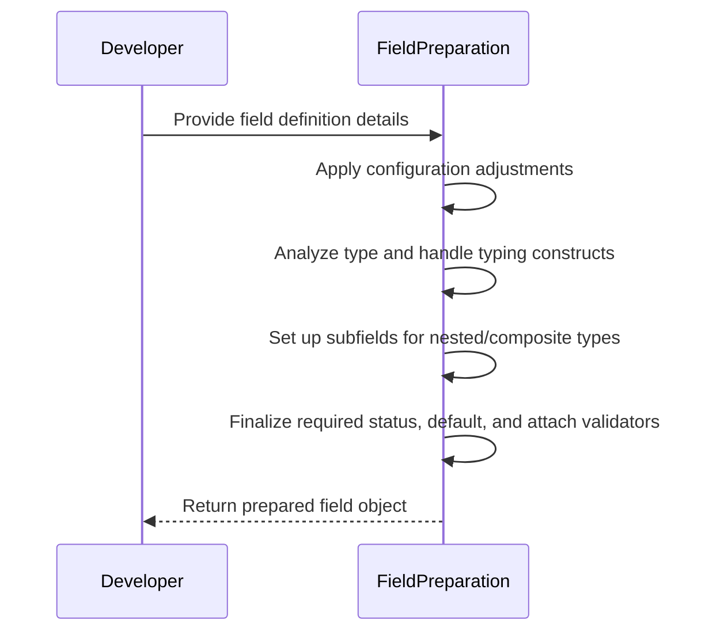
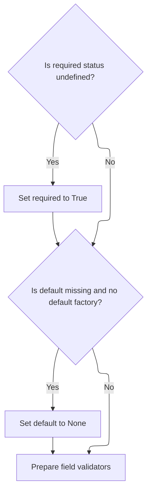

```mermaid
%%{init: {"flowchart": {"defaultRenderer": "elk"}} }%%
flowchart TD
    node1["Start: Create sub-type field"] --> node2{"Is this for keys? (for_keys)"}
    click node1 openCode "pydantic/v1/fields.py:786:812"
    node2 -->|"Yes"| node5["Get field info and config"]
    node2 -->|"No"| loop1
    click node2 openCode "pydantic/v1/fields.py:787:803"
    
    subgraph loop1["For each validator with each_item=True"]
        node4["Select and modify validator for sub-type"]
    end
    loop1 --> node5
    click node4 openCode "pydantic/v1/fields.py:791:802"
    click node5 openCode "pydantic/v1/fields.py:804:805"
    node5 --> node6["Return new field definition"]
    click node6 openCode "pydantic/v1/fields.py:806:812"

%% Swimm:
%% %%{init: {"flowchart": {"defaultRenderer": "elk"}} }%%
%% flowchart TD
%%     node1["Start: Create sub-type field"] --> node2{"Is this for keys? (<SwmToken path="pydantic/v1/fields.py" pos="722:33:33" line-data="            self.key_field = self._create_sub_type(get_args(self.type_)[0], &#39;key_&#39; + self.name, for_keys=True)">`for_keys`</SwmToken>)"}
%%     click node1 openCode "<SwmPath>[pydantic/v1/fields.py](pydantic/v1/fields.py)</SwmPath>:786:812"
%%     node2 -->|"Yes"| node5["Get field info and config"]
%%     node2 -->|"No"| loop1
%%     click node2 openCode "<SwmPath>[pydantic/v1/fields.py](pydantic/v1/fields.py)</SwmPath>:787:803"
%%     
%%     subgraph loop1["For each validator with <SwmToken path="pydantic/v1/fields.py" pos="790:18:18" line-data="            # validators for sub items should not have `each_item` as we want to check only the first sublevel">`each_item`</SwmToken>=True"]
%%         node4["Select and modify validator for sub-type"]
%%     end
%%     loop1 --> node5
%%     click node4 openCode "<SwmPath>[pydantic/v1/fields.py](pydantic/v1/fields.py)</SwmPath>:791:802"
%%     click node5 openCode "<SwmPath>[pydantic/v1/fields.py](pydantic/v1/fields.py)</SwmPath>:804:805"
%%     node5 --> node6["Return new field definition"]
%%     click node6 openCode "<SwmPath>[pydantic/v1/fields.py](pydantic/v1/fields.py)</SwmPath>:806:812"
```

This document explains how a field definition is processed to produce a fully prepared field object for use in data models. The process involves collecting field attributes, applying configuration, analyzing the type (including handling nested and composite types), and finalizing validation logic and metadata.

The main steps are:

- Collect field attributes including name, type, default, and validators
- Allow configuration to adjust field settings
- Analyze the field's type to handle Python typing constructs and edge cases
- Set up subfields for nested or composite types
- Finalize required status, default value, and attach validators



# Spec

## Detailed View of the Program's Functionality

a. Field Construction and Initial Setup

When a new field is created, the initialization process sets up all the core attributes that define the field's behavior. This includes assigning the field's name, its type annotation, any default value or factory for generating a default, whether the field is required, and if it is marked as final (immutable). The initialization also determines if the field has an alias (an alternative name), and stores any validators that should be applied to the field's value. The configuration object for the model is attached, and metadata about the field (such as description, constraints, etc.) is stored in a dedicated structure. Some internal flags and containers are initialized to handle advanced features like discriminators (for tagged unions), subfields (for nested or composite types), and validation logic. After these basic assignments, the model's configuration is given a chance to further adjust the field, and then the field undergoes a preparation step to finalize its type analysis and validation setup.

b. Field Preparation and Type Resolution

The preparation step is responsible for analyzing the field's type and setting up everything needed for validation. It first ensures that the default value and type are consistent and infers the type if necessary. If the type is a forward reference or a deferred type (meaning it can't be resolved yet), the preparation stops early, deferring further setup until the type can be resolved. Otherwise, the preparation continues with a detailed type analysis, which is not safe to repeat because it mutates the field's internal state.

c. Type Analysis and Subfield Setup

The type analysis process is a branching sequence that inspects the field's type and applies special handling for various Python typing constructs:

- If the type is a special wrapper (like a JSON type), a type variable, or a new type, the analysis refines the type and sets flags for parsing or requirements.
- If the type is the generic "any" type or a simple special type (like a regular expression pattern or a literal), the analysis sets the field to allow None values and marks it as not required, then returns.
- If the type is a final variable or an annotated/generic type, the analysis refines the type and recurses to analyze the underlying type.
- If the type is a union (multiple possible types), the analysis iterates through each type in the union:
  - If any type is None, Any, or object, it marks the field as allowing None and not required.
  - It collects all valid types (excluding None).
  - If only one valid type remains, it recurses to analyze that type.
  - If multiple types remain, it creates subfields for each type and, if a discriminator is present, prepares a mapping for discriminated unions.
- If the type is a collection (tuple, list, set, dict, etc.), the analysis sets the field's shape and creates subfields for the elements, keys, or values as appropriate.
- If the type is not supported, an error is raised.
- For all other types, if further subfields are needed (such as for nested models or generics), they are created.

This analysis ensures that the field is fully aware of its structure, including any nested or composite types, and is ready to validate values according to its type.

d. Subfield Creation and <SwmToken path="pydantic/v1/fields.py" pos="405:6:6" line-data="        field_info: Optional[FieldInfo] = None,">`FieldInfo`</SwmToken> Extraction

When a subfield is needed (for example, for the elements of a list or the keys/values of a dictionary), a new field is constructed for the nested type. If the subfield is for keys, no validators are attached; otherwise, only validators that are meant to apply to each item are included, and they are adjusted to apply only at the first sublevel. The metadata for the subfield is extracted using a helper that pulls information from either an annotated type hint or a value, but never both—if both are present, an error is raised. This helper merges in any configuration defaults and checks for conflicting defaults, ensuring that the subfield's metadata is consistent and unambiguous. The result is a new field definition, ready for further analysis or validation.

e. Finalizing Field Defaults and Validators

After type analysis, the preparation step ensures that the field's required status is set to True if it was previously undefined. If no default value or factory is provided, the default is set to None. Finally, the field's validators are populated, attaching any validation logic needed for the field. This step finalizes the field's configuration, locking in its required/default status and the validation logic that will be used to check values assigned to the field.

# Rule Definition

| Paragraph Name                                                                                                                                                                                                                                                                              | Rule ID | Category          | Description                                                                                                                                                                                                                                                                                                                                                                                                                                                                                                                                                                                                                                                                                                                                                                                                                                                                                                                                                                             | Conditions                                                                                                                                                                                            | Remarks                                                                                                                                                                                                     |
| ------------------------------------------------------------------------------------------------------------------------------------------------------------------------------------------------------------------------------------------------------------------------------------------- | ------- | ----------------- | --------------------------------------------------------------------------------------------------------------------------------------------------------------------------------------------------------------------------------------------------------------------------------------------------------------------------------------------------------------------------------------------------------------------------------------------------------------------------------------------------------------------------------------------------------------------------------------------------------------------------------------------------------------------------------------------------------------------------------------------------------------------------------------------------------------------------------------------------------------------------------------------------------------------------------------------------------------------------------------- | ----------------------------------------------------------------------------------------------------------------------------------------------------------------------------------------------------- | ----------------------------------------------------------------------------------------------------------------------------------------------------------------------------------------------------------- |
| <SwmToken path="pydantic/v1/fields.py" pos="425:10:10" line-data="        self.sub_fields: Optional[List[ModelField]] = None">`ModelField`</SwmToken>.**init**, ModelField.prepare, ModelField.\_set_default_and_type, ModelField.infer                                                     | RL-001  | Conditional Logic | When a field is constructed with type int and a default value (<SwmToken path="pydantic/v1/fields.py" pos="542:1:3" line-data="        e.g. calling it it multiple times may modify the field and configure it incorrectly.">`e.g`</SwmToken>., default=42), the field must not be required, and the default value must be 42. If no value is provided during model instantiation, the field's value must be 42. If a value is provided, it must be validated as an int. If a value of an incorrect type is provided, a validation error must be produced indicating a type mismatch.                                                                                                                                                                                                                                                                                                                                                                                                   | Field type is int and a default value is provided.                                                                                                                                                    | Default value is 42 in the example. Validation error must indicate type mismatch if value is not int.                                                                                                       |
| <SwmToken path="pydantic/v1/fields.py" pos="425:10:10" line-data="        self.sub_fields: Optional[List[ModelField]] = None">`ModelField`</SwmToken>.**init**, ModelField.prepare, ModelField.\_set_default_and_type, ModelField.\_type_analysis, ModelField.infer                         | RL-002  | Conditional Logic | When a field is constructed with type Optional\[str\] and default None, the field must not be required, and the default value must be None. If the field is omitted during model instantiation, its value must be None. If a value is provided, it must be either a string or None. If a value of an incorrect type is provided, a validation error must be produced indicating the expected type is string or None.                                                                                                                                                                                                                                                                                                                                                                                                                                                                                                                                                                    | Field type is Optional\[str\] and default is None.                                                                                                                                                    | Default value is None. Validation error must indicate expected type is string or None.                                                                                                                      |
| <SwmToken path="pydantic/v1/fields.py" pos="425:10:10" line-data="        self.sub_fields: Optional[List[ModelField]] = None">`ModelField`</SwmToken>.**init**, ModelField.prepare, ModelField.\_set_default_and_type, ModelField.\_type_analysis, ModelField.get_default, ModelField.infer | RL-003  | Conditional Logic | When a field is constructed with type List\[str\] and a <SwmToken path="pydantic/v1/fields.py" pos="401:1:1" line-data="        default_factory: Optional[NoArgAnyCallable] = None,">`default_factory`</SwmToken> (<SwmToken path="pydantic/v1/fields.py" pos="542:1:3" line-data="        e.g. calling it it multiple times may modify the field and configure it incorrectly.">`e.g`</SwmToken>., <SwmToken path="pydantic/v1/fields.py" pos="401:1:1" line-data="        default_factory: Optional[NoArgAnyCallable] = None,">`default_factory`</SwmToken>=list), the field must not be required. The default value must be an empty list, and a new list must be created for each instance. If the field is omitted during model instantiation, its value must be an empty list. If a value is provided, it must be a list of strings. If a value is provided that is not a list of strings, a validation error must be produced indicating the expected type is a list of strings. | Field type is List\[str\] and <SwmToken path="pydantic/v1/fields.py" pos="401:1:1" line-data="        default_factory: Optional[NoArgAnyCallable] = None,">`default_factory`</SwmToken> is set.       | Default value is an empty list, created per instance. Validation error must indicate expected type is list of strings.                                                                                      |
| <SwmToken path="pydantic/v1/fields.py" pos="425:10:10" line-data="        self.sub_fields: Optional[List[ModelField]] = None">`ModelField`</SwmToken>.**init**, ModelField.prepare, ModelField.\_type_analysis, ModelField.infer, ModelField.\_validate_singleton                           | RL-004  | Conditional Logic | When a field is constructed with type Union\[int, str\] and no default, the field must be required. If the field is omitted during model instantiation, a validation error must be produced indicating the field is required. If a value is provided, it must be either an int or a str. If a value is provided that is neither an int nor a str, a validation error must be produced indicating the expected type is int or str.                                                                                                                                                                                                                                                                                                                                                                                                                                                                                                                                                       | Field type is Union\[int, str\] and no default is provided.                                                                                                                                           | Validation error must indicate field is required if omitted, or expected type is int or str if value is of incorrect type.                                                                                  |
| FieldInfo.\_validate, Field, <SwmToken path="pydantic/v1/fields.py" pos="1204:2:2" line-data="class ModelPrivateAttr(Representation):">`ModelPrivateAttr`</SwmToken>, <SwmToken path="pydantic/v1/fields.py" pos="1221:2:2" line-data="def PrivateAttr(">`PrivateAttr`</SwmToken>           | RL-005  | Conditional Logic | When constructing a field with both default and <SwmToken path="pydantic/v1/fields.py" pos="401:1:1" line-data="        default_factory: Optional[NoArgAnyCallable] = None,">`default_factory`</SwmToken> set, an error must be raised at model creation time. The error message must be: 'cannot specify both default and <SwmToken path="pydantic/v1/fields.py" pos="401:1:1" line-data="        default_factory: Optional[NoArgAnyCallable] = None,">`default_factory`</SwmToken>'.                                                                                                                                                                                                                                                                                                                                                                                                                                                                                                  | Both default and <SwmToken path="pydantic/v1/fields.py" pos="401:1:1" line-data="        default_factory: Optional[NoArgAnyCallable] = None,">`default_factory`</SwmToken> are specified for a field. | Error message: 'cannot specify both default and <SwmToken path="pydantic/v1/fields.py" pos="401:1:1" line-data="        default_factory: Optional[NoArgAnyCallable] = None,">`default_factory`</SwmToken>'. |

# User Stories

## User Story 1: Field construction, validation, and error handling

---

### Story Description:

As a user of data models, I want to define fields with various types and default behaviors (including int with default, Optional\[str\] with default None, List\[str\] with <SwmToken path="pydantic/v1/fields.py" pos="401:1:1" line-data="        default_factory: Optional[NoArgAnyCallable] = None,">`default_factory`</SwmToken>, and Union\[int, str\] with no default), and receive clear errors when specifying both default and <SwmToken path="pydantic/v1/fields.py" pos="401:1:1" line-data="        default_factory: Optional[NoArgAnyCallable] = None,">`default_factory`</SwmToken>, so that required status, default value, input validation, and error handling work as expected for each scenario.

---

### Business Rule Mapping:

| Rule ID | Paragraph Name                                                                                                                                                                                                                                                                              | Rule Description                                                                                                                                                                                                                                                                                                                                                                                                                                                                                                                                                                                                                                                                                                                                                                                                                                                                                                                                                                        |
| ------- | ------------------------------------------------------------------------------------------------------------------------------------------------------------------------------------------------------------------------------------------------------------------------------------------- | --------------------------------------------------------------------------------------------------------------------------------------------------------------------------------------------------------------------------------------------------------------------------------------------------------------------------------------------------------------------------------------------------------------------------------------------------------------------------------------------------------------------------------------------------------------------------------------------------------------------------------------------------------------------------------------------------------------------------------------------------------------------------------------------------------------------------------------------------------------------------------------------------------------------------------------------------------------------------------------- |
| RL-001  | <SwmToken path="pydantic/v1/fields.py" pos="425:10:10" line-data="        self.sub_fields: Optional[List[ModelField]] = None">`ModelField`</SwmToken>.**init**, ModelField.prepare, ModelField.\_set_default_and_type, ModelField.infer                                                     | When a field is constructed with type int and a default value (<SwmToken path="pydantic/v1/fields.py" pos="542:1:3" line-data="        e.g. calling it it multiple times may modify the field and configure it incorrectly.">`e.g`</SwmToken>., default=42), the field must not be required, and the default value must be 42. If no value is provided during model instantiation, the field's value must be 42. If a value is provided, it must be validated as an int. If a value of an incorrect type is provided, a validation error must be produced indicating a type mismatch.                                                                                                                                                                                                                                                                                                                                                                                                   |
| RL-002  | <SwmToken path="pydantic/v1/fields.py" pos="425:10:10" line-data="        self.sub_fields: Optional[List[ModelField]] = None">`ModelField`</SwmToken>.**init**, ModelField.prepare, ModelField.\_set_default_and_type, ModelField.\_type_analysis, ModelField.infer                         | When a field is constructed with type Optional\[str\] and default None, the field must not be required, and the default value must be None. If the field is omitted during model instantiation, its value must be None. If a value is provided, it must be either a string or None. If a value of an incorrect type is provided, a validation error must be produced indicating the expected type is string or None.                                                                                                                                                                                                                                                                                                                                                                                                                                                                                                                                                                    |
| RL-003  | <SwmToken path="pydantic/v1/fields.py" pos="425:10:10" line-data="        self.sub_fields: Optional[List[ModelField]] = None">`ModelField`</SwmToken>.**init**, ModelField.prepare, ModelField.\_set_default_and_type, ModelField.\_type_analysis, ModelField.get_default, ModelField.infer | When a field is constructed with type List\[str\] and a <SwmToken path="pydantic/v1/fields.py" pos="401:1:1" line-data="        default_factory: Optional[NoArgAnyCallable] = None,">`default_factory`</SwmToken> (<SwmToken path="pydantic/v1/fields.py" pos="542:1:3" line-data="        e.g. calling it it multiple times may modify the field and configure it incorrectly.">`e.g`</SwmToken>., <SwmToken path="pydantic/v1/fields.py" pos="401:1:1" line-data="        default_factory: Optional[NoArgAnyCallable] = None,">`default_factory`</SwmToken>=list), the field must not be required. The default value must be an empty list, and a new list must be created for each instance. If the field is omitted during model instantiation, its value must be an empty list. If a value is provided, it must be a list of strings. If a value is provided that is not a list of strings, a validation error must be produced indicating the expected type is a list of strings. |
| RL-004  | <SwmToken path="pydantic/v1/fields.py" pos="425:10:10" line-data="        self.sub_fields: Optional[List[ModelField]] = None">`ModelField`</SwmToken>.**init**, ModelField.prepare, ModelField.\_type_analysis, ModelField.infer, ModelField.\_validate_singleton                           | When a field is constructed with type Union\[int, str\] and no default, the field must be required. If the field is omitted during model instantiation, a validation error must be produced indicating the field is required. If a value is provided, it must be either an int or a str. If a value is provided that is neither an int nor a str, a validation error must be produced indicating the expected type is int or str.                                                                                                                                                                                                                                                                                                                                                                                                                                                                                                                                                       |
| RL-005  | FieldInfo.\_validate, Field, <SwmToken path="pydantic/v1/fields.py" pos="1204:2:2" line-data="class ModelPrivateAttr(Representation):">`ModelPrivateAttr`</SwmToken>, <SwmToken path="pydantic/v1/fields.py" pos="1221:2:2" line-data="def PrivateAttr(">`PrivateAttr`</SwmToken>           | When constructing a field with both default and <SwmToken path="pydantic/v1/fields.py" pos="401:1:1" line-data="        default_factory: Optional[NoArgAnyCallable] = None,">`default_factory`</SwmToken> set, an error must be raised at model creation time. The error message must be: 'cannot specify both default and <SwmToken path="pydantic/v1/fields.py" pos="401:1:1" line-data="        default_factory: Optional[NoArgAnyCallable] = None,">`default_factory`</SwmToken>'.                                                                                                                                                                                                                                                                                                                                                                                                                                                                                                  |

---

### Relevant Functionality:

- **ModelField.init**
  1. **RL-001:**
     - When constructing the field:
       - If a default value is provided and type is int:
         - Set required = False
         - Set default value to the provided value (<SwmToken path="pydantic/v1/fields.py" pos="542:1:3" line-data="        e.g. calling it it multiple times may modify the field and configure it incorrectly.">`e.g`</SwmToken>., 42)
     - During model instantiation:
       - If value is omitted, use default value
       - If value is provided, check if it is int
         - If not, raise validation error indicating type mismatch
  2. **RL-002:**
     - When constructing the field:
       - If type is Optional\[str\] and default is None:
         - Set required = False
         - Set default value to None
         - Allow None as a valid value
     - During model instantiation:
       - If value is omitted, use default value (None)
       - If value is provided, check if it is str or None
         - If not, raise validation error indicating expected type
  3. **RL-003:**
     - When constructing the field:
       - If type is List\[str\] and <SwmToken path="pydantic/v1/fields.py" pos="401:1:1" line-data="        default_factory: Optional[NoArgAnyCallable] = None,">`default_factory`</SwmToken> is set:
         - Set required = False
         - Use <SwmToken path="pydantic/v1/fields.py" pos="401:1:1" line-data="        default_factory: Optional[NoArgAnyCallable] = None,">`default_factory`</SwmToken> to create a new list for each instance
     - During model instantiation:
       - If value is omitted, use <SwmToken path="pydantic/v1/fields.py" pos="401:1:1" line-data="        default_factory: Optional[NoArgAnyCallable] = None,">`default_factory`</SwmToken> to create empty list
       - If value is provided, check if it is a list of strings
         - If not, raise validation error indicating expected type
  4. **RL-004:**
     - When constructing the field:
       - If type is Union\[int, str\] and no default is provided:
         - Set required = True
     - During model instantiation:
       - If value is omitted, raise validation error indicating field is required
       - If value is provided, check if it is int or str
         - If not, raise validation error indicating expected type
- **FieldInfo.\_validate**
  1. **RL-005:**
     - When constructing the field:
       - If both default and <SwmToken path="pydantic/v1/fields.py" pos="401:1:1" line-data="        default_factory: Optional[NoArgAnyCallable] = None,">`default_factory`</SwmToken> are specified:
         - Raise <SwmToken path="pydantic/v1/fields.py" pos="461:3:3" line-data="                raise ValueError(f&#39;cannot specify multiple `Annotated` `Field`s for {field_name!r}&#39;)">`ValueError`</SwmToken> with message 'cannot specify both default and <SwmToken path="pydantic/v1/fields.py" pos="401:1:1" line-data="        default_factory: Optional[NoArgAnyCallable] = None,">`default_factory`</SwmToken>'

# Code Walkthrough

## Field Construction and Initial Setup

<SwmSnippet path="/pydantic/v1/fields.py" line="393">

---

**init** sets up all the basic attributes for the field, like name, type, default, and validators. Right after, it calls <SwmToken path="pydantic/v1/fields.py" pos="433:3:5" line-data="        self.model_config.prepare_field(self)">`model_config.prepare_field`</SwmToken> to let the config tweak the field, then calls prepare to finish setting up validation and type handling. We need to call prepare next because it analyzes the type, sets up subfields, and attaches validators, which aren't handled by just setting attributes.

```python
    def __init__(
        self,
        *,
        name: str,
        type_: Type[Any],
        class_validators: Optional[Dict[str, Validator]],
        model_config: Type['BaseConfig'],
        default: Any = None,
        default_factory: Optional[NoArgAnyCallable] = None,
        required: 'BoolUndefined' = Undefined,
        final: bool = False,
        alias: Optional[str] = None,
        field_info: Optional[FieldInfo] = None,
    ) -> None:
        self.name: str = name
        self.has_alias: bool = alias is not None
        self.alias: str = alias if alias is not None else name
        self.annotation = type_
        self.type_: Any = convert_generics(type_)
        self.outer_type_: Any = type_
        self.class_validators = class_validators or {}
        self.default: Any = default
        self.default_factory: Optional[NoArgAnyCallable] = default_factory
        self.required: 'BoolUndefined' = required
        self.final: bool = final
        self.model_config = model_config
        self.field_info: FieldInfo = field_info or FieldInfo(default)
        self.discriminator_key: Optional[str] = self.field_info.discriminator
        self.discriminator_alias: Optional[str] = self.discriminator_key

        self.allow_none: bool = False
        self.validate_always: bool = False
        self.sub_fields: Optional[List[ModelField]] = None
        self.sub_fields_mapping: Optional[Dict[str, 'ModelField']] = None  # used for discriminated union
        self.key_field: Optional[ModelField] = None
        self.validators: 'ValidatorsList' = []
        self.pre_validators: Optional['ValidatorsList'] = None
        self.post_validators: Optional['ValidatorsList'] = None
        self.parse_json: bool = False
        self.shape: int = SHAPE_SINGLETON
        self.model_config.prepare_field(self)
        self.prepare()
```

---

</SwmSnippet>

## Field Preparation and Type Resolution

<SwmSnippet path="/pydantic/v1/fields.py" line="537">

---

In prepare, we first set up the default and type, then check if the type is a forward reference or deferred type—if so, we bail early since we can't resolve it yet. Otherwise, we move on to <SwmToken path="pydantic/v1/fields.py" pos="541:19:19" line-data="        Note: this method is **not** idempotent (because _type_analysis is not idempotent),">`_type_analysis`</SwmToken>, which digs into the type details and sets up the rest of the field's validation logic. This step is needed to handle all the Python typing edge cases and make sure the field is ready for validation. Also, prepare isn't safe to call more than once because it mutates the field each time.

```python
    def prepare(self) -> None:
        """
        Prepare the field but inspecting self.default, self.type_ etc.

        Note: this method is **not** idempotent (because _type_analysis is not idempotent),
        e.g. calling it it multiple times may modify the field and configure it incorrectly.
        """
        self._set_default_and_type()
        if self.type_.__class__ is ForwardRef or self.type_.__class__ is DeferredType:
            # self.type_ is currently a ForwardRef and there's nothing we can do now,
            # user will need to call model.update_forward_refs()
            return

        self._type_analysis()
```

---

</SwmSnippet>

### Type Analysis and Subfield Setup

```mermaid
%%{init: {"flowchart": {"defaultRenderer": "elk"}} }%%
flowchart TD
    node1["Start type analysis"] --> node2{"Is type a special wrapper, TypeVar, or NewType?"}
    click node1 openCode "pydantic/v1/fields.py:581:582"
    click node2 openCode "pydantic/v1/fields.py:583:597"
    node2 -->|"Yes"| node3["Refine type, set parse_json/required/allow_none as needed"]
    click node3 openCode "pydantic/v1/fields.py:583:597"
    node2 -->|"No"| node4{"Is type Any/object or simple special type?"}
    click node4 openCode "pydantic/v1/fields.py:599:611"
    node4 -->|"Yes"| node5["Set allow_none/required, return"]
    click node5 openCode "pydantic/v1/fields.py:599:611"
    node4 -->|"No"| node6{"Is type FinalVar or generic/annotated?"}
    click node6 openCode "pydantic/v1/fields.py:612:628"
    node6 -->|"Yes"| node7["Refine type, recursively analyze"]
    click node7 openCode "pydantic/v1/fields.py:612:628"
    node6 -->|"No"| node8{"Is type Union?"}
    click node8 openCode "pydantic/v1/fields.py:642:665"
    node8 -->|"Yes"| loop1
    node8 -->|"No"| node12{"Is type a collection (tuple, list, set, dict, etc.)?"}
    click node12 openCode "pydantic/v1/fields.py:666:754"
    node12 -->|"Yes"| node13["Set shape, create sub_fields"]
    click node13 openCode "pydantic/v1/fields.py:666:754"
    node12 -->|"No"| node14{"Is type supported?"}
    click node14 openCode "pydantic/v1/fields.py:752:753"
    node14 -->|"No"| node15["Raise error"]
    click node15 openCode "pydantic/v1/fields.py:753:754"
    node14 -->|"Yes"| node16["Create sub_fields if needed"]
    click node16 openCode "pydantic/v1/fields.py:755:756"

    subgraph loop1["For each type in Union"]
        node9["Check if type is None/Any/object"]
        click node9 openCode "pydantic/v1/fields.py:644:650"
        node9 --> node10["Set allow_none/required if needed"]
        click node10 openCode "pydantic/v1/fields.py:646:648"
        node10 --> node11["Append valid types"]
        click node11 openCode "pydantic/v1/fields.py:651:651"
    end
    loop1 --> node17{"Only one valid type?"}
    click node17 openCode "pydantic/v1/fields.py:653:659"
    node17 -->|"Yes"| node7
    node17 -->|"No"| node18["Create sub_fields for each type"]
    click node18 openCode "pydantic/v1/fields.py:661:664"
    node18 --> node13

%% Swimm:
%% %%{init: {"flowchart": {"defaultRenderer": "elk"}} }%%
%% flowchart TD
%%     node1["Start type analysis"] --> node2{"Is type a special wrapper, <SwmToken path="pydantic/v1/fields.py" pos="589:10:10" line-data="        elif isinstance(self.type_, TypeVar):">`TypeVar`</SwmToken>, or NewType?"}
%%     click node1 openCode "<SwmPath>[pydantic/v1/fields.py](pydantic/v1/fields.py)</SwmPath>:581:582"
%%     click node2 openCode "<SwmPath>[pydantic/v1/fields.py](pydantic/v1/fields.py)</SwmPath>:583:597"
%%     node2 -->|"Yes"| node3["Refine type, set parse_json/required/allow_none as needed"]
%%     click node3 openCode "<SwmPath>[pydantic/v1/fields.py](pydantic/v1/fields.py)</SwmPath>:583:597"
%%     node2 -->|"No"| node4{"Is type Any/object or simple special type?"}
%%     click node4 openCode "<SwmPath>[pydantic/v1/fields.py](pydantic/v1/fields.py)</SwmPath>:599:611"
%%     node4 -->|"Yes"| node5["Set allow_none/required, return"]
%%     click node5 openCode "<SwmPath>[pydantic/v1/fields.py](pydantic/v1/fields.py)</SwmPath>:599:611"
%%     node4 -->|"No"| node6{"Is type FinalVar or generic/annotated?"}
%%     click node6 openCode "<SwmPath>[pydantic/v1/fields.py](pydantic/v1/fields.py)</SwmPath>:612:628"
%%     node6 -->|"Yes"| node7["Refine type, recursively analyze"]
%%     click node7 openCode "<SwmPath>[pydantic/v1/fields.py](pydantic/v1/fields.py)</SwmPath>:612:628"
%%     node6 -->|"No"| node8{"Is type Union?"}
%%     click node8 openCode "<SwmPath>[pydantic/v1/fields.py](pydantic/v1/fields.py)</SwmPath>:642:665"
%%     node8 -->|"Yes"| loop1
%%     node8 -->|"No"| node12{"Is type a collection (tuple, list, set, dict, etc.)?"}
%%     click node12 openCode "<SwmPath>[pydantic/v1/fields.py](pydantic/v1/fields.py)</SwmPath>:666:754"
%%     node12 -->|"Yes"| node13["Set shape, create <SwmToken path="pydantic/v1/fields.py" pos="425:3:3" line-data="        self.sub_fields: Optional[List[ModelField]] = None">`sub_fields`</SwmToken>"]
%%     click node13 openCode "<SwmPath>[pydantic/v1/fields.py](pydantic/v1/fields.py)</SwmPath>:666:754"
%%     node12 -->|"No"| node14{"Is type supported?"}
%%     click node14 openCode "<SwmPath>[pydantic/v1/fields.py](pydantic/v1/fields.py)</SwmPath>:752:753"
%%     node14 -->|"No"| node15["Raise error"]
%%     click node15 openCode "<SwmPath>[pydantic/v1/fields.py](pydantic/v1/fields.py)</SwmPath>:753:754"
%%     node14 -->|"Yes"| node16["Create <SwmToken path="pydantic/v1/fields.py" pos="425:3:3" line-data="        self.sub_fields: Optional[List[ModelField]] = None">`sub_fields`</SwmToken> if needed"]
%%     click node16 openCode "<SwmPath>[pydantic/v1/fields.py](pydantic/v1/fields.py)</SwmPath>:755:756"
%% 
%%     subgraph loop1["For each type in Union"]
%%         node9["Check if type is None/Any/object"]
%%         click node9 openCode "<SwmPath>[pydantic/v1/fields.py](pydantic/v1/fields.py)</SwmPath>:644:650"
%%         node9 --> node10["Set allow_none/required if needed"]
%%         click node10 openCode "<SwmPath>[pydantic/v1/fields.py](pydantic/v1/fields.py)</SwmPath>:646:648"
%%         node10 --> node11["Append valid types"]
%%         click node11 openCode "<SwmPath>[pydantic/v1/fields.py](pydantic/v1/fields.py)</SwmPath>:651:651"
%%     end
%%     loop1 --> node17{"Only one valid type?"}
%%     click node17 openCode "<SwmPath>[pydantic/v1/fields.py](pydantic/v1/fields.py)</SwmPath>:653:659"
%%     node17 -->|"Yes"| node7
%%     node17 -->|"No"| node18["Create <SwmToken path="pydantic/v1/fields.py" pos="425:3:3" line-data="        self.sub_fields: Optional[List[ModelField]] = None">`sub_fields`</SwmToken> for each type"]
%%     click node18 openCode "<SwmPath>[pydantic/v1/fields.py](pydantic/v1/fields.py)</SwmPath>:661:664"
%%     node18 --> node13
```



<SwmSnippet path="/pydantic/v1/fields.py" line="581">

---

In <SwmToken path="pydantic/v1/fields.py" pos="581:3:3" line-data="    def _type_analysis(self) -&gt; None:  # noqa: C901 (ignore complexity)">`_type_analysis`</SwmToken>, we branch on the type to handle all the Python typing constructs—like Json, <SwmToken path="pydantic/v1/fields.py" pos="589:10:10" line-data="        elif isinstance(self.type_, TypeVar):">`TypeVar`</SwmToken>, Final, Annotated, Union, Tuple, List, Dict, and more. For each, we tweak internal state (like <SwmToken path="pydantic/v1/fields.py" pos="585:3:3" line-data="            self.parse_json = True">`parse_json`</SwmToken>, <SwmToken path="pydantic/v1/fields.py" pos="602:3:3" line-data="            self.allow_none = True">`allow_none`</SwmToken>, shape, <SwmToken path="pydantic/v1/fields.py" pos="425:3:3" line-data="        self.sub_fields: Optional[List[ModelField]] = None">`sub_fields`</SwmToken>) and sometimes recurse to handle nested or refined types. This is where all the type-specific logic and Pydantic-specific constants come into play, so the field ends up with the right validation setup.

```python
    def _type_analysis(self) -> None:  # noqa: C901 (ignore complexity)
        # typing interface is horrible, we have to do some ugly checks
        if lenient_issubclass(self.type_, JsonWrapper):
            self.type_ = self.type_.inner_type
            self.parse_json = True
        elif lenient_issubclass(self.type_, Json):
            self.type_ = Any
            self.parse_json = True
        elif isinstance(self.type_, TypeVar):
            if self.type_.__bound__:
                self.type_ = self.type_.__bound__
            elif self.type_.__constraints__:
                self.type_ = Union[self.type_.__constraints__]
            else:
                self.type_ = Any
        elif is_new_type(self.type_):
            self.type_ = new_type_supertype(self.type_)

        if self.type_ is Any or self.type_ is object:
            if self.required is Undefined:
                self.required = False
            self.allow_none = True
            return
        elif self.type_ is Pattern or self.type_ is re.Pattern:
            # python 3.7 only, Pattern is a typing object but without sub fields
            return
        elif is_literal_type(self.type_):
            return
        elif is_typeddict(self.type_):
            return

        if is_finalvar(self.type_):
            self.final = True

            if self.type_ is Final:
                self.type_ = Any
            else:
                self.type_ = get_args(self.type_)[0]

            self._type_analysis()
            return

        origin = get_origin(self.type_)

        if origin is Annotated or is_typeddict_special(origin):
            self.type_ = get_args(self.type_)[0]
            self._type_analysis()
            return

        if self.discriminator_key is not None and not is_union(origin):
            raise TypeError('`discriminator` can only be used with `Union` type with more than one variant')

        # add extra check for `collections.abc.Hashable` for python 3.10+ where origin is not `None`
        if origin is None or origin is CollectionsHashable:
            # field is not "typing" object eg. Union, Dict, List etc.
            # allow None for virtual superclasses of NoneType, e.g. Hashable
            if isinstance(self.type_, type) and isinstance(None, self.type_):
                self.allow_none = True
            return
        elif origin is Callable:
            return
        elif is_union(origin):
            types_ = []
            for type_ in get_args(self.type_):
                if is_none_type(type_) or type_ is Any or type_ is object:
                    if self.required is Undefined:
                        self.required = False
                    self.allow_none = True
                if is_none_type(type_):
                    continue
                types_.append(type_)
```

---

</SwmSnippet>

<SwmSnippet path="/pydantic/v1/fields.py" line="651">

---

After all the type checks and refinements, we use <SwmToken path="pydantic/v1/fields.py" pos="661:10:10" line-data="                self.sub_fields = [self._create_sub_type(t, f&#39;{self.name}_{display_as_type(t)}&#39;) for t in types_]">`_create_sub_type`</SwmToken> to build subfields for nested or composite types—like the elements of a list, keys/values of a dict, or variants of a union. This is how Pydantic wires up validation for every part of a complex field, not just the top-level type.

```python
                types_.append(type_)

            if len(types_) == 1:
                # Optional[]
                self.type_ = types_[0]
                # this is the one case where the "outer type" isn't just the original type
                self.outer_type_ = self.type_
                # re-run to correctly interpret the new self.type_
                self._type_analysis()
            else:
                self.sub_fields = [self._create_sub_type(t, f'{self.name}_{display_as_type(t)}') for t in types_]

                if self.discriminator_key is not None:
                    self.prepare_discriminated_union_sub_fields()
            return
        elif issubclass(origin, Tuple):  # type: ignore
            # origin == Tuple without item type
            args = get_args(self.type_)
            if not args:  # plain tuple
                self.type_ = Any
                self.shape = SHAPE_TUPLE_ELLIPSIS
            elif len(args) == 2 and args[1] is Ellipsis:  # e.g. Tuple[int, ...]
                self.type_ = args[0]
                self.shape = SHAPE_TUPLE_ELLIPSIS
                self.sub_fields = [self._create_sub_type(args[0], f'{self.name}_0')]
            elif args == ((),):  # Tuple[()] means empty tuple
                self.shape = SHAPE_TUPLE
                self.type_ = Any
                self.sub_fields = []
            else:
                self.shape = SHAPE_TUPLE
                self.sub_fields = [self._create_sub_type(t, f'{self.name}_{i}') for i, t in enumerate(args)]
            return
        elif issubclass(origin, List):
            # Create self validators
            get_validators = getattr(self.type_, '__get_validators__', None)
            if get_validators:
                self.class_validators.update(
                    {f'list_{i}': Validator(validator, pre=True) for i, validator in enumerate(get_validators())}
                )

            self.type_ = get_args(self.type_)[0]
            self.shape = SHAPE_LIST
        elif issubclass(origin, Set):
            # Create self validators
            get_validators = getattr(self.type_, '__get_validators__', None)
            if get_validators:
                self.class_validators.update(
                    {f'set_{i}': Validator(validator, pre=True) for i, validator in enumerate(get_validators())}
                )

            self.type_ = get_args(self.type_)[0]
            self.shape = SHAPE_SET
        elif issubclass(origin, FrozenSet):
            # Create self validators
            get_validators = getattr(self.type_, '__get_validators__', None)
            if get_validators:
                self.class_validators.update(
                    {f'frozenset_{i}': Validator(validator, pre=True) for i, validator in enumerate(get_validators())}
                )

            self.type_ = get_args(self.type_)[0]
            self.shape = SHAPE_FROZENSET
        elif issubclass(origin, Deque):
            self.type_ = get_args(self.type_)[0]
            self.shape = SHAPE_DEQUE
        elif issubclass(origin, Sequence):
            self.type_ = get_args(self.type_)[0]
            self.shape = SHAPE_SEQUENCE
        # priority to most common mapping: dict
        elif origin is dict or origin is Dict:
            self.key_field = self._create_sub_type(get_args(self.type_)[0], 'key_' + self.name, for_keys=True)
            self.type_ = get_args(self.type_)[1]
            self.shape = SHAPE_DICT
        elif issubclass(origin, DefaultDict):
            self.key_field = self._create_sub_type(get_args(self.type_)[0], 'key_' + self.name, for_keys=True)
            self.type_ = get_args(self.type_)[1]
            self.shape = SHAPE_DEFAULTDICT
        elif issubclass(origin, Counter):
            self.key_field = self._create_sub_type(get_args(self.type_)[0], 'key_' + self.name, for_keys=True)
            self.type_ = int
            self.shape = SHAPE_COUNTER
        elif issubclass(origin, Mapping):
            self.key_field = self._create_sub_type(get_args(self.type_)[0], 'key_' + self.name, for_keys=True)
            self.type_ = get_args(self.type_)[1]
            self.shape = SHAPE_MAPPING
        # Equality check as almost everything inherits form Iterable, including str
        # check for Iterable and CollectionsIterable, as it could receive one even when declared with the other
        elif origin in {Iterable, CollectionsIterable}:
            self.type_ = get_args(self.type_)[0]
            self.shape = SHAPE_ITERABLE
            self.sub_fields = [self._create_sub_type(self.type_, f'{self.name}_type')]
        elif issubclass(origin, Type):  # type: ignore
            return
        elif hasattr(origin, '__get_validators__') or self.model_config.arbitrary_types_allowed:
            # Is a Pydantic-compatible generic that handles itself
            # or we have arbitrary_types_allowed = True
            self.shape = SHAPE_GENERIC
            self.sub_fields = [self._create_sub_type(t, f'{self.name}_{i}') for i, t in enumerate(get_args(self.type_))]
            self.type_ = origin
            return
        else:
            raise TypeError(f'Fields of type "{origin}" are not supported.')

        # type_ has been refined eg. as the type of a List and sub_fields needs to be populated
        self.sub_fields = [self._create_sub_type(self.type_, '_' + self.name)]
```

---

</SwmSnippet>

### Subfield Creation and <SwmToken path="pydantic/v1/fields.py" pos="405:6:6" line-data="        field_info: Optional[FieldInfo] = None,">`FieldInfo`</SwmToken> Extraction



<SwmSnippet path="/pydantic/v1/fields.py" line="786">

---

<SwmToken path="pydantic/v1/fields.py" pos="786:3:3" line-data="    def _create_sub_type(self, type_: Type[Any], name: str, *, for_keys: bool = False) -&gt; &#39;ModelField&#39;:">`_create_sub_type`</SwmToken> builds a new field for a nested type, filtering or skipping validators depending on whether it's for keys or values. It grabs <SwmToken path="pydantic/v1/fields.py" pos="804:1:1" line-data="        field_info, _ = self._get_field_info(name, type_, None, self.model_config)">`field_info`</SwmToken> using <SwmToken path="pydantic/v1/fields.py" pos="804:10:10" line-data="        field_info, _ = self._get_field_info(name, type_, None, self.model_config)">`_get_field_info`</SwmToken>, which pulls together metadata for the new field. This sets up the subfield with the right validation and metadata before returning a new <SwmToken path="pydantic/v1/fields.py" pos="786:38:38" line-data="    def _create_sub_type(self, type_: Type[Any], name: str, *, for_keys: bool = False) -&gt; &#39;ModelField&#39;:">`ModelField`</SwmToken> instance.

```python
    def _create_sub_type(self, type_: Type[Any], name: str, *, for_keys: bool = False) -> 'ModelField':
        if for_keys:
            class_validators = None
        else:
            # validators for sub items should not have `each_item` as we want to check only the first sublevel
            class_validators = {
                k: Validator(
                    func=v.func,
                    pre=v.pre,
                    each_item=False,
                    always=v.always,
                    check_fields=v.check_fields,
                    skip_on_failure=v.skip_on_failure,
                )
                for k, v in self.class_validators.items()
                if v.each_item
            }

        field_info, _ = self._get_field_info(name, type_, None, self.model_config)

        return self.__class__(
            type_=type_,
            name=name,
            class_validators=class_validators,
            model_config=self.model_config,
            field_info=field_info,
        )
```

---

</SwmSnippet>

<SwmSnippet path="/pydantic/v1/fields.py" line="440">

---

<SwmToken path="pydantic/v1/fields.py" pos="440:3:3" line-data="    def _get_field_info(">`_get_field_info`</SwmToken> pulls <SwmToken path="pydantic/v1/fields.py" pos="442:7:7" line-data="    ) -&gt; Tuple[FieldInfo, Any]:">`FieldInfo`</SwmToken> from either an Annotated type hint or the value, but never both—if both are set, it raises an error. It merges in config defaults, checks for conflicting defaults, and uses special constants to decide what the field's default should be. This keeps field metadata consistent and avoids ambiguity.

```python
    def _get_field_info(
        field_name: str, annotation: Any, value: Any, config: Type['BaseConfig']
    ) -> Tuple[FieldInfo, Any]:
        """
        Get a FieldInfo from a root typing.Annotated annotation, value, or config default.

        The FieldInfo may be set in typing.Annotated or the value, but not both. If neither contain
        a FieldInfo, a new one will be created using the config.

        :param field_name: name of the field for use in error messages
        :param annotation: a type hint such as `str` or `Annotated[str, Field(..., min_length=5)]`
        :param value: the field's assigned value
        :param config: the model's config object
        :return: the FieldInfo contained in the `annotation`, the value, or a new one from the config.
        """
        field_info_from_config = config.get_field_info(field_name)

        field_info = None
        if get_origin(annotation) is Annotated:
            field_infos = [arg for arg in get_args(annotation)[1:] if isinstance(arg, FieldInfo)]
            if len(field_infos) > 1:
                raise ValueError(f'cannot specify multiple `Annotated` `Field`s for {field_name!r}')
            field_info = next(iter(field_infos), None)
            if field_info is not None:
                field_info = copy.copy(field_info)
                field_info.update_from_config(field_info_from_config)
                if field_info.default not in (Undefined, Required):
                    raise ValueError(f'`Field` default cannot be set in `Annotated` for {field_name!r}')
                if value is not Undefined and value is not Required:
                    # check also `Required` because of `validate_arguments` that sets `...` as default value
                    field_info.default = value

        if isinstance(value, FieldInfo):
            if field_info is not None:
                raise ValueError(f'cannot specify `Annotated` and value `Field`s together for {field_name!r}')
            field_info = value
            field_info.update_from_config(field_info_from_config)
        elif field_info is None:
            field_info = FieldInfo(value, **field_info_from_config)
        value = None if field_info.default_factory is not None else field_info.default
        field_info._validate()
        return field_info, value
```

---

</SwmSnippet>

### Finalizing Field Defaults and Validators



<SwmSnippet path="/pydantic/v1/fields.py" line="551">

---

Back in prepare, after <SwmToken path="pydantic/v1/fields.py" pos="541:19:19" line-data="        Note: this method is **not** idempotent (because _type_analysis is not idempotent),">`_type_analysis`</SwmToken>, we make sure required is set to True if it wasn't already, and set default to None if nothing else was provided. Finally, we call <SwmToken path="pydantic/v1/fields.py" pos="555:3:3" line-data="        self.populate_validators()">`populate_validators`</SwmToken> to attach any validators needed for the field. This locks in the field's required/default status and validation logic.

```python
        if self.required is Undefined:
            self.required = True
        if self.default is Undefined and self.default_factory is None:
            self.default = None
        self.populate_validators()
```

---

</SwmSnippet>

&nbsp;

*This is an auto-generated document by Swimm 🌊 and has not yet been verified by a human*

<SwmMeta version="3.0.0" repo-id="Z2l0aHViJTNBJTNBcHlkYW50aWMlM0ElM0FTd2ltbS1EZW1v" repo-name="pydantic"><sup>Powered by [Swimm](/)</sup></SwmMeta>
