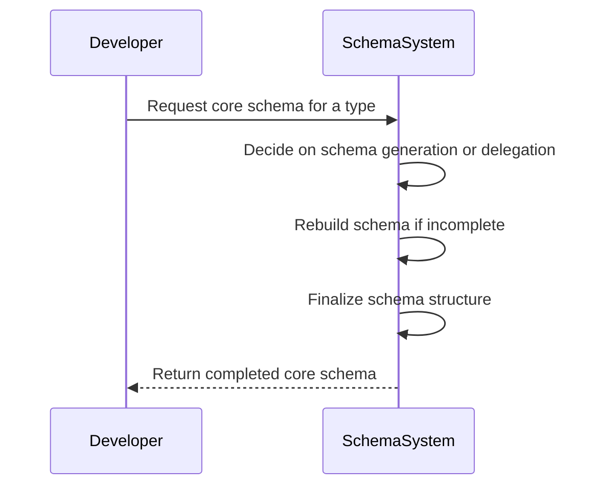
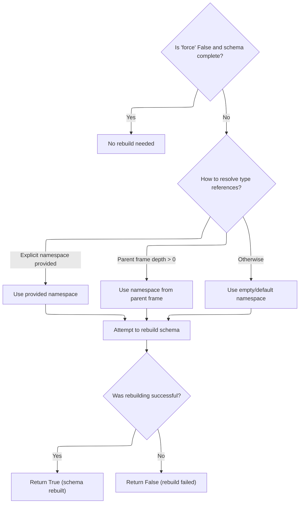
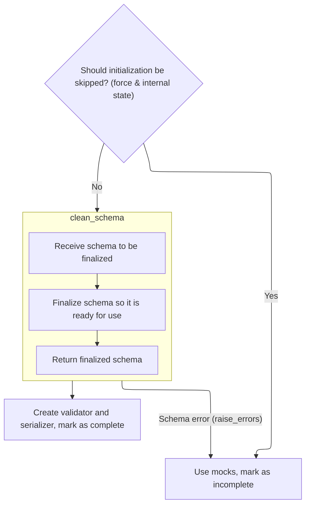
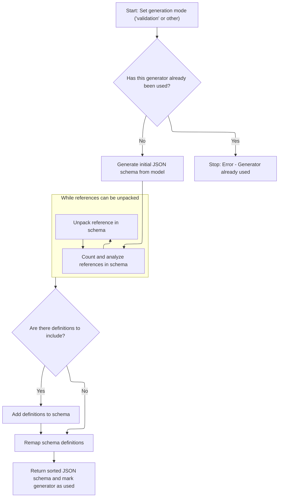

This document outlines how a core schema is produced for a Python type or model, ensuring it is ready for validation and serialization. The process involves deciding on schema generation or delegation, rebuilding the schema if incomplete, finalizing the schema structure, and returning the completed core schema.

The main steps are:

- Decide on schema generation or delegation
- Rebuild schema if incomplete
- Finalize schema structure
- Return the completed core schema



# Spec

## Detailed View of the Program's Functionality

a. Entry Point: Core Schema Retrieval

The process begins when a special method is called on a type that wants to provide a custom schema for JSON validation. This method checks if the type itself is the source of the schema request. If so, it creates a new JSON schema with no inner schema. If not, it delegates to a handler to generate the schema for the source, then wraps that in a JSON schema. This ensures that, regardless of the path, the result is always a JSON schema object, which is important for consistency in the rest of the flow.

b. Preparing for JSON Schema Generation

When a request is made to generate a JSON schema for a type adapter, the system first configures a schema generator. This involves setting options such as whether to use field aliases, how to format reference strings, and which mode (validation or serialization) to use. The system then checks if the current schema is up-to-date. If it is not, it triggers a rebuild process to ensure the schema is valid and complete. Once the schema is confirmed to be valid, the system proceeds to generate and return the JSON schema.

c. Resolving and Rebuilding the Schema

If the schema is incomplete or a forced rebuild is requested, the system determines how to resolve any type references that may be present (such as forward references). It does this by checking if an explicit namespace is provided, if it should use the namespace from a parent frame, or if it should fall back to an empty/default namespace. With the correct namespace in hand, it attempts to rebuild the schema. If rebuilding is successful, it returns a positive result; otherwise, it indicates failure.

d. Building Core Schema, Validator, and Serializer

During the rebuilding process, the system either retrieves existing schema, validator, and serializer objects from the type or generates them if they are missing or are just placeholders. If generation is needed, it creates a schema generator and uses it to produce a core schema for the type. This schema is then finalized and sanitized to ensure it is ready for use. After finalization, the system creates a validator and serializer based on the cleaned schema and marks the adapter as fully initialized.

e. Finalizing the Schema Structure

The schema finalization step involves passing the generated schema to a function that ensures all references and definitions are resolved and that the schema structure is correct and ready for downstream use. This step is modular and separated from the rest of the schema generation logic for clarity and maintainability.

f. Completing Core Attribute Initialization

After the schema has been finalized and the validator and serializer have been created, the system marks the type adapter as complete. This means it is now ready to perform validation and serialization tasks as needed.

g. Generating the JSON Schema Output

Once the core schema is ready and validated, the system uses the schema generator instance to produce the actual JSON schema dictionary. This step is separated from the earlier steps to keep the generation logic reusable and modular.

h. Schema Generation and Optimization

The schema generator performs several tasks to ensure the output JSON schema is clean and optimized:

- It checks if the generator has already been used to prevent accidental reuse.
- It generates the initial JSON schema from the core schema.
- It analyzes and counts references within the schema.
- If possible, it unpacks references that are only used once to simplify the schema.
- It removes unused definitions and remaps references as needed.
- It sorts the resulting schema for readability and consistency.

The final output is a ready-to-use, clean JSON schema that accurately represents the type and its constraints, suitable for use in validation, documentation, or other downstream tasks.

# Rule Definition

| Paragraph Name                                                                                                                                                                                                                                                                                                                                                               | Rule ID | Category          | Description                                                                                                                                                                                                                                                                                                                                                                                                                                                                                                                                                                                                                                                                                                                                                                                                                                    | Conditions                                                                                                          | Remarks                                                                                                                                                                                                                                                                                                                                                                                                                                                                                                                                                                                                                   |
| ---------------------------------------------------------------------------------------------------------------------------------------------------------------------------------------------------------------------------------------------------------------------------------------------------------------------------------------------------------------------------- | ------- | ----------------- | ---------------------------------------------------------------------------------------------------------------------------------------------------------------------------------------------------------------------------------------------------------------------------------------------------------------------------------------------------------------------------------------------------------------------------------------------------------------------------------------------------------------------------------------------------------------------------------------------------------------------------------------------------------------------------------------------------------------------------------------------------------------------------------------------------------------------------------------------- | ------------------------------------------------------------------------------------------------------------------- | ------------------------------------------------------------------------------------------------------------------------------------------------------------------------------------------------------------------------------------------------------------------------------------------------------------------------------------------------------------------------------------------------------------------------------------------------------------------------------------------------------------------------------------------------------------------------------------------------------------------------- |
| GenerateSchema.generate_schema, TypeAdapter.\_init_core_attrs                                                                                                                                                                                                                                                                                                                | RL-001  | Computation       | The system must provide a mechanism to retrieve a core schema for a given type or instance, using a handler that generates core schemas. The output must be a dictionary representing the core schema, which describes how to validate and serialize the type.                                                                                                                                                                                                                                                                                                                                                                                                                                                                                                                                                                                 | A type or instance is provided for which a core schema is needed.                                                   | The output is a dictionary (core schema) with keys describing validation and serialization logic. The format is a Python dict, not a string or bytes.                                                                                                                                                                                                                                                                                                                                                                                                                                                                     |
| <SwmToken path="pydantic/json_schema.py" pos="9:2:4" line-data="[`TypeAdapter.json_schema`][pydantic.TypeAdapter.json_schema].">`TypeAdapter.json_schema`</SwmToken>, GenerateJsonSchema.generate                                                                                                                                                                            | RL-002  | Computation       | The system must provide a method to generate a JSON Schema dictionary for a type, with configurable parameters: field aliases (<SwmToken path="pydantic/type_adapter.py" pos="653:1:1" line-data="        by_alias: bool = True,">`by_alias`</SwmToken>), reference template (<SwmToken path="pydantic/type_adapter.py" pos="654:1:1" line-data="        ref_template: str = DEFAULT_REF_TEMPLATE,">`ref_template`</SwmToken>), schema generator class (<SwmToken path="pydantic/type_adapter.py" pos="286:1:1" line-data="            schema_generator = _generate_schema.GenerateSchema(config_wrapper, ns_resolver=ns_resolver)">`schema_generator`</SwmToken>), and schema generation mode (mode). The output must be a dictionary representing the JSON Schema for the type, including properties, required fields, and type information. | A type is provided and JSON Schema generation is requested, with optional configuration parameters.                 | Output is a dictionary with at least the following fields: title (string), type (string, <SwmToken path="pydantic/types.py" pos="917:27:29" line-data="        Attributes of modules may be separated from the module by `:` or `.`, e.g. if `&#39;math:cos&#39;` is provided,">`e.g`</SwmToken>., 'object'), properties (dict), required (list of strings). Reference template is a string, <SwmToken path="pydantic/types.py" pos="917:27:29" line-data="        Attributes of modules may be separated from the module by `:` or `.`, e.g. if `&#39;math:cos&#39;` is provided,">`e.g`</SwmToken>., '#/$defs/{model}'. |
| <SwmToken path="pydantic/type_adapter.py" pos="131:4:6" line-data="        and `TypeAdapter.rebuild` for various ways to construct this namespace.">`TypeAdapter.rebuild`</SwmToken>, TypeAdapter.\_init_core_attrs                                                                                                                                                          | RL-003  | Computation       | The system must provide a method to rebuild the core schema, validator, and serializer for a type, with configurable parameters: force, <SwmToken path="pydantic/type_adapter.py" pos="247:18:18" line-data="        self, ns_resolver: _namespace_utils.NsResolver, force: bool, raise_errors: bool = False">`raise_errors`</SwmToken>, <SwmToken path="pydantic/type_adapter.py" pos="340:1:1" line-data="        _parent_namespace_depth: int = 2,">`_parent_namespace_depth`</SwmToken>, <SwmToken path="pydantic/type_adapter.py" pos="341:1:1" line-data="        _types_namespace: _namespace_utils.MappingNamespace \| None = None,">`_types_namespace`</SwmToken>. The output must be None if no rebuild was needed, True if the rebuild succeeded, or False if the rebuild failed.                                                   | Rebuild is requested, possibly with force or error-raising flags, and possibly with explicit namespace information. | Output is None, True, or False. Namespace parameters are either integer depth or mapping.                                                                                                                                                                                                                                                                                                                                                                                                                                                                                                                                 |
| TypeAdapter.\_init_core_attrs                                                                                                                                                                                                                                                                                                                                                | RL-004  | Computation       | The system must provide a method to initialize the core schema, validator, and serializer for a type, using a namespace resolver. The method must accept a namespace resolver, a force flag, and a <SwmToken path="pydantic/type_adapter.py" pos="247:18:18" line-data="        self, ns_resolver: _namespace_utils.NsResolver, force: bool, raise_errors: bool = False">`raise_errors`</SwmToken> flag. The output must be True if initialization succeeded, False if it failed.                                                                                                                                                                                                                                                                                                                                                              | Initialization is requested with a namespace resolver and flags.                                                    | Output is True or False. Namespace resolver is an object for resolving forward references.                                                                                                                                                                                                                                                                                                                                                                                                                                                                                                                                |
| GenerateSchema.clean_schema, \_Definitions.finalize_schema                                                                                                                                                                                                                                                                                                                   | RL-005  | Computation       | The system must provide a method to finalize and sanitize a core schema dictionary, resolving references and applying any deferred discriminators. The input is a core schema dictionary, and the output is a finalized core schema dictionary ready for use.                                                                                                                                                                                                                                                                                                                                                                                                                                                                                                                                                                                  | A core schema dictionary is provided for finalization.                                                              | Input and output are dictionaries representing core schemas. All references must be resolved, and deferred discriminators applied.                                                                                                                                                                                                                                                                                                                                                                                                                                                                                        |
| GenerateJsonSchema.generate                                                                                                                                                                                                                                                                                                                                                  | RL-006  | Computation       | The system must provide a method to generate a JSON Schema dictionary from a core schema, with a configurable mode parameter (<SwmToken path="pydantic/types.py" pos="917:27:29" line-data="        Attributes of modules may be separated from the module by `:` or `.`, e.g. if `&#39;math:cos&#39;` is provided,">`e.g`</SwmToken>., 'validation' or 'serialization'). The output must be a dictionary representing the JSON Schema, with all references, definitions, and properties properly resolved and sorted.                                                                                                                                                                                                                                                                                                                         | A core schema and mode are provided for JSON Schema generation.                                                     | Output is a dictionary with resolved references, definitions, and sorted keys. Mode is a string.                                                                                                                                                                                                                                                                                                                                                                                                                                                                                                                          |
| GenerateJsonSchema.generate, <SwmToken path="pydantic/json_schema.py" pos="2564:17:19" line-data="            # This exception is handled in pydantic.json_schema.GenerateJsonSchema._named_required_fields_schema">`GenerateJsonSchema._named_required_fields_schema`</SwmToken>                                                                                            | RL-007  | Data Assignment   | The JSON Schema output must include, at minimum: the title of the model (if available), the type of the object (<SwmToken path="pydantic/types.py" pos="917:27:29" line-data="        Attributes of modules may be separated from the module by `:` or `.`, e.g. if `&#39;math:cos&#39;` is provided,">`e.g`</SwmToken>., 'object'), the properties of the object (with each property including its type and constraints), and the list of required properties.                                                                                                                                                                                                                                                                                                                                                                                | JSON Schema is generated for a type or model.                                                                       | Output is a dictionary with at least the following fields: title (string), type (string), properties (dict), required (list of strings).                                                                                                                                                                                                                                                                                                                                                                                                                                                                                  |
| <SwmToken path="pydantic/json_schema.py" pos="9:2:4" line-data="[`TypeAdapter.json_schema`][pydantic.TypeAdapter.json_schema].">`TypeAdapter.json_schema`</SwmToken>, GenerateJsonSchema.generate, <SwmToken path="pydantic/json_schema.py" pos="8:4:4" line-data="[`BaseModel.model_json_schema`][pydantic.BaseModel.model_json_schema] and">`model_json_schema`</SwmToken> | RL-008  | Conditional Logic | The system must ensure that, before generating the JSON Schema, the core schema is complete and not a mock or placeholder. If the schema is incomplete, it must be rebuilt using the appropriate namespace for resolving references.                                                                                                                                                                                                                                                                                                                                                                                                                                                                                                                                                                                                           | JSON Schema generation is requested and the core schema may be incomplete.                                          | If the core schema is a mock, it must be rebuilt before proceeding.                                                                                                                                                                                                                                                                                                                                                                                                                                                                                                                                                       |
| GenerateJsonSchema.generate, GenerateJsonSchema.\_garbage_collect_definitions, GenerateJsonSchema.sort                                                                                                                                                                                                                                                                       | RL-009  | Computation       | The system must ensure that, when generating the JSON Schema, any references within the schema are unpacked if possible, unused definitions are cleaned up, and the final schema is sorted for consistency.                                                                                                                                                                                                                                                                                                                                                                                                                                                                                                                                                                                                                                    | JSON Schema generation is completed.                                                                                | References are unpacked if only used once and no sibling keys exist. Unused definitions are removed. The schema is sorted alphabetically except for 'properties' and 'default'.                                                                                                                                                                                                                                                                                                                                                                                                                                           |
| GenerateJsonSchema.generate, GenerateJsonSchema.generate_definitions                                                                                                                                                                                                                                                                                                         | RL-010  | Conditional Logic | The system must prevent reuse of a schema generator instance for multiple schema generations; attempting to reuse must result in an error.                                                                                                                                                                                                                                                                                                                                                                                                                                                                                                                                                                                                                                                                                                     | A schema generator instance is used to generate a schema and then reused.                                           | If <SwmToken path="pydantic/json_schema.py" pos="392:3:5" line-data="        if self._used:">`self._used`</SwmToken> is True, raise <SwmToken path="pydantic/json_schema.py" pos="389:1:1" line-data="            PydanticUserError: If the JSON schema generator has already been used to generate a JSON schema.">`PydanticUserError`</SwmToken> with code <SwmToken path="pydantic/json_schema.py" pos="396:4:10" line-data="                code=&#39;json-schema-already-used&#39;,">`json-schema-already-used`</SwmToken>.                                                                                          |
| <SwmToken path="pydantic/type_adapter.py" pos="131:4:6" line-data="        and `TypeAdapter.rebuild` for various ways to construct this namespace.">`TypeAdapter.rebuild`</SwmToken>, TypeAdapter.\_init_core_attrs, GenerateSchema.\_resolve_forward_ref                                                                                                                    | RL-011  | Conditional Logic | The system must support explicit namespace resolution for forward references, using either a provided namespace, the parent frame's namespace, or a default/empty namespace.                                                                                                                                                                                                                                                                                                                                                                                                                                                                                                                                                                                                                                                                   | Forward references are present and need to be resolved.                                                             | Namespace can be provided explicitly or inferred from the parent frame.                                                                                                                                                                                                                                                                                                                                                                                                                                                                                                                                                   |
| TypeAdapter.\_init_core_attrs, <SwmToken path="pydantic/type_adapter.py" pos="131:4:6" line-data="        and `TypeAdapter.rebuild` for various ways to construct this namespace.">`TypeAdapter.rebuild`</SwmToken>                                                                                                                                                          | RL-012  | Data Assignment   | The system must mark the schema, validator, and serializer as complete and ready for use after successful initialization and finalization.                                                                                                                                                                                                                                                                                                                                                                                                                                                                                                                                                                                                                                                                                                     | Initialization or rebuild is successful.                                                                            | Set <SwmToken path="pydantic/type_adapter.py" pos="266:3:3" line-data="            self.pydantic_complete = False">`pydantic_complete`</SwmToken> to True after successful initialization/finalization.                                                                                                                                                                                                                                                                                                                                                                                                                   |

# User Stories

## User Story 1: Prepare and maintain core schema for a type

---

### Story Description:

As a system, I want to retrieve, initialize, and rebuild the core schema, validator, and serializer for a type, supporting explicit namespace resolution and marking them as complete, so that types are always ready for validation, serialization, and schema generation.

---

### Business Rule Mapping:

| Rule ID | Paragraph Name                                                                                                                                                                                                                                            | Rule Description                                                                                                                                                                                                                                                                                                                                                                                                                                                                                                                                                                                                                                                                                                                                                                             |
| ------- | --------------------------------------------------------------------------------------------------------------------------------------------------------------------------------------------------------------------------------------------------------- | -------------------------------------------------------------------------------------------------------------------------------------------------------------------------------------------------------------------------------------------------------------------------------------------------------------------------------------------------------------------------------------------------------------------------------------------------------------------------------------------------------------------------------------------------------------------------------------------------------------------------------------------------------------------------------------------------------------------------------------------------------------------------------------------- |
| RL-001  | GenerateSchema.generate_schema, TypeAdapter.\_init_core_attrs                                                                                                                                                                                             | The system must provide a mechanism to retrieve a core schema for a given type or instance, using a handler that generates core schemas. The output must be a dictionary representing the core schema, which describes how to validate and serialize the type.                                                                                                                                                                                                                                                                                                                                                                                                                                                                                                                               |
| RL-003  | <SwmToken path="pydantic/type_adapter.py" pos="131:4:6" line-data="        and `TypeAdapter.rebuild` for various ways to construct this namespace.">`TypeAdapter.rebuild`</SwmToken>, TypeAdapter.\_init_core_attrs                                       | The system must provide a method to rebuild the core schema, validator, and serializer for a type, with configurable parameters: force, <SwmToken path="pydantic/type_adapter.py" pos="247:18:18" line-data="        self, ns_resolver: _namespace_utils.NsResolver, force: bool, raise_errors: bool = False">`raise_errors`</SwmToken>, <SwmToken path="pydantic/type_adapter.py" pos="340:1:1" line-data="        _parent_namespace_depth: int = 2,">`_parent_namespace_depth`</SwmToken>, <SwmToken path="pydantic/type_adapter.py" pos="341:1:1" line-data="        _types_namespace: _namespace_utils.MappingNamespace \| None = None,">`_types_namespace`</SwmToken>. The output must be None if no rebuild was needed, True if the rebuild succeeded, or False if the rebuild failed. |
| RL-011  | <SwmToken path="pydantic/type_adapter.py" pos="131:4:6" line-data="        and `TypeAdapter.rebuild` for various ways to construct this namespace.">`TypeAdapter.rebuild`</SwmToken>, TypeAdapter.\_init_core_attrs, GenerateSchema.\_resolve_forward_ref | The system must support explicit namespace resolution for forward references, using either a provided namespace, the parent frame's namespace, or a default/empty namespace.                                                                                                                                                                                                                                                                                                                                                                                                                                                                                                                                                                                                                 |
| RL-004  | TypeAdapter.\_init_core_attrs                                                                                                                                                                                                                             | The system must provide a method to initialize the core schema, validator, and serializer for a type, using a namespace resolver. The method must accept a namespace resolver, a force flag, and a <SwmToken path="pydantic/type_adapter.py" pos="247:18:18" line-data="        self, ns_resolver: _namespace_utils.NsResolver, force: bool, raise_errors: bool = False">`raise_errors`</SwmToken> flag. The output must be True if initialization succeeded, False if it failed.                                                                                                                                                                                                                                                                                                            |
| RL-012  | TypeAdapter.\_init_core_attrs, <SwmToken path="pydantic/type_adapter.py" pos="131:4:6" line-data="        and `TypeAdapter.rebuild` for various ways to construct this namespace.">`TypeAdapter.rebuild`</SwmToken>                                       | The system must mark the schema, validator, and serializer as complete and ready for use after successful initialization and finalization.                                                                                                                                                                                                                                                                                                                                                                                                                                                                                                                                                                                                                                                   |

---

### Relevant Functionality:

- **GenerateSchema.generate_schema**
  1. **RL-001:**
     - When a type or instance is provided:
       - Use the <SwmToken path="pydantic/type_adapter.py" pos="286:7:7" line-data="            schema_generator = _generate_schema.GenerateSchema(config_wrapper, ns_resolver=ns_resolver)">`GenerateSchema`</SwmToken> class to generate the core schema via <SwmToken path="pydantic/type_adapter.py" pos="289:7:7" line-data="                core_schema = schema_generator.generate_schema(self._type)">`generate_schema`</SwmToken>(type_or_instance).
       - The handler may be a <SwmToken path="pydantic/types.py" pos="1515:17:17" line-data="        def __get_pydantic_core_schema__(cls, source: Any, handler: GetCoreSchemaHandler) -&gt; core_schema.CoreSchema:">`GetCoreSchemaHandler`</SwmToken> or similar abstraction.
       - Return the resulting dictionary describing validation and serialization.
- <SwmToken path="pydantic/type_adapter.py" pos="131:4:6" line-data="        and `TypeAdapter.rebuild` for various ways to construct this namespace.">`TypeAdapter.rebuild`</SwmToken>
  1. **RL-003:**
     - If not force and schema is already complete, return None.
     - Otherwise, resolve the namespace using <SwmToken path="pydantic/type_adapter.py" pos="340:1:1" line-data="        _parent_namespace_depth: int = 2,">`_parent_namespace_depth`</SwmToken> or <SwmToken path="pydantic/type_adapter.py" pos="341:1:1" line-data="        _types_namespace: _namespace_utils.MappingNamespace | None = None,">`_types_namespace`</SwmToken>.
     - Attempt to rebuild core schema, validator, and serializer.
     - If successful, return True; if failed, return False; if not needed, return None.
  2. **RL-011:**
     - When resolving forward references:
       - If a namespace is provided, use it.
       - Else, use the parent frame's namespace if available.
       - Else, use a default or empty namespace.
- **TypeAdapter.\_init_core_attrs**
  1. **RL-004:**
     - Accept <SwmToken path="pydantic/type_adapter.py" pos="247:4:4" line-data="        self, ns_resolver: _namespace_utils.NsResolver, force: bool, raise_errors: bool = False">`ns_resolver`</SwmToken>, force, and <SwmToken path="pydantic/type_adapter.py" pos="247:18:18" line-data="        self, ns_resolver: _namespace_utils.NsResolver, force: bool, raise_errors: bool = False">`raise_errors`</SwmToken> parameters.
     - If not force and <SwmToken path="pydantic/type_adapter.py" pos="322:8:8" line-data="            return config.get(&#39;defer_build&#39;) is True">`defer_build`</SwmToken> is True, set mocks and return False.
     - Otherwise, attempt to build core schema, validator, and serializer using <SwmToken path="pydantic/type_adapter.py" pos="247:4:4" line-data="        self, ns_resolver: _namespace_utils.NsResolver, force: bool, raise_errors: bool = False">`ns_resolver`</SwmToken>.
     - If successful, mark as complete and return True; else, set mocks and return False.
  2. **RL-012:**
     - After successful initialization or rebuild:
       - Set the <SwmToken path="pydantic/type_adapter.py" pos="266:3:3" line-data="            self.pydantic_complete = False">`pydantic_complete`</SwmToken> flag to True.

## User Story 2: Generate JSON Schema for a type or core schema

---

### Story Description:

As a user, I want to generate a JSON Schema dictionary for a type or core schema with configurable parameters, ensuring the output includes all required fields, is based on a complete core schema, and is properly resolved and sorted, so that I can use the schema for validation, documentation, or interoperability.

---

### Business Rule Mapping:

| Rule ID | Paragraph Name                                                                                                                                                                                                                                                                                                                                                               | Rule Description                                                                                                                                                                                                                                                                                                                                                                                                                                                                                                                                                                                                                                                                                                                                                                                                                               |
| ------- | ---------------------------------------------------------------------------------------------------------------------------------------------------------------------------------------------------------------------------------------------------------------------------------------------------------------------------------------------------------------------------- | ---------------------------------------------------------------------------------------------------------------------------------------------------------------------------------------------------------------------------------------------------------------------------------------------------------------------------------------------------------------------------------------------------------------------------------------------------------------------------------------------------------------------------------------------------------------------------------------------------------------------------------------------------------------------------------------------------------------------------------------------------------------------------------------------------------------------------------------------- |
| RL-002  | <SwmToken path="pydantic/json_schema.py" pos="9:2:4" line-data="[`TypeAdapter.json_schema`][pydantic.TypeAdapter.json_schema].">`TypeAdapter.json_schema`</SwmToken>, GenerateJsonSchema.generate                                                                                                                                                                            | The system must provide a method to generate a JSON Schema dictionary for a type, with configurable parameters: field aliases (<SwmToken path="pydantic/type_adapter.py" pos="653:1:1" line-data="        by_alias: bool = True,">`by_alias`</SwmToken>), reference template (<SwmToken path="pydantic/type_adapter.py" pos="654:1:1" line-data="        ref_template: str = DEFAULT_REF_TEMPLATE,">`ref_template`</SwmToken>), schema generator class (<SwmToken path="pydantic/type_adapter.py" pos="286:1:1" line-data="            schema_generator = _generate_schema.GenerateSchema(config_wrapper, ns_resolver=ns_resolver)">`schema_generator`</SwmToken>), and schema generation mode (mode). The output must be a dictionary representing the JSON Schema for the type, including properties, required fields, and type information. |
| RL-008  | <SwmToken path="pydantic/json_schema.py" pos="9:2:4" line-data="[`TypeAdapter.json_schema`][pydantic.TypeAdapter.json_schema].">`TypeAdapter.json_schema`</SwmToken>, GenerateJsonSchema.generate, <SwmToken path="pydantic/json_schema.py" pos="8:4:4" line-data="[`BaseModel.model_json_schema`][pydantic.BaseModel.model_json_schema] and">`model_json_schema`</SwmToken> | The system must ensure that, before generating the JSON Schema, the core schema is complete and not a mock or placeholder. If the schema is incomplete, it must be rebuilt using the appropriate namespace for resolving references.                                                                                                                                                                                                                                                                                                                                                                                                                                                                                                                                                                                                           |
| RL-006  | GenerateJsonSchema.generate                                                                                                                                                                                                                                                                                                                                                  | The system must provide a method to generate a JSON Schema dictionary from a core schema, with a configurable mode parameter (<SwmToken path="pydantic/types.py" pos="917:27:29" line-data="        Attributes of modules may be separated from the module by `:` or `.`, e.g. if `&#39;math:cos&#39;` is provided,">`e.g`</SwmToken>., 'validation' or 'serialization'). The output must be a dictionary representing the JSON Schema, with all references, definitions, and properties properly resolved and sorted.                                                                                                                                                                                                                                                                                                                         |
| RL-007  | GenerateJsonSchema.generate, <SwmToken path="pydantic/json_schema.py" pos="2564:17:19" line-data="            # This exception is handled in pydantic.json_schema.GenerateJsonSchema._named_required_fields_schema">`GenerateJsonSchema._named_required_fields_schema`</SwmToken>                                                                                            | The JSON Schema output must include, at minimum: the title of the model (if available), the type of the object (<SwmToken path="pydantic/types.py" pos="917:27:29" line-data="        Attributes of modules may be separated from the module by `:` or `.`, e.g. if `&#39;math:cos&#39;` is provided,">`e.g`</SwmToken>., 'object'), the properties of the object (with each property including its type and constraints), and the list of required properties.                                                                                                                                                                                                                                                                                                                                                                                |
| RL-009  | GenerateJsonSchema.generate, GenerateJsonSchema.\_garbage_collect_definitions, GenerateJsonSchema.sort                                                                                                                                                                                                                                                                       | The system must ensure that, when generating the JSON Schema, any references within the schema are unpacked if possible, unused definitions are cleaned up, and the final schema is sorted for consistency.                                                                                                                                                                                                                                                                                                                                                                                                                                                                                                                                                                                                                                    |

---

### Relevant Functionality:

- <SwmToken path="pydantic/json_schema.py" pos="9:2:4" line-data="[`TypeAdapter.json_schema`][pydantic.TypeAdapter.json_schema].">`TypeAdapter.json_schema`</SwmToken>
  1. **RL-002:**
     - Accept type and configuration parameters (<SwmToken path="pydantic/type_adapter.py" pos="653:1:1" line-data="        by_alias: bool = True,">`by_alias`</SwmToken>, <SwmToken path="pydantic/type_adapter.py" pos="654:1:1" line-data="        ref_template: str = DEFAULT_REF_TEMPLATE,">`ref_template`</SwmToken>, <SwmToken path="pydantic/type_adapter.py" pos="286:1:1" line-data="            schema_generator = _generate_schema.GenerateSchema(config_wrapper, ns_resolver=ns_resolver)">`schema_generator`</SwmToken>, mode).
     - Use the <SwmToken path="pydantic/type_adapter.py" pos="286:1:1" line-data="            schema_generator = _generate_schema.GenerateSchema(config_wrapper, ns_resolver=ns_resolver)">`schema_generator`</SwmToken> class to instantiate a generator with the given parameters.
     - Generate the JSON Schema dict from the core schema of the type.
     - Ensure the output includes properties, required fields, and type information.
  2. **RL-008:**
     - Before generating JSON Schema:
       - Check if the core schema is a mock or incomplete.
       - If so, rebuild the core schema using the correct namespace.
       - Proceed with JSON Schema generation only if the core schema is complete.
- **GenerateJsonSchema.generate**
  1. **RL-006:**
     - Accept core schema and mode.
     - Generate the JSON Schema dict for the given mode.
     - Resolve all references and definitions.
     - Sort the final schema for consistency.
     - Return the JSON Schema dictionary.
  2. **RL-007:**
     - When generating JSON Schema for a model or type:
       - Ensure the output dict includes 'title', 'type', 'properties', and 'required' fields.
       - Each property must include its type and relevant constraints.
  3. **RL-009:**
     - After generating the JSON Schema dict:
       - Unpack $ref references if only used once and there are no sibling keys.
       - Remove unused definitions from the $defs section.
       - Sort the schema keys alphabetically, except for 'properties' and 'default'.

## User Story 3: Finalize core schema and manage schema generator lifecycle

---

### Story Description:

As a system, I want to finalize and sanitize core schema dictionaries and prevent reuse of schema generator instances, so that schemas are always valid, references are resolved, and generator misuse is avoided.

---

### Business Rule Mapping:

| Rule ID | Paragraph Name                                                       | Rule Description                                                                                                                                                                                                                                              |
| ------- | -------------------------------------------------------------------- | ------------------------------------------------------------------------------------------------------------------------------------------------------------------------------------------------------------------------------------------------------------- |
| RL-005  | GenerateSchema.clean_schema, \_Definitions.finalize_schema           | The system must provide a method to finalize and sanitize a core schema dictionary, resolving references and applying any deferred discriminators. The input is a core schema dictionary, and the output is a finalized core schema dictionary ready for use. |
| RL-010  | GenerateJsonSchema.generate, GenerateJsonSchema.generate_definitions | The system must prevent reuse of a schema generator instance for multiple schema generations; attempting to reuse must result in an error.                                                                                                                    |

---

### Relevant Functionality:

- **GenerateSchema.clean_schema**
  1. **RL-005:**
     - Accept a core schema dictionary.
     - Traverse the schema and referenced definitions.
     - Replace definition references with actual definitions where possible.
     - Apply any deferred discriminators.
     - Return the finalized schema dictionary.
- **GenerateJsonSchema.generate**
  1. **RL-010:**
     - Before generating a schema:
       - Check if the generator's \_used flag is True.
       - If so, raise an error and do not proceed.
       - Otherwise, set \_used to True after generation.

# Code Walkthrough

## Entry Point: Core Schema Retrieval

<SwmSnippet path="/pydantic/types.py" line="1515">

---

<SwmToken path="pydantic/types.py" pos="1515:3:3" line-data="        def __get_pydantic_core_schema__(cls, source: Any, handler: GetCoreSchemaHandler) -&gt; core_schema.CoreSchema:">`__get_pydantic_core_schema__`</SwmToken> decides if it should generate a schema directly or delegate, and always calls <SwmToken path="pydantic/types.py" pos="1517:5:5" line-data="                return core_schema.json_schema(None)">`json_schema`</SwmToken> to get a consistent schema object for the rest of the flow.

```python
        def __get_pydantic_core_schema__(cls, source: Any, handler: GetCoreSchemaHandler) -> core_schema.CoreSchema:
            if cls is source:
                return core_schema.json_schema(None)
            else:
                return core_schema.json_schema(handler(source))
```

---

</SwmSnippet>

## Preparing for JSON Schema Generation

```mermaid
%%{init: {"flowchart": {"defaultRenderer": "elk"}} }%%
flowchart TD
  node1["Configure schema generator (by_alias, ref_template, mode)"] --> node2{"Is schema up-to-date?"}
  click node1 openCode "pydantic/type_adapter.py:650:669"
  node2 -->|"No"| node3["Rebuild schema"]
  click node2 openCode "pydantic/type_adapter.py:670:672"
  node2 -->|"Yes"| node4["Generate and return JSON schema"]
  click node4 openCode "pydantic/type_adapter.py:673:673"
  node3 --> node4["Generate and return JSON schema"]
  click node3 openCode "pydantic/type_adapter.py:335:335"


subgraph node3 [rebuild]
  sgmain_1_node1{"Is 'force' False and schema complete?"}
  click sgmain_1_node1 openCode "pydantic/type_adapter.py:362:363"
  sgmain_1_node1 -- Yes --> sgmain_1_node2["No rebuild needed"]
  click sgmain_1_node2 openCode "pydantic/type_adapter.py:363:363"
  sgmain_1_node1 -- No --> sgmain_1_node3{"How to resolve type references?"}
  click sgmain_1_node3 openCode "pydantic/type_adapter.py:365:370"
  sgmain_1_node3 -- Explicit namespace provided --> sgmain_1_node4["Use provided namespace"]
  click sgmain_1_node4 openCode "pydantic/type_adapter.py:366:366"
  sgmain_1_node3 -- Parent frame depth > 0 --> sgmain_1_node5["Use namespace from parent frame"]
  click sgmain_1_node5 openCode "pydantic/type_adapter.py:368:368"
  sgmain_1_node3 -- Otherwise --> sgmain_1_node6["Use empty/default namespace"]
  click sgmain_1_node6 openCode "pydantic/type_adapter.py:370:370"
  sgmain_1_node4 --> sgmain_1_node7["Attempt to rebuild schema"]
  sgmain_1_node5 --> sgmain_1_node7
  sgmain_1_node6 --> sgmain_1_node7
  click sgmain_1_node7 openCode "pydantic/type_adapter.py:374:379"
  sgmain_1_node7 --> sgmain_1_node8{"Was rebuilding successful?"}
  click sgmain_1_node8 openCode "pydantic/type_adapter.py:379:379"
  sgmain_1_node8 -- Yes --> sgmain_1_node9["Return True (schema rebuilt)"]
  click sgmain_1_node9 openCode "pydantic/type_adapter.py:379:379"
  sgmain_1_node8 -- No --> sgmain_1_node10["Return False (rebuild failed)"]
  click sgmain_1_node10 openCode "pydantic/type_adapter.py:379:379"
end

%% Swimm:
%% %%{init: {"flowchart": {"defaultRenderer": "elk"}} }%%
%% flowchart TD
%%   node1["Configure schema generator (<SwmToken path="pydantic/type_adapter.py" pos="653:1:1" line-data="        by_alias: bool = True,">`by_alias`</SwmToken>, <SwmToken path="pydantic/type_adapter.py" pos="654:1:1" line-data="        ref_template: str = DEFAULT_REF_TEMPLATE,">`ref_template`</SwmToken>, mode)"] --> node2{"Is schema up-to-date?"}
%%   click node1 openCode "<SwmPath>[pydantic/type_adapter.py](pydantic/type_adapter.py)</SwmPath>:650:669"
%%   node2 -->|"No"| node3["Rebuild schema"]
%%   click node2 openCode "<SwmPath>[pydantic/type_adapter.py](pydantic/type_adapter.py)</SwmPath>:670:672"
%%   node2 -->|"Yes"| node4["Generate and return JSON schema"]
%%   click node4 openCode "<SwmPath>[pydantic/type_adapter.py](pydantic/type_adapter.py)</SwmPath>:673:673"
%%   node3 --> node4["Generate and return JSON schema"]
%%   click node3 openCode "<SwmPath>[pydantic/type_adapter.py](pydantic/type_adapter.py)</SwmPath>:335:335"
%% 
%% 
%% subgraph node3 [rebuild]
%%   sgmain_1_node1{"Is 'force' False and schema complete?"}
%%   click sgmain_1_node1 openCode "<SwmPath>[pydantic/type_adapter.py](pydantic/type_adapter.py)</SwmPath>:362:363"
%%   sgmain_1_node1 -- Yes --> sgmain_1_node2["No rebuild needed"]
%%   click sgmain_1_node2 openCode "<SwmPath>[pydantic/type_adapter.py](pydantic/type_adapter.py)</SwmPath>:363:363"
%%   sgmain_1_node1 -- No --> sgmain_1_node3{"How to resolve type references?"}
%%   click sgmain_1_node3 openCode "<SwmPath>[pydantic/type_adapter.py](pydantic/type_adapter.py)</SwmPath>:365:370"
%%   sgmain_1_node3 -- Explicit namespace provided --> sgmain_1_node4["Use provided namespace"]
%%   click sgmain_1_node4 openCode "<SwmPath>[pydantic/type_adapter.py](pydantic/type_adapter.py)</SwmPath>:366:366"
%%   sgmain_1_node3 -- Parent frame depth > 0 --> sgmain_1_node5["Use namespace from parent frame"]
%%   click sgmain_1_node5 openCode "<SwmPath>[pydantic/type_adapter.py](pydantic/type_adapter.py)</SwmPath>:368:368"
%%   sgmain_1_node3 -- Otherwise --> sgmain_1_node6["Use empty/default namespace"]
%%   click sgmain_1_node6 openCode "<SwmPath>[pydantic/type_adapter.py](pydantic/type_adapter.py)</SwmPath>:370:370"
%%   sgmain_1_node4 --> sgmain_1_node7["Attempt to rebuild schema"]
%%   sgmain_1_node5 --> sgmain_1_node7
%%   sgmain_1_node6 --> sgmain_1_node7
%%   click sgmain_1_node7 openCode "<SwmPath>[pydantic/type_adapter.py](pydantic/type_adapter.py)</SwmPath>:374:379"
%%   sgmain_1_node7 --> sgmain_1_node8{"Was rebuilding successful?"}
%%   click sgmain_1_node8 openCode "<SwmPath>[pydantic/type_adapter.py](pydantic/type_adapter.py)</SwmPath>:379:379"
%%   sgmain_1_node8 -- Yes --> sgmain_1_node9["Return True (schema rebuilt)"]
%%   click sgmain_1_node9 openCode "<SwmPath>[pydantic/type_adapter.py](pydantic/type_adapter.py)</SwmPath>:379:379"
%%   sgmain_1_node8 -- No --> sgmain_1_node10["Return False (rebuild failed)"]
%%   click sgmain_1_node10 openCode "<SwmPath>[pydantic/type_adapter.py](pydantic/type_adapter.py)</SwmPath>:379:379"
%% end
```



<SwmSnippet path="/pydantic/type_adapter.py" line="650">

---

In <SwmToken path="pydantic/type_adapter.py" pos="650:3:3" line-data="    def json_schema(">`json_schema`</SwmToken>, we make sure the schema is real (not a mock) by rebuilding if needed, so the next steps work with a valid schema.

```python
    def json_schema(
        self,
        *,
        by_alias: bool = True,
        ref_template: str = DEFAULT_REF_TEMPLATE,
        schema_generator: type[GenerateJsonSchema] = GenerateJsonSchema,
        mode: JsonSchemaMode = 'validation',
    ) -> dict[str, Any]:
        """Generate a JSON schema for the adapted type.

        Args:
            by_alias: Whether to use alias names for field names.
            ref_template: The format string used for generating $ref strings.
            schema_generator: The generator class used for creating the schema.
            mode: The mode to use for schema generation.

        Returns:
            The JSON schema for the model as a dictionary.
        """
        schema_generator_instance = schema_generator(by_alias=by_alias, ref_template=ref_template)
        if isinstance(self.core_schema, _mock_val_ser.MockCoreSchema):
            self.core_schema.rebuild()
            assert not isinstance(self.core_schema, _mock_val_ser.MockCoreSchema), 'this is a bug! please report it'
```

---

</SwmSnippet>

### Resolving and Rebuilding the Schema



<SwmSnippet path="/pydantic/type_adapter.py" line="335">

---

<SwmToken path="pydantic/type_adapter.py" pos="335:3:3" line-data="    def rebuild(">`rebuild`</SwmToken> figures out the right namespaces to resolve any forward references in the type, then calls <SwmToken path="pydantic/type_adapter.py" pos="379:5:5" line-data="        return self._init_core_attrs(ns_resolver=ns_resolver, force=True, raise_errors=raise_errors)">`_init_core_attrs`</SwmToken> to actually rebuild the schema, validator, and serializer. This step is needed to turn incomplete or placeholder schemas into usable ones.

```python
    def rebuild(
        self,
        *,
        force: bool = False,
        raise_errors: bool = True,
        _parent_namespace_depth: int = 2,
        _types_namespace: _namespace_utils.MappingNamespace | None = None,
    ) -> bool | None:
        """Try to rebuild the pydantic-core schema for the adapter's type.

        This may be necessary when one of the annotations is a ForwardRef which could not be resolved during
        the initial attempt to build the schema, and automatic rebuilding fails.

        Args:
            force: Whether to force the rebuilding of the type adapter's schema, defaults to `False`.
            raise_errors: Whether to raise errors, defaults to `True`.
            _parent_namespace_depth: Depth at which to search for the [parent frame][frame-objects]. This
                frame is used when resolving forward annotations during schema rebuilding, by looking for
                the locals of this frame. Defaults to 2, which will result in the frame where the method
                was called.
            _types_namespace: An explicit types namespace to use, instead of using the local namespace
                from the parent frame. Defaults to `None`.

        Returns:
            Returns `None` if the schema is already "complete" and rebuilding was not required.
            If rebuilding _was_ required, returns `True` if rebuilding was successful, otherwise `False`.
        """
        if not force and self.pydantic_complete:
            return None

        if _types_namespace is not None:
            rebuild_ns = _types_namespace
        elif _parent_namespace_depth > 0:
            rebuild_ns = _typing_extra.parent_frame_namespace(parent_depth=_parent_namespace_depth, force=True) or {}
        else:
            rebuild_ns = {}

        # we have to manually fetch globals here because there's no type on the stack of the NsResolver
        # and so we skip the globalns = get_module_ns_of(typ) call that would normally happen
        globalns = sys._getframe(max(_parent_namespace_depth - 1, 1)).f_globals
        ns_resolver = _namespace_utils.NsResolver(
            namespaces_tuple=_namespace_utils.NamespacesTuple(locals=rebuild_ns, globals=globalns),
            parent_namespace=rebuild_ns,
        )
        return self._init_core_attrs(ns_resolver=ns_resolver, force=True, raise_errors=raise_errors)
```

---

</SwmSnippet>

### Building Core Schema, Validator, and Serializer



<SwmSnippet path="/pydantic/type_adapter.py" line="246">

---

In <SwmToken path="pydantic/type_adapter.py" pos="246:3:3" line-data="    def _init_core_attrs(">`_init_core_attrs`</SwmToken>, we either grab existing schema/validator/serializer from the type or generate them if they're missing or mocks. After generating a schema, we call <SwmToken path="pydantic/type_adapter.py" pos="297:9:9" line-data="                self.core_schema = schema_generator.clean_schema(core_schema)">`clean_schema`</SwmToken> to finalize and sanitize it before using it to build the validator and serializer.

```python
    def _init_core_attrs(
        self, ns_resolver: _namespace_utils.NsResolver, force: bool, raise_errors: bool = False
    ) -> bool:
        """Initialize the core schema, validator, and serializer for the type.

        Args:
            ns_resolver: The namespace resolver to use when building the core schema for the adapted type.
            force: Whether to force the construction of the core schema, validator, and serializer.
                If `force` is set to `False` and `_defer_build` is `True`, the core schema, validator, and serializer will be set to mocks.
            raise_errors: Whether to raise errors if initializing any of the core attrs fails.

        Returns:
            `True` if the core schema, validator, and serializer were successfully initialized, otherwise `False`.

        Raises:
            PydanticUndefinedAnnotation: If `PydanticUndefinedAnnotation` occurs in`__get_pydantic_core_schema__`
                and `raise_errors=True`.
        """
        if not force and self._defer_build:
            _mock_val_ser.set_type_adapter_mocks(self)
            self.pydantic_complete = False
            return False

        try:
            self.core_schema = _getattr_no_parents(self._type, '__pydantic_core_schema__')
            self.validator = _getattr_no_parents(self._type, '__pydantic_validator__')
            self.serializer = _getattr_no_parents(self._type, '__pydantic_serializer__')

            # TODO: we don't go through the rebuild logic here directly because we don't want
            # to repeat all of the namespace fetching logic that we've already done
            # so we simply skip to the block below that does the actual schema generation
            if (
                isinstance(self.core_schema, _mock_val_ser.MockCoreSchema)
                or isinstance(self.validator, _mock_val_ser.MockValSer)
                or isinstance(self.serializer, _mock_val_ser.MockValSer)
            ):
                raise AttributeError()
        except AttributeError:
            config_wrapper = _config.ConfigWrapper(self._config)

            schema_generator = _generate_schema.GenerateSchema(config_wrapper, ns_resolver=ns_resolver)

            try:
                core_schema = schema_generator.generate_schema(self._type)
            except PydanticUndefinedAnnotation:
                if raise_errors:
                    raise
                _mock_val_ser.set_type_adapter_mocks(self)
                return False

            try:
                self.core_schema = schema_generator.clean_schema(core_schema)
            except _generate_schema.InvalidSchemaError:
                _mock_val_ser.set_type_adapter_mocks(self)
                return False

```

---

</SwmSnippet>

#### Finalizing the Schema Structure

<SwmSnippet path="/pydantic/_internal/_generate_schema.py" line="683">

---

<SwmToken path="pydantic/_internal/_generate_schema.py" pos="683:3:3" line-data="    def clean_schema(self, schema: CoreSchema) -&gt; CoreSchema:">`clean_schema`</SwmToken> just hands off the schema to <SwmToken path="pydantic/_internal/_generate_schema.py" pos="684:5:7" line-data="        return self.defs.finalize_schema(schema)">`defs.finalize_schema`</SwmToken>, which does the actual work of finalizing the schema structure. This keeps the code modular and focused.

```python
    def clean_schema(self, schema: CoreSchema) -> CoreSchema:
        return self.defs.finalize_schema(schema)
```

---

</SwmSnippet>

#### Schema Reference Resolution and Finalization

See <SwmLink doc-title="Schema Finalization Flow">[Schema Finalization Flow](/.swm/schema-finalization-flow.r77u1jfm.sw.md)</SwmLink>

#### Completing Core Attribute Initialization

<SwmSnippet path="/pydantic/type_adapter.py" line="302">

---

Back in <SwmToken path="pydantic/type_adapter.py" pos="246:3:3" line-data="    def _init_core_attrs(">`_init_core_attrs`</SwmToken>, after getting the cleaned schema, we build the validator and serializer, then mark the adapter as fully initialized. This wraps up the setup so the adapter is ready for validation and serialization tasks.

```python
            core_config = config_wrapper.core_config(None)

            self.validator = create_schema_validator(
                schema=self.core_schema,
                schema_type=self._type,
                schema_type_module=self._module_name,
                schema_type_name=str(self._type),
                schema_kind='TypeAdapter',
                config=core_config,
                plugin_settings=config_wrapper.plugin_settings,
            )
            self.serializer = SchemaSerializer(self.core_schema, core_config)

        self.pydantic_complete = True
        return True
```

---

</SwmSnippet>

### Generating the JSON Schema Output

<SwmSnippet path="/pydantic/type_adapter.py" line="673">

---

Back in <SwmToken path="pydantic/types.py" pos="1517:5:5" line-data="                return core_schema.json_schema(None)">`json_schema`</SwmToken>, after making sure the <SwmToken path="pydantic/type_adapter.py" pos="673:9:9" line-data="        return schema_generator_instance.generate(self.core_schema, mode=mode)">`core_schema`</SwmToken> is ready, we call generate on the <SwmToken path="pydantic/type_adapter.py" pos="673:3:3" line-data="        return schema_generator_instance.generate(self.core_schema, mode=mode)">`schema_generator_instance`</SwmToken> to actually produce the JSON schema dictionary. This keeps the generation logic separate and reusable.

```python
        return schema_generator_instance.generate(self.core_schema, mode=mode)
```

---

</SwmSnippet>

## Schema Generation and Optimization



<SwmSnippet path="/pydantic/json_schema.py" line="378">

---

In <SwmToken path="pydantic/json_schema.py" pos="378:3:3" line-data="    def generate(self, schema: CoreSchema, mode: JsonSchemaMode = &#39;validation&#39;) -&gt; JsonSchemaValue:">`generate`</SwmToken>, we do more than just spit out a JSON schema. We check if the generator was already used, generate the schema, unpack references if possible, clean up unused definitions, remap as needed, and sort the result. This keeps the output clean and avoids redundant or confusing references.

```python
    def generate(self, schema: CoreSchema, mode: JsonSchemaMode = 'validation') -> JsonSchemaValue:
        """Generates a JSON schema for a specified schema in a specified mode.

        Args:
            schema: A Pydantic model.
            mode: The mode in which to generate the schema. Defaults to 'validation'.

        Returns:
            A JSON schema representing the specified schema.

        Raises:
            PydanticUserError: If the JSON schema generator has already been used to generate a JSON schema.
        """
        self._mode = mode
        if self._used:
            raise PydanticUserError(
                'This JSON schema generator has already been used to generate a JSON schema. '
                f'You must create a new instance of {type(self).__name__} to generate a new JSON schema.',
                code='json-schema-already-used',
            )

        json_schema: JsonSchemaValue = self.generate_inner(schema)
        json_ref_counts = self.get_json_ref_counts(json_schema)

        ref = cast(JsonRef, json_schema.get('$ref'))
        while ref is not None:  # may need to unpack multiple levels
            ref_json_schema = self.get_schema_from_definitions(ref)
            if json_ref_counts[ref] == 1 and ref_json_schema is not None and len(json_schema) == 1:
                # "Unpack" the ref since this is the only reference and there are no sibling keys
                json_schema = ref_json_schema.copy()  # copy to prevent recursive dict reference
                json_ref_counts[ref] -= 1
                ref = cast(JsonRef, json_schema.get('$ref'))
            ref = None
```

---

</SwmSnippet>

<SwmSnippet path="/pydantic/json_schema.py" line="410">

---

The output from <SwmToken path="pydantic/json_schema.py" pos="421:29:29" line-data="        # this method and adding the following line after a call to super().generate(schema):">`generate`</SwmToken> is a ready-to-use, clean JSON schema.

```python
            ref = None

        self._garbage_collect_definitions(json_schema)
        definitions_remapping = self._build_definitions_remapping()

        if self.definitions:
            json_schema['$defs'] = self.definitions

        json_schema = definitions_remapping.remap_json_schema(json_schema)

        # For now, we will not set the $schema key. However, if desired, this can be easily added by overriding
        # this method and adding the following line after a call to super().generate(schema):
        # json_schema['$schema'] = self.schema_dialect

        self._used = True
        return self.sort(json_schema)
```

---

</SwmSnippet>

&nbsp;

*This is an auto-generated document by Swimm 🌊 and has not yet been verified by a human*

<SwmMeta version="3.0.0" repo-id="Z2l0aHViJTNBJTNBcHlkYW50aWMlM0ElM0FTd2ltbS1EZW1v" repo-name="pydantic"><sup>Powered by [Swimm](/)</sup></SwmMeta>
