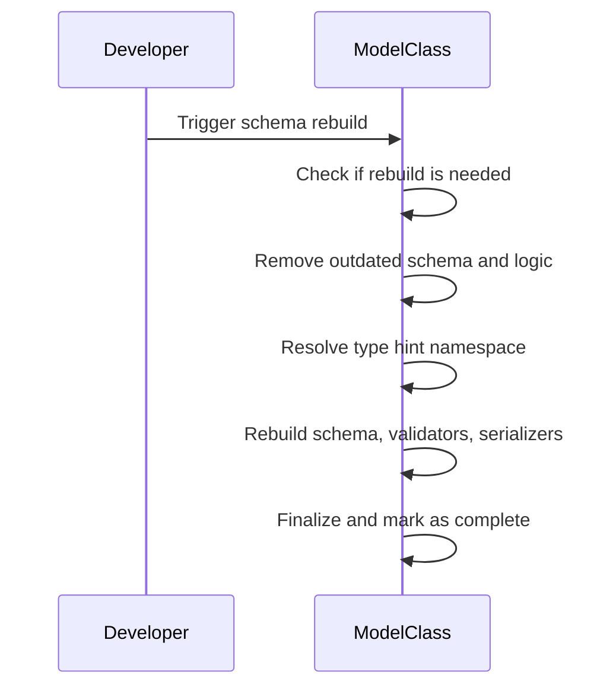
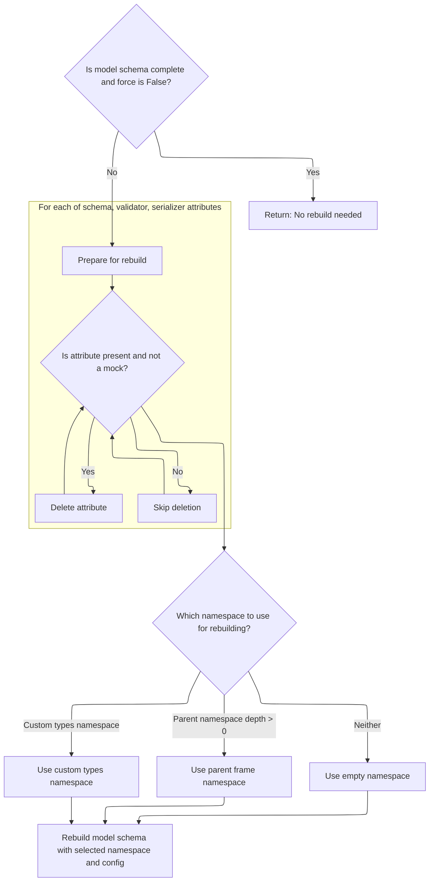
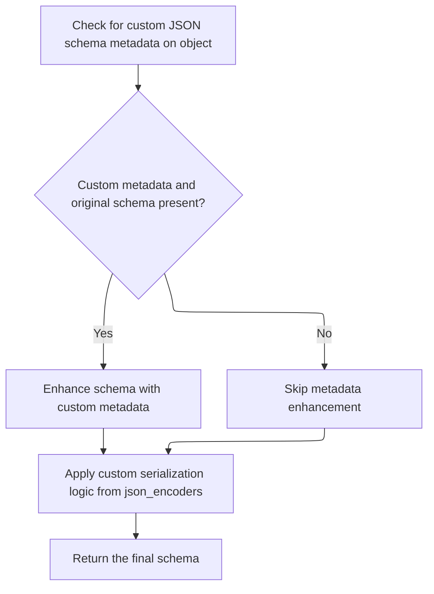
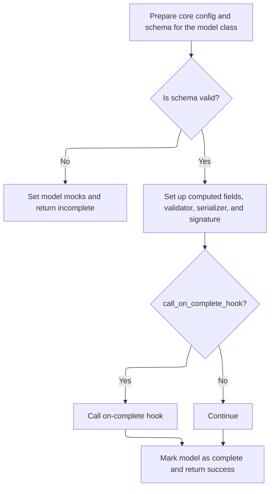

This document explains how a model's schema and validation logic are rebuilt to reflect the latest type annotations and configuration. This process ensures that models remain accurate and ready for data validation and serialization when their structure changes or forward references are resolved.

The main steps are:

- Assess if rebuilding is needed
- Remove outdated schema and validation logic
- Resolve the namespace for type hints
- Rebuild the schema, validators, and serializers
- Finalize and mark the model as complete



# Where is this flow used?

This flow is used multiple times in the codebase as represented in the following diagram:

```mermaid
graph TD;
      43a6baf44f877182cf37d9da8c2937d44be954f1be8aacbb4f6d4bf758d05203(pydantic/main.py::__class_getitem__) --> 2629968df57e5ee347551103b3d4611152a9bfc82adeffac7fb105bf188ddc0a(pydantic/main.py::model_rebuild):::mainFlowStyle

b69d34d7c726a40aabc5a9d21ffd08fffd6a577cf2ca79e6332520c2157173c0(pydantic/main.py::update_forward_refs) --> 2629968df57e5ee347551103b3d4611152a9bfc82adeffac7fb105bf188ddc0a(pydantic/main.py::model_rebuild):::mainFlowStyle


classDef mainFlowStyle color:#000000,fill:#7CB9F4
classDef rootsStyle color:#000000,fill:#00FFF4
classDef Style1 color:#000000,fill:#00FFAA
classDef Style2 color:#000000,fill:#FFFF00
classDef Style3 color:#000000,fill:#AA7CB9

%% Swimm:
%% graph TD;
%%       43a6baf44f877182cf37d9da8c2937d44be954f1be8aacbb4f6d4bf758d05203(<SwmPath>[pydantic/main.py](pydantic/main.py)</SwmPath>::<SwmToken path="pydantic/main.py" pos="584:25:25" line-data="        # If we eventually move toward wrapping them in a ForwardRef in __class_getitem__ in the future,">`__class_getitem__`</SwmToken>) --> 2629968df57e5ee347551103b3d4611152a9bfc82adeffac7fb105bf188ddc0a(<SwmPath>[pydantic/main.py](pydantic/main.py)</SwmPath>::<SwmToken path="pydantic/main.py" pos="596:3:3" line-data="    def model_rebuild(">`model_rebuild`</SwmToken>):::mainFlowStyle
%% 
%% b69d34d7c726a40aabc5a9d21ffd08fffd6a577cf2ca79e6332520c2157173c0(<SwmPath>[pydantic/main.py](pydantic/main.py)</SwmPath>::<SwmToken path="pydantic/main.py" pos="1577:5:5" line-data="        &#39;The `update_forward_refs` method is deprecated; use `model_rebuild` instead.&#39;,">`update_forward_refs`</SwmToken>) --> 2629968df57e5ee347551103b3d4611152a9bfc82adeffac7fb105bf188ddc0a(<SwmPath>[pydantic/main.py](pydantic/main.py)</SwmPath>::<SwmToken path="pydantic/main.py" pos="596:3:3" line-data="    def model_rebuild(">`model_rebuild`</SwmToken>):::mainFlowStyle
%% 
%% 
%% classDef mainFlowStyle color:#000000,fill:#7CB9F4
%% classDef rootsStyle color:#000000,fill:#00FFF4
%% classDef Style1 color:#000000,fill:#00FFAA
%% classDef Style2 color:#000000,fill:#FFFF00
%% classDef Style3 color:#000000,fill:#AA7CB9
```



# Spec

## Detailed View of the Program's Functionality

a. Checking If Model Schema Needs Rebuilding

When the process to rebuild a model's schema is triggered, the first step is to determine whether rebuilding is actually necessary. This is done by checking if the model is already marked as "complete" and if the operation is not being forced. If both conditions are true (the schema is complete and no force flag is set), the process exits early, indicating that no rebuild is needed.

b. Preparing for Schema Rebuild

If rebuilding is required (either because the schema is incomplete or the force flag is set), the model is marked as incomplete to signal that a rebuild is in progress. Next, the process iterates over a set of core attributes related to schema, validation, and serialization. For each of these attributes, if it exists on the model and is not a special "mock" placeholder, it is deleted. This ensures that any outdated or potentially incorrect logic is removed, preventing accidental reuse of stale components during the rebuild.

c. Determining the Namespace for Type Resolution

After clearing out old attributes, the next step is to determine the appropriate namespace to use for resolving type hints and forward references. The process checks for a custom namespace provided by the caller; if present, it is used. If not, and if a parent namespace depth is specified, the namespace is extracted from the parent frame in the call stack. If neither condition applies, an empty namespace is used. This namespace is then merged with any parent namespace associated with the model itself, ensuring that all relevant symbols are available for type resolution.

d. Building the Namespace Resolver and Initiating Schema Completion

With the namespace determined, a namespace resolver object is created. This resolver is responsible for providing the correct context when evaluating type hints and annotations during schema generation. The process then calls a function responsible for completing the model class, passing in the model, its configuration, the namespace resolver, and flags indicating whether to raise errors and whether to call any completion hooks.

e. Ensuring Model Fields Are Built and Complete

Within the schema completion function, the first step is to ensure that all model fields are properly built and that any unresolved annotations are handled. If the fields are not yet complete, an attempt is made to rebuild them. If this fails due to unresolved names, a special error is raised or the model is set to a "mock" state, depending on the error handling configuration. If fields remain incomplete and errors are not to be raised, the process exits early, indicating failure.

f. Generating the Core Schema

Once fields are confirmed to be complete, a schema generator object is created. This object is responsible for producing the core schema that defines the model's structure, validation, and serialization logic. The generator's main method is called with the model class as input, which delegates the actual schema generation to an internal method.

g. Handling Custom Schema Generation and Forward References

The schema generator first checks if the object (the model class) provides a custom method for generating its schema. If such a method exists, it is used; otherwise, the generator falls back to its internal logic for building the schema from scratch. This logic handles various cases, including resolving forward references, handling generic types, and supporting special constructs like unions, annotated types, and more.

h. Attaching Custom JSON Schema Metadata and Serialization

After the core schema is generated, the process checks if the object provides any custom logic for JSON schema generation. If such logic is found, it is attached to the schema as metadata. Additionally, if there are any custom serialization functions specified (for example, via a mapping of types to encoder functions), these are incorporated into the schema as well.

i. Finalizing the Schema and Model Setup

The generated schema is then cleaned up and finalized. The process sets up any computed fields, assigns the finalized schema, validator, and serializer to the model, and updates the model's signature for introspection. The model is then marked as complete. If a completion hook is specified and should be called, it is invoked at this point.

j. Returning the Result of the Rebuild

Finally, the process returns a status indicating whether the rebuild was successful. If the schema was already complete and no rebuild was needed, the result is "no action." If rebuilding was required and succeeded, the result is "success." If rebuilding failed due to unresolved annotations or other errors, the result is "failure."

# Rule Definition

| Paragraph Name                                                                                                                                                                                                                                                                                                                                                                                                                                                                                                                                                                                                                                                                                                                                                                                                                                                                                         | Rule ID | Category          | Description                                                                                                                                                                                                                                                                                                                                                                                                                                                                                                                                                                                                                                                                                                                                                                                                                                                                                                                                                                                                                                                                                                                                                                                                                                                                                                                                                                                     | Conditions                                                                                        | Remarks                                                                                                                                                                                                                                                                                                                                                                                                                                                                                                                            |
| ------------------------------------------------------------------------------------------------------------------------------------------------------------------------------------------------------------------------------------------------------------------------------------------------------------------------------------------------------------------------------------------------------------------------------------------------------------------------------------------------------------------------------------------------------------------------------------------------------------------------------------------------------------------------------------------------------------------------------------------------------------------------------------------------------------------------------------------------------------------------------------------------------ | ------- | ----------------- | ----------------------------------------------------------------------------------------------------------------------------------------------------------------------------------------------------------------------------------------------------------------------------------------------------------------------------------------------------------------------------------------------------------------------------------------------------------------------------------------------------------------------------------------------------------------------------------------------------------------------------------------------------------------------------------------------------------------------------------------------------------------------------------------------------------------------------------------------------------------------------------------------------------------------------------------------------------------------------------------------------------------------------------------------------------------------------------------------------------------------------------------------------------------------------------------------------------------------------------------------------------------------------------------------------------------------------------------------------------------------------------------------- | ------------------------------------------------------------------------------------------------- | ---------------------------------------------------------------------------------------------------------------------------------------------------------------------------------------------------------------------------------------------------------------------------------------------------------------------------------------------------------------------------------------------------------------------------------------------------------------------------------------------------------------------------------- |
| <SwmToken path="pydantic/main.py" pos="848:13:15" line-data="        [`model_rebuild()`][pydantic.main.BaseModel.model_rebuild].">`BaseModel.model_rebuild`</SwmToken>                                                                                                                                                                                                                                                                                                                                                                                                                                                                                                                                                                                                                                                                                                                                 | RL-001  | Conditional Logic | A model schema rebuild is only triggered if the model's **pydantic_complete** flag is False, or if the force argument is True. If neither condition is met, no rebuild occurs.                                                                                                                                                                                                                                                                                                                                                                                                                                                                                                                                                                                                                                                                                                                                                                                                                                                                                                                                                                                                                                                                                                                                                                                                                  | The model's **pydantic_complete** is False, or the force argument is True.                        | The **pydantic_complete** attribute is a boolean. The force argument defaults to False.                                                                                                                                                                                                                                                                                                                                                                                                                                            |
| <SwmToken path="pydantic/main.py" pos="848:13:15" line-data="        [`model_rebuild()`][pydantic.main.BaseModel.model_rebuild].">`BaseModel.model_rebuild`</SwmToken>                                                                                                                                                                                                                                                                                                                                                                                                                                                                                                                                                                                                                                                                                                                                 | RL-002  | Data Assignment   | When a rebuild is required, the model's **pydantic_complete** flag is set to False. For each of **pydantic_core_schema**, **pydantic_validator**, and **pydantic_serializer**, if the attribute exists and is not a mock, it is removed from the class.                                                                                                                                                                                                                                                                                                                                                                                                                                                                                                                                                                                                                                                                                                                                                                                                                                                                                                                                                                                                                                                                                                                                         | A rebuild is required (see previous rule).                                                        | Mock types are <SwmToken path="pydantic/main.py" pos="226:7:7" line-data="        __pydantic_core_schema__ = _mock_val_ser.MockCoreSchema(">`MockCoreSchema`</SwmToken> and <SwmToken path="pydantic/main.py" pos="626:28:28" line-data="            if attr in cls.__dict__ and not isinstance(getattr(cls, attr), _mock_val_ser.MockValSer):">`MockValSer`</SwmToken>. Attributes are class-level.                                                                                                                               |
| <SwmToken path="pydantic/main.py" pos="848:13:15" line-data="        [`model_rebuild()`][pydantic.main.BaseModel.model_rebuild].">`BaseModel.model_rebuild`</SwmToken>                                                                                                                                                                                                                                                                                                                                                                                                                                                                                                                                                                                                                                                                                                                                 | RL-003  | Conditional Logic | The namespace for resolving type hints is determined by: using <SwmToken path="pydantic/main.py" pos="602:1:1" line-data="        _types_namespace: MappingNamespace \| None = None,">`_types_namespace`</SwmToken> if provided; otherwise, if <SwmToken path="pydantic/main.py" pos="601:1:1" line-data="        _parent_namespace_depth: int = 2,">`_parent_namespace_depth`</SwmToken> > 0, using the parent stack frame's namespace; otherwise, using an empty namespace. The model's **pydantic_parent_namespace**, if present, is merged into the resolved namespace.                                                                                                                                                                                                                                                                                                                                                                                                                                                                                                                                                                                                                                                                                                                                                                                                                     | During model rebuild, when type hint resolution is needed.                                        | <SwmToken path="pydantic/main.py" pos="602:1:1" line-data="        _types_namespace: MappingNamespace \| None = None,">`_types_namespace`</SwmToken> is a <SwmToken path="pydantic/main.py" pos="602:4:4" line-data="        _types_namespace: MappingNamespace \| None = None,">`MappingNamespace`</SwmToken> or None. <SwmToken path="pydantic/main.py" pos="601:1:1" line-data="        _parent_namespace_depth: int = 2,">`_parent_namespace_depth`</SwmToken> defaults to 2. **pydantic_parent_namespace** is a dict or None. |
| <SwmToken path="pydantic/main.py" pos="848:13:15" line-data="        [`model_rebuild()`][pydantic.main.BaseModel.model_rebuild].">`BaseModel.model_rebuild`</SwmToken>, <SwmToken path="pydantic/main.py" pos="646:5:5" line-data="        return _model_construction.complete_model_class(">`complete_model_class`</SwmToken> in <SwmPath>[pydantic/\_internal/\_model_construction.py](pydantic/_internal/_model_construction.py)</SwmPath>                                                                                                                                                                                                                                                                                                                                                                                                                                                          | RL-004  | Computation       | After resolving the namespace, the model's schema, validator, and serializer are rebuilt using the resolved namespace and the current model configuration.                                                                                                                                                                                                                                                                                                                                                                                                                                                                                                                                                                                                                                                                                                                                                                                                                                                                                                                                                                                                                                                                                                                                                                                                                                      | A rebuild is required and the namespace has been resolved.                                        | Schema is a dict with at least a 'type' key. Validator and serializer must be callable and have required methods.                                                                                                                                                                                                                                                                                                                                                                                                                  |
| <SwmToken path="pydantic/_internal/_model_construction.py" pos="579:6:6" line-data="    cls: type[BaseModel],">`BaseModel`</SwmToken> class definition, <SwmToken path="pydantic/_internal/_model_construction.py" pos="610:13:13" line-data="        # Note: when coming from `ModelMetaclass.__new__()`, this results in fields being built twice.">`ModelMetaclass`</SwmToken>, <SwmToken path="pydantic/main.py" pos="646:5:5" line-data="        return _model_construction.complete_model_class(">`complete_model_class`</SwmToken>                                                                                                                                                                                                                                                                                                                                                              | RL-005  | Data Assignment   | The model class must have the following attributes: **pydantic_core_schema**, **pydantic_validator**, **pydantic_serializer**, **pydantic_fields**, **pydantic_computed_fields**, **pydantic_decorators**, **pydantic_complete**, **pydantic_parent_namespace**.                                                                                                                                                                                                                                                                                                                                                                                                                                                                                                                                                                                                                                                                                                                                                                                                                                                                                                                                                                                                                                                                                                                                | For any model class used with Pydantic.                                                           | Each attribute has a specific type and purpose. For example, **pydantic_core_schema** is a dict with at least a 'type' key.                                                                                                                                                                                                                                                                                                                                                                                                        |
| <SwmToken path="pydantic/main.py" pos="784:12:14" line-data="        # Logic copied over from `GenerateSchema._model_schema`:">`GenerateSchema._model_schema`</SwmToken>, GenerateSchema.generate_schema, <SwmToken path="pydantic/_internal/_generate_schema.py" pos="836:7:7" line-data="                    root_field = self._common_field_schema(&#39;root&#39;, fields[&#39;root&#39;], decorators)">`_common_field_schema`</SwmToken>, <SwmToken path="pydantic/_internal/_generate_schema.py" pos="730:3:3" line-data="                self._add_js_function(metadata_schema, metadata_js_function)">`_add_js_function`</SwmToken>, <SwmToken path="pydantic/_internal/_generate_schema.py" pos="732:5:5" line-data="        schema = _add_custom_serialization_from_json_encoders(self._config_wrapper.json_encoders, obj, schema)">`_add_custom_serialization_from_json_encoders`</SwmToken> | RL-006  | Computation       | During schema generation, all model fields must be defined and type annotations resolved. The schema must be a dict with at least a 'type' key. If custom JSON schema metadata is present (via **get_pydantic_json_schema**), it is attached under a metadata.pydantic_js_functions list. Custom serializers (via decorators or <SwmToken path="pydantic/_internal/_generate_schema.py" pos="732:11:11" line-data="        schema = _add_custom_serialization_from_json_encoders(self._config_wrapper.json_encoders, obj, schema)">`json_encoders`</SwmToken>) are attached under a serialization key.                                                                                                                                                                                                                                                                                                                                                                                                                                                                                                                                                                                                                                                                                                                                                                                          | During schema generation for a model.                                                             | Schema is a dict with at least a 'type' key. Metadata is attached under metadata.pydantic_js_functions (a list). Serializers are attached under a serialization key.                                                                                                                                                                                                                                                                                                                                                               |
| <SwmToken path="pydantic/main.py" pos="646:5:5" line-data="        return _model_construction.complete_model_class(">`complete_model_class`</SwmToken> in <SwmPath>[pydantic/\_internal/\_model_construction.py](pydantic/_internal/_model_construction.py)</SwmPath>, <SwmToken path="pydantic/main.py" pos="848:13:15" line-data="        [`model_rebuild()`][pydantic.main.BaseModel.model_rebuild].">`BaseModel.model_rebuild`</SwmToken>                                                                                                                                                                                                                                                                                                                                                                                                                                                          | RL-007  | Data Assignment   | After schema generation, the model's computed fields, validator, serializer, and function signature are set up. If a completion hook is specified, it is called. The model is marked as complete by setting **pydantic_complete** to True. The process returns a status indicating success.                                                                                                                                                                                                                                                                                                                                                                                                                                                                                                                                                                                                                                                                                                                                                                                                                                                                                                                                                                                                                                                                                                     | After schema generation and setup.                                                                | **pydantic_complete** is set to True. Status is returned as True/False/None.                                                                                                                                                                                                                                                                                                                                                                                                                                                       |
| <SwmPath>[pydantic/\_internal/\_mock_val_ser.py](pydantic/_internal/_mock_val_ser.py)</SwmPath>, <SwmPath>[pydantic/\_internal/\_namespace_utils.py](pydantic/_internal/_namespace_utils.py)</SwmPath>, <SwmPath>[pydantic/\_internal/\_config.py](pydantic/_internal/_config.py)</SwmPath>, schema generation logic                                                                                                                                                                                                                                                                                                                                                                                                                                                                                                                                                                                   | RL-008  | Data Assignment   | The system requires minimal interfaces for mock types (<SwmToken path="pydantic/main.py" pos="626:28:28" line-data="            if attr in cls.__dict__ and not isinstance(getattr(cls, attr), _mock_val_ser.MockValSer):">`MockValSer`</SwmToken>, <SwmToken path="pydantic/main.py" pos="226:7:7" line-data="        __pydantic_core_schema__ = _mock_val_ser.MockCoreSchema(">`MockCoreSchema`</SwmToken>), a namespace resolver (<SwmToken path="pydantic/main.py" pos="642:7:7" line-data="        ns_resolver = _namespace_utils.NsResolver(">`NsResolver`</SwmToken>), a config wrapper (<SwmToken path="pydantic/main.py" pos="648:3:3" line-data="            _config.ConfigWrapper(cls.model_config, check=False),">`ConfigWrapper`</SwmToken>), a validator (callable with <SwmToken path="pydantic/main.py" pos="253:9:9" line-data="        validated_self = self.__pydantic_validator__.validate_python(data, self_instance=self)">`validate_python`</SwmToken>), a serializer (callable with <SwmToken path="pydantic/main.py" pos="443:13:13" line-data="            mode: The mode in which `to_python` should run.">`to_python`</SwmToken> and <SwmToken path="pydantic/main.py" pos="499:22:22" line-data="        Generates a JSON representation of the model using Pydantic&#39;s `to_json` method.">`to_json`</SwmToken>), and a schema (dict with at least 'type' key). | For all model schema and validation operations.                                                   | Each interface must provide the required methods and structure.                                                                                                                                                                                                                                                                                                                                                                                                                                                                    |
| <SwmToken path="pydantic/main.py" pos="848:13:15" line-data="        [`model_rebuild()`][pydantic.main.BaseModel.model_rebuild].">`BaseModel.model_rebuild`</SwmToken>                                                                                                                                                                                                                                                                                                                                                                                                                                                                                                                                                                                                                                                                                                                                 | RL-009  | Conditional Logic | The rebuild process is not triggered by changes to configuration, fields, or parent namespace unless the model's **pydantic_complete** flag is False or the force argument is True.                                                                                                                                                                                                                                                                                                                                                                                                                                                                                                                                                                                                                                                                                                                                                                                                                                                                                                                                                                                                                                                                                                                                                                                                             | Config, fields, or parent namespace change, but **pydantic_complete** is True and force is False. | This prevents unnecessary rebuilds.                                                                                                                                                                                                                                                                                                                                                                                                                                                                                                |

# User Stories

## User Story 1: Conditional model rebuild trigger

---

### Story Description:

As a system, I want to only trigger a model schema rebuild when the model is incomplete or when explicitly forced, so that unnecessary rebuilds are avoided and performance is optimized.

---

### Business Rule Mapping:

| Rule ID | Paragraph Name                                                                                                                                                         | Rule Description                                                                                                                                                                    |
| ------- | ---------------------------------------------------------------------------------------------------------------------------------------------------------------------- | ----------------------------------------------------------------------------------------------------------------------------------------------------------------------------------- |
| RL-001  | <SwmToken path="pydantic/main.py" pos="848:13:15" line-data="        [`model_rebuild()`][pydantic.main.BaseModel.model_rebuild].">`BaseModel.model_rebuild`</SwmToken> | A model schema rebuild is only triggered if the model's **pydantic_complete** flag is False, or if the force argument is True. If neither condition is met, no rebuild occurs.      |
| RL-009  | <SwmToken path="pydantic/main.py" pos="848:13:15" line-data="        [`model_rebuild()`][pydantic.main.BaseModel.model_rebuild].">`BaseModel.model_rebuild`</SwmToken> | The rebuild process is not triggered by changes to configuration, fields, or parent namespace unless the model's **pydantic_complete** flag is False or the force argument is True. |

---

### Relevant Functionality:

- <SwmToken path="pydantic/main.py" pos="848:13:15" line-data="        [`model_rebuild()`][pydantic.main.BaseModel.model_rebuild].">`BaseModel.model_rebuild`</SwmToken>
  1. **RL-001:**
     - If **pydantic_complete** is True and force is False:
       - Return None (no rebuild needed)
     - Otherwise, proceed with rebuild
  2. **RL-009:**
     - If **pydantic_complete** is True and force is False:
       - Do not rebuild, return None

## User Story 2: Model rebuild process and attribute management

---

### Story Description:

As a system, I want to properly reset model completion status and manage schema, validator, and serializer attributes during a rebuild, ensuring that only non-mock attributes are removed and all required model attributes and interfaces are present, so that the model remains consistent and valid for further operations.

---

### Business Rule Mapping:

| Rule ID | Paragraph Name                                                                                                                                                                                                                                                                                                                                                                                                                                                                                                                            | Rule Description                                                                                                                                                                                                                                                                                                                                                                                                                                                                                                                                                                                                                                                                                                                                                                                                                                                                                                                                                                                                                                                                                                                                                                                                                                                                                                                                                                                |
| ------- | ----------------------------------------------------------------------------------------------------------------------------------------------------------------------------------------------------------------------------------------------------------------------------------------------------------------------------------------------------------------------------------------------------------------------------------------------------------------------------------------------------------------------------------------- | ----------------------------------------------------------------------------------------------------------------------------------------------------------------------------------------------------------------------------------------------------------------------------------------------------------------------------------------------------------------------------------------------------------------------------------------------------------------------------------------------------------------------------------------------------------------------------------------------------------------------------------------------------------------------------------------------------------------------------------------------------------------------------------------------------------------------------------------------------------------------------------------------------------------------------------------------------------------------------------------------------------------------------------------------------------------------------------------------------------------------------------------------------------------------------------------------------------------------------------------------------------------------------------------------------------------------------------------------------------------------------------------------- |
| RL-002  | <SwmToken path="pydantic/main.py" pos="848:13:15" line-data="        [`model_rebuild()`][pydantic.main.BaseModel.model_rebuild].">`BaseModel.model_rebuild`</SwmToken>                                                                                                                                                                                                                                                                                                                                                                    | When a rebuild is required, the model's **pydantic_complete** flag is set to False. For each of **pydantic_core_schema**, **pydantic_validator**, and **pydantic_serializer**, if the attribute exists and is not a mock, it is removed from the class.                                                                                                                                                                                                                                                                                                                                                                                                                                                                                                                                                                                                                                                                                                                                                                                                                                                                                                                                                                                                                                                                                                                                         |
| RL-005  | <SwmToken path="pydantic/_internal/_model_construction.py" pos="579:6:6" line-data="    cls: type[BaseModel],">`BaseModel`</SwmToken> class definition, <SwmToken path="pydantic/_internal/_model_construction.py" pos="610:13:13" line-data="        # Note: when coming from `ModelMetaclass.__new__()`, this results in fields being built twice.">`ModelMetaclass`</SwmToken>, <SwmToken path="pydantic/main.py" pos="646:5:5" line-data="        return _model_construction.complete_model_class(">`complete_model_class`</SwmToken> | The model class must have the following attributes: **pydantic_core_schema**, **pydantic_validator**, **pydantic_serializer**, **pydantic_fields**, **pydantic_computed_fields**, **pydantic_decorators**, **pydantic_complete**, **pydantic_parent_namespace**.                                                                                                                                                                                                                                                                                                                                                                                                                                                                                                                                                                                                                                                                                                                                                                                                                                                                                                                                                                                                                                                                                                                                |
| RL-008  | <SwmPath>[pydantic/\_internal/\_mock_val_ser.py](pydantic/_internal/_mock_val_ser.py)</SwmPath>, <SwmPath>[pydantic/\_internal/\_namespace_utils.py](pydantic/_internal/_namespace_utils.py)</SwmPath>, <SwmPath>[pydantic/\_internal/\_config.py](pydantic/_internal/_config.py)</SwmPath>, schema generation logic                                                                                                                                                                                                                      | The system requires minimal interfaces for mock types (<SwmToken path="pydantic/main.py" pos="626:28:28" line-data="            if attr in cls.__dict__ and not isinstance(getattr(cls, attr), _mock_val_ser.MockValSer):">`MockValSer`</SwmToken>, <SwmToken path="pydantic/main.py" pos="226:7:7" line-data="        __pydantic_core_schema__ = _mock_val_ser.MockCoreSchema(">`MockCoreSchema`</SwmToken>), a namespace resolver (<SwmToken path="pydantic/main.py" pos="642:7:7" line-data="        ns_resolver = _namespace_utils.NsResolver(">`NsResolver`</SwmToken>), a config wrapper (<SwmToken path="pydantic/main.py" pos="648:3:3" line-data="            _config.ConfigWrapper(cls.model_config, check=False),">`ConfigWrapper`</SwmToken>), a validator (callable with <SwmToken path="pydantic/main.py" pos="253:9:9" line-data="        validated_self = self.__pydantic_validator__.validate_python(data, self_instance=self)">`validate_python`</SwmToken>), a serializer (callable with <SwmToken path="pydantic/main.py" pos="443:13:13" line-data="            mode: The mode in which `to_python` should run.">`to_python`</SwmToken> and <SwmToken path="pydantic/main.py" pos="499:22:22" line-data="        Generates a JSON representation of the model using Pydantic&#39;s `to_json` method.">`to_json`</SwmToken>), and a schema (dict with at least 'type' key). |

---

### Relevant Functionality:

- <SwmToken path="pydantic/main.py" pos="848:13:15" line-data="        [`model_rebuild()`][pydantic.main.BaseModel.model_rebuild].">`BaseModel.model_rebuild`</SwmToken>
  1. **RL-002:**
     - Set **pydantic_complete** to False
     - For each of **pydantic_core_schema**, **pydantic_validator**, **pydantic_serializer**:
       - If attribute exists and is not a mock:
         - Remove attribute from class
- <SwmToken path="pydantic/_internal/_model_construction.py" pos="579:6:6" line-data="    cls: type[BaseModel],">`BaseModel`</SwmToken> **class definition**
  1. **RL-005:**
     - Ensure all required attributes are present on the model class
     - Set or update them as needed during model creation and rebuild
- <SwmPath>[pydantic/\_internal/\_mock_val_ser.py](pydantic/_internal/_mock_val_ser.py)</SwmPath>
  1. **RL-008:**
     - Use mock types for instance checks
     - Use <SwmToken path="pydantic/main.py" pos="642:7:7" line-data="        ns_resolver = _namespace_utils.NsResolver(">`NsResolver`</SwmToken> for namespace resolution
     - Use <SwmToken path="pydantic/main.py" pos="648:3:3" line-data="            _config.ConfigWrapper(cls.model_config, check=False),">`ConfigWrapper`</SwmToken> for config
     - Ensure validator and serializer have required methods
     - Schema must be dict with at least 'type' key

## User Story 3: Schema generation, namespace resolution, and model setup

---

### Story Description:

As a system, I want to resolve the namespace for type hinting, generate the model schema with all fields and type annotations resolved, attach custom JSON schema metadata and serializers if present, and set up the model's computed fields, validator, serializer, and function signature, so that the model is fully prepared for validation and serialization tasks.

---

### Business Rule Mapping:

| Rule ID | Paragraph Name                                                                                                                                                                                                                                                                                                                                                                                                                                                                                                                                                                                                                                                                                                                                                                                                                                                                                         | Rule Description                                                                                                                                                                                                                                                                                                                                                                                                                                                                                                                                                                                       |
| ------- | ------------------------------------------------------------------------------------------------------------------------------------------------------------------------------------------------------------------------------------------------------------------------------------------------------------------------------------------------------------------------------------------------------------------------------------------------------------------------------------------------------------------------------------------------------------------------------------------------------------------------------------------------------------------------------------------------------------------------------------------------------------------------------------------------------------------------------------------------------------------------------------------------------ | ------------------------------------------------------------------------------------------------------------------------------------------------------------------------------------------------------------------------------------------------------------------------------------------------------------------------------------------------------------------------------------------------------------------------------------------------------------------------------------------------------------------------------------------------------------------------------------------------------ |
| RL-003  | <SwmToken path="pydantic/main.py" pos="848:13:15" line-data="        [`model_rebuild()`][pydantic.main.BaseModel.model_rebuild].">`BaseModel.model_rebuild`</SwmToken>                                                                                                                                                                                                                                                                                                                                                                                                                                                                                                                                                                                                                                                                                                                                 | The namespace for resolving type hints is determined by: using <SwmToken path="pydantic/main.py" pos="602:1:1" line-data="        _types_namespace: MappingNamespace \| None = None,">`_types_namespace`</SwmToken> if provided; otherwise, if <SwmToken path="pydantic/main.py" pos="601:1:1" line-data="        _parent_namespace_depth: int = 2,">`_parent_namespace_depth`</SwmToken> > 0, using the parent stack frame's namespace; otherwise, using an empty namespace. The model's **pydantic_parent_namespace**, if present, is merged into the resolved namespace.                            |
| RL-004  | <SwmToken path="pydantic/main.py" pos="848:13:15" line-data="        [`model_rebuild()`][pydantic.main.BaseModel.model_rebuild].">`BaseModel.model_rebuild`</SwmToken>, <SwmToken path="pydantic/main.py" pos="646:5:5" line-data="        return _model_construction.complete_model_class(">`complete_model_class`</SwmToken> in <SwmPath>[pydantic/\_internal/\_model_construction.py](pydantic/_internal/_model_construction.py)</SwmPath>                                                                                                                                                                                                                                                                                                                                                                                                                                                          | After resolving the namespace, the model's schema, validator, and serializer are rebuilt using the resolved namespace and the current model configuration.                                                                                                                                                                                                                                                                                                                                                                                                                                             |
| RL-006  | <SwmToken path="pydantic/main.py" pos="784:12:14" line-data="        # Logic copied over from `GenerateSchema._model_schema`:">`GenerateSchema._model_schema`</SwmToken>, GenerateSchema.generate_schema, <SwmToken path="pydantic/_internal/_generate_schema.py" pos="836:7:7" line-data="                    root_field = self._common_field_schema(&#39;root&#39;, fields[&#39;root&#39;], decorators)">`_common_field_schema`</SwmToken>, <SwmToken path="pydantic/_internal/_generate_schema.py" pos="730:3:3" line-data="                self._add_js_function(metadata_schema, metadata_js_function)">`_add_js_function`</SwmToken>, <SwmToken path="pydantic/_internal/_generate_schema.py" pos="732:5:5" line-data="        schema = _add_custom_serialization_from_json_encoders(self._config_wrapper.json_encoders, obj, schema)">`_add_custom_serialization_from_json_encoders`</SwmToken> | During schema generation, all model fields must be defined and type annotations resolved. The schema must be a dict with at least a 'type' key. If custom JSON schema metadata is present (via **get_pydantic_json_schema**), it is attached under a metadata.pydantic_js_functions list. Custom serializers (via decorators or <SwmToken path="pydantic/_internal/_generate_schema.py" pos="732:11:11" line-data="        schema = _add_custom_serialization_from_json_encoders(self._config_wrapper.json_encoders, obj, schema)">`json_encoders`</SwmToken>) are attached under a serialization key. |
| RL-007  | <SwmToken path="pydantic/main.py" pos="646:5:5" line-data="        return _model_construction.complete_model_class(">`complete_model_class`</SwmToken> in <SwmPath>[pydantic/\_internal/\_model_construction.py](pydantic/_internal/_model_construction.py)</SwmPath>, <SwmToken path="pydantic/main.py" pos="848:13:15" line-data="        [`model_rebuild()`][pydantic.main.BaseModel.model_rebuild].">`BaseModel.model_rebuild`</SwmToken>                                                                                                                                                                                                                                                                                                                                                                                                                                                          | After schema generation, the model's computed fields, validator, serializer, and function signature are set up. If a completion hook is specified, it is called. The model is marked as complete by setting **pydantic_complete** to True. The process returns a status indicating success.                                                                                                                                                                                                                                                                                                            |

---

### Relevant Functionality:

- <SwmToken path="pydantic/main.py" pos="848:13:15" line-data="        [`model_rebuild()`][pydantic.main.BaseModel.model_rebuild].">`BaseModel.model_rebuild`</SwmToken>
  1. **RL-003:**
     - If <SwmToken path="pydantic/main.py" pos="602:1:1" line-data="        _types_namespace: MappingNamespace | None = None,">`_types_namespace`</SwmToken> is not None:
       - Use <SwmToken path="pydantic/main.py" pos="602:1:1" line-data="        _types_namespace: MappingNamespace | None = None,">`_types_namespace`</SwmToken> as namespace
     - Else if <SwmToken path="pydantic/main.py" pos="601:1:1" line-data="        _parent_namespace_depth: int = 2,">`_parent_namespace_depth`</SwmToken> > 0:
       - Use <SwmToken path="pydantic/main.py" pos="636:7:7" line-data="            rebuild_ns = _typing_extra.parent_frame_namespace(parent_depth=_parent_namespace_depth, force=True) or {}">`parent_frame_namespace`</SwmToken>(<SwmToken path="pydantic/main.py" pos="636:9:9" line-data="            rebuild_ns = _typing_extra.parent_frame_namespace(parent_depth=_parent_namespace_depth, force=True) or {}">`parent_depth`</SwmToken>=<SwmToken path="pydantic/main.py" pos="601:1:1" line-data="        _parent_namespace_depth: int = 2,">`_parent_namespace_depth`</SwmToken>, force=True) or {}
     - Else:
       - Use {}
     - Merge in **pydantic_parent_namespace** (if present) into the namespace
  2. **RL-004:**
     - Call <SwmToken path="pydantic/main.py" pos="646:5:5" line-data="        return _model_construction.complete_model_class(">`complete_model_class`</SwmToken> with:
       - model class
       - config wrapper
       - namespace resolver
       - <SwmToken path="pydantic/main.py" pos="600:1:1" line-data="        raise_errors: bool = True,">`raise_errors`</SwmToken> and <SwmToken path="pydantic/main.py" pos="652:1:1" line-data="            call_on_complete_hook=not already_complete,">`call_on_complete_hook`</SwmToken> as needed
     - <SwmToken path="pydantic/main.py" pos="646:5:5" line-data="        return _model_construction.complete_model_class(">`complete_model_class`</SwmToken> generates schema, validator, serializer, and sets up computed fields and signature
- <SwmToken path="pydantic/main.py" pos="784:12:14" line-data="        # Logic copied over from `GenerateSchema._model_schema`:">`GenerateSchema._model_schema`</SwmToken>
  1. **RL-006:**
     - Resolve all fields and type annotations
     - Generate schema dict with at least 'type' key
     - If **get_pydantic_json_schema** is present:
       - Attach function to metadata.pydantic_js_functions (list)
     - If custom serializers are defined:
       - Attach to serialization key
- <SwmToken path="pydantic/main.py" pos="646:5:5" line-data="        return _model_construction.complete_model_class(">`complete_model_class`</SwmToken> **in** <SwmPath>[pydantic/\_internal/\_model_construction.py](pydantic/_internal/_model_construction.py)</SwmPath>
  1. **RL-007:**
     - Set up computed fields, validator, serializer, and signature based on schema
     - If <SwmToken path="pydantic/main.py" pos="652:1:1" line-data="            call_on_complete_hook=not already_complete,">`call_on_complete_hook`</SwmToken> is True:
       - Call **pydantic_on_complete**
     - Set **pydantic_complete** to True
     - Return True if successful, False if not, None if not needed

# Code Walkthrough

## Triggering Model Schema Rebuild



<SwmSnippet path="/pydantic/main.py" line="596">

---

In <SwmToken path="pydantic/main.py" pos="596:3:3" line-data="    def model_rebuild(">`model_rebuild`</SwmToken>, we check if the model is already marked as complete and skip rebuilding unless forced. If rebuilding is needed, we mark the model as incomplete and remove any existing core schema, validator, or serializer attributes—unless they're mocks—to avoid reusing outdated logic. This sets up the model for a clean rebuild.

```python
    def model_rebuild(
        cls,
        *,
        force: bool = False,
        raise_errors: bool = True,
        _parent_namespace_depth: int = 2,
        _types_namespace: MappingNamespace | None = None,
    ) -> bool | None:
        """Try to rebuild the pydantic-core schema for the model.

        This may be necessary when one of the annotations is a ForwardRef which could not be resolved during
        the initial attempt to build the schema, and automatic rebuilding fails.

        Args:
            force: Whether to force the rebuilding of the model schema, defaults to `False`.
            raise_errors: Whether to raise errors, defaults to `True`.
            _parent_namespace_depth: The depth level of the parent namespace, defaults to 2.
            _types_namespace: The types namespace, defaults to `None`.

        Returns:
            Returns `None` if the schema is already "complete" and rebuilding was not required.
            If rebuilding _was_ required, returns `True` if rebuilding was successful, otherwise `False`.
        """
        already_complete = cls.__pydantic_complete__
        if already_complete and not force:
            return None

        cls.__pydantic_complete__ = False

        for attr in ('__pydantic_core_schema__', '__pydantic_validator__', '__pydantic_serializer__'):
            if attr in cls.__dict__ and not isinstance(getattr(cls, attr), _mock_val_ser.MockValSer):
                # Deleting the validator/serializer is necessary as otherwise they can get reused in
                # pydantic-core. We do so only if they aren't mock instances, otherwise — as `model_rebuild()`
                # isn't thread-safe — concurrent model instantiations can lead to the parent validator being used.
                # Same applies for the core schema that can be reused in schema generation.
                delattr(cls, attr)
```

---

</SwmSnippet>

<SwmSnippet path="/pydantic/main.py" line="631">

---

After clearing out the old attributes, we resolve the namespace for type hints by merging any provided namespace with the parent frame's and the model's own parent namespace. Then we build a namespace resolver and call <SwmToken path="pydantic/main.py" pos="646:5:5" line-data="        return _model_construction.complete_model_class(">`complete_model_class`</SwmToken> to actually reconstruct the model's schema, validators, and serializers using the fresh context.

```python
                delattr(cls, attr)

        if _types_namespace is not None:
            rebuild_ns = _types_namespace
        elif _parent_namespace_depth > 0:
            rebuild_ns = _typing_extra.parent_frame_namespace(parent_depth=_parent_namespace_depth, force=True) or {}
        else:
            rebuild_ns = {}

        parent_ns = _model_construction.unpack_lenient_weakvaluedict(cls.__pydantic_parent_namespace__) or {}

        ns_resolver = _namespace_utils.NsResolver(
            parent_namespace={**rebuild_ns, **parent_ns},
        )

        return _model_construction.complete_model_class(
            cls,
            _config.ConfigWrapper(cls.model_config, check=False),
            ns_resolver,
            raise_errors=raise_errors,
            # If the model was already complete, we don't need to call the hook again.
            call_on_complete_hook=not already_complete,
        )
```

---

</SwmSnippet>

## Finalizing Model Structure

```mermaid
%%{init: {"flowchart": {"defaultRenderer": "elk"}} }%%
flowchart TD
    node1["Prepare model fields and check completeness"]
    click node1 openCode "pydantic/_internal/_model_construction.py:578:649"
    node1 -->|"Fields complete"| node2["Generate model schema"]
    click node2 openCode "pydantic/_internal/_schema_generation_shared.py:95:100"
    node2 -->|"Schema generated"| node3["Finalize model: set up validation, serialization, and hooks"]
    click node3 openCode "pydantic/_internal/_generate_schema.py:697:702"
    node3 -->|"If call_on_complete_hook or on success"| node4["Return model completion status (Success or Failure)"]
    click node4 openCode "pydantic/_internal/_model_construction.py:649:695"


subgraph node2 [generate_schema]
  sgmain_1_node1["Receive data type (source_type)"] --> sgmain_1_node2["Generate schema for this type"]
  sgmain_1_node2 --> sgmain_1_node3["Schema enables validation & serialization"]
  click sgmain_1_node1 openCode "pydantic/_internal/_schema_generation_shared.py:95:96"
  click sgmain_1_node2 openCode "pydantic/_internal/_schema_generation_shared.py:95:96"
  click sgmain_1_node3 openCode "pydantic/_internal/_schema_generation_shared.py:95:96"
end

subgraph node3 [generate_schema]
  sgmain_2_node1["Begin schema generation for object"] --> sgmain_2_node2["Obtain or generate schema (custom or default)"]
  click sgmain_2_node1 openCode "pydantic/_internal/_generate_schema.py:697:721"
  sgmain_2_node2 --> sgmain_2_node3["Incorporate custom serialization and return final schema"]
  click sgmain_2_node2 openCode "pydantic/_internal/_generate_schema.py:721:724"
  click sgmain_2_node3 openCode "pydantic/_internal/_generate_schema.py:726:734"
end

%% Swimm:
%% %%{init: {"flowchart": {"defaultRenderer": "elk"}} }%%
%% flowchart TD
%%     node1["Prepare model fields and check completeness"]
%%     click node1 openCode "<SwmPath>[pydantic/\_internal/\_model_construction.py](pydantic/_internal/_model_construction.py)</SwmPath>:578:649"
%%     node1 -->|"Fields complete"| node2["Generate model schema"]
%%     click node2 openCode "<SwmPath>[pydantic/\_internal/\_schema_generation_shared.py](pydantic/_internal/_schema_generation_shared.py)</SwmPath>:95:100"
%%     node2 -->|"Schema generated"| node3["Finalize model: set up validation, serialization, and hooks"]
%%     click node3 openCode "<SwmPath>[pydantic/\_internal/\_generate_schema.py](pydantic/_internal/_generate_schema.py)</SwmPath>:697:702"
%%     node3 -->|"If <SwmToken path="pydantic/main.py" pos="652:1:1" line-data="            call_on_complete_hook=not already_complete,">`call_on_complete_hook`</SwmToken> or on success"| node4["Return model completion status (Success or Failure)"]
%%     click node4 openCode "<SwmPath>[pydantic/\_internal/\_model_construction.py](pydantic/_internal/_model_construction.py)</SwmPath>:649:695"
%% 
%% 
%% subgraph node2 [<SwmToken path="pydantic/_internal/_model_construction.py" pos="642:7:7" line-data="        schema = gen_schema.generate_schema(cls)">`generate_schema`</SwmToken>]
%%   sgmain_1_node1["Receive data type (<SwmToken path="pydantic/_internal/_schema_generation_shared.py" pos="95:8:8" line-data="    def generate_schema(self, source_type: Any, /) -&gt; core_schema.CoreSchema:">`source_type`</SwmToken>)"] --> sgmain_1_node2["Generate schema for this type"]
%%   sgmain_1_node2 --> sgmain_1_node3["Schema enables validation & serialization"]
%%   click sgmain_1_node1 openCode "<SwmPath>[pydantic/\_internal/\_schema_generation_shared.py](pydantic/_internal/_schema_generation_shared.py)</SwmPath>:95:96"
%%   click sgmain_1_node2 openCode "<SwmPath>[pydantic/\_internal/\_schema_generation_shared.py](pydantic/_internal/_schema_generation_shared.py)</SwmPath>:95:96"
%%   click sgmain_1_node3 openCode "<SwmPath>[pydantic/\_internal/\_schema_generation_shared.py](pydantic/_internal/_schema_generation_shared.py)</SwmPath>:95:96"
%% end
%% 
%% subgraph node3 [<SwmToken path="pydantic/_internal/_model_construction.py" pos="642:7:7" line-data="        schema = gen_schema.generate_schema(cls)">`generate_schema`</SwmToken>]
%%   sgmain_2_node1["Begin schema generation for object"] --> sgmain_2_node2["Obtain or generate schema (custom or default)"]
%%   click sgmain_2_node1 openCode "<SwmPath>[pydantic/\_internal/\_generate_schema.py](pydantic/_internal/_generate_schema.py)</SwmPath>:697:721"
%%   sgmain_2_node2 --> sgmain_2_node3["Incorporate custom serialization and return final schema"]
%%   click sgmain_2_node2 openCode "<SwmPath>[pydantic/\_internal/\_generate_schema.py](pydantic/_internal/_generate_schema.py)</SwmPath>:721:724"
%%   click sgmain_2_node3 openCode "<SwmPath>[pydantic/\_internal/\_generate_schema.py](pydantic/_internal/_generate_schema.py)</SwmPath>:726:734"
%% end
```



<SwmSnippet path="/pydantic/_internal/_model_construction.py" line="578">

---

In <SwmToken path="pydantic/_internal/_model_construction.py" pos="578:2:2" line-data="def complete_model_class(">`complete_model_class`</SwmToken>, we make sure all model fields are built and handle any unresolved annotations. If fields are good, we set up the schema generator and call <SwmToken path="pydantic/_internal/_model_construction.py" pos="642:7:7" line-data="        schema = gen_schema.generate_schema(cls)">`generate_schema`</SwmToken> to produce the core schema for the model.

```python
def complete_model_class(
    cls: type[BaseModel],
    config_wrapper: ConfigWrapper,
    ns_resolver: NsResolver,
    *,
    raise_errors: bool = True,
    call_on_complete_hook: bool = True,
    create_model_module: str | None = None,
) -> bool:
    """Finish building a model class.

    This logic must be called after class has been created since validation functions must be bound
    and `get_type_hints` requires a class object.

    Args:
        cls: BaseModel or dataclass.
        config_wrapper: The config wrapper instance.
        ns_resolver: The namespace resolver instance to use during schema building.
        raise_errors: Whether to raise errors.
        call_on_complete_hook: Whether to call the `__pydantic_on_complete__` hook.
        create_model_module: The module of the class to be created, if created by `create_model`.

    Returns:
        `True` if the model is successfully completed, else `False`.

    Raises:
        PydanticUndefinedAnnotation: If `PydanticUndefinedAnnotation` occurs in`__get_pydantic_core_schema__`
            and `raise_errors=True`.
    """
    typevars_map = get_model_typevars_map(cls)

    if not cls.__pydantic_fields_complete__:
        # Note: when coming from `ModelMetaclass.__new__()`, this results in fields being built twice.
        # We do so a second time here so that we can get the `NameError` for the specific undefined annotation.
        # Alternatively, we could let `GenerateSchema()` raise the error, but there are cases where incomplete
        # fields are inherited in `collect_model_fields()` and can actually have their annotation resolved in the
        # generate schema process. As we want to avoid having `__pydantic_fields_complete__` set to `False`
        # when `__pydantic_complete__` is `True`, we rebuild here:
        try:
            cls.__pydantic_fields__ = rebuild_model_fields(
                cls,
                config_wrapper=config_wrapper,
                ns_resolver=ns_resolver,
                typevars_map=typevars_map,
            )
        except NameError as e:
            exc = PydanticUndefinedAnnotation.from_name_error(e)
            set_model_mocks(cls, f'`{exc.name}`')
            if raise_errors:
                raise exc from e

        if not raise_errors and not cls.__pydantic_fields_complete__:
            # No need to continue with schema gen, it is guaranteed to fail
            return False

        assert cls.__pydantic_fields_complete__

    gen_schema = GenerateSchema(
        config_wrapper,
        ns_resolver,
        typevars_map,
    )

    try:
        schema = gen_schema.generate_schema(cls)
    except PydanticUndefinedAnnotation as e:
        if raise_errors:
            raise
        set_model_mocks(cls, f'`{e.name}`')
        return False

```

---

</SwmSnippet>

### Delegating Schema Generation

<SwmSnippet path="/pydantic/_internal/_schema_generation_shared.py" line="95">

---

<SwmToken path="pydantic/_internal/_schema_generation_shared.py" pos="95:3:3" line-data="    def generate_schema(self, source_type: Any, /) -&gt; core_schema.CoreSchema:">`generate_schema`</SwmToken> here just hands off the schema generation work to its internal <SwmToken path="pydantic/_internal/_schema_generation_shared.py" pos="96:5:5" line-data="        return self._generate_schema.generate_schema(source_type)">`_generate_schema`</SwmToken> object, keeping things modular.

```python
    def generate_schema(self, source_type: Any, /) -> core_schema.CoreSchema:
        return self._generate_schema.generate_schema(source_type)
```

---

</SwmSnippet>

### Building the Core Schema

<SwmSnippet path="/pydantic/_internal/_generate_schema.py" line="697">

---

In <SwmToken path="pydantic/_internal/_generate_schema.py" pos="697:3:3" line-data="    def generate_schema(">`generate_schema`</SwmToken>, we first try to get a schema using any custom method the object might have. If that doesn't work, we fall back to <SwmToken path="pydantic/_internal/_generate_schema.py" pos="724:7:7" line-data="            schema = self._generate_schema_inner(obj)">`_generate_schema_inner`</SwmToken> to build the schema from scratch.

```python
    def generate_schema(
        self,
        obj: Any,
    ) -> core_schema.CoreSchema:
        """Generate core schema.

        Args:
            obj: The object to generate core schema for.

        Returns:
            The generated core schema.

        Raises:
            PydanticUndefinedAnnotation:
                If it is not possible to evaluate forward reference.
            PydanticSchemaGenerationError:
                If it is not possible to generate pydantic-core schema.
            TypeError:
                - If `alias_generator` returns a disallowed type (must be str, AliasPath or AliasChoices).
                - If V1 style validator with `each_item=True` applied on a wrong field.
            PydanticUserError:
                - If `typing.TypedDict` is used instead of `typing_extensions.TypedDict` on Python < 3.12.
                - If `__modify_schema__` method is used instead of `__get_pydantic_json_schema__`.
        """
        schema = self._generate_schema_from_get_schema_method(obj, obj)

        if schema is None:
            schema = self._generate_schema_inner(obj)

```

---

</SwmSnippet>

#### Generating Type-Specific Schema

See <SwmLink doc-title="Generating validation schemas for Python types and models">[Generating validation schemas for Python types and models](/.swm/generating-validation-schemas-for-python-types-and-models.h5laeph0.sw.md)</SwmLink>

#### Finalizing and Customizing Schema



<SwmSnippet path="/pydantic/_internal/_generate_schema.py" line="726">

---

After <SwmToken path="pydantic/_internal/_generate_schema.py" pos="724:7:7" line-data="            schema = self._generate_schema_inner(obj)">`_generate_schema_inner`</SwmToken> returns a schema, <SwmToken path="pydantic/_internal/_model_construction.py" pos="642:7:7" line-data="        schema = gen_schema.generate_schema(cls)">`generate_schema`</SwmToken> checks for any custom JSON schema logic to attach, applies custom serialization if needed, and then returns the final schema.

```python
        metadata_js_function = _extract_get_pydantic_json_schema(obj)
        if metadata_js_function is not None:
            metadata_schema = resolve_original_schema(schema, self.defs)
            if metadata_schema:
                self._add_js_function(metadata_schema, metadata_js_function)

        schema = _add_custom_serialization_from_json_encoders(self._config_wrapper.json_encoders, obj, schema)

        return schema
```

---

</SwmSnippet>

### Completing Model Setup



<SwmSnippet path="/pydantic/_internal/_model_construction.py" line="649">

---

Back in <SwmToken path="pydantic/main.py" pos="646:5:5" line-data="        return _model_construction.complete_model_class(">`complete_model_class`</SwmToken>, after getting the schema from <SwmToken path="pydantic/_internal/_model_construction.py" pos="642:7:7" line-data="        schema = gen_schema.generate_schema(cls)">`generate_schema`</SwmToken>, we clean it up, set up computed fields, assign the finalized schema, validator, and serializer, and mark the model as complete. If needed, we also call the on_complete hook.

```python
    core_config = config_wrapper.core_config(title=cls.__name__)

    try:
        schema = gen_schema.clean_schema(schema)
    except InvalidSchemaError:
        set_model_mocks(cls)
        return False

    # This needs to happen *after* model schema generation, as the return type
    # of the properties are evaluated and the `ComputedFieldInfo` are recreated:
    cls.__pydantic_computed_fields__ = {k: v.info for k, v in cls.__pydantic_decorators__.computed_fields.items()}

    set_deprecated_descriptors(cls)

    cls.__pydantic_core_schema__ = schema

    cls.__pydantic_validator__ = create_schema_validator(
        schema,
        cls,
        create_model_module or cls.__module__,
        cls.__qualname__,
        'create_model' if create_model_module else 'BaseModel',
        core_config,
        config_wrapper.plugin_settings,
    )
    cls.__pydantic_serializer__ = SchemaSerializer(schema, core_config)

    # set __signature__ attr only for model class, but not for its instances
    # (because instances can define `__call__`, and `inspect.signature` shouldn't
    # use the `__signature__` attribute and instead generate from `__call__`).
    cls.__signature__ = LazyClassAttribute(
        '__signature__',
        partial(
            generate_pydantic_signature,
            init=cls.__init__,
            fields=cls.__pydantic_fields__,
            validate_by_name=config_wrapper.validate_by_name,
            extra=config_wrapper.extra,
        ),
    )

    cls.__pydantic_complete__ = True

    if call_on_complete_hook:
        cls.__pydantic_on_complete__()

    return True
```

---

</SwmSnippet>

&nbsp;

*This is an auto-generated document by Swimm 🌊 and has not yet been verified by a human*

<SwmMeta version="3.0.0" repo-id="Z2l0aHViJTNBJTNBcHlkYW50aWMlM0ElM0FTd2ltbS1EZW1v" repo-name="pydantic"><sup>Powered by [Swimm](/)</sup></SwmMeta>
