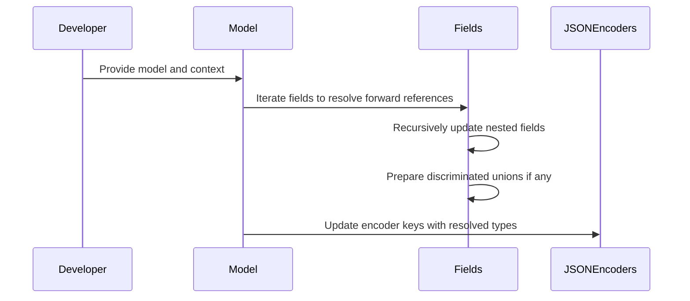
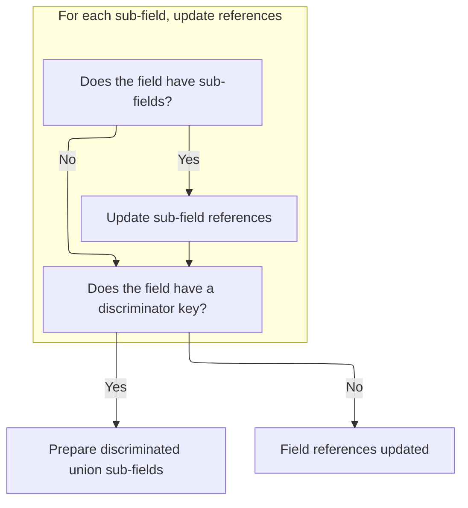

This document describes the process of resolving forward references in data models to concrete types. It covers updating fields and nested sub-fields, handling discriminated unions, and updating JSON encoders to ensure the model is ready for validation and serialization.

The main steps are:

- Prepare the global namespace including the model
- Update each field's forward references
- Recursively update nested sub-fields
- Handle discriminated union sub-fields
- Update JSON encoder keys



# Spec

## Detailed View of the Program's Functionality

a. Preparing the Context for Resolving References

The process begins by setting up the environment needed to resolve any type references within a model. The code checks if the module where the model is defined is already loaded in the system. If it is, it copies the module's global namespace (all its variables, classes, etc.) for use during reference resolution. If not, it starts with an empty namespace. The model itself is then added to this namespace to ensure that any self-references (where the model refers to itself) can be resolved.

b. Resolving and Updating Type References for Each Field

Next, the code iterates over every field defined in the model. For each field, it attempts to resolve any "forward references"—these are type hints that refer to types not yet defined or only defined later in the file, often written as strings. The process checks both the main type and any "outer" type associated with the field. If either is a forward reference, it is evaluated and replaced with the actual type object. If any changes are made, the field is re-prepared, which updates its validation logic and metadata to match the resolved types.

c. Recursively Resolving Nested Fields

After handling the main type references for a field, the code checks if the field contains any sub-fields. Sub-fields occur in cases like nested models or complex types (<SwmToken path="pydantic/v1/typing.py" pos="436:1:3" line-data="    e.g. `Literal[Literal[Literal[1, 2, 3], &quot;foo&quot;], 5, None]`">`e.g`</SwmToken>., lists of models). If sub-fields exist, the same reference resolution process is applied recursively to each sub-field, ensuring that all nested structures have their types fully resolved.

d. Handling Discriminated Unions

If a field uses a "discriminator key" (a special marker used for discriminated unions, where the type of data is determined by a specific field value), the code prepares the sub-fields for this union. This setup ensures that the correct validation and selection logic is in place for these more complex type scenarios.

e. Updating JSON Encoder References

Once all fields have been processed, the code turns to the model's JSON encoders. These encoders are responsible for converting model data to JSON, and they may use type references as keys. The code loops through all encoder keys, and if any key is a string or a forward reference, it resolves it to the actual type. The encoder dictionary is then updated so that the resolved type replaces the original key, ensuring that serialization will work correctly with the now-concrete types.

f. In-Place Updates and Finalization

Throughout this process, no new objects are returned. Instead, the model's fields and JSON encoders are updated directly ("in place"). This means that after the function completes, the model is fully prepared for validation and serialization, with all type references resolved and ready for use.

# Rule Definition

| Paragraph Name                                                                                                                                                                                                                                                                                                                                                                                                                                                                                                                                                                                                                                                                                                                                                                                                                                                                                                                                                                                                                                                                                                                                                                                                                                                                                                                                                                                                                | Rule ID | Category          | Description                                                                                                                                                                                                                                                                                                                                                                                                                                                               | Conditions                                                                                                                                                                                                                                                                                                                             | Remarks                                                                                                                                                                                                                                                                                                                                                            |
| ----------------------------------------------------------------------------------------------------------------------------------------------------------------------------------------------------------------------------------------------------------------------------------------------------------------------------------------------------------------------------------------------------------------------------------------------------------------------------------------------------------------------------------------------------------------------------------------------------------------------------------------------------------------------------------------------------------------------------------------------------------------------------------------------------------------------------------------------------------------------------------------------------------------------------------------------------------------------------------------------------------------------------------------------------------------------------------------------------------------------------------------------------------------------------------------------------------------------------------------------------------------------------------------------------------------------------------------------------------------------------------------------------------------------------- | ------- | ----------------- | ------------------------------------------------------------------------------------------------------------------------------------------------------------------------------------------------------------------------------------------------------------------------------------------------------------------------------------------------------------------------------------------------------------------------------------------------------------------------- | -------------------------------------------------------------------------------------------------------------------------------------------------------------------------------------------------------------------------------------------------------------------------------------------------------------------------------------- | ------------------------------------------------------------------------------------------------------------------------------------------------------------------------------------------------------------------------------------------------------------------------------------------------------------------------------------------------------------------ |
| The system must resolve any <SwmToken path="pydantic/v1/typing.py" pos="530:11:11" line-data="    if field.type_.__class__ == ForwardRef:">`ForwardRef`</SwmToken> in a field’s type\_ or <SwmToken path="pydantic/v1/typing.py" pos="533:5:5" line-data="    if field.outer_type_.__class__ == ForwardRef:">`outer_type_`</SwmToken> by: Using a function that takes the <SwmToken path="pydantic/v1/typing.py" pos="530:11:11" line-data="    if field.type_.__class__ == ForwardRef:">`ForwardRef`</SwmToken>, a global namespace, and a local namespace, and returns the actual type object corresponding to the string name. Replacing the <SwmToken path="pydantic/v1/typing.py" pos="530:11:11" line-data="    if field.type_.__class__ == ForwardRef:">`ForwardRef`</SwmToken> with the resolved type in the field’s type\_ or <SwmToken path="pydantic/v1/typing.py" pos="533:5:5" line-data="    if field.outer_type_.__class__ == ForwardRef:">`outer_type_`</SwmToken>. If a field’s type\_ or <SwmToken path="pydantic/v1/typing.py" pos="533:5:5" line-data="    if field.outer_type_.__class__ == ForwardRef:">`outer_type_`</SwmToken> is updated as a result of resolving a <SwmToken path="pydantic/v1/typing.py" pos="530:11:11" line-data="    if field.type_.__class__ == ForwardRef:">`ForwardRef`</SwmToken>, the system must call the field’s prepare() method to update its validation and metadata. | RL-001  | Conditional Logic | If a field's type\_ or <SwmToken path="pydantic/v1/typing.py" pos="533:5:5" line-data="    if field.outer_type_.__class__ == ForwardRef:">`outer_type_`</SwmToken> is a <SwmToken path="pydantic/v1/typing.py" pos="530:11:11" line-data="    if field.type_.__class__ == ForwardRef:">`ForwardRef`</SwmToken>, resolve it to the actual type using the provided namespaces and update the field's type. If any update occurs, call the field's prepare() method.         | The field's type\_ or <SwmToken path="pydantic/v1/typing.py" pos="533:5:5" line-data="    if field.outer_type_.__class__ == ForwardRef:">`outer_type_`</SwmToken> is a <SwmToken path="pydantic/v1/typing.py" pos="530:11:11" line-data="    if field.type_.__class__ == ForwardRef:">`ForwardRef`</SwmToken> object.                  | <SwmToken path="pydantic/v1/typing.py" pos="530:11:11" line-data="    if field.type_.__class__ == ForwardRef:">`ForwardRef`</SwmToken> objects wrap a string type name. The field's prepare() method must be called if any type is updated.                                                                                                                        |
| For each field, if <SwmToken path="pydantic/v1/typing.py" pos="539:5:5" line-data="    if field.sub_fields:">`sub_fields`</SwmToken> are present, the system must recursively resolve forward references for each sub_field using the same process.                                                                                                                                                                                                                                                                                                                                                                                                                                                                                                                                                                                                                                                                                                                                                                                                                                                                                                                                                                                                                                                                                                                                                                           | RL-002  | Conditional Logic | If a field has <SwmToken path="pydantic/v1/typing.py" pos="539:5:5" line-data="    if field.sub_fields:">`sub_fields`</SwmToken>, recursively apply the forward reference resolution process to each sub_field.                                                                                                                                                                                                                                                           | The field has a non-empty <SwmToken path="pydantic/v1/typing.py" pos="539:5:5" line-data="    if field.sub_fields:">`sub_fields`</SwmToken> attribute.                                                                                                                                                                                 | Each sub_field is treated as a field and processed with the same logic.                                                                                                                                                                                                                                                                                            |
| For each field, if a <SwmToken path="pydantic/v1/typing.py" pos="543:5:5" line-data="    if field.discriminator_key is not None:">`discriminator_key`</SwmToken> is present, the system must call <SwmToken path="pydantic/v1/typing.py" pos="544:3:5" line-data="        field.prepare_discriminated_union_sub_fields()">`prepare_discriminated_union_sub_fields()`</SwmToken> to set up the correct validation and selection logic for discriminated union types.                                                                                                                                                                                                                                                                                                                                                                                                                                                                                                                                                                                                                                                                                                                                                                                                                                                                                                                                                           | RL-003  | Conditional Logic | If a field has a <SwmToken path="pydantic/v1/typing.py" pos="543:5:5" line-data="    if field.discriminator_key is not None:">`discriminator_key`</SwmToken>, call its <SwmToken path="pydantic/v1/typing.py" pos="544:3:5" line-data="        field.prepare_discriminated_union_sub_fields()">`prepare_discriminated_union_sub_fields()`</SwmToken> method to set up validation and selection logic for discriminated unions.                                            | The field has a non-null <SwmToken path="pydantic/v1/typing.py" pos="543:5:5" line-data="    if field.discriminator_key is not None:">`discriminator_key`</SwmToken> attribute.                                                                                                                                                        | The <SwmToken path="pydantic/v1/typing.py" pos="544:3:5" line-data="        field.prepare_discriminated_union_sub_fields()">`prepare_discriminated_union_sub_fields()`</SwmToken> method is called only if <SwmToken path="pydantic/v1/typing.py" pos="543:5:5" line-data="    if field.discriminator_key is not None:">`discriminator_key`</SwmToken> is present. |
| For each key in the <SwmToken path="pydantic/v1/typing.py" pos="550:1:1" line-data="    json_encoders: Dict[Union[Type[Any], str, ForwardRef], AnyCallable],">`json_encoders`</SwmToken> dictionary: If the key is a string or a <SwmToken path="pydantic/v1/typing.py" pos="530:11:11" line-data="    if field.type_.__class__ == ForwardRef:">`ForwardRef`</SwmToken>, the system must resolve it to the actual type object using the same resolution logic as for fields. The system must replace the original key in the dictionary with the resolved type object, preserving the associated encoder function.                                                                                                                                                                                                                                                                                                                                                                                                                                                                                                                                                                                                                                                                                                                                                                                                            | RL-004  | Conditional Logic | For each key in the <SwmToken path="pydantic/v1/typing.py" pos="550:1:1" line-data="    json_encoders: Dict[Union[Type[Any], str, ForwardRef], AnyCallable],">`json_encoders`</SwmToken> dictionary, if the key is a string or <SwmToken path="pydantic/v1/typing.py" pos="530:11:11" line-data="    if field.type_.__class__ == ForwardRef:">`ForwardRef`</SwmToken>, resolve it to the actual type and replace the key in the dictionary, keeping the encoder function. | The key in <SwmToken path="pydantic/v1/typing.py" pos="550:1:1" line-data="    json_encoders: Dict[Union[Type[Any], str, ForwardRef], AnyCallable],">`json_encoders`</SwmToken> is a string or <SwmToken path="pydantic/v1/typing.py" pos="530:11:11" line-data="    if field.type_.__class__ == ForwardRef:">`ForwardRef`</SwmToken>. | The encoder function associated with the key must be preserved. The key is replaced in place in the dictionary.                                                                                                                                                                                                                                                    |
| The system must accept <SwmToken path="pydantic/v1/typing.py" pos="552:1:1" line-data="    exc_to_suppress: Tuple[Type[BaseException], ...] = (),">`exc_to_suppress`</SwmToken>: an optional tuple of exception types to suppress during resolution.                                                                                                                                                                                                                                                                                                                                                                                                                                                                                                                                                                                                                                                                                                                                                                                                                                                                                                                                                                                                                                                                                                                                                                          | RL-005  | Conditional Logic | If an exception occurs during forward reference resolution and it matches one of the types in <SwmToken path="pydantic/v1/typing.py" pos="552:1:1" line-data="    exc_to_suppress: Tuple[Type[BaseException], ...] = (),">`exc_to_suppress`</SwmToken>, suppress the exception and continue processing.                                                                                                                                                                   | An exception is raised during resolution and its type is in <SwmToken path="pydantic/v1/typing.py" pos="552:1:1" line-data="    exc_to_suppress: Tuple[Type[BaseException], ...] = (),">`exc_to_suppress`</SwmToken>.                                                                                                                  | <SwmToken path="pydantic/v1/typing.py" pos="552:1:1" line-data="    exc_to_suppress: Tuple[Type[BaseException], ...] = (),">`exc_to_suppress`</SwmToken> is an optional tuple of exception types.                                                                                                                                                                  |
| The system must update the fields and <SwmToken path="pydantic/v1/typing.py" pos="550:1:1" line-data="    json_encoders: Dict[Union[Type[Any], str, ForwardRef], AnyCallable],">`json_encoders`</SwmToken> in place and must not return any value.                                                                                                                                                                                                                                                                                                                                                                                                                                                                                                                                                                                                                                                                                                                                                                                                                                                                                                                                                                                                                                                                                                                                                                            | RL-006  | Data Assignment   | All updates to fields and <SwmToken path="pydantic/v1/typing.py" pos="550:1:1" line-data="    json_encoders: Dict[Union[Type[Any], str, ForwardRef], AnyCallable],">`json_encoders`</SwmToken> must be performed in place. The system must not return any value.                                                                                                                                                                                                          | The function is called to update forward references.                                                                                                                                                                                                                                                                                   | No return value is allowed. All changes are reflected in the input objects.                                                                                                                                                                                                                                                                                        |

# User Stories

## User Story 1: Resolve forward references in model fields and encoders with in-place updates and exception suppression

---

### Story Description:

As a system user, I want all forward references in a model’s fields (including nested sub-fields and discriminated unions) and in the <SwmToken path="pydantic/v1/typing.py" pos="550:1:1" line-data="    json_encoders: Dict[Union[Type[Any], str, ForwardRef], AnyCallable],">`json_encoders`</SwmToken> dictionary to be resolved to concrete types, with all updates performed in place and specified exceptions suppressed, so that validation, serialization, and custom encoding work correctly and the original objects are updated directly without interruption.

---

### Business Rule Mapping:

| Rule ID | Paragraph Name                                                                                                                                                                                                                                                                                                                                                                                                                                                                                                                                                                                                                                                                                                                                                                                                                                                                                                                                                                                                                                                                                                                                                                                                                                                                                                                                                                                                                | Rule Description                                                                                                                                                                                                                                                                                                                                                                                                                                                          |
| ------- | ----------------------------------------------------------------------------------------------------------------------------------------------------------------------------------------------------------------------------------------------------------------------------------------------------------------------------------------------------------------------------------------------------------------------------------------------------------------------------------------------------------------------------------------------------------------------------------------------------------------------------------------------------------------------------------------------------------------------------------------------------------------------------------------------------------------------------------------------------------------------------------------------------------------------------------------------------------------------------------------------------------------------------------------------------------------------------------------------------------------------------------------------------------------------------------------------------------------------------------------------------------------------------------------------------------------------------------------------------------------------------------------------------------------------------- | ------------------------------------------------------------------------------------------------------------------------------------------------------------------------------------------------------------------------------------------------------------------------------------------------------------------------------------------------------------------------------------------------------------------------------------------------------------------------- |
| RL-001  | The system must resolve any <SwmToken path="pydantic/v1/typing.py" pos="530:11:11" line-data="    if field.type_.__class__ == ForwardRef:">`ForwardRef`</SwmToken> in a field’s type\_ or <SwmToken path="pydantic/v1/typing.py" pos="533:5:5" line-data="    if field.outer_type_.__class__ == ForwardRef:">`outer_type_`</SwmToken> by: Using a function that takes the <SwmToken path="pydantic/v1/typing.py" pos="530:11:11" line-data="    if field.type_.__class__ == ForwardRef:">`ForwardRef`</SwmToken>, a global namespace, and a local namespace, and returns the actual type object corresponding to the string name. Replacing the <SwmToken path="pydantic/v1/typing.py" pos="530:11:11" line-data="    if field.type_.__class__ == ForwardRef:">`ForwardRef`</SwmToken> with the resolved type in the field’s type\_ or <SwmToken path="pydantic/v1/typing.py" pos="533:5:5" line-data="    if field.outer_type_.__class__ == ForwardRef:">`outer_type_`</SwmToken>. If a field’s type\_ or <SwmToken path="pydantic/v1/typing.py" pos="533:5:5" line-data="    if field.outer_type_.__class__ == ForwardRef:">`outer_type_`</SwmToken> is updated as a result of resolving a <SwmToken path="pydantic/v1/typing.py" pos="530:11:11" line-data="    if field.type_.__class__ == ForwardRef:">`ForwardRef`</SwmToken>, the system must call the field’s prepare() method to update its validation and metadata. | If a field's type\_ or <SwmToken path="pydantic/v1/typing.py" pos="533:5:5" line-data="    if field.outer_type_.__class__ == ForwardRef:">`outer_type_`</SwmToken> is a <SwmToken path="pydantic/v1/typing.py" pos="530:11:11" line-data="    if field.type_.__class__ == ForwardRef:">`ForwardRef`</SwmToken>, resolve it to the actual type using the provided namespaces and update the field's type. If any update occurs, call the field's prepare() method.         |
| RL-002  | For each field, if <SwmToken path="pydantic/v1/typing.py" pos="539:5:5" line-data="    if field.sub_fields:">`sub_fields`</SwmToken> are present, the system must recursively resolve forward references for each sub_field using the same process.                                                                                                                                                                                                                                                                                                                                                                                                                                                                                                                                                                                                                                                                                                                                                                                                                                                                                                                                                                                                                                                                                                                                                                           | If a field has <SwmToken path="pydantic/v1/typing.py" pos="539:5:5" line-data="    if field.sub_fields:">`sub_fields`</SwmToken>, recursively apply the forward reference resolution process to each sub_field.                                                                                                                                                                                                                                                           |
| RL-003  | For each field, if a <SwmToken path="pydantic/v1/typing.py" pos="543:5:5" line-data="    if field.discriminator_key is not None:">`discriminator_key`</SwmToken> is present, the system must call <SwmToken path="pydantic/v1/typing.py" pos="544:3:5" line-data="        field.prepare_discriminated_union_sub_fields()">`prepare_discriminated_union_sub_fields()`</SwmToken> to set up the correct validation and selection logic for discriminated union types.                                                                                                                                                                                                                                                                                                                                                                                                                                                                                                                                                                                                                                                                                                                                                                                                                                                                                                                                                           | If a field has a <SwmToken path="pydantic/v1/typing.py" pos="543:5:5" line-data="    if field.discriminator_key is not None:">`discriminator_key`</SwmToken>, call its <SwmToken path="pydantic/v1/typing.py" pos="544:3:5" line-data="        field.prepare_discriminated_union_sub_fields()">`prepare_discriminated_union_sub_fields()`</SwmToken> method to set up validation and selection logic for discriminated unions.                                            |
| RL-004  | For each key in the <SwmToken path="pydantic/v1/typing.py" pos="550:1:1" line-data="    json_encoders: Dict[Union[Type[Any], str, ForwardRef], AnyCallable],">`json_encoders`</SwmToken> dictionary: If the key is a string or a <SwmToken path="pydantic/v1/typing.py" pos="530:11:11" line-data="    if field.type_.__class__ == ForwardRef:">`ForwardRef`</SwmToken>, the system must resolve it to the actual type object using the same resolution logic as for fields. The system must replace the original key in the dictionary with the resolved type object, preserving the associated encoder function.                                                                                                                                                                                                                                                                                                                                                                                                                                                                                                                                                                                                                                                                                                                                                                                                            | For each key in the <SwmToken path="pydantic/v1/typing.py" pos="550:1:1" line-data="    json_encoders: Dict[Union[Type[Any], str, ForwardRef], AnyCallable],">`json_encoders`</SwmToken> dictionary, if the key is a string or <SwmToken path="pydantic/v1/typing.py" pos="530:11:11" line-data="    if field.type_.__class__ == ForwardRef:">`ForwardRef`</SwmToken>, resolve it to the actual type and replace the key in the dictionary, keeping the encoder function. |
| RL-005  | The system must accept <SwmToken path="pydantic/v1/typing.py" pos="552:1:1" line-data="    exc_to_suppress: Tuple[Type[BaseException], ...] = (),">`exc_to_suppress`</SwmToken>: an optional tuple of exception types to suppress during resolution.                                                                                                                                                                                                                                                                                                                                                                                                                                                                                                                                                                                                                                                                                                                                                                                                                                                                                                                                                                                                                                                                                                                                                                          | If an exception occurs during forward reference resolution and it matches one of the types in <SwmToken path="pydantic/v1/typing.py" pos="552:1:1" line-data="    exc_to_suppress: Tuple[Type[BaseException], ...] = (),">`exc_to_suppress`</SwmToken>, suppress the exception and continue processing.                                                                                                                                                                   |
| RL-006  | The system must update the fields and <SwmToken path="pydantic/v1/typing.py" pos="550:1:1" line-data="    json_encoders: Dict[Union[Type[Any], str, ForwardRef], AnyCallable],">`json_encoders`</SwmToken> in place and must not return any value.                                                                                                                                                                                                                                                                                                                                                                                                                                                                                                                                                                                                                                                                                                                                                                                                                                                                                                                                                                                                                                                                                                                                                                            | All updates to fields and <SwmToken path="pydantic/v1/typing.py" pos="550:1:1" line-data="    json_encoders: Dict[Union[Type[Any], str, ForwardRef], AnyCallable],">`json_encoders`</SwmToken> must be performed in place. The system must not return any value.                                                                                                                                                                                                          |

---

### Relevant Functionality:

- **The system must resolve any** <SwmToken path="pydantic/v1/typing.py" pos="530:11:11" line-data="    if field.type_.__class__ == ForwardRef:">`ForwardRef`</SwmToken> **in a field’s type\_ or** <SwmToken path="pydantic/v1/typing.py" pos="533:5:5" line-data="    if field.outer_type_.__class__ == ForwardRef:">`outer_type_`</SwmToken> **by: Using a function that takes the** <SwmToken path="pydantic/v1/typing.py" pos="530:11:11" line-data="    if field.type_.__class__ == ForwardRef:">`ForwardRef`</SwmToken>
  1. **RL-001:**
     - For each field:
       - If type\_ is a <SwmToken path="pydantic/v1/typing.py" pos="530:11:11" line-data="    if field.type_.__class__ == ForwardRef:">`ForwardRef`</SwmToken>:
         - Resolve the <SwmToken path="pydantic/v1/typing.py" pos="530:11:11" line-data="    if field.type_.__class__ == ForwardRef:">`ForwardRef`</SwmToken> using the global and local namespaces.
         - Replace type\_ with the resolved type.
         - Mark that preparation is needed.
       - If <SwmToken path="pydantic/v1/typing.py" pos="533:5:5" line-data="    if field.outer_type_.__class__ == ForwardRef:">`outer_type_`</SwmToken> is a <SwmToken path="pydantic/v1/typing.py" pos="530:11:11" line-data="    if field.type_.__class__ == ForwardRef:">`ForwardRef`</SwmToken>:
         - Resolve the <SwmToken path="pydantic/v1/typing.py" pos="530:11:11" line-data="    if field.type_.__class__ == ForwardRef:">`ForwardRef`</SwmToken> similarly.
         - Replace <SwmToken path="pydantic/v1/typing.py" pos="533:5:5" line-data="    if field.outer_type_.__class__ == ForwardRef:">`outer_type_`</SwmToken> with the resolved type.
         - Mark that preparation is needed.
       - If preparation is needed:
         - Call the field's prepare() method.
- **For each field**
  1. **RL-002:**
     - For each field:
       - If <SwmToken path="pydantic/v1/typing.py" pos="539:5:5" line-data="    if field.sub_fields:">`sub_fields`</SwmToken> are present:
         - For each sub_field:
           - Recursively resolve forward references as per the main rule.
  2. **RL-003:**
     - For each field:
       - If <SwmToken path="pydantic/v1/typing.py" pos="543:5:5" line-data="    if field.discriminator_key is not None:">`discriminator_key`</SwmToken> is not None:
         - Call <SwmToken path="pydantic/v1/typing.py" pos="544:3:5" line-data="        field.prepare_discriminated_union_sub_fields()">`prepare_discriminated_union_sub_fields()`</SwmToken> on the field.
- **For each key in the** <SwmToken path="pydantic/v1/typing.py" pos="550:1:1" line-data="    json_encoders: Dict[Union[Type[Any], str, ForwardRef], AnyCallable],">`json_encoders`</SwmToken> **dictionary: If the key is a string or a** <SwmToken path="pydantic/v1/typing.py" pos="530:11:11" line-data="    if field.type_.__class__ == ForwardRef:">`ForwardRef`</SwmToken>
  1. **RL-004:**
     - For each key in <SwmToken path="pydantic/v1/typing.py" pos="550:1:1" line-data="    json_encoders: Dict[Union[Type[Any], str, ForwardRef], AnyCallable],">`json_encoders`</SwmToken>:
       - If the key is a string:
         - Create a <SwmToken path="pydantic/v1/typing.py" pos="530:11:11" line-data="    if field.type_.__class__ == ForwardRef:">`ForwardRef`</SwmToken> from the string.
       - If the key is a <SwmToken path="pydantic/v1/typing.py" pos="530:11:11" line-data="    if field.type_.__class__ == ForwardRef:">`ForwardRef`</SwmToken>:
         - Use as is.
       - Resolve the <SwmToken path="pydantic/v1/typing.py" pos="530:11:11" line-data="    if field.type_.__class__ == ForwardRef:">`ForwardRef`</SwmToken> to the actual type using the global and local namespaces.
       - Replace the original key with the resolved type, keeping the encoder function.
- **The system must accept** <SwmToken path="pydantic/v1/typing.py" pos="552:1:1" line-data="    exc_to_suppress: Tuple[Type[BaseException], ...] = (),">`exc_to_suppress`</SwmToken>**: an optional tuple of exception types to suppress during resolution.**
  1. **RL-005:**
     - During resolution of fields and <SwmToken path="pydantic/v1/typing.py" pos="550:1:1" line-data="    json_encoders: Dict[Union[Type[Any], str, ForwardRef], AnyCallable],">`json_encoders`</SwmToken>:
       - If an exception occurs and its type is in <SwmToken path="pydantic/v1/typing.py" pos="552:1:1" line-data="    exc_to_suppress: Tuple[Type[BaseException], ...] = (),">`exc_to_suppress`</SwmToken>:
         - Suppress the exception and continue.
- **The system must update the fields and** <SwmToken path="pydantic/v1/typing.py" pos="550:1:1" line-data="    json_encoders: Dict[Union[Type[Any], str, ForwardRef], AnyCallable],">`json_encoders`</SwmToken> **in place and must not return any value.**
  1. **RL-006:**
     - Update fields and <SwmToken path="pydantic/v1/typing.py" pos="550:1:1" line-data="    json_encoders: Dict[Union[Type[Any], str, ForwardRef], AnyCallable],">`json_encoders`</SwmToken> in place.
     - Do not return any value from the function.

# Code Walkthrough

## Resolving Model Field References

```mermaid
%%{init: {"flowchart": {"defaultRenderer": "elk"}} }%%
flowchart TD
    node1["Prepare context for resolving references"]
    click node1 openCode "pydantic/v1/typing.py:557:563"
    
    subgraph loop1["For each field in the model"]
      node1 --> node2["Resolve and update type references for the field"]
      click node2 openCode "pydantic/v1/typing.py:564:569"
    end
    
    subgraph loop2["For each key in JSON encoders"]
      node2 --> node3["Resolve and update forward references in encoder keys"]
      click node3 openCode "pydantic/v1/typing.py:570:583"
    end


subgraph node2 [update_field_forward_refs]
  sgmain_1_node1["Resolve all type references for the field (type_, outer_type_)"] --> sgmain_1_node2["If any references updated, prepare field for validation"]
  click sgmain_1_node1 openCode "pydantic/v1/typing.py:525:538"
  sgmain_1_node2 --> sgmain_1_node3["Update all sub-fields and set up special validation for union types if needed"]
  click sgmain_1_node2 openCode "pydantic/v1/fields.py:537:537"
  subgraph sgmain_1_loop1["For each sub-field"]
  sgmain_1_node3
  click sgmain_1_node3 openCode "pydantic/v1/typing.py:539:544"
  end
end

%% Swimm:
%% %%{init: {"flowchart": {"defaultRenderer": "elk"}} }%%
%% flowchart TD
%%     node1["Prepare context for resolving references"]
%%     click node1 openCode "<SwmPath>[pydantic/v1/typing.py](pydantic/v1/typing.py)</SwmPath>:557:563"
%%     
%%     subgraph loop1["For each field in the model"]
%%       node1 --> node2["Resolve and update type references for the field"]
%%       click node2 openCode "<SwmPath>[pydantic/v1/typing.py](pydantic/v1/typing.py)</SwmPath>:564:569"
%%     end
%%     
%%     subgraph loop2["For each key in JSON encoders"]
%%       node2 --> node3["Resolve and update forward references in encoder keys"]
%%       click node3 openCode "<SwmPath>[pydantic/v1/typing.py](pydantic/v1/typing.py)</SwmPath>:570:583"
%%     end
%% 
%% 
%% subgraph node2 [<SwmToken path="pydantic/v1/typing.py" pos="525:2:2" line-data="def update_field_forward_refs(field: &#39;ModelField&#39;, globalns: Any, localns: Any) -&gt; None:">`update_field_forward_refs`</SwmToken>]
%%   sgmain_1_node1["Resolve all type references for the field (type_, <SwmToken path="pydantic/v1/typing.py" pos="533:5:5" line-data="    if field.outer_type_.__class__ == ForwardRef:">`outer_type_`</SwmToken>)"] --> sgmain_1_node2["If any references updated, prepare field for validation"]
%%   click sgmain_1_node1 openCode "<SwmPath>[pydantic/v1/typing.py](pydantic/v1/typing.py)</SwmPath>:525:538"
%%   sgmain_1_node2 --> sgmain_1_node3["Update all sub-fields and set up special validation for union types if needed"]
%%   click sgmain_1_node2 openCode "<SwmPath>[pydantic/v1/fields.py](pydantic/v1/fields.py)</SwmPath>:537:537"
%%   subgraph sgmain_1_loop1["For each sub-field"]
%%   sgmain_1_node3
%%   click sgmain_1_node3 openCode "<SwmPath>[pydantic/v1/typing.py](pydantic/v1/typing.py)</SwmPath>:539:544"
%%   end
%% end
```



<SwmSnippet path="/pydantic/v1/typing.py" line="547">

---

In <SwmToken path="pydantic/v1/typing.py" pos="547:2:2" line-data="def update_model_forward_refs(">`update_model_forward_refs`</SwmToken>, we set up the global namespace for the model and make sure the model itself is available for reference. Then, we loop through each field and call <SwmToken path="pydantic/v1/typing.py" pos="566:1:1" line-data="            update_field_forward_refs(f, globalns=globalns, localns=localns)">`update_field_forward_refs`</SwmToken> to resolve any forward references in the field types. This is needed so that all field types are concrete and usable for validation and serialization.

```python
def update_model_forward_refs(
    model: Type[Any],
    fields: Iterable['ModelField'],
    json_encoders: Dict[Union[Type[Any], str, ForwardRef], AnyCallable],
    localns: 'DictStrAny',
    exc_to_suppress: Tuple[Type[BaseException], ...] = (),
) -> None:
    """
    Try to update model fields ForwardRefs based on model and localns.
    """
    if model.__module__ in sys.modules:
        globalns = sys.modules[model.__module__].__dict__.copy()
    else:
        globalns = {}

    globalns.setdefault(model.__name__, model)

    for f in fields:
        try:
            update_field_forward_refs(f, globalns=globalns, localns=localns)
        except exc_to_suppress:
            pass

```

---

</SwmSnippet>

### Resolving Field Type References

<SwmSnippet path="/pydantic/v1/typing.py" line="525">

---

In <SwmToken path="pydantic/v1/typing.py" pos="525:2:2" line-data="def update_field_forward_refs(field: &#39;ModelField&#39;, globalns: Any, localns: Any) -&gt; None:">`update_field_forward_refs`</SwmToken>, we check if the field's type or outer_type is a <SwmToken path="pydantic/v1/typing.py" pos="530:11:11" line-data="    if field.type_.__class__ == ForwardRef:">`ForwardRef`</SwmToken> and resolve it if needed. If any type was updated, we call <SwmToken path="pydantic/v1/typing.py" pos="529:1:1" line-data="    prepare = False">`prepare`</SwmToken> to update the field's validation and metadata to match the new type info.

```python
def update_field_forward_refs(field: 'ModelField', globalns: Any, localns: Any) -> None:
    """
    Try to update ForwardRefs on fields based on this ModelField, globalns and localns.
    """
    prepare = False
    if field.type_.__class__ == ForwardRef:
        prepare = True
        field.type_ = evaluate_forwardref(field.type_, globalns, localns or None)
    if field.outer_type_.__class__ == ForwardRef:
        prepare = True
        field.outer_type_ = evaluate_forwardref(field.outer_type_, globalns, localns or None)
    if prepare:
        field.prepare()

```

---

</SwmSnippet>

#### Finalizing Field Validation

See <SwmLink doc-title="Field Preparation Flow">[Field Preparation Flow](/.swm/field-preparation-flow.jjv8yvqy.sw.md)</SwmLink>

#### Recursively Resolving Nested Fields



<SwmSnippet path="/pydantic/v1/typing.py" line="539">

---

Back in <SwmToken path="pydantic/v1/typing.py" pos="541:1:1" line-data="            update_field_forward_refs(sub_f, globalns=globalns, localns=localns)">`update_field_forward_refs`</SwmToken>, after preparing the field, we check if there are any <SwmToken path="pydantic/v1/typing.py" pos="539:5:5" line-data="    if field.sub_fields:">`sub_fields`</SwmToken> (like for nested models or complex types). If so, we recursively resolve forward references for each sub_field to make sure everything is updated throughout the structure.

```python
    if field.sub_fields:
        for sub_f in field.sub_fields:
            update_field_forward_refs(sub_f, globalns=globalns, localns=localns)
```

---

</SwmSnippet>

<SwmSnippet path="/pydantic/v1/typing.py" line="541">

---

After handling <SwmToken path="pydantic/v1/typing.py" pos="539:5:5" line-data="    if field.sub_fields:">`sub_fields`</SwmToken> in <SwmToken path="pydantic/v1/typing.py" pos="541:1:1" line-data="            update_field_forward_refs(sub_f, globalns=globalns, localns=localns)">`update_field_forward_refs`</SwmToken>, if the field uses a discriminator (for discriminated unions), we call <SwmToken path="pydantic/v1/typing.py" pos="544:3:3" line-data="        field.prepare_discriminated_union_sub_fields()">`prepare_discriminated_union_sub_fields`</SwmToken> to set up the right validation and selection logic for those union types.

```python
            update_field_forward_refs(sub_f, globalns=globalns, localns=localns)

    if field.discriminator_key is not None:
        field.prepare_discriminated_union_sub_fields()
```

---

</SwmSnippet>

### Updating JSON Encoder References

<SwmSnippet path="/pydantic/v1/typing.py" line="570">

---

Back in <SwmToken path="pydantic/v1/typing.py" pos="547:2:2" line-data="def update_model_forward_refs(">`update_model_forward_refs`</SwmToken>, after updating all field references, we loop through <SwmToken path="pydantic/v1/typing.py" pos="570:9:9" line-data="    for key in set(json_encoders.keys()):">`json_encoders`</SwmToken> and update any keys that were strings or <SwmToken path="pydantic/v1/typing.py" pos="527:7:7" line-data="    Try to update ForwardRefs on fields based on this ModelField, globalns and localns.">`ForwardRefs`</SwmToken> to their resolved types. This keeps serialization working with the right encoders.

```python
    for key in set(json_encoders.keys()):
        if isinstance(key, str):
            fr: ForwardRef = ForwardRef(key)
        elif isinstance(key, ForwardRef):
            fr = key
        else:
            continue

        try:
            new_key = evaluate_forwardref(fr, globalns, localns or None)
        except exc_to_suppress:  # pragma: no cover
            continue

        json_encoders[new_key] = json_encoders.pop(key)
```

---

</SwmSnippet>

<SwmSnippet path="/pydantic/v1/typing.py" line="583">

---

Nothing is returned from <SwmToken path="pydantic/v1/typing.py" pos="547:2:2" line-data="def update_model_forward_refs(">`update_model_forward_refs`</SwmToken>. The function just updates the model fields and <SwmToken path="pydantic/v1/typing.py" pos="583:1:1" line-data="        json_encoders[new_key] = json_encoders.pop(key)">`json_encoders`</SwmToken> in place so everything is ready for validation and serialization.

```python
        json_encoders[new_key] = json_encoders.pop(key)
```

---

</SwmSnippet>

&nbsp;

*This is an auto-generated document by Swimm 🌊 and has not yet been verified by a human*

<SwmMeta version="3.0.0" repo-id="Z2l0aHViJTNBJTNBcHlkYW50aWMlM0ElM0FTd2ltbS1EZW1v" repo-name="pydantic"><sup>Powered by [Swimm](/)</sup></SwmMeta>
