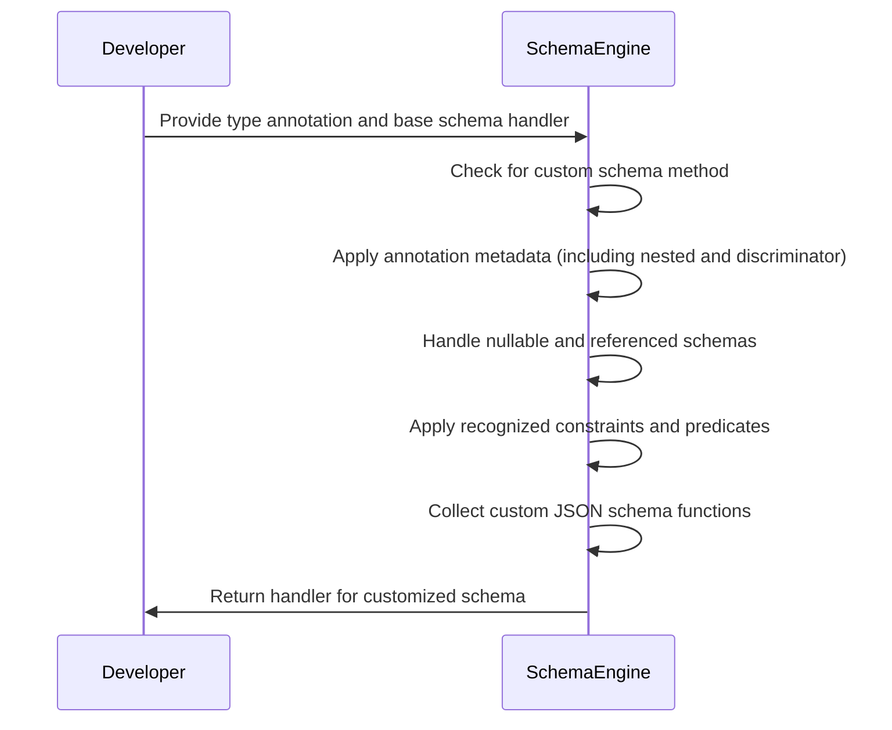
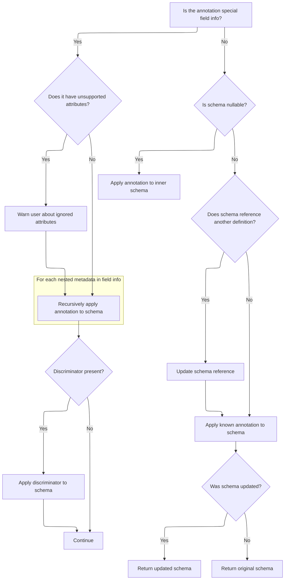
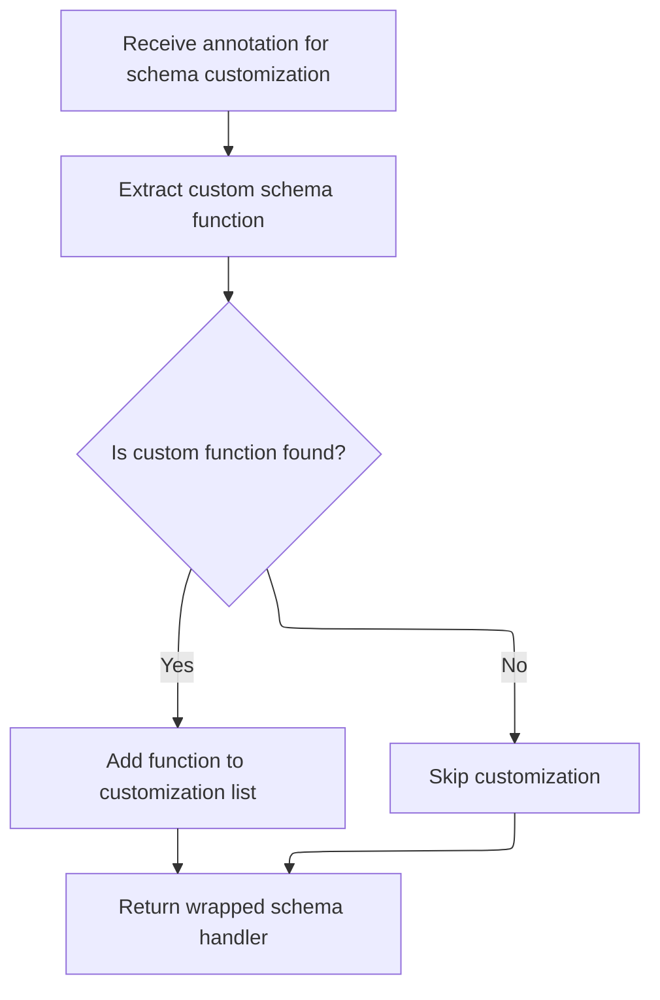

This document outlines how schema customization is achieved when a type annotation includes metadata or constraints. The process ensures that all relevant information from the annotation is reflected in the resulting schema, supporting advanced validation and serialization features.

Key steps include using custom schema methods if present, applying annotation metadata (including nested and discriminator information), handling nullable and referenced schemas, enforcing recognized constraints and predicates, collecting custom JSON schema functions, and producing a handler for the final schema.



# Spec

## Detailed View of the Program's Functionality

a. Wrapping and Annotating the Inner Schema

The process begins by determining if the annotation provided has a custom schema method. If such a method exists, it is used to generate the schema, passing along a handler that can generate the inner schema if needed. If no custom method is present, the base schema is obtained by calling the inner schema handler. Immediately after, the schema is updated by applying any metadata from the annotation. This is done through a function that processes the annotation and modifies the schema accordingly. After applying the annotation, another function is called to apply any JSON schema-specific metadata from the annotation. Finally, the code checks if the annotation has a custom JSON schema function; if so, it is added to a list for later use. The resulting schema is then returned.

b. Applying Annotation Metadata to the Schema

When applying annotation metadata, the code first checks if the metadata is a special field information object. If it is, and if certain unsupported attributes are present, a warning is issued to inform the user that these attributes will be ignored in this context. The code then iterates through any nested metadata contained within the field information, recursively applying each piece to the schema. This ensures that all layers of metadata are processed.

If the field information includes a discriminator (used for distinguishing between types in unions), the schema is updated to include this discriminator. If not, the process continues.

If the metadata is not a special field information object, the code checks if the schema is nullable. For nullable schemas, the metadata is applied to the inner schema rather than the wrapper. If the schema references another definition, the code ensures that each unique combination of schema and metadata gets its own reference, avoiding conflicts. If the schema does not reference another definition, the code attempts to apply any recognized annotation types to the schema. If the schema was updated as a result, the updated schema is returned; otherwise, the original schema is returned.

c. Applying Recognized Constraints and Predicates

When applying known metadata (such as constraints or predicates), the code first creates a copy of the schema. It then extracts any recognized constraints from the annotation. For each constraint, the code checks if it is allowed for the current schema type. If it is, the constraint is applied directly to the schema. Some constraints, such as those that require wrapping the schema with a validator, are handled by creating a new validator function that enforces the constraint and chaining it with the schema.

Numeric constraints receive special handling, particularly for length constraints, which may need to be mapped to different keys depending on the schema type (<SwmToken path="pydantic/_internal/_generate_schema.py" pos="184:38:40" line-data="&quot;&quot;&quot;`FieldInfo` attributes (and their default value) that can&#39;t be used outside of a model (e.g. in a type adapter or a PEP 695 type alias).&quot;&quot;&quot;">`e.g`</SwmToken>., <SwmToken path="pydantic/_internal/_known_annotated_metadata.py" pos="260:6:6" line-data="                    js_constraint_key = &#39;minItems&#39; if constraint == &#39;min_length&#39; else &#39;maxItems&#39;">`minItems`</SwmToken> vs. <SwmToken path="pydantic/_internal/_known_annotated_metadata.py" pos="262:6:6" line-data="                    js_constraint_key = &#39;minLength&#39; if constraint == &#39;min_length&#39; else &#39;maxLength&#39;">`minLength`</SwmToken>). If a constraint is not recognized or cannot be applied, an error is raised.

After handling the main constraints, the code processes any additional metadata annotations. If the annotation is a recognized type, the appropriate validator is applied. For predicate annotations, a custom validator is added that raises an error if the predicate check fails. Any unknown metadata is ignored.

If any chain validators were created during this process, the schema is wrapped in a chain schema that applies all validators in sequence. Otherwise, the updated schema is returned as-is.

d. Finalizing the Wrapped Schema and Collecting JSON Schema Functions

After the annotation metadata has been applied, the code checks if the annotation provides a custom JSON schema function. If it does, this function is added to a list for later use in customizing the JSON schema output. The final schema, now fully wrapped and annotated, is returned from the handler. This ensures that any customizations or additional metadata provided by the annotation are incorporated into the schema, and that any necessary JSON schema customization functions are collected for use during schema generation.

# Rule Definition

| Paragraph Name                                                                                                                                                                                                                                                                                                                                                                          | Rule ID | Category          | Description                                                                                                                                                                                                                                                                                                                                                                                                                                                                                      | Conditions                                                                                                                                                                                                                                                                                                                                                                                               | Remarks                                                                                                                                                                                                                                                                |
| --------------------------------------------------------------------------------------------------------------------------------------------------------------------------------------------------------------------------------------------------------------------------------------------------------------------------------------------------------------------------------------- | ------- | ----------------- | ------------------------------------------------------------------------------------------------------------------------------------------------------------------------------------------------------------------------------------------------------------------------------------------------------------------------------------------------------------------------------------------------------------------------------------------------------------------------------------------------ | -------------------------------------------------------------------------------------------------------------------------------------------------------------------------------------------------------------------------------------------------------------------------------------------------------------------------------------------------------------------------------------------------------- | ---------------------------------------------------------------------------------------------------------------------------------------------------------------------------------------------------------------------------------------------------------------------- |
| GenerateSchema.\_generate_schema_from_get_schema_method, GenerateSchema.\_apply_annotations, GenerateSchema.\_get_wrapped_inner_schema                                                                                                                                                                                                                                                  | RL-001  | Conditional Logic | If the annotation has a method named **get_pydantic_core_schema**, the system must use this method to generate or modify the schema, passing the source type and a handler for the inner schema.                                                                                                                                                                                                                                                                                                 | The annotation object has a **get_pydantic_core_schema** method.                                                                                                                                                                                                                                                                                                                                         | The handler passed is a <SwmToken path="pydantic/_internal/_generate_schema.py" pos="2315:5:5" line-data="    ) -&gt; CallbackGetCoreSchemaHandler:">`CallbackGetCoreSchemaHandler`</SwmToken>. The schema returned must be a valid core schema dictionary.            |
| GenerateSchema.\_apply_single_annotation, GenerateSchema.\_get_unsupported_field_info_attributes                                                                                                                                                                                                                                                                                        | RL-002  | Conditional Logic | If the annotation is an instance of <SwmToken path="pydantic/_internal/_generate_schema.py" pos="2214:1:1" line-data="        FieldInfo = import_cached_field_info()">`FieldInfo`</SwmToken>, the system must check for any attributes in <SwmToken path="pydantic/_internal/_generate_schema.py" pos="2214:1:1" line-data="        FieldInfo = import_cached_field_info()">`FieldInfo`</SwmToken> that are not supported by the schema system and warn the user about these ignored attributes. | The annotation is a <SwmToken path="pydantic/_internal/_generate_schema.py" pos="2214:1:1" line-data="        FieldInfo = import_cached_field_info()">`FieldInfo`</SwmToken> instance and <SwmToken path="pydantic/_internal/_generate_schema.py" pos="2212:1:1" line-data="        check_unsupported_field_info_attributes: bool = True,">`check_unsupported_field_info_attributes`</SwmToken> is True. | The list of unsupported attributes is defined in <SwmToken path="pydantic/_internal/_generate_schema.py" pos="167:0:0" line-data="UNSUPPORTED_STANDALONE_FIELDINFO_ATTRIBUTES = [">`UNSUPPORTED_STANDALONE_FIELDINFO_ATTRIBUTES`</SwmToken>.                           |
| GenerateSchema.\_apply_single_annotation                                                                                                                                                                                                                                                                                                                                                | RL-003  | Conditional Logic | For <SwmToken path="pydantic/_internal/_generate_schema.py" pos="2214:1:1" line-data="        FieldInfo = import_cached_field_info()">`FieldInfo`</SwmToken> annotations, the system must iterate through each item in the FieldInfo.metadata list and recursively apply each piece of metadata to the schema.                                                                                                                                                                                   | The annotation is a <SwmToken path="pydantic/_internal/_generate_schema.py" pos="2214:1:1" line-data="        FieldInfo = import_cached_field_info()">`FieldInfo`</SwmToken> instance.                                                                                                                                                                                                                   | FieldInfo.metadata is a list of metadata items to be applied recursively.                                                                                                                                                                                              |
| GenerateSchema.\_apply_single_annotation                                                                                                                                                                                                                                                                                                                                                | RL-004  | Conditional Logic | After processing all nested metadata, if the <SwmToken path="pydantic/_internal/_generate_schema.py" pos="2214:1:1" line-data="        FieldInfo = import_cached_field_info()">`FieldInfo`</SwmToken> object has a 'discriminator' attribute, the system should update the schema to include support for the discriminator.                                                                                                                                                                      | The annotation is a <SwmToken path="pydantic/_internal/_generate_schema.py" pos="2214:1:1" line-data="        FieldInfo = import_cached_field_info()">`FieldInfo`</SwmToken> instance and has a discriminator attribute set.                                                                                                                                                                             | The discriminator is applied using <SwmToken path="pydantic/_internal/_generate_schema.py" pos="2237:7:7" line-data="                schema = self._apply_discriminator_to_union(schema, metadata.discriminator)">`_apply_discriminator_to_union`</SwmToken>.          |
| GenerateSchema.\_apply_single_annotation                                                                                                                                                                                                                                                                                                                                                | RL-005  | Conditional Logic | If the annotation is not a <SwmToken path="pydantic/_internal/_generate_schema.py" pos="2214:1:1" line-data="        FieldInfo = import_cached_field_info()">`FieldInfo`</SwmToken> and the schema is nullable (schema\['type'\] == 'nullable'), the system should apply the annotation metadata to the inner schema (schema\['schema'\]).                                                                                                                                                       | The annotation is not a <SwmToken path="pydantic/_internal/_generate_schema.py" pos="2214:1:1" line-data="        FieldInfo = import_cached_field_info()">`FieldInfo`</SwmToken> and schema\['type'\] == 'nullable'.                                                                                                                                                                                     | The inner schema is found at schema\['schema'\].                                                                                                                                                                                                                       |
| GenerateSchema.\_apply_single_annotation                                                                                                                                                                                                                                                                                                                                                | RL-006  | Conditional Logic | If the schema references another definition (schema\['type'\] == <SwmToken path="pydantic/_internal/_generate_schema.py" pos="2256:13:15" line-data="        elif schema[&#39;type&#39;] == &#39;definition-ref&#39;:">`definition-ref`</SwmToken>), the system must ensure that each unique combination of metadata and reference gets its own schema reference.                                                                                                                                | schema\['type'\] == <SwmToken path="pydantic/_internal/_generate_schema.py" pos="2256:13:15" line-data="        elif schema[&#39;type&#39;] == &#39;definition-ref&#39;:">`definition-ref`</SwmToken> and annotation metadata is present.                                                                                                                                                                | A new reference is created by appending a string representation of the metadata to the original ref.                                                                                                                                                                   |
| <SwmPath>[pydantic/\_internal/\_known_annotated_metadata.py](pydantic/_internal/_known_annotated_metadata.py)</SwmPath>: <SwmToken path="pydantic/_internal/_generate_schema.py" pos="2265:7:7" line-data="        maybe_updated_schema = _known_annotated_metadata.apply_known_metadata(metadata, schema)">`apply_known_metadata`</SwmToken>, GenerateSchema.\_apply_single_annotation | RL-007  | Conditional Logic | The system should identify all known constraints present in the annotation and apply each recognized and applicable constraint to the schema. For each additional metadata annotation, if recognized, apply the corresponding constraint or validator; if a predicate, add a validator that raises a custom error if the predicate check fails; if not recognized, ignore it.                                                                                                                    | Annotation metadata is present and recognized by the system.                                                                                                                                                                                                                                                                                                                                             | Known constraints are mapped in <SwmPath>[pydantic/\_internal/\_known_annotated_metadata.py](pydantic/_internal/_known_annotated_metadata.py)</SwmPath>. Predicates are objects with a .func attribute.                                                                |
| <SwmPath>[pydantic/\_internal/\_known_annotated_metadata.py](pydantic/_internal/_known_annotated_metadata.py)</SwmPath>: <SwmToken path="pydantic/_internal/_generate_schema.py" pos="2265:7:7" line-data="        maybe_updated_schema = _known_annotated_metadata.apply_known_metadata(metadata, schema)">`apply_known_metadata`</SwmToken>                                           | RL-008  | Computation       | If any chain validators are created as a result of applying metadata, the system should chain them with the schema.                                                                                                                                                                                                                                                                                                                                                                              | Multiple validators or constraints are to be applied in sequence.                                                                                                                                                                                                                                                                                                                                        | Chaining is done using <SwmToken path="pydantic/_internal/_generate_schema.py" pos="572:3:5" line-data="            strict_schema=core_schema.chain_schema([check_instance, lax_schema]),">`core_schema.chain_schema`</SwmToken>.                                      |
| GenerateSchema.\_apply_single_annotation                                                                                                                                                                                                                                                                                                                                                | RL-009  | Conditional Logic | The system should return the updated schema if any changes were made by applying annotation metadata, otherwise return the original schema.                                                                                                                                                                                                                                                                                                                                                      | After applying annotation metadata, compare to original schema.                                                                                                                                                                                                                                                                                                                                          | If <SwmToken path="pydantic/_internal/_generate_schema.py" pos="2265:7:7" line-data="        maybe_updated_schema = _known_annotated_metadata.apply_known_metadata(metadata, schema)">`apply_known_metadata`</SwmToken> returns None, return the original schema.      |
| GenerateSchema.generate_schema, GenerateSchema.\_apply_annotations, GenerateSchema.\_get_wrapped_inner_schema, <SwmToken path="pydantic/_internal/_generate_schema.py" pos="2330:5:5" line-data="            metadata_js_function = _extract_get_pydantic_json_schema(annotation)">`_extract_get_pydantic_json_schema`</SwmToken>                                                       | RL-010  | Conditional Logic | After applying annotation metadata, if the annotation has a **get_pydantic_json_schema** method, the system should add this method to a list of customization functions for later use in JSON schema generation.                                                                                                                                                                                                                                                                                 | The annotation object has a **get_pydantic_json_schema** method.                                                                                                                                                                                                                                                                                                                                         | Customization functions are stored in the schema's metadata under <SwmToken path="pydantic/_internal/_generate_schema.py" pos="433:5:5" line-data="                metadata={&#39;pydantic_js_functions&#39;: [get_json_schema]},">`pydantic_js_functions`</SwmToken>. |
| GenerateSchema.generate_schema                                                                                                                                                                                                                                                                                                                                                          | RL-011  | Data Assignment   | The system should return the final schema dictionary as output after all processing is complete.                                                                                                                                                                                                                                                                                                                                                                                                 | All annotation metadata and customization functions have been applied.                                                                                                                                                                                                                                                                                                                                   | The output is a dictionary representing the schema, possibly with metadata and customization functions.                                                                                                                                                                |

# User Stories

## User Story 1: Apply annotation metadata and constraints to schema and return final schema

---

### Story Description:

As a user of the schema system, I want the system to process annotations and schemas—including <SwmToken path="pydantic/_internal/_generate_schema.py" pos="2214:1:1" line-data="        FieldInfo = import_cached_field_info()">`FieldInfo`</SwmToken>, nullable schemas, and references—by applying all recognized metadata, constraints, and validators, and then return the final schema dictionary so that my data models are accurately and robustly validated and I can use the resulting schema for validation or documentation purposes.

---

### Business Rule Mapping:

| Rule ID | Paragraph Name                                                                                                                                                                                                                                                                                                                                                                          | Rule Description                                                                                                                                                                                                                                                                                                                                                                                                                                                                                 |
| ------- | --------------------------------------------------------------------------------------------------------------------------------------------------------------------------------------------------------------------------------------------------------------------------------------------------------------------------------------------------------------------------------------- | ------------------------------------------------------------------------------------------------------------------------------------------------------------------------------------------------------------------------------------------------------------------------------------------------------------------------------------------------------------------------------------------------------------------------------------------------------------------------------------------------ |
| RL-002  | GenerateSchema.\_apply_single_annotation, GenerateSchema.\_get_unsupported_field_info_attributes                                                                                                                                                                                                                                                                                        | If the annotation is an instance of <SwmToken path="pydantic/_internal/_generate_schema.py" pos="2214:1:1" line-data="        FieldInfo = import_cached_field_info()">`FieldInfo`</SwmToken>, the system must check for any attributes in <SwmToken path="pydantic/_internal/_generate_schema.py" pos="2214:1:1" line-data="        FieldInfo = import_cached_field_info()">`FieldInfo`</SwmToken> that are not supported by the schema system and warn the user about these ignored attributes. |
| RL-003  | GenerateSchema.\_apply_single_annotation                                                                                                                                                                                                                                                                                                                                                | For <SwmToken path="pydantic/_internal/_generate_schema.py" pos="2214:1:1" line-data="        FieldInfo = import_cached_field_info()">`FieldInfo`</SwmToken> annotations, the system must iterate through each item in the FieldInfo.metadata list and recursively apply each piece of metadata to the schema.                                                                                                                                                                                   |
| RL-004  | GenerateSchema.\_apply_single_annotation                                                                                                                                                                                                                                                                                                                                                | After processing all nested metadata, if the <SwmToken path="pydantic/_internal/_generate_schema.py" pos="2214:1:1" line-data="        FieldInfo = import_cached_field_info()">`FieldInfo`</SwmToken> object has a 'discriminator' attribute, the system should update the schema to include support for the discriminator.                                                                                                                                                                      |
| RL-005  | GenerateSchema.\_apply_single_annotation                                                                                                                                                                                                                                                                                                                                                | If the annotation is not a <SwmToken path="pydantic/_internal/_generate_schema.py" pos="2214:1:1" line-data="        FieldInfo = import_cached_field_info()">`FieldInfo`</SwmToken> and the schema is nullable (schema\['type'\] == 'nullable'), the system should apply the annotation metadata to the inner schema (schema\['schema'\]).                                                                                                                                                       |
| RL-006  | GenerateSchema.\_apply_single_annotation                                                                                                                                                                                                                                                                                                                                                | If the schema references another definition (schema\['type'\] == <SwmToken path="pydantic/_internal/_generate_schema.py" pos="2256:13:15" line-data="        elif schema[&#39;type&#39;] == &#39;definition-ref&#39;:">`definition-ref`</SwmToken>), the system must ensure that each unique combination of metadata and reference gets its own schema reference.                                                                                                                                |
| RL-009  | GenerateSchema.\_apply_single_annotation                                                                                                                                                                                                                                                                                                                                                | The system should return the updated schema if any changes were made by applying annotation metadata, otherwise return the original schema.                                                                                                                                                                                                                                                                                                                                                      |
| RL-007  | <SwmPath>[pydantic/\_internal/\_known_annotated_metadata.py](pydantic/_internal/_known_annotated_metadata.py)</SwmPath>: <SwmToken path="pydantic/_internal/_generate_schema.py" pos="2265:7:7" line-data="        maybe_updated_schema = _known_annotated_metadata.apply_known_metadata(metadata, schema)">`apply_known_metadata`</SwmToken>, GenerateSchema.\_apply_single_annotation | The system should identify all known constraints present in the annotation and apply each recognized and applicable constraint to the schema. For each additional metadata annotation, if recognized, apply the corresponding constraint or validator; if a predicate, add a validator that raises a custom error if the predicate check fails; if not recognized, ignore it.                                                                                                                    |
| RL-008  | <SwmPath>[pydantic/\_internal/\_known_annotated_metadata.py](pydantic/_internal/_known_annotated_metadata.py)</SwmPath>: <SwmToken path="pydantic/_internal/_generate_schema.py" pos="2265:7:7" line-data="        maybe_updated_schema = _known_annotated_metadata.apply_known_metadata(metadata, schema)">`apply_known_metadata`</SwmToken>                                           | If any chain validators are created as a result of applying metadata, the system should chain them with the schema.                                                                                                                                                                                                                                                                                                                                                                              |
| RL-011  | GenerateSchema.generate_schema                                                                                                                                                                                                                                                                                                                                                          | The system should return the final schema dictionary as output after all processing is complete.                                                                                                                                                                                                                                                                                                                                                                                                 |

---

### Relevant Functionality:

- **GenerateSchema.\_apply_single_annotation**
  1. **RL-002:**
     - For each attribute in <SwmToken path="pydantic/_internal/_generate_schema.py" pos="2214:1:1" line-data="        FieldInfo = import_cached_field_info()">`FieldInfo`</SwmToken>:
       - If attribute is unsupported and set, issue a warning
  2. **RL-003:**
     - For each item in FieldInfo.metadata:
       - Recursively call <SwmToken path="pydantic/_internal/_generate_schema.py" pos="2208:3:3" line-data="    def _apply_single_annotation(">`_apply_single_annotation`</SwmToken> with the item
  3. **RL-004:**
     - If FieldInfo.discriminator is not None:
       - Call <SwmToken path="pydantic/_internal/_generate_schema.py" pos="2237:7:7" line-data="                schema = self._apply_discriminator_to_union(schema, metadata.discriminator)">`_apply_discriminator_to_union`</SwmToken> on the schema
  4. **RL-005:**
     - If schema\['type'\] == 'nullable':
       - Apply annotation metadata to schema\['schema'\]
  5. **RL-006:**
     - If schema\['type'\] == <SwmToken path="pydantic/_internal/_generate_schema.py" pos="2256:13:15" line-data="        elif schema[&#39;type&#39;] == &#39;definition-ref&#39;:">`definition-ref`</SwmToken>:
       - Copy schema and append metadata to ref
       - If this ref already exists, reuse it; otherwise, register new schema
  6. **RL-009:**
     - If <SwmToken path="pydantic/_internal/_generate_schema.py" pos="2265:1:1" line-data="        maybe_updated_schema = _known_annotated_metadata.apply_known_metadata(metadata, schema)">`maybe_updated_schema`</SwmToken> is not None:
       - Return <SwmToken path="pydantic/_internal/_generate_schema.py" pos="2265:1:1" line-data="        maybe_updated_schema = _known_annotated_metadata.apply_known_metadata(metadata, schema)">`maybe_updated_schema`</SwmToken>
     - Else:
       - Return <SwmToken path="pydantic/_internal/_generate_schema.py" pos="2248:1:1" line-data="        original_schema = schema">`original_schema`</SwmToken>
- <SwmPath>[pydantic/\_internal/\_known_annotated_metadata.py](pydantic/_internal/_known_annotated_metadata.py)</SwmPath>**:** <SwmToken path="pydantic/_internal/_generate_schema.py" pos="2265:7:7" line-data="        maybe_updated_schema = _known_annotated_metadata.apply_known_metadata(metadata, schema)">`apply_known_metadata`</SwmToken>
  1. **RL-007:**
     - For each annotation metadata:
       - If recognized constraint, apply to schema
       - If predicate, add validator that raises error on failure
       - If not recognized, ignore
  2. **RL-008:**
     - If <SwmToken path="pydantic/_internal/_known_annotated_metadata.py" pos="202:1:1" line-data="    chain_schema_steps: list[CoreSchema] = []">`chain_schema_steps`</SwmToken> is not empty:
       - Prepend schema to <SwmToken path="pydantic/_internal/_known_annotated_metadata.py" pos="202:1:1" line-data="    chain_schema_steps: list[CoreSchema] = []">`chain_schema_steps`</SwmToken>
       - Return <SwmToken path="pydantic/_internal/_known_annotated_metadata.py" pos="327:5:5" line-data="        return cs.chain_schema(chain_schema_steps)">`chain_schema`</SwmToken>(<SwmToken path="pydantic/_internal/_known_annotated_metadata.py" pos="202:1:1" line-data="    chain_schema_steps: list[CoreSchema] = []">`chain_schema_steps`</SwmToken>)
- **GenerateSchema.generate_schema**
  1. **RL-011:**
     - After all processing, return the schema dictionary

## User Story 2: Support custom schema and JSON schema methods

---

### Story Description:

As a user of the schema system, I want to be able to provide custom core schema and JSON schema methods on my annotations so that I can extend or override the default schema generation behavior for advanced use cases.

---

### Business Rule Mapping:

| Rule ID | Paragraph Name                                                                                                                                                                                                                                                                                                                    | Rule Description                                                                                                                                                                                                 |
| ------- | --------------------------------------------------------------------------------------------------------------------------------------------------------------------------------------------------------------------------------------------------------------------------------------------------------------------------------- | ---------------------------------------------------------------------------------------------------------------------------------------------------------------------------------------------------------------- |
| RL-001  | GenerateSchema.\_generate_schema_from_get_schema_method, GenerateSchema.\_apply_annotations, GenerateSchema.\_get_wrapped_inner_schema                                                                                                                                                                                            | If the annotation has a method named **get_pydantic_core_schema**, the system must use this method to generate or modify the schema, passing the source type and a handler for the inner schema.                 |
| RL-010  | GenerateSchema.generate_schema, GenerateSchema.\_apply_annotations, GenerateSchema.\_get_wrapped_inner_schema, <SwmToken path="pydantic/_internal/_generate_schema.py" pos="2330:5:5" line-data="            metadata_js_function = _extract_get_pydantic_json_schema(annotation)">`_extract_get_pydantic_json_schema`</SwmToken> | After applying annotation metadata, if the annotation has a **get_pydantic_json_schema** method, the system should add this method to a list of customization functions for later use in JSON schema generation. |

---

### Relevant Functionality:

- **GenerateSchema.\_generate_schema_from_get_schema_method**
  1. **RL-001:**
     - Check if annotation has **get_pydantic_core_schema**
       - If yes, call it with (source, handler)
       - Use the returned schema as the base for further processing
- **GenerateSchema.generate_schema**
  1. **RL-010:**
     - If annotation has **get_pydantic_json_schema**:
       - Add it to <SwmToken path="pydantic/_internal/_generate_schema.py" pos="433:5:5" line-data="                metadata={&#39;pydantic_js_functions&#39;: [get_json_schema]},">`pydantic_js_functions`</SwmToken> in schema metadata

# Code Walkthrough

## Wrapping and Annotating the Inner Schema

<SwmSnippet path="/pydantic/_internal/_generate_schema.py" line="2309">

---

We check for a custom schema method on the annotation, and if it's not there, we get the base schema and immediately update it with any annotation metadata using <SwmToken path="pydantic/_internal/_generate_schema.py" pos="2323:7:7" line-data="                schema = self._apply_single_annotation(">`_apply_single_annotation`</SwmToken>.

```python
    def _get_wrapped_inner_schema(
        self,
        get_inner_schema: GetCoreSchemaHandler,
        annotation: Any,
        pydantic_js_annotation_functions: list[GetJsonSchemaFunction],
        check_unsupported_field_info_attributes: bool = False,
    ) -> CallbackGetCoreSchemaHandler:
        annotation_get_schema: GetCoreSchemaFunction | None = getattr(annotation, '__get_pydantic_core_schema__', None)

        def new_handler(source: Any) -> core_schema.CoreSchema:
            if annotation_get_schema is not None:
                schema = annotation_get_schema(source, get_inner_schema)
            else:
                schema = get_inner_schema(source)
                schema = self._apply_single_annotation(
                    schema,
                    annotation,
                    check_unsupported_field_info_attributes=check_unsupported_field_info_attributes,
                )
                schema = self._apply_single_annotation_json_schema(schema, annotation)

```

---

</SwmSnippet>

### Applying Annotation Metadata to the Schema



<SwmSnippet path="/pydantic/_internal/_generate_schema.py" line="2208">

---

If the metadata is a <SwmToken path="pydantic/_internal/_generate_schema.py" pos="2214:1:1" line-data="        FieldInfo = import_cached_field_info()">`FieldInfo`</SwmToken>, we warn about unsupported attributes and then recursively apply all its contained metadata to the schema.

```python
    def _apply_single_annotation(
        self,
        schema: core_schema.CoreSchema,
        metadata: Any,
        check_unsupported_field_info_attributes: bool = True,
    ) -> core_schema.CoreSchema:
        FieldInfo = import_cached_field_info()

        if isinstance(metadata, FieldInfo):
            if (
                check_unsupported_field_info_attributes
                # HACK: we don't want to emit the warning for `FieldInfo` subclasses, because FastAPI does weird manipulations
                # with its subclasses and their annotations:
                and type(metadata) is FieldInfo
                and (unsupported_attributes := self._get_unsupported_field_info_attributes(metadata))
            ):
                for attr, value in unsupported_attributes:
                    warnings.warn(
                        f'The {attr!r} attribute with value {value!r} was provided to the `Field()` function, '
                        f'which has no effect in the context it was used. {attr!r} is field-specific metadata, '
                        'and can only be attached to a model field using `Annotated` metadata or by assignment. '
                        'This may have happened because an `Annotated` type alias using the `type` statement was '
                        'used, or if the `Field()` function was attached to a single member of a union type.',
                        category=UnsupportedFieldAttributeWarning,
                    )
```

---

</SwmSnippet>

<SwmSnippet path="/pydantic/_internal/_generate_schema.py" line="2233">

---

After warning about unsupported attributes, we loop through each piece of metadata in <SwmToken path="pydantic/_internal/_generate_schema.py" pos="2214:1:1" line-data="        FieldInfo = import_cached_field_info()">`FieldInfo`</SwmToken> and recursively apply it to the schema. This way, every bit of nested metadata gets processed.

```python
            for field_metadata in metadata.metadata:
                schema = self._apply_single_annotation(schema, field_metadata)
```

---

</SwmSnippet>

<SwmSnippet path="/pydantic/_internal/_generate_schema.py" line="2234">

---

After applying all nested metadata, if there's a discriminator in <SwmToken path="pydantic/_internal/_generate_schema.py" pos="2214:1:1" line-data="        FieldInfo = import_cached_field_info()">`FieldInfo`</SwmToken>, we update the schema to support it. This is needed for cases where the schema needs to distinguish between multiple types (like tagged unions).

```python
                schema = self._apply_single_annotation(schema, field_metadata)

            if metadata.discriminator is not None:
                schema = self._apply_discriminator_to_union(schema, metadata.discriminator)
            return schema

```

---

</SwmSnippet>

<SwmSnippet path="/pydantic/_internal/_generate_schema.py" line="2240">

---

After handling discriminators, we check if the schema is nullable. If so, we apply the metadata to the inner schema, not the wrapper. Then, for schemas with references, we make sure each unique metadata combo gets its own reference. Finally, we call <SwmToken path="pydantic/_internal/_generate_schema.py" pos="2265:7:7" line-data="        maybe_updated_schema = _known_annotated_metadata.apply_known_metadata(metadata, schema)">`apply_known_metadata`</SwmToken> to handle any recognized annotation types, returning the updated schema if anything changed.

```python
        if schema['type'] == 'nullable':
            # for nullable schemas, metadata is automatically applied to the inner schema
            inner = schema.get('schema', core_schema.any_schema())
            inner = self._apply_single_annotation(inner, metadata)
            if inner:
                schema['schema'] = inner
            return schema

        original_schema = schema
        ref = schema.get('ref')
        if ref is not None:
            schema = schema.copy()
            new_ref = ref + f'_{repr(metadata)}'
            if (existing := self.defs.get_schema_from_ref(new_ref)) is not None:
                return existing
            schema['ref'] = new_ref  # pyright: ignore[reportGeneralTypeIssues]
        elif schema['type'] == 'definition-ref':
            ref = schema['schema_ref']
            if (referenced_schema := self.defs.get_schema_from_ref(ref)) is not None:
                schema = referenced_schema.copy()
                new_ref = ref + f'_{repr(metadata)}'
                if (existing := self.defs.get_schema_from_ref(new_ref)) is not None:
                    return existing
                schema['ref'] = new_ref  # pyright: ignore[reportGeneralTypeIssues]

        maybe_updated_schema = _known_annotated_metadata.apply_known_metadata(metadata, schema)

        if maybe_updated_schema is not None:
            return maybe_updated_schema
        return original_schema
```

---

</SwmSnippet>

### Applying Recognized Constraints and Predicates

```mermaid
%%{init: {"flowchart": {"defaultRenderer": "elk"}} }%%
flowchart TD
    node1["Receive annotation and schema"] --> subgraph loop1["For each known constraint in annotation"]
        node2["Is constraint recognized and applicable?"]
        node2 -->|"Yes"| node3["Apply constraint to schema"]
        click node3 openCode "pydantic/_internal/_known_annotated_metadata.py:204:284"
        node2 -->|"No"| node4["Ignore or skip constraint"]
        click node4 openCode "pydantic/_internal/_known_annotated_metadata.py:204:284"
    end
    node3 --> subgraph loop2["For each additional metadata annotation"]
        node5["Is metadata recognized?"]
        node5 -->|"Yes"| node6["Apply metadata constraint"]
        click node6 openCode "pydantic/_internal/_known_annotated_metadata.py:288:323"
        node5 -->|"No"| node7["Ignore metadata"]
        click node7 openCode "pydantic/_internal/_known_annotated_metadata.py:288:323"
    end
    node6 --> node8["Return updated schema"]
    click node8 openCode "pydantic/_internal/_known_annotated_metadata.py:325:329"
    node7 --> node8
    node4 --> node8
    node8["Return updated schema or None"]
    click node8 openCode "pydantic/_internal/_known_annotated_metadata.py:325:329"

%% Swimm:
%% %%{init: {"flowchart": {"defaultRenderer": "elk"}} }%%
%% flowchart TD
%%     node1["Receive annotation and schema"] --> subgraph loop1["For each known constraint in annotation"]
%%         node2["Is constraint recognized and applicable?"]
%%         node2 -->|"Yes"| node3["Apply constraint to schema"]
%%         click node3 openCode "<SwmPath>[pydantic/\_internal/\_known_annotated_metadata.py](pydantic/_internal/_known_annotated_metadata.py)</SwmPath>:204:284"
%%         node2 -->|"No"| node4["Ignore or skip constraint"]
%%         click node4 openCode "<SwmPath>[pydantic/\_internal/\_known_annotated_metadata.py](pydantic/_internal/_known_annotated_metadata.py)</SwmPath>:204:284"
%%     end
%%     node3 --> subgraph loop2["For each additional metadata annotation"]
%%         node5["Is metadata recognized?"]
%%         node5 -->|"Yes"| node6["Apply metadata constraint"]
%%         click node6 openCode "<SwmPath>[pydantic/\_internal/\_known_annotated_metadata.py](pydantic/_internal/_known_annotated_metadata.py)</SwmPath>:288:323"
%%         node5 -->|"No"| node7["Ignore metadata"]
%%         click node7 openCode "<SwmPath>[pydantic/\_internal/\_known_annotated_metadata.py](pydantic/_internal/_known_annotated_metadata.py)</SwmPath>:288:323"
%%     end
%%     node6 --> node8["Return updated schema"]
%%     click node8 openCode "<SwmPath>[pydantic/\_internal/\_known_annotated_metadata.py](pydantic/_internal/_known_annotated_metadata.py)</SwmPath>:325:329"
%%     node7 --> node8
%%     node4 --> node8
%%     node8["Return updated schema or None"]
%%     click node8 openCode "<SwmPath>[pydantic/\_internal/\_known_annotated_metadata.py](pydantic/_internal/_known_annotated_metadata.py)</SwmPath>:325:329"
```

<SwmSnippet path="/pydantic/_internal/_known_annotated_metadata.py" line="168">

---

In <SwmToken path="pydantic/_internal/_known_annotated_metadata.py" pos="168:2:2" line-data="def apply_known_metadata(annotation: Any, schema: CoreSchema) -&gt; CoreSchema | None:  # noqa: C901">`apply_known_metadata`</SwmToken>, we copy the schema, extract known constraints from the annotation, and for each one, either apply it directly to the schema or wrap the schema with a validator if needed. Numeric constraints get special handling with partial application, and predicates from <SwmToken path="pydantic/_internal/_known_annotated_metadata.py" pos="187:3:3" line-data="    import annotated_types as at">`annotated_types`</SwmToken> are wrapped with custom error logic. If any chain validators are created, they're chained with the schema before returning.

```python
def apply_known_metadata(annotation: Any, schema: CoreSchema) -> CoreSchema | None:  # noqa: C901
    """Apply `annotation` to `schema` if it is an annotation we know about (Gt, Le, etc.).
    Otherwise return `None`.

    This does not handle all known annotations. If / when it does, it can always
    return a CoreSchema and return the unmodified schema if the annotation should be ignored.

    Assumes that GroupedMetadata has already been expanded via `expand_grouped_metadata`.

    Args:
        annotation: The annotation.
        schema: The schema.

    Returns:
        An updated schema with annotation if it is an annotation we know about, `None` otherwise.

    Raises:
        PydanticCustomError: If `Predicate` fails.
    """
    import annotated_types as at

    from ._validators import NUMERIC_VALIDATOR_LOOKUP, forbid_inf_nan_check

    schema = schema.copy()
    schema_update, other_metadata = collect_known_metadata([annotation])
    schema_type = schema['type']

    chain_schema_constraints: set[str] = {
        'pattern',
        'strip_whitespace',
        'to_lower',
        'to_upper',
        'coerce_numbers_to_str',
    }
    chain_schema_steps: list[CoreSchema] = []

    for constraint, value in schema_update.items():
        if constraint not in CONSTRAINTS_TO_ALLOWED_SCHEMAS:
            raise ValueError(f'Unknown constraint {constraint}')
        allowed_schemas = CONSTRAINTS_TO_ALLOWED_SCHEMAS[constraint]

        # if it becomes necessary to handle more than one constraint
        # in this recursive case with function-after or function-wrap, we should refactor
        # this is a bit challenging because we sometimes want to apply constraints to the inner schema,
        # whereas other times we want to wrap the existing schema with a new one that enforces a new constraint.
        if schema_type in {'function-before', 'function-wrap', 'function-after'} and constraint == 'strict':
            schema['schema'] = apply_known_metadata(annotation, schema['schema'])  # type: ignore  # schema is function schema
            return schema

        # if we're allowed to apply constraint directly to the schema, like le to int, do that
        if schema_type in allowed_schemas:
            if constraint == 'union_mode' and schema_type == 'union':
                schema['mode'] = value  # type: ignore  # schema is UnionSchema
            else:
                schema[constraint] = value
            continue

        #  else, apply a function after validator to the schema to enforce the corresponding constraint
        if constraint in chain_schema_constraints:

            def _apply_constraint_with_incompatibility_info(
                value: Any, handler: cs.ValidatorFunctionWrapHandler
            ) -> Any:
                try:
                    x = handler(value)
                except ValidationError as ve:
                    # if the error is about the type, it's likely that the constraint is incompatible the type of the field
                    # for example, the following invalid schema wouldn't be caught during schema build, but rather at this point
                    # with a cryptic 'string_type' error coming from the string validator,
                    # that we'd rather express as a constraint incompatibility error (TypeError)
                    # Annotated[list[int], Field(pattern='abc')]
                    if 'type' in ve.errors()[0]['type']:
                        raise TypeError(
                            f"Unable to apply constraint '{constraint}' to supplied value {value} for schema of type '{schema_type}'"  # noqa: B023
                        )
                    raise ve
                return x

            chain_schema_steps.append(
                cs.no_info_wrap_validator_function(
                    _apply_constraint_with_incompatibility_info, cs.str_schema(**{constraint: value})
                )
            )
        elif constraint in NUMERIC_VALIDATOR_LOOKUP:
            if constraint in LENGTH_CONSTRAINTS:
                inner_schema = schema
                while inner_schema['type'] in {'function-before', 'function-wrap', 'function-after'}:
                    inner_schema = inner_schema['schema']  # type: ignore
                inner_schema_type = inner_schema['type']
                if inner_schema_type == 'list' or (
                    inner_schema_type == 'json-or-python' and inner_schema['json_schema']['type'] == 'list'  # type: ignore
                ):
                    js_constraint_key = 'minItems' if constraint == 'min_length' else 'maxItems'
                else:
                    js_constraint_key = 'minLength' if constraint == 'min_length' else 'maxLength'
            else:
                js_constraint_key = constraint

            schema = cs.no_info_after_validator_function(
                partial(NUMERIC_VALIDATOR_LOOKUP[constraint], **{constraint: value}), schema
            )
            metadata = schema.get('metadata', {})
            if (existing_json_schema_updates := metadata.get('pydantic_js_updates')) is not None:
                metadata['pydantic_js_updates'] = {
                    **existing_json_schema_updates,
                    **{js_constraint_key: as_jsonable_value(value)},
                }
            else:
                metadata['pydantic_js_updates'] = {js_constraint_key: as_jsonable_value(value)}
            schema['metadata'] = metadata
        elif constraint == 'allow_inf_nan' and value is False:
            schema = cs.no_info_after_validator_function(
                forbid_inf_nan_check,
                schema,
            )
        else:
            # It's rare that we'd get here, but it's possible if we add a new constraint and forget to handle it
            # Most constraint errors are caught at runtime during attempted application
            raise RuntimeError(f"Unable to apply constraint '{constraint}' to schema of type '{schema_type}'")
```

---

</SwmSnippet>

<SwmSnippet path="/pydantic/_internal/_known_annotated_metadata.py" line="288">

---

After handling the main constraints, we check for any extra metadata. If it's a known type, we apply the right validator. For predicates, we add a validator that raises a custom error if the check fails. Anything else gets ignored.

```python
    for annotation in other_metadata:
        if (annotation_type := type(annotation)) in (at_to_constraint_map := _get_at_to_constraint_map()):
            constraint = at_to_constraint_map[annotation_type]
            validator = NUMERIC_VALIDATOR_LOOKUP.get(constraint)
            if validator is None:
                raise ValueError(f'Unknown constraint {constraint}')
            schema = cs.no_info_after_validator_function(
                partial(validator, {constraint: getattr(annotation, constraint)}), schema
            )
            continue
        elif isinstance(annotation, (at.Predicate, at.Not)):
            predicate_name = f'{annotation.func.__qualname__}' if hasattr(annotation.func, '__qualname__') else ''

            def val_func(v: Any) -> Any:
                predicate_satisfied = annotation.func(v)  # noqa: B023

                # annotation.func may also raise an exception, let it pass through
                if isinstance(annotation, at.Predicate):  # noqa: B023
                    if not predicate_satisfied:
                        raise PydanticCustomError(
                            'predicate_failed',
                            f'Predicate {predicate_name} failed',  # type: ignore  # noqa: B023
                        )
                else:
                    if predicate_satisfied:
                        raise PydanticCustomError(
                            'not_operation_failed',
                            f'Not of {predicate_name} failed',  # type: ignore  # noqa: B023
                        )

                return v

            schema = cs.no_info_after_validator_function(val_func, schema)
        else:
            # ignore any other unknown metadata
            return None
```

---

</SwmSnippet>

<SwmSnippet path="/pydantic/_internal/_known_annotated_metadata.py" line="325">

---

If we built up any chain validators, we return a schema that chains them with the original. If not, we just return the updated schema as-is.

```python
    if chain_schema_steps:
        chain_schema_steps = [schema] + chain_schema_steps
        return cs.chain_schema(chain_schema_steps)

    return schema
```

---

</SwmSnippet>

### Finalizing the Wrapped Schema and Collecting JSON Schema Functions



<SwmSnippet path="/pydantic/_internal/_generate_schema.py" line="2330">

---

After returning from <SwmToken path="pydantic/_internal/_generate_schema.py" pos="2208:3:3" line-data="    def _apply_single_annotation(">`_apply_single_annotation`</SwmToken>, we check if the annotation has a custom JSON schema function. If it does, we add it to the list for later use. Finally, we return the schema from the handler.

```python
            metadata_js_function = _extract_get_pydantic_json_schema(annotation)
            if metadata_js_function is not None:
                pydantic_js_annotation_functions.append(metadata_js_function)
            return schema

        return CallbackGetCoreSchemaHandler(new_handler, self)
```

---

</SwmSnippet>

&nbsp;

*This is an auto-generated document by Swimm 🌊 and has not yet been verified by a human*

<SwmMeta version="3.0.0" repo-id="Z2l0aHViJTNBJTNBcHlkYW50aWMlM0ElM0FTd2ltbS1EZW1v" repo-name="pydantic"><sup>Powered by [Swimm](/)</sup></SwmMeta>
