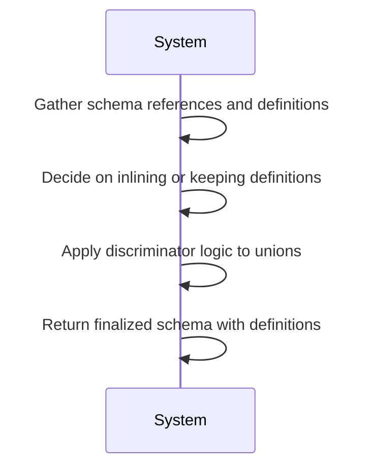
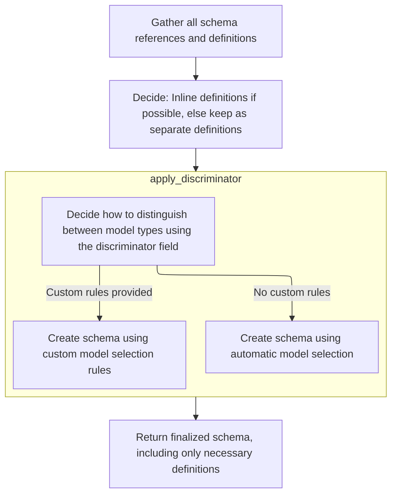
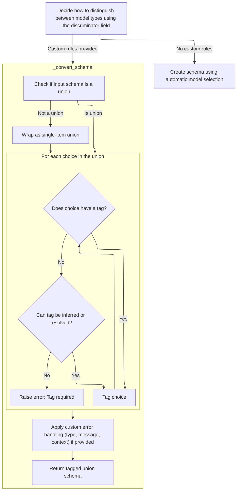
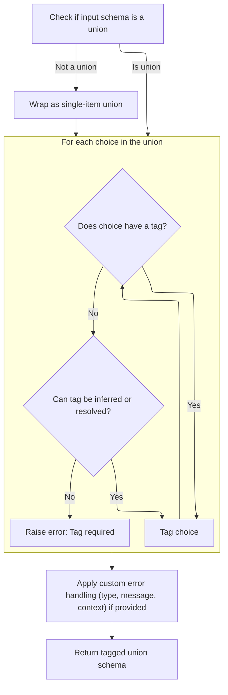
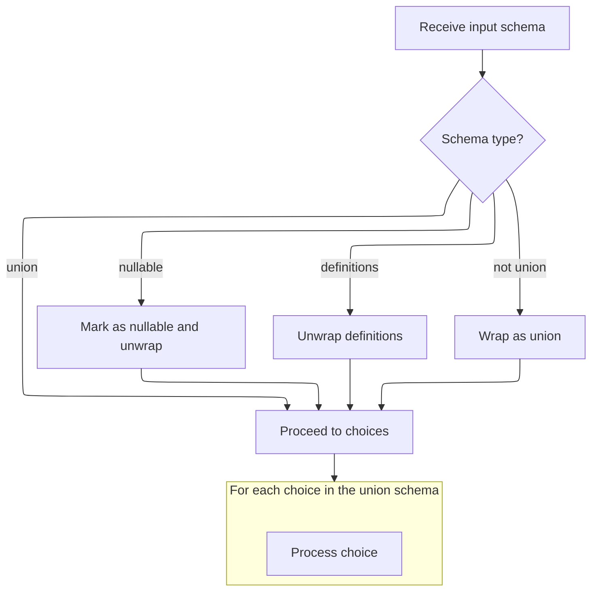

This document explains how a schema is finalized to prepare it for data validation and serialization. The process takes a core schema, resolves all references, applies discriminator logic to union types, and returns a complete schema with all required definitions included.

The main steps are:

- Gather schema references and definitions
- Decide on inlining or keeping definitions
- Apply discriminator logic to relevant schemas
- Return the finalized schema with all necessary definitions



# Spec

## Detailed View of the Program's Functionality

a. Gathering Schema References and Definitions

The process begins by collecting all references and definitions used in the schema. This involves traversing the schema and any referenced definitions, identifying where schemas are referenced by name (as opposed to being inlined directly). The goal is to prepare a mapping of all references and determine which schemas can be inlined (<SwmToken path="pydantic/_internal/_generate_schema.py" pos="925:22:24" line-data="            # safety measure (because these are inlined in place -- i.e. mutated directly)">`i.e`</SwmToken>., replaced directly where they are used) and which must remain as separate definitions due to metadata or serialization requirements.

b. Deciding Inlining or Keeping Definitions

For each collected reference, a decision is made: if the referenced schema is simple and has no special metadata or serialization, it can be inlined (replacing the reference with the actual schema). If it has only discriminator metadata, it can be inlined but the metadata must be preserved for later processing. Otherwise, the schema is kept as a separate definition, and the reference remains. This ensures that schemas with special requirements are not duplicated or altered inappropriately.

c. Applying Discriminator Logic

After inlining and preserving necessary definitions, the process identifies schemas that require a discriminator (used for distinguishing between types in a union). For each such schema, the discriminator metadata is extracted and removed from the schema's metadata. If the discriminator has already been applied (which can happen if the schema appears multiple times), it is skipped. Otherwise, the schema is transformed into a tagged union using the discriminator, enabling efficient and correct validation of union types based on a specific field or value.

d. Discriminator Application to Union Schemas

When applying a discriminator, the logic checks whether a custom discriminator (such as a callable) is provided. If so, a special conversion process is used to build a tagged union schema, ensuring each union choice is uniquely tagged (either by explicit annotation or by inferring from metadata). If no custom rules are provided, the default logic is used, which expects each choice to have a unique tag (either directly or via inference). If a tag cannot be determined for a choice, an error is raised, enforcing that all union members are uniquely identifiable.

e. Tagged Union Schema Construction

The construction of a tagged union schema involves ensuring the input is a union (wrapping it as such if necessary), then iterating over each choice. For each choice, the process attempts to extract a tag from either an explicit annotation or from metadata. If the choice is a reference and a handler is available, the reference is resolved and the tag is extracted again. If no tag can be found, an error is raised. Once all choices are tagged, a tagged union schema is created, including any custom error handling or metadata as needed.

f. Tagged Union Schema Post-Processing

After the tagged union schema is constructed, it is passed to a method that finalizes the logic. This step ensures that all discriminator handling is complete and that the schema is wrapped as nullable if required (<SwmToken path="pydantic/_internal/_generate_schema.py" pos="925:22:24" line-data="            # safety measure (because these are inlined in place -- i.e. mutated directly)">`i.e`</SwmToken>., if None is an allowed value but the schema is not yet marked as nullable). This guarantees that the final schema accurately represents all allowed values and their validation logic.

g. Recursive Union Choice Handling

The process of applying the discriminator is recursive. If the schema is wrapped (<SwmToken path="pydantic/_internal/_generate_schema.py" pos="2782:8:10" line-data="                # gather result (e.g. when using the `Sequence` type -- see `test_sequence_discriminated_union()`).">`e.g`</SwmToken>., nullable or definitions), the wrapper is unwrapped and the process is applied to the inner schema. If the schema is not a union, it is wrapped as a <SwmToken path="pydantic/types.py" pos="3079:19:21" line-data="            # This likely indicates that the schema was a single-item union that was simplified.">`single-item`</SwmToken> union for consistency. Each choice in the union is then processed: if it is itself a union or a compatible tagged union, its choices are coalesced into the outer union. For each valid choice, the discriminator values are inferred (from literals or explicit tags), and the mapping from discriminator value to schema is built, ensuring uniqueness.

h. Final Tagged Union Schema Adjustment

After all choices are processed, the final tagged union schema is constructed. If a discriminator alias is present and differs from the main discriminator, both are included as possible discriminator fields. The schema is then returned, including all tagged choices, discriminator information, and any custom error or metadata settings.

i. Nullable Schema Wrapping

If, after processing, it is determined that the schema should be nullable (<SwmToken path="pydantic/_internal/_generate_schema.py" pos="925:22:24" line-data="            # safety measure (because these are inlined in place -- i.e. mutated directly)">`i.e`</SwmToken>., None is an allowed value) but is not yet marked as such, the schema is wrapped in a nullable schema. This ensures that the resulting schema will accept null values where appropriate. The nullable schema is represented in JSON Schema as an <SwmToken path="pydantic/json_schema.py" pos="1238:10:10" line-data="            # I&#39;ll use &#39;anyOf&#39; for now, but it could be changed it if it would work better with some external tooling">`anyOf`</SwmToken> with the inner schema and a null type.

j. Final Schema Wrapping and Return

Finally, after all discriminator logic and inlining decisions are complete, the process checks if there are any remaining definitions that were not inlined. If so, the schema is wrapped with these definitions, ensuring that all referenced schemas are included in the final output. The fully processed and finalized schema is then returned, ready for use in validation or JSON Schema generation.

# Rule Definition

| Paragraph Name                                                                                                                                                                                                                                                                                                                                                                                                                                                                                                                                                                                                                                                                                                                                                                                                                                                                                                                                                                                                                                                                                                                                                                                                  | Rule ID | Category          | Description                                                                                                                                                                                                                                                                                                                                                                                                                                                                                                                                                                                                                                                   | Conditions                                                                                                                                                                                                                                                                                     | Remarks                                                                                                                                                                                                                                                                                                                                                                                                                                                                                                                                                                                                                                                                                                                           |
| --------------------------------------------------------------------------------------------------------------------------------------------------------------------------------------------------------------------------------------------------------------------------------------------------------------------------------------------------------------------------------------------------------------------------------------------------------------------------------------------------------------------------------------------------------------------------------------------------------------------------------------------------------------------------------------------------------------------------------------------------------------------------------------------------------------------------------------------------------------------------------------------------------------------------------------------------------------------------------------------------------------------------------------------------------------------------------------------------------------------------------------------------------------------------------------------------------------- | ------- | ----------------- | ------------------------------------------------------------------------------------------------------------------------------------------------------------------------------------------------------------------------------------------------------------------------------------------------------------------------------------------------------------------------------------------------------------------------------------------------------------------------------------------------------------------------------------------------------------------------------------------------------------------------------------------------------------- | ---------------------------------------------------------------------------------------------------------------------------------------------------------------------------------------------------------------------------------------------------------------------------------------------- | --------------------------------------------------------------------------------------------------------------------------------------------------------------------------------------------------------------------------------------------------------------------------------------------------------------------------------------------------------------------------------------------------------------------------------------------------------------------------------------------------------------------------------------------------------------------------------------------------------------------------------------------------------------------------------------------------------------------------------- |
| The system must accept schemas represented as dictionaries, where each schema dict must include a 'type' key indicating its kind (<SwmToken path="pydantic/_internal/_generate_schema.py" pos="2782:8:10" line-data="                # gather result (e.g. when using the `Sequence` type -- see `test_sequence_discriminated_union()`).">`e.g`</SwmToken>., 'union', 'model', <SwmToken path="pydantic/_internal/_discriminated_union.py" pos="141:26:28" line-data="        &quot;&quot;&quot;Return a new CoreSchema based on `schema` that uses a tagged-union with the discriminator provided">`tagged-union`</SwmToken>, 'nullable', 'definitions', <SwmToken path="pydantic/_internal/_generate_schema.py" pos="2739:22:24" line-data="        This traverses the core schema and referenced definitions, replaces `&#39;definition-ref&#39;` schemas">`definition-ref`</SwmToken>).                                                                                                                                                                                                                                                                                                                     | RL-001  | Conditional Logic | Every schema dictionary provided to the system must contain a 'type' key, whose value specifies the kind of schema (such as 'union', 'model', <SwmToken path="pydantic/_internal/_discriminated_union.py" pos="141:26:28" line-data="        &quot;&quot;&quot;Return a new CoreSchema based on `schema` that uses a tagged-union with the discriminator provided">`tagged-union`</SwmToken>, 'nullable', 'definitions', or <SwmToken path="pydantic/_internal/_generate_schema.py" pos="2739:22:24" line-data="        This traverses the core schema and referenced definitions, replaces `&#39;definition-ref&#39;` schemas">`definition-ref`</SwmToken>). | A schema dict is provided as input.                                                                                                                                                                                                                                                            | Supported values for 'type' include: 'union', 'model', <SwmToken path="pydantic/_internal/_discriminated_union.py" pos="141:26:28" line-data="        &quot;&quot;&quot;Return a new CoreSchema based on `schema` that uses a tagged-union with the discriminator provided">`tagged-union`</SwmToken>, 'nullable', 'definitions', <SwmToken path="pydantic/_internal/_generate_schema.py" pos="2739:22:24" line-data="        This traverses the core schema and referenced definitions, replaces `&#39;definition-ref&#39;` schemas">`definition-ref`</SwmToken>.                                                                                                                                                                |
| The system must support references to other schemas using a <SwmToken path="pydantic/_internal/_generate_schema.py" pos="2739:22:24" line-data="        This traverses the core schema and referenced definitions, replaces `&#39;definition-ref&#39;` schemas">`definition-ref`</SwmToken> schema dict, which includes a <SwmToken path="pydantic/_internal/_discriminated_union.py" pos="238:6:6" line-data="            if choice[&#39;schema_ref&#39;] not in self.definitions:">`schema_ref`</SwmToken> key.                                                                                                                                                                                                                                                                                                                                                                                                                                                                                                                                                                                                                                                                                               | RL-002  | Conditional Logic | Schema dicts of type <SwmToken path="pydantic/_internal/_generate_schema.py" pos="2739:22:24" line-data="        This traverses the core schema and referenced definitions, replaces `&#39;definition-ref&#39;` schemas">`definition-ref`</SwmToken> must include a <SwmToken path="pydantic/_internal/_discriminated_union.py" pos="238:6:6" line-data="            if choice[&#39;schema_ref&#39;] not in self.definitions:">`schema_ref`</SwmToken> key, which is used to reference another schema definition.                                                                                                                                             | A schema dict with 'type' == <SwmToken path="pydantic/_internal/_generate_schema.py" pos="2739:22:24" line-data="        This traverses the core schema and referenced definitions, replaces `&#39;definition-ref&#39;` schemas">`definition-ref`</SwmToken> is encountered.                   | The <SwmToken path="pydantic/_internal/_discriminated_union.py" pos="238:6:6" line-data="            if choice[&#39;schema_ref&#39;] not in self.definitions:">`schema_ref`</SwmToken> value must correspond to a valid, defined schema in the current context.                                                                                                                                                                                                                                                                                                                                                                                                                                                                   |
| The system must allow for discriminator logic to be applied to union schemas, where a discriminator is either a string (field name) or a Discriminator object (which may include custom logic and error settings).                                                                                                                                                                                                                                                                                                                                                                                                                                                                                                                                                                                                                                                                                                                                                                                                                                                                                                                                                                                              | RL-003  | Conditional Logic | When a union schema is processed, a discriminator (either a string or a Discriminator object) may be applied to enable <SwmToken path="pydantic/_internal/_discriminated_union.py" pos="141:26:28" line-data="        &quot;&quot;&quot;Return a new CoreSchema based on `schema` that uses a tagged-union with the discriminator provided">`tagged-union`</SwmToken> behavior and efficient validation.                                                                                                                                                                                                                                                      | A union schema is processed and a discriminator is provided.                                                                                                                                                                                                                                   | Discriminator can be a string (field name) or a Discriminator object (with custom logic and error settings).                                                                                                                                                                                                                                                                                                                                                                                                                                                                                                                                                                                                                      |
| When applying a discriminator to a union schema, the system must produce a schema dict of type <SwmToken path="pydantic/_internal/_discriminated_union.py" pos="141:26:28" line-data="        &quot;&quot;&quot;Return a new CoreSchema based on `schema` that uses a tagged-union with the discriminator provided">`tagged-union`</SwmToken>, which includes: a 'choices' mapping from tag values to the corresponding schema dicts for each union member; a 'discriminator' key indicating the field or logic used for discrimination; optional keys for <SwmToken path="pydantic/_internal/_discriminated_union.py" pos="216:1:1" line-data="            custom_error_type=schema.get(&#39;custom_error_type&#39;),">`custom_error_type`</SwmToken>, <SwmToken path="pydantic/_internal/_discriminated_union.py" pos="217:1:1" line-data="            custom_error_message=schema.get(&#39;custom_error_message&#39;),">`custom_error_message`</SwmToken>, and <SwmToken path="pydantic/_internal/_discriminated_union.py" pos="218:1:1" line-data="            custom_error_context=schema.get(&#39;custom_error_context&#39;),">`custom_error_context`</SwmToken> if provided by the Discriminator object. | RL-004  | Computation       | Union schemas with a discriminator must be transformed into <SwmToken path="pydantic/_internal/_discriminated_union.py" pos="141:26:28" line-data="        &quot;&quot;&quot;Return a new CoreSchema based on `schema` that uses a tagged-union with the discriminator provided">`tagged-union`</SwmToken> schemas, with a mapping of tag values to schema dicts, and inclusion of discriminator and optional custom error settings.                                                                                                                                                                                                                          | A union schema with a discriminator is being processed.                                                                                                                                                                                                                                        | The output schema dict must have 'type': <SwmToken path="pydantic/_internal/_discriminated_union.py" pos="141:26:28" line-data="        &quot;&quot;&quot;Return a new CoreSchema based on `schema` that uses a tagged-union with the discriminator provided">`tagged-union`</SwmToken>, a 'choices' mapping, a 'discriminator' key, and optional custom error keys.                                                                                                                                                                                                                                                                                                                                                              |
| The system must ensure that every choice in a union schema has a unique tag for discrimination. If a tag is missing and cannot be inferred or resolved, the system must raise a <SwmToken path="pydantic/_internal/_generate_schema.py" pos="1033:11:13" line-data="        boilerplate before calling into the user-facing method (e.g. `GenerateSchema._tuple_schema`).">`user-facing`</SwmToken> error indicating that a tag is required.                                                                                                                                                                                                                                                                                                                                                                                                                                                                                                                                                                                                                                                                                                                                                                    | RL-005  | Conditional Logic | Each choice in a union schema must have a unique tag for discrimination. If a tag is missing or duplicated, or cannot be inferred, an error must be raised.                                                                                                                                                                                                                                                                                                                                                                                                                                                                                                   | Processing a union schema with a discriminator.                                                                                                                                                                                                                                                | Tags are typically inferred from literal fields or Tag annotations. Errors are raised if uniqueness or presence is violated.                                                                                                                                                                                                                                                                                                                                                                                                                                                                                                                                                                                                      |
| If a discriminator field uses an alias, the system must ensure that all union members use the same alias for the discriminator field. If aliases differ or are not strings, a <SwmToken path="pydantic/_internal/_generate_schema.py" pos="1033:11:13" line-data="        boilerplate before calling into the user-facing method (e.g. `GenerateSchema._tuple_schema`).">`user-facing`</SwmToken> error must be raised.                                                                                                                                                                                                                                                                                                                                                                                                                                                                                                                                                                                                                                                                                                                                                                                         | RL-006  | Conditional Logic | When a discriminator field uses an alias, all union members must use the same alias, and it must be a string. Otherwise, an error is raised.                                                                                                                                                                                                                                                                                                                                                                                                                                                                                                                  | A union schema with a discriminator field that uses an alias.                                                                                                                                                                                                                                  | Alias must be a string and consistent across all union members.                                                                                                                                                                                                                                                                                                                                                                                                                                                                                                                                                                                                                                                                   |
| If a custom callable is used as the discriminator, each union choice must be explicitly tagged. If a tag is not provided, a <SwmToken path="pydantic/_internal/_generate_schema.py" pos="1033:11:13" line-data="        boilerplate before calling into the user-facing method (e.g. `GenerateSchema._tuple_schema`).">`user-facing`</SwmToken> error must be raised.                                                                                                                                                                                                                                                                                                                                                                                                                                                                                                                                                                                                                                                                                                                                                                                                                                           | RL-007  | Conditional Logic | When using a callable as the discriminator, every union choice must have an explicit Tag annotation. Missing tags result in an error.                                                                                                                                                                                                                                                                                                                                                                                                                                                                                                                         | A union schema uses a callable discriminator.                                                                                                                                                                                                                                                  | Tags must be provided via Tag annotations. Error code: <SwmToken path="pydantic/types.py" pos="3109:4:10" line-data="                        code=&#39;callable-discriminator-no-tag&#39;,">`callable-discriminator-no-tag`</SwmToken>.                                                                                                                                                                                                                                                                                                                                                                                                                                                                                           |
| The system must support custom error handling for discriminated unions, allowing the Discriminator object to specify a custom error type, message, and context, which must be included in the output schema dict and used for error reporting during validation.                                                                                                                                                                                                                                                                                                                                                                                                                                                                                                                                                                                                                                                                                                                                                                                                                                                                                                                                                | RL-008  | Data Assignment   | Custom error type, message, and context specified in the Discriminator object must be included in the output schema dict and used during validation.                                                                                                                                                                                                                                                                                                                                                                                                                                                                                                          | A Discriminator object with custom error settings is used.                                                                                                                                                                                                                                     | Output schema dict includes <SwmToken path="pydantic/_internal/_discriminated_union.py" pos="216:1:1" line-data="            custom_error_type=schema.get(&#39;custom_error_type&#39;),">`custom_error_type`</SwmToken>, <SwmToken path="pydantic/_internal/_discriminated_union.py" pos="217:1:1" line-data="            custom_error_message=schema.get(&#39;custom_error_message&#39;),">`custom_error_message`</SwmToken>, <SwmToken path="pydantic/_internal/_discriminated_union.py" pos="218:1:1" line-data="            custom_error_context=schema.get(&#39;custom_error_context&#39;),">`custom_error_context`</SwmToken> if provided.                                                                                  |
| When processing a schema dict of type 'nullable', the system must output a JSON schema dict that allows null values, using an <SwmToken path="pydantic/json_schema.py" pos="1238:10:10" line-data="            # I&#39;ll use &#39;anyOf&#39; for now, but it could be changed it if it would work better with some external tooling">`anyOf`</SwmToken> key with the inner schema and a schema dict of type 'null'. If the inner schema is already of type 'null', only that schema must be returned.                                                                                                                                                                                                                                                                                                                                                                                                                                                                                                                                                                                                                                                                                                          | RL-009  | Computation       | Nullable schemas must be output as a JSON schema allowing null values, using <SwmToken path="pydantic/json_schema.py" pos="1238:10:10" line-data="            # I&#39;ll use &#39;anyOf&#39; for now, but it could be changed it if it would work better with some external tooling">`anyOf`</SwmToken> with the inner schema and a null schema, unless the inner schema is already null.                                                                                                                                                                                                                                                                     | A schema dict with 'type' == 'nullable' is processed.                                                                                                                                                                                                                                          | Output format: {<SwmToken path="pydantic/json_schema.py" pos="1238:10:10" line-data="            # I&#39;ll use &#39;anyOf&#39; for now, but it could be changed it if it would work better with some external tooling">`anyOf`</SwmToken>: \[<SwmToken path="pydantic/_internal/_generate_schema.py" pos="264:1:1" line-data="        inner_schema = schema.get(&#39;items_schema&#39;, core_schema.any_schema())">`inner_schema`</SwmToken>, {'type': 'null'}\]} unless <SwmToken path="pydantic/_internal/_generate_schema.py" pos="264:1:1" line-data="        inner_schema = schema.get(&#39;items_schema&#39;, core_schema.any_schema())">`inner_schema`</SwmToken> == {'type': 'null'}.                                    |
| The system must recursively process union schemas, unwrapping any nullable or definitions wrappers, and ensure that all nested unions are handled and all discriminator values are unique.                                                                                                                                                                                                                                                                                                                                                                                                                                                                                                                                                                                                                                                                                                                                                                                                                                                                                                                                                                                                                      | RL-010  | Computation       | Union schemas must be recursively processed, unwrapping nullable and definitions wrappers, and ensuring uniqueness of discriminator values at all levels.                                                                                                                                                                                                                                                                                                                                                                                                                                                                                                     | A union schema (possibly nested/wrapped) is processed.                                                                                                                                                                                                                                         | All nested unions must be handled; discriminator values must be unique across all choices.                                                                                                                                                                                                                                                                                                                                                                                                                                                                                                                                                                                                                                        |
| After processing, if there are any remaining schema definitions that were not inlined, the system must wrap the output schema dict in a 'definitions' schema dict, including all referenced schemas.                                                                                                                                                                                                                                                                                                                                                                                                                                                                                                                                                                                                                                                                                                                                                                                                                                                                                                                                                                                                            | RL-011  | Computation       | If any schema definitions remain after processing, the output schema must be wrapped in a 'definitions' schema dict, including all referenced schemas.                                                                                                                                                                                                                                                                                                                                                                                                                                                                                                        | There are remaining schema definitions after processing.                                                                                                                                                                                                                                       | Output format: {'type': 'definitions', 'schema': main_schema, 'definitions': \[referenced_schemas\]}                                                                                                                                                                                                                                                                                                                                                                                                                                                                                                                                                                                                                              |
| The system must raise the following errors in the specified situations: <SwmToken path="pydantic/_internal/_discriminated_union.py" pos="50:1:1" line-data="        TypeError:">`TypeError`</SwmToken> for structural issues such as invalid union variants, duplicate tags, or single-variant unions. <SwmToken path="pydantic/_internal/_discriminated_union.py" pos="54:1:1" line-data="        MissingDefinitionForUnionRef:">`MissingDefinitionForUnionRef`</SwmToken> if a referenced schema is missing from the definitions. <SwmToken path="pydantic/_internal/_discriminated_union.py" pos="56:1:1" line-data="        PydanticUserError:">`PydanticUserError`</SwmToken> for <SwmToken path="pydantic/_internal/_generate_schema.py" pos="1033:11:13" line-data="        boilerplate before calling into the user-facing method (e.g. `GenerateSchema._tuple_schema`).">`user-facing`</SwmToken> issues, including missing discriminator fields, alias problems, non-literal discriminator fields, missing tags for callable discriminators, and presence of validators in the discriminator field.                                                                                                   | RL-012  | Conditional Logic | Specific errors must be raised for structural problems, missing references, and <SwmToken path="pydantic/_internal/_generate_schema.py" pos="1033:11:13" line-data="        boilerplate before calling into the user-facing method (e.g. `GenerateSchema._tuple_schema`).">`user-facing`</SwmToken> configuration issues.                                                                                                                                                                                                                                                                                                                                     | Structural issue, missing reference, or <SwmToken path="pydantic/_internal/_generate_schema.py" pos="1033:11:13" line-data="        boilerplate before calling into the user-facing method (e.g. `GenerateSchema._tuple_schema`).">`user-facing`</SwmToken> configuration problem is detected. | <SwmToken path="pydantic/_internal/_discriminated_union.py" pos="50:1:1" line-data="        TypeError:">`TypeError`</SwmToken> for structural issues; <SwmToken path="pydantic/_internal/_discriminated_union.py" pos="54:1:1" line-data="        MissingDefinitionForUnionRef:">`MissingDefinitionForUnionRef`</SwmToken> for missing references; <SwmToken path="pydantic/_internal/_discriminated_union.py" pos="56:1:1" line-data="        PydanticUserError:">`PydanticUserError`</SwmToken> for <SwmToken path="pydantic/_internal/_generate_schema.py" pos="1033:11:13" line-data="        boilerplate before calling into the user-facing method (e.g. `GenerateSchema._tuple_schema`).">`user-facing`</SwmToken> issues. |
| The system must ensure that the output schema dict is suitable for downstream validation logic, with all discriminator handling and nullable wrapping in place.                                                                                                                                                                                                                                                                                                                                                                                                                                                                                                                                                                                                                                                                                                                                                                                                                                                                                                                                                                                                                                                 | RL-013  | Computation       | The final output schema must be fully processed, with all discriminator and nullable logic applied, and ready for downstream validation.                                                                                                                                                                                                                                                                                                                                                                                                                                                                                                                      | Schema processing is complete.                                                                                                                                                                                                                                                                 | All transformations must be applied before output; output must be a valid schema dict.                                                                                                                                                                                                                                                                                                                                                                                                                                                                                                                                                                                                                                            |
| The system must prevent repeated application of discriminator logic to the same schema object by marking the transformation as complete after the first application.                                                                                                                                                                                                                                                                                                                                                                                                                                                                                                                                                                                                                                                                                                                                                                                                                                                                                                                                                                                                                                            | RL-014  | Conditional Logic | Discriminator logic must not be applied more than once to the same schema object; the system must track and prevent repeated application.                                                                                                                                                                                                                                                                                                                                                                                                                                                                                                                     | Discriminator logic is being applied to a schema object.                                                                                                                                                                                                                                       | A flag or marker is set after first application to prevent reapplication.                                                                                                                                                                                                                                                                                                                                                                                                                                                                                                                                                                                                                                                         |

# User Stories

## User Story 1: Schema ingestion and reference resolution

---

### Story Description:

As a system user, I want to provide schema dictionaries with required type and reference keys so that the system can correctly interpret and resolve schema structures and references.

---

### Business Rule Mapping:

| Rule ID | Paragraph Name                                                                                                                                                                                                                                                                                                                                                                                                                                                                                                                                                                                                                                                                                                                                                                                                                                                                              | Rule Description                                                                                                                                                                                                                                                                                                                                                                                                                                                                                                                                                                                                                                              |
| ------- | ------------------------------------------------------------------------------------------------------------------------------------------------------------------------------------------------------------------------------------------------------------------------------------------------------------------------------------------------------------------------------------------------------------------------------------------------------------------------------------------------------------------------------------------------------------------------------------------------------------------------------------------------------------------------------------------------------------------------------------------------------------------------------------------------------------------------------------------------------------------------------------------- | ------------------------------------------------------------------------------------------------------------------------------------------------------------------------------------------------------------------------------------------------------------------------------------------------------------------------------------------------------------------------------------------------------------------------------------------------------------------------------------------------------------------------------------------------------------------------------------------------------------------------------------------------------------- |
| RL-001  | The system must accept schemas represented as dictionaries, where each schema dict must include a 'type' key indicating its kind (<SwmToken path="pydantic/_internal/_generate_schema.py" pos="2782:8:10" line-data="                # gather result (e.g. when using the `Sequence` type -- see `test_sequence_discriminated_union()`).">`e.g`</SwmToken>., 'union', 'model', <SwmToken path="pydantic/_internal/_discriminated_union.py" pos="141:26:28" line-data="        &quot;&quot;&quot;Return a new CoreSchema based on `schema` that uses a tagged-union with the discriminator provided">`tagged-union`</SwmToken>, 'nullable', 'definitions', <SwmToken path="pydantic/_internal/_generate_schema.py" pos="2739:22:24" line-data="        This traverses the core schema and referenced definitions, replaces `&#39;definition-ref&#39;` schemas">`definition-ref`</SwmToken>). | Every schema dictionary provided to the system must contain a 'type' key, whose value specifies the kind of schema (such as 'union', 'model', <SwmToken path="pydantic/_internal/_discriminated_union.py" pos="141:26:28" line-data="        &quot;&quot;&quot;Return a new CoreSchema based on `schema` that uses a tagged-union with the discriminator provided">`tagged-union`</SwmToken>, 'nullable', 'definitions', or <SwmToken path="pydantic/_internal/_generate_schema.py" pos="2739:22:24" line-data="        This traverses the core schema and referenced definitions, replaces `&#39;definition-ref&#39;` schemas">`definition-ref`</SwmToken>). |
| RL-002  | The system must support references to other schemas using a <SwmToken path="pydantic/_internal/_generate_schema.py" pos="2739:22:24" line-data="        This traverses the core schema and referenced definitions, replaces `&#39;definition-ref&#39;` schemas">`definition-ref`</SwmToken> schema dict, which includes a <SwmToken path="pydantic/_internal/_discriminated_union.py" pos="238:6:6" line-data="            if choice[&#39;schema_ref&#39;] not in self.definitions:">`schema_ref`</SwmToken> key.                                                                                                                                                                                                                                                                                                                                                                           | Schema dicts of type <SwmToken path="pydantic/_internal/_generate_schema.py" pos="2739:22:24" line-data="        This traverses the core schema and referenced definitions, replaces `&#39;definition-ref&#39;` schemas">`definition-ref`</SwmToken> must include a <SwmToken path="pydantic/_internal/_discriminated_union.py" pos="238:6:6" line-data="            if choice[&#39;schema_ref&#39;] not in self.definitions:">`schema_ref`</SwmToken> key, which is used to reference another schema definition.                                                                                                                                             |

---

### Relevant Functionality:

- **The system must accept schemas represented as dictionaries**
  1. **RL-001:**
     - When a schema dict is received:
       - Check for the presence of the 'type' key.
       - Validate that the value of 'type' is one of the supported schema kinds.
       - If missing or invalid, raise a <SwmToken path="pydantic/_internal/_discriminated_union.py" pos="50:1:1" line-data="        TypeError:">`TypeError`</SwmToken> or <SwmToken path="pydantic/_internal/_generate_schema.py" pos="1033:11:13" line-data="        boilerplate before calling into the user-facing method (e.g. `GenerateSchema._tuple_schema`).">`user-facing`</SwmToken> error.
- **The system must support references to other schemas using a** <SwmToken path="pydantic/_internal/_generate_schema.py" pos="2739:22:24" line-data="        This traverses the core schema and referenced definitions, replaces `&#39;definition-ref&#39;` schemas">`definition-ref`</SwmToken> **schema dict**
  1. **RL-002:**
     - If schema\['type'\] == <SwmToken path="pydantic/_internal/_generate_schema.py" pos="2739:22:24" line-data="        This traverses the core schema and referenced definitions, replaces `&#39;definition-ref&#39;` schemas">`definition-ref`</SwmToken>:
       - Ensure <SwmToken path="pydantic/_internal/_discriminated_union.py" pos="238:6:6" line-data="            if choice[&#39;schema_ref&#39;] not in self.definitions:">`schema_ref`</SwmToken> key is present.
       - Attempt to resolve the referenced schema.
       - If the reference is missing, raise <SwmToken path="pydantic/_internal/_discriminated_union.py" pos="54:1:1" line-data="        MissingDefinitionForUnionRef:">`MissingDefinitionForUnionRef`</SwmToken>.

## User Story 2: Union schemas and discriminator logic

---

### Story Description:

As a system user, I want union schemas to support discriminator logic, including transformation to <SwmToken path="pydantic/_internal/_discriminated_union.py" pos="141:26:28" line-data="        &quot;&quot;&quot;Return a new CoreSchema based on `schema` that uses a tagged-union with the discriminator provided">`tagged-union`</SwmToken>, unique tagging, alias consistency, explicit tagging for callable discriminators, custom error handling, recursive processing, and prevention of repeated discriminator application, so that unions are validated efficiently and errors are reported clearly.

---

### Business Rule Mapping:

| Rule ID | Paragraph Name                                                                                                                                                                                                                                                                                                                                                                                                                                                                                                                                                                                                                                                                                                                                                                                                                                                                                                                                                                                                                                                                                                                                                                                                  | Rule Description                                                                                                                                                                                                                                                                                                                                                                                                                     |
| ------- | --------------------------------------------------------------------------------------------------------------------------------------------------------------------------------------------------------------------------------------------------------------------------------------------------------------------------------------------------------------------------------------------------------------------------------------------------------------------------------------------------------------------------------------------------------------------------------------------------------------------------------------------------------------------------------------------------------------------------------------------------------------------------------------------------------------------------------------------------------------------------------------------------------------------------------------------------------------------------------------------------------------------------------------------------------------------------------------------------------------------------------------------------------------------------------------------------------------- | ------------------------------------------------------------------------------------------------------------------------------------------------------------------------------------------------------------------------------------------------------------------------------------------------------------------------------------------------------------------------------------------------------------------------------------ |
| RL-003  | The system must allow for discriminator logic to be applied to union schemas, where a discriminator is either a string (field name) or a Discriminator object (which may include custom logic and error settings).                                                                                                                                                                                                                                                                                                                                                                                                                                                                                                                                                                                                                                                                                                                                                                                                                                                                                                                                                                                              | When a union schema is processed, a discriminator (either a string or a Discriminator object) may be applied to enable <SwmToken path="pydantic/_internal/_discriminated_union.py" pos="141:26:28" line-data="        &quot;&quot;&quot;Return a new CoreSchema based on `schema` that uses a tagged-union with the discriminator provided">`tagged-union`</SwmToken> behavior and efficient validation.                             |
| RL-004  | When applying a discriminator to a union schema, the system must produce a schema dict of type <SwmToken path="pydantic/_internal/_discriminated_union.py" pos="141:26:28" line-data="        &quot;&quot;&quot;Return a new CoreSchema based on `schema` that uses a tagged-union with the discriminator provided">`tagged-union`</SwmToken>, which includes: a 'choices' mapping from tag values to the corresponding schema dicts for each union member; a 'discriminator' key indicating the field or logic used for discrimination; optional keys for <SwmToken path="pydantic/_internal/_discriminated_union.py" pos="216:1:1" line-data="            custom_error_type=schema.get(&#39;custom_error_type&#39;),">`custom_error_type`</SwmToken>, <SwmToken path="pydantic/_internal/_discriminated_union.py" pos="217:1:1" line-data="            custom_error_message=schema.get(&#39;custom_error_message&#39;),">`custom_error_message`</SwmToken>, and <SwmToken path="pydantic/_internal/_discriminated_union.py" pos="218:1:1" line-data="            custom_error_context=schema.get(&#39;custom_error_context&#39;),">`custom_error_context`</SwmToken> if provided by the Discriminator object. | Union schemas with a discriminator must be transformed into <SwmToken path="pydantic/_internal/_discriminated_union.py" pos="141:26:28" line-data="        &quot;&quot;&quot;Return a new CoreSchema based on `schema` that uses a tagged-union with the discriminator provided">`tagged-union`</SwmToken> schemas, with a mapping of tag values to schema dicts, and inclusion of discriminator and optional custom error settings. |
| RL-005  | The system must ensure that every choice in a union schema has a unique tag for discrimination. If a tag is missing and cannot be inferred or resolved, the system must raise a <SwmToken path="pydantic/_internal/_generate_schema.py" pos="1033:11:13" line-data="        boilerplate before calling into the user-facing method (e.g. `GenerateSchema._tuple_schema`).">`user-facing`</SwmToken> error indicating that a tag is required.                                                                                                                                                                                                                                                                                                                                                                                                                                                                                                                                                                                                                                                                                                                                                                    | Each choice in a union schema must have a unique tag for discrimination. If a tag is missing or duplicated, or cannot be inferred, an error must be raised.                                                                                                                                                                                                                                                                          |
| RL-006  | If a discriminator field uses an alias, the system must ensure that all union members use the same alias for the discriminator field. If aliases differ or are not strings, a <SwmToken path="pydantic/_internal/_generate_schema.py" pos="1033:11:13" line-data="        boilerplate before calling into the user-facing method (e.g. `GenerateSchema._tuple_schema`).">`user-facing`</SwmToken> error must be raised.                                                                                                                                                                                                                                                                                                                                                                                                                                                                                                                                                                                                                                                                                                                                                                                         | When a discriminator field uses an alias, all union members must use the same alias, and it must be a string. Otherwise, an error is raised.                                                                                                                                                                                                                                                                                         |
| RL-007  | If a custom callable is used as the discriminator, each union choice must be explicitly tagged. If a tag is not provided, a <SwmToken path="pydantic/_internal/_generate_schema.py" pos="1033:11:13" line-data="        boilerplate before calling into the user-facing method (e.g. `GenerateSchema._tuple_schema`).">`user-facing`</SwmToken> error must be raised.                                                                                                                                                                                                                                                                                                                                                                                                                                                                                                                                                                                                                                                                                                                                                                                                                                           | When using a callable as the discriminator, every union choice must have an explicit Tag annotation. Missing tags result in an error.                                                                                                                                                                                                                                                                                                |
| RL-008  | The system must support custom error handling for discriminated unions, allowing the Discriminator object to specify a custom error type, message, and context, which must be included in the output schema dict and used for error reporting during validation.                                                                                                                                                                                                                                                                                                                                                                                                                                                                                                                                                                                                                                                                                                                                                                                                                                                                                                                                                | Custom error type, message, and context specified in the Discriminator object must be included in the output schema dict and used during validation.                                                                                                                                                                                                                                                                                 |
| RL-010  | The system must recursively process union schemas, unwrapping any nullable or definitions wrappers, and ensure that all nested unions are handled and all discriminator values are unique.                                                                                                                                                                                                                                                                                                                                                                                                                                                                                                                                                                                                                                                                                                                                                                                                                                                                                                                                                                                                                      | Union schemas must be recursively processed, unwrapping nullable and definitions wrappers, and ensuring uniqueness of discriminator values at all levels.                                                                                                                                                                                                                                                                            |
| RL-012  | The system must raise the following errors in the specified situations: <SwmToken path="pydantic/_internal/_discriminated_union.py" pos="50:1:1" line-data="        TypeError:">`TypeError`</SwmToken> for structural issues such as invalid union variants, duplicate tags, or single-variant unions. <SwmToken path="pydantic/_internal/_discriminated_union.py" pos="54:1:1" line-data="        MissingDefinitionForUnionRef:">`MissingDefinitionForUnionRef`</SwmToken> if a referenced schema is missing from the definitions. <SwmToken path="pydantic/_internal/_discriminated_union.py" pos="56:1:1" line-data="        PydanticUserError:">`PydanticUserError`</SwmToken> for <SwmToken path="pydantic/_internal/_generate_schema.py" pos="1033:11:13" line-data="        boilerplate before calling into the user-facing method (e.g. `GenerateSchema._tuple_schema`).">`user-facing`</SwmToken> issues, including missing discriminator fields, alias problems, non-literal discriminator fields, missing tags for callable discriminators, and presence of validators in the discriminator field.                                                                                                   | Specific errors must be raised for structural problems, missing references, and <SwmToken path="pydantic/_internal/_generate_schema.py" pos="1033:11:13" line-data="        boilerplate before calling into the user-facing method (e.g. `GenerateSchema._tuple_schema`).">`user-facing`</SwmToken> configuration issues.                                                                                                            |
| RL-014  | The system must prevent repeated application of discriminator logic to the same schema object by marking the transformation as complete after the first application.                                                                                                                                                                                                                                                                                                                                                                                                                                                                                                                                                                                                                                                                                                                                                                                                                                                                                                                                                                                                                                            | Discriminator logic must not be applied more than once to the same schema object; the system must track and prevent repeated application.                                                                                                                                                                                                                                                                                            |

---

### Relevant Functionality:

- **The system must allow for discriminator logic to be applied to union schemas**
  1. **RL-003:**
     - If a discriminator is present for a union schema:
       - If discriminator is a string, use it as the field name for discrimination.
       - If discriminator is a Discriminator object, apply its logic and error settings.
       - Transform the union schema into a <SwmToken path="pydantic/_internal/_discriminated_union.py" pos="141:26:28" line-data="        &quot;&quot;&quot;Return a new CoreSchema based on `schema` that uses a tagged-union with the discriminator provided">`tagged-union`</SwmToken> schema as needed.
- **When applying a discriminator to a union schema**
  1. **RL-004:**
     - For each member of the union:
       - Determine the tag value (from literal or Tag annotation).
       - Map the tag value to the corresponding schema dict.
     - Construct a new schema dict:
       - 'type': <SwmToken path="pydantic/_internal/_discriminated_union.py" pos="141:26:28" line-data="        &quot;&quot;&quot;Return a new CoreSchema based on `schema` that uses a tagged-union with the discriminator provided">`tagged-union`</SwmToken>
       - 'choices': {tag_value: schema_dict, ...}
       - 'discriminator': discriminator
       - Include <SwmToken path="pydantic/_internal/_discriminated_union.py" pos="216:1:1" line-data="            custom_error_type=schema.get(&#39;custom_error_type&#39;),">`custom_error_type`</SwmToken>, <SwmToken path="pydantic/_internal/_discriminated_union.py" pos="217:1:1" line-data="            custom_error_message=schema.get(&#39;custom_error_message&#39;),">`custom_error_message`</SwmToken>, <SwmToken path="pydantic/_internal/_discriminated_union.py" pos="218:1:1" line-data="            custom_error_context=schema.get(&#39;custom_error_context&#39;),">`custom_error_context`</SwmToken> if present.
- **The system must ensure that every choice in a union schema has a unique tag for discrimination. If a tag is missing and cannot be inferred or resolved**
  1. **RL-005:**
     - For each union member:
       - Infer or extract the tag value.
       - Check for uniqueness among all tags.
       - If a tag is missing or duplicated, raise a <SwmToken path="pydantic/_internal/_discriminated_union.py" pos="50:1:1" line-data="        TypeError:">`TypeError`</SwmToken> or <SwmToken path="pydantic/_internal/_discriminated_union.py" pos="56:1:1" line-data="        PydanticUserError:">`PydanticUserError`</SwmToken>.
- **If a discriminator field uses an alias**
  1. **RL-006:**
     - For each union member:
       - Extract the alias for the discriminator field.
       - Compare aliases across all members.
       - If any alias is not a string or aliases differ, raise <SwmToken path="pydantic/_internal/_discriminated_union.py" pos="56:1:1" line-data="        PydanticUserError:">`PydanticUserError`</SwmToken>.
- **If a custom callable is used as the discriminator**
  1. **RL-007:**
     - For each union member:
       - Check for presence of Tag annotation.
       - If missing, raise <SwmToken path="pydantic/_internal/_discriminated_union.py" pos="56:1:1" line-data="        PydanticUserError:">`PydanticUserError`</SwmToken> with code <SwmToken path="pydantic/types.py" pos="3109:4:10" line-data="                        code=&#39;callable-discriminator-no-tag&#39;,">`callable-discriminator-no-tag`</SwmToken>.
- **The system must support custom error handling for discriminated unions**
  1. **RL-008:**
     - When building the <SwmToken path="pydantic/_internal/_discriminated_union.py" pos="141:26:28" line-data="        &quot;&quot;&quot;Return a new CoreSchema based on `schema` that uses a tagged-union with the discriminator provided">`tagged-union`</SwmToken> schema:
       - If Discriminator has custom error settings, include them in the schema dict.
       - Use these settings during validation error reporting.
- **The system must recursively process union schemas**
  1. **RL-010:**
     - For each union schema encountered:
       - If wrapped in 'nullable' or 'definitions', unwrap and process inner schema.
       - Recursively process all nested unions.
       - Track and enforce uniqueness of discriminator values.
- **The system must raise the following errors in the specified situations:** <SwmToken path="pydantic/_internal/_discriminated_union.py" pos="50:1:1" line-data="        TypeError:">`TypeError`</SwmToken> **for structural issues such as invalid union variants**
  1. **RL-012:**
     - On structural issue (<SwmToken path="pydantic/_internal/_generate_schema.py" pos="2782:8:10" line-data="                # gather result (e.g. when using the `Sequence` type -- see `test_sequence_discriminated_union()`).">`e.g`</SwmToken>., invalid union variant, duplicate tag):
       - Raise <SwmToken path="pydantic/_internal/_discriminated_union.py" pos="50:1:1" line-data="        TypeError:">`TypeError`</SwmToken>.
     - On missing reference:
       - Raise <SwmToken path="pydantic/_internal/_discriminated_union.py" pos="54:1:1" line-data="        MissingDefinitionForUnionRef:">`MissingDefinitionForUnionRef`</SwmToken>.
     - On <SwmToken path="pydantic/_internal/_generate_schema.py" pos="1033:11:13" line-data="        boilerplate before calling into the user-facing method (e.g. `GenerateSchema._tuple_schema`).">`user-facing`</SwmToken> configuration issue (<SwmToken path="pydantic/_internal/_generate_schema.py" pos="2782:8:10" line-data="                # gather result (e.g. when using the `Sequence` type -- see `test_sequence_discriminated_union()`).">`e.g`</SwmToken>., missing discriminator field, alias problem, non-literal discriminator, missing tag, validator in discriminator field):
       - Raise <SwmToken path="pydantic/_internal/_discriminated_union.py" pos="56:1:1" line-data="        PydanticUserError:">`PydanticUserError`</SwmToken>.
- **The system must prevent repeated application of discriminator logic to the same schema object by marking the transformation as complete after the first application.**
  1. **RL-014:**
     - When applying discriminator logic:
       - Check if the schema object has already been processed.
       - If so, skip reapplication.
       - Otherwise, apply logic and mark as processed.

## User Story 3: Nullable schemas, definitions, and output formatting

---

### Story Description:

As a system user, I want nullable schemas to be output in the correct JSON schema format, remaining definitions to be wrapped appropriately, and the final schema to be ready for downstream validation so that the output is always valid and complete.

---

### Business Rule Mapping:

| Rule ID | Paragraph Name                                                                                                                                                                                                                                                                                                                                                                                                                                                                                         | Rule Description                                                                                                                                                                                                                                                                                                                                                                          |
| ------- | ------------------------------------------------------------------------------------------------------------------------------------------------------------------------------------------------------------------------------------------------------------------------------------------------------------------------------------------------------------------------------------------------------------------------------------------------------------------------------------------------------ | ----------------------------------------------------------------------------------------------------------------------------------------------------------------------------------------------------------------------------------------------------------------------------------------------------------------------------------------------------------------------------------------- |
| RL-009  | When processing a schema dict of type 'nullable', the system must output a JSON schema dict that allows null values, using an <SwmToken path="pydantic/json_schema.py" pos="1238:10:10" line-data="            # I&#39;ll use &#39;anyOf&#39; for now, but it could be changed it if it would work better with some external tooling">`anyOf`</SwmToken> key with the inner schema and a schema dict of type 'null'. If the inner schema is already of type 'null', only that schema must be returned. | Nullable schemas must be output as a JSON schema allowing null values, using <SwmToken path="pydantic/json_schema.py" pos="1238:10:10" line-data="            # I&#39;ll use &#39;anyOf&#39; for now, but it could be changed it if it would work better with some external tooling">`anyOf`</SwmToken> with the inner schema and a null schema, unless the inner schema is already null. |
| RL-011  | After processing, if there are any remaining schema definitions that were not inlined, the system must wrap the output schema dict in a 'definitions' schema dict, including all referenced schemas.                                                                                                                                                                                                                                                                                                   | If any schema definitions remain after processing, the output schema must be wrapped in a 'definitions' schema dict, including all referenced schemas.                                                                                                                                                                                                                                    |
| RL-013  | The system must ensure that the output schema dict is suitable for downstream validation logic, with all discriminator handling and nullable wrapping in place.                                                                                                                                                                                                                                                                                                                                        | The final output schema must be fully processed, with all discriminator and nullable logic applied, and ready for downstream validation.                                                                                                                                                                                                                                                  |

---

### Relevant Functionality:

- **When processing a schema dict of type 'nullable'**
  1. **RL-009:**
     - If schema\['type'\] == 'nullable':
       - Generate the inner schema.
       - If inner schema is {'type': 'null'}, return it.
       - Otherwise, return {<SwmToken path="pydantic/json_schema.py" pos="1238:10:10" line-data="            # I&#39;ll use &#39;anyOf&#39; for now, but it could be changed it if it would work better with some external tooling">`anyOf`</SwmToken>: \[<SwmToken path="pydantic/_internal/_generate_schema.py" pos="264:1:1" line-data="        inner_schema = schema.get(&#39;items_schema&#39;, core_schema.any_schema())">`inner_schema`</SwmToken>, {'type': 'null'}\]}.
- **After processing**
  1. **RL-011:**
     - After processing the main schema:
       - If any referenced schemas remain, wrap the output in a 'definitions' schema dict including all referenced schemas.
- **The system must ensure that the output schema dict is suitable for downstream validation logic**
  1. **RL-013:**
     - After all processing steps:
       - Ensure all discriminator logic and nullable wrapping is applied.
       - Output the finalized schema dict.

# Code Walkthrough

## Schema Finalization and Reference Resolution



<SwmSnippet path="/pydantic/_internal/_generate_schema.py" line="2736">

---

In <SwmToken path="pydantic/_internal/_generate_schema.py" pos="2736:3:3" line-data="    def finalize_schema(self, schema: CoreSchema) -&gt; CoreSchema:">`finalize_schema`</SwmToken>, we start by collecting references and prepping the schema for inlining or metadata preservation, so that later steps like discriminator application have the right structure to work with.

```python
    def finalize_schema(self, schema: CoreSchema) -> CoreSchema:
        """Finalize the core schema.

        This traverses the core schema and referenced definitions, replaces `'definition-ref'` schemas
        by the referenced definition if possible, and applies deferred discriminators.
        """
        definitions = self._definitions
        try:
            gather_result = gather_schemas_for_cleaning(
                schema,
                definitions=definitions,
            )
        except MissingDefinitionError as e:
            raise InvalidSchemaError from e

        remaining_defs: dict[str, CoreSchema] = {}

        # Note: this logic doesn't play well when core schemas with deferred discriminator metadata
        # and references are encountered. See the `test_deferred_discriminated_union_and_references()` test.
        for ref, inlinable_def_ref in gather_result['collected_references'].items():
            if inlinable_def_ref is not None and (inlining_behavior := _inlining_behavior(inlinable_def_ref)) != 'keep':
                if inlining_behavior == 'inline':
                    # `ref` was encountered, and only once:
                    #  - `inlinable_def_ref` is a `'definition-ref'` schema and is guaranteed to be
                    #    the only one. Transform it into the definition it points to.
                    #  - Do not store the definition in the `remaining_defs`.
                    inlinable_def_ref.clear()  # pyright: ignore[reportAttributeAccessIssue]
                    inlinable_def_ref.update(self._resolve_definition(ref, definitions))  # pyright: ignore
                elif inlining_behavior == 'preserve_metadata':
                    # `ref` was encountered, and only once, but contains discriminator metadata.
                    # We will do the same thing as if `inlining_behavior` was `'inline'`, but make
                    # sure to keep the metadata for the deferred discriminator application logic below.
                    meta = inlinable_def_ref.pop('metadata')
                    inlinable_def_ref.clear()  # pyright: ignore[reportAttributeAccessIssue]
                    inlinable_def_ref.update(self._resolve_definition(ref, definitions))  # pyright: ignore
                    inlinable_def_ref['metadata'] = meta
            else:
                # `ref` was encountered, at least two times (or only once, but with metadata or a serialization schema):
                # - Do not inline the `'definition-ref'` schemas (they are not provided in the gather result anyway).
                # - Store the the definition in the `remaining_defs`
                remaining_defs[ref] = self._resolve_definition(ref, definitions)
```

---

</SwmSnippet>

<SwmSnippet path="/pydantic/_internal/_generate_schema.py" line="2776">

---

After resolving references and prepping the schema, we loop through any schemas that need a discriminator applied. We pop the discriminator metadata, skip if it's already handled, and then call <SwmToken path="pydantic/_internal/_generate_schema.py" pos="2785:7:7" line-data="            applied = _discriminated_union.apply_discriminator(cs.copy(), discriminator, remaining_defs)">`apply_discriminator`</SwmToken> to transform the schema into a tagged union. This step is what actually enables discrimination between union choices based on a field value.

```python
                remaining_defs[ref] = self._resolve_definition(ref, definitions)

        for cs in gather_result['deferred_discriminator_schemas']:
            discriminator: str | None = cs['metadata'].pop('pydantic_internal_union_discriminator', None)  # pyright: ignore[reportTypedDictNotRequiredAccess]
            if discriminator is None:
                # This can happen in rare scenarios, when a deferred schema is present multiple times in the
                # gather result (e.g. when using the `Sequence` type -- see `test_sequence_discriminated_union()`).
                # In this case, a previous loop iteration applied the discriminator and so we can just skip it here.
                continue
            applied = _discriminated_union.apply_discriminator(cs.copy(), discriminator, remaining_defs)
            # Mutate the schema directly to have the discriminator applied
            cs.clear()  # pyright: ignore[reportAttributeAccessIssue]
            cs.update(applied)  # pyright: ignore

```

---

</SwmSnippet>

### Discriminator Application to Union Schemas



<SwmSnippet path="/pydantic/_internal/_discriminated_union.py" line="34">

---

In <SwmToken path="pydantic/_internal/_discriminated_union.py" pos="34:2:2" line-data="def apply_discriminator(">`apply_discriminator`</SwmToken>, we hand off to <SwmToken path="pydantic/_internal/_discriminated_union.py" pos="68:5:5" line-data="            return discriminator._convert_schema(schema)">`_convert_schema`</SwmToken> if the discriminator isn't a plain string, so the schema gets properly set up for tagged union handling.

```python
def apply_discriminator(
    schema: core_schema.CoreSchema,
    discriminator: str | Discriminator,
    definitions: dict[str, core_schema.CoreSchema] | None = None,
) -> core_schema.CoreSchema:
    """Applies the discriminator and returns a new core schema.

    Args:
        schema: The input schema.
        discriminator: The name of the field which will serve as the discriminator.
        definitions: A mapping of schema ref to schema.

    Returns:
        The new core schema.

    Raises:
        TypeError:
            - If `discriminator` is used with invalid union variant.
            - If `discriminator` is used with `Union` type with one variant.
            - If `discriminator` value mapped to multiple choices.
        MissingDefinitionForUnionRef:
            If the definition for ref is missing.
        PydanticUserError:
            - If a model in union doesn't have a discriminator field.
            - If discriminator field has a non-string alias.
            - If discriminator fields have different aliases.
            - If discriminator field not of type `Literal`.
    """
    from ..types import Discriminator

    if isinstance(discriminator, Discriminator):
        if isinstance(discriminator.discriminator, str):
            discriminator = discriminator.discriminator
        else:
            return discriminator._convert_schema(schema)

```

---

</SwmSnippet>

#### Tagged Union Schema Construction



<SwmSnippet path="/pydantic/types.py" line="3075">

---

In <SwmToken path="pydantic/types.py" pos="3075:3:3" line-data="    def _convert_schema(">`_convert_schema`</SwmToken>, we make sure the schema is a union, then go through each choice to extract a tag from either the tuple or the metadata. If a choice is a reference and a handler is available, we resolve it and try to get the tag again. If no tag is found, we bail with an error. This guarantees every union choice is uniquely tagged for discrimination.

```python
    def _convert_schema(
        self, original_schema: core_schema.CoreSchema, handler: GetCoreSchemaHandler | None = None
    ) -> core_schema.TaggedUnionSchema:
        if original_schema['type'] != 'union':
            # This likely indicates that the schema was a single-item union that was simplified.
            # In this case, we do the same thing we do in
            # `pydantic._internal._discriminated_union._ApplyInferredDiscriminator._apply_to_root`, namely,
            # package the generated schema back into a single-item union.
            original_schema = core_schema.union_schema([original_schema])

        tagged_union_choices = {}
        for choice in original_schema['choices']:
            tag = None
            if isinstance(choice, tuple):
                choice, tag = choice
            metadata = cast('CoreMetadata | None', choice.get('metadata'))
            if metadata is not None:
                tag = metadata.get('pydantic_internal_union_tag_key') or tag
            if tag is None:
                # `handler` is None when this method is called from `apply_discriminator()` (deferred discriminators)
                if handler is not None and choice['type'] == 'definition-ref':
                    # If choice was built from a PEP 695 type alias, try to resolve the def:
                    try:
                        choice = handler.resolve_ref_schema(choice)
                    except LookupError:
                        pass
                    else:
                        metadata = cast('CoreMetadata | None', choice.get('metadata'))
                        if metadata is not None:
                            tag = metadata.get('pydantic_internal_union_tag_key')

                if tag is None:
                    raise PydanticUserError(
                        f'`Tag` not provided for choice {choice} used with `Discriminator`',
                        code='callable-discriminator-no-tag',
                    )
            tagged_union_choices[tag] = choice
```

---

</SwmSnippet>

<SwmSnippet path="/pydantic/types.py" line="3111">

---

After collecting all the tagged choices, we build and return a tagged union schema with the tags, discriminator, and any custom error or metadata settings. This is the schema that downstream logic will use for discriminated union validation.

```python
            tagged_union_choices[tag] = choice

        # Have to do these verbose checks to ensure falsy values ('' and {}) don't get ignored
        custom_error_type = self.custom_error_type
        if custom_error_type is None:
            custom_error_type = original_schema.get('custom_error_type')

        custom_error_message = self.custom_error_message
        if custom_error_message is None:
            custom_error_message = original_schema.get('custom_error_message')

        custom_error_context = self.custom_error_context
        if custom_error_context is None:
            custom_error_context = original_schema.get('custom_error_context')

        custom_error_type = original_schema.get('custom_error_type') if custom_error_type is None else custom_error_type
        return core_schema.tagged_union_schema(
            tagged_union_choices,
            self.discriminator,
            custom_error_type=custom_error_type,
            custom_error_message=custom_error_message,
            custom_error_context=custom_error_context,
            strict=original_schema.get('strict'),
            ref=original_schema.get('ref'),
            metadata=original_schema.get('metadata'),
            serialization=original_schema.get('serialization'),
        )
```

---

</SwmSnippet>

#### Tagged Union Schema Post-Processing

<SwmSnippet path="/pydantic/_internal/_discriminated_union.py" line="70">

---

After returning from <SwmToken path="pydantic/_internal/_discriminated_union.py" pos="68:5:5" line-data="            return discriminator._convert_schema(schema)">`_convert_schema`</SwmToken>, <SwmToken path="pydantic/_internal/_generate_schema.py" pos="2785:7:7" line-data="            applied = _discriminated_union.apply_discriminator(cs.copy(), discriminator, remaining_defs)">`apply_discriminator`</SwmToken> hands off the schema to an apply method. This step finalizes the tagged union logic, making sure all discriminator handling and nullable wrapping are in place before the schema is used.

```python
    return _ApplyInferredDiscriminator(discriminator, definitions or {}).apply(schema)
```

---

</SwmSnippet>

### Final Tagged Union Schema Adjustment

```mermaid
%%{init: {"flowchart": {"defaultRenderer": "elk"}} }%%
flowchart TD
  node1["Prepare input schema"] --> node2["Build tagged union schema with discriminator"]
  click node1 openCode "pydantic/_internal/_discriminated_union.py:140:163"
  node2 --> node3["Return schema, making it nullable if required"]
  click node2 openCode "pydantic/_internal/_discriminated_union.py:164:164"
  click node2 openCode "pydantic/_internal/_discriminated_union.py:170:170"
  node3:::decision["Return schema, making it nullable if self._should_be_nullable and not self._is_nullable"]
  click node3 openCode "pydantic/_internal/_discriminated_union.py:165:168"


subgraph node2 [_apply_to_root]
  sgmain_1_node1["Receive input schema"] --> sgmain_1_node2{"Schema type?"}
  click sgmain_1_node1 openCode "pydantic/_internal/_discriminated_union.py:170:174"
  sgmain_1_node2 -->|"nullable"| sgmain_1_node3["Mark as nullable and unwrap"]
  click sgmain_1_node2 openCode "pydantic/_internal/_discriminated_union.py:175:180"
  sgmain_1_node2 -->|"definitions"| sgmain_1_node4["Unwrap definitions"]
  click sgmain_1_node4 openCode "pydantic/_internal/_discriminated_union.py:182:186"
  sgmain_1_node2 -->|"not union"| sgmain_1_node5["Wrap as union"]
  click sgmain_1_node5 openCode "pydantic/_internal/_discriminated_union.py:188:193"
  sgmain_1_node2 -->|"union"| sgmain_1_node6["Proceed to choices"]
  click sgmain_1_node6 openCode "pydantic/_internal/_discriminated_union.py:195:197"
  sgmain_1_node3 --> sgmain_1_node6
  sgmain_1_node4 --> sgmain_1_node6
  sgmain_1_node5 --> sgmain_1_node6
  sgmain_1_node6 --> sgmain_1_loop1
  subgraph sgmain_1_loop1["For each choice in the union schema"]
  loop1a["Process choice"]
  click loop1a openCode "pydantic/_internal/_discriminated_union.py:198:200"
  end
end

%% Swimm:
%% %%{init: {"flowchart": {"defaultRenderer": "elk"}} }%%
%% flowchart TD
%%   node1["Prepare input schema"] --> node2["Build tagged union schema with discriminator"]
%%   click node1 openCode "<SwmPath>[pydantic/\_internal/\_discriminated_union.py](pydantic/_internal/_discriminated_union.py)</SwmPath>:140:163"
%%   node2 --> node3["Return schema, making it nullable if required"]
%%   click node2 openCode "<SwmPath>[pydantic/\_internal/\_discriminated_union.py](pydantic/_internal/_discriminated_union.py)</SwmPath>:164:164"
%%   click node2 openCode "<SwmPath>[pydantic/\_internal/\_discriminated_union.py](pydantic/_internal/_discriminated_union.py)</SwmPath>:170:170"
%%   node3:::decision["Return schema, making it nullable if <SwmToken path="pydantic/_internal/_discriminated_union.py" pos="165:3:5" line-data="        if self._should_be_nullable and not self._is_nullable:">`self._should_be_nullable`</SwmToken> and not <SwmToken path="pydantic/_internal/_discriminated_union.py" pos="165:11:13" line-data="        if self._should_be_nullable and not self._is_nullable:">`self._is_nullable`</SwmToken>"]
%%   click node3 openCode "<SwmPath>[pydantic/\_internal/\_discriminated_union.py](pydantic/_internal/_discriminated_union.py)</SwmPath>:165:168"
%% 
%% 
%% subgraph node2 [<SwmToken path="pydantic/_internal/_discriminated_union.py" pos="164:7:7" line-data="        schema = self._apply_to_root(schema)">`_apply_to_root`</SwmToken>]
%%   sgmain_1_node1["Receive input schema"] --> sgmain_1_node2{"Schema type?"}
%%   click sgmain_1_node1 openCode "<SwmPath>[pydantic/\_internal/\_discriminated_union.py](pydantic/_internal/_discriminated_union.py)</SwmPath>:170:174"
%%   sgmain_1_node2 -->|"nullable"| sgmain_1_node3["Mark as nullable and unwrap"]
%%   click sgmain_1_node2 openCode "<SwmPath>[pydantic/\_internal/\_discriminated_union.py](pydantic/_internal/_discriminated_union.py)</SwmPath>:175:180"
%%   sgmain_1_node2 -->|"definitions"| sgmain_1_node4["Unwrap definitions"]
%%   click sgmain_1_node4 openCode "<SwmPath>[pydantic/\_internal/\_discriminated_union.py](pydantic/_internal/_discriminated_union.py)</SwmPath>:182:186"
%%   sgmain_1_node2 -->|"not union"| sgmain_1_node5["Wrap as union"]
%%   click sgmain_1_node5 openCode "<SwmPath>[pydantic/\_internal/\_discriminated_union.py](pydantic/_internal/_discriminated_union.py)</SwmPath>:188:193"
%%   sgmain_1_node2 -->|"union"| sgmain_1_node6["Proceed to choices"]
%%   click sgmain_1_node6 openCode "<SwmPath>[pydantic/\_internal/\_discriminated_union.py](pydantic/_internal/_discriminated_union.py)</SwmPath>:195:197"
%%   sgmain_1_node3 --> sgmain_1_node6
%%   sgmain_1_node4 --> sgmain_1_node6
%%   sgmain_1_node5 --> sgmain_1_node6
%%   sgmain_1_node6 --> sgmain_1_loop1
%%   subgraph sgmain_1_loop1["For each choice in the union schema"]
%%   loop1a["Process choice"]
%%   click loop1a openCode "<SwmPath>[pydantic/\_internal/\_discriminated_union.py](pydantic/_internal/_discriminated_union.py)</SwmPath>:198:200"
%%   end
%% end
```

<SwmSnippet path="/pydantic/_internal/_discriminated_union.py" line="140">

---

In <SwmToken path="pydantic/_internal/_discriminated_union.py" pos="140:3:3" line-data="    def apply(self, schema: core_schema.CoreSchema) -&gt; core_schema.CoreSchema:">`apply`</SwmToken>, we just call <SwmToken path="pydantic/_internal/_discriminated_union.py" pos="164:7:7" line-data="        schema = self._apply_to_root(schema)">`_apply_to_root`</SwmToken> to do the main schema transformation and handle all the union/discriminator logic.

```python
    def apply(self, schema: core_schema.CoreSchema) -> core_schema.CoreSchema:
        """Return a new CoreSchema based on `schema` that uses a tagged-union with the discriminator provided
        to this class.

        Args:
            schema: The input schema.

        Returns:
            The new core schema.

        Raises:
            TypeError:
                - If `discriminator` is used with invalid union variant.
                - If `discriminator` is used with `Union` type with one variant.
                - If `discriminator` value mapped to multiple choices.
            ValueError:
                If the definition for ref is missing.
            PydanticUserError:
                - If a model in union doesn't have a discriminator field.
                - If discriminator field has a non-string alias.
                - If discriminator fields have different aliases.
                - If discriminator field not of type `Literal`.
        """
        assert not self._used
        schema = self._apply_to_root(schema)
```

---

</SwmSnippet>

#### Recursive Union Choice Handling



<SwmSnippet path="/pydantic/_internal/_discriminated_union.py" line="170">

---

In <SwmToken path="pydantic/_internal/_discriminated_union.py" pos="170:3:3" line-data="    def _apply_to_root(self, schema: core_schema.CoreSchema) -&gt; core_schema.CoreSchema:">`_apply_to_root`</SwmToken>, we unwrap wrappers, make sure everything is a union, and then process each choice with <SwmToken path="pydantic/_internal/_discriminated_union.py" pos="172:19:19" line-data="        unwrapping nullable or definitions schemas, and calling the `_handle_choice`">`_handle_choice`</SwmToken> to build up the tagged union.

```python
    def _apply_to_root(self, schema: core_schema.CoreSchema) -> core_schema.CoreSchema:
        """This method handles the outer-most stage of recursion over the input schema:
        unwrapping nullable or definitions schemas, and calling the `_handle_choice`
        method iteratively on the choices extracted (recursively) from the possibly-wrapped union.
        """
        if schema['type'] == 'nullable':
            self._is_nullable = True
            wrapped = self._apply_to_root(schema['schema'])
            nullable_wrapper = schema.copy()
            nullable_wrapper['schema'] = wrapped
            return nullable_wrapper

        if schema['type'] == 'definitions':
            wrapped = self._apply_to_root(schema['schema'])
            definitions_wrapper = schema.copy()
            definitions_wrapper['schema'] = wrapped
            return definitions_wrapper

        if schema['type'] != 'union':
            # If the schema is not a union, it probably means it just had a single member and
            # was flattened by pydantic_core.
            # However, it still may make sense to apply the discriminator to this schema,
            # as a way to get discriminated-union-style error messages, so we allow this here.
            schema = core_schema.union_schema([schema])

        # Reverse the choices list before extending the stack so that they get handled in the order they occur
        choices_schemas = [v[0] if isinstance(v, tuple) else v for v in schema['choices'][::-1]]
        self._choices_to_handle.extend(choices_schemas)
        while self._choices_to_handle:
            choice = self._choices_to_handle.pop()
            self._handle_choice(choice)

```

---

</SwmSnippet>

<SwmSnippet path="/pydantic/_internal/_discriminated_union.py" line="226">

---

<SwmToken path="pydantic/_internal/_discriminated_union.py" pos="226:3:3" line-data="    def _handle_choice(self, choice: core_schema.CoreSchema) -&gt; None:">`_handle_choice`</SwmToken> unwraps, flattens, and validates each union choice, making sure every discriminator value is unique and all nested unions are handled.

```python
    def _handle_choice(self, choice: core_schema.CoreSchema) -> None:
        """This method handles the "middle" stage of recursion over the input schema.
        Specifically, it is responsible for handling each choice of the outermost union
        (and any "coalesced" choices obtained from inner unions).

        Here, "handling" entails:
        * Coalescing nested unions and compatible tagged-unions
        * Tracking the presence of 'none' and 'nullable' schemas occurring as choices
        * Validating that each allowed discriminator value maps to a unique choice
        * Updating the _tagged_union_choices mapping that will ultimately be used to build the TaggedUnionSchema.
        """
        if choice['type'] == 'definition-ref':
            if choice['schema_ref'] not in self.definitions:
                raise MissingDefinitionForUnionRef(choice['schema_ref'])

        if choice['type'] == 'none':
            self._should_be_nullable = True
        elif choice['type'] == 'definitions':
            self._handle_choice(choice['schema'])
        elif choice['type'] == 'nullable':
            self._should_be_nullable = True
            self._handle_choice(choice['schema'])  # unwrap the nullable schema
        elif choice['type'] == 'union':
            # Reverse the choices list before extending the stack so that they get handled in the order they occur
            choices_schemas = [v[0] if isinstance(v, tuple) else v for v in choice['choices'][::-1]]
            self._choices_to_handle.extend(choices_schemas)
        elif choice['type'] not in {
            'model',
            'typed-dict',
            'tagged-union',
            'lax-or-strict',
            'dataclass',
            'dataclass-args',
            'definition-ref',
        } and not _core_utils.is_function_with_inner_schema(choice):
            # We should eventually handle 'definition-ref' as well
            err_str = f'The core schema type {choice["type"]!r} is not a valid discriminated union variant.'
            if choice['type'] == 'list':
                err_str += (
                    ' If you are making use of a list of union types, make sure the discriminator is applied to the '
                    'union type and not the list (e.g. `list[Annotated[<T> | <U>, Field(discriminator=...)]]`).'
                )
            raise TypeError(err_str)
        else:
            if choice['type'] == 'tagged-union' and self._is_discriminator_shared(choice):
                # In this case, this inner tagged-union is compatible with the outer tagged-union,
                # and its choices can be coalesced into the outer TaggedUnionSchema.
                subchoices = [x for x in choice['choices'].values() if not isinstance(x, (str, int))]
                # Reverse the choices list before extending the stack so that they get handled in the order they occur
                self._choices_to_handle.extend(subchoices[::-1])
                return

            inferred_discriminator_values = self._infer_discriminator_values_for_choice(choice, source_name=None)
            self._set_unique_choice_for_values(choice, inferred_discriminator_values)
```

---

</SwmSnippet>

<SwmSnippet path="/pydantic/_internal/_discriminated_union.py" line="202">

---

After <SwmToken path="pydantic/_internal/_discriminated_union.py" pos="172:19:19" line-data="        unwrapping nullable or definitions schemas, and calling the `_handle_choice`">`_handle_choice`</SwmToken>, <SwmToken path="pydantic/_internal/_discriminated_union.py" pos="164:7:7" line-data="        schema = self._apply_to_root(schema)">`_apply_to_root`</SwmToken> sets up any discriminator aliases and returns the final tagged union schema for use.

```python
        if self._discriminator_alias is not None and self._discriminator_alias != self.discriminator:
            # * We need to annotate `discriminator` as a union here to handle both branches of this conditional
            # * We need to annotate `discriminator` as list[list[str | int]] and not list[list[str]] due to the
            #   invariance of list, and because list[list[str | int]] is the type of the discriminator argument
            #   to tagged_union_schema below
            # * See the docstring of pydantic_core.core_schema.tagged_union_schema for more details about how to
            #   interpret the value of the discriminator argument to tagged_union_schema. (The list[list[str]] here
            #   is the appropriate way to provide a list of fallback attributes to check for a discriminator value.)
            discriminator: str | list[list[str | int]] = [[self.discriminator], [self._discriminator_alias]]
        else:
            discriminator = self.discriminator
        return core_schema.tagged_union_schema(
            choices=self._tagged_union_choices,
            discriminator=discriminator,
            custom_error_type=schema.get('custom_error_type'),
            custom_error_message=schema.get('custom_error_message'),
            custom_error_context=schema.get('custom_error_context'),
            strict=False,
            from_attributes=True,
            ref=schema.get('ref'),
            metadata=schema.get('metadata'),
            serialization=schema.get('serialization'),
        )
```

---

</SwmSnippet>

#### Nullable Schema Wrapping

<SwmSnippet path="/pydantic/_internal/_discriminated_union.py" line="165">

---

After returning from <SwmToken path="pydantic/_internal/_discriminated_union.py" pos="164:7:7" line-data="        schema = self._apply_to_root(schema)">`_apply_to_root`</SwmToken>, apply checks if the schema should be nullable but isn't yet. If so, it wraps the schema with <SwmToken path="pydantic/_internal/_discriminated_union.py" pos="166:7:7" line-data="            schema = core_schema.nullable_schema(schema)">`nullable_schema`</SwmToken> to make sure None values are accepted where needed.

```python
        if self._should_be_nullable and not self._is_nullable:
            schema = core_schema.nullable_schema(schema)
```

---

</SwmSnippet>

<SwmSnippet path="/pydantic/json_schema.py" line="1222">

---

<SwmToken path="pydantic/json_schema.py" pos="1222:3:3" line-data="    def nullable_schema(self, schema: core_schema.NullableSchema) -&gt; JsonSchemaValue:">`nullable_schema`</SwmToken> generates a JSON schema that allows null values by combining the inner schema with a null type using <SwmToken path="pydantic/json_schema.py" pos="1238:10:10" line-data="            # I&#39;ll use &#39;anyOf&#39; for now, but it could be changed it if it would work better with some external tooling">`anyOf`</SwmToken>. If the inner schema is already just null, it returns that directly. This is a standard way to represent nullable types in JSON Schema.

```python
    def nullable_schema(self, schema: core_schema.NullableSchema) -> JsonSchemaValue:
        """Generates a JSON schema that matches a schema that allows null values.

        Args:
            schema: The core schema.

        Returns:
            The generated JSON schema.
        """
        null_schema = {'type': 'null'}
        inner_json_schema = self.generate_inner(schema['schema'])

        if inner_json_schema == null_schema:
            return null_schema
        else:
            # Thanks to the equality check against `null_schema` above, I think 'oneOf' would also be valid here;
            # I'll use 'anyOf' for now, but it could be changed it if it would work better with some external tooling
            return self.get_flattened_anyof([inner_json_schema, null_schema])
```

---

</SwmSnippet>

<SwmSnippet path="/pydantic/_internal/_discriminated_union.py" line="167">

---

After <SwmToken path="pydantic/_internal/_discriminated_union.py" pos="166:7:7" line-data="            schema = core_schema.nullable_schema(schema)">`nullable_schema`</SwmToken> (if it was needed), apply marks the transformation as done by setting \_used to True and returns the final schema. This prevents the logic from running again on the same object.

```python
        self._used = True
        return schema
```

---

</SwmSnippet>

### Final Schema Wrapping and Return

<SwmSnippet path="/pydantic/_internal/_generate_schema.py" line="2790">

---

After <SwmToken path="pydantic/_internal/_generate_schema.py" pos="2785:7:7" line-data="            applied = _discriminated_union.apply_discriminator(cs.copy(), discriminator, remaining_defs)">`apply_discriminator`</SwmToken>, <SwmToken path="pydantic/_internal/_generate_schema.py" pos="2736:3:3" line-data="    def finalize_schema(self, schema: CoreSchema) -&gt; CoreSchema:">`finalize_schema`</SwmToken> checks if there are any remaining definitions that weren't inlined. If so, it wraps the schema with those definitions before returning. This makes sure all referenced schemas are included in the final output.

```python
        if remaining_defs:
            schema = core_schema.definitions_schema(schema=schema, definitions=[*remaining_defs.values()])
        return schema
```

---

</SwmSnippet>

&nbsp;

*This is an auto-generated document by Swimm 🌊 and has not yet been verified by a human*

<SwmMeta version="3.0.0" repo-id="Z2l0aHViJTNBJTNBcHlkYW50aWMlM0ElM0FTd2ltbS1EZW1v" repo-name="pydantic"><sup>Powered by [Swimm](/)</sup></SwmMeta>
