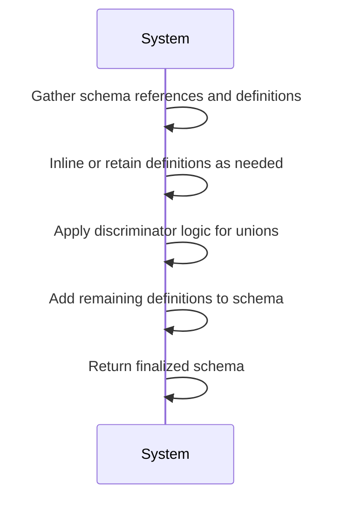
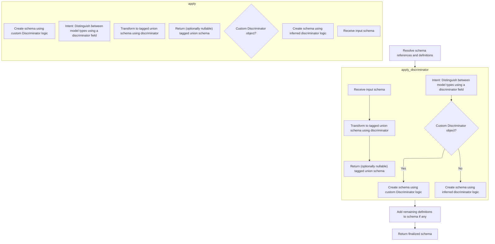
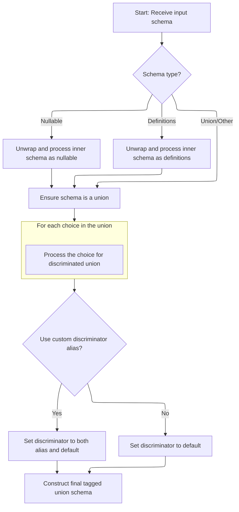

This document outlines the process for preparing a schema for data validation by resolving references, handling unions, and ensuring all necessary definitions are present. The flow receives a schema that may contain references and union types, processes it to inline or keep definitions as appropriate, applies logic for discriminated unions, and returns a finalized schema suitable for validation and serialization.

The main steps are:

- Collect and analyze schema references and definitions
- Inline or retain definitions based on their usage and metadata
- Apply union discrimination logic where needed
- Attach any remaining definitions to the schema
- Output the finalized schema



# Spec

## Detailed View of the Program's Functionality

a. Resolving Schema References and Definitions

The process begins by traversing the schema and its referenced definitions. The goal is to identify all references within the schema and determine, for each reference, whether its definition should be inlined (<SwmToken path="pydantic/_internal/_generate_schema.py" pos="925:22:24" line-data="            # safety measure (because these are inlined in place -- i.e. mutated directly)">`i.e`</SwmToken>., directly embedded in place of the reference) or kept as a separate definition. This decision is based on how many times the reference is used and whether it contains special metadata (such as serialization information or discriminator metadata). If a reference is only used once and has no special metadata, it is inlined by replacing the reference with the actual definition. If it has discriminator metadata, the metadata is preserved during inlining. If the reference is used multiple times or has serialization or other metadata, it is kept as a separate definition and added to a collection of remaining definitions.

b. Applying Discriminator Logic if Needed

After resolving references, the process checks for schemas that require a discriminator to be applied. These are typically union types where the correct variant needs to be selected based on a specific field (the discriminator). For each such schema, the discriminator metadata is removed from the schema's metadata, and the discriminator logic is applied. This involves transforming the union schema into a tagged union schema, where each possible variant is associated with a unique discriminator value. The schema is updated in place to reflect this transformation, ensuring that union types are properly set up for discrimination.

c. Adding Remaining Definitions to the Schema

Once all references have been resolved and discriminators applied, the process checks if there are any remaining definitions that need to be included in the schema. If there are, the schema is wrapped with these definitions, ensuring that all necessary definitions are available for validation. If there are no remaining definitions, this step is skipped.

d. Returning the Finalized Schema

Finally, the fully processed schema is returned. This schema has all references resolved (either inlined or kept as definitions), all necessary discriminators applied, and all required definitions included. The result is a schema that is ready for use in data validation, with all the necessary information for handling complex types, unions, and references.

---

### Detailed Steps for Discriminator Application

1. **Intent**: The discriminator logic is used to distinguish between different model types within a union by using a specific field (the discriminator).
2. **Custom Discriminator**: If a custom Discriminator object is provided, its custom logic is used to build the tagged union schema.
3. **Inferred Discriminator**: If no custom Discriminator is provided, the system infers the discriminator logic by analyzing the schema and constructing the tagged union accordingly.

---

### Building Discriminated Union Schemas

- If a custom Discriminator object is present, its method is called to convert the schema using custom logic.
- If not, the system uses an inferred discriminator approach, where it analyzes the schema to determine which discriminator values map to which union choices, ensuring each value maps to a unique choice.

---

### Converting Input Schemas to Tagged Unions

- The input schema is unwrapped to handle nullable or definitions wrappers, ensuring the core union is exposed.
- Each choice in the union is processed to determine its discriminator values.
- If a custom alias for the discriminator is used, both the alias and the default are set as possible discriminator fields.
- The final tagged union schema is constructed, associating each discriminator value with the corresponding schema variant.

---

### Finalizing Tagged Union Schema Construction

- After constructing the tagged union schema, if the schema should be nullable but isn't yet, it is wrapped to allow null values.
- The schema is marked as finalized and returned.

---

### Wrapping Up and Returning the Final Schema

- After all processing, if there are leftover definitions, the schema is wrapped with these definitions to ensure all references can be resolved during validation.
- The finalized schema is returned, ready for use in validation and serialization.

# Rule Definition

| Paragraph Name                                                                                                                                                                                                                                                                                                                                                                                                                                                             | Rule ID | Category          | Description                                                                                                                                                                                                                                                                                                                                                                                                                                                                                                                                                                                                                                                                                                                                                                                                                                                                                                   | Conditions                                                                                                                                                                                                                                                                                                                                                                                                                                                               | Remarks                                                                                                                                                                                                                                                                                                                                                                                                                                                                                                                                                                                                                                                     |
| -------------------------------------------------------------------------------------------------------------------------------------------------------------------------------------------------------------------------------------------------------------------------------------------------------------------------------------------------------------------------------------------------------------------------------------------------------------------------- | ------- | ----------------- | ------------------------------------------------------------------------------------------------------------------------------------------------------------------------------------------------------------------------------------------------------------------------------------------------------------------------------------------------------------------------------------------------------------------------------------------------------------------------------------------------------------------------------------------------------------------------------------------------------------------------------------------------------------------------------------------------------------------------------------------------------------------------------------------------------------------------------------------------------------------------------------------------------------- | ------------------------------------------------------------------------------------------------------------------------------------------------------------------------------------------------------------------------------------------------------------------------------------------------------------------------------------------------------------------------------------------------------------------------------------------------------------------------ | ----------------------------------------------------------------------------------------------------------------------------------------------------------------------------------------------------------------------------------------------------------------------------------------------------------------------------------------------------------------------------------------------------------------------------------------------------------------------------------------------------------------------------------------------------------------------------------------------------------------------------------------------------------- |
| GenerateSchema.\_generate_schema_inner, GenerateSchema.generate_schema, GenerateSchema.match_type, GenerateSchema.\_match_generic_type, \_Definitions.finalize_schema                                                                                                                                                                                                                                                                                                      | RL-001  | Data Assignment   | The system processes schema objects represented as nested dictionaries. Each schema must have a 'type' key (<SwmToken path="pydantic/_internal/_generate_schema.py" pos="2782:8:10" line-data="                # gather result (e.g. when using the `Sequence` type -- see `test_sequence_discriminated_union()`).">`e.g`</SwmToken>., 'model', 'union', <SwmToken path="pydantic/_internal/_generate_schema.py" pos="2739:22:24" line-data="        This traverses the core schema and referenced definitions, replaces `&#39;definition-ref&#39;` schemas">`definition-ref`</SwmToken>, <SwmToken path="pydantic/_internal/_discriminated_union.py" pos="141:26:28" line-data="        &quot;&quot;&quot;Return a new CoreSchema based on `schema` that uses a tagged-union with the discriminator provided">`tagged-union`</SwmToken>, 'definitions'), and may have additional keys depending on the type. | Input schema is a nested dictionary with a 'type' key.                                                                                                                                                                                                                                                                                                                                                                                                                   | The schema dictionary must always include a 'type' key. Additional keys depend on the schema type (<SwmToken path="pydantic/_internal/_generate_schema.py" pos="2782:8:10" line-data="                # gather result (e.g. when using the `Sequence` type -- see `test_sequence_discriminated_union()`).">`e.g`</SwmToken>., 'choices' for unions, <SwmToken path="pydantic/_internal/_generate_schema.py" pos="1021:7:7" line-data="            return core_schema.definition_reference_schema(schema_ref=obj.type_ref)">`schema_ref`</SwmToken> for definition references, etc.).                                                                        |
| \_Definitions.get_schema_or_ref, \_Definitions.create_definition_reference_schema, \_Definitions.finalize_schema, \_Definitions.\_resolve_definition, GenerateSchema.\_generate_schema_inner                                                                                                                                                                                                                                                                               | RL-002  | Conditional Logic | Schemas can reference other schemas using the <SwmToken path="pydantic/_internal/_generate_schema.py" pos="2739:22:24" line-data="        This traverses the core schema and referenced definitions, replaces `&#39;definition-ref&#39;` schemas">`definition-ref`</SwmToken> type, with a <SwmToken path="pydantic/_internal/_generate_schema.py" pos="1021:7:7" line-data="            return core_schema.definition_reference_schema(schema_ref=obj.type_ref)">`schema_ref`</SwmToken> key indicating the reference name. The system maintains a definitions mapping from reference names to schema objects.                                                                                                                                                                                                                                                                                               | Schema of type <SwmToken path="pydantic/_internal/_generate_schema.py" pos="2739:22:24" line-data="        This traverses the core schema and referenced definitions, replaces `&#39;definition-ref&#39;` schemas">`definition-ref`</SwmToken> with a <SwmToken path="pydantic/_internal/_generate_schema.py" pos="1021:7:7" line-data="            return core_schema.definition_reference_schema(schema_ref=obj.type_ref)">`schema_ref`</SwmToken> key is encountered. | The <SwmToken path="pydantic/_internal/_generate_schema.py" pos="2739:22:24" line-data="        This traverses the core schema and referenced definitions, replaces `&#39;definition-ref&#39;` schemas">`definition-ref`</SwmToken> schema must have a <SwmToken path="pydantic/_internal/_generate_schema.py" pos="1021:7:7" line-data="            return core_schema.definition_reference_schema(schema_ref=obj.type_ref)">`schema_ref`</SwmToken> key (string). The definitions mapping is a dictionary: {reference_name: schema_object}.                                                                                                               |
| GenerateSchema.\_apply_discriminator_to_union, <SwmToken path="pydantic/_internal/_generate_schema.py" pos="2785:5:7" line-data="            applied = _discriminated_union.apply_discriminator(cs.copy(), discriminator, remaining_defs)">`_discriminated_union.apply_discriminator`</SwmToken>, \_discriminated_union.\_ApplyInferredDiscriminator.apply, \_ApplyInferredDiscriminator.\_apply_to_root, \_ApplyInferredDiscriminator.\_handle_choice                     | RL-003  | Conditional Logic | When a schema or its metadata indicates a discriminator (either a string or a custom Discriminator object), the system must apply discriminator logic to convert union schemas into tagged unions. If the discriminator is a custom object, delegate to its logic; if a string, build a mapping from discriminator values to schemas.                                                                                                                                                                                                                                                                                                                                                                                                                                                                                                                                                                         | Schema or its metadata contains a discriminator (under <SwmToken path="pydantic/_internal/_generate_schema.py" pos="2779:22:22" line-data="            discriminator: str \| None = cs[&#39;metadata&#39;].pop(&#39;pydantic_internal_union_discriminator&#39;, None)  # pyright: ignore[reportTypedDictNotRequiredAccess]">`pydantic_internal_union_discriminator`</SwmToken>).                                                                                         | The output <SwmToken path="pydantic/_internal/_discriminated_union.py" pos="141:26:28" line-data="        &quot;&quot;&quot;Return a new CoreSchema based on `schema` that uses a tagged-union with the discriminator provided">`tagged-union`</SwmToken> schema must have 'type': <SwmToken path="pydantic/_internal/_discriminated_union.py" pos="141:26:28" line-data="        &quot;&quot;&quot;Return a new CoreSchema based on `schema` that uses a tagged-union with the discriminator provided">`tagged-union`</SwmToken>, a 'choices' mapping (from discriminator values to schemas), and a 'discriminator' key (string or list of strings/paths). |
| \_Definitions.finalize_schema, <SwmToken path="pydantic/_internal/_generate_schema.py" pos="2756:18:18" line-data="            if inlinable_def_ref is not None and (inlining_behavior := _inlining_behavior(inlinable_def_ref)) != &#39;keep&#39;:">`_inlining_behavior`</SwmToken>, <SwmToken path="pydantic/_internal/_generate_schema.py" pos="2744:5:5" line-data="            gather_result = gather_schemas_for_cleaning(">`gather_schemas_for_cleaning`</SwmToken> | RL-004  | Conditional Logic | When finalizing a schema, for each <SwmToken path="pydantic/_internal/_generate_schema.py" pos="2739:22:24" line-data="        This traverses the core schema and referenced definitions, replaces `&#39;definition-ref&#39;` schemas">`definition-ref`</SwmToken>, the system must decide whether to inline the referenced schema or keep it as a reference. If the referenced schema is used only once and has no special metadata, it is inlined. If used multiple times or has special metadata, it is kept as a reference and included in the 'definitions' wrapper.                                                                                                                                                                                                                                                                                                                                     | A <SwmToken path="pydantic/_internal/_generate_schema.py" pos="2739:22:24" line-data="        This traverses the core schema and referenced definitions, replaces `&#39;definition-ref&#39;` schemas">`definition-ref`</SwmToken> is encountered during schema finalization.                                                                                                                                                                                             | Special metadata includes the presence of a 'serialization' key or non-discriminator metadata. The 'definitions' wrapper is a dictionary with 'type': 'definitions', a 'schema' key for the main schema, and a 'definitions' key (list of referenced schemas).                                                                                                                                                                                                                                                                                                                                                                                              |
| GenerateSchema.\_union_schema, \_ApplyInferredDiscriminator.apply, \_ApplyInferredDiscriminator.\_apply_to_root, \_ApplyInferredDiscriminator.\_handle_choice                                                                                                                                                                                                                                                                                                              | RL-005  | Data Assignment   | If the input schema is nullable (<SwmToken path="pydantic/_internal/_generate_schema.py" pos="925:22:24" line-data="            # safety measure (because these are inlined in place -- i.e. mutated directly)">`i.e`</SwmToken>., allows None as a value), the output schema must also be nullable. This applies to unions and other schema types that can be wrapped as nullable.                                                                                                                                                                                                                                                                                                                                                                                                                                                                                                                           | Input schema or union includes a nullable type or 'none' type.                                                                                                                                                                                                                                                                                                                                                                                                           | A nullable schema is represented as a dictionary with 'type': 'nullable' and a 'schema' key for the inner schema.                                                                                                                                                                                                                                                                                                                                                                                                                                                                                                                                           |
| \_Definitions.finalize_schema, GenerateSchema.clean_schema                                                                                                                                                                                                                                                                                                                                                                                                                 | RL-006  | Computation       | The system must output a finalized schema object (nested dictionary) where all references are either inlined or included in a 'definitions' wrapper, all unions requiring discrimination are converted to tagged unions, and the schema is ready for validation.                                                                                                                                                                                                                                                                                                                                                                                                                                                                                                                                                                                                                                              | Schema finalization is requested (<SwmToken path="pydantic/_internal/_generate_schema.py" pos="2782:8:10" line-data="                # gather result (e.g. when using the `Sequence` type -- see `test_sequence_discriminated_union()`).">`e.g`</SwmToken>., via GenerateSchema.clean_schema).                                                                                                                                                                           | The output is a nested dictionary. If there are unresolved references, they must be included in a 'definitions' wrapper. All necessary information for validation must be present at the top level.                                                                                                                                                                                                                                                                                                                                                                                                                                                         |

# User Stories

## User Story 1: Schema representation, reference resolution, and schema finalization

---

### Story Description:

As a user of the schema system, I want to define schema objects as nested dictionaries with required and type-specific keys, support references to other schemas, and have the system finalize schemas by inlining or keeping references as needed, so that the finalized schema is efficient, avoids duplication, and is ready for validation with all references resolved or included in a definitions wrapper.

---

### Business Rule Mapping:

| Rule ID | Paragraph Name                                                                                                                                                                                                                                                                                                                                                                                                                                                             | Rule Description                                                                                                                                                                                                                                                                                                                                                                                                                                                                                                                                                                                                                                                                                                                                                                                                                                                                                              |
| ------- | -------------------------------------------------------------------------------------------------------------------------------------------------------------------------------------------------------------------------------------------------------------------------------------------------------------------------------------------------------------------------------------------------------------------------------------------------------------------------- | ------------------------------------------------------------------------------------------------------------------------------------------------------------------------------------------------------------------------------------------------------------------------------------------------------------------------------------------------------------------------------------------------------------------------------------------------------------------------------------------------------------------------------------------------------------------------------------------------------------------------------------------------------------------------------------------------------------------------------------------------------------------------------------------------------------------------------------------------------------------------------------------------------------- |
| RL-001  | GenerateSchema.\_generate_schema_inner, GenerateSchema.generate_schema, GenerateSchema.match_type, GenerateSchema.\_match_generic_type, \_Definitions.finalize_schema                                                                                                                                                                                                                                                                                                      | The system processes schema objects represented as nested dictionaries. Each schema must have a 'type' key (<SwmToken path="pydantic/_internal/_generate_schema.py" pos="2782:8:10" line-data="                # gather result (e.g. when using the `Sequence` type -- see `test_sequence_discriminated_union()`).">`e.g`</SwmToken>., 'model', 'union', <SwmToken path="pydantic/_internal/_generate_schema.py" pos="2739:22:24" line-data="        This traverses the core schema and referenced definitions, replaces `&#39;definition-ref&#39;` schemas">`definition-ref`</SwmToken>, <SwmToken path="pydantic/_internal/_discriminated_union.py" pos="141:26:28" line-data="        &quot;&quot;&quot;Return a new CoreSchema based on `schema` that uses a tagged-union with the discriminator provided">`tagged-union`</SwmToken>, 'definitions'), and may have additional keys depending on the type. |
| RL-002  | \_Definitions.get_schema_or_ref, \_Definitions.create_definition_reference_schema, \_Definitions.finalize_schema, \_Definitions.\_resolve_definition, GenerateSchema.\_generate_schema_inner                                                                                                                                                                                                                                                                               | Schemas can reference other schemas using the <SwmToken path="pydantic/_internal/_generate_schema.py" pos="2739:22:24" line-data="        This traverses the core schema and referenced definitions, replaces `&#39;definition-ref&#39;` schemas">`definition-ref`</SwmToken> type, with a <SwmToken path="pydantic/_internal/_generate_schema.py" pos="1021:7:7" line-data="            return core_schema.definition_reference_schema(schema_ref=obj.type_ref)">`schema_ref`</SwmToken> key indicating the reference name. The system maintains a definitions mapping from reference names to schema objects.                                                                                                                                                                                                                                                                                               |
| RL-004  | \_Definitions.finalize_schema, <SwmToken path="pydantic/_internal/_generate_schema.py" pos="2756:18:18" line-data="            if inlinable_def_ref is not None and (inlining_behavior := _inlining_behavior(inlinable_def_ref)) != &#39;keep&#39;:">`_inlining_behavior`</SwmToken>, <SwmToken path="pydantic/_internal/_generate_schema.py" pos="2744:5:5" line-data="            gather_result = gather_schemas_for_cleaning(">`gather_schemas_for_cleaning`</SwmToken> | When finalizing a schema, for each <SwmToken path="pydantic/_internal/_generate_schema.py" pos="2739:22:24" line-data="        This traverses the core schema and referenced definitions, replaces `&#39;definition-ref&#39;` schemas">`definition-ref`</SwmToken>, the system must decide whether to inline the referenced schema or keep it as a reference. If the referenced schema is used only once and has no special metadata, it is inlined. If used multiple times or has special metadata, it is kept as a reference and included in the 'definitions' wrapper.                                                                                                                                                                                                                                                                                                                                     |
| RL-006  | \_Definitions.finalize_schema, GenerateSchema.clean_schema                                                                                                                                                                                                                                                                                                                                                                                                                 | The system must output a finalized schema object (nested dictionary) where all references are either inlined or included in a 'definitions' wrapper, all unions requiring discrimination are converted to tagged unions, and the schema is ready for validation.                                                                                                                                                                                                                                                                                                                                                                                                                                                                                                                                                                                                                                              |

---

### Relevant Functionality:

- **GenerateSchema.\_generate_schema_inner**
  1. **RL-001:**
     - When a schema object is received:
       - Check for the presence of the 'type' key.
       - Depending on the value of 'type', process additional keys as required (<SwmToken path="pydantic/_internal/_generate_schema.py" pos="2782:8:10" line-data="                # gather result (e.g. when using the `Sequence` type -- see `test_sequence_discriminated_union()`).">`e.g`</SwmToken>., 'choices', <SwmToken path="pydantic/_internal/_generate_schema.py" pos="1021:7:7" line-data="            return core_schema.definition_reference_schema(schema_ref=obj.type_ref)">`schema_ref`</SwmToken>, etc.).
       - Recursively process nested schemas as needed.
- **\_Definitions.get_schema_or_ref**
  1. **RL-002:**
     - When encountering a schema of type <SwmToken path="pydantic/_internal/_generate_schema.py" pos="2739:22:24" line-data="        This traverses the core schema and referenced definitions, replaces `&#39;definition-ref&#39;` schemas">`definition-ref`</SwmToken>:
       - Use the <SwmToken path="pydantic/_internal/_generate_schema.py" pos="1021:7:7" line-data="            return core_schema.definition_reference_schema(schema_ref=obj.type_ref)">`schema_ref`</SwmToken> key to look up the referenced schema in the definitions mapping.
       - Decide whether to inline or keep the reference based on usage count and metadata (see related rules).
       - If inlining, replace the <SwmToken path="pydantic/_internal/_generate_schema.py" pos="2739:22:24" line-data="        This traverses the core schema and referenced definitions, replaces `&#39;definition-ref&#39;` schemas">`definition-ref`</SwmToken> with the referenced schema.
       - If keeping, ensure the referenced schema is included in the 'definitions' wrapper at the top level.
- **\_Definitions.finalize_schema**
  1. **RL-004:**
     - During schema finalization:
       - For each <SwmToken path="pydantic/_internal/_generate_schema.py" pos="2739:22:24" line-data="        This traverses the core schema and referenced definitions, replaces `&#39;definition-ref&#39;` schemas">`definition-ref`</SwmToken>:
         - Count the number of times it is used.
         - Check for special metadata (<SwmToken path="pydantic/_internal/_generate_schema.py" pos="2782:8:10" line-data="                # gather result (e.g. when using the `Sequence` type -- see `test_sequence_discriminated_union()`).">`e.g`</SwmToken>., 'serialization', non-discriminator metadata).
         - If used only once and no special metadata, inline the referenced schema.
         - If used multiple times or has special metadata, keep the reference and include the referenced schema in the 'definitions' wrapper at the top level.
  2. **RL-006:**
     - When finalizing the schema:
       - Traverse the schema and referenced definitions.
       - Inline or keep references as per the inlining rule.
       - Apply all deferred discriminators.
       - If any definitions remain, wrap the main schema and definitions in a 'definitions' wrapper.
       - Return the finalized schema object.

## User Story 2: Union, discriminator, and nullable schema handling

---

### Story Description:

As a user of the schema system, I want the system to detect and apply discriminator logic to unions, convert unions to tagged unions when needed, and preserve nullable types, so that complex polymorphic and optional data structures are accurately represented and validated.

---

### Business Rule Mapping:

| Rule ID | Paragraph Name                                                                                                                                                                                                                                                                                                                                                                                                                                         | Rule Description                                                                                                                                                                                                                                                                                                                                                                    |
| ------- | ------------------------------------------------------------------------------------------------------------------------------------------------------------------------------------------------------------------------------------------------------------------------------------------------------------------------------------------------------------------------------------------------------------------------------------------------------ | ----------------------------------------------------------------------------------------------------------------------------------------------------------------------------------------------------------------------------------------------------------------------------------------------------------------------------------------------------------------------------------- |
| RL-003  | GenerateSchema.\_apply_discriminator_to_union, <SwmToken path="pydantic/_internal/_generate_schema.py" pos="2785:5:7" line-data="            applied = _discriminated_union.apply_discriminator(cs.copy(), discriminator, remaining_defs)">`_discriminated_union.apply_discriminator`</SwmToken>, \_discriminated_union.\_ApplyInferredDiscriminator.apply, \_ApplyInferredDiscriminator.\_apply_to_root, \_ApplyInferredDiscriminator.\_handle_choice | When a schema or its metadata indicates a discriminator (either a string or a custom Discriminator object), the system must apply discriminator logic to convert union schemas into tagged unions. If the discriminator is a custom object, delegate to its logic; if a string, build a mapping from discriminator values to schemas.                                               |
| RL-005  | GenerateSchema.\_union_schema, \_ApplyInferredDiscriminator.apply, \_ApplyInferredDiscriminator.\_apply_to_root, \_ApplyInferredDiscriminator.\_handle_choice                                                                                                                                                                                                                                                                                          | If the input schema is nullable (<SwmToken path="pydantic/_internal/_generate_schema.py" pos="925:22:24" line-data="            # safety measure (because these are inlined in place -- i.e. mutated directly)">`i.e`</SwmToken>., allows None as a value), the output schema must also be nullable. This applies to unions and other schema types that can be wrapped as nullable. |

---

### Relevant Functionality:

- **GenerateSchema.\_apply_discriminator_to_union**
  1. **RL-003:**
     - When finalizing a schema:
       - Traverse the schema and its referenced definitions.
       - For each union with discriminator metadata:
         - If discriminator is a custom object, call its custom logic to build the tagged union.
         - If discriminator is a string:
           - For each choice in the union, extract the discriminator value.
           - Build a mapping from discriminator values to the corresponding schemas.
           - Replace the union with a <SwmToken path="pydantic/_internal/_discriminated_union.py" pos="141:26:28" line-data="        &quot;&quot;&quot;Return a new CoreSchema based on `schema` that uses a tagged-union with the discriminator provided">`tagged-union`</SwmToken> schema containing the 'choices' mapping and 'discriminator' key.
- **GenerateSchema.\_union_schema**
  1. **RL-005:**
     - When processing a schema:
       - If the schema or any union choice is nullable or of type 'none', set a flag to indicate nullability.
       - After processing, if the flag is set and the output schema is not already nullable, wrap the output schema in a nullable wrapper.

# Code Walkthrough

## Cleaning and Inlining Schema References



<SwmSnippet path="/pydantic/_internal/_generate_schema.py" line="2736">

---

In <SwmToken path="pydantic/_internal/_generate_schema.py" pos="2736:3:3" line-data="    def finalize_schema(self, schema: CoreSchema) -&gt; CoreSchema:">`finalize_schema`</SwmToken>, we gather schemas and references, then decide for each reference whether to inline its definition or keep it separate, based on how often it's used and whether it has special metadata.

```python
    def finalize_schema(self, schema: CoreSchema) -> CoreSchema:
        """Finalize the core schema.

        This traverses the core schema and referenced definitions, replaces `'definition-ref'` schemas
        by the referenced definition if possible, and applies deferred discriminators.
        """
        definitions = self._definitions
        try:
            gather_result = gather_schemas_for_cleaning(
                schema,
                definitions=definitions,
            )
        except MissingDefinitionError as e:
            raise InvalidSchemaError from e

        remaining_defs: dict[str, CoreSchema] = {}

        # Note: this logic doesn't play well when core schemas with deferred discriminator metadata
        # and references are encountered. See the `test_deferred_discriminated_union_and_references()` test.
        for ref, inlinable_def_ref in gather_result['collected_references'].items():
            if inlinable_def_ref is not None and (inlining_behavior := _inlining_behavior(inlinable_def_ref)) != 'keep':
                if inlining_behavior == 'inline':
                    # `ref` was encountered, and only once:
                    #  - `inlinable_def_ref` is a `'definition-ref'` schema and is guaranteed to be
                    #    the only one. Transform it into the definition it points to.
                    #  - Do not store the definition in the `remaining_defs`.
                    inlinable_def_ref.clear()  # pyright: ignore[reportAttributeAccessIssue]
                    inlinable_def_ref.update(self._resolve_definition(ref, definitions))  # pyright: ignore
                elif inlining_behavior == 'preserve_metadata':
                    # `ref` was encountered, and only once, but contains discriminator metadata.
                    # We will do the same thing as if `inlining_behavior` was `'inline'`, but make
                    # sure to keep the metadata for the deferred discriminator application logic below.
                    meta = inlinable_def_ref.pop('metadata')
                    inlinable_def_ref.clear()  # pyright: ignore[reportAttributeAccessIssue]
                    inlinable_def_ref.update(self._resolve_definition(ref, definitions))  # pyright: ignore
                    inlinable_def_ref['metadata'] = meta
            else:
                # `ref` was encountered, at least two times (or only once, but with metadata or a serialization schema):
                # - Do not inline the `'definition-ref'` schemas (they are not provided in the gather result anyway).
                # - Store the the definition in the `remaining_defs`
                remaining_defs[ref] = self._resolve_definition(ref, definitions)
```

---

</SwmSnippet>

<SwmSnippet path="/pydantic/_internal/_generate_schema.py" line="2776">

---

After handling references and inlining where appropriate, we loop through schemas that need a discriminator applied. We pop the discriminator metadata, apply the discriminator logic, and update the schema in place. This step is necessary to make sure union types are properly set up for discrimination based on the right field.

```python
                remaining_defs[ref] = self._resolve_definition(ref, definitions)

        for cs in gather_result['deferred_discriminator_schemas']:
            discriminator: str | None = cs['metadata'].pop('pydantic_internal_union_discriminator', None)  # pyright: ignore[reportTypedDictNotRequiredAccess]
            if discriminator is None:
                # This can happen in rare scenarios, when a deferred schema is present multiple times in the
                # gather result (e.g. when using the `Sequence` type -- see `test_sequence_discriminated_union()`).
                # In this case, a previous loop iteration applied the discriminator and so we can just skip it here.
                continue
            applied = _discriminated_union.apply_discriminator(cs.copy(), discriminator, remaining_defs)
            # Mutate the schema directly to have the discriminator applied
            cs.clear()  # pyright: ignore[reportAttributeAccessIssue]
            cs.update(applied)  # pyright: ignore

```

---

</SwmSnippet>

### Building Discriminated Union Schemas

<SwmSnippet path="/pydantic/_internal/_discriminated_union.py" line="34">

---

In <SwmToken path="pydantic/_internal/_discriminated_union.py" pos="34:2:2" line-data="def apply_discriminator(">`apply_discriminator`</SwmToken>, we check if the discriminator is a custom Discriminator object. If so, we delegate to its <SwmToken path="pydantic/_internal/_discriminated_union.py" pos="68:5:5" line-data="            return discriminator._convert_schema(schema)">`_convert_schema`</SwmToken> method, which handles building the tagged union schema with any custom logic. This step is needed to support advanced discriminator configurations before we move on to the main application logic.

```python
def apply_discriminator(
    schema: core_schema.CoreSchema,
    discriminator: str | Discriminator,
    definitions: dict[str, core_schema.CoreSchema] | None = None,
) -> core_schema.CoreSchema:
    """Applies the discriminator and returns a new core schema.

    Args:
        schema: The input schema.
        discriminator: The name of the field which will serve as the discriminator.
        definitions: A mapping of schema ref to schema.

    Returns:
        The new core schema.

    Raises:
        TypeError:
            - If `discriminator` is used with invalid union variant.
            - If `discriminator` is used with `Union` type with one variant.
            - If `discriminator` value mapped to multiple choices.
        MissingDefinitionForUnionRef:
            If the definition for ref is missing.
        PydanticUserError:
            - If a model in union doesn't have a discriminator field.
            - If discriminator field has a non-string alias.
            - If discriminator fields have different aliases.
            - If discriminator field not of type `Literal`.
    """
    from ..types import Discriminator

    if isinstance(discriminator, Discriminator):
        if isinstance(discriminator.discriminator, str):
            discriminator = discriminator.discriminator
        else:
            return discriminator._convert_schema(schema)

```

---

</SwmSnippet>

#### Converting Input Schemas to Tagged Unions

See <SwmLink doc-title="Converting input schemas to tagged unions">[Converting input schemas to tagged unions](/.swm/converting-input-schemas-to-tagged-unions.i0zobg35.sw.md)</SwmLink>

#### Applying Inferred Discriminator Logic

<SwmSnippet path="/pydantic/_internal/_discriminated_union.py" line="70">

---

After returning from <SwmToken path="pydantic/_internal/_discriminated_union.py" pos="68:5:5" line-data="            return discriminator._convert_schema(schema)">`_convert_schema`</SwmToken> (if it was called), <SwmToken path="pydantic/_internal/_generate_schema.py" pos="2785:7:7" line-data="            applied = _discriminated_union.apply_discriminator(cs.copy(), discriminator, remaining_defs)">`apply_discriminator`</SwmToken> uses <SwmToken path="pydantic/_internal/_discriminated_union.py" pos="70:3:3" line-data="    return _ApplyInferredDiscriminator(discriminator, definitions or {}).apply(schema)">`_ApplyInferredDiscriminator`</SwmToken> to process the schema with the given discriminator and definitions. The apply method here is what actually builds the tagged union schema, making the discrimination logic active.

```python
    return _ApplyInferredDiscriminator(discriminator, definitions or {}).apply(schema)
```

---

</SwmSnippet>

### Applying Tagged Union Construction

```mermaid
%%{init: {"flowchart": {"defaultRenderer": "elk"}} }%%
flowchart TD
    node1["Receive input schema"] --> node2["Transform to tagged union schema using discriminator"]
    click node1 openCode "pydantic/_internal/_discriminated_union.py:140:163"
    node2 --> node3["Return (optionally nullable) tagged union schema"]
    click node2 openCode "pydantic/_internal/_discriminated_union.py:170:170"
    click node3 openCode "pydantic/_internal/_discriminated_union.py:165:168"

subgraph node2 [_apply_to_root]
  sgmain_1_node1["Start: Receive input schema"] --> sgmain_1_node2{"Schema type?"}
  click sgmain_1_node1 openCode "pydantic/_internal/_discriminated_union.py:170:175"
  sgmain_1_node2 -->|"Nullable"| sgmain_1_node3["Unwrap and process inner schema as nullable"]
  click sgmain_1_node2 openCode "pydantic/_internal/_discriminated_union.py:175:181"
  sgmain_1_node2 -->|"Definitions"| sgmain_1_node4["Unwrap and process inner schema as definitions"]
  click sgmain_1_node4 openCode "pydantic/_internal/_discriminated_union.py:182:186"
  sgmain_1_node2 -->|"Union/Other"| sgmain_1_node5["Ensure schema is a union"]
  click sgmain_1_node5 openCode "pydantic/_internal/_discriminated_union.py:188:193"
  sgmain_1_node3 --> sgmain_1_node5
  sgmain_1_node4 --> sgmain_1_node5
  sgmain_1_node5 --> sgmain_1_loop1
  subgraph sgmain_1_loop1["For each choice in the union"]
  loop1a["Process the choice for discriminated union"]
  click loop1a openCode "pydantic/_internal/_discriminated_union.py:195:200"
  end
  sgmain_1_loop1 --> sgmain_1_node6{"Use custom discriminator alias?"}
  click sgmain_1_node6 openCode "pydantic/_internal/_discriminated_union.py:202:212"
  sgmain_1_node6 -->|"Yes"| sgmain_1_node7["Set discriminator to both alias and default"]
  click sgmain_1_node7 openCode "pydantic/_internal/_discriminated_union.py:210:211"
  sgmain_1_node6 -->|"No"| sgmain_1_node8["Set discriminator to default"]
  click sgmain_1_node8 openCode "pydantic/_internal/_discriminated_union.py:212:212"
  sgmain_1_node7 --> sgmain_1_node9["Construct final tagged union schema"]
  sgmain_1_node8 --> sgmain_1_node9
  click sgmain_1_node9 openCode "pydantic/_internal/_discriminated_union.py:213:224"
end

%% Swimm:
%% %%{init: {"flowchart": {"defaultRenderer": "elk"}} }%%
%% flowchart TD
%%     node1["Receive input schema"] --> node2["Transform to tagged union schema using discriminator"]
%%     click node1 openCode "<SwmPath>[pydantic/\_internal/\_discriminated_union.py](pydantic/_internal/_discriminated_union.py)</SwmPath>:140:163"
%%     node2 --> node3["Return (optionally nullable) tagged union schema"]
%%     click node2 openCode "<SwmPath>[pydantic/\_internal/\_discriminated_union.py](pydantic/_internal/_discriminated_union.py)</SwmPath>:170:170"
%%     click node3 openCode "<SwmPath>[pydantic/\_internal/\_discriminated_union.py](pydantic/_internal/_discriminated_union.py)</SwmPath>:165:168"
%% 
%% subgraph node2 [<SwmToken path="pydantic/_internal/_discriminated_union.py" pos="164:7:7" line-data="        schema = self._apply_to_root(schema)">`_apply_to_root`</SwmToken>]
%%   sgmain_1_node1["Start: Receive input schema"] --> sgmain_1_node2{"Schema type?"}
%%   click sgmain_1_node1 openCode "<SwmPath>[pydantic/\_internal/\_discriminated_union.py](pydantic/_internal/_discriminated_union.py)</SwmPath>:170:175"
%%   sgmain_1_node2 -->|"Nullable"| sgmain_1_node3["Unwrap and process inner schema as nullable"]
%%   click sgmain_1_node2 openCode "<SwmPath>[pydantic/\_internal/\_discriminated_union.py](pydantic/_internal/_discriminated_union.py)</SwmPath>:175:181"
%%   sgmain_1_node2 -->|"Definitions"| sgmain_1_node4["Unwrap and process inner schema as definitions"]
%%   click sgmain_1_node4 openCode "<SwmPath>[pydantic/\_internal/\_discriminated_union.py](pydantic/_internal/_discriminated_union.py)</SwmPath>:182:186"
%%   sgmain_1_node2 -->|"Union/Other"| sgmain_1_node5["Ensure schema is a union"]
%%   click sgmain_1_node5 openCode "<SwmPath>[pydantic/\_internal/\_discriminated_union.py](pydantic/_internal/_discriminated_union.py)</SwmPath>:188:193"
%%   sgmain_1_node3 --> sgmain_1_node5
%%   sgmain_1_node4 --> sgmain_1_node5
%%   sgmain_1_node5 --> sgmain_1_loop1
%%   subgraph sgmain_1_loop1["For each choice in the union"]
%%   loop1a["Process the choice for discriminated union"]
%%   click loop1a openCode "<SwmPath>[pydantic/\_internal/\_discriminated_union.py](pydantic/_internal/_discriminated_union.py)</SwmPath>:195:200"
%%   end
%%   sgmain_1_loop1 --> sgmain_1_node6{"Use custom discriminator alias?"}
%%   click sgmain_1_node6 openCode "<SwmPath>[pydantic/\_internal/\_discriminated_union.py](pydantic/_internal/_discriminated_union.py)</SwmPath>:202:212"
%%   sgmain_1_node6 -->|"Yes"| sgmain_1_node7["Set discriminator to both alias and default"]
%%   click sgmain_1_node7 openCode "<SwmPath>[pydantic/\_internal/\_discriminated_union.py](pydantic/_internal/_discriminated_union.py)</SwmPath>:210:211"
%%   sgmain_1_node6 -->|"No"| sgmain_1_node8["Set discriminator to default"]
%%   click sgmain_1_node8 openCode "<SwmPath>[pydantic/\_internal/\_discriminated_union.py](pydantic/_internal/_discriminated_union.py)</SwmPath>:212:212"
%%   sgmain_1_node7 --> sgmain_1_node9["Construct final tagged union schema"]
%%   sgmain_1_node8 --> sgmain_1_node9
%%   click sgmain_1_node9 openCode "<SwmPath>[pydantic/\_internal/\_discriminated_union.py](pydantic/_internal/_discriminated_union.py)</SwmPath>:213:224"
%% end
```



<SwmSnippet path="/pydantic/_internal/_discriminated_union.py" line="140">

---

In <SwmToken path="pydantic/_internal/_discriminated_union.py" pos="140:3:3" line-data="    def apply(self, schema: core_schema.CoreSchema) -&gt; core_schema.CoreSchema:">`apply`</SwmToken>, we call <SwmToken path="pydantic/_internal/_discriminated_union.py" pos="164:7:7" line-data="        schema = self._apply_to_root(schema)">`_apply_to_root`</SwmToken> to unwrap and prep the schema for tagged union processing.

```python
    def apply(self, schema: core_schema.CoreSchema) -> core_schema.CoreSchema:
        """Return a new CoreSchema based on `schema` that uses a tagged-union with the discriminator provided
        to this class.

        Args:
            schema: The input schema.

        Returns:
            The new core schema.

        Raises:
            TypeError:
                - If `discriminator` is used with invalid union variant.
                - If `discriminator` is used with `Union` type with one variant.
                - If `discriminator` value mapped to multiple choices.
            ValueError:
                If the definition for ref is missing.
            PydanticUserError:
                - If a model in union doesn't have a discriminator field.
                - If discriminator field has a non-string alias.
                - If discriminator fields have different aliases.
                - If discriminator field not of type `Literal`.
        """
        assert not self._used
        schema = self._apply_to_root(schema)
```

---

</SwmSnippet>

#### Unwrapping and Normalizing Union Schemas



<SwmSnippet path="/pydantic/_internal/_discriminated_union.py" line="170">

---

In <SwmToken path="pydantic/_internal/_discriminated_union.py" pos="170:3:3" line-data="    def _apply_to_root(self, schema: core_schema.CoreSchema) -&gt; core_schema.CoreSchema:">`_apply_to_root`</SwmToken>, we unwrap wrappers and make sure the schema is a union, so we can handle all cases the same way. Then we call <SwmToken path="pydantic/_internal/_discriminated_union.py" pos="193:7:7" line-data="            schema = core_schema.union_schema([schema])">`union_schema`</SwmToken> to build the union.

```python
    def _apply_to_root(self, schema: core_schema.CoreSchema) -> core_schema.CoreSchema:
        """This method handles the outer-most stage of recursion over the input schema:
        unwrapping nullable or definitions schemas, and calling the `_handle_choice`
        method iteratively on the choices extracted (recursively) from the possibly-wrapped union.
        """
        if schema['type'] == 'nullable':
            self._is_nullable = True
            wrapped = self._apply_to_root(schema['schema'])
            nullable_wrapper = schema.copy()
            nullable_wrapper['schema'] = wrapped
            return nullable_wrapper

        if schema['type'] == 'definitions':
            wrapped = self._apply_to_root(schema['schema'])
            definitions_wrapper = schema.copy()
            definitions_wrapper['schema'] = wrapped
            return definitions_wrapper

        if schema['type'] != 'union':
            # If the schema is not a union, it probably means it just had a single member and
            # was flattened by pydantic_core.
            # However, it still may make sense to apply the discriminator to this schema,
            # as a way to get discriminated-union-style error messages, so we allow this here.
            schema = core_schema.union_schema([schema])

```

---

</SwmSnippet>

<SwmSnippet path="/pydantic/_internal/_discriminated_union.py" line="195">

---

After returning from <SwmToken path="pydantic/_internal/_discriminated_union.py" pos="193:7:7" line-data="            schema = core_schema.union_schema([schema])">`union_schema`</SwmToken> in <SwmToken path="pydantic/_internal/_discriminated_union.py" pos="164:7:7" line-data="        schema = self._apply_to_root(schema)">`_apply_to_root`</SwmToken>, we grab the choices, reverse them, and push them onto a stack. We then process each choice in order by popping from the stack and calling <SwmToken path="pydantic/_internal/_discriminated_union.py" pos="200:3:3" line-data="            self._handle_choice(choice)">`_handle_choice`</SwmToken>, which lets us handle nested unions and keep the order consistent.

```python
        # Reverse the choices list before extending the stack so that they get handled in the order they occur
        choices_schemas = [v[0] if isinstance(v, tuple) else v for v in schema['choices'][::-1]]
        self._choices_to_handle.extend(choices_schemas)
        while self._choices_to_handle:
            choice = self._choices_to_handle.pop()
            self._handle_choice(choice)
```

---

</SwmSnippet>

<SwmSnippet path="/pydantic/_internal/_discriminated_union.py" line="200">

---

At the end of <SwmToken path="pydantic/_internal/_discriminated_union.py" pos="164:7:7" line-data="        schema = self._apply_to_root(schema)">`_apply_to_root`</SwmToken>, we return a tagged union schema with all the processed choices and support for discriminator aliases if needed.

```python
            self._handle_choice(choice)

        if self._discriminator_alias is not None and self._discriminator_alias != self.discriminator:
            # * We need to annotate `discriminator` as a union here to handle both branches of this conditional
            # * We need to annotate `discriminator` as list[list[str | int]] and not list[list[str]] due to the
            #   invariance of list, and because list[list[str | int]] is the type of the discriminator argument
            #   to tagged_union_schema below
            # * See the docstring of pydantic_core.core_schema.tagged_union_schema for more details about how to
            #   interpret the value of the discriminator argument to tagged_union_schema. (The list[list[str]] here
            #   is the appropriate way to provide a list of fallback attributes to check for a discriminator value.)
            discriminator: str | list[list[str | int]] = [[self.discriminator], [self._discriminator_alias]]
        else:
            discriminator = self.discriminator
        return core_schema.tagged_union_schema(
            choices=self._tagged_union_choices,
            discriminator=discriminator,
            custom_error_type=schema.get('custom_error_type'),
            custom_error_message=schema.get('custom_error_message'),
            custom_error_context=schema.get('custom_error_context'),
            strict=False,
            from_attributes=True,
            ref=schema.get('ref'),
            metadata=schema.get('metadata'),
            serialization=schema.get('serialization'),
        )
```

---

</SwmSnippet>

#### Finalizing Tagged Union Schema Construction

<SwmSnippet path="/pydantic/_internal/_discriminated_union.py" line="165">

---

After returning from <SwmToken path="pydantic/_internal/_discriminated_union.py" pos="164:7:7" line-data="        schema = self._apply_to_root(schema)">`_apply_to_root`</SwmToken> in <SwmToken path="pydantic/_internal/_discriminated_union.py" pos="70:16:16" line-data="    return _ApplyInferredDiscriminator(discriminator, definitions or {}).apply(schema)">`apply`</SwmToken>, we check if the schema should be nullable and wrap it if needed. We also mark this instance as used and return the final schema, making sure null values are handled if required.

```python
        if self._should_be_nullable and not self._is_nullable:
            schema = core_schema.nullable_schema(schema)
        self._used = True
        return schema
```

---

</SwmSnippet>

### Wrapping Up and Returning the Final Schema

<SwmSnippet path="/pydantic/_internal/_generate_schema.py" line="2790">

---

After returning from <SwmToken path="pydantic/_internal/_generate_schema.py" pos="2785:7:7" line-data="            applied = _discriminated_union.apply_discriminator(cs.copy(), discriminator, remaining_defs)">`apply_discriminator`</SwmToken> in <SwmToken path="pydantic/_internal/_generate_schema.py" pos="2736:3:3" line-data="    def finalize_schema(self, schema: CoreSchema) -&gt; CoreSchema:">`finalize_schema`</SwmToken>, we check if there are any leftover definitions. If so, we wrap the schema with them; otherwise, we just return the schema. This makes sure all needed definitions are available for validation.

```python
        if remaining_defs:
            schema = core_schema.definitions_schema(schema=schema, definitions=[*remaining_defs.values()])
        return schema
```

---

</SwmSnippet>

&nbsp;

*This is an auto-generated document by Swimm 🌊 and has not yet been verified by a human*

<SwmMeta version="3.0.0" repo-id="Z2l0aHViJTNBJTNBcHlkYW50aWMlM0ElM0FTd2ltbS1EZW1v" repo-name="pydantic"><sup>Powered by [Swimm](/)</sup></SwmMeta>
