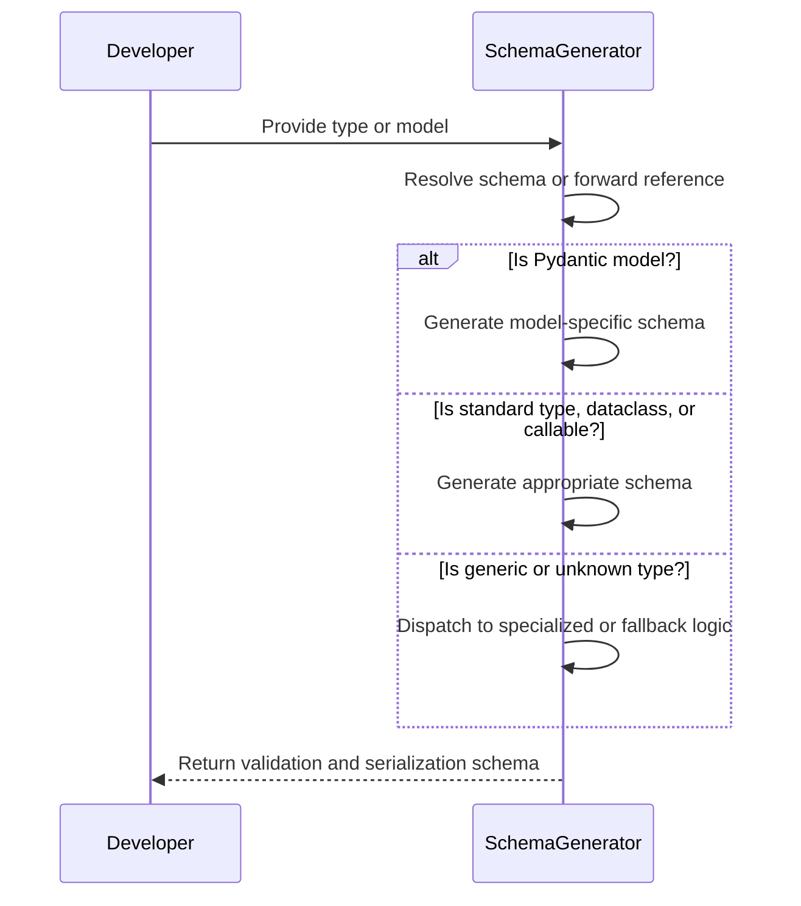
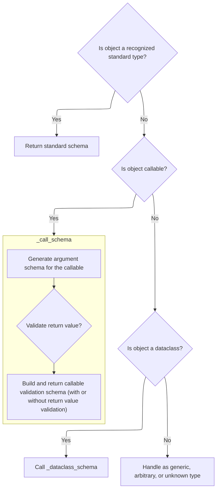
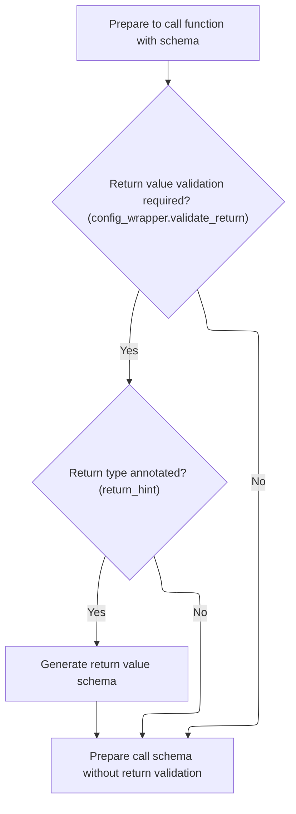
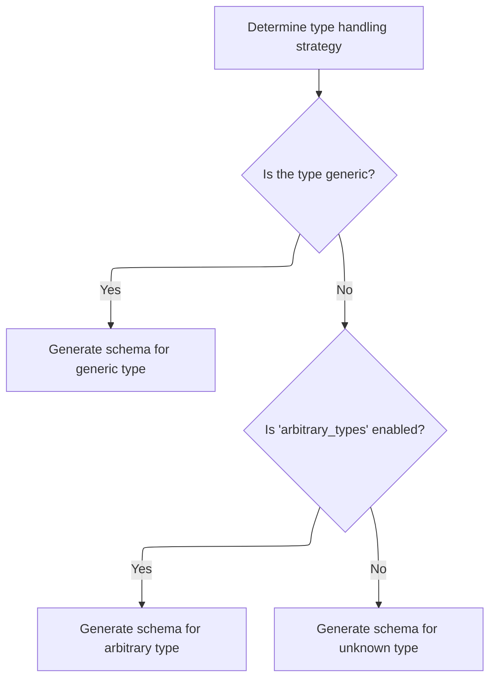
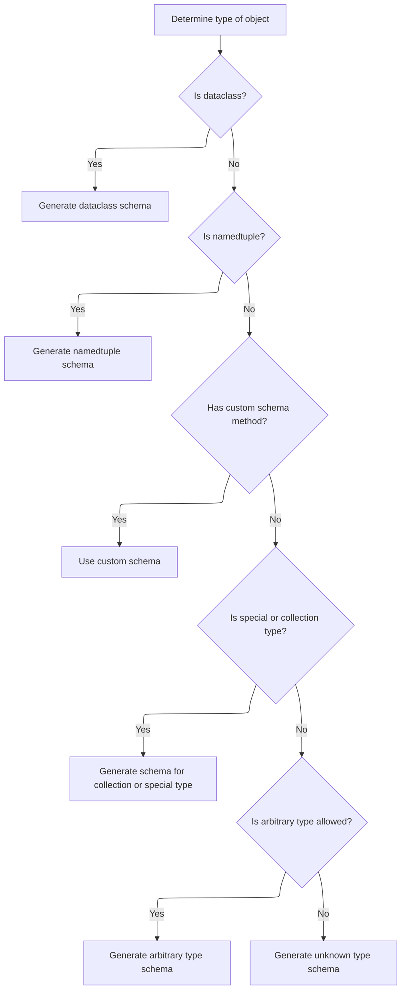

This document explains how a schema is generated for any supported Python type or model, enabling data validation and serialization. The process involves resolving pre-built schemas and forward references, generating model-specific schemas for Pydantic models, producing schemas for standard types and dataclasses, and handling generic or unknown types with specialized logic.

Main steps:

- Resolve pre-built schemas and forward references.
- Generate schemas for models, standard types, and dataclasses.
- Handle generic, arbitrary, or unknown types as needed.



# Spec

## Detailed View of the Program's Functionality

a. Deciding How to Interpret the Input Object

The schema generation process begins by determining the nature of the input object for which a schema is to be generated. The process checks, in order:

- If the input is a special "self" type, it resolves it to the current model type being processed.
- If the input is an "Annotated" type, it delegates to a handler that processes annotated types.
- If the input is already a dictionary, it is assumed to be a valid schema and is returned as-is.
- If the input is a string, it is converted into a forward reference.
- If the input is a forward reference, it is resolved recursively and schema generation is retried on the resolved type.
- If the input is a subclass of the base model type, it pushes the model type onto a stack (to handle recursion and context) and delegates to the model schema generator.
- If the input is a recursive reference, it returns a schema reference.
- If none of the above, it falls back to type-based schema matching.

b. Generating a Schema for a Pydantic Model

When the input is recognized as a Pydantic model, the following steps are performed:

- The system checks if a schema for this model is already cached or precomputed. If so, it returns the cached schema.
- If not, it checks if the model has a precomputed core schema attached to its class dictionary. If found and valid, it may unpack definitions and return a reference or the schema itself.
- If no schema is found, it creates a configuration wrapper for the model's config.
- It then determines the model's fields. If the fields are already complete, it uses them; otherwise, it attempts to rebuild them. If rebuilding fails due to unresolved forward references, it raises an error.
- Decorators (validators, serializers, computed fields) are collected and checked to ensure they reference valid fields.
- If the model allows extra fields, it walks through the class hierarchy to find any extra field annotations and types, resolving their schemas as needed.
- The system distinguishes between root models and standard models:
  - For root models, it builds a schema for the root field, applies model-level validators, and constructs the model schema.
  - For standard models, it builds a schema for all fields, applies root and model-level validators, and constructs the model schema.
- Model-level serializers are applied, and outer model validators are layered on.
- The final schema is wrapped as a definition reference and returned.

c. Fallback Schema Generation for Unhandled Types

If the input object is not a model, dict, forward reference, or recursive reference, the system calls a type-matching function to handle standard types, callables, dataclasses, generics, or unknown types.

d. Type-Based Schema Matching and Dispatch

The type-matching function checks the input against a series of known types in order:

- For primitive types (str, int, float, etc.), it returns the corresponding schema.
- For special types (Any, object, None, missing sentinel), it returns the appropriate schema.
- For standard library types (date, datetime, time, timedelta, Decimal, UUID, etc.), it returns the corresponding schema.
- For container types (tuple, list, set, dict, etc.), it delegates to helper functions that generate schemas for those containers, often recursively generating schemas for their contained types.
- For callables, it delegates to a callable schema generator.
- For enums, it generates an enum schema.
- For dataclasses, it delegates to a dataclass schema generator.
- For generic types (<SwmToken path="pydantic/_internal/_generate_schema.py" pos="1033:18:20" line-data="        boilerplate before calling into the user-facing method (e.g. `GenerateSchema._tuple_schema`).">`e.g`</SwmToken>., List\[int\], Dict\[str, float\]), it delegates to a generic type matcher.
- If arbitrary types are allowed, it generates a schema that accepts any instance of the type.
- If none of the above match, it raises an error indicating the type is unknown.

e. Schema Generation for Callable Types

When the input is a callable (function, method, lambda, etc.), the system:

- Builds an argument schema by inspecting the callable's signature and type hints.
- Checks if return value validation is enabled in the configuration.
  - If so, and if the callable has a return type annotation, it generates a schema for the return type.
- Constructs a callable schema that includes both the argument schema and, if applicable, the return value schema.

f. Schema Generation for Dataclasses

When the input is a dataclass, the system:

- Checks for a cached or precomputed schema and returns it if available.
- If not, it checks for a precomputed core schema on the dataclass itself.
- For generic dataclasses, it maps type variables to their actual types and applies them to the fields.
- Retrieves the dataclass configuration, falling back to parent config if necessary.
- Determines if the dataclass is a Pydantic dataclass and whether its fields are complete. If not, it rebuilds or collects the fields as needed.
- For each field, it applies type variable substitutions and configuration.
- If extra fields are allowed, it checks for invalid <SwmPath>[.hyperlint/styles/config/](.hyperlint/styles/config/)</SwmPath> combinations (<SwmToken path="pydantic/_internal/_generate_schema.py" pos="1033:18:20" line-data="        boilerplate before calling into the user-facing method (e.g. `GenerateSchema._tuple_schema`).">`e.g`</SwmToken>., fields with init=False).
- Decorators and validators are applied.
- Fields are sorted so that positional arguments come first.
- An argument schema is built, and validators and serializers are layered on.
- The final schema includes all relevant dataclass metadata and is wrapped as a definition reference.

g. Generic, Arbitrary, and Unknown Type Handling

If the input is a generic type (<SwmToken path="pydantic/_internal/_generate_schema.py" pos="1033:18:20" line-data="        boilerplate before calling into the user-facing method (e.g. `GenerateSchema._tuple_schema`).">`e.g`</SwmToken>., List\[int\], Dict\[str, float\]), the system:

- Checks if the origin is a dataclass or namedtuple and delegates accordingly.
- Checks for a custom schema method on the origin and uses it if present.
- Checks if the origin is a special or collection type (<SwmToken path="pydantic/_internal/_generate_schema.py" pos="1033:18:20" line-data="        boilerplate before calling into the user-facing method (e.g. `GenerateSchema._tuple_schema`).">`e.g`</SwmToken>., union, tuple, list, dict, <SwmToken path="pydantic/_internal/_generate_schema.py" pos="54:12:12" line-data="from typing_extensions import TypeAlias, TypeAliasType, TypedDict, get_args, get_origin, is_typeddict">`TypedDict`</SwmToken>, etc.) and delegates to the appropriate schema generator.
- If arbitrary types are allowed, it generates a schema for the arbitrary type.
- If none of the above, it generates a schema for an unknown type, which raises an error.

h. Generic Type Parameter Schema Dispatch

When handling generic types, the system:

- Checks if the origin is a dataclass or namedtuple and generates the corresponding schema.
- Checks for a custom schema method on the origin and uses it if present.
- Checks if the origin is a recognized special or collection type (union, tuple, list, set, dict, <SwmToken path="pydantic/_internal/_generate_schema.py" pos="54:12:12" line-data="from typing_extensions import TypeAlias, TypeAliasType, TypedDict, get_args, get_origin, is_typeddict">`TypedDict`</SwmToken>, etc.) and generates the appropriate schema, recursively generating schemas for type parameters as needed.
- If arbitrary types are allowed, it generates a schema for the arbitrary type.
- If none of the above, it generates a schema for an unknown type, which raises an error.

Summary

The schema generation process in this file is a multi-stage dispatch system that:

1. Determines the nature of the input (model, dict, forward reference, callable, dataclass, generic, etc.).
2. Delegates to specialized handlers for each recognized type, with caching and recursion handling for referenceable types.
3. Applies configuration, decorators, validators, and serializers as appropriate.
4. Handles generic types by dispatching based on their origin and type parameters.
5. Falls back to arbitrary or unknown type schemas as a last resort, raising errors for truly unrecognized types.

This design allows Pydantic to flexibly and efficiently generate validation schemas for a wide variety of Python types, supporting advanced features like generics, forward references, and custom user extensions.

# Rule Definition

| Paragraph Name                                                                                                                                                                     | Rule ID | Category          | Description                                                                                                                                                                                                                                                                                                                                                                                                                                                                                                                                                                                                                                                                                                                                                                                                                                            | Conditions                                                                                                                                                                                                                                                                                                              | Remarks                                                                                                                                                                                                                                                                                                                                                                                                                                                                                                                                                                                                                                                                                                                                                                                                                                                                                                                                                                                                                                                                                                                                                                                                                                                                                                                                                                                                                                                                                                                                                |
| ---------------------------------------------------------------------------------------------------------------------------------------------------------------------------------- | ------- | ----------------- | ------------------------------------------------------------------------------------------------------------------------------------------------------------------------------------------------------------------------------------------------------------------------------------------------------------------------------------------------------------------------------------------------------------------------------------------------------------------------------------------------------------------------------------------------------------------------------------------------------------------------------------------------------------------------------------------------------------------------------------------------------------------------------------------------------------------------------------------------------ | ----------------------------------------------------------------------------------------------------------------------------------------------------------------------------------------------------------------------------------------------------------------------------------------------------------------------- | ------------------------------------------------------------------------------------------------------------------------------------------------------------------------------------------------------------------------------------------------------------------------------------------------------------------------------------------------------------------------------------------------------------------------------------------------------------------------------------------------------------------------------------------------------------------------------------------------------------------------------------------------------------------------------------------------------------------------------------------------------------------------------------------------------------------------------------------------------------------------------------------------------------------------------------------------------------------------------------------------------------------------------------------------------------------------------------------------------------------------------------------------------------------------------------------------------------------------------------------------------------------------------------------------------------------------------------------------------------------------------------------------------------------------------------------------------------------------------------------------------------------------------------------------------ |
| GenerateSchema.match_type, GenerateSchema.generate_schema, GenerateSchema.\_generate_schema_inner                                                                                  | RL-001  | Conditional Logic | When <SwmToken path="pydantic/_internal/_generate_schema.py" pos="827:7:7" line-data="                                extras_keys_schema = self.generate_schema(extra_keys_type)">`generate_schema`</SwmToken> is called with a simple built-in type (such as int or str), it must return a dictionary with a single key 'type' whose value is the string name of the type (<SwmToken path="pydantic/_internal/_generate_schema.py" pos="1033:18:20" line-data="        boilerplate before calling into the user-facing method (e.g. `GenerateSchema._tuple_schema`).">`e.g`</SwmToken>., { 'type': 'int' }).                                                                                                                                                                                                                                          | The input obj is a built-in type such as int, str, float, bool, bytes, etc.                                                                                                                                                                                                                                             | The output is a dictionary with a single key 'type' and the value is the string name of the type. Example: { 'type': 'int' }.                                                                                                                                                                                                                                                                                                                                                                                                                                                                                                                                                                                                                                                                                                                                                                                                                                                                                                                                                                                                                                                                                                                                                                                                                                                                                                                                                                                                                          |
| GenerateSchema.\_model_schema, GenerateSchema.generate_schema, GenerateSchema.\_generate_schema_inner                                                                              | RL-002  | Conditional Logic | When <SwmToken path="pydantic/_internal/_generate_schema.py" pos="827:7:7" line-data="                                extras_keys_schema = self.generate_schema(extra_keys_type)">`generate_schema`</SwmToken> is called with a Pydantic model class, it must return a dictionary with 'type': <SwmToken path="pydantic/_internal/_generate_schema.py" pos="924:18:20" line-data="            # Note: if schema is of type `&#39;definition-ref&#39;`, we might want to copy it as a">`definition-ref`</SwmToken> and <SwmToken path="pydantic/_internal/_generate_schema.py" pos="1021:7:7" line-data="            return core_schema.definition_reference_schema(schema_ref=obj.type_ref)">`schema_ref`</SwmToken> set to the model's class name. The referenced schema must include all required metadata and structure as described in the spec.   | The input obj is a subclass of <SwmToken path="pydantic/_internal/_generate_schema.py" pos="736:13:13" line-data="    def _model_schema(self, cls: type[BaseModel]) -&gt; core_schema.CoreSchema:">`BaseModel`</SwmToken> (a Pydantic model class).                                                                     | The output is a dictionary: { 'type': <SwmToken path="pydantic/_internal/_generate_schema.py" pos="924:18:20" line-data="            # Note: if schema is of type `&#39;definition-ref&#39;`, we might want to copy it as a">`definition-ref`</SwmToken>, <SwmToken path="pydantic/_internal/_generate_schema.py" pos="1021:7:7" line-data="            return core_schema.definition_reference_schema(schema_ref=obj.type_ref)">`schema_ref`</SwmToken>: <model class name> }. The referenced schema (in the definitions map or inlined) must include: 'type': 'model', 'cls': <class name>, 'schema': { 'type': 'model-fields', 'fields': { ... }, ... }, <SwmToken path="pydantic/_internal/_generate_schema.py" pos="833:1:1" line-data="                generic_origin: type[BaseModel] \| None = getattr(cls, &#39;__pydantic_generic_metadata__&#39;, {}).get(&#39;origin&#39;)">`generic_origin`</SwmToken>, <SwmToken path="pydantic/_internal/_generate_schema.py" pos="843:1:1" line-data="                        custom_init=getattr(cls, &#39;__pydantic_custom_init__&#39;, None),">`custom_init`</SwmToken>, <SwmToken path="pydantic/_internal/_generate_schema.py" pos="844:1:1" line-data="                        root_model=True,">`root_model`</SwmToken>, <SwmToken path="pydantic/_internal/_generate_schema.py" pos="845:1:1" line-data="                        post_init=getattr(cls, &#39;__pydantic_post_init__&#39;, None),">`post_init`</SwmToken>, 'config', 'ref'. All fields must be present, even if null or empty. |
| GenerateSchema.\_dataclass_schema, GenerateSchema.generate_schema, GenerateSchema.\_generate_schema_inner                                                                          | RL-003  | Conditional Logic | When <SwmToken path="pydantic/_internal/_generate_schema.py" pos="827:7:7" line-data="                                extras_keys_schema = self.generate_schema(extra_keys_type)">`generate_schema`</SwmToken> is called with a standard dataclass, it must return a dictionary with 'type': <SwmToken path="pydantic/_internal/_generate_schema.py" pos="924:18:20" line-data="            # Note: if schema is of type `&#39;definition-ref&#39;`, we might want to copy it as a">`definition-ref`</SwmToken> and <SwmToken path="pydantic/_internal/_generate_schema.py" pos="1021:7:7" line-data="            return core_schema.definition_reference_schema(schema_ref=obj.type_ref)">`schema_ref`</SwmToken> set to the dataclass's class name. The referenced schema must include all required metadata and structure as described in the spec. | The input obj is a standard dataclass (detected via <SwmToken path="pydantic/_internal/_generate_schema.py" pos="1132:3:5" line-data="        # dataclasses.is_dataclass coerces dc instances to types, but we only handle">`dataclasses.is_dataclass`</SwmToken>).                                                     | The output is a dictionary: { 'type': <SwmToken path="pydantic/_internal/_generate_schema.py" pos="924:18:20" line-data="            # Note: if schema is of type `&#39;definition-ref&#39;`, we might want to copy it as a">`definition-ref`</SwmToken>, <SwmToken path="pydantic/_internal/_generate_schema.py" pos="1021:7:7" line-data="            return core_schema.definition_reference_schema(schema_ref=obj.type_ref)">`schema_ref`</SwmToken>: <dataclass class name> }. The referenced schema (in the definitions map or inlined) must include: 'type': 'dataclass', 'cls': <class name>, 'schema': { 'type': 'dataclass-args', 'dataclass_name': <class name>, 'args': \[ ... \], ... }, <SwmToken path="pydantic/_internal/_generate_schema.py" pos="833:1:1" line-data="                generic_origin: type[BaseModel] \| None = getattr(cls, &#39;__pydantic_generic_metadata__&#39;, {}).get(&#39;origin&#39;)">`generic_origin`</SwmToken>, <SwmToken path="pydantic/_internal/_generate_schema.py" pos="845:1:1" line-data="                        post_init=getattr(cls, &#39;__pydantic_post_init__&#39;, None),">`post_init`</SwmToken>, 'ref', 'fields', 'slots', 'config', 'frozen'. All fields must be present, even if null or empty.                                                                                                                                                                                                                                                                                      |
| GenerateSchema.generate_schema, GenerateSchema.\_generate_schema_inner, GenerateSchema.\_model_schema, GenerateSchema.\_dataclass_schema                                           | RL-004  | Computation       | The schema for each field or argument must itself be a schema object as described above, recursively, so that nested types are handled appropriately.                                                                                                                                                                                                                                                                                                                                                                                                                                                                                                                                                                                                                                                                                                  | Any field or argument has a type that is itself a complex type (<SwmToken path="pydantic/_internal/_generate_schema.py" pos="1033:18:20" line-data="        boilerplate before calling into the user-facing method (e.g. `GenerateSchema._tuple_schema`).">`e.g`</SwmToken>., another model, dataclass, or collection). | Recursion is required to ensure that nested types are fully described according to the same schema rules. The output format for nested types must match the same structure as for top-level types.                                                                                                                                                                                                                                                                                                                                                                                                                                                                                                                                                                                                                                                                                                                                                                                                                                                                                                                                                                                                                                                                                                                                                                                                                                                                                                                                                     |
| GenerateSchema.\_model_schema, GenerateSchema.\_dataclass_schema, \_Definitions.get_schema_or_ref, \_Definitions.create_definition_reference_schema, \_Definitions.finalize_schema | RL-005  | Conditional Logic | The top-level output of <SwmToken path="pydantic/_internal/_generate_schema.py" pos="827:7:7" line-data="                                extras_keys_schema = self.generate_schema(extra_keys_type)">`generate_schema`</SwmToken> for models and dataclasses must always be a <SwmToken path="pydantic/_internal/_generate_schema.py" pos="924:18:20" line-data="            # Note: if schema is of type `&#39;definition-ref&#39;`, we might want to copy it as a">`definition-ref`</SwmToken> schema referencing the actual definition by name. The referenced schema must be stored in the definitions map and must contain all required metadata and structure as described, even if some values are null or empty.                                                                                                                               | The input obj is a Pydantic model or dataclass, or any other referenceable type.                                                                                                                                                                                                                                        | The output is always a <SwmToken path="pydantic/_internal/_generate_schema.py" pos="924:18:20" line-data="            # Note: if schema is of type `&#39;definition-ref&#39;`, we might want to copy it as a">`definition-ref`</SwmToken> at the top level for models and dataclasses. The referenced schema must be present in the definitions map and must match the required structure. Inlining behavior is managed to avoid duplication and ensure correct references.                                                                                                                                                                                                                                                                                                                                                                                                                                                                                                                                                                                                                                                                                                                                                                                                                                                                                                                                                                                                                                                                            |
| GenerateSchema.generate_schema, GenerateSchema.\_model_schema, GenerateSchema.\_dataclass_schema, GenerateSchema.\_generate_schema_inner, \_Definitions.finalize_schema            | RL-006  | Conditional Logic | The output format of <SwmToken path="pydantic/_internal/_generate_schema.py" pos="827:7:7" line-data="                                extras_keys_schema = self.generate_schema(extra_keys_type)">`generate_schema`</SwmToken> must match the described structure exactly for compatibility with Pydantic's schema system. All required keys and nested structures must be present, even if some values are null or empty.                                                                                                                                                                                                                                                                                                                                                                                                                             | Any call to <SwmToken path="pydantic/_internal/_generate_schema.py" pos="827:7:7" line-data="                                extras_keys_schema = self.generate_schema(extra_keys_type)">`generate_schema`</SwmToken> for any supported type.                                                                           | All required keys must be present in the output schema, including those with null or empty values. The structure must match the spec exactly, including field names, nesting, and types.                                                                                                                                                                                                                                                                                                                                                                                                                                                                                                                                                                                                                                                                                                                                                                                                                                                                                                                                                                                                                                                                                                                                                                                                                                                                                                                                                               |

# User Stories

## User Story 1: Generate schemas for built-in types, Pydantic models, and dataclasses

---

### Story Description:

As a user, I want to generate a schema for any supported type (built-in type, Pydantic model, or dataclass) so that I can obtain a structured, Pydantic-compatible schema for validation and serialization.

---

### Business Rule Mapping:

| Rule ID | Paragraph Name                                                                                                                                                          | Rule Description                                                                                                                                                                                                                                                                                                                                                                                                                                                                                                                                                                                                                                                                                                                                                                                                                                       |
| ------- | ----------------------------------------------------------------------------------------------------------------------------------------------------------------------- | ------------------------------------------------------------------------------------------------------------------------------------------------------------------------------------------------------------------------------------------------------------------------------------------------------------------------------------------------------------------------------------------------------------------------------------------------------------------------------------------------------------------------------------------------------------------------------------------------------------------------------------------------------------------------------------------------------------------------------------------------------------------------------------------------------------------------------------------------------ |
| RL-001  | GenerateSchema.match_type, GenerateSchema.generate_schema, GenerateSchema.\_generate_schema_inner                                                                       | When <SwmToken path="pydantic/_internal/_generate_schema.py" pos="827:7:7" line-data="                                extras_keys_schema = self.generate_schema(extra_keys_type)">`generate_schema`</SwmToken> is called with a simple built-in type (such as int or str), it must return a dictionary with a single key 'type' whose value is the string name of the type (<SwmToken path="pydantic/_internal/_generate_schema.py" pos="1033:18:20" line-data="        boilerplate before calling into the user-facing method (e.g. `GenerateSchema._tuple_schema`).">`e.g`</SwmToken>., { 'type': 'int' }).                                                                                                                                                                                                                                          |
| RL-002  | GenerateSchema.\_model_schema, GenerateSchema.generate_schema, GenerateSchema.\_generate_schema_inner                                                                   | When <SwmToken path="pydantic/_internal/_generate_schema.py" pos="827:7:7" line-data="                                extras_keys_schema = self.generate_schema(extra_keys_type)">`generate_schema`</SwmToken> is called with a Pydantic model class, it must return a dictionary with 'type': <SwmToken path="pydantic/_internal/_generate_schema.py" pos="924:18:20" line-data="            # Note: if schema is of type `&#39;definition-ref&#39;`, we might want to copy it as a">`definition-ref`</SwmToken> and <SwmToken path="pydantic/_internal/_generate_schema.py" pos="1021:7:7" line-data="            return core_schema.definition_reference_schema(schema_ref=obj.type_ref)">`schema_ref`</SwmToken> set to the model's class name. The referenced schema must include all required metadata and structure as described in the spec.   |
| RL-003  | GenerateSchema.\_dataclass_schema, GenerateSchema.generate_schema, GenerateSchema.\_generate_schema_inner                                                               | When <SwmToken path="pydantic/_internal/_generate_schema.py" pos="827:7:7" line-data="                                extras_keys_schema = self.generate_schema(extra_keys_type)">`generate_schema`</SwmToken> is called with a standard dataclass, it must return a dictionary with 'type': <SwmToken path="pydantic/_internal/_generate_schema.py" pos="924:18:20" line-data="            # Note: if schema is of type `&#39;definition-ref&#39;`, we might want to copy it as a">`definition-ref`</SwmToken> and <SwmToken path="pydantic/_internal/_generate_schema.py" pos="1021:7:7" line-data="            return core_schema.definition_reference_schema(schema_ref=obj.type_ref)">`schema_ref`</SwmToken> set to the dataclass's class name. The referenced schema must include all required metadata and structure as described in the spec. |
| RL-006  | GenerateSchema.generate_schema, GenerateSchema.\_model_schema, GenerateSchema.\_dataclass_schema, GenerateSchema.\_generate_schema_inner, \_Definitions.finalize_schema | The output format of <SwmToken path="pydantic/_internal/_generate_schema.py" pos="827:7:7" line-data="                                extras_keys_schema = self.generate_schema(extra_keys_type)">`generate_schema`</SwmToken> must match the described structure exactly for compatibility with Pydantic's schema system. All required keys and nested structures must be present, even if some values are null or empty.                                                                                                                                                                                                                                                                                                                                                                                                                             |

---

### Relevant Functionality:

- **GenerateSchema.match_type**
  1. **RL-001:**
     - If obj is int, return { 'type': 'int' }
     - If obj is str, return { 'type': 'str' }
     - Repeat for other simple types (float, bool, bytes, etc.)
     - This logic is implemented in the <SwmToken path="pydantic/_internal/_generate_schema.py" pos="1023:5:5" line-data="        return self.match_type(obj)">`match_type`</SwmToken> method, which is called by <SwmToken path="pydantic/_internal/_generate_schema.py" pos="827:7:7" line-data="                                extras_keys_schema = self.generate_schema(extra_keys_type)">`generate_schema`</SwmToken>.
- **GenerateSchema.\_model_schema**
  1. **RL-002:**
     - If obj is a Pydantic model class:
       - Create a schema with 'type': <SwmToken path="pydantic/_internal/_generate_schema.py" pos="924:18:20" line-data="            # Note: if schema is of type `&#39;definition-ref&#39;`, we might want to copy it as a">`definition-ref`</SwmToken>, <SwmToken path="pydantic/_internal/_generate_schema.py" pos="1021:7:7" line-data="            return core_schema.definition_reference_schema(schema_ref=obj.type_ref)">`schema_ref`</SwmToken>: class name
       - In the definitions map, store the referenced schema with all required keys and nested structures
       - For each field, recursively generate its schema
       - Include <SwmToken path="pydantic/_internal/_generate_schema.py" pos="788:1:1" line-data="                computed_fields = decorators.computed_fields">`computed_fields`</SwmToken>, <SwmToken path="pydantic/_internal/_generate_schema.py" pos="800:1:1" line-data="                extras_schema = None">`extras_schema`</SwmToken>, <SwmToken path="pydantic/_internal/_generate_schema.py" pos="801:1:1" line-data="                extras_keys_schema = None">`extras_keys_schema`</SwmToken>, <SwmToken path="pydantic/_internal/_generate_schema.py" pos="858:1:1" line-data="                        model_name=cls.__name__,">`model_name`</SwmToken>, <SwmToken path="pydantic/_internal/_generate_schema.py" pos="833:1:1" line-data="                generic_origin: type[BaseModel] | None = getattr(cls, &#39;__pydantic_generic_metadata__&#39;, {}).get(&#39;origin&#39;)">`generic_origin`</SwmToken>, <SwmToken path="pydantic/_internal/_generate_schema.py" pos="843:1:1" line-data="                        custom_init=getattr(cls, &#39;__pydantic_custom_init__&#39;, None),">`custom_init`</SwmToken>, <SwmToken path="pydantic/_internal/_generate_schema.py" pos="844:1:1" line-data="                        root_model=True,">`root_model`</SwmToken>, <SwmToken path="pydantic/_internal/_generate_schema.py" pos="845:1:1" line-data="                        post_init=getattr(cls, &#39;__pydantic_post_init__&#39;, None),">`post_init`</SwmToken>, config, ref as specified
       - Always return the <SwmToken path="pydantic/_internal/_generate_schema.py" pos="924:18:20" line-data="            # Note: if schema is of type `&#39;definition-ref&#39;`, we might want to copy it as a">`definition-ref`</SwmToken> schema at the top level
- **GenerateSchema.\_dataclass_schema**
  1. **RL-003:**
     - If obj is a standard dataclass:
       - Create a schema with 'type': <SwmToken path="pydantic/_internal/_generate_schema.py" pos="924:18:20" line-data="            # Note: if schema is of type `&#39;definition-ref&#39;`, we might want to copy it as a">`definition-ref`</SwmToken>, <SwmToken path="pydantic/_internal/_generate_schema.py" pos="1021:7:7" line-data="            return core_schema.definition_reference_schema(schema_ref=obj.type_ref)">`schema_ref`</SwmToken>: class name
       - In the definitions map, store the referenced schema with all required keys and nested structures
       - For each field, generate an argument schema with required keys (name, type, etc.)
       - Include <SwmToken path="pydantic/_internal/_generate_schema.py" pos="788:1:1" line-data="                computed_fields = decorators.computed_fields">`computed_fields`</SwmToken>, <SwmToken path="pydantic/_internal/_generate_schema.py" pos="1883:1:1" line-data="                    collect_init_only=has_post_init,">`collect_init_only`</SwmToken>, <SwmToken path="pydantic/_internal/_generate_schema.py" pos="833:1:1" line-data="                generic_origin: type[BaseModel] | None = getattr(cls, &#39;__pydantic_generic_metadata__&#39;, {}).get(&#39;origin&#39;)">`generic_origin`</SwmToken>, <SwmToken path="pydantic/_internal/_generate_schema.py" pos="845:1:1" line-data="                        post_init=getattr(cls, &#39;__pydantic_post_init__&#39;, None),">`post_init`</SwmToken>, ref, fields, slots, config, frozen as specified
       - Always return the <SwmToken path="pydantic/_internal/_generate_schema.py" pos="924:18:20" line-data="            # Note: if schema is of type `&#39;definition-ref&#39;`, we might want to copy it as a">`definition-ref`</SwmToken> schema at the top level
- **GenerateSchema.generate_schema**
  1. **RL-006:**
     - After generating the schema, ensure all required keys are present
     - Fill in null or empty values for keys as needed
     - Validate that the output matches the required structure before returning

## User Story 2: Recursive schema generation for nested types

---

### Story Description:

As a user, I want nested types to be handled recursively so that schemas for complex or nested types are fully described and compatible with Pydantic's schema system.

---

### Business Rule Mapping:

| Rule ID | Paragraph Name                                                                                                                                                          | Rule Description                                                                                                                                                                                                                                                                                                                                                                                                           |
| ------- | ----------------------------------------------------------------------------------------------------------------------------------------------------------------------- | -------------------------------------------------------------------------------------------------------------------------------------------------------------------------------------------------------------------------------------------------------------------------------------------------------------------------------------------------------------------------------------------------------------------------- |
| RL-004  | GenerateSchema.generate_schema, GenerateSchema.\_generate_schema_inner, GenerateSchema.\_model_schema, GenerateSchema.\_dataclass_schema                                | The schema for each field or argument must itself be a schema object as described above, recursively, so that nested types are handled appropriately.                                                                                                                                                                                                                                                                      |
| RL-006  | GenerateSchema.generate_schema, GenerateSchema.\_model_schema, GenerateSchema.\_dataclass_schema, GenerateSchema.\_generate_schema_inner, \_Definitions.finalize_schema | The output format of <SwmToken path="pydantic/_internal/_generate_schema.py" pos="827:7:7" line-data="                                extras_keys_schema = self.generate_schema(extra_keys_type)">`generate_schema`</SwmToken> must match the described structure exactly for compatibility with Pydantic's schema system. All required keys and nested structures must be present, even if some values are null or empty. |

---

### Relevant Functionality:

- **GenerateSchema.generate_schema**
  1. **RL-004:**
     - For each field or argument:
       - Call <SwmToken path="pydantic/_internal/_generate_schema.py" pos="827:7:7" line-data="                                extras_keys_schema = self.generate_schema(extra_keys_type)">`generate_schema`</SwmToken> recursively on the field's type
       - Embed the resulting schema in the parent schema's 'fields' or 'args' dictionary/list
       - Continue recursively for all nested types
  2. **RL-006:**
     - After generating the schema, ensure all required keys are present
     - Fill in null or empty values for keys as needed
     - Validate that the output matches the required structure before returning

## User Story 3: Definition referencing and definitions map for models and dataclasses

---

### Story Description:

As a user, I want the top-level schema for models and dataclasses to always be a <SwmToken path="pydantic/_internal/_generate_schema.py" pos="924:18:20" line-data="            # Note: if schema is of type `&#39;definition-ref&#39;`, we might want to copy it as a">`definition-ref`</SwmToken>, with the referenced schema stored in a definitions map, so that referencing is correct, duplication is avoided, and compatibility with Pydantic's schema system is maintained.

---

### Business Rule Mapping:

| Rule ID | Paragraph Name                                                                                                                                                                     | Rule Description                                                                                                                                                                                                                                                                                                                                                                                                                                                                                                                                                                                                                                                                                                         |
| ------- | ---------------------------------------------------------------------------------------------------------------------------------------------------------------------------------- | ------------------------------------------------------------------------------------------------------------------------------------------------------------------------------------------------------------------------------------------------------------------------------------------------------------------------------------------------------------------------------------------------------------------------------------------------------------------------------------------------------------------------------------------------------------------------------------------------------------------------------------------------------------------------------------------------------------------------ |
| RL-005  | GenerateSchema.\_model_schema, GenerateSchema.\_dataclass_schema, \_Definitions.get_schema_or_ref, \_Definitions.create_definition_reference_schema, \_Definitions.finalize_schema | The top-level output of <SwmToken path="pydantic/_internal/_generate_schema.py" pos="827:7:7" line-data="                                extras_keys_schema = self.generate_schema(extra_keys_type)">`generate_schema`</SwmToken> for models and dataclasses must always be a <SwmToken path="pydantic/_internal/_generate_schema.py" pos="924:18:20" line-data="            # Note: if schema is of type `&#39;definition-ref&#39;`, we might want to copy it as a">`definition-ref`</SwmToken> schema referencing the actual definition by name. The referenced schema must be stored in the definitions map and must contain all required metadata and structure as described, even if some values are null or empty. |
| RL-006  | GenerateSchema.generate_schema, GenerateSchema.\_model_schema, GenerateSchema.\_dataclass_schema, GenerateSchema.\_generate_schema_inner, \_Definitions.finalize_schema            | The output format of <SwmToken path="pydantic/_internal/_generate_schema.py" pos="827:7:7" line-data="                                extras_keys_schema = self.generate_schema(extra_keys_type)">`generate_schema`</SwmToken> must match the described structure exactly for compatibility with Pydantic's schema system. All required keys and nested structures must be present, even if some values are null or empty.                                                                                                                                                                                                                                                                                               |

---

### Relevant Functionality:

- **GenerateSchema.\_model_schema**
  1. **RL-005:**
     - When generating a schema for a referenceable type:
       - Use <SwmToken path="pydantic/_internal/_generate_schema.py" pos="740:7:7" line-data="        with self.defs.get_schema_or_ref(cls) as (model_ref, maybe_schema):">`get_schema_or_ref`</SwmToken> to check if a reference already exists
       - If so, return a <SwmToken path="pydantic/_internal/_generate_schema.py" pos="924:18:20" line-data="            # Note: if schema is of type `&#39;definition-ref&#39;`, we might want to copy it as a">`definition-ref`</SwmToken> schema
       - Otherwise, generate the full schema and store it in the definitions map
       - Always return a <SwmToken path="pydantic/_internal/_generate_schema.py" pos="924:18:20" line-data="            # Note: if schema is of type `&#39;definition-ref&#39;`, we might want to copy it as a">`definition-ref`</SwmToken> at the top level
- **GenerateSchema.generate_schema**
  1. **RL-006:**
     - After generating the schema, ensure all required keys are present
     - Fill in null or empty values for keys as needed
     - Validate that the output matches the required structure before returning

# Code Walkthrough

## Dispatching Schema Generation by Input Type

```mermaid
%%{init: {"flowchart": {"defaultRenderer": "elk"}} }%%
flowchart TD
    node1["Decide how to interpret the input object"] -->|"If it's a Pydantic model"| node2["Produce a schema tailored to the model"]
    click node1 openCode "pydantic/_internal/_generate_schema.py:997:1023"
    node1 -->|"Otherwise"| node3["Produce a schema based on the object's characteristics"]
    click node2 openCode "pydantic/_internal/_generate_schema.py:736:1022"
    click node3 openCode "pydantic/_internal/_generate_schema.py:1023:1023"

subgraph node2 [_model_schema]
  sgmain_1_node1["Start: Generate schema for model"] --> sgmain_1_node2{"Is cached or precomputed schema available?"}
  click sgmain_1_node1 openCode "pydantic/_internal/_generate_schema.py:736:737"
  click sgmain_1_node2 openCode "pydantic/_internal/_generate_schema.py:741:742"
  sgmain_1_node2 -->|"Yes"| sgmain_1_node3["Return cached/precomputed schema"]
  click sgmain_1_node3 openCode "pydantic/_internal/_generate_schema.py:742:743"
  sgmain_1_node2 -->|"No"| sgmain_1_node4{"Are extra fields allowed?"}
  click sgmain_1_node4 openCode "pydantic/_internal/_generate_schema.py:802:803"
  sgmain_1_node4 -->|"Yes"| sgmain_1_loop1
  sgmain_1_node4 -->|"No"| sgmain_1_node5{"Is model a root model?"}
  subgraph sgmain_1_loop1["For each class in model's hierarchy (if extra fields allowed)"]
  sgmain_1_node9["Check for extra field annotations and types"]
  click sgmain_1_node9 openCode "pydantic/_internal/_generate_schema.py:805:831"
  end
  sgmain_1_loop1 --> sgmain_1_node5
  sgmain_1_node5 -->|"Yes"| sgmain_1_node6["Build root model schema with computed fields and validators"]
  click sgmain_1_node6 openCode "pydantic/_internal/_generate_schema.py:835:848"
  sgmain_1_node5 -->|"No"| sgmain_1_node7["Build standard model schema with computed fields and validators"]
  click sgmain_1_node7 openCode "pydantic/_internal/_generate_schema.py:850:872"
  sgmain_1_node6 --> sgmain_1_node8["Apply model-level serializers and validators"]
  sgmain_1_node7 --> sgmain_1_node8
  click sgmain_1_node8 openCode "pydantic/_internal/_generate_schema.py:874:875"
  sgmain_1_node8 --> sgmain_1_node10["Return final reusable schema"]
  click sgmain_1_node10 openCode "pydantic/_internal/_generate_schema.py:876:876"
end

%% Swimm:
%% %%{init: {"flowchart": {"defaultRenderer": "elk"}} }%%
%% flowchart TD
%%     node1["Decide how to interpret the input object"] -->|"If it's a Pydantic model"| node2["Produce a schema tailored to the model"]
%%     click node1 openCode "<SwmPath>[pydantic/\_internal/\_generate_schema.py](pydantic/_internal/_generate_schema.py)</SwmPath>:997:1023"
%%     node1 -->|"Otherwise"| node3["Produce a schema based on the object's characteristics"]
%%     click node2 openCode "<SwmPath>[pydantic/\_internal/\_generate_schema.py](pydantic/_internal/_generate_schema.py)</SwmPath>:736:1022"
%%     click node3 openCode "<SwmPath>[pydantic/\_internal/\_generate_schema.py](pydantic/_internal/_generate_schema.py)</SwmPath>:1023:1023"
%% 
%% subgraph node2 [<SwmToken path="pydantic/_internal/_generate_schema.py" pos="736:3:3" line-data="    def _model_schema(self, cls: type[BaseModel]) -&gt; core_schema.CoreSchema:">`_model_schema`</SwmToken>]
%%   sgmain_1_node1["Start: Generate schema for model"] --> sgmain_1_node2{"Is cached or precomputed schema available?"}
%%   click sgmain_1_node1 openCode "<SwmPath>[pydantic/\_internal/\_generate_schema.py](pydantic/_internal/_generate_schema.py)</SwmPath>:736:737"
%%   click sgmain_1_node2 openCode "<SwmPath>[pydantic/\_internal/\_generate_schema.py](pydantic/_internal/_generate_schema.py)</SwmPath>:741:742"
%%   sgmain_1_node2 -->|"Yes"| sgmain_1_node3["Return cached/precomputed schema"]
%%   click sgmain_1_node3 openCode "<SwmPath>[pydantic/\_internal/\_generate_schema.py](pydantic/_internal/_generate_schema.py)</SwmPath>:742:743"
%%   sgmain_1_node2 -->|"No"| sgmain_1_node4{"Are extra fields allowed?"}
%%   click sgmain_1_node4 openCode "<SwmPath>[pydantic/\_internal/\_generate_schema.py](pydantic/_internal/_generate_schema.py)</SwmPath>:802:803"
%%   sgmain_1_node4 -->|"Yes"| sgmain_1_loop1
%%   sgmain_1_node4 -->|"No"| sgmain_1_node5{"Is model a root model?"}
%%   subgraph sgmain_1_loop1["For each class in model's hierarchy (if extra fields allowed)"]
%%   sgmain_1_node9["Check for extra field annotations and types"]
%%   click sgmain_1_node9 openCode "<SwmPath>[pydantic/\_internal/\_generate_schema.py](pydantic/_internal/_generate_schema.py)</SwmPath>:805:831"
%%   end
%%   sgmain_1_loop1 --> sgmain_1_node5
%%   sgmain_1_node5 -->|"Yes"| sgmain_1_node6["Build root model schema with computed fields and validators"]
%%   click sgmain_1_node6 openCode "<SwmPath>[pydantic/\_internal/\_generate_schema.py](pydantic/_internal/_generate_schema.py)</SwmPath>:835:848"
%%   sgmain_1_node5 -->|"No"| sgmain_1_node7["Build standard model schema with computed fields and validators"]
%%   click sgmain_1_node7 openCode "<SwmPath>[pydantic/\_internal/\_generate_schema.py](pydantic/_internal/_generate_schema.py)</SwmPath>:850:872"
%%   sgmain_1_node6 --> sgmain_1_node8["Apply model-level serializers and validators"]
%%   sgmain_1_node7 --> sgmain_1_node8
%%   click sgmain_1_node8 openCode "<SwmPath>[pydantic/\_internal/\_generate_schema.py](pydantic/_internal/_generate_schema.py)</SwmPath>:874:875"
%%   sgmain_1_node8 --> sgmain_1_node10["Return final reusable schema"]
%%   click sgmain_1_node10 openCode "<SwmPath>[pydantic/\_internal/\_generate_schema.py](pydantic/_internal/_generate_schema.py)</SwmPath>:876:876"
%% end
```



<SwmSnippet path="/pydantic/_internal/_generate_schema.py" line="997">

---

<SwmToken path="pydantic/_internal/_generate_schema.py" pos="997:3:3" line-data="    def _generate_schema_inner(self, obj: Any) -&gt; core_schema.CoreSchema:">`_generate_schema_inner`</SwmToken> checks for dicts (returns them as schemas), converts strings to <SwmToken path="pydantic/_internal/_generate_schema.py" pos="1009:5:5" line-data="            obj = ForwardRef(obj)">`ForwardRef`</SwmToken>, and recursively resolves <SwmToken path="pydantic/_internal/_generate_schema.py" pos="975:21:21" line-data="                # PEP 585 generic aliases don&#39;t convert args to ForwardRefs, unlike `typing.List/Dict` etc.">`ForwardRefs`</SwmToken> with <SwmToken path="pydantic/_internal/_generate_schema.py" pos="1012:5:5" line-data="            return self.generate_schema(self._resolve_forward_ref(obj))">`generate_schema`</SwmToken>. This sorts out pre-built schemas and forward references before moving on.

```python
    def _generate_schema_inner(self, obj: Any) -> core_schema.CoreSchema:
        if typing_objects.is_self(obj):
            obj = self._resolve_self_type(obj)

        if typing_objects.is_annotated(get_origin(obj)):
            return self._annotated_schema(obj)

        if isinstance(obj, dict):
            # we assume this is already a valid schema
            return obj  # type: ignore[return-value]

        if isinstance(obj, str):
            obj = ForwardRef(obj)

        if isinstance(obj, ForwardRef):
            return self.generate_schema(self._resolve_forward_ref(obj))

```

---

</SwmSnippet>

<SwmSnippet path="/pydantic/_internal/_generate_schema.py" line="1014">

---

After resolving <SwmToken path="pydantic/_internal/_generate_schema.py" pos="975:21:21" line-data="                # PEP 585 generic aliases don&#39;t convert args to ForwardRefs, unlike `typing.List/Dict` etc.">`ForwardRefs`</SwmToken>, <SwmToken path="pydantic/_internal/_generate_schema.py" pos="997:3:3" line-data="    def _generate_schema_inner(self, obj: Any) -&gt; core_schema.CoreSchema:">`_generate_schema_inner`</SwmToken> checks for <SwmToken path="pydantic/_internal/_generate_schema.py" pos="1014:1:1" line-data="        BaseModel = import_cached_base_model()">`BaseModel`</SwmToken> subclasses (handles them with <SwmToken path="pydantic/_internal/_generate_schema.py" pos="1018:5:5" line-data="                return self._model_schema(obj)">`_model_schema`</SwmToken> and a stack for recursion) and <SwmToken path="pydantic/_internal/_generate_schema.py" pos="1020:8:8" line-data="        if isinstance(obj, PydanticRecursiveRef):">`PydanticRecursiveRef`</SwmToken> (returns a schema reference).

```python
        BaseModel = import_cached_base_model()

        if lenient_issubclass(obj, BaseModel):
            with self.model_type_stack.push(obj):
                return self._model_schema(obj)

        if isinstance(obj, PydanticRecursiveRef):
            return core_schema.definition_reference_schema(schema_ref=obj.type_ref)

```

---

</SwmSnippet>

### Generating Model Schemas with Caching and Decorators

```mermaid
%%{init: {"flowchart": {"defaultRenderer": "elk"}} }%%
flowchart TD
    node1["Start: Generate schema for model"] --> node2{"Is cached or precomputed schema available?"}
    click node1 openCode "pydantic/_internal/_generate_schema.py:736:737"
    click node2 openCode "pydantic/_internal/_generate_schema.py:741:742"
    node2 -->|"Yes"| node3["Return cached/precomputed schema"]
    click node3 openCode "pydantic/_internal/_generate_schema.py:742:743"
    node2 -->|"No"| node4{"Are extra fields allowed?"}
    click node4 openCode "pydantic/_internal/_generate_schema.py:802:803"
    node4 -->|"Yes"| loop1
    node4 -->|"No"| node5{"Is model a root model?"}
    
    subgraph loop1["For each class in model's hierarchy (if extra fields allowed)"]
      node9["Check for extra field annotations and types"]
      click node9 openCode "pydantic/_internal/_generate_schema.py:805:831"
    end
    loop1 --> node5
    node5 -->|"Yes"| node6["Build root model schema with computed fields and validators"]
    click node6 openCode "pydantic/_internal/_generate_schema.py:835:848"
    node5 -->|"No"| node7["Build standard model schema with computed fields and validators"]
    click node7 openCode "pydantic/_internal/_generate_schema.py:850:872"
    node6 --> node8["Apply model-level serializers and validators"]
    node7 --> node8
    click node8 openCode "pydantic/_internal/_generate_schema.py:874:875"
    node8 --> node10["Return final reusable schema"]
    click node10 openCode "pydantic/_internal/_generate_schema.py:876:876"

%% Swimm:
%% %%{init: {"flowchart": {"defaultRenderer": "elk"}} }%%
%% flowchart TD
%%     node1["Start: Generate schema for model"] --> node2{"Is cached or precomputed schema available?"}
%%     click node1 openCode "<SwmPath>[pydantic/\_internal/\_generate_schema.py](pydantic/_internal/_generate_schema.py)</SwmPath>:736:737"
%%     click node2 openCode "<SwmPath>[pydantic/\_internal/\_generate_schema.py](pydantic/_internal/_generate_schema.py)</SwmPath>:741:742"
%%     node2 -->|"Yes"| node3["Return cached/precomputed schema"]
%%     click node3 openCode "<SwmPath>[pydantic/\_internal/\_generate_schema.py](pydantic/_internal/_generate_schema.py)</SwmPath>:742:743"
%%     node2 -->|"No"| node4{"Are extra fields allowed?"}
%%     click node4 openCode "<SwmPath>[pydantic/\_internal/\_generate_schema.py](pydantic/_internal/_generate_schema.py)</SwmPath>:802:803"
%%     node4 -->|"Yes"| loop1
%%     node4 -->|"No"| node5{"Is model a root model?"}
%%     
%%     subgraph loop1["For each class in model's hierarchy (if extra fields allowed)"]
%%       node9["Check for extra field annotations and types"]
%%       click node9 openCode "<SwmPath>[pydantic/\_internal/\_generate_schema.py](pydantic/_internal/_generate_schema.py)</SwmPath>:805:831"
%%     end
%%     loop1 --> node5
%%     node5 -->|"Yes"| node6["Build root model schema with computed fields and validators"]
%%     click node6 openCode "<SwmPath>[pydantic/\_internal/\_generate_schema.py](pydantic/_internal/_generate_schema.py)</SwmPath>:835:848"
%%     node5 -->|"No"| node7["Build standard model schema with computed fields and validators"]
%%     click node7 openCode "<SwmPath>[pydantic/\_internal/\_generate_schema.py](pydantic/_internal/_generate_schema.py)</SwmPath>:850:872"
%%     node6 --> node8["Apply model-level serializers and validators"]
%%     node7 --> node8
%%     click node8 openCode "<SwmPath>[pydantic/\_internal/\_generate_schema.py](pydantic/_internal/_generate_schema.py)</SwmPath>:874:875"
%%     node8 --> node10["Return final reusable schema"]
%%     click node10 openCode "<SwmPath>[pydantic/\_internal/\_generate_schema.py](pydantic/_internal/_generate_schema.py)</SwmPath>:876:876"
```



<SwmSnippet path="/pydantic/_internal/_generate_schema.py" line="736">

---

<SwmToken path="pydantic/_internal/_generate_schema.py" pos="736:3:3" line-data="    def _model_schema(self, cls: type[BaseModel]) -&gt; core_schema.CoreSchema:">`_model_schema`</SwmToken> checks for cached or precomputed schemas, rebuilds fields if needed, and handles extra fields via annotations before moving on to field schema generation.

```python
    def _model_schema(self, cls: type[BaseModel]) -> core_schema.CoreSchema:
        """Generate schema for a Pydantic model."""
        BaseModel_ = import_cached_base_model()

        with self.defs.get_schema_or_ref(cls) as (model_ref, maybe_schema):
            if maybe_schema is not None:
                return maybe_schema

            schema = cls.__dict__.get('__pydantic_core_schema__')
            if schema is not None and not isinstance(schema, MockCoreSchema):
                if schema['type'] == 'definitions':
                    schema = self.defs.unpack_definitions(schema)
                ref = get_ref(schema)
                if ref:
                    return self.defs.create_definition_reference_schema(schema)
                else:
                    return schema

            config_wrapper = ConfigWrapper(cls.model_config, check=False)

            with self._config_wrapper_stack.push(config_wrapper), self._ns_resolver.push(cls):
                core_config = self._config_wrapper.core_config(title=cls.__name__)

                if cls.__pydantic_fields_complete__ or cls is BaseModel_:
                    fields = getattr(cls, '__pydantic_fields__', {})
                else:
                    if not hasattr(cls, '__pydantic_fields__'):
                        # This happens when we have a loop in the schema generation:
                        # class Base[T](BaseModel):
                        #     t: T
                        #
                        # class Other(BaseModel):
                        #     b: 'Base[Other]'
                        # When we build fields for `Other`, we evaluate the forward annotation.
                        # At this point, `Other` doesn't have the model fields set. We create
                        # `Base[Other]`; model fields are successfully built, and we try to generate
                        # a schema for `t: Other`. As `Other.__pydantic_fields__` aren't set, we abort.
                        raise PydanticUndefinedAnnotation(
                            name=cls.__name__,
                            message=f'Class {cls.__name__!r} is not defined',
                        )
                    try:
                        fields = rebuild_model_fields(
                            cls,
                            config_wrapper=self._config_wrapper,
                            ns_resolver=self._ns_resolver,
                            typevars_map=self._typevars_map or {},
                        )
                    except NameError as e:
                        raise PydanticUndefinedAnnotation.from_name_error(e) from e

                decorators = cls.__pydantic_decorators__
                computed_fields = decorators.computed_fields
                check_decorator_fields_exist(
                    chain(
                        decorators.field_validators.values(),
                        decorators.field_serializers.values(),
                        decorators.validators.values(),
                    ),
                    {*fields.keys(), *computed_fields.keys()},
                )

                model_validators = decorators.model_validators.values()

                extras_schema = None
                extras_keys_schema = None
                if core_config.get('extra_fields_behavior') == 'allow':
                    assert cls.__mro__[0] is cls
                    assert cls.__mro__[-1] is object
                    for candidate_cls in cls.__mro__[:-1]:
                        extras_annotation = getattr(candidate_cls, '__annotations__', {}).get(
                            '__pydantic_extra__', None
                        )
                        if extras_annotation is not None:
                            if isinstance(extras_annotation, str):
                                extras_annotation = _typing_extra.eval_type_backport(
                                    _typing_extra._make_forward_ref(
                                        extras_annotation, is_argument=False, is_class=True
                                    ),
                                    *self._types_namespace,
                                )
                            tp = get_origin(extras_annotation)
                            if tp not in DICT_TYPES:
                                raise PydanticSchemaGenerationError(
                                    'The type annotation for `__pydantic_extra__` must be `dict[str, ...]`'
                                )
                            extra_keys_type, extra_items_type = self._get_args_resolving_forward_refs(
                                extras_annotation,
                                required=True,
                            )
                            if extra_keys_type is not str:
                                extras_keys_schema = self.generate_schema(extra_keys_type)
                            if not typing_objects.is_any(extra_items_type):
                                extras_schema = self.generate_schema(extra_items_type)
                            if extras_keys_schema is not None or extras_schema is not None:
                                break

```

---

</SwmSnippet>

<SwmSnippet path="/pydantic/_internal/_generate_schema.py" line="833">

---

<SwmToken path="pydantic/_internal/_generate_schema.py" pos="736:3:3" line-data="    def _model_schema(self, cls: type[BaseModel]) -&gt; core_schema.CoreSchema:">`_model_schema`</SwmToken> builds the schema differently for root vs. regular models, applies validators and serializers, and returns a definition reference.

```python
                generic_origin: type[BaseModel] | None = getattr(cls, '__pydantic_generic_metadata__', {}).get('origin')

                if cls.__pydantic_root_model__:
                    root_field = self._common_field_schema('root', fields['root'], decorators)
                    inner_schema = root_field['schema']
                    inner_schema = apply_model_validators(inner_schema, model_validators, 'inner')
                    model_schema = core_schema.model_schema(
                        cls,
                        inner_schema,
                        generic_origin=generic_origin,
                        custom_init=getattr(cls, '__pydantic_custom_init__', None),
                        root_model=True,
                        post_init=getattr(cls, '__pydantic_post_init__', None),
                        config=core_config,
                        ref=model_ref,
                    )
                else:
                    fields_schema: core_schema.CoreSchema = core_schema.model_fields_schema(
                        {k: self._generate_md_field_schema(k, v, decorators) for k, v in fields.items()},
                        computed_fields=[
                            self._computed_field_schema(d, decorators.field_serializers)
                            for d in computed_fields.values()
                        ],
                        extras_schema=extras_schema,
                        extras_keys_schema=extras_keys_schema,
                        model_name=cls.__name__,
                    )
                    inner_schema = apply_validators(fields_schema, decorators.root_validators.values())
                    inner_schema = apply_model_validators(inner_schema, model_validators, 'inner')

                    model_schema = core_schema.model_schema(
                        cls,
                        inner_schema,
                        generic_origin=generic_origin,
                        custom_init=getattr(cls, '__pydantic_custom_init__', None),
                        root_model=False,
                        post_init=getattr(cls, '__pydantic_post_init__', None),
                        config=core_config,
                        ref=model_ref,
                    )

                schema = self._apply_model_serializers(model_schema, decorators.model_serializers.values())
                schema = apply_model_validators(schema, model_validators, 'outer')
                return self.defs.create_definition_reference_schema(schema)
```

---

</SwmSnippet>

### Fallback Schema Generation for Unhandled Types

<SwmSnippet path="/pydantic/_internal/_generate_schema.py" line="1023">

---

After handling all the special cases (dicts, <SwmToken path="pydantic/_internal/_generate_schema.py" pos="975:21:21" line-data="                # PEP 585 generic aliases don&#39;t convert args to ForwardRefs, unlike `typing.List/Dict` etc.">`ForwardRefs`</SwmToken>, <SwmToken path="pydantic/_internal/_generate_schema.py" pos="736:13:13" line-data="    def _model_schema(self, cls: type[BaseModel]) -&gt; core_schema.CoreSchema:">`BaseModel`</SwmToken>, etc.), <SwmToken path="pydantic/_internal/_generate_schema.py" pos="997:3:3" line-data="    def _generate_schema_inner(self, obj: Any) -&gt; core_schema.CoreSchema:">`_generate_schema_inner`</SwmToken> falls back to <SwmToken path="pydantic/_internal/_generate_schema.py" pos="1023:5:5" line-data="        return self.match_type(obj)">`match_type`</SwmToken> for anything not covered. This means any type not explicitly handled earlier will get processed by the generic type-matching logic, which covers most built-in and custom types.

```python
        return self.match_type(obj)
```

---

</SwmSnippet>

## Type-Based Schema Matching and Dispatch



<SwmSnippet path="/pydantic/_internal/_generate_schema.py" line="1025">

---

<SwmToken path="pydantic/_internal/_generate_schema.py" pos="1025:3:3" line-data="    def match_type(self, obj: Any) -&gt; core_schema.CoreSchema:  # noqa: C901">`match_type`</SwmToken> checks the input against known types, returns the right schema, or delegates to helpers or <SwmToken path="pydantic/_internal/_generate_schema.py" pos="1112:5:5" line-data="            return self.generate_schema(obj.__supertype__)">`generate_schema`</SwmToken> for complex cases.

```python
    def match_type(self, obj: Any) -> core_schema.CoreSchema:  # noqa: C901
        """Main mapping of types to schemas.

        The general structure is a series of if statements starting with the simple cases
        (non-generic primitive types) and then handling generics and other more complex cases.

        Each case either generates a schema directly, calls into a public user-overridable method
        (like `GenerateSchema.tuple_variable_schema`) or calls into a private method that handles some
        boilerplate before calling into the user-facing method (e.g. `GenerateSchema._tuple_schema`).

        The idea is that we'll evolve this into adding more and more user facing methods over time
        as they get requested and we figure out what the right API for them is.
        """
        if obj is str:
            return core_schema.str_schema()
        elif obj is bytes:
            return core_schema.bytes_schema()
        elif obj is int:
            return core_schema.int_schema()
        elif obj is float:
            return core_schema.float_schema()
        elif obj is bool:
            return core_schema.bool_schema()
        elif obj is complex:
            return core_schema.complex_schema()
        elif typing_objects.is_any(obj) or obj is object:
            return core_schema.any_schema()
        elif obj is datetime.date:
            return core_schema.date_schema()
        elif obj is datetime.datetime:
            return core_schema.datetime_schema()
        elif obj is datetime.time:
            return core_schema.time_schema()
        elif obj is datetime.timedelta:
            return core_schema.timedelta_schema()
        elif obj is Decimal:
            return core_schema.decimal_schema()
        elif obj is UUID:
            return core_schema.uuid_schema()
        elif obj is Url:
            return core_schema.url_schema()
        elif obj is Fraction:
            return self._fraction_schema()
        elif obj is MultiHostUrl:
            return core_schema.multi_host_url_schema()
        elif obj is None or obj is _typing_extra.NoneType:
            return core_schema.none_schema()
        if obj is MISSING:
            return core_schema.missing_sentinel_schema()
        elif obj in IP_TYPES:
            return self._ip_schema(obj)
        elif obj in TUPLE_TYPES:
            return self._tuple_schema(obj)
        elif obj in LIST_TYPES:
            return self._list_schema(Any)
        elif obj in SET_TYPES:
            return self._set_schema(Any)
        elif obj in FROZEN_SET_TYPES:
            return self._frozenset_schema(Any)
        elif obj in SEQUENCE_TYPES:
            return self._sequence_schema(Any)
        elif obj in ITERABLE_TYPES:
            return self._iterable_schema(obj)
        elif obj in DICT_TYPES:
            return self._dict_schema(Any, Any)
        elif obj in PATH_TYPES:
            return self._path_schema(obj, Any)
        elif obj in DEQUE_TYPES:
            return self._deque_schema(Any)
        elif obj in MAPPING_TYPES:
            return self._mapping_schema(obj, Any, Any)
        elif obj in COUNTER_TYPES:
            return self._mapping_schema(obj, Any, int)
        elif typing_objects.is_typealiastype(obj):
            return self._type_alias_type_schema(obj)
        elif obj is type:
            return self._type_schema()
        elif _typing_extra.is_callable(obj):
            return core_schema.callable_schema()
        elif typing_objects.is_literal(get_origin(obj)):
            return self._literal_schema(obj)
        elif is_typeddict(obj):
            return self._typed_dict_schema(obj, None)
        elif _typing_extra.is_namedtuple(obj):
            return self._namedtuple_schema(obj, None)
        elif typing_objects.is_newtype(obj):
            # NewType, can't use isinstance because it fails <3.10
            return self.generate_schema(obj.__supertype__)
        elif obj in PATTERN_TYPES:
            return self._pattern_schema(obj)
        elif _typing_extra.is_hashable(obj):
            return self._hashable_schema()
        elif isinstance(obj, typing.TypeVar):
            return self._unsubstituted_typevar_schema(obj)
        elif _typing_extra.is_finalvar(obj):
            if obj is Final:
                return core_schema.any_schema()
            return self.generate_schema(
                self._get_first_arg_or_any(obj),
            )
        elif isinstance(obj, VALIDATE_CALL_SUPPORTED_TYPES):
```

---

</SwmSnippet>

<SwmSnippet path="/pydantic/_internal/_generate_schema.py" line="1126">

---

After handling types like <SwmToken path="pydantic/_internal/_generate_schema.py" pos="1111:3:3" line-data="            # NewType, can&#39;t use isinstance because it fails &lt;3.10">`NewType`</SwmToken> or Final with <SwmToken path="pydantic/_internal/_generate_schema.py" pos="827:7:7" line-data="                                extras_keys_schema = self.generate_schema(extra_keys_type)">`generate_schema`</SwmToken>, <SwmToken path="pydantic/_internal/_generate_schema.py" pos="1023:5:5" line-data="        return self.match_type(obj)">`match_type`</SwmToken> checks if the input is a callable type. If so, it calls <SwmToken path="pydantic/_internal/_generate_schema.py" pos="1126:5:5" line-data="            return self._call_schema(obj)">`_call_schema`</SwmToken> to build a schema that includes argument and return type info, since callables need special handling compared to regular types.

```python
            return self._call_schema(obj)
        elif inspect.isclass(obj) and issubclass(obj, Enum):
            return self._enum_schema(obj)
        elif obj is ZoneInfo:
            return self._zoneinfo_schema()

```

---

</SwmSnippet>

### Schema Generation for Callable Types

<SwmSnippet path="/pydantic/_internal/_generate_schema.py" line="1910">

---

In <SwmToken path="pydantic/_internal/_generate_schema.py" pos="1910:3:3" line-data="    def _call_schema(self, function: ValidateCallSupportedTypes) -&gt; core_schema.CallSchema:">`_call_schema`</SwmToken>, we start by building the arguments schema for the callable using <SwmToken path="pydantic/_internal/_generate_schema.py" pos="1915:7:7" line-data="        arguments_schema = self._arguments_schema(function)">`_arguments_schema`</SwmToken>. This step is needed to capture the function's parameters before moving on to return type or other callable-specific schema details.

```python
    def _call_schema(self, function: ValidateCallSupportedTypes) -> core_schema.CallSchema:
        """Generate schema for a Callable.

        TODO support functional validators once we support them in Config
        """
        arguments_schema = self._arguments_schema(function)

```

---

</SwmSnippet>

#### Building Callable Argument Schemas

See <SwmLink doc-title="Generating function arguments schema">[Generating function arguments schema](/.swm/generating-function-arguments-schema.cpt7dao9.sw.md)</SwmLink>

#### Return Type Schema Integration for Callables



<SwmSnippet path="/pydantic/_internal/_generate_schema.py" line="1917">

---

After getting the arguments schema from <SwmToken path="pydantic/_internal/_generate_schema.py" pos="1915:7:7" line-data="        arguments_schema = self._arguments_schema(function)">`_arguments_schema`</SwmToken>, <SwmToken path="pydantic/_internal/_generate_schema.py" pos="1126:5:5" line-data="            return self._call_schema(obj)">`_call_schema`</SwmToken> checks if return type validation is enabled. If so, it inspects the function's return annotation and, if present, calls <SwmToken path="pydantic/_internal/_generate_schema.py" pos="1927:7:7" line-data="                return_schema = self.generate_schema(type_hints[&#39;return&#39;])">`generate_schema`</SwmToken> on it to build the return type schema. The final callable schema includes both argument and return type schemas.

```python
        return_schema: core_schema.CoreSchema | None = None
        config_wrapper = self._config_wrapper
        if config_wrapper.validate_return:
            sig = signature(function)
            return_hint = sig.return_annotation
            if return_hint is not sig.empty:
                globalns, localns = self._types_namespace
                type_hints = _typing_extra.get_function_type_hints(
                    function, globalns=globalns, localns=localns, include_keys={'return'}
                )
                return_schema = self.generate_schema(type_hints['return'])

        return core_schema.call_schema(
            arguments_schema,
            function,
            return_schema=return_schema,
        )
```

---

</SwmSnippet>

### Dataclass and Generic Type Handling in Type Matching

<SwmSnippet path="/pydantic/_internal/_generate_schema.py" line="1132">

---

After handling callables with <SwmToken path="pydantic/_internal/_generate_schema.py" pos="1126:5:5" line-data="            return self._call_schema(obj)">`_call_schema`</SwmToken>, <SwmToken path="pydantic/_internal/_generate_schema.py" pos="1023:5:5" line-data="        return self.match_type(obj)">`match_type`</SwmToken> checks if the input is a dataclass type. If so, it calls <SwmToken path="pydantic/_internal/_generate_schema.py" pos="1135:5:5" line-data="            return self._dataclass_schema(obj, None)  # pyright: ignore[reportArgumentType]">`_dataclass_schema`</SwmToken> to generate the schema for the dataclass, since dataclasses have their own structure and validation rules.

```python
        # dataclasses.is_dataclass coerces dc instances to types, but we only handle
        # the case of a dc type here
        if dataclasses.is_dataclass(obj):
            return self._dataclass_schema(obj, None)  # pyright: ignore[reportArgumentType]

```

---

</SwmSnippet>

### Schema Generation for Dataclasses with Caching and Typevars

```mermaid
%%{init: {"flowchart": {"defaultRenderer": "elk"}} }%%
flowchart TD
    node1["Start schema generation for dataclass"] --> node2{"Schema already defined?"}
    click node1 openCode "pydantic/_internal/_generate_schema.py:1788:1791"
    node2 -->|"Yes"| node3["Return existing schema"]
    click node2 openCode "pydantic/_internal/_generate_schema.py:1799:1800"
    click node3 openCode "pydantic/_internal/_generate_schema.py:1800:1810"
    node2 -->|"No"| node4{"Is Pydantic dataclass?"}
    click node4 openCode "pydantic/_internal/_generate_schema.py:1824:1825"
    node4 -->|"Yes"| node5{"Fields complete?"}
    click node5 openCode "pydantic/_internal/_generate_schema.py:1825:1826"
    node5 -->|"Yes"| node6["Prepare fields"]
    click node6 openCode "pydantic/_internal/_generate_schema.py:1830:1835"
    node5 -->|"No"| node7["Rebuild fields"]
    click node7 openCode "pydantic/_internal/_generate_schema.py:1838:1843"
    node4 -->|"No"| node8["Collect fields"]
    click node8 openCode "pydantic/_internal/_generate_schema.py:1847:1851"
    
    subgraph loop1["For each field in dataclass"]
      node9["Apply typevars/check config"]
      click node9 openCode "pydantic/_internal/_generate_schema.py:1834:1835"
    end
    node6 --> loop1
    node7 --> loop1
    node8 --> loop1
    loop1 --> node10{"Extra fields allowed?"}
    click node10 openCode "pydantic/_internal/_generate_schema.py:1853:1861"
    node10 -->|"Yes"| node11["Check for invalid .hyperlint/styles/config"]
    click node11 openCode "pydantic/_internal/_generate_schema.py:1855:1861"
    node10 -->|"No"| node12["Continue"]
    node11 --> node12
    node12 --> node13["Apply decorators and validators"]
    click node13 openCode "pydantic/_internal/_generate_schema.py:1863:1889"
    node13 --> node14["Assemble and return dataclass schema"]
    click node14 openCode "pydantic/_internal/_generate_schema.py:1893:1908"

%% Swimm:
%% %%{init: {"flowchart": {"defaultRenderer": "elk"}} }%%
%% flowchart TD
%%     node1["Start schema generation for dataclass"] --> node2{"Schema already defined?"}
%%     click node1 openCode "<SwmPath>[pydantic/\_internal/\_generate_schema.py](pydantic/_internal/_generate_schema.py)</SwmPath>:1788:1791"
%%     node2 -->|"Yes"| node3["Return existing schema"]
%%     click node2 openCode "<SwmPath>[pydantic/\_internal/\_generate_schema.py](pydantic/_internal/_generate_schema.py)</SwmPath>:1799:1800"
%%     click node3 openCode "<SwmPath>[pydantic/\_internal/\_generate_schema.py](pydantic/_internal/_generate_schema.py)</SwmPath>:1800:1810"
%%     node2 -->|"No"| node4{"Is Pydantic dataclass?"}
%%     click node4 openCode "<SwmPath>[pydantic/\_internal/\_generate_schema.py](pydantic/_internal/_generate_schema.py)</SwmPath>:1824:1825"
%%     node4 -->|"Yes"| node5{"Fields complete?"}
%%     click node5 openCode "<SwmPath>[pydantic/\_internal/\_generate_schema.py](pydantic/_internal/_generate_schema.py)</SwmPath>:1825:1826"
%%     node5 -->|"Yes"| node6["Prepare fields"]
%%     click node6 openCode "<SwmPath>[pydantic/\_internal/\_generate_schema.py](pydantic/_internal/_generate_schema.py)</SwmPath>:1830:1835"
%%     node5 -->|"No"| node7["Rebuild fields"]
%%     click node7 openCode "<SwmPath>[pydantic/\_internal/\_generate_schema.py](pydantic/_internal/_generate_schema.py)</SwmPath>:1838:1843"
%%     node4 -->|"No"| node8["Collect fields"]
%%     click node8 openCode "<SwmPath>[pydantic/\_internal/\_generate_schema.py](pydantic/_internal/_generate_schema.py)</SwmPath>:1847:1851"
%%     
%%     subgraph loop1["For each field in dataclass"]
%%       node9["Apply typevars/check config"]
%%       click node9 openCode "<SwmPath>[pydantic/\_internal/\_generate_schema.py](pydantic/_internal/_generate_schema.py)</SwmPath>:1834:1835"
%%     end
%%     node6 --> loop1
%%     node7 --> loop1
%%     node8 --> loop1
%%     loop1 --> node10{"Extra fields allowed?"}
%%     click node10 openCode "<SwmPath>[pydantic/\_internal/\_generate_schema.py](pydantic/_internal/_generate_schema.py)</SwmPath>:1853:1861"
%%     node10 -->|"Yes"| node11["Check for invalid <SwmPath>[.hyperlint/styles/config/](.hyperlint/styles/config/)</SwmPath>"]
%%     click node11 openCode "<SwmPath>[pydantic/\_internal/\_generate_schema.py](pydantic/_internal/_generate_schema.py)</SwmPath>:1855:1861"
%%     node10 -->|"No"| node12["Continue"]
%%     node11 --> node12
%%     node12 --> node13["Apply decorators and validators"]
%%     click node13 openCode "<SwmPath>[pydantic/\_internal/\_generate_schema.py](pydantic/_internal/_generate_schema.py)</SwmPath>:1863:1889"
%%     node13 --> node14["Assemble and return dataclass schema"]
%%     click node14 openCode "<SwmPath>[pydantic/\_internal/\_generate_schema.py](pydantic/_internal/_generate_schema.py)</SwmPath>:1893:1908"
```



<SwmSnippet path="/pydantic/_internal/_generate_schema.py" line="1788">

---

In <SwmToken path="pydantic/_internal/_generate_schema.py" pos="1788:3:3" line-data="    def _dataclass_schema(">`_dataclass_schema`</SwmToken>, we first check for a cached schema or a precomputed schema on the dataclass. If found, we use it right away. For generic dataclasses, we map type variables to the actual types and apply them to the fields. The function also grabs the dataclass config, falling back to parent config if needed, to make sure settings like extra fields and frozen status are handled correctly.

```python
    def _dataclass_schema(
        self, dataclass: type[StandardDataclass], origin: type[StandardDataclass] | None
    ) -> core_schema.CoreSchema:
        """Generate schema for a dataclass."""
        with (
            self.model_type_stack.push(dataclass),
            self.defs.get_schema_or_ref(dataclass) as (
                dataclass_ref,
                maybe_schema,
            ),
        ):
            if maybe_schema is not None:
                return maybe_schema

            schema = dataclass.__dict__.get('__pydantic_core_schema__')
            if schema is not None and not isinstance(schema, MockCoreSchema):
                if schema['type'] == 'definitions':
                    schema = self.defs.unpack_definitions(schema)
                ref = get_ref(schema)
                if ref:
                    return self.defs.create_definition_reference_schema(schema)
                else:
                    return schema

            typevars_map = get_standard_typevars_map(dataclass)
            if origin is not None:
                dataclass = origin

            # if (plain) dataclass doesn't have config, we use the parent's config, hence a default of `None`
            # (Pydantic dataclasses have an empty dict config by default).
            # see https://github.com/pydantic/pydantic/issues/10917
            config = getattr(dataclass, '__pydantic_config__', None)

            from ..dataclasses import is_pydantic_dataclass

            with self._ns_resolver.push(dataclass), self._config_wrapper_stack.push(config):
                if is_pydantic_dataclass(dataclass):
                    if dataclass.__pydantic_fields_complete__():
                        # Copy the field info instances to avoid mutating the `FieldInfo` instances
                        # of the generic dataclass generic origin (e.g. `apply_typevars_map` below).
                        # Note that we don't apply `deepcopy` on `__pydantic_fields__` because we
                        # don't want to copy the `FieldInfo` attributes:
                        fields = {
                            f_name: copy(field_info) for f_name, field_info in dataclass.__pydantic_fields__.items()
                        }
                        if typevars_map:
                            for field in fields.values():
                                field.apply_typevars_map(typevars_map, *self._types_namespace)
```

---

</SwmSnippet>

<SwmSnippet path="/pydantic/_internal/_generate_schema.py" line="1835">

---

After building field schemas (with typevars applied for generics), <SwmToken path="pydantic/_internal/_generate_schema.py" pos="1135:5:5" line-data="            return self._dataclass_schema(obj, None)  # pyright: ignore[reportArgumentType]">`_dataclass_schema`</SwmToken> sorts fields so positional ones come first, then builds the argument schema. Validators and serializers are layered on, and the final schema includes all relevant dataclass metadata like field names, slots, config, and frozen status. The schema is wrapped as a definition reference before returning.

```python
                                field.apply_typevars_map(typevars_map, *self._types_namespace)
                    else:
                        try:
                            fields = rebuild_dataclass_fields(
                                dataclass,
                                config_wrapper=self._config_wrapper,
                                ns_resolver=self._ns_resolver,
                                typevars_map=typevars_map or {},
                            )
                        except NameError as e:
                            raise PydanticUndefinedAnnotation.from_name_error(e) from e
                else:
                    fields = collect_dataclass_fields(
                        dataclass,
                        typevars_map=typevars_map,
                        config_wrapper=self._config_wrapper,
                    )

                if self._config_wrapper.extra == 'allow':
                    # disallow combination of init=False on a dataclass field and extra='allow' on a dataclass
                    for field_name, field in fields.items():
                        if field.init is False:
                            raise PydanticUserError(
                                f'Field {field_name} has `init=False` and dataclass has config setting `extra="allow"`. '
                                f'This combination is not allowed.',
                                code='dataclass-init-false-extra-allow',
                            )

                decorators = dataclass.__dict__.get('__pydantic_decorators__')
                if decorators is None:
                    decorators = DecoratorInfos.build(dataclass)
                    decorators.update_from_config(self._config_wrapper)
                # Move kw_only=False args to the start of the list, as this is how vanilla dataclasses work.
                # Note that when kw_only is missing or None, it is treated as equivalent to kw_only=True
                args = sorted(
                    (self._generate_dc_field_schema(k, v, decorators) for k, v in fields.items()),
                    key=lambda a: a.get('kw_only') is not False,
                )
                has_post_init = hasattr(dataclass, '__post_init__')
                has_slots = hasattr(dataclass, '__slots__')

                args_schema = core_schema.dataclass_args_schema(
                    dataclass.__name__,
                    args,
                    computed_fields=[
                        self._computed_field_schema(d, decorators.field_serializers)
                        for d in decorators.computed_fields.values()
                    ],
                    collect_init_only=has_post_init,
                )

                inner_schema = apply_validators(args_schema, decorators.root_validators.values())

                model_validators = decorators.model_validators.values()
                inner_schema = apply_model_validators(inner_schema, model_validators, 'inner')

                core_config = self._config_wrapper.core_config(title=dataclass.__name__)

                dc_schema = core_schema.dataclass_schema(
                    dataclass,
                    inner_schema,
                    generic_origin=origin,
                    post_init=has_post_init,
                    ref=dataclass_ref,
                    fields=[field.name for field in dataclasses.fields(dataclass)],
                    slots=has_slots,
                    config=core_config,
                    # we don't use a custom __setattr__ for dataclasses, so we must
                    # pass along the frozen config setting to the pydantic-core schema
                    frozen=self._config_wrapper_stack.tail.frozen,
                )
                schema = self._apply_model_serializers(dc_schema, decorators.model_serializers.values())
                schema = apply_model_validators(schema, model_validators, 'outer')
                return self.defs.create_definition_reference_schema(schema)
```

---

</SwmSnippet>

### Generic, Arbitrary, and Unknown Type Handling



<SwmSnippet path="/pydantic/_internal/_generate_schema.py" line="1137">

---

After dataclasses, <SwmToken path="pydantic/_internal/_generate_schema.py" pos="1023:5:5" line-data="        return self.match_type(obj)">`match_type`</SwmToken> checks if the input has a generic origin (like List\[int\] or Dict\[str, float\]). If so, it calls <SwmToken path="pydantic/_internal/_generate_schema.py" pos="1139:5:5" line-data="            return self._match_generic_type(obj, origin)">`_match_generic_type`</SwmToken> to generate the right schema for the generic type and its parameters. If not, it falls back to arbitrary or unknown type schemas as needed.

```python
        origin = get_origin(obj)
        if origin is not None:
            return self._match_generic_type(obj, origin)

        if self._arbitrary_types:
            return self._arbitrary_type_schema(obj)
        return self._unknown_type_schema(obj)
```

---

</SwmSnippet>

## Generic Type Parameter Schema Dispatch



<SwmSnippet path="/pydantic/_internal/_generate_schema.py" line="1145">

---

<SwmToken path="pydantic/_internal/_generate_schema.py" pos="1145:3:3" line-data="    def _match_generic_type(self, obj: Any, origin: Any) -&gt; CoreSchema:  # noqa: C901">`_match_generic_type`</SwmToken> checks for generic dataclasses first and calls <SwmToken path="pydantic/_internal/_generate_schema.py" pos="1151:5:5" line-data="            return self._dataclass_schema(obj, origin)  # pyright: ignore[reportArgumentType]">`_dataclass_schema`</SwmToken> if needed.

```python
    def _match_generic_type(self, obj: Any, origin: Any) -> CoreSchema:  # noqa: C901
        # Need to handle generic dataclasses before looking for the schema properties because attribute accesses
        # on _GenericAlias delegate to the origin type, so lose the information about the concrete parametrization
        # As a result, currently, there is no way to cache the schema for generic dataclasses. This may be possible
        # to resolve by modifying the value returned by `Generic.__class_getitem__`, but that is a dangerous game.
        if dataclasses.is_dataclass(origin):
            return self._dataclass_schema(obj, origin)  # pyright: ignore[reportArgumentType]
        if _typing_extra.is_namedtuple(origin):
            return self._namedtuple_schema(obj, origin)

```

---

</SwmSnippet>

<SwmSnippet path="/pydantic/_internal/_generate_schema.py" line="1155">

---

After handling generic dataclasses, <SwmToken path="pydantic/_internal/_generate_schema.py" pos="1139:5:5" line-data="            return self._match_generic_type(obj, origin)">`_match_generic_type`</SwmToken> checks for other generic origins like namedtuples, unions, tuples, lists, dicts, and TypedDicts. For each recognized type, it calls the corresponding schema helper (like <SwmToken path="pydantic/_internal/_generate_schema.py" pos="1182:5:5" line-data="            return self._typed_dict_schema(obj, origin)">`_typed_dict_schema`</SwmToken> for TypedDicts) to generate the right schema for that generic type and its parameters. If nothing matches, it falls back to arbitrary or unknown type schemas.

```python
        schema = self._generate_schema_from_get_schema_method(origin, obj)
        if schema is not None:
            return schema

        if typing_objects.is_typealiastype(origin):
            return self._type_alias_type_schema(obj)
        elif is_union_origin(origin):
            return self._union_schema(obj)
        elif origin in TUPLE_TYPES:
            return self._tuple_schema(obj)
        elif origin in LIST_TYPES:
            return self._list_schema(self._get_first_arg_or_any(obj))
        elif origin in SET_TYPES:
            return self._set_schema(self._get_first_arg_or_any(obj))
        elif origin in FROZEN_SET_TYPES:
            return self._frozenset_schema(self._get_first_arg_or_any(obj))
        elif origin in DICT_TYPES:
            return self._dict_schema(*self._get_first_two_args_or_any(obj))
        elif origin in PATH_TYPES:
            return self._path_schema(origin, self._get_first_arg_or_any(obj))
        elif origin in DEQUE_TYPES:
            return self._deque_schema(self._get_first_arg_or_any(obj))
        elif origin in MAPPING_TYPES:
            return self._mapping_schema(origin, *self._get_first_two_args_or_any(obj))
        elif origin in COUNTER_TYPES:
            return self._mapping_schema(origin, self._get_first_arg_or_any(obj), int)
        elif is_typeddict(origin):
            return self._typed_dict_schema(obj, origin)
        elif origin in TYPE_TYPES:
            return self._subclass_schema(obj)
        elif origin in SEQUENCE_TYPES:
            return self._sequence_schema(self._get_first_arg_or_any(obj))
        elif origin in ITERABLE_TYPES:
            return self._iterable_schema(obj)
        elif origin in PATTERN_TYPES:
            return self._pattern_schema(obj)

        if self._arbitrary_types:
            return self._arbitrary_type_schema(origin)
        return self._unknown_type_schema(obj)
```

---

</SwmSnippet>

&nbsp;

*This is an auto-generated document by Swimm 🌊 and has not yet been verified by a human*

<SwmMeta version="3.0.0" repo-id="Z2l0aHViJTNBJTNBcHlkYW50aWMlM0ElM0FTd2ltbS1EZW1v" repo-name="pydantic"><sup>Powered by [Swimm](/)</sup></SwmMeta>
