This document outlines how a schema is generated for any supported Python type or data structure. The process involves classifying the input and applying the appropriate logic to produce a schema that governs validation and serialization.

The main steps are:

- Classify the input as an annotated type, schema dictionary, forward reference, model, recursive reference, or other type.
- Apply the relevant schema generation logic for each case.
- Return the constructed schema for downstream validation and serialization.

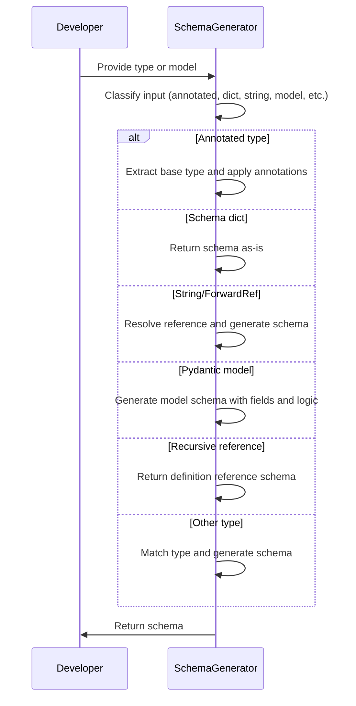

# Spec

## Detailed View of the Program's Functionality

a. Entry Point and Schema Dispatch

When a request is made to generate a schema for an object, the process begins by checking the nature of the object:

- If the object represents a "self" type (a special marker for recursive types), it is resolved to the actual type currently being processed.
- If the object is an "Annotated" type (a type with extra metadata or constraints), a specialized handler is invoked to process its annotations and build the schema accordingly.
- If the object is already a dictionary, it is assumed to be a valid schema and is returned as-is.
- If the object is a string, it is converted into a forward reference, which is then resolved to the actual type before schema generation continues.
- If the object is a forward reference, it is resolved and schema generation is retried with the resolved type.
- If the object is a Pydantic model (a subclass of the base model class), a model schema is generated, ensuring recursive models are handled correctly.
- If the object is a recursive reference, a schema referencing the recursive type is returned.
- If none of the above, the type is matched to a schema using a comprehensive type-to-schema mapping.

b. Processing Annotated Types

When an "Annotated" type is encountered, the following steps occur:

- The base type and all annotations are extracted from the annotated type, resolving any forward references.
- All annotations are applied to the base type to build the initial schema.
- Each annotation is processed in turn:
  - If the annotation is a special metadata object (such as one representing field information or constraints), the schema is updated to include default values or extra metadata.
  - Other annotations are processed as needed.
- After all annotations are processed, the schema is returned with all metadata and constraints applied.

c. Handling Forward References

If the object is a string or a forward reference, it is converted and resolved to the actual type using the available namespace. If resolution fails, an error is raised. Once resolved, schema generation is retried with the actual type.

d. Schema Generation Core

The main schema generation function first attempts to use a custom or cached schema method if available. If not, it falls back to the internal schema generation logic described above. After the core schema is generated, any custom JSON schema logic or serialization logic is attached to the schema before returning it.

e. Model and Recursive Reference Handling

If the object is a Pydantic model, the model is pushed onto a stack to track recursion, and a model schema is generated. If the object is a recursive reference, a schema referencing the recursive type is returned.

f. Building Model Schemas

When generating a schema for a Pydantic model:

- If a cached schema or reference exists, it is returned.
- If the model has a custom schema, it is used.
- Otherwise, configuration and namespace context are set up.
- Model fields are rebuilt if necessary, and decorator fields are validated.
- Extra fields are handled if allowed by configuration, ensuring their types are correct and schemas are generated for them.
- If the model is a root model (a model with a single root field), a specialized schema is generated for the root field.
- For regular models, schemas are generated for each field, including computed fields and extras.
- Model-level validators and serializers are applied in the correct order.
- The final schema is wrapped as a definition reference for reuse and recursion support.

g. Field Schema Construction

For each field in a model or dataclass:

- The source type and annotations are extracted.
- If a discriminator is present (for polymorphic types), it is applied.
- Any field-level validators are converted and attached.
- All annotations and validators are applied to the schema.
- Validators that apply to each item (for collections) are pushed down into the schema.
- If the field is not required, the schema is wrapped with default value logic.
- Field serializers, aliases, and metadata are attached.
- The assembled field schema is returned with all relevant information.

h. Model Fields and Computed Fields

For each field in a model, a field schema is generated as described above. Computed fields (fields whose values are computed from other data) are also processed, and their schemas are included. After all fields are processed, model-level serializers and validators are applied, and the schema is finalized as a reference.

i. Fallback Type Matching

If the object does not match any of the earlier cases, a comprehensive type-to-schema mapping is used. This mapping covers all standard Python types, collections, and special cases, generating the appropriate schema for each.

j. Type-to-Schema Mapping

The type matching logic checks for:

- Primitive types (str, int, float, etc.)
- Standard library types (datetime, Decimal, UUID, etc.)
- Special types (Any, object, None, etc.)
- Collections (list, tuple, set, dict, etc.)
- Patterns, paths, mappings, counters, etc.
- Type aliases, new types, final types, and type variables
- Callable types (functions, methods, etc.)
- Enums and zone info
- Dataclasses and namedtuples
- Generic types (parametrized collections, unions, etc.)

For each recognized type, the corresponding schema is generated, often by delegating to specialized helper methods.

k. Generic Type Specialization

If the type is a generic (<SwmToken path="pydantic/_internal/_generate_schema.py" pos="1033:18:20" line-data="        boilerplate before calling into the user-facing method (e.g. `GenerateSchema._tuple_schema`).">`e.g`</SwmToken>., List\[int\], Dict\[str, float\]), the origin type is determined, and the appropriate schema is generated:

- If the origin is a dataclass, a dataclass schema is generated for the specific parametrization.
- If the origin is a namedtuple, a namedtuple schema is generated.
- If the origin is a <SwmToken path="pydantic/_internal/_generate_schema.py" pos="718:8:8" line-data="                - If `typing.TypedDict` is used instead of `typing_extensions.TypedDict` on Python &lt; 3.12.">`TypedDict`</SwmToken>, a <SwmToken path="pydantic/_internal/_generate_schema.py" pos="718:8:8" line-data="                - If `typing.TypedDict` is used instead of `typing_extensions.TypedDict` on Python &lt; 3.12.">`TypedDict`</SwmToken> schema is generated.
- For other generics, the appropriate collection or mapping schema is generated.
- If the type is not recognized and arbitrary types are allowed, an arbitrary type schema is generated; otherwise, an unknown type schema is returned.

l. <SwmToken path="pydantic/_internal/_generate_schema.py" pos="1489:12:12" line-data="        &quot;&quot;&quot;Generate schema for a NamedTuple.&quot;&quot;&quot;">`NamedTuple`</SwmToken> Schema Generation

For namedtuples:

- Field type annotations are resolved, including handling of type variables.
- For each field, a parameter schema is generated, capturing its type and default value.
- The full namedtuple schema is assembled as a callable schema, supporting positional arguments.

m. <SwmToken path="pydantic/_internal/_generate_schema.py" pos="718:8:8" line-data="                - If `typing.TypedDict` is used instead of `typing_extensions.TypedDict` on Python &lt; 3.12.">`TypedDict`</SwmToken> Schema Construction

For TypedDicts:

- Compatibility and configuration are checked.
- Type hints and docstrings are extracted for each field.
- For each field, a schema is generated, capturing its type, required status, and metadata.
- Read-only fields are warned about.
- The full <SwmToken path="pydantic/_internal/_generate_schema.py" pos="718:8:8" line-data="                - If `typing.TypedDict` is used instead of `typing_extensions.TypedDict` on Python &lt; 3.12.">`TypedDict`</SwmToken> schema is assembled, including computed fields, serializers, and validators.
- The schema is wrapped as a definition reference for reuse.

n. Dataclass Type Handling

For dataclasses:

- The dataclass type is pushed onto the stack for recursion tracking.
- Cached schemas or references are used if available.
- Configuration and type variables are handled.
- Fields are collected or rebuilt as needed.
- Field schemas are generated for each field, sorted to match dataclass behavior.
- Root and model validators are applied.
- The final dataclass schema is assembled, including computed fields, serializers, and configuration.
- The schema is wrapped as a definition reference.

o. Callable Schema Generation

For callable types (functions, methods, etc.):

- The function signature is inspected, and argument schemas are generated for each parameter.
- If return value validation is enabled and a return annotation is present, a schema for the return type is generated.
- The full call schema is assembled, describing how to validate both arguments and return values.

p. Utility and Support Functions

Throughout the process, various utility functions are used to:

- Apply validators and serializers to schemas.
- Handle default values and factories.
- Manage references and definitions for recursive and reusable schemas.
- Extract and apply JSON schema metadata.
- Handle field aliases, exclusions, and metadata.

This comprehensive flow ensures that any Python type, model, or data structure can be converted into a robust, reusable schema suitable for validation, serialization, and documentation.

# Rule Definition

| Paragraph Name                                                                                                                                                                                                                                                                                                                         | Rule ID | Category          | Description                                                                                                                                                                                                                                                                                                                                                                                                                                                                                                                                                                                                                                                                                                      | Conditions                                                                                                                                                                                                                                                                                    | Remarks                                                                                                                                                                                                                                                                                                                                                                                                                                                                                                                                                                                                                                                                                                                                 |
| -------------------------------------------------------------------------------------------------------------------------------------------------------------------------------------------------------------------------------------------------------------------------------------------------------------------------------------- | ------- | ----------------- | ---------------------------------------------------------------------------------------------------------------------------------------------------------------------------------------------------------------------------------------------------------------------------------------------------------------------------------------------------------------------------------------------------------------------------------------------------------------------------------------------------------------------------------------------------------------------------------------------------------------------------------------------------------------------------------------------------------------- | --------------------------------------------------------------------------------------------------------------------------------------------------------------------------------------------------------------------------------------------------------------------------------------------- | --------------------------------------------------------------------------------------------------------------------------------------------------------------------------------------------------------------------------------------------------------------------------------------------------------------------------------------------------------------------------------------------------------------------------------------------------------------------------------------------------------------------------------------------------------------------------------------------------------------------------------------------------------------------------------------------------------------------------------------- |
| GenerateSchema.generate_schema                                                                                                                                                                                                                                                                                                         | RL-001  | Conditional Logic | The schema generation feature must provide a main entry point function that accepts a single argument, named obj, representing the type or object for which a schema should be generated.                                                                                                                                                                                                                                                                                                                                                                                                                                                                                                                        | The function is called with a single argument representing a type or object.                                                                                                                                                                                                                  | The argument can be any supported type (see other rules).                                                                                                                                                                                                                                                                                                                                                                                                                                                                                                                                                                                                                                                                               |
| GenerateSchema.generate_schema, GenerateSchema.\_generate_schema_inner, GenerateSchema.match_type, GenerateSchema.\_match_generic_type                                                                                                                                                                                                 | RL-002  | Conditional Logic | The input argument obj must support a wide range of types, including primitive Python types, Pydantic models, dataclasses, TypedDicts, generics, annotated types, forward references, enums, namedtuples, unions, built-in collections, arbitrary types (if allowed), and dicts representing schemas.                                                                                                                                                                                                                                                                                                                                                                                                            | The obj argument is any of the supported types.                                                                                                                                                                                                                                               | Supported types include: int, str, float, bool, <SwmToken path="pydantic/_internal/_generate_schema.py" pos="736:13:13" line-data="    def _model_schema(self, cls: type[BaseModel]) -&gt; core_schema.CoreSchema:">`BaseModel`</SwmToken> subclasses, dataclasses, TypedDicts, List, Dict, Annotated, <SwmToken path="pydantic/_internal/_generate_schema.py" pos="1009:5:5" line-data="            obj = ForwardRef(obj)">`ForwardRef`</SwmToken>, Enum, <SwmToken path="pydantic/_internal/_generate_schema.py" pos="1489:12:12" line-data="        &quot;&quot;&quot;Generate schema for a NamedTuple.&quot;&quot;&quot;">`NamedTuple`</SwmToken>, Union, set, frozenset, deque, arbitrary types (if allowed), and dicts (schemas). |
| GenerateSchema.generate_schema, GenerateSchema.\_generate_schema_inner, GenerateSchema.match_type, GenerateSchema.\_model_schema, GenerateSchema.\_dataclass_schema, GenerateSchema.\_typed_dict_schema, GenerateSchema.\_union_schema, GenerateSchema.\_list_schema, etc.                                                             | RL-003  | Data Assignment   | The output of schema generation must be a dict (or dict-like object) describing how to validate and serialize the input type, following the 'core schema' format. Each schema dict must include a 'type' key indicating the schema type (<SwmToken path="pydantic/_internal/_generate_schema.py" pos="1033:18:20" line-data="        boilerplate before calling into the user-facing method (e.g. `GenerateSchema._tuple_schema`).">`e.g`</SwmToken>., 'int', 'model', 'list', <SwmToken path="pydantic/_internal/_generate_schema.py" pos="1409:4:6" line-data="                    code=&#39;typed-dict-version&#39;,">`typed-dict`</SwmToken>, 'union', etc.), and additional keys as required for that type. | A schema is generated for any supported input type.                                                                                                                                                                                                                                           | The output is a dict with at least a 'type' key (string), and other keys depending on the schema type (<SwmToken path="pydantic/_internal/_generate_schema.py" pos="1033:18:20" line-data="        boilerplate before calling into the user-facing method (e.g. `GenerateSchema._tuple_schema`).">`e.g`</SwmToken>., 'fields', 'cls', <SwmToken path="pydantic/_internal/_generate_schema.py" pos="259:4:4" line-data="            schema[&#39;items_schema&#39;][variadic_item_index] = apply_validators(">`items_schema`</SwmToken>, etc.).                                                                                                                                                                                           |
| GenerateSchema.generate_schema, GenerateSchema.\_generate_schema_inner, GenerateSchema.match_type, GenerateSchema.\_model_schema, GenerateSchema.\_dataclass_schema, etc.                                                                                                                                                              | RL-004  | Computation       | The schema generation logic must be recursive, so that nested types, models, and fields are processed and included in the output schema as required.                                                                                                                                                                                                                                                                                                                                                                                                                                                                                                                                                             | The input type contains nested types, fields, or models.                                                                                                                                                                                                                                      | Recursion is used to generate schemas for nested fields, items, or types.                                                                                                                                                                                                                                                                                                                                                                                                                                                                                                                                                                                                                                                               |
| <SwmToken path="pydantic/_internal/_generate_schema.py" pos="1032:5:5" line-data="        (like `GenerateSchema.tuple_variable_schema`) or calls into a private method that handles some">`GenerateSchema`</SwmToken>.**init**, GenerateSchema.generate_schema, GenerateSchema.\_model_schema, GenerateSchema.\_dataclass_schema, etc. | RL-005  | Conditional Logic | Schema generation must support configuration options that affect the structure or content of the generated schema, such as <SwmToken path="pydantic/_internal/_generate_schema.py" pos="374:7:7" line-data="        return self._config_wrapper.arbitrary_types_allowed">`arbitrary_types_allowed`</SwmToken>, <SwmToken path="pydantic/_internal/_generate_schema.py" pos="1919:5:5" line-data="        if config_wrapper.validate_return:">`validate_return`</SwmToken>, and others.                                                                                                                                                                                                                           | Configuration options are set in the config wrapper or passed to the generator.                                                                                                                                                                                                               | Relevant config options include: <SwmToken path="pydantic/_internal/_generate_schema.py" pos="374:7:7" line-data="        return self._config_wrapper.arbitrary_types_allowed">`arbitrary_types_allowed`</SwmToken> (bool), <SwmToken path="pydantic/_internal/_generate_schema.py" pos="1919:5:5" line-data="        if config_wrapper.validate_return:">`validate_return`</SwmToken> (bool), and others as defined in <SwmToken path="pydantic/_internal/_generate_schema.py" pos="1415:4:4" line-data="                config: ConfigDict \| None = get_attribute_from_bases(typed_dict_cls, &#39;__pydantic_config__&#39;)">`ConfigDict`</SwmToken>.                                                                                |
| GenerateSchema.\_common_field_schema, GenerateSchema.\_apply_annotations, GenerateSchema.\_apply_field_serializers, GenerateSchema.\_apply_model_serializers, GenerateSchema.\_computed_field_schema, GenerateSchema.\_model_schema, GenerateSchema.\_dataclass_schema, GenerateSchema.\_typed_dict_schema                             | RL-006  | Data Assignment   | Schema generation must include support for field metadata (default values, constraints, extra metadata), validators and serializers (attached at appropriate points), discriminators for polymorphic types, computed fields, and extra fields as allowed by the model or dataclass configuration.                                                                                                                                                                                                                                                                                                                                                                                                                | Fields or models have metadata, validators, serializers, discriminators, computed or extra fields.                                                                                                                                                                                            | Field metadata is included in the schema's metadata; validators and serializers are attached in the schema dict; discriminators are included for unions/polymorphic types; computed fields are included as specified.                                                                                                                                                                                                                                                                                                                                                                                                                                                                                                                   |
| \_Definitions.get_schema_or_ref, GenerateSchema.generate_schema, GenerateSchema.\_model_schema, GenerateSchema.\_dataclass_schema, GenerateSchema.\_typed_dict_schema, etc.                                                                                                                                                            | RL-007  | Computation       | The schema generation logic must handle recursive references, ensuring that schemas for recursive types are correctly referenced and do not result in infinite recursion.                                                                                                                                                                                                                                                                                                                                                                                                                                                                                                                                        | A type references itself directly or indirectly.                                                                                                                                                                                                                                              | References are tracked and <SwmToken path="pydantic/_internal/_generate_schema.py" pos="2722:24:26" line-data="        &quot;&quot;&quot;Store the schema as a definition and return a `&#39;definition-reference&#39;` schema pointing to it.">`definition-reference`</SwmToken> schemas are used to avoid infinite recursion.                                                                                                                                                                                                                                                                                                                                                                                                         |
| GenerateSchema.generate_schema, GenerateSchema.\_typed_dict_schema, GenerateSchema.\_dataclass_schema, GenerateSchema.\_unknown_type_schema, etc.                                                                                                                                                                                      | RL-008  | Conditional Logic | The schema generation logic must emit warnings for read-only fields in TypedDicts and raise errors for unsupported or invalid combinations of configuration and field settings.                                                                                                                                                                                                                                                                                                                                                                                                                                                                                                                                  | A warning or error condition is detected (<SwmToken path="pydantic/_internal/_generate_schema.py" pos="1033:18:20" line-data="        boilerplate before calling into the user-facing method (e.g. `GenerateSchema._tuple_schema`).">`e.g`</SwmToken>., read-only field, unsupported config). | Warnings are emitted using Python's warnings module; errors are raised as exceptions (<SwmToken path="pydantic/_internal/_generate_schema.py" pos="1033:18:20" line-data="        boilerplate before calling into the user-facing method (e.g. `GenerateSchema._tuple_schema`).">`e.g`</SwmToken>., <SwmToken path="pydantic/_internal/_generate_schema.py" pos="717:1:1" line-data="            PydanticUserError:">`PydanticUserError`</SwmToken>, <SwmToken path="pydantic/_internal/_generate_schema.py" pos="712:1:1" line-data="            PydanticSchemaGenerationError:">`PydanticSchemaGenerationError`</SwmToken>).                                                                                                          |
| Imports at top of file, throughout <SwmToken path="pydantic/_internal/_generate_schema.py" pos="1032:5:5" line-data="        (like `GenerateSchema.tuple_variable_schema`) or calls into a private method that handles some">`GenerateSchema`</SwmToken> and helpers                                                                   | RL-009  | Data Assignment   | The implementation must use actual Pydantic classes (<SwmToken path="pydantic/_internal/_generate_schema.py" pos="736:13:13" line-data="    def _model_schema(self, cls: type[BaseModel]) -&gt; core_schema.CoreSchema:">`BaseModel`</SwmToken>, Field, etc.), as well as Python's built-in typing and dataclasses modules, and support both standard and backported types where relevant.                                                                                                                                                                                                                                                                                                                       | Schema generation involves Pydantic models, fields, or Python typing/dataclasses constructs.                                                                                                                                                                                                  | Imports and usage of Pydantic and typing/dataclasses modules are required.                                                                                                                                                                                                                                                                                                                                                                                                                                                                                                                                                                                                                                                              |
| Entire file structure                                                                                                                                                                                                                                                                                                                  | RL-010  | Data Assignment   | The schema generation logic must be implemented as a single, self-contained file, grouping related logic into classes or functions as needed, but not split into multiple files.                                                                                                                                                                                                                                                                                                                                                                                                                                                                                                                                 | The implementation is provided as a single file.                                                                                                                                                                                                                                              | All logic is contained in one file; related logic may be grouped into classes or functions.                                                                                                                                                                                                                                                                                                                                                                                                                                                                                                                                                                                                                                             |
| GenerateSchema.generate_schema, GenerateSchema.\_generate_schema_inner, GenerateSchema.match_type, etc.                                                                                                                                                                                                                                | RL-011  | Data Assignment   | The output schema must fully describe the validation and serialization logic for the input type, as expected by Pydantic's core schema format.                                                                                                                                                                                                                                                                                                                                                                                                                                                                                                                                                                   | A schema is generated for any supported input type.                                                                                                                                                                                                                                           | The schema must include all information needed for validation and serialization by Pydantic core.                                                                                                                                                                                                                                                                                                                                                                                                                                                                                                                                                                                                                                       |

# User Stories

## User Story 1: Invoke schema generation for all supported types

---

### Story Description:

As a user of the schema generation feature, I want to generate a schema for any supported Python or Pydantic type so that I can validate and serialize data structures of varying complexity.

---

### Business Rule Mapping:

| Rule ID | Paragraph Name                                                                                                                         | Rule Description                                                                                                                                                                                                                                                                                      |
| ------- | -------------------------------------------------------------------------------------------------------------------------------------- | ----------------------------------------------------------------------------------------------------------------------------------------------------------------------------------------------------------------------------------------------------------------------------------------------------- |
| RL-001  | GenerateSchema.generate_schema                                                                                                         | The schema generation feature must provide a main entry point function that accepts a single argument, named obj, representing the type or object for which a schema should be generated.                                                                                                             |
| RL-002  | GenerateSchema.generate_schema, GenerateSchema.\_generate_schema_inner, GenerateSchema.match_type, GenerateSchema.\_match_generic_type | The input argument obj must support a wide range of types, including primitive Python types, Pydantic models, dataclasses, TypedDicts, generics, annotated types, forward references, enums, namedtuples, unions, built-in collections, arbitrary types (if allowed), and dicts representing schemas. |

---

### Relevant Functionality:

- **GenerateSchema.generate_schema**
  1. **RL-001:**
     - Define a function that takes one argument (obj)
     - Use obj as the target for schema generation
  2. **RL-002:**
     - If obj is a primitive type, handle accordingly
     - If obj is a Pydantic model, handle as model
     - If obj is a dataclass, handle as dataclass
     - If obj is a <SwmToken path="pydantic/_internal/_generate_schema.py" pos="718:8:8" line-data="                - If `typing.TypedDict` is used instead of `typing_extensions.TypedDict` on Python &lt; 3.12.">`TypedDict`</SwmToken>, handle as <SwmToken path="pydantic/_internal/_generate_schema.py" pos="718:8:8" line-data="                - If `typing.TypedDict` is used instead of `typing_extensions.TypedDict` on Python &lt; 3.12.">`TypedDict`</SwmToken>
     - If obj is a generic type, handle as generic
     - If obj is Annotated, handle as annotated
     - If obj is a forward reference, resolve and handle
     - If obj is an Enum, handle as enum
     - If obj is a <SwmToken path="pydantic/_internal/_generate_schema.py" pos="1489:12:12" line-data="        &quot;&quot;&quot;Generate schema for a NamedTuple.&quot;&quot;&quot;">`NamedTuple`</SwmToken>, handle as namedtuple
     - If obj is a Union, handle as union
     - If obj is a built-in collection, handle as collection
     - If obj is an arbitrary type and allowed, handle as arbitrary
     - If obj is a dict, return as-is

## User Story 2: Produce complete and recursive schemas

---

### Story Description:

As a user of the schema generation feature, I want the output schema to fully describe the validation and serialization logic for any input type, including nested and complex types, so that the schema can be used reliably by Pydantic's core.

---

### Business Rule Mapping:

| Rule ID | Paragraph Name                                                                                                                                                                                                                                                             | Rule Description                                                                                                                                                                                                                                                                                                                                                                                                                                                                                                                                                                                                                                                                                                 |
| ------- | -------------------------------------------------------------------------------------------------------------------------------------------------------------------------------------------------------------------------------------------------------------------------- | ---------------------------------------------------------------------------------------------------------------------------------------------------------------------------------------------------------------------------------------------------------------------------------------------------------------------------------------------------------------------------------------------------------------------------------------------------------------------------------------------------------------------------------------------------------------------------------------------------------------------------------------------------------------------------------------------------------------- |
| RL-003  | GenerateSchema.generate_schema, GenerateSchema.\_generate_schema_inner, GenerateSchema.match_type, GenerateSchema.\_model_schema, GenerateSchema.\_dataclass_schema, GenerateSchema.\_typed_dict_schema, GenerateSchema.\_union_schema, GenerateSchema.\_list_schema, etc. | The output of schema generation must be a dict (or dict-like object) describing how to validate and serialize the input type, following the 'core schema' format. Each schema dict must include a 'type' key indicating the schema type (<SwmToken path="pydantic/_internal/_generate_schema.py" pos="1033:18:20" line-data="        boilerplate before calling into the user-facing method (e.g. `GenerateSchema._tuple_schema`).">`e.g`</SwmToken>., 'int', 'model', 'list', <SwmToken path="pydantic/_internal/_generate_schema.py" pos="1409:4:6" line-data="                    code=&#39;typed-dict-version&#39;,">`typed-dict`</SwmToken>, 'union', etc.), and additional keys as required for that type. |
| RL-004  | GenerateSchema.generate_schema, GenerateSchema.\_generate_schema_inner, GenerateSchema.match_type, GenerateSchema.\_model_schema, GenerateSchema.\_dataclass_schema, etc.                                                                                                  | The schema generation logic must be recursive, so that nested types, models, and fields are processed and included in the output schema as required.                                                                                                                                                                                                                                                                                                                                                                                                                                                                                                                                                             |
| RL-011  | GenerateSchema.generate_schema, GenerateSchema.\_generate_schema_inner, GenerateSchema.match_type, etc.                                                                                                                                                                    | The output schema must fully describe the validation and serialization logic for the input type, as expected by Pydantic's core schema format.                                                                                                                                                                                                                                                                                                                                                                                                                                                                                                                                                                   |

---

### Relevant Functionality:

- **GenerateSchema.generate_schema**
  1. **RL-003:**
     - For each supported type, construct a dict with 'type' and other required keys
     - Return the dict as the schema
  2. **RL-004:**
     - When generating a schema for a type with nested fields/items, call <SwmToken path="pydantic/_internal/_generate_schema.py" pos="697:3:3" line-data="    def generate_schema(">`generate_schema`</SwmToken> recursively on each nested type
  3. **RL-011:**
     - Ensure all relevant validation and serialization details are included in the output schema dict

## User Story 3: Handle recursion, errors, and warnings robustly

---

### Story Description:

As a user of the schema generation feature, I want recursive references to be handled safely and for the system to emit warnings or raise errors for invalid configurations so that schema generation is robust and predictable.

---

### Business Rule Mapping:

| Rule ID | Paragraph Name                                                                                                                                                              | Rule Description                                                                                                                                                                |
| ------- | --------------------------------------------------------------------------------------------------------------------------------------------------------------------------- | ------------------------------------------------------------------------------------------------------------------------------------------------------------------------------- |
| RL-007  | \_Definitions.get_schema_or_ref, GenerateSchema.generate_schema, GenerateSchema.\_model_schema, GenerateSchema.\_dataclass_schema, GenerateSchema.\_typed_dict_schema, etc. | The schema generation logic must handle recursive references, ensuring that schemas for recursive types are correctly referenced and do not result in infinite recursion.       |
| RL-008  | GenerateSchema.generate_schema, GenerateSchema.\_typed_dict_schema, GenerateSchema.\_dataclass_schema, GenerateSchema.\_unknown_type_schema, etc.                           | The schema generation logic must emit warnings for read-only fields in TypedDicts and raise errors for unsupported or invalid combinations of configuration and field settings. |

---

### Relevant Functionality:

- **\_Definitions.get_schema_or_ref**
  1. **RL-007:**
     - Track types being processed
     - If a type is encountered again, insert a reference instead of recursing
     - After all schemas are generated, resolve references as needed
- **GenerateSchema.generate_schema**
  1. **RL-008:**
     - If a warning condition is detected, emit a warning
     - If an error condition is detected, raise an appropriate exception

## User Story 4: Adhere to implementation and project standards

---

### Story Description:

As a maintainer of the schema generation feature, I want the implementation to use actual Pydantic and Python typing/dataclasses constructs and to be provided as a single, self-contained file so that the codebase remains maintainable and compliant with project standards.

---

### Business Rule Mapping:

| Rule ID | Paragraph Name                                                                                                                                                                                                                                                       | Rule Description                                                                                                                                                                                                                                                                                                                                                                           |
| ------- | -------------------------------------------------------------------------------------------------------------------------------------------------------------------------------------------------------------------------------------------------------------------- | ------------------------------------------------------------------------------------------------------------------------------------------------------------------------------------------------------------------------------------------------------------------------------------------------------------------------------------------------------------------------------------------ |
| RL-009  | Imports at top of file, throughout <SwmToken path="pydantic/_internal/_generate_schema.py" pos="1032:5:5" line-data="        (like `GenerateSchema.tuple_variable_schema`) or calls into a private method that handles some">`GenerateSchema`</SwmToken> and helpers | The implementation must use actual Pydantic classes (<SwmToken path="pydantic/_internal/_generate_schema.py" pos="736:13:13" line-data="    def _model_schema(self, cls: type[BaseModel]) -&gt; core_schema.CoreSchema:">`BaseModel`</SwmToken>, Field, etc.), as well as Python's built-in typing and dataclasses modules, and support both standard and backported types where relevant. |
| RL-010  | Entire file structure                                                                                                                                                                                                                                                | The schema generation logic must be implemented as a single, self-contained file, grouping related logic into classes or functions as needed, but not split into multiple files.                                                                                                                                                                                                           |

---

### Relevant Functionality:

- **Imports at top of file**
  1. **RL-009:**
     - Import and use Pydantic classes and helpers
     - Import and use typing and dataclasses modules as needed
- **Entire file structure**
  1. **RL-010:**
     - Place all schema generation logic in a single file
     - Organize code into classes and functions as appropriate

## User Story 5: Customize and enrich schema generation

---

### Story Description:

As a user of the schema generation feature, I want to customize schema generation using configuration options and have schemas include field metadata, validators, serializers, discriminators, computed fields, and extra fields so that the generated schema matches my project's requirements and supports advanced validation and serialization scenarios.

---

### Business Rule Mapping:

| Rule ID | Paragraph Name                                                                                                                                                                                                                                                                                                                         | Rule Description                                                                                                                                                                                                                                                                                                                                                                                                                                                                       |
| ------- | -------------------------------------------------------------------------------------------------------------------------------------------------------------------------------------------------------------------------------------------------------------------------------------------------------------------------------------- | -------------------------------------------------------------------------------------------------------------------------------------------------------------------------------------------------------------------------------------------------------------------------------------------------------------------------------------------------------------------------------------------------------------------------------------------------------------------------------------- |
| RL-005  | <SwmToken path="pydantic/_internal/_generate_schema.py" pos="1032:5:5" line-data="        (like `GenerateSchema.tuple_variable_schema`) or calls into a private method that handles some">`GenerateSchema`</SwmToken>.**init**, GenerateSchema.generate_schema, GenerateSchema.\_model_schema, GenerateSchema.\_dataclass_schema, etc. | Schema generation must support configuration options that affect the structure or content of the generated schema, such as <SwmToken path="pydantic/_internal/_generate_schema.py" pos="374:7:7" line-data="        return self._config_wrapper.arbitrary_types_allowed">`arbitrary_types_allowed`</SwmToken>, <SwmToken path="pydantic/_internal/_generate_schema.py" pos="1919:5:5" line-data="        if config_wrapper.validate_return:">`validate_return`</SwmToken>, and others. |
| RL-006  | GenerateSchema.\_common_field_schema, GenerateSchema.\_apply_annotations, GenerateSchema.\_apply_field_serializers, GenerateSchema.\_apply_model_serializers, GenerateSchema.\_computed_field_schema, GenerateSchema.\_model_schema, GenerateSchema.\_dataclass_schema, GenerateSchema.\_typed_dict_schema                             | Schema generation must include support for field metadata (default values, constraints, extra metadata), validators and serializers (attached at appropriate points), discriminators for polymorphic types, computed fields, and extra fields as allowed by the model or dataclass configuration.                                                                                                                                                                                      |

---

### Relevant Functionality:

- **GenerateSchema.init**
  1. **RL-005:**
     - Read configuration options from the config wrapper
     - Adjust schema generation logic based on these options (<SwmToken path="pydantic/_internal/_generate_schema.py" pos="1033:18:20" line-data="        boilerplate before calling into the user-facing method (e.g. `GenerateSchema._tuple_schema`).">`e.g`</SwmToken>., allow arbitrary types, validate return values, etc.)
- **GenerateSchema.\_common_field_schema**
  1. **RL-006:**
     - Extract field metadata and include in schema
     - Attach validators and serializers to schema
     - Add discriminators for polymorphic types if present
     - Include computed and extra fields as allowed

# Code Walkthrough

## Schema Dispatch Entry Point

```mermaid
%%{init: {"flowchart": {"defaultRenderer": "elk"}} }%%
flowchart TD
  node1["Start: Receive object to generate schema for"] --> node2{"Is object an Annotated type?"}
  click node1 openCode "pydantic/_internal/_generate_schema.py:997:1001"
  node2 -->|"Yes"| node3["Generate schema for Annotated type"]
  click node2 openCode "pydantic/_internal/_generate_schema.py:1001:1003"
  click node3 openCode "pydantic/_internal/_generate_schema.py:1002:1003"
  node2 -->|"No"| node4{"Is object already a schema (dict)?"}
  click node4 openCode "pydantic/_internal/_generate_schema.py:1004:1006"
  node4 -->|"Yes"| node5["Return schema as is"]
  click node5 openCode "pydantic/_internal/_generate_schema.py:1006:1006"
  node4 -->|"No"| node6{"Is object a Pydantic model?"}
  click node6 openCode "pydantic/_internal/_generate_schema.py:1014:1018"
  node6 -->|"Yes"| node7["Generate schema for Pydantic model"]
  click node7 openCode "pydantic/_internal/_generate_schema.py:1018:1018"
  node6 -->|"No"| node8["Match type to schema and return"]
  click node8 openCode "pydantic/_internal/_generate_schema.py:1023:1023"


subgraph node3 [_annotated_schema]
  sgmain_1_node1["Extract base type and annotations from the annotated type"]
  click sgmain_1_node1 openCode "pydantic/_internal/_generate_schema.py:2148:2151"
  sgmain_1_node1 --> sgmain_1_node2["Apply all annotations to build initial schema"]
  click sgmain_1_node2 openCode "pydantic/_internal/_generate_schema.py:2152:2152"
  sgmain_1_node2 --> sgmain_1_node3["Process annotations"]
  click sgmain_1_node3 openCode "pydantic/_internal/_generate_schema.py:2155:2157"
  subgraph sgmain_1_loop1["For each annotation"]
  sgmain_1_node3 --> sgmain_1_node4{"Is annotation a FieldInfo (default or extra metadata)?"}
  click sgmain_1_node4 openCode "pydantic/_internal/_generate_schema.py:2156:2157"
  sgmain_1_node4 -->|"Yes"| sgmain_1_node5["Update schema to include default value or metadata"]
  click sgmain_1_node5 openCode "pydantic/_internal/_generate_schema.py:2157:2157"
  sgmain_1_node4 -->|"No"| sgmain_1_node3
  sgmain_1_node5 --> sgmain_1_node3
  end
  sgmain_1_node3 --> sgmain_1_node6["Return schema with all metadata and constraints applied"]
  click sgmain_1_node6 openCode "pydantic/_internal/_generate_schema.py:2158:2158"
end

%% Swimm:
%% %%{init: {"flowchart": {"defaultRenderer": "elk"}} }%%
%% flowchart TD
%%   node1["Start: Receive object to generate schema for"] --> node2{"Is object an Annotated type?"}
%%   click node1 openCode "<SwmPath>[pydantic/\_internal/\_generate_schema.py](pydantic/_internal/_generate_schema.py)</SwmPath>:997:1001"
%%   node2 -->|"Yes"| node3["Generate schema for Annotated type"]
%%   click node2 openCode "<SwmPath>[pydantic/\_internal/\_generate_schema.py](pydantic/_internal/_generate_schema.py)</SwmPath>:1001:1003"
%%   click node3 openCode "<SwmPath>[pydantic/\_internal/\_generate_schema.py](pydantic/_internal/_generate_schema.py)</SwmPath>:1002:1003"
%%   node2 -->|"No"| node4{"Is object already a schema (dict)?"}
%%   click node4 openCode "<SwmPath>[pydantic/\_internal/\_generate_schema.py](pydantic/_internal/_generate_schema.py)</SwmPath>:1004:1006"
%%   node4 -->|"Yes"| node5["Return schema as is"]
%%   click node5 openCode "<SwmPath>[pydantic/\_internal/\_generate_schema.py](pydantic/_internal/_generate_schema.py)</SwmPath>:1006:1006"
%%   node4 -->|"No"| node6{"Is object a Pydantic model?"}
%%   click node6 openCode "<SwmPath>[pydantic/\_internal/\_generate_schema.py](pydantic/_internal/_generate_schema.py)</SwmPath>:1014:1018"
%%   node6 -->|"Yes"| node7["Generate schema for Pydantic model"]
%%   click node7 openCode "<SwmPath>[pydantic/\_internal/\_generate_schema.py](pydantic/_internal/_generate_schema.py)</SwmPath>:1018:1018"
%%   node6 -->|"No"| node8["Match type to schema and return"]
%%   click node8 openCode "<SwmPath>[pydantic/\_internal/\_generate_schema.py](pydantic/_internal/_generate_schema.py)</SwmPath>:1023:1023"
%% 
%% 
%% subgraph node3 [<SwmToken path="pydantic/_internal/_generate_schema.py" pos="1002:5:5" line-data="            return self._annotated_schema(obj)">`_annotated_schema`</SwmToken>]
%%   sgmain_1_node1["Extract base type and annotations from the annotated type"]
%%   click sgmain_1_node1 openCode "<SwmPath>[pydantic/\_internal/\_generate_schema.py](pydantic/_internal/_generate_schema.py)</SwmPath>:2148:2151"
%%   sgmain_1_node1 --> sgmain_1_node2["Apply all annotations to build initial schema"]
%%   click sgmain_1_node2 openCode "<SwmPath>[pydantic/\_internal/\_generate_schema.py](pydantic/_internal/_generate_schema.py)</SwmPath>:2152:2152"
%%   sgmain_1_node2 --> sgmain_1_node3["Process annotations"]
%%   click sgmain_1_node3 openCode "<SwmPath>[pydantic/\_internal/\_generate_schema.py](pydantic/_internal/_generate_schema.py)</SwmPath>:2155:2157"
%%   subgraph sgmain_1_loop1["For each annotation"]
%%   sgmain_1_node3 --> sgmain_1_node4{"Is annotation a <SwmToken path="pydantic/_internal/_generate_schema.py" pos="1199:4:4" line-data="        field_info: FieldInfo,">`FieldInfo`</SwmToken> (default or extra metadata)?"}
%%   click sgmain_1_node4 openCode "<SwmPath>[pydantic/\_internal/\_generate_schema.py](pydantic/_internal/_generate_schema.py)</SwmPath>:2156:2157"
%%   sgmain_1_node4 -->|"Yes"| sgmain_1_node5["Update schema to include default value or metadata"]
%%   click sgmain_1_node5 openCode "<SwmPath>[pydantic/\_internal/\_generate_schema.py](pydantic/_internal/_generate_schema.py)</SwmPath>:2157:2157"
%%   sgmain_1_node4 -->|"No"| sgmain_1_node3
%%   sgmain_1_node5 --> sgmain_1_node3
%%   end
%%   sgmain_1_node3 --> sgmain_1_node6["Return schema with all metadata and constraints applied"]
%%   click sgmain_1_node6 openCode "<SwmPath>[pydantic/\_internal/\_generate_schema.py](pydantic/_internal/_generate_schema.py)</SwmPath>:2158:2158"
%% end
```

<SwmSnippet path="/pydantic/_internal/_generate_schema.py" line="997">

---

In <SwmToken path="pydantic/_internal/_generate_schema.py" pos="997:3:3" line-data="    def _generate_schema_inner(self, obj: Any) -&gt; core_schema.CoreSchema:">`_generate_schema_inner`</SwmToken>, the flow starts by checking if the input is a 'self' type or an annotated type, handling those cases first. If the input is a dict, it's assumed to already be a valid schema and is returned directly—no further checks. If not, the function continues to process the input, and if it's an annotated type, it calls <SwmToken path="pydantic/_internal/_generate_schema.py" pos="1002:5:5" line-data="            return self._annotated_schema(obj)">`_annotated_schema`</SwmToken> to handle any extra metadata or constraints. This step is necessary because annotated types need their annotations applied to the schema, which can't be done by just returning the object as-is.

```python
    def _generate_schema_inner(self, obj: Any) -> core_schema.CoreSchema:
        if typing_objects.is_self(obj):
            obj = self._resolve_self_type(obj)

        if typing_objects.is_annotated(get_origin(obj)):
            return self._annotated_schema(obj)

        if isinstance(obj, dict):
            # we assume this is already a valid schema
            return obj  # type: ignore[return-value]

```

---

</SwmSnippet>

### Processing Annotated Types

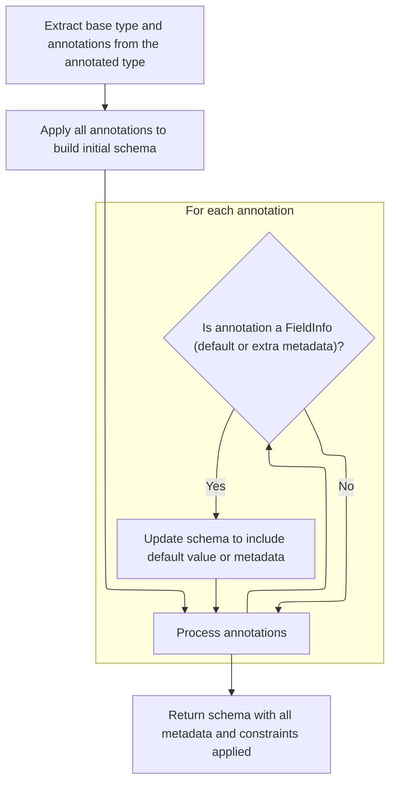

<SwmSnippet path="/pydantic/_internal/_generate_schema.py" line="2145">

---

In <SwmToken path="pydantic/_internal/_generate_schema.py" pos="2145:3:3" line-data="    def _annotated_schema(self, annotated_type: Any) -&gt; core_schema.CoreSchema:">`_annotated_schema`</SwmToken>, we pull apart the annotated type to get the base type and any attached annotations, resolving forward references so we work with real types. Then we call <SwmToken path="pydantic/_internal/_generate_schema.py" pos="2152:7:7" line-data="        schema = self._apply_annotations(source_type, annotations)">`_apply_annotations`</SwmToken> to actually apply those annotations to the schema, which is how constraints and metadata get attached to the type.

```python
    def _annotated_schema(self, annotated_type: Any) -> core_schema.CoreSchema:
        """Generate schema for an Annotated type, e.g. `Annotated[int, Field(...)]` or `Annotated[int, Gt(0)]`."""
        FieldInfo = import_cached_field_info()
        source_type, *annotations = self._get_args_resolving_forward_refs(
            annotated_type,
            required=True,
        )
        schema = self._apply_annotations(source_type, annotations)
```

---

</SwmSnippet>

<SwmSnippet path="/pydantic/_internal/_generate_schema.py" line="2153">

---

After <SwmToken path="pydantic/_internal/_generate_schema.py" pos="1269:7:7" line-data="                schema = self._apply_annotations(">`_apply_annotations`</SwmToken> in <SwmToken path="pydantic/_internal/_generate_schema.py" pos="1002:5:5" line-data="            return self._annotated_schema(obj)">`_annotated_schema`</SwmToken>, we check for <SwmToken path="pydantic/_internal/_generate_schema.py" pos="2156:8:8" line-data="            if isinstance(annotation, FieldInfo):">`FieldInfo`</SwmToken> and wrap the schema with a default validator if needed, so defaults work as expected.

```python
        # put the default validator last so that TypeAdapter.get_default_value() works
        # even if there are function validators involved
        for annotation in annotations:
            if isinstance(annotation, FieldInfo):
                schema = wrap_default(annotation, schema)
```

---

</SwmSnippet>

<SwmSnippet path="/pydantic/_internal/_generate_schema.py" line="2157">

---

Finally in <SwmToken path="pydantic/_internal/_generate_schema.py" pos="1002:5:5" line-data="            return self._annotated_schema(obj)">`_annotated_schema`</SwmToken>, we return the schema, possibly wrapped with a default validator if <SwmToken path="pydantic/_internal/_generate_schema.py" pos="1199:4:4" line-data="        field_info: FieldInfo,">`FieldInfo`</SwmToken> was present in the annotations. If not, it's just the annotated schema.

```python
                schema = wrap_default(annotation, schema)
        return schema
```

---

</SwmSnippet>

### Handling Forward References

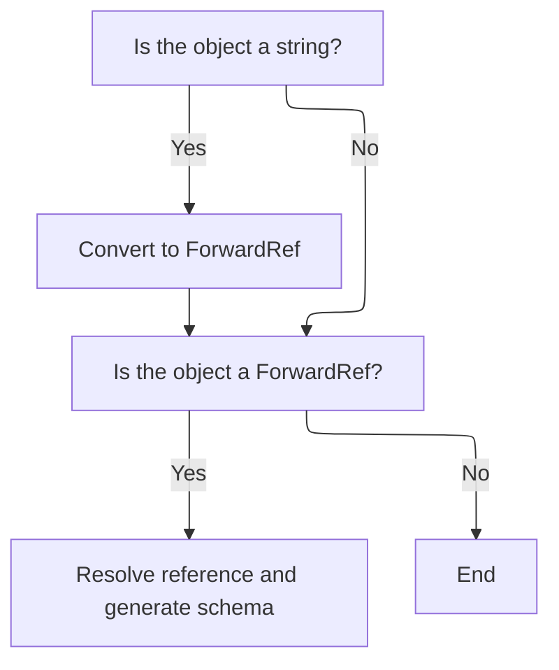

<SwmSnippet path="/pydantic/_internal/_generate_schema.py" line="1008">

---

Back in <SwmToken path="pydantic/_internal/_generate_schema.py" pos="724:7:7" line-data="            schema = self._generate_schema_inner(obj)">`_generate_schema_inner`</SwmToken>, after handling annotated types, if the input is a string, we convert it to a <SwmToken path="pydantic/_internal/_generate_schema.py" pos="1009:5:5" line-data="            obj = ForwardRef(obj)">`ForwardRef`</SwmToken> and resolve it. Then we call <SwmToken path="pydantic/_internal/_generate_schema.py" pos="1012:5:5" line-data="            return self.generate_schema(self._resolve_forward_ref(obj))">`generate_schema`</SwmToken> to build the schema for the resolved type, making sure we handle forward references properly.

```python
        if isinstance(obj, str):
            obj = ForwardRef(obj)

        if isinstance(obj, ForwardRef):
            return self.generate_schema(self._resolve_forward_ref(obj))

```

---

</SwmSnippet>

### Schema Generation Core

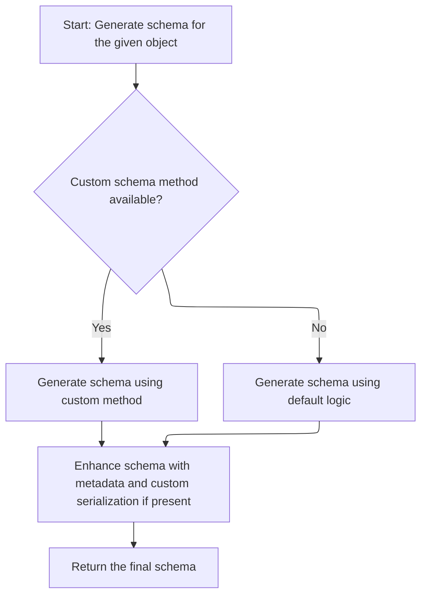

<SwmSnippet path="/pydantic/_internal/_generate_schema.py" line="697">

---

In <SwmToken path="pydantic/_internal/_generate_schema.py" pos="697:3:3" line-data="    def generate_schema(">`generate_schema`</SwmToken>, we first try to get a schema using a custom or cached method. If that doesn't work, we fall back to <SwmToken path="pydantic/_internal/_generate_schema.py" pos="724:7:7" line-data="            schema = self._generate_schema_inner(obj)">`_generate_schema_inner`</SwmToken> to build the schema from the input type.

```python
    def generate_schema(
        self,
        obj: Any,
    ) -> core_schema.CoreSchema:
        """Generate core schema.

        Args:
            obj: The object to generate core schema for.

        Returns:
            The generated core schema.

        Raises:
            PydanticUndefinedAnnotation:
                If it is not possible to evaluate forward reference.
            PydanticSchemaGenerationError:
                If it is not possible to generate pydantic-core schema.
            TypeError:
                - If `alias_generator` returns a disallowed type (must be str, AliasPath or AliasChoices).
                - If V1 style validator with `each_item=True` applied on a wrong field.
            PydanticUserError:
                - If `typing.TypedDict` is used instead of `typing_extensions.TypedDict` on Python < 3.12.
                - If `__modify_schema__` method is used instead of `__get_pydantic_json_schema__`.
        """
        schema = self._generate_schema_from_get_schema_method(obj, obj)

        if schema is None:
            schema = self._generate_schema_inner(obj)

```

---

</SwmSnippet>

<SwmSnippet path="/pydantic/_internal/_generate_schema.py" line="726">

---

After <SwmToken path="pydantic/_internal/_generate_schema.py" pos="724:7:7" line-data="            schema = self._generate_schema_inner(obj)">`_generate_schema_inner`</SwmToken>, <SwmToken path="pydantic/_internal/_generate_schema.py" pos="697:3:3" line-data="    def generate_schema(">`generate_schema`</SwmToken> adds any custom JSON schema and serialization logic before returning.

```python
        metadata_js_function = _extract_get_pydantic_json_schema(obj)
        if metadata_js_function is not None:
            metadata_schema = resolve_original_schema(schema, self.defs)
            if metadata_schema:
                self._add_js_function(metadata_schema, metadata_js_function)

        schema = _add_custom_serialization_from_json_encoders(self._config_wrapper.json_encoders, obj, schema)

        return schema
```

---

</SwmSnippet>

### Model and Recursive Reference Handling

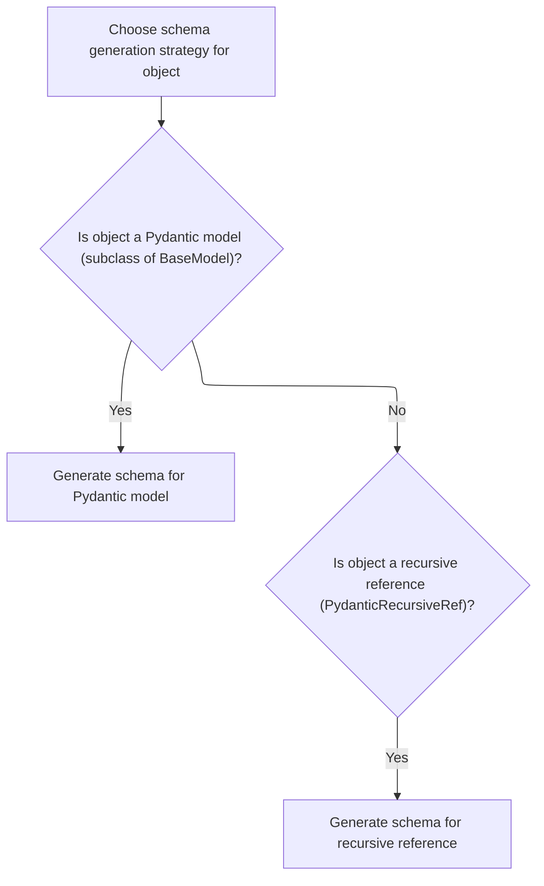

<SwmSnippet path="/pydantic/_internal/_generate_schema.py" line="1014">

---

Back in <SwmToken path="pydantic/_internal/_generate_schema.py" pos="724:7:7" line-data="            schema = self._generate_schema_inner(obj)">`_generate_schema_inner`</SwmToken>, after handling forward refs and custom schemas, if the input is a <SwmToken path="pydantic/_internal/_generate_schema.py" pos="1014:1:1" line-data="        BaseModel = import_cached_base_model()">`BaseModel`</SwmToken> subclass, we push it to the model stack and call <SwmToken path="pydantic/_internal/_generate_schema.py" pos="1018:5:5" line-data="                return self._model_schema(obj)">`_model_schema`</SwmToken> to generate a schema that includes all the model's fields and logic. If it's a recursive reference, we return a definition reference schema.

```python
        BaseModel = import_cached_base_model()

        if lenient_issubclass(obj, BaseModel):
            with self.model_type_stack.push(obj):
                return self._model_schema(obj)

        if isinstance(obj, PydanticRecursiveRef):
            return core_schema.definition_reference_schema(schema_ref=obj.type_ref)

```

---

</SwmSnippet>

### Building Model Schemas

```mermaid
%%{init: {"flowchart": {"defaultRenderer": "elk"}} }%%
flowchart TD
    node1["Start schema generation for Pydantic model"] --> node2{"Is model a root model?"}
    click node1 openCode "pydantic/_internal/_generate_schema.py:736:833"
    node2 -->|"Yes"| node3["Generate root model schema (calls _common_field_schema), apply validators, finalize"]
    click node2 openCode "pydantic/_internal/_generate_schema.py:835:836"
    node2 -->|"No"| node3["Generate standard model schema, apply validators, finalize"]
    click node3 openCode "pydantic/_internal/_generate_schema.py:837:876"


subgraph node3 [_common_field_schema]
  sgmain_1_node1["Start: Prepare field schema"] --> subgraph sgmain_1_loop1["For each validator decorator"]
  sgmain_1_node2["Collect and transform validator"]
  click sgmain_1_node2 openCode "pydantic/_internal/_generate_schema.py:1264:1265"
  end
  sgmain_1_loop1 --> sgmain_1_node3{"Field has discriminator? (field_info.discriminator)"}
  click sgmain_1_node3 openCode "pydantic/_internal/_generate_schema.py:1268:1271"
  sgmain_1_node3 -->|"Yes"| sgmain_1_node4["Apply discriminator logic to schema"]
  click sgmain_1_node4 openCode "pydantic/_internal/_generate_schema.py:1258:1261"
  sgmain_1_node3 -->|"No"| sgmain_1_node5["Apply standard annotations"]
  click sgmain_1_node5 openCode "pydantic/_internal/_generate_schema.py:1273:1276"
  sgmain_1_node4 --> sgmain_1_node6["Apply validators to schema"]
  click sgmain_1_node6 openCode "pydantic/_internal/_generate_schema.py:1282:1289"
  sgmain_1_node5 --> sgmain_1_node6
  sgmain_1_node6 --> sgmain_1_node7{"Field required? (field_info.is_required())"}
  click sgmain_1_node7 openCode "pydantic/_internal/_generate_schema.py:1294:1295"
  sgmain_1_node7 -->|"No"| sgmain_1_node8["Wrap schema with default value logic"]
  click sgmain_1_node8 openCode "pydantic/_internal/_generate_schema.py:1295:1295"
  sgmain_1_node7 -->|"Yes"| sgmain_1_node9["Continue"]
  sgmain_1_node8 --> sgmain_1_node10["Apply serializers, aliases, and metadata"]
  click sgmain_1_node10 openCode "pydantic/_internal/_generate_schema.py:1297:1319"
  sgmain_1_node9 --> sgmain_1_node10
  sgmain_1_node10 --> sgmain_1_node11["Return assembled field schema with metadata and aliases"]
  click sgmain_1_node11 openCode "pydantic/_internal/_generate_schema.py:1312:1319"
end

%% Swimm:
%% %%{init: {"flowchart": {"defaultRenderer": "elk"}} }%%
%% flowchart TD
%%     node1["Start schema generation for Pydantic model"] --> node2{"Is model a root model?"}
%%     click node1 openCode "<SwmPath>[pydantic/\_internal/\_generate_schema.py](pydantic/_internal/_generate_schema.py)</SwmPath>:736:833"
%%     node2 -->|"Yes"| node3["Generate root model schema (calls <SwmToken path="pydantic/_internal/_generate_schema.py" pos="836:7:7" line-data="                    root_field = self._common_field_schema(&#39;root&#39;, fields[&#39;root&#39;], decorators)">`_common_field_schema`</SwmToken>), apply validators, finalize"]
%%     click node2 openCode "<SwmPath>[pydantic/\_internal/\_generate_schema.py](pydantic/_internal/_generate_schema.py)</SwmPath>:835:836"
%%     node2 -->|"No"| node3["Generate standard model schema, apply validators, finalize"]
%%     click node3 openCode "<SwmPath>[pydantic/\_internal/\_generate_schema.py](pydantic/_internal/_generate_schema.py)</SwmPath>:837:876"
%% 
%% 
%% subgraph node3 [<SwmToken path="pydantic/_internal/_generate_schema.py" pos="836:7:7" line-data="                    root_field = self._common_field_schema(&#39;root&#39;, fields[&#39;root&#39;], decorators)">`_common_field_schema`</SwmToken>]
%%   sgmain_1_node1["Start: Prepare field schema"] --> subgraph sgmain_1_loop1["For each validator decorator"]
%%   sgmain_1_node2["Collect and transform validator"]
%%   click sgmain_1_node2 openCode "<SwmPath>[pydantic/\_internal/\_generate_schema.py](pydantic/_internal/_generate_schema.py)</SwmPath>:1264:1265"
%%   end
%%   sgmain_1_loop1 --> sgmain_1_node3{"Field has discriminator? (<SwmToken path="pydantic/_internal/_generate_schema.py" pos="1259:12:14" line-data="            schema = self._apply_discriminator_to_union(schema, field_info.discriminator)">`field_info.discriminator`</SwmToken>)"}
%%   click sgmain_1_node3 openCode "<SwmPath>[pydantic/\_internal/\_generate_schema.py](pydantic/_internal/_generate_schema.py)</SwmPath>:1268:1271"
%%   sgmain_1_node3 -->|"Yes"| sgmain_1_node4["Apply discriminator logic to schema"]
%%   click sgmain_1_node4 openCode "<SwmPath>[pydantic/\_internal/\_generate_schema.py](pydantic/_internal/_generate_schema.py)</SwmPath>:1258:1261"
%%   sgmain_1_node3 -->|"No"| sgmain_1_node5["Apply standard annotations"]
%%   click sgmain_1_node5 openCode "<SwmPath>[pydantic/\_internal/\_generate_schema.py](pydantic/_internal/_generate_schema.py)</SwmPath>:1273:1276"
%%   sgmain_1_node4 --> sgmain_1_node6["Apply validators to schema"]
%%   click sgmain_1_node6 openCode "<SwmPath>[pydantic/\_internal/\_generate_schema.py](pydantic/_internal/_generate_schema.py)</SwmPath>:1282:1289"
%%   sgmain_1_node5 --> sgmain_1_node6
%%   sgmain_1_node6 --> sgmain_1_node7{"Field required? (<SwmToken path="pydantic/_internal/_generate_schema.py" pos="1208:9:13" line-data="            required=False if not field_info.is_required() else required,">`field_info.is_required()`</SwmToken>)"}
%%   click sgmain_1_node7 openCode "<SwmPath>[pydantic/\_internal/\_generate_schema.py](pydantic/_internal/_generate_schema.py)</SwmPath>:1294:1295"
%%   sgmain_1_node7 -->|"No"| sgmain_1_node8["Wrap schema with default value logic"]
%%   click sgmain_1_node8 openCode "<SwmPath>[pydantic/\_internal/\_generate_schema.py](pydantic/_internal/_generate_schema.py)</SwmPath>:1295:1295"
%%   sgmain_1_node7 -->|"Yes"| sgmain_1_node9["Continue"]
%%   sgmain_1_node8 --> sgmain_1_node10["Apply serializers, aliases, and metadata"]
%%   click sgmain_1_node10 openCode "<SwmPath>[pydantic/\_internal/\_generate_schema.py](pydantic/_internal/_generate_schema.py)</SwmPath>:1297:1319"
%%   sgmain_1_node9 --> sgmain_1_node10
%%   sgmain_1_node10 --> sgmain_1_node11["Return assembled field schema with metadata and aliases"]
%%   click sgmain_1_node11 openCode "<SwmPath>[pydantic/\_internal/\_generate_schema.py](pydantic/_internal/_generate_schema.py)</SwmPath>:1312:1319"
%% end
```

<SwmSnippet path="/pydantic/_internal/_generate_schema.py" line="736">

---

In <SwmToken path="pydantic/_internal/_generate_schema.py" pos="736:3:3" line-data="    def _model_schema(self, cls: type[BaseModel]) -&gt; core_schema.CoreSchema:">`_model_schema`</SwmToken>, we first check if there's a cached schema or reference for the model and return it if found. If not, we set up the config and namespace context, rebuild fields if needed, and validate that all decorator fields exist. We also handle extra fields if the config allows it, making sure their types are correct and generating schemas for them if needed.

```python
    def _model_schema(self, cls: type[BaseModel]) -> core_schema.CoreSchema:
        """Generate schema for a Pydantic model."""
        BaseModel_ = import_cached_base_model()

        with self.defs.get_schema_or_ref(cls) as (model_ref, maybe_schema):
            if maybe_schema is not None:
                return maybe_schema

            schema = cls.__dict__.get('__pydantic_core_schema__')
            if schema is not None and not isinstance(schema, MockCoreSchema):
                if schema['type'] == 'definitions':
                    schema = self.defs.unpack_definitions(schema)
                ref = get_ref(schema)
                if ref:
                    return self.defs.create_definition_reference_schema(schema)
                else:
                    return schema

            config_wrapper = ConfigWrapper(cls.model_config, check=False)

            with self._config_wrapper_stack.push(config_wrapper), self._ns_resolver.push(cls):
                core_config = self._config_wrapper.core_config(title=cls.__name__)

                if cls.__pydantic_fields_complete__ or cls is BaseModel_:
                    fields = getattr(cls, '__pydantic_fields__', {})
                else:
                    if not hasattr(cls, '__pydantic_fields__'):
                        # This happens when we have a loop in the schema generation:
                        # class Base[T](BaseModel):
                        #     t: T
                        #
                        # class Other(BaseModel):
                        #     b: 'Base[Other]'
                        # When we build fields for `Other`, we evaluate the forward annotation.
                        # At this point, `Other` doesn't have the model fields set. We create
                        # `Base[Other]`; model fields are successfully built, and we try to generate
                        # a schema for `t: Other`. As `Other.__pydantic_fields__` aren't set, we abort.
                        raise PydanticUndefinedAnnotation(
                            name=cls.__name__,
                            message=f'Class {cls.__name__!r} is not defined',
                        )
                    try:
                        fields = rebuild_model_fields(
                            cls,
                            config_wrapper=self._config_wrapper,
                            ns_resolver=self._ns_resolver,
                            typevars_map=self._typevars_map or {},
                        )
                    except NameError as e:
                        raise PydanticUndefinedAnnotation.from_name_error(e) from e

                decorators = cls.__pydantic_decorators__
                computed_fields = decorators.computed_fields
                check_decorator_fields_exist(
                    chain(
                        decorators.field_validators.values(),
                        decorators.field_serializers.values(),
                        decorators.validators.values(),
                    ),
                    {*fields.keys(), *computed_fields.keys()},
                )

                model_validators = decorators.model_validators.values()

                extras_schema = None
                extras_keys_schema = None
                if core_config.get('extra_fields_behavior') == 'allow':
                    assert cls.__mro__[0] is cls
                    assert cls.__mro__[-1] is object
                    for candidate_cls in cls.__mro__[:-1]:
                        extras_annotation = getattr(candidate_cls, '__annotations__', {}).get(
                            '__pydantic_extra__', None
                        )
                        if extras_annotation is not None:
                            if isinstance(extras_annotation, str):
                                extras_annotation = _typing_extra.eval_type_backport(
                                    _typing_extra._make_forward_ref(
                                        extras_annotation, is_argument=False, is_class=True
                                    ),
                                    *self._types_namespace,
                                )
                            tp = get_origin(extras_annotation)
                            if tp not in DICT_TYPES:
                                raise PydanticSchemaGenerationError(
                                    'The type annotation for `__pydantic_extra__` must be `dict[str, ...]`'
                                )
                            extra_keys_type, extra_items_type = self._get_args_resolving_forward_refs(
                                extras_annotation,
                                required=True,
                            )
                            if extra_keys_type is not str:
                                extras_keys_schema = self.generate_schema(extra_keys_type)
                            if not typing_objects.is_any(extra_items_type):
                                extras_schema = self.generate_schema(extra_items_type)
                            if extras_keys_schema is not None or extras_schema is not None:
                                break

```

---

</SwmSnippet>

<SwmSnippet path="/pydantic/_internal/_generate_schema.py" line="833">

---

Back in <SwmToken path="pydantic/_internal/_generate_schema.py" pos="736:3:3" line-data="    def _model_schema(self, cls: type[BaseModel]) -&gt; core_schema.CoreSchema:">`_model_schema`</SwmToken>, after handling config and fields, we check if the model is a root model or has a generic origin. For root models, we call <SwmToken path="pydantic/_internal/_generate_schema.py" pos="836:7:7" line-data="                    root_field = self._common_field_schema(&#39;root&#39;, fields[&#39;root&#39;], decorators)">`_common_field_schema`</SwmToken> to generate the schema for the single root field, which is then used to build the model schema. Regular models go through a different path for field schemas.

```python
                generic_origin: type[BaseModel] | None = getattr(cls, '__pydantic_generic_metadata__', {}).get('origin')

                if cls.__pydantic_root_model__:
                    root_field = self._common_field_schema('root', fields['root'], decorators)
```

---

</SwmSnippet>

#### Field Schema Construction

```mermaid
%%{init: {"flowchart": {"defaultRenderer": "elk"}} }%%
flowchart TD
    node1["Start: Prepare field schema"] --> subgraph loop1["For each validator decorator"]
        node2["Collect and transform validator"]
        click node2 openCode "pydantic/_internal/_generate_schema.py:1264:1265"
    end
    loop1 --> node3{"Field has discriminator? (field_info.discriminator)"}
    click node3 openCode "pydantic/_internal/_generate_schema.py:1268:1271"
    node3 -->|"Yes"| node4["Apply discriminator logic to schema"]
    click node4 openCode "pydantic/_internal/_generate_schema.py:1258:1261"
    node3 -->|"No"| node5["Apply standard annotations"]
    click node5 openCode "pydantic/_internal/_generate_schema.py:1273:1276"
    node4 --> node6["Apply validators to schema"]
    click node6 openCode "pydantic/_internal/_generate_schema.py:1282:1289"
    node5 --> node6
    node6 --> node7{"Field required? (field_info.is_required())"}
    click node7 openCode "pydantic/_internal/_generate_schema.py:1294:1295"
    node7 -->|"No"| node8["Wrap schema with default value logic"]
    click node8 openCode "pydantic/_internal/_generate_schema.py:1295:1295"
    node7 -->|"Yes"| node9["Continue"]
    node8 --> node10["Apply serializers, aliases, and metadata"]
    click node10 openCode "pydantic/_internal/_generate_schema.py:1297:1319"
    node9 --> node10
    node10 --> node11["Return assembled field schema with metadata and aliases"]
    click node11 openCode "pydantic/_internal/_generate_schema.py:1312:1319"

%% Swimm:
%% %%{init: {"flowchart": {"defaultRenderer": "elk"}} }%%
%% flowchart TD
%%     node1["Start: Prepare field schema"] --> subgraph loop1["For each validator decorator"]
%%         node2["Collect and transform validator"]
%%         click node2 openCode "<SwmPath>[pydantic/\_internal/\_generate_schema.py](pydantic/_internal/_generate_schema.py)</SwmPath>:1264:1265"
%%     end
%%     loop1 --> node3{"Field has discriminator? (<SwmToken path="pydantic/_internal/_generate_schema.py" pos="1259:12:14" line-data="            schema = self._apply_discriminator_to_union(schema, field_info.discriminator)">`field_info.discriminator`</SwmToken>)"}
%%     click node3 openCode "<SwmPath>[pydantic/\_internal/\_generate_schema.py](pydantic/_internal/_generate_schema.py)</SwmPath>:1268:1271"
%%     node3 -->|"Yes"| node4["Apply discriminator logic to schema"]
%%     click node4 openCode "<SwmPath>[pydantic/\_internal/\_generate_schema.py](pydantic/_internal/_generate_schema.py)</SwmPath>:1258:1261"
%%     node3 -->|"No"| node5["Apply standard annotations"]
%%     click node5 openCode "<SwmPath>[pydantic/\_internal/\_generate_schema.py](pydantic/_internal/_generate_schema.py)</SwmPath>:1273:1276"
%%     node4 --> node6["Apply validators to schema"]
%%     click node6 openCode "<SwmPath>[pydantic/\_internal/\_generate_schema.py](pydantic/_internal/_generate_schema.py)</SwmPath>:1282:1289"
%%     node5 --> node6
%%     node6 --> node7{"Field required? (<SwmToken path="pydantic/_internal/_generate_schema.py" pos="1208:9:13" line-data="            required=False if not field_info.is_required() else required,">`field_info.is_required()`</SwmToken>)"}
%%     click node7 openCode "<SwmPath>[pydantic/\_internal/\_generate_schema.py](pydantic/_internal/_generate_schema.py)</SwmPath>:1294:1295"
%%     node7 -->|"No"| node8["Wrap schema with default value logic"]
%%     click node8 openCode "<SwmPath>[pydantic/\_internal/\_generate_schema.py](pydantic/_internal/_generate_schema.py)</SwmPath>:1295:1295"
%%     node7 -->|"Yes"| node9["Continue"]
%%     node8 --> node10["Apply serializers, aliases, and metadata"]
%%     click node10 openCode "<SwmPath>[pydantic/\_internal/\_generate_schema.py](pydantic/_internal/_generate_schema.py)</SwmPath>:1297:1319"
%%     node9 --> node10
%%     node10 --> node11["Return assembled field schema with metadata and aliases"]
%%     click node11 openCode "<SwmPath>[pydantic/\_internal/\_generate_schema.py](pydantic/_internal/_generate_schema.py)</SwmPath>:1312:1319"
```

<SwmSnippet path="/pydantic/_internal/_generate_schema.py" line="1253">

---

In <SwmToken path="pydantic/_internal/_generate_schema.py" pos="1253:3:3" line-data="    def _common_field_schema(  # C901">`_common_field_schema`</SwmToken>, we start by extracting the source type and annotations, set up a discriminator handler if needed, and convert any `@`<SwmToken path="pydantic/_internal/_generate_schema.py" pos="1262:6:6" line-data="        # Convert `@field_validator` decorators to `Before/After/Plain/WrapValidator` instances:">`field_validator`</SwmToken> decorators into validator instances. This sets up everything needed to build the field's schema, including support for polymorphic types.

```python
    def _common_field_schema(  # C901
        self, name: str, field_info: FieldInfo, decorators: DecoratorInfos
    ) -> _CommonField:
        source_type, annotations = field_info.annotation, field_info.metadata

        def set_discriminator(schema: CoreSchema) -> CoreSchema:
            schema = self._apply_discriminator_to_union(schema, field_info.discriminator)
            return schema

        # Convert `@field_validator` decorators to `Before/After/Plain/WrapValidator` instances:
        validators_from_decorators = []
        for decorator in filter_field_decorator_info_by_field(decorators.field_validators.values(), name):
            validators_from_decorators.append(_mode_to_validator[decorator.info.mode]._from_decorator(decorator))
```

---

</SwmSnippet>

<SwmSnippet path="/pydantic/_internal/_generate_schema.py" line="1265">

---

After setting up the field and validators in <SwmToken path="pydantic/_internal/_generate_schema.py" pos="836:7:7" line-data="                    root_field = self._common_field_schema(&#39;root&#39;, fields[&#39;root&#39;], decorators)">`_common_field_schema`</SwmToken>, we call <SwmToken path="pydantic/_internal/_generate_schema.py" pos="1269:7:7" line-data="                schema = self._apply_annotations(">`_apply_annotations`</SwmToken> to attach all annotations and validators to the schema. If a discriminator is present, we use it to transform the inner schema, supporting polymorphic validation.

```python
            validators_from_decorators.append(_mode_to_validator[decorator.info.mode]._from_decorator(decorator))

        with self.field_name_stack.push(name):
            if field_info.discriminator is not None:
                schema = self._apply_annotations(
                    source_type, annotations + validators_from_decorators, transform_inner_schema=set_discriminator
                )
            else:
                schema = self._apply_annotations(
                    source_type,
                    annotations + validators_from_decorators,
                )

```

---

</SwmSnippet>

<SwmSnippet path="/pydantic/_internal/_generate_schema.py" line="1278">

---

After <SwmToken path="pydantic/_internal/_generate_schema.py" pos="1269:7:7" line-data="                schema = self._apply_annotations(">`_apply_annotations`</SwmToken> in <SwmToken path="pydantic/_internal/_generate_schema.py" pos="836:7:7" line-data="                    root_field = self._common_field_schema(&#39;root&#39;, fields[&#39;root&#39;], decorators)">`_common_field_schema`</SwmToken>, we separate out validators that apply to each item, apply them, then apply the rest. If the field isn't required, we wrap the schema with a default validator. We also attach field serializers and update the schema's metadata, including aliases and JSON schema info, before returning the field schema object.

```python
        # This V1 compatibility shim should eventually be removed
        # push down any `each_item=True` validators
        # note that this won't work for any Annotated types that get wrapped by a function validator
        # but that's okay because that didn't exist in V1
        this_field_validators = filter_field_decorator_info_by_field(decorators.validators.values(), name)
        if _validators_require_validate_default(this_field_validators):
            field_info.validate_default = True
        each_item_validators = [v for v in this_field_validators if v.info.each_item is True]
        this_field_validators = [v for v in this_field_validators if v not in each_item_validators]
        schema = apply_each_item_validators(schema, each_item_validators)

        schema = apply_validators(schema, this_field_validators)

        # the default validator needs to go outside of any other validators
        # so that it is the topmost validator for the field validator
        # which uses it to check if the field has a default value or not
        if not field_info.is_required():
            schema = wrap_default(field_info, schema)

        schema = self._apply_field_serializers(
            schema, filter_field_decorator_info_by_field(decorators.field_serializers.values(), name)
        )

        pydantic_js_updates, pydantic_js_extra = _extract_json_schema_info_from_field_info(field_info)
        core_metadata: dict[str, Any] = {}
        update_core_metadata(
            core_metadata, pydantic_js_updates=pydantic_js_updates, pydantic_js_extra=pydantic_js_extra
        )

        if isinstance(field_info.validation_alias, (AliasChoices, AliasPath)):
            validation_alias = field_info.validation_alias.convert_to_aliases()
        else:
            validation_alias = field_info.validation_alias

        return _common_field(
            schema,
            serialization_exclude=True if field_info.exclude else None,
            validation_alias=validation_alias,
            serialization_alias=field_info.serialization_alias,
            frozen=field_info.frozen,
            metadata=core_metadata,
        )
```

---

</SwmSnippet>

#### Model Fields and Computed Fields

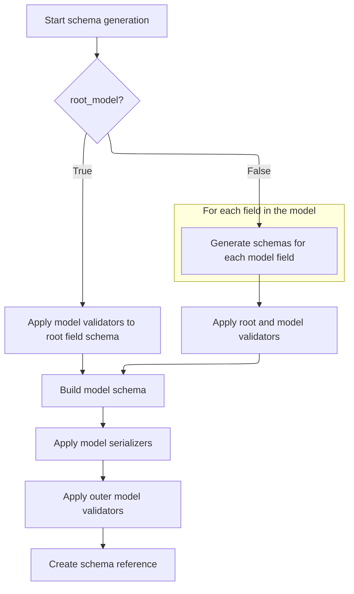

<SwmSnippet path="/pydantic/_internal/_generate_schema.py" line="837">

---

Back in <SwmToken path="pydantic/_internal/_generate_schema.py" pos="736:3:3" line-data="    def _model_schema(self, cls: type[BaseModel]) -&gt; core_schema.CoreSchema:">`_model_schema`</SwmToken>, after handling root models, for regular models we call <SwmToken path="pydantic/_internal/_generate_schema.py" pos="851:7:7" line-data="                        {k: self._generate_md_field_schema(k, v, decorators) for k, v in fields.items()},">`_generate_md_field_schema`</SwmToken> for each field to build up the full schema for all fields, including computed fields and extras. This way, each field's specific logic is included in the model schema.

```python
                    inner_schema = root_field['schema']
                    inner_schema = apply_model_validators(inner_schema, model_validators, 'inner')
                    model_schema = core_schema.model_schema(
                        cls,
                        inner_schema,
                        generic_origin=generic_origin,
                        custom_init=getattr(cls, '__pydantic_custom_init__', None),
                        root_model=True,
                        post_init=getattr(cls, '__pydantic_post_init__', None),
                        config=core_config,
                        ref=model_ref,
                    )
                else:
                    fields_schema: core_schema.CoreSchema = core_schema.model_fields_schema(
                        {k: self._generate_md_field_schema(k, v, decorators) for k, v in fields.items()},
                        computed_fields=[
                            self._computed_field_schema(d, decorators.field_serializers)
                            for d in computed_fields.values()
                        ],
                        extras_schema=extras_schema,
                        extras_keys_schema=extras_keys_schema,
                        model_name=cls.__name__,
                    )
```

---

</SwmSnippet>

<SwmSnippet path="/pydantic/_internal/_generate_schema.py" line="1215">

---

<SwmToken path="pydantic/_internal/_generate_schema.py" pos="1215:3:3" line-data="    def _generate_md_field_schema(">`_generate_md_field_schema`</SwmToken> calls <SwmToken path="pydantic/_internal/_generate_schema.py" pos="1222:7:7" line-data="        common_field = self._common_field_schema(name, field_info, decorators)">`_common_field_schema`</SwmToken> to get all the details for a field, then passes those details to <SwmToken path="pydantic/_internal/_generate_schema.py" pos="1223:3:5" line-data="        return core_schema.model_field(">`core_schema.model_field`</SwmToken> to build the schema for that field. It expects a specific structure from <SwmToken path="pydantic/_internal/_generate_schema.py" pos="1222:7:7" line-data="        common_field = self._common_field_schema(name, field_info, decorators)">`_common_field_schema`</SwmToken> to work.

```python
    def _generate_md_field_schema(
        self,
        name: str,
        field_info: FieldInfo,
        decorators: DecoratorInfos,
    ) -> core_schema.ModelField:
        """Prepare a ModelField to represent a model field."""
        common_field = self._common_field_schema(name, field_info, decorators)
        return core_schema.model_field(
            common_field['schema'],
            serialization_exclude=common_field['serialization_exclude'],
            validation_alias=common_field['validation_alias'],
            serialization_alias=common_field['serialization_alias'],
            frozen=common_field['frozen'],
            metadata=common_field['metadata'],
        )
```

---

</SwmSnippet>

<SwmSnippet path="/pydantic/_internal/_generate_schema.py" line="860">

---

After <SwmToken path="pydantic/_internal/_generate_schema.py" pos="851:7:7" line-data="                        {k: self._generate_md_field_schema(k, v, decorators) for k, v in fields.items()},">`_generate_md_field_schema`</SwmToken> returns for all fields in <SwmToken path="pydantic/_internal/_generate_schema.py" pos="736:3:3" line-data="    def _model_schema(self, cls: type[BaseModel]) -&gt; core_schema.CoreSchema:">`_model_schema`</SwmToken>, we apply model serializers and then outer model validators to the schema. This layering makes sure all serialization and validation logic is included in the right order before returning the final schema reference.

```python
                    inner_schema = apply_validators(fields_schema, decorators.root_validators.values())
                    inner_schema = apply_model_validators(inner_schema, model_validators, 'inner')

                    model_schema = core_schema.model_schema(
                        cls,
                        inner_schema,
                        generic_origin=generic_origin,
                        custom_init=getattr(cls, '__pydantic_custom_init__', None),
                        root_model=False,
                        post_init=getattr(cls, '__pydantic_post_init__', None),
                        config=core_config,
                        ref=model_ref,
                    )

                schema = self._apply_model_serializers(model_schema, decorators.model_serializers.values())
                schema = apply_model_validators(schema, model_validators, 'outer')
                return self.defs.create_definition_reference_schema(schema)
```

---

</SwmSnippet>

### Fallback Type Matching

<SwmSnippet path="/pydantic/_internal/_generate_schema.py" line="1023">

---

After <SwmToken path="pydantic/_internal/_generate_schema.py" pos="736:3:3" line-data="    def _model_schema(self, cls: type[BaseModel]) -&gt; core_schema.CoreSchema:">`_model_schema`</SwmToken> in <SwmToken path="pydantic/_internal/_generate_schema.py" pos="724:7:7" line-data="            schema = self._generate_schema_inner(obj)">`_generate_schema_inner`</SwmToken>, if none of the earlier checks matched, we call <SwmToken path="pydantic/_internal/_generate_schema.py" pos="1023:5:5" line-data="        return self.match_type(obj)">`match_type`</SwmToken> to handle any remaining types and generate the appropriate schema. This is the catch-all for types not handled earlier.

```python
        return self.match_type(obj)
```

---

</SwmSnippet>

## Type-to-Schema Mapping

```mermaid
%%{init: {"flowchart": {"defaultRenderer": "elk"}} }%%
flowchart TD
    node1["Identify the type of the object"]
    click node1 openCode "pydantic/_internal/_generate_schema.py:1025:1137"
    node1 --> node2{"Is it a standard or recognized type?"}
    click node2 openCode "pydantic/_internal/_generate_schema.py:1038:1125"
    node2 -->|"Yes"| node3["Return standard schema"]
    click node3 openCode "pydantic/_internal/_generate_schema.py:1039:1125"
    node2 -->|"No"| node4{"Is it a dataclass?"}
    click node4 openCode "pydantic/_internal/_generate_schema.py:1134:1135"
    node4 -->|"Yes"| node5["Return dataclass schema"]
    click node5 openCode "pydantic/_internal/_generate_schema.py:1135:1135"
    node4 -->|"No"| node6["Return schema for generic, arbitrary, or unknown type"]
    click node6 openCode "pydantic/_internal/_generate_schema.py:1137:1143"


subgraph node3 [_call_schema]
  sgmain_1_node1["Create schema for function arguments"]
  click sgmain_1_node1 openCode "pydantic/_internal/_generate_schema.py:1915:1916"
  sgmain_1_node1 --> sgmain_1_node2{"Validate return value? (config_wrapper.validate_return)"}
  click sgmain_1_node2 openCode "pydantic/_internal/_generate_schema.py:1919:1919"
  sgmain_1_node2 -->|"No"| sgmain_1_node5["Return schema describing how to validate the function call (arguments only)"]
  click sgmain_1_node5 openCode "pydantic/_internal/_generate_schema.py:1929:1933"
  sgmain_1_node2 -->|"Yes"| sgmain_1_node3{"Return type annotated?"}
  click sgmain_1_node3 openCode "pydantic/_internal/_generate_schema.py:1921:1922"
  sgmain_1_node3 -->|"No"| sgmain_1_node5
  sgmain_1_node3 -->|"Yes"| sgmain_1_node4["Create schema for return value"]
  click sgmain_1_node4 openCode "pydantic/_internal/_generate_schema.py:1927:1927"
  sgmain_1_node4 --> sgmain_1_node5["Return schema describing how to validate the function call (arguments + return)"]
  click sgmain_1_node5 openCode "pydantic/_internal/_generate_schema.py:1929:1933"
end

%% Swimm:
%% %%{init: {"flowchart": {"defaultRenderer": "elk"}} }%%
%% flowchart TD
%%     node1["Identify the type of the object"]
%%     click node1 openCode "<SwmPath>[pydantic/\_internal/\_generate_schema.py](pydantic/_internal/_generate_schema.py)</SwmPath>:1025:1137"
%%     node1 --> node2{"Is it a standard or recognized type?"}
%%     click node2 openCode "<SwmPath>[pydantic/\_internal/\_generate_schema.py](pydantic/_internal/_generate_schema.py)</SwmPath>:1038:1125"
%%     node2 -->|"Yes"| node3["Return standard schema"]
%%     click node3 openCode "<SwmPath>[pydantic/\_internal/\_generate_schema.py](pydantic/_internal/_generate_schema.py)</SwmPath>:1039:1125"
%%     node2 -->|"No"| node4{"Is it a dataclass?"}
%%     click node4 openCode "<SwmPath>[pydantic/\_internal/\_generate_schema.py](pydantic/_internal/_generate_schema.py)</SwmPath>:1134:1135"
%%     node4 -->|"Yes"| node5["Return dataclass schema"]
%%     click node5 openCode "<SwmPath>[pydantic/\_internal/\_generate_schema.py](pydantic/_internal/_generate_schema.py)</SwmPath>:1135:1135"
%%     node4 -->|"No"| node6["Return schema for generic, arbitrary, or unknown type"]
%%     click node6 openCode "<SwmPath>[pydantic/\_internal/\_generate_schema.py](pydantic/_internal/_generate_schema.py)</SwmPath>:1137:1143"
%% 
%% 
%% subgraph node3 [<SwmToken path="pydantic/_internal/_generate_schema.py" pos="1126:5:5" line-data="            return self._call_schema(obj)">`_call_schema`</SwmToken>]
%%   sgmain_1_node1["Create schema for function arguments"]
%%   click sgmain_1_node1 openCode "<SwmPath>[pydantic/\_internal/\_generate_schema.py](pydantic/_internal/_generate_schema.py)</SwmPath>:1915:1916"
%%   sgmain_1_node1 --> sgmain_1_node2{"Validate return value? (<SwmToken path="pydantic/_internal/_generate_schema.py" pos="1919:3:5" line-data="        if config_wrapper.validate_return:">`config_wrapper.validate_return`</SwmToken>)"}
%%   click sgmain_1_node2 openCode "<SwmPath>[pydantic/\_internal/\_generate_schema.py](pydantic/_internal/_generate_schema.py)</SwmPath>:1919:1919"
%%   sgmain_1_node2 -->|"No"| sgmain_1_node5["Return schema describing how to validate the function call (arguments only)"]
%%   click sgmain_1_node5 openCode "<SwmPath>[pydantic/\_internal/\_generate_schema.py](pydantic/_internal/_generate_schema.py)</SwmPath>:1929:1933"
%%   sgmain_1_node2 -->|"Yes"| sgmain_1_node3{"Return type annotated?"}
%%   click sgmain_1_node3 openCode "<SwmPath>[pydantic/\_internal/\_generate_schema.py](pydantic/_internal/_generate_schema.py)</SwmPath>:1921:1922"
%%   sgmain_1_node3 -->|"No"| sgmain_1_node5
%%   sgmain_1_node3 -->|"Yes"| sgmain_1_node4["Create schema for return value"]
%%   click sgmain_1_node4 openCode "<SwmPath>[pydantic/\_internal/\_generate_schema.py](pydantic/_internal/_generate_schema.py)</SwmPath>:1927:1927"
%%   sgmain_1_node4 --> sgmain_1_node5["Return schema describing how to validate the function call (arguments + return)"]
%%   click sgmain_1_node5 openCode "<SwmPath>[pydantic/\_internal/\_generate_schema.py](pydantic/_internal/_generate_schema.py)</SwmPath>:1929:1933"
%% end
```

<SwmSnippet path="/pydantic/_internal/_generate_schema.py" line="1025">

---

In <SwmToken path="pydantic/_internal/_generate_schema.py" pos="1025:3:3" line-data="    def match_type(self, obj: Any) -&gt; core_schema.CoreSchema:  # noqa: C901">`match_type`</SwmToken>, we map a bunch of built-in and special types to their corresponding schemas. For types like <SwmToken path="pydantic/_internal/_generate_schema.py" pos="1111:3:3" line-data="            # NewType, can&#39;t use isinstance because it fails &lt;3.10">`NewType`</SwmToken> or Final, we call <SwmToken path="pydantic/_internal/_generate_schema.py" pos="1112:5:5" line-data="            return self.generate_schema(obj.__supertype__)">`generate_schema`</SwmToken> on the underlying type to get the right schema.

```python
    def match_type(self, obj: Any) -> core_schema.CoreSchema:  # noqa: C901
        """Main mapping of types to schemas.

        The general structure is a series of if statements starting with the simple cases
        (non-generic primitive types) and then handling generics and other more complex cases.

        Each case either generates a schema directly, calls into a public user-overridable method
        (like `GenerateSchema.tuple_variable_schema`) or calls into a private method that handles some
        boilerplate before calling into the user-facing method (e.g. `GenerateSchema._tuple_schema`).

        The idea is that we'll evolve this into adding more and more user facing methods over time
        as they get requested and we figure out what the right API for them is.
        """
        if obj is str:
            return core_schema.str_schema()
        elif obj is bytes:
            return core_schema.bytes_schema()
        elif obj is int:
            return core_schema.int_schema()
        elif obj is float:
            return core_schema.float_schema()
        elif obj is bool:
            return core_schema.bool_schema()
        elif obj is complex:
            return core_schema.complex_schema()
        elif typing_objects.is_any(obj) or obj is object:
            return core_schema.any_schema()
        elif obj is datetime.date:
            return core_schema.date_schema()
        elif obj is datetime.datetime:
            return core_schema.datetime_schema()
        elif obj is datetime.time:
            return core_schema.time_schema()
        elif obj is datetime.timedelta:
            return core_schema.timedelta_schema()
        elif obj is Decimal:
            return core_schema.decimal_schema()
        elif obj is UUID:
            return core_schema.uuid_schema()
        elif obj is Url:
            return core_schema.url_schema()
        elif obj is Fraction:
            return self._fraction_schema()
        elif obj is MultiHostUrl:
            return core_schema.multi_host_url_schema()
        elif obj is None or obj is _typing_extra.NoneType:
            return core_schema.none_schema()
        if obj is MISSING:
            return core_schema.missing_sentinel_schema()
        elif obj in IP_TYPES:
            return self._ip_schema(obj)
        elif obj in TUPLE_TYPES:
            return self._tuple_schema(obj)
        elif obj in LIST_TYPES:
            return self._list_schema(Any)
        elif obj in SET_TYPES:
            return self._set_schema(Any)
        elif obj in FROZEN_SET_TYPES:
            return self._frozenset_schema(Any)
        elif obj in SEQUENCE_TYPES:
            return self._sequence_schema(Any)
        elif obj in ITERABLE_TYPES:
            return self._iterable_schema(obj)
        elif obj in DICT_TYPES:
            return self._dict_schema(Any, Any)
        elif obj in PATH_TYPES:
            return self._path_schema(obj, Any)
        elif obj in DEQUE_TYPES:
            return self._deque_schema(Any)
        elif obj in MAPPING_TYPES:
            return self._mapping_schema(obj, Any, Any)
        elif obj in COUNTER_TYPES:
            return self._mapping_schema(obj, Any, int)
        elif typing_objects.is_typealiastype(obj):
            return self._type_alias_type_schema(obj)
        elif obj is type:
            return self._type_schema()
        elif _typing_extra.is_callable(obj):
            return core_schema.callable_schema()
        elif typing_objects.is_literal(get_origin(obj)):
            return self._literal_schema(obj)
        elif is_typeddict(obj):
            return self._typed_dict_schema(obj, None)
        elif _typing_extra.is_namedtuple(obj):
            return self._namedtuple_schema(obj, None)
        elif typing_objects.is_newtype(obj):
            # NewType, can't use isinstance because it fails <3.10
            return self.generate_schema(obj.__supertype__)
        elif obj in PATTERN_TYPES:
            return self._pattern_schema(obj)
        elif _typing_extra.is_hashable(obj):
            return self._hashable_schema()
        elif isinstance(obj, typing.TypeVar):
            return self._unsubstituted_typevar_schema(obj)
        elif _typing_extra.is_finalvar(obj):
            if obj is Final:
                return core_schema.any_schema()
            return self.generate_schema(
                self._get_first_arg_or_any(obj),
            )
        elif isinstance(obj, VALIDATE_CALL_SUPPORTED_TYPES):
```

---

</SwmSnippet>

<SwmSnippet path="/pydantic/_internal/_generate_schema.py" line="1126">

---

Back in <SwmToken path="pydantic/_internal/_generate_schema.py" pos="1023:5:5" line-data="        return self.match_type(obj)">`match_type`</SwmToken>, for types that support validation via calling (like functions), we call <SwmToken path="pydantic/_internal/_generate_schema.py" pos="1126:5:5" line-data="            return self._call_schema(obj)">`_call_schema`</SwmToken> to generate a schema that covers their arguments and return types.

```python
            return self._call_schema(obj)
        elif inspect.isclass(obj) and issubclass(obj, Enum):
            return self._enum_schema(obj)
        elif obj is ZoneInfo:
            return self._zoneinfo_schema()

```

---

</SwmSnippet>

### Callable Schema Generation

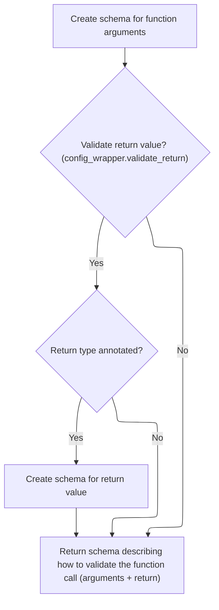

<SwmSnippet path="/pydantic/_internal/_generate_schema.py" line="1910">

---

In <SwmToken path="pydantic/_internal/_generate_schema.py" pos="1910:3:3" line-data="    def _call_schema(self, function: ValidateCallSupportedTypes) -&gt; core_schema.CallSchema:">`_call_schema`</SwmToken>, we start by generating an arguments schema for the function using <SwmToken path="pydantic/_internal/_generate_schema.py" pos="1915:7:7" line-data="        arguments_schema = self._arguments_schema(function)">`_arguments_schema`</SwmToken>. This sets up the expected argument types for validation.

```python
    def _call_schema(self, function: ValidateCallSupportedTypes) -> core_schema.CallSchema:
        """Generate schema for a Callable.

        TODO support functional validators once we support them in Config
        """
        arguments_schema = self._arguments_schema(function)

```

---

</SwmSnippet>

<SwmSnippet path="/pydantic/_internal/_generate_schema.py" line="1917">

---

After <SwmToken path="pydantic/_internal/_generate_schema.py" pos="1915:7:7" line-data="        arguments_schema = self._arguments_schema(function)">`_arguments_schema`</SwmToken> in <SwmToken path="pydantic/_internal/_generate_schema.py" pos="1126:5:5" line-data="            return self._call_schema(obj)">`_call_schema`</SwmToken>, if return value validation is enabled and the function has a return annotation, we generate a schema for the return type using <SwmToken path="pydantic/_internal/_generate_schema.py" pos="1927:7:7" line-data="                return_schema = self.generate_schema(type_hints[&#39;return&#39;])">`generate_schema`</SwmToken>. Then we build the full call schema with arguments, function, and return schema.

```python
        return_schema: core_schema.CoreSchema | None = None
        config_wrapper = self._config_wrapper
        if config_wrapper.validate_return:
            sig = signature(function)
            return_hint = sig.return_annotation
            if return_hint is not sig.empty:
                globalns, localns = self._types_namespace
                type_hints = _typing_extra.get_function_type_hints(
                    function, globalns=globalns, localns=localns, include_keys={'return'}
                )
                return_schema = self.generate_schema(type_hints['return'])

        return core_schema.call_schema(
            arguments_schema,
            function,
            return_schema=return_schema,
        )
```

---

</SwmSnippet>

### Dataclass Type Handling

<SwmSnippet path="/pydantic/_internal/_generate_schema.py" line="1132">

---

Back in <SwmToken path="pydantic/_internal/_generate_schema.py" pos="1023:5:5" line-data="        return self.match_type(obj)">`match_type`</SwmToken>, after handling callables, if the input is a dataclass type, we call <SwmToken path="pydantic/_internal/_generate_schema.py" pos="1135:5:5" line-data="            return self._dataclass_schema(obj, None)  # pyright: ignore[reportArgumentType]">`_dataclass_schema`</SwmToken> to generate a schema that covers all its fields and config.

```python
        # dataclasses.is_dataclass coerces dc instances to types, but we only handle
        # the case of a dc type here
        if dataclasses.is_dataclass(obj):
            return self._dataclass_schema(obj, None)  # pyright: ignore[reportArgumentType]

```

---

</SwmSnippet>

### Dataclass Schema Construction

```mermaid
%%{init: {"flowchart": {"defaultRenderer": "elk"}} }%%
flowchart TD
    node1["Start: Generate schema for dataclass"] --> node2{"Schema or ref exists?"}
    node2 -->|"Yes"| node3["Return existing schema"]
    click node3 openCode "pydantic/_internal/_generate_schema.py:1799:1800"
    node2 -->|"No"| node4{"Is Pydantic dataclass?"}
    node4 -->|"No"| node5["Collect standard dataclass fields"]
    click node5 openCode "pydantic/_internal/_generate_schema.py:1847:1851"
    node5 --> subgraph loop2["For each field: Validate config/field settings (extra=allow)"]
        node10["Check for invalid .hyperlint/styles/config combination"]
        click node10 openCode "pydantic/_internal/_generate_schema.py:1855:1861"
    end
    loop2 --> node11["Apply custom logic (decorators, validators, computed fields)"]
    node4 -->|"Yes"| node6{"Fields complete?"}
    node6 -->|"Yes"| subgraph loop1["For each field: Process field info and typevars"]
        node7["Process field info and apply typevars"]
        click node7 openCode "pydantic/_internal/_generate_schema.py:1830:1835"
    end
    node6 -->|"No"| node8["Rebuild dataclass fields"]
    click node8 openCode "pydantic/_internal/_generate_schema.py:1838:1843"
    loop1 --> node9["Validate config and field settings"]
    node8 --> node9
    node9 --> node11
    node11 --> node12["Create and return schema"]
    click node12 openCode "pydantic/_internal/_generate_schema.py:1893:1908"

%% Swimm:
%% %%{init: {"flowchart": {"defaultRenderer": "elk"}} }%%
%% flowchart TD
%%     node1["Start: Generate schema for dataclass"] --> node2{"Schema or ref exists?"}
%%     node2 -->|"Yes"| node3["Return existing schema"]
%%     click node3 openCode "<SwmPath>[pydantic/\_internal/\_generate_schema.py](pydantic/_internal/_generate_schema.py)</SwmPath>:1799:1800"
%%     node2 -->|"No"| node4{"Is Pydantic dataclass?"}
%%     node4 -->|"No"| node5["Collect standard dataclass fields"]
%%     click node5 openCode "<SwmPath>[pydantic/\_internal/\_generate_schema.py](pydantic/_internal/_generate_schema.py)</SwmPath>:1847:1851"
%%     node5 --> subgraph loop2["For each field: Validate config/field settings (extra=allow)"]
%%         node10["Check for invalid <SwmPath>[.hyperlint/styles/config/](.hyperlint/styles/config/)</SwmPath> combination"]
%%         click node10 openCode "<SwmPath>[pydantic/\_internal/\_generate_schema.py](pydantic/_internal/_generate_schema.py)</SwmPath>:1855:1861"
%%     end
%%     loop2 --> node11["Apply custom logic (decorators, validators, computed fields)"]
%%     node4 -->|"Yes"| node6{"Fields complete?"}
%%     node6 -->|"Yes"| subgraph loop1["For each field: Process field info and typevars"]
%%         node7["Process field info and apply typevars"]
%%         click node7 openCode "<SwmPath>[pydantic/\_internal/\_generate_schema.py](pydantic/_internal/_generate_schema.py)</SwmPath>:1830:1835"
%%     end
%%     node6 -->|"No"| node8["Rebuild dataclass fields"]
%%     click node8 openCode "<SwmPath>[pydantic/\_internal/\_generate_schema.py](pydantic/_internal/_generate_schema.py)</SwmPath>:1838:1843"
%%     loop1 --> node9["Validate config and field settings"]
%%     node8 --> node9
%%     node9 --> node11
%%     node11 --> node12["Create and return schema"]
%%     click node12 openCode "<SwmPath>[pydantic/\_internal/\_generate_schema.py](pydantic/_internal/_generate_schema.py)</SwmPath>:1893:1908"
```

<SwmSnippet path="/pydantic/_internal/_generate_schema.py" line="1788">

---

In <SwmToken path="pydantic/_internal/_generate_schema.py" pos="1788:3:3" line-data="    def _dataclass_schema(">`_dataclass_schema`</SwmToken>, we push the dataclass type to the stack and check for cached schemas or references to avoid redundant work. We handle generic origins, set up config, and either copy, rebuild, or collect field info depending on whether it's a Pydantic dataclass and if fields are complete.

```python
    def _dataclass_schema(
        self, dataclass: type[StandardDataclass], origin: type[StandardDataclass] | None
    ) -> core_schema.CoreSchema:
        """Generate schema for a dataclass."""
        with (
            self.model_type_stack.push(dataclass),
            self.defs.get_schema_or_ref(dataclass) as (
                dataclass_ref,
                maybe_schema,
            ),
        ):
            if maybe_schema is not None:
                return maybe_schema

            schema = dataclass.__dict__.get('__pydantic_core_schema__')
            if schema is not None and not isinstance(schema, MockCoreSchema):
                if schema['type'] == 'definitions':
                    schema = self.defs.unpack_definitions(schema)
                ref = get_ref(schema)
                if ref:
                    return self.defs.create_definition_reference_schema(schema)
                else:
                    return schema

            typevars_map = get_standard_typevars_map(dataclass)
            if origin is not None:
                dataclass = origin

            # if (plain) dataclass doesn't have config, we use the parent's config, hence a default of `None`
            # (Pydantic dataclasses have an empty dict config by default).
            # see https://github.com/pydantic/pydantic/issues/10917
            config = getattr(dataclass, '__pydantic_config__', None)

            from ..dataclasses import is_pydantic_dataclass

            with self._ns_resolver.push(dataclass), self._config_wrapper_stack.push(config):
                if is_pydantic_dataclass(dataclass):
                    if dataclass.__pydantic_fields_complete__():
                        # Copy the field info instances to avoid mutating the `FieldInfo` instances
                        # of the generic dataclass generic origin (e.g. `apply_typevars_map` below).
                        # Note that we don't apply `deepcopy` on `__pydantic_fields__` because we
                        # don't want to copy the `FieldInfo` attributes:
                        fields = {
                            f_name: copy(field_info) for f_name, field_info in dataclass.__pydantic_fields__.items()
                        }
                        if typevars_map:
                            for field in fields.values():
                                field.apply_typevars_map(typevars_map, *self._types_namespace)
```

---

</SwmSnippet>

<SwmSnippet path="/pydantic/_internal/_generate_schema.py" line="1835">

---

After preparing field info in <SwmToken path="pydantic/_internal/_generate_schema.py" pos="1135:5:5" line-data="            return self._dataclass_schema(obj, None)  # pyright: ignore[reportArgumentType]">`_dataclass_schema`</SwmToken>, we check for disallowed config combos, build or update decorators, and generate field schemas for each field using <SwmToken path="pydantic/_internal/_generate_schema.py" pos="1870:4:4" line-data="                    (self._generate_dc_field_schema(k, v, decorators) for k, v in fields.items()),">`_generate_dc_field_schema`</SwmToken>. We sort fields so non-keyword-only ones come first, just like regular dataclasses.

```python
                                field.apply_typevars_map(typevars_map, *self._types_namespace)
                    else:
                        try:
                            fields = rebuild_dataclass_fields(
                                dataclass,
                                config_wrapper=self._config_wrapper,
                                ns_resolver=self._ns_resolver,
                                typevars_map=typevars_map or {},
                            )
                        except NameError as e:
                            raise PydanticUndefinedAnnotation.from_name_error(e) from e
                else:
                    fields = collect_dataclass_fields(
                        dataclass,
                        typevars_map=typevars_map,
                        config_wrapper=self._config_wrapper,
                    )

                if self._config_wrapper.extra == 'allow':
                    # disallow combination of init=False on a dataclass field and extra='allow' on a dataclass
                    for field_name, field in fields.items():
                        if field.init is False:
                            raise PydanticUserError(
                                f'Field {field_name} has `init=False` and dataclass has config setting `extra="allow"`. '
                                f'This combination is not allowed.',
                                code='dataclass-init-false-extra-allow',
                            )

                decorators = dataclass.__dict__.get('__pydantic_decorators__')
                if decorators is None:
                    decorators = DecoratorInfos.build(dataclass)
                    decorators.update_from_config(self._config_wrapper)
                # Move kw_only=False args to the start of the list, as this is how vanilla dataclasses work.
                # Note that when kw_only is missing or None, it is treated as equivalent to kw_only=True
                args = sorted(
                    (self._generate_dc_field_schema(k, v, decorators) for k, v in fields.items()),
                    key=lambda a: a.get('kw_only') is not False,
                )
```

---

</SwmSnippet>

<SwmSnippet path="/pydantic/_internal/_generate_schema.py" line="1232">

---

<SwmToken path="pydantic/_internal/_generate_schema.py" pos="1232:3:3" line-data="    def _generate_dc_field_schema(">`_generate_dc_field_schema`</SwmToken> calls <SwmToken path="pydantic/_internal/_generate_schema.py" pos="1239:7:7" line-data="        common_field = self._common_field_schema(name, field_info, decorators)">`_common_field_schema`</SwmToken> to get all the details for a dataclass field, then passes those to <SwmToken path="pydantic/_internal/_generate_schema.py" pos="1240:3:5" line-data="        return core_schema.dataclass_field(">`core_schema.dataclass_field`</SwmToken> to build the field's schema.

```python
    def _generate_dc_field_schema(
        self,
        name: str,
        field_info: FieldInfo,
        decorators: DecoratorInfos,
    ) -> core_schema.DataclassField:
        """Prepare a DataclassField to represent the parameter/field, of a dataclass."""
        common_field = self._common_field_schema(name, field_info, decorators)
        return core_schema.dataclass_field(
            name,
            common_field['schema'],
            init=field_info.init,
            init_only=field_info.init_var or None,
            kw_only=None if field_info.kw_only else False,
            serialization_exclude=common_field['serialization_exclude'],
            validation_alias=common_field['validation_alias'],
            serialization_alias=common_field['serialization_alias'],
            frozen=common_field['frozen'],
            metadata=common_field['metadata'],
        )
```

---

</SwmSnippet>

<SwmSnippet path="/pydantic/_internal/_generate_schema.py" line="1873">

---

After <SwmToken path="pydantic/_internal/_generate_schema.py" pos="1232:3:3" line-data="    def _generate_dc_field_schema(">`_generate_dc_field_schema`</SwmToken> returns for all fields in <SwmToken path="pydantic/_internal/_generate_schema.py" pos="1135:5:5" line-data="            return self._dataclass_schema(obj, None)  # pyright: ignore[reportArgumentType]">`_dataclass_schema`</SwmToken>, we build the args schema, add computed fields, and collect init-only fields if needed. Then we apply root validators, model validators (inner and outer), and model serializers in order before constructing and returning the final dataclass schema reference.

```python
                has_post_init = hasattr(dataclass, '__post_init__')
                has_slots = hasattr(dataclass, '__slots__')

                args_schema = core_schema.dataclass_args_schema(
                    dataclass.__name__,
                    args,
                    computed_fields=[
                        self._computed_field_schema(d, decorators.field_serializers)
                        for d in decorators.computed_fields.values()
                    ],
                    collect_init_only=has_post_init,
                )

                inner_schema = apply_validators(args_schema, decorators.root_validators.values())

                model_validators = decorators.model_validators.values()
                inner_schema = apply_model_validators(inner_schema, model_validators, 'inner')

                core_config = self._config_wrapper.core_config(title=dataclass.__name__)

                dc_schema = core_schema.dataclass_schema(
                    dataclass,
                    inner_schema,
                    generic_origin=origin,
                    post_init=has_post_init,
                    ref=dataclass_ref,
                    fields=[field.name for field in dataclasses.fields(dataclass)],
                    slots=has_slots,
                    config=core_config,
                    # we don't use a custom __setattr__ for dataclasses, so we must
                    # pass along the frozen config setting to the pydantic-core schema
                    frozen=self._config_wrapper_stack.tail.frozen,
                )
                schema = self._apply_model_serializers(dc_schema, decorators.model_serializers.values())
                schema = apply_model_validators(schema, model_validators, 'outer')
                return self.defs.create_definition_reference_schema(schema)
```

---

</SwmSnippet>

### Generic and Fallback Type Handling

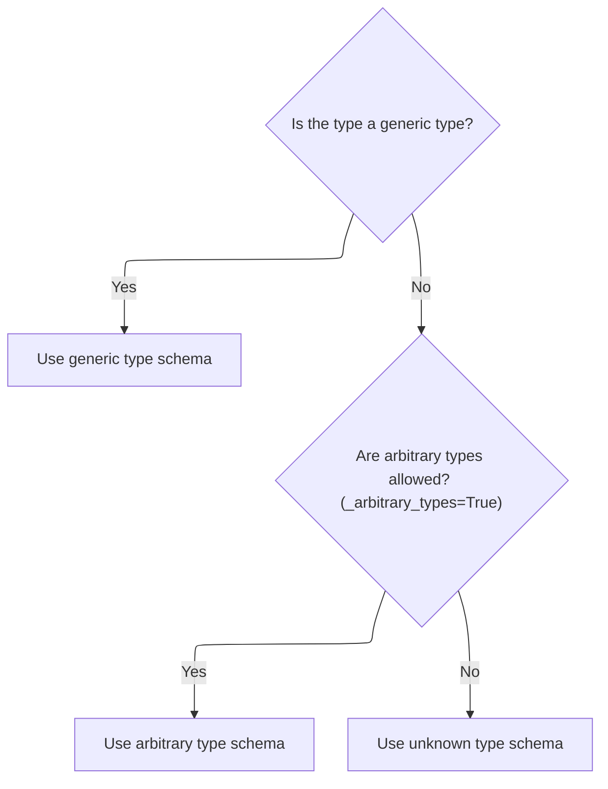

<SwmSnippet path="/pydantic/_internal/_generate_schema.py" line="1137">

---

After returning from <SwmToken path="pydantic/_internal/_generate_schema.py" pos="1135:5:5" line-data="            return self._dataclass_schema(obj, None)  # pyright: ignore[reportArgumentType]">`_dataclass_schema`</SwmToken> in <SwmToken path="pydantic/_internal/_generate_schema.py" pos="1023:5:5" line-data="        return self.match_type(obj)">`match_type`</SwmToken>, we check if the input has an origin (meaning it's a generic type like List\[int\] or Dict\[str, float\]). If so, we call <SwmToken path="pydantic/_internal/_generate_schema.py" pos="1139:5:5" line-data="            return self._match_generic_type(obj, origin)">`_match_generic_type`</SwmToken> to handle these parametrized generics, since they need special logic to generate the right schema. If there's no origin, we fall through to arbitrary or unknown type handling at the end.

```python
        origin = get_origin(obj)
        if origin is not None:
            return self._match_generic_type(obj, origin)

        if self._arbitrary_types:
            return self._arbitrary_type_schema(obj)
        return self._unknown_type_schema(obj)
```

---

</SwmSnippet>

## Generic Type Specialization

```mermaid
%%{init: {"flowchart": {"defaultRenderer": "elk"}} }%%
flowchart TD
    node1["Is the type a dataclass or namedtuple? (origin)"] -->|"Yes"| node2["Generate schema for dataclass or namedtuple"]
    click node1 openCode "pydantic/_internal/_generate_schema.py:1145:1153"
    click node2 openCode "pydantic/_internal/_generate_schema.py:1151:1153"
    node1 -->|"No"| node3["Determine and generate schema for other generic types (origin)"]
    click node3 openCode "pydantic/_internal/_generate_schema.py:1155:1194"


subgraph node2 [_namedtuple_schema]
  sgmain_1_node1["Start: Generate schema for NamedTuple class (namedtuple_cls)"] --> sgmain_1_node2{"Schema already exists for this NamedTuple?"}
  click sgmain_1_node1 openCode "pydantic/_internal/_generate_schema.py:1488:1489"
  sgmain_1_node2 -->|"Yes"| sgmain_1_node3["Return existing schema"]
  click sgmain_1_node2 openCode "pydantic/_internal/_generate_schema.py:1497:1498"
  click sgmain_1_node3 openCode "pydantic/_internal/_generate_schema.py:1498:1498"
  sgmain_1_node2 -->|"No"| sgmain_1_node4["Resolve field type annotations (annotations)"]
  click sgmain_1_node4 openCode "pydantic/_internal/_generate_schema.py:1503:1505"
  sgmain_1_node4 --> sgmain_1_node5{"Are annotations present?"}
  click sgmain_1_node5 openCode "pydantic/_internal/_generate_schema.py:1507:1509"
  sgmain_1_node5 -->|"No"| sgmain_1_node6["Treat all fields as generic types (Any)"]
  click sgmain_1_node6 openCode "pydantic/_internal/_generate_schema.py:1509:1509"
  sgmain_1_node5 -->|"Yes"| sgmain_1_node7["Use field annotations"]
  click sgmain_1_node7 openCode "pydantic/_internal/_generate_schema.py:1504:1505"
  sgmain_1_node6 --> sgmain_1_node8{"Are type variables present? (typevars_map)"}
  click sgmain_1_node8 openCode "pydantic/_internal/_generate_schema.py:1511:1515"
  sgmain_1_node7 --> sgmain_1_node8
  sgmain_1_node8 -->|"Yes"| sgmain_1_node9["Replace type variables with concrete types"]
  click sgmain_1_node9 openCode "pydantic/_internal/_generate_schema.py:1512:1515"
  sgmain_1_node8 -->|"No"| sgmain_1_node10["Use resolved annotations"]
  click sgmain_1_node10 openCode "pydantic/_internal/_generate_schema.py:1516:1516"
  subgraph sgmain_1_loop1["For each field in NamedTuple"]
  sgmain_1_node11["Generate parameter schema for field"]
  click sgmain_1_node11 openCode "pydantic/_internal/_generate_schema.py:1517:1526"
  end
  sgmain_1_node9 --> sgmain_1_node11
  sgmain_1_node10 --> sgmain_1_node11
  sgmain_1_node11 --> sgmain_1_node12["Assemble and return NamedTuple schema"]
  click sgmain_1_node12 openCode "pydantic/_internal/_generate_schema.py:1529:1530"
end

%% Swimm:
%% %%{init: {"flowchart": {"defaultRenderer": "elk"}} }%%
%% flowchart TD
%%     node1["Is the type a dataclass or namedtuple? (origin)"] -->|"Yes"| node2["Generate schema for dataclass or namedtuple"]
%%     click node1 openCode "<SwmPath>[pydantic/\_internal/\_generate_schema.py](pydantic/_internal/_generate_schema.py)</SwmPath>:1145:1153"
%%     click node2 openCode "<SwmPath>[pydantic/\_internal/\_generate_schema.py](pydantic/_internal/_generate_schema.py)</SwmPath>:1151:1153"
%%     node1 -->|"No"| node3["Determine and generate schema for other generic types (origin)"]
%%     click node3 openCode "<SwmPath>[pydantic/\_internal/\_generate_schema.py](pydantic/_internal/_generate_schema.py)</SwmPath>:1155:1194"
%% 
%% 
%% subgraph node2 [<SwmToken path="pydantic/_internal/_generate_schema.py" pos="1109:5:5" line-data="            return self._namedtuple_schema(obj, None)">`_namedtuple_schema`</SwmToken>]
%%   sgmain_1_node1["Start: Generate schema for <SwmToken path="pydantic/_internal/_generate_schema.py" pos="1489:12:12" line-data="        &quot;&quot;&quot;Generate schema for a NamedTuple.&quot;&quot;&quot;">`NamedTuple`</SwmToken> class (<SwmToken path="pydantic/_internal/_generate_schema.py" pos="1488:8:8" line-data="    def _namedtuple_schema(self, namedtuple_cls: Any, origin: Any) -&gt; core_schema.CoreSchema:">`namedtuple_cls`</SwmToken>)"] --> sgmain_1_node2{"Schema already exists for this <SwmToken path="pydantic/_internal/_generate_schema.py" pos="1489:12:12" line-data="        &quot;&quot;&quot;Generate schema for a NamedTuple.&quot;&quot;&quot;">`NamedTuple`</SwmToken>?"}
%%   click sgmain_1_node1 openCode "<SwmPath>[pydantic/\_internal/\_generate_schema.py](pydantic/_internal/_generate_schema.py)</SwmPath>:1488:1489"
%%   sgmain_1_node2 -->|"Yes"| sgmain_1_node3["Return existing schema"]
%%   click sgmain_1_node2 openCode "<SwmPath>[pydantic/\_internal/\_generate_schema.py](pydantic/_internal/_generate_schema.py)</SwmPath>:1497:1498"
%%   click sgmain_1_node3 openCode "<SwmPath>[pydantic/\_internal/\_generate_schema.py](pydantic/_internal/_generate_schema.py)</SwmPath>:1498:1498"
%%   sgmain_1_node2 -->|"No"| sgmain_1_node4["Resolve field type annotations (annotations)"]
%%   click sgmain_1_node4 openCode "<SwmPath>[pydantic/\_internal/\_generate_schema.py](pydantic/_internal/_generate_schema.py)</SwmPath>:1503:1505"
%%   sgmain_1_node4 --> sgmain_1_node5{"Are annotations present?"}
%%   click sgmain_1_node5 openCode "<SwmPath>[pydantic/\_internal/\_generate_schema.py](pydantic/_internal/_generate_schema.py)</SwmPath>:1507:1509"
%%   sgmain_1_node5 -->|"No"| sgmain_1_node6["Treat all fields as generic types (Any)"]
%%   click sgmain_1_node6 openCode "<SwmPath>[pydantic/\_internal/\_generate_schema.py](pydantic/_internal/_generate_schema.py)</SwmPath>:1509:1509"
%%   sgmain_1_node5 -->|"Yes"| sgmain_1_node7["Use field annotations"]
%%   click sgmain_1_node7 openCode "<SwmPath>[pydantic/\_internal/\_generate_schema.py](pydantic/_internal/_generate_schema.py)</SwmPath>:1504:1505"
%%   sgmain_1_node6 --> sgmain_1_node8{"Are type variables present? (<SwmToken path="pydantic/_internal/_generate_schema.py" pos="782:1:1" line-data="                            typevars_map=self._typevars_map or {},">`typevars_map`</SwmToken>)"}
%%   click sgmain_1_node8 openCode "<SwmPath>[pydantic/\_internal/\_generate_schema.py](pydantic/_internal/_generate_schema.py)</SwmPath>:1511:1515"
%%   sgmain_1_node7 --> sgmain_1_node8
%%   sgmain_1_node8 -->|"Yes"| sgmain_1_node9["Replace type variables with concrete types"]
%%   click sgmain_1_node9 openCode "<SwmPath>[pydantic/\_internal/\_generate_schema.py](pydantic/_internal/_generate_schema.py)</SwmPath>:1512:1515"
%%   sgmain_1_node8 -->|"No"| sgmain_1_node10["Use resolved annotations"]
%%   click sgmain_1_node10 openCode "<SwmPath>[pydantic/\_internal/\_generate_schema.py](pydantic/_internal/_generate_schema.py)</SwmPath>:1516:1516"
%%   subgraph sgmain_1_loop1["For each field in <SwmToken path="pydantic/_internal/_generate_schema.py" pos="1489:12:12" line-data="        &quot;&quot;&quot;Generate schema for a NamedTuple.&quot;&quot;&quot;">`NamedTuple`</SwmToken>"]
%%   sgmain_1_node11["Generate parameter schema for field"]
%%   click sgmain_1_node11 openCode "<SwmPath>[pydantic/\_internal/\_generate_schema.py](pydantic/_internal/_generate_schema.py)</SwmPath>:1517:1526"
%%   end
%%   sgmain_1_node9 --> sgmain_1_node11
%%   sgmain_1_node10 --> sgmain_1_node11
%%   sgmain_1_node11 --> sgmain_1_node12["Assemble and return <SwmToken path="pydantic/_internal/_generate_schema.py" pos="1489:12:12" line-data="        &quot;&quot;&quot;Generate schema for a NamedTuple.&quot;&quot;&quot;">`NamedTuple`</SwmToken> schema"]
%%   click sgmain_1_node12 openCode "<SwmPath>[pydantic/\_internal/\_generate_schema.py](pydantic/_internal/_generate_schema.py)</SwmPath>:1529:1530"
%% end
```

<SwmSnippet path="/pydantic/_internal/_generate_schema.py" line="1145">

---

In <SwmToken path="pydantic/_internal/_generate_schema.py" pos="1145:3:3" line-data="    def _match_generic_type(self, obj: Any, origin: Any) -&gt; CoreSchema:  # noqa: C901">`_match_generic_type`</SwmToken>, we first check if the origin is a dataclass. If it is, we call <SwmToken path="pydantic/_internal/_generate_schema.py" pos="1151:5:5" line-data="            return self._dataclass_schema(obj, origin)  # pyright: ignore[reportArgumentType]">`_dataclass_schema`</SwmToken> to generate the schema for that specific parametrization, since generic dataclasses need to be handled before any other generic logic to avoid losing type information.

```python
    def _match_generic_type(self, obj: Any, origin: Any) -> CoreSchema:  # noqa: C901
        # Need to handle generic dataclasses before looking for the schema properties because attribute accesses
        # on _GenericAlias delegate to the origin type, so lose the information about the concrete parametrization
        # As a result, currently, there is no way to cache the schema for generic dataclasses. This may be possible
        # to resolve by modifying the value returned by `Generic.__class_getitem__`, but that is a dangerous game.
        if dataclasses.is_dataclass(origin):
            return self._dataclass_schema(obj, origin)  # pyright: ignore[reportArgumentType]
```

---

</SwmSnippet>

<SwmSnippet path="/pydantic/_internal/_generate_schema.py" line="1152">

---

After returning from <SwmToken path="pydantic/_internal/_generate_schema.py" pos="1135:5:5" line-data="            return self._dataclass_schema(obj, None)  # pyright: ignore[reportArgumentType]">`_dataclass_schema`</SwmToken> in <SwmToken path="pydantic/_internal/_generate_schema.py" pos="1139:5:5" line-data="            return self._match_generic_type(obj, origin)">`_match_generic_type`</SwmToken>, we check if the origin is a namedtuple. If it is, we call <SwmToken path="pydantic/_internal/_generate_schema.py" pos="1153:5:5" line-data="            return self._namedtuple_schema(obj, origin)">`_namedtuple_schema`</SwmToken> to generate the schema for namedtuples, which need their own handling separate from dataclasses and other generics.

```python
        if _typing_extra.is_namedtuple(origin):
            return self._namedtuple_schema(obj, origin)

```

---

</SwmSnippet>

### <SwmToken path="pydantic/_internal/_generate_schema.py" pos="1489:12:12" line-data="        &quot;&quot;&quot;Generate schema for a NamedTuple.&quot;&quot;&quot;">`NamedTuple`</SwmToken> Schema Generation

```mermaid
%%{init: {"flowchart": {"defaultRenderer": "elk"}} }%%
flowchart TD
    node1["Start: Generate schema for NamedTuple class (namedtuple_cls)"] --> node2{"Schema already exists for this NamedTuple?"}
    click node1 openCode "pydantic/_internal/_generate_schema.py:1488:1489"
    node2 -->|"Yes"| node3["Return existing schema"]
    click node2 openCode "pydantic/_internal/_generate_schema.py:1497:1498"
    click node3 openCode "pydantic/_internal/_generate_schema.py:1498:1498"
    node2 -->|"No"| node4["Resolve field type annotations (annotations)"]
    click node4 openCode "pydantic/_internal/_generate_schema.py:1503:1505"
    node4 --> node5{"Are annotations present?"}
    click node5 openCode "pydantic/_internal/_generate_schema.py:1507:1509"
    node5 -->|"No"| node6["Treat all fields as generic types (Any)"]
    click node6 openCode "pydantic/_internal/_generate_schema.py:1509:1509"
    node5 -->|"Yes"| node7["Use field annotations"]
    click node7 openCode "pydantic/_internal/_generate_schema.py:1504:1505"
    node6 --> node8{"Are type variables present? (typevars_map)"}
    click node8 openCode "pydantic/_internal/_generate_schema.py:1511:1515"
    node7 --> node8
    node8 -->|"Yes"| node9["Replace type variables with concrete types"]
    click node9 openCode "pydantic/_internal/_generate_schema.py:1512:1515"
    node8 -->|"No"| node10["Use resolved annotations"]
    click node10 openCode "pydantic/_internal/_generate_schema.py:1516:1516"
    subgraph loop1["For each field in NamedTuple"]
      node11["Generate parameter schema for field"]
      click node11 openCode "pydantic/_internal/_generate_schema.py:1517:1526"
    end
    node9 --> node11
    node10 --> node11
    node11 --> node12["Assemble and return NamedTuple schema"]
    click node12 openCode "pydantic/_internal/_generate_schema.py:1529:1530"

%% Swimm:
%% %%{init: {"flowchart": {"defaultRenderer": "elk"}} }%%
%% flowchart TD
%%     node1["Start: Generate schema for <SwmToken path="pydantic/_internal/_generate_schema.py" pos="1489:12:12" line-data="        &quot;&quot;&quot;Generate schema for a NamedTuple.&quot;&quot;&quot;">`NamedTuple`</SwmToken> class (<SwmToken path="pydantic/_internal/_generate_schema.py" pos="1488:8:8" line-data="    def _namedtuple_schema(self, namedtuple_cls: Any, origin: Any) -&gt; core_schema.CoreSchema:">`namedtuple_cls`</SwmToken>)"] --> node2{"Schema already exists for this <SwmToken path="pydantic/_internal/_generate_schema.py" pos="1489:12:12" line-data="        &quot;&quot;&quot;Generate schema for a NamedTuple.&quot;&quot;&quot;">`NamedTuple`</SwmToken>?"}
%%     click node1 openCode "<SwmPath>[pydantic/\_internal/\_generate_schema.py](pydantic/_internal/_generate_schema.py)</SwmPath>:1488:1489"
%%     node2 -->|"Yes"| node3["Return existing schema"]
%%     click node2 openCode "<SwmPath>[pydantic/\_internal/\_generate_schema.py](pydantic/_internal/_generate_schema.py)</SwmPath>:1497:1498"
%%     click node3 openCode "<SwmPath>[pydantic/\_internal/\_generate_schema.py](pydantic/_internal/_generate_schema.py)</SwmPath>:1498:1498"
%%     node2 -->|"No"| node4["Resolve field type annotations (annotations)"]
%%     click node4 openCode "<SwmPath>[pydantic/\_internal/\_generate_schema.py](pydantic/_internal/_generate_schema.py)</SwmPath>:1503:1505"
%%     node4 --> node5{"Are annotations present?"}
%%     click node5 openCode "<SwmPath>[pydantic/\_internal/\_generate_schema.py](pydantic/_internal/_generate_schema.py)</SwmPath>:1507:1509"
%%     node5 -->|"No"| node6["Treat all fields as generic types (Any)"]
%%     click node6 openCode "<SwmPath>[pydantic/\_internal/\_generate_schema.py](pydantic/_internal/_generate_schema.py)</SwmPath>:1509:1509"
%%     node5 -->|"Yes"| node7["Use field annotations"]
%%     click node7 openCode "<SwmPath>[pydantic/\_internal/\_generate_schema.py](pydantic/_internal/_generate_schema.py)</SwmPath>:1504:1505"
%%     node6 --> node8{"Are type variables present? (<SwmToken path="pydantic/_internal/_generate_schema.py" pos="782:1:1" line-data="                            typevars_map=self._typevars_map or {},">`typevars_map`</SwmToken>)"}
%%     click node8 openCode "<SwmPath>[pydantic/\_internal/\_generate_schema.py](pydantic/_internal/_generate_schema.py)</SwmPath>:1511:1515"
%%     node7 --> node8
%%     node8 -->|"Yes"| node9["Replace type variables with concrete types"]
%%     click node9 openCode "<SwmPath>[pydantic/\_internal/\_generate_schema.py](pydantic/_internal/_generate_schema.py)</SwmPath>:1512:1515"
%%     node8 -->|"No"| node10["Use resolved annotations"]
%%     click node10 openCode "<SwmPath>[pydantic/\_internal/\_generate_schema.py](pydantic/_internal/_generate_schema.py)</SwmPath>:1516:1516"
%%     subgraph loop1["For each field in <SwmToken path="pydantic/_internal/_generate_schema.py" pos="1489:12:12" line-data="        &quot;&quot;&quot;Generate schema for a NamedTuple.&quot;&quot;&quot;">`NamedTuple`</SwmToken>"]
%%       node11["Generate parameter schema for field"]
%%       click node11 openCode "<SwmPath>[pydantic/\_internal/\_generate_schema.py](pydantic/_internal/_generate_schema.py)</SwmPath>:1517:1526"
%%     end
%%     node9 --> node11
%%     node10 --> node11
%%     node11 --> node12["Assemble and return <SwmToken path="pydantic/_internal/_generate_schema.py" pos="1489:12:12" line-data="        &quot;&quot;&quot;Generate schema for a NamedTuple.&quot;&quot;&quot;">`NamedTuple`</SwmToken> schema"]
%%     click node12 openCode "<SwmPath>[pydantic/\_internal/\_generate_schema.py](pydantic/_internal/_generate_schema.py)</SwmPath>:1529:1530"
```

<SwmSnippet path="/pydantic/_internal/_generate_schema.py" line="1488">

---

In <SwmToken path="pydantic/_internal/_generate_schema.py" pos="1488:3:3" line-data="    def _namedtuple_schema(self, namedtuple_cls: Any, origin: Any) -&gt; core_schema.CoreSchema:">`_namedtuple_schema`</SwmToken>, we generate parameter schemas for each field to capture their types and defaults.

```python
    def _namedtuple_schema(self, namedtuple_cls: Any, origin: Any) -> core_schema.CoreSchema:
        """Generate schema for a NamedTuple."""
        with (
            self.model_type_stack.push(namedtuple_cls),
            self.defs.get_schema_or_ref(namedtuple_cls) as (
                namedtuple_ref,
                maybe_schema,
            ),
        ):
            if maybe_schema is not None:
                return maybe_schema
            typevars_map = get_standard_typevars_map(namedtuple_cls)
            if origin is not None:
                namedtuple_cls = origin

            try:
                annotations = _typing_extra.get_cls_type_hints(namedtuple_cls, ns_resolver=self._ns_resolver)
            except NameError as e:
                raise PydanticUndefinedAnnotation.from_name_error(e) from e
            if not annotations:
                # annotations is empty, happens if namedtuple_cls defined via collections.namedtuple(...)
                annotations: dict[str, Any] = {k: Any for k in namedtuple_cls._fields}

            if typevars_map:
                annotations = {
                    field_name: replace_types(annotation, typevars_map)
                    for field_name, annotation in annotations.items()
                }

            arguments_schema = core_schema.arguments_schema(
                [
                    self._generate_parameter_schema(
                        field_name,
                        annotation,
                        source=AnnotationSource.NAMED_TUPLE,
                        default=namedtuple_cls._field_defaults.get(field_name, Parameter.empty),
                    )
                    for field_name, annotation in annotations.items()
                ],
                metadata={'pydantic_js_prefer_positional_arguments': True},
            )
```

---

</SwmSnippet>

<SwmSnippet path="/pydantic/_internal/_generate_schema.py" line="1529">

---

After generating field schemas, <SwmToken path="pydantic/_internal/_generate_schema.py" pos="1109:5:5" line-data="            return self._namedtuple_schema(obj, None)">`_namedtuple_schema`</SwmToken> builds and wraps the call schema for reuse and generic support.

```python
            schema = core_schema.call_schema(arguments_schema, namedtuple_cls, ref=namedtuple_ref)
            return self.defs.create_definition_reference_schema(schema)
```

---

</SwmSnippet>

### Other Generic Type Handling

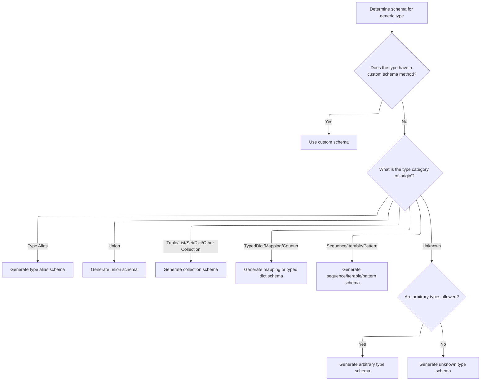

<SwmSnippet path="/pydantic/_internal/_generate_schema.py" line="1155">

---

After handling namedtuples in <SwmToken path="pydantic/_internal/_generate_schema.py" pos="1139:5:5" line-data="            return self._match_generic_type(obj, origin)">`_match_generic_type`</SwmToken>, we check for a bunch of other generic types. If the origin is a <SwmToken path="pydantic/_internal/_generate_schema.py" pos="718:8:8" line-data="                - If `typing.TypedDict` is used instead of `typing_extensions.TypedDict` on Python &lt; 3.12.">`TypedDict`</SwmToken>, we call <SwmToken path="pydantic/_internal/_generate_schema.py" pos="1182:5:5" line-data="            return self._typed_dict_schema(obj, origin)">`_typed_dict_schema`</SwmToken> to generate a schema that captures its required/optional fields and type annotations, since TypedDicts need their own handling.

```python
        schema = self._generate_schema_from_get_schema_method(origin, obj)
        if schema is not None:
            return schema

        if typing_objects.is_typealiastype(origin):
            return self._type_alias_type_schema(obj)
        elif is_union_origin(origin):
            return self._union_schema(obj)
        elif origin in TUPLE_TYPES:
            return self._tuple_schema(obj)
        elif origin in LIST_TYPES:
            return self._list_schema(self._get_first_arg_or_any(obj))
        elif origin in SET_TYPES:
            return self._set_schema(self._get_first_arg_or_any(obj))
        elif origin in FROZEN_SET_TYPES:
            return self._frozenset_schema(self._get_first_arg_or_any(obj))
        elif origin in DICT_TYPES:
            return self._dict_schema(*self._get_first_two_args_or_any(obj))
        elif origin in PATH_TYPES:
            return self._path_schema(origin, self._get_first_arg_or_any(obj))
        elif origin in DEQUE_TYPES:
            return self._deque_schema(self._get_first_arg_or_any(obj))
        elif origin in MAPPING_TYPES:
            return self._mapping_schema(origin, *self._get_first_two_args_or_any(obj))
        elif origin in COUNTER_TYPES:
            return self._mapping_schema(origin, self._get_first_arg_or_any(obj), int)
        elif is_typeddict(origin):
            return self._typed_dict_schema(obj, origin)
        elif origin in TYPE_TYPES:
            return self._subclass_schema(obj)
        elif origin in SEQUENCE_TYPES:
            return self._sequence_schema(self._get_first_arg_or_any(obj))
        elif origin in ITERABLE_TYPES:
            return self._iterable_schema(obj)
        elif origin in PATTERN_TYPES:
            return self._pattern_schema(obj)

        if self._arbitrary_types:
            return self._arbitrary_type_schema(origin)
        return self._unknown_type_schema(obj)
```

---

</SwmSnippet>

## <SwmToken path="pydantic/_internal/_generate_schema.py" pos="718:8:8" line-data="                - If `typing.TypedDict` is used instead of `typing_extensions.TypedDict` on Python &lt; 3.12.">`TypedDict`</SwmToken> Schema Construction

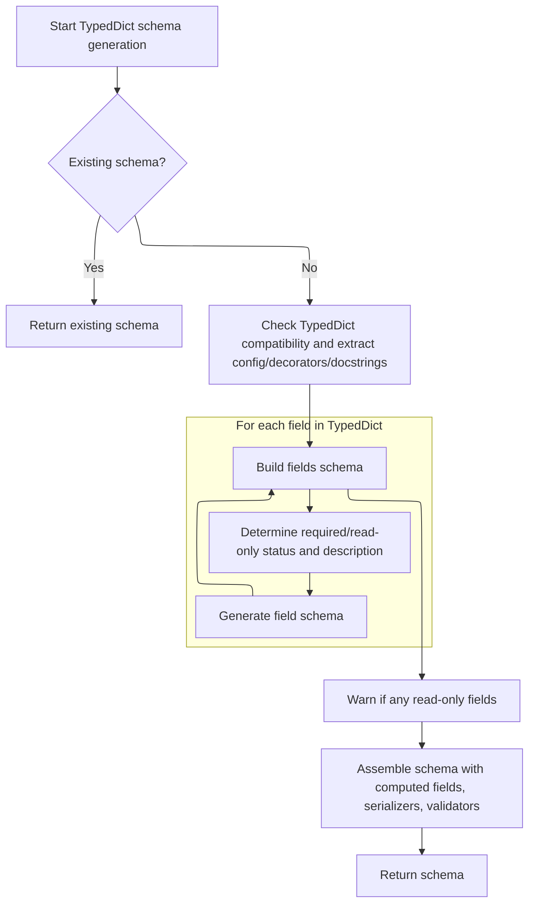

<SwmSnippet path="/pydantic/_internal/_generate_schema.py" line="1380">

---

In <SwmToken path="pydantic/_internal/_generate_schema.py" pos="1380:3:3" line-data="    def _typed_dict_schema(self, typed_dict_cls: Any, origin: Any) -&gt; core_schema.CoreSchema:">`_typed_dict_schema`</SwmToken>, we handle Python version compatibility, config inheritance, and extract type hints and docstrings for each field. For every field, we generate a schema using <SwmToken path="pydantic/_internal/_generate_schema.py" pos="1459:10:10" line-data="                    fields[field_name] = self._generate_td_field_schema(">`_generate_td_field_schema`</SwmToken>, so each field's type, required status, and metadata are captured in the final schema.

```python
    def _typed_dict_schema(self, typed_dict_cls: Any, origin: Any) -> core_schema.CoreSchema:
        """Generate a core schema for a `TypedDict` class.

        To be able to build a `DecoratorInfos` instance for the `TypedDict` class (which will include
        validators, serializers, etc.), we need to have access to the original bases of the class
        (see https://docs.python.org/3/library/types.html#types.get_original_bases).
        However, the `__orig_bases__` attribute was only added in 3.12 (https://github.com/python/cpython/pull/103698).

        For this reason, we require Python 3.12 (or using the `typing_extensions` backport).
        """
        FieldInfo = import_cached_field_info()

        with (
            self.model_type_stack.push(typed_dict_cls),
            self.defs.get_schema_or_ref(typed_dict_cls) as (
                typed_dict_ref,
                maybe_schema,
            ),
        ):
            if maybe_schema is not None:
                return maybe_schema

            typevars_map = get_standard_typevars_map(typed_dict_cls)
            if origin is not None:
                typed_dict_cls = origin

            if not _SUPPORTS_TYPEDDICT and type(typed_dict_cls).__module__ == 'typing':
                raise PydanticUserError(
                    'Please use `typing_extensions.TypedDict` instead of `typing.TypedDict` on Python < 3.12.',
                    code='typed-dict-version',
                )

            try:
                # if a typed dictionary class doesn't have config, we use the parent's config, hence a default of `None`
                # see https://github.com/pydantic/pydantic/issues/10917
                config: ConfigDict | None = get_attribute_from_bases(typed_dict_cls, '__pydantic_config__')
            except AttributeError:
                config = None

            with self._config_wrapper_stack.push(config):
                core_config = self._config_wrapper.core_config(title=typed_dict_cls.__name__)

                required_keys: frozenset[str] = typed_dict_cls.__required_keys__

                fields: dict[str, core_schema.TypedDictField] = {}

                decorators = DecoratorInfos.build(typed_dict_cls)
                decorators.update_from_config(self._config_wrapper)

                if self._config_wrapper.use_attribute_docstrings:
                    field_docstrings = extract_docstrings_from_cls(typed_dict_cls, use_inspect=True)
                else:
                    field_docstrings = None

                try:
                    annotations = _typing_extra.get_cls_type_hints(typed_dict_cls, ns_resolver=self._ns_resolver)
                except NameError as e:
                    raise PydanticUndefinedAnnotation.from_name_error(e) from e

                readonly_fields: list[str] = []

                for field_name, annotation in annotations.items():
                    field_info = FieldInfo.from_annotation(annotation, _source=AnnotationSource.TYPED_DICT)
                    field_info.annotation = replace_types(field_info.annotation, typevars_map)

                    required = (
                        field_name in required_keys or 'required' in field_info._qualifiers
                    ) and 'not_required' not in field_info._qualifiers
                    if 'read_only' in field_info._qualifiers:
                        readonly_fields.append(field_name)

                    if (
                        field_docstrings is not None
                        and field_info.description is None
                        and field_name in field_docstrings
                    ):
                        field_info.description = field_docstrings[field_name]
                    update_field_from_config(self._config_wrapper, field_name, field_info)

                    fields[field_name] = self._generate_td_field_schema(
                        field_name, field_info, decorators, required=required
                    )

```

---

</SwmSnippet>

<SwmSnippet path="/pydantic/_internal/_generate_schema.py" line="1196">

---

<SwmToken path="pydantic/_internal/_generate_schema.py" pos="1196:3:3" line-data="    def _generate_td_field_schema(">`_generate_td_field_schema`</SwmToken> calls <SwmToken path="pydantic/_internal/_generate_schema.py" pos="1205:7:7" line-data="        common_field = self._common_field_schema(name, field_info, decorators)">`_common_field_schema`</SwmToken> to build out the schema, validation, and serialization logic for each field. This keeps field handling consistent and reusable.

```python
    def _generate_td_field_schema(
        self,
        name: str,
        field_info: FieldInfo,
        decorators: DecoratorInfos,
        *,
        required: bool = True,
    ) -> core_schema.TypedDictField:
        """Prepare a TypedDictField to represent a model or typeddict field."""
        common_field = self._common_field_schema(name, field_info, decorators)
        return core_schema.typed_dict_field(
            common_field['schema'],
            required=False if not field_info.is_required() else required,
            serialization_exclude=common_field['serialization_exclude'],
            validation_alias=common_field['validation_alias'],
            serialization_alias=common_field['serialization_alias'],
            metadata=common_field['metadata'],
        )
```

---

</SwmSnippet>

<SwmSnippet path="/pydantic/_internal/_generate_schema.py" line="1463">

---

After generating all the field schemas in <SwmToken path="pydantic/_internal/_generate_schema.py" pos="1107:5:5" line-data="            return self._typed_dict_schema(obj, None)">`_typed_dict_schema`</SwmToken>, we warn about read-only fields, build the full <SwmToken path="pydantic/_internal/_generate_schema.py" pos="1473:7:7" line-data="                td_schema = core_schema.typed_dict_schema(">`typed_dict_schema`</SwmToken>, and then apply any model serializers and validators. Finally, we wrap the schema in a definition reference for reuse.

```python
                if readonly_fields:
                    fields_repr = ', '.join(repr(f) for f in readonly_fields)
                    plural = len(readonly_fields) >= 2
                    warnings.warn(
                        f'Item{"s" if plural else ""} {fields_repr} on TypedDict class {typed_dict_cls.__name__!r} '
                        f'{"are" if plural else "is"} using the `ReadOnly` qualifier. Pydantic will not protect items '
                        'from any mutation on dictionary instances.',
                        UserWarning,
                    )

                td_schema = core_schema.typed_dict_schema(
                    fields,
                    cls=typed_dict_cls,
                    computed_fields=[
                        self._computed_field_schema(d, decorators.field_serializers)
                        for d in decorators.computed_fields.values()
                    ],
                    ref=typed_dict_ref,
                    config=core_config,
                )

                schema = self._apply_model_serializers(td_schema, decorators.model_serializers.values())
                schema = apply_model_validators(schema, decorators.model_validators.values(), 'all')
                return self.defs.create_definition_reference_schema(schema)
```

---

</SwmSnippet>

&nbsp;

*This is an auto-generated document by Swimm 🌊 and has not yet been verified by a human*

<SwmMeta version="3.0.0" repo-id="Z2l0aHViJTNBJTNBcHlkYW50aWMlM0ElM0FTd2ltbS1EZW1v" repo-name="pydantic"><sup>Powered by [Swimm](/)</sup></SwmMeta>
