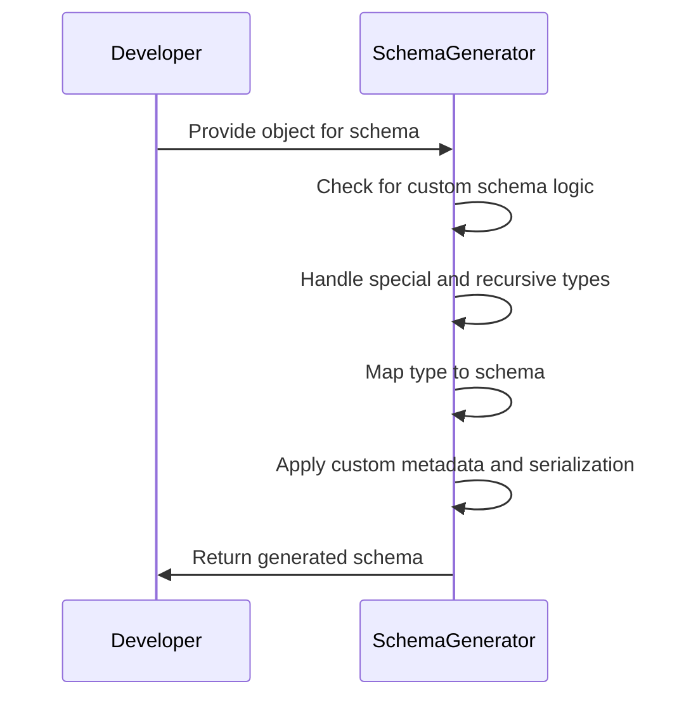
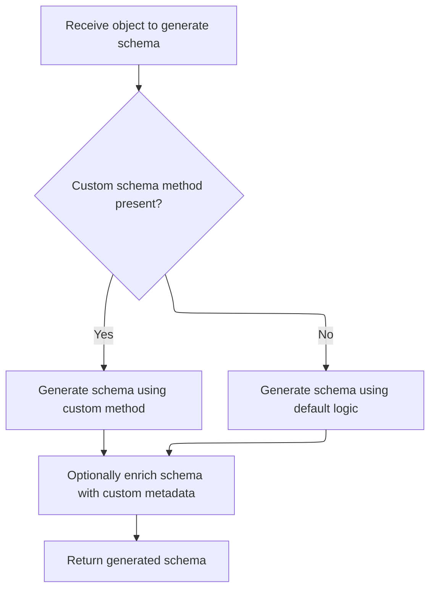
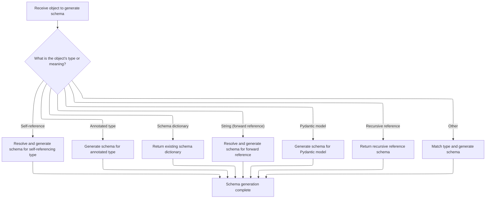
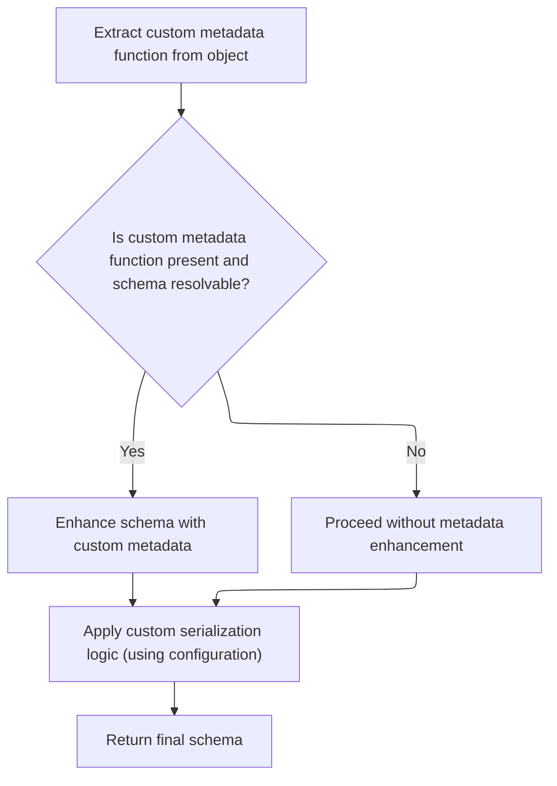

Schema generation produces a structured schema for a given Python object, supporting both standard and custom types, including advanced cases like recursion and custom metadata. The process involves checking for custom schema logic, determining the object's type, mapping it to the correct schema, applying any customizations, and returning the final schema.

The main steps are:

- Receive the object to generate a schema for
- Check for custom schema methods
- Handle special and recursive types
- Map the type to a schema
- Finalize and customize the schema
- Return the generated schema



# Spec

## Detailed View of the Program's Functionality

a. Starting Schema Generation

The schema generation process begins when an object is received for which a schema needs to be generated. The main entry point for this is a method that takes the object and attempts to generate a "core schema" for it. The first step is to check if the object provides a custom schema generation method. If such a method exists, it is called to generate the schema. If not, the process falls back to the default internal logic for schema generation.

b. Handling Special and Recursive Types

If the default logic is used, the process first checks for several special cases:

- If the object represents a self-reference (used for recursive types), it resolves the reference to the actual type.
- If the object is an "Annotated" type (a type with extra metadata), it generates a schema that incorporates the annotations.
- If the object is already a dictionary (assumed to be a schema), it is returned as-is.
- If the object is a string (used for forward references), it is converted into a forward reference object and resolved recursively.
- If the object is a forward reference, it is resolved to the actual type and schema generation is called recursively.

After these checks, the process determines if the object is a subclass of a Pydantic model. If so, it manages recursion using a stack and generates the model's schema. If the object is a recursive reference, a reference schema is returned. For all other cases, the process proceeds to match the type and generate the appropriate schema.

c. Mapping Types to Schemas

The next phase involves mapping the input type to a corresponding schema. This is done through a series of conditional checks:

- For simple types (such as strings, integers, floats, booleans, etc.), the corresponding simple schema is returned.
- For special or complex types (such as dates, UUIDs, URLs, IP addresses, etc.), specialized schema generation methods are called.
- For collection types (such as tuples, lists, sets, dictionaries, etc.), the schema is generated for the collection and its item types.
- For generic types (types with parameters, like List\[int\]), the process delegates to a handler that can process the generic type and its parameters.
- For dataclasses, a schema specific to dataclasses is generated.
- For user-defined or arbitrary types, a schema is generated that allows instances of the type.
- If the type is unknown and not handled by any of the above, a fallback schema is generated, or an error is raised if arbitrary types are not allowed.

d. Finalizing and Customizing the Schema

Once the core schema is generated, the process checks if the object provides a custom metadata function for JSON schema generation. If such a function exists and the schema can be resolved, the schema is enhanced with this custom metadata. If not, the process proceeds without metadata enhancement.

Next, the process applies any custom serialization logic, using configuration-provided JSON encoders. If a matching encoder is found for the type or its superclasses, it is attached to the schema for use during serialization.

Finally, the fully constructed and customized schema is returned as the result of the schema generation process. This schema can now be used for validation, serialization, and documentation purposes within Pydantic.

# Rule Definition

| Paragraph Name                                                                                                                                                                                                                                                                                                                                                                                                                                                                  | Rule ID | Category          | Description                                                                                                                                                                                                                                                                                                                                                                                                                                                                                                                                                                                                                                                                                                                                                                                                                                                                                                                                                                                        | Conditions                                                                                                     | Remarks                                                                                                                                                                                                                                                                                                                                                                                                                                                                                                |
| ------------------------------------------------------------------------------------------------------------------------------------------------------------------------------------------------------------------------------------------------------------------------------------------------------------------------------------------------------------------------------------------------------------------------------------------------------------------------------- | ------- | ----------------- | -------------------------------------------------------------------------------------------------------------------------------------------------------------------------------------------------------------------------------------------------------------------------------------------------------------------------------------------------------------------------------------------------------------------------------------------------------------------------------------------------------------------------------------------------------------------------------------------------------------------------------------------------------------------------------------------------------------------------------------------------------------------------------------------------------------------------------------------------------------------------------------------------------------------------------------------------------------------------------------------------- | -------------------------------------------------------------------------------------------------------------- | ------------------------------------------------------------------------------------------------------------------------------------------------------------------------------------------------------------------------------------------------------------------------------------------------------------------------------------------------------------------------------------------------------------------------------------------------------------------------------------------------------ |
| GenerateSchema.generate_schema, GenerateSchema.\_generate_schema_inner, GenerateSchema.match_type, GenerateSchema.\_match_generic_type                                                                                                                                                                                                                                                                                                                                          | RL-001  | Data Assignment   | The schema generation system must accept any input object (type, class, typing object, or string representing a forward reference) and produce a nested dictionary (core schema) describing how to validate and serialize that type. The output must always be a dictionary (or nested dictionaries/lists) with a 'type' key and other keys as required by the input type.                                                                                                                                                                                                                                                                                                                                                                                                                                                                                                                                                                                                                         | Any input object is provided to the schema generation system.                                                  | The output format is always a dictionary (possibly nested) with at least a 'type' key. For recursive types, references may be included. The schema may include metadata and serialization logic as needed.                                                                                                                                                                                                                                                                                             |
| GenerateSchema.generate_schema, GenerateSchema.\_generate_schema_inner, GenerateSchema.\_resolve_forward_ref, \_Definitions.get_schema_or_ref, \_Definitions.create_definition_reference_schema                                                                                                                                                                                                                                                                                 | RL-002  | Conditional Logic | The system must support recursive handling of forward references, allowing types that refer to themselves or are not yet defined to be resolved and included in the schema. Recursive or self-referential types must be represented using a <SwmToken path="pydantic/_internal/_generate_schema.py" pos="924:18:20" line-data="            # Note: if schema is of type `&#39;definition-ref&#39;`, we might want to copy it as a">`definition-ref`</SwmToken> schema with a <SwmToken path="pydantic/_internal/_generate_schema.py" pos="1021:7:7" line-data="            return core_schema.definition_reference_schema(schema_ref=obj.type_ref)">`schema_ref`</SwmToken> key referencing the type name.                                                                                                                                                                                                                                                                                         | Input object is a forward reference or a type that refers to itself (directly or indirectly).                  | Recursive types are represented as {'type': <SwmToken path="pydantic/_internal/_generate_schema.py" pos="924:18:20" line-data="            # Note: if schema is of type `&#39;definition-ref&#39;`, we might want to copy it as a">`definition-ref`</SwmToken>, <SwmToken path="pydantic/_internal/_generate_schema.py" pos="1021:7:7" line-data="            return core_schema.definition_reference_schema(schema_ref=obj.type_ref)">`schema_ref`</SwmToken>: <type_name>} in the schema dictionary. |
| GenerateSchema.generate_schema, GenerateSchema.\_generate_schema_from_get_schema_method                                                                                                                                                                                                                                                                                                                                                                                         | RL-003  | Conditional Logic | If the input object defines a custom schema method named **get_pydantic_core_schema**, the system must call this method with two arguments: the source object and a handler object (<SwmToken path="pydantic/_internal/_generate_schema.py" pos="59:7:7" line-data="from ..annotated_handlers import GetCoreSchemaHandler, GetJsonSchemaHandler">`GetCoreSchemaHandler`</SwmToken>). The custom schema method must return a valid core schema dictionary. If not present, the system must use the default schema generation logic.                                                                                                                                                                                                                                                                                                                                                                                                                                                                 | Input object has a **get_pydantic_core_schema** method.                                                        | The method is called as obj.**get_pydantic_core_schema**(source, handler). The returned value must be a valid core schema dictionary.                                                                                                                                                                                                                                                                                                                                                                  |
| GenerateSchema.generate_schema, <SwmToken path="pydantic/_internal/_generate_schema.py" pos="726:5:5" line-data="        metadata_js_function = _extract_get_pydantic_json_schema(obj)">`_extract_get_pydantic_json_schema`</SwmToken>, GenerateSchema.\_add_js_function                                                                                                                                                                                                        | RL-004  | Conditional Logic | If the input object defines a custom JSON schema enrichment method named **get_pydantic_json_schema**, the system must attach this method to the generated schema’s metadata under a key (such as <SwmToken path="pydantic/_internal/_generate_schema.py" pos="433:5:5" line-data="                metadata={&#39;pydantic_js_functions&#39;: [get_json_schema]},">`pydantic_js_functions`</SwmToken>), so that it can be invoked later for JSON schema enrichment. The enrichment method must accept two arguments: the current schema and a handler object, and must return a JSON-serializable schema dictionary.                                                                                                                                                                                                                                                                                                                                                                               | Input object has a **get_pydantic_json_schema** method.                                                        | The enrichment method is attached to the schema's metadata under <SwmToken path="pydantic/_internal/_generate_schema.py" pos="433:5:5" line-data="                metadata={&#39;pydantic_js_functions&#39;: [get_json_schema]},">`pydantic_js_functions`</SwmToken>. The method signature is (schema, handler) -> dict.                                                                                                                                                                               |
| GenerateSchema.match_type, GenerateSchema.\_match_generic_type, GenerateSchema.\_model_schema, GenerateSchema.\_typed_dict_schema, GenerateSchema.\_dataclass_schema, GenerateSchema.\_enum_schema, <SwmToken path="pydantic/_internal/_generate_schema.py" pos="2169:10:12" line-data="        This gets called by `GenerateSchema._annotated_schema` but differs from it in that it does">`GenerateSchema._annotated_schema`</SwmToken>, GenerateSchema.\_unknown_type_schema | RL-005  | Computation       | The system must handle the following input types and produce the corresponding schema structures: built-in types (<SwmToken path="pydantic/_internal/_generate_schema.py" pos="1033:18:20" line-data="        boilerplate before calling into the user-facing method (e.g. `GenerateSchema._tuple_schema`).">`e.g`</SwmToken>., int, str), collection types (<SwmToken path="pydantic/_internal/_generate_schema.py" pos="1033:18:20" line-data="        boilerplate before calling into the user-facing method (e.g. `GenerateSchema._tuple_schema`).">`e.g`</SwmToken>., List\[int\]), user-defined models (subclasses of <SwmToken path="pydantic/_internal/_generate_schema.py" pos="1014:1:1" line-data="        BaseModel = import_cached_base_model()">`BaseModel`</SwmToken>), recursive/self-referential types, annotated types, schema dictionaries passed as input, and unknown/arbitrary types. Each type must map to a specific schema dictionary structure as described in the spec. | Input object matches a known type category (built-in, collection, model, recursive, annotated, dict, unknown). | \- Built-in types: {'type': <type_name>} (<SwmToken path="pydantic/_internal/_generate_schema.py" pos="1033:18:20" line-data="        boilerplate before calling into the user-facing method (e.g. `GenerateSchema._tuple_schema`).">`e.g`</SwmToken>., {'type': 'int'})                                                                                                                                                                                                                               |

- Collections: {'type': 'list', <SwmToken path="pydantic/_internal/_generate_schema.py" pos="259:4:4" line-data="            schema[&#39;items_schema&#39;][variadic_item_index] = apply_validators(">`items_schema`</SwmToken>: ...}
- Models: {'type': 'model', 'cls': <model_class>, 'schema': ...}
- Recursive: {'type': <SwmToken path="pydantic/_internal/_generate_schema.py" pos="924:18:20" line-data="            # Note: if schema is of type `&#39;definition-ref&#39;`, we might want to copy it as a">`definition-ref`</SwmToken>, <SwmToken path="pydantic/_internal/_generate_schema.py" pos="1021:7:7" line-data="            return core_schema.definition_reference_schema(schema_ref=obj.type_ref)">`schema_ref`</SwmToken>: <type_name>}
- Annotated: schema includes additional metadata/constraints
- Schema dict: returned as-is
- Unknown: {'type': 'unknown'} or raises error if not allowed | | GenerateSchema.generate_schema, GenerateSchema.\_add_js_function, GenerateSchema.\_apply_annotations, GenerateSchema.\_apply_single_annotation_json_schema | RL-006 | Data Assignment | The system must support the attachment of custom metadata enrichment functions to the schema’s metadata, allowing for later invocation to modify or enrich the schema (<SwmToken path="pydantic/_internal/_generate_schema.py" pos="1033:18:20" line-data="        boilerplate before calling into the user-facing method (e.g. `GenerateSchema._tuple_schema`).">`e.g`</SwmToken>., for documentation or OpenAPI generation). | Custom metadata enrichment functions are provided or detected on the input type or annotations. | Metadata enrichment functions are attached under <SwmToken path="pydantic/_internal/_generate_schema.py" pos="433:5:5" line-data="                metadata={&#39;pydantic_js_functions&#39;: [get_json_schema]},">`pydantic_js_functions`</SwmToken> in the schema's metadata. | | GenerateSchema.generate_schema, <SwmToken path="pydantic/_internal/_generate_schema.py" pos="732:5:5" line-data="        schema = _add_custom_serialization_from_json_encoders(self._config_wrapper.json_encoders, obj, schema)">`_add_custom_serialization_from_json_encoders`</SwmToken>, GenerateSchema.\_apply_field_serializers, GenerateSchema.\_apply_model_serializers | RL-007 | Computation | The schema generation system must apply any custom serialization logic (such as custom JSON encoders from configuration) to the schema before returning it. | Custom serialization logic or JSON encoders are defined in the configuration or on the type. | Custom serialization logic is attached to the schema under the 'serialization' key. Deprecated <SwmToken path="pydantic/_internal/_generate_schema.py" pos="732:11:11" line-data="        schema = _add_custom_serialization_from_json_encoders(self._config_wrapper.json_encoders, obj, schema)">`json_encoders`</SwmToken> are supported with a warning. | | GenerateSchema.\_unknown_type_schema, GenerateSchema.generate_schema, GenerateSchema.match_type, GenerateSchema.\_match_generic_type | RL-008 | Conditional Logic | The schema generation system must ensure that, for every input, a valid schema dictionary is produced, even if the type is not explicitly handled (by falling back to an unknown type schema or raising a controlled error). | Input type is not explicitly handled by any other rule. | Unknown types produce a schema with 'type': 'unknown', or raise <SwmToken path="pydantic/_internal/_generate_schema.py" pos="712:1:1" line-data="            PydanticSchemaGenerationError:">`PydanticSchemaGenerationError`</SwmToken> if <SwmToken path="pydantic/_internal/_generate_schema.py" pos="374:7:7" line-data="        return self._config_wrapper.arbitrary_types_allowed">`arbitrary_types_allowed`</SwmToken> is not set. | | GenerateSchema.\_model_schema, GenerateSchema.generate_schema, GenerateSchema.\_generate_schema_from_get_schema_method | RL-009 | Conditional Logic | The schema generation system must not require the implementation of <SwmToken path="pydantic/_internal/_generate_schema.py" pos="1014:1:1" line-data="        BaseModel = import_cached_base_model()">`BaseModel`</SwmToken> or <SwmToken path="pydantic/_internal/_generate_schema.py" pos="700:5:7" line-data="    ) -&gt; core_schema.CoreSchema:">`core_schema.CoreSchema`</SwmToken>, but must assume their existence or provide minimal stubs/interfaces as needed for schema generation. | Schema generation is invoked for a type that does not implement <SwmToken path="pydantic/_internal/_generate_schema.py" pos="1014:1:1" line-data="        BaseModel = import_cached_base_model()">`BaseModel`</SwmToken> or <SwmToken path="pydantic/_internal/_generate_schema.py" pos="700:5:7" line-data="    ) -&gt; core_schema.CoreSchema:">`core_schema.CoreSchema`</SwmToken>. | The system imports or assumes the existence of <SwmToken path="pydantic/_internal/_generate_schema.py" pos="1014:1:1" line-data="        BaseModel = import_cached_base_model()">`BaseModel`</SwmToken> and <SwmToken path="pydantic/_internal/_generate_schema.py" pos="700:5:7" line-data="    ) -&gt; core_schema.CoreSchema:">`core_schema.CoreSchema`</SwmToken>, but does not require user types to implement them. |

# User Stories

## User Story 1: Robust and extensible schema generation for all input types

---

### Story Description:

As a user or system, I want to generate a schema for any Python type, class, or object—including recursive, self-referential, and unknown types—and have custom serialization logic applied, so that I can validate and serialize data consistently and always receive a valid, extensible schema dictionary.

---

### Business Rule Mapping:

| Rule ID | Paragraph Name                                                                                                                                                                                                                                                                                                                                                                                                                                                                  | Rule Description                                                                                                                                                                                                                                                                                                                                                                                                                                                                                                                                                                                                                                                                                                                                                                                                                                                                                                                                                                                   |
| ------- | ------------------------------------------------------------------------------------------------------------------------------------------------------------------------------------------------------------------------------------------------------------------------------------------------------------------------------------------------------------------------------------------------------------------------------------------------------------------------------- | -------------------------------------------------------------------------------------------------------------------------------------------------------------------------------------------------------------------------------------------------------------------------------------------------------------------------------------------------------------------------------------------------------------------------------------------------------------------------------------------------------------------------------------------------------------------------------------------------------------------------------------------------------------------------------------------------------------------------------------------------------------------------------------------------------------------------------------------------------------------------------------------------------------------------------------------------------------------------------------------------- |
| RL-001  | GenerateSchema.generate_schema, GenerateSchema.\_generate_schema_inner, GenerateSchema.match_type, GenerateSchema.\_match_generic_type                                                                                                                                                                                                                                                                                                                                          | The schema generation system must accept any input object (type, class, typing object, or string representing a forward reference) and produce a nested dictionary (core schema) describing how to validate and serialize that type. The output must always be a dictionary (or nested dictionaries/lists) with a 'type' key and other keys as required by the input type.                                                                                                                                                                                                                                                                                                                                                                                                                                                                                                                                                                                                                         |
| RL-002  | GenerateSchema.generate_schema, GenerateSchema.\_generate_schema_inner, GenerateSchema.\_resolve_forward_ref, \_Definitions.get_schema_or_ref, \_Definitions.create_definition_reference_schema                                                                                                                                                                                                                                                                                 | The system must support recursive handling of forward references, allowing types that refer to themselves or are not yet defined to be resolved and included in the schema. Recursive or self-referential types must be represented using a <SwmToken path="pydantic/_internal/_generate_schema.py" pos="924:18:20" line-data="            # Note: if schema is of type `&#39;definition-ref&#39;`, we might want to copy it as a">`definition-ref`</SwmToken> schema with a <SwmToken path="pydantic/_internal/_generate_schema.py" pos="1021:7:7" line-data="            return core_schema.definition_reference_schema(schema_ref=obj.type_ref)">`schema_ref`</SwmToken> key referencing the type name.                                                                                                                                                                                                                                                                                         |
| RL-007  | GenerateSchema.generate_schema, <SwmToken path="pydantic/_internal/_generate_schema.py" pos="732:5:5" line-data="        schema = _add_custom_serialization_from_json_encoders(self._config_wrapper.json_encoders, obj, schema)">`_add_custom_serialization_from_json_encoders`</SwmToken>, GenerateSchema.\_apply_field_serializers, GenerateSchema.\_apply_model_serializers                                                                                                  | The schema generation system must apply any custom serialization logic (such as custom JSON encoders from configuration) to the schema before returning it.                                                                                                                                                                                                                                                                                                                                                                                                                                                                                                                                                                                                                                                                                                                                                                                                                                        |
| RL-005  | GenerateSchema.match_type, GenerateSchema.\_match_generic_type, GenerateSchema.\_model_schema, GenerateSchema.\_typed_dict_schema, GenerateSchema.\_dataclass_schema, GenerateSchema.\_enum_schema, <SwmToken path="pydantic/_internal/_generate_schema.py" pos="2169:10:12" line-data="        This gets called by `GenerateSchema._annotated_schema` but differs from it in that it does">`GenerateSchema._annotated_schema`</SwmToken>, GenerateSchema.\_unknown_type_schema | The system must handle the following input types and produce the corresponding schema structures: built-in types (<SwmToken path="pydantic/_internal/_generate_schema.py" pos="1033:18:20" line-data="        boilerplate before calling into the user-facing method (e.g. `GenerateSchema._tuple_schema`).">`e.g`</SwmToken>., int, str), collection types (<SwmToken path="pydantic/_internal/_generate_schema.py" pos="1033:18:20" line-data="        boilerplate before calling into the user-facing method (e.g. `GenerateSchema._tuple_schema`).">`e.g`</SwmToken>., List\[int\]), user-defined models (subclasses of <SwmToken path="pydantic/_internal/_generate_schema.py" pos="1014:1:1" line-data="        BaseModel = import_cached_base_model()">`BaseModel`</SwmToken>), recursive/self-referential types, annotated types, schema dictionaries passed as input, and unknown/arbitrary types. Each type must map to a specific schema dictionary structure as described in the spec. |
| RL-008  | GenerateSchema.\_unknown_type_schema, GenerateSchema.generate_schema, GenerateSchema.match_type, GenerateSchema.\_match_generic_type                                                                                                                                                                                                                                                                                                                                            | The schema generation system must ensure that, for every input, a valid schema dictionary is produced, even if the type is not explicitly handled (by falling back to an unknown type schema or raising a controlled error).                                                                                                                                                                                                                                                                                                                                                                                                                                                                                                                                                                                                                                                                                                                                                                       |
| RL-009  | GenerateSchema.\_model_schema, GenerateSchema.generate_schema, GenerateSchema.\_generate_schema_from_get_schema_method                                                                                                                                                                                                                                                                                                                                                          | The schema generation system must not require the implementation of <SwmToken path="pydantic/_internal/_generate_schema.py" pos="1014:1:1" line-data="        BaseModel = import_cached_base_model()">`BaseModel`</SwmToken> or <SwmToken path="pydantic/_internal/_generate_schema.py" pos="700:5:7" line-data="    ) -&gt; core_schema.CoreSchema:">`core_schema.CoreSchema`</SwmToken>, but must assume their existence or provide minimal stubs/interfaces as needed for schema generation.                                                                                                                                                                                                                                                                                                                                                                                                                                                                                                    |

---

### Relevant Functionality:

- **GenerateSchema.generate_schema**
  1. **RL-001:**
     - Accept input object (type/class/typing object/string)
     - If string, convert to <SwmToken path="pydantic/_internal/_generate_schema.py" pos="1009:5:5" line-data="            obj = ForwardRef(obj)">`ForwardRef`</SwmToken>
     - If <SwmToken path="pydantic/_internal/_generate_schema.py" pos="1009:5:5" line-data="            obj = ForwardRef(obj)">`ForwardRef`</SwmToken>, resolve and recurse
     - Generate schema as a dictionary with 'type' and other relevant keys
     - Always return a dictionary, even for unknown types
  2. **RL-002:**
     - If input is a <SwmToken path="pydantic/_internal/_generate_schema.py" pos="1009:5:5" line-data="            obj = ForwardRef(obj)">`ForwardRef`</SwmToken>, resolve it using the namespace
     - If type is already being processed (recursion detected), yield a <SwmToken path="pydantic/_internal/_generate_schema.py" pos="924:18:20" line-data="            # Note: if schema is of type `&#39;definition-ref&#39;`, we might want to copy it as a">`definition-ref`</SwmToken> schema
     - Otherwise, generate schema and store reference
     - For recursive/self-referential types, use <SwmToken path="pydantic/_internal/_generate_schema.py" pos="924:18:20" line-data="            # Note: if schema is of type `&#39;definition-ref&#39;`, we might want to copy it as a">`definition-ref`</SwmToken> with <SwmToken path="pydantic/_internal/_generate_schema.py" pos="1021:7:7" line-data="            return core_schema.definition_reference_schema(schema_ref=obj.type_ref)">`schema_ref`</SwmToken>
  3. **RL-007:**
     - Check for custom serialization logic or JSON encoders
     - If present, attach serialization logic to the schema under 'serialization'
     - Warn if using deprecated <SwmToken path="pydantic/_internal/_generate_schema.py" pos="732:11:11" line-data="        schema = _add_custom_serialization_from_json_encoders(self._config_wrapper.json_encoders, obj, schema)">`json_encoders`</SwmToken>
     - Ensure serialization logic is applied before returning schema
- **GenerateSchema.match_type**
  1. **RL-005:**
     - If input is a built-in type, return schema with 'type' key
     - If input is a collection, generate schema for items and wrap in collection schema
     - If input is a user-defined model, generate model schema with fields and nested schemas
     - If input is recursive/self-referential, use <SwmToken path="pydantic/_internal/_generate_schema.py" pos="924:18:20" line-data="            # Note: if schema is of type `&#39;definition-ref&#39;`, we might want to copy it as a">`definition-ref`</SwmToken> schema
     - If input is annotated, include metadata/constraints
     - If input is a dict, return as-is
     - If input is unknown, return 'unknown' schema or raise error
- **GenerateSchema.\_unknown_type_schema**
  1. **RL-008:**
     - If input type is not handled, check if <SwmToken path="pydantic/_internal/_generate_schema.py" pos="374:7:7" line-data="        return self._config_wrapper.arbitrary_types_allowed">`arbitrary_types_allowed`</SwmToken> is set
     - If so, use arbitrary type schema
     - If not, produce 'unknown' schema or raise error
- **GenerateSchema.\_model_schema**
  1. **RL-009:**
     - Import or assume existence of <SwmToken path="pydantic/_internal/_generate_schema.py" pos="1014:1:1" line-data="        BaseModel = import_cached_base_model()">`BaseModel`</SwmToken> and <SwmToken path="pydantic/_internal/_generate_schema.py" pos="700:5:7" line-data="    ) -&gt; core_schema.CoreSchema:">`core_schema.CoreSchema`</SwmToken>
     - Do not require user types to implement these
     - Provide minimal stubs/interfaces if needed for schema generation

## User Story 2: Support for custom schema and metadata enrichment

---

### Story Description:

As a user or system, I want to provide custom schema generation and metadata enrichment methods so that I can customize or extend the generated schema for advanced use cases such as documentation or OpenAPI generation.

---

### Business Rule Mapping:

| Rule ID | Paragraph Name                                                                                                                                                                                                                                                           | Rule Description                                                                                                                                                                                                                                                                                                                                                                                                                                                                                                                                                                                                     |
| ------- | ------------------------------------------------------------------------------------------------------------------------------------------------------------------------------------------------------------------------------------------------------------------------ | -------------------------------------------------------------------------------------------------------------------------------------------------------------------------------------------------------------------------------------------------------------------------------------------------------------------------------------------------------------------------------------------------------------------------------------------------------------------------------------------------------------------------------------------------------------------------------------------------------------------- |
| RL-003  | GenerateSchema.generate_schema, GenerateSchema.\_generate_schema_from_get_schema_method                                                                                                                                                                                  | If the input object defines a custom schema method named **get_pydantic_core_schema**, the system must call this method with two arguments: the source object and a handler object (<SwmToken path="pydantic/_internal/_generate_schema.py" pos="59:7:7" line-data="from ..annotated_handlers import GetCoreSchemaHandler, GetJsonSchemaHandler">`GetCoreSchemaHandler`</SwmToken>). The custom schema method must return a valid core schema dictionary. If not present, the system must use the default schema generation logic.                                                                                   |
| RL-004  | GenerateSchema.generate_schema, <SwmToken path="pydantic/_internal/_generate_schema.py" pos="726:5:5" line-data="        metadata_js_function = _extract_get_pydantic_json_schema(obj)">`_extract_get_pydantic_json_schema`</SwmToken>, GenerateSchema.\_add_js_function | If the input object defines a custom JSON schema enrichment method named **get_pydantic_json_schema**, the system must attach this method to the generated schema’s metadata under a key (such as <SwmToken path="pydantic/_internal/_generate_schema.py" pos="433:5:5" line-data="                metadata={&#39;pydantic_js_functions&#39;: [get_json_schema]},">`pydantic_js_functions`</SwmToken>), so that it can be invoked later for JSON schema enrichment. The enrichment method must accept two arguments: the current schema and a handler object, and must return a JSON-serializable schema dictionary. |
| RL-006  | GenerateSchema.generate_schema, GenerateSchema.\_add_js_function, GenerateSchema.\_apply_annotations, GenerateSchema.\_apply_single_annotation_json_schema                                                                                                               | The system must support the attachment of custom metadata enrichment functions to the schema’s metadata, allowing for later invocation to modify or enrich the schema (<SwmToken path="pydantic/_internal/_generate_schema.py" pos="1033:18:20" line-data="        boilerplate before calling into the user-facing method (e.g. `GenerateSchema._tuple_schema`).">`e.g`</SwmToken>., for documentation or OpenAPI generation).                                                                                                                                                                                       |

---

### Relevant Functionality:

- **GenerateSchema.generate_schema**
  1. **RL-003:**
     - Check for **get_pydantic_core_schema** on input object
     - If present, call it with (source, handler)
     - If returned schema has 'type' == 'definitions', unpack definitions
     - If schema has a reference, create a definition reference schema
     - Otherwise, use returned schema
     - If not present, proceed with default schema generation
  2. **RL-004:**
     - Check for **get_pydantic_json_schema** on input object
     - If present, attach it to the schema's metadata under <SwmToken path="pydantic/_internal/_generate_schema.py" pos="433:5:5" line-data="                metadata={&#39;pydantic_js_functions&#39;: [get_json_schema]},">`pydantic_js_functions`</SwmToken>
     - Ensure it can be invoked later for JSON schema enrichment
  3. **RL-006:**
     - Detect custom metadata enrichment functions
     - Attach them to the schema's metadata under <SwmToken path="pydantic/_internal/_generate_schema.py" pos="433:5:5" line-data="                metadata={&#39;pydantic_js_functions&#39;: [get_json_schema]},">`pydantic_js_functions`</SwmToken>
     - Ensure they are available for later invocation

# Code Walkthrough

## Starting schema generation



<SwmSnippet path="/pydantic/_internal/_generate_schema.py" line="697">

---

In <SwmToken path="pydantic/_internal/_generate_schema.py" pos="697:3:3" line-data="    def generate_schema(">`generate_schema`</SwmToken>, we first check for a custom schema method, and if that's not available, we move on to the internal schema generation logic by calling <SwmToken path="pydantic/_internal/_generate_schema.py" pos="724:7:7" line-data="            schema = self._generate_schema_inner(obj)">`_generate_schema_inner`</SwmToken>.

```python
    def generate_schema(
        self,
        obj: Any,
    ) -> core_schema.CoreSchema:
        """Generate core schema.

        Args:
            obj: The object to generate core schema for.

        Returns:
            The generated core schema.

        Raises:
            PydanticUndefinedAnnotation:
                If it is not possible to evaluate forward reference.
            PydanticSchemaGenerationError:
                If it is not possible to generate pydantic-core schema.
            TypeError:
                - If `alias_generator` returns a disallowed type (must be str, AliasPath or AliasChoices).
                - If V1 style validator with `each_item=True` applied on a wrong field.
            PydanticUserError:
                - If `typing.TypedDict` is used instead of `typing_extensions.TypedDict` on Python < 3.12.
                - If `__modify_schema__` method is used instead of `__get_pydantic_json_schema__`.
        """
        schema = self._generate_schema_from_get_schema_method(obj, obj)

        if schema is None:
            schema = self._generate_schema_inner(obj)

```

---

</SwmSnippet>

### Handling special and recursive types



<SwmSnippet path="/pydantic/_internal/_generate_schema.py" line="997">

---

In <SwmToken path="pydantic/_internal/_generate_schema.py" pos="997:3:3" line-data="    def _generate_schema_inner(self, obj: Any) -&gt; core_schema.CoreSchema:">`_generate_schema_inner`</SwmToken>, we handle special cases up front: resolving 'self' types for recursion, handling annotated types for extra metadata, and shortcutting if the input is already a schema dict. If the input is a string (forward reference), we convert it and call <SwmToken path="pydantic/_internal/_generate_schema.py" pos="1012:5:5" line-data="            return self.generate_schema(self._resolve_forward_ref(obj))">`generate_schema`</SwmToken> recursively to resolve the actual type. This covers all the edge cases before moving on to the main schema logic.

```python
    def _generate_schema_inner(self, obj: Any) -> core_schema.CoreSchema:
        if typing_objects.is_self(obj):
            obj = self._resolve_self_type(obj)

        if typing_objects.is_annotated(get_origin(obj)):
            return self._annotated_schema(obj)

        if isinstance(obj, dict):
            # we assume this is already a valid schema
            return obj  # type: ignore[return-value]

        if isinstance(obj, str):
            obj = ForwardRef(obj)

        if isinstance(obj, ForwardRef):
            return self.generate_schema(self._resolve_forward_ref(obj))

```

---

</SwmSnippet>

<SwmSnippet path="/pydantic/_internal/_generate_schema.py" line="1014">

---

Back in <SwmToken path="pydantic/_internal/_generate_schema.py" pos="724:7:7" line-data="            schema = self._generate_schema_inner(obj)">`_generate_schema_inner`</SwmToken>, after handling the special cases, we check if the input is a <SwmToken path="pydantic/_internal/_generate_schema.py" pos="1014:1:1" line-data="        BaseModel = import_cached_base_model()">`BaseModel`</SwmToken> subclass and use a stack to manage recursion before generating its schema. If it's a recursive reference, we return a reference schema. For everything else, we call <SwmToken path="pydantic/_internal/_generate_schema.py" pos="1023:5:5" line-data="        return self.match_type(obj)">`match_type`</SwmToken> to handle the rest of the types.

```python
        BaseModel = import_cached_base_model()

        if lenient_issubclass(obj, BaseModel):
            with self.model_type_stack.push(obj):
                return self._model_schema(obj)

        if isinstance(obj, PydanticRecursiveRef):
            return core_schema.definition_reference_schema(schema_ref=obj.type_ref)

        return self.match_type(obj)
```

---

</SwmSnippet>

### Mapping types to schemas

```mermaid
%%{init: {"flowchart": {"defaultRenderer": "elk"}} }%%
flowchart TD
    node1["Determine schema for input type"]
    click node1 openCode "pydantic/_internal/_generate_schema.py:1025:1135"
    node1 --> node2{"Type category?"}
    click node2 openCode "pydantic/_internal/_generate_schema.py:1038:1135"
    node2 -->|"Simple type"| node3["Return schema for simple type"]
    click node3 openCode "pydantic/_internal/_generate_schema.py:1038:1049"
    node2 -->|"Special/complex type"| node4["Return schema for special type or delegate to handler"]
    click node4 openCode "pydantic/_internal/_generate_schema.py:1050:1131"
    node2 -->|"Collection type"| node5["Return schema for collection type"]
    click node5 openCode "pydantic/_internal/_generate_schema.py:1074:1095"
    node2 -->|"Generic type"| node6["Delegate to generic type handler"]
    click node6 openCode "pydantic/_internal/_generate_schema.py:1137:1139"
    node2 -->|"Dataclass"| node7["Return schema for dataclass"]
    click node7 openCode "pydantic/_internal/_generate_schema.py:1134:1135"
    node2 -->|"User-defined/arbitrary type"| node8["Return schema for user-defined type"]
    click node8 openCode "pydantic/_internal/_generate_schema.py:1141:1142"
    node2 -->|"Unknown type"| node9["Return unknown type schema"]
    click node9 openCode "pydantic/_internal/_generate_schema.py:1143:1143"

%% Swimm:
%% %%{init: {"flowchart": {"defaultRenderer": "elk"}} }%%
%% flowchart TD
%%     node1["Determine schema for input type"]
%%     click node1 openCode "<SwmPath>[pydantic/\_internal/\_generate_schema.py](pydantic/_internal/_generate_schema.py)</SwmPath>:1025:1135"
%%     node1 --> node2{"Type category?"}
%%     click node2 openCode "<SwmPath>[pydantic/\_internal/\_generate_schema.py](pydantic/_internal/_generate_schema.py)</SwmPath>:1038:1135"
%%     node2 -->|"Simple type"| node3["Return schema for simple type"]
%%     click node3 openCode "<SwmPath>[pydantic/\_internal/\_generate_schema.py](pydantic/_internal/_generate_schema.py)</SwmPath>:1038:1049"
%%     node2 -->|"Special/complex type"| node4["Return schema for special type or delegate to handler"]
%%     click node4 openCode "<SwmPath>[pydantic/\_internal/\_generate_schema.py](pydantic/_internal/_generate_schema.py)</SwmPath>:1050:1131"
%%     node2 -->|"Collection type"| node5["Return schema for collection type"]
%%     click node5 openCode "<SwmPath>[pydantic/\_internal/\_generate_schema.py](pydantic/_internal/_generate_schema.py)</SwmPath>:1074:1095"
%%     node2 -->|"Generic type"| node6["Delegate to generic type handler"]
%%     click node6 openCode "<SwmPath>[pydantic/\_internal/\_generate_schema.py](pydantic/_internal/_generate_schema.py)</SwmPath>:1137:1139"
%%     node2 -->|"Dataclass"| node7["Return schema for dataclass"]
%%     click node7 openCode "<SwmPath>[pydantic/\_internal/\_generate_schema.py](pydantic/_internal/_generate_schema.py)</SwmPath>:1134:1135"
%%     node2 -->|"User-defined/arbitrary type"| node8["Return schema for user-defined type"]
%%     click node8 openCode "<SwmPath>[pydantic/\_internal/\_generate_schema.py](pydantic/_internal/_generate_schema.py)</SwmPath>:1141:1142"
%%     node2 -->|"Unknown type"| node9["Return unknown type schema"]
%%     click node9 openCode "<SwmPath>[pydantic/\_internal/\_generate_schema.py](pydantic/_internal/_generate_schema.py)</SwmPath>:1143:1143"
```



<SwmSnippet path="/pydantic/_internal/_generate_schema.py" line="1025">

---

In <SwmToken path="pydantic/_internal/_generate_schema.py" pos="1025:3:3" line-data="    def match_type(self, obj: Any) -&gt; core_schema.CoreSchema:  # noqa: C901">`match_type`</SwmToken>, we match known types to schemas, and for wrappers like <SwmToken path="pydantic/_internal/_generate_schema.py" pos="1111:3:3" line-data="            # NewType, can&#39;t use isinstance because it fails &lt;3.10">`NewType`</SwmToken>, we call <SwmToken path="pydantic/_internal/_generate_schema.py" pos="1112:5:5" line-data="            return self.generate_schema(obj.__supertype__)">`generate_schema`</SwmToken> on their base type.

```python
    def match_type(self, obj: Any) -> core_schema.CoreSchema:  # noqa: C901
        """Main mapping of types to schemas.

        The general structure is a series of if statements starting with the simple cases
        (non-generic primitive types) and then handling generics and other more complex cases.

        Each case either generates a schema directly, calls into a public user-overridable method
        (like `GenerateSchema.tuple_variable_schema`) or calls into a private method that handles some
        boilerplate before calling into the user-facing method (e.g. `GenerateSchema._tuple_schema`).

        The idea is that we'll evolve this into adding more and more user facing methods over time
        as they get requested and we figure out what the right API for them is.
        """
        if obj is str:
            return core_schema.str_schema()
        elif obj is bytes:
            return core_schema.bytes_schema()
        elif obj is int:
            return core_schema.int_schema()
        elif obj is float:
            return core_schema.float_schema()
        elif obj is bool:
            return core_schema.bool_schema()
        elif obj is complex:
            return core_schema.complex_schema()
        elif typing_objects.is_any(obj) or obj is object:
            return core_schema.any_schema()
        elif obj is datetime.date:
            return core_schema.date_schema()
        elif obj is datetime.datetime:
            return core_schema.datetime_schema()
        elif obj is datetime.time:
            return core_schema.time_schema()
        elif obj is datetime.timedelta:
            return core_schema.timedelta_schema()
        elif obj is Decimal:
            return core_schema.decimal_schema()
        elif obj is UUID:
            return core_schema.uuid_schema()
        elif obj is Url:
            return core_schema.url_schema()
        elif obj is Fraction:
            return self._fraction_schema()
        elif obj is MultiHostUrl:
            return core_schema.multi_host_url_schema()
        elif obj is None or obj is _typing_extra.NoneType:
            return core_schema.none_schema()
        if obj is MISSING:
            return core_schema.missing_sentinel_schema()
        elif obj in IP_TYPES:
            return self._ip_schema(obj)
        elif obj in TUPLE_TYPES:
            return self._tuple_schema(obj)
        elif obj in LIST_TYPES:
            return self._list_schema(Any)
        elif obj in SET_TYPES:
            return self._set_schema(Any)
        elif obj in FROZEN_SET_TYPES:
            return self._frozenset_schema(Any)
        elif obj in SEQUENCE_TYPES:
            return self._sequence_schema(Any)
        elif obj in ITERABLE_TYPES:
            return self._iterable_schema(obj)
        elif obj in DICT_TYPES:
            return self._dict_schema(Any, Any)
        elif obj in PATH_TYPES:
            return self._path_schema(obj, Any)
        elif obj in DEQUE_TYPES:
            return self._deque_schema(Any)
        elif obj in MAPPING_TYPES:
            return self._mapping_schema(obj, Any, Any)
        elif obj in COUNTER_TYPES:
            return self._mapping_schema(obj, Any, int)
        elif typing_objects.is_typealiastype(obj):
            return self._type_alias_type_schema(obj)
        elif obj is type:
            return self._type_schema()
        elif _typing_extra.is_callable(obj):
            return core_schema.callable_schema()
        elif typing_objects.is_literal(get_origin(obj)):
            return self._literal_schema(obj)
        elif is_typeddict(obj):
            return self._typed_dict_schema(obj, None)
        elif _typing_extra.is_namedtuple(obj):
            return self._namedtuple_schema(obj, None)
        elif typing_objects.is_newtype(obj):
            # NewType, can't use isinstance because it fails <3.10
            return self.generate_schema(obj.__supertype__)
        elif obj in PATTERN_TYPES:
            return self._pattern_schema(obj)
        elif _typing_extra.is_hashable(obj):
            return self._hashable_schema()
        elif isinstance(obj, typing.TypeVar):
            return self._unsubstituted_typevar_schema(obj)
        elif _typing_extra.is_finalvar(obj):
            if obj is Final:
                return core_schema.any_schema()
            return self.generate_schema(
                self._get_first_arg_or_any(obj),
            )
        elif isinstance(obj, VALIDATE_CALL_SUPPORTED_TYPES):
            return self._call_schema(obj)
        elif inspect.isclass(obj) and issubclass(obj, Enum):
            return self._enum_schema(obj)
        elif obj is ZoneInfo:
            return self._zoneinfo_schema()

        # dataclasses.is_dataclass coerces dc instances to types, but we only handle
        # the case of a dc type here
        if dataclasses.is_dataclass(obj):
            return self._dataclass_schema(obj, None)  # pyright: ignore[reportArgumentType]

```

---

</SwmSnippet>

<SwmSnippet path="/pydantic/_internal/_generate_schema.py" line="1137">

---

After returning from any recursive <SwmToken path="pydantic/_internal/_generate_schema.py" pos="697:3:3" line-data="    def generate_schema(">`generate_schema`</SwmToken> calls in <SwmToken path="pydantic/_internal/_generate_schema.py" pos="1023:5:5" line-data="        return self.match_type(obj)">`match_type`</SwmToken>, we check for generic types, arbitrary types, or just fall back to an unknown schema. This way, we always produce a schema, even for stuff we don't explicitly handle.

```python
        origin = get_origin(obj)
        if origin is not None:
            return self._match_generic_type(obj, origin)

        if self._arbitrary_types:
            return self._arbitrary_type_schema(obj)
        return self._unknown_type_schema(obj)
```

---

</SwmSnippet>

### Finalizing and customizing the schema



<SwmSnippet path="/pydantic/_internal/_generate_schema.py" line="726">

---

After returning from <SwmToken path="pydantic/_internal/_generate_schema.py" pos="724:7:7" line-data="            schema = self._generate_schema_inner(obj)">`_generate_schema_inner`</SwmToken> in <SwmToken path="pydantic/_internal/_generate_schema.py" pos="697:3:3" line-data="    def generate_schema(">`generate_schema`</SwmToken>, we attach any metadata functions and apply custom JSON encoders to the schema. This is where user customizations and serialization tweaks are added before the schema is returned.

```python
        metadata_js_function = _extract_get_pydantic_json_schema(obj)
        if metadata_js_function is not None:
            metadata_schema = resolve_original_schema(schema, self.defs)
            if metadata_schema:
                self._add_js_function(metadata_schema, metadata_js_function)

        schema = _add_custom_serialization_from_json_encoders(self._config_wrapper.json_encoders, obj, schema)

        return schema
```

---

</SwmSnippet>

&nbsp;

*This is an auto-generated document by Swimm 🌊 and has not yet been verified by a human*

<SwmMeta version="3.0.0" repo-id="Z2l0aHViJTNBJTNBcHlkYW50aWMlM0ElM0FTd2ltbS1EZW1v" repo-name="pydantic"><sup>Powered by [Swimm](/)</sup></SwmMeta>
