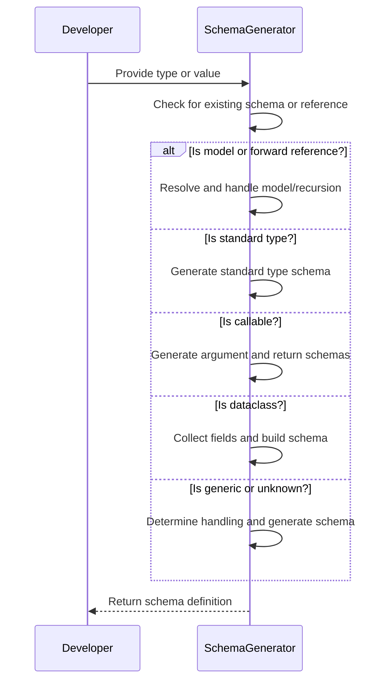
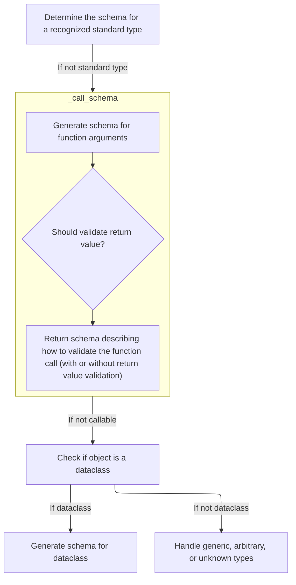
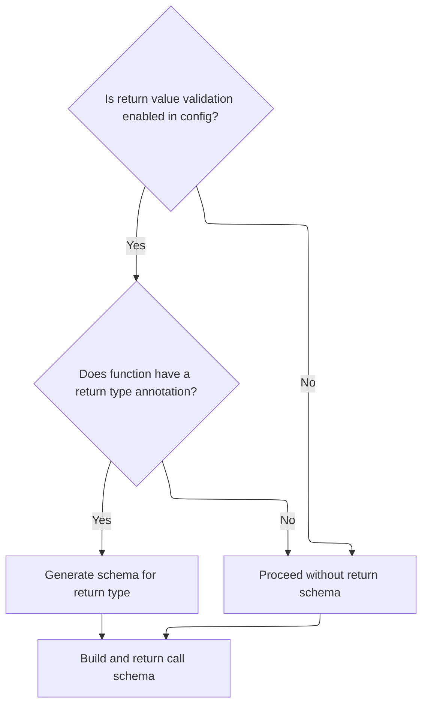
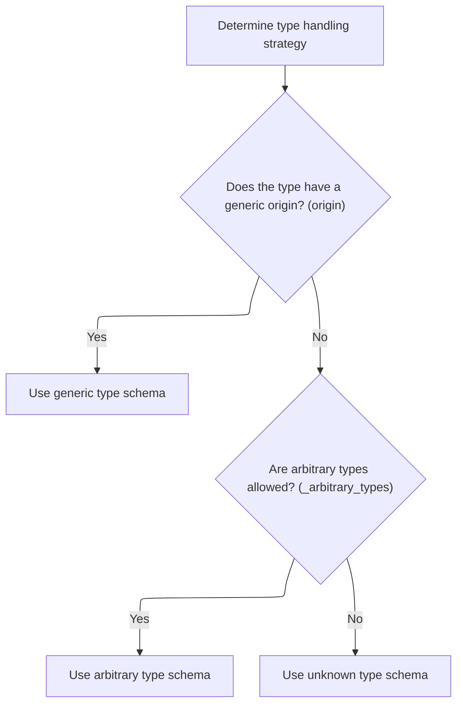
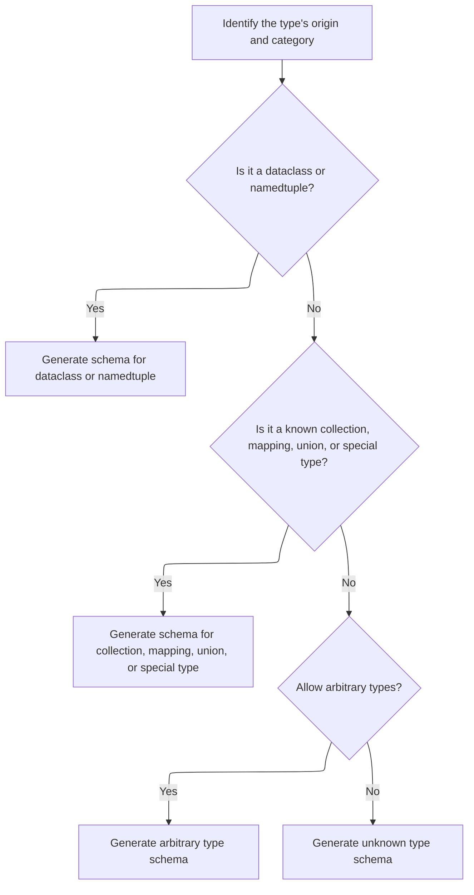

This document explains how a schema is generated for any Python type or value to support data validation and serialization. The process involves checking for existing schemas or references, handling models and recursion, matching standard types, generating schemas for callables and dataclasses, and determining the correct approach for generic or unknown types. The output is a schema definition that guides validation and serialization.



# Spec

## Detailed View of the Program's Functionality

a. Dispatching Input for Schema Generation

The schema generation process begins by determining the nature of the input for which a schema is to be generated. The main entry point is a function that checks if the input is a special type, such as a self-reference, an annotated type, a dictionary (already a schema), a string (forward reference), or a forward reference object. If the input is a forward reference, it is resolved and schema generation is retried. If the input is a subclass of the main model base, recursion is tracked using a stack, and the model schema generation function is called. If the input is a recursive reference, a reference schema is returned. If none of these cases match, the process falls through to type-based matching.

b. Building Model Schemas

When generating a schema for a model, the process first checks for an existing or referenced schema. If one is found, it is returned immediately. If not, it checks for a custom core schema defined on the model. If a reference is found in this schema, a definition reference schema is returned; otherwise, the schema itself is returned. If no custom schema is present, configuration is set up, and fields are either retrieved or rebuilt. Decorators are validated to ensure they reference existing fields. If extra fields are allowed, the method searches the class hierarchy for extra field annotations and generates schemas for extra keys and items as needed. The process then distinguishes between root models and standard models. For root models, the schema for the root field is built and validators are applied. For standard models, schemas for all fields and computed fields are generated, validators are applied, and the model schema is constructed. Finally, model serializers and outer validators are applied, and the schema is wrapped as a definition reference for reuse and recursion support.

c. Fallback to Type Matching

If the input does not match any of the special cases (model, recursive reference, etc.), the process falls through to a type-matching function. This function contains a series of checks for primitive types, collections, and special types. For wrapper types like <SwmToken path="pydantic/_internal/_generate_schema.py" pos="1111:3:3" line-data="            # NewType, can&#39;t use isinstance because it fails &lt;3.10">`NewType`</SwmToken> or Final, the underlying type is extracted and schema generation is retried. If the input is a callable, a schema for callable types is generated. If the input is a dataclass, a dataclass schema is generated. If the input has a generic origin, generic type handling is invoked. If arbitrary types are allowed, an arbitrary type schema is used; otherwise, an unknown type schema is generated, which raises an error.

d. Type-Based Schema Dispatch

The type-matching function systematically checks the input against known types, such as strings, bytes, integers, floats, booleans, complex numbers, any/object, date/time types, decimals, UUIDs, URLs, fractions, multi-host URLs, None, missing values, IP types, tuples, lists, sets, frozensets, sequences, iterables, dictionaries, paths, deques, mappings, counters, type aliases, type objects, callables, literals, typed dicts, named tuples, <SwmToken path="pydantic/_internal/_generate_schema.py" pos="1111:3:3" line-data="            # NewType, can&#39;t use isinstance because it fails &lt;3.10">`NewType`</SwmToken>, patterns, hashables, type variables, final variables, and supported callable types. For each recognized type, the corresponding schema generation function is called. If the input is a class and a subclass of Enum, an enum schema is generated. If the input is a <SwmToken path="pydantic/_internal/_generate_schema.py" pos="1129:7:7" line-data="        elif obj is ZoneInfo:">`ZoneInfo`</SwmToken> object, a zoneinfo schema is generated. If the input is a dataclass, a dataclass schema is generated.

e. Generating Callable Schemas

When generating a schema for a callable, the process starts by generating the arguments schema for the function. This describes and validates the expected arguments. If return value validation is enabled in the configuration, the function's return type annotation is retrieved, and schema generation is called on the return type. The full call schema is then built with both argument and return validation.

f. Dataclass and Generic Type Handling

If the input is a dataclass, the process checks for a cached or referenced schema. If found, it is returned. If not, it checks for a pre-defined schema, handles type variable mapping for generics, and sets up configuration inheritance. Fields are collected or rebuilt as needed, depending on whether the dataclass is a Pydantic dataclass and if fields are complete. Fields are sorted so positional ones come first, and the argument schema is built. Validators and serializers are applied, and the result is wrapped as a definition reference.

g. Generic and Unknown Type Fallback

If the input has a generic origin, generic type handling is invoked. The process first checks if the origin is a generic dataclass or namedtuple and handles those immediately. If not, it matches the origin to known generic types (collections, mappings, unions, etc.) and calls the appropriate schema function. If nothing matches, arbitrary or unknown type handling is used, depending on configuration.

h. Handling Generic Type Origins

When handling generic types, the process identifies the type's origin and category. If it is a dataclass or namedtuple, the corresponding schema generation function is called. If it is a known collection, mapping, union, or special type, the appropriate schema function is called. If arbitrary types are allowed, an arbitrary type schema is generated; otherwise, an unknown type schema is generated, which raises an error.

i. Summary

The schema generation flow in this module is a layered dispatch system that first checks for special cases (models, forward references, recursive references), then falls back to type-based matching for primitives, collections, and special types, and finally handles generic and unknown types. Each step is designed to either return a schema immediately or delegate to a more specific handler, ensuring that all supported Python types and Pydantic-specific constructs are covered. The process is recursive and supports advanced features like forward references, generics, custom validators, and serializers.

# Rule Definition

| Paragraph Name                                                                                                                                                                                                                                                                                                                                                                                                                                                                                                                                                                                                                                                                                                                                                                                                                                       | Rule ID | Category          | Description                                                                                                                                                                                                                                                                                                                                                                                                                                                                                    | Conditions                                                                                                                                                                                                                 | Remarks                                                                                                                                                                                                                                                                                                                                                                                                                                                                                                                                                                                                                                                          |
| ---------------------------------------------------------------------------------------------------------------------------------------------------------------------------------------------------------------------------------------------------------------------------------------------------------------------------------------------------------------------------------------------------------------------------------------------------------------------------------------------------------------------------------------------------------------------------------------------------------------------------------------------------------------------------------------------------------------------------------------------------------------------------------------------------------------------------------------------------- | ------- | ----------------- | ---------------------------------------------------------------------------------------------------------------------------------------------------------------------------------------------------------------------------------------------------------------------------------------------------------------------------------------------------------------------------------------------------------------------------------------------------------------------------------------------- | -------------------------------------------------------------------------------------------------------------------------------------------------------------------------------------------------------------------------- | ---------------------------------------------------------------------------------------------------------------------------------------------------------------------------------------------------------------------------------------------------------------------------------------------------------------------------------------------------------------------------------------------------------------------------------------------------------------------------------------------------------------------------------------------------------------------------------------------------------------------------------------------------------------- |
| GenerateSchema.\_generate_schema_inner                                                                                                                                                                                                                                                                                                                                                                                                                                                                                                                                                                                                                                                                                                                                                                                                               | RL-001  | Conditional Logic | If the input object is a dictionary representing a schema, the function must return this dictionary unchanged.                                                                                                                                                                                                                                                                                                                                                                                 | Input object is an instance of dict.                                                                                                                                                                                       | The returned value is the same dictionary object as the input. No transformation or validation is performed.                                                                                                                                                                                                                                                                                                                                                                                                                                                                                                                                                     |
| GenerateSchema.\_generate_schema_inner, GenerateSchema.\_resolve_forward_ref                                                                                                                                                                                                                                                                                                                                                                                                                                                                                                                                                                                                                                                                                                                                                                         | RL-002  | Conditional Logic | If the input is a string representing a forward reference, resolve it to the actual type and generate the schema for the resolved type.                                                                                                                                                                                                                                                                                                                                                        | Input object is a string or <SwmToken path="pydantic/_internal/_generate_schema.py" pos="1009:5:5" line-data="            obj = ForwardRef(obj)">`ForwardRef`</SwmToken>.                                                  | Forward references are resolved using the types namespace. If resolution fails, a <SwmToken path="pydantic/_internal/_generate_schema.py" pos="773:3:3" line-data="                        raise PydanticUndefinedAnnotation(">`PydanticUndefinedAnnotation`</SwmToken> error is raised.                                                                                                                                                                                                                                                                                                                                                                         |
| GenerateSchema.\_generate_schema_inner, GenerateSchema.\_model_schema                                                                                                                                                                                                                                                                                                                                                                                                                                                                                                                                                                                                                                                                                                                                                                                | RL-003  | Computation       | If the input is a subclass of Pydantic <SwmToken path="pydantic/_internal/_generate_schema.py" pos="736:13:13" line-data="    def _model_schema(self, cls: type[BaseModel]) -&gt; core_schema.CoreSchema:">`BaseModel`</SwmToken>, generate a schema that describes the model, including its fields, computed fields, validators, and any extra fields allowed by configuration. Support recursive references.                                                                                 | Input object is a subclass of <SwmToken path="pydantic/_internal/_generate_schema.py" pos="736:13:13" line-data="    def _model_schema(self, cls: type[BaseModel]) -&gt; core_schema.CoreSchema:">`BaseModel`</SwmToken>.  | The schema includes model fields, computed fields, validators, and extra fields if allowed. Recursive references are handled using references. Output is a dictionary structure.                                                                                                                                                                                                                                                                                                                                                                                                                                                                                 |
| GenerateSchema.\_generate_schema_inner, GenerateSchema.\_dataclass_schema                                                                                                                                                                                                                                                                                                                                                                                                                                                                                                                                                                                                                                                                                                                                                                            | RL-004  | Computation       | If the input is a dataclass type, generate a schema that describes the dataclass fields, including type annotations, default values, and configuration. Support recursive references and handle both standard and Pydantic dataclasses.                                                                                                                                                                                                                                                        | Input object is a dataclass type.                                                                                                                                                                                          | Schema includes all dataclass fields, type annotations, default values, and config. Recursive references are handled. Output is a dictionary.                                                                                                                                                                                                                                                                                                                                                                                                                                                                                                                    |
| GenerateSchema.match_type, GenerateSchema.\_call_schema                                                                                                                                                                                                                                                                                                                                                                                                                                                                                                                                                                                                                                                                                                                                                                                              | RL-005  | Computation       | If the input is a callable, generate a schema that describes the expected arguments and, if enabled by configuration, the return value. The arguments schema must reflect the function's signature, including parameter types and default values.                                                                                                                                                                                                                                              | Input object is a callable (function, method, lambda, partial).                                                                                                                                                            | Schema includes argument types, names, defaults, and optionally return type. Output is a dictionary.                                                                                                                                                                                                                                                                                                                                                                                                                                                                                                                                                             |
| GenerateSchema.match_type, GenerateSchema.\_match_generic_type                                                                                                                                                                                                                                                                                                                                                                                                                                                                                                                                                                                                                                                                                                                                                                                       | RL-006  | Computation       | If the input is a generic type (<SwmToken path="pydantic/_internal/_generate_schema.py" pos="1033:18:20" line-data="        boilerplate before calling into the user-facing method (e.g. `GenerateSchema._tuple_schema`).">`e.g`</SwmToken>., parametrized collection, union, or special type), generate a schema that describes the generic structure, including schemas for all type parameters.                                                                                             | Input object is a generic type or has a generic origin.                                                                                                                                                                    | For example, list\[int\] produces {'type': 'list', <SwmToken path="pydantic/_internal/_generate_schema.py" pos="259:4:4" line-data="            schema[&#39;items_schema&#39;][variadic_item_index] = apply_validators(">`items_schema`</SwmToken>: {'type': 'int'}}. Output is a dictionary with nested schemas for type parameters.                                                                                                                                                                                                                                                                                                                            |
| GenerateSchema.match_type                                                                                                                                                                                                                                                                                                                                                                                                                                                                                                                                                                                                                                                                                                                                                                                                                            | RL-007  | Data Assignment   | If the input is a standard primitive type (int, str, float, bool), generate a schema with a single key indicating the type.                                                                                                                                                                                                                                                                                                                                                                    | Input object is int, str, float, or bool.                                                                                                                                                                                  | Output format: {'type': '<typename>'}, <SwmToken path="pydantic/_internal/_generate_schema.py" pos="1033:18:20" line-data="        boilerplate before calling into the user-facing method (e.g. `GenerateSchema._tuple_schema`).">`e.g`</SwmToken>., {'type': 'int'}.                                                                                                                                                                                                                                                                                                                                                                                            |
| GenerateSchema.match_type, GenerateSchema.\_list_schema, <SwmToken path="pydantic/_internal/_generate_schema.py" pos="1089:5:5" line-data="            return self._dict_schema(Any, Any)">`_dict_schema`</SwmToken>, <SwmToken path="pydantic/_internal/_generate_schema.py" pos="1081:5:5" line-data="            return self._set_schema(Any)">`_set_schema`</SwmToken>, etc.                                                                                                                                                                                                                                                                                                                                                                                                                                                                     | RL-008  | Computation       | If the input is a collection type (list, tuple, set, dict), generate a schema that includes the schemas for the collection's items, keys, and/or values as appropriate.                                                                                                                                                                                                                                                                                                                        | Input object is a collection type.                                                                                                                                                                                         | Output is a dictionary with keys like 'type', <SwmToken path="pydantic/_internal/_generate_schema.py" pos="259:4:4" line-data="            schema[&#39;items_schema&#39;][variadic_item_index] = apply_validators(">`items_schema`</SwmToken>, <SwmToken path="pydantic/_internal/_generate_schema.py" pos="582:1:1" line-data="        keys_schema = self.generate_schema(keys_type)">`keys_schema`</SwmToken>, <SwmToken path="pydantic/_internal/_generate_schema.py" pos="267:10:10" line-data="        inner_schema = schema.get(&#39;values_schema&#39;, core_schema.any_schema())">`values_schema`</SwmToken>, etc., describing the collection structure. |
| GenerateSchema.match_type, GenerateSchema.\_type_alias_type_schema                                                                                                                                                                                                                                                                                                                                                                                                                                                                                                                                                                                                                                                                                                                                                                                   | RL-009  | Computation       | If the input is a type alias or wrapper (<SwmToken path="pydantic/_internal/_generate_schema.py" pos="1033:18:20" line-data="        boilerplate before calling into the user-facing method (e.g. `GenerateSchema._tuple_schema`).">`e.g`</SwmToken>., <SwmToken path="pydantic/_internal/_generate_schema.py" pos="1111:3:3" line-data="            # NewType, can&#39;t use isinstance because it fails &lt;3.10">`NewType`</SwmToken>, Final), generate the schema for the underlying type. | Input object is a type alias, <SwmToken path="pydantic/_internal/_generate_schema.py" pos="1111:3:3" line-data="            # NewType, can&#39;t use isinstance because it fails &lt;3.10">`NewType`</SwmToken>, or Final. | The schema is generated for the underlying type, recursively if needed.                                                                                                                                                                                                                                                                                                                                                                                                                                                                                                                                                                                          |
| GenerateSchema.match_type, GenerateSchema.\_arbitrary_type_schema, GenerateSchema.\_unknown_type_schema                                                                                                                                                                                                                                                                                                                                                                                                                                                                                                                                                                                                                                                                                                                                              | RL-010  | Conditional Logic | If the input does not match any recognized category and arbitrary types are allowed by configuration, generate a schema indicating an arbitrary type. Otherwise, generate a schema indicating an unknown type or raise an error.                                                                                                                                                                                                                                                               | Input object does not match any known category. Configuration determines if arbitrary types are allowed.                                                                                                                   | If <SwmToken path="pydantic/_internal/_generate_schema.py" pos="374:7:7" line-data="        return self._config_wrapper.arbitrary_types_allowed">`arbitrary_types_allowed`</SwmToken> is True, schema allows any object or instance of the given type. Otherwise, an error is raised or an 'unknown type' schema is generated.                                                                                                                                                                                                                                                                                                                                   |
| GenerateSchema.\_model_schema, <SwmToken path="pydantic/_internal/_generate_schema.py" pos="1135:5:5" line-data="            return self._dataclass_schema(obj, None)  # pyright: ignore[reportArgumentType]">`_dataclass_schema`</SwmToken>, <SwmToken path="pydantic/_internal/_generate_schema.py" pos="1107:5:5" line-data="            return self._typed_dict_schema(obj, None)">`_typed_dict_schema`</SwmToken>, <SwmToken path="pydantic/_internal/_generate_schema.py" pos="1109:5:5" line-data="            return self._namedtuple_schema(obj, None)">`_namedtuple_schema`</SwmToken>, \_Definitions.get_schema_or_ref, <SwmToken path="pydantic/_internal/_generate_schema.py" pos="750:7:7" line-data="                    return self.defs.create_definition_reference_schema(schema)">`create_definition_reference_schema`</SwmToken> | RL-011  | Computation       | For all generated schemas, if the type is recursive or referenced multiple times, use references to avoid infinite recursion and enable schema reuse.                                                                                                                                                                                                                                                                                                                                          | Type is recursive or referenced more than once.                                                                                                                                                                            | References are managed using a definitions mechanism. Output schemas may include 'ref' keys and definition references.                                                                                                                                                                                                                                                                                                                                                                                                                                                                                                                                           |
| GenerateSchema.generate_schema, GenerateSchema.\_generate_schema_inner, all schema generation methods                                                                                                                                                                                                                                                                                                                                                                                                                                                                                                                                                                                                                                                                                                                                                | RL-012  | Data Assignment   | The output schema must always be a dictionary structure that fully describes the validation and serialization requirements for the input type, including nested schemas as needed for complex types.                                                                                                                                                                                                                                                                                           | Any input type.                                                                                                                                                                                                            | Output is always a dictionary (core schema) with keys describing type, validation, serialization, and nested schemas.                                                                                                                                                                                                                                                                                                                                                                                                                                                                                                                                            |
| GenerateSchema.generate_schema, GenerateSchema.match_type, GenerateSchema.\_model_schema, GenerateSchema.\_dataclass_schema                                                                                                                                                                                                                                                                                                                                                                                                                                                                                                                                                                                                                                                                                                                          | RL-013  | Data Assignment   | The function signatures must be as follows: main dispatch accepts any input and returns a core schema dictionary; type-based dispatch accepts any input and returns a core schema dictionary; model schema generation accepts a Pydantic model class and returns a core schema dictionary; dataclass schema generation accepts a dataclass type and optional origin, returns a core schema dictionary.                                                                                         | All schema generation entry points.                                                                                                                                                                                        | Function signatures are strictly defined. All return a dictionary (core schema).                                                                                                                                                                                                                                                                                                                                                                                                                                                                                                                                                                                 |

# User Stories

## User Story 1: Schema generation for all supported input types with correct function signatures and output structure

---

### Story Description:

As a user of the schema generation system, I want to provide any supported Python type or construct (including primitives, collections, generics, models, dataclasses, callables, type aliases, forward references, and dictionaries representing schemas) and receive a core schema dictionary that fully describes how to validate and serialize the input, with all schema generation entry points having clearly defined function signatures, so that I can easily validate and serialize data structures of any complexity and reliably integrate the schema generation functionality.

---

### Business Rule Mapping:

| Rule ID | Paragraph Name                                                                                                                                                                                                                                                                                                                                                                   | Rule Description                                                                                                                                                                                                                                                                                                                                                                                                                                                                               |
| ------- | -------------------------------------------------------------------------------------------------------------------------------------------------------------------------------------------------------------------------------------------------------------------------------------------------------------------------------------------------------------------------------- | ---------------------------------------------------------------------------------------------------------------------------------------------------------------------------------------------------------------------------------------------------------------------------------------------------------------------------------------------------------------------------------------------------------------------------------------------------------------------------------------------- |
| RL-001  | GenerateSchema.\_generate_schema_inner                                                                                                                                                                                                                                                                                                                                           | If the input object is a dictionary representing a schema, the function must return this dictionary unchanged.                                                                                                                                                                                                                                                                                                                                                                                 |
| RL-002  | GenerateSchema.\_generate_schema_inner, GenerateSchema.\_resolve_forward_ref                                                                                                                                                                                                                                                                                                     | If the input is a string representing a forward reference, resolve it to the actual type and generate the schema for the resolved type.                                                                                                                                                                                                                                                                                                                                                        |
| RL-003  | GenerateSchema.\_generate_schema_inner, GenerateSchema.\_model_schema                                                                                                                                                                                                                                                                                                            | If the input is a subclass of Pydantic <SwmToken path="pydantic/_internal/_generate_schema.py" pos="736:13:13" line-data="    def _model_schema(self, cls: type[BaseModel]) -&gt; core_schema.CoreSchema:">`BaseModel`</SwmToken>, generate a schema that describes the model, including its fields, computed fields, validators, and any extra fields allowed by configuration. Support recursive references.                                                                                 |
| RL-004  | GenerateSchema.\_generate_schema_inner, GenerateSchema.\_dataclass_schema                                                                                                                                                                                                                                                                                                        | If the input is a dataclass type, generate a schema that describes the dataclass fields, including type annotations, default values, and configuration. Support recursive references and handle both standard and Pydantic dataclasses.                                                                                                                                                                                                                                                        |
| RL-005  | GenerateSchema.match_type, GenerateSchema.\_call_schema                                                                                                                                                                                                                                                                                                                          | If the input is a callable, generate a schema that describes the expected arguments and, if enabled by configuration, the return value. The arguments schema must reflect the function's signature, including parameter types and default values.                                                                                                                                                                                                                                              |
| RL-006  | GenerateSchema.match_type, GenerateSchema.\_match_generic_type                                                                                                                                                                                                                                                                                                                   | If the input is a generic type (<SwmToken path="pydantic/_internal/_generate_schema.py" pos="1033:18:20" line-data="        boilerplate before calling into the user-facing method (e.g. `GenerateSchema._tuple_schema`).">`e.g`</SwmToken>., parametrized collection, union, or special type), generate a schema that describes the generic structure, including schemas for all type parameters.                                                                                             |
| RL-007  | GenerateSchema.match_type                                                                                                                                                                                                                                                                                                                                                        | If the input is a standard primitive type (int, str, float, bool), generate a schema with a single key indicating the type.                                                                                                                                                                                                                                                                                                                                                                    |
| RL-008  | GenerateSchema.match_type, GenerateSchema.\_list_schema, <SwmToken path="pydantic/_internal/_generate_schema.py" pos="1089:5:5" line-data="            return self._dict_schema(Any, Any)">`_dict_schema`</SwmToken>, <SwmToken path="pydantic/_internal/_generate_schema.py" pos="1081:5:5" line-data="            return self._set_schema(Any)">`_set_schema`</SwmToken>, etc. | If the input is a collection type (list, tuple, set, dict), generate a schema that includes the schemas for the collection's items, keys, and/or values as appropriate.                                                                                                                                                                                                                                                                                                                        |
| RL-009  | GenerateSchema.match_type, GenerateSchema.\_type_alias_type_schema                                                                                                                                                                                                                                                                                                               | If the input is a type alias or wrapper (<SwmToken path="pydantic/_internal/_generate_schema.py" pos="1033:18:20" line-data="        boilerplate before calling into the user-facing method (e.g. `GenerateSchema._tuple_schema`).">`e.g`</SwmToken>., <SwmToken path="pydantic/_internal/_generate_schema.py" pos="1111:3:3" line-data="            # NewType, can&#39;t use isinstance because it fails &lt;3.10">`NewType`</SwmToken>, Final), generate the schema for the underlying type. |
| RL-010  | GenerateSchema.match_type, GenerateSchema.\_arbitrary_type_schema, GenerateSchema.\_unknown_type_schema                                                                                                                                                                                                                                                                          | If the input does not match any recognized category and arbitrary types are allowed by configuration, generate a schema indicating an arbitrary type. Otherwise, generate a schema indicating an unknown type or raise an error.                                                                                                                                                                                                                                                               |
| RL-012  | GenerateSchema.generate_schema, GenerateSchema.\_generate_schema_inner, all schema generation methods                                                                                                                                                                                                                                                                            | The output schema must always be a dictionary structure that fully describes the validation and serialization requirements for the input type, including nested schemas as needed for complex types.                                                                                                                                                                                                                                                                                           |
| RL-013  | GenerateSchema.generate_schema, GenerateSchema.match_type, GenerateSchema.\_model_schema, GenerateSchema.\_dataclass_schema                                                                                                                                                                                                                                                      | The function signatures must be as follows: main dispatch accepts any input and returns a core schema dictionary; type-based dispatch accepts any input and returns a core schema dictionary; model schema generation accepts a Pydantic model class and returns a core schema dictionary; dataclass schema generation accepts a dataclass type and optional origin, returns a core schema dictionary.                                                                                         |

---

### Relevant Functionality:

- **GenerateSchema.\_generate_schema_inner**
  1. **RL-001:**
     - If input is a dict:
       - Return input as is
  2. **RL-002:**
     - If input is a string:
       - Convert to <SwmToken path="pydantic/_internal/_generate_schema.py" pos="1009:5:5" line-data="            obj = ForwardRef(obj)">`ForwardRef`</SwmToken>
     - If input is <SwmToken path="pydantic/_internal/_generate_schema.py" pos="1009:5:5" line-data="            obj = ForwardRef(obj)">`ForwardRef`</SwmToken>:
       - Resolve to actual type
       - Call <SwmToken path="pydantic/_internal/_generate_schema.py" pos="827:7:7" line-data="                                extras_keys_schema = self.generate_schema(extra_keys_type)">`generate_schema`</SwmToken> on resolved type
  3. **RL-003:**
     - If input is subclass of <SwmToken path="pydantic/_internal/_generate_schema.py" pos="736:13:13" line-data="    def _model_schema(self, cls: type[BaseModel]) -&gt; core_schema.CoreSchema:">`BaseModel`</SwmToken>:
       - Push model type to stack
       - Generate schema for fields, computed fields, validators
       - Handle extra fields if allowed
       - Use references for recursion
       - Return schema as dictionary
  4. **RL-004:**
     - If input is a dataclass type:
       - Push dataclass type to stack
       - Generate schema for fields, type annotations, default values
       - Handle Pydantic and standard dataclasses
       - Use references for recursion
       - Return schema as dictionary
- **GenerateSchema.match_type**
  1. **RL-005:**
     - If input is a callable:
       - Generate schema for arguments (names, types, defaults)
       - If config.validate_return is True:
         - Generate schema for return value
       - Return callable schema as dictionary
  2. **RL-006:**
     - If input is a generic type:
       - Identify origin and type parameters
       - Generate schema for each type parameter
       - Compose schema for the generic type with nested schemas
  3. **RL-007:**
     - If input is int, str, float, or bool:
       - Return {'type': '<typename>'}
  4. **RL-008:**
     - If input is a collection type:
       - Generate schema for items/keys/values as needed
       - Return schema as dictionary
  5. **RL-009:**
     - If input is a type alias or wrapper:
       - Resolve to underlying type
       - Generate schema for underlying type
  6. **RL-010:**
     - If input is not recognized:
       - If <SwmToken path="pydantic/_internal/_generate_schema.py" pos="374:7:7" line-data="        return self._config_wrapper.arbitrary_types_allowed">`arbitrary_types_allowed`</SwmToken>:
         - Generate arbitrary type schema
       - Else:
         - Generate unknown type schema or raise error
- **GenerateSchema.generate_schema**
  1. **RL-012:**
     - After schema generation:
       - Ensure output is a dictionary structure
       - Include nested schemas for complex types
  2. **RL-013:**
     - Main dispatch: (input: Any) -> dict
     - Type-based dispatch: (input: Any) -> dict
     - Model schema: (model_class: type) -> dict
     - Dataclass schema: (dataclass_type: type, origin: type | None) -> dict

## User Story 2: Reference and recursion handling in schema generation

---

### Story Description:

As a user of the schema generation system, I want recursive types or types referenced multiple times to use references in the generated schema, so that infinite recursion is avoided and schema definitions can be reused efficiently.

---

### Business Rule Mapping:

| Rule ID | Paragraph Name                                                                                                                                                                                                                                                                                                                                                                                                                                                                                                                                                                                                                                                                                                                                                                                                                                       | Rule Description                                                                                                                                                                                                                                                                                                                                                                                               |
| ------- | ---------------------------------------------------------------------------------------------------------------------------------------------------------------------------------------------------------------------------------------------------------------------------------------------------------------------------------------------------------------------------------------------------------------------------------------------------------------------------------------------------------------------------------------------------------------------------------------------------------------------------------------------------------------------------------------------------------------------------------------------------------------------------------------------------------------------------------------------------- | -------------------------------------------------------------------------------------------------------------------------------------------------------------------------------------------------------------------------------------------------------------------------------------------------------------------------------------------------------------------------------------------------------------- |
| RL-003  | GenerateSchema.\_generate_schema_inner, GenerateSchema.\_model_schema                                                                                                                                                                                                                                                                                                                                                                                                                                                                                                                                                                                                                                                                                                                                                                                | If the input is a subclass of Pydantic <SwmToken path="pydantic/_internal/_generate_schema.py" pos="736:13:13" line-data="    def _model_schema(self, cls: type[BaseModel]) -&gt; core_schema.CoreSchema:">`BaseModel`</SwmToken>, generate a schema that describes the model, including its fields, computed fields, validators, and any extra fields allowed by configuration. Support recursive references. |
| RL-004  | GenerateSchema.\_generate_schema_inner, GenerateSchema.\_dataclass_schema                                                                                                                                                                                                                                                                                                                                                                                                                                                                                                                                                                                                                                                                                                                                                                            | If the input is a dataclass type, generate a schema that describes the dataclass fields, including type annotations, default values, and configuration. Support recursive references and handle both standard and Pydantic dataclasses.                                                                                                                                                                        |
| RL-011  | GenerateSchema.\_model_schema, <SwmToken path="pydantic/_internal/_generate_schema.py" pos="1135:5:5" line-data="            return self._dataclass_schema(obj, None)  # pyright: ignore[reportArgumentType]">`_dataclass_schema`</SwmToken>, <SwmToken path="pydantic/_internal/_generate_schema.py" pos="1107:5:5" line-data="            return self._typed_dict_schema(obj, None)">`_typed_dict_schema`</SwmToken>, <SwmToken path="pydantic/_internal/_generate_schema.py" pos="1109:5:5" line-data="            return self._namedtuple_schema(obj, None)">`_namedtuple_schema`</SwmToken>, \_Definitions.get_schema_or_ref, <SwmToken path="pydantic/_internal/_generate_schema.py" pos="750:7:7" line-data="                    return self.defs.create_definition_reference_schema(schema)">`create_definition_reference_schema`</SwmToken> | For all generated schemas, if the type is recursive or referenced multiple times, use references to avoid infinite recursion and enable schema reuse.                                                                                                                                                                                                                                                          |

---

### Relevant Functionality:

- **GenerateSchema.\_generate_schema_inner**
  1. **RL-003:**
     - If input is subclass of <SwmToken path="pydantic/_internal/_generate_schema.py" pos="736:13:13" line-data="    def _model_schema(self, cls: type[BaseModel]) -&gt; core_schema.CoreSchema:">`BaseModel`</SwmToken>:
       - Push model type to stack
       - Generate schema for fields, computed fields, validators
       - Handle extra fields if allowed
       - Use references for recursion
       - Return schema as dictionary
  2. **RL-004:**
     - If input is a dataclass type:
       - Push dataclass type to stack
       - Generate schema for fields, type annotations, default values
       - Handle Pydantic and standard dataclasses
       - Use references for recursion
       - Return schema as dictionary
- **GenerateSchema.\_model_schema**
  1. **RL-011:**
     - When generating schema for a referenceable type:
       - If type is already being processed or defined:
         - Use a reference schema
       - Otherwise:
         - Generate schema and store with reference

# Code Walkthrough

## Dispatching Input for Schema Generation

<SwmSnippet path="/pydantic/_internal/_generate_schema.py" line="997">

---

In <SwmToken path="pydantic/_internal/_generate_schema.py" pos="997:3:3" line-data="    def _generate_schema_inner(self, obj: Any) -&gt; core_schema.CoreSchema:">`_generate_schema_inner`</SwmToken>, we check if the input is already a schema (dict), a forward reference (string), or needs special handling. If it's a forward ref, we resolve it by calling <SwmToken path="pydantic/_internal/_generate_schema.py" pos="1012:5:5" line-data="            return self.generate_schema(self._resolve_forward_ref(obj))">`generate_schema`</SwmToken> next, which lets us handle types that aren't immediately resolvable.

```python
    def _generate_schema_inner(self, obj: Any) -> core_schema.CoreSchema:
        if typing_objects.is_self(obj):
            obj = self._resolve_self_type(obj)

        if typing_objects.is_annotated(get_origin(obj)):
            return self._annotated_schema(obj)

        if isinstance(obj, dict):
            # we assume this is already a valid schema
            return obj  # type: ignore[return-value]

        if isinstance(obj, str):
            obj = ForwardRef(obj)

        if isinstance(obj, ForwardRef):
            return self.generate_schema(self._resolve_forward_ref(obj))

```

---

</SwmSnippet>

<SwmSnippet path="/pydantic/_internal/_generate_schema.py" line="1014">

---

Back in <SwmToken path="pydantic/_internal/_generate_schema.py" pos="997:3:3" line-data="    def _generate_schema_inner(self, obj: Any) -&gt; core_schema.CoreSchema:">`_generate_schema_inner`</SwmToken>, after resolving forward refs, we handle <SwmToken path="pydantic/_internal/_generate_schema.py" pos="1014:1:1" line-data="        BaseModel = import_cached_base_model()">`BaseModel`</SwmToken> subclasses by tracking recursion with a stack and calling <SwmToken path="pydantic/_internal/_generate_schema.py" pos="1018:5:5" line-data="                return self._model_schema(obj)">`_model_schema`</SwmToken>. For recursive references, we return a reference schema directly.

```python
        BaseModel = import_cached_base_model()

        if lenient_issubclass(obj, BaseModel):
            with self.model_type_stack.push(obj):
                return self._model_schema(obj)

        if isinstance(obj, PydanticRecursiveRef):
            return core_schema.definition_reference_schema(schema_ref=obj.type_ref)

```

---

</SwmSnippet>

### Building Model Schemas

```mermaid
%%{init: {"flowchart": {"defaultRenderer": "elk"}} }%%
flowchart TD
    node1["Start: Generate schema for Pydantic model"] --> node2{"Existing schema or reference?"}
    click node1 openCode "pydantic/_internal/_generate_schema.py:736:737"
    click node2 openCode "pydantic/_internal/_generate_schema.py:740:742"
    node2 -- Yes --> node3["Return existing schema/reference"]
    click node3 openCode "pydantic/_internal/_generate_schema.py:742:742"
    node2 -- No --> node4{"Custom core schema defined?"}
    click node4 openCode "pydantic/_internal/_generate_schema.py:744:752"
    node4 -- Yes --> node5{"Reference found in schema?"}
    click node5 openCode "pydantic/_internal/_generate_schema.py:746:750"
    node5 -- Yes --> node6["Return definition reference schema"]
    click node6 openCode "pydantic/_internal/_generate_schema.py:750:751"
    node5 -- No --> node7["Return schema"]
    click node7 openCode "pydantic/_internal/_generate_schema.py:752:752"
    node4 -- No --> node8{"Allow extra fields? (extra_fields_behavior='allow')"}
    click node8 openCode "pydantic/_internal/_generate_schema.py:802:802"
    node8 -- Yes --> loop1
    node8 -- No --> node11{"Is root model?"}
    
    subgraph loop1["Loop: For each class in model's MRO"]
        node9["Search for extra field annotations"]
        click node9 openCode "pydantic/_internal/_generate_schema.py:805:831"
        node10["Generate extra keys/items schemas if needed"]
        click node10 openCode "pydantic/_internal/_generate_schema.py:822:829"
    end
    loop1 --> node11{"Is root model?"}
    click node11 openCode "pydantic/_internal/_generate_schema.py:835:849"
    node11 -- Yes --> node12["Build root model schema, apply computed fields and validators"]
    click node12 openCode "pydantic/_internal/_generate_schema.py:836:848"
    node11 -- No --> node13["Build standard model schema, apply computed fields and validators"]
    click node13 openCode "pydantic/_internal/_generate_schema.py:850:872"
    node12 --> node14["Apply model serializers and outer validators"]
    click node14 openCode "pydantic/_internal/_generate_schema.py:874:875"
    node13 --> node14
    node14 --> node15["Return definition reference schema"]
    click node15 openCode "pydantic/_internal/_generate_schema.py:876:876"

%% Swimm:
%% %%{init: {"flowchart": {"defaultRenderer": "elk"}} }%%
%% flowchart TD
%%     node1["Start: Generate schema for Pydantic model"] --> node2{"Existing schema or reference?"}
%%     click node1 openCode "<SwmPath>[pydantic/\_internal/\_generate_schema.py](pydantic/_internal/_generate_schema.py)</SwmPath>:736:737"
%%     click node2 openCode "<SwmPath>[pydantic/\_internal/\_generate_schema.py](pydantic/_internal/_generate_schema.py)</SwmPath>:740:742"
%%     node2 -- Yes --> node3["Return existing schema/reference"]
%%     click node3 openCode "<SwmPath>[pydantic/\_internal/\_generate_schema.py](pydantic/_internal/_generate_schema.py)</SwmPath>:742:742"
%%     node2 -- No --> node4{"Custom core schema defined?"}
%%     click node4 openCode "<SwmPath>[pydantic/\_internal/\_generate_schema.py](pydantic/_internal/_generate_schema.py)</SwmPath>:744:752"
%%     node4 -- Yes --> node5{"Reference found in schema?"}
%%     click node5 openCode "<SwmPath>[pydantic/\_internal/\_generate_schema.py](pydantic/_internal/_generate_schema.py)</SwmPath>:746:750"
%%     node5 -- Yes --> node6["Return definition reference schema"]
%%     click node6 openCode "<SwmPath>[pydantic/\_internal/\_generate_schema.py](pydantic/_internal/_generate_schema.py)</SwmPath>:750:751"
%%     node5 -- No --> node7["Return schema"]
%%     click node7 openCode "<SwmPath>[pydantic/\_internal/\_generate_schema.py](pydantic/_internal/_generate_schema.py)</SwmPath>:752:752"
%%     node4 -- No --> node8{"Allow extra fields? (<SwmToken path="pydantic/_internal/_generate_schema.py" pos="802:8:8" line-data="                if core_config.get(&#39;extra_fields_behavior&#39;) == &#39;allow&#39;:">`extra_fields_behavior`</SwmToken>='allow')"}
%%     click node8 openCode "<SwmPath>[pydantic/\_internal/\_generate_schema.py](pydantic/_internal/_generate_schema.py)</SwmPath>:802:802"
%%     node8 -- Yes --> loop1
%%     node8 -- No --> node11{"Is root model?"}
%%     
%%     subgraph loop1["Loop: For each class in model's MRO"]
%%         node9["Search for extra field annotations"]
%%         click node9 openCode "<SwmPath>[pydantic/\_internal/\_generate_schema.py](pydantic/_internal/_generate_schema.py)</SwmPath>:805:831"
%%         node10["Generate extra keys/items schemas if needed"]
%%         click node10 openCode "<SwmPath>[pydantic/\_internal/\_generate_schema.py](pydantic/_internal/_generate_schema.py)</SwmPath>:822:829"
%%     end
%%     loop1 --> node11{"Is root model?"}
%%     click node11 openCode "<SwmPath>[pydantic/\_internal/\_generate_schema.py](pydantic/_internal/_generate_schema.py)</SwmPath>:835:849"
%%     node11 -- Yes --> node12["Build root model schema, apply computed fields and validators"]
%%     click node12 openCode "<SwmPath>[pydantic/\_internal/\_generate_schema.py](pydantic/_internal/_generate_schema.py)</SwmPath>:836:848"
%%     node11 -- No --> node13["Build standard model schema, apply computed fields and validators"]
%%     click node13 openCode "<SwmPath>[pydantic/\_internal/\_generate_schema.py](pydantic/_internal/_generate_schema.py)</SwmPath>:850:872"
%%     node12 --> node14["Apply model serializers and outer validators"]
%%     click node14 openCode "<SwmPath>[pydantic/\_internal/\_generate_schema.py](pydantic/_internal/_generate_schema.py)</SwmPath>:874:875"
%%     node13 --> node14
%%     node14 --> node15["Return definition reference schema"]
%%     click node15 openCode "<SwmPath>[pydantic/\_internal/\_generate_schema.py](pydantic/_internal/_generate_schema.py)</SwmPath>:876:876"
```



<SwmSnippet path="/pydantic/_internal/_generate_schema.py" line="736">

---

In <SwmToken path="pydantic/_internal/_generate_schema.py" pos="736:3:3" line-data="    def _model_schema(self, cls: type[BaseModel]) -&gt; core_schema.CoreSchema:">`_model_schema`</SwmToken>, we check for cached or pre-defined schemas, set up config, get or rebuild fields, validate decorators, and if extra fields are allowed, we generate their schemas as needed.

```python
    def _model_schema(self, cls: type[BaseModel]) -> core_schema.CoreSchema:
        """Generate schema for a Pydantic model."""
        BaseModel_ = import_cached_base_model()

        with self.defs.get_schema_or_ref(cls) as (model_ref, maybe_schema):
            if maybe_schema is not None:
                return maybe_schema

            schema = cls.__dict__.get('__pydantic_core_schema__')
            if schema is not None and not isinstance(schema, MockCoreSchema):
                if schema['type'] == 'definitions':
                    schema = self.defs.unpack_definitions(schema)
                ref = get_ref(schema)
                if ref:
                    return self.defs.create_definition_reference_schema(schema)
                else:
                    return schema

            config_wrapper = ConfigWrapper(cls.model_config, check=False)

            with self._config_wrapper_stack.push(config_wrapper), self._ns_resolver.push(cls):
                core_config = self._config_wrapper.core_config(title=cls.__name__)

                if cls.__pydantic_fields_complete__ or cls is BaseModel_:
                    fields = getattr(cls, '__pydantic_fields__', {})
                else:
                    if not hasattr(cls, '__pydantic_fields__'):
                        # This happens when we have a loop in the schema generation:
                        # class Base[T](BaseModel):
                        #     t: T
                        #
                        # class Other(BaseModel):
                        #     b: 'Base[Other]'
                        # When we build fields for `Other`, we evaluate the forward annotation.
                        # At this point, `Other` doesn't have the model fields set. We create
                        # `Base[Other]`; model fields are successfully built, and we try to generate
                        # a schema for `t: Other`. As `Other.__pydantic_fields__` aren't set, we abort.
                        raise PydanticUndefinedAnnotation(
                            name=cls.__name__,
                            message=f'Class {cls.__name__!r} is not defined',
                        )
                    try:
                        fields = rebuild_model_fields(
                            cls,
                            config_wrapper=self._config_wrapper,
                            ns_resolver=self._ns_resolver,
                            typevars_map=self._typevars_map or {},
                        )
                    except NameError as e:
                        raise PydanticUndefinedAnnotation.from_name_error(e) from e

                decorators = cls.__pydantic_decorators__
                computed_fields = decorators.computed_fields
                check_decorator_fields_exist(
                    chain(
                        decorators.field_validators.values(),
                        decorators.field_serializers.values(),
                        decorators.validators.values(),
                    ),
                    {*fields.keys(), *computed_fields.keys()},
                )

                model_validators = decorators.model_validators.values()

                extras_schema = None
                extras_keys_schema = None
                if core_config.get('extra_fields_behavior') == 'allow':
                    assert cls.__mro__[0] is cls
                    assert cls.__mro__[-1] is object
                    for candidate_cls in cls.__mro__[:-1]:
                        extras_annotation = getattr(candidate_cls, '__annotations__', {}).get(
                            '__pydantic_extra__', None
                        )
                        if extras_annotation is not None:
                            if isinstance(extras_annotation, str):
                                extras_annotation = _typing_extra.eval_type_backport(
                                    _typing_extra._make_forward_ref(
                                        extras_annotation, is_argument=False, is_class=True
                                    ),
                                    *self._types_namespace,
                                )
                            tp = get_origin(extras_annotation)
                            if tp not in DICT_TYPES:
                                raise PydanticSchemaGenerationError(
                                    'The type annotation for `__pydantic_extra__` must be `dict[str, ...]`'
                                )
                            extra_keys_type, extra_items_type = self._get_args_resolving_forward_refs(
                                extras_annotation,
                                required=True,
                            )
                            if extra_keys_type is not str:
                                extras_keys_schema = self.generate_schema(extra_keys_type)
                            if not typing_objects.is_any(extra_items_type):
                                extras_schema = self.generate_schema(extra_items_type)
                            if extras_keys_schema is not None or extras_schema is not None:
                                break

```

---

</SwmSnippet>

<SwmSnippet path="/pydantic/_internal/_generate_schema.py" line="833">

---

After generating any needed field schemas in <SwmToken path="pydantic/_internal/_generate_schema.py" pos="736:3:3" line-data="    def _model_schema(self, cls: type[BaseModel]) -&gt; core_schema.CoreSchema:">`_model_schema`</SwmToken>, we handle generic origins, root models, and standard models. For root models, we build the schema for the root field and apply validators. For standard models, we generate schemas for all fields and computed fields, apply validators, and build the model schema. Finally, we apply serializers and wrap everything as a definition reference for reuse and recursion support.

```python
                generic_origin: type[BaseModel] | None = getattr(cls, '__pydantic_generic_metadata__', {}).get('origin')

                if cls.__pydantic_root_model__:
                    root_field = self._common_field_schema('root', fields['root'], decorators)
                    inner_schema = root_field['schema']
                    inner_schema = apply_model_validators(inner_schema, model_validators, 'inner')
                    model_schema = core_schema.model_schema(
                        cls,
                        inner_schema,
                        generic_origin=generic_origin,
                        custom_init=getattr(cls, '__pydantic_custom_init__', None),
                        root_model=True,
                        post_init=getattr(cls, '__pydantic_post_init__', None),
                        config=core_config,
                        ref=model_ref,
                    )
                else:
                    fields_schema: core_schema.CoreSchema = core_schema.model_fields_schema(
                        {k: self._generate_md_field_schema(k, v, decorators) for k, v in fields.items()},
                        computed_fields=[
                            self._computed_field_schema(d, decorators.field_serializers)
                            for d in computed_fields.values()
                        ],
                        extras_schema=extras_schema,
                        extras_keys_schema=extras_keys_schema,
                        model_name=cls.__name__,
                    )
                    inner_schema = apply_validators(fields_schema, decorators.root_validators.values())
                    inner_schema = apply_model_validators(inner_schema, model_validators, 'inner')

                    model_schema = core_schema.model_schema(
                        cls,
                        inner_schema,
                        generic_origin=generic_origin,
                        custom_init=getattr(cls, '__pydantic_custom_init__', None),
                        root_model=False,
                        post_init=getattr(cls, '__pydantic_post_init__', None),
                        config=core_config,
                        ref=model_ref,
                    )

                schema = self._apply_model_serializers(model_schema, decorators.model_serializers.values())
                schema = apply_model_validators(schema, model_validators, 'outer')
                return self.defs.create_definition_reference_schema(schema)
```

---

</SwmSnippet>

### Fallback to Type Matching

<SwmSnippet path="/pydantic/_internal/_generate_schema.py" line="1023">

---

After handling models and recursive refs in <SwmToken path="pydantic/_internal/_generate_schema.py" pos="997:3:3" line-data="    def _generate_schema_inner(self, obj: Any) -&gt; core_schema.CoreSchema:">`_generate_schema_inner`</SwmToken>, if nothing matched, we fall through to <SwmToken path="pydantic/_internal/_generate_schema.py" pos="1023:5:5" line-data="        return self.match_type(obj)">`match_type`</SwmToken>. This function covers all the remaining types, so we don't miss anything, even custom or weird types.

```python
        return self.match_type(obj)
```

---

</SwmSnippet>

## Type-Based Schema Dispatch



<SwmSnippet path="/pydantic/_internal/_generate_schema.py" line="1025">

---

In <SwmToken path="pydantic/_internal/_generate_schema.py" pos="1025:3:3" line-data="    def match_type(self, obj: Any) -&gt; core_schema.CoreSchema:  # noqa: C901">`match_type`</SwmToken>, we run through a big set of type checks for primitives, collections, and special types. For things like <SwmToken path="pydantic/_internal/_generate_schema.py" pos="1111:3:3" line-data="            # NewType, can&#39;t use isinstance because it fails &lt;3.10">`NewType`</SwmToken> or Final, we call <SwmToken path="pydantic/_internal/_generate_schema.py" pos="1112:5:5" line-data="            return self.generate_schema(obj.__supertype__)">`generate_schema`</SwmToken> again with the underlying type to make sure we get the right schema for those wrappers.

```python
    def match_type(self, obj: Any) -> core_schema.CoreSchema:  # noqa: C901
        """Main mapping of types to schemas.

        The general structure is a series of if statements starting with the simple cases
        (non-generic primitive types) and then handling generics and other more complex cases.

        Each case either generates a schema directly, calls into a public user-overridable method
        (like `GenerateSchema.tuple_variable_schema`) or calls into a private method that handles some
        boilerplate before calling into the user-facing method (e.g. `GenerateSchema._tuple_schema`).

        The idea is that we'll evolve this into adding more and more user facing methods over time
        as they get requested and we figure out what the right API for them is.
        """
        if obj is str:
            return core_schema.str_schema()
        elif obj is bytes:
            return core_schema.bytes_schema()
        elif obj is int:
            return core_schema.int_schema()
        elif obj is float:
            return core_schema.float_schema()
        elif obj is bool:
            return core_schema.bool_schema()
        elif obj is complex:
            return core_schema.complex_schema()
        elif typing_objects.is_any(obj) or obj is object:
            return core_schema.any_schema()
        elif obj is datetime.date:
            return core_schema.date_schema()
        elif obj is datetime.datetime:
            return core_schema.datetime_schema()
        elif obj is datetime.time:
            return core_schema.time_schema()
        elif obj is datetime.timedelta:
            return core_schema.timedelta_schema()
        elif obj is Decimal:
            return core_schema.decimal_schema()
        elif obj is UUID:
            return core_schema.uuid_schema()
        elif obj is Url:
            return core_schema.url_schema()
        elif obj is Fraction:
            return self._fraction_schema()
        elif obj is MultiHostUrl:
            return core_schema.multi_host_url_schema()
        elif obj is None or obj is _typing_extra.NoneType:
            return core_schema.none_schema()
        if obj is MISSING:
            return core_schema.missing_sentinel_schema()
        elif obj in IP_TYPES:
            return self._ip_schema(obj)
        elif obj in TUPLE_TYPES:
            return self._tuple_schema(obj)
        elif obj in LIST_TYPES:
            return self._list_schema(Any)
        elif obj in SET_TYPES:
            return self._set_schema(Any)
        elif obj in FROZEN_SET_TYPES:
            return self._frozenset_schema(Any)
        elif obj in SEQUENCE_TYPES:
            return self._sequence_schema(Any)
        elif obj in ITERABLE_TYPES:
            return self._iterable_schema(obj)
        elif obj in DICT_TYPES:
            return self._dict_schema(Any, Any)
        elif obj in PATH_TYPES:
            return self._path_schema(obj, Any)
        elif obj in DEQUE_TYPES:
            return self._deque_schema(Any)
        elif obj in MAPPING_TYPES:
            return self._mapping_schema(obj, Any, Any)
        elif obj in COUNTER_TYPES:
            return self._mapping_schema(obj, Any, int)
        elif typing_objects.is_typealiastype(obj):
            return self._type_alias_type_schema(obj)
        elif obj is type:
            return self._type_schema()
        elif _typing_extra.is_callable(obj):
            return core_schema.callable_schema()
        elif typing_objects.is_literal(get_origin(obj)):
            return self._literal_schema(obj)
        elif is_typeddict(obj):
            return self._typed_dict_schema(obj, None)
        elif _typing_extra.is_namedtuple(obj):
            return self._namedtuple_schema(obj, None)
        elif typing_objects.is_newtype(obj):
            # NewType, can't use isinstance because it fails <3.10
            return self.generate_schema(obj.__supertype__)
        elif obj in PATTERN_TYPES:
            return self._pattern_schema(obj)
        elif _typing_extra.is_hashable(obj):
            return self._hashable_schema()
        elif isinstance(obj, typing.TypeVar):
            return self._unsubstituted_typevar_schema(obj)
        elif _typing_extra.is_finalvar(obj):
            if obj is Final:
                return core_schema.any_schema()
            return self.generate_schema(
                self._get_first_arg_or_any(obj),
            )
        elif isinstance(obj, VALIDATE_CALL_SUPPORTED_TYPES):
```

---

</SwmSnippet>

<SwmSnippet path="/pydantic/_internal/_generate_schema.py" line="1126">

---

After handling the basic and collection types in <SwmToken path="pydantic/_internal/_generate_schema.py" pos="1023:5:5" line-data="        return self.match_type(obj)">`match_type`</SwmToken>, if the input is a callable or similar, we call <SwmToken path="pydantic/_internal/_generate_schema.py" pos="1126:5:5" line-data="            return self._call_schema(obj)">`_call_schema`</SwmToken> to build a schema that covers its arguments and return value.

```python
            return self._call_schema(obj)
        elif inspect.isclass(obj) and issubclass(obj, Enum):
            return self._enum_schema(obj)
        elif obj is ZoneInfo:
            return self._zoneinfo_schema()

```

---

</SwmSnippet>

### Generating Callable Schemas

<SwmSnippet path="/pydantic/_internal/_generate_schema.py" line="1910">

---

In <SwmToken path="pydantic/_internal/_generate_schema.py" pos="1910:3:3" line-data="    def _call_schema(self, function: ValidateCallSupportedTypes) -&gt; core_schema.CallSchema:">`_call_schema`</SwmToken>, we start by generating the arguments schema for the function using <SwmToken path="pydantic/_internal/_generate_schema.py" pos="1915:7:7" line-data="        arguments_schema = self._arguments_schema(function)">`_arguments_schema`</SwmToken>. This lets us describe and validate what arguments the callable expects.

```python
    def _call_schema(self, function: ValidateCallSupportedTypes) -> core_schema.CallSchema:
        """Generate schema for a Callable.

        TODO support functional validators once we support them in Config
        """
        arguments_schema = self._arguments_schema(function)

```

---

</SwmSnippet>

#### Building Callable Argument Schemas

See <SwmLink doc-title="Generating function arguments schema">[Generating function arguments schema](/.swm/generating-function-arguments-schema.o6zzw80g.sw.md)</SwmLink>

#### Finalizing Callable Schemas



<SwmSnippet path="/pydantic/_internal/_generate_schema.py" line="1917">

---

After building the arguments schema in <SwmToken path="pydantic/_internal/_generate_schema.py" pos="1126:5:5" line-data="            return self._call_schema(obj)">`_call_schema`</SwmToken>, if return value validation is enabled, we look up the function's return type and call <SwmToken path="pydantic/_internal/_generate_schema.py" pos="1927:7:7" line-data="                return_schema = self.generate_schema(type_hints[&#39;return&#39;])">`generate_schema`</SwmToken> on it. Then we build the full call schema with both argument and return validation.

```python
        return_schema: core_schema.CoreSchema | None = None
        config_wrapper = self._config_wrapper
        if config_wrapper.validate_return:
            sig = signature(function)
            return_hint = sig.return_annotation
            if return_hint is not sig.empty:
                globalns, localns = self._types_namespace
                type_hints = _typing_extra.get_function_type_hints(
                    function, globalns=globalns, localns=localns, include_keys={'return'}
                )
                return_schema = self.generate_schema(type_hints['return'])

        return core_schema.call_schema(
            arguments_schema,
            function,
            return_schema=return_schema,
        )
```

---

</SwmSnippet>

### Dataclass and Generic Type Handling

<SwmSnippet path="/pydantic/_internal/_generate_schema.py" line="1132">

---

After handling callables in <SwmToken path="pydantic/_internal/_generate_schema.py" pos="1023:5:5" line-data="        return self.match_type(obj)">`match_type`</SwmToken>, if the input is a dataclass type, we call <SwmToken path="pydantic/_internal/_generate_schema.py" pos="1135:5:5" line-data="            return self._dataclass_schema(obj, None)  # pyright: ignore[reportArgumentType]">`_dataclass_schema`</SwmToken> to build its schema. This covers dataclasses that aren't handled by the earlier model logic.

```python
        # dataclasses.is_dataclass coerces dc instances to types, but we only handle
        # the case of a dc type here
        if dataclasses.is_dataclass(obj):
            return self._dataclass_schema(obj, None)  # pyright: ignore[reportArgumentType]

```

---

</SwmSnippet>

### Dataclass Schema Construction

```mermaid
%%{init: {"flowchart": {"defaultRenderer": "elk"}} }%%
flowchart TD
    node1["Start: Generate schema for dataclass"] --> node2{"Schema already defined?"}
    click node1 openCode "pydantic/_internal/_generate_schema.py:1788:1791"
    click node2 openCode "pydantic/_internal/_generate_schema.py:1798:1800"
    node2 -->|"Yes"| node3["Return existing schema"]
    click node3 openCode "pydantic/_internal/_generate_schema.py:1800:1810"
    node2 -->|"No"| node4{"Is Pydantic dataclass?"}
    click node4 openCode "pydantic/_internal/_generate_schema.py:1824:1825"
    node4 -->|"Yes"| node5["Prepare and process fields"]
    click node5 openCode "pydantic/_internal/_generate_schema.py:1825:1837"
    node4 -->|"No"| node6["Collect standard dataclass fields"]
    click node6 openCode "pydantic/_internal/_generate_schema.py:1847:1851"
    
    subgraph loop1["For each field in the dataclass"]
      node7["Apply type variable mappings and check for config conflicts"]
      click node7 openCode "pydantic/_internal/_generate_schema.py:1833:1857"
    end
    node5 --> loop1
    node6 --> loop1
    loop1 --> node8{"extra=allow and init=False?"}
    click node8 openCode "pydantic/_internal/_generate_schema.py:1853:1861"
    node8 -->|"Yes"| node9["Raise error: Invalid config"]
    click node9 openCode "pydantic/_internal/_generate_schema.py:1857:1861"
    node8 -->|"No"| node10["Apply decorators, validators, serializers"]
    click node10 openCode "pydantic/_internal/_generate_schema.py:1863:1907"
    node10 --> node11["Return generated schema"]
    click node11 openCode "pydantic/_internal/_generate_schema.py:1908:1908"

%% Swimm:
%% %%{init: {"flowchart": {"defaultRenderer": "elk"}} }%%
%% flowchart TD
%%     node1["Start: Generate schema for dataclass"] --> node2{"Schema already defined?"}
%%     click node1 openCode "<SwmPath>[pydantic/\_internal/\_generate_schema.py](pydantic/_internal/_generate_schema.py)</SwmPath>:1788:1791"
%%     click node2 openCode "<SwmPath>[pydantic/\_internal/\_generate_schema.py](pydantic/_internal/_generate_schema.py)</SwmPath>:1798:1800"
%%     node2 -->|"Yes"| node3["Return existing schema"]
%%     click node3 openCode "<SwmPath>[pydantic/\_internal/\_generate_schema.py](pydantic/_internal/_generate_schema.py)</SwmPath>:1800:1810"
%%     node2 -->|"No"| node4{"Is Pydantic dataclass?"}
%%     click node4 openCode "<SwmPath>[pydantic/\_internal/\_generate_schema.py](pydantic/_internal/_generate_schema.py)</SwmPath>:1824:1825"
%%     node4 -->|"Yes"| node5["Prepare and process fields"]
%%     click node5 openCode "<SwmPath>[pydantic/\_internal/\_generate_schema.py](pydantic/_internal/_generate_schema.py)</SwmPath>:1825:1837"
%%     node4 -->|"No"| node6["Collect standard dataclass fields"]
%%     click node6 openCode "<SwmPath>[pydantic/\_internal/\_generate_schema.py](pydantic/_internal/_generate_schema.py)</SwmPath>:1847:1851"
%%     
%%     subgraph loop1["For each field in the dataclass"]
%%       node7["Apply type variable mappings and check for config conflicts"]
%%       click node7 openCode "<SwmPath>[pydantic/\_internal/\_generate_schema.py](pydantic/_internal/_generate_schema.py)</SwmPath>:1833:1857"
%%     end
%%     node5 --> loop1
%%     node6 --> loop1
%%     loop1 --> node8{"extra=allow and init=False?"}
%%     click node8 openCode "<SwmPath>[pydantic/\_internal/\_generate_schema.py](pydantic/_internal/_generate_schema.py)</SwmPath>:1853:1861"
%%     node8 -->|"Yes"| node9["Raise error: Invalid config"]
%%     click node9 openCode "<SwmPath>[pydantic/\_internal/\_generate_schema.py](pydantic/_internal/_generate_schema.py)</SwmPath>:1857:1861"
%%     node8 -->|"No"| node10["Apply decorators, validators, serializers"]
%%     click node10 openCode "<SwmPath>[pydantic/\_internal/\_generate_schema.py](pydantic/_internal/_generate_schema.py)</SwmPath>:1863:1907"
%%     node10 --> node11["Return generated schema"]
%%     click node11 openCode "<SwmPath>[pydantic/\_internal/\_generate_schema.py](pydantic/_internal/_generate_schema.py)</SwmPath>:1908:1908"
```



<SwmSnippet path="/pydantic/_internal/_generate_schema.py" line="1788">

---

In <SwmToken path="pydantic/_internal/_generate_schema.py" pos="1788:3:3" line-data="    def _dataclass_schema(">`_dataclass_schema`</SwmToken>, we first check for a cached or referenced schema for the dataclass. If it's there, we return it. If not, we check for a pre-defined schema, handle type variable mapping for generics, and set up config inheritance. Then we collect or rebuild the fields, depending on whether it's a Pydantic dataclass and if fields are complete.

```python
    def _dataclass_schema(
        self, dataclass: type[StandardDataclass], origin: type[StandardDataclass] | None
    ) -> core_schema.CoreSchema:
        """Generate schema for a dataclass."""
        with (
            self.model_type_stack.push(dataclass),
            self.defs.get_schema_or_ref(dataclass) as (
                dataclass_ref,
                maybe_schema,
            ),
        ):
            if maybe_schema is not None:
                return maybe_schema

            schema = dataclass.__dict__.get('__pydantic_core_schema__')
            if schema is not None and not isinstance(schema, MockCoreSchema):
                if schema['type'] == 'definitions':
                    schema = self.defs.unpack_definitions(schema)
                ref = get_ref(schema)
                if ref:
                    return self.defs.create_definition_reference_schema(schema)
                else:
                    return schema

            typevars_map = get_standard_typevars_map(dataclass)
            if origin is not None:
                dataclass = origin

            # if (plain) dataclass doesn't have config, we use the parent's config, hence a default of `None`
            # (Pydantic dataclasses have an empty dict config by default).
            # see https://github.com/pydantic/pydantic/issues/10917
            config = getattr(dataclass, '__pydantic_config__', None)

            from ..dataclasses import is_pydantic_dataclass

            with self._ns_resolver.push(dataclass), self._config_wrapper_stack.push(config):
                if is_pydantic_dataclass(dataclass):
                    if dataclass.__pydantic_fields_complete__():
                        # Copy the field info instances to avoid mutating the `FieldInfo` instances
                        # of the generic dataclass generic origin (e.g. `apply_typevars_map` below).
                        # Note that we don't apply `deepcopy` on `__pydantic_fields__` because we
                        # don't want to copy the `FieldInfo` attributes:
                        fields = {
                            f_name: copy(field_info) for f_name, field_info in dataclass.__pydantic_fields__.items()
                        }
                        if typevars_map:
                            for field in fields.values():
                                field.apply_typevars_map(typevars_map, *self._types_namespace)
```

---

</SwmSnippet>

<SwmSnippet path="/pydantic/_internal/_generate_schema.py" line="1835">

---

After collecting and validating fields in <SwmToken path="pydantic/_internal/_generate_schema.py" pos="1135:5:5" line-data="            return self._dataclass_schema(obj, None)  # pyright: ignore[reportArgumentType]">`_dataclass_schema`</SwmToken>, we sort the fields so positional ones come first, build the argument schema, apply validators and serializers, and wrap the result as a definition reference. This keeps the schema consistent with Python's dataclass behavior and supports all the validation and serialization hooks.

```python
                                field.apply_typevars_map(typevars_map, *self._types_namespace)
                    else:
                        try:
                            fields = rebuild_dataclass_fields(
                                dataclass,
                                config_wrapper=self._config_wrapper,
                                ns_resolver=self._ns_resolver,
                                typevars_map=typevars_map or {},
                            )
                        except NameError as e:
                            raise PydanticUndefinedAnnotation.from_name_error(e) from e
                else:
                    fields = collect_dataclass_fields(
                        dataclass,
                        typevars_map=typevars_map,
                        config_wrapper=self._config_wrapper,
                    )

                if self._config_wrapper.extra == 'allow':
                    # disallow combination of init=False on a dataclass field and extra='allow' on a dataclass
                    for field_name, field in fields.items():
                        if field.init is False:
                            raise PydanticUserError(
                                f'Field {field_name} has `init=False` and dataclass has config setting `extra="allow"`. '
                                f'This combination is not allowed.',
                                code='dataclass-init-false-extra-allow',
                            )

                decorators = dataclass.__dict__.get('__pydantic_decorators__')
                if decorators is None:
                    decorators = DecoratorInfos.build(dataclass)
                    decorators.update_from_config(self._config_wrapper)
                # Move kw_only=False args to the start of the list, as this is how vanilla dataclasses work.
                # Note that when kw_only is missing or None, it is treated as equivalent to kw_only=True
                args = sorted(
                    (self._generate_dc_field_schema(k, v, decorators) for k, v in fields.items()),
                    key=lambda a: a.get('kw_only') is not False,
                )
                has_post_init = hasattr(dataclass, '__post_init__')
                has_slots = hasattr(dataclass, '__slots__')

                args_schema = core_schema.dataclass_args_schema(
                    dataclass.__name__,
                    args,
                    computed_fields=[
                        self._computed_field_schema(d, decorators.field_serializers)
                        for d in decorators.computed_fields.values()
                    ],
                    collect_init_only=has_post_init,
                )

                inner_schema = apply_validators(args_schema, decorators.root_validators.values())

                model_validators = decorators.model_validators.values()
                inner_schema = apply_model_validators(inner_schema, model_validators, 'inner')

                core_config = self._config_wrapper.core_config(title=dataclass.__name__)

                dc_schema = core_schema.dataclass_schema(
                    dataclass,
                    inner_schema,
                    generic_origin=origin,
                    post_init=has_post_init,
                    ref=dataclass_ref,
                    fields=[field.name for field in dataclasses.fields(dataclass)],
                    slots=has_slots,
                    config=core_config,
                    # we don't use a custom __setattr__ for dataclasses, so we must
                    # pass along the frozen config setting to the pydantic-core schema
                    frozen=self._config_wrapper_stack.tail.frozen,
                )
                schema = self._apply_model_serializers(dc_schema, decorators.model_serializers.values())
                schema = apply_model_validators(schema, model_validators, 'outer')
                return self.defs.create_definition_reference_schema(schema)
```

---

</SwmSnippet>

### Generic and Unknown Type Fallback



<SwmSnippet path="/pydantic/_internal/_generate_schema.py" line="1137">

---

After dataclasses in <SwmToken path="pydantic/_internal/_generate_schema.py" pos="1023:5:5" line-data="        return self.match_type(obj)">`match_type`</SwmToken>, if the input has a generic origin, we call <SwmToken path="pydantic/_internal/_generate_schema.py" pos="1139:5:5" line-data="            return self._match_generic_type(obj, origin)">`_match_generic_type`</SwmToken> to handle things like generics, unions, and other parametrized types.

```python
        origin = get_origin(obj)
        if origin is not None:
            return self._match_generic_type(obj, origin)

        if self._arbitrary_types:
            return self._arbitrary_type_schema(obj)
        return self._unknown_type_schema(obj)
```

---

</SwmSnippet>

## Handling Generic Type Origins



<SwmSnippet path="/pydantic/_internal/_generate_schema.py" line="1145">

---

In <SwmToken path="pydantic/_internal/_generate_schema.py" pos="1145:3:3" line-data="    def _match_generic_type(self, obj: Any, origin: Any) -&gt; CoreSchema:  # noqa: C901">`_match_generic_type`</SwmToken>, we first check if the origin is a generic dataclass or namedtuple and handle those right away, since we can't recover type parameters later. If not, we move on to other generic type handling.

```python
    def _match_generic_type(self, obj: Any, origin: Any) -> CoreSchema:  # noqa: C901
        # Need to handle generic dataclasses before looking for the schema properties because attribute accesses
        # on _GenericAlias delegate to the origin type, so lose the information about the concrete parametrization
        # As a result, currently, there is no way to cache the schema for generic dataclasses. This may be possible
        # to resolve by modifying the value returned by `Generic.__class_getitem__`, but that is a dangerous game.
        if dataclasses.is_dataclass(origin):
            return self._dataclass_schema(obj, origin)  # pyright: ignore[reportArgumentType]
        if _typing_extra.is_namedtuple(origin):
            return self._namedtuple_schema(obj, origin)

```

---

</SwmSnippet>

<SwmSnippet path="/pydantic/_internal/_generate_schema.py" line="1155">

---

After handling generic dataclasses and namedtuples in <SwmToken path="pydantic/_internal/_generate_schema.py" pos="1139:5:5" line-data="            return self._match_generic_type(obj, origin)">`_match_generic_type`</SwmToken>, we run through a big if-elif chain to match the origin to known generic types and call the right schema function. If nothing matches, we fall back to arbitrary or unknown type handling.

```python
        schema = self._generate_schema_from_get_schema_method(origin, obj)
        if schema is not None:
            return schema

        if typing_objects.is_typealiastype(origin):
            return self._type_alias_type_schema(obj)
        elif is_union_origin(origin):
            return self._union_schema(obj)
        elif origin in TUPLE_TYPES:
            return self._tuple_schema(obj)
        elif origin in LIST_TYPES:
            return self._list_schema(self._get_first_arg_or_any(obj))
        elif origin in SET_TYPES:
            return self._set_schema(self._get_first_arg_or_any(obj))
        elif origin in FROZEN_SET_TYPES:
            return self._frozenset_schema(self._get_first_arg_or_any(obj))
        elif origin in DICT_TYPES:
            return self._dict_schema(*self._get_first_two_args_or_any(obj))
        elif origin in PATH_TYPES:
            return self._path_schema(origin, self._get_first_arg_or_any(obj))
        elif origin in DEQUE_TYPES:
            return self._deque_schema(self._get_first_arg_or_any(obj))
        elif origin in MAPPING_TYPES:
            return self._mapping_schema(origin, *self._get_first_two_args_or_any(obj))
        elif origin in COUNTER_TYPES:
            return self._mapping_schema(origin, self._get_first_arg_or_any(obj), int)
        elif is_typeddict(origin):
            return self._typed_dict_schema(obj, origin)
        elif origin in TYPE_TYPES:
            return self._subclass_schema(obj)
        elif origin in SEQUENCE_TYPES:
            return self._sequence_schema(self._get_first_arg_or_any(obj))
        elif origin in ITERABLE_TYPES:
            return self._iterable_schema(obj)
        elif origin in PATTERN_TYPES:
            return self._pattern_schema(obj)

        if self._arbitrary_types:
            return self._arbitrary_type_schema(origin)
        return self._unknown_type_schema(obj)
```

---

</SwmSnippet>

&nbsp;

*This is an auto-generated document by Swimm 🌊 and has not yet been verified by a human*

<SwmMeta version="3.0.0" repo-id="Z2l0aHViJTNBJTNBcHlkYW50aWMlM0ElM0FTd2ltbS1EZW1v" repo-name="pydantic"><sup>Powered by [Swimm](/)</sup></SwmMeta>
