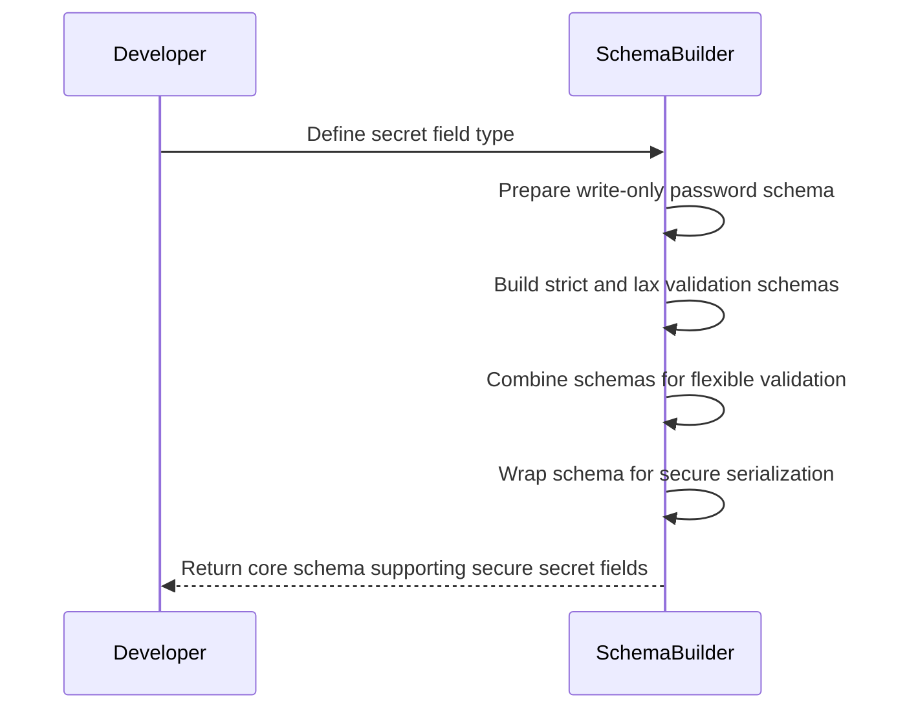

This document outlines how secret field types are validated and serialized to ensure secure handling in data models and APIs. The process prepares a write-only password schema, builds both strict and lax validation modes, combines them for flexible validation, and wraps the result to support secure serialization of secret values.

The main steps are:

- Prepare a JSON schema for the secret field
- Build strict and lax validation schemas
- Combine schemas using a union for flexible validation
- Wrap the result to support secure serialization



# Spec

## Detailed View of the Program's Functionality

a. Preparing the JSON Schema for Secret Fields

The process begins by setting up a helper function that prepares the JSON schema for a secret field. This function takes a core schema and a handler, generates the JSON schema for the inner secret type, and then updates the resulting schema to ensure it is treated as a password field. Specifically, it sets the type to "string", marks the field as write-only (so it won't be shown in outputs), and sets the format to "password". This ensures that, when generating documentation or <SwmToken path="pydantic/json_schema.py" pos="273:22:22" line-data="        # definitions, which would also work better in a generated OpenAPI client, etc.">`OpenAPI`</SwmToken> specs, secret fields are properly hidden and identified as sensitive.

b. Creating Strict and Lax Validation Schemas

Next, another helper function is defined to build the core schema for secret validation and serialization. This function takes a strictness flag and creates a schema for the secret type with the appropriate strictness setting. It constructs a validator that will create the secret type from the input, and then wraps this in a schema that can handle both direct instances of the secret type and raw input that needs validation. This is achieved by creating a union schema that accepts either an already-constructed secret instance or a value that matches the inner validation schema.

c. Combining Schemas Using Union Schema

The union schema function is called to combine the two validation strategies: one that checks if the value is already an instance of the secret type, and another that validates the raw input according to the inner schema. The union schema function iterates over each possible schema choice, attempts to generate a JSON schema for each, and collects the valid ones. If a choice cannot be represented as a JSON schema, a warning is emitted and that choice is skipped. If only one valid schema remains, it is returned directly; otherwise, a union schema using <SwmToken path="pydantic/types.py" pos="1164:6:6" line-data="        field_schema.pop(&#39;anyOf&#39;, None)  # remove the bytes/str union">`anyOf`</SwmToken> is returned, allowing for flexible validation.

d. Returning the Final Schema Supporting Secure Secret Fields

After constructing the strict and lax schemas, the function returns a schema that can switch between strict and lax validation modes. This is done using a <SwmToken path="pydantic/types.py" pos="1785:5:5" line-data="        return core_schema.lax_or_strict_schema(">`lax_or_strict_schema`</SwmToken> wrapper, which takes both the lax and strict schemas and allows the validation mode to be configured downstream. Additionally, the JSON schema preparation function is attached as metadata, so that when generating the JSON schema, the secret field is always treated as a password.

e. Generating JSON Schema for a Core Schema

When generating the JSON schema for a core schema, the process first checks if the schema references an existing definition. If so, it returns a reference to that schema to avoid duplication. If not, it extracts any metadata and applies updates or extras as needed. Custom modification and annotation functions can be applied in sequence, allowing for extensibility and customization of the schema output. Finally, the schema is generated, and if it is a core schema, it is registered in the definitions to ensure proper referencing.

f. Switching Between Strict and Lax Secret Validation

The schema for secret fields is constructed to support both strict and lax validation modes. The function responsible for this calls the secret schema builder twice—once for strict mode and once for lax mode—and combines the results using a <SwmToken path="pydantic/types.py" pos="1785:5:5" line-data="        return core_schema.lax_or_strict_schema(">`lax_or_strict_schema`</SwmToken> wrapper. This allows the secret type to adapt its validation behavior based on configuration, supporting both strict and permissive input handling.

g. Defining Secret Validation and Serialization Logic

The secret schema builder merges the strictness flag into the inner schema and creates a validator for it. It then constructs a union schema that accepts either an instance of the secret type or a value that matches the validation schema. This ensures that both direct instances and raw input can be handled. The result is wrapped in a <SwmToken path="pydantic/types.py" pos="1769:5:5" line-data="            return core_schema.json_or_python_schema(">`json_or_python_schema`</SwmToken> wrapper, which specifies how to validate and serialize the value, ensuring that secrets are properly handled on both input and output.

h. Generating the Final JSON Schema

The <SwmToken path="pydantic/types.py" pos="1769:5:5" line-data="            return core_schema.json_or_python_schema(">`json_or_python_schema`</SwmToken> function is responsible for generating the final JSON schema. It extracts the JSON schema part of the input and passes it to the core schema generator. This is where the actual JSON schema is built, which is what downstream consumers (such as <SwmToken path="pydantic/json_schema.py" pos="273:22:22" line-data="        # definitions, which would also work better in a generated OpenAPI client, etc.">`OpenAPI`</SwmToken> generators) use to understand how to handle secret fields.

i. Summary

The overall flow ensures that secret fields in Pydantic models are validated and serialized securely, supporting both strict and lax validation modes, and are always represented as password fields in generated JSON schemas. The process is extensible and ensures that secret values are never exposed in outputs, while still allowing for flexible input handling and proper documentation generation.

# Rule Definition

| Paragraph Name                                                                                                                                                                                                                                                                                                                                                                                                                                                                                                                                                                                                                                                                                                                                                                                                                                                                                                                                               | Rule ID | Category          | Description                                                                                                                                                                                                                                                                                                                                                                                                                                                                                                                                                                                                                                                                                                                                                                                                                                                                                                                                                                                                                                                                                                                        | Conditions                                                                                                                                                                                                                                                                                                                                                                   | Remarks                                                                                                                                                                                                                                                                                                                                                                                                                                                                                                                                                                                                                                                                             |
| ------------------------------------------------------------------------------------------------------------------------------------------------------------------------------------------------------------------------------------------------------------------------------------------------------------------------------------------------------------------------------------------------------------------------------------------------------------------------------------------------------------------------------------------------------------------------------------------------------------------------------------------------------------------------------------------------------------------------------------------------------------------------------------------------------------------------------------------------------------------------------------------------------------------------------------------------------------ | ------- | ----------------- | ---------------------------------------------------------------------------------------------------------------------------------------------------------------------------------------------------------------------------------------------------------------------------------------------------------------------------------------------------------------------------------------------------------------------------------------------------------------------------------------------------------------------------------------------------------------------------------------------------------------------------------------------------------------------------------------------------------------------------------------------------------------------------------------------------------------------------------------------------------------------------------------------------------------------------------------------------------------------------------------------------------------------------------------------------------------------------------------------------------------------------------- | ---------------------------------------------------------------------------------------------------------------------------------------------------------------------------------------------------------------------------------------------------------------------------------------------------------------------------------------------------------------------------- | ----------------------------------------------------------------------------------------------------------------------------------------------------------------------------------------------------------------------------------------------------------------------------------------------------------------------------------------------------------------------------------------------------------------------------------------------------------------------------------------------------------------------------------------------------------------------------------------------------------------------------------------------------------------------------------- |
| class Secret, class <SwmToken path="pydantic/types.py" pos="79:2:2" line-data="    &#39;SecretStr&#39;,">`SecretStr`</SwmToken>, class <SwmToken path="pydantic/types.py" pos="80:2:2" line-data="    &#39;SecretBytes&#39;,">`SecretBytes`</SwmToken>, class <SwmToken path="pydantic/types.py" pos="1737:4:4" line-data="    value: _SecretField[SecretType], info: core_schema.SerializationInfo">`_SecretField`</SwmToken>, <SwmToken path="pydantic/types.py" pos="1534:0:0" line-data="SecretType = TypeVar(&#39;SecretType&#39;, covariant=True)">`SecretType`</SwmToken> definitions and usage                                                                                                                                                                                                                                                                                                                                                       | RL-001  | Data Assignment   | Secret types must be able to wrap basic types (such as str, bytes, int) and allow for custom secret types with constraints on the underlying value. Constraints on the underlying type must be enforced during validation and reflected in the generated JSON schema.                                                                                                                                                                                                                                                                                                                                                                                                                                                                                                                                                                                                                                                                                                                                                                                                                                                              | When a field is declared as a Secret type or a subclass thereof, optionally parameterized with constraints (<SwmToken path="pydantic/types.py" pos="917:27:29" line-data="        Attributes of modules may be separated from the module by `:` or `.`, e.g. if `&#39;math:cos&#39;` is provided,">`e.g`</SwmToken>., Secret\[Annotated\[int, Field(gt=0, strict=True)\]\]). | Underlying type can be any type, including Annotated types with constraints. Constraints (<SwmToken path="pydantic/types.py" pos="917:27:29" line-data="        Attributes of modules may be separated from the module by `:` or `.`, e.g. if `&#39;math:cos&#39;` is provided,">`e.g`</SwmToken>., gt, lt, <SwmToken path="pydantic/types.py" pos="665:1:1" line-data="    min_length: int \| None = None,">`min_length`</SwmToken>, <SwmToken path="pydantic/types.py" pos="666:1:1" line-data="    max_length: int \| None = None,">`max_length`</SwmToken>) must be enforced and reflected in the schema.                                                                       |
| Secret.<SwmToken path="pydantic/types.py" pos="2869:1:1" line-data="    get_pydantic_core_schema: Callable[[Any, GetCoreSchemaHandler], CoreSchema] \| None = None">`get_pydantic_core_schema`</SwmToken>, <SwmToken path="pydantic/types.py" pos="1737:4:4" line-data="    value: _SecretField[SecretType], info: core_schema.SerializationInfo">`_SecretField`</SwmToken>.<SwmToken path="pydantic/types.py" pos="2869:1:1" line-data="    get_pydantic_core_schema: Callable[[Any, GetCoreSchemaHandler], CoreSchema] \| None = None">`get_pydantic_core_schema`</SwmToken>                                                                                                                                                                                                                                                                                                                                                                               | RL-002  | Data Assignment   | The core schema for a secret type must be a dictionary with top-level keys: 'type' (set to 'lax-or-strict'), <SwmToken path="pydantic/types.py" pos="1786:1:1" line-data="            lax_schema=get_secret_schema(strict=False),">`lax_schema`</SwmToken>, <SwmToken path="pydantic/types.py" pos="1787:1:1" line-data="            strict_schema=get_secret_schema(strict=True),">`strict_schema`</SwmToken>, and 'metadata'. Each of <SwmToken path="pydantic/types.py" pos="1786:1:1" line-data="            lax_schema=get_secret_schema(strict=False),">`lax_schema`</SwmToken> and <SwmToken path="pydantic/types.py" pos="1787:1:1" line-data="            strict_schema=get_secret_schema(strict=True),">`strict_schema`</SwmToken> must be a dictionary with keys: 'type' (set to 'json-or-python'), <SwmToken path="pydantic/types.py" pos="1770:1:1" line-data="                python_schema=core_schema.union_schema(">`python_schema`</SwmToken>, <SwmToken path="pydantic/types.py" pos="1754:1:1" line-data="            json_schema = handler(cls._inner_schema)">`json_schema`</SwmToken>, and 'serialization'. | Whenever a core schema is generated for a Secret type.                                                                                                                                                                                                                                                                                                                       | Top-level keys: type (string, value 'lax-or-strict'), <SwmToken path="pydantic/types.py" pos="1786:1:1" line-data="            lax_schema=get_secret_schema(strict=False),">`lax_schema`</SwmToken> (dict), <SwmToken path="pydantic/types.py" pos="1787:1:1" line-data="            strict_schema=get_secret_schema(strict=True),">`strict_schema`</SwmToken> (dict), metadata (dict). Nested keys as described. All schemas are dicts following the <SwmToken path="pydantic/types.py" pos="1752:25:25" line-data="    def __get_pydantic_core_schema__(cls, source: type[Any], handler: GetCoreSchemaHandler) -&gt; core_schema.CoreSchema:">`core_schema`</SwmToken> structure. |
| Secret.<SwmToken path="pydantic/types.py" pos="2869:1:1" line-data="    get_pydantic_core_schema: Callable[[Any, GetCoreSchemaHandler], CoreSchema] \| None = None">`get_pydantic_core_schema`</SwmToken>, <SwmToken path="pydantic/types.py" pos="1737:4:4" line-data="    value: _SecretField[SecretType], info: core_schema.SerializationInfo">`_SecretField`</SwmToken>.<SwmToken path="pydantic/types.py" pos="2869:1:1" line-data="    get_pydantic_core_schema: Callable[[Any, GetCoreSchemaHandler], CoreSchema] \| None = None">`get_pydantic_core_schema`</SwmToken>                                                                                                                                                                                                                                                                                                                                                                               | RL-003  | Conditional Logic | The validation logic for secret fields must accept as input either a raw value of the underlying type or an instance of the secret type. After validation, the output must always be an instance of the secret type wrapping the validated value.                                                                                                                                                                                                                                                                                                                                                                                                                                                                                                                                                                                                                                                                                                                                                                                                                                                                                  | When validating input for a field of a Secret type.                                                                                                                                                                                                                                                                                                                          | Input: raw value (<SwmToken path="pydantic/types.py" pos="917:27:29" line-data="        Attributes of modules may be separated from the module by `:` or `.`, e.g. if `&#39;math:cos&#39;` is provided,">`e.g`</SwmToken>., string for <SwmToken path="pydantic/types.py" pos="79:2:2" line-data="    &#39;SecretStr&#39;,">`SecretStr`</SwmToken>) or instance of Secret type. Output: always instance of Secret type.                                                                                                                                                                                                                                                             |
| def <SwmToken path="pydantic/types.py" pos="1565:2:2" line-data="def _serialize_secret(value: Secret[SecretType], info: core_schema.SerializationInfo) -&gt; str \| Secret[SecretType]:">`_serialize_secret`</SwmToken>, def <SwmToken path="pydantic/types.py" pos="1779:1:1" line-data="                    _serialize_secret_field,">`_serialize_secret_field`</SwmToken>, Secret.<SwmToken path="pydantic/types.py" pos="2869:1:1" line-data="    get_pydantic_core_schema: Callable[[Any, GetCoreSchemaHandler], CoreSchema] \| None = None">`get_pydantic_core_schema`</SwmToken>, <SwmToken path="pydantic/types.py" pos="1737:4:4" line-data="    value: _SecretField[SecretType], info: core_schema.SerializationInfo">`_SecretField`</SwmToken>.<SwmToken path="pydantic/types.py" pos="2869:1:1" line-data="    get_pydantic_core_schema: Callable[[Any, GetCoreSchemaHandler], CoreSchema] \| None = None">`get_pydantic_core_schema`</SwmToken> | RL-004  | Computation       | When serializing a secret field to JSON, the output must always be a masked value (<SwmToken path="pydantic/types.py" pos="917:27:29" line-data="        Attributes of modules may be separated from the module by `:` or `.`, e.g. if `&#39;math:cos&#39;` is provided,">`e.g`</SwmToken>., '\*\*\*\*\*\*\*\*\*\*'), never the real value.                                                                                                                                                                                                                                                                                                                                                                                                                                                                                                                                                                                                                                                                                                                                                                                        | When serializing a Secret field to JSON (<SwmToken path="pydantic/types.py" pos="1566:3:5" line-data="    if info.mode == &#39;json&#39;:">`info.mode`</SwmToken> == 'json').                                                                                                                                                                                                | Output: string (<SwmToken path="pydantic/types.py" pos="917:27:29" line-data="        Attributes of modules may be separated from the module by `:` or `.`, e.g. if `&#39;math:cos&#39;` is provided,">`e.g`</SwmToken>., '**') for non-empty secrets, '' for empty secrets. For** <SwmToken path="pydantic/types.py" pos="80:2:2" line-data="    &#39;SecretBytes&#39;,">`SecretBytes`</SwmToken>**, output is bytes(b'**').                                                                                                                                                                                                                                                       |
| <SwmToken path="pydantic/types.py" pos="1737:4:4" line-data="    value: _SecretField[SecretType], info: core_schema.SerializationInfo">`_SecretField`</SwmToken>.<SwmToken path="pydantic/types.py" pos="2869:1:1" line-data="    get_pydantic_core_schema: Callable[[Any, GetCoreSchemaHandler], CoreSchema] \| None = None">`get_pydantic_core_schema`</SwmToken>, <SwmToken path="pydantic/types.py" pos="1753:3:3" line-data="        def get_json_schema(_core_schema: core_schema.CoreSchema, handler: GetJsonSchemaHandler) -&gt; JsonSchemaValue:">`get_json_schema`</SwmToken> function in metadata, <SwmPath>[pydantic/json_schema.py](pydantic/json_schema.py)</SwmPath> <SwmToken path="pydantic/json_schema.py" pos="96:4:4" line-data="See [`GenerateJsonSchema.render_warning_message`][pydantic.json_schema.GenerateJsonSchema.render_warning_message]">`GenerateJsonSchema`</SwmToken>                                                      | RL-005  | Data Assignment   | The generated JSON schema for a secret field must include 'type': 'string', 'format': 'password', <SwmToken path="pydantic/types.py" pos="1758:1:1" line-data="                writeOnly=True,">`writeOnly`</SwmToken>: true, and any additional constraints from the underlying type (<SwmToken path="pydantic/types.py" pos="917:27:29" line-data="        Attributes of modules may be separated from the module by `:` or `.`, e.g. if `&#39;math:cos&#39;` is provided,">`e.g`</SwmToken>., <SwmToken path="pydantic/json_schema.py" pos="1972:27:27" line-data="        json_schema = {&#39;type&#39;: &#39;string&#39;, &#39;format&#39;: &#39;uri&#39;, &#39;minLength&#39;: 1}">`minLength`</SwmToken>, <SwmToken path="pydantic/json_schema.py" pos="2306:7:7" line-data="            &#39;max_length&#39;: &#39;maxLength&#39;,">`maxLength`</SwmToken>).                                                                                                                                                                                                                                                               | When generating JSON schema for a Secret field.                                                                                                                                                                                                                                                                                                                              | JSON schema output: type (string), format (password), <SwmToken path="pydantic/types.py" pos="1758:1:1" line-data="                writeOnly=True,">`writeOnly`</SwmToken> (true), plus any constraints from the underlying type.                                                                                                                                                                                                                                                                                                                                                                                                                                                   |
| <SwmToken path="pydantic/types.py" pos="1737:4:4" line-data="    value: _SecretField[SecretType], info: core_schema.SerializationInfo">`_SecretField`</SwmToken>.<SwmToken path="pydantic/types.py" pos="2869:1:1" line-data="    get_pydantic_core_schema: Callable[[Any, GetCoreSchemaHandler], CoreSchema] \| None = None">`get_pydantic_core_schema`</SwmToken>, Secret.<SwmToken path="pydantic/types.py" pos="2869:1:1" line-data="    get_pydantic_core_schema: Callable[[Any, GetCoreSchemaHandler], CoreSchema] \| None = None">`get_pydantic_core_schema`</SwmToken>                                                                                                                                                                                                                                                                                                                                                                               | RL-006  | Conditional Logic | The system must support both strict and lax validation modes for secret types. Strict mode enforces exact types, while lax mode allows type coercion. The core schema must include both modes.                                                                                                                                                                                                                                                                                                                                                                                                                                                                                                                                                                                                                                                                                                                                                                                                                                                                                                                                     | When generating the core schema for a Secret type.                                                                                                                                                                                                                                                                                                                           | Core schema includes both <SwmToken path="pydantic/types.py" pos="1786:1:1" line-data="            lax_schema=get_secret_schema(strict=False),">`lax_schema`</SwmToken> and <SwmToken path="pydantic/types.py" pos="1787:1:1" line-data="            strict_schema=get_secret_schema(strict=True),">`strict_schema`</SwmToken>, each with their own validation logic.                                                                                                                                                                                                                                                                                                               |
| Secret class, Secret.<SwmToken path="pydantic/types.py" pos="2869:1:1" line-data="    get_pydantic_core_schema: Callable[[Any, GetCoreSchemaHandler], CoreSchema] \| None = None">`get_pydantic_core_schema`</SwmToken>, <SwmToken path="pydantic/types.py" pos="1737:4:4" line-data="    value: _SecretField[SecretType], info: core_schema.SerializationInfo">`_SecretField`</SwmToken>.<SwmToken path="pydantic/types.py" pos="2869:1:1" line-data="    get_pydantic_core_schema: Callable[[Any, GetCoreSchemaHandler], CoreSchema] \| None = None">`get_pydantic_core_schema`</SwmToken>                                                                                                                                                                                                                                                                                                                                                                 | RL-007  | Data Assignment   | The system must allow for custom secret types and constraints on the underlying value, and these constraints must be enforced during validation and reflected in the generated JSON schema.                                                                                                                                                                                                                                                                                                                                                                                                                                                                                                                                                                                                                                                                                                                                                                                                                                                                                                                                        | When a custom Secret subclass or parameterized Secret type is used.                                                                                                                                                                                                                                                                                                          | Constraints can be any supported by the underlying type (<SwmToken path="pydantic/types.py" pos="917:27:29" line-data="        Attributes of modules may be separated from the module by `:` or `.`, e.g. if `&#39;math:cos&#39;` is provided,">`e.g`</SwmToken>., <SwmToken path="pydantic/types.py" pos="665:1:1" line-data="    min_length: int \| None = None,">`min_length`</SwmToken>, <SwmToken path="pydantic/types.py" pos="666:1:1" line-data="    max_length: int \| None = None,">`max_length`</SwmToken>, gt, lt, pattern, etc.).                                                                                                                                      |

# User Stories

## User Story 1: Defining and using secret types with constraints

---

### Story Description:

As a user of data models, I want to declare secret fields that wrap basic or custom types and specify constraints on the underlying value so that my data is validated and documented according to my security and business requirements.

---

### Business Rule Mapping:

| Rule ID | Paragraph Name                                                                                                                                                                                                                                                                                                                                                                                                                                                                                                                                                                                         | Rule Description                                                                                                                                                                                                                                                      |
| ------- | ------------------------------------------------------------------------------------------------------------------------------------------------------------------------------------------------------------------------------------------------------------------------------------------------------------------------------------------------------------------------------------------------------------------------------------------------------------------------------------------------------------------------------------------------------------------------------------------------------ | --------------------------------------------------------------------------------------------------------------------------------------------------------------------------------------------------------------------------------------------------------------------- |
| RL-001  | class Secret, class <SwmToken path="pydantic/types.py" pos="79:2:2" line-data="    &#39;SecretStr&#39;,">`SecretStr`</SwmToken>, class <SwmToken path="pydantic/types.py" pos="80:2:2" line-data="    &#39;SecretBytes&#39;,">`SecretBytes`</SwmToken>, class <SwmToken path="pydantic/types.py" pos="1737:4:4" line-data="    value: _SecretField[SecretType], info: core_schema.SerializationInfo">`_SecretField`</SwmToken>, <SwmToken path="pydantic/types.py" pos="1534:0:0" line-data="SecretType = TypeVar(&#39;SecretType&#39;, covariant=True)">`SecretType`</SwmToken> definitions and usage | Secret types must be able to wrap basic types (such as str, bytes, int) and allow for custom secret types with constraints on the underlying value. Constraints on the underlying type must be enforced during validation and reflected in the generated JSON schema. |
| RL-007  | Secret class, Secret.<SwmToken path="pydantic/types.py" pos="2869:1:1" line-data="    get_pydantic_core_schema: Callable[[Any, GetCoreSchemaHandler], CoreSchema] \| None = None">`get_pydantic_core_schema`</SwmToken>, <SwmToken path="pydantic/types.py" pos="1737:4:4" line-data="    value: _SecretField[SecretType], info: core_schema.SerializationInfo">`_SecretField`</SwmToken>.<SwmToken path="pydantic/types.py" pos="2869:1:1" line-data="    get_pydantic_core_schema: Callable[[Any, GetCoreSchemaHandler], CoreSchema] \| None = None">`get_pydantic_core_schema`</SwmToken>           | The system must allow for custom secret types and constraints on the underlying value, and these constraints must be enforced during validation and reflected in the generated JSON schema.                                                                           |

---

### Relevant Functionality:

- **class Secret**
  1. **RL-001:**
     - When a Secret type is instantiated, store the wrapped value.
     - If constraints are present on the underlying type, validate the value against those constraints before wrapping.
     - When generating the core schema, extract constraints from the underlying type and include them in the schema metadata.
- **Secret class**
  1. **RL-007:**
     - When generating the schema, extract constraints from the underlying type.
     - Ensure validation logic enforces these constraints.
     - Ensure JSON schema output includes these constraints.

## User Story 2: Schema generation with strict/lax modes and correct metadata

---

### Story Description:

As a system generating schemas for secret fields, I want to produce a core schema that supports both strict and lax validation modes, includes the correct nested schema structure, and outputs JSON schema metadata that reflects secrecy and any constraints so that consumers of the schema understand both the validation logic and the sensitive nature of the field.

---

### Business Rule Mapping:

| Rule ID | Paragraph Name                                                                                                                                                                                                                                                                                                                                                                                                                                                                                                                                                                                                                                                                                                                                                                                                                                                                                          | Rule Description                                                                                                                                                                                                                                                                                                                                                                                                                                                                                                                                                                                                                                                                                                                                                                                                                                                                                                                                                                                                                                                                                                                   |
| ------- | ------------------------------------------------------------------------------------------------------------------------------------------------------------------------------------------------------------------------------------------------------------------------------------------------------------------------------------------------------------------------------------------------------------------------------------------------------------------------------------------------------------------------------------------------------------------------------------------------------------------------------------------------------------------------------------------------------------------------------------------------------------------------------------------------------------------------------------------------------------------------------------------------------- | ---------------------------------------------------------------------------------------------------------------------------------------------------------------------------------------------------------------------------------------------------------------------------------------------------------------------------------------------------------------------------------------------------------------------------------------------------------------------------------------------------------------------------------------------------------------------------------------------------------------------------------------------------------------------------------------------------------------------------------------------------------------------------------------------------------------------------------------------------------------------------------------------------------------------------------------------------------------------------------------------------------------------------------------------------------------------------------------------------------------------------------- |
| RL-002  | Secret.<SwmToken path="pydantic/types.py" pos="2869:1:1" line-data="    get_pydantic_core_schema: Callable[[Any, GetCoreSchemaHandler], CoreSchema] \| None = None">`get_pydantic_core_schema`</SwmToken>, <SwmToken path="pydantic/types.py" pos="1737:4:4" line-data="    value: _SecretField[SecretType], info: core_schema.SerializationInfo">`_SecretField`</SwmToken>.<SwmToken path="pydantic/types.py" pos="2869:1:1" line-data="    get_pydantic_core_schema: Callable[[Any, GetCoreSchemaHandler], CoreSchema] \| None = None">`get_pydantic_core_schema`</SwmToken>                                                                                                                                                                                                                                                                                                                          | The core schema for a secret type must be a dictionary with top-level keys: 'type' (set to 'lax-or-strict'), <SwmToken path="pydantic/types.py" pos="1786:1:1" line-data="            lax_schema=get_secret_schema(strict=False),">`lax_schema`</SwmToken>, <SwmToken path="pydantic/types.py" pos="1787:1:1" line-data="            strict_schema=get_secret_schema(strict=True),">`strict_schema`</SwmToken>, and 'metadata'. Each of <SwmToken path="pydantic/types.py" pos="1786:1:1" line-data="            lax_schema=get_secret_schema(strict=False),">`lax_schema`</SwmToken> and <SwmToken path="pydantic/types.py" pos="1787:1:1" line-data="            strict_schema=get_secret_schema(strict=True),">`strict_schema`</SwmToken> must be a dictionary with keys: 'type' (set to 'json-or-python'), <SwmToken path="pydantic/types.py" pos="1770:1:1" line-data="                python_schema=core_schema.union_schema(">`python_schema`</SwmToken>, <SwmToken path="pydantic/types.py" pos="1754:1:1" line-data="            json_schema = handler(cls._inner_schema)">`json_schema`</SwmToken>, and 'serialization'. |
| RL-005  | <SwmToken path="pydantic/types.py" pos="1737:4:4" line-data="    value: _SecretField[SecretType], info: core_schema.SerializationInfo">`_SecretField`</SwmToken>.<SwmToken path="pydantic/types.py" pos="2869:1:1" line-data="    get_pydantic_core_schema: Callable[[Any, GetCoreSchemaHandler], CoreSchema] \| None = None">`get_pydantic_core_schema`</SwmToken>, <SwmToken path="pydantic/types.py" pos="1753:3:3" line-data="        def get_json_schema(_core_schema: core_schema.CoreSchema, handler: GetJsonSchemaHandler) -&gt; JsonSchemaValue:">`get_json_schema`</SwmToken> function in metadata, <SwmPath>[pydantic/json_schema.py](pydantic/json_schema.py)</SwmPath> <SwmToken path="pydantic/json_schema.py" pos="96:4:4" line-data="See [`GenerateJsonSchema.render_warning_message`][pydantic.json_schema.GenerateJsonSchema.render_warning_message]">`GenerateJsonSchema`</SwmToken> | The generated JSON schema for a secret field must include 'type': 'string', 'format': 'password', <SwmToken path="pydantic/types.py" pos="1758:1:1" line-data="                writeOnly=True,">`writeOnly`</SwmToken>: true, and any additional constraints from the underlying type (<SwmToken path="pydantic/types.py" pos="917:27:29" line-data="        Attributes of modules may be separated from the module by `:` or `.`, e.g. if `&#39;math:cos&#39;` is provided,">`e.g`</SwmToken>., <SwmToken path="pydantic/json_schema.py" pos="1972:27:27" line-data="        json_schema = {&#39;type&#39;: &#39;string&#39;, &#39;format&#39;: &#39;uri&#39;, &#39;minLength&#39;: 1}">`minLength`</SwmToken>, <SwmToken path="pydantic/json_schema.py" pos="2306:7:7" line-data="            &#39;max_length&#39;: &#39;maxLength&#39;,">`maxLength`</SwmToken>).                                                                                                                                                                                                                                                               |
| RL-006  | <SwmToken path="pydantic/types.py" pos="1737:4:4" line-data="    value: _SecretField[SecretType], info: core_schema.SerializationInfo">`_SecretField`</SwmToken>.<SwmToken path="pydantic/types.py" pos="2869:1:1" line-data="    get_pydantic_core_schema: Callable[[Any, GetCoreSchemaHandler], CoreSchema] \| None = None">`get_pydantic_core_schema`</SwmToken>, Secret.<SwmToken path="pydantic/types.py" pos="2869:1:1" line-data="    get_pydantic_core_schema: Callable[[Any, GetCoreSchemaHandler], CoreSchema] \| None = None">`get_pydantic_core_schema`</SwmToken>                                                                                                                                                                                                                                                                                                                          | The system must support both strict and lax validation modes for secret types. Strict mode enforces exact types, while lax mode allows type coercion. The core schema must include both modes.                                                                                                                                                                                                                                                                                                                                                                                                                                                                                                                                                                                                                                                                                                                                                                                                                                                                                                                                     |

---

### Relevant Functionality:

- **Secret.get_pydantic_core_schema**
  1. **RL-002:**
     - On schema generation, build a dict with the required top-level keys.
     - For each of <SwmToken path="pydantic/types.py" pos="1786:1:1" line-data="            lax_schema=get_secret_schema(strict=False),">`lax_schema`</SwmToken> and <SwmToken path="pydantic/types.py" pos="1787:1:1" line-data="            strict_schema=get_secret_schema(strict=True),">`strict_schema`</SwmToken>, build a dict with the required nested keys and schemas.
     - Attach metadata for JSON schema customization.
- **\_SecretField.get_pydantic_core_schema**
  1. **RL-005:**
     - In the core schema metadata, include a function that updates the JSON schema with the required keys and constraints.
     - When the JSON schema is generated, this function is called to inject the correct metadata.
  2. **RL-006:**
     - For each mode, generate a schema with strict or lax validation for the underlying type.
     - Attach both schemas to the core schema under the appropriate keys.

## User Story 3: Validation and serialization logic for secret fields

---

### Story Description:

As a user submitting or retrieving data with secret fields, I want to be able to provide either raw or already-wrapped secret values, always receive a secret instance after validation, and ensure that secret values are always masked when serialized to JSON so that my sensitive data is protected and handled consistently.

---

### Business Rule Mapping:

| Rule ID | Paragraph Name                                                                                                                                                                                                                                                                                                                                                                                                                                                                                                                                                                                                                                                                                                                                                                                                                                                                                                                                               | Rule Description                                                                                                                                                                                                                                                                                                                            |
| ------- | ------------------------------------------------------------------------------------------------------------------------------------------------------------------------------------------------------------------------------------------------------------------------------------------------------------------------------------------------------------------------------------------------------------------------------------------------------------------------------------------------------------------------------------------------------------------------------------------------------------------------------------------------------------------------------------------------------------------------------------------------------------------------------------------------------------------------------------------------------------------------------------------------------------------------------------------------------------ | ------------------------------------------------------------------------------------------------------------------------------------------------------------------------------------------------------------------------------------------------------------------------------------------------------------------------------------------- |
| RL-003  | Secret.<SwmToken path="pydantic/types.py" pos="2869:1:1" line-data="    get_pydantic_core_schema: Callable[[Any, GetCoreSchemaHandler], CoreSchema] \| None = None">`get_pydantic_core_schema`</SwmToken>, <SwmToken path="pydantic/types.py" pos="1737:4:4" line-data="    value: _SecretField[SecretType], info: core_schema.SerializationInfo">`_SecretField`</SwmToken>.<SwmToken path="pydantic/types.py" pos="2869:1:1" line-data="    get_pydantic_core_schema: Callable[[Any, GetCoreSchemaHandler], CoreSchema] \| None = None">`get_pydantic_core_schema`</SwmToken>                                                                                                                                                                                                                                                                                                                                                                               | The validation logic for secret fields must accept as input either a raw value of the underlying type or an instance of the secret type. After validation, the output must always be an instance of the secret type wrapping the validated value.                                                                                           |
| RL-004  | def <SwmToken path="pydantic/types.py" pos="1565:2:2" line-data="def _serialize_secret(value: Secret[SecretType], info: core_schema.SerializationInfo) -&gt; str \| Secret[SecretType]:">`_serialize_secret`</SwmToken>, def <SwmToken path="pydantic/types.py" pos="1779:1:1" line-data="                    _serialize_secret_field,">`_serialize_secret_field`</SwmToken>, Secret.<SwmToken path="pydantic/types.py" pos="2869:1:1" line-data="    get_pydantic_core_schema: Callable[[Any, GetCoreSchemaHandler], CoreSchema] \| None = None">`get_pydantic_core_schema`</SwmToken>, <SwmToken path="pydantic/types.py" pos="1737:4:4" line-data="    value: _SecretField[SecretType], info: core_schema.SerializationInfo">`_SecretField`</SwmToken>.<SwmToken path="pydantic/types.py" pos="2869:1:1" line-data="    get_pydantic_core_schema: Callable[[Any, GetCoreSchemaHandler], CoreSchema] \| None = None">`get_pydantic_core_schema`</SwmToken> | When serializing a secret field to JSON, the output must always be a masked value (<SwmToken path="pydantic/types.py" pos="917:27:29" line-data="        Attributes of modules may be separated from the module by `:` or `.`, e.g. if `&#39;math:cos&#39;` is provided,">`e.g`</SwmToken>., '\*\*\*\*\*\*\*\*\*\*'), never the real value. |

---

### Relevant Functionality:

- **Secret.get_pydantic_core_schema**
  1. **RL-003:**
     - If input is already a Secret instance, extract the underlying value.
     - Validate the value against the underlying type's schema.
     - Wrap the validated value in a new Secret instance and return.
- **def** <SwmToken path="pydantic/types.py" pos="1565:2:2" line-data="def _serialize_secret(value: Secret[SecretType], info: core_schema.SerializationInfo) -&gt; str | Secret[SecretType]:">`_serialize_secret`</SwmToken>
  1. **RL-004:**
     - On serialization to JSON, call the \_display or <SwmToken path="pydantic/types.py" pos="1732:2:2" line-data="def _secret_display(value: SecretType) -&gt; str:  # type: ignore">`_secret_display`</SwmToken> method.
     - Return the masked value as a string (or bytes for <SwmToken path="pydantic/types.py" pos="80:2:2" line-data="    &#39;SecretBytes&#39;,">`SecretBytes`</SwmToken>).

# Code Walkthrough

## Building the core schema for secret types

```mermaid
%%{init: {"flowchart": {"defaultRenderer": "elk"}} }%%
flowchart TD
    node1["Prepare JSON schema for secret field"] --> node2["Create strict (strict=True) and lax (strict=False) validation schemas"]
    click node1 openCode "pydantic/types.py:1752:1783"
    node2 --> node3["Combine schemas using union_schema for flexible validation"]
    click node2 openCode "pydantic/types.py:1763:1778"
    click node3 openCode "pydantic/json_schema.py:1241:1255"
    node3 --> node4["Return final schema supporting secure secret fields"]
    click node4 openCode "pydantic/types.py:1785:1789"


subgraph node3 [union_schema]
  sgmain_1_node1["Start: Generate union schema"] --> sgmain_1_loop1
  click sgmain_1_node1 openCode "pydantic/json_schema.py:1241:1264"
  subgraph sgmain_1_loop1["For each possible schema choice in 'choices'"]
  sgmain_1_node2{"Is choice valid for JSON schema?"}
  click sgmain_1_node2 openCode "pydantic/json_schema.py:1253:1262"
  sgmain_1_node2 -->|"Yes"| sgmain_1_node3["Generate schema for choice"]
  click sgmain_1_node3 openCode "pydantic/json_schema.py:1257:1257"
  sgmain_1_node2 -->|"No"| sgmain_1_node4["Emit warning and skip"]
  click sgmain_1_node4 openCode "pydantic/json_schema.py:1261:1261"
  sgmain_1_node3 --> sgmain_1_node5
  sgmain_1_node4 --> sgmain_1_node5
  end
  sgmain_1_loop1 --> sgmain_1_node6{"Number of valid schemas"}
  click sgmain_1_node6 openCode "pydantic/json_schema.py:1262:1264"
  sgmain_1_node6 -->|"1"| sgmain_1_node7["Return single schema"]
  click sgmain_1_node7 openCode "pydantic/json_schema.py:1263:1263"
  sgmain_1_node6 -->|">1"| sgmain_1_node8["Return union (anyOf) schema"]
  click sgmain_1_node8 openCode "pydantic/json_schema.py:1264:1264"
end

%% Swimm:
%% %%{init: {"flowchart": {"defaultRenderer": "elk"}} }%%
%% flowchart TD
%%     node1["Prepare JSON schema for secret field"] --> node2["Create strict (strict=True) and lax (strict=False) validation schemas"]
%%     click node1 openCode "<SwmPath>[pydantic/types.py](pydantic/types.py)</SwmPath>:1752:1783"
%%     node2 --> node3["Combine schemas using <SwmToken path="pydantic/types.py" pos="1770:5:5" line-data="                python_schema=core_schema.union_schema(">`union_schema`</SwmToken> for flexible validation"]
%%     click node2 openCode "<SwmPath>[pydantic/types.py](pydantic/types.py)</SwmPath>:1763:1778"
%%     click node3 openCode "<SwmPath>[pydantic/json_schema.py](pydantic/json_schema.py)</SwmPath>:1241:1255"
%%     node3 --> node4["Return final schema supporting secure secret fields"]
%%     click node4 openCode "<SwmPath>[pydantic/types.py](pydantic/types.py)</SwmPath>:1785:1789"
%% 
%% 
%% subgraph node3 [<SwmToken path="pydantic/types.py" pos="1770:5:5" line-data="                python_schema=core_schema.union_schema(">`union_schema`</SwmToken>]
%%   sgmain_1_node1["Start: Generate union schema"] --> sgmain_1_loop1
%%   click sgmain_1_node1 openCode "<SwmPath>[pydantic/json_schema.py](pydantic/json_schema.py)</SwmPath>:1241:1264"
%%   subgraph sgmain_1_loop1["For each possible schema choice in 'choices'"]
%%   sgmain_1_node2{"Is choice valid for JSON schema?"}
%%   click sgmain_1_node2 openCode "<SwmPath>[pydantic/json_schema.py](pydantic/json_schema.py)</SwmPath>:1253:1262"
%%   sgmain_1_node2 -->|"Yes"| sgmain_1_node3["Generate schema for choice"]
%%   click sgmain_1_node3 openCode "<SwmPath>[pydantic/json_schema.py](pydantic/json_schema.py)</SwmPath>:1257:1257"
%%   sgmain_1_node2 -->|"No"| sgmain_1_node4["Emit warning and skip"]
%%   click sgmain_1_node4 openCode "<SwmPath>[pydantic/json_schema.py](pydantic/json_schema.py)</SwmPath>:1261:1261"
%%   sgmain_1_node3 --> sgmain_1_node5
%%   sgmain_1_node4 --> sgmain_1_node5
%%   end
%%   sgmain_1_loop1 --> sgmain_1_node6{"Number of valid schemas"}
%%   click sgmain_1_node6 openCode "<SwmPath>[pydantic/json_schema.py](pydantic/json_schema.py)</SwmPath>:1262:1264"
%%   sgmain_1_node6 -->|"1"| sgmain_1_node7["Return single schema"]
%%   click sgmain_1_node7 openCode "<SwmPath>[pydantic/json_schema.py](pydantic/json_schema.py)</SwmPath>:1263:1263"
%%   sgmain_1_node6 -->|">1"| sgmain_1_node8["Return union (<SwmToken path="pydantic/types.py" pos="1164:6:6" line-data="        field_schema.pop(&#39;anyOf&#39;, None)  # remove the bytes/str union">`anyOf`</SwmToken>) schema"]
%%   click sgmain_1_node8 openCode "<SwmPath>[pydantic/json_schema.py](pydantic/json_schema.py)</SwmPath>:1264:1264"
%% end
```



<SwmSnippet path="/pydantic/types.py" line="1752">

---

In <SwmToken path="pydantic/types.py" pos="1752:3:3" line-data="    def __get_pydantic_core_schema__(cls, source: type[Any], handler: GetCoreSchemaHandler) -&gt; core_schema.CoreSchema:">`__get_pydantic_core_schema__`</SwmToken>, we kick things off by defining two helpers: one to tweak the JSON schema for secret fields (so they're treated as passwords and hidden in outputs), and another to build the actual core schema for validation and serialization. We need to call <SwmToken path="pydantic/types.py" pos="1770:5:5" line-data="                python_schema=core_schema.union_schema(">`union_schema`</SwmToken> next because we want to combine different validation strategies (like instance checks and JSON schema validation) into a single schema object, so downstream consumers can handle both cases without extra logic.

```python
    def __get_pydantic_core_schema__(cls, source: type[Any], handler: GetCoreSchemaHandler) -> core_schema.CoreSchema:
        def get_json_schema(_core_schema: core_schema.CoreSchema, handler: GetJsonSchemaHandler) -> JsonSchemaValue:
            json_schema = handler(cls._inner_schema)
            _utils.update_not_none(
                json_schema,
                type='string',
                writeOnly=True,
                format='password',
            )
            return json_schema

        def get_secret_schema(strict: bool) -> CoreSchema:
            inner_schema = {**cls._inner_schema, 'strict': strict}
            json_schema = core_schema.no_info_after_validator_function(
                source,  # construct the type
                inner_schema,  # pyright: ignore[reportArgumentType]
            )
            return core_schema.json_or_python_schema(
                python_schema=core_schema.union_schema(
                    [
                        core_schema.is_instance_schema(source),
                        json_schema,
                    ],
                    custom_error_type=cls._error_kind,
                ),
                json_schema=json_schema,
                serialization=core_schema.plain_serializer_function_ser_schema(
                    _serialize_secret_field,
                    info_arg=True,
                    when_used='always',
                ),
            )

```

---

</SwmSnippet>

### Combining multiple schema choices

```mermaid
%%{init: {"flowchart": {"defaultRenderer": "elk"}} }%%
flowchart TD
    node1["Start: Generate union schema"] --> loop1
    click node1 openCode "pydantic/json_schema.py:1241:1264"
    subgraph loop1["For each possible schema choice in 'choices'"]
      node2{"Is choice valid for JSON schema?"}
      click node2 openCode "pydantic/json_schema.py:1253:1262"
      node2 -->|"Yes"| node3["Generate schema for choice"]
      click node3 openCode "pydantic/json_schema.py:1257:1257"
      node2 -->|"No"| node4["Emit warning and skip"]
      click node4 openCode "pydantic/json_schema.py:1261:1261"
      node3 --> node5
      node4 --> node5
    end
    loop1 --> node6{"Number of valid schemas"}
    click node6 openCode "pydantic/json_schema.py:1262:1264"
    node6 -->|"1"| node7["Return single schema"]
    click node7 openCode "pydantic/json_schema.py:1263:1263"
    node6 -->|">1"| node8["Return union (anyOf) schema"]
    click node8 openCode "pydantic/json_schema.py:1264:1264"

%% Swimm:
%% %%{init: {"flowchart": {"defaultRenderer": "elk"}} }%%
%% flowchart TD
%%     node1["Start: Generate union schema"] --> loop1
%%     click node1 openCode "<SwmPath>[pydantic/json_schema.py](pydantic/json_schema.py)</SwmPath>:1241:1264"
%%     subgraph loop1["For each possible schema choice in 'choices'"]
%%       node2{"Is choice valid for JSON schema?"}
%%       click node2 openCode "<SwmPath>[pydantic/json_schema.py](pydantic/json_schema.py)</SwmPath>:1253:1262"
%%       node2 -->|"Yes"| node3["Generate schema for choice"]
%%       click node3 openCode "<SwmPath>[pydantic/json_schema.py](pydantic/json_schema.py)</SwmPath>:1257:1257"
%%       node2 -->|"No"| node4["Emit warning and skip"]
%%       click node4 openCode "<SwmPath>[pydantic/json_schema.py](pydantic/json_schema.py)</SwmPath>:1261:1261"
%%       node3 --> node5
%%       node4 --> node5
%%     end
%%     loop1 --> node6{"Number of valid schemas"}
%%     click node6 openCode "<SwmPath>[pydantic/json_schema.py](pydantic/json_schema.py)</SwmPath>:1262:1264"
%%     node6 -->|"1"| node7["Return single schema"]
%%     click node7 openCode "<SwmPath>[pydantic/json_schema.py](pydantic/json_schema.py)</SwmPath>:1263:1263"
%%     node6 -->|">1"| node8["Return union (<SwmToken path="pydantic/types.py" pos="1164:6:6" line-data="        field_schema.pop(&#39;anyOf&#39;, None)  # remove the bytes/str union">`anyOf`</SwmToken>) schema"]
%%     click node8 openCode "<SwmPath>[pydantic/json_schema.py](pydantic/json_schema.py)</SwmPath>:1264:1264"
```



<SwmSnippet path="/pydantic/json_schema.py" line="1241">

---

<SwmToken path="pydantic/json_schema.py" pos="1241:3:3" line-data="    def union_schema(self, schema: core_schema.UnionSchema) -&gt; JsonSchemaValue:">`union_schema`</SwmToken> takes a list of possible schemas and runs <SwmToken path="pydantic/json_schema.py" pos="1257:7:7" line-data="                generated.append(self.generate_inner(choice_schema))">`generate_inner`</SwmToken> on each one, collecting the results. This lets us build a JSON schema that accepts any of the provided options, which is useful when a field can be validated in multiple ways. We need to call <SwmToken path="pydantic/json_schema.py" pos="1257:7:7" line-data="                generated.append(self.generate_inner(choice_schema))">`generate_inner`</SwmToken> next to actually produce the JSON schema for each choice in the union.

```python
    def union_schema(self, schema: core_schema.UnionSchema) -> JsonSchemaValue:
        """Generates a JSON schema that matches a schema that allows values matching any of the given schemas.

        Args:
            schema: The core schema.

        Returns:
            The generated JSON schema.
        """
        generated: list[JsonSchemaValue] = []

        choices = schema['choices']
        for choice in choices:
            # choice will be a tuple if an explicit label was provided
            choice_schema = choice[0] if isinstance(choice, tuple) else choice
            try:
                generated.append(self.generate_inner(choice_schema))
            except PydanticOmit:
                continue
            except PydanticInvalidForJsonSchema as exc:
                self.emit_warning('skipped-choice', exc.message)
        if len(generated) == 1:
            return generated[0]
        return self.get_flattened_anyof(generated)
```

---

</SwmSnippet>

### Generating JSON schema for a core schema

```mermaid
%%{init: {"flowchart": {"defaultRenderer": "elk"}} }%%
flowchart TD
    node1["Does the schema reference an existing definition?"] -->|"Yes"| node2["Return reference to existing schema"]
    click node1 openCode "pydantic/json_schema.py:443:448"
    click node2 openCode "pydantic/json_schema.py:447:447"
    node1 -->|"No"| node3["Extract metadata from schema"]
    click node3 openCode "pydantic/json_schema.py:503:504"
    node3 --> node4{"Are there updates or extras in metadata?"}
    click node4 openCode "pydantic/json_schema.py:507:533"
    node4 -->|"Yes"| node5["Apply updates and extras to schema"]
    click node5 openCode "pydantic/json_schema.py:507:533"
    node4 -->|"No"| node6["Continue"]
    node5 --> node6
    node6 --> subgraph loop1["For each custom modification function"]
        node7["Apply modification to schema"]
        click node7 openCode "pydantic/json_schema.py:534:550"
    end
    node6 --> loop1
    loop1 --> subgraph loop2["For each annotation function"]
        node8["Apply annotation to schema"]
        click node8 openCode "pydantic/json_schema.py:552:561"
    end
    loop1 --> loop2
    loop2 --> node9["Generate JSON schema"]
    click node9 openCode "pydantic/json_schema.py:563:563"
    node9 --> node10{"Is this a core schema?"}
    click node10 openCode "pydantic/json_schema.py:564:565"
    node10 -->|"Yes"| node11["Update schema definitions"]
    click node11 openCode "pydantic/json_schema.py:565:565"
    node10 -->|"No"| node12["Return generated JSON schema"]
    click node12 openCode "pydantic/json_schema.py:566:566"
    node11 --> node12

%% Swimm:
%% %%{init: {"flowchart": {"defaultRenderer": "elk"}} }%%
%% flowchart TD
%%     node1["Does the schema reference an existing definition?"] -->|"Yes"| node2["Return reference to existing schema"]
%%     click node1 openCode "<SwmPath>[pydantic/json_schema.py](pydantic/json_schema.py)</SwmPath>:443:448"
%%     click node2 openCode "<SwmPath>[pydantic/json_schema.py](pydantic/json_schema.py)</SwmPath>:447:447"
%%     node1 -->|"No"| node3["Extract metadata from schema"]
%%     click node3 openCode "<SwmPath>[pydantic/json_schema.py](pydantic/json_schema.py)</SwmPath>:503:504"
%%     node3 --> node4{"Are there updates or extras in metadata?"}
%%     click node4 openCode "<SwmPath>[pydantic/json_schema.py](pydantic/json_schema.py)</SwmPath>:507:533"
%%     node4 -->|"Yes"| node5["Apply updates and extras to schema"]
%%     click node5 openCode "<SwmPath>[pydantic/json_schema.py](pydantic/json_schema.py)</SwmPath>:507:533"
%%     node4 -->|"No"| node6["Continue"]
%%     node5 --> node6
%%     node6 --> subgraph loop1["For each custom modification function"]
%%         node7["Apply modification to schema"]
%%         click node7 openCode "<SwmPath>[pydantic/json_schema.py](pydantic/json_schema.py)</SwmPath>:534:550"
%%     end
%%     node6 --> loop1
%%     loop1 --> subgraph loop2["For each annotation function"]
%%         node8["Apply annotation to schema"]
%%         click node8 openCode "<SwmPath>[pydantic/json_schema.py](pydantic/json_schema.py)</SwmPath>:552:561"
%%     end
%%     loop1 --> loop2
%%     loop2 --> node9["Generate JSON schema"]
%%     click node9 openCode "<SwmPath>[pydantic/json_schema.py](pydantic/json_schema.py)</SwmPath>:563:563"
%%     node9 --> node10{"Is this a core schema?"}
%%     click node10 openCode "<SwmPath>[pydantic/json_schema.py](pydantic/json_schema.py)</SwmPath>:564:565"
%%     node10 -->|"Yes"| node11["Update schema definitions"]
%%     click node11 openCode "<SwmPath>[pydantic/json_schema.py](pydantic/json_schema.py)</SwmPath>:565:565"
%%     node10 -->|"No"| node12["Return generated JSON schema"]
%%     click node12 openCode "<SwmPath>[pydantic/json_schema.py](pydantic/json_schema.py)</SwmPath>:566:566"
%%     node11 --> node12
```

<SwmSnippet path="/pydantic/json_schema.py" line="427">

---

In <SwmToken path="pydantic/json_schema.py" pos="427:3:3" line-data="    def generate_inner(self, schema: CoreSchemaOrField) -&gt; JsonSchemaValue:  # noqa: C901">`generate_inner`</SwmToken>, we first check if we've already generated a schema for this reference, so we can just return a JSON reference and avoid duplication. Then we set up helpers for managing definitions and for actually generating the schema based on type. The function is built to be extensible: it wraps the core handler with extra logic if there are metadata keys present, so you can tweak the schema output without touching the main logic.

```python
    def generate_inner(self, schema: CoreSchemaOrField) -> JsonSchemaValue:  # noqa: C901
        """Generates a JSON schema for a given core schema.

        Args:
            schema: The given core schema.

        Returns:
            The generated JSON schema.

        TODO: the nested function definitions here seem like bad practice, I'd like to unpack these
        in a future PR. It'd be great if we could shorten the call stack a bit for JSON schema generation,
        and I think there's potential for that here.
        """
        # If a schema with the same CoreRef has been handled, just return a reference to it
        # Note that this assumes that it will _never_ be the case that the same CoreRef is used
        # on types that should have different JSON schemas
        if 'ref' in schema:
            core_ref = CoreRef(schema['ref'])  # type: ignore[typeddict-item]
            core_mode_ref = (core_ref, self.mode)
            if core_mode_ref in self.core_to_defs_refs and self.core_to_defs_refs[core_mode_ref] in self.definitions:
                return {'$ref': self.core_to_json_refs[core_mode_ref]}

        def populate_defs(core_schema: CoreSchema, json_schema: JsonSchemaValue) -> JsonSchemaValue:
            if 'ref' in core_schema:
                core_ref = CoreRef(core_schema['ref'])  # type: ignore[typeddict-item]
                defs_ref, ref_json_schema = self.get_cache_defs_ref_schema(core_ref)
                json_ref = JsonRef(ref_json_schema['$ref'])
                # Replace the schema if it's not a reference to itself
                # What we want to avoid is having the def be just a ref to itself
                # which is what would happen if we blindly assigned any
                if json_schema.get('$ref', None) != json_ref:
                    self.definitions[defs_ref] = json_schema
                    self._core_defs_invalid_for_json_schema.pop(defs_ref, None)
                json_schema = ref_json_schema
            return json_schema

        def handler_func(schema_or_field: CoreSchemaOrField) -> JsonSchemaValue:
            """Generate a JSON schema based on the input schema.

            Args:
                schema_or_field: The core schema to generate a JSON schema from.

            Returns:
                The generated JSON schema.

            Raises:
                TypeError: If an unexpected schema type is encountered.
            """
            # Generate the core-schema-type-specific bits of the schema generation:
            json_schema: JsonSchemaValue | None = None
            if self.mode == 'serialization' and 'serialization' in schema_or_field:
                # In this case, we skip the JSON Schema generation of the schema
                # and use the `'serialization'` schema instead (canonical example:
                # `Annotated[int, PlainSerializer(str)]`).
                ser_schema = schema_or_field['serialization']  # type: ignore
                json_schema = self.ser_schema(ser_schema)

                # It might be that the 'serialization'` is skipped depending on `when_used`.
                # This is only relevant for `nullable` schemas though, so we special case here.
                if (
                    json_schema is not None
                    and ser_schema.get('when_used') in ('unless-none', 'json-unless-none')
                    and schema_or_field['type'] == 'nullable'
                ):
                    json_schema = self.get_flattened_anyof([{'type': 'null'}, json_schema])
            if json_schema is None:
                if _core_utils.is_core_schema(schema_or_field) or _core_utils.is_core_schema_field(schema_or_field):
                    generate_for_schema_type = self._schema_type_to_method[schema_or_field['type']]
                    json_schema = generate_for_schema_type(schema_or_field)
                else:
                    raise TypeError(f'Unexpected schema type: schema={schema_or_field}')

            return json_schema

        current_handler = _schema_generation_shared.GenerateJsonSchemaHandler(self, handler_func)

        metadata = cast(_core_metadata.CoreMetadata, schema.get('metadata', {}))

        # TODO: I dislike that we have to wrap these basic dict updates in callables, is there any way around this?

        if js_updates := metadata.get('pydantic_js_updates'):

            def js_updates_handler_func(
                schema_or_field: CoreSchemaOrField,
                current_handler: GetJsonSchemaHandler = current_handler,
            ) -> JsonSchemaValue:
                json_schema = {**current_handler(schema_or_field), **js_updates}
                return json_schema

            current_handler = _schema_generation_shared.GenerateJsonSchemaHandler(self, js_updates_handler_func)

        if js_extra := metadata.get('pydantic_js_extra'):

            def js_extra_handler_func(
                schema_or_field: CoreSchemaOrField,
                current_handler: GetJsonSchemaHandler = current_handler,
            ) -> JsonSchemaValue:
                json_schema = current_handler(schema_or_field)
                if isinstance(js_extra, dict):
                    json_schema.update(to_jsonable_python(js_extra))
                elif callable(js_extra):
                    # similar to typing issue in _update_class_schema when we're working with callable js extra
                    js_extra(json_schema)  # type: ignore
                return json_schema

            current_handler = _schema_generation_shared.GenerateJsonSchemaHandler(self, js_extra_handler_func)

        for js_modify_function in metadata.get('pydantic_js_functions', ()):

            def new_handler_func(
                schema_or_field: CoreSchemaOrField,
                current_handler: GetJsonSchemaHandler = current_handler,
                js_modify_function: GetJsonSchemaFunction = js_modify_function,
            ) -> JsonSchemaValue:
                json_schema = js_modify_function(schema_or_field, current_handler)
                if _core_utils.is_core_schema(schema_or_field):
                    json_schema = populate_defs(schema_or_field, json_schema)
                original_schema = current_handler.resolve_ref_schema(json_schema)
                ref = json_schema.pop('$ref', None)
                if ref and json_schema:
                    original_schema.update(json_schema)
                return original_schema

            current_handler = _schema_generation_shared.GenerateJsonSchemaHandler(self, new_handler_func)
```

---

</SwmSnippet>

<SwmSnippet path="/pydantic/json_schema.py" line="550">

---

After setting up the core handler, we check for more metadata keys and keep wrapping the handler with new logic for each one. This lets us stack up modifications, so the schema can be customized in several ways before it's actually generated.

```python
            current_handler = _schema_generation_shared.GenerateJsonSchemaHandler(self, new_handler_func)

        for js_modify_function in metadata.get('pydantic_js_annotation_functions', ()):

            def new_handler_func(
                schema_or_field: CoreSchemaOrField,
                current_handler: GetJsonSchemaHandler = current_handler,
                js_modify_function: GetJsonSchemaFunction = js_modify_function,
            ) -> JsonSchemaValue:
                return js_modify_function(schema_or_field, current_handler)

            current_handler = _schema_generation_shared.GenerateJsonSchemaHandler(self, new_handler_func)
```

---

</SwmSnippet>

<SwmSnippet path="/pydantic/json_schema.py" line="561">

---

After all the handler wrapping, we call the final handler to get the JSON schema, and if it's a core schema, we make sure it's registered in the definitions. The result is a schema with all the tweaks applied and no unnecessary duplication.

```python
            current_handler = _schema_generation_shared.GenerateJsonSchemaHandler(self, new_handler_func)

        json_schema = current_handler(schema)
        if _core_utils.is_core_schema(schema):
            json_schema = populate_defs(schema, json_schema)
        return json_schema
```

---

</SwmSnippet>

### Switching between strict and lax secret validation

<SwmSnippet path="/pydantic/types.py" line="1785">

---

We just got back from <SwmToken path="pydantic/types.py" pos="1770:5:5" line-data="                python_schema=core_schema.union_schema(">`union_schema`</SwmToken>, and now in <SwmToken path="pydantic/types.py" pos="2869:1:1" line-data="    get_pydantic_core_schema: Callable[[Any, GetCoreSchemaHandler], CoreSchema] | None = None">`get_pydantic_core_schema`</SwmToken> we're using <SwmToken path="pydantic/types.py" pos="1785:5:5" line-data="        return core_schema.lax_or_strict_schema(">`lax_or_strict_schema`</SwmToken> to let the secret type switch between strict and lax validation. We call <SwmToken path="pydantic/types.py" pos="1786:3:3" line-data="            lax_schema=get_secret_schema(strict=False),">`get_secret_schema`</SwmToken> for both modes so the resulting schema can handle either case, depending on how validation is configured.

```python
        return core_schema.lax_or_strict_schema(
            lax_schema=get_secret_schema(strict=False),
            strict_schema=get_secret_schema(strict=True),
            metadata={'pydantic_js_functions': [get_json_schema]},
        )
```

---

</SwmSnippet>

## Defining secret validation and serialization logic

<SwmSnippet path="/pydantic/types.py" line="1763">

---

In <SwmToken path="pydantic/types.py" pos="1763:3:3" line-data="        def get_secret_schema(strict: bool) -&gt; CoreSchema:">`get_secret_schema`</SwmToken>, we build up the inner schema by merging in the strict flag, then create a JSON schema validator for it. Next, we call <SwmToken path="pydantic/types.py" pos="1770:5:5" line-data="                python_schema=core_schema.union_schema(">`union_schema`</SwmToken> to combine two ways of validating: either the value is already the right type, or it matches the schema we just built. This covers both direct instances and raw input.

```python
        def get_secret_schema(strict: bool) -> CoreSchema:
            inner_schema = {**cls._inner_schema, 'strict': strict}
            json_schema = core_schema.no_info_after_validator_function(
                source,  # construct the type
                inner_schema,  # pyright: ignore[reportArgumentType]
            )
            return core_schema.json_or_python_schema(
                python_schema=core_schema.union_schema(
                    [
                        core_schema.is_instance_schema(source),
                        json_schema,
                    ],
                    custom_error_type=cls._error_kind,
                ),
```

---

</SwmSnippet>

<SwmSnippet path="/pydantic/types.py" line="1769">

---

We just got back from <SwmToken path="pydantic/types.py" pos="1770:5:5" line-data="                python_schema=core_schema.union_schema(">`union_schema`</SwmToken>, and now <SwmToken path="pydantic/types.py" pos="1763:3:3" line-data="        def get_secret_schema(strict: bool) -&gt; CoreSchema:">`get_secret_schema`</SwmToken> wraps the result in <SwmToken path="pydantic/types.py" pos="1769:5:5" line-data="            return core_schema.json_or_python_schema(">`json_or_python_schema`</SwmToken>. This lets us specify not just how to validate the value, but also how to serialize it, so secrets are handled properly on both input and output.

```python
            return core_schema.json_or_python_schema(
                python_schema=core_schema.union_schema(
                    [
                        core_schema.is_instance_schema(source),
                        json_schema,
                    ],
                    custom_error_type=cls._error_kind,
                ),
                json_schema=json_schema,
                serialization=core_schema.plain_serializer_function_ser_schema(
                    _serialize_secret_field,
                    info_arg=True,
                    when_used='always',
                ),
            )
```

---

</SwmSnippet>

<SwmSnippet path="/pydantic/json_schema.py" line="1382">

---

<SwmToken path="pydantic/json_schema.py" pos="1382:3:3" line-data="    def json_or_python_schema(self, schema: core_schema.JsonOrPythonSchema) -&gt; JsonSchemaValue:">`json_or_python_schema`</SwmToken> just grabs the <SwmToken path="pydantic/json_schema.py" pos="1395:10:10" line-data="        return self.generate_inner(schema[&#39;json_schema&#39;])">`json_schema`</SwmToken> part of the input and passes it to <SwmToken path="pydantic/json_schema.py" pos="1395:5:5" line-data="        return self.generate_inner(schema[&#39;json_schema&#39;])">`generate_inner`</SwmToken>. We need to call <SwmToken path="pydantic/json_schema.py" pos="1395:5:5" line-data="        return self.generate_inner(schema[&#39;json_schema&#39;])">`generate_inner`</SwmToken> next because that's where the actual JSON schema gets built, which is what downstream consumers care about for things like <SwmToken path="pydantic/json_schema.py" pos="273:22:22" line-data="        # definitions, which would also work better in a generated OpenAPI client, etc.">`OpenAPI`</SwmToken>.

```python
    def json_or_python_schema(self, schema: core_schema.JsonOrPythonSchema) -> JsonSchemaValue:
        """Generates a JSON schema that matches a schema that allows values matching either the JSON schema or the
        Python schema.

        The JSON schema is used instead of the Python schema. If you want to use the Python schema, you should override
        this method.

        Args:
            schema: The core schema.

        Returns:
            The generated JSON schema.
        """
        return self.generate_inner(schema['json_schema'])
```

---

</SwmSnippet>

&nbsp;

*This is an auto-generated document by Swimm 🌊 and has not yet been verified by a human*

<SwmMeta version="3.0.0" repo-id="Z2l0aHViJTNBJTNBcHlkYW50aWMlM0ElM0FTd2ltbS1EZW1v" repo-name="pydantic"><sup>Powered by [Swimm](/)</sup></SwmMeta>
