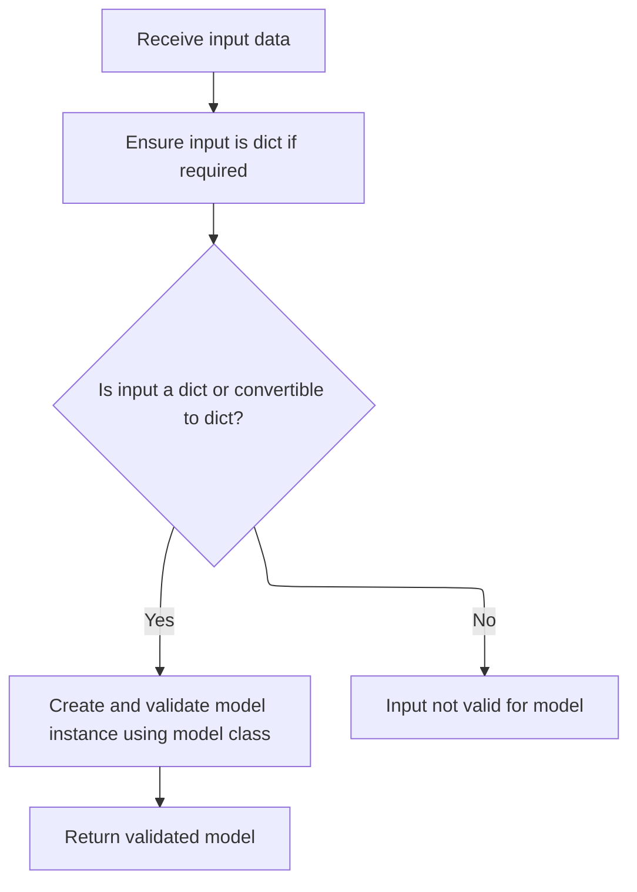
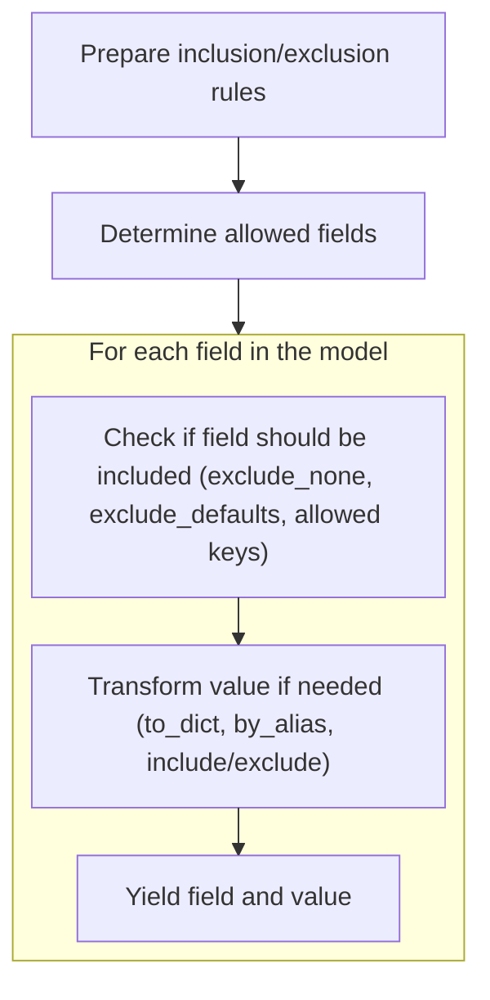
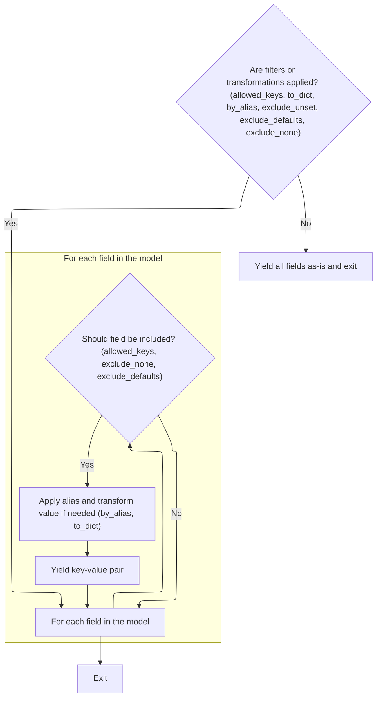
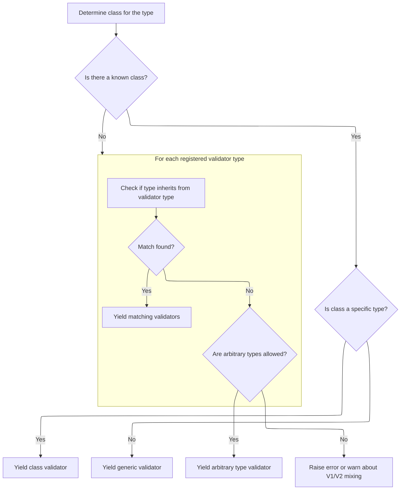

This document outlines how the system selects the appropriate validation logic for a given Python type, enabling flexible and robust data validation in user-defined models. The process involves checking for recognized types, generating specialized validators for structured types like <SwmToken path="pydantic/v1/validators.py" pos="621:7:7" line-data="    typeddict_cls: Type[&#39;TypedDict&#39;], config: Type[&#39;BaseConfig&#39;]  # type: ignore[valid-type]">`TypedDict`</SwmToken>, searching for validators by inheritance, and handling unmatched types based on configuration settings.

The main steps are:

- Check for and yield validators for recognized types.
- Generate and use a Pydantic model for TypedDicts.
- Search for validators by inheritance.
- Handle unmatched types according to configuration.

```mermaid
sequenceDiagram
  participant Developer
  participant ValidationSystem
  Developer->>ValidationSystem: Provide type and config
  ValidationSystem->>ValidationSystem: Check if type is recognized (built-in, special, structured)
  alt Type is TypedDict
    ValidationSystem->>ValidationSystem: Generate Pydantic model and validator
  else Type is not recognized
    ValidationSystem->>ValidationSystem: Search for validator by inheritance
    alt Validator found
      ValidationSystem->>Developer: Yield matching validator
    else Arbitrary types allowed
      ValidationSystem->>Developer: Yield generic validator
    else
      ValidationSystem->>Developer: Raise error
    end
  end
  ValidationSystem->>Developer: Yield validator

%% Swimm:
%% sequenceDiagram
%%   participant Developer
%%   participant ValidationSystem
%%   Developer->>ValidationSystem: Provide type and config
%%   ValidationSystem->>ValidationSystem: Check if type is recognized (built-in, special, structured)
%%   alt Type is <SwmToken path="pydantic/v1/validators.py" pos="621:7:7" line-data="    typeddict_cls: Type[&#39;TypedDict&#39;], config: Type[&#39;BaseConfig&#39;]  # type: ignore[valid-type]">`TypedDict`</SwmToken>
%%     ValidationSystem->>ValidationSystem: Generate Pydantic model and validator
%%   else Type is not recognized
%%     ValidationSystem->>ValidationSystem: Search for validator by inheritance
%%     alt Validator found
%%       ValidationSystem->>Developer: Yield matching validator
%%     else Arbitrary types allowed
%%       ValidationSystem->>Developer: Yield generic validator
%%     else
%%       ValidationSystem->>Developer: Raise error
%%     end
%%   end
%%   ValidationSystem->>Developer: Yield validator
```



# Spec

## Detailed View of the Program's Functionality

a. Selecting the Right Validator Generator

The process begins by determining the correct validator for a given type and configuration. The system first checks if the type is a special or built-in type, a <SwmToken path="pydantic/v1/validators.py" pos="621:7:7" line-data="    typeddict_cls: Type[&#39;TypedDict&#39;], config: Type[&#39;BaseConfig&#39;]  # type: ignore[valid-type]">`TypedDict`</SwmToken>, or a class. If it matches any of these, it quickly yields the appropriate validator. For example, if the type is a <SwmToken path="pydantic/v1/validators.py" pos="621:7:7" line-data="    typeddict_cls: Type[&#39;TypedDict&#39;], config: Type[&#39;BaseConfig&#39;]  # type: ignore[valid-type]">`TypedDict`</SwmToken>, it delegates to a function that generates a validator specifically for TypedDicts. If the type does not match any of these, the system searches for a validator by checking if the type inherits from any registered validator types. If a match is found, the corresponding validator is yielded. If no match is found and arbitrary types are allowed by the configuration, a generic arbitrary type validator is yielded. Otherwise, an error is raised indicating that no validator was found.

b. Building a Validator for TypedDicts

When a <SwmToken path="pydantic/v1/validators.py" pos="621:7:7" line-data="    typeddict_cls: Type[&#39;TypedDict&#39;], config: Type[&#39;BaseConfig&#39;]  # type: ignore[valid-type]">`TypedDict`</SwmToken> type is detected, a specialized validator is constructed. This involves generating a Pydantic model from the <SwmToken path="pydantic/v1/validators.py" pos="621:7:7" line-data="    typeddict_cls: Type[&#39;TypedDict&#39;], config: Type[&#39;BaseConfig&#39;]  # type: ignore[valid-type]">`TypedDict`</SwmToken> definition and the provided configuration. The generated model is attached to the <SwmToken path="pydantic/v1/validators.py" pos="621:7:7" line-data="    typeddict_cls: Type[&#39;TypedDict&#39;], config: Type[&#39;BaseConfig&#39;]  # type: ignore[valid-type]">`TypedDict`</SwmToken> class for future reference. The function then returns a validator function that, when called, uses the generated model to validate and convert input data according to the <SwmToken path="pydantic/v1/validators.py" pos="621:7:7" line-data="    typeddict_cls: Type[&#39;TypedDict&#39;], config: Type[&#39;BaseConfig&#39;]  # type: ignore[valid-type]">`TypedDict`</SwmToken> schema. This validator function internally calls the model’s parsing method to ensure the input matches the <SwmToken path="pydantic/v1/validators.py" pos="621:7:7" line-data="    typeddict_cls: Type[&#39;TypedDict&#39;], config: Type[&#39;BaseConfig&#39;]  # type: ignore[valid-type]">`TypedDict`</SwmToken> structure and prepares it for serialization.

c. Parsing Input into a Model Instance

When input data is received for validation, the system first ensures that the input is a dictionary if required by the model. If the input is not a dictionary, it attempts to convert it into one. If this conversion fails, a validation error is raised. Once the input is confirmed to be a dictionary, a model instance is created using the validated data. This instance is now ready for further processing or serialization.

d. Serializing the Model to a Dictionary

To serialize a model instance to a dictionary, the system sets up filtering options such as which fields to include or exclude, whether to use field aliases, and whether to skip unset or default values. It then delegates to an internal iterator method that yields the actual key-value pairs for the output dictionary. This is where all field filtering and alias logic is applied.

e. Filtering and Iterating Model Fields

Before iterating over the model fields, the system merges any include or exclude filters provided by the user with those defined on the model itself. It then calculates which fields are allowed to be included in the output based on these filters and other options like whether to exclude unset fields. The main iteration loop then processes each field in the model, checking if it should be included based on the calculated allowed keys and other options like excluding None or default values. For each included field, the system applies any necessary transformations (such as converting nested models to dictionaries or applying field aliases) before yielding the key-value pair.

f. Recursively Serializing and Filtering Values

When a field value is itself a Pydantic model, and the <SwmToken path="pydantic/v1/main.py" pos="457:1:1" line-data="                to_dict=True,">`to_dict`</SwmToken> option is set, the system recursively calls the model’s dict method to serialize it, applying all relevant filtering options. If the result contains a special root key, only that value is returned; otherwise, the entire dictionary is returned. If the value is a dictionary or a sequence (like a list or tuple), the system recursively processes each item, applying filters at every level. If the value is an Enum and the configuration specifies to use enum values, the raw value of the Enum is returned. Otherwise, the value is returned as-is.

g. Yielding Processed Key-Value Pairs

After processing and transforming each field value as needed, the system yields the final (key, value) pairs. These pairs are collected to form the final output dictionary representing the validated and serialized model.

h. Handling Other Types After <SwmToken path="pydantic/v1/validators.py" pos="621:7:7" line-data="    typeddict_cls: Type[&#39;TypedDict&#39;], config: Type[&#39;BaseConfig&#39;]  # type: ignore[valid-type]">`TypedDict`</SwmToken>

If the type being validated is not a <SwmToken path="pydantic/v1/validators.py" pos="621:7:7" line-data="    typeddict_cls: Type[&#39;TypedDict&#39;], config: Type[&#39;BaseConfig&#39;]  # type: ignore[valid-type]">`TypedDict`</SwmToken> and was not matched by earlier checks, the system attempts to determine the class for the type. If a known class is found, it yields either a class validator or a generic class validator, depending on the specifics of the class. If no class is found, the system iterates through all registered validator types, checking if the type inherits from any of them. If a match is found, the corresponding validators are yielded. If arbitrary types are allowed by the configuration, a generic arbitrary type validator is yielded. Otherwise, the system raises an error or warns about mixing different versions of Pydantic models, indicating that no suitable validator was found for the type.

# Rule Definition

| Paragraph Name                                                                                                                                                                                                                                                                                                                                                                                                                                                                                                                                                                                                                                                                                                                                                                                                     | Rule ID | Category          | Description                                                                                                                                                                                                                                                                                                                                                                                                                                                                                                                                                                                                                                                                                                                                                                                                                                                                                                                                                                                                                                                       | Conditions                                                                                                                                                                                                                                                                                              | Remarks                                                                                                                                                                                                                                                                                                                                                                                                                                                                                                                                                                                                                                                                                                                                                                                                                                                                                                                                                                            |
| ------------------------------------------------------------------------------------------------------------------------------------------------------------------------------------------------------------------------------------------------------------------------------------------------------------------------------------------------------------------------------------------------------------------------------------------------------------------------------------------------------------------------------------------------------------------------------------------------------------------------------------------------------------------------------------------------------------------------------------------------------------------------------------------------------------------ | ------- | ----------------- | ----------------------------------------------------------------------------------------------------------------------------------------------------------------------------------------------------------------------------------------------------------------------------------------------------------------------------------------------------------------------------------------------------------------------------------------------------------------------------------------------------------------------------------------------------------------------------------------------------------------------------------------------------------------------------------------------------------------------------------------------------------------------------------------------------------------------------------------------------------------------------------------------------------------------------------------------------------------------------------------------------------------------------------------------------------------- | ------------------------------------------------------------------------------------------------------------------------------------------------------------------------------------------------------------------------------------------------------------------------------------------------------- | ---------------------------------------------------------------------------------------------------------------------------------------------------------------------------------------------------------------------------------------------------------------------------------------------------------------------------------------------------------------------------------------------------------------------------------------------------------------------------------------------------------------------------------------------------------------------------------------------------------------------------------------------------------------------------------------------------------------------------------------------------------------------------------------------------------------------------------------------------------------------------------------------------------------------------------------------------------------------------------- |
| <SwmToken path="pydantic/v1/validators.py" pos="699:2:2" line-data="def find_validators(  # noqa: C901 (ignore complexity)">`find_validators`</SwmToken> function (<SwmPath>[pydantic/v1/validators.py](pydantic/v1/validators.py)</SwmPath>), lines handling Any, object, <SwmToken path="pydantic/v1/validators.py" pos="707:7:7" line-data="    if type_type == ForwardRef or type_type == TypeVar:">`ForwardRef`</SwmToken>, <SwmToken path="pydantic/v1/validators.py" pos="707:15:15" line-data="    if type_type == ForwardRef or type_type == TypeVar:">`TypeVar`</SwmToken>, NoneType, Pattern, Hashable, callable, literal, dataclass, Enum, <SwmToken path="pydantic/v1/validators.py" pos="731:7:7" line-data="    if type_ is IntEnum:">`IntEnum`</SwmToken>, namedtuple, typeddict, and class lookup | RL-001  | Conditional Logic | If the provided type is a special or built-in type, a <SwmToken path="pydantic/v1/validators.py" pos="621:7:7" line-data="    typeddict_cls: Type[&#39;TypedDict&#39;], config: Type[&#39;BaseConfig&#39;]  # type: ignore[valid-type]">`TypedDict`</SwmToken>, or a class with a directly registered validator, the system must yield the corresponding validator function(s) immediately.                                                                                                                                                                                                                                                                                                                                                                                                                                                                                                                                                                                                                                                                       | The input type is a recognized special/built-in type, <SwmToken path="pydantic/v1/validators.py" pos="621:7:7" line-data="    typeddict_cls: Type[&#39;TypedDict&#39;], config: Type[&#39;BaseConfig&#39;]  # type: ignore[valid-type]">`TypedDict`</SwmToken>, or has a directly registered validator. | Special types include Any, object, NoneType, Pattern, Hashable, callable, literal, dataclass, Enum, <SwmToken path="pydantic/v1/validators.py" pos="731:7:7" line-data="    if type_ is IntEnum:">`IntEnum`</SwmToken>, namedtuple, and typeddict. The output is a generator yielding validator functions that accept a value (and optionally <SwmPath>[.hyperlint/styles/config/](.hyperlint/styles/config/)</SwmPath>) and return a validated/transformed value or raise an exception.                                                                                                                                                                                                                                                                                                                                                                                                                                                                                           |
| <SwmToken path="pydantic/v1/validators.py" pos="620:2:2" line-data="def make_typeddict_validator(">`make_typeddict_validator`</SwmToken> function (<SwmPath>[pydantic/v1/validators.py](pydantic/v1/validators.py)</SwmPath>) and <SwmToken path="pydantic/v1/validators.py" pos="699:2:2" line-data="def find_validators(  # noqa: C901 (ignore complexity)">`find_validators`</SwmToken> (<SwmToken path="pydantic/v1/validators.py" pos="621:7:7" line-data="    typeddict_cls: Type[&#39;TypedDict&#39;], config: Type[&#39;BaseConfig&#39;]  # type: ignore[valid-type]">`TypedDict`</SwmToken> branch)                                                                                                                                                                                                       | RL-002  | Computation       | If the provided type is a <SwmToken path="pydantic/v1/validators.py" pos="621:7:7" line-data="    typeddict_cls: Type[&#39;TypedDict&#39;], config: Type[&#39;BaseConfig&#39;]  # type: ignore[valid-type]">`TypedDict`</SwmToken>, generate a Pydantic model from the <SwmToken path="pydantic/v1/validators.py" pos="621:7:7" line-data="    typeddict_cls: Type[&#39;TypedDict&#39;], config: Type[&#39;BaseConfig&#39;]  # type: ignore[valid-type]">`TypedDict`</SwmToken> definition and config, attach it to the <SwmToken path="pydantic/v1/validators.py" pos="621:7:7" line-data="    typeddict_cls: Type[&#39;TypedDict&#39;], config: Type[&#39;BaseConfig&#39;]  # type: ignore[valid-type]">`TypedDict`</SwmToken>, and yield a validator that validates and converts input using the model’s <SwmToken path="pydantic/v1/validators.py" pos="633:5:5" line-data="        return TypedDictModel.parse_obj(values).dict(exclude_unset=True)">`parse_obj`</SwmToken> method, returning the validated data as a dictionary with unset fields excluded. | The input type is a <SwmToken path="pydantic/v1/validators.py" pos="621:7:7" line-data="    typeddict_cls: Type[&#39;TypedDict&#39;], config: Type[&#39;BaseConfig&#39;]  # type: ignore[valid-type]">`TypedDict`</SwmToken>.                                                                           | The validator function accepts an input value, validates/converts it using the generated model’s <SwmToken path="pydantic/v1/validators.py" pos="633:5:5" line-data="        return TypedDictModel.parse_obj(values).dict(exclude_unset=True)">`parse_obj`</SwmToken>, and returns model.dict(<SwmToken path="pydantic/v1/validators.py" pos="633:12:12" line-data="        return TypedDictModel.parse_obj(values).dict(exclude_unset=True)">`exclude_unset`</SwmToken>=True). If input is not a dictionary or cannot be converted, a validation error is raised. Output is a dictionary with only set fields.                                                                                                                                                                                                                                                                                                                                                                    |
| <SwmToken path="pydantic/v1/validators.py" pos="699:2:2" line-data="def find_validators(  # noqa: C901 (ignore complexity)">`find_validators`</SwmToken> function (<SwmPath>[pydantic/v1/validators.py](pydantic/v1/validators.py)</SwmPath>), loop over \_VALIDATORS registry                                                                                                                                                                                                                                                                                                                                                                                                                                                                                                                                     | RL-003  | Conditional Logic | If the provided type is not directly recognized, search for a registered validator by checking if the type inherits from any registered types in the validator registry. For each registered type, if the provided type is a subclass, yield all associated validator functions.                                                                                                                                                                                                                                                                                                                                                                                                                                                                                                                                                                                                                                                                                                                                                                                  | The input type is not directly recognized, but is a subclass of a registered type in the validator registry.                                                                                                                                                                                            | The validator registry (\_VALIDATORS) is a list of (type, \[validator functions\]) pairs. All matching validator functions are yielded. <SwmToken path="pydantic/v1/validators.py" pos="754:8:8" line-data="                    if isinstance(v, IfConfig):">`IfConfig`</SwmToken> wrappers are checked for config conditions before yielding.                                                                                                                                                                                                                                                                                                                                                                                                                                                                                                                                                                                                                                     |
| <SwmToken path="pydantic/v1/validators.py" pos="699:2:2" line-data="def find_validators(  # noqa: C901 (ignore complexity)">`find_validators`</SwmToken> function (<SwmPath>[pydantic/v1/validators.py](pydantic/v1/validators.py)</SwmPath>), final fallback logic                                                                                                                                                                                                                                                                                                                                                                                                                                                                                                                                                | RL-004  | Conditional Logic | If no validator is found by direct match or inheritance, yield a generic arbitrary type validator if <SwmToken path="pydantic/v1/validators.py" pos="763:3:5" line-data="    if config.arbitrary_types_allowed:">`config.arbitrary_types_allowed`</SwmToken> is True; otherwise, raise an error indicating no validator was found for the type.                                                                                                                                                                                                                                                                                                                                                                                                                                                                                                                                                                                                                                                                                                                   | No validator found by direct match or inheritance. <SwmToken path="pydantic/v1/validators.py" pos="763:3:5" line-data="    if config.arbitrary_types_allowed:">`config.arbitrary_types_allowed`</SwmToken> is True or False.                                                                            | If <SwmToken path="pydantic/v1/validators.py" pos="763:3:5" line-data="    if config.arbitrary_types_allowed:">`config.arbitrary_types_allowed`</SwmToken> is True, yield <SwmToken path="pydantic/v1/validators.py" pos="764:3:3" line-data="        yield make_arbitrary_type_validator(type_)">`make_arbitrary_type_validator`</SwmToken>(type\_). If False, raise <SwmToken path="pydantic/v1/validators.py" pos="761:3:3" line-data="            raise RuntimeError(f&#39;error checking inheritance of {type_!r} (type: {display_as_type(type_)})&#39;)">`RuntimeError`</SwmToken> with a message about <SwmToken path="pydantic/v1/validators.py" pos="763:5:5" line-data="    if config.arbitrary_types_allowed:">`arbitrary_types_allowed`</SwmToken>.                                                                                                                                                                                                                    |
| All validator functions in <SwmPath>[pydantic/v1/validators.py](pydantic/v1/validators.py)</SwmPath>                                                                                                                                                                                                                                                                                                                                                                                                                                                                                                                                                                                                                                                                                                               | RL-005  | Data Assignment   | Validator functions must accept the value to validate as the first argument, optionally accept a field and config, return the validated/transformed value if validation succeeds, and raise a specific exception if validation fails. They must not return boolean values to indicate success or failure.                                                                                                                                                                                                                                                                                                                                                                                                                                                                                                                                                                                                                                                                                                                                                         | Any validator function is called during validation.                                                                                                                                                                                                                                                     | All validator functions follow the interface: value (required), <SwmPath>[.hyperlint/styles/config/](.hyperlint/styles/config/)</SwmPath> (optional), return validated value or raise exception. No boolean return for success/failure. Exceptions are from <SwmToken path="pydantic/v1/main.py" pos="32:2:6" line-data="from pydantic.v1.errors import ConfigError, DictError, ExtraError, MissingError">`pydantic.v1.errors`</SwmToken>.                                                                                                                                                                                                                                                                                                                                                                                                                                                                                                                                         |
| <SwmToken path="pydantic/v1/main.py" pos="383:26:28" line-data="                # - keep other values (e.g. submodels) untouched (using `BaseModel.dict()` will change them into dicts)">`BaseModel.dict`</SwmToken> and BaseModel.\_iter methods (<SwmPath>[pydantic/v1/main.py](pydantic/v1/main.py)</SwmPath>)                                                                                                                                                                                                                                                                                                                                                                                                                                                                                                  | RL-006  | Computation       | The system must provide a method to serialize a model instance to a dictionary, supporting options for including/excluding fields, using aliases, excluding unset/default/None values, and recursively serializing nested models, dictionaries, sequences, and enums. The output is a dictionary containing only the filtered and transformed key-value pairs according to the specified options.                                                                                                                                                                                                                                                                                                                                                                                                                                                                                                                                                                                                                                                                 | <SwmToken path="pydantic/v1/main.py" pos="383:26:28" line-data="                # - keep other values (e.g. submodels) untouched (using `BaseModel.dict()` will change them into dicts)">`BaseModel.dict`</SwmToken> or related serialization method is called.                                         | Options: include, exclude, <SwmToken path="pydantic/v1/main.py" pos="438:1:1" line-data="        by_alias: bool = False,">`by_alias`</SwmToken>, <SwmToken path="pydantic/v1/validators.py" pos="633:12:12" line-data="        return TypedDictModel.parse_obj(values).dict(exclude_unset=True)">`exclude_unset`</SwmToken>, <SwmToken path="pydantic/v1/main.py" pos="441:1:1" line-data="        exclude_defaults: bool = False,">`exclude_defaults`</SwmToken>, <SwmToken path="pydantic/v1/main.py" pos="442:1:1" line-data="        exclude_none: bool = False,">`exclude_none`</SwmToken>. Output is a dictionary with keys as field names or aliases and values as filtered/transformed according to options. Recursion applies to nested models, dicts, sequences, enums (with <SwmToken path="pydantic/v1/main.py" pos="801:21:21" line-data="        elif isinstance(v, Enum) and getattr(cls.Config, &#39;use_enum_values&#39;, False):">`use_enum_values`</SwmToken>). |
| BaseModel.\_get_value method (<SwmPath>[pydantic/v1/main.py](pydantic/v1/main.py)</SwmPath>)                                                                                                                                                                                                                                                                                                                                                                                                                                                                                                                                                                                                                                                                                                                       | RL-007  | Computation       | When serializing, recursively apply the same serialization and filtering logic to nested models, dictionaries, sequences, and enums. If the value is a Pydantic model and <SwmToken path="pydantic/v1/main.py" pos="457:1:1" line-data="                to_dict=True,">`to_dict`</SwmToken> is specified, serialize it using its dict method with current filtering options. If the value is a dictionary or sequence, recursively serialize each item. If the value is an Enum and <SwmToken path="pydantic/v1/main.py" pos="801:21:21" line-data="        elif isinstance(v, Enum) and getattr(cls.Config, &#39;use_enum_values&#39;, False):">`use_enum_values`</SwmToken> is specified, return the Enum’s value. Otherwise, return the value as-is.                                                                                                                                                                                                                                                                                                           | A value being serialized is a nested model, dict, sequence, or enum.                                                                                                                                                                                                                                    | Recursion applies filtering options at each level. For enums, <SwmToken path="pydantic/v1/main.py" pos="801:21:21" line-data="        elif isinstance(v, Enum) and getattr(cls.Config, &#39;use_enum_values&#39;, False):">`use_enum_values`</SwmToken> is checked. Output is a dictionary, sequence, or primitive value as appropriate.                                                                                                                                                                                                                                                                                                                                                                                                                                                                                                                                                                                                                                           |

# User Stories

## User Story 1: Type validation and validator selection

---

### Story Description:

As a user of the data validation system, I want the system to automatically select and yield the appropriate validator functions for a given Python type and configuration, so that my input data is validated correctly according to type hints, custom rules, and configuration options.

---

### Business Rule Mapping:

| Rule ID | Paragraph Name                                                                                                                                                                                                                                                                                                                                                                                                                                                                                                                                                                                                                                                                                                                                                                                                     | Rule Description                                                                                                                                                                                                                                                                                                                                                                                                                                                                                                                                                                                                                                                                                                                                                                                                                                                                                                                                                                                                                                                  |
| ------- | ------------------------------------------------------------------------------------------------------------------------------------------------------------------------------------------------------------------------------------------------------------------------------------------------------------------------------------------------------------------------------------------------------------------------------------------------------------------------------------------------------------------------------------------------------------------------------------------------------------------------------------------------------------------------------------------------------------------------------------------------------------------------------------------------------------------ | ----------------------------------------------------------------------------------------------------------------------------------------------------------------------------------------------------------------------------------------------------------------------------------------------------------------------------------------------------------------------------------------------------------------------------------------------------------------------------------------------------------------------------------------------------------------------------------------------------------------------------------------------------------------------------------------------------------------------------------------------------------------------------------------------------------------------------------------------------------------------------------------------------------------------------------------------------------------------------------------------------------------------------------------------------------------- |
| RL-001  | <SwmToken path="pydantic/v1/validators.py" pos="699:2:2" line-data="def find_validators(  # noqa: C901 (ignore complexity)">`find_validators`</SwmToken> function (<SwmPath>[pydantic/v1/validators.py](pydantic/v1/validators.py)</SwmPath>), lines handling Any, object, <SwmToken path="pydantic/v1/validators.py" pos="707:7:7" line-data="    if type_type == ForwardRef or type_type == TypeVar:">`ForwardRef`</SwmToken>, <SwmToken path="pydantic/v1/validators.py" pos="707:15:15" line-data="    if type_type == ForwardRef or type_type == TypeVar:">`TypeVar`</SwmToken>, NoneType, Pattern, Hashable, callable, literal, dataclass, Enum, <SwmToken path="pydantic/v1/validators.py" pos="731:7:7" line-data="    if type_ is IntEnum:">`IntEnum`</SwmToken>, namedtuple, typeddict, and class lookup | If the provided type is a special or built-in type, a <SwmToken path="pydantic/v1/validators.py" pos="621:7:7" line-data="    typeddict_cls: Type[&#39;TypedDict&#39;], config: Type[&#39;BaseConfig&#39;]  # type: ignore[valid-type]">`TypedDict`</SwmToken>, or a class with a directly registered validator, the system must yield the corresponding validator function(s) immediately.                                                                                                                                                                                                                                                                                                                                                                                                                                                                                                                                                                                                                                                                       |
| RL-003  | <SwmToken path="pydantic/v1/validators.py" pos="699:2:2" line-data="def find_validators(  # noqa: C901 (ignore complexity)">`find_validators`</SwmToken> function (<SwmPath>[pydantic/v1/validators.py](pydantic/v1/validators.py)</SwmPath>), loop over \_VALIDATORS registry                                                                                                                                                                                                                                                                                                                                                                                                                                                                                                                                     | If the provided type is not directly recognized, search for a registered validator by checking if the type inherits from any registered types in the validator registry. For each registered type, if the provided type is a subclass, yield all associated validator functions.                                                                                                                                                                                                                                                                                                                                                                                                                                                                                                                                                                                                                                                                                                                                                                                  |
| RL-004  | <SwmToken path="pydantic/v1/validators.py" pos="699:2:2" line-data="def find_validators(  # noqa: C901 (ignore complexity)">`find_validators`</SwmToken> function (<SwmPath>[pydantic/v1/validators.py](pydantic/v1/validators.py)</SwmPath>), final fallback logic                                                                                                                                                                                                                                                                                                                                                                                                                                                                                                                                                | If no validator is found by direct match or inheritance, yield a generic arbitrary type validator if <SwmToken path="pydantic/v1/validators.py" pos="763:3:5" line-data="    if config.arbitrary_types_allowed:">`config.arbitrary_types_allowed`</SwmToken> is True; otherwise, raise an error indicating no validator was found for the type.                                                                                                                                                                                                                                                                                                                                                                                                                                                                                                                                                                                                                                                                                                                   |
| RL-002  | <SwmToken path="pydantic/v1/validators.py" pos="620:2:2" line-data="def make_typeddict_validator(">`make_typeddict_validator`</SwmToken> function (<SwmPath>[pydantic/v1/validators.py](pydantic/v1/validators.py)</SwmPath>) and <SwmToken path="pydantic/v1/validators.py" pos="699:2:2" line-data="def find_validators(  # noqa: C901 (ignore complexity)">`find_validators`</SwmToken> (<SwmToken path="pydantic/v1/validators.py" pos="621:7:7" line-data="    typeddict_cls: Type[&#39;TypedDict&#39;], config: Type[&#39;BaseConfig&#39;]  # type: ignore[valid-type]">`TypedDict`</SwmToken> branch)                                                                                                                                                                                                       | If the provided type is a <SwmToken path="pydantic/v1/validators.py" pos="621:7:7" line-data="    typeddict_cls: Type[&#39;TypedDict&#39;], config: Type[&#39;BaseConfig&#39;]  # type: ignore[valid-type]">`TypedDict`</SwmToken>, generate a Pydantic model from the <SwmToken path="pydantic/v1/validators.py" pos="621:7:7" line-data="    typeddict_cls: Type[&#39;TypedDict&#39;], config: Type[&#39;BaseConfig&#39;]  # type: ignore[valid-type]">`TypedDict`</SwmToken> definition and config, attach it to the <SwmToken path="pydantic/v1/validators.py" pos="621:7:7" line-data="    typeddict_cls: Type[&#39;TypedDict&#39;], config: Type[&#39;BaseConfig&#39;]  # type: ignore[valid-type]">`TypedDict`</SwmToken>, and yield a validator that validates and converts input using the model’s <SwmToken path="pydantic/v1/validators.py" pos="633:5:5" line-data="        return TypedDictModel.parse_obj(values).dict(exclude_unset=True)">`parse_obj`</SwmToken> method, returning the validated data as a dictionary with unset fields excluded. |
| RL-005  | All validator functions in <SwmPath>[pydantic/v1/validators.py](pydantic/v1/validators.py)</SwmPath>                                                                                                                                                                                                                                                                                                                                                                                                                                                                                                                                                                                                                                                                                                               | Validator functions must accept the value to validate as the first argument, optionally accept a field and config, return the validated/transformed value if validation succeeds, and raise a specific exception if validation fails. They must not return boolean values to indicate success or failure.                                                                                                                                                                                                                                                                                                                                                                                                                                                                                                                                                                                                                                                                                                                                                         |

---

### Relevant Functionality:

- <SwmToken path="pydantic/v1/validators.py" pos="699:2:2" line-data="def find_validators(  # noqa: C901 (ignore complexity)">`find_validators`</SwmToken> **function (**<SwmPath>[pydantic/v1/validators.py](pydantic/v1/validators.py)</SwmPath>**)**
  1. **RL-001:**
     - If type\_ is Any or object, return (no validators)
     - If type\_ is <SwmToken path="pydantic/v1/validators.py" pos="707:7:7" line-data="    if type_type == ForwardRef or type_type == TypeVar:">`ForwardRef`</SwmToken> or <SwmToken path="pydantic/v1/validators.py" pos="707:15:15" line-data="    if type_type == ForwardRef or type_type == TypeVar:">`TypeVar`</SwmToken>, return
     - If type\_ is NoneType, yield <SwmToken path="pydantic/v1/validators.py" pos="711:3:3" line-data="        yield none_validator">`none_validator`</SwmToken>
     - If type\_ is Pattern or <SwmToken path="pydantic/v1/validators.py" pos="713:15:17" line-data="    if type_ is Pattern or type_ is re.Pattern:">`re.Pattern`</SwmToken>, yield <SwmToken path="pydantic/v1/validators.py" pos="714:3:3" line-data="        yield pattern_validator">`pattern_validator`</SwmToken>
     - If type\_ is Hashable or <SwmToken path="pydantic/v1/validators.py" pos="716:15:15" line-data="    if type_ is Hashable or type_ is CollectionsHashable:">`CollectionsHashable`</SwmToken>, yield <SwmToken path="pydantic/v1/validators.py" pos="717:3:3" line-data="        yield hashable_validator">`hashable_validator`</SwmToken>
     - If type\_ is callable, yield <SwmToken path="pydantic/v1/validators.py" pos="720:3:3" line-data="        yield callable_validator">`callable_validator`</SwmToken>
     - If type\_ is literal, yield <SwmToken path="pydantic/v1/validators.py" pos="723:3:3" line-data="        yield make_literal_validator(type_)">`make_literal_validator`</SwmToken>(type\_)
     - If type\_ is a builtin dataclass, yield from <SwmToken path="pydantic/v1/validators.py" pos="702:14:14" line-data="    from pydantic.v1.dataclasses import is_builtin_dataclass, make_dataclass_validator">`make_dataclass_validator`</SwmToken>(type\_, config)
     - If type\_ is Enum, yield <SwmToken path="pydantic/v1/validators.py" pos="729:3:3" line-data="        yield enum_validator">`enum_validator`</SwmToken>
     - If type\_ is <SwmToken path="pydantic/v1/validators.py" pos="731:7:7" line-data="    if type_ is IntEnum:">`IntEnum`</SwmToken>, yield <SwmToken path="pydantic/v1/validators.py" pos="732:3:3" line-data="        yield int_enum_validator">`int_enum_validator`</SwmToken>
     - If type\_ is namedtuple, yield <SwmToken path="pydantic/v1/validators.py" pos="735:3:3" line-data="        yield tuple_validator">`tuple_validator`</SwmToken> and <SwmToken path="pydantic/v1/validators.py" pos="736:3:3" line-data="        yield make_namedtuple_validator(type_, config)">`make_namedtuple_validator`</SwmToken>(type\_, config)
     - If type\_ is typeddict, yield <SwmToken path="pydantic/v1/validators.py" pos="620:2:2" line-data="def make_typeddict_validator(">`make_typeddict_validator`</SwmToken>(type\_, config)
     - If type\_ is a class, yield <SwmToken path="pydantic/v1/validators.py" pos="745:3:3" line-data="            yield make_class_validator(class_)">`make_class_validator`</SwmToken>(class\_) or <SwmToken path="pydantic/v1/validators.py" pos="747:3:3" line-data="            yield any_class_validator">`any_class_validator`</SwmToken>
  2. **RL-003:**
     - For each (<SwmToken path="pydantic/v1/validators.py" pos="750:3:3" line-data="    for val_type, validators in _VALIDATORS:">`val_type`</SwmToken>, validators) in \_VALIDATORS:
       - If issubclass(type\_, <SwmToken path="pydantic/v1/validators.py" pos="750:3:3" line-data="    for val_type, validators in _VALIDATORS:">`val_type`</SwmToken>):
         - For each validator in validators:
           - If validator is <SwmToken path="pydantic/v1/validators.py" pos="754:8:8" line-data="                    if isinstance(v, IfConfig):">`IfConfig`</SwmToken> and <SwmToken path="pydantic/v1/validators.py" pos="755:3:5" line-data="                        if v.check(config):">`v.check`</SwmToken>(config) is True, yield <SwmToken path="pydantic/v1/validators.py" pos="756:3:5" line-data="                            yield v.validator">`v.validator`</SwmToken>
           - Else, yield validator
         - Return after first match
  3. **RL-004:**
     - If <SwmToken path="pydantic/v1/validators.py" pos="763:3:5" line-data="    if config.arbitrary_types_allowed:">`config.arbitrary_types_allowed`</SwmToken> is True:
       - Yield <SwmToken path="pydantic/v1/validators.py" pos="764:3:3" line-data="        yield make_arbitrary_type_validator(type_)">`make_arbitrary_type_validator`</SwmToken>(type\_)
     - Else:
       - If type\_ has **pydantic_core_schema**, warn about <SwmToken path="pydantic/v1/validators.py" pos="767:11:11" line-data="            warn(f&#39;Mixing V1 and V2 models is not supported. `{type_.__name__}` is a V2 model.&#39;, UserWarning)">`V2`</SwmToken> model mixing
       - Raise <SwmToken path="pydantic/v1/validators.py" pos="761:3:3" line-data="            raise RuntimeError(f&#39;error checking inheritance of {type_!r} (type: {display_as_type(type_)})&#39;)">`RuntimeError`</SwmToken>('no validator found for {type\_}, see <SwmToken path="pydantic/v1/validators.py" pos="763:5:5" line-data="    if config.arbitrary_types_allowed:">`arbitrary_types_allowed`</SwmToken> in Config')
- <SwmToken path="pydantic/v1/validators.py" pos="620:2:2" line-data="def make_typeddict_validator(">`make_typeddict_validator`</SwmToken> **function (**<SwmPath>[pydantic/v1/validators.py](pydantic/v1/validators.py)</SwmPath>**) and** <SwmToken path="pydantic/v1/validators.py" pos="699:2:2" line-data="def find_validators(  # noqa: C901 (ignore complexity)">`find_validators`</SwmToken> **(**<SwmToken path="pydantic/v1/validators.py" pos="621:7:7" line-data="    typeddict_cls: Type[&#39;TypedDict&#39;], config: Type[&#39;BaseConfig&#39;]  # type: ignore[valid-type]">`TypedDict`</SwmToken> **branch)**
  1. **RL-002:**
     - Generate a Pydantic model class from the <SwmToken path="pydantic/v1/validators.py" pos="621:7:7" line-data="    typeddict_cls: Type[&#39;TypedDict&#39;], config: Type[&#39;BaseConfig&#39;]  # type: ignore[valid-type]">`TypedDict`</SwmToken> and config
     - Attach the model to the <SwmToken path="pydantic/v1/validators.py" pos="621:7:7" line-data="    typeddict_cls: Type[&#39;TypedDict&#39;], config: Type[&#39;BaseConfig&#39;]  # type: ignore[valid-type]">`TypedDict`</SwmToken> for later use
     - Define a validator function:
       - Accept input value
       - Call model.parse_obj(value)
       - Return model.dict(<SwmToken path="pydantic/v1/validators.py" pos="633:12:12" line-data="        return TypedDictModel.parse_obj(values).dict(exclude_unset=True)">`exclude_unset`</SwmToken>=True)
     - Yield the validator function
- **All validator functions in** <SwmPath>[pydantic/v1/validators.py](pydantic/v1/validators.py)</SwmPath>
  1. **RL-005:**
     - Accept value as first argument
     - Optionally accept field and config
     - If validation passes, return validated/transformed value
     - If validation fails, raise a specific exception (never return False/True for failure/success)

## User Story 2: Model serialization with flexible options

---

### Story Description:

As a user of validated data models, I want to serialize model instances to dictionaries with options for including or excluding fields, using aliases, excluding unset/default/None values, and recursively serializing nested models, dictionaries, sequences, and enums, so that I can control the output format and structure for downstream processing or APIs.

---

### Business Rule Mapping:

| Rule ID | Paragraph Name                                                                                                                                                                                                                                                                                                    | Rule Description                                                                                                                                                                                                                                                                                                                                                                                                                                                                                                                                                                                                                                                                                                                                        |
| ------- | ----------------------------------------------------------------------------------------------------------------------------------------------------------------------------------------------------------------------------------------------------------------------------------------------------------------- | ------------------------------------------------------------------------------------------------------------------------------------------------------------------------------------------------------------------------------------------------------------------------------------------------------------------------------------------------------------------------------------------------------------------------------------------------------------------------------------------------------------------------------------------------------------------------------------------------------------------------------------------------------------------------------------------------------------------------------------------------------- |
| RL-006  | <SwmToken path="pydantic/v1/main.py" pos="383:26:28" line-data="                # - keep other values (e.g. submodels) untouched (using `BaseModel.dict()` will change them into dicts)">`BaseModel.dict`</SwmToken> and BaseModel.\_iter methods (<SwmPath>[pydantic/v1/main.py](pydantic/v1/main.py)</SwmPath>) | The system must provide a method to serialize a model instance to a dictionary, supporting options for including/excluding fields, using aliases, excluding unset/default/None values, and recursively serializing nested models, dictionaries, sequences, and enums. The output is a dictionary containing only the filtered and transformed key-value pairs according to the specified options.                                                                                                                                                                                                                                                                                                                                                       |
| RL-007  | BaseModel.\_get_value method (<SwmPath>[pydantic/v1/main.py](pydantic/v1/main.py)</SwmPath>)                                                                                                                                                                                                                      | When serializing, recursively apply the same serialization and filtering logic to nested models, dictionaries, sequences, and enums. If the value is a Pydantic model and <SwmToken path="pydantic/v1/main.py" pos="457:1:1" line-data="                to_dict=True,">`to_dict`</SwmToken> is specified, serialize it using its dict method with current filtering options. If the value is a dictionary or sequence, recursively serialize each item. If the value is an Enum and <SwmToken path="pydantic/v1/main.py" pos="801:21:21" line-data="        elif isinstance(v, Enum) and getattr(cls.Config, &#39;use_enum_values&#39;, False):">`use_enum_values`</SwmToken> is specified, return the Enum’s value. Otherwise, return the value as-is. |

---

### Relevant Functionality:

- <SwmToken path="pydantic/v1/main.py" pos="383:26:28" line-data="                # - keep other values (e.g. submodels) untouched (using `BaseModel.dict()` will change them into dicts)">`BaseModel.dict`</SwmToken> **and BaseModel.\_iter methods (**<SwmPath>[pydantic/v1/main.py](pydantic/v1/main.py)</SwmPath>**)**
  1. **RL-006:**
     - For each field in the model:
       - Determine if field should be included (based on include/exclude/exclude_none/exclude_defaults/allowed_keys)
       - If included:
         - If <SwmToken path="pydantic/v1/main.py" pos="438:1:1" line-data="        by_alias: bool = False,">`by_alias`</SwmToken>, use field alias as key
         - Recursively serialize value if it is a model, dict, sequence, or enum
         - Apply filtering options (<SwmToken path="pydantic/v1/validators.py" pos="633:12:12" line-data="        return TypedDictModel.parse_obj(values).dict(exclude_unset=True)">`exclude_unset`</SwmToken>, <SwmToken path="pydantic/v1/main.py" pos="441:1:1" line-data="        exclude_defaults: bool = False,">`exclude_defaults`</SwmToken>, <SwmToken path="pydantic/v1/main.py" pos="442:1:1" line-data="        exclude_none: bool = False,">`exclude_none`</SwmToken>)
         - Yield key-value pair for output dictionary
     - Return dictionary of all yielded key-value pairs
- **BaseModel.\_get_value method (**<SwmPath>[pydantic/v1/main.py](pydantic/v1/main.py)</SwmPath>**)**
  1. **RL-007:**
     - If value is a <SwmToken path="pydantic/v1/main.py" pos="746:8:8" line-data="        if isinstance(v, BaseModel):">`BaseModel`</SwmToken> and <SwmToken path="pydantic/v1/main.py" pos="457:1:1" line-data="                to_dict=True,">`to_dict`</SwmToken> is True:
       - Call value.dict with current options
       - If <SwmToken path="pydantic/v1/main.py" pos="531:13:13" line-data="                raise ValidationError([ErrorWrapper(exc, loc=ROOT_KEY)], cls) from e">`ROOT_KEY`</SwmToken> in result, return result\[<SwmToken path="pydantic/v1/main.py" pos="531:13:13" line-data="                raise ValidationError([ErrorWrapper(exc, loc=ROOT_KEY)], cls) from e">`ROOT_KEY`</SwmToken>\]
       - Else, return result
     - If value is a dict:
       - For each key, value pair:
         - Recursively call <SwmToken path="pydantic/v1/main.py" pos="735:3:3" line-data="    def _get_value(">`_get_value`</SwmToken> on value with current options
         - Include in output if not excluded
     - If value is a sequence:
       - For each item:
         - Recursively call <SwmToken path="pydantic/v1/main.py" pos="735:3:3" line-data="    def _get_value(">`_get_value`</SwmToken> on item with current options
         - Include in output if not excluded
     - If value is an Enum and <SwmToken path="pydantic/v1/main.py" pos="801:21:21" line-data="        elif isinstance(v, Enum) and getattr(cls.Config, &#39;use_enum_values&#39;, False):">`use_enum_values`</SwmToken> is True:
       - Return value.value
     - Else:
       - Return value as-is

# Code Walkthrough

## Selecting the right validator generator

```mermaid
%%{init: {"flowchart": {"defaultRenderer": "elk"}} }%%
flowchart TD
  node1{"Is type a special/built-in type, TypedDict, or class?"}
  click node1 openCode "pydantic/v1/validators.py:704:748"
  node1 -->|"Yes"| node2["Yield appropriate validator"]
  click node2 openCode "pydantic/v1/validators.py:704:748"
  node1 -->|"No"| loop1
  subgraph loop1["Search for validator by inheritance"]
    node3{"Does type inherit from a registered type?"}
    click node3 openCode "pydantic/v1/validators.py:750:759"
  end
  loop1 -->|"Found"| node2
  loop1 -->|"Not found"| node4{"Are arbitrary types allowed?"}
  click node4 openCode "pydantic/v1/validators.py:763:768"
  node4 -->|"Yes"| node5["Yield arbitrary type validator"]
  click node5 openCode "pydantic/v1/validators.py:763:764"
  node4 -->|"No"| node6["Raise error: No validator found"]
  click node6 openCode "pydantic/v1/validators.py:765:768"

subgraph node2 [make_typeddict_validator]
  sgmain_1_node1["Receive TypedDict class and config"] --> sgmain_1_node2["Generate Pydantic model using TypedDict and config, attach to TypedDict"]
  click sgmain_1_node1 openCode "pydantic/v1/validators.py:620:622"
  click sgmain_1_node2 openCode "pydantic/v1/validators.py:623:630"
  sgmain_1_node2 --> sgmain_1_node3["Return a validator function that uses the model to validate and convert input data according to the TypedDict schema"]
  click sgmain_1_node3 openCode "pydantic/v1/validators.py:632:635"
end

%% Swimm:
%% %%{init: {"flowchart": {"defaultRenderer": "elk"}} }%%
%% flowchart TD
%%   node1{"Is type a special/built-in type, <SwmToken path="pydantic/v1/validators.py" pos="621:7:7" line-data="    typeddict_cls: Type[&#39;TypedDict&#39;], config: Type[&#39;BaseConfig&#39;]  # type: ignore[valid-type]">`TypedDict`</SwmToken>, or class?"}
%%   click node1 openCode "<SwmPath>[pydantic/v1/validators.py](pydantic/v1/validators.py)</SwmPath>:704:748"
%%   node1 -->|"Yes"| node2["Yield appropriate validator"]
%%   click node2 openCode "<SwmPath>[pydantic/v1/validators.py](pydantic/v1/validators.py)</SwmPath>:704:748"
%%   node1 -->|"No"| loop1
%%   subgraph loop1["Search for validator by inheritance"]
%%     node3{"Does type inherit from a registered type?"}
%%     click node3 openCode "<SwmPath>[pydantic/v1/validators.py](pydantic/v1/validators.py)</SwmPath>:750:759"
%%   end
%%   loop1 -->|"Found"| node2
%%   loop1 -->|"Not found"| node4{"Are arbitrary types allowed?"}
%%   click node4 openCode "<SwmPath>[pydantic/v1/validators.py](pydantic/v1/validators.py)</SwmPath>:763:768"
%%   node4 -->|"Yes"| node5["Yield arbitrary type validator"]
%%   click node5 openCode "<SwmPath>[pydantic/v1/validators.py](pydantic/v1/validators.py)</SwmPath>:763:764"
%%   node4 -->|"No"| node6["Raise error: No validator found"]
%%   click node6 openCode "<SwmPath>[pydantic/v1/validators.py](pydantic/v1/validators.py)</SwmPath>:765:768"
%% 
%% subgraph node2 [<SwmToken path="pydantic/v1/validators.py" pos="620:2:2" line-data="def make_typeddict_validator(">`make_typeddict_validator`</SwmToken>]
%%   sgmain_1_node1["Receive <SwmToken path="pydantic/v1/validators.py" pos="621:7:7" line-data="    typeddict_cls: Type[&#39;TypedDict&#39;], config: Type[&#39;BaseConfig&#39;]  # type: ignore[valid-type]">`TypedDict`</SwmToken> class and config"] --> sgmain_1_node2["Generate Pydantic model using <SwmToken path="pydantic/v1/validators.py" pos="621:7:7" line-data="    typeddict_cls: Type[&#39;TypedDict&#39;], config: Type[&#39;BaseConfig&#39;]  # type: ignore[valid-type]">`TypedDict`</SwmToken> and config, attach to <SwmToken path="pydantic/v1/validators.py" pos="621:7:7" line-data="    typeddict_cls: Type[&#39;TypedDict&#39;], config: Type[&#39;BaseConfig&#39;]  # type: ignore[valid-type]">`TypedDict`</SwmToken>"]
%%   click sgmain_1_node1 openCode "<SwmPath>[pydantic/v1/validators.py](pydantic/v1/validators.py)</SwmPath>:620:622"
%%   click sgmain_1_node2 openCode "<SwmPath>[pydantic/v1/validators.py](pydantic/v1/validators.py)</SwmPath>:623:630"
%%   sgmain_1_node2 --> sgmain_1_node3["Return a validator function that uses the model to validate and convert input data according to the <SwmToken path="pydantic/v1/validators.py" pos="621:7:7" line-data="    typeddict_cls: Type[&#39;TypedDict&#39;], config: Type[&#39;BaseConfig&#39;]  # type: ignore[valid-type]">`TypedDict`</SwmToken> schema"]
%%   click sgmain_1_node3 openCode "<SwmPath>[pydantic/v1/validators.py](pydantic/v1/validators.py)</SwmPath>:632:635"
%% end
```



<SwmSnippet path="/pydantic/v1/validators.py" line="699">

---

In <SwmToken path="pydantic/v1/validators.py" pos="699:2:2" line-data="def find_validators(  # noqa: C901 (ignore complexity)">`find_validators`</SwmToken>, we start by checking the type and quickly returning a matching validator for common cases. When we hit a <SwmToken path="pydantic/v1/validators.py" pos="621:7:7" line-data="    typeddict_cls: Type[&#39;TypedDict&#39;], config: Type[&#39;BaseConfig&#39;]  # type: ignore[valid-type]">`TypedDict`</SwmToken>, we yield a validator from <SwmToken path="pydantic/v1/validators.py" pos="739:3:3" line-data="        yield make_typeddict_validator(type_, config)">`make_typeddict_validator`</SwmToken>, since TypedDicts need structure-aware validation. This sets up the next step, where the actual validation logic for TypedDicts is created.

```python
def find_validators(  # noqa: C901 (ignore complexity)
    type_: Type[Any], config: Type['BaseConfig']
) -> Generator[AnyCallable, None, None]:
    from pydantic.v1.dataclasses import is_builtin_dataclass, make_dataclass_validator

    if type_ is Any or type_ is object:
        return
    type_type = type_.__class__
    if type_type == ForwardRef or type_type == TypeVar:
        return

    if is_none_type(type_):
        yield none_validator
        return
    if type_ is Pattern or type_ is re.Pattern:
        yield pattern_validator
        return
    if type_ is Hashable or type_ is CollectionsHashable:
        yield hashable_validator
        return
    if is_callable_type(type_):
        yield callable_validator
        return
    if is_literal_type(type_):
        yield make_literal_validator(type_)
        return
    if is_builtin_dataclass(type_):
        yield from make_dataclass_validator(type_, config)
        return
    if type_ is Enum:
        yield enum_validator
        return
    if type_ is IntEnum:
        yield int_enum_validator
        return
    if is_namedtuple(type_):
        yield tuple_validator
        yield make_namedtuple_validator(type_, config)
        return
    if is_typeddict(type_):
        yield make_typeddict_validator(type_, config)
        return

```

---

</SwmSnippet>

### Building a validator for TypedDicts

<SwmSnippet path="/pydantic/v1/validators.py" line="620">

---

<SwmToken path="pydantic/v1/validators.py" pos="620:2:2" line-data="def make_typeddict_validator(">`make_typeddict_validator`</SwmToken> builds a Pydantic model from the <SwmToken path="pydantic/v1/validators.py" pos="621:7:7" line-data="    typeddict_cls: Type[&#39;TypedDict&#39;], config: Type[&#39;BaseConfig&#39;]  # type: ignore[valid-type]">`TypedDict`</SwmToken>, attaches it for later use, and returns a validator function. That validator uses <SwmToken path="pydantic/v1/validators.py" pos="633:5:5" line-data="        return TypedDictModel.parse_obj(values).dict(exclude_unset=True)">`parse_obj`</SwmToken> to convert and validate input data against the <SwmToken path="pydantic/v1/validators.py" pos="621:7:7" line-data="    typeddict_cls: Type[&#39;TypedDict&#39;], config: Type[&#39;BaseConfig&#39;]  # type: ignore[valid-type]">`TypedDict`</SwmToken> schema, prepping it for serialization.

```python
def make_typeddict_validator(
    typeddict_cls: Type['TypedDict'], config: Type['BaseConfig']  # type: ignore[valid-type]
) -> Callable[[Any], Dict[str, Any]]:
    from pydantic.v1.annotated_types import create_model_from_typeddict

    TypedDictModel = create_model_from_typeddict(
        typeddict_cls,
        __config__=config,
        __module__=typeddict_cls.__module__,
    )
    typeddict_cls.__pydantic_model__ = TypedDictModel  # type: ignore[attr-defined]

    def typeddict_validator(values: 'TypedDict') -> Dict[str, Any]:  # type: ignore[valid-type]
        return TypedDictModel.parse_obj(values).dict(exclude_unset=True)

    return typeddict_validator
```

---

</SwmSnippet>

### Parsing input into a model instance



<SwmSnippet path="/pydantic/v1/main.py" line="524">

---

<SwmToken path="pydantic/v1/main.py" pos="524:3:3" line-data="    def parse_obj(cls: Type[&#39;Model&#39;], obj: Any) -&gt; &#39;Model&#39;:">`parse_obj`</SwmToken> makes sure the input is a dict, then creates a model instance from it, ready for serialization with dict.

```python
    def parse_obj(cls: Type['Model'], obj: Any) -> 'Model':
        obj = cls._enforce_dict_if_root(obj)
        if not isinstance(obj, dict):
            try:
                obj = dict(obj)
            except (TypeError, ValueError) as e:
                exc = TypeError(f'{cls.__name__} expected dict not {obj.__class__.__name__}')
                raise ValidationError([ErrorWrapper(exc, loc=ROOT_KEY)], cls) from e
        return cls(**obj)
```

---

</SwmSnippet>

### Serializing the model to a dictionary

<SwmSnippet path="/pydantic/v1/main.py" line="433">

---

<SwmToken path="pydantic/v1/main.py" pos="433:3:3" line-data="    def dict(">`dict`</SwmToken> just sets up the filtering options and hands off to \_iter, which yields the actual key-value pairs for the output dictionary. This is where all the field filtering and alias logic happens.

```python
    def dict(
        self,
        *,
        include: Optional[Union['AbstractSetIntStr', 'MappingIntStrAny']] = None,
        exclude: Optional[Union['AbstractSetIntStr', 'MappingIntStrAny']] = None,
        by_alias: bool = False,
        skip_defaults: Optional[bool] = None,
        exclude_unset: bool = False,
        exclude_defaults: bool = False,
        exclude_none: bool = False,
    ) -> 'DictStrAny':
        """
        Generate a dictionary representation of the model, optionally specifying which fields to include or exclude.

        """
        if skip_defaults is not None:
            warnings.warn(
                f'{self.__class__.__name__}.dict(): "skip_defaults" is deprecated and replaced by "exclude_unset"',
                DeprecationWarning,
            )
            exclude_unset = skip_defaults

        return dict(
            self._iter(
                to_dict=True,
                by_alias=by_alias,
                include=include,
                exclude=exclude,
                exclude_unset=exclude_unset,
                exclude_defaults=exclude_defaults,
                exclude_none=exclude_none,
            )
        )
```

---

</SwmSnippet>

### Filtering and iterating model fields



<SwmSnippet path="/pydantic/v1/main.py" line="828">

---

In <SwmToken path="pydantic/v1/main.py" pos="828:3:3" line-data="    def _iter(">`_iter`</SwmToken>, we merge include/exclude filters and then call <SwmToken path="pydantic/v1/main.py" pos="846:7:7" line-data="        allowed_keys = self._calculate_keys(">`_calculate_keys`</SwmToken> to figure out which fields to process. This sets up the main loop for yielding filtered fields.

```python
    def _iter(
        self,
        to_dict: bool = False,
        by_alias: bool = False,
        include: Optional[Union['AbstractSetIntStr', 'MappingIntStrAny']] = None,
        exclude: Optional[Union['AbstractSetIntStr', 'MappingIntStrAny']] = None,
        exclude_unset: bool = False,
        exclude_defaults: bool = False,
        exclude_none: bool = False,
    ) -> 'TupleGenerator':
        # Merge field set excludes with explicit exclude parameter with explicit overriding field set options.
        # The extra "is not None" guards are not logically necessary but optimizes performance for the simple case.
        if exclude is not None or self.__exclude_fields__ is not None:
            exclude = ValueItems.merge(self.__exclude_fields__, exclude)

        if include is not None or self.__include_fields__ is not None:
            include = ValueItems.merge(self.__include_fields__, include, intersect=True)

        allowed_keys = self._calculate_keys(
            include=include, exclude=exclude, exclude_unset=exclude_unset  # type: ignore
        )
```

---

</SwmSnippet>

#### Determining which fields to include

See <SwmLink doc-title="Determining keys to process flow">[Determining keys to process flow](/.swm/determining-keys-to-process-flow.w6mj072n.sw.md)</SwmLink>

#### Processing and serializing filtered fields



<SwmSnippet path="/pydantic/v1/main.py" line="849">

---

After getting <SwmToken path="pydantic/v1/main.py" pos="849:3:3" line-data="        if allowed_keys is None and not (to_dict or by_alias or exclude_unset or exclude_defaults or exclude_none):">`allowed_keys`</SwmToken> from <SwmToken path="pydantic/v1/main.py" pos="846:7:7" line-data="        allowed_keys = self._calculate_keys(">`_calculate_keys`</SwmToken>, <SwmToken path="pydantic/v1/main.py" pos="850:11:11" line-data="            # huge boost for plain _iter()">`_iter`</SwmToken> loops through the model fields, skips excluded ones, and calls <SwmToken path="pydantic/v1/main.py" pos="872:7:7" line-data="                v = self._get_value(">`_get_value`</SwmToken> for each included field to apply all the serialization and filtering logic before yielding the result.

```python
        if allowed_keys is None and not (to_dict or by_alias or exclude_unset or exclude_defaults or exclude_none):
            # huge boost for plain _iter()
            yield from self.__dict__.items()
            return

        value_exclude = ValueItems(self, exclude) if exclude is not None else None
        value_include = ValueItems(self, include) if include is not None else None

        for field_key, v in self.__dict__.items():
            if (allowed_keys is not None and field_key not in allowed_keys) or (exclude_none and v is None):
                continue

            if exclude_defaults:
                model_field = self.__fields__.get(field_key)
                if not getattr(model_field, 'required', True) and getattr(model_field, 'default', _missing) == v:
                    continue

            if by_alias and field_key in self.__fields__:
                dict_key = self.__fields__[field_key].alias
            else:
                dict_key = field_key

            if to_dict or value_include or value_exclude:
                v = self._get_value(
                    v,
                    to_dict=to_dict,
                    by_alias=by_alias,
                    include=value_include and value_include.for_element(field_key),
                    exclude=value_exclude and value_exclude.for_element(field_key),
                    exclude_unset=exclude_unset,
                    exclude_defaults=exclude_defaults,
                    exclude_none=exclude_none,
                )
```

---

</SwmSnippet>

#### Recursively serializing and filtering values

```mermaid
%%{init: {"flowchart": {"defaultRenderer": "elk"}} }%%
flowchart TD
    node1["Receive value to transform"] --> node2{"Is value a Pydantic model?"}
    click node1 openCode "pydantic/v1/main.py:735:805"
    click node2 openCode "pydantic/v1/main.py:746:759"
    node2 -->|"Yes"| node3{"to_dict option?"}
    click node3 openCode "pydantic/v1/main.py:747:759"
    node3 -->|"Yes"| node4["Convert model to dict (by_alias, exclude_unset, etc.)"]
    click node4 openCode "pydantic/v1/main.py:748:758"
    node3 -->|"No"| node5["Return model representation (with include/exclude)"]
    click node5 openCode "pydantic/v1/main.py:760:760"
    node4 --> node6["Return dict or root value"]
    click node6 openCode "pydantic/v1/main.py:756:758"
    node5 --> node6
    node2 -->|"No"| node7{"Is value a dict or sequence?"}
    click node7 openCode "pydantic/v1/main.py:765:799"
    node7 -->|"Yes"| loop1["For each item, transform recursively (respect include/exclude)"]
    subgraph loop1["For each item in dict/sequence, transform recursively"]
      node7 --> node8["Return transformed dict/sequence"]
      click node8 openCode "pydantic/v1/main.py:766:799"
    end
    node7 -->|"No"| node9{"Is value an Enum and use_enum_values?"}
    click node9 openCode "pydantic/v1/main.py:801:802"
    node9 -->|"Yes"| node10["Return enum value"]
    click node10 openCode "pydantic/v1/main.py:802:802"
    node9 -->|"No"| node11["Return value as-is"]
    click node11 openCode "pydantic/v1/main.py:804:805"

%% Swimm:
%% %%{init: {"flowchart": {"defaultRenderer": "elk"}} }%%
%% flowchart TD
%%     node1["Receive value to transform"] --> node2{"Is value a Pydantic model?"}
%%     click node1 openCode "<SwmPath>[pydantic/v1/main.py](pydantic/v1/main.py)</SwmPath>:735:805"
%%     click node2 openCode "<SwmPath>[pydantic/v1/main.py](pydantic/v1/main.py)</SwmPath>:746:759"
%%     node2 -->|"Yes"| node3{"<SwmToken path="pydantic/v1/main.py" pos="457:1:1" line-data="                to_dict=True,">`to_dict`</SwmToken> option?"}
%%     click node3 openCode "<SwmPath>[pydantic/v1/main.py](pydantic/v1/main.py)</SwmPath>:747:759"
%%     node3 -->|"Yes"| node4["Convert model to dict (<SwmToken path="pydantic/v1/main.py" pos="438:1:1" line-data="        by_alias: bool = False,">`by_alias`</SwmToken>, <SwmToken path="pydantic/v1/validators.py" pos="633:12:12" line-data="        return TypedDictModel.parse_obj(values).dict(exclude_unset=True)">`exclude_unset`</SwmToken>, etc.)"]
%%     click node4 openCode "<SwmPath>[pydantic/v1/main.py](pydantic/v1/main.py)</SwmPath>:748:758"
%%     node3 -->|"No"| node5["Return model representation (with include/exclude)"]
%%     click node5 openCode "<SwmPath>[pydantic/v1/main.py](pydantic/v1/main.py)</SwmPath>:760:760"
%%     node4 --> node6["Return dict or root value"]
%%     click node6 openCode "<SwmPath>[pydantic/v1/main.py](pydantic/v1/main.py)</SwmPath>:756:758"
%%     node5 --> node6
%%     node2 -->|"No"| node7{"Is value a dict or sequence?"}
%%     click node7 openCode "<SwmPath>[pydantic/v1/main.py](pydantic/v1/main.py)</SwmPath>:765:799"
%%     node7 -->|"Yes"| loop1["For each item, transform recursively (respect include/exclude)"]
%%     subgraph loop1["For each item in dict/sequence, transform recursively"]
%%       node7 --> node8["Return transformed dict/sequence"]
%%       click node8 openCode "<SwmPath>[pydantic/v1/main.py](pydantic/v1/main.py)</SwmPath>:766:799"
%%     end
%%     node7 -->|"No"| node9{"Is value an Enum and <SwmToken path="pydantic/v1/main.py" pos="801:21:21" line-data="        elif isinstance(v, Enum) and getattr(cls.Config, &#39;use_enum_values&#39;, False):">`use_enum_values`</SwmToken>?"}
%%     click node9 openCode "<SwmPath>[pydantic/v1/main.py](pydantic/v1/main.py)</SwmPath>:801:802"
%%     node9 -->|"Yes"| node10["Return enum value"]
%%     click node10 openCode "<SwmPath>[pydantic/v1/main.py](pydantic/v1/main.py)</SwmPath>:802:802"
%%     node9 -->|"No"| node11["Return value as-is"]
%%     click node11 openCode "<SwmPath>[pydantic/v1/main.py](pydantic/v1/main.py)</SwmPath>:804:805"
```



<SwmSnippet path="/pydantic/v1/main.py" line="735">

---

In <SwmToken path="pydantic/v1/main.py" pos="735:3:3" line-data="    def _get_value(">`_get_value`</SwmToken>, if the value is a <SwmToken path="pydantic/v1/main.py" pos="746:8:8" line-data="        if isinstance(v, BaseModel):">`BaseModel`</SwmToken> and <SwmToken path="pydantic/v1/main.py" pos="738:1:1" line-data="        to_dict: bool,">`to_dict`</SwmToken> is set, we call its dict method to serialize it with all the filtering options. If the result has <SwmToken path="pydantic/v1/main.py" pos="756:3:3" line-data="                if ROOT_KEY in v_dict:">`ROOT_KEY`</SwmToken>, we return just that value; otherwise, we return the whole dict. This handles nested models cleanly.

```python
    def _get_value(
        cls,
        v: Any,
        to_dict: bool,
        by_alias: bool,
        include: Optional[Union['AbstractSetIntStr', 'MappingIntStrAny']],
        exclude: Optional[Union['AbstractSetIntStr', 'MappingIntStrAny']],
        exclude_unset: bool,
        exclude_defaults: bool,
        exclude_none: bool,
    ) -> Any:
        if isinstance(v, BaseModel):
            if to_dict:
                v_dict = v.dict(
                    by_alias=by_alias,
                    exclude_unset=exclude_unset,
                    exclude_defaults=exclude_defaults,
                    include=include,
                    exclude=exclude,
                    exclude_none=exclude_none,
                )
                if ROOT_KEY in v_dict:
                    return v_dict[ROOT_KEY]
                return v_dict
            else:
```

---

</SwmSnippet>

<SwmSnippet path="/pydantic/v1/main.py" line="760">

---

After calling dict, if <SwmToken path="pydantic/v1/main.py" pos="457:1:1" line-data="                to_dict=True,">`to_dict`</SwmToken> isn't set, <SwmToken path="pydantic/v1/main.py" pos="735:3:3" line-data="    def _get_value(">`_get_value`</SwmToken> returns a filtered copy of the model instead. This keeps the model structure intact for further use.

```python
                return v.copy(include=include, exclude=exclude)

```

---

</SwmSnippet>

<SwmSnippet path="/pydantic/v1/main.py" line="762">

---

After copy, <SwmToken path="pydantic/v1/main.py" pos="767:6:6" line-data="                k_: cls._get_value(">`_get_value`</SwmToken> recursively processes dicts, sequences, and Enums, applying filters at every level.

```python
        value_exclude = ValueItems(v, exclude) if exclude else None
        value_include = ValueItems(v, include) if include else None

        if isinstance(v, dict):
            return {
                k_: cls._get_value(
                    v_,
                    to_dict=to_dict,
                    by_alias=by_alias,
                    exclude_unset=exclude_unset,
                    exclude_defaults=exclude_defaults,
                    include=value_include and value_include.for_element(k_),
                    exclude=value_exclude and value_exclude.for_element(k_),
                    exclude_none=exclude_none,
                )
                for k_, v_ in v.items()
                if (not value_exclude or not value_exclude.is_excluded(k_))
                and (not value_include or value_include.is_included(k_))
            }

        elif sequence_like(v):
            seq_args = (
                cls._get_value(
                    v_,
                    to_dict=to_dict,
                    by_alias=by_alias,
                    exclude_unset=exclude_unset,
                    exclude_defaults=exclude_defaults,
                    include=value_include and value_include.for_element(i),
                    exclude=value_exclude and value_exclude.for_element(i),
                    exclude_none=exclude_none,
                )
                for i, v_ in enumerate(v)
                if (not value_exclude or not value_exclude.is_excluded(i))
                and (not value_include or value_include.is_included(i))
            )

            return v.__class__(*seq_args) if is_namedtuple(v.__class__) else v.__class__(seq_args)

        elif isinstance(v, Enum) and getattr(cls.Config, 'use_enum_values', False):
            return v.value

        else:
            return v
```

---

</SwmSnippet>

#### Yielding processed key-value pairs

<SwmSnippet path="/pydantic/v1/main.py" line="882">

---

After returning from <SwmToken path="pydantic/v1/main.py" pos="735:3:3" line-data="    def _get_value(">`_get_value`</SwmToken>, <SwmToken path="pydantic/v1/main.py" pos="456:3:3" line-data="            self._iter(">`_iter`</SwmToken> yields the processed (<SwmToken path="pydantic/v1/main.py" pos="882:3:3" line-data="            yield dict_key, v">`dict_key`</SwmToken>, value) pairs, which are used to build the final output dictionary.

```python
            yield dict_key, v
```

---

</SwmSnippet>

### Handling other types after <SwmToken path="pydantic/v1/validators.py" pos="621:7:7" line-data="    typeddict_cls: Type[&#39;TypedDict&#39;], config: Type[&#39;BaseConfig&#39;]  # type: ignore[valid-type]">`TypedDict`</SwmToken>



<SwmSnippet path="/pydantic/v1/validators.py" line="742">

---

After returning from <SwmToken path="pydantic/v1/validators.py" pos="620:2:2" line-data="def make_typeddict_validator(">`make_typeddict_validator`</SwmToken>, <SwmToken path="pydantic/v1/validators.py" pos="699:2:2" line-data="def find_validators(  # noqa: C901 (ignore complexity)">`find_validators`</SwmToken> checks if the type is a class and yields a class validator or a fallback validator, covering custom types not matched earlier.

```python
    class_ = get_class(type_)
    if class_ is not None:
        if class_ is not Any and isinstance(class_, type):
            yield make_class_validator(class_)
        else:
            yield any_class_validator
        return

    for val_type, validators in _VALIDATORS:
        try:
            if issubclass(type_, val_type):
                for v in validators:
                    if isinstance(v, IfConfig):
                        if v.check(config):
                            yield v.validator
                    else:
                        yield v
                return
        except TypeError:
            raise RuntimeError(f'error checking inheritance of {type_!r} (type: {display_as_type(type_)})')
```

---

</SwmSnippet>

<SwmSnippet path="/pydantic/v1/validators.py" line="763">

---

If no validator matches, <SwmToken path="pydantic/v1/validators.py" pos="699:2:2" line-data="def find_validators(  # noqa: C901 (ignore complexity)">`find_validators`</SwmToken> either yields a generic validator for arbitrary types or raises an error, depending on the config.

```python
    if config.arbitrary_types_allowed:
        yield make_arbitrary_type_validator(type_)
    else:
        if hasattr(type_, '__pydantic_core_schema__'):
            warn(f'Mixing V1 and V2 models is not supported. `{type_.__name__}` is a V2 model.', UserWarning)
        raise RuntimeError(f'no validator found for {type_}, see `arbitrary_types_allowed` in Config')
```

---

</SwmSnippet>

&nbsp;

*This is an auto-generated document by Swimm 🌊 and has not yet been verified by a human*

<SwmMeta version="3.0.0" repo-id="Z2l0aHViJTNBJTNBcHlkYW50aWMlM0ElM0FTd2ltbS1EZW1v" repo-name="pydantic"><sup>Powered by [Swimm](/)</sup></SwmMeta>
