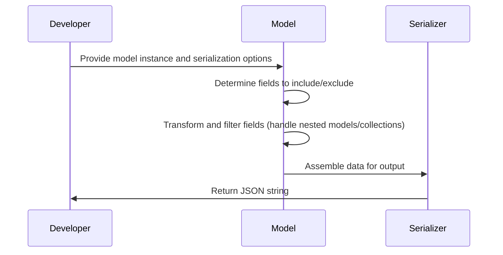
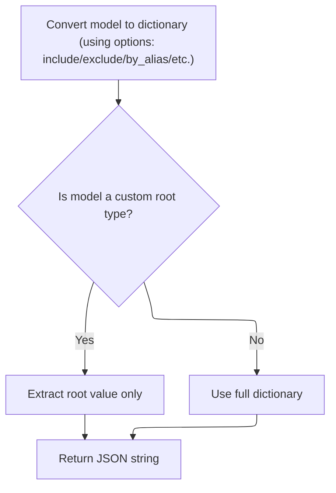

This document explains how a data model instance is serialized into a JSON string, allowing developers to customize which fields are included and how the output is formatted. The process involves preparing serialization options, selecting and transforming fields (including nested models and collections), assembling the final data, and producing the JSON string.



# Spec

## Detailed View of the Program's Functionality

# a. Preparing Serialization Options

The process of preparing data for JSON serialization in Pydantic begins with a method that generates a JSON string from a model instance. The method allows the user to specify which fields to include or exclude, whether to use field aliases, and how to handle unset, default, or `None` values. It also supports a deprecated argument for backward compatibility, mapping it to the new argument and issuing a warning if used. The method sets up the encoder function, defaulting to a model-specific encoder if none is provided. Instead of converting the model to a dictionary immediately, it calls an internal iterator method to yield key-value pairs, which allows for more flexible handling of nested models and custom encoders.

# b. Gathering Model Data for Output

The internal iterator method is responsible for determining which fields of the model should be included in the output and how they should be represented. It merges any include/exclude options specified by the user with those defined on the model itself. It then calculates the set of allowed fields, taking into account whether only set fields should be included (for partial updates, for example). If no filtering or transformation is needed, it yields all fields directly for efficiency. Otherwise, it prepares to filter and transform each field as needed.

## i. Setting Up Field Inclusion/Exclusion

The iterator first checks if there are any explicit include or exclude options, either from the model or the function call. If so, it merges them appropriately, with explicit options taking precedence. It then calculates the set of allowed field keys by considering the include/exclude sets and whether only set fields should be included.

## ii. Filtering and Transforming Field Values

For each field in the model's data:

- If the field is not allowed or should be excluded because its value is `None` (and the relevant option is set), it is skipped.
- If the field should be excluded because its value matches the default (and the relevant option is set), it is skipped.
- The output key is determined: if aliases are requested and the field has an alias, the alias is used; otherwise, the field name is used.
- If any transformation is needed (such as converting nested models to dicts, or applying include/exclude filters to nested structures), a helper method is called to process the value recursively.
- The final key and value are yielded for inclusion in the output.

# c. Processing Nested Models and Collections

The helper method for transforming values handles several cases:

- If the value is itself a Pydantic model and the output should be a dict, it calls the model's dict method with all relevant options, and extracts the root value if the model uses a custom root type.
- If the value is a Pydantic model but should not be converted to a dict, it returns a filtered copy of the model.
- If the value is a dictionary, it recursively processes each item, applying include/exclude filters as needed.
- If the value is a sequence (like a list or tuple), it recursively processes each item, applying filters, and reconstructs the sequence in the same type.
- If the value is an Enum and the configuration specifies to use enum values, it returns the enum's value.
- Otherwise, it returns the value as-is.

# d. Yielding the Final Key-Value Pairs

After processing each field and its value (including any necessary transformations), the iterator yields the final key (which may be an alias) and the processed value. This allows the calling method to collect all the data into a dictionary or use it in other ways.

# e. Finalizing and Serializing the Output

Back in the JSON serialization method:

- The yielded key-value pairs are collected into a dictionary.
- If the model uses a custom root type, only the root value is extracted for serialization.
- The dictionary (or root value) is then passed to the JSON serialization function, which may be customized by the user via the model's configuration. The encoder function is supplied as the default for handling non-standard types.
- The resulting JSON string is returned.

This flow ensures that the model's data is serialized according to user preferences, model configuration, and the structure of the data itself, supporting complex nested models, custom encoders, and fine-grained control over the output.

# Rule Definition

| Paragraph Name                                                                                                                                                                                                                                                                | Rule ID | Category          | Description                                                                                                                                                                                                                                                                                                                                                                                                                                                                                                                                                                                                                                                                                                                                                                                                          | Conditions                                              | Remarks                                                                                                                                                                                                                                                                                                                                                                                                                                                                                                                                                                                                                                                                                                                                                                                                                                      |
| ----------------------------------------------------------------------------------------------------------------------------------------------------------------------------------------------------------------------------------------------------------------------------- | ------- | ----------------- | -------------------------------------------------------------------------------------------------------------------------------------------------------------------------------------------------------------------------------------------------------------------------------------------------------------------------------------------------------------------------------------------------------------------------------------------------------------------------------------------------------------------------------------------------------------------------------------------------------------------------------------------------------------------------------------------------------------------------------------------------------------------------------------------------------------------- | ------------------------------------------------------- | -------------------------------------------------------------------------------------------------------------------------------------------------------------------------------------------------------------------------------------------------------------------------------------------------------------------------------------------------------------------------------------------------------------------------------------------------------------------------------------------------------------------------------------------------------------------------------------------------------------------------------------------------------------------------------------------------------------------------------------------------------------------------------------------------------------------------------------------- |
| BaseModel.json, <SwmToken path="pydantic/v1/main.py" pos="383:26:28" line-data="                # - keep other values (e.g. submodels) untouched (using `BaseModel.dict()` will change them into dicts)">`BaseModel.dict`</SwmToken>, BaseModel.\_iter                        | RL-001  | Conditional Logic | The serialization method must accept options such as include, exclude, <SwmToken path="pydantic/v1/main.py" pos="472:1:1" line-data="        by_alias: bool = False,">`by_alias`</SwmToken>, <SwmToken path="pydantic/v1/main.py" pos="474:1:1" line-data="        exclude_unset: bool = False,">`exclude_unset`</SwmToken>, <SwmToken path="pydantic/v1/main.py" pos="475:1:1" line-data="        exclude_defaults: bool = False,">`exclude_defaults`</SwmToken>, <SwmToken path="pydantic/v1/main.py" pos="476:1:1" line-data="        exclude_none: bool = False,">`exclude_none`</SwmToken>, encoder, <SwmToken path="pydantic/v1/main.py" pos="478:1:1" line-data="        models_as_dict: bool = True,">`models_as_dict`</SwmToken>, and additional keyword arguments, and process them to control the output. | When serializing a model instance to JSON or dict.      | Options include: include (set/mapping), exclude (set/mapping), <SwmToken path="pydantic/v1/main.py" pos="472:1:1" line-data="        by_alias: bool = False,">`by_alias`</SwmToken> (bool), <SwmToken path="pydantic/v1/main.py" pos="474:1:1" line-data="        exclude_unset: bool = False,">`exclude_unset`</SwmToken> (bool), <SwmToken path="pydantic/v1/main.py" pos="475:1:1" line-data="        exclude_defaults: bool = False,">`exclude_defaults`</SwmToken> (bool), <SwmToken path="pydantic/v1/main.py" pos="476:1:1" line-data="        exclude_none: bool = False,">`exclude_none`</SwmToken> (bool), encoder (callable), <SwmToken path="pydantic/v1/main.py" pos="478:1:1" line-data="        models_as_dict: bool = True,">`models_as_dict`</SwmToken> (bool, default True), plus additional kwargs for the JSON function. |
| BaseModel.json                                                                                                                                                                                                                                                                | RL-002  | Computation       | The output of the serialization process must be a JSON string that represents the model instance, with fields filtered and transformed according to the provided options.                                                                                                                                                                                                                                                                                                                                                                                                                                                                                                                                                                                                                                            | When the serialization method is called.                | Output is a JSON string. The structure before serialization is a dictionary or, for custom root types, the value of the root field.                                                                                                                                                                                                                                                                                                                                                                                                                                                                                                                                                                                                                                                                                                          |
| BaseModel.\_iter, BaseModel.\_get_value, <SwmToken path="pydantic/v1/main.py" pos="383:26:28" line-data="                # - keep other values (e.g. submodels) untouched (using `BaseModel.dict()` will change them into dicts)">`BaseModel.dict`</SwmToken>, BaseModel.json | RL-003  | Conditional Logic | During serialization, the system must gather model data for output by applying field selection (using include and exclude) and field aliasing (using <SwmToken path="pydantic/v1/main.py" pos="472:1:1" line-data="        by_alias: bool = False,">`by_alias`</SwmToken>).                                                                                                                                                                                                                                                                                                                                                                                                                                                                                                                                          | When iterating over model fields for serialization.     | Field selection is controlled by include/exclude sets or mappings. Aliases are used as keys if <SwmToken path="pydantic/v1/main.py" pos="472:1:1" line-data="        by_alias: bool = False,">`by_alias`</SwmToken> is true.                                                                                                                                                                                                                                                                                                                                                                                                                                                                                                                                                                                                                 |
| BaseModel.\_iter, BaseModel.\_get_value                                                                                                                                                                                                                                       | RL-004  | Conditional Logic | For each field, determine inclusion based on include/exclude, <SwmToken path="pydantic/v1/main.py" pos="474:1:1" line-data="        exclude_unset: bool = False,">`exclude_unset`</SwmToken>, <SwmToken path="pydantic/v1/main.py" pos="475:1:1" line-data="        exclude_defaults: bool = False,">`exclude_defaults`</SwmToken>, and <SwmToken path="pydantic/v1/main.py" pos="476:1:1" line-data="        exclude_none: bool = False,">`exclude_none`</SwmToken>. Apply transformations such as using aliases, and recursively process nested models, dicts, and collections.                                                                                                                                                                                                                                    | For each field during serialization.                    | <SwmToken path="pydantic/v1/main.py" pos="474:1:1" line-data="        exclude_unset: bool = False,">`exclude_unset`</SwmToken>: exclude fields not set; <SwmToken path="pydantic/v1/main.py" pos="475:1:1" line-data="        exclude_defaults: bool = False,">`exclude_defaults`</SwmToken>: exclude fields set to default; <SwmToken path="pydantic/v1/main.py" pos="476:1:1" line-data="        exclude_none: bool = False,">`exclude_none`</SwmToken>: exclude fields with value None; <SwmToken path="pydantic/v1/main.py" pos="472:1:1" line-data="        by_alias: bool = False,">`by_alias`</SwmToken>: use alias as key.                                                                                                                                                                                                           |
| BaseModel.\_get_value                                                                                                                                                                                                                                                         | RL-005  | Computation       | When a field value is a nested model, dictionary, or collection, recursively apply the same filtering and transformation options.                                                                                                                                                                                                                                                                                                                                                                                                                                                                                                                                                                                                                                                                                    | When a field value is a model, dict, or sequence.       | Nested models are serialized as dicts if models_as_dict/to_dict is true, or as filtered model instances otherwise. Dicts and sequences are processed recursively. Enums use their value if configured.                                                                                                                                                                                                                                                                                                                                                                                                                                                                                                                                                                                                                                       |
| BaseModel.json, <SwmToken path="pydantic/v1/main.py" pos="383:26:28" line-data="                # - keep other values (e.g. submodels) untouched (using `BaseModel.dict()` will change them into dicts)">`BaseModel.dict`</SwmToken>, BaseModel.\_enforce_dict_if_root        | RL-006  | Conditional Logic | If the model uses a custom root type (single field named **root**), the output must be the value of the root field only, not a dictionary with a single key.                                                                                                                                                                                                                                                                                                                                                                                                                                                                                                                                                                                                                                                         | When serializing a model with **custom_root_type** set. | If custom root type, output is the value of the root field (not a dict).                                                                                                                                                                                                                                                                                                                                                                                                                                                                                                                                                                                                                                                                                                                                                                     |
| BaseModel.json                                                                                                                                                                                                                                                                | RL-007  | Data Assignment   | The system must allow the JSON serialization function to be overridden via the model's configuration, so users can specify a custom function for converting the final dictionary to a JSON string.                                                                                                                                                                                                                                                                                                                                                                                                                                                                                                                                                                                                                   | When serializing to JSON.                               | The JSON function is taken from self.**config**<SwmToken path="pydantic/v1/main.py" pos="510:6:7" line-data="        return self.__config__.json_dumps(data, default=encoder, **dumps_kwargs)">`.json_dumps`</SwmToken>.                                                                                                                                                                                                                                                                                                                                                                                                                                                                                                                                                                                                                     |
| BaseModel.json, BaseModel.\_iter, BaseModel.\_get_value                                                                                                                                                                                                                       | RL-008  | Computation       | Before serialization, ensure the output data structure is a standard dictionary (or the root value for custom root types), suitable for the JSON serialization function.                                                                                                                                                                                                                                                                                                                                                                                                                                                                                                                                                                                                                                             | Before calling the JSON serialization function.         | Output is a dict or the root value. Model instances may be preserved if required for custom encoding.                                                                                                                                                                                                                                                                                                                                                                                                                                                                                                                                                                                                                                                                                                                                        |
| BaseModel.\_iter, BaseModel.\_get_value, <SwmToken path="pydantic/v1/main.py" pos="383:26:28" line-data="                # - keep other values (e.g. submodels) untouched (using `BaseModel.dict()` will change them into dicts)">`BaseModel.dict`</SwmToken>, BaseModel.json | RL-009  | Conditional Logic | The system must support include and exclude options as sets of field names or mappings for nested structures, and use field/alias mappings as defined per field.                                                                                                                                                                                                                                                                                                                                                                                                                                                                                                                                                                                                                                                     | When processing include/exclude options.                | include/exclude can be sets or mappings. Aliases are defined per field.                                                                                                                                                                                                                                                                                                                                                                                                                                                                                                                                                                                                                                                                                                                                                                      |

# User Stories

## User Story 1: Flexible and recursive serialization with field selection and transformation

---

### Story Description:

As a user, I want to serialize a model instance to JSON with flexible field selection and transformation options, including recursive application to nested models, dictionaries, and collections, so that I can control the output structure and content for complex data.

---

### Business Rule Mapping:

| Rule ID | Paragraph Name                                                                                                                                                                                                                                                                | Rule Description                                                                                                                                                                                                                                                                                                                                                                                                                                                                                                                                                                                                                                                                                                                                                                                                     |
| ------- | ----------------------------------------------------------------------------------------------------------------------------------------------------------------------------------------------------------------------------------------------------------------------------- | -------------------------------------------------------------------------------------------------------------------------------------------------------------------------------------------------------------------------------------------------------------------------------------------------------------------------------------------------------------------------------------------------------------------------------------------------------------------------------------------------------------------------------------------------------------------------------------------------------------------------------------------------------------------------------------------------------------------------------------------------------------------------------------------------------------------- |
| RL-001  | BaseModel.json, <SwmToken path="pydantic/v1/main.py" pos="383:26:28" line-data="                # - keep other values (e.g. submodels) untouched (using `BaseModel.dict()` will change them into dicts)">`BaseModel.dict`</SwmToken>, BaseModel.\_iter                        | The serialization method must accept options such as include, exclude, <SwmToken path="pydantic/v1/main.py" pos="472:1:1" line-data="        by_alias: bool = False,">`by_alias`</SwmToken>, <SwmToken path="pydantic/v1/main.py" pos="474:1:1" line-data="        exclude_unset: bool = False,">`exclude_unset`</SwmToken>, <SwmToken path="pydantic/v1/main.py" pos="475:1:1" line-data="        exclude_defaults: bool = False,">`exclude_defaults`</SwmToken>, <SwmToken path="pydantic/v1/main.py" pos="476:1:1" line-data="        exclude_none: bool = False,">`exclude_none`</SwmToken>, encoder, <SwmToken path="pydantic/v1/main.py" pos="478:1:1" line-data="        models_as_dict: bool = True,">`models_as_dict`</SwmToken>, and additional keyword arguments, and process them to control the output. |
| RL-003  | BaseModel.\_iter, BaseModel.\_get_value, <SwmToken path="pydantic/v1/main.py" pos="383:26:28" line-data="                # - keep other values (e.g. submodels) untouched (using `BaseModel.dict()` will change them into dicts)">`BaseModel.dict`</SwmToken>, BaseModel.json | During serialization, the system must gather model data for output by applying field selection (using include and exclude) and field aliasing (using <SwmToken path="pydantic/v1/main.py" pos="472:1:1" line-data="        by_alias: bool = False,">`by_alias`</SwmToken>).                                                                                                                                                                                                                                                                                                                                                                                                                                                                                                                                          |
| RL-004  | BaseModel.\_iter, BaseModel.\_get_value                                                                                                                                                                                                                                       | For each field, determine inclusion based on include/exclude, <SwmToken path="pydantic/v1/main.py" pos="474:1:1" line-data="        exclude_unset: bool = False,">`exclude_unset`</SwmToken>, <SwmToken path="pydantic/v1/main.py" pos="475:1:1" line-data="        exclude_defaults: bool = False,">`exclude_defaults`</SwmToken>, and <SwmToken path="pydantic/v1/main.py" pos="476:1:1" line-data="        exclude_none: bool = False,">`exclude_none`</SwmToken>. Apply transformations such as using aliases, and recursively process nested models, dicts, and collections.                                                                                                                                                                                                                                    |
| RL-009  | BaseModel.\_iter, BaseModel.\_get_value, <SwmToken path="pydantic/v1/main.py" pos="383:26:28" line-data="                # - keep other values (e.g. submodels) untouched (using `BaseModel.dict()` will change them into dicts)">`BaseModel.dict`</SwmToken>, BaseModel.json | The system must support include and exclude options as sets of field names or mappings for nested structures, and use field/alias mappings as defined per field.                                                                                                                                                                                                                                                                                                                                                                                                                                                                                                                                                                                                                                                     |
| RL-005  | BaseModel.\_get_value                                                                                                                                                                                                                                                         | When a field value is a nested model, dictionary, or collection, recursively apply the same filtering and transformation options.                                                                                                                                                                                                                                                                                                                                                                                                                                                                                                                                                                                                                                                                                    |

---

### Relevant Functionality:

- **BaseModel.json**
  1. **RL-001:**
     - Accept all options as parameters to the serialization method.
     - Map deprecated arguments (<SwmToken path="pydantic/v1/main.py" pos="295:16:18" line-data="        # for attributes not in `new_namespace` (e.g. private attributes)">`e.g`</SwmToken>., <SwmToken path="pydantic/v1/main.py" pos="473:1:1" line-data="        skip_defaults: Optional[bool] = None,">`skip_defaults`</SwmToken>) to their replacements.
     - Pass options to internal iteration and filtering logic.
- **BaseModel.\_iter**
  1. **RL-003:**
     - Merge include/exclude options with model field settings.
     - For each field, determine if it should be included based on merged options.
     - Use alias as key if <SwmToken path="pydantic/v1/main.py" pos="472:1:1" line-data="        by_alias: bool = False,">`by_alias`</SwmToken> is true.
  2. **RL-004:**
     - For each field:
       - Skip if not in allowed keys or if <SwmToken path="pydantic/v1/main.py" pos="476:1:1" line-data="        exclude_none: bool = False,">`exclude_none`</SwmToken> and value is None.
       - Skip if <SwmToken path="pydantic/v1/main.py" pos="475:1:1" line-data="        exclude_defaults: bool = False,">`exclude_defaults`</SwmToken> and value equals default.
       - Use alias as key if <SwmToken path="pydantic/v1/main.py" pos="472:1:1" line-data="        by_alias: bool = False,">`by_alias`</SwmToken>.
       - If <SwmToken path="pydantic/v1/main.py" pos="494:32:32" line-data="        # We don&#39;t directly call `self.dict()`, which does exactly this with `to_dict=True`">`to_dict`</SwmToken> or include/exclude present, recursively process value (nested models, dicts, sequences, enums).
  3. **RL-009:**
     - Accept include/exclude as sets or mappings.
     - For nested structures, pass nested include/exclude options recursively.
     - Use field/alias mapping as defined.
- **BaseModel.\_get_value**
  1. **RL-005:**
     - If value is a model:
       - If to_dict/models_as_dict: serialize to dict with same options.
       - Else: return filtered model instance.
     - If value is dict: recursively process each item.
     - If value is sequence: recursively process each item.
     - If value is enum and config says to use value: return enum value.
     - Else: return value as-is.

## User Story 2: Correct output structure, custom root type support, and customizable JSON serialization function

---

### Story Description:

As a user, I want the output of serialization to be a JSON string representing the model instance, or the root value for custom root types, and I want to be able to override the JSON serialization function via configuration, so that the output is compatible with consumers and can use custom serialization logic.

---

### Business Rule Mapping:

| Rule ID | Paragraph Name                                                                                                                                                                                                                                                         | Rule Description                                                                                                                                                                                   |
| ------- | ---------------------------------------------------------------------------------------------------------------------------------------------------------------------------------------------------------------------------------------------------------------------- | -------------------------------------------------------------------------------------------------------------------------------------------------------------------------------------------------- |
| RL-002  | BaseModel.json                                                                                                                                                                                                                                                         | The output of the serialization process must be a JSON string that represents the model instance, with fields filtered and transformed according to the provided options.                          |
| RL-006  | BaseModel.json, <SwmToken path="pydantic/v1/main.py" pos="383:26:28" line-data="                # - keep other values (e.g. submodels) untouched (using `BaseModel.dict()` will change them into dicts)">`BaseModel.dict`</SwmToken>, BaseModel.\_enforce_dict_if_root | If the model uses a custom root type (single field named **root**), the output must be the value of the root field only, not a dictionary with a single key.                                       |
| RL-007  | BaseModel.json                                                                                                                                                                                                                                                         | The system must allow the JSON serialization function to be overridden via the model's configuration, so users can specify a custom function for converting the final dictionary to a JSON string. |
| RL-008  | BaseModel.json, BaseModel.\_iter, BaseModel.\_get_value                                                                                                                                                                                                                | Before serialization, ensure the output data structure is a standard dictionary (or the root value for custom root types), suitable for the JSON serialization function.                           |

---

### Relevant Functionality:

- **BaseModel.json**
  1. **RL-002:**
     - Gather model data as a dictionary using filtering and transformation logic.
     - If custom root type, extract the root value.
     - Serialize the dictionary or value to a JSON string using the configured JSON function.
  2. **RL-006:**
     - If **custom_root_type** is true:
       - Extract value of the root field for output.
  3. **RL-007:**
     - Use self.**config**<SwmToken path="pydantic/v1/main.py" pos="510:6:7" line-data="        return self.__config__.json_dumps(data, default=encoder, **dumps_kwargs)">`.json_dumps`</SwmToken> to serialize the output dictionary/value to a JSON string.
  4. **RL-008:**
     - Gather output as a dict (or root value for custom root type).
     - Ensure structure is compatible with the JSON function.

# Code Walkthrough

## Preparing Data for JSON Serialization

```mermaid
%%{init: {"flowchart": {"defaultRenderer": "elk"}} }%%
flowchart TD
    node1["Prepare serialization options (choose fields, handle deprecated arguments)"] --> node2["Gather model data for output (apply field selection and aliases)"]
    click node1 openCode "pydantic/v1/main.py:467:496"
    node2 --> node3["Produce JSON string (custom encoding, root type if configured)"]
    click node2 openCode "pydantic/v1/main.py:828:828"
    click node3 openCode "pydantic/v1/main.py:497:510"


subgraph node2 [_iter]
  sgmain_1_node1["Set up which fields to include or exclude (user/model settings: include, exclude, to_dict, by_alias, etc.)"] --> sgmain_1_node2["Calculate allowed fields for output"]
  click sgmain_1_node1 openCode "pydantic/v1/main.py:828:848"
  click sgmain_1_node2 openCode "pydantic/v1/main.py:846:848"
  sgmain_1_node2 --> sgmain_1_loop1
  subgraph sgmain_1_loop1["For each field in the model"]
  sgmain_1_node3["Check if field is allowed and if value should be transformed (exclude_unset, exclude_defaults, exclude_none, by_alias)"]
  click sgmain_1_node3 openCode "pydantic/v1/main.py:849:881"
  sgmain_1_node3 --> sgmain_1_node4["Transform value for output if needed"]
  click sgmain_1_node4 openCode "pydantic/v1/main.py:872:881"
  sgmain_1_node4 --> sgmain_1_node5["Output field and value"]
  click sgmain_1_node5 openCode "pydantic/v1/main.py:882:882"
  end
end

%% Swimm:
%% %%{init: {"flowchart": {"defaultRenderer": "elk"}} }%%
%% flowchart TD
%%     node1["Prepare serialization options (choose fields, handle deprecated arguments)"] --> node2["Gather model data for output (apply field selection and aliases)"]
%%     click node1 openCode "<SwmPath>[pydantic/v1/main.py](pydantic/v1/main.py)</SwmPath>:467:496"
%%     node2 --> node3["Produce JSON string (custom encoding, root type if configured)"]
%%     click node2 openCode "<SwmPath>[pydantic/v1/main.py](pydantic/v1/main.py)</SwmPath>:828:828"
%%     click node3 openCode "<SwmPath>[pydantic/v1/main.py](pydantic/v1/main.py)</SwmPath>:497:510"
%% 
%% 
%% subgraph node2 [_iter]
%%   sgmain_1_node1["Set up which fields to include or exclude (user/model settings: include, exclude, <SwmToken path="pydantic/v1/main.py" pos="494:32:32" line-data="        # We don&#39;t directly call `self.dict()`, which does exactly this with `to_dict=True`">`to_dict`</SwmToken>, <SwmToken path="pydantic/v1/main.py" pos="472:1:1" line-data="        by_alias: bool = False,">`by_alias`</SwmToken>, etc.)"] --> sgmain_1_node2["Calculate allowed fields for output"]
%%   click sgmain_1_node1 openCode "<SwmPath>[pydantic/v1/main.py](pydantic/v1/main.py)</SwmPath>:828:848"
%%   click sgmain_1_node2 openCode "<SwmPath>[pydantic/v1/main.py](pydantic/v1/main.py)</SwmPath>:846:848"
%%   sgmain_1_node2 --> sgmain_1_loop1
%%   subgraph sgmain_1_loop1["For each field in the model"]
%%   sgmain_1_node3["Check if field is allowed and if value should be transformed (<SwmToken path="pydantic/v1/main.py" pos="474:1:1" line-data="        exclude_unset: bool = False,">`exclude_unset`</SwmToken>, <SwmToken path="pydantic/v1/main.py" pos="475:1:1" line-data="        exclude_defaults: bool = False,">`exclude_defaults`</SwmToken>, <SwmToken path="pydantic/v1/main.py" pos="476:1:1" line-data="        exclude_none: bool = False,">`exclude_none`</SwmToken>, <SwmToken path="pydantic/v1/main.py" pos="472:1:1" line-data="        by_alias: bool = False,">`by_alias`</SwmToken>)"]
%%   click sgmain_1_node3 openCode "<SwmPath>[pydantic/v1/main.py](pydantic/v1/main.py)</SwmPath>:849:881"
%%   sgmain_1_node3 --> sgmain_1_node4["Transform value for output if needed"]
%%   click sgmain_1_node4 openCode "<SwmPath>[pydantic/v1/main.py](pydantic/v1/main.py)</SwmPath>:872:881"
%%   sgmain_1_node4 --> sgmain_1_node5["Output field and value"]
%%   click sgmain_1_node5 openCode "<SwmPath>[pydantic/v1/main.py](pydantic/v1/main.py)</SwmPath>:882:882"
%%   end
%% end
```



<SwmSnippet path="/pydantic/v1/main.py" line="467">

---

In <SwmToken path="pydantic/v1/main.py" pos="467:3:3" line-data="    def json(">`json`</SwmToken>, we start by handling the deprecated <SwmToken path="pydantic/v1/main.py" pos="473:1:1" line-data="        skip_defaults: Optional[bool] = None,">`skip_defaults`</SwmToken> parameter, mapping it to <SwmToken path="pydantic/v1/main.py" pos="474:1:1" line-data="        exclude_unset: bool = False,">`exclude_unset`</SwmToken> and warning the user. We set up the encoder, then call <SwmToken path="pydantic/v1/main.py" pos="498:1:3" line-data="            self._iter(">`self._iter`</SwmToken> instead of dict() to get an iterable of key-value pairs. This lets us keep <SwmToken path="pydantic/v1/main.py" pos="495:22:22" line-data="        # because we want to be able to keep raw `BaseModel` instances and not as `dict`.">`BaseModel`</SwmToken> instances in the output, so users can write custom JSON encoders. The function assumes include/exclude are the right types and that \_iter returns something dict() can consume.

```python
    def json(
        self,
        *,
        include: Optional[Union['AbstractSetIntStr', 'MappingIntStrAny']] = None,
        exclude: Optional[Union['AbstractSetIntStr', 'MappingIntStrAny']] = None,
        by_alias: bool = False,
        skip_defaults: Optional[bool] = None,
        exclude_unset: bool = False,
        exclude_defaults: bool = False,
        exclude_none: bool = False,
        encoder: Optional[Callable[[Any], Any]] = None,
        models_as_dict: bool = True,
        **dumps_kwargs: Any,
    ) -> str:
        """
        Generate a JSON representation of the model, `include` and `exclude` arguments as per `dict()`.

        `encoder` is an optional function to supply as `default` to json.dumps(), other arguments as per `json.dumps()`.
        """
        if skip_defaults is not None:
            warnings.warn(
                f'{self.__class__.__name__}.json(): "skip_defaults" is deprecated and replaced by "exclude_unset"',
                DeprecationWarning,
            )
            exclude_unset = skip_defaults
        encoder = cast(Callable[[Any], Any], encoder or self.__json_encoder__)

        # We don't directly call `self.dict()`, which does exactly this with `to_dict=True`
        # because we want to be able to keep raw `BaseModel` instances and not as `dict`.
        # This allows users to write custom JSON encoders for given `BaseModel` classes.
        data = dict(
            self._iter(
                to_dict=models_as_dict,
                by_alias=by_alias,
                include=include,
                exclude=exclude,
                exclude_unset=exclude_unset,
                exclude_defaults=exclude_defaults,
                exclude_none=exclude_none,
            )
```

---

</SwmSnippet>

### Filtering and Preparing Model Fields

```mermaid
%%{init: {"flowchart": {"defaultRenderer": "elk"}} }%%
flowchart TD
    node1["Set up which fields to include or exclude (user/model settings: include, exclude, to_dict, by_alias, etc.)"] --> node2["Calculate allowed fields for output"]
    click node1 openCode "pydantic/v1/main.py:828:848"
    click node2 openCode "pydantic/v1/main.py:846:848"
    node2 --> loop1
    subgraph loop1["For each field in the model"]
        node3["Check if field is allowed and if value should be transformed (exclude_unset, exclude_defaults, exclude_none, by_alias)"]
        click node3 openCode "pydantic/v1/main.py:849:881"
        node3 --> node4["Transform value for output if needed"]
        click node4 openCode "pydantic/v1/main.py:872:881"
        node4 --> node5["Output field and value"]
        click node5 openCode "pydantic/v1/main.py:882:882"
    end


subgraph node4 [_get_value]
  sgmain_1_node1["Is the value a Pydantic model? (to_dict, include/exclude options)"] -->|"Yes"| sgmain_1_node2["Transform model to dict or filtered copy"]
  click sgmain_1_node1 openCode "pydantic/v1/main.py:746:759"
  click sgmain_1_node2 openCode "pydantic/v1/main.py:747:760"
  sgmain_1_node1 -->|"No"| sgmain_1_node3["Is the value a dictionary? (include/exclude options)"]
  click sgmain_1_node3 openCode "pydantic/v1/main.py:765:781"
  sgmain_1_node3 -->|"Yes"| sgmain_1_loop1
  sgmain_1_node3 -->|"No"| sgmain_1_node5["Is the value a sequence? (include/exclude options)"]
  click sgmain_1_node5 openCode "pydantic/v1/main.py:782:800"
  sgmain_1_node5 -->|"Yes"| sgmain_1_loop2
  sgmain_1_node5 -->|"No"| sgmain_1_node7["Is the value an Enum and should use enum value? (Config.use_enum_values)"]
  click sgmain_1_node7 openCode "pydantic/v1/main.py:801:802"
  sgmain_1_node7 -->|"Yes"| sgmain_1_node8["Return enum value"]
  click sgmain_1_node8 openCode "pydantic/v1/main.py:802:802"
  sgmain_1_node7 -->|"No"| sgmain_1_node9["Return value as-is"]
  click sgmain_1_node9 openCode "pydantic/v1/main.py:804:805"
  subgraph sgmain_1_loop1["For each item in the dictionary"]
  sgmain_1_node4["Recursively transform item with filters"]
  click sgmain_1_node4 openCode "pydantic/v1/main.py:767:780"
  end
  sgmain_1_loop1 --> sgmain_1_node9
  subgraph sgmain_1_loop2["For each item in the sequence"]
  sgmain_1_node6["Recursively transform item with filters"]
  click sgmain_1_node6 openCode "pydantic/v1/main.py:784:796"
  end
  sgmain_1_loop2 --> sgmain_1_node9
end

%% Swimm:
%% %%{init: {"flowchart": {"defaultRenderer": "elk"}} }%%
%% flowchart TD
%%     node1["Set up which fields to include or exclude (user/model settings: include, exclude, <SwmToken path="pydantic/v1/main.py" pos="494:32:32" line-data="        # We don&#39;t directly call `self.dict()`, which does exactly this with `to_dict=True`">`to_dict`</SwmToken>, <SwmToken path="pydantic/v1/main.py" pos="472:1:1" line-data="        by_alias: bool = False,">`by_alias`</SwmToken>, etc.)"] --> node2["Calculate allowed fields for output"]
%%     click node1 openCode "<SwmPath>[pydantic/v1/main.py](pydantic/v1/main.py)</SwmPath>:828:848"
%%     click node2 openCode "<SwmPath>[pydantic/v1/main.py](pydantic/v1/main.py)</SwmPath>:846:848"
%%     node2 --> loop1
%%     subgraph loop1["For each field in the model"]
%%         node3["Check if field is allowed and if value should be transformed (<SwmToken path="pydantic/v1/main.py" pos="474:1:1" line-data="        exclude_unset: bool = False,">`exclude_unset`</SwmToken>, <SwmToken path="pydantic/v1/main.py" pos="475:1:1" line-data="        exclude_defaults: bool = False,">`exclude_defaults`</SwmToken>, <SwmToken path="pydantic/v1/main.py" pos="476:1:1" line-data="        exclude_none: bool = False,">`exclude_none`</SwmToken>, <SwmToken path="pydantic/v1/main.py" pos="472:1:1" line-data="        by_alias: bool = False,">`by_alias`</SwmToken>)"]
%%         click node3 openCode "<SwmPath>[pydantic/v1/main.py](pydantic/v1/main.py)</SwmPath>:849:881"
%%         node3 --> node4["Transform value for output if needed"]
%%         click node4 openCode "<SwmPath>[pydantic/v1/main.py](pydantic/v1/main.py)</SwmPath>:872:881"
%%         node4 --> node5["Output field and value"]
%%         click node5 openCode "<SwmPath>[pydantic/v1/main.py](pydantic/v1/main.py)</SwmPath>:882:882"
%%     end
%% 
%% 
%% subgraph node4 [<SwmToken path="pydantic/v1/main.py" pos="735:3:3" line-data="    def _get_value(">`_get_value`</SwmToken>]
%%   sgmain_1_node1["Is the value a Pydantic model? (<SwmToken path="pydantic/v1/main.py" pos="494:32:32" line-data="        # We don&#39;t directly call `self.dict()`, which does exactly this with `to_dict=True`">`to_dict`</SwmToken>, include/exclude options)"] -->|"Yes"| sgmain_1_node2["Transform model to dict or filtered copy"]
%%   click sgmain_1_node1 openCode "<SwmPath>[pydantic/v1/main.py](pydantic/v1/main.py)</SwmPath>:746:759"
%%   click sgmain_1_node2 openCode "<SwmPath>[pydantic/v1/main.py](pydantic/v1/main.py)</SwmPath>:747:760"
%%   sgmain_1_node1 -->|"No"| sgmain_1_node3["Is the value a dictionary? (include/exclude options)"]
%%   click sgmain_1_node3 openCode "<SwmPath>[pydantic/v1/main.py](pydantic/v1/main.py)</SwmPath>:765:781"
%%   sgmain_1_node3 -->|"Yes"| sgmain_1_loop1
%%   sgmain_1_node3 -->|"No"| sgmain_1_node5["Is the value a sequence? (include/exclude options)"]
%%   click sgmain_1_node5 openCode "<SwmPath>[pydantic/v1/main.py](pydantic/v1/main.py)</SwmPath>:782:800"
%%   sgmain_1_node5 -->|"Yes"| sgmain_1_loop2
%%   sgmain_1_node5 -->|"No"| sgmain_1_node7["Is the value an Enum and should use enum value? (Config.use_enum_values)"]
%%   click sgmain_1_node7 openCode "<SwmPath>[pydantic/v1/main.py](pydantic/v1/main.py)</SwmPath>:801:802"
%%   sgmain_1_node7 -->|"Yes"| sgmain_1_node8["Return enum value"]
%%   click sgmain_1_node8 openCode "<SwmPath>[pydantic/v1/main.py](pydantic/v1/main.py)</SwmPath>:802:802"
%%   sgmain_1_node7 -->|"No"| sgmain_1_node9["Return value as-is"]
%%   click sgmain_1_node9 openCode "<SwmPath>[pydantic/v1/main.py](pydantic/v1/main.py)</SwmPath>:804:805"
%%   subgraph sgmain_1_loop1["For each item in the dictionary"]
%%   sgmain_1_node4["Recursively transform item with filters"]
%%   click sgmain_1_node4 openCode "<SwmPath>[pydantic/v1/main.py](pydantic/v1/main.py)</SwmPath>:767:780"
%%   end
%%   sgmain_1_loop1 --> sgmain_1_node9
%%   subgraph sgmain_1_loop2["For each item in the sequence"]
%%   sgmain_1_node6["Recursively transform item with filters"]
%%   click sgmain_1_node6 openCode "<SwmPath>[pydantic/v1/main.py](pydantic/v1/main.py)</SwmPath>:784:796"
%%   end
%%   sgmain_1_loop2 --> sgmain_1_node9
%% end
```



<SwmSnippet path="/pydantic/v1/main.py" line="828">

---

In <SwmToken path="pydantic/v1/main.py" pos="828:3:3" line-data="    def _iter(">`_iter`</SwmToken>, we merge include/exclude sets from both the instance and the function call, using <SwmToken path="pydantic/v1/main.py" pos="841:5:7" line-data="            exclude = ValueItems.merge(self.__exclude_fields__, exclude)">`ValueItems.merge`</SwmToken>. Then we call <SwmToken path="pydantic/v1/main.py" pos="846:7:7" line-data="        allowed_keys = self._calculate_keys(">`_calculate_keys`</SwmToken> to figure out which fields are allowed based on these sets and the unset flag. This sets up the filtering for the rest of the function.

```python
    def _iter(
        self,
        to_dict: bool = False,
        by_alias: bool = False,
        include: Optional[Union['AbstractSetIntStr', 'MappingIntStrAny']] = None,
        exclude: Optional[Union['AbstractSetIntStr', 'MappingIntStrAny']] = None,
        exclude_unset: bool = False,
        exclude_defaults: bool = False,
        exclude_none: bool = False,
    ) -> 'TupleGenerator':
        # Merge field set excludes with explicit exclude parameter with explicit overriding field set options.
        # The extra "is not None" guards are not logically necessary but optimizes performance for the simple case.
        if exclude is not None or self.__exclude_fields__ is not None:
            exclude = ValueItems.merge(self.__exclude_fields__, exclude)

        if include is not None or self.__include_fields__ is not None:
            include = ValueItems.merge(self.__include_fields__, include, intersect=True)

        allowed_keys = self._calculate_keys(
            include=include, exclude=exclude, exclude_unset=exclude_unset  # type: ignore
        )
```

---

</SwmSnippet>

#### Determining Which Fields to Include

See <SwmLink doc-title="Determining fields to process flow">[Determining fields to process flow](/.swm/determining-fields-to-process-flow.apt5t02a.sw.md)</SwmLink>

#### Filtering and Transforming Field Values

<SwmSnippet path="/pydantic/v1/main.py" line="849">

---

Back in <SwmToken path="pydantic/v1/main.py" pos="850:11:11" line-data="            # huge boost for plain _iter()">`_iter`</SwmToken>, after getting <SwmToken path="pydantic/v1/main.py" pos="849:3:3" line-data="        if allowed_keys is None and not (to_dict or by_alias or exclude_unset or exclude_defaults or exclude_none):">`allowed_keys`</SwmToken> from <SwmToken path="pydantic/v1/main.py" pos="846:7:7" line-data="        allowed_keys = self._calculate_keys(">`_calculate_keys`</SwmToken>, we either yield all items directly (if no filtering/transformations are needed) or loop through the fields, skipping excluded ones and applying exclude_none/defaults logic. For fields needing transformation (<SwmToken path="pydantic/v1/main.py" pos="849:14:14" line-data="        if allowed_keys is None and not (to_dict or by_alias or exclude_unset or exclude_defaults or exclude_none):">`to_dict`</SwmToken> or filters), we call <SwmToken path="pydantic/v1/main.py" pos="872:7:7" line-data="                v = self._get_value(">`_get_value`</SwmToken> to handle nested models or collections before yielding.

```python
        if allowed_keys is None and not (to_dict or by_alias or exclude_unset or exclude_defaults or exclude_none):
            # huge boost for plain _iter()
            yield from self.__dict__.items()
            return

        value_exclude = ValueItems(self, exclude) if exclude is not None else None
        value_include = ValueItems(self, include) if include is not None else None

        for field_key, v in self.__dict__.items():
            if (allowed_keys is not None and field_key not in allowed_keys) or (exclude_none and v is None):
                continue

            if exclude_defaults:
                model_field = self.__fields__.get(field_key)
                if not getattr(model_field, 'required', True) and getattr(model_field, 'default', _missing) == v:
                    continue

            if by_alias and field_key in self.__fields__:
                dict_key = self.__fields__[field_key].alias
            else:
                dict_key = field_key

            if to_dict or value_include or value_exclude:
                v = self._get_value(
                    v,
                    to_dict=to_dict,
                    by_alias=by_alias,
                    include=value_include and value_include.for_element(field_key),
                    exclude=value_exclude and value_exclude.for_element(field_key),
                    exclude_unset=exclude_unset,
                    exclude_defaults=exclude_defaults,
                    exclude_none=exclude_none,
                )
```

---

</SwmSnippet>

#### Processing Nested Models and Collections

```mermaid
%%{init: {"flowchart": {"defaultRenderer": "elk"}} }%%
flowchart TD
    node1["Is the value a Pydantic model? (to_dict, include/exclude options)"] -->|"Yes"| node2["Transform model to dict or filtered copy"]
    click node1 openCode "pydantic/v1/main.py:746:759"
    click node2 openCode "pydantic/v1/main.py:747:760"
    node1 -->|"No"| node3["Is the value a dictionary? (include/exclude options)"]
    click node3 openCode "pydantic/v1/main.py:765:781"
    node3 -->|"Yes"| loop1
    node3 -->|"No"| node5["Is the value a sequence? (include/exclude options)"]
    click node5 openCode "pydantic/v1/main.py:782:800"
    node5 -->|"Yes"| loop2
    node5 -->|"No"| node7["Is the value an Enum and should use enum value? (Config.use_enum_values)"]
    click node7 openCode "pydantic/v1/main.py:801:802"
    node7 -->|"Yes"| node8["Return enum value"]
    click node8 openCode "pydantic/v1/main.py:802:802"
    node7 -->|"No"| node9["Return value as-is"]
    click node9 openCode "pydantic/v1/main.py:804:805"

    subgraph loop1["For each item in the dictionary"]
      node4["Recursively transform item with filters"]
      click node4 openCode "pydantic/v1/main.py:767:780"
    end
    loop1 --> node9

    subgraph loop2["For each item in the sequence"]
      node6["Recursively transform item with filters"]
      click node6 openCode "pydantic/v1/main.py:784:796"
    end
    loop2 --> node9

%% Swimm:
%% %%{init: {"flowchart": {"defaultRenderer": "elk"}} }%%
%% flowchart TD
%%     node1["Is the value a Pydantic model? (<SwmToken path="pydantic/v1/main.py" pos="494:32:32" line-data="        # We don&#39;t directly call `self.dict()`, which does exactly this with `to_dict=True`">`to_dict`</SwmToken>, include/exclude options)"] -->|"Yes"| node2["Transform model to dict or filtered copy"]
%%     click node1 openCode "<SwmPath>[pydantic/v1/main.py](pydantic/v1/main.py)</SwmPath>:746:759"
%%     click node2 openCode "<SwmPath>[pydantic/v1/main.py](pydantic/v1/main.py)</SwmPath>:747:760"
%%     node1 -->|"No"| node3["Is the value a dictionary? (include/exclude options)"]
%%     click node3 openCode "<SwmPath>[pydantic/v1/main.py](pydantic/v1/main.py)</SwmPath>:765:781"
%%     node3 -->|"Yes"| loop1
%%     node3 -->|"No"| node5["Is the value a sequence? (include/exclude options)"]
%%     click node5 openCode "<SwmPath>[pydantic/v1/main.py](pydantic/v1/main.py)</SwmPath>:782:800"
%%     node5 -->|"Yes"| loop2
%%     node5 -->|"No"| node7["Is the value an Enum and should use enum value? (Config.use_enum_values)"]
%%     click node7 openCode "<SwmPath>[pydantic/v1/main.py](pydantic/v1/main.py)</SwmPath>:801:802"
%%     node7 -->|"Yes"| node8["Return enum value"]
%%     click node8 openCode "<SwmPath>[pydantic/v1/main.py](pydantic/v1/main.py)</SwmPath>:802:802"
%%     node7 -->|"No"| node9["Return value as-is"]
%%     click node9 openCode "<SwmPath>[pydantic/v1/main.py](pydantic/v1/main.py)</SwmPath>:804:805"
%% 
%%     subgraph loop1["For each item in the dictionary"]
%%       node4["Recursively transform item with filters"]
%%       click node4 openCode "<SwmPath>[pydantic/v1/main.py](pydantic/v1/main.py)</SwmPath>:767:780"
%%     end
%%     loop1 --> node9
%% 
%%     subgraph loop2["For each item in the sequence"]
%%       node6["Recursively transform item with filters"]
%%       click node6 openCode "<SwmPath>[pydantic/v1/main.py](pydantic/v1/main.py)</SwmPath>:784:796"
%%     end
%%     loop2 --> node9
```



<SwmSnippet path="/pydantic/v1/main.py" line="735">

---

In <SwmToken path="pydantic/v1/main.py" pos="735:3:3" line-data="    def _get_value(">`_get_value`</SwmToken>, if the value is a <SwmToken path="pydantic/v1/main.py" pos="746:8:8" line-data="        if isinstance(v, BaseModel):">`BaseModel`</SwmToken> and <SwmToken path="pydantic/v1/main.py" pos="738:1:1" line-data="        to_dict: bool,">`to_dict`</SwmToken> is set, we call its dict method to serialize it, passing along all the filtering and transformation options. If the model uses a custom root type, we extract the root value from the dict.

```python
    def _get_value(
        cls,
        v: Any,
        to_dict: bool,
        by_alias: bool,
        include: Optional[Union['AbstractSetIntStr', 'MappingIntStrAny']],
        exclude: Optional[Union['AbstractSetIntStr', 'MappingIntStrAny']],
        exclude_unset: bool,
        exclude_defaults: bool,
        exclude_none: bool,
    ) -> Any:
        if isinstance(v, BaseModel):
            if to_dict:
                v_dict = v.dict(
                    by_alias=by_alias,
                    exclude_unset=exclude_unset,
                    exclude_defaults=exclude_defaults,
                    include=include,
                    exclude=exclude,
                    exclude_none=exclude_none,
                )
                if ROOT_KEY in v_dict:
                    return v_dict[ROOT_KEY]
                return v_dict
            else:
```

---

</SwmSnippet>

<SwmSnippet path="/pydantic/v1/main.py" line="760">

---

Back in <SwmToken path="pydantic/v1/main.py" pos="735:3:3" line-data="    def _get_value(">`_get_value`</SwmToken>, if <SwmToken path="pydantic/v1/main.py" pos="494:32:32" line-data="        # We don&#39;t directly call `self.dict()`, which does exactly this with `to_dict=True`">`to_dict`</SwmToken> isn't set, we call copy on the <SwmToken path="pydantic/v1/main.py" pos="495:22:22" line-data="        # because we want to be able to keep raw `BaseModel` instances and not as `dict`.">`BaseModel`</SwmToken>, passing include/exclude, so we can return a filtered model instance instead of a dict.

```python
                return v.copy(include=include, exclude=exclude)

```

---

</SwmSnippet>

<SwmSnippet path="/pydantic/v1/main.py" line="762">

---

After returning from copy in <SwmToken path="pydantic/v1/main.py" pos="767:6:6" line-data="                k_: cls._get_value(">`_get_value`</SwmToken>, the function checks if the value is a dict, sequence, or enum. For dicts and sequences, it recursively processes each element with <SwmToken path="pydantic/v1/main.py" pos="767:6:6" line-data="                k_: cls._get_value(">`_get_value`</SwmToken>, applying filters and transformations. For enums, it can return the value if configured. Otherwise, it just returns the value as-is.

```python
        value_exclude = ValueItems(v, exclude) if exclude else None
        value_include = ValueItems(v, include) if include else None

        if isinstance(v, dict):
            return {
                k_: cls._get_value(
                    v_,
                    to_dict=to_dict,
                    by_alias=by_alias,
                    exclude_unset=exclude_unset,
                    exclude_defaults=exclude_defaults,
                    include=value_include and value_include.for_element(k_),
                    exclude=value_exclude and value_exclude.for_element(k_),
                    exclude_none=exclude_none,
                )
                for k_, v_ in v.items()
                if (not value_exclude or not value_exclude.is_excluded(k_))
                and (not value_include or value_include.is_included(k_))
            }

        elif sequence_like(v):
            seq_args = (
                cls._get_value(
                    v_,
                    to_dict=to_dict,
                    by_alias=by_alias,
                    exclude_unset=exclude_unset,
                    exclude_defaults=exclude_defaults,
                    include=value_include and value_include.for_element(i),
                    exclude=value_exclude and value_exclude.for_element(i),
                    exclude_none=exclude_none,
                )
                for i, v_ in enumerate(v)
                if (not value_exclude or not value_exclude.is_excluded(i))
                and (not value_include or value_include.is_included(i))
            )

            return v.__class__(*seq_args) if is_namedtuple(v.__class__) else v.__class__(seq_args)

        elif isinstance(v, Enum) and getattr(cls.Config, 'use_enum_values', False):
            return v.value

        else:
            return v
```

---

</SwmSnippet>

#### Yielding the Final Key-Value Pairs

<SwmSnippet path="/pydantic/v1/main.py" line="882">

---

After returning from <SwmToken path="pydantic/v1/main.py" pos="735:3:3" line-data="    def _get_value(">`_get_value`</SwmToken> in <SwmToken path="pydantic/v1/main.py" pos="498:3:3" line-data="            self._iter(">`_iter`</SwmToken>, we yield the final key (possibly aliased) and the processed value. This is the last step before the data is collected into a dict or used elsewhere.

```python
            yield dict_key, v
```

---

</SwmSnippet>

### Finalizing and Serializing the Output



<SwmSnippet path="/pydantic/v1/main.py" line="497">

---

Back in <SwmToken path="pydantic/v1/main.py" pos="467:3:3" line-data="    def json(">`json`</SwmToken>, after getting the key-value pairs from \_iter, we convert them to a dict. This gives us a standard mapping to pass to the JSON serializer, and lets us keep <SwmToken path="pydantic/v1/main.py" pos="495:22:22" line-data="        # because we want to be able to keep raw `BaseModel` instances and not as `dict`.">`BaseModel`</SwmToken> instances if needed for custom encoding.

```python
        data = dict(
            self._iter(
                to_dict=models_as_dict,
                by_alias=by_alias,
                include=include,
                exclude=exclude,
                exclude_unset=exclude_unset,
                exclude_defaults=exclude_defaults,
                exclude_none=exclude_none,
            )
        )
```

---

</SwmSnippet>

<SwmSnippet path="/pydantic/v1/main.py" line="508">

---

After converting to dict in <SwmToken path="pydantic/v1/main.py" pos="467:3:3" line-data="    def json(">`json`</SwmToken>, if the model uses a custom root type, we extract the root value. Then we serialize the data using self.**config**<SwmToken path="pydantic/v1/main.py" pos="510:6:7" line-data="        return self.__config__.json_dumps(data, default=encoder, **dumps_kwargs)">`.json_dumps`</SwmToken>, which lets users override the JSON serialization method globally.

```python
        if self.__custom_root_type__:
            data = data[ROOT_KEY]
        return self.__config__.json_dumps(data, default=encoder, **dumps_kwargs)
```

---

</SwmSnippet>

&nbsp;

*This is an auto-generated document by Swimm 🌊 and has not yet been verified by a human*

<SwmMeta version="3.0.0" repo-id="Z2l0aHViJTNBJTNBcHlkYW50aWMlM0ElM0FTd2ltbS1EZW1v" repo-name="pydantic"><sup>Powered by [Swimm](/)</sup></SwmMeta>
