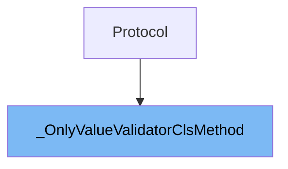

# Inheritance diagram

This diagram shows the inheritance tree of the class:



# What is <SwmToken path="pydantic/deprecated/class_validators.py" pos="21:3:3" line-data="    class _OnlyValueValidatorClsMethod(Protocol):">`_OnlyValueValidatorClsMethod`</SwmToken>

<SwmToken path="pydantic/deprecated/class_validators.py" pos="21:3:3" line-data="    class _OnlyValueValidatorClsMethod(Protocol):">`_OnlyValueValidatorClsMethod`</SwmToken> is a protocol class defined in <SwmPath>[pydantic/deprecated/class_validators.py](pydantic/deprecated/class_validators.py)</SwmPath>. It is used as a type specification for validator methods that accept only the class and a value as arguments. This protocol helps type checkers and internal logic distinguish between different validator signatures in Pydantic's deprecated <SwmToken path="pydantic/deprecated/class_validators.py" pos="1:21:21" line-data="&quot;&quot;&quot;Old `@validator` and `@root_validator` function validators from V1.&quot;&quot;&quot;">`V1`</SwmToken> validation system.

<SwmSnippet path="/pydantic/deprecated/class_validators.py" line="21">

---

<SwmToken path="pydantic/deprecated/class_validators.py" pos="21:3:3" line-data="    class _OnlyValueValidatorClsMethod(Protocol):">`_OnlyValueValidatorClsMethod`</SwmToken> defines a single method, **call**, which specifies the expected signature for validator methods that match this protocol.

```python
    class _OnlyValueValidatorClsMethod(Protocol):
        def __call__(self, __cls: Any, __value: Any) -> Any: ...
```

---

</SwmSnippet>

# Usage

## <SwmToken path="pydantic/deprecated/class_validators.py" pos="21:3:3" line-data="    class _OnlyValueValidatorClsMethod(Protocol):">`_OnlyValueValidatorClsMethod`</SwmToken>

The <SwmToken path="pydantic/deprecated/class_validators.py" pos="21:3:3" line-data="    class _OnlyValueValidatorClsMethod(Protocol):">`_OnlyValueValidatorClsMethod`</SwmToken> class is used as one of several types in the <SwmToken path="pydantic/deprecated/class_validators.py" pos="41:1:1" line-data="    V1Validator = Union[">`V1Validator`</SwmToken> union, which groups different validator classes together. This union is defined in the deprecated <SwmPath>[pydantic/deprecated/class_validators.py](pydantic/deprecated/class_validators.py)</SwmPath> file, suggesting that <SwmToken path="pydantic/deprecated/class_validators.py" pos="21:3:3" line-data="    class _OnlyValueValidatorClsMethod(Protocol):">`_OnlyValueValidatorClsMethod`</SwmToken> participates in legacy validation mechanisms. Its inclusion in the union alongside other validator classes implies it is used to handle specific validation scenarios where only the value is considered, distinguishing it from validators that might require additional context or parameters.

&nbsp;

*This is an auto-generated document by Swimm 🌊 and has not yet been verified by a human*

<SwmMeta version="3.0.0" repo-id="Z2l0aHViJTNBJTNBcHlkYW50aWMlM0ElM0FTd2ltbS1EZW1v" repo-name="pydantic"><sup>Powered by [Swimm](/)</sup></SwmMeta>
