# Inheritance diagram

This diagram shows the inheritance tree of the class:

```mermaid
graph TD;
  AnyUrl:::currentBaseStyle
AnyUrl --> AnyHttpUrl
AnyHttpUrl --> HttpUrl
AnyUrl --> MultiHostDsn
MultiHostDsn --> PostgresDsn
AnyUrl --> RedisDsn
AnyUrl --> 1[...]

 classDef currentBaseStyle color:#000000,fill:#7CB9F4

%% Swimm:
%% graph TD;
%%   <SwmToken path="pydantic/v1/networks.py" pos="267:33:33" line-data="    def validate(cls, value: Any, field: &#39;ModelField&#39;, config: &#39;BaseConfig&#39;) -&gt; &#39;AnyUrl&#39;:">`AnyUrl`</SwmToken>:::currentBaseStyle
%% <SwmToken path="pydantic/v1/networks.py" pos="267:33:33" line-data="    def validate(cls, value: Any, field: &#39;ModelField&#39;, config: &#39;BaseConfig&#39;) -&gt; &#39;AnyUrl&#39;:">`AnyUrl`</SwmToken> --> <SwmToken path="pydantic/v1/networks.py" pos="74:2:2" line-data="    &#39;AnyHttpUrl&#39;,">`AnyHttpUrl`</SwmToken>
%% <SwmToken path="pydantic/v1/networks.py" pos="74:2:2" line-data="    &#39;AnyHttpUrl&#39;,">`AnyHttpUrl`</SwmToken> --> <SwmToken path="pydantic/v1/networks.py" pos="76:2:2" line-data="    &#39;HttpUrl&#39;,">`HttpUrl`</SwmToken>
%% <SwmToken path="pydantic/v1/networks.py" pos="267:33:33" line-data="    def validate(cls, value: Any, field: &#39;ModelField&#39;, config: &#39;BaseConfig&#39;) -&gt; &#39;AnyUrl&#39;:">`AnyUrl`</SwmToken> --> <SwmToken path="pydantic/v1/networks.py" pos="292:10:10" line-data="        can be altered in `MultiHostDsn`.">`MultiHostDsn`</SwmToken>
%% <SwmToken path="pydantic/v1/networks.py" pos="292:10:10" line-data="        can be altered in `MultiHostDsn`.">`MultiHostDsn`</SwmToken> --> <SwmToken path="pydantic/v1/networks.py" pos="83:2:2" line-data="    &#39;PostgresDsn&#39;,">`PostgresDsn`</SwmToken>
%% <SwmToken path="pydantic/v1/networks.py" pos="267:33:33" line-data="    def validate(cls, value: Any, field: &#39;ModelField&#39;, config: &#39;BaseConfig&#39;) -&gt; &#39;AnyUrl&#39;:">`AnyUrl`</SwmToken> --> <SwmToken path="pydantic/v1/networks.py" pos="86:2:2" line-data="    &#39;RedisDsn&#39;,">`RedisDsn`</SwmToken>
%% <SwmToken path="pydantic/v1/networks.py" pos="267:33:33" line-data="    def validate(cls, value: Any, field: &#39;ModelField&#39;, config: &#39;BaseConfig&#39;) -&gt; &#39;AnyUrl&#39;:">`AnyUrl`</SwmToken> --> 1[...]
%% 
%%  classDef currentBaseStyle color:#000000,fill:#7CB9F4
```



This document covers the class <SwmToken path="pydantic/v1/networks.py" pos="267:33:33" line-data="    def validate(cls, value: Any, field: &#39;ModelField&#39;, config: &#39;BaseConfig&#39;) -&gt; &#39;AnyUrl&#39;:">`AnyUrl`</SwmToken> in detail. We'll address:

1. What is <SwmToken path="pydantic/v1/networks.py" pos="267:33:33" line-data="    def validate(cls, value: Any, field: &#39;ModelField&#39;, config: &#39;BaseConfig&#39;) -&gt; &#39;AnyUrl&#39;:">`AnyUrl`</SwmToken>
2. Variables and functions defined in <SwmToken path="pydantic/v1/networks.py" pos="267:33:33" line-data="    def validate(cls, value: Any, field: &#39;ModelField&#39;, config: &#39;BaseConfig&#39;) -&gt; &#39;AnyUrl&#39;:">`AnyUrl`</SwmToken>

# What is <SwmToken path="pydantic/v1/networks.py" pos="267:33:33" line-data="    def validate(cls, value: Any, field: &#39;ModelField&#39;, config: &#39;BaseConfig&#39;) -&gt; &#39;AnyUrl&#39;:">`AnyUrl`</SwmToken>

<SwmToken path="pydantic/v1/networks.py" pos="267:33:33" line-data="    def validate(cls, value: Any, field: &#39;ModelField&#39;, config: &#39;BaseConfig&#39;) -&gt; &#39;AnyUrl&#39;:">`AnyUrl`</SwmToken> is a class in pydantic that represents a validated URL string. It is designed to parse, validate, and store URLs with flexible requirements for scheme, user, host, port, path, query, and fragment. <SwmToken path="pydantic/v1/networks.py" pos="267:33:33" line-data="    def validate(cls, value: Any, field: &#39;ModelField&#39;, config: &#39;BaseConfig&#39;) -&gt; &#39;AnyUrl&#39;:">`AnyUrl`</SwmToken> is used as a base for more specific URL types and provides a foundation for URL validation and normalization in Pydantic models.

<SwmSnippet path="/pydantic/v1/networks.py" line="172">

---

The variable <SwmToken path="pydantic/v1/networks.py" pos="172:1:1" line-data="    strip_whitespace = True">`strip_whitespace`</SwmToken> determines whether whitespace should be stripped from the URL during validation.

```python
    strip_whitespace = True
```

---

</SwmSnippet>

<SwmSnippet path="/pydantic/v1/networks.py" line="173">

---

The variable <SwmToken path="pydantic/v1/networks.py" pos="173:1:1" line-data="    min_length = 1">`min_length`</SwmToken> sets the minimum allowed length for the URL string.

```python
    min_length = 1
```

---

</SwmSnippet>

<SwmSnippet path="/pydantic/v1/networks.py" line="174">

---

The variable <SwmToken path="pydantic/v1/networks.py" pos="174:1:1" line-data="    max_length = 2**16">`max_length`</SwmToken> sets the maximum allowed length for the URL string.

```python
    max_length = 2**16
```

---

</SwmSnippet>

<SwmSnippet path="/pydantic/v1/networks.py" line="175">

---

The variable <SwmToken path="pydantic/v1/networks.py" pos="175:1:1" line-data="    allowed_schemes: Optional[Collection[str]] = None">`allowed_schemes`</SwmToken> specifies which URL schemes (such as 'http', 'https') are permitted. If None, any scheme is allowed.

```python
    allowed_schemes: Optional[Collection[str]] = None
```

---

</SwmSnippet>

<SwmSnippet path="/pydantic/v1/networks.py" line="176">

---

The variable <SwmToken path="pydantic/v1/networks.py" pos="176:1:1" line-data="    tld_required: bool = False">`tld_required`</SwmToken> indicates whether a top-level domain is required in the host part of the URL.

```python
    tld_required: bool = False
```

---

</SwmSnippet>

<SwmSnippet path="/pydantic/v1/networks.py" line="177">

---

The variable <SwmToken path="pydantic/v1/networks.py" pos="177:1:1" line-data="    user_required: bool = False">`user_required`</SwmToken> specifies whether a user component is required in the URL.

```python
    user_required: bool = False
```

---

</SwmSnippet>

<SwmSnippet path="/pydantic/v1/networks.py" line="178">

---

The variable <SwmToken path="pydantic/v1/networks.py" pos="178:1:1" line-data="    host_required: bool = True">`host_required`</SwmToken> determines whether the host part of the URL is mandatory.

```python
    host_required: bool = True
```

---

</SwmSnippet>

<SwmSnippet path="/pydantic/v1/networks.py" line="179">

---

The variable <SwmToken path="pydantic/v1/networks.py" pos="179:1:1" line-data="    hidden_parts: Set[str] = set()">`hidden_parts`</SwmToken> is a set that defines which URL parts should be hidden or omitted when building the URL string.

```python
    hidden_parts: Set[str] = set()
```

---

</SwmSnippet>

<SwmSnippet path="/pydantic/v1/networks.py" line="181">

---

The <SwmToken path="pydantic/v1/networks.py" pos="181:1:1" line-data="    __slots__ = (&#39;scheme&#39;, &#39;user&#39;, &#39;password&#39;, &#39;host&#39;, &#39;tld&#39;, &#39;host_type&#39;, &#39;port&#39;, &#39;path&#39;, &#39;query&#39;, &#39;fragment&#39;)">`__slots__`</SwmToken> attribute defines the set of instance attributes for <SwmToken path="pydantic/v1/networks.py" pos="267:33:33" line-data="    def validate(cls, value: Any, field: &#39;ModelField&#39;, config: &#39;BaseConfig&#39;) -&gt; &#39;AnyUrl&#39;:">`AnyUrl`</SwmToken>, optimizing memory usage and restricting dynamic attribute creation.

```python
    __slots__ = ('scheme', 'user', 'password', 'host', 'tld', 'host_type', 'port', 'path', 'query', 'fragment')
```

---

</SwmSnippet>

<SwmSnippet path="/pydantic/v1/networks.py" line="183">

---

The <SwmToken path="pydantic/v1/networks.py" pos="184:3:3" line-data="    def __new__(cls, url: Optional[str], **kwargs) -&gt; object:">`__new__`</SwmToken> method creates a new <SwmToken path="pydantic/v1/networks.py" pos="267:33:33" line-data="    def validate(cls, value: Any, field: &#39;ModelField&#39;, config: &#39;BaseConfig&#39;) -&gt; &#39;AnyUrl&#39;:">`AnyUrl`</SwmToken> instance, building the URL from components if the url argument is None.

```python
    @no_type_check
    def __new__(cls, url: Optional[str], **kwargs) -> object:
        return str.__new__(cls, cls.build(**kwargs) if url is None else url)
```

---

</SwmSnippet>

<SwmSnippet path="/pydantic/v1/networks.py" line="187">

---

The <SwmToken path="pydantic/v1/networks.py" pos="187:3:3" line-data="    def __init__(">`__init__`</SwmToken> method initializes an <SwmToken path="pydantic/v1/networks.py" pos="267:33:33" line-data="    def validate(cls, value: Any, field: &#39;ModelField&#39;, config: &#39;BaseConfig&#39;) -&gt; &#39;AnyUrl&#39;:">`AnyUrl`</SwmToken> instance, assigning all URL components (scheme, user, password, host, tld, <SwmToken path="pydantic/v1/networks.py" pos="196:1:1" line-data="        host_type: str = &#39;domain&#39;,">`host_type`</SwmToken>, port, path, query, fragment) to instance attributes.

```python
    def __init__(
        self,
        url: str,
        *,
        scheme: str,
        user: Optional[str] = None,
        password: Optional[str] = None,
        host: Optional[str] = None,
        tld: Optional[str] = None,
        host_type: str = 'domain',
        port: Optional[str] = None,
        path: Optional[str] = None,
        query: Optional[str] = None,
        fragment: Optional[str] = None,
    ) -> None:
        str.__init__(url)
        self.scheme = scheme
        self.user = user
        self.password = password
        self.host = host
        self.tld = tld
        self.host_type = host_type
        self.port = port
        self.path = path
        self.query = query
        self.fragment = fragment

```

---

</SwmSnippet>

<SwmSnippet path="/pydantic/v1/networks.py" line="215">

---

The <SwmToken path="pydantic/v1/networks.py" pos="215:3:3" line-data="    def build(">`build`</SwmToken> class method constructs a URL string from its components, handling user info, host, port, path, query, and fragment.

```python
    def build(
        cls,
        *,
        scheme: str,
        user: Optional[str] = None,
        password: Optional[str] = None,
        host: str,
        port: Optional[str] = None,
        path: Optional[str] = None,
        query: Optional[str] = None,
        fragment: Optional[str] = None,
        **_kwargs: str,
    ) -> str:
        parts = Parts(
            scheme=scheme,
            user=user,
            password=password,
            host=host,
            port=port,
            path=path,
            query=query,
            fragment=fragment,
            **_kwargs,  # type: ignore[misc]
        )

        url = scheme + '://'
        if user:
            url += user
        if password:
            url += ':' + password
        if user or password:
            url += '@'
        url += host
        if port and ('port' not in cls.hidden_parts or cls.get_default_parts(parts).get('port') != port):
            url += ':' + port
        if path:
            url += path
        if query:
            url += '?' + query
        if fragment:
            url += '#' + fragment
        return url

```

---

</SwmSnippet>

<SwmSnippet path="/pydantic/v1/networks.py" line="259">

---

The <SwmToken path="pydantic/v1/networks.py" pos="259:3:3" line-data="    def __modify_schema__(cls, field_schema: Dict[str, Any]) -&gt; None:">`__modify_schema__`</SwmToken> class method updates the schema for OpenAPI or JSON Schema generation, setting <SwmToken path="pydantic/v1/networks.py" pos="260:6:6" line-data="        update_not_none(field_schema, minLength=cls.min_length, maxLength=cls.max_length, format=&#39;uri&#39;)">`minLength`</SwmToken>, <SwmToken path="pydantic/v1/networks.py" pos="260:13:13" line-data="        update_not_none(field_schema, minLength=cls.min_length, maxLength=cls.max_length, format=&#39;uri&#39;)">`maxLength`</SwmToken>, and format.

```python
    def __modify_schema__(cls, field_schema: Dict[str, Any]) -> None:
        update_not_none(field_schema, minLength=cls.min_length, maxLength=cls.max_length, format='uri')

```

---

</SwmSnippet>

<SwmSnippet path="/pydantic/v1/networks.py" line="263">

---

The <SwmToken path="pydantic/v1/networks.py" pos="263:3:3" line-data="    def __get_validators__(cls) -&gt; &#39;CallableGenerator&#39;:">`__get_validators__`</SwmToken> class method yields the validate method, integrating <SwmToken path="pydantic/v1/networks.py" pos="267:33:33" line-data="    def validate(cls, value: Any, field: &#39;ModelField&#39;, config: &#39;BaseConfig&#39;) -&gt; &#39;AnyUrl&#39;:">`AnyUrl`</SwmToken> into Pydantic's validation system.

```python
    def __get_validators__(cls) -> 'CallableGenerator':
        yield cls.validate

```

---

</SwmSnippet>

<SwmSnippet path="/pydantic/v1/networks.py" line="267">

---

The <SwmToken path="pydantic/v1/networks.py" pos="267:3:3" line-data="    def validate(cls, value: Any, field: &#39;ModelField&#39;, config: &#39;BaseConfig&#39;) -&gt; &#39;AnyUrl&#39;:">`validate`</SwmToken> class method performs the main validation logic: it checks the type, strips whitespace, validates length, matches the URL with a regex, applies defaults, validates parts, and builds the final <SwmToken path="pydantic/v1/networks.py" pos="267:33:33" line-data="    def validate(cls, value: Any, field: &#39;ModelField&#39;, config: &#39;BaseConfig&#39;) -&gt; &#39;AnyUrl&#39;:">`AnyUrl`</SwmToken> object.

```python
    def validate(cls, value: Any, field: 'ModelField', config: 'BaseConfig') -> 'AnyUrl':
        if value.__class__ == cls:
            return value
        value = str_validator(value)
        if cls.strip_whitespace:
            value = value.strip()
        url: str = cast(str, constr_length_validator(value, field, config))

        m = cls._match_url(url)
        # the regex should always match, if it doesn't please report with details of the URL tried
        assert m, 'URL regex failed unexpectedly'

        original_parts = cast('Parts', m.groupdict())
        parts = cls.apply_default_parts(original_parts)
        parts = cls.validate_parts(parts)

        if m.end() != len(url):
            raise errors.UrlExtraError(extra=url[m.end() :])

        return cls._build_url(m, url, parts)

```

---

</SwmSnippet>

<SwmSnippet path="/pydantic/v1/networks.py" line="289">

---

The <SwmToken path="pydantic/v1/networks.py" pos="289:3:3" line-data="    def _build_url(cls, m: Match[str], url: str, parts: &#39;Parts&#39;) -&gt; &#39;AnyUrl&#39;:">`_build_url`</SwmToken> class method validates the host and constructs the <SwmToken path="pydantic/v1/networks.py" pos="289:34:34" line-data="    def _build_url(cls, m: Match[str], url: str, parts: &#39;Parts&#39;) -&gt; &#39;AnyUrl&#39;:">`AnyUrl`</SwmToken> object, optionally rebuilding the URL if necessary.

```python
    def _build_url(cls, m: Match[str], url: str, parts: 'Parts') -> 'AnyUrl':
        """
        Validate hosts and build the AnyUrl object. Split from `validate` so this method
        can be altered in `MultiHostDsn`.
        """
        host, tld, host_type, rebuild = cls.validate_host(parts)

        return cls(
            None if rebuild else url,
            scheme=parts['scheme'],
            user=parts['user'],
            password=parts['password'],
            host=host,
            tld=tld,
            host_type=host_type,
            port=parts['port'],
            path=parts['path'],
            query=parts['query'],
            fragment=parts['fragment'],
        )

```

---

</SwmSnippet>

<SwmSnippet path="/pydantic/v1/networks.py" line="311">

---

The <SwmToken path="pydantic/v1/networks.py" pos="311:3:3" line-data="    def _match_url(url: str) -&gt; Optional[Match[str]]:">`_match_url`</SwmToken> static method matches a URL string against the compiled URL regex and returns the match object.

```python
    def _match_url(url: str) -> Optional[Match[str]]:
        return url_regex().match(url)
```

---

</SwmSnippet>

<SwmSnippet path="/pydantic/v1/networks.py" line="315">

---

The <SwmToken path="pydantic/v1/networks.py" pos="315:3:3" line-data="    def _validate_port(port: Optional[str]) -&gt; None:">`_validate_port`</SwmToken> static method checks if the port is within the valid range (<= 65535) and raises an error if not.

```python
    def _validate_port(port: Optional[str]) -> None:
        if port is not None and int(port) > 65_535:
            raise errors.UrlPortError()

```

---

</SwmSnippet>

<SwmSnippet path="/pydantic/v1/networks.py" line="320">

---

The <SwmToken path="pydantic/v1/networks.py" pos="320:3:3" line-data="    def validate_parts(cls, parts: &#39;Parts&#39;, validate_port: bool = True) -&gt; &#39;Parts&#39;:">`validate_parts`</SwmToken> class method validates individual URL parts, such as scheme, allowed schemes, port, and user info, raising errors for invalid or missing components.

```python
    def validate_parts(cls, parts: 'Parts', validate_port: bool = True) -> 'Parts':
        """
        A method used to validate parts of a URL.
        Could be overridden to set default values for parts if missing
        """
        scheme = parts['scheme']
        if scheme is None:
            raise errors.UrlSchemeError()

        if cls.allowed_schemes and scheme.lower() not in cls.allowed_schemes:
            raise errors.UrlSchemePermittedError(set(cls.allowed_schemes))

        if validate_port:
            cls._validate_port(parts['port'])

        user = parts['user']
        if cls.user_required and user is None:
            raise errors.UrlUserInfoError()

        return parts

```

---

</SwmSnippet>

<SwmSnippet path="/pydantic/v1/networks.py" line="342">

---

The <SwmToken path="pydantic/v1/networks.py" pos="342:3:3" line-data="    def validate_host(cls, parts: &#39;Parts&#39;) -&gt; Tuple[str, Optional[str], str, bool]:">`validate_host`</SwmToken> class method validates the host part of the URL, determines its type (domain, <SwmToken path="pydantic/v1/networks.py" pos="344:14:14" line-data="        for f in (&#39;domain&#39;, &#39;ipv4&#39;, &#39;ipv6&#39;):">`ipv4`</SwmToken>, <SwmToken path="pydantic/v1/networks.py" pos="344:19:19" line-data="        for f in (&#39;domain&#39;, &#39;ipv4&#39;, &#39;ipv6&#39;):">`ipv6`</SwmToken>), checks for TLD requirements, and handles internationalized domains.

```python
    def validate_host(cls, parts: 'Parts') -> Tuple[str, Optional[str], str, bool]:
        tld, host_type, rebuild = None, None, False
        for f in ('domain', 'ipv4', 'ipv6'):
            host = parts[f]  # type: ignore[literal-required]
            if host:
                host_type = f
                break

        if host is None:
            if cls.host_required:
                raise errors.UrlHostError()
        elif host_type == 'domain':
            is_international = False
            d = ascii_domain_regex().fullmatch(host)
            if d is None:
                d = int_domain_regex().fullmatch(host)
                if d is None:
                    raise errors.UrlHostError()
                is_international = True

            tld = d.group('tld')
            if tld is None and not is_international:
                d = int_domain_regex().fullmatch(host)
                assert d is not None
                tld = d.group('tld')
                is_international = True

            if tld is not None:
                tld = tld[1:]
            elif cls.tld_required:
                raise errors.UrlHostTldError()

            if is_international:
                host_type = 'int_domain'
                rebuild = True
                host = host.encode('idna').decode('ascii')
                if tld is not None:
                    tld = tld.encode('idna').decode('ascii')

        return host, tld, host_type, rebuild  # type: ignore

```

---

</SwmSnippet>

<SwmSnippet path="/pydantic/v1/networks.py" line="384">

---

The <SwmToken path="pydantic/v1/networks.py" pos="384:3:3" line-data="    def get_default_parts(parts: &#39;Parts&#39;) -&gt; &#39;Parts&#39;:">`get_default_parts`</SwmToken> static method returns default values for URL parts, which can be overridden in subclasses.

```python
    def get_default_parts(parts: 'Parts') -> 'Parts':
        return {}
```

---

</SwmSnippet>

<SwmSnippet path="/pydantic/v1/networks.py" line="388">

---

The <SwmToken path="pydantic/v1/networks.py" pos="388:3:3" line-data="    def apply_default_parts(cls, parts: &#39;Parts&#39;) -&gt; &#39;Parts&#39;:">`apply_default_parts`</SwmToken> class method applies default values to missing URL parts using the <SwmToken path="pydantic/v1/networks.py" pos="389:12:12" line-data="        for key, value in cls.get_default_parts(parts).items():">`get_default_parts`</SwmToken> method.

```python
    def apply_default_parts(cls, parts: 'Parts') -> 'Parts':
        for key, value in cls.get_default_parts(parts).items():
            if not parts[key]:  # type: ignore[literal-required]
                parts[key] = value  # type: ignore[literal-required]
        return parts

```

---

</SwmSnippet>

<SwmSnippet path="/pydantic/v1/networks.py" line="394">

---

The <SwmToken path="pydantic/v1/networks.py" pos="394:3:3" line-data="    def __repr__(self) -&gt; str:">`__repr__`</SwmToken> method provides a string representation of the <SwmToken path="pydantic/v1/networks.py" pos="267:33:33" line-data="    def validate(cls, value: Any, field: &#39;ModelField&#39;, config: &#39;BaseConfig&#39;) -&gt; &#39;AnyUrl&#39;:">`AnyUrl`</SwmToken> instance, including all non-None URL components.

```python
    def __repr__(self) -> str:
        extra = ', '.join(f'{n}={getattr(self, n)!r}' for n in self.__slots__ if getattr(self, n) is not None)
        return f'{self.__class__.__name__}({super().__repr__()}, {extra})'
```

---

</SwmSnippet>

# Usage

## <SwmToken path="pydantic/v1/networks.py" pos="267:33:33" line-data="    def validate(cls, value: Any, field: &#39;ModelField&#39;, config: &#39;BaseConfig&#39;) -&gt; &#39;AnyUrl&#39;:">`AnyUrl`</SwmToken> Usage in Schema Constraints

<SwmToken path="pydantic/v1/networks.py" pos="267:33:33" line-data="    def validate(cls, value: Any, field: &#39;ModelField&#39;, config: &#39;BaseConfig&#39;) -&gt; &#39;AnyUrl&#39;:">`AnyUrl`</SwmToken> is used in schema-related code to differentiate URL strings from other string types such as <SwmToken path="pydantic/v1/networks.py" pos="78:2:2" line-data="    &#39;EmailStr&#39;,">`EmailStr`</SwmToken>. This distinction allows the system to apply specific constraints and validations appropriate for URLs, ensuring that data models handle URL inputs correctly.

## Example of <SwmToken path="pydantic/v1/networks.py" pos="267:33:33" line-data="    def validate(cls, value: Any, field: &#39;ModelField&#39;, config: &#39;BaseConfig&#39;) -&gt; &#39;AnyUrl&#39;:">`AnyUrl`</SwmToken> in Type Constraints

In the function that generates constraint types, <SwmToken path="pydantic/v1/networks.py" pos="267:33:33" line-data="    def validate(cls, value: Any, field: &#39;ModelField&#39;, config: &#39;BaseConfig&#39;) -&gt; &#39;AnyUrl&#39;:">`AnyUrl`</SwmToken> is explicitly excluded from generic string constraints like <SwmToken path="pydantic/v1/networks.py" pos="174:1:1" line-data="    max_length = 2**16">`max_length`</SwmToken>, <SwmToken path="pydantic/v1/networks.py" pos="173:1:1" line-data="    min_length = 1">`min_length`</SwmToken>, and regex. This exclusion highlights that <SwmToken path="pydantic/v1/networks.py" pos="267:33:33" line-data="    def validate(cls, value: Any, field: &#39;ModelField&#39;, config: &#39;BaseConfig&#39;) -&gt; &#39;AnyUrl&#39;:">`AnyUrl`</SwmToken> has specialized validation logic that should not be overridden by general string constraints, preserving the integrity of URL validation.

&nbsp;

*This is an auto-generated document by Swimm 🌊 and has not yet been verified by a human*

<SwmMeta version="3.0.0" repo-id="Z2l0aHViJTNBJTNBcHlkYW50aWMlM0ElM0FTd2ltbS1EZW1v" repo-name="pydantic"><sup>Powered by [Swimm](/)</sup></SwmMeta>
