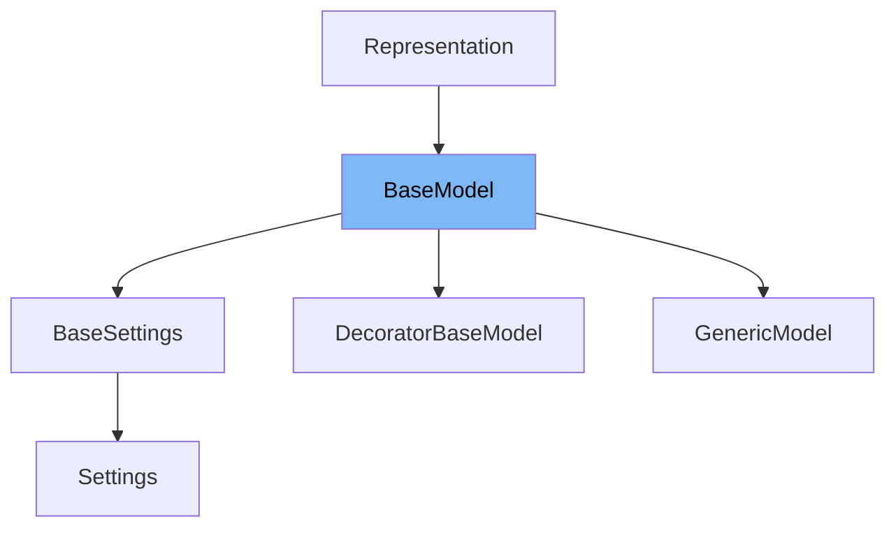

# Inheritance diagram

This diagram shows the inheritance tree of the class:



This document covers the <SwmToken path="pydantic/v1/main.py" pos="383:26:26" line-data="                # - keep other values (e.g. submodels) untouched (using `BaseModel.dict()` will change them into dicts)">`BaseModel`</SwmToken> class in detail, focusing on:

1. What <SwmToken path="pydantic/v1/main.py" pos="383:26:26" line-data="                # - keep other values (e.g. submodels) untouched (using `BaseModel.dict()` will change them into dicts)">`BaseModel`</SwmToken> is and its role in Pydantic
2. The variables defined in <SwmToken path="pydantic/v1/main.py" pos="383:26:26" line-data="                # - keep other values (e.g. submodels) untouched (using `BaseModel.dict()` will change them into dicts)">`BaseModel`</SwmToken>
3. The functions and methods provided by <SwmToken path="pydantic/v1/main.py" pos="383:26:26" line-data="                # - keep other values (e.g. submodels) untouched (using `BaseModel.dict()` will change them into dicts)">`BaseModel`</SwmToken>

# What is <SwmToken path="pydantic/v1/main.py" pos="383:26:26" line-data="                # - keep other values (e.g. submodels) untouched (using `BaseModel.dict()` will change them into dicts)">`BaseModel`</SwmToken>

<SwmToken path="pydantic/v1/main.py" pos="383:26:26" line-data="                # - keep other values (e.g. submodels) untouched (using `BaseModel.dict()` will change them into dicts)">`BaseModel`</SwmToken> is the foundational class in Pydantic for defining data models. It enables developers to create classes that validate and parse input data using Python type hints. By inheriting from <SwmToken path="pydantic/v1/main.py" pos="383:26:26" line-data="                # - keep other values (e.g. submodels) untouched (using `BaseModel.dict()` will change them into dicts)">`BaseModel`</SwmToken>, users can define fields as class attributes, and Pydantic will automatically handle validation, serialization, and error reporting. This approach allows for robust and type-safe data handling in Python applications.

<SwmSnippet path="/pydantic/v1/main.py" line="319">

---

The variable <SwmToken path="pydantic/v1/main.py" pos="319:1:1" line-data="        __fields__: ClassVar[Dict[str, ModelField]] = {}">`__fields__`</SwmToken> is a class-level dictionary that maps field names to their corresponding <SwmToken path="pydantic/v1/main.py" pos="319:11:11" line-data="        __fields__: ClassVar[Dict[str, ModelField]] = {}">`ModelField`</SwmToken> instances. It is populated by the metaclass and is essential for tracking all fields defined on the model.

```python
        __fields__: ClassVar[Dict[str, ModelField]] = {}
```

---

</SwmSnippet>

<SwmSnippet path="/pydantic/v1/main.py" line="320">

---

The variable <SwmToken path="pydantic/v1/main.py" pos="320:1:1" line-data="        __include_fields__: ClassVar[Optional[Mapping[str, Any]]] = None">`__include_fields__`</SwmToken> is an optional mapping that specifies which fields should be included when serializing or exporting the model. It allows for fine-grained control over field inclusion.

```python
        __include_fields__: ClassVar[Optional[Mapping[str, Any]]] = None
```

---

</SwmSnippet>

<SwmSnippet path="/pydantic/v1/main.py" line="321">

---

The variable <SwmToken path="pydantic/v1/main.py" pos="321:1:1" line-data="        __exclude_fields__: ClassVar[Optional[Mapping[str, Any]]] = None">`__exclude_fields__`</SwmToken> is an optional mapping that specifies which fields should be excluded during serialization or export. This is useful for omitting sensitive or unnecessary data.

```python
        __exclude_fields__: ClassVar[Optional[Mapping[str, Any]]] = None
```

---

</SwmSnippet>

<SwmSnippet path="/pydantic/v1/main.py" line="322">

---

The variable <SwmToken path="pydantic/v1/main.py" pos="322:1:1" line-data="        __validators__: ClassVar[Dict[str, AnyCallable]] = {}">`__validators__`</SwmToken> is a dictionary that holds all validators defined for the model. Validators are functions that enforce additional constraints on field values.

```python
        __validators__: ClassVar[Dict[str, AnyCallable]] = {}
```

---

</SwmSnippet>

<SwmSnippet path="/pydantic/v1/main.py" line="323">

---

The variable <SwmToken path="pydantic/v1/main.py" pos="323:1:1" line-data="        __pre_root_validators__: ClassVar[List[AnyCallable]]">`__pre_root_validators__`</SwmToken> is a list of callables that are executed before any field validation occurs. These can be used for preprocessing or global validation logic.

```python
        __pre_root_validators__: ClassVar[List[AnyCallable]]
```

---

</SwmSnippet>

<SwmSnippet path="/pydantic/v1/main.py" line="324">

---

The variable <SwmToken path="pydantic/v1/main.py" pos="324:1:1" line-data="        __post_root_validators__: ClassVar[List[Tuple[bool, AnyCallable]]]">`__post_root_validators__`</SwmToken> is a list of tuples containing a boolean and a callable. These validators are executed after field validation and can be used for post-processing or cross-field validation.

```python
        __post_root_validators__: ClassVar[List[Tuple[bool, AnyCallable]]]
```

---

</SwmSnippet>

<SwmSnippet path="/pydantic/v1/main.py" line="325">

---

The variable <SwmToken path="pydantic/v1/main.py" pos="325:1:1" line-data="        __config__: ClassVar[Type[BaseConfig]] = BaseConfig">`__config__`</SwmToken> holds the configuration class for the model, which controls behaviors such as extra field handling, immutability, and JSON encoding.

```python
        __config__: ClassVar[Type[BaseConfig]] = BaseConfig
```

---

</SwmSnippet>

<SwmSnippet path="/pydantic/v1/main.py" line="326">

---

The variable <SwmToken path="pydantic/v1/main.py" pos="326:1:1" line-data="        __json_encoder__: ClassVar[Callable[[Any], Any]] = lambda x: x">`__json_encoder__`</SwmToken> is a callable used to encode objects to JSON. By default, it is a simple identity function, but it can be customized for complex types.

```python
        __json_encoder__: ClassVar[Callable[[Any], Any]] = lambda x: x
```

---

</SwmSnippet>

<SwmSnippet path="/pydantic/v1/main.py" line="327">

---

The variable <SwmToken path="pydantic/v1/main.py" pos="327:1:1" line-data="        __schema_cache__: ClassVar[&#39;DictAny&#39;] = {}">`__schema_cache__`</SwmToken> is a dictionary used to cache generated schemas for the model, improving performance when schema generation is requested multiple times.

```python
        __schema_cache__: ClassVar['DictAny'] = {}
```

---

</SwmSnippet>

<SwmSnippet path="/pydantic/v1/main.py" line="328">

---

The variable <SwmToken path="pydantic/v1/main.py" pos="328:1:1" line-data="        __custom_root_type__: ClassVar[bool] = False">`__custom_root_type__`</SwmToken> is a boolean indicating whether the model uses a custom root type, which allows the model to wrap a single value instead of a dictionary of fields.

```python
        __custom_root_type__: ClassVar[bool] = False
```

---

</SwmSnippet>

<SwmSnippet path="/pydantic/v1/main.py" line="329">

---

The variable <SwmToken path="pydantic/v1/main.py" pos="329:1:1" line-data="        __signature__: ClassVar[&#39;Signature&#39;]">`__signature__`</SwmToken> holds the function signature for the model's constructor, supporting introspection and IDE features.

```python
        __signature__: ClassVar['Signature']
```

---

</SwmSnippet>

<SwmSnippet path="/pydantic/v1/main.py" line="330">

---

The variable <SwmToken path="pydantic/v1/main.py" pos="330:1:1" line-data="        __private_attributes__: ClassVar[Dict[str, ModelPrivateAttr]]">`__private_attributes__`</SwmToken> is a dictionary mapping private attribute names to their definitions, supporting encapsulation of internal state.

```python
        __private_attributes__: ClassVar[Dict[str, ModelPrivateAttr]]
```

---

</SwmSnippet>

<SwmSnippet path="/pydantic/v1/main.py" line="331">

---

The variable <SwmToken path="pydantic/v1/main.py" pos="331:1:1" line-data="        __class_vars__: ClassVar[SetStr]">`__class_vars__`</SwmToken> is a set of class variable names, distinguishing them from regular fields.

```python
        __class_vars__: ClassVar[SetStr]
```

---

</SwmSnippet>

<SwmSnippet path="/pydantic/v1/main.py" line="332">

---

The variable <SwmToken path="pydantic/v1/main.py" pos="332:1:1" line-data="        __fields_set__: ClassVar[SetStr] = set()">`__fields_set__`</SwmToken> is a set of field names that have been explicitly set on the model instance, used for tracking which fields were provided by the user.

```python
        __fields_set__: ClassVar[SetStr] = set()
```

---

</SwmSnippet>

<SwmSnippet path="/pydantic/v1/main.py" line="334">

---

The variable <SwmToken path="pydantic/v1/main.py" pos="334:1:1" line-data="    Config = BaseConfig">`Config`</SwmToken> is an alias for the model's configuration class, allowing for easy access and customization.

```python
    Config = BaseConfig
```

---

</SwmSnippet>

<SwmSnippet path="/pydantic/v1/main.py" line="335">

---

The variable <SwmToken path="pydantic/v1/main.py" pos="335:1:1" line-data="    __slots__ = (&#39;__dict__&#39;, &#39;__fields_set__&#39;)">`__slots__`</SwmToken> is defined to optimize memory usage by restricting attribute creation to <SwmToken path="pydantic/v1/main.py" pos="335:7:7" line-data="    __slots__ = (&#39;__dict__&#39;, &#39;__fields_set__&#39;)">`__dict__`</SwmToken> and <SwmToken path="pydantic/v1/main.py" pos="335:12:12" line-data="    __slots__ = (&#39;__dict__&#39;, &#39;__fields_set__&#39;)">`__fields_set__`</SwmToken>.

```python
    __slots__ = ('__dict__', '__fields_set__')
```

---

</SwmSnippet>

<SwmSnippet path="/pydantic/v1/main.py" line="336">

---

The variable <SwmToken path="pydantic/v1/main.py" pos="336:1:1" line-data="    __doc__ = &#39;&#39;  # Null out the Representation docstring">`__doc__`</SwmToken> is set to an empty string to override the inherited docstring from the Representation class.

```python
    __doc__ = ''  # Null out the Representation docstring
```

---

</SwmSnippet>

<SwmSnippet path="/pydantic/v1/main.py" line="338">

---

The <SwmToken path="pydantic/v1/main.py" pos="338:3:3" line-data="    def __init__(__pydantic_self__, **data: Any) -&gt; None:">`__init__`</SwmToken> function initializes a new model instance by parsing and validating input data. It raises a <SwmToken path="pydantic/v1/main.py" pos="342:3:3" line-data="        Raises ValidationError if the input data cannot be parsed to form a valid model.">`ValidationError`</SwmToken> if the data does not conform to the model's schema.

```python
    def __init__(__pydantic_self__, **data: Any) -> None:
        """
        Create a new model by parsing and validating input data from keyword arguments.

        Raises ValidationError if the input data cannot be parsed to form a valid model.
        """
        # Uses something other than `self` the first arg to allow "self" as a settable attribute
        values, fields_set, validation_error = validate_model(__pydantic_self__.__class__, data)
        if validation_error:
            raise validation_error
        try:
            object_setattr(__pydantic_self__, '__dict__', values)
        except TypeError as e:
            raise TypeError(
                'Model values must be a dict; you may not have returned a dictionary from a root validator'
            ) from e
        object_setattr(__pydantic_self__, '__fields_set__', fields_set)
        __pydantic_self__._init_private_attributes()

```

---

</SwmSnippet>

<SwmSnippet path="/pydantic/v1/main.py" line="357">

---

The <SwmToken path="pydantic/v1/main.py" pos="358:3:3" line-data="    def __setattr__(self, name, value):  # noqa: C901 (ignore complexity)">`__setattr__`</SwmToken> function customizes attribute assignment, enforcing validation, immutability, and field constraints when setting attributes on the model.

```python
    @no_type_check
    def __setattr__(self, name, value):  # noqa: C901 (ignore complexity)
        if name in self.__private_attributes__ or name in DUNDER_ATTRIBUTES:
            return object_setattr(self, name, value)

        if self.__config__.extra is not Extra.allow and name not in self.__fields__:
            raise ValueError(f'"{self.__class__.__name__}" object has no field "{name}"')
        elif not self.__config__.allow_mutation or self.__config__.frozen:
            raise TypeError(f'"{self.__class__.__name__}" is immutable and does not support item assignment')
        elif name in self.__fields__ and self.__fields__[name].final:
            raise TypeError(
                f'"{self.__class__.__name__}" object "{name}" field is final and does not support reassignment'
            )
        elif self.__config__.validate_assignment:
            new_values = {**self.__dict__, name: value}

            for validator in self.__pre_root_validators__:
                try:
                    new_values = validator(self.__class__, new_values)
                except (ValueError, TypeError, AssertionError) as exc:
                    raise ValidationError([ErrorWrapper(exc, loc=ROOT_KEY)], self.__class__)

            known_field = self.__fields__.get(name, None)
            if known_field:
                # We want to
                # - make sure validators are called without the current value for this field inside `values`
                # - keep other values (e.g. submodels) untouched (using `BaseModel.dict()` will change them into dicts)
                # - keep the order of the fields
                if not known_field.field_info.allow_mutation:
                    raise TypeError(f'"{known_field.name}" has allow_mutation set to False and cannot be assigned')
                dict_without_original_value = {k: v for k, v in self.__dict__.items() if k != name}
                value, error_ = known_field.validate(value, dict_without_original_value, loc=name, cls=self.__class__)
                if error_:
                    raise ValidationError([error_], self.__class__)
                else:
                    new_values[name] = value

            errors = []
            for skip_on_failure, validator in self.__post_root_validators__:
                if skip_on_failure and errors:
                    continue
                try:
                    new_values = validator(self.__class__, new_values)
                except (ValueError, TypeError, AssertionError) as exc:
                    errors.append(ErrorWrapper(exc, loc=ROOT_KEY))
            if errors:
                raise ValidationError(errors, self.__class__)

            # update the whole __dict__ as other values than just `value`
            # may be changed (e.g. with `root_validator`)
            object_setattr(self, '__dict__', new_values)
        else:
            self.__dict__[name] = value

        self.__fields_set__.add(name)

```

---

</SwmSnippet>

<SwmSnippet path="/pydantic/v1/main.py" line="413">

---

The <SwmToken path="pydantic/v1/main.py" pos="413:3:3" line-data="    def __getstate__(self) -&gt; &#39;DictAny&#39;:">`__getstate__`</SwmToken> and <SwmToken path="pydantic/v1/main.py" pos="421:3:3" line-data="    def __setstate__(self, state: &#39;DictAny&#39;) -&gt; None:">`__setstate__`</SwmToken> functions handle pickling and unpickling of model instances, ensuring private attributes and field sets are preserved.

```python
    def __getstate__(self) -> 'DictAny':
        private_attrs = ((k, getattr(self, k, Undefined)) for k in self.__private_attributes__)
        return {
            '__dict__': self.__dict__,
            '__fields_set__': self.__fields_set__,
            '__private_attribute_values__': {k: v for k, v in private_attrs if v is not Undefined},
        }

    def __setstate__(self, state: 'DictAny') -> None:
        object_setattr(self, '__dict__', state['__dict__'])
        object_setattr(self, '__fields_set__', state['__fields_set__'])
        for name, value in state.get('__private_attribute_values__', {}).items():
            object_setattr(self, name, value)

```

---

</SwmSnippet>

<SwmSnippet path="/pydantic/v1/main.py" line="427">

---

The <SwmToken path="pydantic/v1/main.py" pos="427:3:3" line-data="    def _init_private_attributes(self) -&gt; None:">`_init_private_attributes`</SwmToken> function initializes private attributes with their default values when a model instance is created.

```python
    def _init_private_attributes(self) -> None:
        for name, private_attr in self.__private_attributes__.items():
            default = private_attr.get_default()
            if default is not Undefined:
                object_setattr(self, name, default)

```

---

</SwmSnippet>

<SwmSnippet path="/pydantic/v1/main.py" line="433">

---

The <SwmToken path="pydantic/v1/main.py" pos="433:3:3" line-data="    def dict(">`dict`</SwmToken> function generates a dictionary representation of the model, with options to include or exclude specific fields and control serialization behavior.

```python
    def dict(
        self,
        *,
        include: Optional[Union['AbstractSetIntStr', 'MappingIntStrAny']] = None,
        exclude: Optional[Union['AbstractSetIntStr', 'MappingIntStrAny']] = None,
        by_alias: bool = False,
        skip_defaults: Optional[bool] = None,
        exclude_unset: bool = False,
        exclude_defaults: bool = False,
        exclude_none: bool = False,
    ) -> 'DictStrAny':
        """
        Generate a dictionary representation of the model, optionally specifying which fields to include or exclude.

        """
        if skip_defaults is not None:
            warnings.warn(
                f'{self.__class__.__name__}.dict(): "skip_defaults" is deprecated and replaced by "exclude_unset"',
                DeprecationWarning,
            )
            exclude_unset = skip_defaults

        return dict(
            self._iter(
                to_dict=True,
                by_alias=by_alias,
                include=include,
                exclude=exclude,
                exclude_unset=exclude_unset,
                exclude_defaults=exclude_defaults,
                exclude_none=exclude_none,
            )
        )

```

---

</SwmSnippet>

<SwmSnippet path="/pydantic/v1/main.py" line="467">

---

The <SwmToken path="pydantic/v1/main.py" pos="467:3:3" line-data="    def json(">`json`</SwmToken> function returns a JSON string representation of the model, supporting custom encoding and field selection.

```python
    def json(
        self,
        *,
        include: Optional[Union['AbstractSetIntStr', 'MappingIntStrAny']] = None,
        exclude: Optional[Union['AbstractSetIntStr', 'MappingIntStrAny']] = None,
        by_alias: bool = False,
        skip_defaults: Optional[bool] = None,
        exclude_unset: bool = False,
        exclude_defaults: bool = False,
        exclude_none: bool = False,
        encoder: Optional[Callable[[Any], Any]] = None,
        models_as_dict: bool = True,
        **dumps_kwargs: Any,
    ) -> str:
        """
        Generate a JSON representation of the model, `include` and `exclude` arguments as per `dict()`.

        `encoder` is an optional function to supply as `default` to json.dumps(), other arguments as per `json.dumps()`.
        """
        if skip_defaults is not None:
            warnings.warn(
                f'{self.__class__.__name__}.json(): "skip_defaults" is deprecated and replaced by "exclude_unset"',
                DeprecationWarning,
            )
            exclude_unset = skip_defaults
        encoder = cast(Callable[[Any], Any], encoder or self.__json_encoder__)

        # We don't directly call `self.dict()`, which does exactly this with `to_dict=True`
        # because we want to be able to keep raw `BaseModel` instances and not as `dict`.
        # This allows users to write custom JSON encoders for given `BaseModel` classes.
        data = dict(
            self._iter(
                to_dict=models_as_dict,
                by_alias=by_alias,
                include=include,
                exclude=exclude,
                exclude_unset=exclude_unset,
                exclude_defaults=exclude_defaults,
                exclude_none=exclude_none,
            )
        )
        if self.__custom_root_type__:
            data = data[ROOT_KEY]
        return self.__config__.json_dumps(data, default=encoder, **dumps_kwargs)

```

---

</SwmSnippet>

<SwmSnippet path="/pydantic/v1/main.py" line="524">

---

The <SwmToken path="pydantic/v1/main.py" pos="524:3:3" line-data="    def parse_obj(cls: Type[&#39;Model&#39;], obj: Any) -&gt; &#39;Model&#39;:">`parse_obj`</SwmToken>, <SwmToken path="pydantic/v1/main.py" pos="535:3:3" line-data="    def parse_raw(">`parse_raw`</SwmToken>, and <SwmToken path="pydantic/v1/main.py" pos="558:3:3" line-data="    def parse_file(">`parse_file`</SwmToken> class methods allow for creating model instances from dictionaries, raw data, or files, respectively, with full validation.

```python
    def parse_obj(cls: Type['Model'], obj: Any) -> 'Model':
        obj = cls._enforce_dict_if_root(obj)
        if not isinstance(obj, dict):
            try:
                obj = dict(obj)
            except (TypeError, ValueError) as e:
                exc = TypeError(f'{cls.__name__} expected dict not {obj.__class__.__name__}')
                raise ValidationError([ErrorWrapper(exc, loc=ROOT_KEY)], cls) from e
        return cls(**obj)

    @classmethod
    def parse_raw(
        cls: Type['Model'],
        b: StrBytes,
        *,
        content_type: str = None,
        encoding: str = 'utf8',
        proto: Protocol = None,
        allow_pickle: bool = False,
    ) -> 'Model':
        try:
            obj = load_str_bytes(
                b,
                proto=proto,
                content_type=content_type,
                encoding=encoding,
                allow_pickle=allow_pickle,
                json_loads=cls.__config__.json_loads,
            )
        except (ValueError, TypeError, UnicodeDecodeError) as e:
            raise ValidationError([ErrorWrapper(e, loc=ROOT_KEY)], cls)
        return cls.parse_obj(obj)

    @classmethod
    def parse_file(
        cls: Type['Model'],
        path: Union[str, Path],
        *,
        content_type: str = None,
        encoding: str = 'utf8',
        proto: Protocol = None,
        allow_pickle: bool = False,
    ) -> 'Model':
        obj = load_file(
            path,
            proto=proto,
            content_type=content_type,
            encoding=encoding,
            allow_pickle=allow_pickle,
            json_loads=cls.__config__.json_loads,
        )
        return cls.parse_obj(obj)

```

---

</SwmSnippet>

# Usage

## <SwmToken path="pydantic/v1/main.py" pos="383:26:26" line-data="                # - keep other values (e.g. submodels) untouched (using `BaseModel.dict()` will change them into dicts)">`BaseModel`</SwmToken> in Field Definitions

<SwmToken path="pydantic/v1/main.py" pos="383:26:26" line-data="                # - keep other values (e.g. submodels) untouched (using `BaseModel.dict()` will change them into dicts)">`BaseModel`</SwmToken> is referenced in field-related logic to determine if a field's type is complex, such as when it involves nested models or collections. This helps in parsing and validation decisions for fields that may contain other <SwmToken path="pydantic/v1/main.py" pos="383:26:26" line-data="                # - keep other values (e.g. submodels) untouched (using `BaseModel.dict()` will change them into dicts)">`BaseModel`</SwmToken> instances.

## <SwmToken path="pydantic/v1/main.py" pos="383:26:26" line-data="                # - keep other values (e.g. submodels) untouched (using `BaseModel.dict()` will change them into dicts)">`BaseModel`</SwmToken> in Model Initialization and Validation

<SwmToken path="pydantic/v1/main.py" pos="383:26:26" line-data="                # - keep other values (e.g. submodels) untouched (using `BaseModel.dict()` will change them into dicts)">`BaseModel`</SwmToken> is used as the base class for model instances created during function execution and decorator operations. For example, when initializing model instances with given values or executing validation logic, <SwmToken path="pydantic/v1/main.py" pos="383:26:26" line-data="                # - keep other values (e.g. submodels) untouched (using `BaseModel.dict()` will change them into dicts)">`BaseModel`</SwmToken> instances are constructed and manipulated.

## <SwmToken path="pydantic/v1/main.py" pos="383:26:26" line-data="                # - keep other values (e.g. submodels) untouched (using `BaseModel.dict()` will change them into dicts)">`BaseModel`</SwmToken> in Configuration and Mypy Plugin

The class is involved in configuring model subclasses according to plugin settings, including determining model configuration and fields. This integration ensures that <SwmToken path="pydantic/v1/main.py" pos="383:26:26" line-data="                # - keep other values (e.g. submodels) untouched (using `BaseModel.dict()` will change them into dicts)">`BaseModel`</SwmToken> subclasses behave correctly with static type checking and validation.

## <SwmToken path="pydantic/v1/main.py" pos="383:26:26" line-data="                # - keep other values (e.g. submodels) untouched (using `BaseModel.dict()` will change them into dicts)">`BaseModel`</SwmToken> in Environment Settings

<SwmToken path="pydantic/v1/main.py" pos="383:26:26" line-data="                # - keep other values (e.g. submodels) untouched (using `BaseModel.dict()` will change them into dicts)">`BaseModel`</SwmToken> serves as the base class for environment settings models, allowing configuration values to be overridden by environment variables. This usage highlights its role in managing application settings with validation.

## <SwmToken path="pydantic/v1/main.py" pos="383:26:26" line-data="                # - keep other values (e.g. submodels) untouched (using `BaseModel.dict()` will change them into dicts)">`BaseModel`</SwmToken> in JSON Encoding

When encoding objects to JSON, <SwmToken path="pydantic/v1/main.py" pos="383:26:26" line-data="                # - keep other values (e.g. submodels) untouched (using `BaseModel.dict()` will change them into dicts)">`BaseModel`</SwmToken> instances are detected and converted to dictionaries using their <SwmToken path="pydantic/v1/main.py" pos="383:28:30" line-data="                # - keep other values (e.g. submodels) untouched (using `BaseModel.dict()` will change them into dicts)">`dict()`</SwmToken> method. This facilitates serialization of validated data models.

## <SwmToken path="pydantic/v1/main.py" pos="383:26:26" line-data="                # - keep other values (e.g. submodels) untouched (using `BaseModel.dict()` will change them into dicts)">`BaseModel`</SwmToken> in Dataclasses Integration

<SwmToken path="pydantic/v1/main.py" pos="383:26:26" line-data="                # - keep other values (e.g. submodels) untouched (using `BaseModel.dict()` will change them into dicts)">`BaseModel`</SwmToken> is linked to Pydantic dataclasses, where dataclasses are enhanced with <SwmToken path="pydantic/v1/main.py" pos="383:26:26" line-data="                # - keep other values (e.g. submodels) untouched (using `BaseModel.dict()` will change them into dicts)">`BaseModel`</SwmToken> features to enable validation and additional logic during initialization and post-initialization phases.

## <SwmToken path="pydantic/v1/main.py" pos="383:26:26" line-data="                # - keep other values (e.g. submodels) untouched (using `BaseModel.dict()` will change them into dicts)">`BaseModel`</SwmToken> in Schema Generation

<SwmToken path="pydantic/v1/main.py" pos="383:26:26" line-data="                # - keep other values (e.g. submodels) untouched (using `BaseModel.dict()` will change them into dicts)">`BaseModel`</SwmToken> types are used in schema generation functions to produce JSON schemas for models. This supports documentation and validation tooling by providing structured schema representations of data models.

&nbsp;

*This is an auto-generated document by Swimm 🌊 and has not yet been verified by a human*

<SwmMeta version="3.0.0" repo-id="Z2l0aHViJTNBJTNBcHlkYW50aWMlM0ElM0FTd2ltbS1EZW1v" repo-name="pydantic"><sup>Powered by [Swimm](/)</sup></SwmMeta>
