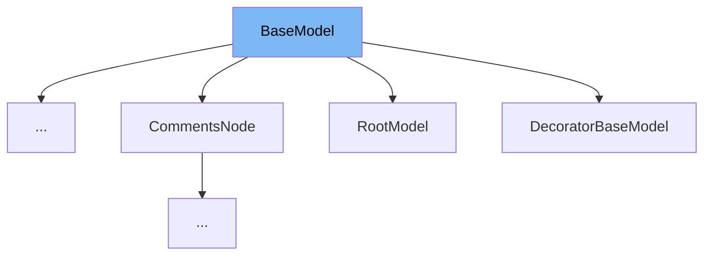

# Inheritance diagram

This diagram shows the inheritance tree of the class:



# Intro

This document will cover the <SwmToken path="pydantic/main.py" pos="208:14:14" line-data="    __pydantic_setattr_handlers__: ClassVar[Dict[str, Callable[[BaseModel, str, Any], None]]]  # noqa: UP006">`BaseModel`</SwmToken> class in Pydantic, focusing on:

1. What <SwmToken path="pydantic/main.py" pos="208:14:14" line-data="    __pydantic_setattr_handlers__: ClassVar[Dict[str, Callable[[BaseModel, str, Any], None]]]  # noqa: UP006">`BaseModel`</SwmToken> is and its purpose
2. All variables and functions defined in <SwmToken path="pydantic/main.py" pos="208:14:14" line-data="    __pydantic_setattr_handlers__: ClassVar[Dict[str, Callable[[BaseModel, str, Any], None]]]  # noqa: UP006">`BaseModel`</SwmToken>, with explanations and code citations for each.

# What is <SwmToken path="pydantic/main.py" pos="208:14:14" line-data="    __pydantic_setattr_handlers__: ClassVar[Dict[str, Callable[[BaseModel, str, Any], None]]]  # noqa: UP006">`BaseModel`</SwmToken>

<SwmToken path="pydantic/main.py" pos="208:14:14" line-data="    __pydantic_setattr_handlers__: ClassVar[Dict[str, Callable[[BaseModel, str, Any], None]]]  # noqa: UP006">`BaseModel`</SwmToken> is the foundational class in Pydantic for creating data models. It enables developers to define models using Python type hints, providing automatic data validation, parsing, and serialization. By inheriting from <SwmToken path="pydantic/main.py" pos="208:14:14" line-data="    __pydantic_setattr_handlers__: ClassVar[Dict[str, Callable[[BaseModel, str, Any], None]]]  # noqa: UP006">`BaseModel`</SwmToken>, users can easily define structured data, enforce type constraints, and leverage Pydantic's validation and serialization features. <SwmToken path="pydantic/main.py" pos="208:14:14" line-data="    __pydantic_setattr_handlers__: ClassVar[Dict[str, Callable[[BaseModel, str, Any], None]]]  # noqa: UP006">`BaseModel`</SwmToken> is not intended to be instantiated directly; instead, it serves as a superclass for <SwmToken path="pydantic/main.py" pos="106:14:16" line-data="        # is initialized, by wrapping the user-defined `model_post_init()`), e.g. if they mock">`user-defined`</SwmToken> models.

<SwmSnippet path="/pydantic/main.py" line="156">

---

The variable <SwmToken path="pydantic/main.py" pos="156:1:1" line-data="    model_config: ClassVar[ConfigDict] = ConfigDict()">`model_config`</SwmToken> holds the configuration for the model, which should conform to the <SwmToken path="pydantic/main.py" pos="156:6:6" line-data="    model_config: ClassVar[ConfigDict] = ConfigDict()">`ConfigDict`</SwmToken> specification.

```python
    model_config: ClassVar[ConfigDict] = ConfigDict()
    """
    Configuration for the model, should be a dictionary conforming to [`ConfigDict`][pydantic.config.ConfigDict].
    """
```

---

</SwmSnippet>

<SwmSnippet path="/pydantic/main.py" line="161">

---

The variable <SwmToken path="pydantic/main.py" pos="161:1:1" line-data="    __class_vars__: ClassVar[set[str]]">`__class_vars__`</SwmToken> contains the names of the class variables defined on the model.

```python
    __class_vars__: ClassVar[set[str]]
    """The names of the class variables defined on the model."""
```

---

</SwmSnippet>

<SwmSnippet path="/pydantic/main.py" line="164">

---

The variable <SwmToken path="pydantic/main.py" pos="164:1:1" line-data="    __private_attributes__: ClassVar[Dict[str, ModelPrivateAttr]]  # noqa: UP006">`__private_attributes__`</SwmToken> stores metadata about the private attributes of the model.

```python
    __private_attributes__: ClassVar[Dict[str, ModelPrivateAttr]]  # noqa: UP006
    """Metadata about the private attributes of the model."""
```

---

</SwmSnippet>

<SwmSnippet path="/pydantic/main.py" line="167">

---

The variable <SwmToken path="pydantic/main.py" pos="167:1:1" line-data="    __signature__: ClassVar[Signature]">`__signature__`</SwmToken> represents the synthesized <SwmToken path="pydantic/main.py" pos="168:9:9" line-data="    &quot;&quot;&quot;The synthesized `__init__` [`Signature`][inspect.Signature] of the model.&quot;&quot;&quot;">`__init__`</SwmToken> signature of the model.

```python
    __signature__: ClassVar[Signature]
    """The synthesized `__init__` [`Signature`][inspect.Signature] of the model."""
```

---

</SwmSnippet>

<SwmSnippet path="/pydantic/main.py" line="170">

---

The variable <SwmToken path="pydantic/main.py" pos="170:1:1" line-data="    __pydantic_complete__: ClassVar[bool] = False">`__pydantic_complete__`</SwmToken> indicates whether model building is completed or if there are still undefined fields.

```python
    __pydantic_complete__: ClassVar[bool] = False
    """Whether model building is completed, or if there are still undefined fields."""
```

---

</SwmSnippet>

<SwmSnippet path="/pydantic/main.py" line="173">

---

The variable <SwmToken path="pydantic/main.py" pos="173:1:1" line-data="    __pydantic_core_schema__: ClassVar[CoreSchema]">`__pydantic_core_schema__`</SwmToken> holds the core schema of the model, used for validation and serialization.

```python
    __pydantic_core_schema__: ClassVar[CoreSchema]
    """The core schema of the model."""
```

---

</SwmSnippet>

<SwmSnippet path="/pydantic/main.py" line="176">

---

The variable <SwmToken path="pydantic/main.py" pos="176:1:1" line-data="    __pydantic_custom_init__: ClassVar[bool]">`__pydantic_custom_init__`</SwmToken> indicates whether the model has a custom <SwmToken path="pydantic/main.py" pos="177:17:17" line-data="    &quot;&quot;&quot;Whether the model has a custom `__init__` method.&quot;&quot;&quot;">`__init__`</SwmToken> method.

```python
    __pydantic_custom_init__: ClassVar[bool]
    """Whether the model has a custom `__init__` method."""
```

---

</SwmSnippet>

<SwmSnippet path="/pydantic/main.py" line="180">

---

The variable <SwmToken path="pydantic/main.py" pos="180:1:1" line-data="    __pydantic_decorators__: ClassVar[_decorators.DecoratorInfos] = _decorators.DecoratorInfos()">`__pydantic_decorators__`</SwmToken> contains metadata about decorators defined on the model, replacing validators from Pydantic <SwmToken path="pydantic/main.py" pos="182:23:23" line-data="    This replaces `Model.__validators__` and `Model.__root_validators__` from Pydantic V1.&quot;&quot;&quot;">`V1`</SwmToken>.

```python
    __pydantic_decorators__: ClassVar[_decorators.DecoratorInfos] = _decorators.DecoratorInfos()
    """Metadata containing the decorators defined on the model.
    This replaces `Model.__validators__` and `Model.__root_validators__` from Pydantic V1."""
```

---

</SwmSnippet>

<SwmSnippet path="/pydantic/main.py" line="184">

---

The variable <SwmToken path="pydantic/main.py" pos="184:1:1" line-data="    __pydantic_generic_metadata__: ClassVar[_generics.PydanticGenericMetadata]">`__pydantic_generic_metadata__`</SwmToken> stores metadata for generic models, similar to typing generics.

```python
    __pydantic_generic_metadata__: ClassVar[_generics.PydanticGenericMetadata]
    """Metadata for generic models; contains data used for a similar purpose to
    __args__, __origin__, __parameters__ in typing-module generics. May eventually be replaced by these."""
```

---

</SwmSnippet>

<SwmSnippet path="/pydantic/main.py" line="188">

---

The variable <SwmToken path="pydantic/main.py" pos="188:1:1" line-data="    __pydantic_parent_namespace__: ClassVar[Dict[str, Any] | None] = None  # noqa: UP006">`__pydantic_parent_namespace__`</SwmToken> is used for automatic rebuilding of models, holding the parent namespace.

```python
    __pydantic_parent_namespace__: ClassVar[Dict[str, Any] | None] = None  # noqa: UP006
    """Parent namespace of the model, used for automatic rebuilding of models."""
```

---

</SwmSnippet>

<SwmSnippet path="/pydantic/main.py" line="191">

---

The variable <SwmToken path="pydantic/main.py" pos="191:1:1" line-data="    __pydantic_post_init__: ClassVar[None | Literal[&#39;model_post_init&#39;]]">`__pydantic_post_init__`</SwmToken> stores the name of the <SwmToken path="pydantic/main.py" pos="192:12:14" line-data="    &quot;&quot;&quot;The name of the post-init method for the model, if defined.&quot;&quot;&quot;">`post-init`</SwmToken> method for the model, if defined.

```python
    __pydantic_post_init__: ClassVar[None | Literal['model_post_init']]
    """The name of the post-init method for the model, if defined."""
```

---

</SwmSnippet>

<SwmSnippet path="/pydantic/main.py" line="194">

---

The variable <SwmToken path="pydantic/main.py" pos="194:1:1" line-data="    __pydantic_root_model__: ClassVar[bool] = False">`__pydantic_root_model__`</SwmToken> indicates whether the model is a <SwmToken path="pydantic/main.py" pos="195:16:16" line-data="    &quot;&quot;&quot;Whether the model is a [`RootModel`][pydantic.root_model.RootModel].&quot;&quot;&quot;">`RootModel`</SwmToken>.

```python
    __pydantic_root_model__: ClassVar[bool] = False
    """Whether the model is a [`RootModel`][pydantic.root_model.RootModel]."""
```

---

</SwmSnippet>

<SwmSnippet path="/pydantic/main.py" line="197">

---

The variable <SwmToken path="pydantic/main.py" pos="197:1:1" line-data="    __pydantic_serializer__: ClassVar[SchemaSerializer]">`__pydantic_serializer__`</SwmToken> is the serializer used to dump instances of the model.

```python
    __pydantic_serializer__: ClassVar[SchemaSerializer]
    """The `pydantic-core` `SchemaSerializer` used to dump instances of the model."""
```

---

</SwmSnippet>

<SwmSnippet path="/pydantic/main.py" line="200">

---

The variable <SwmToken path="pydantic/main.py" pos="200:1:1" line-data="    __pydantic_validator__: ClassVar[SchemaValidator | PluggableSchemaValidator]">`__pydantic_validator__`</SwmToken> is the validator used to validate instances of the model.

```python
    __pydantic_validator__: ClassVar[SchemaValidator | PluggableSchemaValidator]
    """The `pydantic-core` `SchemaValidator` used to validate instances of the model."""
```

---

</SwmSnippet>

<SwmSnippet path="/pydantic/main.py" line="203">

---

The variable <SwmToken path="pydantic/main.py" pos="203:1:1" line-data="    __pydantic_fields__: ClassVar[Dict[str, FieldInfo]]  # noqa: UP006">`__pydantic_fields__`</SwmToken> is a dictionary mapping field names to their corresponding <SwmToken path="pydantic/main.py" pos="203:11:11" line-data="    __pydantic_fields__: ClassVar[Dict[str, FieldInfo]]  # noqa: UP006">`FieldInfo`</SwmToken> objects.

```python
    __pydantic_fields__: ClassVar[Dict[str, FieldInfo]]  # noqa: UP006
    """A dictionary of field names and their corresponding [`FieldInfo`][pydantic.fields.FieldInfo] objects.
    This replaces `Model.__fields__` from Pydantic V1.
    """
```

---

</SwmSnippet>

<SwmSnippet path="/pydantic/main.py" line="208">

---

The variable <SwmToken path="pydantic/main.py" pos="208:1:1" line-data="    __pydantic_setattr_handlers__: ClassVar[Dict[str, Callable[[BaseModel, str, Any], None]]]  # noqa: UP006">`__pydantic_setattr_handlers__`</SwmToken> holds handlers for <SwmToken path="pydantic/main.py" pos="209:5:5" line-data="    &quot;&quot;&quot;`__setattr__` handlers. Memoizing the handlers leads to a dramatic performance improvement in `__setattr__`&quot;&quot;&quot;">`__setattr__`</SwmToken>, improving performance.

```python
    __pydantic_setattr_handlers__: ClassVar[Dict[str, Callable[[BaseModel, str, Any], None]]]  # noqa: UP006
    """`__setattr__` handlers. Memoizing the handlers leads to a dramatic performance improvement in `__setattr__`"""
```

---

</SwmSnippet>

<SwmSnippet path="/pydantic/main.py" line="211">

---

The variable <SwmToken path="pydantic/main.py" pos="211:1:1" line-data="    __pydantic_computed_fields__: ClassVar[Dict[str, ComputedFieldInfo]]  # noqa: UP006">`__pydantic_computed_fields__`</SwmToken> is a dictionary of computed field names and their corresponding <SwmToken path="pydantic/main.py" pos="211:11:11" line-data="    __pydantic_computed_fields__: ClassVar[Dict[str, ComputedFieldInfo]]  # noqa: UP006">`ComputedFieldInfo`</SwmToken> objects.

```python
    __pydantic_computed_fields__: ClassVar[Dict[str, ComputedFieldInfo]]  # noqa: UP006
    """A dictionary of computed field names and their corresponding [`ComputedFieldInfo`][pydantic.fields.ComputedFieldInfo] objects."""
```

---

</SwmSnippet>

<SwmSnippet path="/pydantic/main.py" line="214">

---

The variable <SwmToken path="pydantic/main.py" pos="214:1:1" line-data="    __pydantic_extra__: Dict[str, Any] | None = _model_construction.NoInitField(init=False)  # noqa: UP006">`__pydantic_extra__`</SwmToken> contains extra values if the model config allows extra fields.

```python
    __pydantic_extra__: Dict[str, Any] | None = _model_construction.NoInitField(init=False)  # noqa: UP006
    """A dictionary containing extra values, if [`extra`][pydantic.config.ConfigDict.extra] is set to `'allow'`."""
```

---

</SwmSnippet>

<SwmSnippet path="/pydantic/main.py" line="217">

---

The variable <SwmToken path="pydantic/main.py" pos="217:1:1" line-data="    __pydantic_fields_set__: set[str] = _model_construction.NoInitField(init=False)">`__pydantic_fields_set__`</SwmToken> tracks the names of fields explicitly set during instantiation.

```python
    __pydantic_fields_set__: set[str] = _model_construction.NoInitField(init=False)
    """The names of fields explicitly set during instantiation."""
```

---

</SwmSnippet>

<SwmSnippet path="/pydantic/main.py" line="220">

---

The variable <SwmToken path="pydantic/main.py" pos="220:1:1" line-data="    __pydantic_private__: Dict[str, Any] | None = _model_construction.NoInitField(init=False)  # noqa: UP006">`__pydantic_private__`</SwmToken> holds values of private attributes set on the model instance.

```python
    __pydantic_private__: Dict[str, Any] | None = _model_construction.NoInitField(init=False)  # noqa: UP006
    """Values of private attributes set on the model instance."""
```

---

</SwmSnippet>

<SwmSnippet path="/pydantic/main.py" line="243">

---

The function <SwmToken path="pydantic/main.py" pos="243:3:3" line-data="    def __init__(self, /, **data: Any) -&gt; None:">`__init__`</SwmToken> creates a new model by parsing and validating input data from keyword arguments.

```python
    def __init__(self, /, **data: Any) -> None:
        """Create a new model by parsing and validating input data from keyword arguments.

        Raises [`ValidationError`][pydantic_core.ValidationError] if the input data cannot be
        validated to form a valid model.

        `self` is explicitly positional-only to allow `self` as a field name.
        """
        # `__tracebackhide__` tells pytest and some other tools to omit this function from tracebacks
        __tracebackhide__ = True
        validated_self = self.__pydantic_validator__.validate_python(data, self_instance=self)
        if self is not validated_self:
            warnings.warn(
                'A custom validator is returning a value other than `self`.\n'
                "Returning anything other than `self` from a top level model validator isn't supported when validating via `__init__`.\n"
                'See the `model_validator` docs (https://docs.pydantic.dev/latest/concepts/validators/#model-validators) for more details.',
                stacklevel=2,
            )

    # The following line sets a flag that we use to determine when `__init__` gets overridden by the user
    __init__.__pydantic_base_init__ = True  # pyright: ignore[reportFunctionMemberAccess]

```

---

</SwmSnippet>

<SwmSnippet path="/pydantic/main.py" line="267">

---

The class method <SwmToken path="pydantic/main.py" pos="267:3:3" line-data="    def model_fields(cls) -&gt; dict[str, FieldInfo]:">`model_fields`</SwmToken> returns a mapping of field names to their <SwmToken path="pydantic/main.py" pos="267:15:15" line-data="    def model_fields(cls) -&gt; dict[str, FieldInfo]:">`FieldInfo`</SwmToken> instances. Accessing this from an instance is deprecated.

```python
    def model_fields(cls) -> dict[str, FieldInfo]:
        """A mapping of field names to their respective [`FieldInfo`][pydantic.fields.FieldInfo] instances.

        !!! warning
            Accessing this attribute from a model instance is deprecated, and will not work in Pydantic V3.
            Instead, you should access this attribute from the model class.
        """
        return getattr(cls, '__pydantic_fields__', {})

```

---

</SwmSnippet>

<SwmSnippet path="/pydantic/main.py" line="278">

---

The class method <SwmToken path="pydantic/main.py" pos="278:3:3" line-data="    def model_computed_fields(cls) -&gt; dict[str, ComputedFieldInfo]:">`model_computed_fields`</SwmToken> returns a mapping of computed field names to their <SwmToken path="pydantic/main.py" pos="278:15:15" line-data="    def model_computed_fields(cls) -&gt; dict[str, ComputedFieldInfo]:">`ComputedFieldInfo`</SwmToken> instances. Accessing this from an instance is deprecated.

```python
    def model_computed_fields(cls) -> dict[str, ComputedFieldInfo]:
        """A mapping of computed field names to their respective [`ComputedFieldInfo`][pydantic.fields.ComputedFieldInfo] instances.

        !!! warning
            Accessing this attribute from a model instance is deprecated, and will not work in Pydantic V3.
            Instead, you should access this attribute from the model class.
        """
        return getattr(cls, '__pydantic_computed_fields__', {})

```

---

</SwmSnippet>

<SwmSnippet path="/pydantic/main.py" line="288">

---

The property <SwmToken path="pydantic/main.py" pos="288:3:3" line-data="    def model_extra(self) -&gt; dict[str, Any] | None:">`model_extra`</SwmToken> returns extra fields set during validation, or None if extra fields are not allowed.

```python
    def model_extra(self) -> dict[str, Any] | None:
        """Get extra fields set during validation.

        Returns:
            A dictionary of extra fields, or `None` if `config.extra` is not set to `"allow"`.
        """
        return self.__pydantic_extra__

```

---

</SwmSnippet>

<SwmSnippet path="/pydantic/main.py" line="297">

---

The property <SwmToken path="pydantic/main.py" pos="297:3:3" line-data="    def model_fields_set(self) -&gt; set[str]:">`model_fields_set`</SwmToken> returns the set of fields that have been explicitly set on the model instance.

```python
    def model_fields_set(self) -> set[str]:
        """Returns the set of fields that have been explicitly set on this model instance.

        Returns:
            A set of strings representing the fields that have been set,
                i.e. that were not filled from defaults.
        """
        return self.__pydantic_fields_set__

```

---

</SwmSnippet>

<SwmSnippet path="/pydantic/main.py" line="307">

---

The class method <SwmToken path="pydantic/main.py" pos="307:3:3" line-data="    def model_construct(cls, _fields_set: set[str] | None = None, **values: Any) -&gt; Self:  # noqa: C901">`model_construct`</SwmToken> creates a new instance of the model with validated data, bypassing validation for trusted data.

```python
    def model_construct(cls, _fields_set: set[str] | None = None, **values: Any) -> Self:  # noqa: C901
        """Creates a new instance of the `Model` class with validated data.

        Creates a new model setting `__dict__` and `__pydantic_fields_set__` from trusted or pre-validated data.
        Default values are respected, but no other validation is performed.

        !!! note
            `model_construct()` generally respects the `model_config.extra` setting on the provided model.
            That is, if `model_config.extra == 'allow'`, then all extra passed values are added to the model instance's `__dict__`
            and `__pydantic_extra__` fields. If `model_config.extra == 'ignore'` (the default), then all extra passed values are ignored.
            Because no validation is performed with a call to `model_construct()`, having `model_config.extra == 'forbid'` does not result in
            an error if extra values are passed, but they will be ignored.

        Args:
            _fields_set: A set of field names that were originally explicitly set during instantiation. If provided,
                this is directly used for the [`model_fields_set`][pydantic.BaseModel.model_fields_set] attribute.
                Otherwise, the field names from the `values` argument will be used.
            values: Trusted or pre-validated data dictionary.

        Returns:
            A new instance of the `Model` class with validated data.
        """
        m = cls.__new__(cls)
        fields_values: dict[str, Any] = {}
        fields_set = set()

        for name, field in cls.__pydantic_fields__.items():
            if field.alias is not None and field.alias in values:
                fields_values[name] = values.pop(field.alias)
                fields_set.add(name)

            if (name not in fields_set) and (field.validation_alias is not None):
                validation_aliases: list[str | AliasPath] = (
                    field.validation_alias.choices
                    if isinstance(field.validation_alias, AliasChoices)
                    else [field.validation_alias]
                )

                for alias in validation_aliases:
                    if isinstance(alias, str) and alias in values:
                        fields_values[name] = values.pop(alias)
                        fields_set.add(name)
                        break
                    elif isinstance(alias, AliasPath):
                        value = alias.search_dict_for_path(values)
                        if value is not PydanticUndefined:
                            fields_values[name] = value
                            fields_set.add(name)
                            break

            if name not in fields_set:
                if name in values:
                    fields_values[name] = values.pop(name)
                    fields_set.add(name)
                elif not field.is_required():
                    fields_values[name] = field.get_default(call_default_factory=True, validated_data=fields_values)
        if _fields_set is None:
            _fields_set = fields_set

        _extra: dict[str, Any] | None = values if cls.model_config.get('extra') == 'allow' else None
        _object_setattr(m, '__dict__', fields_values)
        _object_setattr(m, '__pydantic_fields_set__', _fields_set)
        if not cls.__pydantic_root_model__:
            _object_setattr(m, '__pydantic_extra__', _extra)

        if cls.__pydantic_post_init__:
            m.model_post_init(None)
            # update private attributes with values set
            if hasattr(m, '__pydantic_private__') and m.__pydantic_private__ is not None:
                for k, v in values.items():
                    if k in m.__private_attributes__:
                        m.__pydantic_private__[k] = v

        elif not cls.__pydantic_root_model__:
            # Note: if there are any private attributes, cls.__pydantic_post_init__ would exist
            # Since it doesn't, that means that `__pydantic_private__` should be set to None
            _object_setattr(m, '__pydantic_private__', None)

        return m

```

---

</SwmSnippet>

<SwmSnippet path="/pydantic/main.py" line="387">

---

The function <SwmToken path="pydantic/main.py" pos="387:3:3" line-data="    def model_copy(self, *, update: Mapping[str, Any] | None = None, deep: bool = False) -&gt; Self:">`model_copy`</SwmToken> returns a copy of the model, optionally updating or deep copying the data.

```python
    def model_copy(self, *, update: Mapping[str, Any] | None = None, deep: bool = False) -> Self:
        """!!! abstract "Usage Documentation"
            [`model_copy`](../concepts/models.md#model-copy)

        Returns a copy of the model.

        !!! note
            The underlying instance's [`__dict__`][object.__dict__] attribute is copied. This
            might have unexpected side effects if you store anything in it, on top of the model
            fields (e.g. the value of [cached properties][functools.cached_property]).

        Args:
            update: Values to change/add in the new model. Note: the data is not validated
                before creating the new model. You should trust this data.
            deep: Set to `True` to make a deep copy of the model.

        Returns:
            New model instance.
        """
        copied = self.__deepcopy__() if deep else self.__copy__()
        if update:
            if self.model_config.get('extra') == 'allow':
                for k, v in update.items():
                    if k in self.__pydantic_fields__:
                        copied.__dict__[k] = v
                    else:
                        if copied.__pydantic_extra__ is None:
                            copied.__pydantic_extra__ = {}
                        copied.__pydantic_extra__[k] = v
            else:
                copied.__dict__.update(update)
            copied.__pydantic_fields_set__.update(update.keys())
        return copied

```

---

</SwmSnippet>

# Usage

## <SwmToken path="pydantic/main.py" pos="208:14:14" line-data="    __pydantic_setattr_handlers__: ClassVar[Dict[str, Callable[[BaseModel, str, Any], None]]]  # noqa: UP006">`BaseModel`</SwmToken> with Custom Serializers

<SwmToken path="pydantic/main.py" pos="208:14:14" line-data="    __pydantic_setattr_handlers__: ClassVar[Dict[str, Callable[[BaseModel, str, Any], None]]]  # noqa: UP006">`BaseModel`</SwmToken> is used to create data models that can incorporate custom serialization logic. For example, in one usage, a StudentModel inherits from <SwmToken path="pydantic/main.py" pos="208:14:14" line-data="    __pydantic_setattr_handlers__: ClassVar[Dict[str, Callable[[BaseModel, str, Any], None]]]  # noqa: UP006">`BaseModel`</SwmToken> and defines a field with a custom serializer that joins a list of courses into a string. This shows how <SwmToken path="pydantic/main.py" pos="208:14:14" line-data="    __pydantic_setattr_handlers__: ClassVar[Dict[str, Callable[[BaseModel, str, Any], None]]]  # noqa: UP006">`BaseModel`</SwmToken> supports advanced data transformation during serialization.

## <SwmToken path="pydantic/main.py" pos="208:14:14" line-data="    __pydantic_setattr_handlers__: ClassVar[Dict[str, Callable[[BaseModel, str, Any], None]]]  # noqa: UP006">`BaseModel`</SwmToken> for Date and Time Models

<SwmToken path="pydantic/main.py" pos="208:14:14" line-data="    __pydantic_setattr_handlers__: ClassVar[Dict[str, Callable[[BaseModel, str, Any], None]]]  # noqa: UP006">`BaseModel`</SwmToken> is also used to define models representing date and time data. An EventDatetime class inherits from <SwmToken path="pydantic/main.py" pos="208:14:14" line-data="    __pydantic_setattr_handlers__: ClassVar[Dict[str, Callable[[BaseModel, str, Any], None]]]  # noqa: UP006">`BaseModel`</SwmToken> and defines start and end datetime fields. Another model, EventModel, uses this EventDatetime model with additional serialization wrappers to convert datetime values to UTC, demonstrating <SwmToken path="pydantic/main.py" pos="208:14:14" line-data="    __pydantic_setattr_handlers__: ClassVar[Dict[str, Callable[[BaseModel, str, Any], None]]]  # noqa: UP006">`BaseModel`</SwmToken>'s flexibility in handling complex nested data types.

## <SwmToken path="pydantic/main.py" pos="208:14:14" line-data="    __pydantic_setattr_handlers__: ClassVar[Dict[str, Callable[[BaseModel, str, Any], None]]]  # noqa: UP006">`BaseModel`</SwmToken> with Field Definitions and Validation

<SwmToken path="pydantic/main.py" pos="208:14:14" line-data="    __pydantic_setattr_handlers__: ClassVar[Dict[str, Callable[[BaseModel, str, Any], None]]]  # noqa: UP006">`BaseModel`</SwmToken> is commonly used to define fields with type annotations and validation constraints. Examples include models where fields are annotated with types and constraints such as greater-than conditions or default values. This usage highlights <SwmToken path="pydantic/main.py" pos="208:14:14" line-data="    __pydantic_setattr_handlers__: ClassVar[Dict[str, Callable[[BaseModel, str, Any], None]]]  # noqa: UP006">`BaseModel`</SwmToken>'s role in enforcing data integrity and validation rules through Python type hints and Pydantic's Field functionality.

## <SwmToken path="pydantic/main.py" pos="208:14:14" line-data="    __pydantic_setattr_handlers__: ClassVar[Dict[str, Callable[[BaseModel, str, Any], None]]]  # noqa: UP006">`BaseModel`</SwmToken> for Network Data Validation

<SwmToken path="pydantic/main.py" pos="208:14:14" line-data="    __pydantic_setattr_handlers__: ClassVar[Dict[str, Callable[[BaseModel, str, Any], None]]]  # noqa: UP006">`BaseModel`</SwmToken> is used to validate network-related data such as URLs. Models inheriting from <SwmToken path="pydantic/main.py" pos="208:14:14" line-data="    __pydantic_setattr_handlers__: ClassVar[Dict[str, Callable[[BaseModel, str, Any], None]]]  # noqa: UP006">`BaseModel`</SwmToken> define fields typed as HttpUrl, which automatically validate that the input conforms to URL standards. This use case illustrates <SwmToken path="pydantic/main.py" pos="208:14:14" line-data="    __pydantic_setattr_handlers__: ClassVar[Dict[str, Callable[[BaseModel, str, Any], None]]]  # noqa: UP006">`BaseModel`</SwmToken>'s capability to integrate with specialized types for domain-specific validation.

## <SwmToken path="pydantic/main.py" pos="208:14:14" line-data="    __pydantic_setattr_handlers__: ClassVar[Dict[str, Callable[[BaseModel, str, Any], None]]]  # noqa: UP006">`BaseModel`</SwmToken> Configuration Examples

<SwmToken path="pydantic/main.py" pos="208:14:14" line-data="    __pydantic_setattr_handlers__: ClassVar[Dict[str, Callable[[BaseModel, str, Any], None]]]  # noqa: UP006">`BaseModel`</SwmToken> supports configuration through a <SwmToken path="pydantic/main.py" pos="156:1:1" line-data="    model_config: ClassVar[ConfigDict] = ConfigDict()">`model_config`</SwmToken> attribute, allowing control over behaviors such as handling extra fields in input data. Examples show configurations where extra data is ignored, forbidden (raising validation errors), or allowed and stored separately. This demonstrates how <SwmToken path="pydantic/main.py" pos="208:14:14" line-data="    __pydantic_setattr_handlers__: ClassVar[Dict[str, Callable[[BaseModel, str, Any], None]]]  # noqa: UP006">`BaseModel`</SwmToken> can be customized to fit different validation and data handling requirements.

&nbsp;

*This is an auto-generated document by Swimm 🌊 and has not yet been verified by a human*

<SwmMeta version="3.0.0" repo-id="Z2l0aHViJTNBJTNBcHlkYW50aWMlM0ElM0FTd2ltbS1EZW1v" repo-name="pydantic"><sup>Powered by [Swimm](/)</sup></SwmMeta>
