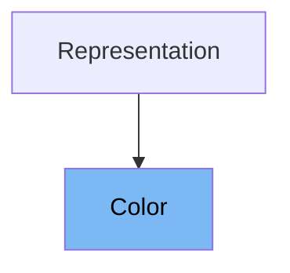

# Inheritance diagram

This diagram shows the inheritance tree of the class:



# What is Color

# Variables and functions

# What is Color

The Color class in <SwmPath>[pydantic/v1/color.py](pydantic/v1/color.py)</SwmPath> is a utility for representing and validating color values in various formats, such as named colors, hexadecimal strings, RGB/RGBA tuples, and HSL/HSLA. It is designed to follow the <SwmToken path="pydantic/v1/color.py" pos="2:12:12" line-data="Color definitions are  used as per CSS3 specification:">`CSS3`</SwmToken> color specification and is used to ensure that color data is parsed, stored, and serialized consistently within Pydantic models.

<SwmSnippet path="/pydantic/v1/color.py" line="64">

---

The variable <SwmToken path="pydantic/v1/color.py" pos="64:6:6" line-data="    __slots__ = &#39;_original&#39;, &#39;_rgba&#39;">`_original`</SwmToken> stores the original value passed to the Color instance, which can be a string or a tuple representing the color.

```python
    __slots__ = '_original', '_rgba'
```

---

</SwmSnippet>

<SwmSnippet path="/pydantic/v1/color.py" line="64">

---

The variable <SwmToken path="pydantic/v1/color.py" pos="64:11:11" line-data="    __slots__ = &#39;_original&#39;, &#39;_rgba&#39;">`_rgba`</SwmToken> holds the internal RGBA representation of the color, which is used for all color conversions and comparisons.

```python
    __slots__ = '_original', '_rgba'
```

---

</SwmSnippet>

<SwmSnippet path="/pydantic/v1/color.py" line="66">

---

The <SwmToken path="pydantic/v1/color.py" pos="66:3:3" line-data="    def __init__(self, value: ColorType) -&gt; None:">`__init__`</SwmToken> function initializes a Color instance from a string, tuple, or another Color object. It parses the input and stores both the original value and the RGBA representation.

```python
    def __init__(self, value: ColorType) -> None:
        self._rgba: RGBA
        self._original: ColorType
        if isinstance(value, (tuple, list)):
            self._rgba = parse_tuple(value)
        elif isinstance(value, str):
            self._rgba = parse_str(value)
        elif isinstance(value, Color):
            self._rgba = value._rgba
            value = value._original
        else:
            raise ColorError(reason='value must be a tuple, list or string')

        # if we've got here value must be a valid color
        self._original = value

```

---

</SwmSnippet>

<SwmSnippet path="/pydantic/v1/color.py" line="82">

---

The <SwmToken path="pydantic/v1/color.py" pos="83:3:3" line-data="    def __modify_schema__(cls, field_schema: Dict[str, Any]) -&gt; None:">`__modify_schema__`</SwmToken> class method updates the field schema to indicate that the type is a string with a color format, which is useful for OpenAPI and JSON Schema generation.

```python
    @classmethod
    def __modify_schema__(cls, field_schema: Dict[str, Any]) -> None:
        field_schema.update(type='string', format='color')

```

---

</SwmSnippet>

<SwmSnippet path="/pydantic/v1/color.py" line="86">

---

The <SwmToken path="pydantic/v1/color.py" pos="86:3:3" line-data="    def original(self) -&gt; ColorType:">`original`</SwmToken> method returns the original value that was passed to the Color instance.

```python
    def original(self) -> ColorType:
        """
        Original value passed to Color
        """
        return self._original

```

---

</SwmSnippet>

<SwmSnippet path="/pydantic/v1/color.py" line="92">

---

The <SwmToken path="pydantic/v1/color.py" pos="92:3:3" line-data="    def as_named(self, *, fallback: bool = False) -&gt; str:">`as_named`</SwmToken> method attempts to return the <SwmToken path="pydantic/v1/color.py" pos="2:12:12" line-data="Color definitions are  used as per CSS3 specification:">`CSS3`</SwmToken> name of the color if available. If the color does not have a named equivalent, it can fall back to a hexadecimal representation.

```python
    def as_named(self, *, fallback: bool = False) -> str:
        if self._rgba.alpha is None:
            rgb = cast(Tuple[int, int, int], self.as_rgb_tuple())
            try:
                return COLORS_BY_VALUE[rgb]
            except KeyError as e:
                if fallback:
                    return self.as_hex()
                else:
                    raise ValueError('no named color found, use fallback=True, as_hex() or as_rgb()') from e
        else:
            return self.as_hex()

```

---

</SwmSnippet>

<SwmSnippet path="/pydantic/v1/color.py" line="105">

---

The <SwmToken path="pydantic/v1/color.py" pos="105:3:3" line-data="    def as_hex(self) -&gt; str:">`as_hex`</SwmToken> method returns the color as a hexadecimal string, supporting both short and long forms, and includes the alpha channel if present.

```python
    def as_hex(self) -> str:
        """
        Hex string representing the color can be 3, 4, 6 or 8 characters depending on whether the string
        a "short" representation of the color is possible and whether there's an alpha channel.
        """
        values = [float_to_255(c) for c in self._rgba[:3]]
        if self._rgba.alpha is not None:
            values.append(float_to_255(self._rgba.alpha))

        as_hex = ''.join(f'{v:02x}' for v in values)
        if all(c in repeat_colors for c in values):
            as_hex = ''.join(as_hex[c] for c in range(0, len(as_hex), 2))
        return '#' + as_hex

```

---

</SwmSnippet>

<SwmSnippet path="/pydantic/v1/color.py" line="119">

---

The <SwmToken path="pydantic/v1/color.py" pos="119:3:3" line-data="    def as_rgb(self) -&gt; str:">`as_rgb`</SwmToken> method returns the color as a CSS-style rgb() or rgba() string, depending on whether the alpha channel is set.

```python
    def as_rgb(self) -> str:
        """
        Color as an rgb(<r>, <g>, <b>) or rgba(<r>, <g>, <b>, <a>) string.
        """
        if self._rgba.alpha is None:
            return f'rgb({float_to_255(self._rgba.r)}, {float_to_255(self._rgba.g)}, {float_to_255(self._rgba.b)})'
        else:
            return (
                f'rgba({float_to_255(self._rgba.r)}, {float_to_255(self._rgba.g)}, {float_to_255(self._rgba.b)}, '
                f'{round(self._alpha_float(), 2)})'
            )

```

---

</SwmSnippet>

<SwmSnippet path="/pydantic/v1/color.py" line="131">

---

The <SwmToken path="pydantic/v1/color.py" pos="131:3:3" line-data="    def as_rgb_tuple(self, *, alpha: Optional[bool] = None) -&gt; ColorTuple:">`as_rgb_tuple`</SwmToken> method returns the color as a tuple of integers (for RGB) or a tuple with an additional float (for RGBA), with options to include or exclude the alpha channel.

```python
    def as_rgb_tuple(self, *, alpha: Optional[bool] = None) -> ColorTuple:
        """
        Color as an RGB or RGBA tuple; red, green and blue are in the range 0 to 255, alpha if included is
        in the range 0 to 1.

        :param alpha: whether to include the alpha channel, options are
          None - (default) include alpha only if it's set (e.g. not None)
          True - always include alpha,
          False - always omit alpha,
        """
        r, g, b = (float_to_255(c) for c in self._rgba[:3])
        if alpha is None:
            if self._rgba.alpha is None:
                return r, g, b
            else:
                return r, g, b, self._alpha_float()
        elif alpha:
            return r, g, b, self._alpha_float()
        else:
            # alpha is False
            return r, g, b

```

---

</SwmSnippet>

<SwmSnippet path="/pydantic/v1/color.py" line="153">

---

The <SwmToken path="pydantic/v1/color.py" pos="153:3:3" line-data="    def as_hsl(self) -&gt; str:">`as_hsl`</SwmToken> method returns the color as a CSS-style hsl() or hsla() string, depending on the presence of the alpha channel.

```python
    def as_hsl(self) -> str:
        """
        Color as an hsl(<h>, <s>, <l>) or hsl(<h>, <s>, <l>, <a>) string.
        """
        if self._rgba.alpha is None:
            h, s, li = self.as_hsl_tuple(alpha=False)  # type: ignore
            return f'hsl({h * 360:0.0f}, {s:0.0%}, {li:0.0%})'
        else:
            h, s, li, a = self.as_hsl_tuple(alpha=True)  # type: ignore
            return f'hsl({h * 360:0.0f}, {s:0.0%}, {li:0.0%}, {round(a, 2)})'

```

---

</SwmSnippet>

<SwmSnippet path="/pydantic/v1/color.py" line="164">

---

The <SwmToken path="pydantic/v1/color.py" pos="164:3:3" line-data="    def as_hsl_tuple(self, *, alpha: Optional[bool] = None) -&gt; HslColorTuple:">`as_hsl_tuple`</SwmToken> method returns the color as a tuple representing HSL or HSLA values, with all elements in the range 0 to 1.

```python
    def as_hsl_tuple(self, *, alpha: Optional[bool] = None) -> HslColorTuple:
        """
        Color as an HSL or HSLA tuple, e.g. hue, saturation, lightness and optionally alpha; all elements are in
        the range 0 to 1.

        NOTE: this is HSL as used in HTML and most other places, not HLS as used in python's colorsys.

        :param alpha: whether to include the alpha channel, options are
          None - (default) include alpha only if it's set (e.g. not None)
          True - always include alpha,
          False - always omit alpha,
        """
        h, l, s = rgb_to_hls(self._rgba.r, self._rgba.g, self._rgba.b)
        if alpha is None:
            if self._rgba.alpha is None:
                return h, s, l
            else:
                return h, s, l, self._alpha_float()
        if alpha:
            return h, s, l, self._alpha_float()
        else:
            # alpha is False
            return h, s, l

```

---

</SwmSnippet>

<SwmSnippet path="/pydantic/v1/color.py" line="188">

---

The <SwmToken path="pydantic/v1/color.py" pos="188:3:3" line-data="    def _alpha_float(self) -&gt; float:">`_alpha_float`</SwmToken> method returns the alpha value as a float, defaulting to 1 if the alpha channel is not set.

```python
    def _alpha_float(self) -> float:
        return 1 if self._rgba.alpha is None else self._rgba.alpha

```

---

</SwmSnippet>

<SwmSnippet path="/pydantic/v1/color.py" line="191">

---

The <SwmToken path="pydantic/v1/color.py" pos="192:3:3" line-data="    def __get_validators__(cls) -&gt; &#39;CallableGenerator&#39;:">`__get_validators__`</SwmToken> class method yields the class itself as a validator, integrating with Pydantic's validation system.

```python
    @classmethod
    def __get_validators__(cls) -> 'CallableGenerator':
        yield cls

```

---

</SwmSnippet>

<SwmSnippet path="/pydantic/v1/color.py" line="195">

---

The <SwmToken path="pydantic/v1/color.py" pos="195:3:3" line-data="    def __str__(self) -&gt; str:">`__str__`</SwmToken> method returns a string representation of the color, preferring the named color if available, otherwise falling back to hexadecimal.

```python
    def __str__(self) -> str:
        return self.as_named(fallback=True)

```

---

</SwmSnippet>

<SwmSnippet path="/pydantic/v1/color.py" line="198">

---

The <SwmToken path="pydantic/v1/color.py" pos="198:3:3" line-data="    def __repr_args__(self) -&gt; &#39;ReprArgs&#39;:">`__repr_args__`</SwmToken> method provides arguments for the object's representation, including the named color and the RGB tuple.

```python
    def __repr_args__(self) -> 'ReprArgs':
        return [(None, self.as_named(fallback=True))] + [('rgb', self.as_rgb_tuple())]  # type: ignore

```

---

</SwmSnippet>

<SwmSnippet path="/pydantic/v1/color.py" line="201">

---

The <SwmToken path="pydantic/v1/color.py" pos="201:3:3" line-data="    def __eq__(self, other: Any) -&gt; bool:">`__eq__`</SwmToken> method defines equality for Color instances by comparing their RGB(A) tuple representations.

```python
    def __eq__(self, other: Any) -> bool:
        return isinstance(other, Color) and self.as_rgb_tuple() == other.as_rgb_tuple()

```

---

</SwmSnippet>

<SwmSnippet path="/pydantic/v1/color.py" line="204">

---

The <SwmToken path="pydantic/v1/color.py" pos="204:3:3" line-data="    def __hash__(self) -&gt; int:">`__hash__`</SwmToken> method computes a hash based on the RGB(A) tuple, allowing Color instances to be used in sets and as dictionary keys.

```python
    def __hash__(self) -> int:
        return hash(self.as_rgb_tuple())
```

---

</SwmSnippet>

# Usage

## Color Definitions

The Color class is defined according to the <SwmToken path="pydantic/v1/color.py" pos="2:12:12" line-data="Color definitions are  used as per CSS3 specification:">`CSS3`</SwmToken> color specification, supporting named colors and their variations. For example, it handles cases where multiple names refer to the same color, such as 'grey' and 'gray' or 'aqua' and 'cyan', with preference given to the name that comes last alphabetically.

## JSON Encoding

The Color class is integrated into the JSON encoding system, where instances of Color are converted to their string representation when encoding data to JSON format. This allows Color objects to be serialized seamlessly alongside other data types.

## Hypothesis Testing

In testing, the Color class is registered with Hypothesis, a property-based testing library, to generate test data. Strategies include sampling from predefined color names or tuples representing color values, enabling robust testing of components that use Color instances.

&nbsp;

*This is an auto-generated document by Swimm 🌊 and has not yet been verified by a human*

<SwmMeta version="3.0.0" repo-id="Z2l0aHViJTNBJTNBcHlkYW50aWMlM0ElM0FTd2ltbS1EZW1v" repo-name="pydantic"><sup>Powered by [Swimm](/)</sup></SwmMeta>
