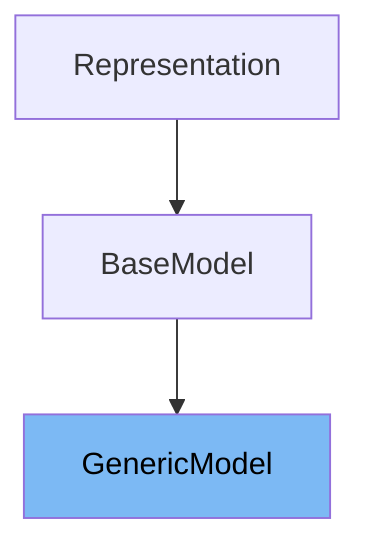

# Inheritance diagram

This diagram shows the inheritance tree of the class:



This document covers the <SwmToken path="pydantic/v1/generics.py" pos="101:7:7" line-data="        if cls is GenericModel and any(isinstance(param, TypeVar) for param in params):">`GenericModel`</SwmToken> class in detail, focusing on:

1. What <SwmToken path="pydantic/v1/generics.py" pos="101:7:7" line-data="        if cls is GenericModel and any(isinstance(param, TypeVar) for param in params):">`GenericModel`</SwmToken> is and its purpose
2. All variables and functions defined in <SwmToken path="pydantic/v1/generics.py" pos="101:7:7" line-data="        if cls is GenericModel and any(isinstance(param, TypeVar) for param in params):">`GenericModel`</SwmToken>, with code citations for each.

# What is <SwmToken path="pydantic/v1/generics.py" pos="101:7:7" line-data="        if cls is GenericModel and any(isinstance(param, TypeVar) for param in params):">`GenericModel`</SwmToken>

<SwmToken path="pydantic/v1/generics.py" pos="101:7:7" line-data="        if cls is GenericModel and any(isinstance(param, TypeVar) for param in params):">`GenericModel`</SwmToken> is a base class in Pydantic that enables the creation of generic data models using Python's type hints. It allows developers to define models that can be parameterized with different types, making it easier to reuse model structures for various data types. This is particularly useful for scenarios where the same model logic applies to different types of data, such as API responses or paginated results. <SwmToken path="pydantic/v1/generics.py" pos="101:7:7" line-data="        if cls is GenericModel and any(isinstance(param, TypeVar) for param in params):">`GenericModel`</SwmToken> supports both the new and old Python generic syntax, and can be used as a base for custom models that need to be type-parameterized.

<SwmSnippet path="/pydantic/v1/generics.py" line="65">

---

The variable <SwmToken path="pydantic/v1/generics.py" pos="65:1:1" line-data="    __slots__ = ()">`__slots__`</SwmToken> is defined as an empty tuple, which restricts the creation of instance attributes outside those explicitly defined, optimizing memory usage for <SwmToken path="pydantic/v1/generics.py" pos="101:7:7" line-data="        if cls is GenericModel and any(isinstance(param, TypeVar) for param in params):">`GenericModel`</SwmToken> instances.

```python
    __slots__ = ()
```

---

</SwmSnippet>

<SwmSnippet path="/pydantic/v1/generics.py" line="66">

---

The variable <SwmToken path="pydantic/v1/generics.py" pos="66:1:1" line-data="    __concrete__: ClassVar[bool] = False">`__concrete__`</SwmToken> is a class variable of type bool, initialized to False. It indicates whether a <SwmToken path="pydantic/v1/generics.py" pos="101:7:7" line-data="        if cls is GenericModel and any(isinstance(param, TypeVar) for param in params):">`GenericModel`</SwmToken> subclass is fully parameterized (concrete) or still generic.

```python
    __concrete__: ClassVar[bool] = False
```

---

</SwmSnippet>

<SwmSnippet path="/pydantic/v1/generics.py" line="72">

---

The variable <SwmToken path="pydantic/v1/generics.py" pos="72:1:1" line-data="        __parameters__: ClassVar[Tuple[TypeVarType, ...]]">`__parameters__`</SwmToken> is conditionally defined for type checking and holds the tuple of type variables used for parameterizing the generic model. This allows introspection of the type parameters for subclasses.

```python
        __parameters__: ClassVar[Tuple[TypeVarType, ...]]
```

---

</SwmSnippet>

<SwmSnippet path="/pydantic/v1/generics.py" line="75">

---

The function <SwmToken path="pydantic/v1/generics.py" pos="75:3:3" line-data="    def __class_getitem__(cls: Type[GenericModelT], params: Union[Type[Any], Tuple[Type[Any], ...]]) -&gt; Type[Any]:">`__class_getitem__`</SwmToken> is a class method that enables parameterization of <SwmToken path="pydantic/v1/generics.py" pos="101:7:7" line-data="        if cls is GenericModel and any(isinstance(param, TypeVar) for param in params):">`GenericModel`</SwmToken> subclasses. It takes type parameters and returns a new model class with those types applied, handling caching, validation, and dynamic creation of the new model class.

```python
    def __class_getitem__(cls: Type[GenericModelT], params: Union[Type[Any], Tuple[Type[Any], ...]]) -> Type[Any]:
        """Instantiates a new class from a generic class `cls` and type variables `params`.

        :param params: Tuple of types the class . Given a generic class
            `Model` with 2 type variables and a concrete model `Model[str, int]`,
            the value `(str, int)` would be passed to `params`.
        :return: New model class inheriting from `cls` with instantiated
            types described by `params`. If no parameters are given, `cls` is
            returned as is.

        """

        def _cache_key(_params: Any) -> CacheKey:
            args = get_args(_params)
            # python returns a list for Callables, which is not hashable
            if len(args) == 2 and isinstance(args[0], list):
                args = (tuple(args[0]), args[1])
            return cls, _params, args

        cached = _generic_types_cache.get(_cache_key(params))
        if cached is not None:
            return cached
        if cls.__concrete__ and Generic not in cls.__bases__:
            raise TypeError('Cannot parameterize a concrete instantiation of a generic model')
        if not isinstance(params, tuple):
            params = (params,)
        if cls is GenericModel and any(isinstance(param, TypeVar) for param in params):
            raise TypeError('Type parameters should be placed on typing.Generic, not GenericModel')
        if not hasattr(cls, '__parameters__'):
            raise TypeError(f'Type {cls.__name__} must inherit from typing.Generic before being parameterized')

        check_parameters_count(cls, params)
        # Build map from generic typevars to passed params
        typevars_map: Dict[TypeVarType, Type[Any]] = dict(zip(cls.__parameters__, params))
        if all_identical(typevars_map.keys(), typevars_map.values()) and typevars_map:
            return cls  # if arguments are equal to parameters it's the same object

        # Create new model with original model as parent inserting fields with DeferredType.
        model_name = cls.__concrete_name__(params)
        validators = gather_all_validators(cls)

        type_hints = get_all_type_hints(cls).items()
        instance_type_hints = {k: v for k, v in type_hints if get_origin(v) is not ClassVar}

        fields = {k: (DeferredType(), cls.__fields__[k].field_info) for k in instance_type_hints if k in cls.__fields__}

        model_module, called_globally = get_caller_frame_info()
        created_model = cast(
            Type[GenericModel],  # casting ensures mypy is aware of the __concrete__ and __parameters__ attributes
            create_model(
                model_name,
                __module__=model_module or cls.__module__,
                __base__=(cls,) + tuple(cls.__parameterized_bases__(typevars_map)),
                __config__=None,
                __validators__=validators,
                __cls_kwargs__=None,
                **fields,
            ),
        )

        _assigned_parameters[created_model] = typevars_map

        if called_globally:  # create global reference and therefore allow pickling
            object_by_reference = None
            reference_name = model_name
            reference_module_globals = sys.modules[created_model.__module__].__dict__
            while object_by_reference is not created_model:
                object_by_reference = reference_module_globals.setdefault(reference_name, created_model)
                reference_name += '_'

        created_model.Config = cls.Config

        # Find any typevars that are still present in the model.
        # If none are left, the model is fully "concrete", otherwise the new
        # class is a generic class as well taking the found typevars as
        # parameters.
        new_params = tuple(
            {param: None for param in iter_contained_typevars(typevars_map.values())}
        )  # use dict as ordered set
        created_model.__concrete__ = not new_params
        if new_params:
            created_model.__parameters__ = new_params

        # Save created model in cache so we don't end up creating duplicate
        # models that should be identical.
        _generic_types_cache[_cache_key(params)] = created_model
        if len(params) == 1:
            _generic_types_cache[_cache_key(params[0])] = created_model

        # Recursively walk class type hints and replace generic typevars
        # with concrete types that were passed.
        _prepare_model_fields(created_model, fields, instance_type_hints, typevars_map)

        return created_model
```

---

</SwmSnippet>

<SwmSnippet path="/pydantic/v1/generics.py" line="171">

---

The function <SwmToken path="pydantic/v1/generics.py" pos="171:3:3" line-data="    def __concrete_name__(cls: Type[Any], params: Tuple[Type[Any], ...]) -&gt; str:">`__concrete_name__`</SwmToken> is a class method that computes the name for a concrete subclass of <SwmToken path="pydantic/v1/generics.py" pos="101:7:7" line-data="        if cls is GenericModel and any(isinstance(param, TypeVar) for param in params):">`GenericModel`</SwmToken> based on its type parameters. This can be overridden to customize naming schemes for generated models.

```python
    def __concrete_name__(cls: Type[Any], params: Tuple[Type[Any], ...]) -> str:
        """Compute class name for child classes.

        :param params: Tuple of types the class . Given a generic class
            `Model` with 2 type variables and a concrete model `Model[str, int]`,
            the value `(str, int)` would be passed to `params`.
        :return: String representing a the new class where `params` are
            passed to `cls` as type variables.

        This method can be overridden to achieve a custom naming scheme for GenericModels.
        """
        param_names = [display_as_type(param) for param in params]
        params_component = ', '.join(param_names)
        return f'{cls.__name__}[{params_component}]'
```

---

</SwmSnippet>

<SwmSnippet path="/pydantic/v1/generics.py" line="187">

---

The function <SwmToken path="pydantic/v1/generics.py" pos="187:3:3" line-data="    def __parameterized_bases__(cls, typevars_map: Parametrization) -&gt; Iterator[Type[Any]]:">`__parameterized_bases__`</SwmToken> is a class method that returns an iterator of base classes parameterized with the provided type variable mapping. It is used internally to construct the correct inheritance hierarchy for parameterized generic models.

````python
    def __parameterized_bases__(cls, typevars_map: Parametrization) -> Iterator[Type[Any]]:
        """
        Returns unbound bases of cls parameterised to given type variables

        :param typevars_map: Dictionary of type applications for binding subclasses.
            Given a generic class `Model` with 2 type variables [S, T]
            and a concrete model `Model[str, int]`,
            the value `{S: str, T: int}` would be passed to `typevars_map`.
        :return: an iterator of generic sub classes, parameterised by `typevars_map`
            and other assigned parameters of `cls`

        e.g.:
        ```
        class A(GenericModel, Generic[T]):
            ...

        class B(A[V], Generic[V]):
            ...

        assert A[int] in B.__parameterized_bases__({V: int})
        ```
        """

        def build_base_model(
            base_model: Type[GenericModel], mapped_types: Parametrization
        ) -> Iterator[Type[GenericModel]]:
            base_parameters = tuple(mapped_types[param] for param in base_model.__parameters__)
            parameterized_base = base_model.__class_getitem__(base_parameters)
            if parameterized_base is base_model or parameterized_base is cls:
                # Avoid duplication in MRO
                return
            yield parameterized_base

        for base_model in cls.__bases__:
            if not issubclass(base_model, GenericModel):
                # not a class that can be meaningfully parameterized
                continue
            elif not getattr(base_model, '__parameters__', None):
                # base_model is "GenericModel"  (and has no __parameters__)
                # or
                # base_model is already concrete, and will be included transitively via cls.
                continue
            elif cls in _assigned_parameters:
                if base_model in _assigned_parameters:
                    # cls is partially parameterised but not from base_model
                    # e.g. cls = B[S], base_model = A[S]
                    # B[S][int] should subclass A[int],  (and will be transitively via B[int])
                    # but it's not viable to consistently subclass types with arbitrary construction
                    # So don't attempt to include A[S][int]
                    continue
                else:  # base_model not in _assigned_parameters:
                    # cls is partially parameterized, base_model is original generic
                    # e.g.  cls = B[str, T], base_model = B[S, T]
                    # Need to determine the mapping for the base_model parameters
                    mapped_types: Parametrization = {
                        key: typevars_map.get(value, value) for key, value in _assigned_parameters[cls].items()
                    }
                    yield from build_base_model(base_model, mapped_types)
            else:
                # cls is base generic, so base_class has a distinct base
                # can construct the Parameterised base model using typevars_map directly
                yield from build_base_model(base_model, typevars_map)
````

---

</SwmSnippet>

# Usage

## <SwmToken path="pydantic/v1/generics.py" pos="101:7:7" line-data="        if cls is GenericModel and any(isinstance(param, TypeVar) for param in params):">`GenericModel`</SwmToken>

<SwmToken path="pydantic/v1/generics.py" pos="101:7:7" line-data="        if cls is GenericModel and any(isinstance(param, TypeVar) for param in params):">`GenericModel`</SwmToken> is utilized to create data models that can be parameterized with types, enabling more flexible and reusable model definitions. It leverages Python's typing system to allow models to be generic over one or more type variables.

## Example Usage

An example usage of <SwmToken path="pydantic/v1/generics.py" pos="101:7:7" line-data="        if cls is GenericModel and any(isinstance(param, TypeVar) for param in params):">`GenericModel`</SwmToken> involves defining a model that accepts a type parameter, such as a container model that holds items of a generic type. This allows the model to be instantiated with different types while maintaining type safety and validation.

&nbsp;

*This is an auto-generated document by Swimm 🌊 and has not yet been verified by a human*

<SwmMeta version="3.0.0" repo-id="Z2l0aHViJTNBJTNBcHlkYW50aWMlM0ElM0FTd2ltbS1EZW1v" repo-name="pydantic"><sup>Powered by [Swimm](/)</sup></SwmMeta>
