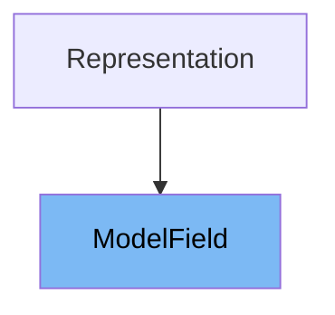

# Inheritance diagram

This diagram shows the inheritance tree of the class:



# What is <SwmToken path="pydantic/v1/fields.py" pos="425:10:10" line-data="        self.sub_fields: Optional[List[ModelField]] = None">`ModelField`</SwmToken>

# Variables and functions

This document covers:

1. What the <SwmToken path="pydantic/v1/fields.py" pos="425:10:10" line-data="        self.sub_fields: Optional[List[ModelField]] = None">`ModelField`</SwmToken> class is and its purpose in Pydantic.
2. All variables and functions defined in <SwmToken path="pydantic/v1/fields.py" pos="425:10:10" line-data="        self.sub_fields: Optional[List[ModelField]] = None">`ModelField`</SwmToken>, with code citations for each.

# What is <SwmToken path="pydantic/v1/fields.py" pos="425:10:10" line-data="        self.sub_fields: Optional[List[ModelField]] = None">`ModelField`</SwmToken>

<SwmToken path="pydantic/v1/fields.py" pos="425:10:10" line-data="        self.sub_fields: Optional[List[ModelField]] = None">`ModelField`</SwmToken> is a core class in Pydantic responsible for representing and managing individual fields within a data model. It encapsulates all metadata, validation logic, and configuration for a single field, including its type, default value, validators, and more. <SwmToken path="pydantic/v1/fields.py" pos="425:10:10" line-data="        self.sub_fields: Optional[List[ModelField]] = None">`ModelField`</SwmToken> is used internally by Pydantic to handle field parsing, validation, and schema generation, making it a foundational building block for model definition and data validation.

<SwmSnippet path="/pydantic/v1/fields.py" line="366">

---

The variable <SwmToken path="pydantic/v1/fields.py" pos="366:2:2" line-data="        &#39;type_&#39;,">`type_`</SwmToken> holds the processed type of the field, after handling generics and other type transformations.

```python
        'type_',
```

---

</SwmSnippet>

<SwmSnippet path="/pydantic/v1/fields.py" line="367">

---

The variable <SwmToken path="pydantic/v1/fields.py" pos="367:2:2" line-data="        &#39;outer_type_&#39;,">`outer_type_`</SwmToken> stores the original type annotation provided for the field, before any internal conversions.

```python
        'outer_type_',
```

---

</SwmSnippet>

<SwmSnippet path="/pydantic/v1/fields.py" line="368">

---

The variable <SwmToken path="pydantic/v1/fields.py" pos="368:2:2" line-data="        &#39;annotation&#39;,">`annotation`</SwmToken> keeps the raw type annotation as specified in the model.

```python
        'annotation',
```

---

</SwmSnippet>

<SwmSnippet path="/pydantic/v1/fields.py" line="369">

---

The variable <SwmToken path="pydantic/v1/fields.py" pos="369:2:2" line-data="        &#39;sub_fields&#39;,">`sub_fields`</SwmToken> is used to store a list of <SwmToken path="pydantic/v1/fields.py" pos="425:10:10" line-data="        self.sub_fields: Optional[List[ModelField]] = None">`ModelField`</SwmToken> instances for sub-types, such as for fields with Union or collection types.

```python
        'sub_fields',
```

---

</SwmSnippet>

<SwmSnippet path="/pydantic/v1/fields.py" line="370">

---

The variable <SwmToken path="pydantic/v1/fields.py" pos="370:2:2" line-data="        &#39;sub_fields_mapping&#39;,">`sub_fields_mapping`</SwmToken> is a mapping from discriminator values to <SwmToken path="pydantic/v1/fields.py" pos="425:10:10" line-data="        self.sub_fields: Optional[List[ModelField]] = None">`ModelField`</SwmToken> instances, used for discriminated unions.

```python
        'sub_fields_mapping',
```

---

</SwmSnippet>

<SwmSnippet path="/pydantic/v1/fields.py" line="371">

---

The variable <SwmToken path="pydantic/v1/fields.py" pos="371:2:2" line-data="        &#39;key_field&#39;,">`key_field`</SwmToken> holds a <SwmToken path="pydantic/v1/fields.py" pos="425:10:10" line-data="        self.sub_fields: Optional[List[ModelField]] = None">`ModelField`</SwmToken> instance representing the key type for mapping fields like dictionaries.

```python
        'key_field',
```

---

</SwmSnippet>

<SwmSnippet path="/pydantic/v1/fields.py" line="372">

---

The variable <SwmToken path="pydantic/v1/fields.py" pos="372:2:2" line-data="        &#39;validators&#39;,">`validators`</SwmToken> is a list of validator callables that are applied to the field's value during validation.

```python
        'validators',
```

---

</SwmSnippet>

<SwmSnippet path="/pydantic/v1/fields.py" line="373">

---

The variable <SwmToken path="pydantic/v1/fields.py" pos="373:2:2" line-data="        &#39;pre_validators&#39;,">`pre_validators`</SwmToken> stores validators that are run before the main validation logic.

```python
        'pre_validators',
```

---

</SwmSnippet>

<SwmSnippet path="/pydantic/v1/fields.py" line="374">

---

The variable <SwmToken path="pydantic/v1/fields.py" pos="374:2:2" line-data="        &#39;post_validators&#39;,">`post_validators`</SwmToken> stores validators that are run after the main validation logic.

```python
        'post_validators',
```

---

</SwmSnippet>

<SwmSnippet path="/pydantic/v1/fields.py" line="375">

---

The variable <SwmToken path="pydantic/v1/fields.py" pos="375:2:2" line-data="        &#39;default&#39;,">`default`</SwmToken> holds the default value for the field, if any.

```python
        'default',
```

---

</SwmSnippet>

<SwmSnippet path="/pydantic/v1/fields.py" line="376">

---

The variable <SwmToken path="pydantic/v1/fields.py" pos="376:2:2" line-data="        &#39;default_factory&#39;,">`default_factory`</SwmToken> is a callable that produces a default value for the field when needed.

```python
        'default_factory',
```

---

</SwmSnippet>

<SwmSnippet path="/pydantic/v1/fields.py" line="377">

---

The variable <SwmToken path="pydantic/v1/fields.py" pos="377:2:2" line-data="        &#39;required&#39;,">`required`</SwmToken> indicates whether the field is required or optional.

```python
        'required',
```

---

</SwmSnippet>

<SwmSnippet path="/pydantic/v1/fields.py" line="378">

---

The variable <SwmToken path="pydantic/v1/fields.py" pos="378:2:2" line-data="        &#39;final&#39;,">`final`</SwmToken> marks the field as final, meaning it cannot be overridden.

```python
        'final',
```

---

</SwmSnippet>

<SwmSnippet path="/pydantic/v1/fields.py" line="379">

---

The variable <SwmToken path="pydantic/v1/fields.py" pos="379:2:2" line-data="        &#39;model_config&#39;,">`model_config`</SwmToken> stores the configuration class used for the model containing this field.

```python
        'model_config',
```

---

</SwmSnippet>

<SwmSnippet path="/pydantic/v1/fields.py" line="380">

---

The variable <SwmToken path="pydantic/v1/fields.py" pos="380:2:2" line-data="        &#39;name&#39;,">`name`</SwmToken> is the field's name as defined in the model.

```python
        'name',
```

---

</SwmSnippet>

<SwmSnippet path="/pydantic/v1/fields.py" line="381">

---

The variable <SwmToken path="pydantic/v1/fields.py" pos="381:2:2" line-data="        &#39;alias&#39;,">`alias`</SwmToken> is an alternative name for the field, used for serialization/deserialization.

```python
        'alias',
```

---

</SwmSnippet>

<SwmSnippet path="/pydantic/v1/fields.py" line="382">

---

The variable <SwmToken path="pydantic/v1/fields.py" pos="382:2:2" line-data="        &#39;has_alias&#39;,">`has_alias`</SwmToken> is a boolean indicating if an alias is set for the field.

```python
        'has_alias',
```

---

</SwmSnippet>

<SwmSnippet path="/pydantic/v1/fields.py" line="383">

---

The variable <SwmToken path="pydantic/v1/fields.py" pos="383:2:2" line-data="        &#39;field_info&#39;,">`field_info`</SwmToken> holds a <SwmToken path="pydantic/v1/fields.py" pos="405:6:6" line-data="        field_info: Optional[FieldInfo] = None,">`FieldInfo`</SwmToken> instance with additional metadata and constraints for the field.

```python
        'field_info',
```

---

</SwmSnippet>

<SwmSnippet path="/pydantic/v1/fields.py" line="384">

---

The variable <SwmToken path="pydantic/v1/fields.py" pos="384:2:2" line-data="        &#39;discriminator_key&#39;,">`discriminator_key`</SwmToken> is used for discriminated unions to identify the key used for type selection.

```python
        'discriminator_key',
```

---

</SwmSnippet>

<SwmSnippet path="/pydantic/v1/fields.py" line="385">

---

The variable <SwmToken path="pydantic/v1/fields.py" pos="385:2:2" line-data="        &#39;discriminator_alias&#39;,">`discriminator_alias`</SwmToken> is an alias for the discriminator key, if any.

```python
        'discriminator_alias',
```

---

</SwmSnippet>

<SwmSnippet path="/pydantic/v1/fields.py" line="386">

---

The variable <SwmToken path="pydantic/v1/fields.py" pos="386:2:2" line-data="        &#39;validate_always&#39;,">`validate_always`</SwmToken> determines if validation should always be performed, regardless of value.

```python
        'validate_always',
```

---

</SwmSnippet>

<SwmSnippet path="/pydantic/v1/fields.py" line="387">

---

The variable <SwmToken path="pydantic/v1/fields.py" pos="387:2:2" line-data="        &#39;allow_none&#39;,">`allow_none`</SwmToken> specifies whether None is an allowed value for the field.

```python
        'allow_none',
```

---

</SwmSnippet>

<SwmSnippet path="/pydantic/v1/fields.py" line="388">

---

The variable <SwmToken path="pydantic/v1/fields.py" pos="388:2:2" line-data="        &#39;shape&#39;,">`shape`</SwmToken> encodes the field's shape (<SwmToken path="pydantic/v1/fields.py" pos="542:1:3" line-data="        e.g. calling it it multiple times may modify the field and configure it incorrectly.">`e.g`</SwmToken>., singleton, list, set, mapping) for internal processing.

```python
        'shape',
```

---

</SwmSnippet>

<SwmSnippet path="/pydantic/v1/fields.py" line="389">

---

The variable <SwmToken path="pydantic/v1/fields.py" pos="389:2:2" line-data="        &#39;class_validators&#39;,">`class_validators`</SwmToken> is a dictionary of validators defined at the class level for this field.

```python
        'class_validators',
```

---

</SwmSnippet>

<SwmSnippet path="/pydantic/v1/fields.py" line="390">

---

The variable <SwmToken path="pydantic/v1/fields.py" pos="390:2:2" line-data="        &#39;parse_json&#39;,">`parse_json`</SwmToken> indicates whether the field should be parsed from JSON.

```python
        'parse_json',
```

---

</SwmSnippet>

<SwmSnippet path="/pydantic/v1/fields.py" line="393">

---

The constructor <SwmToken path="pydantic/v1/fields.py" pos="393:3:3" line-data="    def __init__(">`__init__`</SwmToken> initializes all the field's metadata, type information, validators, and configuration. It also prepares the field for validation and schema generation.

```python
    def __init__(
        self,
        *,
        name: str,
        type_: Type[Any],
        class_validators: Optional[Dict[str, Validator]],
        model_config: Type['BaseConfig'],
        default: Any = None,
        default_factory: Optional[NoArgAnyCallable] = None,
        required: 'BoolUndefined' = Undefined,
        final: bool = False,
        alias: Optional[str] = None,
        field_info: Optional[FieldInfo] = None,
    ) -> None:
        self.name: str = name
        self.has_alias: bool = alias is not None
        self.alias: str = alias if alias is not None else name
        self.annotation = type_
        self.type_: Any = convert_generics(type_)
        self.outer_type_: Any = type_
        self.class_validators = class_validators or {}
        self.default: Any = default
        self.default_factory: Optional[NoArgAnyCallable] = default_factory
        self.required: 'BoolUndefined' = required
        self.final: bool = final
        self.model_config = model_config
        self.field_info: FieldInfo = field_info or FieldInfo(default)
        self.discriminator_key: Optional[str] = self.field_info.discriminator
        self.discriminator_alias: Optional[str] = self.discriminator_key

        self.allow_none: bool = False
        self.validate_always: bool = False
        self.sub_fields: Optional[List[ModelField]] = None
        self.sub_fields_mapping: Optional[Dict[str, 'ModelField']] = None  # used for discriminated union
        self.key_field: Optional[ModelField] = None
        self.validators: 'ValidatorsList' = []
        self.pre_validators: Optional['ValidatorsList'] = None
        self.post_validators: Optional['ValidatorsList'] = None
        self.parse_json: bool = False
        self.shape: int = SHAPE_SINGLETON
        self.model_config.prepare_field(self)
        self.prepare()

```

---

</SwmSnippet>

<SwmSnippet path="/pydantic/v1/fields.py" line="436">

---

The function <SwmToken path="pydantic/v1/fields.py" pos="436:3:3" line-data="    def get_default(self) -&gt; Any:">`get_default`</SwmToken> returns the default value for the field, using the default factory if provided.

```python
    def get_default(self) -> Any:
        return smart_deepcopy(self.default) if self.default_factory is None else self.default_factory()
```

---

</SwmSnippet>

# Usage

## <SwmToken path="pydantic/v1/fields.py" pos="425:10:10" line-data="        self.sub_fields: Optional[List[ModelField]] = None">`ModelField`</SwmToken> in JSON Schema Generation

<SwmToken path="pydantic/v1/fields.py" pos="425:10:10" line-data="        self.sub_fields: Optional[List[ModelField]] = None">`ModelField`</SwmToken> is used in the generation of JSON schemas, where it helps define the schema representation of model fields. Functions like model_field_schema utilize <SwmToken path="pydantic/v1/fields.py" pos="425:10:10" line-data="        self.sub_fields: Optional[List[ModelField]] = None">`ModelField`</SwmToken> instances to produce JSON schema values that correspond to the model's field definitions.

## <SwmToken path="pydantic/v1/fields.py" pos="425:10:10" line-data="        self.sub_fields: Optional[List[ModelField]] = None">`ModelField`</SwmToken> in Field Requirement Determination

<SwmToken path="pydantic/v1/fields.py" pos="425:10:10" line-data="        self.sub_fields: Optional[List[ModelField]] = None">`ModelField`</SwmToken> instances are used to determine whether a field should be marked as required in generated JSON schemas. This involves checking the field's characteristics to decide if it must be present in input data.

## <SwmToken path="pydantic/v1/fields.py" pos="425:10:10" line-data="        self.sub_fields: Optional[List[ModelField]] = None">`ModelField`</SwmToken> in Type Hint and Forward Reference Handling

<SwmToken path="pydantic/v1/fields.py" pos="425:10:10" line-data="        self.sub_fields: Optional[List[ModelField]] = None">`ModelField`</SwmToken> is involved in updating forward references and handling type hints. Functions like update_field_forward_refs and update_model_forward_refs use <SwmToken path="pydantic/v1/fields.py" pos="425:10:10" line-data="        self.sub_fields: Optional[List[ModelField]] = None">`ModelField`</SwmToken> to resolve and update type annotations that refer to types not yet defined at the time of model creation.

## <SwmToken path="pydantic/v1/fields.py" pos="425:10:10" line-data="        self.sub_fields: Optional[List[ModelField]] = None">`ModelField`</SwmToken> in Validation Logic

<SwmToken path="pydantic/v1/fields.py" pos="425:10:10" line-data="        self.sub_fields: Optional[List[ModelField]] = None">`ModelField`</SwmToken> is passed to various validator functions to provide context about the field being validated. Validators use <SwmToken path="pydantic/v1/fields.py" pos="425:10:10" line-data="        self.sub_fields: Optional[List[ModelField]] = None">`ModelField`</SwmToken> to access field-specific constraints and configuration, enabling precise validation such as checking numerical limits, constants, or string formats.

## <SwmToken path="pydantic/v1/fields.py" pos="425:10:10" line-data="        self.sub_fields: Optional[List[ModelField]] = None">`ModelField`</SwmToken> in Model Creation and Configuration

During model creation, <SwmToken path="pydantic/v1/fields.py" pos="425:10:10" line-data="        self.sub_fields: Optional[List[ModelField]] = None">`ModelField`</SwmToken> instances are inferred and prepared to represent each field's metadata and validation rules. The ModelMetaclass and related functions use <SwmToken path="pydantic/v1/fields.py" pos="425:10:10" line-data="        self.sub_fields: Optional[List[ModelField]] = None">`ModelField`</SwmToken> to build the model's internal representation of fields, including handling private attributes and field annotations.

## <SwmToken path="pydantic/v1/fields.py" pos="425:10:10" line-data="        self.sub_fields: Optional[List[ModelField]] = None">`ModelField`</SwmToken> in Custom Root Type Validation

<SwmToken path="pydantic/v1/fields.py" pos="425:10:10" line-data="        self.sub_fields: Optional[List[ModelField]] = None">`ModelField`</SwmToken> is used in validating custom root types, ensuring that models with a single root field adhere to expected constraints and do not mix with other fields.

&nbsp;

*This is an auto-generated document by Swimm 🌊 and has not yet been verified by a human*

<SwmMeta version="3.0.0" repo-id="Z2l0aHViJTNBJTNBcHlkYW50aWMlM0ElM0FTd2ltbS1EZW1v" repo-name="pydantic"><sup>Powered by [Swimm](/)</sup></SwmMeta>
