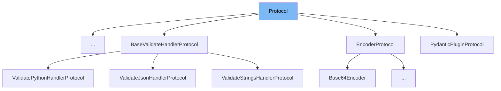

# Inheritance diagram

This diagram shows the inheritance tree of the class:



This document will cover the class Protocol in <SwmPath>[pydantic/deprecated/parse.py](pydantic/deprecated/parse.py)</SwmPath>. We will explain:

1. What Protocol is and its purpose.
2. The variables defined in Protocol and their roles.

# What is Protocol

Protocol in <SwmPath>[pydantic/deprecated/parse.py](pydantic/deprecated/parse.py)</SwmPath> is an enumeration class that inherits from both str and Enum. It is used to define and represent serialization protocols supported by the deprecated parsing utilities in the module. Specifically, it distinguishes between JSON and pickle serialization formats, allowing functions to handle data loading accordingly.

<SwmSnippet path="/pydantic/deprecated/parse.py" line="20">

---

The variable <SwmToken path="pydantic/deprecated/parse.py" pos="21:1:1" line-data="    json = &#39;json&#39;">`json`</SwmToken> in the Protocol class represents the JSON serialization protocol. It is a string enumeration member with the value 'json'.

```python
class Protocol(str, Enum):
    json = 'json'
    pickle = 'pickle'
```

---

</SwmSnippet>

<SwmSnippet path="/pydantic/deprecated/parse.py" line="20">

---

The variable <SwmToken path="pydantic/deprecated/parse.py" pos="22:1:1" line-data="    pickle = &#39;pickle&#39;">`pickle`</SwmToken> in the Protocol class represents the pickle serialization protocol. It is a string enumeration member with the value 'pickle'.

```python
class Protocol(str, Enum):
    json = 'json'
    pickle = 'pickle'
```

---

</SwmSnippet>

# Usage

## Protocol in Class Validators

Protocol is used to define callable method signatures for class validators. These Protocol classes specify the expected method signatures for validator functions, such as those that accept a class and a value, or a class, a value, and additional keyword arguments. This usage helps enforce consistent validator interfaces during type checking.

## Protocol in Data Parsing

Protocol is also used as a parameter in data parsing functions to specify the protocol for parsing input data. For example, it can indicate whether the data should be parsed as JSON or pickle format. The code uses Protocol to select the appropriate parsing method based on the content type or explicit protocol argument, enabling flexible and type-safe data deserialization.

&nbsp;

*This is an auto-generated document by Swimm 🌊 and has not yet been verified by a human*

<SwmMeta version="3.0.0" repo-id="Z2l0aHViJTNBJTNBcHlkYW50aWMlM0ElM0FTd2ltbS1EZW1v" repo-name="pydantic"><sup>Powered by [Swimm](/)</sup></SwmMeta>
