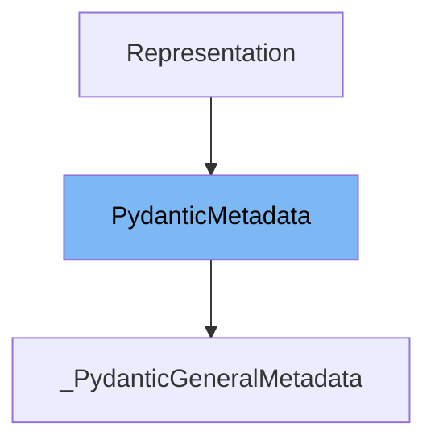

# Inheritance diagram

This diagram shows the inheritance tree of the class:



# What is <SwmToken path="pydantic/_internal/_fields.py" pos="39:2:2" line-data="class PydanticMetadata(Representation):">`PydanticMetadata`</SwmToken>

This document covers the class <SwmToken path="pydantic/_internal/_fields.py" pos="39:2:2" line-data="class PydanticMetadata(Representation):">`PydanticMetadata`</SwmToken> as implemented in <SwmPath>[pydantic/\_internal/\_fields.py](pydantic/_internal/_fields.py)</SwmPath>. We will address:

1. What <SwmToken path="pydantic/_internal/_fields.py" pos="39:2:2" line-data="class PydanticMetadata(Representation):">`PydanticMetadata`</SwmToken> is and its purpose
2. All variables and functions defined in <SwmToken path="pydantic/_internal/_fields.py" pos="39:2:2" line-data="class PydanticMetadata(Representation):">`PydanticMetadata`</SwmToken>

# What is <SwmToken path="pydantic/_internal/_fields.py" pos="39:2:2" line-data="class PydanticMetadata(Representation):">`PydanticMetadata`</SwmToken>

<SwmToken path="pydantic/_internal/_fields.py" pos="39:2:2" line-data="class PydanticMetadata(Representation):">`PydanticMetadata`</SwmToken> is a base class used for annotation markers within Pydantic, such as <SwmToken path="pydantic/_internal/_fields.py" pos="40:17:17" line-data="    &quot;&quot;&quot;Base class for annotation markers like `Strict`.&quot;&quot;&quot;">`Strict`</SwmToken>. It provides a foundation for creating custom metadata classes that can be attached to fields or used as markers in type annotations. By inheriting from <SwmToken path="pydantic/_internal/_fields.py" pos="39:2:2" line-data="class PydanticMetadata(Representation):">`PydanticMetadata`</SwmToken>, other classes can signal special behaviors or constraints for fields in Pydantic models.

<SwmSnippet path="/pydantic/_internal/_fields.py" line="39">

---

The class <SwmToken path="pydantic/_internal/_fields.py" pos="39:2:2" line-data="class PydanticMetadata(Representation):">`PydanticMetadata`</SwmToken> is defined as a subclass of <SwmToken path="pydantic/_internal/_fields.py" pos="39:4:4" line-data="class PydanticMetadata(Representation):">`Representation`</SwmToken>, which likely provides a standard way to represent metadata objects in Pydantic.

```python
class PydanticMetadata(Representation):
```

---

</SwmSnippet>

<SwmSnippet path="/pydantic/_internal/_fields.py" line="42">

---

The <SwmToken path="pydantic/_internal/_fields.py" pos="42:1:1" line-data="    __slots__ = ()">`__slots__`</SwmToken> variable is set to an empty tuple, which prevents the creation of a <SwmToken path="pydantic/_internal/_fields.py" pos="66:3:3" line-data="            self.__dict__ = metadata">`__dict__`</SwmToken> for instances of <SwmToken path="pydantic/_internal/_fields.py" pos="39:2:2" line-data="class PydanticMetadata(Representation):">`PydanticMetadata`</SwmToken>. This is a memory optimization that restricts dynamic attribute assignment.

```python
    __slots__ = ()
```

---

</SwmSnippet>

# Usage

## Usage in Field Metadata Aggregation

<SwmToken path="pydantic/_internal/_fields.py" pos="39:2:2" line-data="class PydanticMetadata(Representation):">`PydanticMetadata`</SwmToken> is part of the combined metadata list returned when gathering metadata for fields. It is used alongside other metadata types to provide comprehensive information about field annotations and validation rules.

## Usage in Strict Mode Annotation

The Strict class inherits from <SwmToken path="pydantic/_internal/_fields.py" pos="39:2:2" line-data="class PydanticMetadata(Representation):">`PydanticMetadata`</SwmToken> and <SwmToken path="pydantic/_internal/_fields.py" pos="31:7:7" line-data="    from annotated_types import BaseMetadata">`BaseMetadata`</SwmToken> to define a strict mode annotation. This annotation can be applied using Python's Annotated type hinting to enforce strict validation rules on fields.

## Usage in AllowInfNan Annotation

AllowInfNan is another class inheriting from <SwmToken path="pydantic/_internal/_fields.py" pos="39:2:2" line-data="class PydanticMetadata(Representation):">`PydanticMetadata`</SwmToken>, used as a field metadata annotation to indicate that special floating-point values like -inf, inf, and nan are allowed for that field. This is applied via the Annotated type hint.

## Usage in FailFast Annotation

The FailFast class extends <SwmToken path="pydantic/_internal/_fields.py" pos="39:2:2" line-data="class PydanticMetadata(Representation):">`PydanticMetadata`</SwmToken> and <SwmToken path="pydantic/_internal/_fields.py" pos="31:7:7" line-data="    from annotated_types import BaseMetadata">`BaseMetadata`</SwmToken> to provide an annotation that instructs validation to stop at the first encountered error. This is useful for scenarios where only a simple valid/invalid check is needed without collecting all errors.

## Usage in General Metadata Handling

A subclass named <SwmToken path="pydantic/_internal/_fields.py" pos="46:11:11" line-data="    &quot;&quot;&quot;Create a new `_PydanticGeneralMetadata` class with the given metadata.">`_PydanticGeneralMetadata`</SwmToken> inherits from <SwmToken path="pydantic/_internal/_fields.py" pos="39:2:2" line-data="class PydanticMetadata(Representation):">`PydanticMetadata`</SwmToken> and <SwmToken path="pydantic/_internal/_fields.py" pos="31:7:7" line-data="    from annotated_types import BaseMetadata">`BaseMetadata`</SwmToken> to represent general metadata such as <SwmToken path="pydantic/_internal/_fields.py" pos="63:13:13" line-data="        &quot;&quot;&quot;Pydantic general metadata like `max_digits`.&quot;&quot;&quot;">`max_digits`</SwmToken>. This class is initialized with arbitrary metadata and helps manage common validation constraints.

&nbsp;

*This is an auto-generated document by Swimm 🌊 and has not yet been verified by a human*

<SwmMeta version="3.0.0" repo-id="Z2l0aHViJTNBJTNBcHlkYW50aWMlM0ElM0FTd2ltbS1EZW1v" repo-name="pydantic"><sup>Powered by [Swimm](/)</sup></SwmMeta>
