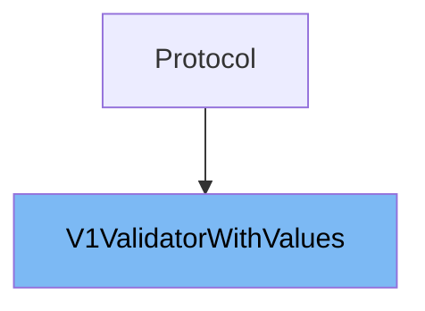

# Inheritance diagram

This diagram shows the inheritance tree of the class:



This document will cover the class <SwmToken path="pydantic/_internal/_decorators_v1.py" pos="21:2:2" line-data="class V1ValidatorWithValues(Protocol):">`V1ValidatorWithValues`</SwmToken>. We will cover:

1. What is <SwmToken path="pydantic/_internal/_decorators_v1.py" pos="21:2:2" line-data="class V1ValidatorWithValues(Protocol):">`V1ValidatorWithValues`</SwmToken>
2. Variables and functions of <SwmToken path="pydantic/_internal/_decorators_v1.py" pos="21:2:2" line-data="class V1ValidatorWithValues(Protocol):">`V1ValidatorWithValues`</SwmToken>

# What is <SwmToken path="pydantic/_internal/_decorators_v1.py" pos="21:2:2" line-data="class V1ValidatorWithValues(Protocol):">`V1ValidatorWithValues`</SwmToken>

<SwmToken path="pydantic/_internal/_decorators_v1.py" pos="21:2:2" line-data="class V1ValidatorWithValues(Protocol):">`V1ValidatorWithValues`</SwmToken> is a protocol class defined in <SwmPath>[pydantic/\_internal/\_decorators_v1.py](pydantic/_internal/_decorators_v1.py)</SwmPath> that represents a validator function signature used in Pydantic version 1 style validators. It is designed to support validators that accept a value and a dictionary of previously validated values (named 'values'). This protocol is supported for both Pydantic <SwmToken path="pydantic/_internal/_decorators_v1.py" pos="22:21:21" line-data="    &quot;&quot;&quot;A validator with `values` argument, supported for V1 validators and V2 validators.&quot;&quot;&quot;">`V1`</SwmToken> and <SwmToken path="pydantic/_internal/_decorators_v1.py" pos="22:27:27" line-data="    &quot;&quot;&quot;A validator with `values` argument, supported for V1 validators and V2 validators.&quot;&quot;&quot;">`V2`</SwmToken> validators, enabling compatibility across versions. Essentially, it defines the expected callable interface for validators that need access to other field values during validation.

<SwmSnippet path="/pydantic/_internal/_decorators_v1.py" line="21">

---

The class <SwmToken path="pydantic/_internal/_decorators_v1.py" pos="21:2:2" line-data="class V1ValidatorWithValues(Protocol):">`V1ValidatorWithValues`</SwmToken> defines a single function **call**, which is the callable interface for the validator. This function takes two parameters: \__value, which is the value to be validated, and values, which is a dictionary containing other field values that have already been validated. The function returns any type, representing the validated or transformed value.

```python
class V1ValidatorWithValues(Protocol):
    """A validator with `values` argument, supported for V1 validators and V2 validators."""

    def __call__(self, __value: Any, values: dict[str, Any]) -> Any: ...
```

---

</SwmSnippet>

# Usage

## Usage in <SwmPath>[pydantic/\_internal/\_decorators_v1.py](pydantic/_internal/_decorators_v1.py)</SwmPath>

<SwmToken path="pydantic/_internal/_decorators_v1.py" pos="21:2:2" line-data="class V1ValidatorWithValues(Protocol):">`V1ValidatorWithValues`</SwmToken> is included as one of the types in a union called <SwmToken path="pydantic/_internal/_decorators_v1.py" pos="45:0:0" line-data="V1Validator = Union[">`V1Validator`</SwmToken>, which groups several validator types that differ in how they accept values and keyword arguments. This union is used to type hint validators that may require access to other field values during validation.

## Usage in validation wrapper function

Within a conditional block that checks if a validator needs access to values and keyword arguments, <SwmToken path="pydantic/_internal/_decorators_v1.py" pos="21:2:2" line-data="class V1ValidatorWithValues(Protocol):">`V1ValidatorWithValues`</SwmToken> is cast to the validator type. A wrapper function is then defined which calls this validator, passing the current value and the entire data dictionary as the 'values' argument. This pattern shows how <SwmToken path="pydantic/_internal/_decorators_v1.py" pos="21:2:2" line-data="class V1ValidatorWithValues(Protocol):">`V1ValidatorWithValues`</SwmToken> is used to create validators that can access other fields' values during validation.

## Usage in deprecated <SwmPath>[pydantic/class_validators.py](pydantic/class_validators.py)</SwmPath>

<SwmToken path="pydantic/_internal/_decorators_v1.py" pos="21:2:2" line-data="class V1ValidatorWithValues(Protocol):">`V1ValidatorWithValues`</SwmToken> is imported and referenced alongside other validator variants in a deprecated module related to class validators. This suggests that it is part of legacy or transitional validation mechanisms that still support validators requiring access to values.

&nbsp;

*This is an auto-generated document by Swimm 🌊 and has not yet been verified by a human*

<SwmMeta version="3.0.0" repo-id="Z2l0aHViJTNBJTNBcHlkYW50aWMlM0ElM0FTd2ltbS1EZW1v" repo-name="pydantic"><sup>Powered by [Swimm](/)</sup></SwmMeta>
