# Inheritance diagram

This diagram shows the inheritance tree of the class:

```mermaid
graph TD;
 Representation --> ValueItems
 ValueItems:::currentBaseStyle

 classDef currentBaseStyle color:#000000,fill:#7CB9F4

%% Swimm:
%% graph TD;
%%  Representation --> <SwmToken path="pydantic/v1/utils.py" pos="75:2:2" line-data="    &#39;ValueItems&#39;,">`ValueItems`</SwmToken>
%%  <SwmToken path="pydantic/v1/utils.py" pos="75:2:2" line-data="    &#39;ValueItems&#39;,">`ValueItems`</SwmToken>:::currentBaseStyle
%% 
%%  classDef currentBaseStyle color:#000000,fill:#7CB9F4
```



This document will cover the <SwmToken path="pydantic/v1/utils.py" pos="75:2:2" line-data="    &#39;ValueItems&#39;,">`ValueItems`</SwmToken> class in detail, including:

1. What <SwmToken path="pydantic/v1/utils.py" pos="75:2:2" line-data="    &#39;ValueItems&#39;,">`ValueItems`</SwmToken> is and its purpose
2. All variables and functions defined in <SwmToken path="pydantic/v1/utils.py" pos="75:2:2" line-data="    &#39;ValueItems&#39;,">`ValueItems`</SwmToken>, with code citations for each.

# What is <SwmToken path="pydantic/v1/utils.py" pos="75:2:2" line-data="    &#39;ValueItems&#39;,">`ValueItems`</SwmToken>

<SwmToken path="pydantic/v1/utils.py" pos="75:2:2" line-data="    &#39;ValueItems&#39;,">`ValueItems`</SwmToken> is a utility class designed to simplify the calculation of which fields or items should be included or excluded when processing values, such as during model serialization or copying. It provides a convenient interface for handling complex inclusion and exclusion logic, especially when dealing with nested data structures or sequences. <SwmToken path="pydantic/v1/utils.py" pos="75:2:2" line-data="    &#39;ValueItems&#39;,">`ValueItems`</SwmToken> is used internally in Pydantic to manage include/exclude logic for fields and elements in models and collections.

<SwmSnippet path="/pydantic/v1/utils.py" line="488">

---

The variable <SwmToken path="pydantic/v1/utils.py" pos="488:1:1" line-data="    __slots__ = (&#39;_items&#39;, &#39;_type&#39;)">`__slots__`</SwmToken> is defined to restrict the attributes of <SwmToken path="pydantic/v1/utils.py" pos="75:2:2" line-data="    &#39;ValueItems&#39;,">`ValueItems`</SwmToken> instances to <SwmToken path="pydantic/v1/utils.py" pos="488:7:7" line-data="    __slots__ = (&#39;_items&#39;, &#39;_type&#39;)">`_items`</SwmToken> and <SwmToken path="pydantic/v1/utils.py" pos="488:12:12" line-data="    __slots__ = (&#39;_items&#39;, &#39;_type&#39;)">`_type`</SwmToken>, optimizing memory usage and attribute access.

```python
    __slots__ = ('_items', '_type')
```

---

</SwmSnippet>

<SwmSnippet path="/pydantic/v1/utils.py" line="490">

---

The constructor function <SwmToken path="pydantic/v1/utils.py" pos="490:3:3" line-data="    def __init__(self, value: Any, items: Union[&#39;AbstractSetIntStr&#39;, &#39;MappingIntStrAny&#39;]) -&gt; None:">`__init__`</SwmToken> initializes a <SwmToken path="pydantic/v1/utils.py" pos="75:2:2" line-data="    &#39;ValueItems&#39;,">`ValueItems`</SwmToken> instance by coercing the input items into a mapping, and if the value is a list or tuple, it normalizes the indexes to handle sequence-based inclusion/exclusion. The processed items are stored in the <SwmToken path="pydantic/v1/utils.py" pos="496:3:3" line-data="        self._items: &#39;MappingIntStrAny&#39; = items">`_items`</SwmToken> attribute.

```python
    def __init__(self, value: Any, items: Union['AbstractSetIntStr', 'MappingIntStrAny']) -> None:
        items = self._coerce_items(items)

        if isinstance(value, (list, tuple)):
            items = self._normalize_indexes(items, len(value))

        self._items: 'MappingIntStrAny' = items
```

---

</SwmSnippet>

<SwmSnippet path="/pydantic/v1/utils.py" line="498">

---

The function <SwmToken path="pydantic/v1/utils.py" pos="498:3:3" line-data="    def is_excluded(self, item: Any) -&gt; bool:">`is_excluded`</SwmToken> checks if a given item (by key or index) is fully excluded according to the internal mapping. It returns True if the item is marked as excluded.

```python
    def is_excluded(self, item: Any) -> bool:
        """
        Check if item is fully excluded.

        :param item: key or index of a value
        """
        return self.is_true(self._items.get(item))

```

---

</SwmSnippet>

<SwmSnippet path="/pydantic/v1/utils.py" line="506">

---

The function <SwmToken path="pydantic/v1/utils.py" pos="506:3:3" line-data="    def is_included(self, item: Any) -&gt; bool:">`is_included`</SwmToken> checks if a given item (by key or index) is present in the internal mapping, indicating that it should be included.

```python
    def is_included(self, item: Any) -> bool:
        """
        Check if value is contained in self._items

        :param item: key or index of value
        """
        return item in self._items

```

---

</SwmSnippet>

<SwmSnippet path="/pydantic/v1/utils.py" line="514">

---

The function <SwmToken path="pydantic/v1/utils.py" pos="514:3:3" line-data="    def for_element(self, e: &#39;IntStr&#39;) -&gt; Optional[Union[&#39;AbstractSetIntStr&#39;, &#39;MappingIntStrAny&#39;]]:">`for_element`</SwmToken> retrieves the raw inclusion or exclusion value for a specific element, returning None if the element is fully included or excluded.

```python
    def for_element(self, e: 'IntStr') -> Optional[Union['AbstractSetIntStr', 'MappingIntStrAny']]:
        """
        :param e: key or index of element on value
        :return: raw values for element if self._items is dict and contain needed element
        """

        item = self._items.get(e)
        return item if not self.is_true(item) else None

```

---

</SwmSnippet>

<SwmSnippet path="/pydantic/v1/utils.py" line="523">

---

The function <SwmToken path="pydantic/v1/utils.py" pos="523:3:3" line-data="    def _normalize_indexes(self, items: &#39;MappingIntStrAny&#39;, v_length: int) -&gt; &#39;DictIntStrAny&#39;:">`_normalize_indexes`</SwmToken> processes the items mapping for sequences, converting negative indexes and handling the special '**all**' key to apply inclusion/exclusion rules across all elements. It returns a normalized mapping suitable for sequence processing.

```python
    def _normalize_indexes(self, items: 'MappingIntStrAny', v_length: int) -> 'DictIntStrAny':
        """
        :param items: dict or set of indexes which will be normalized
        :param v_length: length of sequence indexes of which will be

        >>> self._normalize_indexes({0: True, -2: True, -1: True}, 4)
        {0: True, 2: True, 3: True}
        >>> self._normalize_indexes({'__all__': True}, 4)
        {0: True, 1: True, 2: True, 3: True}
        """

        normalized_items: 'DictIntStrAny' = {}
        all_items = None
        for i, v in items.items():
            if not (isinstance(v, Mapping) or isinstance(v, AbstractSet) or self.is_true(v)):
                raise TypeError(f'Unexpected type of exclude value for index "{i}" {v.__class__}')
            if i == '__all__':
                all_items = self._coerce_value(v)
                continue
            if not isinstance(i, int):
                raise TypeError(
                    'Excluding fields from a sequence of sub-models or dicts must be performed index-wise: '
                    'expected integer keys or keyword "__all__"'
                )
            normalized_i = v_length + i if i < 0 else i
            normalized_items[normalized_i] = self.merge(v, normalized_items.get(normalized_i))

        if not all_items:
            return normalized_items
        if self.is_true(all_items):
            for i in range(v_length):
                normalized_items.setdefault(i, ...)
            return normalized_items
        for i in range(v_length):
            normalized_item = normalized_items.setdefault(i, {})
            if not self.is_true(normalized_item):
                normalized_items[i] = self.merge(all_items, normalized_item)
        return normalized_items

```

---

</SwmSnippet>

<SwmSnippet path="/pydantic/v1/utils.py" line="563">

---

The class method <SwmToken path="pydantic/v1/utils.py" pos="563:3:3" line-data="    def merge(cls, base: Any, override: Any, intersect: bool = False) -&gt; Any:">`merge`</SwmToken> combines two inclusion/exclusion mappings, supporting both union and intersection strategies. It recursively merges nested mappings and handles sets by converting them to dictionaries.

```python
    def merge(cls, base: Any, override: Any, intersect: bool = False) -> Any:
        """
        Merge a ``base`` item with an ``override`` item.

        Both ``base`` and ``override`` are converted to dictionaries if possible.
        Sets are converted to dictionaries with the sets entries as keys and
        Ellipsis as values.

        Each key-value pair existing in ``base`` is merged with ``override``,
        while the rest of the key-value pairs are updated recursively with this function.

        Merging takes place based on the "union" of keys if ``intersect`` is
        set to ``False`` (default) and on the intersection of keys if
        ``intersect`` is set to ``True``.
        """
        override = cls._coerce_value(override)
        base = cls._coerce_value(base)
        if override is None:
            return base
        if cls.is_true(base) or base is None:
            return override
        if cls.is_true(override):
            return base if intersect else override

        # intersection or union of keys while preserving ordering:
        if intersect:
            merge_keys = [k for k in base if k in override] + [k for k in override if k in base]
        else:
            merge_keys = list(base) + [k for k in override if k not in base]

        merged: 'DictIntStrAny' = {}
        for k in merge_keys:
            merged_item = cls.merge(base.get(k), override.get(k), intersect=intersect)
            if merged_item is not None:
                merged[k] = merged_item

        return merged

```

---

</SwmSnippet>

<SwmSnippet path="/pydantic/v1/utils.py" line="602">

---

The static method <SwmToken path="pydantic/v1/utils.py" pos="602:3:3" line-data="    def _coerce_items(items: Union[&#39;AbstractSetIntStr&#39;, &#39;MappingIntStrAny&#39;]) -&gt; &#39;MappingIntStrAny&#39;:">`_coerce_items`</SwmToken> ensures that the input items are converted to a mapping, handling both sets and mappings, and raising an error for unsupported types.

```python
    def _coerce_items(items: Union['AbstractSetIntStr', 'MappingIntStrAny']) -> 'MappingIntStrAny':
        if isinstance(items, Mapping):
            pass
        elif isinstance(items, AbstractSet):
            items = dict.fromkeys(items, ...)
        else:
            class_name = getattr(items, '__class__', '???')
            assert_never(
                items,
                f'Unexpected type of exclude value {class_name}',
            )
        return items

```

---

</SwmSnippet>

<SwmSnippet path="/pydantic/v1/utils.py" line="615">

---

The class method <SwmToken path="pydantic/v1/utils.py" pos="616:3:3" line-data="    def _coerce_value(cls, value: Any) -&gt; Any:">`_coerce_value`</SwmToken> returns the value as-is if it is None or considered 'true' (i.e., True or Ellipsis), otherwise it coerces the value into a mapping using <SwmToken path="pydantic/v1/utils.py" pos="619:5:5" line-data="        return cls._coerce_items(value)">`_coerce_items`</SwmToken>.

```python
    @classmethod
    def _coerce_value(cls, value: Any) -> Any:
        if value is None or cls.is_true(value):
            return value
        return cls._coerce_items(value)

```

---

</SwmSnippet>

<SwmSnippet path="/pydantic/v1/utils.py" line="621">

---

The static method <SwmToken path="pydantic/v1/utils.py" pos="622:3:3" line-data="    def is_true(v: Any) -&gt; bool:">`is_true`</SwmToken> determines if a value is considered 'true' for inclusion/exclusion logic, specifically if it is True or Ellipsis.

```python
    @staticmethod
    def is_true(v: Any) -> bool:
        return v is True or v is ...
```

---

</SwmSnippet>

<SwmSnippet path="/pydantic/v1/utils.py" line="625">

---

The function <SwmToken path="pydantic/v1/utils.py" pos="625:3:3" line-data="    def __repr_args__(self) -&gt; &#39;ReprArgs&#39;:">`__repr_args__`</SwmToken> customizes the representation of <SwmToken path="pydantic/v1/utils.py" pos="75:2:2" line-data="    &#39;ValueItems&#39;,">`ValueItems`</SwmToken> instances by returning the internal items mapping for display.

```python
    def __repr_args__(self) -> 'ReprArgs':
        return [(None, self._items)]
```

---

</SwmSnippet>

# Usage

## <SwmToken path="pydantic/v1/utils.py" pos="75:2:2" line-data="    &#39;ValueItems&#39;,">`ValueItems`</SwmToken> in <SwmPath>[pydantic/deprecated/copy_internals.py](pydantic/deprecated/copy_internals.py)</SwmPath>

<SwmToken path="pydantic/v1/utils.py" pos="75:2:2" line-data="    &#39;ValueItems&#39;,">`ValueItems`</SwmToken> is used to merge exclude and include sets when copying model internals. It helps combine explicit exclude parameters with field-specific excludes, optimizing performance by guarding against unnecessary operations. It is also instantiated to represent include and exclude sets for filtering dictionary items or model attributes during copy operations.

## <SwmToken path="pydantic/v1/utils.py" pos="75:2:2" line-data="    &#39;ValueItems&#39;,">`ValueItems`</SwmToken> in <SwmPath>[pydantic/fields.py](pydantic/fields.py)</SwmPath>

In <SwmPath>[pydantic/fields.py](pydantic/fields.py)</SwmPath>, <SwmToken path="pydantic/v1/utils.py" pos="75:2:2" line-data="    &#39;ValueItems&#39;,">`ValueItems`</SwmToken> is imported and used to merge include and exclude sets when updating field constraints or field info. This allows dynamic adjustment of which fields should be included or excluded based on configuration or validation logic.

## <SwmToken path="pydantic/v1/utils.py" pos="75:2:2" line-data="    &#39;ValueItems&#39;,">`ValueItems`</SwmToken> in <SwmPath>[docs/plugins/main.py](docs/plugins/main.py)</SwmPath>

Within <SwmPath>[docs/plugins/main.py](docs/plugins/main.py)</SwmPath>, <SwmToken path="pydantic/v1/utils.py" pos="75:2:2" line-data="    &#39;ValueItems&#39;,">`ValueItems`</SwmToken> is used to merge include and exclude sets for model fields, especially when calculating allowed keys for serialization or copying. It is also instantiated to represent include and exclude filters for nested objects or dictionaries, facilitating selective copying or serialization of model data.

&nbsp;

*This is an auto-generated document by Swimm 🌊 and has not yet been verified by a human*

<SwmMeta version="3.0.0" repo-id="Z2l0aHViJTNBJTNBcHlkYW50aWMlM0ElM0FTd2ltbS1EZW1v" repo-name="pydantic"><sup>Powered by [Swimm](/)</sup></SwmMeta>
