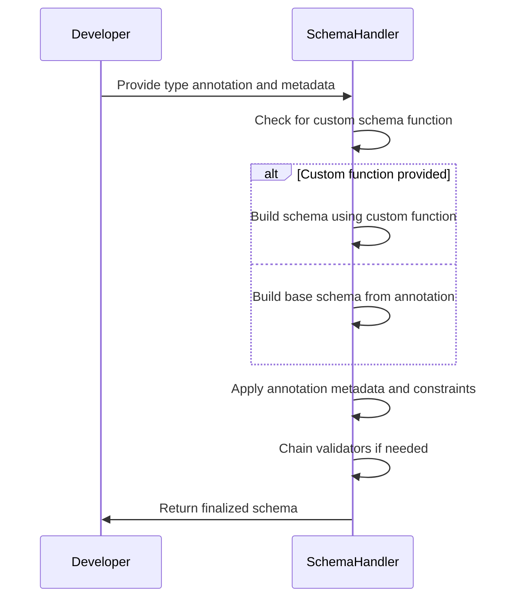
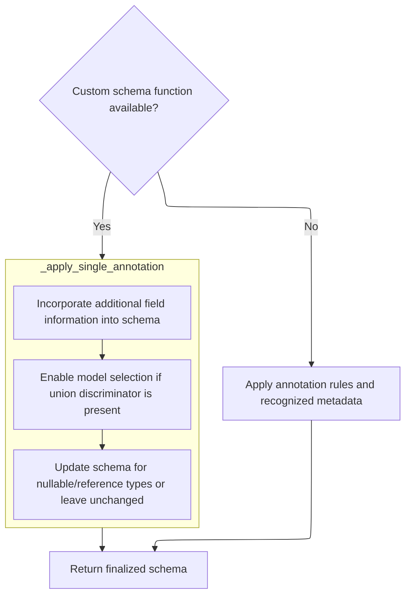
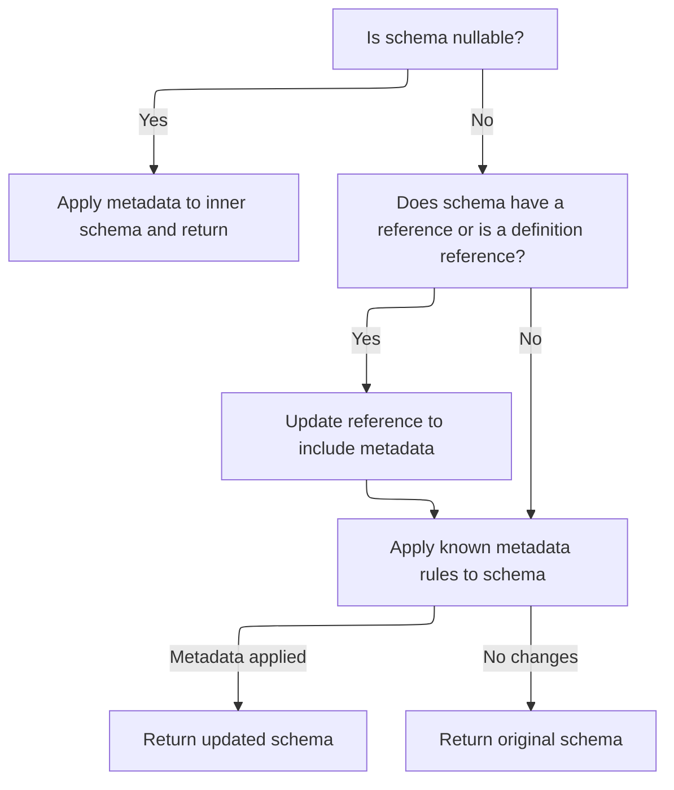

This document outlines how a Python type annotation and its metadata are transformed into a comprehensive schema for data validation and serialization. The process ensures that all developer-provided constraints, metadata, and custom logic are integrated, supporting features such as nested metadata and union discriminators.

The main steps are:

- Check for and use a custom schema function if provided
- Build a base schema from the annotation if not
- Apply all annotation-based metadata and constraints, including nested and union-specific logic
- Chain any necessary validators
- Finalize and return the schema, attaching custom JSON schema functions if present



# Spec

## Detailed View of the Program's Functionality

a. Entry Point: Handling Annotations and Custom Schema Functions

When a new annotation is encountered, the code checks if the annotation provides a custom schema function. If such a function exists, it is called to build the schema. If not, the code applies a series of rules and recognized metadata to generate the schema. This is orchestrated by a handler function that either delegates to the custom function or proceeds with the default annotation-based logic.

b. Applying Annotation Metadata

If no custom schema function is present, the code applies annotation metadata using a dedicated function. This function first checks if the annotation is a special field information object. If so, it warns about any unsupported attributes, then recursively applies all nested metadata annotations. If a discriminator is present (used for union types), it is applied to the schema to enable model selection based on a field value.

c. Handling Nested Metadata and Discriminators

For each piece of nested metadata, the annotation application function is called recursively, allowing all metadata to be layered onto the schema. After all nested metadata is processed, if a discriminator is specified, it is applied to the schema, enabling advanced union type handling.

d. Final Annotation Application Logic

After handling discriminators, the code checks for special schema types:

- If the schema is nullable, the annotation is applied to the inner schema, and the result is wrapped back into the nullable schema.
- If the schema is a reference or a definition reference, a new unique reference is created for the annotated version, ensuring that each annotated schema is distinct.
- Finally, the code attempts to apply any recognized metadata constraints (such as minimum/maximum values, patterns, etc.) using a centralized function. If any constraints are applied, the updated schema is returned; otherwise, the original schema is returned.

e. Applying and Chaining Metadata Constraints

When recognized metadata constraints are found, the code processes each constraint:

- If the constraint can be set directly on the schema (<SwmToken path="pydantic/_internal/_generate_schema.py" pos="184:38:40" line-data="&quot;&quot;&quot;`FieldInfo` attributes (and their default value) that can&#39;t be used outside of a model (e.g. in a type adapter or a PEP 695 type alias).&quot;&quot;&quot;">`e.g`</SwmToken>., a minimum value for an integer), it is set.
- If the constraint requires validation logic (such as a pattern or a predicate), a validator function is wrapped around the schema.
- For constraints that require chaining (such as multiple string transformations), each step is added to a chain, and the chain is applied in sequence.
- If multiple constraints are applied, the schema steps are chained together so that all checks are performed in order.

f. Chaining and JSON Schema Generation

When a chain of schema steps is created, the code ensures that the correct step is used depending on whether validation or serialization is being performed. For validation, the first step is used; for serialization, the last step is used. The appropriate step is then passed to the JSON schema generator to produce the final JSON schema.

g. Finalizing Schema Handler Output

After all annotation logic is applied, the code checks if the annotation provides a custom JSON schema function. If so, this function is stored for later use during JSON schema generation. The finalized schema is then returned, ready for use in validation or serialization.

# Rule Definition

| Paragraph Name                                                                                                                                                                                                                                                                                                                                                                                                                                                                                                                                                                                                                                                                                                                                                                                                                                                                                               | Rule ID | Category          | Description                                                                                                                                                                                                                                                                                                                                                                                                                                                     | Conditions                                                                                                                                                                                                                                                                                                                                                                                                                                                                                                                                                                                                                                                                                    | Remarks                                                                                                                                                                                                                                                                                                                                                                                                                                                                                                                                                                                                                                                                                                                                                                                                                                                                                                                                                                                                                                                                                                                                                                                                                                                                                                                                                                                                                                                                                                                                                                                                                                                                                                                                                                                                                                                                                                                                                                                                                                                                                                                                                                                                                                                                                                                                                                                                                                                                                                                                                                                                                                                                                                                                                                                                                                                                                                                                                                                                                                                                                                                                                                                                                          |
| ------------------------------------------------------------------------------------------------------------------------------------------------------------------------------------------------------------------------------------------------------------------------------------------------------------------------------------------------------------------------------------------------------------------------------------------------------------------------------------------------------------------------------------------------------------------------------------------------------------------------------------------------------------------------------------------------------------------------------------------------------------------------------------------------------------------------------------------------------------------------------------------------------------ | ------- | ----------------- | --------------------------------------------------------------------------------------------------------------------------------------------------------------------------------------------------------------------------------------------------------------------------------------------------------------------------------------------------------------------------------------------------------------------------------------------------------------- | --------------------------------------------------------------------------------------------------------------------------------------------------------------------------------------------------------------------------------------------------------------------------------------------------------------------------------------------------------------------------------------------------------------------------------------------------------------------------------------------------------------------------------------------------------------------------------------------------------------------------------------------------------------------------------------------- | -------------------------------------------------------------------------------------------------------------------------------------------------------------------------------------------------------------------------------------------------------------------------------------------------------------------------------------------------------------------------------------------------------------------------------------------------------------------------------------------------------------------------------------------------------------------------------------------------------------------------------------------------------------------------------------------------------------------------------------------------------------------------------------------------------------------------------------------------------------------------------------------------------------------------------------------------------------------------------------------------------------------------------------------------------------------------------------------------------------------------------------------------------------------------------------------------------------------------------------------------------------------------------------------------------------------------------------------------------------------------------------------------------------------------------------------------------------------------------------------------------------------------------------------------------------------------------------------------------------------------------------------------------------------------------------------------------------------------------------------------------------------------------------------------------------------------------------------------------------------------------------------------------------------------------------------------------------------------------------------------------------------------------------------------------------------------------------------------------------------------------------------------------------------------------------------------------------------------------------------------------------------------------------------------------------------------------------------------------------------------------------------------------------------------------------------------------------------------------------------------------------------------------------------------------------------------------------------------------------------------------------------------------------------------------------------------------------------------------------------------------------------------------------------------------------------------------------------------------------------------------------------------------------------------------------------------------------------------------------------------------------------------------------------------------------------------------------------------------------------------------------------------------------------------------------------------------------------------------- |
| The system must accept a source type and a list of annotations (constraints and metadata) and produce a schema dictionary describing the validation and serialization logic for that type., For each recognized constraint annotation, the system must map the constraint to the corresponding schema key and value, and add it to the schema dictionary.                                                                                                                                                                                                                                                                                                                                                                                                                                                                                                                                                    | RL-001  | Data Assignment   | If an annotation is a recognized constraint (<SwmToken path="pydantic/_internal/_generate_schema.py" pos="184:38:40" line-data="&quot;&quot;&quot;`FieldInfo` attributes (and their default value) that can&#39;t be used outside of a model (e.g. in a type adapter or a PEP 695 type alias).&quot;&quot;&quot;">`e.g`</SwmToken>., Gt, Le, Pattern, etc.), map it to the corresponding schema key and value and add it to the schema dictionary for the type. | The annotation is a recognized constraint class as listed in the spec.                                                                                                                                                                                                                                                                                                                                                                                                                                                                                                                                                                                                                        | Recognized constraints and their mappings: Gt(value) → 'gt': value, Ge(value) → 'ge': value, Lt(value) → 'lt': value, Le(value) → 'le': value, <SwmToken path="pydantic/_internal/_known_annotated_metadata.py" pos="162:3:3" line-data="        at.MultipleOf: &#39;multiple_of&#39;,">`MultipleOf`</SwmToken>(value) → <SwmToken path="pydantic/_internal/_known_annotated_metadata.py" pos="22:6:6" line-data="NUMERIC_CONSTRAINTS = {&#39;multiple_of&#39;, *INEQUALITY}">`multiple_of`</SwmToken>: value, <SwmToken path="pydantic/_internal/_known_annotated_metadata.py" pos="122:12:12" line-data="        #&gt; [Ge(ge=4), MinLen(min_length=5)]">`MinLen`</SwmToken>(value) → <SwmToken path="pydantic/_internal/_known_annotated_metadata.py" pos="260:16:16" line-data="                    js_constraint_key = &#39;minItems&#39; if constraint == &#39;min_length&#39; else &#39;maxItems&#39;">`min_length`</SwmToken>: value, <SwmToken path="pydantic/_internal/_known_annotated_metadata.py" pos="164:3:3" line-data="        at.MaxLen: &#39;max_length&#39;,">`MaxLen`</SwmToken>(value) → <SwmToken path="pydantic/_internal/_known_annotated_metadata.py" pos="20:11:11" line-data="LENGTH_CONSTRAINTS = {&#39;min_length&#39;, &#39;max_length&#39;}">`max_length`</SwmToken>: value, Pattern(value) → 'pattern': value, Strict() → 'strict': True, StripWhitespace() → <SwmToken path="pydantic/_internal/_known_annotated_metadata.py" pos="197:2:2" line-data="        &#39;strip_whitespace&#39;,">`strip_whitespace`</SwmToken>: True, ToLower() → <SwmToken path="pydantic/_internal/_known_annotated_metadata.py" pos="198:2:2" line-data="        &#39;to_lower&#39;,">`to_lower`</SwmToken>: True, ToUpper() → <SwmToken path="pydantic/_internal/_known_annotated_metadata.py" pos="199:2:2" line-data="        &#39;to_upper&#39;,">`to_upper`</SwmToken>: True, CoerceNumbersToStr() → <SwmToken path="pydantic/_internal/_known_annotated_metadata.py" pos="200:2:2" line-data="        &#39;coerce_numbers_to_str&#39;,">`coerce_numbers_to_str`</SwmToken>: True, FailFast() → <SwmToken path="pydantic/_internal/_known_annotated_metadata.py" pos="19:6:6" line-data="FAIL_FAST = {&#39;fail_fast&#39;}">`fail_fast`</SwmToken>: True, MaxDigits(value) → <SwmToken path="pydantic/_internal/_known_annotated_metadata.py" pos="44:6:6" line-data="DECIMAL_CONSTRAINTS = {&#39;max_digits&#39;, &#39;decimal_places&#39;, *FLOAT_CONSTRAINTS}">`max_digits`</SwmToken>: value, DecimalPlaces(value) → <SwmToken path="pydantic/_internal/_known_annotated_metadata.py" pos="44:11:11" line-data="DECIMAL_CONSTRAINTS = {&#39;max_digits&#39;, &#39;decimal_places&#39;, *FLOAT_CONSTRAINTS}">`decimal_places`</SwmToken>: value, AllowInfNan() → <SwmToken path="pydantic/_internal/_known_annotated_metadata.py" pos="278:8:8" line-data="        elif constraint == &#39;allow_inf_nan&#39; and value is False:">`allow_inf_nan`</SwmToken>: True, UnionMode(value) → <SwmToken path="pydantic/_internal/_known_annotated_metadata.py" pos="219:8:8" line-data="            if constraint == &#39;union_mode&#39; and schema_type == &#39;union&#39;:">`union_mode`</SwmToken>: value. |
| If a constraint is not directly supported as a schema key for the schema type, or requires runtime checking (such as Predicate or Not constraints), the system must wrap the schema in a validator function using a <SwmToken path="pydantic/_internal/_known_annotated_metadata.py" pos="210:13:15" line-data="        # in this recursive case with function-after or function-wrap, we should refactor">`function-after`</SwmToken> schema.                                                                                                                                                                                                                                                                                                                                                                                                                                                               | RL-002  | Conditional Logic | If a constraint cannot be mapped directly to a schema key for the schema type, or requires runtime checking, wrap the current schema in a <SwmToken path="pydantic/_internal/_known_annotated_metadata.py" pos="210:13:15" line-data="        # in this recursive case with function-after or function-wrap, we should refactor">`function-after`</SwmToken> schema with a callable that enforces the constraint.                                               | The constraint is not directly supported as a schema key for the schema type, or requires runtime checking (<SwmToken path="pydantic/_internal/_generate_schema.py" pos="184:38:40" line-data="&quot;&quot;&quot;`FieldInfo` attributes (and their default value) that can&#39;t be used outside of a model (e.g. in a type adapter or a PEP 695 type alias).&quot;&quot;&quot;">`e.g`</SwmToken>., Predicate, Not).                                                                                                                                                                                                                                                                          | <SwmToken path="pydantic/_internal/_known_annotated_metadata.py" pos="210:13:15" line-data="        # in this recursive case with function-after or function-wrap, we should refactor">`function-after`</SwmToken> schema format: {'type': <SwmToken path="pydantic/_internal/_known_annotated_metadata.py" pos="210:13:15" line-data="        # in this recursive case with function-after or function-wrap, we should refactor">`function-after`</SwmToken>, 'function': <callable>, 'schema': <inner schema>}.                                                                                                                                                                                                                                                                                                                                                                                                                                                                                                                                                                                                                                                                                                                                                                                                                                                                                                                                                                                                                                                                                                                                                                                                                                                                                                                                                                                                                                                                                                                                                                                                                                                                                                                                                                                                                                                                                                                                                                                                                                                                                                                                                                                                                                                                                                                                                                                                                                                                                                                                                                                                                                                                                                                |
| Predicate constraints (instances of Predicate) must be represented by wrapping the current schema in a <SwmToken path="pydantic/_internal/_known_annotated_metadata.py" pos="210:13:15" line-data="        # in this recursive case with function-after or function-wrap, we should refactor">`function-after`</SwmToken> schema, where the 'function' key is a callable that checks the predicate and raises an error if the predicate returns False., Not constraints (instances of Not(Predicate)) must be represented by wrapping the current schema in a <SwmToken path="pydantic/_internal/_known_annotated_metadata.py" pos="210:13:15" line-data="        # in this recursive case with function-after or function-wrap, we should refactor">`function-after`</SwmToken> schema, where the 'function' key is a callable that checks the predicate and raises an error if the predicate returns True. | RL-003  | Conditional Logic | Predicate and Not constraints are always represented by wrapping the current schema in a <SwmToken path="pydantic/_internal/_known_annotated_metadata.py" pos="210:13:15" line-data="        # in this recursive case with function-after or function-wrap, we should refactor">`function-after`</SwmToken> schema with a callable that checks the predicate and raises an error if the predicate fails (False for Predicate, True for Not).                    | The annotation is an instance of Predicate or Not(Predicate).                                                                                                                                                                                                                                                                                                                                                                                                                                                                                                                                                                                                                                 | The callable for Predicate raises an error if predicate(value) is False; for Not, raises if predicate(value) is True. The schema format is {'type': <SwmToken path="pydantic/_internal/_known_annotated_metadata.py" pos="210:13:15" line-data="        # in this recursive case with function-after or function-wrap, we should refactor">`function-after`</SwmToken>, 'function': <callable>, 'schema': <inner schema>}.                                                                                                                                                                                                                                                                                                                                                                                                                                                                                                                                                                                                                                                                                                                                                                                                                                                                                                                                                                                                                                                                                                                                                                                                                                                                                                                                                                                                                                                                                                                                                                                                                                                                                                                                                                                                                                                                                                                                                                                                                                                                                                                                                                                                                                                                                                                                                                                                                                                                                                                                                                                                                                                                                                                                                                                                       |
| When multiple constraints are present, they must be applied in the order they appear in the annotation list: Directly mappable constraints (<SwmToken path="pydantic/_internal/_generate_schema.py" pos="184:38:40" line-data="&quot;&quot;&quot;`FieldInfo` attributes (and their default value) that can&#39;t be used outside of a model (e.g. in a type adapter or a PEP 695 type alias).&quot;&quot;&quot;">`e.g`</SwmToken>., Gt, Le) are applied first by adding their keys to the schema dict. Each Predicate or Not constraint is applied by wrapping the current schema in a <SwmToken path="pydantic/_internal/_known_annotated_metadata.py" pos="210:13:15" line-data="        # in this recursive case with function-after or function-wrap, we should refactor">`function-after`</SwmToken> schema, with the outermost wrapper corresponding to the last such constraint in the list.          | RL-004  | Conditional Logic | When multiple constraints are present, apply directly mappable constraints first by adding their keys to the schema dict, then wrap the schema for each Predicate or Not constraint in order, with the last such constraint being the outermost wrapper.                                                                                                                                                                                                        | There are multiple constraints in the annotation list.                                                                                                                                                                                                                                                                                                                                                                                                                                                                                                                                                                                                                                        | Order of application is important: mappable constraints first, then Predicate/Not wrappers in annotation order.                                                                                                                                                                                                                                                                                                                                                                                                                                                                                                                                                                                                                                                                                                                                                                                                                                                                                                                                                                                                                                                                                                                                                                                                                                                                                                                                                                                                                                                                                                                                                                                                                                                                                                                                                                                                                                                                                                                                                                                                                                                                                                                                                                                                                                                                                                                                                                                                                                                                                                                                                                                                                                                                                                                                                                                                                                                                                                                                                                                                                                                                                                                  |
| If multiple "chainable" constraints (such as pattern, <SwmToken path="pydantic/_internal/_known_annotated_metadata.py" pos="197:2:2" line-data="        &#39;strip_whitespace&#39;,">`strip_whitespace`</SwmToken>, <SwmToken path="pydantic/_internal/_known_annotated_metadata.py" pos="198:2:2" line-data="        &#39;to_lower&#39;,">`to_lower`</SwmToken>, <SwmToken path="pydantic/_internal/_known_annotated_metadata.py" pos="199:2:2" line-data="        &#39;to_upper&#39;,">`to_upper`</SwmToken>, etc.) are present, they must be collected and represented as a 'chain' schema.                                                                                                                                                                                                                                                                                                               | RL-005  | Computation       | If multiple chainable constraints are present, collect them and represent as a 'chain' schema with a 'steps' list of schema dicts, in the order the constraints appear.                                                                                                                                                                                                                                                                                         | Multiple chainable constraints (pattern, <SwmToken path="pydantic/_internal/_known_annotated_metadata.py" pos="197:2:2" line-data="        &#39;strip_whitespace&#39;,">`strip_whitespace`</SwmToken>, <SwmToken path="pydantic/_internal/_known_annotated_metadata.py" pos="198:2:2" line-data="        &#39;to_lower&#39;,">`to_lower`</SwmToken>, <SwmToken path="pydantic/_internal/_known_annotated_metadata.py" pos="199:2:2" line-data="        &#39;to_upper&#39;,">`to_upper`</SwmToken>, <SwmToken path="pydantic/_internal/_known_annotated_metadata.py" pos="200:2:2" line-data="        &#39;coerce_numbers_to_str&#39;,">`coerce_numbers_to_str`</SwmToken>, etc.) are present. | 'chain' schema format: {'type': 'chain', 'steps': \[<schema dicts>\]}, steps are in annotation order.                                                                                                                                                                                                                                                                                                                                                                                                                                                                                                                                                                                                                                                                                                                                                                                                                                                                                                                                                                                                                                                                                                                                                                                                                                                                                                                                                                                                                                                                                                                                                                                                                                                                                                                                                                                                                                                                                                                                                                                                                                                                                                                                                                                                                                                                                                                                                                                                                                                                                                                                                                                                                                                                                                                                                                                                                                                                                                                                                                                                                                                                                                                            |
| For nullable schemas (where the schema type is 'nullable'), all constraints and metadata must be applied recursively to the inner schema under the 'schema' key.                                                                                                                                                                                                                                                                                                                                                                                                                                                                                                                                                                                                                                                                                                                                             | RL-006  | Conditional Logic | If the schema type is 'nullable', apply all constraints and metadata recursively to the inner schema under the 'schema' key.                                                                                                                                                                                                                                                                                                                                    | The schema type is 'nullable'.                                                                                                                                                                                                                                                                                                                                                                                                                                                                                                                                                                                                                                                                | The 'nullable' schema has a 'schema' key for the inner schema; constraints are applied to this inner schema.                                                                                                                                                                                                                                                                                                                                                                                                                                                                                                                                                                                                                                                                                                                                                                                                                                                                                                                                                                                                                                                                                                                                                                                                                                                                                                                                                                                                                                                                                                                                                                                                                                                                                                                                                                                                                                                                                                                                                                                                                                                                                                                                                                                                                                                                                                                                                                                                                                                                                                                                                                                                                                                                                                                                                                                                                                                                                                                                                                                                                                                                                                                     |
| For reference schemas (where the schema type is <SwmToken path="pydantic/_internal/_generate_schema.py" pos="2256:13:15" line-data="        elif schema[&#39;type&#39;] == &#39;definition-ref&#39;:">`definition-ref`</SwmToken>), constraints and metadata must be applied to the referenced schema, and a new reference must be created if the constraints alter the schema.                                                                                                                                                                                                                                                                                                                                                                                                                                                                                                                              | RL-007  | Conditional Logic | If the schema type is <SwmToken path="pydantic/_internal/_generate_schema.py" pos="2256:13:15" line-data="        elif schema[&#39;type&#39;] == &#39;definition-ref&#39;:">`definition-ref`</SwmToken>, apply constraints and metadata to the referenced schema. If the schema is altered, create a new reference.                                                                                                                                             | The schema type is <SwmToken path="pydantic/_internal/_generate_schema.py" pos="2256:13:15" line-data="        elif schema[&#39;type&#39;] == &#39;definition-ref&#39;:">`definition-ref`</SwmToken>.                                                                                                                                                                                                                                                                                                                                                                                                                                                                                         | If constraints alter the referenced schema, a new reference must be created to avoid mutating the original.                                                                                                                                                                                                                                                                                                                                                                                                                                                                                                                                                                                                                                                                                                                                                                                                                                                                                                                                                                                                                                                                                                                                                                                                                                                                                                                                                                                                                                                                                                                                                                                                                                                                                                                                                                                                                                                                                                                                                                                                                                                                                                                                                                                                                                                                                                                                                                                                                                                                                                                                                                                                                                                                                                                                                                                                                                                                                                                                                                                                                                                                                                                      |
| For each annotation that is not recognized, the system must ignore it and leave the schema unchanged.                                                                                                                                                                                                                                                                                                                                                                                                                                                                                                                                                                                                                                                                                                                                                                                                        | RL-008  | Conditional Logic | If an annotation is not recognized, ignore it and do not alter the schema.                                                                                                                                                                                                                                                                                                                                                                                      | The annotation is not recognized as a constraint or metadata.                                                                                                                                                                                                                                                                                                                                                                                                                                                                                                                                                                                                                                 | No changes are made to the schema for unrecognized annotations.                                                                                                                                                                                                                                                                                                                                                                                                                                                                                                                                                                                                                                                                                                                                                                                                                                                                                                                                                                                                                                                                                                                                                                                                                                                                                                                                                                                                                                                                                                                                                                                                                                                                                                                                                                                                                                                                                                                                                                                                                                                                                                                                                                                                                                                                                                                                                                                                                                                                                                                                                                                                                                                                                                                                                                                                                                                                                                                                                                                                                                                                                                                                                                  |
| The final output must be a schema dictionary that accurately represents all constraints and metadata in the correct order, using nested <SwmToken path="pydantic/_internal/_known_annotated_metadata.py" pos="210:13:15" line-data="        # in this recursive case with function-after or function-wrap, we should refactor">`function-after`</SwmToken> schemas and/or 'chain' schemas as required.                                                                                                                                                                                                                                                                                                                                                                                                                                                                                                       | RL-009  | Computation       | The final schema dictionary must represent all constraints and metadata in the correct order, using nested <SwmToken path="pydantic/_internal/_known_annotated_metadata.py" pos="210:13:15" line-data="        # in this recursive case with function-after or function-wrap, we should refactor">`function-after`</SwmToken> and/or 'chain' schemas as required.                                                                                               | All constraints and metadata have been processed.                                                                                                                                                                                                                                                                                                                                                                                                                                                                                                                                                                                                                                             | The output schema must match the example format and the rules above, including correct nesting and ordering.                                                                                                                                                                                                                                                                                                                                                                                                                                                                                                                                                                                                                                                                                                                                                                                                                                                                                                                                                                                                                                                                                                                                                                                                                                                                                                                                                                                                                                                                                                                                                                                                                                                                                                                                                                                                                                                                                                                                                                                                                                                                                                                                                                                                                                                                                                                                                                                                                                                                                                                                                                                                                                                                                                                                                                                                                                                                                                                                                                                                                                                                                                                     |

# User Stories

## User Story 1: Handling runtime and chainable constraints with correct order

---

### Story Description:

As a user of the schema generation system, I want runtime constraints (such as Predicate and Not) to be applied by wrapping the schema in <SwmToken path="pydantic/_internal/_known_annotated_metadata.py" pos="210:13:15" line-data="        # in this recursive case with function-after or function-wrap, we should refactor">`function-after`</SwmToken> schemas, and multiple chainable constraints to be represented as a 'chain' schema, so that complex validation logic is enforced in the correct order.

---

### Business Rule Mapping:

| Rule ID | Paragraph Name                                                                                                                                                                                                                                                                                                                                                                                                                                                                                                                                                                                                                                                                                                                                                                                                                                                                                               | Rule Description                                                                                                                                                                                                                                                                                                                                                                                                                             |
| ------- | ------------------------------------------------------------------------------------------------------------------------------------------------------------------------------------------------------------------------------------------------------------------------------------------------------------------------------------------------------------------------------------------------------------------------------------------------------------------------------------------------------------------------------------------------------------------------------------------------------------------------------------------------------------------------------------------------------------------------------------------------------------------------------------------------------------------------------------------------------------------------------------------------------------ | -------------------------------------------------------------------------------------------------------------------------------------------------------------------------------------------------------------------------------------------------------------------------------------------------------------------------------------------------------------------------------------------------------------------------------------------- |
| RL-002  | If a constraint is not directly supported as a schema key for the schema type, or requires runtime checking (such as Predicate or Not constraints), the system must wrap the schema in a validator function using a <SwmToken path="pydantic/_internal/_known_annotated_metadata.py" pos="210:13:15" line-data="        # in this recursive case with function-after or function-wrap, we should refactor">`function-after`</SwmToken> schema.                                                                                                                                                                                                                                                                                                                                                                                                                                                               | If a constraint cannot be mapped directly to a schema key for the schema type, or requires runtime checking, wrap the current schema in a <SwmToken path="pydantic/_internal/_known_annotated_metadata.py" pos="210:13:15" line-data="        # in this recursive case with function-after or function-wrap, we should refactor">`function-after`</SwmToken> schema with a callable that enforces the constraint.                            |
| RL-003  | Predicate constraints (instances of Predicate) must be represented by wrapping the current schema in a <SwmToken path="pydantic/_internal/_known_annotated_metadata.py" pos="210:13:15" line-data="        # in this recursive case with function-after or function-wrap, we should refactor">`function-after`</SwmToken> schema, where the 'function' key is a callable that checks the predicate and raises an error if the predicate returns False., Not constraints (instances of Not(Predicate)) must be represented by wrapping the current schema in a <SwmToken path="pydantic/_internal/_known_annotated_metadata.py" pos="210:13:15" line-data="        # in this recursive case with function-after or function-wrap, we should refactor">`function-after`</SwmToken> schema, where the 'function' key is a callable that checks the predicate and raises an error if the predicate returns True. | Predicate and Not constraints are always represented by wrapping the current schema in a <SwmToken path="pydantic/_internal/_known_annotated_metadata.py" pos="210:13:15" line-data="        # in this recursive case with function-after or function-wrap, we should refactor">`function-after`</SwmToken> schema with a callable that checks the predicate and raises an error if the predicate fails (False for Predicate, True for Not). |
| RL-004  | When multiple constraints are present, they must be applied in the order they appear in the annotation list: Directly mappable constraints (<SwmToken path="pydantic/_internal/_generate_schema.py" pos="184:38:40" line-data="&quot;&quot;&quot;`FieldInfo` attributes (and their default value) that can&#39;t be used outside of a model (e.g. in a type adapter or a PEP 695 type alias).&quot;&quot;&quot;">`e.g`</SwmToken>., Gt, Le) are applied first by adding their keys to the schema dict. Each Predicate or Not constraint is applied by wrapping the current schema in a <SwmToken path="pydantic/_internal/_known_annotated_metadata.py" pos="210:13:15" line-data="        # in this recursive case with function-after or function-wrap, we should refactor">`function-after`</SwmToken> schema, with the outermost wrapper corresponding to the last such constraint in the list.          | When multiple constraints are present, apply directly mappable constraints first by adding their keys to the schema dict, then wrap the schema for each Predicate or Not constraint in order, with the last such constraint being the outermost wrapper.                                                                                                                                                                                     |
| RL-005  | If multiple "chainable" constraints (such as pattern, <SwmToken path="pydantic/_internal/_known_annotated_metadata.py" pos="197:2:2" line-data="        &#39;strip_whitespace&#39;,">`strip_whitespace`</SwmToken>, <SwmToken path="pydantic/_internal/_known_annotated_metadata.py" pos="198:2:2" line-data="        &#39;to_lower&#39;,">`to_lower`</SwmToken>, <SwmToken path="pydantic/_internal/_known_annotated_metadata.py" pos="199:2:2" line-data="        &#39;to_upper&#39;,">`to_upper`</SwmToken>, etc.) are present, they must be collected and represented as a 'chain' schema.                                                                                                                                                                                                                                                                                                               | If multiple chainable constraints are present, collect them and represent as a 'chain' schema with a 'steps' list of schema dicts, in the order the constraints appear.                                                                                                                                                                                                                                                                      |

---

### Relevant Functionality:

- **If a constraint is not directly supported as a schema key for the schema type**
  1. **RL-002:**
     - For each annotation:
       - If the constraint is not directly supported or requires runtime checking:
         - Wrap the current schema in a <SwmToken path="pydantic/_internal/_known_annotated_metadata.py" pos="210:13:15" line-data="        # in this recursive case with function-after or function-wrap, we should refactor">`function-after`</SwmToken> schema with the appropriate callable.
- **Predicate constraints (instances of Predicate) must be represented by wrapping the current schema in a** <SwmToken path="pydantic/_internal/_known_annotated_metadata.py" pos="210:13:15" line-data="        # in this recursive case with function-after or function-wrap, we should refactor">`function-after`</SwmToken> **schema**
  1. **RL-003:**
     - For each annotation:
       - If annotation is Predicate:
         - Wrap schema in <SwmToken path="pydantic/_internal/_known_annotated_metadata.py" pos="210:13:15" line-data="        # in this recursive case with function-after or function-wrap, we should refactor">`function-after`</SwmToken> with function that raises if predicate(value) is False.
       - If annotation is Not(Predicate):
         - Wrap schema in <SwmToken path="pydantic/_internal/_known_annotated_metadata.py" pos="210:13:15" line-data="        # in this recursive case with function-after or function-wrap, we should refactor">`function-after`</SwmToken> with function that raises if predicate(value) is True.
- **When multiple constraints are present**
  1. **RL-004:**
     - For each annotation in order:
       - If mappable, add key to schema dict.
     - For each Predicate/Not in order:
       - Wrap schema in <SwmToken path="pydantic/_internal/_known_annotated_metadata.py" pos="210:13:15" line-data="        # in this recursive case with function-after or function-wrap, we should refactor">`function-after`</SwmToken> as described.
- **If multiple "chainable" constraints (such as pattern**
  1. **RL-005:**
     - Collect all chainable constraints in order.
     - Build a 'chain' schema with steps for each constraint.

## User Story 2: Recursive application of constraints for nullable and reference schemas

---

### Story Description:

As a user of the schema generation system, I want constraints and metadata to be applied recursively to the inner schema for nullable types and to referenced schemas for definition references, so that all constraints are enforced regardless of schema nesting or referencing.

---

### Business Rule Mapping:

| Rule ID | Paragraph Name                                                                                                                                                                                                                                                                                                                                                                  | Rule Description                                                                                                                                                                                                                                                                                                    |
| ------- | ------------------------------------------------------------------------------------------------------------------------------------------------------------------------------------------------------------------------------------------------------------------------------------------------------------------------------------------------------------------------------- | ------------------------------------------------------------------------------------------------------------------------------------------------------------------------------------------------------------------------------------------------------------------------------------------------------------------- |
| RL-006  | For nullable schemas (where the schema type is 'nullable'), all constraints and metadata must be applied recursively to the inner schema under the 'schema' key.                                                                                                                                                                                                                | If the schema type is 'nullable', apply all constraints and metadata recursively to the inner schema under the 'schema' key.                                                                                                                                                                                        |
| RL-007  | For reference schemas (where the schema type is <SwmToken path="pydantic/_internal/_generate_schema.py" pos="2256:13:15" line-data="        elif schema[&#39;type&#39;] == &#39;definition-ref&#39;:">`definition-ref`</SwmToken>), constraints and metadata must be applied to the referenced schema, and a new reference must be created if the constraints alter the schema. | If the schema type is <SwmToken path="pydantic/_internal/_generate_schema.py" pos="2256:13:15" line-data="        elif schema[&#39;type&#39;] == &#39;definition-ref&#39;:">`definition-ref`</SwmToken>, apply constraints and metadata to the referenced schema. If the schema is altered, create a new reference. |

---

### Relevant Functionality:

- **For nullable schemas (where the schema type is 'nullable')**
  1. **RL-006:**
     - If schema type is 'nullable':
       - Apply constraints recursively to schema\['schema'\].
- **For reference schemas (where the schema type is** <SwmToken path="pydantic/_internal/_generate_schema.py" pos="2256:13:15" line-data="        elif schema[&#39;type&#39;] == &#39;definition-ref&#39;:">`definition-ref`</SwmToken>**)**
  1. **RL-007:**
     - If schema type is <SwmToken path="pydantic/_internal/_generate_schema.py" pos="2256:13:15" line-data="        elif schema[&#39;type&#39;] == &#39;definition-ref&#39;:">`definition-ref`</SwmToken>:
       - Apply constraints to referenced schema.
       - If schema changes, create a new reference.

## User Story 3: Ignoring unrecognized annotations and ensuring correct final output

---

### Story Description:

As a user of the schema generation system, I want unrecognized annotations to be ignored and the final schema dictionary to accurately represent all constraints and metadata in the correct order, so that the output is reliable and predictable.

---

### Business Rule Mapping:

| Rule ID | Paragraph Name                                                                                                                                                                                                                                                                                                                                                                                         | Rule Description                                                                                                                                                                                                                                                                                                                                                  |
| ------- | ------------------------------------------------------------------------------------------------------------------------------------------------------------------------------------------------------------------------------------------------------------------------------------------------------------------------------------------------------------------------------------------------------ | ----------------------------------------------------------------------------------------------------------------------------------------------------------------------------------------------------------------------------------------------------------------------------------------------------------------------------------------------------------------- |
| RL-008  | For each annotation that is not recognized, the system must ignore it and leave the schema unchanged.                                                                                                                                                                                                                                                                                                  | If an annotation is not recognized, ignore it and do not alter the schema.                                                                                                                                                                                                                                                                                        |
| RL-009  | The final output must be a schema dictionary that accurately represents all constraints and metadata in the correct order, using nested <SwmToken path="pydantic/_internal/_known_annotated_metadata.py" pos="210:13:15" line-data="        # in this recursive case with function-after or function-wrap, we should refactor">`function-after`</SwmToken> schemas and/or 'chain' schemas as required. | The final schema dictionary must represent all constraints and metadata in the correct order, using nested <SwmToken path="pydantic/_internal/_known_annotated_metadata.py" pos="210:13:15" line-data="        # in this recursive case with function-after or function-wrap, we should refactor">`function-after`</SwmToken> and/or 'chain' schemas as required. |

---

### Relevant Functionality:

- **For each annotation that is not recognized**
  1. **RL-008:**
     - For each annotation:
       - If not recognized, do nothing.
- **The final output must be a schema dictionary that accurately represents all constraints and metadata in the correct order**
  1. **RL-009:**
     - After processing all annotations:
       - Ensure the schema dictionary reflects all constraints and metadata in the correct order and structure.

## User Story 4: Mapping, ordering, and outputting constraints in schema dictionary

---

### Story Description:

As a user of the schema generation system, I want recognized constraint annotations to be mapped to the correct schema keys and values, applied in the correct order, and represented in the final schema dictionary (including chainable constraints as 'chain' schemas), so that my data models are validated and serialized accurately and predictably.

---

### Business Rule Mapping:

| Rule ID | Paragraph Name                                                                                                                                                                                                                                                                                                                                                                                                                                                                                                                                                                                                                                                                                                                                                                                                                                                                                      | Rule Description                                                                                                                                                                                                                                                                                                                                                                                                                                                |
| ------- | --------------------------------------------------------------------------------------------------------------------------------------------------------------------------------------------------------------------------------------------------------------------------------------------------------------------------------------------------------------------------------------------------------------------------------------------------------------------------------------------------------------------------------------------------------------------------------------------------------------------------------------------------------------------------------------------------------------------------------------------------------------------------------------------------------------------------------------------------------------------------------------------------- | --------------------------------------------------------------------------------------------------------------------------------------------------------------------------------------------------------------------------------------------------------------------------------------------------------------------------------------------------------------------------------------------------------------------------------------------------------------- |
| RL-001  | The system must accept a source type and a list of annotations (constraints and metadata) and produce a schema dictionary describing the validation and serialization logic for that type., For each recognized constraint annotation, the system must map the constraint to the corresponding schema key and value, and add it to the schema dictionary.                                                                                                                                                                                                                                                                                                                                                                                                                                                                                                                                           | If an annotation is a recognized constraint (<SwmToken path="pydantic/_internal/_generate_schema.py" pos="184:38:40" line-data="&quot;&quot;&quot;`FieldInfo` attributes (and their default value) that can&#39;t be used outside of a model (e.g. in a type adapter or a PEP 695 type alias).&quot;&quot;&quot;">`e.g`</SwmToken>., Gt, Le, Pattern, etc.), map it to the corresponding schema key and value and add it to the schema dictionary for the type. |
| RL-004  | When multiple constraints are present, they must be applied in the order they appear in the annotation list: Directly mappable constraints (<SwmToken path="pydantic/_internal/_generate_schema.py" pos="184:38:40" line-data="&quot;&quot;&quot;`FieldInfo` attributes (and their default value) that can&#39;t be used outside of a model (e.g. in a type adapter or a PEP 695 type alias).&quot;&quot;&quot;">`e.g`</SwmToken>., Gt, Le) are applied first by adding their keys to the schema dict. Each Predicate or Not constraint is applied by wrapping the current schema in a <SwmToken path="pydantic/_internal/_known_annotated_metadata.py" pos="210:13:15" line-data="        # in this recursive case with function-after or function-wrap, we should refactor">`function-after`</SwmToken> schema, with the outermost wrapper corresponding to the last such constraint in the list. | When multiple constraints are present, apply directly mappable constraints first by adding their keys to the schema dict, then wrap the schema for each Predicate or Not constraint in order, with the last such constraint being the outermost wrapper.                                                                                                                                                                                                        |
| RL-005  | If multiple "chainable" constraints (such as pattern, <SwmToken path="pydantic/_internal/_known_annotated_metadata.py" pos="197:2:2" line-data="        &#39;strip_whitespace&#39;,">`strip_whitespace`</SwmToken>, <SwmToken path="pydantic/_internal/_known_annotated_metadata.py" pos="198:2:2" line-data="        &#39;to_lower&#39;,">`to_lower`</SwmToken>, <SwmToken path="pydantic/_internal/_known_annotated_metadata.py" pos="199:2:2" line-data="        &#39;to_upper&#39;,">`to_upper`</SwmToken>, etc.) are present, they must be collected and represented as a 'chain' schema.                                                                                                                                                                                                                                                                                                      | If multiple chainable constraints are present, collect them and represent as a 'chain' schema with a 'steps' list of schema dicts, in the order the constraints appear.                                                                                                                                                                                                                                                                                         |

---

### Relevant Functionality:

- **The system must accept a source type and a list of annotations (constraints and metadata) and produce a schema dictionary describing the validation and serialization logic for that type.**
  1. **RL-001:**
     - For each annotation in the list:
       - If the annotation is a recognized constraint:
         - Add the corresponding key and value to the schema dictionary.
- **When multiple constraints are present**
  1. **RL-004:**
     - For each annotation in order:
       - If mappable, add key to schema dict.
     - For each Predicate/Not in order:
       - Wrap schema in <SwmToken path="pydantic/_internal/_known_annotated_metadata.py" pos="210:13:15" line-data="        # in this recursive case with function-after or function-wrap, we should refactor">`function-after`</SwmToken> as described.
- **If multiple "chainable" constraints (such as pattern**
  1. **RL-005:**
     - Collect all chainable constraints in order.
     - Build a 'chain' schema with steps for each constraint.

# Code Walkthrough

## Schema Handler Entry Point



<SwmSnippet path="/pydantic/_internal/_generate_schema.py" line="2318">

---

In <SwmToken path="pydantic/_internal/_generate_schema.py" pos="2318:3:3" line-data="        def new_handler(source: Any) -&gt; core_schema.CoreSchema:">`new_handler`</SwmToken>, we either use a custom schema generator or build a base schema and then apply annotation-based tweaks. <SwmToken path="pydantic/_internal/_generate_schema.py" pos="2323:7:7" line-data="                schema = self._apply_single_annotation(">`_apply_single_annotation`</SwmToken> is where those tweaks happen.

```python
        def new_handler(source: Any) -> core_schema.CoreSchema:
            if annotation_get_schema is not None:
                schema = annotation_get_schema(source, get_inner_schema)
            else:
                schema = get_inner_schema(source)
                schema = self._apply_single_annotation(
                    schema,
                    annotation,
                    check_unsupported_field_info_attributes=check_unsupported_field_info_attributes,
                )
                schema = self._apply_single_annotation_json_schema(schema, annotation)

```

---

</SwmSnippet>

### Applying Annotation Metadata

<SwmSnippet path="/pydantic/_internal/_generate_schema.py" line="2208">

---

In <SwmToken path="pydantic/_internal/_generate_schema.py" pos="2208:3:3" line-data="    def _apply_single_annotation(">`_apply_single_annotation`</SwmToken>, we handle FieldInfo-specific logic: warn about unsupported stuff, apply nested metadata, and deal with discriminators if needed.

```python
    def _apply_single_annotation(
        self,
        schema: core_schema.CoreSchema,
        metadata: Any,
        check_unsupported_field_info_attributes: bool = True,
    ) -> core_schema.CoreSchema:
        FieldInfo = import_cached_field_info()

        if isinstance(metadata, FieldInfo):
            if (
                check_unsupported_field_info_attributes
                # HACK: we don't want to emit the warning for `FieldInfo` subclasses, because FastAPI does weird manipulations
                # with its subclasses and their annotations:
                and type(metadata) is FieldInfo
                and (unsupported_attributes := self._get_unsupported_field_info_attributes(metadata))
            ):
                for attr, value in unsupported_attributes:
                    warnings.warn(
                        f'The {attr!r} attribute with value {value!r} was provided to the `Field()` function, '
                        f'which has no effect in the context it was used. {attr!r} is field-specific metadata, '
                        'and can only be attached to a model field using `Annotated` metadata or by assignment. '
                        'This may have happened because an `Annotated` type alias using the `type` statement was '
                        'used, or if the `Field()` function was attached to a single member of a union type.',
                        category=UnsupportedFieldAttributeWarning,
                    )
```

---

</SwmSnippet>

<SwmSnippet path="/pydantic/_internal/_generate_schema.py" line="2233">

---

After checking for unsupported <SwmToken path="pydantic/_internal/_generate_schema.py" pos="2214:1:1" line-data="        FieldInfo = import_cached_field_info()">`FieldInfo`</SwmToken> attributes, we loop through each item in <SwmToken path="pydantic/_internal/_generate_schema.py" pos="2233:7:9" line-data="            for field_metadata in metadata.metadata:">`metadata.metadata`</SwmToken> and recursively apply <SwmToken path="pydantic/_internal/_generate_schema.py" pos="2234:7:7" line-data="                schema = self._apply_single_annotation(schema, field_metadata)">`_apply_single_annotation`</SwmToken>. This lets us stack up all the metadata changes before moving on to discriminators or returning the schema.

```python
            for field_metadata in metadata.metadata:
                schema = self._apply_single_annotation(schema, field_metadata)
```

---

</SwmSnippet>

<SwmSnippet path="/pydantic/_internal/_generate_schema.py" line="2234">

---

After handling all the nested metadata, if there's a discriminator set on the <SwmToken path="pydantic/_internal/_generate_schema.py" pos="2214:1:1" line-data="        FieldInfo = import_cached_field_info()">`FieldInfo`</SwmToken>, we apply it to the schema. This step is what enables union type selection based on a field value, which is needed for certain advanced model scenarios.

```python
                schema = self._apply_single_annotation(schema, field_metadata)

            if metadata.discriminator is not None:
                schema = self._apply_discriminator_to_union(schema, metadata.discriminator)
            return schema

```

---

</SwmSnippet>

#### Transforming Union Schemas with Discriminators

See <SwmLink doc-title="Transforming Union Schemas with Discriminators">[Transforming Union Schemas with Discriminators](/.swm/transforming-union-schemas-with-discriminators.atrxqre5.sw.md)</SwmLink>

#### Final Annotation Application Logic



<SwmSnippet path="/pydantic/_internal/_generate_schema.py" line="2240">

---

After returning from <SwmToken path="pydantic/_internal/_generate_schema.py" pos="2237:7:7" line-data="                schema = self._apply_discriminator_to_union(schema, metadata.discriminator)">`_apply_discriminator_to_union`</SwmToken>, we handle special cases like nullable schemas (by applying annotations to the inner schema) and schemas with references (by creating unique refs for each annotation). Finally, we try to apply any recognized metadata using <SwmToken path="pydantic/_internal/_generate_schema.py" pos="2265:7:7" line-data="        maybe_updated_schema = _known_annotated_metadata.apply_known_metadata(metadata, schema)">`apply_known_metadata`</SwmToken>, which lets us handle standard constraints and validators in a centralized way.

```python
        if schema['type'] == 'nullable':
            # for nullable schemas, metadata is automatically applied to the inner schema
            inner = schema.get('schema', core_schema.any_schema())
            inner = self._apply_single_annotation(inner, metadata)
            if inner:
                schema['schema'] = inner
            return schema

        original_schema = schema
        ref = schema.get('ref')
        if ref is not None:
            schema = schema.copy()
            new_ref = ref + f'_{repr(metadata)}'
            if (existing := self.defs.get_schema_from_ref(new_ref)) is not None:
                return existing
            schema['ref'] = new_ref  # pyright: ignore[reportGeneralTypeIssues]
        elif schema['type'] == 'definition-ref':
            ref = schema['schema_ref']
            if (referenced_schema := self.defs.get_schema_from_ref(ref)) is not None:
                schema = referenced_schema.copy()
                new_ref = ref + f'_{repr(metadata)}'
                if (existing := self.defs.get_schema_from_ref(new_ref)) is not None:
                    return existing
                schema['ref'] = new_ref  # pyright: ignore[reportGeneralTypeIssues]

        maybe_updated_schema = _known_annotated_metadata.apply_known_metadata(metadata, schema)

        if maybe_updated_schema is not None:
            return maybe_updated_schema
        return original_schema
```

---

</SwmSnippet>

### Applying and Chaining Metadata Constraints

```mermaid
%%{init: {"flowchart": {"defaultRenderer": "elk"}} }%%
flowchart TD
    node1["Receive annotation and schema"] --> node2{"Is annotation a known constraint?"}
    click node1 openCode "pydantic/_internal/_known_annotated_metadata.py:168:187"
    click node2 openCode "pydantic/_internal/_known_annotated_metadata.py:192:193"
    node2 -->|"No"| node8["Return None"]
    click node8 openCode "pydantic/_internal/_known_annotated_metadata.py:323:323"
    node2 -->|"Yes"| loop1
    
    subgraph loop1["For each constraint in annotation"]
      node3["Apply constraint to schema (directly or with validator)"]
      click node3 openCode "pydantic/_internal/_known_annotated_metadata.py:204:285"
      node3 --> node9["Next constraint"]
      click node9 openCode "pydantic/_internal/_known_annotated_metadata.py:204:285"
    end
    loop1 --> loop2
    
    subgraph loop2["For each additional metadata annotation"]
      node10{"Is annotation recognized?"}
      click node10 openCode "pydantic/_internal/_known_annotated_metadata.py:289:323"
      node10 -->|"Yes"| node11["Apply additional constraint"]
      click node11 openCode "pydantic/_internal/_known_annotated_metadata.py:294:296"
      node10 -->|"Predicate/Not"| node12["Apply predicate validation"]
      click node12 openCode "pydantic/_internal/_known_annotated_metadata.py:301:320"
      node10 -->|"No"| node13["Ignore annotation"]
      click node13 openCode "pydantic/_internal/_known_annotated_metadata.py:322:323"
      node11 --> node15["Next annotation"]
      node12 --> node15
      node13 --> node15
      click node15 openCode "pydantic/_internal/_known_annotated_metadata.py:289:323"
    end
    loop2 --> node16{"Were multiple constraints applied?"}
    click node16 openCode "pydantic/_internal/_known_annotated_metadata.py:325:327"
    node16 -->|"Yes"| node17["Chain schema steps and return updated schema"]
    click node17 openCode "pydantic/_internal/_known_annotated_metadata.py:327:327"
    node16 -->|"No"| node18["Return updated schema"]
    click node18 openCode "pydantic/_internal/_known_annotated_metadata.py:329:329"

%% Swimm:
%% %%{init: {"flowchart": {"defaultRenderer": "elk"}} }%%
%% flowchart TD
%%     node1["Receive annotation and schema"] --> node2{"Is annotation a known constraint?"}
%%     click node1 openCode "<SwmPath>[pydantic/\_internal/\_known_annotated_metadata.py](pydantic/_internal/_known_annotated_metadata.py)</SwmPath>:168:187"
%%     click node2 openCode "<SwmPath>[pydantic/\_internal/\_known_annotated_metadata.py](pydantic/_internal/_known_annotated_metadata.py)</SwmPath>:192:193"
%%     node2 -->|"No"| node8["Return None"]
%%     click node8 openCode "<SwmPath>[pydantic/\_internal/\_known_annotated_metadata.py](pydantic/_internal/_known_annotated_metadata.py)</SwmPath>:323:323"
%%     node2 -->|"Yes"| loop1
%%     
%%     subgraph loop1["For each constraint in annotation"]
%%       node3["Apply constraint to schema (directly or with validator)"]
%%       click node3 openCode "<SwmPath>[pydantic/\_internal/\_known_annotated_metadata.py](pydantic/_internal/_known_annotated_metadata.py)</SwmPath>:204:285"
%%       node3 --> node9["Next constraint"]
%%       click node9 openCode "<SwmPath>[pydantic/\_internal/\_known_annotated_metadata.py](pydantic/_internal/_known_annotated_metadata.py)</SwmPath>:204:285"
%%     end
%%     loop1 --> loop2
%%     
%%     subgraph loop2["For each additional metadata annotation"]
%%       node10{"Is annotation recognized?"}
%%       click node10 openCode "<SwmPath>[pydantic/\_internal/\_known_annotated_metadata.py](pydantic/_internal/_known_annotated_metadata.py)</SwmPath>:289:323"
%%       node10 -->|"Yes"| node11["Apply additional constraint"]
%%       click node11 openCode "<SwmPath>[pydantic/\_internal/\_known_annotated_metadata.py](pydantic/_internal/_known_annotated_metadata.py)</SwmPath>:294:296"
%%       node10 -->|"Predicate/Not"| node12["Apply predicate validation"]
%%       click node12 openCode "<SwmPath>[pydantic/\_internal/\_known_annotated_metadata.py](pydantic/_internal/_known_annotated_metadata.py)</SwmPath>:301:320"
%%       node10 -->|"No"| node13["Ignore annotation"]
%%       click node13 openCode "<SwmPath>[pydantic/\_internal/\_known_annotated_metadata.py](pydantic/_internal/_known_annotated_metadata.py)</SwmPath>:322:323"
%%       node11 --> node15["Next annotation"]
%%       node12 --> node15
%%       node13 --> node15
%%       click node15 openCode "<SwmPath>[pydantic/\_internal/\_known_annotated_metadata.py](pydantic/_internal/_known_annotated_metadata.py)</SwmPath>:289:323"
%%     end
%%     loop2 --> node16{"Were multiple constraints applied?"}
%%     click node16 openCode "<SwmPath>[pydantic/\_internal/\_known_annotated_metadata.py](pydantic/_internal/_known_annotated_metadata.py)</SwmPath>:325:327"
%%     node16 -->|"Yes"| node17["Chain schema steps and return updated schema"]
%%     click node17 openCode "<SwmPath>[pydantic/\_internal/\_known_annotated_metadata.py](pydantic/_internal/_known_annotated_metadata.py)</SwmPath>:327:327"
%%     node16 -->|"No"| node18["Return updated schema"]
%%     click node18 openCode "<SwmPath>[pydantic/\_internal/\_known_annotated_metadata.py](pydantic/_internal/_known_annotated_metadata.py)</SwmPath>:329:329"
```



<SwmSnippet path="/pydantic/_internal/_known_annotated_metadata.py" line="168">

---

In <SwmToken path="pydantic/_internal/_known_annotated_metadata.py" pos="168:2:2" line-data="def apply_known_metadata(annotation: Any, schema: CoreSchema) -&gt; CoreSchema | None:  # noqa: C901">`apply_known_metadata`</SwmToken>, we process the annotation to extract constraints and figure out how to apply them. Some constraints get set directly on the schema, others are wrapped as validator functions and added to a chain. This lets us handle both static and dynamic constraints in one pass.

```python
def apply_known_metadata(annotation: Any, schema: CoreSchema) -> CoreSchema | None:  # noqa: C901
    """Apply `annotation` to `schema` if it is an annotation we know about (Gt, Le, etc.).
    Otherwise return `None`.

    This does not handle all known annotations. If / when it does, it can always
    return a CoreSchema and return the unmodified schema if the annotation should be ignored.

    Assumes that GroupedMetadata has already been expanded via `expand_grouped_metadata`.

    Args:
        annotation: The annotation.
        schema: The schema.

    Returns:
        An updated schema with annotation if it is an annotation we know about, `None` otherwise.

    Raises:
        PydanticCustomError: If `Predicate` fails.
    """
    import annotated_types as at

    from ._validators import NUMERIC_VALIDATOR_LOOKUP, forbid_inf_nan_check

    schema = schema.copy()
    schema_update, other_metadata = collect_known_metadata([annotation])
    schema_type = schema['type']

    chain_schema_constraints: set[str] = {
        'pattern',
        'strip_whitespace',
        'to_lower',
        'to_upper',
        'coerce_numbers_to_str',
    }
    chain_schema_steps: list[CoreSchema] = []

    for constraint, value in schema_update.items():
        if constraint not in CONSTRAINTS_TO_ALLOWED_SCHEMAS:
            raise ValueError(f'Unknown constraint {constraint}')
        allowed_schemas = CONSTRAINTS_TO_ALLOWED_SCHEMAS[constraint]

        # if it becomes necessary to handle more than one constraint
        # in this recursive case with function-after or function-wrap, we should refactor
        # this is a bit challenging because we sometimes want to apply constraints to the inner schema,
        # whereas other times we want to wrap the existing schema with a new one that enforces a new constraint.
        if schema_type in {'function-before', 'function-wrap', 'function-after'} and constraint == 'strict':
            schema['schema'] = apply_known_metadata(annotation, schema['schema'])  # type: ignore  # schema is function schema
            return schema

        # if we're allowed to apply constraint directly to the schema, like le to int, do that
        if schema_type in allowed_schemas:
            if constraint == 'union_mode' and schema_type == 'union':
                schema['mode'] = value  # type: ignore  # schema is UnionSchema
            else:
                schema[constraint] = value
            continue

        #  else, apply a function after validator to the schema to enforce the corresponding constraint
        if constraint in chain_schema_constraints:

            def _apply_constraint_with_incompatibility_info(
                value: Any, handler: cs.ValidatorFunctionWrapHandler
            ) -> Any:
                try:
                    x = handler(value)
                except ValidationError as ve:
                    # if the error is about the type, it's likely that the constraint is incompatible the type of the field
                    # for example, the following invalid schema wouldn't be caught during schema build, but rather at this point
                    # with a cryptic 'string_type' error coming from the string validator,
                    # that we'd rather express as a constraint incompatibility error (TypeError)
                    # Annotated[list[int], Field(pattern='abc')]
                    if 'type' in ve.errors()[0]['type']:
                        raise TypeError(
                            f"Unable to apply constraint '{constraint}' to supplied value {value} for schema of type '{schema_type}'"  # noqa: B023
                        )
                    raise ve
                return x

            chain_schema_steps.append(
                cs.no_info_wrap_validator_function(
                    _apply_constraint_with_incompatibility_info, cs.str_schema(**{constraint: value})
                )
            )
        elif constraint in NUMERIC_VALIDATOR_LOOKUP:
            if constraint in LENGTH_CONSTRAINTS:
                inner_schema = schema
                while inner_schema['type'] in {'function-before', 'function-wrap', 'function-after'}:
                    inner_schema = inner_schema['schema']  # type: ignore
                inner_schema_type = inner_schema['type']
                if inner_schema_type == 'list' or (
                    inner_schema_type == 'json-or-python' and inner_schema['json_schema']['type'] == 'list'  # type: ignore
                ):
                    js_constraint_key = 'minItems' if constraint == 'min_length' else 'maxItems'
                else:
                    js_constraint_key = 'minLength' if constraint == 'min_length' else 'maxLength'
            else:
                js_constraint_key = constraint

            schema = cs.no_info_after_validator_function(
                partial(NUMERIC_VALIDATOR_LOOKUP[constraint], **{constraint: value}), schema
            )
            metadata = schema.get('metadata', {})
            if (existing_json_schema_updates := metadata.get('pydantic_js_updates')) is not None:
                metadata['pydantic_js_updates'] = {
                    **existing_json_schema_updates,
                    **{js_constraint_key: as_jsonable_value(value)},
                }
            else:
                metadata['pydantic_js_updates'] = {js_constraint_key: as_jsonable_value(value)}
            schema['metadata'] = metadata
        elif constraint == 'allow_inf_nan' and value is False:
            schema = cs.no_info_after_validator_function(
                forbid_inf_nan_check,
                schema,
            )
        else:
            # It's rare that we'd get here, but it's possible if we add a new constraint and forget to handle it
            # Most constraint errors are caught at runtime during attempted application
            raise RuntimeError(f"Unable to apply constraint '{constraint}' to schema of type '{schema_type}'")
```

---

</SwmSnippet>

<SwmSnippet path="/pydantic/_internal/_known_annotated_metadata.py" line="288">

---

After handling standard constraints, we check for other metadata like predicates or 'Not' constraints. For these, we build custom validator functions and attach them to the schema. If the metadata isn't recognized, we just return None and move on.

```python
    for annotation in other_metadata:
        if (annotation_type := type(annotation)) in (at_to_constraint_map := _get_at_to_constraint_map()):
            constraint = at_to_constraint_map[annotation_type]
            validator = NUMERIC_VALIDATOR_LOOKUP.get(constraint)
            if validator is None:
                raise ValueError(f'Unknown constraint {constraint}')
            schema = cs.no_info_after_validator_function(
                partial(validator, {constraint: getattr(annotation, constraint)}), schema
            )
            continue
        elif isinstance(annotation, (at.Predicate, at.Not)):
            predicate_name = f'{annotation.func.__qualname__}' if hasattr(annotation.func, '__qualname__') else ''

            def val_func(v: Any) -> Any:
                predicate_satisfied = annotation.func(v)  # noqa: B023

                # annotation.func may also raise an exception, let it pass through
                if isinstance(annotation, at.Predicate):  # noqa: B023
                    if not predicate_satisfied:
                        raise PydanticCustomError(
                            'predicate_failed',
                            f'Predicate {predicate_name} failed',  # type: ignore  # noqa: B023
                        )
                else:
                    if predicate_satisfied:
                        raise PydanticCustomError(
                            'not_operation_failed',
                            f'Not of {predicate_name} failed',  # type: ignore  # noqa: B023
                        )

                return v

            schema = cs.no_info_after_validator_function(val_func, schema)
        else:
            # ignore any other unknown metadata
            return None
```

---

</SwmSnippet>

<SwmSnippet path="/pydantic/_internal/_known_annotated_metadata.py" line="325">

---

If we built up any validator steps, we chain them together with <SwmToken path="pydantic/_internal/_known_annotated_metadata.py" pos="327:5:5" line-data="        return cs.chain_schema(chain_schema_steps)">`chain_schema`</SwmToken> so all the checks run in sequence. If not, we just return the schema as-is.

```python
    if chain_schema_steps:
        chain_schema_steps = [schema] + chain_schema_steps
        return cs.chain_schema(chain_schema_steps)

    return schema
```

---

</SwmSnippet>

<SwmSnippet path="/pydantic/json_schema.py" line="1348">

---

<SwmToken path="pydantic/json_schema.py" pos="1348:3:3" line-data="    def chain_schema(self, schema: core_schema.ChainSchema) -&gt; JsonSchemaValue:">`chain_schema`</SwmToken> picks the right step from the chain based on whether we're validating or serializing, then hands it off to <SwmToken path="pydantic/json_schema.py" pos="1361:5:5" line-data="        return self.generate_inner(schema[&#39;steps&#39;][step_index])">`generate_inner`</SwmToken> to actually build the JSON schema for that step.

```python
    def chain_schema(self, schema: core_schema.ChainSchema) -> JsonSchemaValue:
        """Generates a JSON schema that matches a core_schema.ChainSchema.

        When generating a schema for validation, we return the validation JSON schema for the first step in the chain.
        For serialization, we return the serialization JSON schema for the last step in the chain.

        Args:
            schema: The core schema.

        Returns:
            The generated JSON schema.
        """
        step_index = 0 if self.mode == 'validation' else -1  # use first step for validation, last for serialization
        return self.generate_inner(schema['steps'][step_index])
```

---

</SwmSnippet>

### Finalizing Schema Handler Output

<SwmSnippet path="/pydantic/_internal/_generate_schema.py" line="2330">

---

After returning from <SwmToken path="pydantic/_internal/_generate_schema.py" pos="2208:3:3" line-data="    def _apply_single_annotation(">`_apply_single_annotation`</SwmToken> in <SwmToken path="pydantic/_internal/_generate_schema.py" pos="2318:3:3" line-data="        def new_handler(source: Any) -&gt; core_schema.CoreSchema:">`new_handler`</SwmToken>, we check if the annotation provides a custom JSON schema function. If so, we stash it in <SwmToken path="pydantic/_internal/_generate_schema.py" pos="2332:1:1" line-data="                pydantic_js_annotation_functions.append(metadata_js_function)">`pydantic_js_annotation_functions`</SwmToken> for later use when generating the final schema output. Then we return the schema.

```python
            metadata_js_function = _extract_get_pydantic_json_schema(annotation)
            if metadata_js_function is not None:
                pydantic_js_annotation_functions.append(metadata_js_function)
            return schema
```

---

</SwmSnippet>

&nbsp;

*This is an auto-generated document by Swimm 🌊 and has not yet been verified by a human*

<SwmMeta version="3.0.0" repo-id="Z2l0aHViJTNBJTNBcHlkYW50aWMlM0ElM0FTd2ltbS1EZW1v" repo-name="pydantic"><sup>Powered by [Swimm](/)</sup></SwmMeta>
