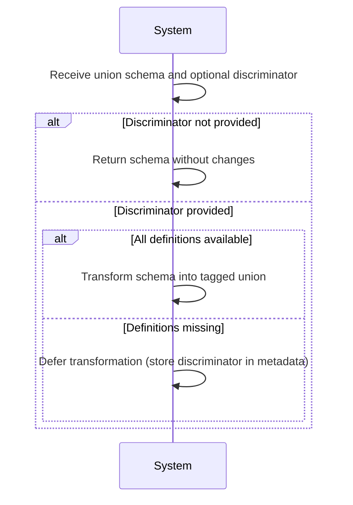
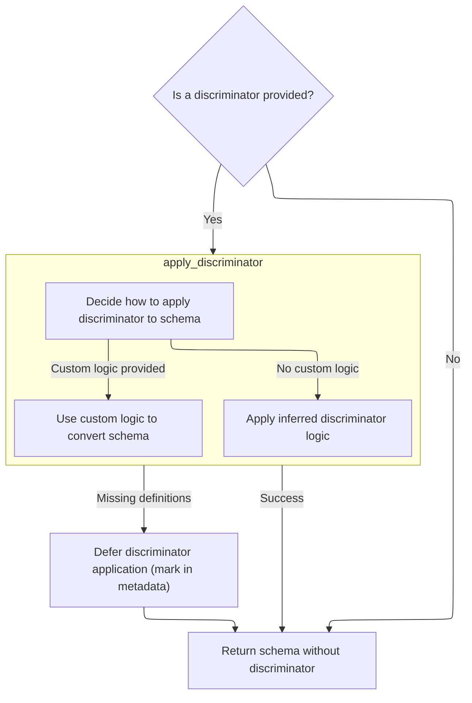
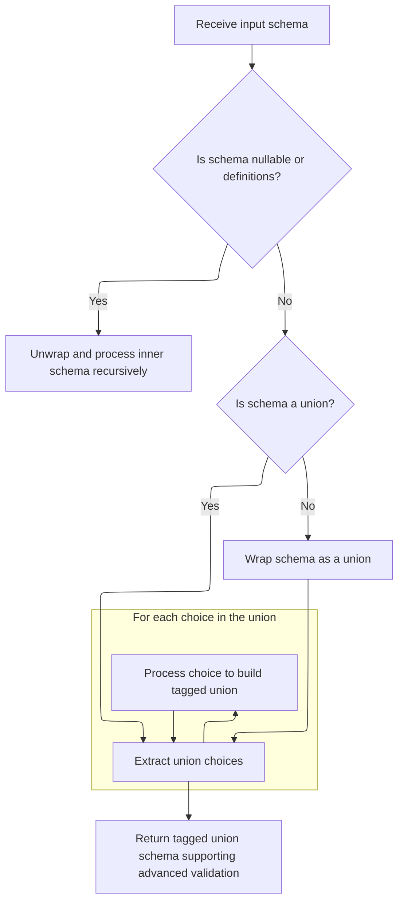

This flow describes how union schemas are transformed into tagged unions using a discriminator. When a union schema and an optional discriminator are provided, the system checks for the discriminator and, if possible, applies it to enable advanced validation and clearer error messages. If required definitions are missing, the transformation is deferred until all dependencies are available.

The main steps are:

- Check for a discriminator in the schema.
- Attempt to apply the discriminator using available definitions.
- Transform the schema into a tagged union if possible, or defer the process if dependencies are missing.



# Spec

## Detailed View of the Program's Functionality

a. Checking for Discriminator and Applying to Union Schemas

The process begins by determining whether a discriminator is provided for a union schema. If no discriminator is specified, the schema is returned as-is, without any discriminator logic applied. If a discriminator is present, the system attempts to apply it to the union schema. This involves invoking a function that tries to build a tagged union schema using the provided discriminator and the current set of schema definitions. If all necessary definitions are available, the discriminator is applied immediately. However, if some definitions are missing (for example, due to forward references or recursive types), the application of the discriminator is deferred. In this case, the discriminator information is stored in the schema's metadata, allowing the process to be retried later when all dependencies are resolved.

b. Preparing Discriminator Application

When applying the discriminator, the system checks if the discriminator is a special object that may contain custom logic. If so, and if this object provides its own conversion method, the schema conversion is delegated to this custom logic. This allows for advanced or user-defined ways of tagging the union schema. If no custom logic is present, the system proceeds to infer how to apply the discriminator based on the schema structure and the discriminator value.

c. Inferring Discriminator and Applying to Schema

If the discriminator is a simple string or after custom logic is handled, the system constructs an internal helper object responsible for transforming the union schema into a tagged union schema. This helper is initialized with the discriminator value and the current definitions. The main method of this helper is called to perform the transformation, which involves recursively analyzing the schema, extracting union choices, and mapping discriminator values to the appropriate schema branches.

d. Building the Tagged Union Schema

The transformation process involves several steps:

- The schema is recursively unwrapped to handle nullable types and definitions, ensuring the core union structure is exposed.
- If the schema is not already a union, it is wrapped as a union to standardize processing.
- The union choices are collected and processed in order. Each choice is examined to determine if it is a valid variant for the discriminated union. Nested unions, tagged unions, and other wrappers are handled appropriately, including flattening and coalescing compatible tagged unions.
- For each valid choice, the system infers the set of discriminator values that should map to that choice. This involves inspecting the schema for fields matching the discriminator, ensuring that each value is unique across the union, and handling edge cases such as aliases and literal types.
- The mapping from discriminator values to schema choices is built up as the choices are processed.

Once all choices are handled, the system constructs the final tagged union schema. If an alias for the discriminator is detected and differs from the field name, the discriminator is represented as a list of possible attribute paths to support fallback matching. The tagged union schema is then created with all the necessary parameters, including the mapping of choices, discriminator information, and any custom error handling or metadata.

e. Finalizing Nullability in Tagged Union

After constructing the tagged union schema, the system checks if the union should accept null values (<SwmToken path="pydantic/_internal/_generate_schema.py" pos="925:22:24" line-data="            # safety measure (because these are inlined in place -- i.e. mutated directly)">`i.e`</SwmToken>., if any branch of the union was nullable or explicitly allowed None). If so, and if the schema is not already nullable, the schema is wrapped in a nullable wrapper. This ensures that the resulting schema will accept both null and the valid union types. The instance responsible for building the tagged union is then marked as used to prevent accidental reuse, and the final schema is returned.

f. Deferring Discriminator Application if Definitions Missing

If, during the process of applying the discriminator, a required definition is not available (for example, due to a forward reference that has not yet been resolved), the system catches this situation and defers the application. It does this by storing the discriminator information in the schema's metadata under a special key. This allows the schema generation process to continue, with the understanding that the discriminator logic will be applied later, once all definitions are available and the schema can be finalized.

g. Generating JSON Schema for Nullable Schemas

When generating a JSON schema for a nullable type, the system produces a schema that matches both the inner type and the null value. This is done by generating the JSON schema for the inner type and combining it with a schema for null using a logical <SwmToken path="pydantic/json_schema.py" pos="1238:10:10" line-data="            # I&#39;ll use &#39;anyOf&#39; for now, but it could be changed it if it would work better with some external tooling">`anyOf`</SwmToken> construct. If the inner schema is already just null, it is returned directly; otherwise, the combined schema is returned, ensuring that both null and the intended type are accepted in the JSON schema output.

# Rule Definition

| Paragraph Name                                                                                                                                                                                                                                                                                                                                                  | Rule ID | Category          | Description                                                                                                                                                                                                                                                                                                                                                                                                                                                                                                                                                                                                                                                                                                                                                                                                                                                                                                                                           | Conditions                                                                                                  | Remarks                                                                                                                                                                                                                                       |
| --------------------------------------------------------------------------------------------------------------------------------------------------------------------------------------------------------------------------------------------------------------------------------------------------------------------------------------------------------------- | ------- | ----------------- | ----------------------------------------------------------------------------------------------------------------------------------------------------------------------------------------------------------------------------------------------------------------------------------------------------------------------------------------------------------------------------------------------------------------------------------------------------------------------------------------------------------------------------------------------------------------------------------------------------------------------------------------------------------------------------------------------------------------------------------------------------------------------------------------------------------------------------------------------------------------------------------------------------------------------------------------------------- | ----------------------------------------------------------------------------------------------------------- | --------------------------------------------------------------------------------------------------------------------------------------------------------------------------------------------------------------------------------------------- |
| GenerateSchema.\_generate_schema_inner, GenerateSchema.\_union_schema, \_ApplyInferredDiscriminator.\_apply_to_root                                                                                                                                                                                                                                             | RL-001  | Conditional Logic | The system must accept as input a schema object representing a union of types. If the input schema is wrapped in a 'nullable' or 'definitions' schema, the system must recursively unwrap these wrappers to access and process the core union schema. If the input schema is not a union, it must be wrapped as a union schema with a single choice before applying discriminator logic.                                                                                                                                                                                                                                                                                                                                                                                                                                                                                                                                                              | Input schema is provided for processing; may be wrapped in 'nullable' or 'definitions'; may not be a union. | Input schema must be a dictionary with at least 'type': 'union' and 'choices': \[...\]. Wrappers may have 'type': 'nullable' or 'type': 'definitions'.                                                                                        |
| GenerateSchema.\_apply_discriminator_to_union, <SwmToken path="pydantic/_internal/_generate_schema.py" pos="670:3:5" line-data="            return _discriminated_union.apply_discriminator(">`_discriminated_union.apply_discriminator`</SwmToken>, \_ApplyInferredDiscriminator.apply/\_apply_to_root/\_handle_choice/\_infer_discriminator_values_for_choice | RL-002  | Conditional Logic | If a discriminator is provided, the system must apply it to the union schema. Each variant in the 'choices' list must be mapped to a unique discriminator value, typically extracted from a field in the variant schema corresponding to the discriminator field. The system must support both string and object discriminators, including custom logic and aliases.                                                                                                                                                                                                                                                                                                                                                                                                                                                                                                                                                                                  | A discriminator is provided (string or object); input schema is a union (possibly after normalization).     | Discriminator may be a string (field name) or an object with custom logic. Each variant must have a unique discriminator value (from a Literal field). Aliases are supported; output may have 'discriminator' as a string or list of aliases. |
| \_ApplyInferredDiscriminator.\_apply_to_root, \_ApplyInferredDiscriminator.apply, json_schema.GenerateJsonSchema.tagged_union_schema                                                                                                                                                                                                                            | RL-003  | Data Assignment   | The output schema must be a dictionary with at least the following keys: 'type': <SwmToken path="pydantic/_internal/_discriminated_union.py" pos="141:26:28" line-data="        &quot;&quot;&quot;Return a new CoreSchema based on `schema` that uses a tagged-union with the discriminator provided">`tagged-union`</SwmToken>, 'choices': a mapping where each key is a discriminator value and each value is the schema for the corresponding variant, and 'discriminator': the name of the discriminator field (or a list of possible aliases if applicable). If the union schema is nullable, the output schema must be wrapped in a dictionary with 'type': 'nullable' and 'schema': the <SwmToken path="pydantic/_internal/_discriminated_union.py" pos="141:26:28" line-data="        &quot;&quot;&quot;Return a new CoreSchema based on `schema` that uses a tagged-union with the discriminator provided">`tagged-union`</SwmToken> schema. | Discriminator has been successfully applied to a union schema; nullable flag is set if None is allowed.     | Output schema format:                                                                                                                                                                                                                         |

- type: <SwmToken path="pydantic/_internal/_discriminated_union.py" pos="141:26:28" line-data="        &quot;&quot;&quot;Return a new CoreSchema based on `schema` that uses a tagged-union with the discriminator provided">`tagged-union`</SwmToken>
- choices: <SwmToken path="pydantic/_internal/_discriminated_union.py" pos="475:5:6" line-data="                        f&#39;Value {discriminator_value!r} for discriminator &#39;">`{discriminator_value`</SwmToken>: variant_schema, ...}
- discriminator: string or list of aliases
- If nullable: {type: 'nullable', schema: <tagged-union-schema>}
- May include 'metadata', 'ref', or error messages as needed. | | \_ApplyInferredDiscriminator.\_set_unique_choice_for_values, \_ApplyInferredDiscriminator.\_handle_choice, \_ApplyInferredDiscriminator.\_infer_discriminator_values_for_choice | RL-004 | Conditional Logic | The system must ensure that each discriminator value is unique across all choices. If a conflict is detected (<SwmToken path="pydantic/_internal/_generate_schema.py" pos="925:22:24" line-data="            # safety measure (because these are inlined in place -- i.e. mutated directly)">`i.e`</SwmToken>., the same value is mapped to multiple choices), the system must flag this as an error. If the necessary definitions for any variant are not available at the time of discriminator application, the system must defer the application by storing the discriminator in the schema's metadata for later processing. | Discriminator values are being mapped; definitions may be missing; conflicts may arise. | If a discriminator value is mapped to more than one variant, raise <SwmToken path="pydantic/_internal/_discriminated_union.py" pos="50:1:1" line-data="        TypeError:">`TypeError`</SwmToken>. If a definition is missing, raise <SwmToken path="pydantic/_internal/_generate_schema.py" pos="675:5:5" line-data="        except _discriminated_union.MissingDefinitionForUnionRef:">`MissingDefinitionForUnionRef`</SwmToken> and defer by storing discriminator in metadata. | | \_ApplyInferredDiscriminator.\_apply_to_root, \_ApplyInferredDiscriminator.\_infer_discriminator_values_for_field, json_schema.GenerateJsonSchema.\_extract_discriminator | RL-005 | Data Assignment | The system must support discriminator aliases, allowing the 'discriminator' field in the output schema to be a list of field names if multiple aliases are provided. | Discriminator field has aliases in one or more variants. | Output schema 'discriminator' may be a string or a list of lists of strings (aliases). JSON schema generation will extract the appropriate property name for <SwmToken path="pydantic/json_schema.py" pos="273:22:22" line-data="        # definitions, which would also work better in a generated OpenAPI client, etc.">`OpenAPI`</SwmToken> discriminator if possible. | | GenerateSchema.\_apply_discriminator_to_union, <SwmToken path="pydantic/_internal/_generate_schema.py" pos="670:3:5" line-data="            return _discriminated_union.apply_discriminator(">`_discriminated_union.apply_discriminator`</SwmToken>, \_ApplyInferredDiscriminator.\_handle_choice | RL-006 | Conditional Logic | If the necessary definitions for any variant are not available at the time of discriminator application, the system must defer the application by storing the discriminator in the schema's metadata for later processing. | A referenced definition is missing when applying the discriminator. | Store discriminator in schema\['metadata'\]\[<SwmToken path="pydantic/_internal/_generate_schema.py" pos="2654:15:15" line-data="    if len(metadata) == 1 and &#39;pydantic_internal_union_discriminator&#39; in metadata:">`pydantic_internal_union_discriminator`</SwmToken>\] for later processing. | | \_ApplyInferredDiscriminator.apply | RL-007 | Conditional Logic | The system must prevent reuse of the same discriminator application instance after it has been used to generate a schema. | Discriminator application instance is called more than once. | Instance variable \_used is set to True after first use; subsequent calls will assert or error. | | \_ApplyInferredDiscriminator.\_apply_to_root, json_schema.GenerateJsonSchema.tagged_union_schema | RL-008 | Computation | The system must ensure that the final output schema supports advanced validation based on the discriminator field, enabling correct selection and validation of the appropriate variant based on the discriminator value in the input data. | Tagged-union schema is output; discriminator field is present. | Output schema must allow validation logic to select the correct variant based on discriminator value. JSON schema output includes <SwmToken path="pydantic/json_schema.py" pos="1237:27:27" line-data="            # Thanks to the equality check against `null_schema` above, I think &#39;oneOf&#39; would also be valid here;">`oneOf`</SwmToken> with discriminator mapping for <SwmToken path="pydantic/json_schema.py" pos="273:22:22" line-data="        # definitions, which would also work better in a generated OpenAPI client, etc.">`OpenAPI`</SwmToken> compatibility. |

# User Stories

## User Story 1: Schema normalization, discriminator application, and output schema generation

---

### Story Description:

As a system processing data schemas, I want to accept schemas representing unions of types (including those wrapped in 'nullable' or 'definitions'), normalize them, apply a provided discriminator (with support for custom logic and aliases), ensure each variant is mapped to a unique discriminator value, handle missing definitions by deferring processing, prevent reuse of discriminator application instances, and output a schema with the correct structure (including nullable wrapping and advanced validation) so that downstream consumers can reliably distinguish, validate, and select the appropriate variant, with compatibility for <SwmToken path="pydantic/json_schema.py" pos="273:22:22" line-data="        # definitions, which would also work better in a generated OpenAPI client, etc.">`OpenAPI`</SwmToken> discriminator mapping.

---

### Business Rule Mapping:

| Rule ID | Paragraph Name                                                                                                                                                                                                                                                                                                                                                  | Rule Description                                                                                                                                                                                                                                                                                                                                                                                                                                                                                                                                                                                                                                                                                                                                                                                                                                                                                                                                      |
| ------- | --------------------------------------------------------------------------------------------------------------------------------------------------------------------------------------------------------------------------------------------------------------------------------------------------------------------------------------------------------------- | ----------------------------------------------------------------------------------------------------------------------------------------------------------------------------------------------------------------------------------------------------------------------------------------------------------------------------------------------------------------------------------------------------------------------------------------------------------------------------------------------------------------------------------------------------------------------------------------------------------------------------------------------------------------------------------------------------------------------------------------------------------------------------------------------------------------------------------------------------------------------------------------------------------------------------------------------------- |
| RL-001  | GenerateSchema.\_generate_schema_inner, GenerateSchema.\_union_schema, \_ApplyInferredDiscriminator.\_apply_to_root                                                                                                                                                                                                                                             | The system must accept as input a schema object representing a union of types. If the input schema is wrapped in a 'nullable' or 'definitions' schema, the system must recursively unwrap these wrappers to access and process the core union schema. If the input schema is not a union, it must be wrapped as a union schema with a single choice before applying discriminator logic.                                                                                                                                                                                                                                                                                                                                                                                                                                                                                                                                                              |
| RL-002  | GenerateSchema.\_apply_discriminator_to_union, <SwmToken path="pydantic/_internal/_generate_schema.py" pos="670:3:5" line-data="            return _discriminated_union.apply_discriminator(">`_discriminated_union.apply_discriminator`</SwmToken>, \_ApplyInferredDiscriminator.apply/\_apply_to_root/\_handle_choice/\_infer_discriminator_values_for_choice | If a discriminator is provided, the system must apply it to the union schema. Each variant in the 'choices' list must be mapped to a unique discriminator value, typically extracted from a field in the variant schema corresponding to the discriminator field. The system must support both string and object discriminators, including custom logic and aliases.                                                                                                                                                                                                                                                                                                                                                                                                                                                                                                                                                                                  |
| RL-006  | GenerateSchema.\_apply_discriminator_to_union, <SwmToken path="pydantic/_internal/_generate_schema.py" pos="670:3:5" line-data="            return _discriminated_union.apply_discriminator(">`_discriminated_union.apply_discriminator`</SwmToken>, \_ApplyInferredDiscriminator.\_handle_choice                                                               | If the necessary definitions for any variant are not available at the time of discriminator application, the system must defer the application by storing the discriminator in the schema's metadata for later processing.                                                                                                                                                                                                                                                                                                                                                                                                                                                                                                                                                                                                                                                                                                                            |
| RL-003  | \_ApplyInferredDiscriminator.\_apply_to_root, \_ApplyInferredDiscriminator.apply, json_schema.GenerateJsonSchema.tagged_union_schema                                                                                                                                                                                                                            | The output schema must be a dictionary with at least the following keys: 'type': <SwmToken path="pydantic/_internal/_discriminated_union.py" pos="141:26:28" line-data="        &quot;&quot;&quot;Return a new CoreSchema based on `schema` that uses a tagged-union with the discriminator provided">`tagged-union`</SwmToken>, 'choices': a mapping where each key is a discriminator value and each value is the schema for the corresponding variant, and 'discriminator': the name of the discriminator field (or a list of possible aliases if applicable). If the union schema is nullable, the output schema must be wrapped in a dictionary with 'type': 'nullable' and 'schema': the <SwmToken path="pydantic/_internal/_discriminated_union.py" pos="141:26:28" line-data="        &quot;&quot;&quot;Return a new CoreSchema based on `schema` that uses a tagged-union with the discriminator provided">`tagged-union`</SwmToken> schema. |
| RL-005  | \_ApplyInferredDiscriminator.\_apply_to_root, \_ApplyInferredDiscriminator.\_infer_discriminator_values_for_field, json_schema.GenerateJsonSchema.\_extract_discriminator                                                                                                                                                                                       | The system must support discriminator aliases, allowing the 'discriminator' field in the output schema to be a list of field names if multiple aliases are provided.                                                                                                                                                                                                                                                                                                                                                                                                                                                                                                                                                                                                                                                                                                                                                                                  |
| RL-008  | \_ApplyInferredDiscriminator.\_apply_to_root, json_schema.GenerateJsonSchema.tagged_union_schema                                                                                                                                                                                                                                                                | The system must ensure that the final output schema supports advanced validation based on the discriminator field, enabling correct selection and validation of the appropriate variant based on the discriminator value in the input data.                                                                                                                                                                                                                                                                                                                                                                                                                                                                                                                                                                                                                                                                                                           |
| RL-004  | \_ApplyInferredDiscriminator.\_set_unique_choice_for_values, \_ApplyInferredDiscriminator.\_handle_choice, \_ApplyInferredDiscriminator.\_infer_discriminator_values_for_choice                                                                                                                                                                                 | The system must ensure that each discriminator value is unique across all choices. If a conflict is detected (<SwmToken path="pydantic/_internal/_generate_schema.py" pos="925:22:24" line-data="            # safety measure (because these are inlined in place -- i.e. mutated directly)">`i.e`</SwmToken>., the same value is mapped to multiple choices), the system must flag this as an error. If the necessary definitions for any variant are not available at the time of discriminator application, the system must defer the application by storing the discriminator in the schema's metadata for later processing.                                                                                                                                                                                                                                                                                                                      |
| RL-007  | \_ApplyInferredDiscriminator.apply                                                                                                                                                                                                                                                                                                                              | The system must prevent reuse of the same discriminator application instance after it has been used to generate a schema.                                                                                                                                                                                                                                                                                                                                                                                                                                                                                                                                                                                                                                                                                                                                                                                                                             |

---

### Relevant Functionality:

- **GenerateSchema.\_generate_schema_inner**
  1. **RL-001:**
     - If schema\['type'\] == 'nullable' or 'definitions':
       - Recursively unwrap schema\['schema'\]
     - If schema\['type'\] != 'union':
       - Wrap schema as {'type': 'union', 'choices': \[schema\]}
     - Proceed with union/discriminator logic
- **GenerateSchema.\_apply_discriminator_to_union**
  1. **RL-002:**
     - If discriminator is an object with custom logic:
       - Delegate schema conversion to <SwmToken path="pydantic/_internal/_discriminated_union.py" pos="68:3:5" line-data="            return discriminator._convert_schema(schema)">`discriminator._convert_schema`</SwmToken>
     - Else:
       - For each choice in union\['choices'\]:
         - Extract discriminator field value(s) (must be Literal)
         - Map value(s) to the choice
         - Ensure no duplicate values
       - If any value is mapped to multiple choices, raise error
       - If any variant is missing the discriminator field, raise error
       - If aliases are present, collect them for output
  2. **RL-006:**
     - If <SwmToken path="pydantic/_internal/_generate_schema.py" pos="675:5:5" line-data="        except _discriminated_union.MissingDefinitionForUnionRef:">`MissingDefinitionForUnionRef`</SwmToken> is raised:
       - Call <SwmToken path="pydantic/_internal/_generate_schema.py" pos="677:3:3" line-data="            _discriminated_union.set_discriminator_in_metadata(">`set_discriminator_in_metadata`</SwmToken>(schema, discriminator)
       - Return schema for later processing
- **\_ApplyInferredDiscriminator.\_apply_to_root**
  1. **RL-003:**
     - Build mapping of discriminator values to variant schemas
     - Set 'type': <SwmToken path="pydantic/_internal/_discriminated_union.py" pos="141:26:28" line-data="        &quot;&quot;&quot;Return a new CoreSchema based on `schema` that uses a tagged-union with the discriminator provided">`tagged-union`</SwmToken>
     - Set 'choices': mapping
     - Set 'discriminator': field name or aliases
     - If nullable:
       - Wrap in {'type': 'nullable', 'schema': <tagged-union-schema>}
     - Add any additional fields (metadata, ref, errors) as needed
  2. **RL-005:**
     - When extracting discriminator field from each variant:
       - If alias is present and differs from field name, collect alias
     - In output schema, set 'discriminator' to list of aliases if needed
  3. **RL-008:**
     - Output schema includes mapping of discriminator values to variant schemas
     - Validation logic uses discriminator value to select and validate the correct variant
     - JSON schema includes <SwmToken path="pydantic/json_schema.py" pos="1237:27:27" line-data="            # Thanks to the equality check against `null_schema` above, I think &#39;oneOf&#39; would also be valid here;">`oneOf`</SwmToken> and 'discriminator' for <SwmToken path="pydantic/json_schema.py" pos="273:22:22" line-data="        # definitions, which would also work better in a generated OpenAPI client, etc.">`OpenAPI`</SwmToken>
- **\_ApplyInferredDiscriminator.\_set_unique_choice_for_values**
  1. **RL-004:**
     - For each discriminator value:
       - If value already mapped to a different choice, raise error
       - Else, map value to choice
     - If a referenced definition is missing:
       - Store discriminator in schema\['metadata'\]\[<SwmToken path="pydantic/_internal/_generate_schema.py" pos="2654:15:15" line-data="    if len(metadata) == 1 and &#39;pydantic_internal_union_discriminator&#39; in metadata:">`pydantic_internal_union_discriminator`</SwmToken>\] for later
- **\_ApplyInferredDiscriminator.apply**
  1. **RL-007:**
     - On apply():
       - Assert <SwmToken path="pydantic/_internal/_discriminated_union.py" pos="163:5:7" line-data="        assert not self._used">`self._used`</SwmToken> is False
       - Set <SwmToken path="pydantic/_internal/_discriminated_union.py" pos="163:5:7" line-data="        assert not self._used">`self._used`</SwmToken> = True after schema is generated
       - If called again, raise AssertionError

# Code Walkthrough

## Deferring or Applying Discriminator to Union Schemas



<SwmSnippet path="/pydantic/_internal/_generate_schema.py" line="664">

---

In <SwmToken path="pydantic/_internal/_generate_schema.py" pos="664:3:3" line-data="    def _apply_discriminator_to_union(">`_apply_discriminator_to_union`</SwmToken>, we check if a discriminator is provided and, if so, try to apply it to the union schema using the internal definitions. If the necessary definitions aren't ready, we defer the application by storing the discriminator in the schema's metadata for later. Calling <SwmToken path="pydantic/_internal/_generate_schema.py" pos="670:5:5" line-data="            return _discriminated_union.apply_discriminator(">`apply_discriminator`</SwmToken> here is what actually tries to build the tagged union schema, but it can only succeed if all dependencies are present.

```python
    def _apply_discriminator_to_union(
        self, schema: CoreSchema, discriminator: str | Discriminator | None
    ) -> CoreSchema:
        if discriminator is None:
            return schema
        try:
            return _discriminated_union.apply_discriminator(
                schema,
                discriminator,
                self.defs._definitions,
            )
```

---

</SwmSnippet>

### Preparing Discriminator Application

<SwmSnippet path="/pydantic/_internal/_discriminated_union.py" line="34">

---

In <SwmToken path="pydantic/_internal/_discriminated_union.py" pos="34:2:2" line-data="def apply_discriminator(">`apply_discriminator`</SwmToken>, we check if the discriminator is a Discriminator object. If it is, and it has custom conversion logic, we delegate schema conversion to it by calling <SwmToken path="pydantic/_internal/_discriminated_union.py" pos="68:5:5" line-data="            return discriminator._convert_schema(schema)">`_convert_schema`</SwmToken>. This lets custom discriminators handle their own schema tagging before we move on.

```python
def apply_discriminator(
    schema: core_schema.CoreSchema,
    discriminator: str | Discriminator,
    definitions: dict[str, core_schema.CoreSchema] | None = None,
) -> core_schema.CoreSchema:
    """Applies the discriminator and returns a new core schema.

    Args:
        schema: The input schema.
        discriminator: The name of the field which will serve as the discriminator.
        definitions: A mapping of schema ref to schema.

    Returns:
        The new core schema.

    Raises:
        TypeError:
            - If `discriminator` is used with invalid union variant.
            - If `discriminator` is used with `Union` type with one variant.
            - If `discriminator` value mapped to multiple choices.
        MissingDefinitionForUnionRef:
            If the definition for ref is missing.
        PydanticUserError:
            - If a model in union doesn't have a discriminator field.
            - If discriminator field has a non-string alias.
            - If discriminator fields have different aliases.
            - If discriminator field not of type `Literal`.
    """
    from ..types import Discriminator

    if isinstance(discriminator, Discriminator):
        if isinstance(discriminator.discriminator, str):
            discriminator = discriminator.discriminator
        else:
            return discriminator._convert_schema(schema)

```

---

</SwmSnippet>

#### Converting to Tagged Union Schema

See <SwmLink doc-title="Converting Union Schemas to Tagged Union Schemas">[Converting Union Schemas to Tagged Union Schemas](/.swm/converting-union-schemas-to-tagged-union-schemas.dudczuqk.sw.md)</SwmLink>

#### Inferring Discriminator and Applying to Schema

<SwmSnippet path="/pydantic/_internal/_discriminated_union.py" line="70">

---

After returning from <SwmToken path="pydantic/_internal/_discriminated_union.py" pos="68:5:5" line-data="            return discriminator._convert_schema(schema)">`_convert_schema`</SwmToken>, <SwmToken path="pydantic/_internal/_generate_schema.py" pos="670:5:5" line-data="            return _discriminated_union.apply_discriminator(">`apply_discriminator`</SwmToken> wraps up by using <SwmToken path="pydantic/_internal/_discriminated_union.py" pos="70:3:3" line-data="    return _ApplyInferredDiscriminator(discriminator, definitions or {}).apply(schema)">`_ApplyInferredDiscriminator`</SwmToken> to apply the discriminator logic to the schema. Calling <SwmToken path="pydantic/_internal/_discriminated_union.py" pos="70:16:16" line-data="    return _ApplyInferredDiscriminator(discriminator, definitions or {}).apply(schema)">`apply`</SwmToken> here is what actually builds the tagged union structure with the discriminator field set up.

```python
    return _ApplyInferredDiscriminator(discriminator, definitions or {}).apply(schema)
```

---

</SwmSnippet>

### Building the Tagged Union Schema

```mermaid
%%{init: {"flowchart": {"defaultRenderer": "elk"}} }%%
flowchart TD
  node1["Receive and prepare input schema"] --> node2["Transform schema into tagged union using discriminator"]
  click node1 openCode "pydantic/_internal/_discriminated_union.py:140:164"
  node2 -->|"If self._should_be_nullable and not self._is_nullable"| node3["Make schema nullable and finalize"]
  node2 -->|"Otherwise"| node3["Finalize schema"]
  click node2 openCode "pydantic/_internal/_discriminated_union.py:170:170"
  click node3 openCode "pydantic/_internal/_discriminated_union.py:165:168"

subgraph node2 [_apply_to_root]
  sgmain_1_node1["Receive input schema"] --> sgmain_1_node2{"Is schema nullable or definitions?"}
  click sgmain_1_node1 openCode "pydantic/_internal/_discriminated_union.py:170:175"
  sgmain_1_node2 -->|"Yes"| sgmain_1_node3["Unwrap and process inner schema recursively"]
  click sgmain_1_node2 openCode "pydantic/_internal/_discriminated_union.py:175:186"
  sgmain_1_node2 -->|"No"| sgmain_1_node4{"Is schema a union?"}
  click sgmain_1_node3 openCode "pydantic/_internal/_discriminated_union.py:175:186"
  sgmain_1_node4 -->|"No"| sgmain_1_node5["Wrap schema as a union"]
  click sgmain_1_node4 openCode "pydantic/_internal/_discriminated_union.py:188:193"
  sgmain_1_node4 -->|"Yes"| sgmain_1_node6["Extract union choices"]
  click sgmain_1_node5 openCode "pydantic/_internal/_discriminated_union.py:188:193"
  sgmain_1_node5 --> sgmain_1_node6
  click sgmain_1_node6 openCode "pydantic/_internal/_discriminated_union.py:195:197"
  subgraph sgmain_1_loop1["For each choice in the union"]
  sgmain_1_node6 --> sgmain_1_node7["Process choice to build tagged union"]
  click sgmain_1_node7 openCode "pydantic/_internal/_discriminated_union.py:198:200"
  sgmain_1_node7 --> sgmain_1_node6
  end
  sgmain_1_node6 --> sgmain_1_node8["Return tagged union schema supporting advanced validation"]
  click sgmain_1_node8 openCode "pydantic/_internal/_discriminated_union.py:202:224"
end

%% Swimm:
%% %%{init: {"flowchart": {"defaultRenderer": "elk"}} }%%
%% flowchart TD
%%   node1["Receive and prepare input schema"] --> node2["Transform schema into tagged union using discriminator"]
%%   click node1 openCode "<SwmPath>[pydantic/\_internal/\_discriminated_union.py](pydantic/_internal/_discriminated_union.py)</SwmPath>:140:164"
%%   node2 -->|"If <SwmToken path="pydantic/_internal/_discriminated_union.py" pos="165:3:5" line-data="        if self._should_be_nullable and not self._is_nullable:">`self._should_be_nullable`</SwmToken> and not <SwmToken path="pydantic/_internal/_discriminated_union.py" pos="165:11:13" line-data="        if self._should_be_nullable and not self._is_nullable:">`self._is_nullable`</SwmToken>"| node3["Make schema nullable and finalize"]
%%   node2 -->|"Otherwise"| node3["Finalize schema"]
%%   click node2 openCode "<SwmPath>[pydantic/\_internal/\_discriminated_union.py](pydantic/_internal/_discriminated_union.py)</SwmPath>:170:170"
%%   click node3 openCode "<SwmPath>[pydantic/\_internal/\_discriminated_union.py](pydantic/_internal/_discriminated_union.py)</SwmPath>:165:168"
%% 
%% subgraph node2 [<SwmToken path="pydantic/_internal/_discriminated_union.py" pos="164:7:7" line-data="        schema = self._apply_to_root(schema)">`_apply_to_root`</SwmToken>]
%%   sgmain_1_node1["Receive input schema"] --> sgmain_1_node2{"Is schema nullable or definitions?"}
%%   click sgmain_1_node1 openCode "<SwmPath>[pydantic/\_internal/\_discriminated_union.py](pydantic/_internal/_discriminated_union.py)</SwmPath>:170:175"
%%   sgmain_1_node2 -->|"Yes"| sgmain_1_node3["Unwrap and process inner schema recursively"]
%%   click sgmain_1_node2 openCode "<SwmPath>[pydantic/\_internal/\_discriminated_union.py](pydantic/_internal/_discriminated_union.py)</SwmPath>:175:186"
%%   sgmain_1_node2 -->|"No"| sgmain_1_node4{"Is schema a union?"}
%%   click sgmain_1_node3 openCode "<SwmPath>[pydantic/\_internal/\_discriminated_union.py](pydantic/_internal/_discriminated_union.py)</SwmPath>:175:186"
%%   sgmain_1_node4 -->|"No"| sgmain_1_node5["Wrap schema as a union"]
%%   click sgmain_1_node4 openCode "<SwmPath>[pydantic/\_internal/\_discriminated_union.py](pydantic/_internal/_discriminated_union.py)</SwmPath>:188:193"
%%   sgmain_1_node4 -->|"Yes"| sgmain_1_node6["Extract union choices"]
%%   click sgmain_1_node5 openCode "<SwmPath>[pydantic/\_internal/\_discriminated_union.py](pydantic/_internal/_discriminated_union.py)</SwmPath>:188:193"
%%   sgmain_1_node5 --> sgmain_1_node6
%%   click sgmain_1_node6 openCode "<SwmPath>[pydantic/\_internal/\_discriminated_union.py](pydantic/_internal/_discriminated_union.py)</SwmPath>:195:197"
%%   subgraph sgmain_1_loop1["For each choice in the union"]
%%   sgmain_1_node6 --> sgmain_1_node7["Process choice to build tagged union"]
%%   click sgmain_1_node7 openCode "<SwmPath>[pydantic/\_internal/\_discriminated_union.py](pydantic/_internal/_discriminated_union.py)</SwmPath>:198:200"
%%   sgmain_1_node7 --> sgmain_1_node6
%%   end
%%   sgmain_1_node6 --> sgmain_1_node8["Return tagged union schema supporting advanced validation"]
%%   click sgmain_1_node8 openCode "<SwmPath>[pydantic/\_internal/\_discriminated_union.py](pydantic/_internal/_discriminated_union.py)</SwmPath>:202:224"
%% end
```



<SwmSnippet path="/pydantic/_internal/_discriminated_union.py" line="140">

---

In <SwmToken path="pydantic/_internal/_discriminated_union.py" pos="140:3:3" line-data="    def apply(self, schema: core_schema.CoreSchema) -&gt; core_schema.CoreSchema:">`apply`</SwmToken>, we make sure this instance hasn't been used yet, then call <SwmToken path="pydantic/_internal/_discriminated_union.py" pos="164:7:7" line-data="        schema = self._apply_to_root(schema)">`_apply_to_root`</SwmToken> to recursively process and unwrap the schema. This sets up the structure for discriminator tagging.

```python
    def apply(self, schema: core_schema.CoreSchema) -> core_schema.CoreSchema:
        """Return a new CoreSchema based on `schema` that uses a tagged-union with the discriminator provided
        to this class.

        Args:
            schema: The input schema.

        Returns:
            The new core schema.

        Raises:
            TypeError:
                - If `discriminator` is used with invalid union variant.
                - If `discriminator` is used with `Union` type with one variant.
                - If `discriminator` value mapped to multiple choices.
            ValueError:
                If the definition for ref is missing.
            PydanticUserError:
                - If a model in union doesn't have a discriminator field.
                - If discriminator field has a non-string alias.
                - If discriminator fields have different aliases.
                - If discriminator field not of type `Literal`.
        """
        assert not self._used
        schema = self._apply_to_root(schema)
```

---

</SwmSnippet>

#### Unwrapping and Normalizing Union Choices



<SwmSnippet path="/pydantic/_internal/_discriminated_union.py" line="170">

---

In <SwmToken path="pydantic/_internal/_discriminated_union.py" pos="170:3:3" line-data="    def _apply_to_root(self, schema: core_schema.CoreSchema) -&gt; core_schema.CoreSchema:">`_apply_to_root`</SwmToken>, we recursively unwrap nullable and definitions schemas to process the core schema. If the schema isn't a union, we wrap it into a union schema so that discriminated union logic can still be applied, even for single-member cases. Next, we need to call <SwmToken path="pydantic/_internal/_discriminated_union.py" pos="193:7:7" line-data="            schema = core_schema.union_schema([schema])">`union_schema`</SwmToken> to formalize this structure.

```python
    def _apply_to_root(self, schema: core_schema.CoreSchema) -> core_schema.CoreSchema:
        """This method handles the outer-most stage of recursion over the input schema:
        unwrapping nullable or definitions schemas, and calling the `_handle_choice`
        method iteratively on the choices extracted (recursively) from the possibly-wrapped union.
        """
        if schema['type'] == 'nullable':
            self._is_nullable = True
            wrapped = self._apply_to_root(schema['schema'])
            nullable_wrapper = schema.copy()
            nullable_wrapper['schema'] = wrapped
            return nullable_wrapper

        if schema['type'] == 'definitions':
            wrapped = self._apply_to_root(schema['schema'])
            definitions_wrapper = schema.copy()
            definitions_wrapper['schema'] = wrapped
            return definitions_wrapper

        if schema['type'] != 'union':
            # If the schema is not a union, it probably means it just had a single member and
            # was flattened by pydantic_core.
            # However, it still may make sense to apply the discriminator to this schema,
            # as a way to get discriminated-union-style error messages, so we allow this here.
            schema = core_schema.union_schema([schema])

```

---

</SwmSnippet>

<SwmSnippet path="/pydantic/_internal/_discriminated_union.py" line="195">

---

After returning from <SwmToken path="pydantic/_internal/_discriminated_union.py" pos="193:7:7" line-data="            schema = core_schema.union_schema([schema])">`union_schema`</SwmToken>, <SwmToken path="pydantic/_internal/_discriminated_union.py" pos="164:7:7" line-data="        schema = self._apply_to_root(schema)">`_apply_to_root`</SwmToken> reverses the union choices and pushes them onto a stack. We then process each choice in order by popping from the stack and calling <SwmToken path="pydantic/_internal/_discriminated_union.py" pos="200:3:3" line-data="            self._handle_choice(choice)">`_handle_choice`</SwmToken> for each one. This keeps the original order intact for downstream logic.

```python
        # Reverse the choices list before extending the stack so that they get handled in the order they occur
        choices_schemas = [v[0] if isinstance(v, tuple) else v for v in schema['choices'][::-1]]
        self._choices_to_handle.extend(choices_schemas)
        while self._choices_to_handle:
            choice = self._choices_to_handle.pop()
            self._handle_choice(choice)

```

---

</SwmSnippet>

<SwmSnippet path="/pydantic/_internal/_discriminated_union.py" line="226">

---

<SwmToken path="pydantic/_internal/_discriminated_union.py" pos="226:3:3" line-data="    def _handle_choice(self, choice: core_schema.CoreSchema) -&gt; None:">`_handle_choice`</SwmToken> processes each union member, flattening nested unions and <SwmToken path="pydantic/_internal/_discriminated_union.py" pos="232:13:15" line-data="        * Coalescing nested unions and compatible tagged-unions">`tagged-unions`</SwmToken>, tracking nullable types, and making sure each discriminator value is unique. It updates the internal mapping so that each discriminator value points to exactly one schema choice, raising if there's a conflict.

```python
    def _handle_choice(self, choice: core_schema.CoreSchema) -> None:
        """This method handles the "middle" stage of recursion over the input schema.
        Specifically, it is responsible for handling each choice of the outermost union
        (and any "coalesced" choices obtained from inner unions).

        Here, "handling" entails:
        * Coalescing nested unions and compatible tagged-unions
        * Tracking the presence of 'none' and 'nullable' schemas occurring as choices
        * Validating that each allowed discriminator value maps to a unique choice
        * Updating the _tagged_union_choices mapping that will ultimately be used to build the TaggedUnionSchema.
        """
        if choice['type'] == 'definition-ref':
            if choice['schema_ref'] not in self.definitions:
                raise MissingDefinitionForUnionRef(choice['schema_ref'])

        if choice['type'] == 'none':
            self._should_be_nullable = True
        elif choice['type'] == 'definitions':
            self._handle_choice(choice['schema'])
        elif choice['type'] == 'nullable':
            self._should_be_nullable = True
            self._handle_choice(choice['schema'])  # unwrap the nullable schema
        elif choice['type'] == 'union':
            # Reverse the choices list before extending the stack so that they get handled in the order they occur
            choices_schemas = [v[0] if isinstance(v, tuple) else v for v in choice['choices'][::-1]]
            self._choices_to_handle.extend(choices_schemas)
        elif choice['type'] not in {
            'model',
            'typed-dict',
            'tagged-union',
            'lax-or-strict',
            'dataclass',
            'dataclass-args',
            'definition-ref',
        } and not _core_utils.is_function_with_inner_schema(choice):
            # We should eventually handle 'definition-ref' as well
            err_str = f'The core schema type {choice["type"]!r} is not a valid discriminated union variant.'
            if choice['type'] == 'list':
                err_str += (
                    ' If you are making use of a list of union types, make sure the discriminator is applied to the '
                    'union type and not the list (e.g. `list[Annotated[<T> | <U>, Field(discriminator=...)]]`).'
                )
            raise TypeError(err_str)
        else:
            if choice['type'] == 'tagged-union' and self._is_discriminator_shared(choice):
                # In this case, this inner tagged-union is compatible with the outer tagged-union,
                # and its choices can be coalesced into the outer TaggedUnionSchema.
                subchoices = [x for x in choice['choices'].values() if not isinstance(x, (str, int))]
                # Reverse the choices list before extending the stack so that they get handled in the order they occur
                self._choices_to_handle.extend(subchoices[::-1])
                return

            inferred_discriminator_values = self._infer_discriminator_values_for_choice(choice, source_name=None)
            self._set_unique_choice_for_values(choice, inferred_discriminator_values)
```

---

</SwmSnippet>

<SwmSnippet path="/pydantic/_internal/_discriminated_union.py" line="202">

---

After finishing <SwmToken path="pydantic/_internal/_discriminated_union.py" pos="172:19:19" line-data="        unwrapping nullable or definitions schemas, and calling the `_handle_choice`">`_handle_choice`</SwmToken> for all union members, <SwmToken path="pydantic/_internal/_discriminated_union.py" pos="164:7:7" line-data="        schema = self._apply_to_root(schema)">`_apply_to_root`</SwmToken> checks if a discriminator alias is set. If so, it builds the discriminator argument as a list of lists to support fallback matching. Then it returns the final tagged union schema with all the necessary parameters.

```python
        if self._discriminator_alias is not None and self._discriminator_alias != self.discriminator:
            # * We need to annotate `discriminator` as a union here to handle both branches of this conditional
            # * We need to annotate `discriminator` as list[list[str | int]] and not list[list[str]] due to the
            #   invariance of list, and because list[list[str | int]] is the type of the discriminator argument
            #   to tagged_union_schema below
            # * See the docstring of pydantic_core.core_schema.tagged_union_schema for more details about how to
            #   interpret the value of the discriminator argument to tagged_union_schema. (The list[list[str]] here
            #   is the appropriate way to provide a list of fallback attributes to check for a discriminator value.)
            discriminator: str | list[list[str | int]] = [[self.discriminator], [self._discriminator_alias]]
        else:
            discriminator = self.discriminator
        return core_schema.tagged_union_schema(
            choices=self._tagged_union_choices,
            discriminator=discriminator,
            custom_error_type=schema.get('custom_error_type'),
            custom_error_message=schema.get('custom_error_message'),
            custom_error_context=schema.get('custom_error_context'),
            strict=False,
            from_attributes=True,
            ref=schema.get('ref'),
            metadata=schema.get('metadata'),
            serialization=schema.get('serialization'),
        )
```

---

</SwmSnippet>

#### Finalizing Nullability in Tagged Union

<SwmSnippet path="/pydantic/_internal/_discriminated_union.py" line="165">

---

After returning from <SwmToken path="pydantic/_internal/_discriminated_union.py" pos="164:7:7" line-data="        schema = self._apply_to_root(schema)">`_apply_to_root`</SwmToken>, <SwmToken path="pydantic/_internal/_discriminated_union.py" pos="70:16:16" line-data="    return _ApplyInferredDiscriminator(discriminator, definitions or {}).apply(schema)">`apply`</SwmToken> checks if the union should be nullable but isn't yet. If so, it wraps the schema in <SwmToken path="pydantic/_internal/_discriminated_union.py" pos="166:7:7" line-data="            schema = core_schema.nullable_schema(schema)">`nullable_schema`</SwmToken> to make sure null values are accepted.

```python
        if self._should_be_nullable and not self._is_nullable:
            schema = core_schema.nullable_schema(schema)
```

---

</SwmSnippet>

<SwmSnippet path="/pydantic/json_schema.py" line="1222">

---

<SwmToken path="pydantic/json_schema.py" pos="1222:3:3" line-data="    def nullable_schema(self, schema: core_schema.NullableSchema) -&gt; JsonSchemaValue:">`nullable_schema`</SwmToken> builds a JSON schema that allows null by generating the schema for the inner type with <SwmToken path="pydantic/json_schema.py" pos="1232:7:7" line-data="        inner_json_schema = self.generate_inner(schema[&#39;schema&#39;])">`generate_inner`</SwmToken>, then combines it with a null type. This way, the output accepts both null and the actual type.

```python
    def nullable_schema(self, schema: core_schema.NullableSchema) -> JsonSchemaValue:
        """Generates a JSON schema that matches a schema that allows null values.

        Args:
            schema: The core schema.

        Returns:
            The generated JSON schema.
        """
        null_schema = {'type': 'null'}
        inner_json_schema = self.generate_inner(schema['schema'])

        if inner_json_schema == null_schema:
            return null_schema
        else:
            # Thanks to the equality check against `null_schema` above, I think 'oneOf' would also be valid here;
            # I'll use 'anyOf' for now, but it could be changed it if it would work better with some external tooling
            return self.get_flattened_anyof([inner_json_schema, null_schema])
```

---

</SwmSnippet>

<SwmSnippet path="/pydantic/_internal/_discriminated_union.py" line="167">

---

After returning from <SwmToken path="pydantic/_internal/_discriminated_union.py" pos="166:7:7" line-data="            schema = core_schema.nullable_schema(schema)">`nullable_schema`</SwmToken>, <SwmToken path="pydantic/_internal/_discriminated_union.py" pos="70:16:16" line-data="    return _ApplyInferredDiscriminator(discriminator, definitions or {}).apply(schema)">`apply`</SwmToken> marks the instance as used and returns the final schema. This prevents accidental reuse and finalizes the schema for downstream use.

```python
        self._used = True
        return schema
```

---

</SwmSnippet>

### Deferring Discriminator Application if Definitions Missing

<SwmSnippet path="/pydantic/_internal/_generate_schema.py" line="675">

---

After returning from <SwmToken path="pydantic/_internal/_generate_schema.py" pos="670:5:5" line-data="            return _discriminated_union.apply_discriminator(">`apply_discriminator`</SwmToken>, if we hit a missing definition, <SwmToken path="pydantic/_internal/_generate_schema.py" pos="664:3:3" line-data="    def _apply_discriminator_to_union(">`_apply_discriminator_to_union`</SwmToken> defers the discriminator application by storing it in the schema's metadata. This lets the system try again later when all definitions are available.

```python
        except _discriminated_union.MissingDefinitionForUnionRef:
            # defer until defs are resolved
            _discriminated_union.set_discriminator_in_metadata(
                schema,
                discriminator,
            )
            return schema
```

---

</SwmSnippet>

&nbsp;

*This is an auto-generated document by Swimm 🌊 and has not yet been verified by a human*

<SwmMeta version="3.0.0" repo-id="Z2l0aHViJTNBJTNBcHlkYW50aWMlM0ElM0FTd2ltbS1EZW1v" repo-name="pydantic"><sup>Powered by [Swimm](/)</sup></SwmMeta>
