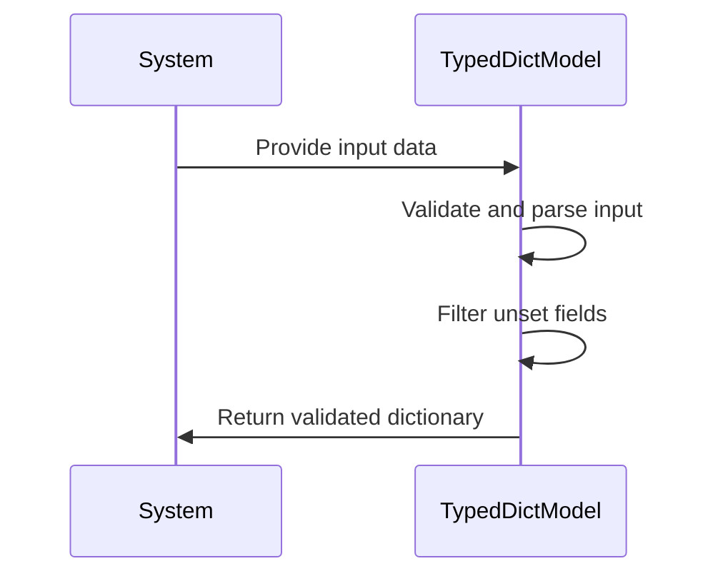
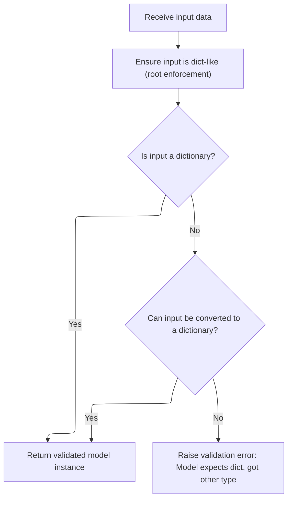
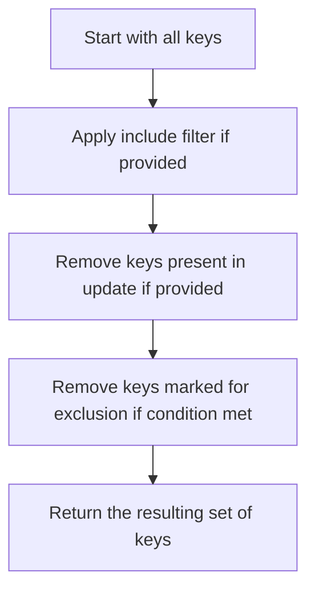
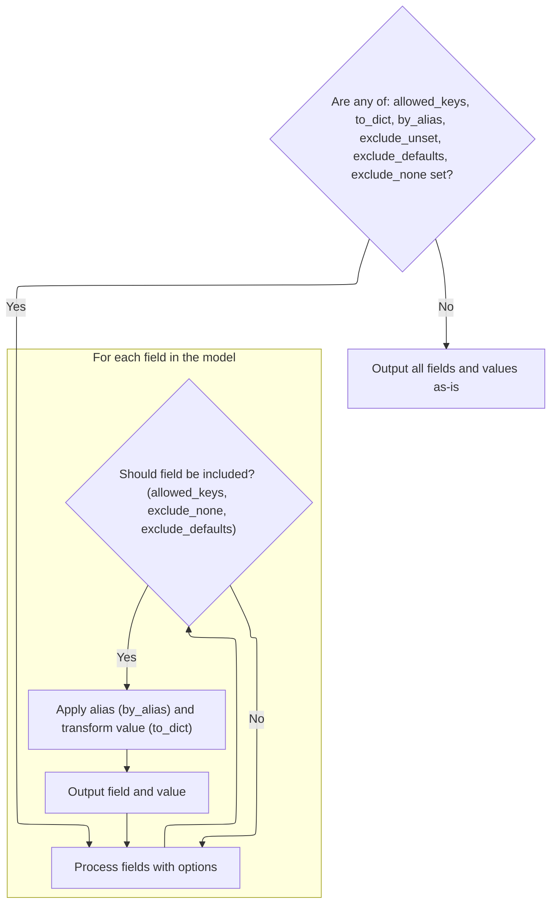

This document outlines how input data is validated and filtered using a <SwmToken path="pydantic/v1/validators.py" pos="632:9:9" line-data="    def typeddict_validator(values: &#39;TypedDict&#39;) -&gt; Dict[str, Any]:  # type: ignore[valid-type]">`TypedDict`</SwmToken> model to ensure only explicitly set and valid fields are included in the output. The main steps are: receiving the input, validating it against the <SwmToken path="pydantic/v1/validators.py" pos="632:9:9" line-data="    def typeddict_validator(values: &#39;TypedDict&#39;) -&gt; Dict[str, Any]:  # type: ignore[valid-type]">`TypedDict`</SwmToken> model, filtering out unset fields, and returning the validated dictionary.



# Spec

## Detailed View of the Program's Functionality

a. Validating <SwmToken path="pydantic/v1/validators.py" pos="632:9:9" line-data="    def typeddict_validator(values: &#39;TypedDict&#39;) -&gt; Dict[str, Any]:  # type: ignore[valid-type]">`TypedDict`</SwmToken> Input

The process begins with a function that validates input data intended for a <SwmToken path="pydantic/v1/validators.py" pos="632:9:9" line-data="    def typeddict_validator(values: &#39;TypedDict&#39;) -&gt; Dict[str, Any]:  # type: ignore[valid-type]">`TypedDict`</SwmToken>. This function receives the input and immediately passes it to a model parser specifically generated for the <SwmToken path="pydantic/v1/validators.py" pos="632:9:9" line-data="    def typeddict_validator(values: &#39;TypedDict&#39;) -&gt; Dict[str, Any]:  # type: ignore[valid-type]">`TypedDict`</SwmToken> type. The parser attempts to convert the input into a structured model instance, ensuring that all fields conform to the expected types and constraints. After successful parsing, the model instance is serialized into a dictionary, but only includes fields that were explicitly set in the input (fields with default values that were not provided are excluded). This ensures that the output dictionary accurately reflects the provided input, filtered through the <SwmToken path="pydantic/v1/validators.py" pos="632:9:9" line-data="    def typeddict_validator(values: &#39;TypedDict&#39;) -&gt; Dict[str, Any]:  # type: ignore[valid-type]">`TypedDict`</SwmToken> schema.

b. Parsing Arbitrary Input to Model

When arbitrary input is provided for model parsing, the process starts by checking if the input needs to be wrapped as a dictionary (especially for models with a single root field). If the input is not already a dictionary, the code tries to convert it into one. If this conversion fails, a validation error is raised, indicating that the model expects a dictionary-like input. Once the input is confirmed or converted to a dictionary, a new model instance is created using the validated data. This instance is ready for further serialization or manipulation.

c. Serializing Model to Dict

To serialize a model instance into a dictionary, a dedicated method is called. This method allows for various options, such as including or excluding specific fields, using field aliases, and filtering out unset, default, or None values. The serialization process is handled by an internal iterator, which yields key-value pairs for each field that should be included in the output. The iterator applies all the specified filters and transformations, ensuring that the resulting dictionary matches the caller's requirements.

d. Filtering Model Fields

Before yielding fields for serialization, the code prepares the inclusion and exclusion rules. It merges any field-level include/exclude settings with those provided at call time. Then, it computes the set of allowed field keys by considering these rules and whether only explicitly set fields should be included (for example, when excluding unset fields). The allowed keys are determined by intersecting with the include set, subtracting any keys from updates, and removing any keys marked for exclusion. This results in the final set of fields that will be processed for output.

e. Computing Allowed Field Keys

The allowed field keys are computed based on the inclusion/exclusion rules and whether only set fields should be considered. If no filtering is requested, all fields are included. If filtering is needed, the code starts with either the set of explicitly set fields or all fields, depending on the options. It then applies the include filter, removes any keys present in updates, and excludes any keys marked for exclusion. The result is a set of field names that will be included in the output.

f. Cloning a Model with Field Filters

When duplicating a model instance (for example, via a copy operation), the code first uses the internal iterator to gather the filtered field values, applying any include/exclude options. It then merges in any updates provided by the caller, ensuring that the new instance reflects both the original data and any changes. The set of fields considered "set" is also updated to include any new keys from the updates. Finally, a new model instance is created with these values and the updated set of fields.

g. Finalizing Allowed Keys

After computing the initial set of allowed keys, the code applies the include filter (if provided), removes any keys present in updates, and excludes any keys marked for exclusion. This step ensures that only the desired fields are included in the final output, respecting all filtering options.

h. Processing and Yielding Filtered Fields

With the allowed keys determined, the code iterates over each field in the model's data. For each field, it checks whether the field should be included based on the allowed keys and filtering options (such as excluding None or default values). If the field passes these checks, the code determines the output key (using an alias if requested) and transforms the value as needed (for example, serializing nested models or applying further filtering). The processed key-value pair is then yielded for inclusion in the output dictionary.

i. Serializing and Filtering Field Values

When serializing field values, the code handles several cases:

- If the value is another model instance, it is recursively serialized to a dictionary or copied, applying the same filtering options.
- If the value is a dictionary or sequence, each element is processed recursively with the same filtering logic.
- If the value is an Enum and the configuration requests enum values, the raw value is returned.
- Otherwise, the value is returned as-is.

This recursive processing ensures that all nested structures are serialized and filtered according to the same rules as the top-level model.

j. Yielding Final Output Fields

The internal iterator yields each processed field and its value as a key-value pair. These pairs are collected into the final output dictionary, which is returned to the caller. This dictionary accurately reflects the model's data, filtered and transformed according to all specified options.

# Rule Definition

| Paragraph Name                                                                                                                                                                                                                                                                                                                                                                                                                                                                                                                                                                                            | Rule ID | Category          | Description                                                                                                                                                                                                                                                                                                                                                                                                                                                                     | Conditions                                                                                                                                                                                                                                                                                                                                                                                                                                                                                                                                                                                                                                              | Remarks                                                                                                                                                                                                                                                                                                                                                                                                                                                                                                                                                                                                                                                                                                                                                                                                                                       |
| --------------------------------------------------------------------------------------------------------------------------------------------------------------------------------------------------------------------------------------------------------------------------------------------------------------------------------------------------------------------------------------------------------------------------------------------------------------------------------------------------------------------------------------------------------------------------------------------------------- | ------- | ----------------- | ------------------------------------------------------------------------------------------------------------------------------------------------------------------------------------------------------------------------------------------------------------------------------------------------------------------------------------------------------------------------------------------------------------------------------------------------------------------------------- | ------------------------------------------------------------------------------------------------------------------------------------------------------------------------------------------------------------------------------------------------------------------------------------------------------------------------------------------------------------------------------------------------------------------------------------------------------------------------------------------------------------------------------------------------------------------------------------------------------------------------------------------------------- | --------------------------------------------------------------------------------------------------------------------------------------------------------------------------------------------------------------------------------------------------------------------------------------------------------------------------------------------------------------------------------------------------------------------------------------------------------------------------------------------------------------------------------------------------------------------------------------------------------------------------------------------------------------------------------------------------------------------------------------------------------------------------------------------------------------------------------------------- |
| <SwmToken path="pydantic/v1/main.py" pos="113:5:5" line-data="# Note `ModelMetaclass` refers to `BaseModel`, but is also used to *create* `BaseModel`, so we need to add this extra">`ModelMetaclass`</SwmToken>.**new**                                                                                                                                                                                                                                                                                                                                                                                  | RL-001  | Data Assignment   | Data models are defined by specifying fields as class attributes with type annotations. Each field can have an optional default value. The system collects these definitions to build the model schema and validation logic.                                                                                                                                                                                                                                                    | A class is defined inheriting from <SwmToken path="pydantic/v1/main.py" pos="746:8:8" line-data="        if isinstance(v, BaseModel):">`BaseModel`</SwmToken>, with attributes and type annotations.                                                                                                                                                                                                                                                                                                                                                                                                                                                    | Fields can be any supported Python type, including custom types if allowed by configuration. Default values are optional; if not provided, the field is required unless otherwise specified.                                                                                                                                                                                                                                                                                                                                                                                                                                                                                                                                                                                                                                                  |
| <SwmToken path="pydantic/v1/main.py" pos="113:5:5" line-data="# Note `ModelMetaclass` refers to `BaseModel`, but is also used to *create* `BaseModel`, so we need to add this extra">`ModelMetaclass`</SwmToken>.**new**                                                                                                                                                                                                                                                                                                                                                                                  | RL-002  | Data Assignment   | Each model can define an inner Config class to specify options such as allowing population by field name, ORM mode, arbitrary types, and serialization behaviors.                                                                                                                                                                                                                                                                                                               | A Config class is present in the model definition or configuration options are passed as class kwargs.                                                                                                                                                                                                                                                                                                                                                                                                                                                                                                                                                  | Config options include <SwmToken path="pydantic/v1/main.py" pos="1061:13:13" line-data="        if value is _missing and config.allow_population_by_field_name and field.alt_alias:">`allow_population_by_field_name`</SwmToken>, <SwmToken path="pydantic/v1/main.py" pos="579:9:9" line-data="        if not cls.__config__.orm_mode:">`orm_mode`</SwmToken>, <SwmToken path="pydantic/v1/validators.py" pos="763:5:5" line-data="    if config.arbitrary_types_allowed:">`arbitrary_types_allowed`</SwmToken>, <SwmToken path="pydantic/v1/main.py" pos="801:21:21" line-data="        elif isinstance(v, Enum) and getattr(cls.Config, &#39;use_enum_values&#39;, False):">`use_enum_values`</SwmToken>, <SwmToken path="pydantic/v1/main.py" pos="242:5:5" line-data="        if config.json_encoders:">`json_encoders`</SwmToken>, etc. |
| <SwmToken path="pydantic/v1/main.py" pos="113:5:5" line-data="# Note `ModelMetaclass` refers to `BaseModel`, but is also used to *create* `BaseModel`, so we need to add this extra">`ModelMetaclass`</SwmToken>.**new**, <SwmToken path="pydantic/v1/main.py" pos="746:8:8" line-data="        if isinstance(v, BaseModel):">`BaseModel`</SwmToken>.**fields**                                                                                                                                                                                                                                           | RL-003  | Data Assignment   | Each model maintains metadata for its fields, including field name, type, alias, default value, required status, and field-specific options (include/exclude).                                                                                                                                                                                                                                                                                                                  | A model is defined and fields are processed during class creation.                                                                                                                                                                                                                                                                                                                                                                                                                                                                                                                                                                                      | Field metadata is accessible via the model's **fields** attribute. Aliases and include/exclude options are stored per field.                                                                                                                                                                                                                                                                                                                                                                                                                                                                                                                                                                                                                                                                                                                  |
| BaseModel.parse_obj, <SwmToken path="pydantic/v1/main.py" pos="92:15:15" line-data="__all__ = &#39;BaseModel&#39;, &#39;create_model&#39;, &#39;validate_model&#39;">`validate_model`</SwmToken>                                                                                                                                                                                                                                                                                                                                                                                                          | RL-004  | Conditional Logic | The system provides a method to parse arbitrary input data into a model instance. If the input is not a dictionary, it attempts to convert it. If conversion fails, a validation error is raised. Input data is validated against the model's field definitions and types. Returns a model instance with validated data.                                                                                                                                                        | <SwmToken path="pydantic/v1/validators.py" pos="633:5:5" line-data="        return TypedDictModel.parse_obj(values).dict(exclude_unset=True)">`parse_obj`</SwmToken> is called with input data.                                                                                                                                                                                                                                                                                                                                                                                                                                                         | If input is not a dict, attempts dict(input). If this fails, raises <SwmToken path="pydantic/v1/main.py" pos="531:3:3" line-data="                raise ValidationError([ErrorWrapper(exc, loc=ROOT_KEY)], cls) from e">`ValidationError`</SwmToken>. Validation errors include field locations and error types.                                                                                                                                                                                                                                                                                                                                                                                                                                                                                                                              |
| <SwmToken path="pydantic/v1/main.py" pos="383:26:28" line-data="                # - keep other values (e.g. submodels) untouched (using `BaseModel.dict()` will change them into dicts)">`BaseModel.dict`</SwmToken>, BaseModel.\_iter, BaseModel.\_get_value                                                                                                                                                                                                                                                                                                                                             | RL-005  | Computation       | The system provides a method to serialize a model instance to a dictionary, with options to include/exclude fields, use aliases, exclude unset/default/None fields, and apply transformations recursively.                                                                                                                                                                                                                                                                      | dict() is called on a model instance, possibly with options for include, exclude, <SwmToken path="pydantic/v1/main.py" pos="438:1:1" line-data="        by_alias: bool = False,">`by_alias`</SwmToken>, <SwmToken path="pydantic/v1/validators.py" pos="633:12:12" line-data="        return TypedDictModel.parse_obj(values).dict(exclude_unset=True)">`exclude_unset`</SwmToken>, <SwmToken path="pydantic/v1/main.py" pos="441:1:1" line-data="        exclude_defaults: bool = False,">`exclude_defaults`</SwmToken>, <SwmToken path="pydantic/v1/main.py" pos="442:1:1" line-data="        exclude_none: bool = False,">`exclude_none`</SwmToken>. | Returned dictionary contains selected fields and values. Aliases are used as keys if <SwmToken path="pydantic/v1/main.py" pos="438:1:1" line-data="        by_alias: bool = False,">`by_alias`</SwmToken> is True. Filtering options are applied recursively for nested models, dicts, and sequences.                                                                                                                                                                                                                                                                                                                                                                                                                                                                                                                                         |
| BaseModel.copy, BaseModel.\_copy_and_set_values, BaseModel.\_calculate_keys                                                                                                                                                                                                                                                                                                                                                                                                                                                                                                                               | RL-006  | Computation       | The system provides a method to create a copy of a model instance, with options to include/exclude fields, update field values, and perform a deep copy. The copy reflects all specified filtering and updates.                                                                                                                                                                                                                                                                 | copy() is called on a model instance, possibly with include, exclude, update, and deep options.                                                                                                                                                                                                                                                                                                                                                                                                                                                                                                                                                         | Returned object is a new model instance. If deep is True, field values are deep-copied. Updated fields are included in the set of explicitly set fields.                                                                                                                                                                                                                                                                                                                                                                                                                                                                                                                                                                                                                                                                                      |
| BaseModel.\_get_value, BaseModel.\_iter                                                                                                                                                                                                                                                                                                                                                                                                                                                                                                                                                                   | RL-007  | Computation       | When serializing or copying, the system applies filtering and transformation logic recursively at every level, including for nested models, dictionaries, and sequences.                                                                                                                                                                                                                                                                                                        | A field value is itself a model, dict, or sequence during serialization or copying.                                                                                                                                                                                                                                                                                                                                                                                                                                                                                                                                                                     | Recursion applies all include/exclude/alias/None/default filters at each level. Nested models are serialized or copied according to the same rules as the parent.                                                                                                                                                                                                                                                                                                                                                                                                                                                                                                                                                                                                                                                                             |
| BaseModel.\_get_value, <SwmPath>[pydantic/v1/validators.py](pydantic/v1/validators.py)</SwmPath> (<SwmToken path="pydantic/v1/validators.py" pos="307:2:2" line-data="def enum_member_validator(v: Any, field: &#39;ModelField&#39;, config: &#39;BaseConfig&#39;) -&gt; Enum:">`enum_member_validator`</SwmToken>, <SwmToken path="pydantic/v1/validators.py" pos="620:2:2" line-data="def make_typeddict_validator(">`make_typeddict_validator`</SwmToken>, <SwmToken path="pydantic/v1/validators.py" pos="595:2:2" line-data="def make_namedtuple_validator(">`make_namedtuple_validator`</SwmToken>) | RL-008  | Conditional Logic | The system supports serializing Enum fields by returning their value if configured, and validates/serializes <SwmToken path="pydantic/v1/validators.py" pos="632:9:9" line-data="    def typeddict_validator(values: &#39;TypedDict&#39;) -&gt; Dict[str, Any]:  # type: ignore[valid-type]">`TypedDict`</SwmToken> and <SwmToken path="pydantic/v1/validators.py" pos="21:1:1" line-data="    NamedTuple,">`NamedTuple`</SwmToken> fields according to their type definitions. | A field is an Enum, <SwmToken path="pydantic/v1/validators.py" pos="632:9:9" line-data="    def typeddict_validator(values: &#39;TypedDict&#39;) -&gt; Dict[str, Any]:  # type: ignore[valid-type]">`TypedDict`</SwmToken>, or <SwmToken path="pydantic/v1/validators.py" pos="21:1:1" line-data="    NamedTuple,">`NamedTuple`</SwmToken>; serialization or validation is performed.                                                                                                                                                                                                                                                                   | If Config.use_enum_values is True, Enum fields are serialized as their value. <SwmToken path="pydantic/v1/validators.py" pos="632:9:9" line-data="    def typeddict_validator(values: &#39;TypedDict&#39;) -&gt; Dict[str, Any]:  # type: ignore[valid-type]">`TypedDict`</SwmToken> and <SwmToken path="pydantic/v1/validators.py" pos="21:1:1" line-data="    NamedTuple,">`NamedTuple`</SwmToken> fields are validated and structured per their type definitions.                                                                                                                                                                                                                                                                                                                                                                          |
| <SwmToken path="pydantic/v1/main.py" pos="746:8:8" line-data="        if isinstance(v, BaseModel):">`BaseModel`</SwmToken>.**fields**, <SwmToken path="pydantic/v1/main.py" pos="746:8:8" line-data="        if isinstance(v, BaseModel):">`BaseModel`</SwmToken>.**config**                                                                                                                                                                                                                                                                                                                              | RL-009  | Data Assignment   | Field metadata and configuration options are accessible via special attributes on the model class, such as **fields** and **config**.                                                                                                                                                                                                                                                                                                                                           | A model class is defined and introspected by user code.                                                                                                                                                                                                                                                                                                                                                                                                                                                                                                                                                                                                 | **fields** is a mapping of field names to field metadata. **config** is the model's configuration object.                                                                                                                                                                                                                                                                                                                                                                                                                                                                                                                                                                                                                                                                                                                                     |
| <SwmToken path="pydantic/v1/main.py" pos="383:26:28" line-data="                # - keep other values (e.g. submodels) untouched (using `BaseModel.dict()` will change them into dicts)">`BaseModel.dict`</SwmToken>, BaseModel.copy, BaseModel.\_iter, BaseModel.\_get_value                                                                                                                                                                                                                                                                                                                             | RL-010  | Computation       | When serializing or copying, the output must reflect all filtering, aliasing, and transformation options specified by the user or model configuration.                                                                                                                                                                                                                                                                                                                          | dict() or copy() is called with options, or model configuration specifies options.                                                                                                                                                                                                                                                                                                                                                                                                                                                                                                                                                                      | All include/exclude/by_alias/exclude_unset/exclude_defaults/exclude_none options are applied. Output matches user and config-specified transformations.                                                                                                                                                                                                                                                                                                                                                                                                                                                                                                                                                                                                                                                                                       |
| BaseModel.copy                                                                                                                                                                                                                                                                                                                                                                                                                                                                                                                                                                                            | RL-011  | Data Assignment   | When copying a model instance, any updated fields provided in the update mapping are included in the set of fields considered explicitly set by the user.                                                                                                                                                                                                                                                                                                                       | copy() is called with an update mapping.                                                                                                                                                                                                                                                                                                                                                                                                                                                                                                                                                                                                                | The set of explicitly set fields in the copy includes all original explicitly set fields plus any updated fields.                                                                                                                                                                                                                                                                                                                                                                                                                                                                                                                                                                                                                                                                                                                             |
| <SwmToken path="pydantic/v1/main.py" pos="383:26:28" line-data="                # - keep other values (e.g. submodels) untouched (using `BaseModel.dict()` will change them into dicts)">`BaseModel.dict`</SwmToken>, BaseModel.json                                                                                                                                                                                                                                                                                                                                                                      | RL-012  | Conditional Logic | When serializing a model with a root key, the output is the value of the root key rather than a dictionary with a single key.                                                                                                                                                                                                                                                                                                                                                   | Model has **custom_root_type** set to True; dict() or json() is called.                                                                                                                                                                                                                                                                                                                                                                                                                                                                                                                                                                                 | If model is a root model, output is the value of the root key, not {root_key: value}.                                                                                                                                                                                                                                                                                                                                                                                                                                                                                                                                                                                                                                                                                                                                                         |
| <SwmPath>[pydantic/v1/validators.py](pydantic/v1/validators.py)</SwmPath> (<SwmToken path="pydantic/v1/validators.py" pos="620:2:2" line-data="def make_typeddict_validator(">`make_typeddict_validator`</SwmToken>)                                                                                                                                                                                                                                                                                                                                                                                      | RL-013  | Conditional Logic | When validating or serializing models defined for TypedDicts, only the fields that are set and validated are returned in the output.                                                                                                                                                                                                                                                                                                                                            | A model is created for a <SwmToken path="pydantic/v1/validators.py" pos="632:9:9" line-data="    def typeddict_validator(values: &#39;TypedDict&#39;) -&gt; Dict[str, Any]:  # type: ignore[valid-type]">`TypedDict`</SwmToken> and validated/serialized.                                                                                                                                                                                                                                                                                                                                                                                               | Output dictionary contains only fields that were set and passed validation.                                                                                                                                                                                                                                                                                                                                                                                                                                                                                                                                                                                                                                                                                                                                                                   |

# User Stories

## User Story 1: Define and configure data models with field metadata and options

---

### Story Description:

As a user, I want to define data models using class attributes with type annotations and configure them with an inner Config class so that I can specify field types, defaults, aliases, and model-wide options for validation and serialization.

---

### Business Rule Mapping:

| Rule ID | Paragraph Name                                                                                                                                                                                                                                                                                                                                                  | Rule Description                                                                                                                                                                                                             |
| ------- | --------------------------------------------------------------------------------------------------------------------------------------------------------------------------------------------------------------------------------------------------------------------------------------------------------------------------------------------------------------- | ---------------------------------------------------------------------------------------------------------------------------------------------------------------------------------------------------------------------------- |
| RL-001  | <SwmToken path="pydantic/v1/main.py" pos="113:5:5" line-data="# Note `ModelMetaclass` refers to `BaseModel`, but is also used to *create* `BaseModel`, so we need to add this extra">`ModelMetaclass`</SwmToken>.**new**                                                                                                                                        | Data models are defined by specifying fields as class attributes with type annotations. Each field can have an optional default value. The system collects these definitions to build the model schema and validation logic. |
| RL-002  | <SwmToken path="pydantic/v1/main.py" pos="113:5:5" line-data="# Note `ModelMetaclass` refers to `BaseModel`, but is also used to *create* `BaseModel`, so we need to add this extra">`ModelMetaclass`</SwmToken>.**new**                                                                                                                                        | Each model can define an inner Config class to specify options such as allowing population by field name, ORM mode, arbitrary types, and serialization behaviors.                                                            |
| RL-003  | <SwmToken path="pydantic/v1/main.py" pos="113:5:5" line-data="# Note `ModelMetaclass` refers to `BaseModel`, but is also used to *create* `BaseModel`, so we need to add this extra">`ModelMetaclass`</SwmToken>.**new**, <SwmToken path="pydantic/v1/main.py" pos="746:8:8" line-data="        if isinstance(v, BaseModel):">`BaseModel`</SwmToken>.**fields** | Each model maintains metadata for its fields, including field name, type, alias, default value, required status, and field-specific options (include/exclude).                                                               |
| RL-009  | <SwmToken path="pydantic/v1/main.py" pos="746:8:8" line-data="        if isinstance(v, BaseModel):">`BaseModel`</SwmToken>.**fields**, <SwmToken path="pydantic/v1/main.py" pos="746:8:8" line-data="        if isinstance(v, BaseModel):">`BaseModel`</SwmToken>.**config**                                                                                    | Field metadata and configuration options are accessible via special attributes on the model class, such as **fields** and **config**.                                                                                        |

---

### Relevant Functionality:

- **ModelMetaclass.new**
  1. **RL-001:**
     - When a new model class is created:
       - Inspect class attributes and type annotations
       - For each attribute with a type annotation:
         - Register as a model field
         - Store type, default value (if any), and other metadata
       - Build internal field metadata for validation and serialization.
  2. **RL-002:**
     - On model class creation:
       - Check for presence of Config class or config kwargs
       - Merge with base config if inheriting
       - Store config on the model for use during validation and serialization.
  3. **RL-003:**
     - For each field:
       - Store metadata: name, type, alias, default, required, include/exclude
       - Make metadata accessible via model class attributes.
- **BaseModel.fields**
  1. **RL-009:**
     - On model class creation, store field metadata in **fields**
     - Store configuration in **config**
     - Allow user code to access these attributes for introspection.

## User Story 2: Serialize model instances to dictionaries with flexible filtering and transformation options

---

### Story Description:

As a user, I want to serialize a model instance to a dictionary with options to include or exclude fields, use aliases, and filter out unset, default, or None values, so that I can control the output structure for different use cases, including recursive serialization for nested models and special handling for root models and TypedDicts.

---

### Business Rule Mapping:

| Rule ID | Paragraph Name                                                                                                                                                                                                                                                                | Rule Description                                                                                                                                                                                           |
| ------- | ----------------------------------------------------------------------------------------------------------------------------------------------------------------------------------------------------------------------------------------------------------------------------- | ---------------------------------------------------------------------------------------------------------------------------------------------------------------------------------------------------------- |
| RL-005  | <SwmToken path="pydantic/v1/main.py" pos="383:26:28" line-data="                # - keep other values (e.g. submodels) untouched (using `BaseModel.dict()` will change them into dicts)">`BaseModel.dict`</SwmToken>, BaseModel.\_iter, BaseModel.\_get_value                 | The system provides a method to serialize a model instance to a dictionary, with options to include/exclude fields, use aliases, exclude unset/default/None fields, and apply transformations recursively. |
| RL-010  | <SwmToken path="pydantic/v1/main.py" pos="383:26:28" line-data="                # - keep other values (e.g. submodels) untouched (using `BaseModel.dict()` will change them into dicts)">`BaseModel.dict`</SwmToken>, BaseModel.copy, BaseModel.\_iter, BaseModel.\_get_value | When serializing or copying, the output must reflect all filtering, aliasing, and transformation options specified by the user or model configuration.                                                     |
| RL-012  | <SwmToken path="pydantic/v1/main.py" pos="383:26:28" line-data="                # - keep other values (e.g. submodels) untouched (using `BaseModel.dict()` will change them into dicts)">`BaseModel.dict`</SwmToken>, BaseModel.json                                          | When serializing a model with a root key, the output is the value of the root key rather than a dictionary with a single key.                                                                              |
| RL-007  | BaseModel.\_get_value, BaseModel.\_iter                                                                                                                                                                                                                                       | When serializing or copying, the system applies filtering and transformation logic recursively at every level, including for nested models, dictionaries, and sequences.                                   |
| RL-013  | <SwmPath>[pydantic/v1/validators.py](pydantic/v1/validators.py)</SwmPath> (<SwmToken path="pydantic/v1/validators.py" pos="620:2:2" line-data="def make_typeddict_validator(">`make_typeddict_validator`</SwmToken>)                                                          | When validating or serializing models defined for TypedDicts, only the fields that are set and validated are returned in the output.                                                                       |

---

### Relevant Functionality:

- <SwmToken path="pydantic/v1/main.py" pos="383:26:28" line-data="                # - keep other values (e.g. submodels) untouched (using `BaseModel.dict()` will change them into dicts)">`BaseModel.dict`</SwmToken>
  1. **RL-005:**
     - Determine set of fields to include based on options
     - For each field:
       - Apply include/exclude filters
       - If <SwmToken path="pydantic/v1/main.py" pos="438:1:1" line-data="        by_alias: bool = False,">`by_alias`</SwmToken>, use field alias as key
       - If <SwmToken path="pydantic/v1/validators.py" pos="633:12:12" line-data="        return TypedDictModel.parse_obj(values).dict(exclude_unset=True)">`exclude_unset`</SwmToken>, exclude fields not explicitly set
       - If <SwmToken path="pydantic/v1/main.py" pos="441:1:1" line-data="        exclude_defaults: bool = False,">`exclude_defaults`</SwmToken>, exclude fields with default values
       - If <SwmToken path="pydantic/v1/main.py" pos="442:1:1" line-data="        exclude_none: bool = False,">`exclude_none`</SwmToken>, exclude fields with value None
       - Recursively apply logic for nested models, dicts, and sequences
     - Return resulting dictionary.
  2. **RL-010:**
     - Gather all filtering and transformation options from arguments and config
     - Apply options to determine output fields and values
     - Recursively apply options for nested structures
     - Return output matching all specified options.
  3. **RL-012:**
     - If model is a root model:
       - On serialization, return value of root key directly
       - Otherwise, return full dictionary
- **BaseModel.\_get_value**
  1. **RL-007:**
     - For each field value:
       - If value is a model, call dict/copy recursively with current options
       - If value is a dict, apply logic to each key/value recursively
       - If value is a sequence, apply logic to each element recursively
       - Otherwise, return value as-is.
- <SwmPath>[pydantic/v1/validators.py](pydantic/v1/validators.py)</SwmPath>\*\* (<SwmToken path="pydantic/v1/validators.py" pos="620:2:2" line-data="def make_typeddict_validator(">`make_typeddict_validator`</SwmToken>)\*\*
  1. **RL-013:**
     - On <SwmToken path="pydantic/v1/validators.py" pos="632:9:9" line-data="    def typeddict_validator(values: &#39;TypedDict&#39;) -&gt; Dict[str, Any]:  # type: ignore[valid-type]">`TypedDict`</SwmToken> validation/serialization:
       - Validate input against <SwmToken path="pydantic/v1/validators.py" pos="632:9:9" line-data="    def typeddict_validator(values: &#39;TypedDict&#39;) -&gt; Dict[str, Any]:  # type: ignore[valid-type]">`TypedDict`</SwmToken> definition
       - Return dict with only set and validated fields

## User Story 3: Serialize and copy model instances with flexible filtering, transformation, and update options

---

### Story Description:

As a user, I want to serialize and copy model instances with options to include or exclude fields, use aliases, filter out unset, default, or None values, update field values, and perform deep copies, so that I can control the output structure and efficiently duplicate or modify model data, including recursive handling for nested models.

---

### Business Rule Mapping:

| Rule ID | Paragraph Name                                                                                                                                                                                                                                                                | Rule Description                                                                                                                                                                                                |
| ------- | ----------------------------------------------------------------------------------------------------------------------------------------------------------------------------------------------------------------------------------------------------------------------------- | --------------------------------------------------------------------------------------------------------------------------------------------------------------------------------------------------------------- |
| RL-005  | <SwmToken path="pydantic/v1/main.py" pos="383:26:28" line-data="                # - keep other values (e.g. submodels) untouched (using `BaseModel.dict()` will change them into dicts)">`BaseModel.dict`</SwmToken>, BaseModel.\_iter, BaseModel.\_get_value                 | The system provides a method to serialize a model instance to a dictionary, with options to include/exclude fields, use aliases, exclude unset/default/None fields, and apply transformations recursively.      |
| RL-010  | <SwmToken path="pydantic/v1/main.py" pos="383:26:28" line-data="                # - keep other values (e.g. submodels) untouched (using `BaseModel.dict()` will change them into dicts)">`BaseModel.dict`</SwmToken>, BaseModel.copy, BaseModel.\_iter, BaseModel.\_get_value | When serializing or copying, the output must reflect all filtering, aliasing, and transformation options specified by the user or model configuration.                                                          |
| RL-006  | BaseModel.copy, BaseModel.\_copy_and_set_values, BaseModel.\_calculate_keys                                                                                                                                                                                                   | The system provides a method to create a copy of a model instance, with options to include/exclude fields, update field values, and perform a deep copy. The copy reflects all specified filtering and updates. |
| RL-011  | BaseModel.copy                                                                                                                                                                                                                                                                | When copying a model instance, any updated fields provided in the update mapping are included in the set of fields considered explicitly set by the user.                                                       |
| RL-007  | BaseModel.\_get_value, BaseModel.\_iter                                                                                                                                                                                                                                       | When serializing or copying, the system applies filtering and transformation logic recursively at every level, including for nested models, dictionaries, and sequences.                                        |

---

### Relevant Functionality:

- <SwmToken path="pydantic/v1/main.py" pos="383:26:28" line-data="                # - keep other values (e.g. submodels) untouched (using `BaseModel.dict()` will change them into dicts)">`BaseModel.dict`</SwmToken>
  1. **RL-005:**
     - Determine set of fields to include based on options
     - For each field:
       - Apply include/exclude filters
       - If <SwmToken path="pydantic/v1/main.py" pos="438:1:1" line-data="        by_alias: bool = False,">`by_alias`</SwmToken>, use field alias as key
       - If <SwmToken path="pydantic/v1/validators.py" pos="633:12:12" line-data="        return TypedDictModel.parse_obj(values).dict(exclude_unset=True)">`exclude_unset`</SwmToken>, exclude fields not explicitly set
       - If <SwmToken path="pydantic/v1/main.py" pos="441:1:1" line-data="        exclude_defaults: bool = False,">`exclude_defaults`</SwmToken>, exclude fields with default values
       - If <SwmToken path="pydantic/v1/main.py" pos="442:1:1" line-data="        exclude_none: bool = False,">`exclude_none`</SwmToken>, exclude fields with value None
       - Recursively apply logic for nested models, dicts, and sequences
     - Return resulting dictionary.
  2. **RL-010:**
     - Gather all filtering and transformation options from arguments and config
     - Apply options to determine output fields and values
     - Recursively apply options for nested structures
     - Return output matching all specified options.
- **BaseModel.copy**
  1. **RL-006:**
     - Determine fields to include/exclude based on options
     - Merge in any update values
     - If deep is True, deep copy field values
     - Create new model instance with filtered and updated values
     - Mark updated fields as explicitly set.
  2. **RL-011:**
     - When copying:
       - Merge update mapping into field values
       - Add update keys to the set of explicitly set fields
       - Create new model instance with updated <SwmToken path="pydantic/v1/main.py" pos="659:1:1" line-data="            fields_set = self.__fields_set__ | update.keys()">`fields_set`</SwmToken>
- **BaseModel.\_get_value**
  1. **RL-007:**
     - For each field value:
       - If value is a model, call dict/copy recursively with current options
       - If value is a dict, apply logic to each key/value recursively
       - If value is a sequence, apply logic to each element recursively
       - Otherwise, return value as-is.

## User Story 4: Parse, validate, and serialize input data with support for special field types and root/TypedDict models

---

### Story Description:

As a user, I want to parse and validate arbitrary input data into model instances, and have the system support serializing Enum fields as their values (if configured), and validate and serialize <SwmToken path="pydantic/v1/validators.py" pos="632:9:9" line-data="    def typeddict_validator(values: &#39;TypedDict&#39;) -&gt; Dict[str, Any]:  # type: ignore[valid-type]">`TypedDict`</SwmToken>, <SwmToken path="pydantic/v1/validators.py" pos="21:1:1" line-data="    NamedTuple,">`NamedTuple`</SwmToken>, and root models according to their type definitions and configuration, so that I can use a wide range of Python types and special models with correct validation and output.

---

### Business Rule Mapping:

| Rule ID | Paragraph Name                                                                                                                                                                                                                                                                                                                                                                                                                                                                                                                                                                                            | Rule Description                                                                                                                                                                                                                                                                                                                                                                                                                                                                |
| ------- | --------------------------------------------------------------------------------------------------------------------------------------------------------------------------------------------------------------------------------------------------------------------------------------------------------------------------------------------------------------------------------------------------------------------------------------------------------------------------------------------------------------------------------------------------------------------------------------------------------- | ------------------------------------------------------------------------------------------------------------------------------------------------------------------------------------------------------------------------------------------------------------------------------------------------------------------------------------------------------------------------------------------------------------------------------------------------------------------------------- |
| RL-004  | BaseModel.parse_obj, <SwmToken path="pydantic/v1/main.py" pos="92:15:15" line-data="__all__ = &#39;BaseModel&#39;, &#39;create_model&#39;, &#39;validate_model&#39;">`validate_model`</SwmToken>                                                                                                                                                                                                                                                                                                                                                                                                          | The system provides a method to parse arbitrary input data into a model instance. If the input is not a dictionary, it attempts to convert it. If conversion fails, a validation error is raised. Input data is validated against the model's field definitions and types. Returns a model instance with validated data.                                                                                                                                                        |
| RL-008  | BaseModel.\_get_value, <SwmPath>[pydantic/v1/validators.py](pydantic/v1/validators.py)</SwmPath> (<SwmToken path="pydantic/v1/validators.py" pos="307:2:2" line-data="def enum_member_validator(v: Any, field: &#39;ModelField&#39;, config: &#39;BaseConfig&#39;) -&gt; Enum:">`enum_member_validator`</SwmToken>, <SwmToken path="pydantic/v1/validators.py" pos="620:2:2" line-data="def make_typeddict_validator(">`make_typeddict_validator`</SwmToken>, <SwmToken path="pydantic/v1/validators.py" pos="595:2:2" line-data="def make_namedtuple_validator(">`make_namedtuple_validator`</SwmToken>) | The system supports serializing Enum fields by returning their value if configured, and validates/serializes <SwmToken path="pydantic/v1/validators.py" pos="632:9:9" line-data="    def typeddict_validator(values: &#39;TypedDict&#39;) -&gt; Dict[str, Any]:  # type: ignore[valid-type]">`TypedDict`</SwmToken> and <SwmToken path="pydantic/v1/validators.py" pos="21:1:1" line-data="    NamedTuple,">`NamedTuple`</SwmToken> fields according to their type definitions. |
| RL-012  | <SwmToken path="pydantic/v1/main.py" pos="383:26:28" line-data="                # - keep other values (e.g. submodels) untouched (using `BaseModel.dict()` will change them into dicts)">`BaseModel.dict`</SwmToken>, BaseModel.json                                                                                                                                                                                                                                                                                                                                                                      | When serializing a model with a root key, the output is the value of the root key rather than a dictionary with a single key.                                                                                                                                                                                                                                                                                                                                                   |
| RL-013  | <SwmPath>[pydantic/v1/validators.py](pydantic/v1/validators.py)</SwmPath> (<SwmToken path="pydantic/v1/validators.py" pos="620:2:2" line-data="def make_typeddict_validator(">`make_typeddict_validator`</SwmToken>)                                                                                                                                                                                                                                                                                                                                                                                      | When validating or serializing models defined for TypedDicts, only the fields that are set and validated are returned in the output.                                                                                                                                                                                                                                                                                                                                            |

---

### Relevant Functionality:

- **BaseModel.parse_obj**
  1. **RL-004:**
     - If input is not a dict:
       - Try to convert to dict
       - If conversion fails, raise <SwmToken path="pydantic/v1/main.py" pos="531:3:3" line-data="                raise ValidationError([ErrorWrapper(exc, loc=ROOT_KEY)], cls) from e">`ValidationError`</SwmToken>
     - Validate input data against model fields and types
     - If validation passes, return model instance with structured data
     - If validation fails, raise <SwmToken path="pydantic/v1/main.py" pos="531:3:3" line-data="                raise ValidationError([ErrorWrapper(exc, loc=ROOT_KEY)], cls) from e">`ValidationError`</SwmToken> with details.
- **BaseModel.\_get_value**
  1. **RL-008:**
     - If field is Enum and <SwmToken path="pydantic/v1/main.py" pos="801:21:21" line-data="        elif isinstance(v, Enum) and getattr(cls.Config, &#39;use_enum_values&#39;, False):">`use_enum_values`</SwmToken> is True, serialize as value
     - If field is <SwmToken path="pydantic/v1/validators.py" pos="632:9:9" line-data="    def typeddict_validator(values: &#39;TypedDict&#39;) -&gt; Dict[str, Any]:  # type: ignore[valid-type]">`TypedDict`</SwmToken>, validate and serialize using <SwmToken path="pydantic/v1/validators.py" pos="632:9:9" line-data="    def typeddict_validator(values: &#39;TypedDict&#39;) -&gt; Dict[str, Any]:  # type: ignore[valid-type]">`TypedDict`</SwmToken> model
     - If field is <SwmToken path="pydantic/v1/validators.py" pos="21:1:1" line-data="    NamedTuple,">`NamedTuple`</SwmToken>, validate and serialize using <SwmToken path="pydantic/v1/validators.py" pos="21:1:1" line-data="    NamedTuple,">`NamedTuple`</SwmToken> model
- <SwmToken path="pydantic/v1/main.py" pos="383:26:28" line-data="                # - keep other values (e.g. submodels) untouched (using `BaseModel.dict()` will change them into dicts)">`BaseModel.dict`</SwmToken>
  1. **RL-012:**
     - If model is a root model:
       - On serialization, return value of root key directly
       - Otherwise, return full dictionary
- <SwmPath>[pydantic/v1/validators.py](pydantic/v1/validators.py)</SwmPath>\*\* (<SwmToken path="pydantic/v1/validators.py" pos="620:2:2" line-data="def make_typeddict_validator(">`make_typeddict_validator`</SwmToken>)\*\*
  1. **RL-013:**
     - On <SwmToken path="pydantic/v1/validators.py" pos="632:9:9" line-data="    def typeddict_validator(values: &#39;TypedDict&#39;) -&gt; Dict[str, Any]:  # type: ignore[valid-type]">`TypedDict`</SwmToken> validation/serialization:
       - Validate input against <SwmToken path="pydantic/v1/validators.py" pos="632:9:9" line-data="    def typeddict_validator(values: &#39;TypedDict&#39;) -&gt; Dict[str, Any]:  # type: ignore[valid-type]">`TypedDict`</SwmToken> definition
       - Return dict with only set and validated fields

# Code Walkthrough

## Validating <SwmToken path="pydantic/v1/validators.py" pos="632:9:9" line-data="    def typeddict_validator(values: &#39;TypedDict&#39;) -&gt; Dict[str, Any]:  # type: ignore[valid-type]">`TypedDict`</SwmToken> Input

<SwmSnippet path="/pydantic/v1/validators.py" line="632">

---

Typeddict_validator runs the input through the model's parser to validate and structure the data before anything else happens.

```python
    def typeddict_validator(values: 'TypedDict') -> Dict[str, Any]:  # type: ignore[valid-type]
        return TypedDictModel.parse_obj(values).dict(exclude_unset=True)
```

---

</SwmSnippet>

## Parsing Arbitrary Input to Model



<SwmSnippet path="/pydantic/v1/main.py" line="524">

---

Parse_obj takes whatever input you give it and makes sure it's a dict (with some root model quirks). If it's not a dict, it tries to convert it. If that fails, you get a validation error. Once it's a dict, it builds the model instance, which is what dict will serialize next.

```python
    def parse_obj(cls: Type['Model'], obj: Any) -> 'Model':
        obj = cls._enforce_dict_if_root(obj)
        if not isinstance(obj, dict):
            try:
                obj = dict(obj)
            except (TypeError, ValueError) as e:
                exc = TypeError(f'{cls.__name__} expected dict not {obj.__class__.__name__}')
                raise ValidationError([ErrorWrapper(exc, loc=ROOT_KEY)], cls) from e
        return cls(**obj)
```

---

</SwmSnippet>

## Serializing Model to Dict

<SwmSnippet path="/pydantic/v1/main.py" line="433">

---

Dict builds the output dictionary by running \_iter, which handles all the field filtering and options. This way, dict can return exactly the fields you want, not just everything in the model.

```python
    def dict(
        self,
        *,
        include: Optional[Union['AbstractSetIntStr', 'MappingIntStrAny']] = None,
        exclude: Optional[Union['AbstractSetIntStr', 'MappingIntStrAny']] = None,
        by_alias: bool = False,
        skip_defaults: Optional[bool] = None,
        exclude_unset: bool = False,
        exclude_defaults: bool = False,
        exclude_none: bool = False,
    ) -> 'DictStrAny':
        """
        Generate a dictionary representation of the model, optionally specifying which fields to include or exclude.

        """
        if skip_defaults is not None:
            warnings.warn(
                f'{self.__class__.__name__}.dict(): "skip_defaults" is deprecated and replaced by "exclude_unset"',
                DeprecationWarning,
            )
            exclude_unset = skip_defaults

        return dict(
            self._iter(
                to_dict=True,
                by_alias=by_alias,
                include=include,
                exclude=exclude,
                exclude_unset=exclude_unset,
                exclude_defaults=exclude_defaults,
                exclude_none=exclude_none,
            )
        )
```

---

</SwmSnippet>

## Filtering Model Fields

```mermaid
%%{init: {"flowchart": {"defaultRenderer": "elk"}} }%%
flowchart TD
    node1["Prepare inclusion/exclusion rules"] --> node2["Determine allowed fields"]
    click node1 openCode "pydantic/v1/main.py:828:848"
    click node2 openCode "pydantic/v1/main.py:884:884"
    node2 --> subgraph loop1["For each field in the model"]
        node3{"Should field be included? (exclude_none, exclude_defaults, etc.)"}
        click node3 openCode "pydantic/v1/main.py:849:881"
        node3 -->|"Yes"| node4{"Transform value? (to_dict, by_alias)"}
        click node4 openCode "pydantic/v1/main.py:735:881"
        node4 -->|"Transformed"| node5["Output field and value"]
        click node5 openCode "pydantic/v1/main.py:882:882"
        node4 -->|"No transformation"| node5
        node3 -->|"No"| node5
    end


subgraph node2 [_calculate_keys]
  sgmain_1_node1{"Are any filtering options specified? (include, exclude, exclude_unset, update)"} -->|"No"| sgmain_1_node4["Return all fields"]
  click sgmain_1_node1 openCode "pydantic/v1/main.py:891:892"
  sgmain_1_node1 -->|"Yes"| sgmain_1_node2{"Should only set fields be considered? (exclude_unset is True)"}
  click sgmain_1_node2 openCode "pydantic/v1/main.py:895:897"
  sgmain_1_node2 -->|"Yes"| sgmain_1_node3["Start with set fields"]
  sgmain_1_node2 -->|"No"| sgmain_1_node3["Start with all fields"]
  click sgmain_1_node3 openCode "pydantic/v1/main.py:896:898"
  sgmain_1_node3 --> sgmain_1_node4["Apply include, exclude, and update rules to determine final fields"]
  click sgmain_1_node4 openCode "pydantic/v1/main.py:900:909"
end

%% Swimm:
%% %%{init: {"flowchart": {"defaultRenderer": "elk"}} }%%
%% flowchart TD
%%     node1["Prepare inclusion/exclusion rules"] --> node2["Determine allowed fields"]
%%     click node1 openCode "<SwmPath>[pydantic/v1/main.py](pydantic/v1/main.py)</SwmPath>:828:848"
%%     click node2 openCode "<SwmPath>[pydantic/v1/main.py](pydantic/v1/main.py)</SwmPath>:884:884"
%%     node2 --> subgraph loop1["For each field in the model"]
%%         node3{"Should field be included? (<SwmToken path="pydantic/v1/main.py" pos="442:1:1" line-data="        exclude_none: bool = False,">`exclude_none`</SwmToken>, <SwmToken path="pydantic/v1/main.py" pos="441:1:1" line-data="        exclude_defaults: bool = False,">`exclude_defaults`</SwmToken>, etc.)"}
%%         click node3 openCode "<SwmPath>[pydantic/v1/main.py](pydantic/v1/main.py)</SwmPath>:849:881"
%%         node3 -->|"Yes"| node4{"Transform value? (<SwmToken path="pydantic/v1/main.py" pos="457:1:1" line-data="                to_dict=True,">`to_dict`</SwmToken>, <SwmToken path="pydantic/v1/main.py" pos="438:1:1" line-data="        by_alias: bool = False,">`by_alias`</SwmToken>)"}
%%         click node4 openCode "<SwmPath>[pydantic/v1/main.py](pydantic/v1/main.py)</SwmPath>:735:881"
%%         node4 -->|"Transformed"| node5["Output field and value"]
%%         click node5 openCode "<SwmPath>[pydantic/v1/main.py](pydantic/v1/main.py)</SwmPath>:882:882"
%%         node4 -->|"No transformation"| node5
%%         node3 -->|"No"| node5
%%     end
%% 
%% 
%% subgraph node2 [<SwmToken path="pydantic/v1/main.py" pos="846:7:7" line-data="        allowed_keys = self._calculate_keys(">`_calculate_keys`</SwmToken>]
%%   sgmain_1_node1{"Are any filtering options specified? (include, exclude, <SwmToken path="pydantic/v1/validators.py" pos="633:12:12" line-data="        return TypedDictModel.parse_obj(values).dict(exclude_unset=True)">`exclude_unset`</SwmToken>, update)"} -->|"No"| sgmain_1_node4["Return all fields"]
%%   click sgmain_1_node1 openCode "<SwmPath>[pydantic/v1/main.py](pydantic/v1/main.py)</SwmPath>:891:892"
%%   sgmain_1_node1 -->|"Yes"| sgmain_1_node2{"Should only set fields be considered? (<SwmToken path="pydantic/v1/validators.py" pos="633:12:12" line-data="        return TypedDictModel.parse_obj(values).dict(exclude_unset=True)">`exclude_unset`</SwmToken> is True)"}
%%   click sgmain_1_node2 openCode "<SwmPath>[pydantic/v1/main.py](pydantic/v1/main.py)</SwmPath>:895:897"
%%   sgmain_1_node2 -->|"Yes"| sgmain_1_node3["Start with set fields"]
%%   sgmain_1_node2 -->|"No"| sgmain_1_node3["Start with all fields"]
%%   click sgmain_1_node3 openCode "<SwmPath>[pydantic/v1/main.py](pydantic/v1/main.py)</SwmPath>:896:898"
%%   sgmain_1_node3 --> sgmain_1_node4["Apply include, exclude, and update rules to determine final fields"]
%%   click sgmain_1_node4 openCode "<SwmPath>[pydantic/v1/main.py](pydantic/v1/main.py)</SwmPath>:900:909"
%% end
```

<SwmSnippet path="/pydantic/v1/main.py" line="828">

---

In \_iter, we merge any include/exclude options from the model and the call, then call <SwmToken path="pydantic/v1/main.py" pos="846:7:7" line-data="        allowed_keys = self._calculate_keys(">`_calculate_keys`</SwmToken> to figure out which fields should actually be included in the output.

```python
    def _iter(
        self,
        to_dict: bool = False,
        by_alias: bool = False,
        include: Optional[Union['AbstractSetIntStr', 'MappingIntStrAny']] = None,
        exclude: Optional[Union['AbstractSetIntStr', 'MappingIntStrAny']] = None,
        exclude_unset: bool = False,
        exclude_defaults: bool = False,
        exclude_none: bool = False,
    ) -> 'TupleGenerator':
        # Merge field set excludes with explicit exclude parameter with explicit overriding field set options.
        # The extra "is not None" guards are not logically necessary but optimizes performance for the simple case.
        if exclude is not None or self.__exclude_fields__ is not None:
            exclude = ValueItems.merge(self.__exclude_fields__, exclude)

        if include is not None or self.__include_fields__ is not None:
            include = ValueItems.merge(self.__include_fields__, include, intersect=True)

        allowed_keys = self._calculate_keys(
            include=include, exclude=exclude, exclude_unset=exclude_unset  # type: ignore
        )
```

---

</SwmSnippet>

### Computing Allowed Field Keys

<SwmSnippet path="/pydantic/v1/main.py" line="884">

---

In <SwmToken path="pydantic/v1/main.py" pos="884:3:3" line-data="    def _calculate_keys(">`_calculate_keys`</SwmToken>, we decide which keys to start with: if <SwmToken path="pydantic/v1/main.py" pos="888:1:1" line-data="        exclude_unset: bool,">`exclude_unset`</SwmToken> is set, we use a copy of <SwmToken path="pydantic/v1/main.py" pos="659:1:1" line-data="            fields_set = self.__fields_set__ | update.keys()">`fields_set`</SwmToken> (fields the user actually set); otherwise, we use all keys in **dict**.

```python
    def _calculate_keys(
        self,
        include: Optional['MappingIntStrAny'],
        exclude: Optional['MappingIntStrAny'],
        exclude_unset: bool,
        update: Optional['DictStrAny'] = None,
    ) -> Optional[AbstractSet[str]]:
        if include is None and exclude is None and exclude_unset is False:
            return None

        keys: AbstractSet[str]
        if exclude_unset:
            keys = self.__fields_set__.copy()
        else:
            keys = self.__dict__.keys()

```

---

</SwmSnippet>

#### Cloning a Model with Field Filters

<SwmSnippet path="/pydantic/v1/main.py" line="633">

---

In copy, we use \_iter to get the filtered field values for the new model, so any include/exclude options are respected before we build the dict of values.

```python
    def copy(
        self: 'Model',
        *,
        include: Optional[Union['AbstractSetIntStr', 'MappingIntStrAny']] = None,
        exclude: Optional[Union['AbstractSetIntStr', 'MappingIntStrAny']] = None,
        update: Optional['DictStrAny'] = None,
        deep: bool = False,
    ) -> 'Model':
        """
        Duplicate a model, optionally choose which fields to include, exclude and change.

        :param include: fields to include in new model
        :param exclude: fields to exclude from new model, as with values this takes precedence over include
        :param update: values to change/add in the new model. Note: the data is not validated before creating
            the new model: you should trust this data
        :param deep: set to `True` to make a deep copy of the model
        :return: new model instance
        """

        values = dict(
            self._iter(to_dict=False, by_alias=False, include=include, exclude=exclude, exclude_unset=False),
```

---

</SwmSnippet>

<SwmSnippet path="/pydantic/v1/main.py" line="652">

---

Back in copy, after getting the filtered fields from \_iter, we build the dict of values for the new model, merging in any updates so the new instance has the right data.

```python
        values = dict(
            self._iter(to_dict=False, by_alias=False, include=include, exclude=exclude, exclude_unset=False),
            **(update or {}),
        )

```

---

</SwmSnippet>

<SwmSnippet path="/pydantic/v1/main.py" line="657">

---

Still in copy, after building the values dict, we update the set of fields to include any keys from update, then call <SwmToken path="pydantic/v1/main.py" pos="663:5:5" line-data="        return self._copy_and_set_values(values, fields_set, deep=deep)">`_copy_and_set_values`</SwmToken> to actually create the new model instance with these values and the right fields set.

```python
        # new `__fields_set__` can have unset optional fields with a set value in `update` kwarg
        if update:
            fields_set = self.__fields_set__ | update.keys()
        else:
            fields_set = set(self.__fields_set__)

        return self._copy_and_set_values(values, fields_set, deep=deep)
```

---

</SwmSnippet>

#### Building the New Model Instance

See <SwmLink doc-title="Duplicating a Model Instance">[Duplicating a Model Instance](/.swm/duplicating-a-model-instance.gyy12euf.sw.md)</SwmLink>

#### Finalizing Allowed Keys



<SwmSnippet path="/pydantic/v1/main.py" line="900">

---

Back in <SwmToken path="pydantic/v1/main.py" pos="846:7:7" line-data="        allowed_keys = self._calculate_keys(">`_calculate_keys`</SwmToken>, after getting the initial keys, we filter them by intersecting with include, subtracting update keys, and removing any excluded by <SwmToken path="pydantic/v1/main.py" pos="907:25:27" line-data="            keys -= {k for k, v in exclude.items() if ValueItems.is_true(v)}">`ValueItems.is_true`</SwmToken>. This gives us the final set of keys to use.

```python
        if include is not None:
            keys &= include.keys()

        if update:
            keys -= update.keys()

        if exclude:
            keys -= {k for k, v in exclude.items() if ValueItems.is_true(v)}

        return keys
```

---

</SwmSnippet>

### Processing and Yielding Filtered Fields



<SwmSnippet path="/pydantic/v1/main.py" line="849">

---

Back in \_iter, after figuring out which keys to use, we loop through the fields and call <SwmToken path="pydantic/v1/main.py" pos="872:7:7" line-data="                v = self._get_value(">`_get_value`</SwmToken> for each one. This handles any nested models or filtering needed for the output.

```python
        if allowed_keys is None and not (to_dict or by_alias or exclude_unset or exclude_defaults or exclude_none):
            # huge boost for plain _iter()
            yield from self.__dict__.items()
            return

        value_exclude = ValueItems(self, exclude) if exclude is not None else None
        value_include = ValueItems(self, include) if include is not None else None

        for field_key, v in self.__dict__.items():
            if (allowed_keys is not None and field_key not in allowed_keys) or (exclude_none and v is None):
                continue

            if exclude_defaults:
                model_field = self.__fields__.get(field_key)
                if not getattr(model_field, 'required', True) and getattr(model_field, 'default', _missing) == v:
                    continue

            if by_alias and field_key in self.__fields__:
                dict_key = self.__fields__[field_key].alias
            else:
                dict_key = field_key

            if to_dict or value_include or value_exclude:
                v = self._get_value(
                    v,
                    to_dict=to_dict,
                    by_alias=by_alias,
                    include=value_include and value_include.for_element(field_key),
                    exclude=value_exclude and value_exclude.for_element(field_key),
                    exclude_unset=exclude_unset,
                    exclude_defaults=exclude_defaults,
                    exclude_none=exclude_none,
                )
```

---

</SwmSnippet>

### Serializing and Filtering Field Values

```mermaid
%%{init: {"flowchart": {"defaultRenderer": "elk"}} }%%
flowchart TD
    node1["Receive value to serialize"] --> node2{"What kind of value is this?"}
    click node1 openCode "pydantic/v1/main.py:735:805"
    node2 -->|"Pydantic model"| node3["Transform model to dict or copy, applying formatting and inclusion/exclusion rules"]
    click node2 openCode "pydantic/v1/main.py:746:759"
    node2 -->|"Dictionary"| loop1
    node2 -->|"Sequence"| loop2
    node2 -->|"Enum (use_enum_values=True)"| node7["Return Enum value"]
    node2 -->|"Other"| node8["Return value as-is"]

    subgraph loop1["For each key-value in dictionary"]
      node4["Process each key-value with inclusion/exclusion rules"]
      click node4 openCode "pydantic/v1/main.py:765:780"
    end
    loop1 --> node5["Return processed dictionary"]
    click node5 openCode "pydantic/v1/main.py:766:781"

    subgraph loop2["For each element in sequence"]
      node6["Process each element with inclusion/exclusion rules"]
      click node6 openCode "pydantic/v1/main.py:782:799"
    end
    loop2 --> node9["Return processed sequence"]
    click node9 openCode "pydantic/v1/main.py:799:800"

    click node3 openCode "pydantic/v1/main.py:746:760"
    click node7 openCode "pydantic/v1/main.py:801:802"
    click node8 openCode "pydantic/v1/main.py:804:805"

%% Swimm:
%% %%{init: {"flowchart": {"defaultRenderer": "elk"}} }%%
%% flowchart TD
%%     node1["Receive value to serialize"] --> node2{"What kind of value is this?"}
%%     click node1 openCode "<SwmPath>[pydantic/v1/main.py](pydantic/v1/main.py)</SwmPath>:735:805"
%%     node2 -->|"Pydantic model"| node3["Transform model to dict or copy, applying formatting and inclusion/exclusion rules"]
%%     click node2 openCode "<SwmPath>[pydantic/v1/main.py](pydantic/v1/main.py)</SwmPath>:746:759"
%%     node2 -->|"Dictionary"| loop1
%%     node2 -->|"Sequence"| loop2
%%     node2 -->|"Enum (<SwmToken path="pydantic/v1/main.py" pos="801:21:21" line-data="        elif isinstance(v, Enum) and getattr(cls.Config, &#39;use_enum_values&#39;, False):">`use_enum_values`</SwmToken>=True)"| node7["Return Enum value"]
%%     node2 -->|"Other"| node8["Return value as-is"]
%% 
%%     subgraph loop1["For each key-value in dictionary"]
%%       node4["Process each key-value with inclusion/exclusion rules"]
%%       click node4 openCode "<SwmPath>[pydantic/v1/main.py](pydantic/v1/main.py)</SwmPath>:765:780"
%%     end
%%     loop1 --> node5["Return processed dictionary"]
%%     click node5 openCode "<SwmPath>[pydantic/v1/main.py](pydantic/v1/main.py)</SwmPath>:766:781"
%% 
%%     subgraph loop2["For each element in sequence"]
%%       node6["Process each element with inclusion/exclusion rules"]
%%       click node6 openCode "<SwmPath>[pydantic/v1/main.py](pydantic/v1/main.py)</SwmPath>:782:799"
%%     end
%%     loop2 --> node9["Return processed sequence"]
%%     click node9 openCode "<SwmPath>[pydantic/v1/main.py](pydantic/v1/main.py)</SwmPath>:799:800"
%% 
%%     click node3 openCode "<SwmPath>[pydantic/v1/main.py](pydantic/v1/main.py)</SwmPath>:746:760"
%%     click node7 openCode "<SwmPath>[pydantic/v1/main.py](pydantic/v1/main.py)</SwmPath>:801:802"
%%     click node8 openCode "<SwmPath>[pydantic/v1/main.py](pydantic/v1/main.py)</SwmPath>:804:805"
```



<SwmSnippet path="/pydantic/v1/main.py" line="735">

---

In <SwmToken path="pydantic/v1/main.py" pos="735:3:3" line-data="    def _get_value(">`_get_value`</SwmToken>, when we hit a <SwmToken path="pydantic/v1/main.py" pos="746:8:8" line-data="        if isinstance(v, BaseModel):">`BaseModel`</SwmToken>, we call its dict method to serialize it with all the right filters. If the result has <SwmToken path="pydantic/v1/main.py" pos="756:3:3" line-data="                if ROOT_KEY in v_dict:">`ROOT_KEY`</SwmToken>, we return just that value; otherwise, we return the dict.

```python
    def _get_value(
        cls,
        v: Any,
        to_dict: bool,
        by_alias: bool,
        include: Optional[Union['AbstractSetIntStr', 'MappingIntStrAny']],
        exclude: Optional[Union['AbstractSetIntStr', 'MappingIntStrAny']],
        exclude_unset: bool,
        exclude_defaults: bool,
        exclude_none: bool,
    ) -> Any:
        if isinstance(v, BaseModel):
            if to_dict:
                v_dict = v.dict(
                    by_alias=by_alias,
                    exclude_unset=exclude_unset,
                    exclude_defaults=exclude_defaults,
                    include=include,
                    exclude=exclude,
                    exclude_none=exclude_none,
                )
                if ROOT_KEY in v_dict:
                    return v_dict[ROOT_KEY]
                return v_dict
            else:
```

---

</SwmSnippet>

<SwmSnippet path="/pydantic/v1/main.py" line="760">

---

Still in <SwmToken path="pydantic/v1/main.py" pos="735:3:3" line-data="    def _get_value(">`_get_value`</SwmToken>, if we're not serializing to dict, we return a filtered copy of the model instance instead, using the same include/exclude logic.

```python
                return v.copy(include=include, exclude=exclude)

```

---

</SwmSnippet>

<SwmSnippet path="/pydantic/v1/main.py" line="762">

---

After handling <SwmToken path="pydantic/v1/main.py" pos="746:8:8" line-data="        if isinstance(v, BaseModel):">`BaseModel`</SwmToken> and copy, <SwmToken path="pydantic/v1/main.py" pos="767:6:6" line-data="                k_: cls._get_value(">`_get_value`</SwmToken> recursively processes dicts and sequences, applying the same filtering logic at every level. It also handles Enums and falls back to returning the value as-is if nothing else matches.

```python
        value_exclude = ValueItems(v, exclude) if exclude else None
        value_include = ValueItems(v, include) if include else None

        if isinstance(v, dict):
            return {
                k_: cls._get_value(
                    v_,
                    to_dict=to_dict,
                    by_alias=by_alias,
                    exclude_unset=exclude_unset,
                    exclude_defaults=exclude_defaults,
                    include=value_include and value_include.for_element(k_),
                    exclude=value_exclude and value_exclude.for_element(k_),
                    exclude_none=exclude_none,
                )
                for k_, v_ in v.items()
                if (not value_exclude or not value_exclude.is_excluded(k_))
                and (not value_include or value_include.is_included(k_))
            }

        elif sequence_like(v):
            seq_args = (
                cls._get_value(
                    v_,
                    to_dict=to_dict,
                    by_alias=by_alias,
                    exclude_unset=exclude_unset,
                    exclude_defaults=exclude_defaults,
                    include=value_include and value_include.for_element(i),
                    exclude=value_exclude and value_exclude.for_element(i),
                    exclude_none=exclude_none,
                )
                for i, v_ in enumerate(v)
                if (not value_exclude or not value_exclude.is_excluded(i))
                and (not value_include or value_include.is_included(i))
            )

            return v.__class__(*seq_args) if is_namedtuple(v.__class__) else v.__class__(seq_args)

        elif isinstance(v, Enum) and getattr(cls.Config, 'use_enum_values', False):
            return v.value

        else:
            return v
```

---

</SwmSnippet>

### Yielding Final Output Fields

<SwmSnippet path="/pydantic/v1/main.py" line="882">

---

\_iter yields the processed fields, which become the output dict.

```python
            yield dict_key, v
```

---

</SwmSnippet>

&nbsp;

*This is an auto-generated document by Swimm 🌊 and has not yet been verified by a human*

<SwmMeta version="3.0.0" repo-id="Z2l0aHViJTNBJTNBcHlkYW50aWMlM0ElM0FTd2ltbS1EZW1v" repo-name="pydantic"><sup>Powered by [Swimm](/)</sup></SwmMeta>
