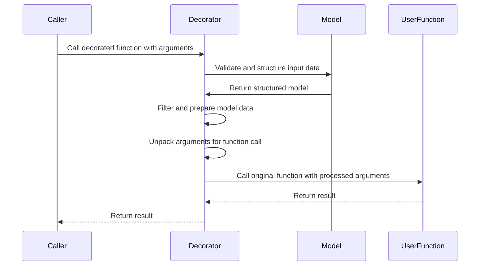
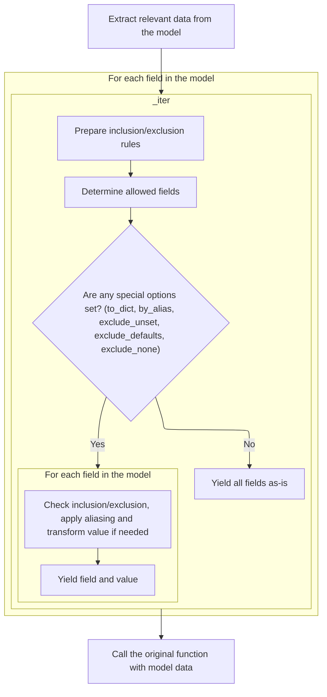
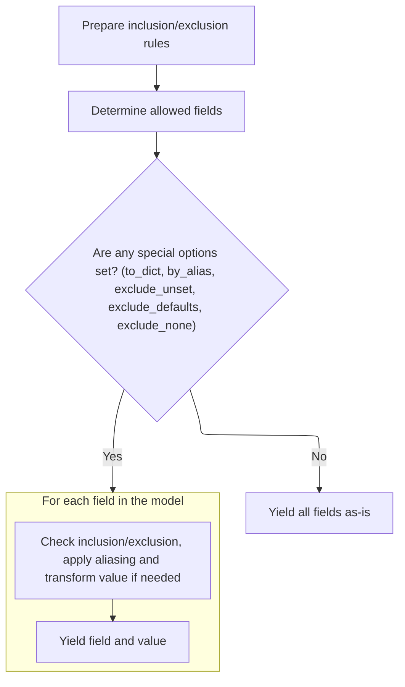
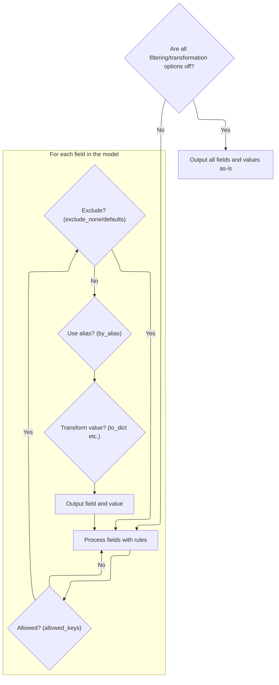

This document outlines the flow for processing calls to functions that have been decorated for automatic argument validation and transformation. When such a function is called, input arguments are validated and structured, filtered and prepared, then unpacked and passed to the original function in the correct format. The result of the original function is then returned to the caller.

The main steps are:

- Receive input arguments
- Validate and structure the data
- Filter and prepare the model data
- Unpack arguments for the function call
- Execute the original function and return the result



# Spec

## Detailed View of the Program's Functionality

a. Entry Point: Handling Decorated Calls

When a function is decorated for argument validation, the decorator wraps the original function with a new function. This wrapper simply forwards all positional and keyword arguments it receives to a validation handler. The handler is responsible for orchestrating the validation and function call process.

b. Model Instantiation and Validation

The validation handler's main entry point is a method that receives the original arguments. It first creates a data model instance by validating and packing the arguments into a structured model. This model instance represents the validated input. After instantiation, the handler proceeds to execute the original function, passing along the validated data.

c. Preparing Arguments for Function Execution

Before calling the user function, the handler needs to extract the relevant arguments from the validated model. This is done by iterating over the model's fields and collecting only those that were explicitly set or have a default factory. The extraction uses a generator that yields key-value pairs for each field, applying any necessary inclusion or exclusion rules.

d. Filtering Model Fields

The extraction process involves a sophisticated filtering mechanism. It merges any inclusion or exclusion rules specified by the model or the caller. Then, it determines which fields should be included in the output by calculating the allowed keys. If no special filtering or transformation options are set, all fields are yielded as-is for efficiency. Otherwise, each field is checked against the allowed keys, and additional rules are applied:

- If a field is not allowed or should be excluded (<SwmToken path="pydantic/v1/main.py" pos="295:16:18" line-data="        # for attributes not in `new_namespace` (e.g. private attributes)">`e.g`</SwmToken>., because its value is None and exclusion of None is enabled), it is skipped.
- If exclusion of default values is enabled, fields with default values are skipped.
- If aliasing is requested, the field's alias is used as the key.
- If further transformation is needed (such as converting nested models or applying recursive filtering), a value transformation function is called.

e. Iterating and Filtering Model Data

For each field that passes the filtering checks, the value transformation function is invoked if necessary. This function handles recursive conversion and filtering for nested models, dictionaries, and sequences. It also supports options like converting enums to their values or returning the value as-is if no further processing is needed.

f. Recursively Filtering and Converting Values

The value transformation function works as follows:

- If the value is itself a data model and dictionary conversion is requested, it is converted to a dictionary with all relevant filtering options applied. If the model represents a "root" value, that value is returned directly.
- If dictionary conversion is not requested, a filtered copy of the model is returned.
- If the value is a dictionary, each key-value pair is recursively processed and filtered.
- If the value is a sequence (like a list or tuple), each element is recursively processed and filtered.
- If the value is an enum and enum value conversion is enabled, the enum's value is returned.
- Otherwise, the value is returned as-is.

g. Yielding Filtered Model Data

After processing, the filtered and possibly transformed key-value pairs are yielded by the generator. These pairs represent the final set of arguments that will be used to call the original function.

h. Unpacking and Passing Arguments to the User Function

With the filtered arguments prepared, the handler unpacks them according to the original function's signature:

- If a special marker for variable positional arguments is present, the handler separates positional and keyword arguments, reconstructing the original \*args and \*\*kwargs structure.
- If there are <SwmToken path="pydantic/v1/decorator.py" pos="250:7:9" line-data="                raise TypeError(f&#39;positional-only argument{plural} passed as keyword argument{plural}: {keys}&#39;)">`positional-only`</SwmToken> arguments, the handler separates those from keyword arguments.
- Otherwise, all arguments are treated as keyword arguments.

Finally, the original function is called with the reconstructed arguments, and its return value is passed back to the caller. This ensures that the function receives validated and properly structured input, regardless of how the user originally called it.

# Rule Definition

| Paragraph Name                                                                                                                                                                                                                                                                                         | Rule ID | Category          | Description                                                                                                                                                                                                                                                                                                                                                                                       | Conditions                                                    | Remarks                                                   |
| ------------------------------------------------------------------------------------------------------------------------------------------------------------------------------------------------------------------------------------------------------------------------------------------------------ | ------- | ----------------- | ------------------------------------------------------------------------------------------------------------------------------------------------------------------------------------------------------------------------------------------------------------------------------------------------------------------------------------------------------------------------------------------------- | ------------------------------------------------------------- | --------------------------------------------------------- |
| <SwmToken path="pydantic/v1/decorator.py" pos="11:6:6" line-data="__all__ = (&#39;validate_arguments&#39;,)">`validate_arguments`</SwmToken>, <SwmToken path="pydantic/v1/decorator.py" pos="36:5:5" line-data="        vd = ValidatedFunction(_func, config)">`ValidatedFunction`</SwmToken>.**init** | RL-001  | Conditional Logic | The decorator must be able to wrap any user function, regardless of its signature, including positional arguments, keyword arguments, <SwmToken path="pydantic/v1/decorator.py" pos="250:7:9" line-data="                raise TypeError(f&#39;positional-only argument{plural} passed as keyword argument{plural}: {keys}&#39;)">`positional-only`</SwmToken> arguments, \*args, and \*\*kwargs. | A function is passed to the decorator.                        | No specific constants. Applies to any callable signature. |
| <SwmToken path="pydantic/v1/decorator.py" pos="36:5:5" line-data="        vd = ValidatedFunction(_func, config)">`ValidatedFunction`</SwmToken>.**init**, ValidatedFunction.create_model                                                                                                               | RL-002  | Data Assignment   | A model is dynamically generated with fields corresponding to each parameter in the function’s signature. Each named parameter becomes a required or optional field based on whether it has a default value. The type of each field matches the type annotation. \*args and \*\*kwargs are handled as tuple and dict fields, respectively.                                                        | A function is being decorated and its signature is available. | Fields:                                                   |

- Named parameters: required if no default, optional if default present.
- \*args: tuple of the annotated type.
- \*\*kwargs: dict with string keys and annotated value type.
- Field types match type annotations.
- Field names must not clash with reserved names (<SwmToken path="pydantic/v1/main.py" pos="295:16:18" line-data="        # for attributes not in `new_namespace` (e.g. private attributes)">`e.g`</SwmToken>., <SwmToken path="pydantic/v1/decorator.py" pos="54:5:5" line-data="ALT_V_ARGS = &#39;v__args&#39;">`v__args`</SwmToken>, <SwmToken path="pydantic/v1/decorator.py" pos="55:5:5" line-data="ALT_V_KWARGS = &#39;v__kwargs&#39;">`v__kwargs`</SwmToken>). | | ValidatedFunction.call, ValidatedFunction.init_model_instance, ValidatedFunction.build_values, ValidatedFunction.create_model (validators), <SwmToken path="pydantic/v1/decorator.py" pos="179:11:11" line-data="    def execute(self, m: BaseModel) -&gt; Any:">`BaseModel`</SwmToken>.**init**, <SwmToken path="pydantic/v1/main.py" pos="92:15:15" line-data="__all__ = &#39;BaseModel&#39;, &#39;create_model&#39;, &#39;validate_model&#39;">`validate_model`</SwmToken> | RL-003 | Conditional Logic | All input arguments are validated against the generated model’s field types and required/optional status. If validation fails (wrong type, missing required argument, etc.), a validation error is raised and the user function is not called. | Arguments are passed to the decorated function. | Validation errors are raised as exceptions. No output is produced from the user function if validation fails. | | ValidatedFunction.execute | RL-004 | Computation | After validation, the validated data is extracted from the model instance and arguments are reconstructed for the original function. Positional arguments are ordered, \*args and \*\*kwargs are unpacked, and keyword arguments include defaults as needed. Only fields set by the caller or with defaults are included. | Validation has succeeded and the model instance is available. | Arguments are reconstructed to match the original function signature. Only set or defaulted fields are included. | | <SwmToken path="pydantic/v1/main.py" pos="383:26:28" line-data="                # - keep other values (e.g. submodels) untouched (using `BaseModel.dict()` will change them into dicts)">`BaseModel.dict`</SwmToken>, BaseModel.\_iter, BaseModel.\_get_value | RL-005 | Computation | The system supports filtering and transformation of model fields when serializing or iterating. Include/exclude rules, aliasing, and special options (<SwmToken path="pydantic/v1/main.py" pos="738:1:1" line-data="        to_dict: bool,">`to_dict`</SwmToken>, <SwmToken path="pydantic/v1/main.py" pos="739:1:1" line-data="        by_alias: bool,">`by_alias`</SwmToken>, <SwmToken path="pydantic/v1/main.py" pos="742:1:1" line-data="        exclude_unset: bool,">`exclude_unset`</SwmToken>, <SwmToken path="pydantic/v1/main.py" pos="743:1:1" line-data="        exclude_defaults: bool,">`exclude_defaults`</SwmToken>, <SwmToken path="pydantic/v1/main.py" pos="744:1:1" line-data="        exclude_none: bool,">`exclude_none`</SwmToken>) are supported. Nested models, dicts, and sequences are handled recursively. Enum values are used if <SwmToken path="pydantic/v1/main.py" pos="801:21:21" line-data="        elif isinstance(v, Enum) and getattr(cls.Config, &#39;use_enum_values&#39;, False):">`use_enum_values`</SwmToken> is set. | Model is being serialized or iterated, with or without options. | Output is a dictionary or sequence. Field names may be aliased. Filtering and transformation options control which fields and values are included. Nested structures are processed recursively. Enum values are replaced with their .value if configured. | | <SwmToken path="pydantic/v1/decorator.py" pos="11:6:6" line-data="__all__ = (&#39;validate_arguments&#39;,)">`validate_arguments`</SwmToken>, ValidatedFunction.call, ValidatedFunction.execute | RL-006 | Conditional Logic | The system must not perform any side effects other than argument validation and calling the user function with validated arguments. If validation fails, the user function is not called. | Any time the decorator or wrapper is invoked. | No logging, mutation, or external effects except validation and function invocation. |

# User Stories

## User Story 1: Decorate, validate, reconstruct, and invoke any user function signature without side effects

---

### Story Description:

As a user, I want to decorate any function, have its arguments validated according to their types and required/optional status, and ensure that only validated arguments are reconstructed and passed to the original function, with no side effects except validation and invocation, so that my function is called safely and correctly or fails fast with clear errors.

---

### Business Rule Mapping:

| Rule ID | Paragraph Name                                                                                                                                                                                                                                                                                                                                                                                                                                                                | Rule Description                                                                                                                                                                                                                                                                                                                                                                                  |
| ------- | ----------------------------------------------------------------------------------------------------------------------------------------------------------------------------------------------------------------------------------------------------------------------------------------------------------------------------------------------------------------------------------------------------------------------------------------------------------------------------- | ------------------------------------------------------------------------------------------------------------------------------------------------------------------------------------------------------------------------------------------------------------------------------------------------------------------------------------------------------------------------------------------------- |
| RL-001  | <SwmToken path="pydantic/v1/decorator.py" pos="11:6:6" line-data="__all__ = (&#39;validate_arguments&#39;,)">`validate_arguments`</SwmToken>, <SwmToken path="pydantic/v1/decorator.py" pos="36:5:5" line-data="        vd = ValidatedFunction(_func, config)">`ValidatedFunction`</SwmToken>.**init**                                                                                                                                                                        | The decorator must be able to wrap any user function, regardless of its signature, including positional arguments, keyword arguments, <SwmToken path="pydantic/v1/decorator.py" pos="250:7:9" line-data="                raise TypeError(f&#39;positional-only argument{plural} passed as keyword argument{plural}: {keys}&#39;)">`positional-only`</SwmToken> arguments, \*args, and \*\*kwargs. |
| RL-006  | <SwmToken path="pydantic/v1/decorator.py" pos="11:6:6" line-data="__all__ = (&#39;validate_arguments&#39;,)">`validate_arguments`</SwmToken>, ValidatedFunction.call, ValidatedFunction.execute                                                                                                                                                                                                                                                                               | The system must not perform any side effects other than argument validation and calling the user function with validated arguments. If validation fails, the user function is not called.                                                                                                                                                                                                         |
| RL-002  | <SwmToken path="pydantic/v1/decorator.py" pos="36:5:5" line-data="        vd = ValidatedFunction(_func, config)">`ValidatedFunction`</SwmToken>.**init**, ValidatedFunction.create_model                                                                                                                                                                                                                                                                                      | A model is dynamically generated with fields corresponding to each parameter in the function’s signature. Each named parameter becomes a required or optional field based on whether it has a default value. The type of each field matches the type annotation. \*args and \*\*kwargs are handled as tuple and dict fields, respectively.                                                        |
| RL-003  | ValidatedFunction.call, ValidatedFunction.init_model_instance, ValidatedFunction.build_values, ValidatedFunction.create_model (validators), <SwmToken path="pydantic/v1/decorator.py" pos="179:11:11" line-data="    def execute(self, m: BaseModel) -&gt; Any:">`BaseModel`</SwmToken>.**init**, <SwmToken path="pydantic/v1/main.py" pos="92:15:15" line-data="__all__ = &#39;BaseModel&#39;, &#39;create_model&#39;, &#39;validate_model&#39;">`validate_model`</SwmToken> | All input arguments are validated against the generated model’s field types and required/optional status. If validation fails (wrong type, missing required argument, etc.), a validation error is raised and the user function is not called.                                                                                                                                                    |
| RL-004  | ValidatedFunction.execute                                                                                                                                                                                                                                                                                                                                                                                                                                                     | After validation, the validated data is extracted from the model instance and arguments are reconstructed for the original function. Positional arguments are ordered, \*args and \*\*kwargs are unpacked, and keyword arguments include defaults as needed. Only fields set by the caller or with defaults are included.                                                                         |

---

### Relevant Functionality:

- <SwmToken path="pydantic/v1/decorator.py" pos="11:6:6" line-data="__all__ = (&#39;validate_arguments&#39;,)">`validate_arguments`</SwmToken>
  1. **RL-001:**
     - When a function is decorated:
       - Inspect the function's signature.
       - Identify all parameter types (positional, keyword, <SwmToken path="pydantic/v1/decorator.py" pos="250:7:9" line-data="                raise TypeError(f&#39;positional-only argument{plural} passed as keyword argument{plural}: {keys}&#39;)">`positional-only`</SwmToken>, \*args, \*\*kwargs).
       - Prepare to generate a model with fields for each parameter.
  2. **RL-006:**
     - Only perform argument validation and, if successful, call the user function.
     - Do not perform any other actions or side effects.
- **ValidatedFunction.init**
  1. **RL-002:**
     - For each parameter in the function signature:
       - If <SwmToken path="pydantic/v1/decorator.py" pos="250:7:9" line-data="                raise TypeError(f&#39;positional-only argument{plural} passed as keyword argument{plural}: {keys}&#39;)">`positional-only`</SwmToken> or positional-or-keyword: add as a field with type and default.
       - If \*args: add a tuple field.
       - If \*\*kwargs: add a dict field.
       - If keyword-only: add as a field.
     - Ensure no reserved names are used as parameter names.
     - Create the model with these fields.
- **ValidatedFunction.call**
  1. **RL-003:**
     - When the wrapper function is called:
       - Build a dict of argument values from \*args and \*\*kwargs.
       - Instantiate the model with these values.
       - If instantiation raises a validation error, propagate the error and do not call the user function.
       - If validation succeeds, proceed to argument reconstruction.
- **ValidatedFunction.execute**
  1. **RL-004:**
     - Extract validated data from the model instance.
     - Reconstruct positional arguments in order.
     - Unpack \*args and \*\*kwargs from their respective fields.
     - Include keyword arguments with defaults if not provided.
     - Call the original function with these arguments.
     - Return the result.

## User Story 2: Generate models and serialize validated data with flexible transformation options

---

### Story Description:

As a user, I want models to be dynamically generated from function signatures and to be able to serialize or iterate over validated data with support for filtering, aliasing, and transformation options (including nested structures and enum handling), so that I can control the output format and content according to my needs.

---

### Business Rule Mapping:

| Rule ID | Paragraph Name                                                                                                                                                                                                                                                | Rule Description                                                                                                                                                                                                                                                                                                                                                                                                                                                                                                                                                                                                                                                                                                                                                                                                                                                                                                                                                                                                                                                  |
| ------- | ------------------------------------------------------------------------------------------------------------------------------------------------------------------------------------------------------------------------------------------------------------- | ----------------------------------------------------------------------------------------------------------------------------------------------------------------------------------------------------------------------------------------------------------------------------------------------------------------------------------------------------------------------------------------------------------------------------------------------------------------------------------------------------------------------------------------------------------------------------------------------------------------------------------------------------------------------------------------------------------------------------------------------------------------------------------------------------------------------------------------------------------------------------------------------------------------------------------------------------------------------------------------------------------------------------------------------------------------- |
| RL-002  | <SwmToken path="pydantic/v1/decorator.py" pos="36:5:5" line-data="        vd = ValidatedFunction(_func, config)">`ValidatedFunction`</SwmToken>.**init**, ValidatedFunction.create_model                                                                      | A model is dynamically generated with fields corresponding to each parameter in the function’s signature. Each named parameter becomes a required or optional field based on whether it has a default value. The type of each field matches the type annotation. \*args and \*\*kwargs are handled as tuple and dict fields, respectively.                                                                                                                                                                                                                                                                                                                                                                                                                                                                                                                                                                                                                                                                                                                        |
| RL-005  | <SwmToken path="pydantic/v1/main.py" pos="383:26:28" line-data="                # - keep other values (e.g. submodels) untouched (using `BaseModel.dict()` will change them into dicts)">`BaseModel.dict`</SwmToken>, BaseModel.\_iter, BaseModel.\_get_value | The system supports filtering and transformation of model fields when serializing or iterating. Include/exclude rules, aliasing, and special options (<SwmToken path="pydantic/v1/main.py" pos="738:1:1" line-data="        to_dict: bool,">`to_dict`</SwmToken>, <SwmToken path="pydantic/v1/main.py" pos="739:1:1" line-data="        by_alias: bool,">`by_alias`</SwmToken>, <SwmToken path="pydantic/v1/main.py" pos="742:1:1" line-data="        exclude_unset: bool,">`exclude_unset`</SwmToken>, <SwmToken path="pydantic/v1/main.py" pos="743:1:1" line-data="        exclude_defaults: bool,">`exclude_defaults`</SwmToken>, <SwmToken path="pydantic/v1/main.py" pos="744:1:1" line-data="        exclude_none: bool,">`exclude_none`</SwmToken>) are supported. Nested models, dicts, and sequences are handled recursively. Enum values are used if <SwmToken path="pydantic/v1/main.py" pos="801:21:21" line-data="        elif isinstance(v, Enum) and getattr(cls.Config, &#39;use_enum_values&#39;, False):">`use_enum_values`</SwmToken> is set. |

---

### Relevant Functionality:

- **ValidatedFunction.init**
  1. **RL-002:**
     - For each parameter in the function signature:
       - If <SwmToken path="pydantic/v1/decorator.py" pos="250:7:9" line-data="                raise TypeError(f&#39;positional-only argument{plural} passed as keyword argument{plural}: {keys}&#39;)">`positional-only`</SwmToken> or positional-or-keyword: add as a field with type and default.
       - If \*args: add a tuple field.
       - If \*\*kwargs: add a dict field.
       - If keyword-only: add as a field.
     - Ensure no reserved names are used as parameter names.
     - Create the model with these fields.
- <SwmToken path="pydantic/v1/main.py" pos="383:26:28" line-data="                # - keep other values (e.g. submodels) untouched (using `BaseModel.dict()` will change them into dicts)">`BaseModel.dict`</SwmToken>
  1. **RL-005:**
     - When serializing or iterating:
       - If no options, yield all fields and values as-is.
       - If options are set:
         - For each field, check include/exclude rules.
         - Apply aliasing if <SwmToken path="pydantic/v1/main.py" pos="739:1:1" line-data="        by_alias: bool,">`by_alias`</SwmToken> is set.
         - Exclude unset, default, or None fields as specified.
         - For nested models, dicts, or sequences, apply transformation recursively.
         - If a field is an enum and <SwmToken path="pydantic/v1/main.py" pos="801:21:21" line-data="        elif isinstance(v, Enum) and getattr(cls.Config, &#39;use_enum_values&#39;, False):">`use_enum_values`</SwmToken> is set, use the enum's value.

# Code Walkthrough

## Entry Point: Handling Decorated Calls

<SwmSnippet path="/pydantic/v1/decorator.py" line="39">

---

Wrapper_function just forwards everything to <SwmToken path="pydantic/v1/decorator.py" pos="40:3:5" line-data="            return vd.call(*args, **kwargs)">`vd.call`</SwmToken>, kicking off validation and argument handling.

```python
        def wrapper_function(*args: Any, **kwargs: Any) -> Any:
            return vd.call(*args, **kwargs)
```

---

</SwmSnippet>

## Model Instantiation and Validation

<SwmSnippet path="/pydantic/v1/decorator.py" line="132">

---

Call is where the input arguments are validated and packed into a <SwmToken path="pydantic/v1/decorator.py" pos="179:11:11" line-data="    def execute(self, m: BaseModel) -&gt; Any:">`BaseModel`</SwmToken> instance. After that, it hands off to execute, which is responsible for unpacking the validated data and actually calling the user function. We need to call execute next because that's where the arguments get extracted and the function is run.

```python
    def call(self, *args: Any, **kwargs: Any) -> Any:
        m = self.init_model_instance(*args, **kwargs)
        return self.execute(m)
```

---

</SwmSnippet>

## Preparing Arguments for Function Execution



<SwmSnippet path="/pydantic/v1/decorator.py" line="179">

---

In execute, we extract the relevant fields from the model instance m using a dict comprehension over <SwmToken path="pydantic/v1/decorator.py" pos="180:20:24" line-data="        d = {k: v for k, v in m._iter() if k in m.__fields_set__ or m.__fields__[k].default_factory}">`m._iter()`</SwmToken>. Only fields that were set or have a <SwmToken path="pydantic/v1/decorator.py" pos="180:45:45" line-data="        d = {k: v for k, v in m._iter() if k in m.__fields_set__ or m.__fields__[k].default_factory}">`default_factory`</SwmToken> are included. We call \_iter next to get all the key-value pairs from the model, applying any include/exclude logic as needed.

```python
    def execute(self, m: BaseModel) -> Any:
        d = {k: v for k, v in m._iter() if k in m.__fields_set__ or m.__fields__[k].default_factory}
```

---

</SwmSnippet>

### Filtering Model Fields



<SwmSnippet path="/pydantic/v1/main.py" line="828">

---

In \_iter, we merge any include/exclude filters from the model and the caller, then call <SwmToken path="pydantic/v1/main.py" pos="846:7:7" line-data="        allowed_keys = self._calculate_keys(">`_calculate_keys`</SwmToken> to figure out which fields should actually be included in the output. This sets up the filtering for the rest of the iteration.

```python
    def _iter(
        self,
        to_dict: bool = False,
        by_alias: bool = False,
        include: Optional[Union['AbstractSetIntStr', 'MappingIntStrAny']] = None,
        exclude: Optional[Union['AbstractSetIntStr', 'MappingIntStrAny']] = None,
        exclude_unset: bool = False,
        exclude_defaults: bool = False,
        exclude_none: bool = False,
    ) -> 'TupleGenerator':
        # Merge field set excludes with explicit exclude parameter with explicit overriding field set options.
        # The extra "is not None" guards are not logically necessary but optimizes performance for the simple case.
        if exclude is not None or self.__exclude_fields__ is not None:
            exclude = ValueItems.merge(self.__exclude_fields__, exclude)

        if include is not None or self.__include_fields__ is not None:
            include = ValueItems.merge(self.__include_fields__, include, intersect=True)

        allowed_keys = self._calculate_keys(
            include=include, exclude=exclude, exclude_unset=exclude_unset  # type: ignore
        )
```

---

</SwmSnippet>

#### Determining Allowed Model Keys

See document about <SwmToken path="pydantic/v1/main.py" pos="846:7:7" line-data="        allowed_keys = self._calculate_keys(">`_calculate_keys`</SwmToken>

#### Iterating and Filtering Model Data



<SwmSnippet path="/pydantic/v1/main.py" line="849">

---

After <SwmToken path="pydantic/v1/main.py" pos="846:7:7" line-data="        allowed_keys = self._calculate_keys(">`_calculate_keys`</SwmToken>, \_iter calls <SwmToken path="pydantic/v1/main.py" pos="872:7:7" line-data="                v = self._get_value(">`_get_value`</SwmToken> for each field to handle filtering and conversion.

```python
        if allowed_keys is None and not (to_dict or by_alias or exclude_unset or exclude_defaults or exclude_none):
            # huge boost for plain _iter()
            yield from self.__dict__.items()
            return

        value_exclude = ValueItems(self, exclude) if exclude is not None else None
        value_include = ValueItems(self, include) if include is not None else None

        for field_key, v in self.__dict__.items():
            if (allowed_keys is not None and field_key not in allowed_keys) or (exclude_none and v is None):
                continue

            if exclude_defaults:
                model_field = self.__fields__.get(field_key)
                if not getattr(model_field, 'required', True) and getattr(model_field, 'default', _missing) == v:
                    continue

            if by_alias and field_key in self.__fields__:
                dict_key = self.__fields__[field_key].alias
            else:
                dict_key = field_key

            if to_dict or value_include or value_exclude:
                v = self._get_value(
                    v,
                    to_dict=to_dict,
                    by_alias=by_alias,
                    include=value_include and value_include.for_element(field_key),
                    exclude=value_exclude and value_exclude.for_element(field_key),
                    exclude_unset=exclude_unset,
                    exclude_defaults=exclude_defaults,
                    exclude_none=exclude_none,
                )
```

---

</SwmSnippet>

#### Recursively Filtering and Converting Values

```mermaid
%%{init: {"flowchart": {"defaultRenderer": "elk"}} }%%
flowchart TD
    node1["Transform value for serialization"] --> node2{"Is it a Pydantic model?"}
    click node1 openCode "pydantic/v1/main.py:735:805"
    node2 -->|"Yes"| node3{"Convert to dict (to_dict=True) or copy (to_dict=False)?"}
    click node2 openCode "pydantic/v1/main.py:746:759"
    node3 -->|"to_dict=True"| node4["Transform model to dict (by_alias, exclude_unset, exclude_defaults, exclude_none)"]
    click node3 openCode "pydantic/v1/main.py:747:758"
    node3 -->|"to_dict=False"| node5["Copy model fields (include/exclude)"]
    click node5 openCode "pydantic/v1/main.py:759:760"
    node4 --> node16["Return transformed value"]
    node5 --> node16
    node2 -->|"No"| node7{"Is it a dictionary?"}
    click node7 openCode "pydantic/v1/main.py:765:781"
    node7 -->|"Yes"| loop1
    subgraph loop1["For each key-value in dictionary"]
      node8["Recursively transform value (include/exclude)"]
      click node8 openCode "pydantic/v1/main.py:767:780"
    end
    loop1 --> node16
    node7 -->|"No"| node10{"Is it a sequence?"}
    click node10 openCode "pydantic/v1/main.py:782:799"
    node10 -->|"Yes"| loop2
    subgraph loop2["For each element in sequence"]
      node11["Recursively transform element (include/exclude)"]
      click node11 openCode "pydantic/v1/main.py:784:797"
    end
    loop2 --> node16
    node10 -->|"No"| node13{"Is it an Enum and use_enum_values?"}
    click node13 openCode "pydantic/v1/main.py:801:802"
    node13 -->|"Yes"| node14["Return enum value"]
    click node14 openCode "pydantic/v1/main.py:802:802"
    node14 --> node16
    node13 -->|"No"| node15["Return value as-is"]
    click node15 openCode "pydantic/v1/main.py:804:805"
    node15 --> node16
    node16["Return transformed value"]
    click node16 openCode "pydantic/v1/main.py:758:805"

%% Swimm:
%% %%{init: {"flowchart": {"defaultRenderer": "elk"}} }%%
%% flowchart TD
%%     node1["Transform value for serialization"] --> node2{"Is it a Pydantic model?"}
%%     click node1 openCode "<SwmPath>[pydantic/v1/main.py](pydantic/v1/main.py)</SwmPath>:735:805"
%%     node2 -->|"Yes"| node3{"Convert to dict (<SwmToken path="pydantic/v1/main.py" pos="738:1:1" line-data="        to_dict: bool,">`to_dict`</SwmToken>=True) or copy (<SwmToken path="pydantic/v1/main.py" pos="738:1:1" line-data="        to_dict: bool,">`to_dict`</SwmToken>=False)?"}
%%     click node2 openCode "<SwmPath>[pydantic/v1/main.py](pydantic/v1/main.py)</SwmPath>:746:759"
%%     node3 -->|"<SwmToken path="pydantic/v1/main.py" pos="738:1:1" line-data="        to_dict: bool,">`to_dict`</SwmToken>=True"| node4["Transform model to dict (<SwmToken path="pydantic/v1/main.py" pos="739:1:1" line-data="        by_alias: bool,">`by_alias`</SwmToken>, <SwmToken path="pydantic/v1/main.py" pos="742:1:1" line-data="        exclude_unset: bool,">`exclude_unset`</SwmToken>, <SwmToken path="pydantic/v1/main.py" pos="743:1:1" line-data="        exclude_defaults: bool,">`exclude_defaults`</SwmToken>, <SwmToken path="pydantic/v1/main.py" pos="744:1:1" line-data="        exclude_none: bool,">`exclude_none`</SwmToken>)"]
%%     click node3 openCode "<SwmPath>[pydantic/v1/main.py](pydantic/v1/main.py)</SwmPath>:747:758"
%%     node3 -->|"<SwmToken path="pydantic/v1/main.py" pos="738:1:1" line-data="        to_dict: bool,">`to_dict`</SwmToken>=False"| node5["Copy model fields (include/exclude)"]
%%     click node5 openCode "<SwmPath>[pydantic/v1/main.py](pydantic/v1/main.py)</SwmPath>:759:760"
%%     node4 --> node16["Return transformed value"]
%%     node5 --> node16
%%     node2 -->|"No"| node7{"Is it a dictionary?"}
%%     click node7 openCode "<SwmPath>[pydantic/v1/main.py](pydantic/v1/main.py)</SwmPath>:765:781"
%%     node7 -->|"Yes"| loop1
%%     subgraph loop1["For each key-value in dictionary"]
%%       node8["Recursively transform value (include/exclude)"]
%%       click node8 openCode "<SwmPath>[pydantic/v1/main.py](pydantic/v1/main.py)</SwmPath>:767:780"
%%     end
%%     loop1 --> node16
%%     node7 -->|"No"| node10{"Is it a sequence?"}
%%     click node10 openCode "<SwmPath>[pydantic/v1/main.py](pydantic/v1/main.py)</SwmPath>:782:799"
%%     node10 -->|"Yes"| loop2
%%     subgraph loop2["For each element in sequence"]
%%       node11["Recursively transform element (include/exclude)"]
%%       click node11 openCode "<SwmPath>[pydantic/v1/main.py](pydantic/v1/main.py)</SwmPath>:784:797"
%%     end
%%     loop2 --> node16
%%     node10 -->|"No"| node13{"Is it an Enum and <SwmToken path="pydantic/v1/main.py" pos="801:21:21" line-data="        elif isinstance(v, Enum) and getattr(cls.Config, &#39;use_enum_values&#39;, False):">`use_enum_values`</SwmToken>?"}
%%     click node13 openCode "<SwmPath>[pydantic/v1/main.py](pydantic/v1/main.py)</SwmPath>:801:802"
%%     node13 -->|"Yes"| node14["Return enum value"]
%%     click node14 openCode "<SwmPath>[pydantic/v1/main.py](pydantic/v1/main.py)</SwmPath>:802:802"
%%     node14 --> node16
%%     node13 -->|"No"| node15["Return value as-is"]
%%     click node15 openCode "<SwmPath>[pydantic/v1/main.py](pydantic/v1/main.py)</SwmPath>:804:805"
%%     node15 --> node16
%%     node16["Return transformed value"]
%%     click node16 openCode "<SwmPath>[pydantic/v1/main.py](pydantic/v1/main.py)</SwmPath>:758:805"
```



<SwmSnippet path="/pydantic/v1/main.py" line="735">

---

In <SwmToken path="pydantic/v1/main.py" pos="735:3:3" line-data="    def _get_value(">`_get_value`</SwmToken>, if v is a <SwmToken path="pydantic/v1/main.py" pos="746:8:8" line-data="        if isinstance(v, BaseModel):">`BaseModel`</SwmToken> and <SwmToken path="pydantic/v1/main.py" pos="738:1:1" line-data="        to_dict: bool,">`to_dict`</SwmToken> is True, we call dict on it with all the filtering options. This gives us a filtered dictionary representation, and if <SwmToken path="pydantic/v1/main.py" pos="756:3:3" line-data="                if ROOT_KEY in v_dict:">`ROOT_KEY`</SwmToken> is present, we return its value directly. We call dict here to get a serializable, filtered version of the model.

```python
    def _get_value(
        cls,
        v: Any,
        to_dict: bool,
        by_alias: bool,
        include: Optional[Union['AbstractSetIntStr', 'MappingIntStrAny']],
        exclude: Optional[Union['AbstractSetIntStr', 'MappingIntStrAny']],
        exclude_unset: bool,
        exclude_defaults: bool,
        exclude_none: bool,
    ) -> Any:
        if isinstance(v, BaseModel):
            if to_dict:
                v_dict = v.dict(
                    by_alias=by_alias,
                    exclude_unset=exclude_unset,
                    exclude_defaults=exclude_defaults,
                    include=include,
                    exclude=exclude,
                    exclude_none=exclude_none,
                )
                if ROOT_KEY in v_dict:
                    return v_dict[ROOT_KEY]
                return v_dict
            else:
```

---

</SwmSnippet>

<SwmSnippet path="/pydantic/v1/main.py" line="760">

---

After returning from dict, if <SwmToken path="pydantic/v1/main.py" pos="738:1:1" line-data="        to_dict: bool,">`to_dict`</SwmToken> is False, <SwmToken path="pydantic/v1/main.py" pos="735:3:3" line-data="    def _get_value(">`_get_value`</SwmToken> returns a filtered copy of the model using include/exclude. This keeps the output as a model instance for cases where we don't want a dict.

```python
                return v.copy(include=include, exclude=exclude)

```

---

</SwmSnippet>

<SwmSnippet path="/pydantic/v1/main.py" line="762">

---

After copy, <SwmToken path="pydantic/v1/main.py" pos="767:6:6" line-data="                k_: cls._get_value(">`_get_value`</SwmToken> recurses into dicts and sequences, filtering and converting nested items as needed.

```python
        value_exclude = ValueItems(v, exclude) if exclude else None
        value_include = ValueItems(v, include) if include else None

        if isinstance(v, dict):
            return {
                k_: cls._get_value(
                    v_,
                    to_dict=to_dict,
                    by_alias=by_alias,
                    exclude_unset=exclude_unset,
                    exclude_defaults=exclude_defaults,
                    include=value_include and value_include.for_element(k_),
                    exclude=value_exclude and value_exclude.for_element(k_),
                    exclude_none=exclude_none,
                )
                for k_, v_ in v.items()
                if (not value_exclude or not value_exclude.is_excluded(k_))
                and (not value_include or value_include.is_included(k_))
            }

        elif sequence_like(v):
            seq_args = (
                cls._get_value(
                    v_,
                    to_dict=to_dict,
                    by_alias=by_alias,
                    exclude_unset=exclude_unset,
                    exclude_defaults=exclude_defaults,
                    include=value_include and value_include.for_element(i),
                    exclude=value_exclude and value_exclude.for_element(i),
                    exclude_none=exclude_none,
                )
                for i, v_ in enumerate(v)
                if (not value_exclude or not value_exclude.is_excluded(i))
                and (not value_include or value_include.is_included(i))
            )

            return v.__class__(*seq_args) if is_namedtuple(v.__class__) else v.__class__(seq_args)

        elif isinstance(v, Enum) and getattr(cls.Config, 'use_enum_values', False):
            return v.value

        else:
            return v
```

---

</SwmSnippet>

#### Yielding Filtered Model Data

<SwmSnippet path="/pydantic/v1/main.py" line="882">

---

After <SwmToken path="pydantic/v1/main.py" pos="735:3:3" line-data="    def _get_value(">`_get_value`</SwmToken> returns, \_iter yields the processed (<SwmToken path="pydantic/v1/main.py" pos="882:3:3" line-data="            yield dict_key, v">`dict_key`</SwmToken>, v) pairs. These are the filtered and converted field values that downstream code will use.

```python
            yield dict_key, v
```

---

</SwmSnippet>

### Unpacking and Passing Arguments to the User Function

```mermaid
%%{init: {"flowchart": {"defaultRenderer": "elk"}} }%%
flowchart TD
    node1["Start: Prepare to call function"] --> node2{"Is special positional marker present in input?"}
    click node1 openCode "pydantic/v1/decorator.py:181:182"
    click node2 openCode "pydantic/v1/decorator.py:183:186"
    node2 -->|"Yes (v_args_name)"| loop1
    node2 -->|"No"| node4{"Are positional-only arguments present?"}
    click node4 openCode "pydantic/v1/decorator.py:196:200"
    node4 -->|"Yes (positional_only_args)"| loop2
    node4 -->|"No"| node6["Organize all as keyword arguments"]
    click node6 openCode "pydantic/v1/decorator.py:206:206"

    subgraph loop1["For each input item: Separate positional and keyword arguments"]
      node3["Organize arguments by marker"]
      click node3 openCode "pydantic/v1/decorator.py:187:194"
    end
    
    subgraph loop2["For each input item: Separate positional-only and keyword arguments"]
      node5["Organize arguments by type"]
      click node5 openCode "pydantic/v1/decorator.py:199:203"
    end
    
    loop1 --> node7["Call target function"]
    loop2 --> node7
    node6 --> node7["Call target function"]
    click node7 openCode "pydantic/v1/decorator.py:195:206"

%% Swimm:
%% %%{init: {"flowchart": {"defaultRenderer": "elk"}} }%%
%% flowchart TD
%%     node1["Start: Prepare to call function"] --> node2{"Is special positional marker present in input?"}
%%     click node1 openCode "<SwmPath>[pydantic/v1/decorator.py](pydantic/v1/decorator.py)</SwmPath>:181:182"
%%     click node2 openCode "<SwmPath>[pydantic/v1/decorator.py](pydantic/v1/decorator.py)</SwmPath>:183:186"
%%     node2 -->|"Yes (<SwmToken path="pydantic/v1/decorator.py" pos="183:5:5" line-data="        if self.v_args_name in d:">`v_args_name`</SwmToken>)"| loop1
%%     node2 -->|"No"| node4{"Are <SwmToken path="pydantic/v1/decorator.py" pos="250:7:9" line-data="                raise TypeError(f&#39;positional-only argument{plural} passed as keyword argument{plural}: {keys}&#39;)">`positional-only`</SwmToken> arguments present?"}
%%     click node4 openCode "<SwmPath>[pydantic/v1/decorator.py](pydantic/v1/decorator.py)</SwmPath>:196:200"
%%     node4 -->|"Yes (<SwmToken path="pydantic/v1/decorator.py" pos="196:5:5" line-data="        elif self.positional_only_args:">`positional_only_args`</SwmToken>)"| loop2
%%     node4 -->|"No"| node6["Organize all as keyword arguments"]
%%     click node6 openCode "<SwmPath>[pydantic/v1/decorator.py](pydantic/v1/decorator.py)</SwmPath>:206:206"
%% 
%%     subgraph loop1["For each input item: Separate positional and keyword arguments"]
%%       node3["Organize arguments by marker"]
%%       click node3 openCode "<SwmPath>[pydantic/v1/decorator.py](pydantic/v1/decorator.py)</SwmPath>:187:194"
%%     end
%%     
%%     subgraph loop2["For each input item: Separate <SwmToken path="pydantic/v1/decorator.py" pos="250:7:9" line-data="                raise TypeError(f&#39;positional-only argument{plural} passed as keyword argument{plural}: {keys}&#39;)">`positional-only`</SwmToken> and keyword arguments"]
%%       node5["Organize arguments by type"]
%%       click node5 openCode "<SwmPath>[pydantic/v1/decorator.py](pydantic/v1/decorator.py)</SwmPath>:199:203"
%%     end
%%     
%%     loop1 --> node7["Call target function"]
%%     loop2 --> node7
%%     node6 --> node7["Call target function"]
%%     click node7 openCode "<SwmPath>[pydantic/v1/decorator.py](pydantic/v1/decorator.py)</SwmPath>:195:206"
```



<SwmSnippet path="/pydantic/v1/decorator.py" line="181">

---

After getting the filtered dict d from \_iter, execute pops out any variable keyword arguments, then checks if <SwmToken path="pydantic/v1/decorator.py" pos="183:5:5" line-data="        if self.v_args_name in d:">`v_args_name`</SwmToken> is present. If so, it unpacks positional and keyword arguments using a flag to switch modes, matching the original function's signature. This is how \*args and \*\*kwargs are reconstructed from the model data.

```python
        var_kwargs = d.pop(self.v_kwargs_name, {})

        if self.v_args_name in d:
            args_: List[Any] = []
            in_kwargs = False
            kwargs = {}
            for name, value in d.items():
                if in_kwargs:
                    kwargs[name] = value
                elif name == self.v_args_name:
                    args_ += value
                    in_kwargs = True
                else:
                    args_.append(value)
```

---

</SwmSnippet>

<SwmSnippet path="/pydantic/v1/decorator.py" line="194">

---

This loop in execute uses a flag to switch from collecting positional to keyword arguments after <SwmToken path="pydantic/v1/decorator.py" pos="183:5:5" line-data="        if self.v_args_name in d:">`v_args_name`</SwmToken> is found. This way, everything before <SwmToken path="pydantic/v1/decorator.py" pos="183:5:5" line-data="        if self.v_args_name in d:">`v_args_name`</SwmToken> is positional, <SwmToken path="pydantic/v1/decorator.py" pos="183:5:5" line-data="        if self.v_args_name in d:">`v_args_name`</SwmToken> itself is unpacked, and the rest are keyword arguments. This sets up the call to the raw function with the right argument structure.

```python
                    args_.append(value)
            return self.raw_function(*args_, **kwargs, **var_kwargs)
        elif self.positional_only_args:
            args_ = []
            kwargs = {}
            for name, value in d.items():
                if name in self.positional_only_args:
                    args_.append(value)
                else:
                    kwargs[name] = value
```

---

</SwmSnippet>

<SwmSnippet path="/pydantic/v1/decorator.py" line="203">

---

At the end of execute, we call the original function with the unpacked arguments—either as positional, keyword, or both, depending on the function's signature and the model data. The return value is whatever the original function returns.

```python
                    kwargs[name] = value
            return self.raw_function(*args_, **kwargs, **var_kwargs)
        else:
            return self.raw_function(**d, **var_kwargs)
```

---

</SwmSnippet>

&nbsp;

*This is an auto-generated document by Swimm 🌊 and has not yet been verified by a human*

<SwmMeta version="3.0.0" repo-id="Z2l0aHViJTNBJTNBcHlkYW50aWMlM0ElM0FTd2ltbS1EZW1v" repo-name="pydantic"><sup>Powered by [Swimm](/)</sup></SwmMeta>
